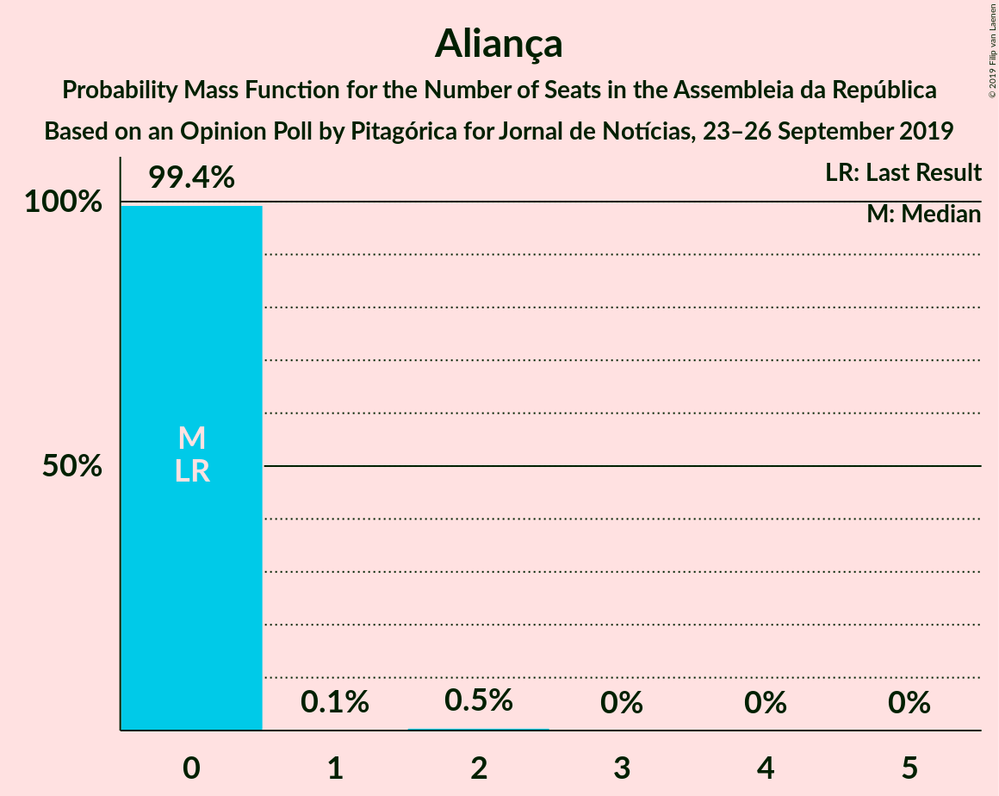
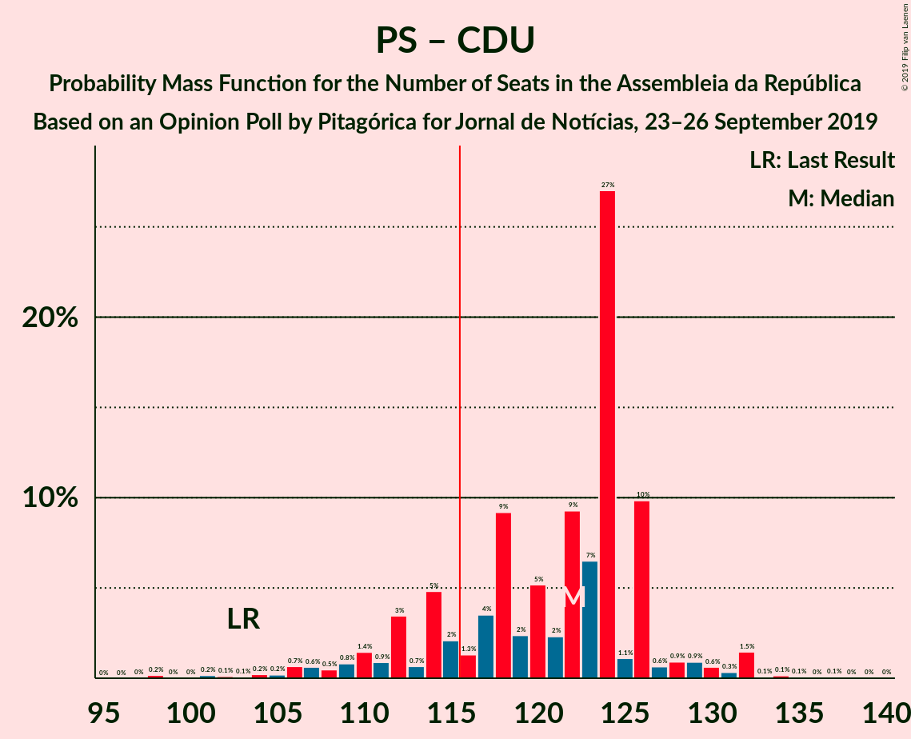

# Opinion Poll by Pitagórica for Jornal de Notícias, 23–26 September 2019

<a href="#voting-intentions">Voting Intentions</a> | <a href="#seats">Seats</a> | <a href="#coalitions">Coalitions</a> | <a href="#technical-information">Technical Information</a>

## Voting Intentions

### Confidence Intervals

| Party | Last Result | Poll Result | 80% Confidence Interval | 90% Confidence Interval | 95% Confidence Interval | 99% Confidence Interval |
|:-----:|:-----------:|:-----------:|:-----------------------:|:-----------------------:|:-----------------------:|:-----------------------:|
| Partido Socialista | 32.3% | 37.8% | 35.3–40.4% |34.6–41.2% |34.0–41.8% |32.9–43.0% |
| Partido Social Democrata | 36.9% | 26.7% | 24.4–29.1% |23.8–29.8% |23.3–30.4% |22.3–31.5% |
| Bloco de Esquerda | 10.2% | 10.2% | 8.7–11.9% |8.3–12.4% |8.0–12.8% |7.4–13.7% |
| Coligação Democrática Unitária | 8.2% | 5.2% | 4.2–6.5% |3.9–6.9% |3.7–7.3% |3.2–8.0% |
| CDS–Partido Popular | 36.9% | 4.0% | 3.1–5.2% |2.9–5.6% |2.7–5.9% |2.3–6.5% |
| Pessoas–Animais–Natureza | 1.4% | 3.7% | 2.9–4.9% |2.6–5.2% |2.4–5.5% |2.1–6.1% |
| Aliança | 0.0% | 0.7% | 0.4–1.3% |0.3–1.5% |0.3–1.7% |0.2–2.1% |

*Note:* The poll result column reflects the actual value used in the calculations. Published results may vary slightly, and in addition be rounded to fewer digits.

## Seats

### Confidence Intervals

| Party | Last Result | Median | 80% Confidence Interval | 90% Confidence Interval | 95% Confidence Interval | 99% Confidence Interval |
|:-----:|:-----------:|:------:|:-----------------------:|:-----------------------:|:-----------------------:|:-----------------------:|
| <a href="#partido-socialista">Partido Socialista</a> | 86 | 111 | 104–119 |102–122 |100–124 |96–129 |
| <a href="#partido-social-democrata">Partido Social Democrata</a> | 89 | 78 | 71–85 |69–88 |67–89 |62–94 |
| <a href="#bloco-de-esquerda">Bloco de Esquerda</a> | 19 | 23 | 18–26 |17–27 |16–28 |14–31 |
| <a href="#coligação-democrática-unitária">Coligação Democrática Unitária</a> | 17 | 8 | 5–13 |5–13 |5–14 |4–17 |
| <a href="#cds–partido-popular">CDS–Partido Popular</a> | 18 | 5 | 2–7 |2–8 |2–9 |2–10 |
| <a href="#pessoas–animais–natureza">Pessoas–Animais–Natureza</a> | 1 | 4 | 3–6 |3–7 |2–8 |2–9 |
| <a href="#aliança">Aliança</a> | 0 | 0 | 0 |0 |0 |0–1 |

### Partido Socialista

*For a full overview of the results for this party, see the [Partido Socialista](party-partidosocialista.html) page.*

| Number of Seats | Probability | Accumulated | Special Marks |
|:---------------:|:-----------:|:-----------:|:-------------:|
| 86 | 0% | 100% | Last Result |
| 87 | 0% | 100% |  |
| 88 | 0% | 100% |  |
| 89 | 0% | 100% |  |
| 90 | 0% | 100% |  |
| 91 | 0% | 100% |  |
| 92 | 0.1% | 99.9% |  |
| 93 | 0% | 99.9% |  |
| 94 | 0.1% | 99.8% |  |
| 95 | 0.1% | 99.8% |  |
| 96 | 0.2% | 99.6% |  |
| 97 | 0.2% | 99.5% |  |
| 98 | 0.3% | 99.3% |  |
| 99 | 0.8% | 98.9% |  |
| 100 | 0.8% | 98% |  |
| 101 | 2% | 97% |  |
| 102 | 2% | 96% |  |
| 103 | 2% | 94% |  |
| 104 | 3% | 92% |  |
| 105 | 3% | 89% |  |
| 106 | 3% | 86% |  |
| 107 | 4% | 84% |  |
| 108 | 5% | 80% |  |
| 109 | 7% | 75% |  |
| 110 | 7% | 68% |  |
| 111 | 14% | 61% | Median |
| 112 | 6% | 47% |  |
| 113 | 6% | 41% |  |
| 114 | 10% | 35% |  |
| 115 | 5% | 26% |  |
| 116 | 4% | 21% | Majority |
| 117 | 3% | 17% |  |
| 118 | 2% | 13% |  |
| 119 | 2% | 11% |  |
| 120 | 2% | 9% |  |
| 121 | 2% | 7% |  |
| 122 | 1.2% | 6% |  |
| 123 | 0.8% | 5% |  |
| 124 | 2% | 4% |  |
| 125 | 0.4% | 2% |  |
| 126 | 0.5% | 2% |  |
| 127 | 0.5% | 1.3% |  |
| 128 | 0.3% | 0.9% |  |
| 129 | 0.2% | 0.6% |  |
| 130 | 0.1% | 0.4% |  |
| 131 | 0.1% | 0.2% |  |
| 132 | 0% | 0.1% |  |
| 133 | 0% | 0.1% |  |
| 134 | 0% | 0% |  |

### Partido Social Democrata

*For a full overview of the results for this party, see the [Partido Social Democrata](party-partidosocialdemocrata.html) page.*

| Number of Seats | Probability | Accumulated | Special Marks |
|:---------------:|:-----------:|:-----------:|:-------------:|
| 59 | 0% | 100% |  |
| 60 | 0.1% | 99.9% |  |
| 61 | 0.1% | 99.8% |  |
| 62 | 0.2% | 99.7% |  |
| 63 | 0.3% | 99.5% |  |
| 64 | 0.2% | 99.2% |  |
| 65 | 0.6% | 99.0% |  |
| 66 | 0.5% | 98% |  |
| 67 | 1.2% | 98% |  |
| 68 | 1.3% | 97% |  |
| 69 | 1.5% | 95% |  |
| 70 | 3% | 94% |  |
| 71 | 4% | 91% |  |
| 72 | 3% | 87% |  |
| 73 | 3% | 83% |  |
| 74 | 5% | 81% |  |
| 75 | 5% | 76% |  |
| 76 | 6% | 71% |  |
| 77 | 7% | 65% |  |
| 78 | 9% | 58% | Median |
| 79 | 7% | 49% |  |
| 80 | 8% | 42% |  |
| 81 | 8% | 35% |  |
| 82 | 6% | 27% |  |
| 83 | 5% | 21% |  |
| 84 | 5% | 16% |  |
| 85 | 3% | 11% |  |
| 86 | 2% | 9% |  |
| 87 | 1.2% | 6% |  |
| 88 | 2% | 5% |  |
| 89 | 1.0% | 3% | Last Result |
| 90 | 0.8% | 2% |  |
| 91 | 0.4% | 1.5% |  |
| 92 | 0.3% | 1.1% |  |
| 93 | 0.2% | 0.8% |  |
| 94 | 0.2% | 0.6% |  |
| 95 | 0.1% | 0.4% |  |
| 96 | 0.1% | 0.3% |  |
| 97 | 0.1% | 0.2% |  |
| 98 | 0% | 0% |  |

### Bloco de Esquerda

*For a full overview of the results for this party, see the [Bloco de Esquerda](party-blocodeesquerda.html) page.*

| Number of Seats | Probability | Accumulated | Special Marks |
|:---------------:|:-----------:|:-----------:|:-------------:|
| 12 | 0% | 100% |  |
| 13 | 0.1% | 99.9% |  |
| 14 | 0.5% | 99.9% |  |
| 15 | 0.9% | 99.3% |  |
| 16 | 1.0% | 98% |  |
| 17 | 4% | 97% |  |
| 18 | 14% | 94% |  |
| 19 | 9% | 80% | Last Result |
| 20 | 6% | 71% |  |
| 21 | 7% | 65% |  |
| 22 | 4% | 58% |  |
| 23 | 12% | 54% | Median |
| 24 | 16% | 42% |  |
| 25 | 14% | 26% |  |
| 26 | 2% | 11% |  |
| 27 | 6% | 10% |  |
| 28 | 2% | 3% |  |
| 29 | 0.6% | 1.4% |  |
| 30 | 0.2% | 0.8% |  |
| 31 | 0.1% | 0.6% |  |
| 32 | 0.1% | 0.4% |  |
| 33 | 0.1% | 0.3% |  |
| 34 | 0.1% | 0.3% |  |
| 35 | 0.1% | 0.1% |  |
| 36 | 0% | 0.1% |  |
| 37 | 0% | 0% |  |

### Coligação Democrática Unitária

*For a full overview of the results for this party, see the [Coligação Democrática Unitária](party-coligaçãodemocráticaunitária.html) page.*

| Number of Seats | Probability | Accumulated | Special Marks |
|:---------------:|:-----------:|:-----------:|:-------------:|
| 3 | 0.1% | 100% |  |
| 4 | 2% | 99.8% |  |
| 5 | 16% | 98% |  |
| 6 | 16% | 82% |  |
| 7 | 10% | 66% |  |
| 8 | 18% | 56% | Median |
| 9 | 14% | 38% |  |
| 10 | 6% | 24% |  |
| 11 | 4% | 18% |  |
| 12 | 3% | 14% |  |
| 13 | 6% | 10% |  |
| 14 | 3% | 5% |  |
| 15 | 0.2% | 1.2% |  |
| 16 | 0.5% | 1.0% |  |
| 17 | 0.4% | 0.5% | Last Result |
| 18 | 0.1% | 0.1% |  |
| 19 | 0% | 0% |  |

### CDS–Partido Popular

*For a full overview of the results for this party, see the [CDS–Partido Popular](party-cds–partidopopular.html) page.*

| Number of Seats | Probability | Accumulated | Special Marks |
|:---------------:|:-----------:|:-----------:|:-------------:|
| 2 | 13% | 100% |  |
| 3 | 12% | 87% |  |
| 4 | 18% | 74% |  |
| 5 | 9% | 56% | Median |
| 6 | 31% | 47% |  |
| 7 | 6% | 16% |  |
| 8 | 6% | 10% |  |
| 9 | 2% | 4% |  |
| 10 | 1.1% | 2% |  |
| 11 | 0.3% | 0.5% |  |
| 12 | 0.1% | 0.2% |  |
| 13 | 0% | 0.1% |  |
| 14 | 0% | 0% |  |
| 15 | 0% | 0% |  |
| 16 | 0% | 0% |  |
| 17 | 0% | 0% |  |
| 18 | 0% | 0% | Last Result |

### Pessoas–Animais–Natureza

*For a full overview of the results for this party, see the [Pessoas–Animais–Natureza](party-pessoas–animais–natureza.html) page.*

| Number of Seats | Probability | Accumulated | Special Marks |
|:---------------:|:-----------:|:-----------:|:-------------:|
| 1 | 0.1% | 100% | Last Result |
| 2 | 4% | 99.9% |  |
| 3 | 11% | 96% |  |
| 4 | 37% | 85% | Median |
| 5 | 3% | 48% |  |
| 6 | 38% | 45% |  |
| 7 | 1.5% | 6% |  |
| 8 | 3% | 5% |  |
| 9 | 1.3% | 2% |  |
| 10 | 0.2% | 0.5% |  |
| 11 | 0.1% | 0.2% |  |
| 12 | 0.1% | 0.2% |  |
| 13 | 0.1% | 0.1% |  |
| 14 | 0% | 0% |  |

### Aliança

*For a full overview of the results for this party, see the [Aliança](party-aliança.html) page.*

| Number of Seats | Probability | Accumulated | Special Marks |
|:---------------:|:-----------:|:-----------:|:-------------:|
| 0 | 99.3% | 100% | Last Result, Median |
| 1 | 0.3% | 0.7% |  |
| 2 | 0.4% | 0.4% |  |
| 3 | 0% | 0% |  |

## Coalitions

### Confidence Intervals

| Coalition | Last Result | Median | Majority? | 80% Confidence Interval | 90% Confidence Interval | 95% Confidence Interval | 99% Confidence Interval |
|:---------:|:-----------:|:------:|:---------:|:-----------------------:|:-----------------------:|:-----------------------:|:-----------------------:|
| Partido Socialista – Bloco de Esquerda – Coligação Democrática Unitária | 122 | 142 | 100% | 135–149 | 133–152 | 131–154 | 126–158 |
| Partido Socialista – Bloco de Esquerda | 105 | 134 | 99.8% | 127–141 | 124–144 | 123–146 | 118–150 |
| Partido Socialista – Coligação Democrática Unitária | 103 | 120 | 82% | 112–127 | 110–130 | 108–132 | 104–136 |
| Partido Socialista | 86 | 111 | 21% | 104–119 | 102–122 | 100–124 | 96–129 |
| Partido Social Democrata – CDS–Partido Popular | 107 | 83 | 0% | 76–90 | 74–92 | 71–94 | 67–99 |

### Partido Socialista – Bloco de Esquerda – Coligação Democrática Unitária

| Number of Seats | Probability | Accumulated | Special Marks |
|:---------------:|:-----------:|:-----------:|:-------------:|
| 122 | 0% | 100% | Last Result |
| 123 | 0.1% | 99.9% |  |
| 124 | 0.1% | 99.8% |  |
| 125 | 0.1% | 99.7% |  |
| 126 | 0.2% | 99.6% |  |
| 127 | 0.2% | 99.3% |  |
| 128 | 0.3% | 99.1% |  |
| 129 | 0.5% | 98.8% |  |
| 130 | 0.7% | 98% |  |
| 131 | 1.1% | 98% |  |
| 132 | 1.5% | 97% |  |
| 133 | 2% | 95% |  |
| 134 | 2% | 93% |  |
| 135 | 3% | 91% |  |
| 136 | 3% | 88% |  |
| 137 | 6% | 85% |  |
| 138 | 7% | 79% |  |
| 139 | 5% | 72% |  |
| 140 | 8% | 67% |  |
| 141 | 7% | 59% |  |
| 142 | 6% | 52% | Median |
| 143 | 9% | 46% |  |
| 144 | 5% | 37% |  |
| 145 | 7% | 32% |  |
| 146 | 7% | 25% |  |
| 147 | 3% | 18% |  |
| 148 | 3% | 15% |  |
| 149 | 3% | 12% |  |
| 150 | 2% | 9% |  |
| 151 | 2% | 7% |  |
| 152 | 0.9% | 5% |  |
| 153 | 1.3% | 4% |  |
| 154 | 0.8% | 3% |  |
| 155 | 0.7% | 2% |  |
| 156 | 0.5% | 1.5% |  |
| 157 | 0.3% | 1.0% |  |
| 158 | 0.2% | 0.6% |  |
| 159 | 0.2% | 0.4% |  |
| 160 | 0.1% | 0.2% |  |
| 161 | 0.1% | 0.1% |  |
| 162 | 0% | 0.1% |  |
| 163 | 0% | 0% |  |

### Partido Socialista – Bloco de Esquerda

| Number of Seats | Probability | Accumulated | Special Marks |
|:---------------:|:-----------:|:-----------:|:-------------:|
| 105 | 0% | 100% | Last Result |
| 106 | 0% | 100% |  |
| 107 | 0% | 100% |  |
| 108 | 0% | 100% |  |
| 109 | 0% | 100% |  |
| 110 | 0% | 100% |  |
| 111 | 0% | 100% |  |
| 112 | 0% | 100% |  |
| 113 | 0% | 100% |  |
| 114 | 0.1% | 100% |  |
| 115 | 0.1% | 99.9% |  |
| 116 | 0.2% | 99.8% | Majority |
| 117 | 0.1% | 99.6% |  |
| 118 | 0.2% | 99.5% |  |
| 119 | 0.2% | 99.3% |  |
| 120 | 0.5% | 99.1% |  |
| 121 | 0.4% | 98.6% |  |
| 122 | 0.5% | 98% |  |
| 123 | 1.5% | 98% |  |
| 124 | 1.4% | 96% |  |
| 125 | 2% | 95% |  |
| 126 | 2% | 93% |  |
| 127 | 4% | 91% |  |
| 128 | 4% | 87% |  |
| 129 | 8% | 83% |  |
| 130 | 5% | 75% |  |
| 131 | 5% | 70% |  |
| 132 | 6% | 65% |  |
| 133 | 7% | 58% |  |
| 134 | 6% | 51% | Median |
| 135 | 10% | 45% |  |
| 136 | 6% | 36% |  |
| 137 | 4% | 30% |  |
| 138 | 5% | 26% |  |
| 139 | 4% | 20% |  |
| 140 | 3% | 16% |  |
| 141 | 3% | 13% |  |
| 142 | 2% | 9% |  |
| 143 | 2% | 8% |  |
| 144 | 2% | 6% |  |
| 145 | 1.1% | 4% |  |
| 146 | 0.7% | 3% |  |
| 147 | 0.7% | 2% |  |
| 148 | 0.5% | 2% |  |
| 149 | 0.4% | 1.1% |  |
| 150 | 0.3% | 0.8% |  |
| 151 | 0.1% | 0.5% |  |
| 152 | 0.1% | 0.3% |  |
| 153 | 0.1% | 0.2% |  |
| 154 | 0.1% | 0.1% |  |
| 155 | 0% | 0.1% |  |
| 156 | 0% | 0% |  |

### Partido Socialista – Coligação Democrática Unitária

| Number of Seats | Probability | Accumulated | Special Marks |
|:---------------:|:-----------:|:-----------:|:-------------:|
| 98 | 0% | 100% |  |
| 99 | 0% | 99.9% |  |
| 100 | 0% | 99.9% |  |
| 101 | 0% | 99.9% |  |
| 102 | 0.1% | 99.8% |  |
| 103 | 0.1% | 99.7% | Last Result |
| 104 | 0.2% | 99.6% |  |
| 105 | 0.2% | 99.5% |  |
| 106 | 0.4% | 99.2% |  |
| 107 | 0.6% | 98.9% |  |
| 108 | 1.4% | 98% |  |
| 109 | 1.2% | 97% |  |
| 110 | 2% | 96% |  |
| 111 | 2% | 94% |  |
| 112 | 2% | 92% |  |
| 113 | 3% | 89% |  |
| 114 | 2% | 86% |  |
| 115 | 2% | 85% |  |
| 116 | 5% | 82% | Majority |
| 117 | 6% | 78% |  |
| 118 | 9% | 71% |  |
| 119 | 10% | 63% | Median |
| 120 | 13% | 53% |  |
| 121 | 10% | 40% |  |
| 122 | 5% | 30% |  |
| 123 | 3% | 24% |  |
| 124 | 4% | 21% |  |
| 125 | 3% | 17% |  |
| 126 | 2% | 15% |  |
| 127 | 2% | 12% |  |
| 128 | 2% | 10% |  |
| 129 | 1.3% | 8% |  |
| 130 | 2% | 7% |  |
| 131 | 1.2% | 5% |  |
| 132 | 1.0% | 3% |  |
| 133 | 0.7% | 2% |  |
| 134 | 0.5% | 2% |  |
| 135 | 0.5% | 1.2% |  |
| 136 | 0.2% | 0.7% |  |
| 137 | 0.2% | 0.4% |  |
| 138 | 0.1% | 0.2% |  |
| 139 | 0.1% | 0.2% |  |
| 140 | 0% | 0.1% |  |
| 141 | 0% | 0.1% |  |
| 142 | 0% | 0% |  |

### Partido Socialista

| Number of Seats | Probability | Accumulated | Special Marks |
|:---------------:|:-----------:|:-----------:|:-------------:|
| 86 | 0% | 100% | Last Result |
| 87 | 0% | 100% |  |
| 88 | 0% | 100% |  |
| 89 | 0% | 100% |  |
| 90 | 0% | 100% |  |
| 91 | 0% | 100% |  |
| 92 | 0.1% | 99.9% |  |
| 93 | 0% | 99.9% |  |
| 94 | 0.1% | 99.8% |  |
| 95 | 0.1% | 99.8% |  |
| 96 | 0.2% | 99.6% |  |
| 97 | 0.2% | 99.5% |  |
| 98 | 0.3% | 99.3% |  |
| 99 | 0.8% | 98.9% |  |
| 100 | 0.8% | 98% |  |
| 101 | 2% | 97% |  |
| 102 | 2% | 96% |  |
| 103 | 2% | 94% |  |
| 104 | 3% | 92% |  |
| 105 | 3% | 89% |  |
| 106 | 3% | 86% |  |
| 107 | 4% | 84% |  |
| 108 | 5% | 80% |  |
| 109 | 7% | 75% |  |
| 110 | 7% | 68% |  |
| 111 | 14% | 61% | Median |
| 112 | 6% | 47% |  |
| 113 | 6% | 41% |  |
| 114 | 10% | 35% |  |
| 115 | 5% | 26% |  |
| 116 | 4% | 21% | Majority |
| 117 | 3% | 17% |  |
| 118 | 2% | 13% |  |
| 119 | 2% | 11% |  |
| 120 | 2% | 9% |  |
| 121 | 2% | 7% |  |
| 122 | 1.2% | 6% |  |
| 123 | 0.8% | 5% |  |
| 124 | 2% | 4% |  |
| 125 | 0.4% | 2% |  |
| 126 | 0.5% | 2% |  |
| 127 | 0.5% | 1.3% |  |
| 128 | 0.3% | 0.9% |  |
| 129 | 0.2% | 0.6% |  |
| 130 | 0.1% | 0.4% |  |
| 131 | 0.1% | 0.2% |  |
| 132 | 0% | 0.1% |  |
| 133 | 0% | 0.1% |  |
| 134 | 0% | 0% |  |

### Partido Social Democrata – CDS–Partido Popular

| Number of Seats | Probability | Accumulated | Special Marks |
|:---------------:|:-----------:|:-----------:|:-------------:|
| 63 | 0% | 100% |  |
| 64 | 0.1% | 99.9% |  |
| 65 | 0.1% | 99.9% |  |
| 66 | 0.2% | 99.8% |  |
| 67 | 0.1% | 99.6% |  |
| 68 | 0.2% | 99.5% |  |
| 69 | 0.5% | 99.2% |  |
| 70 | 0.7% | 98.7% |  |
| 71 | 0.8% | 98% |  |
| 72 | 0.6% | 97% |  |
| 73 | 1.3% | 97% |  |
| 74 | 2% | 95% |  |
| 75 | 3% | 94% |  |
| 76 | 3% | 91% |  |
| 77 | 3% | 88% |  |
| 78 | 5% | 85% |  |
| 79 | 6% | 80% |  |
| 80 | 6% | 75% |  |
| 81 | 6% | 69% |  |
| 82 | 6% | 63% |  |
| 83 | 9% | 57% | Median |
| 84 | 6% | 48% |  |
| 85 | 6% | 42% |  |
| 86 | 9% | 36% |  |
| 87 | 6% | 27% |  |
| 88 | 4% | 21% |  |
| 89 | 4% | 17% |  |
| 90 | 4% | 13% |  |
| 91 | 2% | 9% |  |
| 92 | 2% | 6% |  |
| 93 | 1.1% | 4% |  |
| 94 | 1.0% | 3% |  |
| 95 | 0.8% | 2% |  |
| 96 | 0.4% | 2% |  |
| 97 | 0.3% | 1.2% |  |
| 98 | 0.2% | 0.8% |  |
| 99 | 0.1% | 0.6% |  |
| 100 | 0.2% | 0.5% |  |
| 101 | 0.1% | 0.3% |  |
| 102 | 0.1% | 0.2% |  |
| 103 | 0.1% | 0.1% |  |
| 104 | 0% | 0% |  |
| 105 | 0% | 0% |  |
| 106 | 0% | 0% |  |
| 107 | 0% | 0% | Last Result |

## Technical Information

### Opinion Poll

+ **Polling firm:** Pitagórica
+ **Commissioner(s):** Jornal de Notícias
+ **Fieldwork period:** 23–26 September 2019

### Calculations

+ **Sample size:** 600
+ **Simulations done:** 1,048,576
+ **Error estimate:** 1.13%

