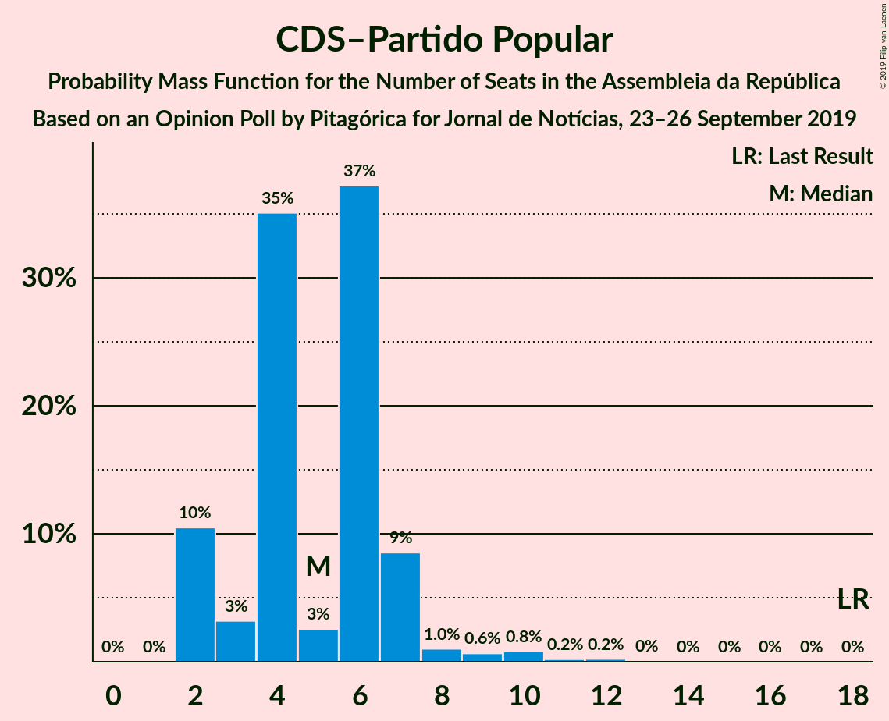

# Opinion Poll by Pitagórica for Jornal de Notícias, 23–26 September 2019

<a href="#voting-intentions">Voting Intentions</a> | <a href="#seats">Seats</a> | <a href="#coalitions">Coalitions</a> | <a href="#technical-information">Technical Information</a>

## Voting Intentions

### Confidence Intervals

| Party | Last Result | Poll Result | 80% Confidence Interval | 90% Confidence Interval | 95% Confidence Interval | 99% Confidence Interval |
|:-----:|:-----------:|:-----------:|:-----------------------:|:-----------------------:|:-----------------------:|:-----------------------:|
| Partido Socialista | 32.3% | 37.8% | 35.3–40.4% |34.6–41.2% |34.0–41.8% |32.9–43.0% |
| Partido Social Democrata | 36.9% | 26.7% | 24.4–29.1% |23.8–29.8% |23.3–30.4% |22.3–31.5% |
| Bloco de Esquerda | 10.2% | 10.2% | 8.7–11.9% |8.3–12.4% |8.0–12.8% |7.4–13.7% |
| Coligação Democrática Unitária | 8.2% | 5.2% | 4.2–6.5% |3.9–6.9% |3.7–7.3% |3.2–8.0% |
| CDS–Partido Popular | 36.9% | 4.0% | 3.1–5.2% |2.9–5.6% |2.7–5.9% |2.3–6.5% |
| Pessoas–Animais–Natureza | 1.4% | 3.7% | 2.9–4.9% |2.6–5.2% |2.4–5.5% |2.1–6.1% |
| Iniciativa Liberal | 0.0% | 1.7% | 1.2–2.6% |1.0–2.8% |0.9–3.0% |0.7–3.5% |
| LIVRE | 0.7% | 1.2% | 0.8–2.0% |0.7–2.2% |0.6–2.4% |0.4–2.8% |
| Chega | 0.0% | 1.2% | 0.8–2.0% |0.7–2.2% |0.6–2.4% |0.4–2.8% |
| Aliança | 0.0% | 0.7% | 0.4–1.3% |0.3–1.5% |0.3–1.7% |0.2–2.1% |

*Note:* The poll result column reflects the actual value used in the calculations. Published results may vary slightly, and in addition be rounded to fewer digits.

## Seats

### Confidence Intervals

| Party | Last Result | Median | 80% Confidence Interval | 90% Confidence Interval | 95% Confidence Interval | 99% Confidence Interval |
|:-----:|:-----------:|:------:|:-----------------------:|:-----------------------:|:-----------------------:|:-----------------------:|
| <a href="#partido-socialista">Partido Socialista</a> | 86 | 105 | 105 |105 |105 |104–105 |
| <a href="#partido-social-democrata">Partido Social Democrata</a> | 89 | 79 | 79 |79 |79 |73–79 |
| <a href="#bloco-de-esquerda">Bloco de Esquerda</a> | 19 | 27 | 27 |27 |27 |24–27 |
| <a href="#coligação-democrática-unitária">Coligação Democrática Unitária</a> | 17 | 8 | 8 |8 |8 |8–13 |
| <a href="#cds–partido-popular">CDS–Partido Popular</a> | 18 | 4 | 4 |4 |4 |4–7 |
| <a href="#pessoas–animais–natureza">Pessoas–Animais–Natureza</a> | 1 | 3 | 3 |3 |3 |3–6 |
| <a href="#iniciativa-liberal">Iniciativa Liberal</a> | 0 | 0 | 0 |0 |0 |0–2 |
| <a href="#livre">LIVRE</a> | 0 | 4 | 4 |4 |4 |1–4 |
| <a href="#chega">Chega</a> | 0 | 0 | 0 |0 |0 |0 |
| <a href="#aliança">Aliança</a> | 0 | 0 | 0 |0 |0 |0 |

### Partido Socialista

*For a full overview of the results for this party, see the [Partido Socialista](party-partidosocialista.html) page.*

| Number of Seats | Probability | Accumulated | Special Marks |
|:---------------:|:-----------:|:-----------:|:-------------:|
| 86 | 0% | 100% | Last Result |
| 87 | 0% | 100% |  |
| 88 | 0% | 100% |  |
| 89 | 0% | 100% |  |
| 90 | 0% | 100% |  |
| 91 | 0% | 100% |  |
| 92 | 0% | 100% |  |
| 93 | 0.1% | 100% |  |
| 94 | 0% | 99.9% |  |
| 95 | 0% | 99.9% |  |
| 96 | 0% | 99.9% |  |
| 97 | 0% | 99.9% |  |
| 98 | 0% | 99.9% |  |
| 99 | 0% | 99.9% |  |
| 100 | 0% | 99.9% |  |
| 101 | 0% | 99.9% |  |
| 102 | 0% | 99.9% |  |
| 103 | 0% | 99.9% |  |
| 104 | 0.8% | 99.8% |  |
| 105 | 98.7% | 99.1% | Median |
| 106 | 0.2% | 0.4% |  |
| 107 | 0% | 0.2% |  |
| 108 | 0% | 0.2% |  |
| 109 | 0% | 0.2% |  |
| 110 | 0% | 0.2% |  |
| 111 | 0% | 0.2% |  |
| 112 | 0% | 0.2% |  |
| 113 | 0% | 0.2% |  |
| 114 | 0% | 0.2% |  |
| 115 | 0% | 0.2% |  |
| 116 | 0% | 0.2% | Majority |
| 117 | 0% | 0.2% |  |
| 118 | 0% | 0.2% |  |
| 119 | 0% | 0.2% |  |
| 120 | 0% | 0.2% |  |
| 121 | 0% | 0.2% |  |
| 122 | 0% | 0.2% |  |
| 123 | 0.2% | 0.2% |  |
| 124 | 0% | 0% |  |

### Partido Social Democrata

*For a full overview of the results for this party, see the [Partido Social Democrata](party-partidosocialdemocrata.html) page.*

| Number of Seats | Probability | Accumulated | Special Marks |
|:---------------:|:-----------:|:-----------:|:-------------:|
| 70 | 0.2% | 100% |  |
| 71 | 0% | 99.8% |  |
| 72 | 0% | 99.8% |  |
| 73 | 0.8% | 99.8% |  |
| 74 | 0.1% | 99.0% |  |
| 75 | 0% | 99.0% |  |
| 76 | 0.2% | 99.0% |  |
| 77 | 0% | 98.8% |  |
| 78 | 0% | 98.8% |  |
| 79 | 98.7% | 98.8% | Median |
| 80 | 0% | 0.1% |  |
| 81 | 0% | 0.1% |  |
| 82 | 0% | 0.1% |  |
| 83 | 0% | 0.1% |  |
| 84 | 0% | 0.1% |  |
| 85 | 0% | 0.1% |  |
| 86 | 0% | 0.1% |  |
| 87 | 0% | 0.1% |  |
| 88 | 0% | 0.1% |  |
| 89 | 0% | 0.1% | Last Result |
| 90 | 0% | 0.1% |  |
| 91 | 0% | 0.1% |  |
| 92 | 0% | 0.1% |  |
| 93 | 0% | 0.1% |  |
| 94 | 0% | 0.1% |  |
| 95 | 0% | 0.1% |  |
| 96 | 0.1% | 0.1% |  |
| 97 | 0% | 0% |  |

### Bloco de Esquerda

*For a full overview of the results for this party, see the [Bloco de Esquerda](party-blocodeesquerda.html) page.*

| Number of Seats | Probability | Accumulated | Special Marks |
|:---------------:|:-----------:|:-----------:|:-------------:|
| 10 | 0.2% | 100% |  |
| 11 | 0% | 99.8% |  |
| 12 | 0% | 99.8% |  |
| 13 | 0% | 99.8% |  |
| 14 | 0% | 99.8% |  |
| 15 | 0% | 99.8% |  |
| 16 | 0% | 99.8% |  |
| 17 | 0% | 99.8% |  |
| 18 | 0% | 99.8% |  |
| 19 | 0% | 99.8% | Last Result |
| 20 | 0.1% | 99.8% |  |
| 21 | 0% | 99.7% |  |
| 22 | 0% | 99.7% |  |
| 23 | 0% | 99.7% |  |
| 24 | 1.0% | 99.6% |  |
| 25 | 0% | 98.7% |  |
| 26 | 0% | 98.7% |  |
| 27 | 98.7% | 98.7% | Median |
| 28 | 0% | 0% |  |

### Coligação Democrática Unitária

*For a full overview of the results for this party, see the [Coligação Democrática Unitária](party-coligaçãodemocráticaunitária.html) page.*

| Number of Seats | Probability | Accumulated | Special Marks |
|:---------------:|:-----------:|:-----------:|:-------------:|
| 5 | 0.1% | 100% |  |
| 6 | 0% | 99.9% |  |
| 7 | 0% | 99.9% |  |
| 8 | 98.7% | 99.9% | Median |
| 9 | 0.2% | 1.2% |  |
| 10 | 0% | 1.0% |  |
| 11 | 0% | 1.0% |  |
| 12 | 0% | 1.0% |  |
| 13 | 0.8% | 1.0% |  |
| 14 | 0% | 0.2% |  |
| 15 | 0.2% | 0.2% |  |
| 16 | 0% | 0% |  |
| 17 | 0% | 0% | Last Result |

### CDS–Partido Popular

*For a full overview of the results for this party, see the [CDS–Partido Popular](party-cds–partidopopular.html) page.*

| Number of Seats | Probability | Accumulated | Special Marks |
|:---------------:|:-----------:|:-----------:|:-------------:|
| 2 | 0.1% | 100% |  |
| 3 | 0% | 99.9% |  |
| 4 | 98.8% | 99.9% | Median |
| 5 | 0% | 1.1% |  |
| 6 | 0.1% | 1.1% |  |
| 7 | 0.9% | 1.0% |  |
| 8 | 0% | 0% |  |
| 9 | 0% | 0% |  |
| 10 | 0% | 0% |  |
| 11 | 0% | 0% |  |
| 12 | 0% | 0% |  |
| 13 | 0% | 0% |  |
| 14 | 0% | 0% |  |
| 15 | 0% | 0% |  |
| 16 | 0% | 0% |  |
| 17 | 0% | 0% |  |
| 18 | 0% | 0% | Last Result |

### Pessoas–Animais–Natureza

*For a full overview of the results for this party, see the [Pessoas–Animais–Natureza](party-pessoas–animais–natureza.html) page.*

| Number of Seats | Probability | Accumulated | Special Marks |
|:---------------:|:-----------:|:-----------:|:-------------:|
| 1 | 0% | 100% | Last Result |
| 2 | 0% | 100% |  |
| 3 | 98.8% | 100% | Median |
| 4 | 0% | 1.2% |  |
| 5 | 0% | 1.2% |  |
| 6 | 1.0% | 1.2% |  |
| 7 | 0% | 0.1% |  |
| 8 | 0% | 0.1% |  |
| 9 | 0.1% | 0.1% |  |
| 10 | 0% | 0% |  |

### Iniciativa Liberal

*For a full overview of the results for this party, see the [Iniciativa Liberal](party-iniciativaliberal.html) page.*

| Number of Seats | Probability | Accumulated | Special Marks |
|:---------------:|:-----------:|:-----------:|:-------------:|
| 0 | 99.0% | 100% | Last Result, Median |
| 1 | 0.2% | 1.0% |  |
| 2 | 0.8% | 0.8% |  |
| 3 | 0% | 0% |  |

### LIVRE

*For a full overview of the results for this party, see the [LIVRE](party-livre.html) page.*

| Number of Seats | Probability | Accumulated | Special Marks |
|:---------------:|:-----------:|:-----------:|:-------------:|
| 0 | 0.1% | 100% | Last Result |
| 1 | 1.3% | 99.9% |  |
| 2 | 0% | 98.7% |  |
| 3 | 0% | 98.7% |  |
| 4 | 98.7% | 98.7% | Median |
| 5 | 0% | 0% |  |

### Chega

*For a full overview of the results for this party, see the [Chega](party-chega.html) page.*

| Number of Seats | Probability | Accumulated | Special Marks |
|:---------------:|:-----------:|:-----------:|:-------------:|
| 0 | 99.9% | 100% | Last Result, Median |
| 1 | 0% | 0.1% |  |
| 2 | 0.1% | 0.1% |  |
| 3 | 0% | 0% |  |

### Aliança

*For a full overview of the results for this party, see the [Aliança](party-aliança.html) page.*

| Number of Seats | Probability | Accumulated | Special Marks |
|:---------------:|:-----------:|:-----------:|:-------------:|
| 0 | 99.6% | 100% | Last Result, Median |
| 1 | 0.2% | 0.4% |  |
| 2 | 0% | 0.2% |  |
| 3 | 0.2% | 0.2% |  |
| 4 | 0% | 0% |  |

## Coalitions

### Confidence Intervals

| Coalition | Last Result | Median | Majority? | 80% Confidence Interval | 90% Confidence Interval | 95% Confidence Interval | 99% Confidence Interval |
|:---------:|:-----------:|:------:|:---------:|:-----------------------:|:-----------------------:|:-----------------------:|:-----------------------:|
| Partido Socialista – Bloco de Esquerda – Coligação Democrática Unitária | 122 | 140 | 100% | 140 | 140 | 140 | 140–141 |
| Partido Socialista – Bloco de Esquerda | 105 | 132 | 99.9% | 132 | 132 | 132 | 128–132 |
| Partido Socialista – Coligação Democrática Unitária | 103 | 113 | 1.2% | 113 | 113 | 113 | 113–117 |
| Partido Socialista | 86 | 105 | 0.2% | 105 | 105 | 105 | 104–105 |
| Partido Social Democrata – CDS–Partido Popular | 107 | 83 | 0% | 83 | 83 | 83 | 80–83 |

### Partido Socialista – Bloco de Esquerda – Coligação Democrática Unitária

| Number of Seats | Probability | Accumulated | Special Marks |
|:---------------:|:-----------:|:-----------:|:-------------:|
| 118 | 0.1% | 100% |  |
| 119 | 0% | 99.9% |  |
| 120 | 0% | 99.9% |  |
| 121 | 0% | 99.9% |  |
| 122 | 0% | 99.9% | Last Result |
| 123 | 0% | 99.9% |  |
| 124 | 0% | 99.9% |  |
| 125 | 0% | 99.9% |  |
| 126 | 0% | 99.9% |  |
| 127 | 0% | 99.9% |  |
| 128 | 0% | 99.9% |  |
| 129 | 0% | 99.9% |  |
| 130 | 0% | 99.9% |  |
| 131 | 0% | 99.9% |  |
| 132 | 0% | 99.9% |  |
| 133 | 0% | 99.9% |  |
| 134 | 0% | 99.9% |  |
| 135 | 0% | 99.9% |  |
| 136 | 0% | 99.9% |  |
| 137 | 0% | 99.9% |  |
| 138 | 0% | 99.9% |  |
| 139 | 0% | 99.9% |  |
| 140 | 98.7% | 99.9% | Median |
| 141 | 0.8% | 1.2% |  |
| 142 | 0.2% | 0.4% |  |
| 143 | 0% | 0.3% |  |
| 144 | 0% | 0.2% |  |
| 145 | 0.2% | 0.2% |  |
| 146 | 0% | 0% |  |

### Partido Socialista – Bloco de Esquerda

| Number of Seats | Probability | Accumulated | Special Marks |
|:---------------:|:-----------:|:-----------:|:-------------:|
| 105 | 0% | 100% | Last Result |
| 106 | 0% | 100% |  |
| 107 | 0% | 100% |  |
| 108 | 0% | 100% |  |
| 109 | 0% | 100% |  |
| 110 | 0% | 100% |  |
| 111 | 0% | 100% |  |
| 112 | 0% | 100% |  |
| 113 | 0.1% | 100% |  |
| 114 | 0% | 99.9% |  |
| 115 | 0% | 99.9% |  |
| 116 | 0% | 99.9% | Majority |
| 117 | 0% | 99.9% |  |
| 118 | 0% | 99.9% |  |
| 119 | 0% | 99.9% |  |
| 120 | 0% | 99.9% |  |
| 121 | 0% | 99.9% |  |
| 122 | 0% | 99.9% |  |
| 123 | 0% | 99.9% |  |
| 124 | 0% | 99.9% |  |
| 125 | 0% | 99.9% |  |
| 126 | 0% | 99.9% |  |
| 127 | 0% | 99.9% |  |
| 128 | 0.8% | 99.9% |  |
| 129 | 0% | 99.1% |  |
| 130 | 0.2% | 99.1% |  |
| 131 | 0% | 98.8% |  |
| 132 | 98.7% | 98.8% | Median |
| 133 | 0.2% | 0.2% |  |
| 134 | 0% | 0% |  |

### Partido Socialista – Coligação Democrática Unitária

| Number of Seats | Probability | Accumulated | Special Marks |
|:---------------:|:-----------:|:-----------:|:-------------:|
| 98 | 0.1% | 100% |  |
| 99 | 0% | 99.9% |  |
| 100 | 0% | 99.9% |  |
| 101 | 0% | 99.9% |  |
| 102 | 0% | 99.9% |  |
| 103 | 0% | 99.9% | Last Result |
| 104 | 0% | 99.9% |  |
| 105 | 0% | 99.9% |  |
| 106 | 0% | 99.9% |  |
| 107 | 0% | 99.9% |  |
| 108 | 0% | 99.9% |  |
| 109 | 0% | 99.9% |  |
| 110 | 0% | 99.9% |  |
| 111 | 0% | 99.9% |  |
| 112 | 0% | 99.8% |  |
| 113 | 98.7% | 99.8% | Median |
| 114 | 0% | 1.2% |  |
| 115 | 0% | 1.2% |  |
| 116 | 0% | 1.2% | Majority |
| 117 | 0.8% | 1.2% |  |
| 118 | 0% | 0.4% |  |
| 119 | 0% | 0.4% |  |
| 120 | 0% | 0.4% |  |
| 121 | 0.2% | 0.4% |  |
| 122 | 0% | 0.2% |  |
| 123 | 0% | 0.2% |  |
| 124 | 0% | 0.2% |  |
| 125 | 0% | 0.2% |  |
| 126 | 0% | 0.2% |  |
| 127 | 0% | 0.2% |  |
| 128 | 0% | 0.2% |  |
| 129 | 0% | 0.2% |  |
| 130 | 0% | 0.2% |  |
| 131 | 0% | 0.2% |  |
| 132 | 0.2% | 0.2% |  |
| 133 | 0% | 0% |  |

### Partido Socialista

| Number of Seats | Probability | Accumulated | Special Marks |
|:---------------:|:-----------:|:-----------:|:-------------:|
| 86 | 0% | 100% | Last Result |
| 87 | 0% | 100% |  |
| 88 | 0% | 100% |  |
| 89 | 0% | 100% |  |
| 90 | 0% | 100% |  |
| 91 | 0% | 100% |  |
| 92 | 0% | 100% |  |
| 93 | 0.1% | 100% |  |
| 94 | 0% | 99.9% |  |
| 95 | 0% | 99.9% |  |
| 96 | 0% | 99.9% |  |
| 97 | 0% | 99.9% |  |
| 98 | 0% | 99.9% |  |
| 99 | 0% | 99.9% |  |
| 100 | 0% | 99.9% |  |
| 101 | 0% | 99.9% |  |
| 102 | 0% | 99.9% |  |
| 103 | 0% | 99.9% |  |
| 104 | 0.8% | 99.8% |  |
| 105 | 98.7% | 99.1% | Median |
| 106 | 0.2% | 0.4% |  |
| 107 | 0% | 0.2% |  |
| 108 | 0% | 0.2% |  |
| 109 | 0% | 0.2% |  |
| 110 | 0% | 0.2% |  |
| 111 | 0% | 0.2% |  |
| 112 | 0% | 0.2% |  |
| 113 | 0% | 0.2% |  |
| 114 | 0% | 0.2% |  |
| 115 | 0% | 0.2% |  |
| 116 | 0% | 0.2% | Majority |
| 117 | 0% | 0.2% |  |
| 118 | 0% | 0.2% |  |
| 119 | 0% | 0.2% |  |
| 120 | 0% | 0.2% |  |
| 121 | 0% | 0.2% |  |
| 122 | 0% | 0.2% |  |
| 123 | 0.2% | 0.2% |  |
| 124 | 0% | 0% |  |

### Partido Social Democrata – CDS–Partido Popular

| Number of Seats | Probability | Accumulated | Special Marks |
|:---------------:|:-----------:|:-----------:|:-------------:|
| 74 | 0.2% | 100% |  |
| 75 | 0% | 99.8% |  |
| 76 | 0% | 99.8% |  |
| 77 | 0% | 99.7% |  |
| 78 | 0% | 99.7% |  |
| 79 | 0% | 99.7% |  |
| 80 | 0.8% | 99.7% |  |
| 81 | 0% | 99.0% |  |
| 82 | 0% | 99.0% |  |
| 83 | 98.8% | 99.0% | Median |
| 84 | 0% | 0.1% |  |
| 85 | 0% | 0.1% |  |
| 86 | 0% | 0.1% |  |
| 87 | 0% | 0.1% |  |
| 88 | 0% | 0.1% |  |
| 89 | 0% | 0.1% |  |
| 90 | 0% | 0.1% |  |
| 91 | 0% | 0.1% |  |
| 92 | 0% | 0.1% |  |
| 93 | 0% | 0.1% |  |
| 94 | 0% | 0.1% |  |
| 95 | 0% | 0.1% |  |
| 96 | 0% | 0.1% |  |
| 97 | 0% | 0.1% |  |
| 98 | 0% | 0.1% |  |
| 99 | 0% | 0.1% |  |
| 100 | 0% | 0.1% |  |
| 101 | 0% | 0.1% |  |
| 102 | 0.1% | 0.1% |  |
| 103 | 0% | 0% |  |
| 104 | 0% | 0% |  |
| 105 | 0% | 0% |  |
| 106 | 0% | 0% |  |
| 107 | 0% | 0% | Last Result |

## Technical Information

### Opinion Poll

+ **Polling firm:** Pitagórica
+ **Commissioner(s):** Jornal de Notícias
+ **Fieldwork period:** 23–26 September 2019

### Calculations

+ **Sample size:** 600
+ **Simulations done:** 1,024
+ **Error estimate:** 2.82%

