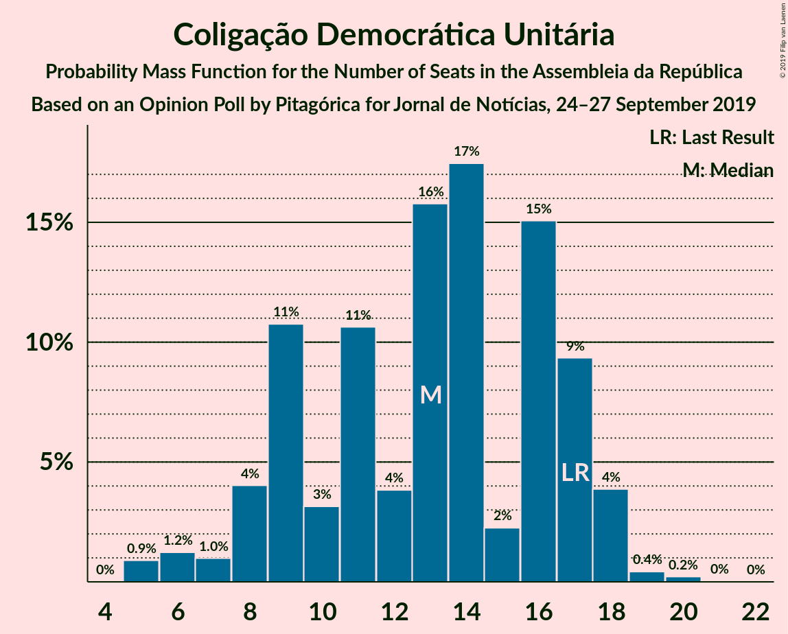
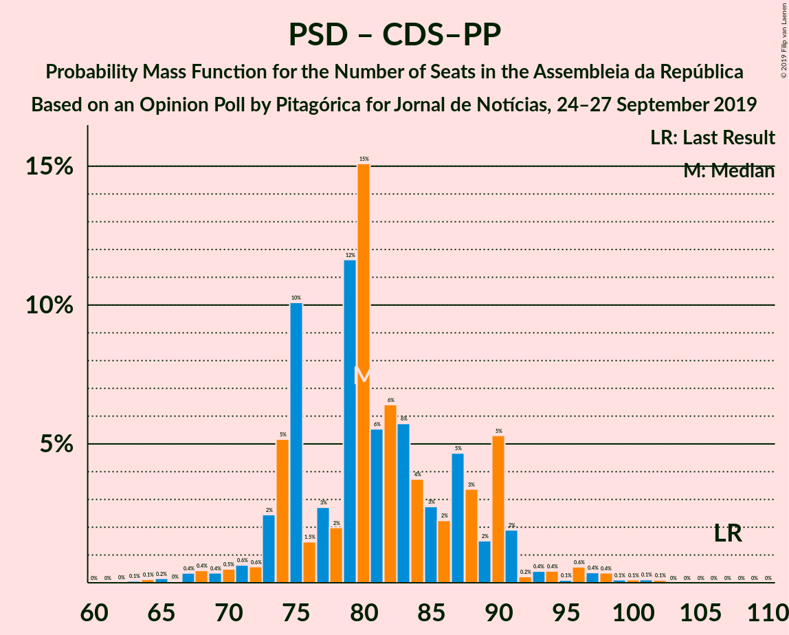

# Opinion Poll by Pitagórica for Jornal de Notícias, 24–27 September 2019

<a href="#voting-intentions">Voting Intentions</a> | <a href="#seats">Seats</a> | <a href="#coalitions">Coalitions</a> | <a href="#technical-information">Technical Information</a>

## Voting Intentions

### Confidence Intervals

| Party | Last Result | Poll Result | 80% Confidence Interval | 90% Confidence Interval | 95% Confidence Interval | 99% Confidence Interval |
|:-----:|:-----------:|:-----------:|:-----------------------:|:-----------------------:|:-----------------------:|:-----------------------:|
| Partido Socialista | 32.3% | 37.2% | 34.7–39.8% |34.0–40.5% |33.4–41.1% |32.2–42.4% |
| Partido Social Democrata | 36.9% | 26.5% | 24.3–28.9% |23.7–29.6% |23.1–30.2% |22.1–31.4% |
| Bloco de Esquerda | 10.2% | 10.3% | 8.9–12.1% |8.5–12.6% |8.1–13.0% |7.5–13.9% |
| Coligação Democrática Unitária | 8.2% | 6.3% | 5.2–7.8% |4.9–8.2% |4.6–8.6% |4.2–9.3% |
| CDS–Partido Popular | 36.9% | 3.7% | 2.9–4.9% |2.6–5.2% |2.4–5.5% |2.1–6.1% |
| Pessoas–Animais–Natureza | 1.4% | 3.2% | 2.4–4.3% |2.2–4.6% |2.0–4.9% |1.7–5.5% |
| Iniciativa Liberal | 0.0% | 2.0% | 1.4–3.0% |1.3–3.2% |1.1–3.5% |0.9–4.0% |
| LIVRE | 0.7% | 1.3% | 0.9–2.2% |0.8–2.4% |0.7–2.6% |0.5–3.1% |
| Chega | 0.0% | 1.2% | 0.8–2.0% |0.7–2.2% |0.6–2.4% |0.4–2.8% |
| Aliança | 0.0% | 0.7% | 0.4–1.3% |0.3–1.5% |0.3–1.7% |0.2–2.1% |

*Note:* The poll result column reflects the actual value used in the calculations. Published results may vary slightly, and in addition be rounded to fewer digits.

## Seats

### Confidence Intervals

| Party | Last Result | Median | 80% Confidence Interval | 90% Confidence Interval | 95% Confidence Interval | 99% Confidence Interval |
|:-----:|:-----------:|:------:|:-----------------------:|:-----------------------:|:-----------------------:|:-----------------------:|
| <a href="#partido-socialista">Partido Socialista</a> | 86 | 112 | 97–117 |97–117 |95–117 |90–120 |
| <a href="#partido-social-democrata">Partido Social Democrata</a> | 89 | 73 | 70–84 |69–86 |66–91 |60–95 |
| <a href="#bloco-de-esquerda">Bloco de Esquerda</a> | 19 | 22 | 18–26 |18–28 |17–29 |15–32 |
| <a href="#coligação-democrática-unitária">Coligação Democrática Unitária</a> | 17 | 14 | 9–17 |8–17 |6–18 |5–19 |
| <a href="#cds–partido-popular">CDS–Partido Popular</a> | 18 | 4 | 2–6 |2–7 |2–7 |2–8 |
| <a href="#pessoas–animais–natureza">Pessoas–Animais–Natureza</a> | 1 | 3 | 3–5 |2–6 |2–6 |1–8 |
| <a href="#iniciativa-liberal">Iniciativa Liberal</a> | 0 | 1 | 0–2 |0–2 |0–3 |0–6 |
| <a href="#livre">LIVRE</a> | 0 | 1 | 1 |0–1 |0–2 |0–3 |
| <a href="#chega">Chega</a> | 0 | 0 | 0 |0–2 |0–2 |0–2 |
| <a href="#aliança">Aliança</a> | 0 | 0 | 0 |0 |0 |0 |

### Partido Socialista

*For a full overview of the results for this party, see the [Partido Socialista](party-partidosocialista.html) page.*

| Number of Seats | Probability | Accumulated | Special Marks |
|:---------------:|:-----------:|:-----------:|:-------------:|
| 86 | 0% | 100% | Last Result |
| 87 | 0% | 100% |  |
| 88 | 0% | 100% |  |
| 89 | 0.5% | 100% |  |
| 90 | 0% | 99.5% |  |
| 91 | 0.4% | 99.5% |  |
| 92 | 0.3% | 99.1% |  |
| 93 | 0.5% | 98.8% |  |
| 94 | 0.4% | 98% |  |
| 95 | 0.5% | 98% |  |
| 96 | 0.1% | 97% |  |
| 97 | 8% | 97% |  |
| 98 | 1.4% | 89% |  |
| 99 | 2% | 88% |  |
| 100 | 1.3% | 86% |  |
| 101 | 2% | 85% |  |
| 102 | 2% | 83% |  |
| 103 | 1.4% | 81% |  |
| 104 | 1.4% | 79% |  |
| 105 | 16% | 78% |  |
| 106 | 2% | 62% |  |
| 107 | 2% | 60% |  |
| 108 | 2% | 58% |  |
| 109 | 1.4% | 57% |  |
| 110 | 0.9% | 55% |  |
| 111 | 0.8% | 54% |  |
| 112 | 6% | 54% | Median |
| 113 | 16% | 48% |  |
| 114 | 2% | 31% |  |
| 115 | 2% | 29% |  |
| 116 | 3% | 27% | Majority |
| 117 | 22% | 24% |  |
| 118 | 0.6% | 2% |  |
| 119 | 0.3% | 1.3% |  |
| 120 | 0.6% | 1.0% |  |
| 121 | 0.1% | 0.4% |  |
| 122 | 0.1% | 0.3% |  |
| 123 | 0% | 0.2% |  |
| 124 | 0% | 0.2% |  |
| 125 | 0.1% | 0.1% |  |
| 126 | 0% | 0.1% |  |
| 127 | 0% | 0% |  |

### Partido Social Democrata

*For a full overview of the results for this party, see the [Partido Social Democrata](party-partidosocialdemocrata.html) page.*

| Number of Seats | Probability | Accumulated | Special Marks |
|:---------------:|:-----------:|:-----------:|:-------------:|
| 58 | 0.1% | 100% |  |
| 59 | 0.1% | 99.9% |  |
| 60 | 0.4% | 99.9% |  |
| 61 | 0.5% | 99.5% |  |
| 62 | 0.2% | 99.0% |  |
| 63 | 0% | 98.8% |  |
| 64 | 0.4% | 98.7% |  |
| 65 | 0.4% | 98% |  |
| 66 | 0.8% | 98% |  |
| 67 | 0.4% | 97% |  |
| 68 | 2% | 97% |  |
| 69 | 2% | 95% |  |
| 70 | 16% | 94% |  |
| 71 | 24% | 77% |  |
| 72 | 0.2% | 53% |  |
| 73 | 7% | 53% | Median |
| 74 | 2% | 45% |  |
| 75 | 2% | 43% |  |
| 76 | 1.1% | 41% |  |
| 77 | 17% | 40% |  |
| 78 | 2% | 23% |  |
| 79 | 1.2% | 20% |  |
| 80 | 2% | 19% |  |
| 81 | 3% | 17% |  |
| 82 | 0.9% | 14% |  |
| 83 | 0.4% | 13% |  |
| 84 | 7% | 13% |  |
| 85 | 0.7% | 6% |  |
| 86 | 0.7% | 6% |  |
| 87 | 0.5% | 5% |  |
| 88 | 0.5% | 4% |  |
| 89 | 0.1% | 4% | Last Result |
| 90 | 0.3% | 4% |  |
| 91 | 2% | 4% |  |
| 92 | 0% | 2% |  |
| 93 | 0.1% | 2% |  |
| 94 | 0.6% | 2% |  |
| 95 | 0.8% | 0.9% |  |
| 96 | 0.1% | 0.1% |  |
| 97 | 0% | 0.1% |  |
| 98 | 0% | 0.1% |  |
| 99 | 0% | 0% |  |

### Bloco de Esquerda

*For a full overview of the results for this party, see the [Bloco de Esquerda](party-blocodeesquerda.html) page.*

| Number of Seats | Probability | Accumulated | Special Marks |
|:---------------:|:-----------:|:-----------:|:-------------:|
| 13 | 0.1% | 100% |  |
| 14 | 0.2% | 99.9% |  |
| 15 | 0.7% | 99.7% |  |
| 16 | 0.4% | 99.0% |  |
| 17 | 2% | 98.5% |  |
| 18 | 25% | 96% |  |
| 19 | 3% | 71% | Last Result |
| 20 | 2% | 68% |  |
| 21 | 1.5% | 65% |  |
| 22 | 16% | 64% | Median |
| 23 | 11% | 47% |  |
| 24 | 11% | 36% |  |
| 25 | 2% | 25% |  |
| 26 | 16% | 23% |  |
| 27 | 2% | 7% |  |
| 28 | 2% | 5% |  |
| 29 | 0.3% | 3% |  |
| 30 | 1.3% | 2% |  |
| 31 | 0.5% | 1.0% |  |
| 32 | 0% | 0.5% |  |
| 33 | 0.1% | 0.5% |  |
| 34 | 0% | 0.4% |  |
| 35 | 0.1% | 0.4% |  |
| 36 | 0.1% | 0.3% |  |
| 37 | 0.2% | 0.2% |  |
| 38 | 0% | 0% |  |

### Coligação Democrática Unitária

*For a full overview of the results for this party, see the [Coligação Democrática Unitária](party-coligaçãodemocráticaunitária.html) page.*

| Number of Seats | Probability | Accumulated | Special Marks |
|:---------------:|:-----------:|:-----------:|:-------------:|
| 5 | 0.9% | 100% |  |
| 6 | 2% | 99.0% |  |
| 7 | 0.4% | 97% |  |
| 8 | 7% | 97% |  |
| 9 | 3% | 90% |  |
| 10 | 0.4% | 87% |  |
| 11 | 6% | 86% |  |
| 12 | 2% | 80% |  |
| 13 | 11% | 78% |  |
| 14 | 41% | 67% | Median |
| 15 | 0.8% | 27% |  |
| 16 | 3% | 26% |  |
| 17 | 19% | 23% | Last Result |
| 18 | 3% | 4% |  |
| 19 | 1.0% | 1.3% |  |
| 20 | 0.2% | 0.3% |  |
| 21 | 0% | 0% |  |

### CDS–Partido Popular

*For a full overview of the results for this party, see the [CDS–Partido Popular](party-cds–partidopopular.html) page.*

| Number of Seats | Probability | Accumulated | Special Marks |
|:---------------:|:-----------:|:-----------:|:-------------:|
| 1 | 0% | 100% |  |
| 2 | 23% | 99.9% |  |
| 3 | 3% | 77% |  |
| 4 | 42% | 74% | Median |
| 5 | 0.9% | 32% |  |
| 6 | 26% | 31% |  |
| 7 | 5% | 6% |  |
| 8 | 0.2% | 0.6% |  |
| 9 | 0.1% | 0.4% |  |
| 10 | 0.3% | 0.4% |  |
| 11 | 0.1% | 0.1% |  |
| 12 | 0% | 0% |  |
| 13 | 0% | 0% |  |
| 14 | 0% | 0% |  |
| 15 | 0% | 0% |  |
| 16 | 0% | 0% |  |
| 17 | 0% | 0% |  |
| 18 | 0% | 0% | Last Result |

### Pessoas–Animais–Natureza

*For a full overview of the results for this party, see the [Pessoas–Animais–Natureza](party-pessoas–animais–natureza.html) page.*

| Number of Seats | Probability | Accumulated | Special Marks |
|:---------------:|:-----------:|:-----------:|:-------------:|
| 1 | 0.5% | 100% | Last Result |
| 2 | 5% | 99.4% |  |
| 3 | 47% | 94% | Median |
| 4 | 35% | 47% |  |
| 5 | 4% | 12% |  |
| 6 | 7% | 8% |  |
| 7 | 0.3% | 0.9% |  |
| 8 | 0.5% | 0.6% |  |
| 9 | 0.1% | 0.1% |  |
| 10 | 0% | 0% |  |

### Iniciativa Liberal

*For a full overview of the results for this party, see the [Iniciativa Liberal](party-iniciativaliberal.html) page.*

| Number of Seats | Probability | Accumulated | Special Marks |
|:---------------:|:-----------:|:-----------:|:-------------:|
| 0 | 34% | 100% | Last Result |
| 1 | 18% | 66% | Median |
| 2 | 45% | 48% |  |
| 3 | 0.1% | 3% |  |
| 4 | 1.5% | 2% |  |
| 5 | 0.3% | 1.0% |  |
| 6 | 0.7% | 0.7% |  |
| 7 | 0% | 0% |  |

### LIVRE

*For a full overview of the results for this party, see the [LIVRE](party-livre.html) page.*

| Number of Seats | Probability | Accumulated | Special Marks |
|:---------------:|:-----------:|:-----------:|:-------------:|
| 0 | 6% | 100% | Last Result |
| 1 | 90% | 94% | Median |
| 2 | 3% | 4% |  |
| 3 | 0.3% | 0.6% |  |
| 4 | 0.2% | 0.3% |  |
| 5 | 0.1% | 0.1% |  |
| 6 | 0% | 0% |  |

### Chega

*For a full overview of the results for this party, see the [Chega](party-chega.html) page.*

| Number of Seats | Probability | Accumulated | Special Marks |
|:---------------:|:-----------:|:-----------:|:-------------:|
| 0 | 94% | 100% | Last Result, Median |
| 1 | 0.4% | 6% |  |
| 2 | 6% | 6% |  |
| 3 | 0.1% | 0.1% |  |
| 4 | 0% | 0% |  |

### Aliança

*For a full overview of the results for this party, see the [Aliança](party-aliança.html) page.*

| Number of Seats | Probability | Accumulated | Special Marks |
|:---------------:|:-----------:|:-----------:|:-------------:|
| 0 | 99.8% | 100% | Last Result, Median |
| 1 | 0% | 0.2% |  |
| 2 | 0.2% | 0.2% |  |
| 3 | 0% | 0% |  |

## Coalitions

### Confidence Intervals

| Coalition | Last Result | Median | Majority? | 80% Confidence Interval | 90% Confidence Interval | 95% Confidence Interval | 99% Confidence Interval |
|:---------:|:-----------:|:------:|:---------:|:-----------------------:|:-----------------------:|:-----------------------:|:-----------------------:|
| Partido Socialista – Bloco de Esquerda – Coligação Democrática Unitária | 122 | 147 | 100% | 133–152 | 131–152 | 126–155 | 122–158 |
| Partido Socialista – Bloco de Esquerda | 105 | 135 | 98% | 120–136 | 118–140 | 116–140 | 113–143 |
| Partido Socialista – Coligação Democrática Unitária | 103 | 123 | 81% | 110–131 | 110–131 | 107–133 | 98–134 |
| Partido Socialista | 86 | 112 | 27% | 97–117 | 97–117 | 95–117 | 90–120 |
| Partido Social Democrata – CDS–Partido Popular | 107 | 78 | 0% | 74–90 | 73–91 | 71–97 | 65–101 |

### Partido Socialista – Bloco de Esquerda – Coligação Democrática Unitária

| Number of Seats | Probability | Accumulated | Special Marks |
|:---------------:|:-----------:|:-----------:|:-------------:|
| 120 | 0.1% | 100% |  |
| 121 | 0.4% | 99.9% |  |
| 122 | 0.1% | 99.6% | Last Result |
| 123 | 0.1% | 99.4% |  |
| 124 | 0.5% | 99.3% |  |
| 125 | 0.5% | 98.8% |  |
| 126 | 1.3% | 98% |  |
| 127 | 0.5% | 97% |  |
| 128 | 0.1% | 97% |  |
| 129 | 1.0% | 96% |  |
| 130 | 0.2% | 95% |  |
| 131 | 0.2% | 95% |  |
| 132 | 0.8% | 95% |  |
| 133 | 7% | 94% |  |
| 134 | 0.8% | 87% |  |
| 135 | 1.5% | 86% |  |
| 136 | 0.4% | 85% |  |
| 137 | 2% | 85% |  |
| 138 | 2% | 82% |  |
| 139 | 0.7% | 80% |  |
| 140 | 3% | 80% |  |
| 141 | 2% | 77% |  |
| 142 | 2% | 75% |  |
| 143 | 0.8% | 73% |  |
| 144 | 2% | 73% |  |
| 145 | 16% | 71% |  |
| 146 | 1.4% | 55% |  |
| 147 | 6% | 53% |  |
| 148 | 3% | 47% | Median |
| 149 | 20% | 44% |  |
| 150 | 2% | 24% |  |
| 151 | 0.3% | 22% |  |
| 152 | 17% | 21% |  |
| 153 | 2% | 5% |  |
| 154 | 0.2% | 3% |  |
| 155 | 0.5% | 3% |  |
| 156 | 1.1% | 2% |  |
| 157 | 0.6% | 1.1% |  |
| 158 | 0.1% | 0.5% |  |
| 159 | 0.2% | 0.4% |  |
| 160 | 0.1% | 0.2% |  |
| 161 | 0.1% | 0.2% |  |
| 162 | 0% | 0% |  |

### Partido Socialista – Bloco de Esquerda

| Number of Seats | Probability | Accumulated | Special Marks |
|:---------------:|:-----------:|:-----------:|:-------------:|
| 105 | 0% | 100% | Last Result |
| 106 | 0% | 100% |  |
| 107 | 0% | 100% |  |
| 108 | 0% | 100% |  |
| 109 | 0% | 100% |  |
| 110 | 0.1% | 100% |  |
| 111 | 0.4% | 99.9% |  |
| 112 | 0% | 99.6% |  |
| 113 | 0.3% | 99.5% |  |
| 114 | 0.3% | 99.2% |  |
| 115 | 0.9% | 98.8% |  |
| 116 | 1.3% | 98% | Majority |
| 117 | 1.3% | 97% |  |
| 118 | 0.5% | 95% |  |
| 119 | 0.6% | 95% |  |
| 120 | 8% | 94% |  |
| 121 | 1.2% | 87% |  |
| 122 | 0.8% | 85% |  |
| 123 | 0.7% | 85% |  |
| 124 | 1.3% | 84% |  |
| 125 | 1.3% | 83% |  |
| 126 | 0.5% | 81% |  |
| 127 | 0.8% | 81% |  |
| 128 | 2% | 80% |  |
| 129 | 2% | 78% |  |
| 130 | 2% | 76% |  |
| 131 | 16% | 74% |  |
| 132 | 3% | 57% |  |
| 133 | 1.2% | 55% |  |
| 134 | 2% | 53% | Median |
| 135 | 36% | 52% |  |
| 136 | 6% | 16% |  |
| 137 | 2% | 10% |  |
| 138 | 2% | 8% |  |
| 139 | 0.8% | 6% |  |
| 140 | 3% | 5% |  |
| 141 | 0.2% | 2% |  |
| 142 | 2% | 2% |  |
| 143 | 0.3% | 0.6% |  |
| 144 | 0.1% | 0.3% |  |
| 145 | 0.1% | 0.2% |  |
| 146 | 0% | 0.1% |  |
| 147 | 0% | 0.1% |  |
| 148 | 0% | 0.1% |  |
| 149 | 0% | 0% |  |

### Partido Socialista – Coligação Democrática Unitária

| Number of Seats | Probability | Accumulated | Special Marks |
|:---------------:|:-----------:|:-----------:|:-------------:|
| 97 | 0.4% | 100% |  |
| 98 | 0.5% | 99.6% |  |
| 99 | 0.1% | 99.1% |  |
| 100 | 0.1% | 99.1% |  |
| 101 | 0.1% | 99.0% |  |
| 102 | 0% | 98.9% |  |
| 103 | 0.3% | 98.9% | Last Result |
| 104 | 0.2% | 98.6% |  |
| 105 | 0.2% | 98% |  |
| 106 | 0.6% | 98% |  |
| 107 | 0.7% | 98% |  |
| 108 | 2% | 97% |  |
| 109 | 0.1% | 95% |  |
| 110 | 9% | 95% |  |
| 111 | 0.8% | 86% |  |
| 112 | 1.0% | 86% |  |
| 113 | 0.9% | 85% |  |
| 114 | 2% | 84% |  |
| 115 | 0.9% | 82% |  |
| 116 | 2% | 81% | Majority |
| 117 | 0.7% | 79% |  |
| 118 | 1.4% | 78% |  |
| 119 | 17% | 77% |  |
| 120 | 2% | 60% |  |
| 121 | 1.3% | 58% |  |
| 122 | 3% | 57% |  |
| 123 | 5% | 54% |  |
| 124 | 3% | 49% |  |
| 125 | 2% | 46% |  |
| 126 | 1.3% | 44% | Median |
| 127 | 0.6% | 43% |  |
| 128 | 0.6% | 42% |  |
| 129 | 0.4% | 42% |  |
| 130 | 16% | 41% |  |
| 131 | 21% | 26% |  |
| 132 | 0.2% | 5% |  |
| 133 | 3% | 4% |  |
| 134 | 1.2% | 2% |  |
| 135 | 0.1% | 0.4% |  |
| 136 | 0% | 0.3% |  |
| 137 | 0% | 0.3% |  |
| 138 | 0.1% | 0.2% |  |
| 139 | 0.1% | 0.2% |  |
| 140 | 0% | 0.1% |  |
| 141 | 0% | 0% |  |

### Partido Socialista

| Number of Seats | Probability | Accumulated | Special Marks |
|:---------------:|:-----------:|:-----------:|:-------------:|
| 86 | 0% | 100% | Last Result |
| 87 | 0% | 100% |  |
| 88 | 0% | 100% |  |
| 89 | 0.5% | 100% |  |
| 90 | 0% | 99.5% |  |
| 91 | 0.4% | 99.5% |  |
| 92 | 0.3% | 99.1% |  |
| 93 | 0.5% | 98.8% |  |
| 94 | 0.4% | 98% |  |
| 95 | 0.5% | 98% |  |
| 96 | 0.1% | 97% |  |
| 97 | 8% | 97% |  |
| 98 | 1.4% | 89% |  |
| 99 | 2% | 88% |  |
| 100 | 1.3% | 86% |  |
| 101 | 2% | 85% |  |
| 102 | 2% | 83% |  |
| 103 | 1.4% | 81% |  |
| 104 | 1.4% | 79% |  |
| 105 | 16% | 78% |  |
| 106 | 2% | 62% |  |
| 107 | 2% | 60% |  |
| 108 | 2% | 58% |  |
| 109 | 1.4% | 57% |  |
| 110 | 0.9% | 55% |  |
| 111 | 0.8% | 54% |  |
| 112 | 6% | 54% | Median |
| 113 | 16% | 48% |  |
| 114 | 2% | 31% |  |
| 115 | 2% | 29% |  |
| 116 | 3% | 27% | Majority |
| 117 | 22% | 24% |  |
| 118 | 0.6% | 2% |  |
| 119 | 0.3% | 1.3% |  |
| 120 | 0.6% | 1.0% |  |
| 121 | 0.1% | 0.4% |  |
| 122 | 0.1% | 0.3% |  |
| 123 | 0% | 0.2% |  |
| 124 | 0% | 0.2% |  |
| 125 | 0.1% | 0.1% |  |
| 126 | 0% | 0.1% |  |
| 127 | 0% | 0% |  |

### Partido Social Democrata – CDS–Partido Popular

| Number of Seats | Probability | Accumulated | Special Marks |
|:---------------:|:-----------:|:-----------:|:-------------:|
| 63 | 0.2% | 100% |  |
| 64 | 0% | 99.8% |  |
| 65 | 0.5% | 99.8% |  |
| 66 | 0% | 99.3% |  |
| 67 | 0.4% | 99.3% |  |
| 68 | 0.2% | 98.9% |  |
| 69 | 0.3% | 98.7% |  |
| 70 | 0.5% | 98% |  |
| 71 | 2% | 98% |  |
| 72 | 0.6% | 96% |  |
| 73 | 2% | 96% |  |
| 74 | 16% | 94% |  |
| 75 | 22% | 77% |  |
| 76 | 0.8% | 55% |  |
| 77 | 4% | 55% | Median |
| 78 | 0.8% | 50% |  |
| 79 | 21% | 49% |  |
| 80 | 3% | 28% |  |
| 81 | 2% | 25% |  |
| 82 | 1.3% | 23% |  |
| 83 | 2% | 22% |  |
| 84 | 2% | 20% |  |
| 85 | 1.3% | 18% |  |
| 86 | 2% | 17% |  |
| 87 | 1.3% | 15% |  |
| 88 | 0.6% | 14% |  |
| 89 | 0.5% | 13% |  |
| 90 | 7% | 13% |  |
| 91 | 0.4% | 5% |  |
| 92 | 0.5% | 5% |  |
| 93 | 0.6% | 4% |  |
| 94 | 0.4% | 4% |  |
| 95 | 0% | 3% |  |
| 96 | 0.2% | 3% |  |
| 97 | 1.3% | 3% |  |
| 98 | 0.8% | 2% |  |
| 99 | 0% | 1.1% |  |
| 100 | 0.4% | 1.0% |  |
| 101 | 0.2% | 0.6% |  |
| 102 | 0.4% | 0.5% |  |
| 103 | 0% | 0% |  |
| 104 | 0% | 0% |  |
| 105 | 0% | 0% |  |
| 106 | 0% | 0% |  |
| 107 | 0% | 0% | Last Result |

## Technical Information

### Opinion Poll

+ **Polling firm:** Pitagórica
+ **Commissioner(s):** Jornal de Notícias
+ **Fieldwork period:** 24–27 September 2019

### Calculations

+ **Sample size:** 600
+ **Simulations done:** 262,144
+ **Error estimate:** 1.60%

