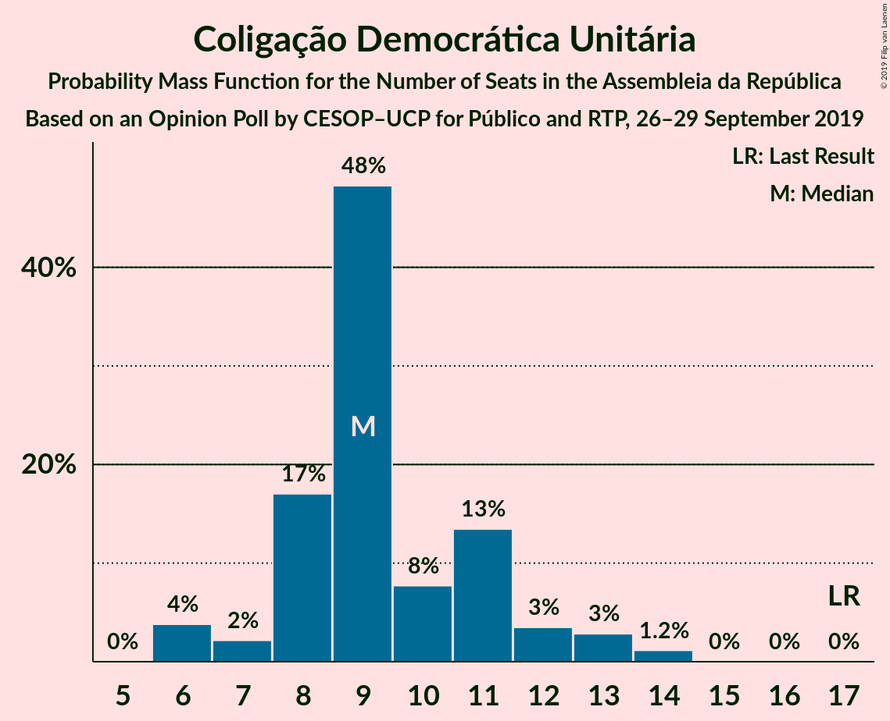
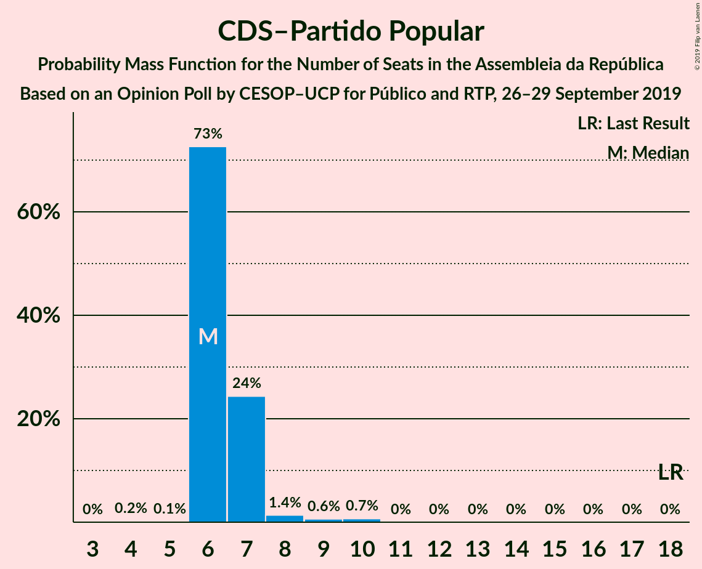
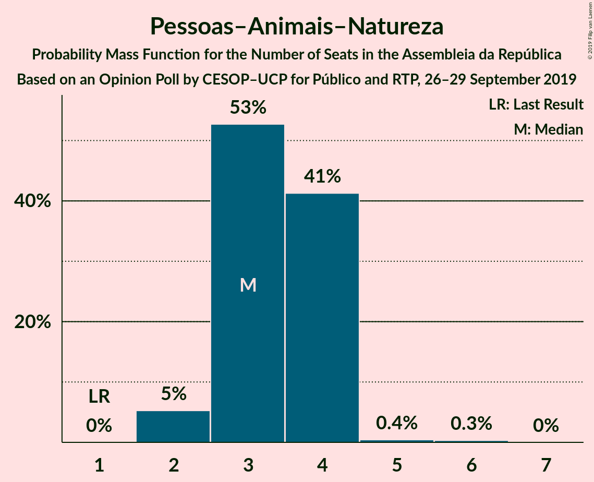

# Opinion Poll by CESOP–UCP for Público and RTP, 26–29 September 2019

<a href="#voting-intentions">Voting Intentions</a> | <a href="#seats">Seats</a> | <a href="#coalitions">Coalitions</a> | <a href="#technical-information">Technical Information</a>

## Voting Intentions

### Confidence Intervals

| Party | Last Result | Poll Result | 80% Confidence Interval | 90% Confidence Interval | 95% Confidence Interval | 99% Confidence Interval |
|:-----:|:-----------:|:-----------:|:-----------------------:|:-----------------------:|:-----------------------:|:-----------------------:|
| Partido Socialista | 32.3% | 36.6% | 35.6–37.7% |35.3–38.1% |35.0–38.3% |34.5–38.9% |
| Partido Social Democrata | 36.9% | 29.7% | 28.7–30.7% |28.4–31.0% |28.1–31.3% |27.6–31.8% |
| Bloco de Esquerda | 10.2% | 9.9% | 9.2–10.6% |9.1–10.8% |8.9–11.0% |8.6–11.3% |
| Coligação Democrática Unitária | 8.2% | 6.0% | 5.4–6.5% |5.3–6.7% |5.2–6.8% |5.0–7.1% |
| CDS–Partido Popular | 36.9% | 5.0% | 4.5–5.5% |4.4–5.6% |4.3–5.8% |4.0–6.0% |
| Pessoas–Animais–Natureza | 1.4% | 3.0% | 2.6–3.4% |2.5–3.5% |2.4–3.6% |2.3–3.8% |
| LIVRE | 0.7% | 1.0% | 0.8–1.3% |0.7–1.3% |0.7–1.4% |0.6–1.5% |
| Iniciativa Liberal | 0.0% | 1.0% | 0.8–1.3% |0.7–1.3% |0.7–1.4% |0.6–1.5% |
| Aliança | 0.0% | 1.0% | 0.8–1.3% |0.7–1.3% |0.7–1.4% |0.6–1.5% |
| Chega | 0.0% | 1.0% | 0.8–1.3% |0.7–1.3% |0.7–1.4% |0.6–1.5% |

*Note:* The poll result column reflects the actual value used in the calculations. Published results may vary slightly, and in addition be rounded to fewer digits.

## Seats

### Confidence Intervals

| Party | Last Result | Median | 80% Confidence Interval | 90% Confidence Interval | 95% Confidence Interval | 99% Confidence Interval |
|:-----:|:-----------:|:------:|:-----------------------:|:-----------------------:|:-----------------------:|:-----------------------:|
| <a href="#partido-socialista">Partido Socialista</a> | 86 | 112 | N/A |N/A |N/A |N/A |
| <a href="#partido-social-democrata">Partido Social Democrata</a> | 89 | 82 | N/A |N/A |N/A |N/A |
| <a href="#bloco-de-esquerda">Bloco de Esquerda</a> | 19 | 18 | N/A |N/A |N/A |N/A |
| <a href="#coligação-democrática-unitária">Coligação Democrática Unitária</a> | 17 | 10 | N/A |N/A |N/A |N/A |
| <a href="#cds–partido-popular">CDS–Partido Popular</a> | 18 | 6 | N/A |N/A |N/A |N/A |
| <a href="#pessoas–animais–natureza">Pessoas–Animais–Natureza</a> | 1 | 2 | N/A |N/A |N/A |N/A |
| <a href="#livre">LIVRE</a> | 0 | 0 | N/A |N/A |N/A |N/A |
| <a href="#iniciativa-liberal">Iniciativa Liberal</a> | 0 | 0 | N/A |N/A |N/A |N/A |
| <a href="#aliança">Aliança</a> | 0 | 0 | N/A |N/A |N/A |N/A |
| <a href="#chega">Chega</a> | 0 | 0 | N/A |N/A |N/A |N/A |

### Partido Socialista

*For a full overview of the results for this party, see the [Partido Socialista](party-partidosocialista.html) page.*

| Number of Seats | Probability | Accumulated | Special Marks |
|:---------------:|:-----------:|:-----------:|:-------------:|
| 86 | 0% | 100% | Last Result |
| 87 | 0% | 100% |  |
| 88 | 0% | 100% |  |
| 89 | 0% | 100% |  |
| 90 | 0% | 100% |  |
| 91 | 0% | 100% |  |
| 92 | 0% | 100% |  |
| 93 | 18% | 99.9% |  |
| 94 | 0% | 82% |  |
| 95 | 0% | 82% |  |
| 96 | 0% | 82% |  |
| 97 | 0% | 82% |  |
| 98 | 0% | 82% |  |
| 99 | 0% | 82% |  |
| 100 | 0% | 82% |  |
| 101 | 0% | 82% |  |
| 102 | 0% | 82% |  |
| 103 | 0% | 82% |  |
| 104 | 0% | 82% |  |
| 105 | 22% | 82% |  |
| 106 | 0% | 60% |  |
| 107 | 0% | 60% |  |
| 108 | 0% | 60% |  |
| 109 | 0.2% | 60% |  |
| 110 | 0% | 60% |  |
| 111 | 0% | 60% |  |
| 112 | 60% | 60% | Median |
| 113 | 0% | 0% |  |

### Partido Social Democrata

*For a full overview of the results for this party, see the [Partido Social Democrata](party-partidosocialdemocrata.html) page.*

| Number of Seats | Probability | Accumulated | Special Marks |
|:---------------:|:-----------:|:-----------:|:-------------:|
| 80 | 0.2% | 100% |  |
| 81 | 22% | 99.8% |  |
| 82 | 60% | 78% | Median |
| 83 | 0% | 18% |  |
| 84 | 0% | 18% |  |
| 85 | 0% | 18% |  |
| 86 | 0% | 18% |  |
| 87 | 0% | 18% |  |
| 88 | 0% | 18% |  |
| 89 | 0% | 18% | Last Result |
| 90 | 0% | 18% |  |
| 91 | 0% | 18% |  |
| 92 | 0% | 18% |  |
| 93 | 0% | 18% |  |
| 94 | 0% | 18% |  |
| 95 | 0% | 18% |  |
| 96 | 0% | 18% |  |
| 97 | 0% | 18% |  |
| 98 | 18% | 18% |  |
| 99 | 0% | 0% |  |

### Bloco de Esquerda

*For a full overview of the results for this party, see the [Bloco de Esquerda](party-blocodeesquerda.html) page.*

| Number of Seats | Probability | Accumulated | Special Marks |
|:---------------:|:-----------:|:-----------:|:-------------:|
| 18 | 60% | 100% | Median |
| 19 | 0% | 40% | Last Result |
| 20 | 18% | 40% |  |
| 21 | 0% | 22% |  |
| 22 | 0% | 22% |  |
| 23 | 22% | 22% |  |
| 24 | 0% | 0% |  |

### Coligação Democrática Unitária

*For a full overview of the results for this party, see the [Coligação Democrática Unitária](party-coligaçãodemocráticaunitária.html) page.*

| Number of Seats | Probability | Accumulated | Special Marks |
|:---------------:|:-----------:|:-----------:|:-------------:|
| 10 | 78% | 100% | Median |
| 11 | 22% | 22% |  |
| 12 | 0% | 0.2% |  |
| 13 | 0.2% | 0.2% |  |
| 14 | 0% | 0% |  |
| 15 | 0% | 0% |  |
| 16 | 0% | 0% |  |
| 17 | 0% | 0% | Last Result |

### CDS–Partido Popular

*For a full overview of the results for this party, see the [CDS–Partido Popular](party-cds–partidopopular.html) page.*

| Number of Seats | Probability | Accumulated | Special Marks |
|:---------------:|:-----------:|:-----------:|:-------------:|
| 6 | 99.9% | 100% | Median |
| 7 | 0% | 0.1% |  |
| 8 | 0% | 0% |  |
| 9 | 0% | 0% |  |
| 10 | 0% | 0% |  |
| 11 | 0% | 0% |  |
| 12 | 0% | 0% |  |
| 13 | 0% | 0% |  |
| 14 | 0% | 0% |  |
| 15 | 0% | 0% |  |
| 16 | 0% | 0% |  |
| 17 | 0% | 0% |  |
| 18 | 0% | 0% | Last Result |

### Pessoas–Animais–Natureza

*For a full overview of the results for this party, see the [Pessoas–Animais–Natureza](party-pessoas–animais–natureza.html) page.*

| Number of Seats | Probability | Accumulated | Special Marks |
|:---------------:|:-----------:|:-----------:|:-------------:|
| 1 | 0% | 100% | Last Result |
| 2 | 60% | 100% | Median |
| 3 | 18% | 40% |  |
| 4 | 22% | 22% |  |
| 5 | 0% | 0% |  |

### LIVRE

*For a full overview of the results for this party, see the [LIVRE](party-livre.html) page.*

| Number of Seats | Probability | Accumulated | Special Marks |
|:---------------:|:-----------:|:-----------:|:-------------:|
| 0 | 100% | 100% | Last Result, Median |

### Iniciativa Liberal

*For a full overview of the results for this party, see the [Iniciativa Liberal](party-iniciativaliberal.html) page.*

| Number of Seats | Probability | Accumulated | Special Marks |
|:---------------:|:-----------:|:-----------:|:-------------:|
| 0 | 100% | 100% | Last Result, Median |

### Aliança

*For a full overview of the results for this party, see the [Aliança](party-aliança.html) page.*

| Number of Seats | Probability | Accumulated | Special Marks |
|:---------------:|:-----------:|:-----------:|:-------------:|
| 0 | 100% | 100% | Last Result, Median |

### Chega

*For a full overview of the results for this party, see the [Chega](party-chega.html) page.*

| Number of Seats | Probability | Accumulated | Special Marks |
|:---------------:|:-----------:|:-----------:|:-------------:|
| 0 | 99.8% | 100% | Last Result, Median |
| 1 | 0% | 0.2% |  |
| 2 | 0.2% | 0.2% |  |
| 3 | 0% | 0% |  |

## Coalitions

### Confidence Intervals

| Coalition | Last Result | Median | Majority? | 80% Confidence Interval | 90% Confidence Interval | 95% Confidence Interval | 99% Confidence Interval |
|:---------:|:-----------:|:------:|:---------:|:-----------------------:|:-----------------------:|:-----------------------:|:-----------------------:|
| Partido Socialista – Bloco de Esquerda – Coligação Democrática Unitária | 122 | 140 | 100% | 123–140 | 123–140 | 123–140 | 123–140 |
| Partido Socialista – Bloco de Esquerda | 105 | 130 | 82% | 113–130 | 113–130 | 113–130 | 113–130 |
| Partido Socialista – Coligação Democrática Unitária | 103 | 122 | 82% | 103–122 | 103–122 | 103–122 | 103–122 |
| Partido Socialista | 86 | 112 | 0% | 93–112 | 93–112 | 93–112 | 93–112 |
| Partido Social Democrata – CDS–Partido Popular | 107 | 88 | 0% | 87–104 | 87–104 | 87–104 | 87–104 |

### Partido Socialista – Bloco de Esquerda – Coligação Democrática Unitária

| Number of Seats | Probability | Accumulated | Special Marks |
|:---------------:|:-----------:|:-----------:|:-------------:|
| 122 | 0% | 100% | Last Result |
| 123 | 18% | 100% |  |
| 124 | 0% | 82% |  |
| 125 | 0% | 82% |  |
| 126 | 0% | 82% |  |
| 127 | 0% | 82% |  |
| 128 | 0% | 82% |  |
| 129 | 0% | 82% |  |
| 130 | 0% | 82% |  |
| 131 | 0% | 82% |  |
| 132 | 0% | 82% |  |
| 133 | 0% | 82% |  |
| 134 | 0% | 82% |  |
| 135 | 0% | 82% |  |
| 136 | 0% | 82% |  |
| 137 | 0% | 82% |  |
| 138 | 0% | 82% |  |
| 139 | 22% | 82% |  |
| 140 | 60% | 60% | Median |
| 141 | 0% | 0% |  |

### Partido Socialista – Bloco de Esquerda

| Number of Seats | Probability | Accumulated | Special Marks |
|:---------------:|:-----------:|:-----------:|:-------------:|
| 105 | 0% | 100% | Last Result |
| 106 | 0% | 100% |  |
| 107 | 0% | 100% |  |
| 108 | 0% | 100% |  |
| 109 | 0% | 100% |  |
| 110 | 0% | 100% |  |
| 111 | 0% | 100% |  |
| 112 | 0% | 100% |  |
| 113 | 18% | 100% |  |
| 114 | 0% | 82% |  |
| 115 | 0% | 82% |  |
| 116 | 0% | 82% | Majority |
| 117 | 0% | 82% |  |
| 118 | 0% | 82% |  |
| 119 | 0% | 82% |  |
| 120 | 0% | 82% |  |
| 121 | 0% | 82% |  |
| 122 | 0% | 82% |  |
| 123 | 0% | 82% |  |
| 124 | 0% | 82% |  |
| 125 | 0% | 82% |  |
| 126 | 0% | 82% |  |
| 127 | 0.2% | 82% |  |
| 128 | 22% | 82% |  |
| 129 | 0% | 60% |  |
| 130 | 60% | 60% | Median |
| 131 | 0% | 0% |  |

### Partido Socialista – Coligação Democrática Unitária

| Number of Seats | Probability | Accumulated | Special Marks |
|:---------------:|:-----------:|:-----------:|:-------------:|
| 103 | 18% | 100% | Last Result |
| 104 | 0% | 82% |  |
| 105 | 0% | 82% |  |
| 106 | 0% | 82% |  |
| 107 | 0% | 82% |  |
| 108 | 0% | 82% |  |
| 109 | 0% | 82% |  |
| 110 | 0% | 82% |  |
| 111 | 0% | 82% |  |
| 112 | 0% | 82% |  |
| 113 | 0% | 82% |  |
| 114 | 0% | 82% |  |
| 115 | 0% | 82% |  |
| 116 | 22% | 82% | Majority |
| 117 | 0% | 60% |  |
| 118 | 0% | 60% |  |
| 119 | 0% | 60% |  |
| 120 | 0% | 60% |  |
| 121 | 0% | 60% |  |
| 122 | 60% | 60% | Median |
| 123 | 0% | 0% |  |

### Partido Socialista

| Number of Seats | Probability | Accumulated | Special Marks |
|:---------------:|:-----------:|:-----------:|:-------------:|
| 86 | 0% | 100% | Last Result |
| 87 | 0% | 100% |  |
| 88 | 0% | 100% |  |
| 89 | 0% | 100% |  |
| 90 | 0% | 100% |  |
| 91 | 0% | 100% |  |
| 92 | 0% | 100% |  |
| 93 | 18% | 99.9% |  |
| 94 | 0% | 82% |  |
| 95 | 0% | 82% |  |
| 96 | 0% | 82% |  |
| 97 | 0% | 82% |  |
| 98 | 0% | 82% |  |
| 99 | 0% | 82% |  |
| 100 | 0% | 82% |  |
| 101 | 0% | 82% |  |
| 102 | 0% | 82% |  |
| 103 | 0% | 82% |  |
| 104 | 0% | 82% |  |
| 105 | 22% | 82% |  |
| 106 | 0% | 60% |  |
| 107 | 0% | 60% |  |
| 108 | 0% | 60% |  |
| 109 | 0.2% | 60% |  |
| 110 | 0% | 60% |  |
| 111 | 0% | 60% |  |
| 112 | 60% | 60% | Median |
| 113 | 0% | 0% |  |

### Partido Social Democrata – CDS–Partido Popular

| Number of Seats | Probability | Accumulated | Special Marks |
|:---------------:|:-----------:|:-----------:|:-------------:|
| 86 | 0.2% | 100% |  |
| 87 | 22% | 99.8% |  |
| 88 | 60% | 78% | Median |
| 89 | 0% | 18% |  |
| 90 | 0% | 18% |  |
| 91 | 0% | 18% |  |
| 92 | 0% | 18% |  |
| 93 | 0% | 18% |  |
| 94 | 0% | 18% |  |
| 95 | 0% | 18% |  |
| 96 | 0% | 18% |  |
| 97 | 0% | 18% |  |
| 98 | 0% | 18% |  |
| 99 | 0% | 18% |  |
| 100 | 0% | 18% |  |
| 101 | 0% | 18% |  |
| 102 | 0% | 18% |  |
| 103 | 0% | 18% |  |
| 104 | 18% | 18% |  |
| 105 | 0% | 0% |  |
| 106 | 0% | 0% |  |
| 107 | 0% | 0% | Last Result |

## Technical Information

### Opinion Poll

+ **Polling firm:** CESOP–UCP
+ **Commissioner(s):** Público and RTP
+ **Fieldwork period:** 26–29 September 2019

### Calculations

+ **Sample size:** 3226
+ **Simulations done:** 32
+ **Error estimate:** 3.00%

