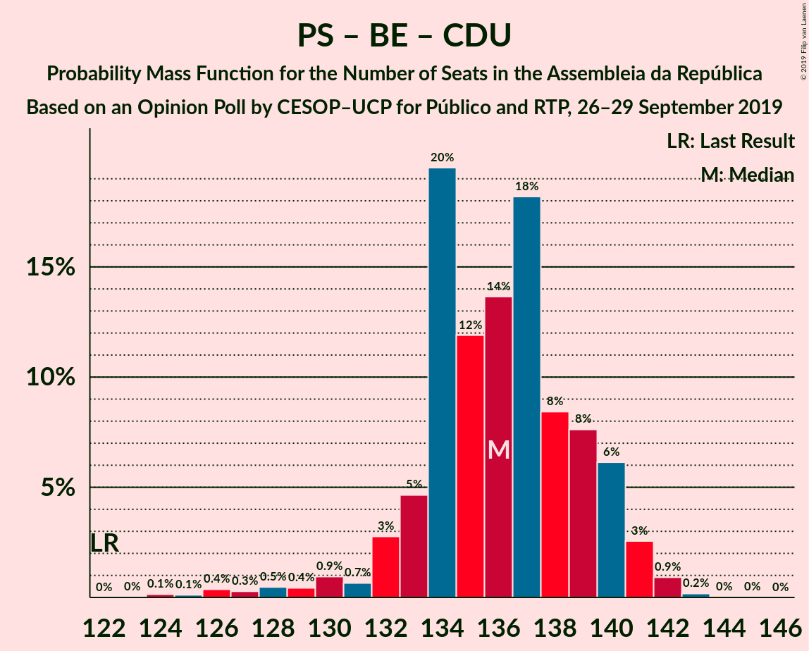
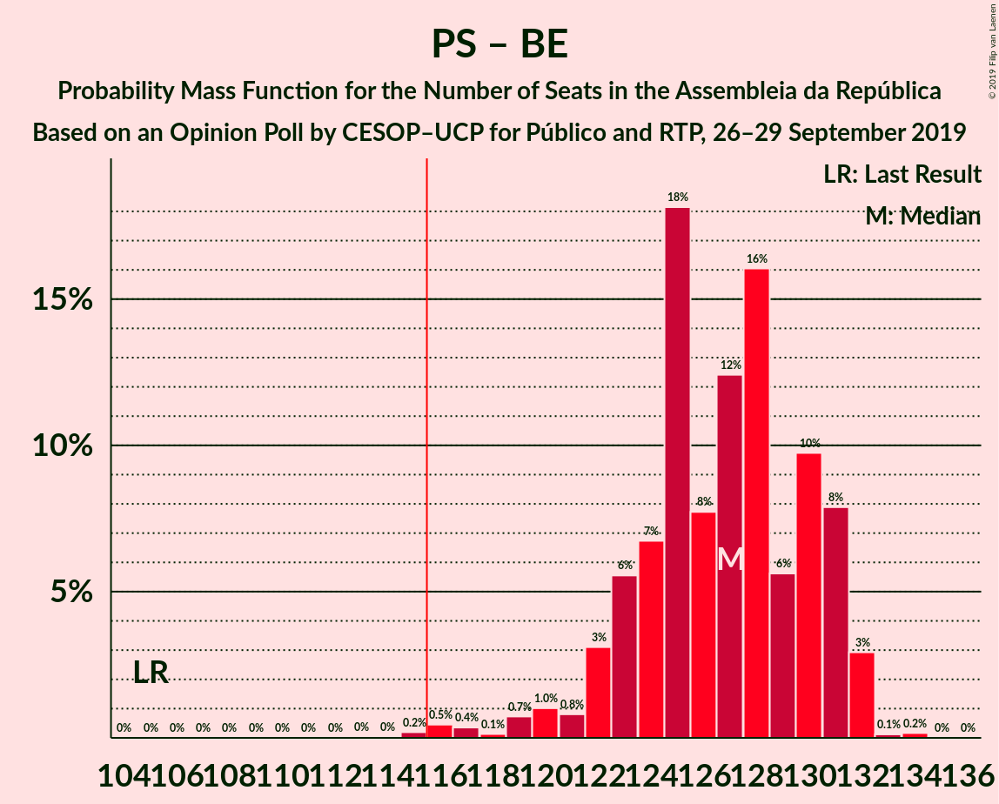

# Opinion Poll by CESOP–UCP for Público and RTP, 26–29 September 2019

<a href="#voting-intentions">Voting Intentions</a> | <a href="#seats">Seats</a> | <a href="#coalitions">Coalitions</a> | <a href="#technical-information">Technical Information</a>

## Voting Intentions

### Confidence Intervals

| Party | Last Result | Poll Result | 80% Confidence Interval | 90% Confidence Interval | 95% Confidence Interval | 99% Confidence Interval |
|:-----:|:-----------:|:-----------:|:-----------------------:|:-----------------------:|:-----------------------:|:-----------------------:|
| Partido Socialista | 32.3% | 36.6% | 35.6–37.7% |35.3–38.1% |35.0–38.3% |34.5–38.9% |
| Partido Social Democrata | 36.9% | 29.7% | 28.7–30.7% |28.4–31.0% |28.1–31.3% |27.6–31.8% |
| Bloco de Esquerda | 10.2% | 9.9% | 9.2–10.6% |9.1–10.8% |8.9–11.0% |8.6–11.3% |
| Coligação Democrática Unitária | 8.2% | 6.0% | 5.4–6.5% |5.3–6.7% |5.2–6.8% |5.0–7.1% |
| CDS–Partido Popular | 36.9% | 5.0% | 4.5–5.5% |4.4–5.6% |4.3–5.8% |4.0–6.0% |
| Pessoas–Animais–Natureza | 1.4% | 3.0% | 2.6–3.4% |2.5–3.5% |2.4–3.6% |2.3–3.8% |
| LIVRE | 0.7% | 1.0% | 0.8–1.3% |0.7–1.3% |0.7–1.4% |0.6–1.5% |
| Iniciativa Liberal | 0.0% | 1.0% | 0.8–1.3% |0.7–1.3% |0.7–1.4% |0.6–1.5% |
| Aliança | 0.0% | 1.0% | 0.8–1.3% |0.7–1.3% |0.7–1.4% |0.6–1.5% |
| Chega | 0.0% | 1.0% | 0.8–1.3% |0.7–1.3% |0.7–1.4% |0.6–1.5% |

*Note:* The poll result column reflects the actual value used in the calculations. Published results may vary slightly, and in addition be rounded to fewer digits.

## Seats

### Confidence Intervals

| Party | Last Result | Median | 80% Confidence Interval | 90% Confidence Interval | 95% Confidence Interval | 99% Confidence Interval |
|:-----:|:-----------:|:------:|:-----------------------:|:-----------------------:|:-----------------------:|:-----------------------:|
| <a href="#partido-socialista">Partido Socialista</a> | 86 | 106 | 103–108 |101–109 |99–112 |97–112 |
| <a href="#partido-social-democrata">Partido Social Democrata</a> | 89 | 85 | 81–86 |80–87 |79–90 |78–93 |
| <a href="#bloco-de-esquerda">Bloco de Esquerda</a> | 19 | 19 | 19–23 |18–24 |18–24 |17–24 |
| <a href="#coligação-democrática-unitária">Coligação Democrática Unitária</a> | 17 | 9 | 8–11 |8–12 |8–13 |6–14 |
| <a href="#cds–partido-popular">CDS–Partido Popular</a> | 18 | 6 | 6–7 |6–7 |6–10 |5–10 |
| <a href="#pessoas–animais–natureza">Pessoas–Animais–Natureza</a> | 1 | 3 | 3–4 |3–4 |2–4 |2–4 |
| <a href="#livre">LIVRE</a> | 0 | 1 | 0–1 |0–1 |0–1 |0–1 |
| <a href="#iniciativa-liberal">Iniciativa Liberal</a> | 0 | 0 | 0 |0 |0 |0 |
| <a href="#aliança">Aliança</a> | 0 | 0 | 0 |0 |0 |0 |
| <a href="#chega">Chega</a> | 0 | 0 | 0 |0 |0 |0 |

### Partido Socialista

*For a full overview of the results for this party, see the [Partido Socialista](party-partidosocialista.html) page.*

| Number of Seats | Probability | Accumulated | Special Marks |
|:---------------:|:-----------:|:-----------:|:-------------:|
| 86 | 0% | 100% | Last Result |
| 87 | 0% | 100% |  |
| 88 | 0% | 100% |  |
| 89 | 0% | 100% |  |
| 90 | 0% | 100% |  |
| 91 | 0% | 100% |  |
| 92 | 0% | 100% |  |
| 93 | 0.3% | 100% |  |
| 94 | 0% | 99.7% |  |
| 95 | 0% | 99.7% |  |
| 96 | 0.1% | 99.7% |  |
| 97 | 0.5% | 99.5% |  |
| 98 | 0.1% | 99.1% |  |
| 99 | 3% | 99.0% |  |
| 100 | 0.3% | 96% |  |
| 101 | 1.2% | 95% |  |
| 102 | 4% | 94% |  |
| 103 | 8% | 90% |  |
| 104 | 4% | 82% |  |
| 105 | 20% | 78% |  |
| 106 | 42% | 59% | Median |
| 107 | 5% | 17% |  |
| 108 | 6% | 12% |  |
| 109 | 2% | 6% |  |
| 110 | 0.3% | 4% |  |
| 111 | 0.4% | 4% |  |
| 112 | 3% | 3% |  |
| 113 | 0.1% | 0.1% |  |
| 114 | 0% | 0% |  |

### Partido Social Democrata

*For a full overview of the results for this party, see the [Partido Social Democrata](party-partidosocialdemocrata.html) page.*

| Number of Seats | Probability | Accumulated | Special Marks |
|:---------------:|:-----------:|:-----------:|:-------------:|
| 77 | 0.3% | 100% |  |
| 78 | 1.1% | 99.7% |  |
| 79 | 2% | 98.6% |  |
| 80 | 2% | 96% |  |
| 81 | 6% | 94% |  |
| 82 | 2% | 89% |  |
| 83 | 16% | 86% |  |
| 84 | 14% | 70% |  |
| 85 | 23% | 56% | Median |
| 86 | 28% | 33% |  |
| 87 | 0.8% | 6% |  |
| 88 | 1.4% | 5% |  |
| 89 | 0.4% | 4% | Last Result |
| 90 | 1.3% | 3% |  |
| 91 | 1.0% | 2% |  |
| 92 | 0.2% | 0.9% |  |
| 93 | 0.4% | 0.7% |  |
| 94 | 0.1% | 0.3% |  |
| 95 | 0% | 0.2% |  |
| 96 | 0.1% | 0.2% |  |
| 97 | 0.1% | 0.1% |  |
| 98 | 0% | 0% |  |

### Bloco de Esquerda

*For a full overview of the results for this party, see the [Bloco de Esquerda](party-blocodeesquerda.html) page.*

| Number of Seats | Probability | Accumulated | Special Marks |
|:---------------:|:-----------:|:-----------:|:-------------:|
| 17 | 0.9% | 100% |  |
| 18 | 8% | 99.1% |  |
| 19 | 50% | 91% | Last Result, Median |
| 20 | 2% | 42% |  |
| 21 | 7% | 40% |  |
| 22 | 2% | 33% |  |
| 23 | 23% | 31% |  |
| 24 | 8% | 8% |  |
| 25 | 0.2% | 0.2% |  |
| 26 | 0% | 0% |  |

### Coligação Democrática Unitária

*For a full overview of the results for this party, see the [Coligação Democrática Unitária](party-coligaçãodemocráticaunitária.html) page.*

| Number of Seats | Probability | Accumulated | Special Marks |
|:---------------:|:-----------:|:-----------:|:-------------:|
| 5 | 0.1% | 100% |  |
| 6 | 2% | 99.9% |  |
| 7 | 0.3% | 98% |  |
| 8 | 16% | 98% |  |
| 9 | 46% | 82% | Median |
| 10 | 21% | 36% |  |
| 11 | 9% | 15% |  |
| 12 | 3% | 6% |  |
| 13 | 2% | 3% |  |
| 14 | 0.8% | 0.8% |  |
| 15 | 0% | 0% |  |
| 16 | 0% | 0% |  |
| 17 | 0% | 0% | Last Result |

### CDS–Partido Popular

*For a full overview of the results for this party, see the [CDS–Partido Popular](party-cds–partidopopular.html) page.*

| Number of Seats | Probability | Accumulated | Special Marks |
|:---------------:|:-----------:|:-----------:|:-------------:|
| 4 | 0.2% | 100% |  |
| 5 | 0.6% | 99.8% |  |
| 6 | 74% | 99.2% | Median |
| 7 | 21% | 25% |  |
| 8 | 0.3% | 4% |  |
| 9 | 0.2% | 4% |  |
| 10 | 3% | 3% |  |
| 11 | 0% | 0% |  |
| 12 | 0% | 0% |  |
| 13 | 0% | 0% |  |
| 14 | 0% | 0% |  |
| 15 | 0% | 0% |  |
| 16 | 0% | 0% |  |
| 17 | 0% | 0% |  |
| 18 | 0% | 0% | Last Result |

### Pessoas–Animais–Natureza

*For a full overview of the results for this party, see the [Pessoas–Animais–Natureza](party-pessoas–animais–natureza.html) page.*

| Number of Seats | Probability | Accumulated | Special Marks |
|:---------------:|:-----------:|:-----------:|:-------------:|
| 1 | 0% | 100% | Last Result |
| 2 | 4% | 100% |  |
| 3 | 62% | 96% | Median |
| 4 | 34% | 34% |  |
| 5 | 0.1% | 0.2% |  |
| 6 | 0.1% | 0.1% |  |
| 7 | 0% | 0% |  |

### LIVRE

*For a full overview of the results for this party, see the [LIVRE](party-livre.html) page.*

| Number of Seats | Probability | Accumulated | Special Marks |
|:---------------:|:-----------:|:-----------:|:-------------:|
| 0 | 32% | 100% | Last Result |
| 1 | 68% | 68% | Median |
| 2 | 0% | 0% |  |

### Iniciativa Liberal

*For a full overview of the results for this party, see the [Iniciativa Liberal](party-iniciativaliberal.html) page.*

| Number of Seats | Probability | Accumulated | Special Marks |
|:---------------:|:-----------:|:-----------:|:-------------:|
| 0 | 100% | 100% | Last Result, Median |

### Aliança

*For a full overview of the results for this party, see the [Aliança](party-aliança.html) page.*

| Number of Seats | Probability | Accumulated | Special Marks |
|:---------------:|:-----------:|:-----------:|:-------------:|
| 0 | 100% | 100% | Last Result, Median |

### Chega

*For a full overview of the results for this party, see the [Chega](party-chega.html) page.*

| Number of Seats | Probability | Accumulated | Special Marks |
|:---------------:|:-----------:|:-----------:|:-------------:|
| 0 | 100% | 100% | Last Result, Median |

## Coalitions

### Confidence Intervals

| Coalition | Last Result | Median | Majority? | 80% Confidence Interval | 90% Confidence Interval | 95% Confidence Interval | 99% Confidence Interval |
|:---------:|:-----------:|:------:|:---------:|:-----------------------:|:-----------------------:|:-----------------------:|:-----------------------:|
| Partido Socialista – Bloco de Esquerda – Coligação Democrática Unitária | 122 | 134 | 100% | 133–138 | 130–139 | 129–140 | 127–142 |
| Partido Socialista – Bloco de Esquerda | 105 | 125 | 99.9% | 124–129 | 121–130 | 117–131 | 116–132 |
| Partido Socialista – Coligação Democrática Unitária | 103 | 115 | 19% | 113–117 | 111–119 | 109–121 | 105–121 |
| Partido Socialista | 86 | 106 | 0% | 103–108 | 101–109 | 99–112 | 97–112 |
| Partido Social Democrata – CDS–Partido Popular | 107 | 91 | 0% | 88–92 | 87–95 | 85–97 | 84–100 |

### Partido Socialista – Bloco de Esquerda – Coligação Democrática Unitária

| Number of Seats | Probability | Accumulated | Special Marks |
|:---------------:|:-----------:|:-----------:|:-------------:|
| 122 | 0% | 100% | Last Result |
| 123 | 0% | 100% |  |
| 124 | 0.1% | 100% |  |
| 125 | 0% | 99.8% |  |
| 126 | 0.1% | 99.8% |  |
| 127 | 1.3% | 99.7% |  |
| 128 | 0.1% | 98% |  |
| 129 | 2% | 98% |  |
| 130 | 2% | 97% |  |
| 131 | 0.1% | 95% |  |
| 132 | 1.3% | 95% |  |
| 133 | 15% | 94% |  |
| 134 | 31% | 79% | Median |
| 135 | 7% | 47% |  |
| 136 | 4% | 40% |  |
| 137 | 10% | 37% |  |
| 138 | 19% | 27% |  |
| 139 | 3% | 8% |  |
| 140 | 3% | 4% |  |
| 141 | 0.4% | 2% |  |
| 142 | 1.0% | 1.3% |  |
| 143 | 0% | 0.2% |  |
| 144 | 0% | 0.2% |  |
| 145 | 0.2% | 0.2% |  |
| 146 | 0% | 0% |  |

### Partido Socialista – Bloco de Esquerda

| Number of Seats | Probability | Accumulated | Special Marks |
|:---------------:|:-----------:|:-----------:|:-------------:|
| 105 | 0% | 100% | Last Result |
| 106 | 0% | 100% |  |
| 107 | 0% | 100% |  |
| 108 | 0% | 100% |  |
| 109 | 0% | 100% |  |
| 110 | 0% | 100% |  |
| 111 | 0% | 100% |  |
| 112 | 0% | 100% |  |
| 113 | 0% | 100% |  |
| 114 | 0% | 100% |  |
| 115 | 0.1% | 100% |  |
| 116 | 0.7% | 99.9% | Majority |
| 117 | 2% | 99.1% |  |
| 118 | 0.2% | 97% |  |
| 119 | 0.1% | 97% |  |
| 120 | 0.9% | 97% |  |
| 121 | 2% | 96% |  |
| 122 | 1.1% | 94% |  |
| 123 | 3% | 93% |  |
| 124 | 2% | 90% |  |
| 125 | 43% | 88% | Median |
| 126 | 12% | 46% |  |
| 127 | 4% | 34% |  |
| 128 | 16% | 29% |  |
| 129 | 7% | 13% |  |
| 130 | 3% | 6% |  |
| 131 | 2% | 3% |  |
| 132 | 0.6% | 0.8% |  |
| 133 | 0.2% | 0.2% |  |
| 134 | 0% | 0% |  |

### Partido Socialista – Coligação Democrática Unitária

| Number of Seats | Probability | Accumulated | Special Marks |
|:---------------:|:-----------:|:-----------:|:-------------:|
| 103 | 0.3% | 100% | Last Result |
| 104 | 0.1% | 99.7% |  |
| 105 | 0.2% | 99.6% |  |
| 106 | 0.2% | 99.4% |  |
| 107 | 0.1% | 99.3% |  |
| 108 | 1.4% | 99.2% |  |
| 109 | 0.4% | 98% |  |
| 110 | 1.3% | 97% |  |
| 111 | 4% | 96% |  |
| 112 | 1.3% | 92% |  |
| 113 | 4% | 91% |  |
| 114 | 25% | 87% |  |
| 115 | 44% | 63% | Median |
| 116 | 7% | 19% | Majority |
| 117 | 4% | 12% |  |
| 118 | 1.4% | 8% |  |
| 119 | 2% | 7% |  |
| 120 | 0.1% | 5% |  |
| 121 | 4% | 4% |  |
| 122 | 0.2% | 0.3% |  |
| 123 | 0.1% | 0.1% |  |
| 124 | 0% | 0% |  |

### Partido Socialista

| Number of Seats | Probability | Accumulated | Special Marks |
|:---------------:|:-----------:|:-----------:|:-------------:|
| 86 | 0% | 100% | Last Result |
| 87 | 0% | 100% |  |
| 88 | 0% | 100% |  |
| 89 | 0% | 100% |  |
| 90 | 0% | 100% |  |
| 91 | 0% | 100% |  |
| 92 | 0% | 100% |  |
| 93 | 0.3% | 100% |  |
| 94 | 0% | 99.7% |  |
| 95 | 0% | 99.7% |  |
| 96 | 0.1% | 99.7% |  |
| 97 | 0.5% | 99.5% |  |
| 98 | 0.1% | 99.1% |  |
| 99 | 3% | 99.0% |  |
| 100 | 0.3% | 96% |  |
| 101 | 1.2% | 95% |  |
| 102 | 4% | 94% |  |
| 103 | 8% | 90% |  |
| 104 | 4% | 82% |  |
| 105 | 20% | 78% |  |
| 106 | 42% | 59% | Median |
| 107 | 5% | 17% |  |
| 108 | 6% | 12% |  |
| 109 | 2% | 6% |  |
| 110 | 0.3% | 4% |  |
| 111 | 0.4% | 4% |  |
| 112 | 3% | 3% |  |
| 113 | 0.1% | 0.1% |  |
| 114 | 0% | 0% |  |

### Partido Social Democrata – CDS–Partido Popular

| Number of Seats | Probability | Accumulated | Special Marks |
|:---------------:|:-----------:|:-----------:|:-------------:|
| 83 | 0.2% | 100% |  |
| 84 | 0.9% | 99.8% |  |
| 85 | 3% | 98.9% |  |
| 86 | 0.4% | 96% |  |
| 87 | 5% | 96% |  |
| 88 | 2% | 90% |  |
| 89 | 16% | 88% |  |
| 90 | 13% | 72% |  |
| 91 | 10% | 59% | Median |
| 92 | 42% | 50% |  |
| 93 | 1.0% | 7% |  |
| 94 | 1.3% | 6% |  |
| 95 | 2% | 5% |  |
| 96 | 0.3% | 3% |  |
| 97 | 1.5% | 3% |  |
| 98 | 0.7% | 2% |  |
| 99 | 0.3% | 0.9% |  |
| 100 | 0.4% | 0.6% |  |
| 101 | 0.1% | 0.2% |  |
| 102 | 0.1% | 0.2% |  |
| 103 | 0.1% | 0.1% |  |
| 104 | 0% | 0% |  |
| 105 | 0% | 0% |  |
| 106 | 0% | 0% |  |
| 107 | 0% | 0% | Last Result |

## Technical Information

### Opinion Poll

+ **Polling firm:** CESOP–UCP
+ **Commissioner(s):** Público and RTP
+ **Fieldwork period:** 26–29 September 2019

### Calculations

+ **Sample size:** 3226
+ **Simulations done:** 131,072
+ **Error estimate:** 1.05%

