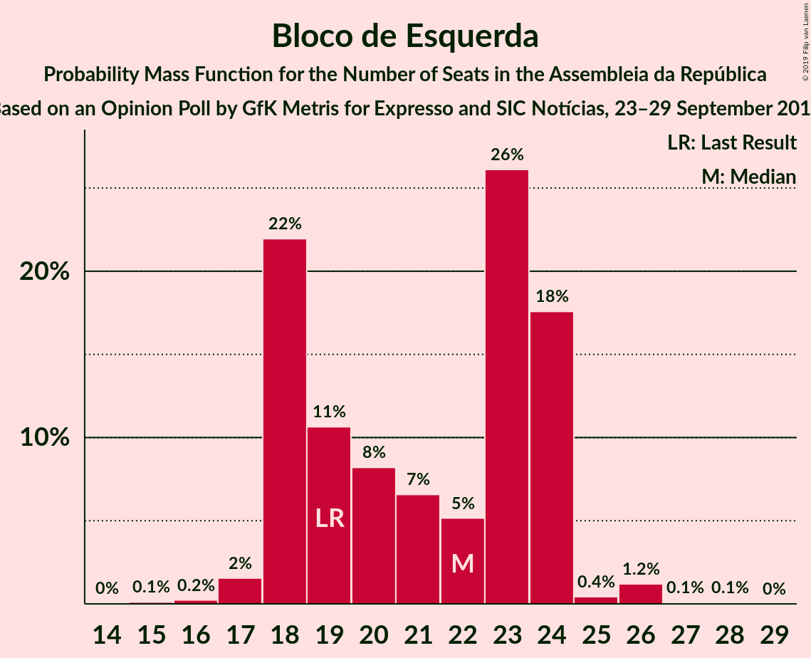
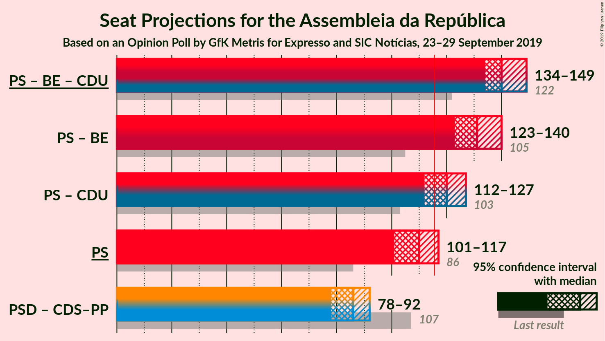
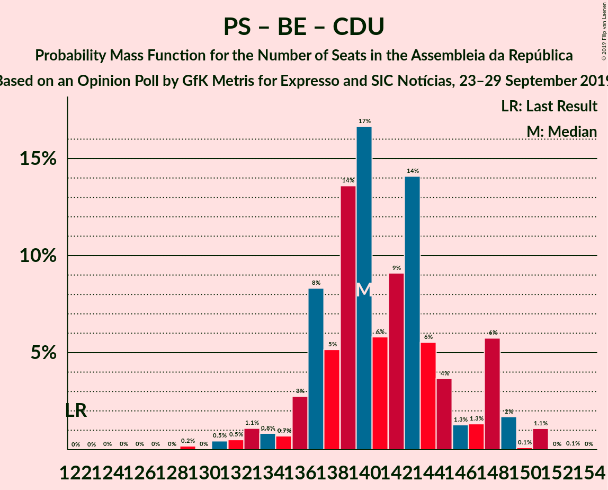
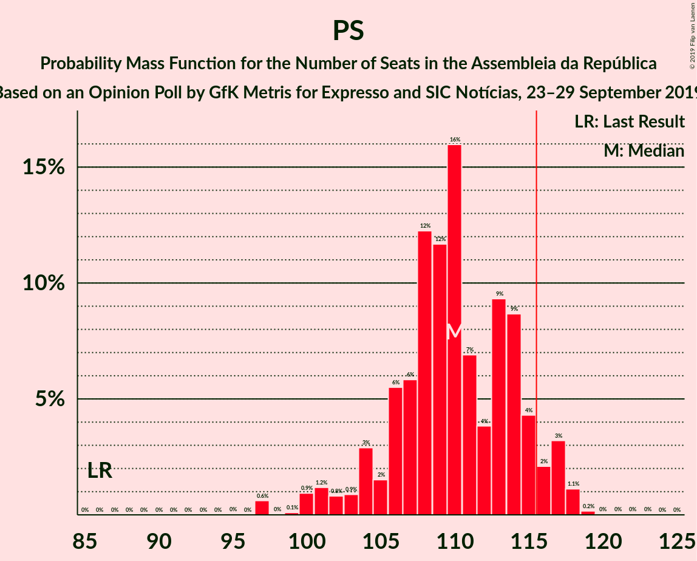

# Opinion Poll by GfK Metris for Expresso and SIC Notícias, 23–29 September 2019

<a href="#voting-intentions">Voting Intentions</a> | <a href="#seats">Seats</a> | <a href="#coalitions">Coalitions</a> | <a href="#technical-information">Technical Information</a>

## Voting Intentions

### Confidence Intervals

| Party | Last Result | Poll Result | 80% Confidence Interval | 90% Confidence Interval | 95% Confidence Interval | 99% Confidence Interval |
|:-----:|:-----------:|:-----------:|:-----------------------:|:-----------------------:|:-----------------------:|:-----------------------:|
| Partido Socialista | 32.3% | 38.6% | 36.9–40.4% |36.5–40.9% |36.1–41.3% |35.3–42.1% |
| Partido Social Democrata | 36.9% | 28.4% | 26.9–30.1% |26.4–30.5% |26.0–30.9% |25.3–31.7% |
| Bloco de Esquerda | 10.2% | 10.2% | 9.2–11.3% |8.9–11.6% |8.6–11.9% |8.2–12.5% |
| Coligação Democrática Unitária | 8.2% | 6.1% | 5.3–7.0% |5.1–7.3% |4.9–7.5% |4.6–8.0% |
| CDS–Partido Popular | 36.9% | 5.1% | 4.4–6.0% |4.2–6.2% |4.1–6.4% |3.7–6.9% |
| Pessoas–Animais–Natureza | 1.4% | 3.1% | 2.5–3.8% |2.4–4.0% |2.3–4.2% |2.0–4.5% |
| LIVRE | 0.7% | 0.5% | 0.3–0.9% |0.3–1.0% |0.3–1.1% |0.2–1.3% |
| Chega | 0.0% | 0.4% | 0.2–0.7% |0.2–0.8% |0.2–0.9% |0.1–1.1% |
| Aliança | 0.0% | 0.3% | 0.2–0.6% |0.1–0.7% |0.1–0.8% |0.1–0.9% |
| Iniciativa Liberal | 0.0% | 0.2% | 0.1–0.5% |0.1–0.6% |0.1–0.7% |0.0–0.8% |

*Note:* The poll result column reflects the actual value used in the calculations. Published results may vary slightly, and in addition be rounded to fewer digits.

## Seats

### Confidence Intervals

| Party | Last Result | Median | 80% Confidence Interval | 90% Confidence Interval | 95% Confidence Interval | 99% Confidence Interval |
|:-----:|:-----------:|:------:|:-----------------------:|:-----------------------:|:-----------------------:|:-----------------------:|
| <a href="#partido-socialista">Partido Socialista</a> | 86 | 110 | 106–115 |104–116 |101–117 |97–118 |
| <a href="#partido-social-democrata">Partido Social Democrata</a> | 89 | 79 | 73–83 |71–84 |71–85 |69–88 |
| <a href="#bloco-de-esquerda">Bloco de Esquerda</a> | 19 | 22 | 18–24 |18–24 |18–24 |17–26 |
| <a href="#coligação-democrática-unitária">Coligação Democrática Unitária</a> | 17 | 9 | 7–13 |6–15 |6–15 |6–16 |
| <a href="#cds–partido-popular">CDS–Partido Popular</a> | 18 | 6 | 6–8 |6–9 |4–10 |4–11 |
| <a href="#pessoas–animais–natureza">Pessoas–Animais–Natureza</a> | 1 | 3 | 3–4 |2–6 |2–6 |2–6 |
| <a href="#livre">LIVRE</a> | 0 | 0 | 0 |0–1 |0–1 |0–1 |
| <a href="#chega">Chega</a> | 0 | 0 | 0 |0 |0 |0 |
| <a href="#aliança">Aliança</a> | 0 | 0 | 0 |0 |0 |0 |
| <a href="#iniciativa-liberal">Iniciativa Liberal</a> | 0 | 0 | 0 |0 |0 |0 |

### Partido Socialista

*For a full overview of the results for this party, see the [Partido Socialista](party-partidosocialista.html) page.*

| Number of Seats | Probability | Accumulated | Special Marks |
|:---------------:|:-----------:|:-----------:|:-------------:|
| 86 | 0% | 100% | Last Result |
| 87 | 0% | 100% |  |
| 88 | 0% | 100% |  |
| 89 | 0% | 100% |  |
| 90 | 0% | 100% |  |
| 91 | 0% | 100% |  |
| 92 | 0% | 100% |  |
| 93 | 0% | 100% |  |
| 94 | 0% | 100% |  |
| 95 | 0% | 100% |  |
| 96 | 0% | 100% |  |
| 97 | 0.6% | 99.9% |  |
| 98 | 0% | 99.3% |  |
| 99 | 0.1% | 99.3% |  |
| 100 | 0.9% | 99.2% |  |
| 101 | 1.2% | 98% |  |
| 102 | 0.8% | 97% |  |
| 103 | 0.9% | 96% |  |
| 104 | 3% | 95% |  |
| 105 | 2% | 92% |  |
| 106 | 6% | 91% |  |
| 107 | 6% | 85% |  |
| 108 | 12% | 80% |  |
| 109 | 12% | 67% |  |
| 110 | 16% | 56% | Median |
| 111 | 7% | 40% |  |
| 112 | 4% | 33% |  |
| 113 | 9% | 29% |  |
| 114 | 9% | 20% |  |
| 115 | 4% | 11% |  |
| 116 | 2% | 7% | Majority |
| 117 | 3% | 5% |  |
| 118 | 1.1% | 1.4% |  |
| 119 | 0.2% | 0.3% |  |
| 120 | 0% | 0.1% |  |
| 121 | 0% | 0.1% |  |
| 122 | 0% | 0% |  |

### Partido Social Democrata

*For a full overview of the results for this party, see the [Partido Social Democrata](party-partidosocialdemocrata.html) page.*

| Number of Seats | Probability | Accumulated | Special Marks |
|:---------------:|:-----------:|:-----------:|:-------------:|
| 66 | 0.1% | 100% |  |
| 67 | 0% | 99.9% |  |
| 68 | 0% | 99.8% |  |
| 69 | 0.5% | 99.8% |  |
| 70 | 0.4% | 99.3% |  |
| 71 | 7% | 98.9% |  |
| 72 | 0.5% | 92% |  |
| 73 | 1.4% | 91% |  |
| 74 | 2% | 90% |  |
| 75 | 4% | 88% |  |
| 76 | 4% | 84% |  |
| 77 | 8% | 80% |  |
| 78 | 20% | 72% |  |
| 79 | 10% | 52% | Median |
| 80 | 5% | 42% |  |
| 81 | 23% | 37% |  |
| 82 | 2% | 14% |  |
| 83 | 7% | 12% |  |
| 84 | 2% | 5% |  |
| 85 | 1.1% | 3% |  |
| 86 | 0.9% | 2% |  |
| 87 | 0.3% | 1.1% |  |
| 88 | 0.4% | 0.8% |  |
| 89 | 0.1% | 0.3% | Last Result |
| 90 | 0% | 0.2% |  |
| 91 | 0.2% | 0.2% |  |
| 92 | 0% | 0.1% |  |
| 93 | 0% | 0% |  |

### Bloco de Esquerda

*For a full overview of the results for this party, see the [Bloco de Esquerda](party-blocodeesquerda.html) page.*

| Number of Seats | Probability | Accumulated | Special Marks |
|:---------------:|:-----------:|:-----------:|:-------------:|
| 14 | 0% | 100% |  |
| 15 | 0.1% | 99.9% |  |
| 16 | 0.2% | 99.8% |  |
| 17 | 2% | 99.6% |  |
| 18 | 22% | 98% |  |
| 19 | 11% | 76% | Last Result |
| 20 | 8% | 65% |  |
| 21 | 7% | 57% |  |
| 22 | 5% | 51% | Median |
| 23 | 26% | 46% |  |
| 24 | 18% | 19% |  |
| 25 | 0.4% | 2% |  |
| 26 | 1.2% | 1.4% |  |
| 27 | 0.1% | 0.2% |  |
| 28 | 0.1% | 0.1% |  |
| 29 | 0% | 0% |  |

### Coligação Democrática Unitária

*For a full overview of the results for this party, see the [Coligação Democrática Unitária](party-coligaçãodemocráticaunitária.html) page.*

| Number of Seats | Probability | Accumulated | Special Marks |
|:---------------:|:-----------:|:-----------:|:-------------:|
| 5 | 0.4% | 100% |  |
| 6 | 6% | 99.6% |  |
| 7 | 4% | 94% |  |
| 8 | 10% | 90% |  |
| 9 | 32% | 79% | Median |
| 10 | 17% | 47% |  |
| 11 | 9% | 30% |  |
| 12 | 3% | 21% |  |
| 13 | 9% | 19% |  |
| 14 | 4% | 9% |  |
| 15 | 5% | 5% |  |
| 16 | 0.1% | 0.5% |  |
| 17 | 0.4% | 0.4% | Last Result |
| 18 | 0% | 0% |  |

### CDS–Partido Popular

*For a full overview of the results for this party, see the [CDS–Partido Popular](party-cds–partidopopular.html) page.*

| Number of Seats | Probability | Accumulated | Special Marks |
|:---------------:|:-----------:|:-----------:|:-------------:|
| 2 | 0.1% | 100% |  |
| 3 | 0.1% | 99.9% |  |
| 4 | 3% | 99.8% |  |
| 5 | 0.9% | 97% |  |
| 6 | 62% | 96% | Median |
| 7 | 15% | 35% |  |
| 8 | 10% | 19% |  |
| 9 | 5% | 9% |  |
| 10 | 3% | 4% |  |
| 11 | 0.7% | 1.1% |  |
| 12 | 0.4% | 0.4% |  |
| 13 | 0.1% | 0.1% |  |
| 14 | 0% | 0% |  |
| 15 | 0% | 0% |  |
| 16 | 0% | 0% |  |
| 17 | 0% | 0% |  |
| 18 | 0% | 0% | Last Result |

### Pessoas–Animais–Natureza

*For a full overview of the results for this party, see the [Pessoas–Animais–Natureza](party-pessoas–animais–natureza.html) page.*

| Number of Seats | Probability | Accumulated | Special Marks |
|:---------------:|:-----------:|:-----------:|:-------------:|
| 1 | 0.2% | 100% | Last Result |
| 2 | 8% | 99.8% |  |
| 3 | 42% | 92% | Median |
| 4 | 41% | 50% |  |
| 5 | 0.7% | 8% |  |
| 6 | 8% | 8% |  |
| 7 | 0% | 0% |  |

### LIVRE

*For a full overview of the results for this party, see the [LIVRE](party-livre.html) page.*

| Number of Seats | Probability | Accumulated | Special Marks |
|:---------------:|:-----------:|:-----------:|:-------------:|
| 0 | 93% | 100% | Last Result, Median |
| 1 | 7% | 7% |  |
| 2 | 0% | 0% |  |

### Chega

*For a full overview of the results for this party, see the [Chega](party-chega.html) page.*

| Number of Seats | Probability | Accumulated | Special Marks |
|:---------------:|:-----------:|:-----------:|:-------------:|
| 0 | 100% | 100% | Last Result, Median |

### Aliança

*For a full overview of the results for this party, see the [Aliança](party-aliança.html) page.*

| Number of Seats | Probability | Accumulated | Special Marks |
|:---------------:|:-----------:|:-----------:|:-------------:|
| 0 | 100% | 100% | Last Result, Median |

### Iniciativa Liberal

*For a full overview of the results for this party, see the [Iniciativa Liberal](party-iniciativaliberal.html) page.*

| Number of Seats | Probability | Accumulated | Special Marks |
|:---------------:|:-----------:|:-----------:|:-------------:|
| 0 | 100% | 100% | Last Result, Median |

## Coalitions

### Confidence Intervals

| Coalition | Last Result | Median | Majority? | 80% Confidence Interval | 90% Confidence Interval | 95% Confidence Interval | 99% Confidence Interval |
|:---------:|:-----------:|:------:|:---------:|:-----------------------:|:-----------------------:|:-----------------------:|:-----------------------:|
| Partido Socialista – Bloco de Esquerda – Coligação Democrática Unitária | 122 | 140 | 100% | 137–147 | 136–148 | 134–149 | 131–151 |
| Partido Socialista – Bloco de Esquerda | 105 | 131 | 100% | 127–137 | 125–137 | 123–140 | 121–141 |
| Partido Socialista – Coligação Democrática Unitária | 103 | 120 | 87% | 115–125 | 114–125 | 112–127 | 109–130 |
| Partido Socialista | 86 | 110 | 7% | 106–115 | 104–116 | 101–117 | 97–118 |
| Partido Social Democrata – CDS–Partido Popular | 107 | 86 | 0% | 80–89 | 78–90 | 78–92 | 76–96 |

### Partido Socialista – Bloco de Esquerda – Coligação Democrática Unitária

| Number of Seats | Probability | Accumulated | Special Marks |
|:---------------:|:-----------:|:-----------:|:-------------:|
| 122 | 0% | 100% | Last Result |
| 123 | 0% | 100% |  |
| 124 | 0% | 100% |  |
| 125 | 0% | 100% |  |
| 126 | 0% | 100% |  |
| 127 | 0% | 100% |  |
| 128 | 0% | 99.9% |  |
| 129 | 0.2% | 99.9% |  |
| 130 | 0% | 99.7% |  |
| 131 | 0.5% | 99.7% |  |
| 132 | 0.5% | 99.2% |  |
| 133 | 1.1% | 98.7% |  |
| 134 | 0.8% | 98% |  |
| 135 | 0.7% | 97% |  |
| 136 | 3% | 96% |  |
| 137 | 8% | 93% |  |
| 138 | 5% | 85% |  |
| 139 | 14% | 80% |  |
| 140 | 17% | 66% |  |
| 141 | 6% | 50% | Median |
| 142 | 9% | 44% |  |
| 143 | 14% | 35% |  |
| 144 | 6% | 21% |  |
| 145 | 4% | 15% |  |
| 146 | 1.3% | 11% |  |
| 147 | 1.3% | 10% |  |
| 148 | 6% | 9% |  |
| 149 | 2% | 3% |  |
| 150 | 0.1% | 1.3% |  |
| 151 | 1.1% | 1.2% |  |
| 152 | 0% | 0.1% |  |
| 153 | 0.1% | 0.1% |  |
| 154 | 0% | 0% |  |

### Partido Socialista – Bloco de Esquerda

| Number of Seats | Probability | Accumulated | Special Marks |
|:---------------:|:-----------:|:-----------:|:-------------:|
| 105 | 0% | 100% | Last Result |
| 106 | 0% | 100% |  |
| 107 | 0% | 100% |  |
| 108 | 0% | 100% |  |
| 109 | 0% | 100% |  |
| 110 | 0% | 100% |  |
| 111 | 0% | 100% |  |
| 112 | 0% | 100% |  |
| 113 | 0% | 100% |  |
| 114 | 0% | 100% |  |
| 115 | 0% | 100% |  |
| 116 | 0% | 100% | Majority |
| 117 | 0% | 100% |  |
| 118 | 0.2% | 100% |  |
| 119 | 0% | 99.8% |  |
| 120 | 0.2% | 99.8% |  |
| 121 | 0.6% | 99.5% |  |
| 122 | 0.2% | 98.9% |  |
| 123 | 1.5% | 98.8% |  |
| 124 | 1.0% | 97% |  |
| 125 | 2% | 96% |  |
| 126 | 4% | 94% |  |
| 127 | 2% | 91% |  |
| 128 | 8% | 89% |  |
| 129 | 15% | 80% |  |
| 130 | 11% | 66% |  |
| 131 | 13% | 55% |  |
| 132 | 8% | 42% | Median |
| 133 | 12% | 34% |  |
| 134 | 4% | 22% |  |
| 135 | 5% | 18% |  |
| 136 | 2% | 13% |  |
| 137 | 7% | 11% |  |
| 138 | 2% | 4% |  |
| 139 | 0.1% | 3% |  |
| 140 | 0.9% | 3% |  |
| 141 | 2% | 2% |  |
| 142 | 0.1% | 0.2% |  |
| 143 | 0% | 0.1% |  |
| 144 | 0% | 0% |  |

### Partido Socialista – Coligação Democrática Unitária

| Number of Seats | Probability | Accumulated | Special Marks |
|:---------------:|:-----------:|:-----------:|:-------------:|
| 103 | 0% | 100% | Last Result |
| 104 | 0% | 100% |  |
| 105 | 0% | 100% |  |
| 106 | 0% | 99.9% |  |
| 107 | 0% | 99.9% |  |
| 108 | 0.4% | 99.9% |  |
| 109 | 0.7% | 99.5% |  |
| 110 | 0.3% | 98.9% |  |
| 111 | 0.9% | 98.6% |  |
| 112 | 0.7% | 98% |  |
| 113 | 1.2% | 97% |  |
| 114 | 5% | 96% |  |
| 115 | 4% | 91% |  |
| 116 | 5% | 87% | Majority |
| 117 | 12% | 82% |  |
| 118 | 5% | 69% |  |
| 119 | 7% | 64% | Median |
| 120 | 15% | 57% |  |
| 121 | 7% | 42% |  |
| 122 | 6% | 35% |  |
| 123 | 4% | 28% |  |
| 124 | 7% | 24% |  |
| 125 | 13% | 17% |  |
| 126 | 0.9% | 4% |  |
| 127 | 2% | 3% |  |
| 128 | 0.4% | 2% |  |
| 129 | 0.3% | 1.5% |  |
| 130 | 1.0% | 1.2% |  |
| 131 | 0.1% | 0.2% |  |
| 132 | 0.1% | 0.1% |  |
| 133 | 0% | 0% |  |

### Partido Socialista

| Number of Seats | Probability | Accumulated | Special Marks |
|:---------------:|:-----------:|:-----------:|:-------------:|
| 86 | 0% | 100% | Last Result |
| 87 | 0% | 100% |  |
| 88 | 0% | 100% |  |
| 89 | 0% | 100% |  |
| 90 | 0% | 100% |  |
| 91 | 0% | 100% |  |
| 92 | 0% | 100% |  |
| 93 | 0% | 100% |  |
| 94 | 0% | 100% |  |
| 95 | 0% | 100% |  |
| 96 | 0% | 100% |  |
| 97 | 0.6% | 99.9% |  |
| 98 | 0% | 99.3% |  |
| 99 | 0.1% | 99.3% |  |
| 100 | 0.9% | 99.2% |  |
| 101 | 1.2% | 98% |  |
| 102 | 0.8% | 97% |  |
| 103 | 0.9% | 96% |  |
| 104 | 3% | 95% |  |
| 105 | 2% | 92% |  |
| 106 | 6% | 91% |  |
| 107 | 6% | 85% |  |
| 108 | 12% | 80% |  |
| 109 | 12% | 67% |  |
| 110 | 16% | 56% | Median |
| 111 | 7% | 40% |  |
| 112 | 4% | 33% |  |
| 113 | 9% | 29% |  |
| 114 | 9% | 20% |  |
| 115 | 4% | 11% |  |
| 116 | 2% | 7% | Majority |
| 117 | 3% | 5% |  |
| 118 | 1.1% | 1.4% |  |
| 119 | 0.2% | 0.3% |  |
| 120 | 0% | 0.1% |  |
| 121 | 0% | 0.1% |  |
| 122 | 0% | 0% |  |

### Partido Social Democrata – CDS–Partido Popular

| Number of Seats | Probability | Accumulated | Special Marks |
|:---------------:|:-----------:|:-----------:|:-------------:|
| 73 | 0.1% | 100% |  |
| 74 | 0% | 99.9% |  |
| 75 | 0.1% | 99.9% |  |
| 76 | 0.8% | 99.8% |  |
| 77 | 0.5% | 99.0% |  |
| 78 | 7% | 98.5% |  |
| 79 | 0.5% | 91% |  |
| 80 | 1.2% | 91% |  |
| 81 | 2% | 90% |  |
| 82 | 3% | 87% |  |
| 83 | 8% | 84% |  |
| 84 | 16% | 76% |  |
| 85 | 8% | 60% | Median |
| 86 | 13% | 52% |  |
| 87 | 20% | 39% |  |
| 88 | 4% | 19% |  |
| 89 | 8% | 15% |  |
| 90 | 2% | 7% |  |
| 91 | 2% | 5% |  |
| 92 | 1.3% | 3% |  |
| 93 | 1.0% | 2% |  |
| 94 | 0.2% | 1.1% |  |
| 95 | 0.2% | 0.8% |  |
| 96 | 0.4% | 0.7% |  |
| 97 | 0.1% | 0.3% |  |
| 98 | 0.2% | 0.2% |  |
| 99 | 0% | 0.1% |  |
| 100 | 0% | 0% |  |
| 101 | 0% | 0% |  |
| 102 | 0% | 0% |  |
| 103 | 0% | 0% |  |
| 104 | 0% | 0% |  |
| 105 | 0% | 0% |  |
| 106 | 0% | 0% |  |
| 107 | 0% | 0% | Last Result |

## Technical Information

### Opinion Poll

+ **Polling firm:** GfK Metris
+ **Commissioner(s):** Expresso and SIC Notícias
+ **Fieldwork period:** 23–29 September 2019

### Calculations

+ **Sample size:** 1330
+ **Simulations done:** 1,048,576
+ **Error estimate:** 2.65%

