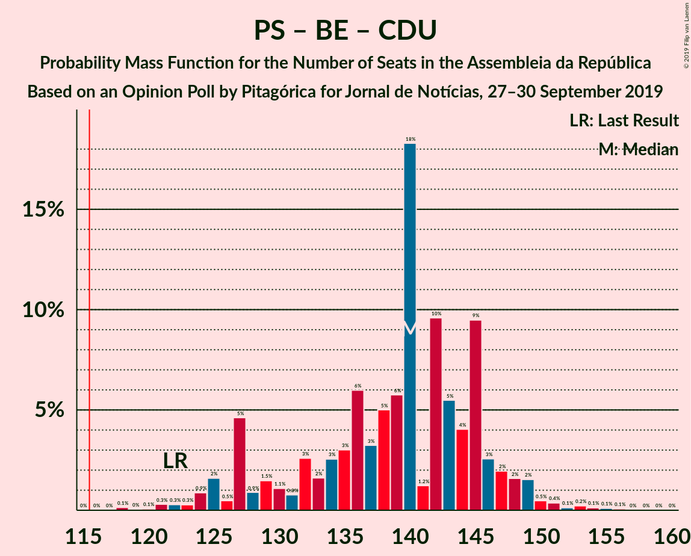
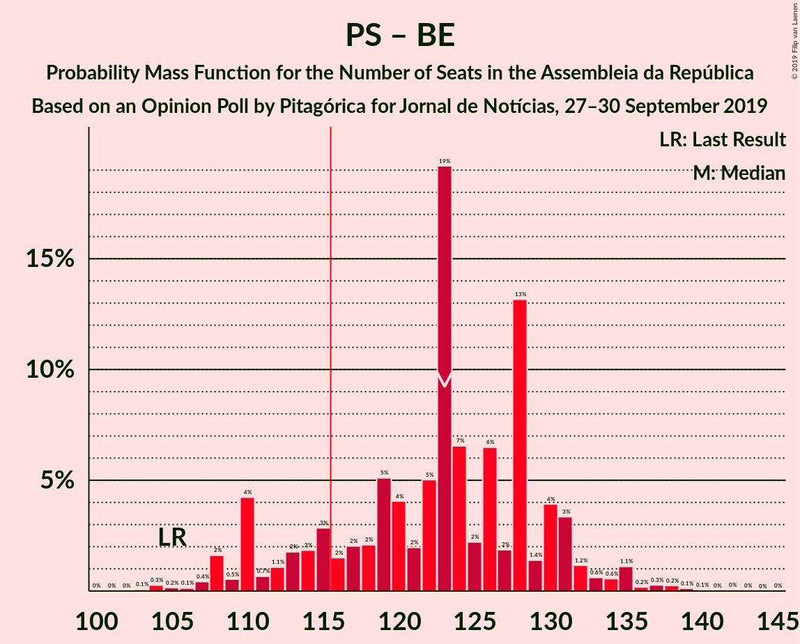

# Opinion Poll by Pitagórica for Jornal de Notícias, 27–30 September 2019

<a href="#voting-intentions">Voting Intentions</a> | <a href="#seats">Seats</a> | <a href="#coalitions">Coalitions</a> | <a href="#technical-information">Technical Information</a>

## Voting Intentions

### Confidence Intervals

| Party | Last Result | Poll Result | 80% Confidence Interval | 90% Confidence Interval | 95% Confidence Interval | 99% Confidence Interval |
|:-----:|:-----------:|:-----------:|:-----------------------:|:-----------------------:|:-----------------------:|:-----------------------:|
| Partido Socialista | 32.3% | 35.5% | 33.1–38.1% |32.4–38.8% |31.8–39.4% |30.6–40.7% |
| Partido Social Democrata | 36.9% | 28.5% | 26.2–31.0% |25.6–31.6% |25.0–32.3% |24.0–33.4% |
| Bloco de Esquerda | 10.2% | 9.5% | 8.1–11.2% |7.7–11.7% |7.4–12.1% |6.8–13.0% |
| Coligação Democrática Unitária | 8.2% | 7.8% | 6.6–9.4% |6.2–9.9% |5.9–10.3% |5.4–11.1% |
| CDS–Partido Popular | 36.9% | 4.2% | 3.3–5.4% |3.0–5.8% |2.8–6.1% |2.5–6.7% |
| Pessoas–Animais–Natureza | 1.4% | 2.8% | 2.1–3.9% |1.9–4.2% |1.8–4.5% |1.5–5.1% |
| LIVRE | 0.7% | 1.5% | 1.0–2.4% |0.9–2.6% |0.8–2.8% |0.6–3.3% |
| Chega | 0.0% | 1.3% | 0.9–2.2% |0.8–2.4% |0.7–2.6% |0.5–3.1% |
| Iniciativa Liberal | 0.0% | 1.2% | 0.8–2.0% |0.7–2.2% |0.6–2.4% |0.4–2.8% |
| Aliança | 0.0% | 1.2% | 0.8–2.0% |0.7–2.2% |0.6–2.4% |0.4–2.8% |

*Note:* The poll result column reflects the actual value used in the calculations. Published results may vary slightly, and in addition be rounded to fewer digits.

## Seats

### Confidence Intervals

| Party | Last Result | Median | 80% Confidence Interval | 90% Confidence Interval | 95% Confidence Interval | 99% Confidence Interval |
|:-----:|:-----------:|:------:|:-----------------------:|:-----------------------:|:-----------------------:|:-----------------------:|
| <a href="#partido-socialista">Partido Socialista</a> | 86 | 102 | 92–111 |89–111 |89–113 |86–116 |
| <a href="#partido-social-democrata">Partido Social Democrata</a> | 89 | 80 | 74–91 |73–93 |71–95 |67–98 |
| <a href="#bloco-de-esquerda">Bloco de Esquerda</a> | 19 | 20 | 17–24 |16–25 |14–26 |11–28 |
| <a href="#coligação-democrática-unitária">Coligação Democrática Unitária</a> | 17 | 17 | 13–20 |11–21 |9–22 |8–24 |
| <a href="#cds–partido-popular">CDS–Partido Popular</a> | 18 | 6 | 2–7 |2–7 |2–10 |2–11 |
| <a href="#pessoas–animais–natureza">Pessoas–Animais–Natureza</a> | 1 | 3 | 2–6 |2–6 |1–6 |1–6 |
| <a href="#livre">LIVRE</a> | 0 | 1 | 1–2 |0–2 |0–2 |0–5 |
| <a href="#chega">Chega</a> | 0 | 0 | 0–2 |0–2 |0–2 |0–2 |
| <a href="#iniciativa-liberal">Iniciativa Liberal</a> | 0 | 0 | 0–1 |0–2 |0–2 |0–2 |
| <a href="#aliança">Aliança</a> | 0 | 0 | 0 |0–2 |0–2 |0–2 |

### Partido Socialista

*For a full overview of the results for this party, see the [Partido Socialista](party-partidosocialista.html) page.*

| Number of Seats | Probability | Accumulated | Special Marks |
|:---------------:|:-----------:|:-----------:|:-------------:|
| 83 | 0% | 100% |  |
| 84 | 0.1% | 99.9% |  |
| 85 | 0.2% | 99.8% |  |
| 86 | 0.2% | 99.7% | Last Result |
| 87 | 0.3% | 99.4% |  |
| 88 | 0.8% | 99.1% |  |
| 89 | 4% | 98% |  |
| 90 | 3% | 94% |  |
| 91 | 0.7% | 92% |  |
| 92 | 2% | 91% |  |
| 93 | 0.5% | 89% |  |
| 94 | 1.2% | 89% |  |
| 95 | 1.3% | 88% |  |
| 96 | 3% | 86% |  |
| 97 | 1.5% | 83% |  |
| 98 | 3% | 82% |  |
| 99 | 4% | 79% |  |
| 100 | 16% | 75% |  |
| 101 | 6% | 59% |  |
| 102 | 4% | 53% | Median |
| 103 | 2% | 49% |  |
| 104 | 3% | 47% |  |
| 105 | 13% | 44% |  |
| 106 | 7% | 31% |  |
| 107 | 1.4% | 25% |  |
| 108 | 5% | 23% |  |
| 109 | 3% | 18% |  |
| 110 | 1.0% | 15% |  |
| 111 | 10% | 14% |  |
| 112 | 1.0% | 5% |  |
| 113 | 2% | 4% |  |
| 114 | 0.5% | 2% |  |
| 115 | 0.6% | 1.2% |  |
| 116 | 0.2% | 0.6% | Majority |
| 117 | 0.1% | 0.5% |  |
| 118 | 0.1% | 0.3% |  |
| 119 | 0.2% | 0.3% |  |
| 120 | 0% | 0.1% |  |
| 121 | 0% | 0% |  |

### Partido Social Democrata

*For a full overview of the results for this party, see the [Partido Social Democrata](party-partidosocialdemocrata.html) page.*

| Number of Seats | Probability | Accumulated | Special Marks |
|:---------------:|:-----------:|:-----------:|:-------------:|
| 64 | 0% | 100% |  |
| 65 | 0.1% | 99.9% |  |
| 66 | 0.3% | 99.8% |  |
| 67 | 0.2% | 99.5% |  |
| 68 | 0.2% | 99.3% |  |
| 69 | 0.3% | 99.1% |  |
| 70 | 1.2% | 98.8% |  |
| 71 | 2% | 98% |  |
| 72 | 0.5% | 96% |  |
| 73 | 4% | 95% |  |
| 74 | 3% | 91% |  |
| 75 | 9% | 88% |  |
| 76 | 3% | 79% |  |
| 77 | 8% | 76% |  |
| 78 | 6% | 68% |  |
| 79 | 10% | 62% |  |
| 80 | 16% | 52% | Median |
| 81 | 3% | 36% |  |
| 82 | 4% | 34% |  |
| 83 | 4% | 30% |  |
| 84 | 6% | 26% |  |
| 85 | 3% | 19% |  |
| 86 | 1.3% | 16% |  |
| 87 | 3% | 15% |  |
| 88 | 1.4% | 13% |  |
| 89 | 0.5% | 11% | Last Result |
| 90 | 0.5% | 11% |  |
| 91 | 1.2% | 10% |  |
| 92 | 0.8% | 9% |  |
| 93 | 4% | 8% |  |
| 94 | 0.8% | 4% |  |
| 95 | 2% | 3% |  |
| 96 | 0.4% | 1.2% |  |
| 97 | 0.2% | 0.7% |  |
| 98 | 0.3% | 0.5% |  |
| 99 | 0.2% | 0.3% |  |
| 100 | 0% | 0.1% |  |
| 101 | 0% | 0.1% |  |
| 102 | 0% | 0% |  |

### Bloco de Esquerda

*For a full overview of the results for this party, see the [Bloco de Esquerda](party-blocodeesquerda.html) page.*

| Number of Seats | Probability | Accumulated | Special Marks |
|:---------------:|:-----------:|:-----------:|:-------------:|
| 10 | 0.4% | 100% |  |
| 11 | 0.4% | 99.6% |  |
| 12 | 0.2% | 99.3% |  |
| 13 | 1.1% | 99.1% |  |
| 14 | 1.0% | 98% |  |
| 15 | 2% | 97% |  |
| 16 | 1.2% | 95% |  |
| 17 | 17% | 94% |  |
| 18 | 19% | 77% |  |
| 19 | 7% | 58% | Last Result |
| 20 | 3% | 51% | Median |
| 21 | 8% | 49% |  |
| 22 | 3% | 40% |  |
| 23 | 23% | 38% |  |
| 24 | 9% | 15% |  |
| 25 | 2% | 5% |  |
| 26 | 1.2% | 4% |  |
| 27 | 2% | 2% |  |
| 28 | 0.3% | 0.5% |  |
| 29 | 0.1% | 0.2% |  |
| 30 | 0% | 0.2% |  |
| 31 | 0.1% | 0.1% |  |
| 32 | 0% | 0.1% |  |
| 33 | 0% | 0.1% |  |
| 34 | 0% | 0% |  |

### Coligação Democrática Unitária

*For a full overview of the results for this party, see the [Coligação Democrática Unitária](party-coligaçãodemocráticaunitária.html) page.*

| Number of Seats | Probability | Accumulated | Special Marks |
|:---------------:|:-----------:|:-----------:|:-------------:|
| 6 | 0.2% | 100% |  |
| 7 | 0.2% | 99.8% |  |
| 8 | 2% | 99.6% |  |
| 9 | 1.3% | 98% |  |
| 10 | 1.2% | 97% |  |
| 11 | 2% | 95% |  |
| 12 | 2% | 93% |  |
| 13 | 5% | 91% |  |
| 14 | 13% | 86% |  |
| 15 | 3% | 74% |  |
| 16 | 2% | 70% |  |
| 17 | 48% | 69% | Last Result, Median |
| 18 | 6% | 21% |  |
| 19 | 3% | 14% |  |
| 20 | 3% | 11% |  |
| 21 | 4% | 8% |  |
| 22 | 2% | 3% |  |
| 23 | 0.7% | 2% |  |
| 24 | 0.9% | 1.0% |  |
| 25 | 0.1% | 0.1% |  |
| 26 | 0% | 0% |  |

### CDS–Partido Popular

*For a full overview of the results for this party, see the [CDS–Partido Popular](party-cds–partidopopular.html) page.*

| Number of Seats | Probability | Accumulated | Special Marks |
|:---------------:|:-----------:|:-----------:|:-------------:|
| 2 | 11% | 100% |  |
| 3 | 5% | 89% |  |
| 4 | 6% | 84% |  |
| 5 | 2% | 78% |  |
| 6 | 58% | 76% | Median |
| 7 | 14% | 18% |  |
| 8 | 1.1% | 4% |  |
| 9 | 0.3% | 3% |  |
| 10 | 2% | 3% |  |
| 11 | 0.6% | 1.0% |  |
| 12 | 0.2% | 0.3% |  |
| 13 | 0% | 0.1% |  |
| 14 | 0% | 0.1% |  |
| 15 | 0% | 0% |  |
| 16 | 0% | 0% |  |
| 17 | 0% | 0% |  |
| 18 | 0% | 0% | Last Result |

### Pessoas–Animais–Natureza

*For a full overview of the results for this party, see the [Pessoas–Animais–Natureza](party-pessoas–animais–natureza.html) page.*

| Number of Seats | Probability | Accumulated | Special Marks |
|:---------------:|:-----------:|:-----------:|:-------------:|
| 0 | 0.1% | 100% |  |
| 1 | 2% | 99.9% | Last Result |
| 2 | 25% | 97% |  |
| 3 | 40% | 73% | Median |
| 4 | 16% | 33% |  |
| 5 | 4% | 16% |  |
| 6 | 12% | 12% |  |
| 7 | 0.1% | 0.3% |  |
| 8 | 0.1% | 0.2% |  |
| 9 | 0.1% | 0.1% |  |
| 10 | 0% | 0% |  |

### LIVRE

*For a full overview of the results for this party, see the [LIVRE](party-livre.html) page.*

| Number of Seats | Probability | Accumulated | Special Marks |
|:---------------:|:-----------:|:-----------:|:-------------:|
| 0 | 8% | 100% | Last Result |
| 1 | 76% | 92% | Median |
| 2 | 14% | 16% |  |
| 3 | 0.4% | 1.3% |  |
| 4 | 0.3% | 1.0% |  |
| 5 | 0.7% | 0.7% |  |
| 6 | 0% | 0% |  |

### Chega

*For a full overview of the results for this party, see the [Chega](party-chega.html) page.*

| Number of Seats | Probability | Accumulated | Special Marks |
|:---------------:|:-----------:|:-----------:|:-------------:|
| 0 | 84% | 100% | Last Result, Median |
| 1 | 1.0% | 16% |  |
| 2 | 14% | 15% |  |
| 3 | 0.1% | 0.1% |  |
| 4 | 0% | 0% |  |

### Iniciativa Liberal

*For a full overview of the results for this party, see the [Iniciativa Liberal](party-iniciativaliberal.html) page.*

| Number of Seats | Probability | Accumulated | Special Marks |
|:---------------:|:-----------:|:-----------:|:-------------:|
| 0 | 90% | 100% | Last Result, Median |
| 1 | 4% | 10% |  |
| 2 | 6% | 6% |  |
| 3 | 0% | 0% |  |

### Aliança

*For a full overview of the results for this party, see the [Aliança](party-aliança.html) page.*

| Number of Seats | Probability | Accumulated | Special Marks |
|:---------------:|:-----------:|:-----------:|:-------------:|
| 0 | 91% | 100% | Last Result, Median |
| 1 | 3% | 9% |  |
| 2 | 6% | 6% |  |
| 3 | 0% | 0% |  |

## Coalitions

### Confidence Intervals

| Coalition | Last Result | Median | Majority? | 80% Confidence Interval | 90% Confidence Interval | 95% Confidence Interval | 99% Confidence Interval |
|:---------:|:-----------:|:------:|:---------:|:-----------------------:|:-----------------------:|:-----------------------:|:-----------------------:|
| Partido Socialista – Bloco de Esquerda – Coligação Democrática Unitária | 122 | 140 | 100% | 129–145 | 127–147 | 125–149 | 121–153 |
| Partido Socialista – Bloco de Esquerda | 105 | 123 | 84% | 113–130 | 110–131 | 108–134 | 105–137 |
| Partido Socialista – Coligação Democrática Unitária | 103 | 119 | 74% | 109–128 | 106–128 | 106–129 | 100–133 |
| Partido Socialista | 86 | 102 | 0.6% | 92–111 | 89–111 | 89–113 | 86–116 |
| Partido Social Democrata – CDS–Partido Popular | 107 | 85 | 0% | 80–97 | 78–99 | 76–99 | 73–103 |

### Partido Socialista – Bloco de Esquerda – Coligação Democrática Unitária

| Number of Seats | Probability | Accumulated | Special Marks |
|:---------------:|:-----------:|:-----------:|:-------------:|
| 118 | 0.1% | 100% |  |
| 119 | 0% | 99.8% |  |
| 120 | 0.1% | 99.8% |  |
| 121 | 0.3% | 99.7% |  |
| 122 | 0.3% | 99.4% | Last Result |
| 123 | 0.3% | 99.1% |  |
| 124 | 0.9% | 98.9% |  |
| 125 | 2% | 98% |  |
| 126 | 0.5% | 96% |  |
| 127 | 5% | 96% |  |
| 128 | 0.9% | 91% |  |
| 129 | 1.5% | 90% |  |
| 130 | 1.1% | 89% |  |
| 131 | 0.8% | 88% |  |
| 132 | 3% | 87% |  |
| 133 | 2% | 84% |  |
| 134 | 3% | 83% |  |
| 135 | 3% | 80% |  |
| 136 | 6% | 77% |  |
| 137 | 3% | 71% |  |
| 138 | 5% | 68% |  |
| 139 | 6% | 63% | Median |
| 140 | 18% | 57% |  |
| 141 | 1.2% | 39% |  |
| 142 | 10% | 38% |  |
| 143 | 5% | 28% |  |
| 144 | 4% | 23% |  |
| 145 | 9% | 19% |  |
| 146 | 3% | 9% |  |
| 147 | 2% | 7% |  |
| 148 | 2% | 5% |  |
| 149 | 2% | 3% |  |
| 150 | 0.5% | 2% |  |
| 151 | 0.4% | 1.0% |  |
| 152 | 0.1% | 0.7% |  |
| 153 | 0.2% | 0.6% |  |
| 154 | 0.1% | 0.3% |  |
| 155 | 0.1% | 0.2% |  |
| 156 | 0.1% | 0.1% |  |
| 157 | 0% | 0% |  |

### Partido Socialista – Bloco de Esquerda

| Number of Seats | Probability | Accumulated | Special Marks |
|:---------------:|:-----------:|:-----------:|:-------------:|
| 102 | 0% | 100% |  |
| 103 | 0.1% | 99.9% |  |
| 104 | 0.3% | 99.9% |  |
| 105 | 0.2% | 99.6% | Last Result |
| 106 | 0.1% | 99.5% |  |
| 107 | 0.4% | 99.3% |  |
| 108 | 2% | 98.9% |  |
| 109 | 0.5% | 97% |  |
| 110 | 4% | 97% |  |
| 111 | 0.7% | 93% |  |
| 112 | 1.1% | 92% |  |
| 113 | 2% | 91% |  |
| 114 | 2% | 89% |  |
| 115 | 3% | 87% |  |
| 116 | 2% | 84% | Majority |
| 117 | 2% | 83% |  |
| 118 | 2% | 81% |  |
| 119 | 5% | 79% |  |
| 120 | 4% | 74% |  |
| 121 | 2% | 70% |  |
| 122 | 5% | 68% | Median |
| 123 | 19% | 63% |  |
| 124 | 7% | 43% |  |
| 125 | 2% | 37% |  |
| 126 | 6% | 35% |  |
| 127 | 2% | 28% |  |
| 128 | 13% | 26% |  |
| 129 | 1.4% | 13% |  |
| 130 | 4% | 12% |  |
| 131 | 3% | 8% |  |
| 132 | 1.2% | 4% |  |
| 133 | 0.6% | 3% |  |
| 134 | 0.6% | 3% |  |
| 135 | 1.1% | 2% |  |
| 136 | 0.2% | 0.9% |  |
| 137 | 0.3% | 0.8% |  |
| 138 | 0.2% | 0.5% |  |
| 139 | 0.1% | 0.3% |  |
| 140 | 0.1% | 0.1% |  |
| 141 | 0% | 0.1% |  |
| 142 | 0% | 0.1% |  |
| 143 | 0% | 0% |  |

### Partido Socialista – Coligação Democrática Unitária

| Number of Seats | Probability | Accumulated | Special Marks |
|:---------------:|:-----------:|:-----------:|:-------------:|
| 98 | 0% | 100% |  |
| 99 | 0.1% | 99.9% |  |
| 100 | 0.5% | 99.8% |  |
| 101 | 0.1% | 99.3% |  |
| 102 | 0.1% | 99.2% |  |
| 103 | 0.3% | 99.0% | Last Result |
| 104 | 0.6% | 98.7% |  |
| 105 | 0.6% | 98% |  |
| 106 | 4% | 98% |  |
| 107 | 3% | 94% |  |
| 108 | 0.7% | 91% |  |
| 109 | 0.8% | 91% |  |
| 110 | 0.7% | 90% |  |
| 111 | 3% | 89% |  |
| 112 | 2% | 86% |  |
| 113 | 2% | 84% |  |
| 114 | 5% | 82% |  |
| 115 | 2% | 77% |  |
| 116 | 4% | 74% | Majority |
| 117 | 15% | 71% |  |
| 118 | 4% | 56% |  |
| 119 | 9% | 52% | Median |
| 120 | 4% | 43% |  |
| 121 | 2% | 39% |  |
| 122 | 8% | 37% |  |
| 123 | 6% | 29% |  |
| 124 | 2% | 23% |  |
| 125 | 4% | 21% |  |
| 126 | 4% | 17% |  |
| 127 | 2% | 13% |  |
| 128 | 9% | 11% |  |
| 129 | 0.8% | 3% |  |
| 130 | 0.3% | 2% |  |
| 131 | 0.3% | 1.4% |  |
| 132 | 0.6% | 1.1% |  |
| 133 | 0.1% | 0.5% |  |
| 134 | 0.1% | 0.4% |  |
| 135 | 0.1% | 0.3% |  |
| 136 | 0.2% | 0.2% |  |
| 137 | 0% | 0.1% |  |
| 138 | 0% | 0.1% |  |
| 139 | 0% | 0% |  |

### Partido Socialista

| Number of Seats | Probability | Accumulated | Special Marks |
|:---------------:|:-----------:|:-----------:|:-------------:|
| 83 | 0% | 100% |  |
| 84 | 0.1% | 99.9% |  |
| 85 | 0.2% | 99.8% |  |
| 86 | 0.2% | 99.7% | Last Result |
| 87 | 0.3% | 99.4% |  |
| 88 | 0.8% | 99.1% |  |
| 89 | 4% | 98% |  |
| 90 | 3% | 94% |  |
| 91 | 0.7% | 92% |  |
| 92 | 2% | 91% |  |
| 93 | 0.5% | 89% |  |
| 94 | 1.2% | 89% |  |
| 95 | 1.3% | 88% |  |
| 96 | 3% | 86% |  |
| 97 | 1.5% | 83% |  |
| 98 | 3% | 82% |  |
| 99 | 4% | 79% |  |
| 100 | 16% | 75% |  |
| 101 | 6% | 59% |  |
| 102 | 4% | 53% | Median |
| 103 | 2% | 49% |  |
| 104 | 3% | 47% |  |
| 105 | 13% | 44% |  |
| 106 | 7% | 31% |  |
| 107 | 1.4% | 25% |  |
| 108 | 5% | 23% |  |
| 109 | 3% | 18% |  |
| 110 | 1.0% | 15% |  |
| 111 | 10% | 14% |  |
| 112 | 1.0% | 5% |  |
| 113 | 2% | 4% |  |
| 114 | 0.5% | 2% |  |
| 115 | 0.6% | 1.2% |  |
| 116 | 0.2% | 0.6% | Majority |
| 117 | 0.1% | 0.5% |  |
| 118 | 0.1% | 0.3% |  |
| 119 | 0.2% | 0.3% |  |
| 120 | 0% | 0.1% |  |
| 121 | 0% | 0% |  |

### Partido Social Democrata – CDS–Partido Popular

| Number of Seats | Probability | Accumulated | Special Marks |
|:---------------:|:-----------:|:-----------:|:-------------:|
| 69 | 0.1% | 100% |  |
| 70 | 0% | 99.9% |  |
| 71 | 0.1% | 99.9% |  |
| 72 | 0.2% | 99.7% |  |
| 73 | 0.4% | 99.5% |  |
| 74 | 0.2% | 99.1% |  |
| 75 | 0.3% | 98.9% |  |
| 76 | 2% | 98.6% |  |
| 77 | 2% | 97% |  |
| 78 | 0.9% | 95% |  |
| 79 | 3% | 94% |  |
| 80 | 6% | 92% |  |
| 81 | 9% | 86% |  |
| 82 | 4% | 77% |  |
| 83 | 7% | 73% |  |
| 84 | 9% | 66% |  |
| 85 | 9% | 57% |  |
| 86 | 15% | 47% | Median |
| 87 | 4% | 33% |  |
| 88 | 3% | 29% |  |
| 89 | 2% | 26% |  |
| 90 | 4% | 24% |  |
| 91 | 4% | 20% |  |
| 92 | 1.0% | 16% |  |
| 93 | 3% | 15% |  |
| 94 | 0.7% | 12% |  |
| 95 | 0.9% | 11% |  |
| 96 | 0.4% | 11% |  |
| 97 | 0.6% | 10% |  |
| 98 | 3% | 9% |  |
| 99 | 5% | 6% |  |
| 100 | 0.5% | 2% |  |
| 101 | 0.3% | 1.0% |  |
| 102 | 0.1% | 0.8% |  |
| 103 | 0.2% | 0.7% |  |
| 104 | 0.3% | 0.5% |  |
| 105 | 0.2% | 0.2% |  |
| 106 | 0% | 0.1% |  |
| 107 | 0% | 0.1% | Last Result |
| 108 | 0% | 0% |  |

## Technical Information

### Opinion Poll

+ **Polling firm:** Pitagórica
+ **Commissioner(s):** Jornal de Notícias
+ **Fieldwork period:** 27–30 September 2019

### Calculations

+ **Sample size:** 600
+ **Simulations done:** 1,048,576
+ **Error estimate:** 1.60%

