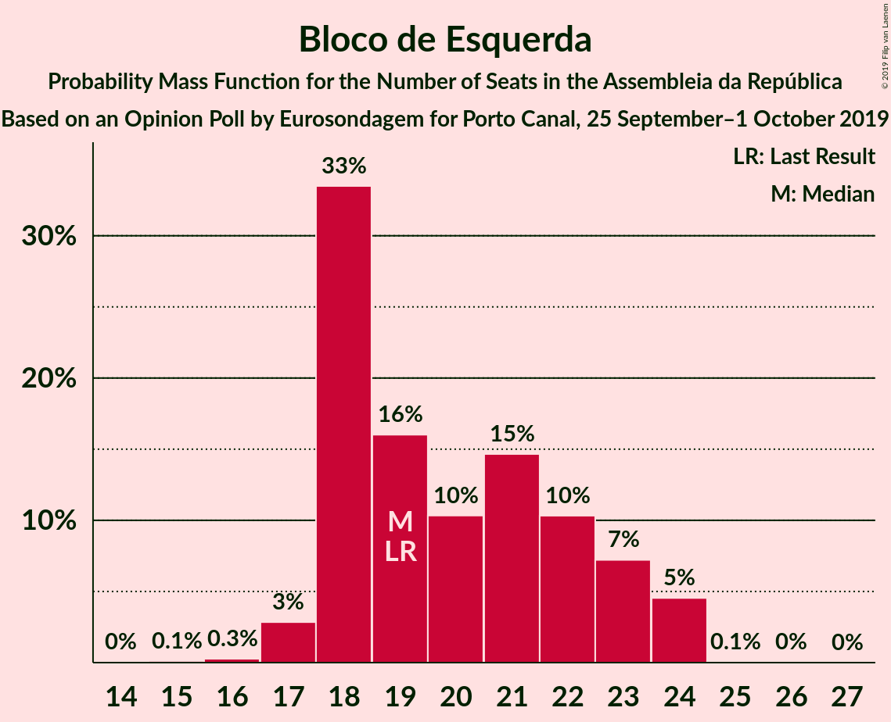
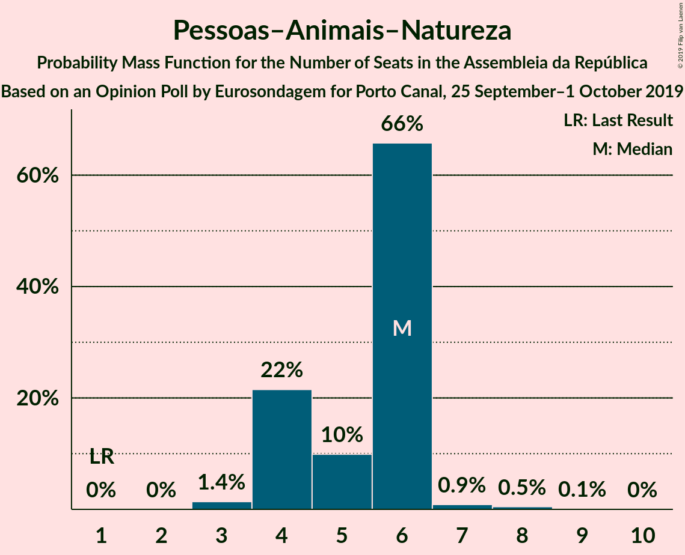
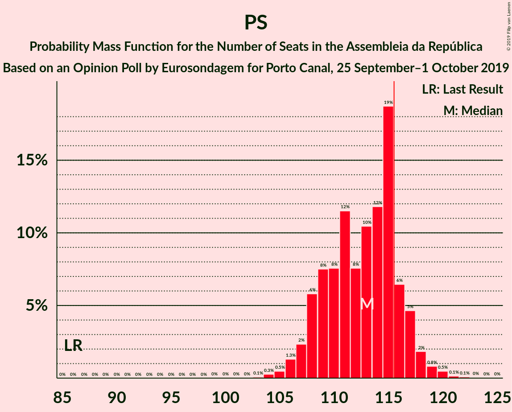

# Opinion Poll by Eurosondagem for Porto Canal, 25 September–1 October 2019

<a href="#voting-intentions">Voting Intentions</a> | <a href="#seats">Seats</a> | <a href="#coalitions">Coalitions</a> | <a href="#technical-information">Technical Information</a>

## Voting Intentions

### Confidence Intervals

| Party | Last Result | Poll Result | 80% Confidence Interval | 90% Confidence Interval | 95% Confidence Interval | 99% Confidence Interval |
|:-----:|:-----------:|:-----------:|:-----------------------:|:-----------------------:|:-----------------------:|:-----------------------:|
| Partido Socialista | 32.3% | 38.8% | 37.4–40.2% |37.1–40.6% |36.7–41.0% |36.1–41.6% |
| Partido Social Democrata | 36.9% | 25.5% | 24.3–26.8% |23.9–27.1% |23.7–27.4% |23.1–28.0% |
| Bloco de Esquerda | 10.2% | 9.6% | 8.8–10.5% |8.6–10.7% |8.4–11.0% |8.0–11.4% |
| Coligação Democrática Unitária | 8.2% | 7.1% | 6.4–7.9% |6.2–8.1% |6.1–8.3% |5.8–8.7% |
| CDS–Partido Popular | 36.9% | 5.0% | 4.5–5.7% |4.3–5.9% |4.2–6.1% |3.9–6.4% |
| Pessoas–Animais–Natureza | 1.4% | 4.0% | 3.5–4.6% |3.4–4.8% |3.2–5.0% |3.0–5.3% |

*Note:* The poll result column reflects the actual value used in the calculations. Published results may vary slightly, and in addition be rounded to fewer digits.

## Seats

### Confidence Intervals

| Party | Last Result | Median | 80% Confidence Interval | 90% Confidence Interval | 95% Confidence Interval | 99% Confidence Interval |
|:-----:|:-----------:|:------:|:-----------------------:|:-----------------------:|:-----------------------:|:-----------------------:|
| <a href="#partido-socialista">Partido Socialista</a> | 86 | 113 | 109–116 |108–117 |107–118 |105–120 |
| <a href="#partido-social-democrata">Partido Social Democrata</a> | 89 | 72 | 67–76 |66–76 |65–77 |64–79 |
| <a href="#bloco-de-esquerda">Bloco de Esquerda</a> | 19 | 19 | 18–23 |18–23 |17–24 |17–24 |
| <a href="#coligação-democrática-unitária">Coligação Democrática Unitária</a> | 17 | 14 | 11–16 |11–17 |10–17 |9–18 |
| <a href="#cds–partido-popular">CDS–Partido Popular</a> | 18 | 7 | 6–7 |6–8 |6–9 |5–10 |
| <a href="#pessoas–animais–natureza">Pessoas–Animais–Natureza</a> | 1 | 6 | 4–6 |4–6 |4–6 |3–7 |

### Partido Socialista

*For a full overview of the results for this party, see the [Partido Socialista](party-partidosocialista.html) page.*

| Number of Seats | Probability | Accumulated | Special Marks |
|:---------------:|:-----------:|:-----------:|:-------------:|
| 86 | 0% | 100% | Last Result |
| 87 | 0% | 100% |  |
| 88 | 0% | 100% |  |
| 89 | 0% | 100% |  |
| 90 | 0% | 100% |  |
| 91 | 0% | 100% |  |
| 92 | 0% | 100% |  |
| 93 | 0% | 100% |  |
| 94 | 0% | 100% |  |
| 95 | 0% | 100% |  |
| 96 | 0% | 100% |  |
| 97 | 0% | 100% |  |
| 98 | 0% | 100% |  |
| 99 | 0% | 100% |  |
| 100 | 0% | 100% |  |
| 101 | 0% | 100% |  |
| 102 | 0% | 100% |  |
| 103 | 0.1% | 100% |  |
| 104 | 0.3% | 99.9% |  |
| 105 | 0.4% | 99.6% |  |
| 106 | 2% | 99.2% |  |
| 107 | 2% | 98% |  |
| 108 | 5% | 96% |  |
| 109 | 6% | 91% |  |
| 110 | 9% | 84% |  |
| 111 | 11% | 76% |  |
| 112 | 10% | 65% |  |
| 113 | 9% | 55% | Median |
| 114 | 12% | 46% |  |
| 115 | 21% | 34% |  |
| 116 | 7% | 13% | Majority |
| 117 | 3% | 6% |  |
| 118 | 2% | 4% |  |
| 119 | 1.4% | 2% |  |
| 120 | 0.3% | 0.6% |  |
| 121 | 0.1% | 0.3% |  |
| 122 | 0.1% | 0.2% |  |
| 123 | 0% | 0.1% |  |
| 124 | 0% | 0% |  |

### Partido Social Democrata

*For a full overview of the results for this party, see the [Partido Social Democrata](party-partidosocialdemocrata.html) page.*

| Number of Seats | Probability | Accumulated | Special Marks |
|:---------------:|:-----------:|:-----------:|:-------------:|
| 62 | 0.1% | 100% |  |
| 63 | 0.2% | 99.9% |  |
| 64 | 0.5% | 99.7% |  |
| 65 | 2% | 99.3% |  |
| 66 | 3% | 97% |  |
| 67 | 5% | 94% |  |
| 68 | 8% | 90% |  |
| 69 | 9% | 81% |  |
| 70 | 13% | 72% |  |
| 71 | 7% | 59% |  |
| 72 | 14% | 53% | Median |
| 73 | 8% | 39% |  |
| 74 | 10% | 31% |  |
| 75 | 8% | 21% |  |
| 76 | 8% | 12% |  |
| 77 | 2% | 4% |  |
| 78 | 0.9% | 2% |  |
| 79 | 0.6% | 0.8% |  |
| 80 | 0.2% | 0.2% |  |
| 81 | 0% | 0.1% |  |
| 82 | 0% | 0% |  |
| 83 | 0% | 0% |  |
| 84 | 0% | 0% |  |
| 85 | 0% | 0% |  |
| 86 | 0% | 0% |  |
| 87 | 0% | 0% |  |
| 88 | 0% | 0% |  |
| 89 | 0% | 0% | Last Result |

### Bloco de Esquerda

*For a full overview of the results for this party, see the [Bloco de Esquerda](party-blocodeesquerda.html) page.*

| Number of Seats | Probability | Accumulated | Special Marks |
|:---------------:|:-----------:|:-----------:|:-------------:|
| 15 | 0.1% | 100% |  |
| 16 | 0.3% | 99.8% |  |
| 17 | 3% | 99.6% |  |
| 18 | 32% | 96% |  |
| 19 | 21% | 64% | Last Result, Median |
| 20 | 6% | 43% |  |
| 21 | 13% | 37% |  |
| 22 | 11% | 24% |  |
| 23 | 8% | 12% |  |
| 24 | 4% | 5% |  |
| 25 | 0.1% | 0.1% |  |
| 26 | 0.1% | 0.1% |  |
| 27 | 0% | 0% |  |

### Coligação Democrática Unitária

*For a full overview of the results for this party, see the [Coligação Democrática Unitária](party-coligaçãodemocráticaunitária.html) page.*

| Number of Seats | Probability | Accumulated | Special Marks |
|:---------------:|:-----------:|:-----------:|:-------------:|
| 8 | 0.4% | 100% |  |
| 9 | 1.4% | 99.5% |  |
| 10 | 2% | 98% |  |
| 11 | 8% | 97% |  |
| 12 | 9% | 88% |  |
| 13 | 8% | 79% |  |
| 14 | 51% | 71% | Median |
| 15 | 7% | 20% |  |
| 16 | 6% | 13% |  |
| 17 | 7% | 7% | Last Result |
| 18 | 0.6% | 0.6% |  |
| 19 | 0% | 0.1% |  |
| 20 | 0% | 0% |  |

### CDS–Partido Popular

*For a full overview of the results for this party, see the [CDS–Partido Popular](party-cds–partidopopular.html) page.*

| Number of Seats | Probability | Accumulated | Special Marks |
|:---------------:|:-----------:|:-----------:|:-------------:|
| 4 | 0.5% | 100% |  |
| 5 | 0.6% | 99.5% |  |
| 6 | 36% | 98.9% |  |
| 7 | 55% | 63% | Median |
| 8 | 3% | 7% |  |
| 9 | 2% | 4% |  |
| 10 | 2% | 2% |  |
| 11 | 0.1% | 0.2% |  |
| 12 | 0% | 0% |  |
| 13 | 0% | 0% |  |
| 14 | 0% | 0% |  |
| 15 | 0% | 0% |  |
| 16 | 0% | 0% |  |
| 17 | 0% | 0% |  |
| 18 | 0% | 0% | Last Result |

### Pessoas–Animais–Natureza

*For a full overview of the results for this party, see the [Pessoas–Animais–Natureza](party-pessoas–animais–natureza.html) page.*

| Number of Seats | Probability | Accumulated | Special Marks |
|:---------------:|:-----------:|:-----------:|:-------------:|
| 1 | 0% | 100% | Last Result |
| 2 | 0% | 100% |  |
| 3 | 1.4% | 100% |  |
| 4 | 22% | 98.6% |  |
| 5 | 8% | 77% |  |
| 6 | 67% | 69% | Median |
| 7 | 1.3% | 2% |  |
| 8 | 0.4% | 0.5% |  |
| 9 | 0.1% | 0.1% |  |
| 10 | 0% | 0% |  |

## Coalitions

### Confidence Intervals

| Coalition | Last Result | Median | Majority? | 80% Confidence Interval | 90% Confidence Interval | 95% Confidence Interval | 99% Confidence Interval |
|:---------:|:-----------:|:------:|:---------:|:-----------------------:|:-----------------------:|:-----------------------:|:-----------------------:|
| Partido Socialista – Bloco de Esquerda – Coligação Democrática Unitária | 122 | 146 | 100% | 142–150 | 142–151 | 141–152 | 139–154 |
| Partido Socialista – Bloco de Esquerda | 105 | 133 | 100% | 129–137 | 128–138 | 127–138 | 125–140 |
| Partido Socialista – Coligação Democrática Unitária | 103 | 126 | 100% | 122–130 | 121–131 | 120–132 | 119–134 |
| Partido Socialista | 86 | 113 | 13% | 109–116 | 108–117 | 107–118 | 105–120 |
| Partido Social Democrata – CDS–Partido Popular | 107 | 78 | 0% | 75–82 | 73–83 | 73–83 | 71–85 |

### Partido Socialista – Bloco de Esquerda – Coligação Democrática Unitária

| Number of Seats | Probability | Accumulated | Special Marks |
|:---------------:|:-----------:|:-----------:|:-------------:|
| 122 | 0% | 100% | Last Result |
| 123 | 0% | 100% |  |
| 124 | 0% | 100% |  |
| 125 | 0% | 100% |  |
| 126 | 0% | 100% |  |
| 127 | 0% | 100% |  |
| 128 | 0% | 100% |  |
| 129 | 0% | 100% |  |
| 130 | 0% | 100% |  |
| 131 | 0% | 100% |  |
| 132 | 0% | 100% |  |
| 133 | 0% | 100% |  |
| 134 | 0% | 100% |  |
| 135 | 0% | 100% |  |
| 136 | 0% | 100% |  |
| 137 | 0.1% | 100% |  |
| 138 | 0.2% | 99.9% |  |
| 139 | 0.7% | 99.7% |  |
| 140 | 0.8% | 99.0% |  |
| 141 | 2% | 98% |  |
| 142 | 7% | 96% |  |
| 143 | 11% | 89% |  |
| 144 | 12% | 78% |  |
| 145 | 12% | 67% |  |
| 146 | 6% | 54% | Median |
| 147 | 13% | 48% |  |
| 148 | 8% | 35% |  |
| 149 | 12% | 27% |  |
| 150 | 9% | 15% |  |
| 151 | 3% | 7% |  |
| 152 | 2% | 4% |  |
| 153 | 1.4% | 2% |  |
| 154 | 0.5% | 0.8% |  |
| 155 | 0.3% | 0.4% |  |
| 156 | 0.1% | 0.1% |  |
| 157 | 0% | 0.1% |  |
| 158 | 0% | 0% |  |

### Partido Socialista – Bloco de Esquerda

| Number of Seats | Probability | Accumulated | Special Marks |
|:---------------:|:-----------:|:-----------:|:-------------:|
| 105 | 0% | 100% | Last Result |
| 106 | 0% | 100% |  |
| 107 | 0% | 100% |  |
| 108 | 0% | 100% |  |
| 109 | 0% | 100% |  |
| 110 | 0% | 100% |  |
| 111 | 0% | 100% |  |
| 112 | 0% | 100% |  |
| 113 | 0% | 100% |  |
| 114 | 0% | 100% |  |
| 115 | 0% | 100% |  |
| 116 | 0% | 100% | Majority |
| 117 | 0% | 100% |  |
| 118 | 0% | 100% |  |
| 119 | 0% | 100% |  |
| 120 | 0% | 100% |  |
| 121 | 0% | 100% |  |
| 122 | 0% | 100% |  |
| 123 | 0.1% | 100% |  |
| 124 | 0.1% | 99.9% |  |
| 125 | 0.5% | 99.8% |  |
| 126 | 0.8% | 99.3% |  |
| 127 | 3% | 98% |  |
| 128 | 5% | 95% |  |
| 129 | 9% | 90% |  |
| 130 | 14% | 81% |  |
| 131 | 6% | 68% |  |
| 132 | 10% | 62% | Median |
| 133 | 16% | 52% |  |
| 134 | 8% | 35% |  |
| 135 | 9% | 27% |  |
| 136 | 8% | 19% |  |
| 137 | 5% | 11% |  |
| 138 | 4% | 6% |  |
| 139 | 1.3% | 2% |  |
| 140 | 0.6% | 1.0% |  |
| 141 | 0.2% | 0.4% |  |
| 142 | 0.1% | 0.2% |  |
| 143 | 0% | 0.1% |  |
| 144 | 0% | 0% |  |

### Partido Socialista – Coligação Democrática Unitária

| Number of Seats | Probability | Accumulated | Special Marks |
|:---------------:|:-----------:|:-----------:|:-------------:|
| 103 | 0% | 100% | Last Result |
| 104 | 0% | 100% |  |
| 105 | 0% | 100% |  |
| 106 | 0% | 100% |  |
| 107 | 0% | 100% |  |
| 108 | 0% | 100% |  |
| 109 | 0% | 100% |  |
| 110 | 0% | 100% |  |
| 111 | 0% | 100% |  |
| 112 | 0% | 100% |  |
| 113 | 0% | 100% |  |
| 114 | 0% | 100% |  |
| 115 | 0% | 100% |  |
| 116 | 0.1% | 100% | Majority |
| 117 | 0.1% | 99.9% |  |
| 118 | 0.3% | 99.8% |  |
| 119 | 0.7% | 99.5% |  |
| 120 | 2% | 98.9% |  |
| 121 | 3% | 97% |  |
| 122 | 4% | 94% |  |
| 123 | 8% | 89% |  |
| 124 | 9% | 81% |  |
| 125 | 10% | 72% |  |
| 126 | 14% | 62% |  |
| 127 | 8% | 48% | Median |
| 128 | 11% | 40% |  |
| 129 | 13% | 29% |  |
| 130 | 8% | 16% |  |
| 131 | 4% | 8% |  |
| 132 | 2% | 4% |  |
| 133 | 0.9% | 2% |  |
| 134 | 0.4% | 0.8% |  |
| 135 | 0.2% | 0.4% |  |
| 136 | 0.1% | 0.2% |  |
| 137 | 0% | 0.1% |  |
| 138 | 0% | 0% |  |

### Partido Socialista

| Number of Seats | Probability | Accumulated | Special Marks |
|:---------------:|:-----------:|:-----------:|:-------------:|
| 86 | 0% | 100% | Last Result |
| 87 | 0% | 100% |  |
| 88 | 0% | 100% |  |
| 89 | 0% | 100% |  |
| 90 | 0% | 100% |  |
| 91 | 0% | 100% |  |
| 92 | 0% | 100% |  |
| 93 | 0% | 100% |  |
| 94 | 0% | 100% |  |
| 95 | 0% | 100% |  |
| 96 | 0% | 100% |  |
| 97 | 0% | 100% |  |
| 98 | 0% | 100% |  |
| 99 | 0% | 100% |  |
| 100 | 0% | 100% |  |
| 101 | 0% | 100% |  |
| 102 | 0% | 100% |  |
| 103 | 0.1% | 100% |  |
| 104 | 0.3% | 99.9% |  |
| 105 | 0.4% | 99.6% |  |
| 106 | 2% | 99.2% |  |
| 107 | 2% | 98% |  |
| 108 | 5% | 96% |  |
| 109 | 6% | 91% |  |
| 110 | 9% | 84% |  |
| 111 | 11% | 76% |  |
| 112 | 10% | 65% |  |
| 113 | 9% | 55% | Median |
| 114 | 12% | 46% |  |
| 115 | 21% | 34% |  |
| 116 | 7% | 13% | Majority |
| 117 | 3% | 6% |  |
| 118 | 2% | 4% |  |
| 119 | 1.4% | 2% |  |
| 120 | 0.3% | 0.6% |  |
| 121 | 0.1% | 0.3% |  |
| 122 | 0.1% | 0.2% |  |
| 123 | 0% | 0.1% |  |
| 124 | 0% | 0% |  |

### Partido Social Democrata – CDS–Partido Popular

| Number of Seats | Probability | Accumulated | Special Marks |
|:---------------:|:-----------:|:-----------:|:-------------:|
| 69 | 0.1% | 100% |  |
| 70 | 0.2% | 99.9% |  |
| 71 | 0.8% | 99.7% |  |
| 72 | 1.3% | 98.9% |  |
| 73 | 3% | 98% |  |
| 74 | 5% | 95% |  |
| 75 | 9% | 90% |  |
| 76 | 10% | 81% |  |
| 77 | 15% | 71% |  |
| 78 | 7% | 56% |  |
| 79 | 11% | 49% | Median |
| 80 | 9% | 38% |  |
| 81 | 13% | 29% |  |
| 82 | 10% | 16% |  |
| 83 | 4% | 7% |  |
| 84 | 1.2% | 2% |  |
| 85 | 0.8% | 1.2% |  |
| 86 | 0.3% | 0.4% |  |
| 87 | 0.1% | 0.1% |  |
| 88 | 0% | 0% |  |
| 89 | 0% | 0% |  |
| 90 | 0% | 0% |  |
| 91 | 0% | 0% |  |
| 92 | 0% | 0% |  |
| 93 | 0% | 0% |  |
| 94 | 0% | 0% |  |
| 95 | 0% | 0% |  |
| 96 | 0% | 0% |  |
| 97 | 0% | 0% |  |
| 98 | 0% | 0% |  |
| 99 | 0% | 0% |  |
| 100 | 0% | 0% |  |
| 101 | 0% | 0% |  |
| 102 | 0% | 0% |  |
| 103 | 0% | 0% |  |
| 104 | 0% | 0% |  |
| 105 | 0% | 0% |  |
| 106 | 0% | 0% |  |
| 107 | 0% | 0% | Last Result |

## Technical Information

### Opinion Poll

+ **Polling firm:** Eurosondagem
+ **Commissioner(s):** Porto Canal
+ **Fieldwork period:** 25 September–1 October 2019

### Calculations

+ **Sample size:** 2071
+ **Simulations done:** 131,072
+ **Error estimate:** 1.14%

