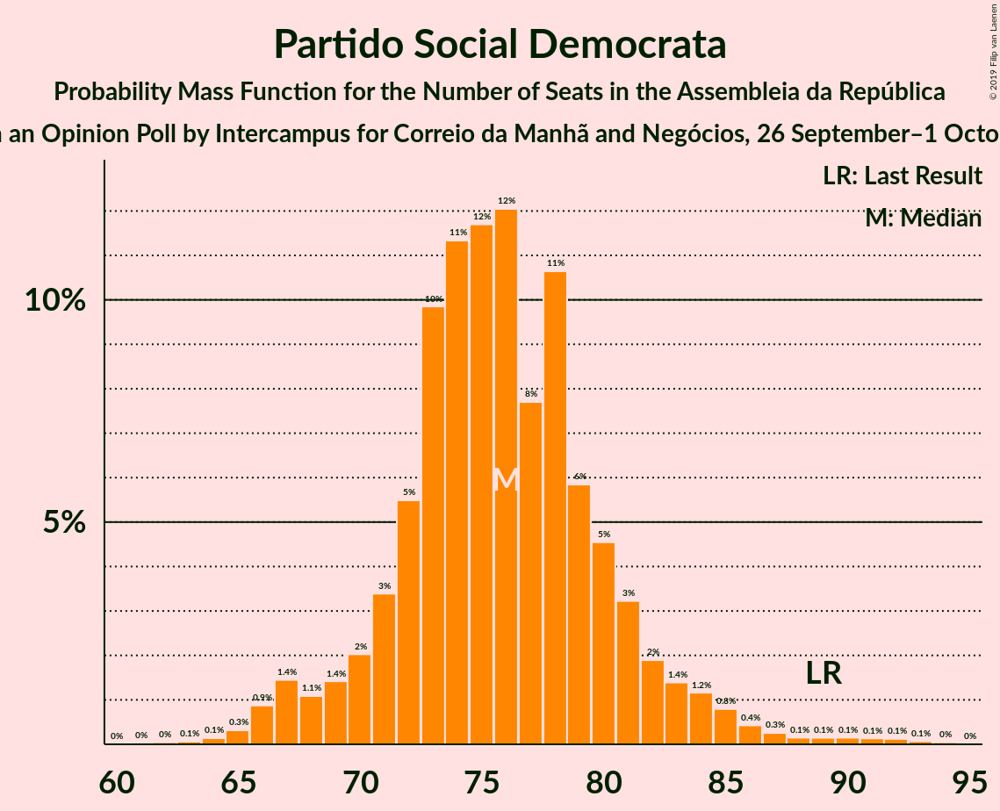
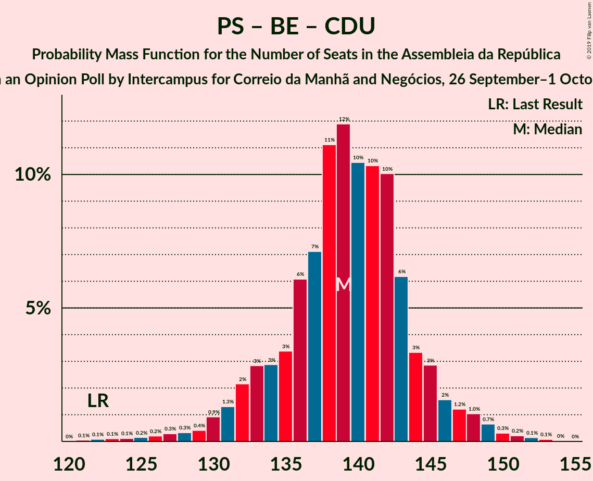

# Opinion Poll by Intercampus for Correio da Manhã and Negócios, 26 September–1 October 2019

<a href="#voting-intentions">Voting Intentions</a> | <a href="#seats">Seats</a> | <a href="#coalitions">Coalitions</a> | <a href="#technical-information">Technical Information</a>

## Voting Intentions

### Confidence Intervals

| Party | Last Result | Poll Result | 80% Confidence Interval | 90% Confidence Interval | 95% Confidence Interval | 99% Confidence Interval |
|:-----:|:-----------:|:-----------:|:-----------------------:|:-----------------------:|:-----------------------:|:-----------------------:|
| Partido Socialista | 32.3% | 35.0% | 33.1–37.0% |32.6–37.5% |32.1–38.0% |31.2–39.0% |
| Partido Social Democrata | 36.9% | 26.1% | 24.4–27.9% |23.9–28.5% |23.5–28.9% |22.7–29.8% |
| Bloco de Esquerda | 10.2% | 8.7% | 7.7–10.0% |7.3–10.3% |7.1–10.6% |6.6–11.2% |
| Coligação Democrática Unitária | 8.2% | 8.0% | 7.0–9.2% |6.7–9.6% |6.5–9.9% |6.0–10.5% |
| Pessoas–Animais–Natureza | 1.4% | 5.6% | 4.8–6.6% |4.5–7.0% |4.3–7.2% |4.0–7.7% |
| CDS–Partido Popular | 36.9% | 4.5% | 3.8–5.5% |3.6–5.7% |3.4–6.0% |3.0–6.5% |

*Note:* The poll result column reflects the actual value used in the calculations. Published results may vary slightly, and in addition be rounded to fewer digits.

## Seats

### Confidence Intervals

| Party | Last Result | Median | 80% Confidence Interval | 90% Confidence Interval | 95% Confidence Interval | 99% Confidence Interval |
|:-----:|:-----------:|:------:|:-----------------------:|:-----------------------:|:-----------------------:|:-----------------------:|
| <a href="#partido-socialista">Partido Socialista</a> | 86 | 104 | 100–109 |96–111 |95–113 |90–115 |
| <a href="#partido-social-democrata">Partido Social Democrata</a> | 89 | 76 | 71–80 |70–82 |68–84 |65–90 |
| <a href="#bloco-de-esquerda">Bloco de Esquerda</a> | 19 | 18 | 17–21 |15–22 |13–23 |12–24 |
| <a href="#coligação-democrática-unitária">Coligação Democrática Unitária</a> | 17 | 17 | 13–20 |13–20 |13–21 |10–23 |
| <a href="#pessoas–animais–natureza">Pessoas–Animais–Natureza</a> | 1 | 9 | 6–12 |6–13 |6–14 |6–17 |
| <a href="#cds–partido-popular">CDS–Partido Popular</a> | 18 | 6 | 4–7 |4–8 |4–10 |2–11 |

### Partido Socialista

*For a full overview of the results for this party, see the [Partido Socialista](party-partidosocialista.html) page.*

| Number of Seats | Probability | Accumulated | Special Marks |
|:---------------:|:-----------:|:-----------:|:-------------:|
| 86 | 0% | 100% | Last Result |
| 87 | 0.1% | 100% |  |
| 88 | 0.2% | 99.9% |  |
| 89 | 0.2% | 99.7% |  |
| 90 | 0.2% | 99.6% |  |
| 91 | 0.1% | 99.3% |  |
| 92 | 0.2% | 99.3% |  |
| 93 | 0.3% | 99.1% |  |
| 94 | 0.6% | 98.8% |  |
| 95 | 1.3% | 98% |  |
| 96 | 2% | 97% |  |
| 97 | 2% | 95% |  |
| 98 | 2% | 93% |  |
| 99 | 1.2% | 92% |  |
| 100 | 3% | 90% |  |
| 101 | 9% | 88% |  |
| 102 | 11% | 78% |  |
| 103 | 6% | 68% |  |
| 104 | 17% | 61% | Median |
| 105 | 18% | 45% |  |
| 106 | 7% | 27% |  |
| 107 | 4% | 20% |  |
| 108 | 3% | 16% |  |
| 109 | 4% | 13% |  |
| 110 | 3% | 9% |  |
| 111 | 2% | 6% |  |
| 112 | 1.3% | 4% |  |
| 113 | 2% | 3% |  |
| 114 | 0.5% | 1.4% |  |
| 115 | 0.7% | 0.9% |  |
| 116 | 0.2% | 0.3% | Majority |
| 117 | 0% | 0.1% |  |
| 118 | 0% | 0.1% |  |
| 119 | 0% | 0% |  |

### Partido Social Democrata

*For a full overview of the results for this party, see the [Partido Social Democrata](party-partidosocialdemocrata.html) page.*

| Number of Seats | Probability | Accumulated | Special Marks |
|:---------------:|:-----------:|:-----------:|:-------------:|
| 61 | 0% | 100% |  |
| 62 | 0% | 99.9% |  |
| 63 | 0.1% | 99.9% |  |
| 64 | 0.1% | 99.8% |  |
| 65 | 0.3% | 99.7% |  |
| 66 | 0.6% | 99.4% |  |
| 67 | 1.2% | 98.8% |  |
| 68 | 0.8% | 98% |  |
| 69 | 1.4% | 97% |  |
| 70 | 2% | 95% |  |
| 71 | 4% | 93% |  |
| 72 | 3% | 89% |  |
| 73 | 11% | 86% |  |
| 74 | 13% | 75% |  |
| 75 | 10% | 62% |  |
| 76 | 12% | 52% | Median |
| 77 | 7% | 39% |  |
| 78 | 10% | 33% |  |
| 79 | 5% | 22% |  |
| 80 | 7% | 17% |  |
| 81 | 4% | 10% |  |
| 82 | 2% | 6% |  |
| 83 | 2% | 5% |  |
| 84 | 0.7% | 3% |  |
| 85 | 0.6% | 2% |  |
| 86 | 0.7% | 2% |  |
| 87 | 0.1% | 0.8% |  |
| 88 | 0.1% | 0.7% |  |
| 89 | 0.1% | 0.6% | Last Result |
| 90 | 0.1% | 0.6% |  |
| 91 | 0.2% | 0.5% |  |
| 92 | 0.1% | 0.3% |  |
| 93 | 0.1% | 0.2% |  |
| 94 | 0% | 0.1% |  |
| 95 | 0% | 0% |  |

### Bloco de Esquerda

*For a full overview of the results for this party, see the [Bloco de Esquerda](party-blocodeesquerda.html) page.*

| Number of Seats | Probability | Accumulated | Special Marks |
|:---------------:|:-----------:|:-----------:|:-------------:|
| 10 | 0.1% | 100% |  |
| 11 | 0.2% | 99.8% |  |
| 12 | 0.6% | 99.6% |  |
| 13 | 2% | 99.0% |  |
| 14 | 1.4% | 97% |  |
| 15 | 1.0% | 96% |  |
| 16 | 4% | 95% |  |
| 17 | 15% | 90% |  |
| 18 | 41% | 76% | Median |
| 19 | 15% | 34% | Last Result |
| 20 | 4% | 20% |  |
| 21 | 9% | 16% |  |
| 22 | 4% | 7% |  |
| 23 | 0.9% | 3% |  |
| 24 | 2% | 2% |  |
| 25 | 0% | 0.3% |  |
| 26 | 0.1% | 0.2% |  |
| 27 | 0.1% | 0.1% |  |
| 28 | 0% | 0% |  |

### Coligação Democrática Unitária

*For a full overview of the results for this party, see the [Coligação Democrática Unitária](party-coligaçãodemocráticaunitária.html) page.*

| Number of Seats | Probability | Accumulated | Special Marks |
|:---------------:|:-----------:|:-----------:|:-------------:|
| 9 | 0.3% | 100% |  |
| 10 | 0.2% | 99.6% |  |
| 11 | 0.5% | 99.4% |  |
| 12 | 1.3% | 98.9% |  |
| 13 | 8% | 98% |  |
| 14 | 10% | 90% |  |
| 15 | 7% | 80% |  |
| 16 | 7% | 74% |  |
| 17 | 34% | 67% | Last Result, Median |
| 18 | 12% | 32% |  |
| 19 | 6% | 20% |  |
| 20 | 12% | 14% |  |
| 21 | 1.3% | 3% |  |
| 22 | 0.5% | 1.2% |  |
| 23 | 0.4% | 0.7% |  |
| 24 | 0.3% | 0.3% |  |
| 25 | 0% | 0% |  |

### Pessoas–Animais–Natureza

*For a full overview of the results for this party, see the [Pessoas–Animais–Natureza](party-pessoas–animais–natureza.html) page.*

| Number of Seats | Probability | Accumulated | Special Marks |
|:---------------:|:-----------:|:-----------:|:-------------:|
| 1 | 0% | 100% | Last Result |
| 2 | 0% | 100% |  |
| 3 | 0% | 100% |  |
| 4 | 0.1% | 100% |  |
| 5 | 0.1% | 99.9% |  |
| 6 | 18% | 99.9% |  |
| 7 | 11% | 82% |  |
| 8 | 10% | 71% |  |
| 9 | 39% | 61% | Median |
| 10 | 5% | 23% |  |
| 11 | 3% | 17% |  |
| 12 | 6% | 14% |  |
| 13 | 5% | 8% |  |
| 14 | 2% | 4% |  |
| 15 | 0.6% | 2% |  |
| 16 | 0.7% | 1.4% |  |
| 17 | 0.7% | 0.7% |  |
| 18 | 0% | 0% |  |

### CDS–Partido Popular

*For a full overview of the results for this party, see the [CDS–Partido Popular](party-cds–partidopopular.html) page.*

| Number of Seats | Probability | Accumulated | Special Marks |
|:---------------:|:-----------:|:-----------:|:-------------:|
| 2 | 0.8% | 100% |  |
| 3 | 2% | 99.2% |  |
| 4 | 9% | 98% |  |
| 5 | 2% | 89% |  |
| 6 | 58% | 87% | Median |
| 7 | 23% | 29% |  |
| 8 | 2% | 6% |  |
| 9 | 0.8% | 4% |  |
| 10 | 2% | 3% |  |
| 11 | 0.9% | 1.1% |  |
| 12 | 0.1% | 0.1% |  |
| 13 | 0% | 0% |  |
| 14 | 0% | 0% |  |
| 15 | 0% | 0% |  |
| 16 | 0% | 0% |  |
| 17 | 0% | 0% |  |
| 18 | 0% | 0% | Last Result |

## Coalitions

### Confidence Intervals

| Coalition | Last Result | Median | Majority? | 80% Confidence Interval | 90% Confidence Interval | 95% Confidence Interval | 99% Confidence Interval |
|:---------:|:-----------:|:------:|:---------:|:-----------------------:|:-----------------------:|:-----------------------:|:-----------------------:|
| Partido Socialista – Bloco de Esquerda – Coligação Democrática Unitária | 122 | 139 | 100% | 134–144 | 132–145 | 131–147 | 125–150 |
| Partido Socialista – Bloco de Esquerda | 105 | 123 | 94% | 118–128 | 115–129 | 114–131 | 109–133 |
| Partido Socialista – Coligação Democrática Unitária | 103 | 121 | 90% | 116–126 | 114–127 | 113–130 | 107–132 |
| Partido Socialista | 86 | 104 | 0.3% | 100–109 | 96–111 | 95–113 | 90–115 |
| Partido Social Democrata – CDS–Partido Popular | 107 | 82 | 0% | 78–87 | 76–89 | 74–91 | 72–96 |

### Partido Socialista – Bloco de Esquerda – Coligação Democrática Unitária

| Number of Seats | Probability | Accumulated | Special Marks |
|:---------------:|:-----------:|:-----------:|:-------------:|
| 121 | 0% | 100% |  |
| 122 | 0.1% | 99.9% | Last Result |
| 123 | 0.2% | 99.9% |  |
| 124 | 0.1% | 99.7% |  |
| 125 | 0.2% | 99.6% |  |
| 126 | 0.2% | 99.5% |  |
| 127 | 0.2% | 99.3% |  |
| 128 | 0.2% | 99.0% |  |
| 129 | 0.1% | 98.9% |  |
| 130 | 1.1% | 98.7% |  |
| 131 | 2% | 98% |  |
| 132 | 2% | 96% |  |
| 133 | 2% | 94% |  |
| 134 | 3% | 92% |  |
| 135 | 5% | 89% |  |
| 136 | 5% | 84% |  |
| 137 | 10% | 79% |  |
| 138 | 8% | 69% |  |
| 139 | 11% | 61% | Median |
| 140 | 11% | 50% |  |
| 141 | 15% | 38% |  |
| 142 | 6% | 24% |  |
| 143 | 7% | 17% |  |
| 144 | 3% | 10% |  |
| 145 | 4% | 7% |  |
| 146 | 1.2% | 4% |  |
| 147 | 0.5% | 3% |  |
| 148 | 0.3% | 2% |  |
| 149 | 1.1% | 2% |  |
| 150 | 0.2% | 0.6% |  |
| 151 | 0.2% | 0.4% |  |
| 152 | 0.1% | 0.2% |  |
| 153 | 0% | 0.1% |  |
| 154 | 0% | 0.1% |  |
| 155 | 0% | 0% |  |

### Partido Socialista – Bloco de Esquerda

| Number of Seats | Probability | Accumulated | Special Marks |
|:---------------:|:-----------:|:-----------:|:-------------:|
| 105 | 0% | 100% | Last Result |
| 106 | 0.2% | 99.9% |  |
| 107 | 0.1% | 99.7% |  |
| 108 | 0.1% | 99.6% |  |
| 109 | 0.1% | 99.5% |  |
| 110 | 0.3% | 99.4% |  |
| 111 | 0.4% | 99.1% |  |
| 112 | 0.6% | 98.7% |  |
| 113 | 0.4% | 98% |  |
| 114 | 2% | 98% |  |
| 115 | 1.4% | 96% |  |
| 116 | 3% | 94% | Majority |
| 117 | 1.4% | 92% |  |
| 118 | 4% | 90% |  |
| 119 | 9% | 87% |  |
| 120 | 12% | 78% |  |
| 121 | 3% | 66% |  |
| 122 | 11% | 63% | Median |
| 123 | 8% | 52% |  |
| 124 | 16% | 44% |  |
| 125 | 11% | 27% |  |
| 126 | 3% | 16% |  |
| 127 | 3% | 14% |  |
| 128 | 4% | 11% |  |
| 129 | 2% | 6% |  |
| 130 | 1.1% | 4% |  |
| 131 | 1.1% | 3% |  |
| 132 | 0.4% | 1.4% |  |
| 133 | 0.5% | 1.0% |  |
| 134 | 0.1% | 0.4% |  |
| 135 | 0.1% | 0.3% |  |
| 136 | 0.1% | 0.2% |  |
| 137 | 0.1% | 0.1% |  |
| 138 | 0% | 0% |  |

### Partido Socialista – Coligação Democrática Unitária

| Number of Seats | Probability | Accumulated | Special Marks |
|:---------------:|:-----------:|:-----------:|:-------------:|
| 103 | 0.1% | 100% | Last Result |
| 104 | 0% | 99.9% |  |
| 105 | 0.2% | 99.9% |  |
| 106 | 0% | 99.7% |  |
| 107 | 0.2% | 99.6% |  |
| 108 | 0.2% | 99.4% |  |
| 109 | 0.2% | 99.2% |  |
| 110 | 0.4% | 99.0% |  |
| 111 | 0.3% | 98.6% |  |
| 112 | 0.8% | 98% |  |
| 113 | 2% | 98% |  |
| 114 | 3% | 96% |  |
| 115 | 3% | 93% |  |
| 116 | 3% | 90% | Majority |
| 117 | 4% | 87% |  |
| 118 | 6% | 83% |  |
| 119 | 9% | 78% |  |
| 120 | 9% | 68% |  |
| 121 | 16% | 60% | Median |
| 122 | 19% | 43% |  |
| 123 | 6% | 24% |  |
| 124 | 4% | 18% |  |
| 125 | 3% | 14% |  |
| 126 | 4% | 11% |  |
| 127 | 3% | 7% |  |
| 128 | 0.8% | 4% |  |
| 129 | 0.6% | 3% |  |
| 130 | 0.8% | 3% |  |
| 131 | 0.9% | 2% |  |
| 132 | 0.4% | 0.8% |  |
| 133 | 0.2% | 0.4% |  |
| 134 | 0.1% | 0.3% |  |
| 135 | 0.1% | 0.1% |  |
| 136 | 0.1% | 0.1% |  |
| 137 | 0% | 0% |  |

### Partido Socialista

| Number of Seats | Probability | Accumulated | Special Marks |
|:---------------:|:-----------:|:-----------:|:-------------:|
| 86 | 0% | 100% | Last Result |
| 87 | 0.1% | 100% |  |
| 88 | 0.2% | 99.9% |  |
| 89 | 0.2% | 99.7% |  |
| 90 | 0.2% | 99.6% |  |
| 91 | 0.1% | 99.3% |  |
| 92 | 0.2% | 99.3% |  |
| 93 | 0.3% | 99.1% |  |
| 94 | 0.6% | 98.8% |  |
| 95 | 1.3% | 98% |  |
| 96 | 2% | 97% |  |
| 97 | 2% | 95% |  |
| 98 | 2% | 93% |  |
| 99 | 1.2% | 92% |  |
| 100 | 3% | 90% |  |
| 101 | 9% | 88% |  |
| 102 | 11% | 78% |  |
| 103 | 6% | 68% |  |
| 104 | 17% | 61% | Median |
| 105 | 18% | 45% |  |
| 106 | 7% | 27% |  |
| 107 | 4% | 20% |  |
| 108 | 3% | 16% |  |
| 109 | 4% | 13% |  |
| 110 | 3% | 9% |  |
| 111 | 2% | 6% |  |
| 112 | 1.3% | 4% |  |
| 113 | 2% | 3% |  |
| 114 | 0.5% | 1.4% |  |
| 115 | 0.7% | 0.9% |  |
| 116 | 0.2% | 0.3% | Majority |
| 117 | 0% | 0.1% |  |
| 118 | 0% | 0.1% |  |
| 119 | 0% | 0% |  |

### Partido Social Democrata – CDS–Partido Popular

| Number of Seats | Probability | Accumulated | Special Marks |
|:---------------:|:-----------:|:-----------:|:-------------:|
| 68 | 0% | 100% |  |
| 69 | 0.1% | 99.9% |  |
| 70 | 0.1% | 99.8% |  |
| 71 | 0.2% | 99.7% |  |
| 72 | 0.5% | 99.5% |  |
| 73 | 0.4% | 99.0% |  |
| 74 | 2% | 98.6% |  |
| 75 | 1.4% | 97% |  |
| 76 | 2% | 96% |  |
| 77 | 3% | 93% |  |
| 78 | 4% | 90% |  |
| 79 | 10% | 87% |  |
| 80 | 17% | 77% |  |
| 81 | 8% | 60% |  |
| 82 | 12% | 52% | Median |
| 83 | 5% | 40% |  |
| 84 | 11% | 35% |  |
| 85 | 4% | 24% |  |
| 86 | 9% | 20% |  |
| 87 | 4% | 11% |  |
| 88 | 2% | 7% |  |
| 89 | 2% | 5% |  |
| 90 | 0.9% | 4% |  |
| 91 | 1.1% | 3% |  |
| 92 | 0.8% | 2% |  |
| 93 | 0.1% | 0.9% |  |
| 94 | 0.1% | 0.8% |  |
| 95 | 0.1% | 0.7% |  |
| 96 | 0.2% | 0.6% |  |
| 97 | 0.1% | 0.4% |  |
| 98 | 0.2% | 0.4% |  |
| 99 | 0.1% | 0.2% |  |
| 100 | 0% | 0.1% |  |
| 101 | 0% | 0% |  |
| 102 | 0% | 0% |  |
| 103 | 0% | 0% |  |
| 104 | 0% | 0% |  |
| 105 | 0% | 0% |  |
| 106 | 0% | 0% |  |
| 107 | 0% | 0% | Last Result |

## Technical Information

### Opinion Poll

+ **Polling firm:** Intercampus
+ **Commissioner(s):** Correio da Manhã and Negócios
+ **Fieldwork period:** 26 September–1 October 2019

### Calculations

+ **Sample size:** 1000
+ **Simulations done:** 131,072
+ **Error estimate:** 0.66%

