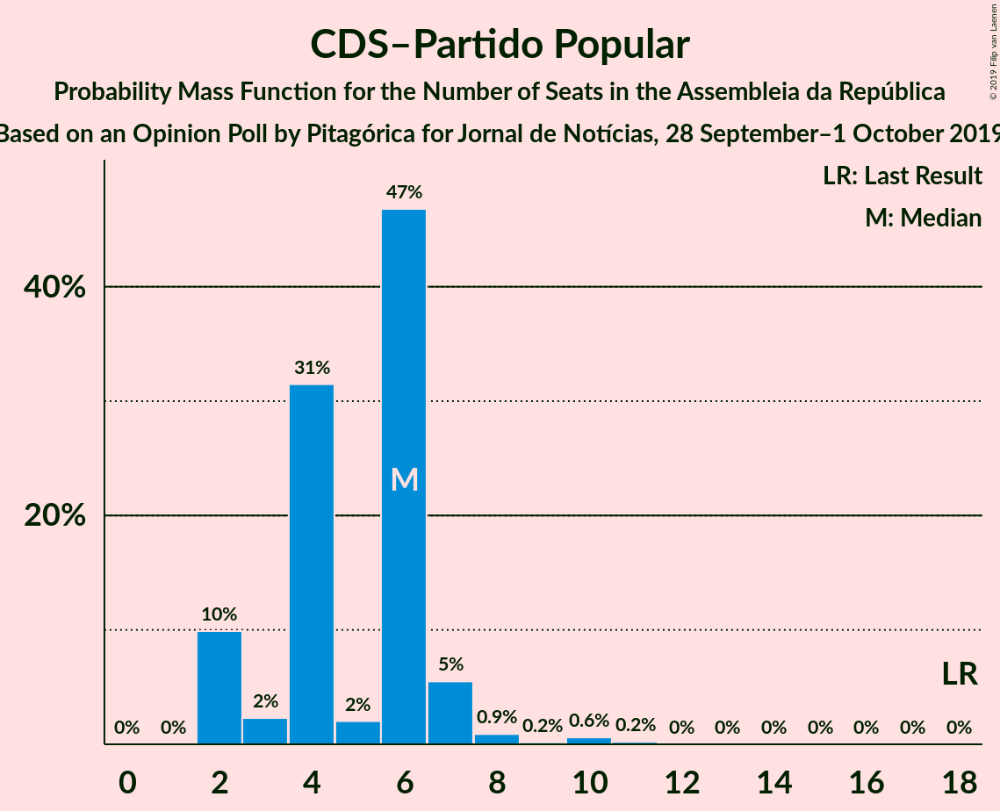
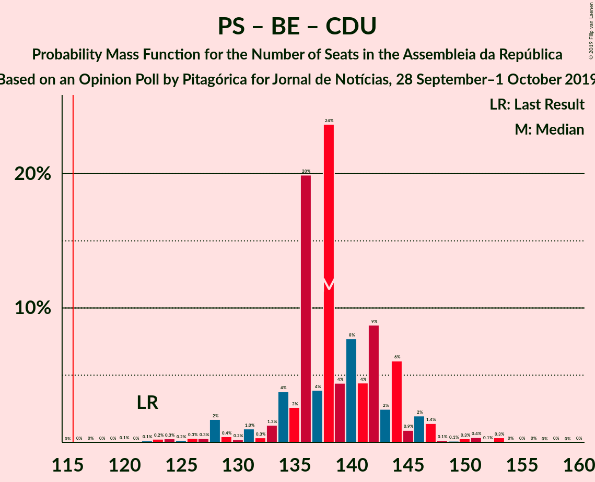
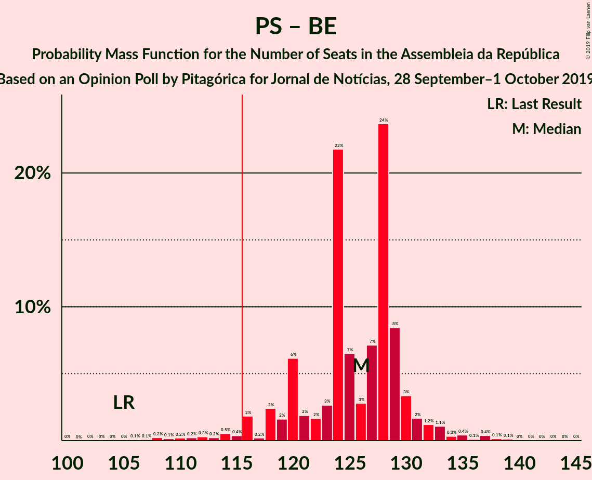

# Opinion Poll by Pitagórica for Jornal de Notícias, 28 September–1 October 2019

<a href="#voting-intentions">Voting Intentions</a> | <a href="#seats">Seats</a> | <a href="#coalitions">Coalitions</a> | <a href="#technical-information">Technical Information</a>

## Voting Intentions

### Confidence Intervals

| Party | Last Result | Poll Result | 80% Confidence Interval | 90% Confidence Interval | 95% Confidence Interval | 99% Confidence Interval |
|:-----:|:-----------:|:-----------:|:-----------------------:|:-----------------------:|:-----------------------:|:-----------------------:|
| Partido Socialista | 32.3% | 37.3% | 34.9–39.9% |34.2–40.6% |33.5–41.3% |32.4–42.5% |
| Partido Social Democrata | 36.9% | 28.5% | 26.2–31.0% |25.6–31.6% |25.0–32.3% |24.0–33.4% |
| Bloco de Esquerda | 10.2% | 8.8% | 7.5–10.5% |7.1–11.0% |6.8–11.4% |6.2–12.2% |
| Coligação Democrática Unitária | 8.2% | 7.3% | 6.1–8.9% |5.8–9.3% |5.5–9.7% |5.0–10.5% |
| CDS–Partido Popular | 36.9% | 4.0% | 3.1–5.2% |2.9–5.6% |2.7–5.9% |2.3–6.5% |
| Pessoas–Animais–Natureza | 1.4% | 3.8% | 3.0–5.0% |2.8–5.4% |2.6–5.7% |2.2–6.3% |
| Chega | 0.0% | 1.5% | 1.0–2.4% |0.9–2.6% |0.8–2.8% |0.6–3.3% |
| Aliança | 0.0% | 1.2% | 0.8–2.0% |0.7–2.2% |0.6–2.4% |0.4–2.8% |
| LIVRE | 0.7% | 0.8% | 0.5–1.5% |0.4–1.8% |0.4–1.9% |0.2–2.3% |
| Iniciativa Liberal | 0.0% | 0.3% | 0.2–0.9% |0.1–1.1% |0.1–1.2% |0.0–1.5% |

*Note:* The poll result column reflects the actual value used in the calculations. Published results may vary slightly, and in addition be rounded to fewer digits.

## Seats

### Confidence Intervals

| Party | Last Result | Median | 80% Confidence Interval | 90% Confidence Interval | 95% Confidence Interval | 99% Confidence Interval |
|:-----:|:-----------:|:------:|:-----------------------:|:-----------------------:|:-----------------------:|:-----------------------:|
| <a href="#partido-socialista">Partido Socialista</a> | 86 | 104 | 101–115 |100–117 |97–117 |88–119 |
| <a href="#partido-social-democrata">Partido Social Democrata</a> | 89 | 79 | 73–84 |71–87 |71–93 |65–98 |
| <a href="#bloco-de-esquerda">Bloco de Esquerda</a> | 19 | 18 | 15–22 |13–23 |12–25 |9–27 |
| <a href="#coligação-democrática-unitária">Coligação Democrática Unitária</a> | 17 | 17 | 12–20 |9–20 |9–20 |6–24 |
| <a href="#cds–partido-popular">CDS–Partido Popular</a> | 18 | 6 | 2–7 |2–8 |2–8 |2–11 |
| <a href="#pessoas–animais–natureza">Pessoas–Animais–Natureza</a> | 1 | 4 | 2–6 |2–8 |2–8 |2–10 |
| <a href="#chega">Chega</a> | 0 | 0 | 0–2 |0–2 |0–2 |0–3 |
| <a href="#aliança">Aliança</a> | 0 | 0 | 0 |0–2 |0–2 |0–2 |
| <a href="#livre">LIVRE</a> | 0 | 1 | 0–1 |0–1 |0–1 |0–2 |
| <a href="#iniciativa-liberal">Iniciativa Liberal</a> | 0 | 0 | 0 |0 |0 |0 |

### Partido Socialista

*For a full overview of the results for this party, see the [Partido Socialista](party-partidosocialista.html) page.*

| Number of Seats | Probability | Accumulated | Special Marks |
|:---------------:|:-----------:|:-----------:|:-------------:|
| 85 | 0.1% | 100% |  |
| 86 | 0.1% | 99.9% | Last Result |
| 87 | 0.1% | 99.8% |  |
| 88 | 0.7% | 99.7% |  |
| 89 | 0.1% | 99.0% |  |
| 90 | 0.1% | 98.9% |  |
| 91 | 0% | 98.8% |  |
| 92 | 0% | 98.8% |  |
| 93 | 0% | 98.8% |  |
| 94 | 0% | 98.7% |  |
| 95 | 0.1% | 98.7% |  |
| 96 | 0.9% | 98.6% |  |
| 97 | 0.6% | 98% |  |
| 98 | 0.5% | 97% |  |
| 99 | 0.5% | 97% |  |
| 100 | 3% | 96% |  |
| 101 | 6% | 93% |  |
| 102 | 21% | 87% |  |
| 103 | 7% | 66% |  |
| 104 | 14% | 59% | Median |
| 105 | 1.0% | 44% |  |
| 106 | 1.2% | 43% |  |
| 107 | 0.1% | 42% |  |
| 108 | 1.4% | 42% |  |
| 109 | 2% | 40% |  |
| 110 | 20% | 39% |  |
| 111 | 4% | 18% |  |
| 112 | 0.7% | 15% |  |
| 113 | 0.3% | 14% |  |
| 114 | 1.2% | 14% |  |
| 115 | 3% | 12% |  |
| 116 | 4% | 9% | Majority |
| 117 | 3% | 5% |  |
| 118 | 0.7% | 2% |  |
| 119 | 0.9% | 1.1% |  |
| 120 | 0.1% | 0.2% |  |
| 121 | 0% | 0.1% |  |
| 122 | 0% | 0.1% |  |
| 123 | 0% | 0.1% |  |
| 124 | 0% | 0.1% |  |
| 125 | 0% | 0.1% |  |
| 126 | 0% | 0.1% |  |
| 127 | 0% | 0.1% |  |
| 128 | 0.1% | 0.1% |  |
| 129 | 0% | 0% |  |

### Partido Social Democrata

*For a full overview of the results for this party, see the [Partido Social Democrata](party-partidosocialdemocrata.html) page.*

| Number of Seats | Probability | Accumulated | Special Marks |
|:---------------:|:-----------:|:-----------:|:-------------:|
| 64 | 0.5% | 100% |  |
| 65 | 0% | 99.5% |  |
| 66 | 0.4% | 99.5% |  |
| 67 | 0.3% | 99.1% |  |
| 68 | 0% | 98.8% |  |
| 69 | 0.5% | 98.7% |  |
| 70 | 0.1% | 98% |  |
| 71 | 4% | 98% |  |
| 72 | 0.4% | 94% |  |
| 73 | 9% | 94% |  |
| 74 | 2% | 85% |  |
| 75 | 2% | 83% |  |
| 76 | 5% | 82% |  |
| 77 | 0.9% | 77% |  |
| 78 | 17% | 76% |  |
| 79 | 18% | 59% | Median |
| 80 | 1.1% | 41% |  |
| 81 | 21% | 40% |  |
| 82 | 4% | 19% |  |
| 83 | 2% | 15% |  |
| 84 | 5% | 12% |  |
| 85 | 0.4% | 7% |  |
| 86 | 1.4% | 7% |  |
| 87 | 0.4% | 5% |  |
| 88 | 0.8% | 5% |  |
| 89 | 0.6% | 4% | Last Result |
| 90 | 0% | 4% |  |
| 91 | 0.5% | 4% |  |
| 92 | 0.2% | 3% |  |
| 93 | 0.4% | 3% |  |
| 94 | 1.0% | 2% |  |
| 95 | 0.1% | 1.4% |  |
| 96 | 0.5% | 1.4% |  |
| 97 | 0% | 0.9% |  |
| 98 | 0.7% | 0.9% |  |
| 99 | 0% | 0.2% |  |
| 100 | 0% | 0.1% |  |
| 101 | 0% | 0.1% |  |
| 102 | 0% | 0.1% |  |
| 103 | 0.1% | 0.1% |  |
| 104 | 0% | 0% |  |

### Bloco de Esquerda

*For a full overview of the results for this party, see the [Bloco de Esquerda](party-blocodeesquerda.html) page.*

| Number of Seats | Probability | Accumulated | Special Marks |
|:---------------:|:-----------:|:-----------:|:-------------:|
| 9 | 0.6% | 100% |  |
| 10 | 0.9% | 99.4% |  |
| 11 | 0.2% | 98% |  |
| 12 | 0.9% | 98% |  |
| 13 | 3% | 97% |  |
| 14 | 2% | 95% |  |
| 15 | 7% | 92% |  |
| 16 | 2% | 86% |  |
| 17 | 17% | 84% |  |
| 18 | 46% | 67% | Median |
| 19 | 2% | 21% | Last Result |
| 20 | 3% | 20% |  |
| 21 | 7% | 17% |  |
| 22 | 2% | 10% |  |
| 23 | 4% | 8% |  |
| 24 | 1.0% | 4% |  |
| 25 | 1.5% | 3% |  |
| 26 | 0.2% | 1.1% |  |
| 27 | 0.8% | 0.8% |  |
| 28 | 0% | 0.1% |  |
| 29 | 0% | 0.1% |  |
| 30 | 0% | 0% |  |

### Coligação Democrática Unitária

*For a full overview of the results for this party, see the [Coligação Democrática Unitária](party-coligaçãodemocráticaunitária.html) page.*

| Number of Seats | Probability | Accumulated | Special Marks |
|:---------------:|:-----------:|:-----------:|:-------------:|
| 5 | 0.4% | 100% |  |
| 6 | 0.3% | 99.6% |  |
| 7 | 0.2% | 99.3% |  |
| 8 | 1.3% | 99.1% |  |
| 9 | 5% | 98% |  |
| 10 | 0.3% | 92% |  |
| 11 | 1.0% | 92% |  |
| 12 | 2% | 91% |  |
| 13 | 25% | 89% |  |
| 14 | 10% | 64% |  |
| 15 | 0.4% | 55% |  |
| 16 | 0.4% | 54% |  |
| 17 | 15% | 54% | Last Result, Median |
| 18 | 20% | 39% |  |
| 19 | 0.7% | 18% |  |
| 20 | 16% | 18% |  |
| 21 | 0.4% | 2% |  |
| 22 | 0.8% | 1.5% |  |
| 23 | 0.1% | 0.7% |  |
| 24 | 0.6% | 0.6% |  |
| 25 | 0% | 0% |  |

### CDS–Partido Popular

*For a full overview of the results for this party, see the [CDS–Partido Popular](party-cds–partidopopular.html) page.*

| Number of Seats | Probability | Accumulated | Special Marks |
|:---------------:|:-----------:|:-----------:|:-------------:|
| 2 | 13% | 100% |  |
| 3 | 4% | 87% |  |
| 4 | 8% | 84% |  |
| 5 | 1.4% | 75% |  |
| 6 | 60% | 74% | Median |
| 7 | 7% | 14% |  |
| 8 | 5% | 7% |  |
| 9 | 0.1% | 2% |  |
| 10 | 0.6% | 1.4% |  |
| 11 | 0.7% | 0.8% |  |
| 12 | 0% | 0.1% |  |
| 13 | 0.1% | 0.1% |  |
| 14 | 0% | 0.1% |  |
| 15 | 0% | 0% |  |
| 16 | 0% | 0% |  |
| 17 | 0% | 0% |  |
| 18 | 0% | 0% | Last Result |

### Pessoas–Animais–Natureza

*For a full overview of the results for this party, see the [Pessoas–Animais–Natureza](party-pessoas–animais–natureza.html) page.*

| Number of Seats | Probability | Accumulated | Special Marks |
|:---------------:|:-----------:|:-----------:|:-------------:|
| 1 | 0.2% | 100% | Last Result |
| 2 | 22% | 99.8% |  |
| 3 | 15% | 78% |  |
| 4 | 16% | 63% | Median |
| 5 | 5% | 47% |  |
| 6 | 33% | 41% |  |
| 7 | 0.9% | 8% |  |
| 8 | 7% | 7% |  |
| 9 | 0.2% | 0.8% |  |
| 10 | 0.4% | 0.6% |  |
| 11 | 0% | 0.3% |  |
| 12 | 0.2% | 0.2% |  |
| 13 | 0% | 0.1% |  |
| 14 | 0% | 0.1% |  |
| 15 | 0.1% | 0.1% |  |
| 16 | 0% | 0% |  |

### Chega

*For a full overview of the results for this party, see the [Chega](party-chega.html) page.*

| Number of Seats | Probability | Accumulated | Special Marks |
|:---------------:|:-----------:|:-----------:|:-------------:|
| 0 | 85% | 100% | Last Result, Median |
| 1 | 3% | 15% |  |
| 2 | 12% | 12% |  |
| 3 | 0.2% | 0.6% |  |
| 4 | 0.5% | 0.5% |  |
| 5 | 0% | 0% |  |

### Aliança

*For a full overview of the results for this party, see the [Aliança](party-aliança.html) page.*

| Number of Seats | Probability | Accumulated | Special Marks |
|:---------------:|:-----------:|:-----------:|:-------------:|
| 0 | 93% | 100% | Last Result, Median |
| 1 | 0.2% | 7% |  |
| 2 | 7% | 7% |  |
| 3 | 0% | 0.1% |  |
| 4 | 0.1% | 0.1% |  |
| 5 | 0% | 0% |  |

### LIVRE

*For a full overview of the results for this party, see the [LIVRE](party-livre.html) page.*

| Number of Seats | Probability | Accumulated | Special Marks |
|:---------------:|:-----------:|:-----------:|:-------------:|
| 0 | 44% | 100% | Last Result |
| 1 | 54% | 56% | Median |
| 2 | 2% | 2% |  |
| 3 | 0.1% | 0.1% |  |
| 4 | 0% | 0% |  |

### Iniciativa Liberal

*For a full overview of the results for this party, see the [Iniciativa Liberal](party-iniciativaliberal.html) page.*

| Number of Seats | Probability | Accumulated | Special Marks |
|:---------------:|:-----------:|:-----------:|:-------------:|
| 0 | 100% | 100% | Last Result, Median |

## Coalitions

### Confidence Intervals

| Coalition | Last Result | Median | Majority? | 80% Confidence Interval | 90% Confidence Interval | 95% Confidence Interval | 99% Confidence Interval |
|:---------:|:-----------:|:------:|:---------:|:-----------------------:|:-----------------------:|:-----------------------:|:-----------------------:|
| Partido Socialista – Bloco de Esquerda – Coligação Democrática Unitária | 122 | 141 | 100% | 136–146 | 133–147 | 125–150 | 123–155 |
| Partido Socialista – Bloco de Esquerda | 105 | 124 | 96% | 119–131 | 117–132 | 114–135 | 106–139 |
| Partido Socialista – Coligação Democrática Unitária | 103 | 123 | 90% | 116–128 | 113–130 | 108–132 | 105–139 |
| Partido Socialista | 86 | 104 | 9% | 101–115 | 100–117 | 97–117 | 88–119 |
| Partido Social Democrata – CDS–Partido Popular | 107 | 85 | 0% | 78–88 | 77–92 | 74–98 | 69–101 |

### Partido Socialista – Bloco de Esquerda – Coligação Democrática Unitária

| Number of Seats | Probability | Accumulated | Special Marks |
|:---------------:|:-----------:|:-----------:|:-------------:|
| 116 | 0.1% | 100% | Majority |
| 117 | 0% | 99.9% |  |
| 118 | 0% | 99.9% |  |
| 119 | 0% | 99.9% |  |
| 120 | 0.1% | 99.9% |  |
| 121 | 0.1% | 99.8% |  |
| 122 | 0% | 99.7% | Last Result |
| 123 | 2% | 99.7% |  |
| 124 | 0.2% | 98% |  |
| 125 | 0.2% | 98% |  |
| 126 | 0.7% | 97% |  |
| 127 | 0.3% | 97% |  |
| 128 | 0.2% | 96% |  |
| 129 | 0.1% | 96% |  |
| 130 | 0.2% | 96% |  |
| 131 | 0.4% | 96% |  |
| 132 | 0.3% | 95% |  |
| 133 | 2% | 95% |  |
| 134 | 0.4% | 93% |  |
| 135 | 2% | 93% |  |
| 136 | 6% | 91% |  |
| 137 | 0.6% | 84% |  |
| 138 | 17% | 84% |  |
| 139 | 5% | 67% | Median |
| 140 | 5% | 62% |  |
| 141 | 37% | 56% |  |
| 142 | 2% | 20% |  |
| 143 | 4% | 18% |  |
| 144 | 3% | 14% |  |
| 145 | 0.6% | 11% |  |
| 146 | 3% | 10% |  |
| 147 | 4% | 8% |  |
| 148 | 0.3% | 4% |  |
| 149 | 0.2% | 4% |  |
| 150 | 1.0% | 3% |  |
| 151 | 0.8% | 2% |  |
| 152 | 0.3% | 2% |  |
| 153 | 0.6% | 1.2% |  |
| 154 | 0.1% | 0.6% |  |
| 155 | 0% | 0.5% |  |
| 156 | 0.5% | 0.5% |  |
| 157 | 0% | 0% |  |

### Partido Socialista – Bloco de Esquerda

| Number of Seats | Probability | Accumulated | Special Marks |
|:---------------:|:-----------:|:-----------:|:-------------:|
| 99 | 0.1% | 100% |  |
| 100 | 0% | 99.9% |  |
| 101 | 0% | 99.9% |  |
| 102 | 0% | 99.9% |  |
| 103 | 0% | 99.9% |  |
| 104 | 0.1% | 99.9% |  |
| 105 | 0% | 99.8% | Last Result |
| 106 | 0.7% | 99.8% |  |
| 107 | 0.2% | 99.1% |  |
| 108 | 0.1% | 99.0% |  |
| 109 | 0.1% | 98.9% |  |
| 110 | 0.3% | 98.8% |  |
| 111 | 0% | 98.6% |  |
| 112 | 0.1% | 98.5% |  |
| 113 | 0.4% | 98% |  |
| 114 | 1.2% | 98% |  |
| 115 | 0.4% | 97% |  |
| 116 | 0.2% | 96% | Majority |
| 117 | 2% | 96% |  |
| 118 | 2% | 94% |  |
| 119 | 5% | 92% |  |
| 120 | 16% | 87% |  |
| 121 | 13% | 71% |  |
| 122 | 4% | 58% | Median |
| 123 | 1.1% | 54% |  |
| 124 | 5% | 53% |  |
| 125 | 1.2% | 48% |  |
| 126 | 6% | 47% |  |
| 127 | 5% | 41% |  |
| 128 | 21% | 36% |  |
| 129 | 2% | 16% |  |
| 130 | 3% | 14% |  |
| 131 | 3% | 11% |  |
| 132 | 3% | 7% |  |
| 133 | 0.9% | 4% |  |
| 134 | 0.5% | 3% |  |
| 135 | 0.4% | 3% |  |
| 136 | 0.6% | 2% |  |
| 137 | 0.4% | 2% |  |
| 138 | 0.7% | 1.3% |  |
| 139 | 0.3% | 0.6% |  |
| 140 | 0.2% | 0.4% |  |
| 141 | 0.1% | 0.2% |  |
| 142 | 0% | 0% |  |

### Partido Socialista – Coligação Democrática Unitária

| Number of Seats | Probability | Accumulated | Special Marks |
|:---------------:|:-----------:|:-----------:|:-------------:|
| 98 | 0% | 100% |  |
| 99 | 0% | 99.9% |  |
| 100 | 0% | 99.9% |  |
| 101 | 0% | 99.9% |  |
| 102 | 0.1% | 99.9% |  |
| 103 | 0.1% | 99.8% | Last Result |
| 104 | 0% | 99.7% |  |
| 105 | 2% | 99.7% |  |
| 106 | 0.3% | 98% |  |
| 107 | 0.1% | 98% |  |
| 108 | 0.4% | 98% |  |
| 109 | 0.2% | 97% |  |
| 110 | 0.5% | 97% |  |
| 111 | 0.3% | 97% |  |
| 112 | 0.7% | 96% |  |
| 113 | 0.7% | 96% |  |
| 114 | 2% | 95% |  |
| 115 | 2% | 93% |  |
| 116 | 2% | 90% | Majority |
| 117 | 0.4% | 89% |  |
| 118 | 5% | 88% |  |
| 119 | 3% | 84% |  |
| 120 | 21% | 81% |  |
| 121 | 3% | 60% | Median |
| 122 | 3% | 57% |  |
| 123 | 22% | 54% |  |
| 124 | 14% | 32% |  |
| 125 | 4% | 18% |  |
| 126 | 0.6% | 14% |  |
| 127 | 0.6% | 14% |  |
| 128 | 4% | 13% |  |
| 129 | 3% | 10% |  |
| 130 | 2% | 7% |  |
| 131 | 2% | 5% |  |
| 132 | 0.9% | 3% |  |
| 133 | 0.4% | 2% |  |
| 134 | 0% | 1.3% |  |
| 135 | 0.3% | 1.3% |  |
| 136 | 0.4% | 1.0% |  |
| 137 | 0% | 0.6% |  |
| 138 | 0% | 0.5% |  |
| 139 | 0.5% | 0.5% |  |
| 140 | 0% | 0.1% |  |
| 141 | 0% | 0% |  |

### Partido Socialista

| Number of Seats | Probability | Accumulated | Special Marks |
|:---------------:|:-----------:|:-----------:|:-------------:|
| 85 | 0.1% | 100% |  |
| 86 | 0.1% | 99.9% | Last Result |
| 87 | 0.1% | 99.8% |  |
| 88 | 0.7% | 99.7% |  |
| 89 | 0.1% | 99.0% |  |
| 90 | 0.1% | 98.9% |  |
| 91 | 0% | 98.8% |  |
| 92 | 0% | 98.8% |  |
| 93 | 0% | 98.8% |  |
| 94 | 0% | 98.7% |  |
| 95 | 0.1% | 98.7% |  |
| 96 | 0.9% | 98.6% |  |
| 97 | 0.6% | 98% |  |
| 98 | 0.5% | 97% |  |
| 99 | 0.5% | 97% |  |
| 100 | 3% | 96% |  |
| 101 | 6% | 93% |  |
| 102 | 21% | 87% |  |
| 103 | 7% | 66% |  |
| 104 | 14% | 59% | Median |
| 105 | 1.0% | 44% |  |
| 106 | 1.2% | 43% |  |
| 107 | 0.1% | 42% |  |
| 108 | 1.4% | 42% |  |
| 109 | 2% | 40% |  |
| 110 | 20% | 39% |  |
| 111 | 4% | 18% |  |
| 112 | 0.7% | 15% |  |
| 113 | 0.3% | 14% |  |
| 114 | 1.2% | 14% |  |
| 115 | 3% | 12% |  |
| 116 | 4% | 9% | Majority |
| 117 | 3% | 5% |  |
| 118 | 0.7% | 2% |  |
| 119 | 0.9% | 1.1% |  |
| 120 | 0.1% | 0.2% |  |
| 121 | 0% | 0.1% |  |
| 122 | 0% | 0.1% |  |
| 123 | 0% | 0.1% |  |
| 124 | 0% | 0.1% |  |
| 125 | 0% | 0.1% |  |
| 126 | 0% | 0.1% |  |
| 127 | 0% | 0.1% |  |
| 128 | 0.1% | 0.1% |  |
| 129 | 0% | 0% |  |

### Partido Social Democrata – CDS–Partido Popular

| Number of Seats | Probability | Accumulated | Special Marks |
|:---------------:|:-----------:|:-----------:|:-------------:|
| 68 | 0.5% | 100% |  |
| 69 | 0% | 99.5% |  |
| 70 | 0% | 99.5% |  |
| 71 | 0.3% | 99.5% |  |
| 72 | 0.4% | 99.2% |  |
| 73 | 1.3% | 98.8% |  |
| 74 | 1.0% | 98% |  |
| 75 | 0.3% | 97% |  |
| 76 | 1.2% | 96% |  |
| 77 | 5% | 95% |  |
| 78 | 0.5% | 90% |  |
| 79 | 0.7% | 89% |  |
| 80 | 8% | 89% |  |
| 81 | 2% | 81% |  |
| 82 | 3% | 79% |  |
| 83 | 0.9% | 76% |  |
| 84 | 17% | 75% |  |
| 85 | 20% | 59% | Median |
| 86 | 5% | 39% |  |
| 87 | 21% | 34% |  |
| 88 | 5% | 13% |  |
| 89 | 0.1% | 8% |  |
| 90 | 0.3% | 8% |  |
| 91 | 1.4% | 7% |  |
| 92 | 1.5% | 6% |  |
| 93 | 0.4% | 4% |  |
| 94 | 0.2% | 4% |  |
| 95 | 0.3% | 4% |  |
| 96 | 0% | 3% |  |
| 97 | 0.5% | 3% |  |
| 98 | 0.7% | 3% |  |
| 99 | 1.0% | 2% |  |
| 100 | 0.1% | 1.1% |  |
| 101 | 0.7% | 1.0% |  |
| 102 | 0.1% | 0.3% |  |
| 103 | 0.1% | 0.2% |  |
| 104 | 0% | 0.1% |  |
| 105 | 0% | 0.1% |  |
| 106 | 0% | 0.1% |  |
| 107 | 0% | 0.1% | Last Result |
| 108 | 0% | 0.1% |  |
| 109 | 0.1% | 0.1% |  |
| 110 | 0% | 0% |  |

## Technical Information

### Opinion Poll

+ **Polling firm:** Pitagórica
+ **Commissioner(s):** Jornal de Notícias
+ **Fieldwork period:** 28 September–1 October 2019

### Calculations

+ **Sample size:** 600
+ **Simulations done:** 131,072
+ **Error estimate:** 2.50%

