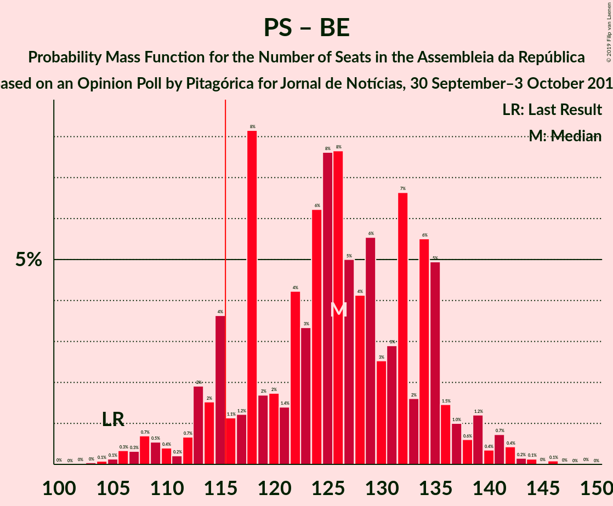
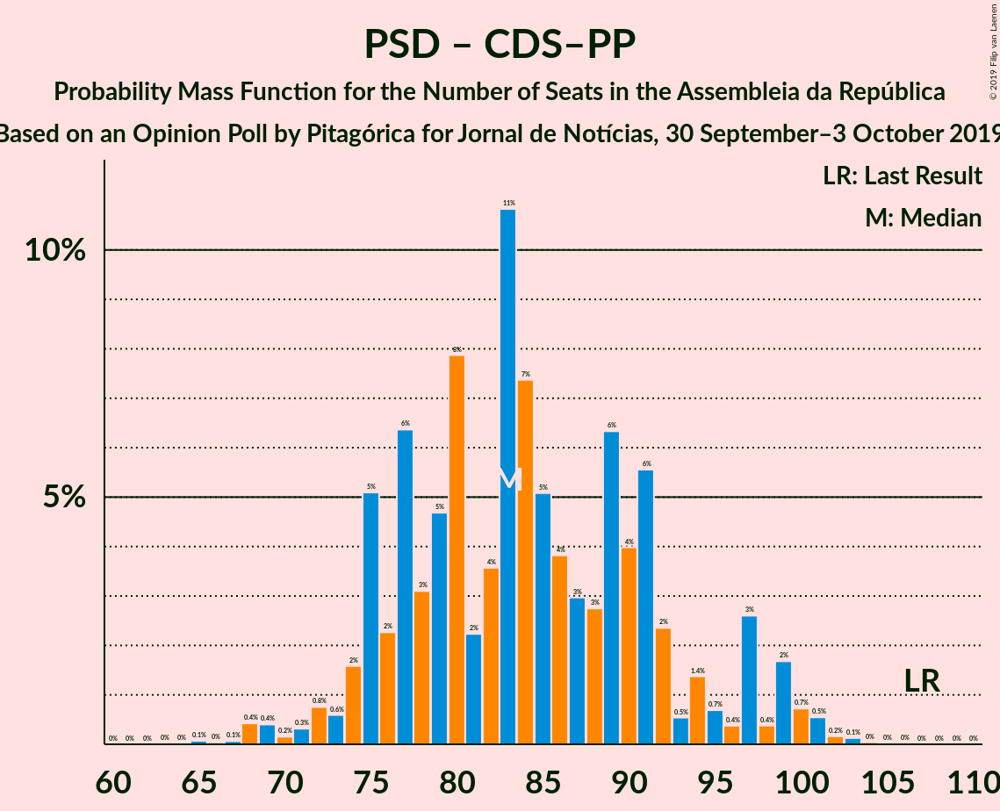

# Opinion Poll by Pitagórica for Jornal de Notícias, 30 September–3 October 2019

<a href="#voting-intentions">Voting Intentions</a> | <a href="#seats">Seats</a> | <a href="#coalitions">Coalitions</a> | <a href="#technical-information">Technical Information</a>

## Voting Intentions

### Confidence Intervals

| Party | Last Result | Poll Result | 80% Confidence Interval | 90% Confidence Interval | 95% Confidence Interval | 99% Confidence Interval |
|:-----:|:-----------:|:-----------:|:-----------------------:|:-----------------------:|:-----------------------:|:-----------------------:|
| Partido Socialista | 32.3% | 37.2% | 34.7–39.8% |34.0–40.5% |33.4–41.1% |32.2–42.4% |
| Partido Social Democrata | 36.9% | 27.7% | 25.4–30.1% |24.8–30.8% |24.2–31.4% |23.2–32.6% |
| Bloco de Esquerda | 10.2% | 9.2% | 7.8–10.9% |7.4–11.3% |7.1–11.8% |6.5–12.6% |
| Coligação Democrática Unitária | 8.2% | 6.7% | 5.5–8.2% |5.2–8.6% |4.9–9.0% |4.4–9.7% |
| Pessoas–Animais–Natureza | 1.4% | 4.8% | 3.9–6.2% |3.6–6.5% |3.4–6.9% |3.0–7.5% |
| CDS–Partido Popular | 36.9% | 4.7% | 3.7–6.0% |3.5–6.3% |3.2–6.7% |2.9–7.3% |
| Chega | 0.0% | 1.8% | 1.3–2.8% |1.1–3.0% |1.0–3.3% |0.8–3.8% |
| Aliança | 0.0% | 1.2% | 0.8–2.0% |0.7–2.2% |0.6–2.4% |0.4–2.8% |
| LIVRE | 0.7% | 0.8% | 0.5–1.5% |0.4–1.8% |0.4–1.9% |0.2–2.3% |
| Iniciativa Liberal | 0.0% | 0.8% | 0.5–1.5% |0.4–1.8% |0.4–1.9% |0.2–2.3% |

*Note:* The poll result column reflects the actual value used in the calculations. Published results may vary slightly, and in addition be rounded to fewer digits.

## Seats

### Confidence Intervals

| Party | Last Result | Median | 80% Confidence Interval | 90% Confidence Interval | 95% Confidence Interval | 99% Confidence Interval |
|:-----:|:-----------:|:------:|:-----------------------:|:-----------------------:|:-----------------------:|:-----------------------:|
| <a href="#partido-socialista">Partido Socialista</a> | 86 | 103 | 103 |103 |103 |103–128 |
| <a href="#partido-social-democrata">Partido Social Democrata</a> | 89 | 74 | 73–74 |73–74 |73–74 |56–74 |
| <a href="#bloco-de-esquerda">Bloco de Esquerda</a> | 19 | 20 | 20–21 |20–21 |20–21 |20–23 |
| <a href="#coligação-democrática-unitária">Coligação Democrática Unitária</a> | 17 | N/A | 15 |15 |15 |6–15 |
| <a href="#pessoas–animais–natureza">Pessoas–Animais–Natureza</a> | 1 | N/A | 8 |8 |8 |8–9 |
| <a href="#cds–partido-popular">CDS–Partido Popular</a> | 18 | 6 | 6 |6 |6 |4–6 |
| <a href="#chega">Chega</a> | 0 | N/A | 2 |2 |2 |2 |
| <a href="#aliança">Aliança</a> | 0 | N/A | 2 |2 |2 |2 |
| <a href="#livre">LIVRE</a> | 0 | N/A | 0 |0 |0 |0 |
| <a href="#iniciativa-liberal">Iniciativa Liberal</a> | 0 | N/A | 0 |0 |0 |0 |

### Partido Socialista

*For a full overview of the results for this party, see the [Partido Socialista](party-partidosocialista.html) page.*

| Number of Seats | Probability | Accumulated | Special Marks |
|:---------------:|:-----------:|:-----------:|:-------------:|
| 86 | 0% | 100% | Last Result |
| 87 | 0% | 100% |  |
| 88 | 0% | 100% |  |
| 89 | 0% | 100% |  |
| 90 | 0% | 100% |  |
| 91 | 0% | 100% |  |
| 92 | 0% | 100% |  |
| 93 | 0% | 100% |  |
| 94 | 0% | 100% |  |
| 95 | 0% | 100% |  |
| 96 | 0% | 100% |  |
| 97 | 0% | 100% |  |
| 98 | 0% | 100% |  |
| 99 | 0% | 100% |  |
| 100 | 0% | 100% |  |
| 101 | 0% | 100% |  |
| 102 | 0% | 100% |  |
| 103 | 99.0% | 100% | Median |
| 104 | 0% | 1.0% |  |
| 105 | 0% | 1.0% |  |
| 106 | 0% | 1.0% |  |
| 107 | 0% | 1.0% |  |
| 108 | 0% | 1.0% |  |
| 109 | 0% | 1.0% |  |
| 110 | 0% | 1.0% |  |
| 111 | 0% | 1.0% |  |
| 112 | 0% | 1.0% |  |
| 113 | 0% | 1.0% |  |
| 114 | 0% | 1.0% |  |
| 115 | 0% | 1.0% |  |
| 116 | 0% | 1.0% | Majority |
| 117 | 0% | 0.9% |  |
| 118 | 0% | 0.9% |  |
| 119 | 0% | 0.9% |  |
| 120 | 0% | 0.9% |  |
| 121 | 0% | 0.9% |  |
| 122 | 0% | 0.9% |  |
| 123 | 0% | 0.9% |  |
| 124 | 0% | 0.9% |  |
| 125 | 0% | 0.9% |  |
| 126 | 0% | 0.9% |  |
| 127 | 0% | 0.9% |  |
| 128 | 0.7% | 0.9% |  |
| 129 | 0% | 0.3% |  |
| 130 | 0% | 0.3% |  |
| 131 | 0.3% | 0.3% |  |
| 132 | 0% | 0% |  |

### Partido Social Democrata

*For a full overview of the results for this party, see the [Partido Social Democrata](party-partidosocialdemocrata.html) page.*

| Number of Seats | Probability | Accumulated | Special Marks |
|:---------------:|:-----------:|:-----------:|:-------------:|
| 56 | 0.7% | 100% |  |
| 57 | 0% | 99.3% |  |
| 58 | 0% | 99.3% |  |
| 59 | 0% | 99.3% |  |
| 60 | 0% | 99.3% |  |
| 61 | 0% | 99.3% |  |
| 62 | 0% | 99.3% |  |
| 63 | 0.3% | 99.3% |  |
| 64 | 0% | 99.0% |  |
| 65 | 0% | 99.0% |  |
| 66 | 0% | 99.0% |  |
| 67 | 0% | 99.0% |  |
| 68 | 0% | 99.0% |  |
| 69 | 0% | 99.0% |  |
| 70 | 0% | 99.0% |  |
| 71 | 0% | 99.0% |  |
| 72 | 0% | 99.0% |  |
| 73 | 13% | 99.0% |  |
| 74 | 86% | 86% | Median |
| 75 | 0% | 0% |  |
| 76 | 0% | 0% |  |
| 77 | 0% | 0% |  |
| 78 | 0% | 0% |  |
| 79 | 0% | 0% |  |
| 80 | 0% | 0% |  |
| 81 | 0% | 0% |  |
| 82 | 0% | 0% |  |
| 83 | 0% | 0% |  |
| 84 | 0% | 0% |  |
| 85 | 0% | 0% |  |
| 86 | 0% | 0% |  |
| 87 | 0% | 0% |  |
| 88 | 0% | 0% |  |
| 89 | 0% | 0% | Last Result |

### Bloco de Esquerda

*For a full overview of the results for this party, see the [Bloco de Esquerda](party-blocodeesquerda.html) page.*

| Number of Seats | Probability | Accumulated | Special Marks |
|:---------------:|:-----------:|:-----------:|:-------------:|
| 18 | 0% | 100% |  |
| 19 | 0.3% | 99.9% | Last Result |
| 20 | 86% | 99.7% | Median |
| 21 | 13% | 14% |  |
| 22 | 0% | 0.7% |  |
| 23 | 0.7% | 0.7% |  |
| 24 | 0% | 0% |  |

### CDS–Partido Popular

*For a full overview of the results for this party, see the [CDS–Partido Popular](party-cds–partidopopular.html) page.*

| Number of Seats | Probability | Accumulated | Special Marks |
|:---------------:|:-----------:|:-----------:|:-------------:|
| 3 | 0% | 100% |  |
| 4 | 0.7% | 99.9% |  |
| 5 | 0% | 99.3% |  |
| 6 | 99.2% | 99.3% | Median |
| 7 | 0% | 0% |  |
| 8 | 0% | 0% |  |
| 9 | 0% | 0% |  |
| 10 | 0% | 0% |  |
| 11 | 0% | 0% |  |
| 12 | 0% | 0% |  |
| 13 | 0% | 0% |  |
| 14 | 0% | 0% |  |
| 15 | 0% | 0% |  |
| 16 | 0% | 0% |  |
| 17 | 0% | 0% |  |
| 18 | 0% | 0% | Last Result |

## Coalitions

### Confidence Intervals

| Coalition | Last Result | Median | Majority? | 80% Confidence Interval | 90% Confidence Interval | 95% Confidence Interval | 99% Confidence Interval |
|:---------:|:-----------:|:------:|:---------:|:-----------------------:|:-----------------------:|:-----------------------:|:-----------------------:|
| Partido Socialista – Bloco de Esquerda – Coligação Democrática Unitária | 122 | 138 | 100% | 138–139 | 138–139 | 138–139 | 138–139 |
| Partido Socialista – Bloco de Esquerda | 105 | 123 | 100% | 123–124 | 123–124 | 123–124 | 123–124 |
| Partido Socialista – Coligação Democrática Unitária | 103 | 118 | 100% | 118 | 118 | 118 | 118 |
| Partido Socialista | 86 | 103 | 0% | 103 | 103 | 103 | 103 |
| Partido Social Democrata – CDS–Partido Popular | 107 | 80 | 0% | 79–80 | 79–80 | 79–80 | 79–80 |

### Partido Socialista – Bloco de Esquerda – Coligação Democrática Unitária

| Number of Seats | Probability | Accumulated | Special Marks |
|:---------------:|:-----------:|:-----------:|:-------------:|
| 122 | 0% | 100% | Last Result |
| 123 | 0% | 100% | Median |
| 124 | 0% | 100% |  |
| 125 | 0% | 100% |  |
| 126 | 0% | 100% |  |
| 127 | 0% | 100% |  |
| 128 | 0% | 100% |  |
| 129 | 0% | 100% |  |
| 130 | 0% | 100% |  |
| 131 | 0% | 100% |  |
| 132 | 0% | 100% |  |
| 133 | 0% | 100% |  |
| 134 | 0% | 100% |  |
| 135 | 0% | 100% |  |
| 136 | 0% | 100% |  |
| 137 | 0% | 100% |  |
| 138 | 87% | 100% |  |
| 139 | 13% | 13% |  |
| 140 | 0% | 0% |  |

### Partido Socialista – Bloco de Esquerda

| Number of Seats | Probability | Accumulated | Special Marks |
|:---------------:|:-----------:|:-----------:|:-------------:|
| 105 | 0% | 100% | Last Result |
| 106 | 0% | 100% |  |
| 107 | 0% | 100% |  |
| 108 | 0% | 100% |  |
| 109 | 0% | 100% |  |
| 110 | 0% | 100% |  |
| 111 | 0% | 100% |  |
| 112 | 0% | 100% |  |
| 113 | 0% | 100% |  |
| 114 | 0% | 100% |  |
| 115 | 0% | 100% |  |
| 116 | 0% | 100% | Majority |
| 117 | 0% | 100% |  |
| 118 | 0% | 100% |  |
| 119 | 0% | 100% |  |
| 120 | 0% | 100% |  |
| 121 | 0% | 100% |  |
| 122 | 0% | 100% |  |
| 123 | 87% | 100% | Median |
| 124 | 13% | 13% |  |
| 125 | 0% | 0% |  |

### Partido Socialista – Coligação Democrática Unitária

| Number of Seats | Probability | Accumulated | Special Marks |
|:---------------:|:-----------:|:-----------:|:-------------:|
| 103 | 0% | 100% | Last Result, Median |
| 104 | 0% | 100% |  |
| 105 | 0% | 100% |  |
| 106 | 0% | 100% |  |
| 107 | 0% | 100% |  |
| 108 | 0% | 100% |  |
| 109 | 0% | 100% |  |
| 110 | 0% | 100% |  |
| 111 | 0% | 100% |  |
| 112 | 0% | 100% |  |
| 113 | 0% | 100% |  |
| 114 | 0% | 100% |  |
| 115 | 0% | 100% |  |
| 116 | 0% | 100% | Majority |
| 117 | 0% | 100% |  |
| 118 | 100% | 100% |  |

### Partido Socialista

| Number of Seats | Probability | Accumulated | Special Marks |
|:---------------:|:-----------:|:-----------:|:-------------:|
| 86 | 0% | 100% | Last Result |
| 87 | 0% | 100% |  |
| 88 | 0% | 100% |  |
| 89 | 0% | 100% |  |
| 90 | 0% | 100% |  |
| 91 | 0% | 100% |  |
| 92 | 0% | 100% |  |
| 93 | 0% | 100% |  |
| 94 | 0% | 100% |  |
| 95 | 0% | 100% |  |
| 96 | 0% | 100% |  |
| 97 | 0% | 100% |  |
| 98 | 0% | 100% |  |
| 99 | 0% | 100% |  |
| 100 | 0% | 100% |  |
| 101 | 0% | 100% |  |
| 102 | 0% | 100% |  |
| 103 | 100% | 100% | Median |

### Partido Social Democrata – CDS–Partido Popular

| Number of Seats | Probability | Accumulated | Special Marks |
|:---------------:|:-----------:|:-----------:|:-------------:|
| 79 | 13% | 100% |  |
| 80 | 87% | 87% | Median |
| 81 | 0% | 0% |  |
| 82 | 0% | 0% |  |
| 83 | 0% | 0% |  |
| 84 | 0% | 0% |  |
| 85 | 0% | 0% |  |
| 86 | 0% | 0% |  |
| 87 | 0% | 0% |  |
| 88 | 0% | 0% |  |
| 89 | 0% | 0% |  |
| 90 | 0% | 0% |  |
| 91 | 0% | 0% |  |
| 92 | 0% | 0% |  |
| 93 | 0% | 0% |  |
| 94 | 0% | 0% |  |
| 95 | 0% | 0% |  |
| 96 | 0% | 0% |  |
| 97 | 0% | 0% |  |
| 98 | 0% | 0% |  |
| 99 | 0% | 0% |  |
| 100 | 0% | 0% |  |
| 101 | 0% | 0% |  |
| 102 | 0% | 0% |  |
| 103 | 0% | 0% |  |
| 104 | 0% | 0% |  |
| 105 | 0% | 0% |  |
| 106 | 0% | 0% |  |
| 107 | 0% | 0% | Last Result |

## Technical Information

### Opinion Poll

+ **Polling firm:** Pitagórica
+ **Commissioner(s):** Jornal de Notícias
+ **Fieldwork period:** 30 September–3 October 2019

### Calculations

+ **Sample size:** 600
+ **Simulations done:** 64
+ **Error estimate:** 5.17%

