# Opinion Poll by Aximage for Correio da Manhã, 6–9 January 2018

<a href="#voting-intentions">Voting Intentions</a> | <a href="#seats">Seats</a> | <a href="#coalitions">Coalitions</a> | <a href="#technical-information">Technical Information</a>

## Voting Intentions

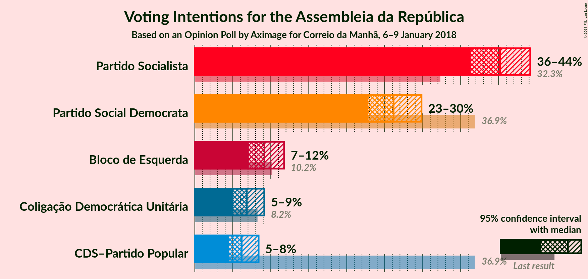

### Confidence Intervals

| Party | Last Result | Poll Result | 80% Confidence Interval | 90% Confidence Interval | 95% Confidence Interval | 99% Confidence Interval |
|:-----:|:-----------:|:-----------:|:-----------------------:|:-----------------------:|:-----------------------:|:-----------------------:|
| Partido Socialista | 32.3% | 40.2% | 37.6–42.8% |36.9–43.5% |36.3–44.2% |35.1–45.4% |
| Partido Social Democrata | 36.9% | 26.2% | 24.0–28.6% |23.3–29.2% |22.8–29.8% |21.8–31.0% |
| Bloco de Esquerda | 10.2% | 9.2% | 7.8–10.9% |7.4–11.3% |7.1–11.8% |6.5–12.6% |
| Coligação Democrática Unitária | 8.2% | 6.8% | 5.7–8.3% |5.3–8.8% |5.1–9.1% |4.6–9.9% |
| CDS–Partido Popular | 36.9% | 6.2% | 5.1–7.6% |4.8–8.0% |4.5–8.4% |4.0–9.1% |

*Note:* The poll result column reflects the actual value used in the calculations. Published results may vary slightly, and in addition be rounded to fewer digits.

## Seats

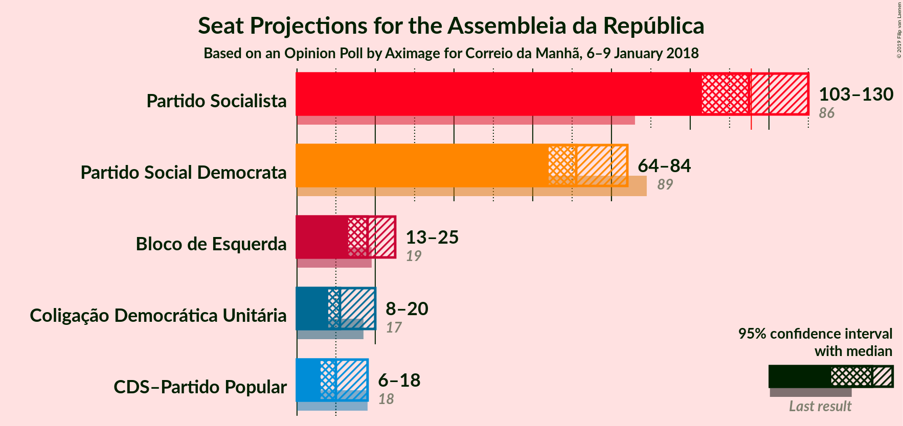

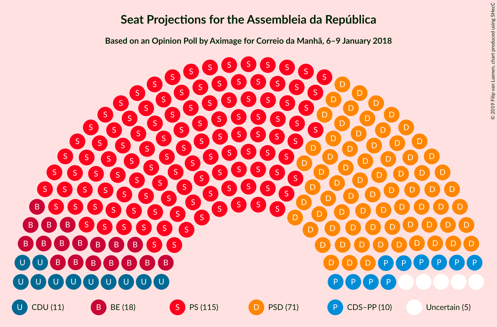

### Confidence Intervals

| Party | Last Result | Median | 80% Confidence Interval | 90% Confidence Interval | 95% Confidence Interval | 99% Confidence Interval |
|:-----:|:-----------:|:------:|:-----------------------:|:-----------------------:|:-----------------------:|:-----------------------:|
| <a href="#partido-socialista">Partido Socialista</a> | 86 | 115 | 108–123 |106–128 |103–130 |101–130 |
| <a href="#partido-social-democrata">Partido Social Democrata</a> | 89 | 71 | 66–82 |65–83 |64–84 |59–86 |
| <a href="#bloco-de-esquerda">Bloco de Esquerda</a> | 19 | 18 | 15–24 |14–24 |13–25 |10–27 |
| <a href="#coligação-democrática-unitária">Coligação Democrática Unitária</a> | 17 | 11 | 9–17 |9–17 |8–20 |6–20 |
| <a href="#cds–partido-popular">CDS–Partido Popular</a> | 18 | 10 | 6–13 |6–16 |6–18 |6–19 |

### Partido Socialista

*For a full overview of the results for this party, see the [Partido Socialista](party-partidosocialista.html) page.*

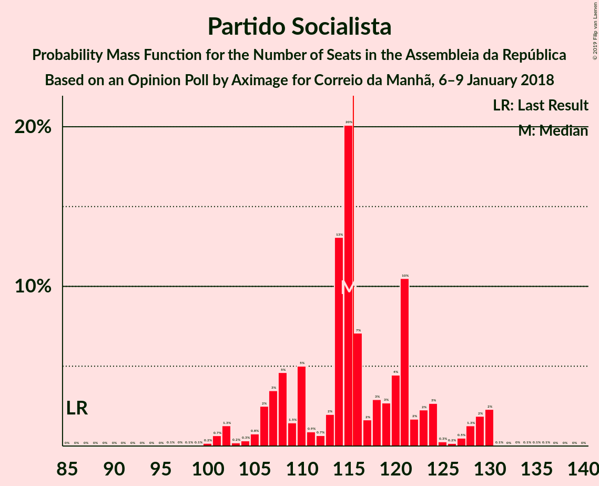

| Number of Seats | Probability | Accumulated | Special Marks |
|:---------------:|:-----------:|:-----------:|:-------------:|
| 86 | 0% | 100% | Last Result |
| 87 | 0% | 100% |  |
| 88 | 0% | 100% |  |
| 89 | 0% | 100% |  |
| 90 | 0% | 100% |  |
| 91 | 0% | 100% |  |
| 92 | 0% | 100% |  |
| 93 | 0% | 100% |  |
| 94 | 0% | 100% |  |
| 95 | 0% | 100% |  |
| 96 | 0.1% | 100% |  |
| 97 | 0% | 99.9% |  |
| 98 | 0.1% | 99.9% |  |
| 99 | 0.1% | 99.8% |  |
| 100 | 0.2% | 99.7% |  |
| 101 | 0.7% | 99.6% |  |
| 102 | 1.3% | 98.9% |  |
| 103 | 0.2% | 98% |  |
| 104 | 0.3% | 97% |  |
| 105 | 0.8% | 97% |  |
| 106 | 2% | 96% |  |
| 107 | 3% | 94% |  |
| 108 | 5% | 90% |  |
| 109 | 1.5% | 86% |  |
| 110 | 5% | 84% |  |
| 111 | 0.9% | 79% |  |
| 112 | 0.7% | 78% |  |
| 113 | 2% | 78% |  |
| 114 | 13% | 76% |  |
| 115 | 20% | 63% | Median |
| 116 | 7% | 43% | Majority |
| 117 | 2% | 36% |  |
| 118 | 3% | 34% |  |
| 119 | 3% | 31% |  |
| 120 | 4% | 28% |  |
| 121 | 10% | 24% |  |
| 122 | 2% | 13% |  |
| 123 | 2% | 12% |  |
| 124 | 3% | 9% |  |
| 125 | 0.3% | 7% |  |
| 126 | 0.2% | 6% |  |
| 127 | 0.5% | 6% |  |
| 128 | 1.3% | 6% |  |
| 129 | 2% | 4% |  |
| 130 | 2% | 3% |  |
| 131 | 0.1% | 0.3% |  |
| 132 | 0% | 0.2% |  |
| 133 | 0% | 0.2% |  |
| 134 | 0.1% | 0.2% |  |
| 135 | 0.1% | 0.1% |  |
| 136 | 0.1% | 0.1% |  |
| 137 | 0% | 0% |  |

### Partido Social Democrata

*For a full overview of the results for this party, see the [Partido Social Democrata](party-partidosocialdemocrata.html) page.*

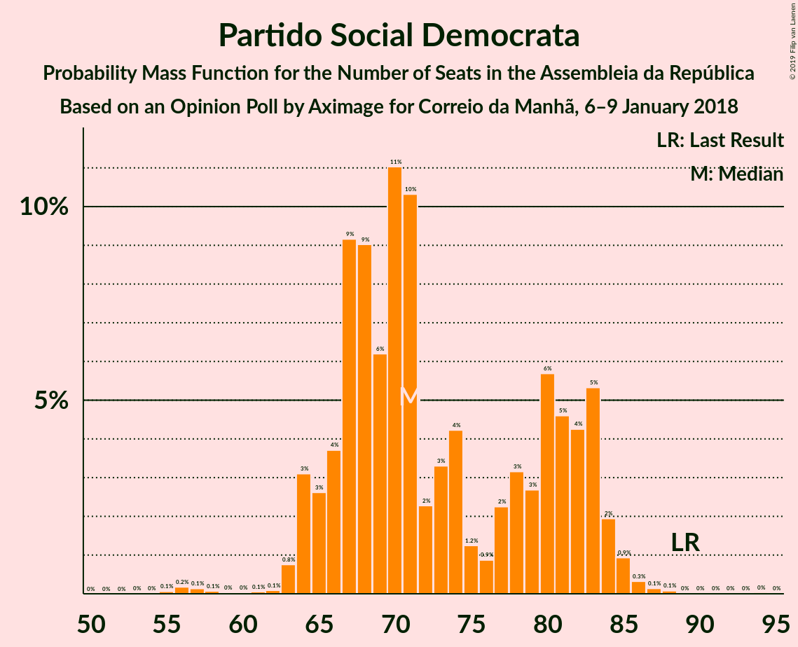

| Number of Seats | Probability | Accumulated | Special Marks |
|:---------------:|:-----------:|:-----------:|:-------------:|
| 55 | 0.1% | 100% |  |
| 56 | 0.2% | 99.9% |  |
| 57 | 0.1% | 99.7% |  |
| 58 | 0.1% | 99.6% |  |
| 59 | 0% | 99.5% |  |
| 60 | 0% | 99.5% |  |
| 61 | 0.1% | 99.5% |  |
| 62 | 0.1% | 99.4% |  |
| 63 | 0.8% | 99.3% |  |
| 64 | 3% | 98.6% |  |
| 65 | 3% | 95% |  |
| 66 | 4% | 93% |  |
| 67 | 9% | 89% |  |
| 68 | 9% | 80% |  |
| 69 | 6% | 71% |  |
| 70 | 11% | 65% |  |
| 71 | 10% | 54% | Median |
| 72 | 2% | 43% |  |
| 73 | 3% | 41% |  |
| 74 | 4% | 38% |  |
| 75 | 1.2% | 34% |  |
| 76 | 0.9% | 32% |  |
| 77 | 2% | 31% |  |
| 78 | 3% | 29% |  |
| 79 | 3% | 26% |  |
| 80 | 6% | 23% |  |
| 81 | 5% | 18% |  |
| 82 | 4% | 13% |  |
| 83 | 5% | 9% |  |
| 84 | 2% | 4% |  |
| 85 | 0.9% | 2% |  |
| 86 | 0.3% | 0.6% |  |
| 87 | 0.1% | 0.3% |  |
| 88 | 0.1% | 0.2% |  |
| 89 | 0% | 0.1% | Last Result |
| 90 | 0% | 0.1% |  |
| 91 | 0% | 0.1% |  |
| 92 | 0% | 0.1% |  |
| 93 | 0% | 0.1% |  |
| 94 | 0% | 0.1% |  |
| 95 | 0% | 0% |  |

### Bloco de Esquerda

*For a full overview of the results for this party, see the [Bloco de Esquerda](party-blocodeesquerda.html) page.*

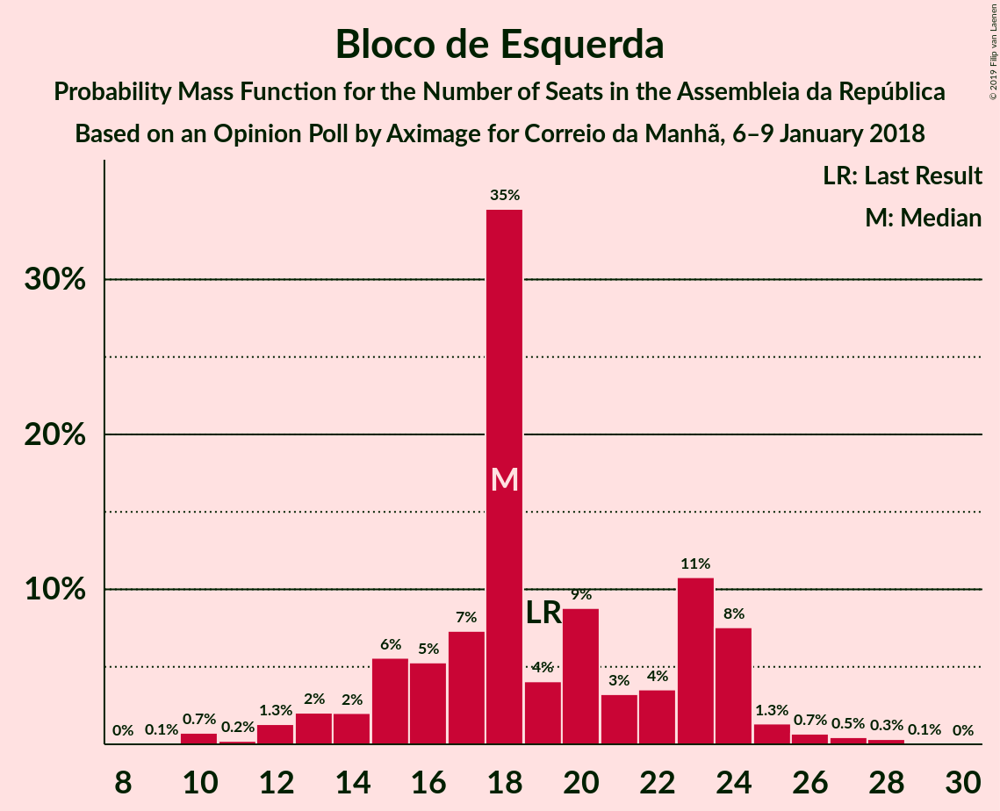

| Number of Seats | Probability | Accumulated | Special Marks |
|:---------------:|:-----------:|:-----------:|:-------------:|
| 9 | 0.1% | 100% |  |
| 10 | 0.7% | 99.9% |  |
| 11 | 0.2% | 99.2% |  |
| 12 | 1.3% | 99.0% |  |
| 13 | 2% | 98% |  |
| 14 | 2% | 96% |  |
| 15 | 6% | 94% |  |
| 16 | 5% | 88% |  |
| 17 | 7% | 83% |  |
| 18 | 35% | 75% | Median |
| 19 | 4% | 41% | Last Result |
| 20 | 9% | 37% |  |
| 21 | 3% | 28% |  |
| 22 | 4% | 25% |  |
| 23 | 11% | 21% |  |
| 24 | 8% | 10% |  |
| 25 | 1.3% | 3% |  |
| 26 | 0.7% | 2% |  |
| 27 | 0.5% | 0.9% |  |
| 28 | 0.3% | 0.4% |  |
| 29 | 0.1% | 0.1% |  |
| 30 | 0% | 0% |  |

### Coligação Democrática Unitária

*For a full overview of the results for this party, see the [Coligação Democrática Unitária](party-coligaçãodemocráticaunitária.html) page.*

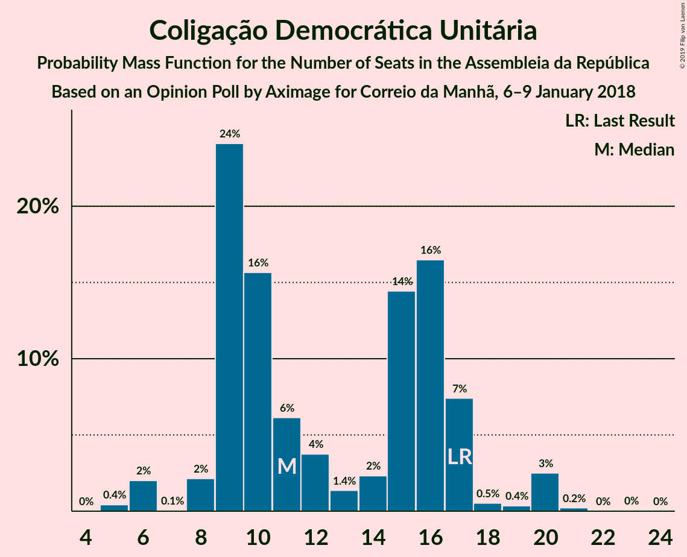

| Number of Seats | Probability | Accumulated | Special Marks |
|:---------------:|:-----------:|:-----------:|:-------------:|
| 5 | 0.4% | 100% |  |
| 6 | 2% | 99.6% |  |
| 7 | 0.1% | 98% |  |
| 8 | 2% | 98% |  |
| 9 | 24% | 95% |  |
| 10 | 16% | 71% |  |
| 11 | 6% | 56% | Median |
| 12 | 4% | 49% |  |
| 13 | 1.4% | 46% |  |
| 14 | 2% | 44% |  |
| 15 | 14% | 42% |  |
| 16 | 16% | 28% |  |
| 17 | 7% | 11% | Last Result |
| 18 | 0.5% | 4% |  |
| 19 | 0.4% | 3% |  |
| 20 | 3% | 3% |  |
| 21 | 0.2% | 0.3% |  |
| 22 | 0% | 0.1% |  |
| 23 | 0% | 0% |  |

### CDS–Partido Popular

*For a full overview of the results for this party, see the [CDS–Partido Popular](party-cds–partidopopular.html) page.*

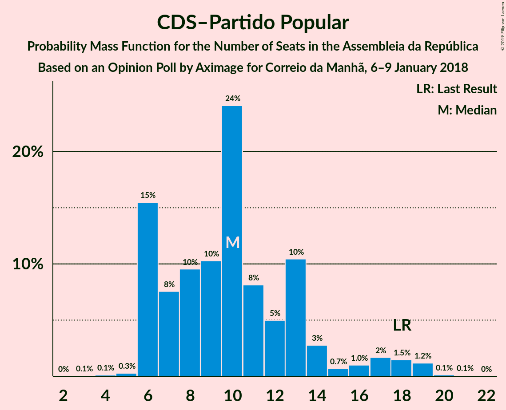

| Number of Seats | Probability | Accumulated | Special Marks |
|:---------------:|:-----------:|:-----------:|:-------------:|
| 3 | 0.1% | 100% |  |
| 4 | 0.1% | 99.9% |  |
| 5 | 0.3% | 99.8% |  |
| 6 | 15% | 99.5% |  |
| 7 | 8% | 84% |  |
| 8 | 10% | 76% |  |
| 9 | 10% | 67% |  |
| 10 | 24% | 57% | Median |
| 11 | 8% | 33% |  |
| 12 | 5% | 24% |  |
| 13 | 10% | 19% |  |
| 14 | 3% | 9% |  |
| 15 | 0.7% | 6% |  |
| 16 | 1.0% | 6% |  |
| 17 | 2% | 5% |  |
| 18 | 1.5% | 3% | Last Result |
| 19 | 1.2% | 1.4% |  |
| 20 | 0.1% | 0.2% |  |
| 21 | 0.1% | 0.1% |  |
| 22 | 0% | 0% |  |

## Coalitions

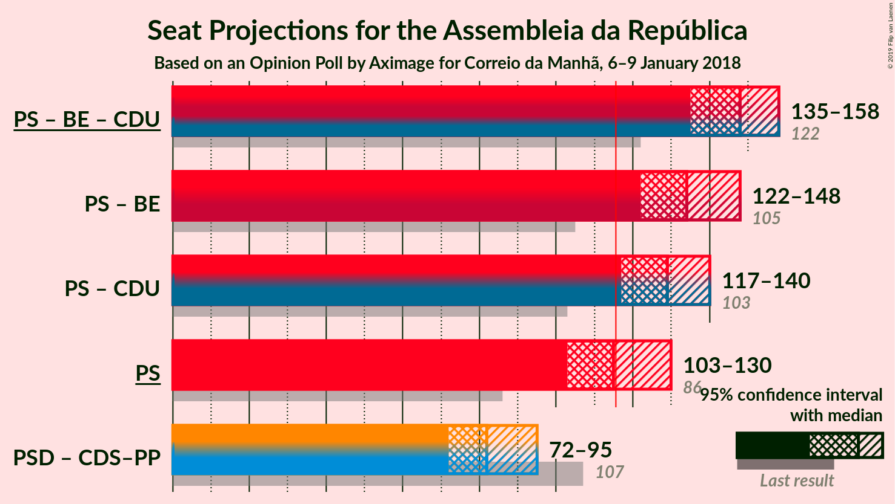

### Confidence Intervals

| Coalition | Last Result | Median | Majority? | 80% Confidence Interval | 90% Confidence Interval | 95% Confidence Interval | 99% Confidence Interval |
|:---------:|:-----------:|:------:|:---------:|:-----------------------:|:-----------------------:|:-----------------------:|:-----------------------:|
| Partido Socialista – Bloco de Esquerda – Coligação Democrática Unitária | 122 | 148 | 100% | 139–155 | 137–157 | 135–158 | 132–160 |
| Partido Socialista – Bloco de Esquerda | 105 | 134 | 99.9% | 127–142 | 125–145 | 122–148 | 119–148 |
| Partido Socialista – Coligação Democrática Unitária | 103 | 129 | 98.9% | 118–138 | 117–139 | 117–140 | 114–142 |
| Partido Socialista | 86 | 115 | 43% | 108–123 | 106–128 | 103–130 | 101–130 |
| Partido Social Democrata – CDS–Partido Popular | 107 | 82 | 0% | 75–91 | 73–93 | 72–95 | 70–98 |

### Partido Socialista – Bloco de Esquerda – Coligação Democrática Unitária

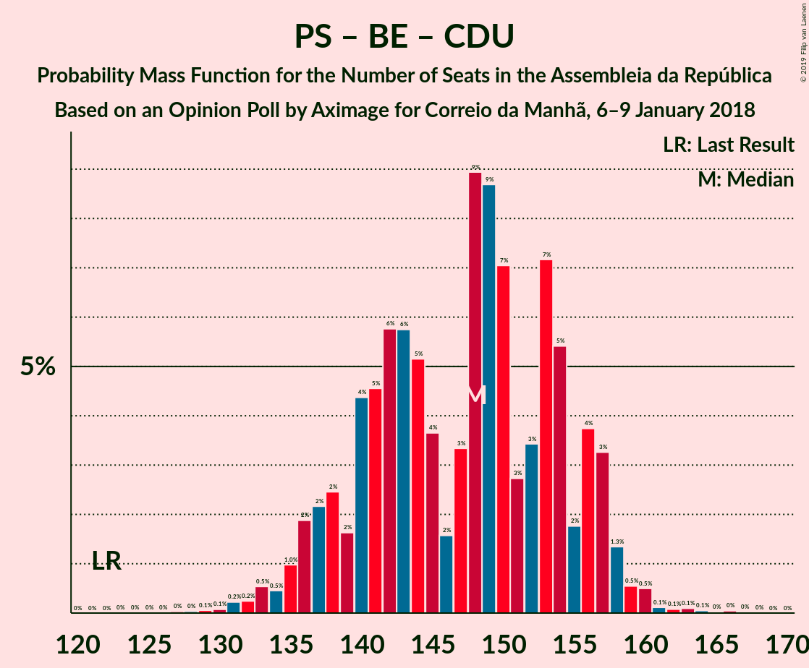

| Number of Seats | Probability | Accumulated | Special Marks |
|:---------------:|:-----------:|:-----------:|:-------------:|
| 122 | 0% | 100% | Last Result |
| 123 | 0% | 100% |  |
| 124 | 0% | 100% |  |
| 125 | 0% | 100% |  |
| 126 | 0% | 100% |  |
| 127 | 0% | 100% |  |
| 128 | 0% | 99.9% |  |
| 129 | 0.1% | 99.9% |  |
| 130 | 0.1% | 99.8% |  |
| 131 | 0.2% | 99.8% |  |
| 132 | 0.2% | 99.5% |  |
| 133 | 0.5% | 99.3% |  |
| 134 | 0.5% | 98.8% |  |
| 135 | 1.0% | 98% |  |
| 136 | 2% | 97% |  |
| 137 | 2% | 95% |  |
| 138 | 2% | 93% |  |
| 139 | 2% | 91% |  |
| 140 | 4% | 89% |  |
| 141 | 5% | 85% |  |
| 142 | 6% | 80% |  |
| 143 | 6% | 74% |  |
| 144 | 5% | 69% | Median |
| 145 | 4% | 64% |  |
| 146 | 2% | 60% |  |
| 147 | 3% | 58% |  |
| 148 | 9% | 55% |  |
| 149 | 9% | 46% |  |
| 150 | 7% | 37% |  |
| 151 | 3% | 30% |  |
| 152 | 3% | 28% |  |
| 153 | 7% | 24% |  |
| 154 | 5% | 17% |  |
| 155 | 2% | 12% |  |
| 156 | 4% | 10% |  |
| 157 | 3% | 6% |  |
| 158 | 1.3% | 3% |  |
| 159 | 0.5% | 1.5% |  |
| 160 | 0.5% | 0.9% |  |
| 161 | 0.1% | 0.4% |  |
| 162 | 0.1% | 0.3% |  |
| 163 | 0.1% | 0.2% |  |
| 164 | 0.1% | 0.1% |  |
| 165 | 0% | 0.1% |  |
| 166 | 0% | 0.1% |  |
| 167 | 0% | 0% |  |

### Partido Socialista – Bloco de Esquerda

| Number of Seats | Probability | Accumulated | Special Marks |
|:---------------:|:-----------:|:-----------:|:-------------:|
| 105 | 0% | 100% | Last Result |
| 106 | 0% | 100% |  |
| 107 | 0% | 100% |  |
| 108 | 0% | 100% |  |
| 109 | 0% | 100% |  |
| 110 | 0% | 100% |  |
| 111 | 0% | 100% |  |
| 112 | 0% | 100% |  |
| 113 | 0% | 100% |  |
| 114 | 0% | 100% |  |
| 115 | 0% | 99.9% |  |
| 116 | 0% | 99.9% | Majority |
| 117 | 0% | 99.9% |  |
| 118 | 0.1% | 99.8% |  |
| 119 | 0.6% | 99.7% |  |
| 120 | 0.5% | 99.1% |  |
| 121 | 0.4% | 98.6% |  |
| 122 | 0.9% | 98% |  |
| 123 | 0.8% | 97% |  |
| 124 | 0.9% | 97% |  |
| 125 | 2% | 96% |  |
| 126 | 3% | 94% |  |
| 127 | 5% | 92% |  |
| 128 | 3% | 87% |  |
| 129 | 2% | 84% |  |
| 130 | 6% | 82% |  |
| 131 | 3% | 76% |  |
| 132 | 11% | 73% |  |
| 133 | 12% | 62% | Median |
| 134 | 6% | 51% |  |
| 135 | 2% | 44% |  |
| 136 | 2% | 42% |  |
| 137 | 2% | 41% |  |
| 138 | 6% | 39% |  |
| 139 | 8% | 33% |  |
| 140 | 3% | 25% |  |
| 141 | 10% | 22% |  |
| 142 | 3% | 12% |  |
| 143 | 2% | 10% |  |
| 144 | 2% | 8% |  |
| 145 | 3% | 6% |  |
| 146 | 0.1% | 3% |  |
| 147 | 0.4% | 3% |  |
| 148 | 2% | 3% |  |
| 149 | 0.1% | 0.4% |  |
| 150 | 0% | 0.3% |  |
| 151 | 0% | 0.3% |  |
| 152 | 0.1% | 0.2% |  |
| 153 | 0.1% | 0.1% |  |
| 154 | 0% | 0.1% |  |
| 155 | 0% | 0.1% |  |
| 156 | 0% | 0% |  |

### Partido Socialista – Coligação Democrática Unitária

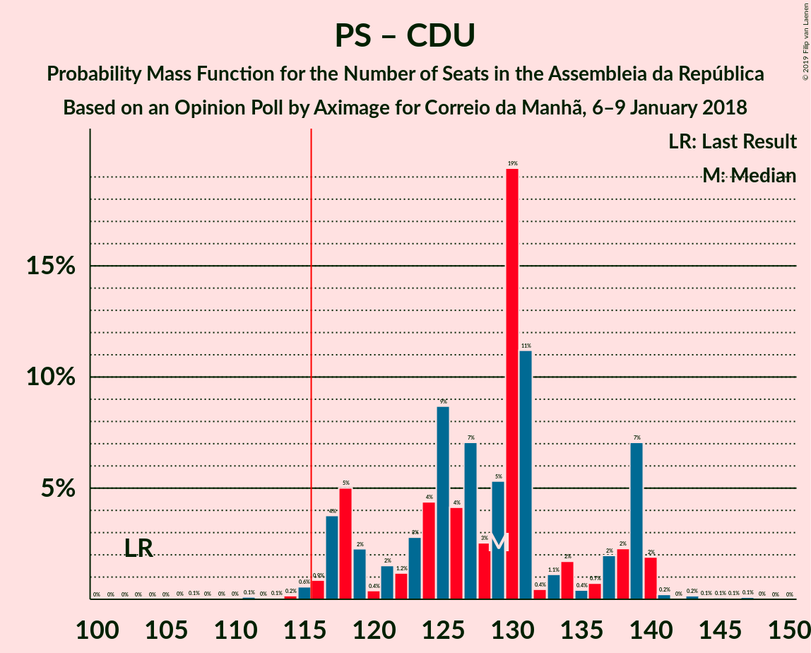

| Number of Seats | Probability | Accumulated | Special Marks |
|:---------------:|:-----------:|:-----------:|:-------------:|
| 103 | 0% | 100% | Last Result |
| 104 | 0% | 100% |  |
| 105 | 0% | 100% |  |
| 106 | 0% | 100% |  |
| 107 | 0.1% | 100% |  |
| 108 | 0% | 99.9% |  |
| 109 | 0% | 99.9% |  |
| 110 | 0% | 99.9% |  |
| 111 | 0.1% | 99.8% |  |
| 112 | 0% | 99.7% |  |
| 113 | 0.1% | 99.7% |  |
| 114 | 0.2% | 99.6% |  |
| 115 | 0.6% | 99.4% |  |
| 116 | 0.9% | 98.9% | Majority |
| 117 | 4% | 98% |  |
| 118 | 5% | 94% |  |
| 119 | 2% | 89% |  |
| 120 | 0.4% | 87% |  |
| 121 | 2% | 87% |  |
| 122 | 1.2% | 85% |  |
| 123 | 3% | 84% |  |
| 124 | 4% | 81% |  |
| 125 | 9% | 77% |  |
| 126 | 4% | 68% | Median |
| 127 | 7% | 64% |  |
| 128 | 3% | 57% |  |
| 129 | 5% | 54% |  |
| 130 | 19% | 49% |  |
| 131 | 11% | 30% |  |
| 132 | 0.4% | 18% |  |
| 133 | 1.1% | 18% |  |
| 134 | 2% | 17% |  |
| 135 | 0.4% | 15% |  |
| 136 | 0.7% | 15% |  |
| 137 | 2% | 14% |  |
| 138 | 2% | 12% |  |
| 139 | 7% | 10% |  |
| 140 | 2% | 3% |  |
| 141 | 0.2% | 0.7% |  |
| 142 | 0% | 0.5% |  |
| 143 | 0.2% | 0.5% |  |
| 144 | 0.1% | 0.3% |  |
| 145 | 0.1% | 0.3% |  |
| 146 | 0.1% | 0.2% |  |
| 147 | 0.1% | 0.1% |  |
| 148 | 0% | 0% |  |

### Partido Socialista

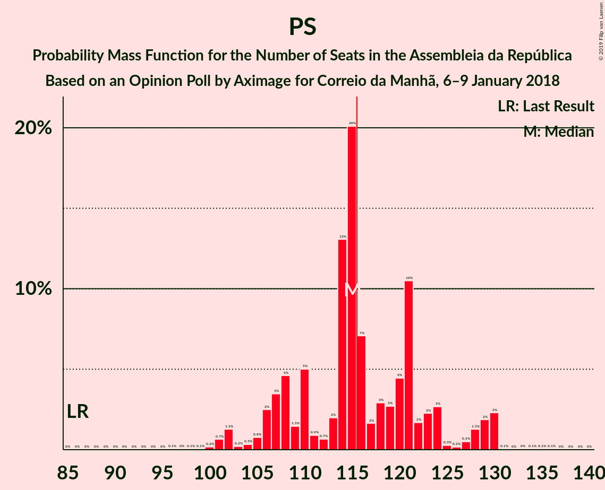

| Number of Seats | Probability | Accumulated | Special Marks |
|:---------------:|:-----------:|:-----------:|:-------------:|
| 86 | 0% | 100% | Last Result |
| 87 | 0% | 100% |  |
| 88 | 0% | 100% |  |
| 89 | 0% | 100% |  |
| 90 | 0% | 100% |  |
| 91 | 0% | 100% |  |
| 92 | 0% | 100% |  |
| 93 | 0% | 100% |  |
| 94 | 0% | 100% |  |
| 95 | 0% | 100% |  |
| 96 | 0.1% | 100% |  |
| 97 | 0% | 99.9% |  |
| 98 | 0.1% | 99.9% |  |
| 99 | 0.1% | 99.8% |  |
| 100 | 0.2% | 99.7% |  |
| 101 | 0.7% | 99.6% |  |
| 102 | 1.3% | 98.9% |  |
| 103 | 0.2% | 98% |  |
| 104 | 0.3% | 97% |  |
| 105 | 0.8% | 97% |  |
| 106 | 2% | 96% |  |
| 107 | 3% | 94% |  |
| 108 | 5% | 90% |  |
| 109 | 1.5% | 86% |  |
| 110 | 5% | 84% |  |
| 111 | 0.9% | 79% |  |
| 112 | 0.7% | 78% |  |
| 113 | 2% | 78% |  |
| 114 | 13% | 76% |  |
| 115 | 20% | 63% | Median |
| 116 | 7% | 43% | Majority |
| 117 | 2% | 36% |  |
| 118 | 3% | 34% |  |
| 119 | 3% | 31% |  |
| 120 | 4% | 28% |  |
| 121 | 10% | 24% |  |
| 122 | 2% | 13% |  |
| 123 | 2% | 12% |  |
| 124 | 3% | 9% |  |
| 125 | 0.3% | 7% |  |
| 126 | 0.2% | 6% |  |
| 127 | 0.5% | 6% |  |
| 128 | 1.3% | 6% |  |
| 129 | 2% | 4% |  |
| 130 | 2% | 3% |  |
| 131 | 0.1% | 0.3% |  |
| 132 | 0% | 0.2% |  |
| 133 | 0% | 0.2% |  |
| 134 | 0.1% | 0.2% |  |
| 135 | 0.1% | 0.1% |  |
| 136 | 0.1% | 0.1% |  |
| 137 | 0% | 0% |  |

### Partido Social Democrata – CDS–Partido Popular

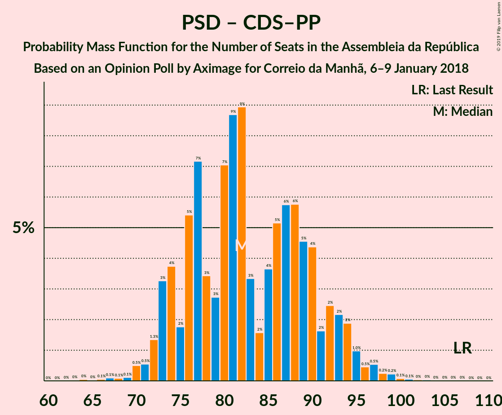

| Number of Seats | Probability | Accumulated | Special Marks |
|:---------------:|:-----------:|:-----------:|:-------------:|
| 64 | 0% | 100% |  |
| 65 | 0% | 99.9% |  |
| 66 | 0.1% | 99.9% |  |
| 67 | 0.1% | 99.9% |  |
| 68 | 0.1% | 99.8% |  |
| 69 | 0.1% | 99.7% |  |
| 70 | 0.5% | 99.6% |  |
| 71 | 0.5% | 99.1% |  |
| 72 | 1.3% | 98.5% |  |
| 73 | 3% | 97% |  |
| 74 | 4% | 94% |  |
| 75 | 2% | 90% |  |
| 76 | 5% | 88% |  |
| 77 | 7% | 83% |  |
| 78 | 3% | 76% |  |
| 79 | 3% | 72% |  |
| 80 | 7% | 70% |  |
| 81 | 9% | 63% | Median |
| 82 | 9% | 54% |  |
| 83 | 3% | 45% |  |
| 84 | 2% | 42% |  |
| 85 | 4% | 40% |  |
| 86 | 5% | 36% |  |
| 87 | 6% | 31% |  |
| 88 | 6% | 26% |  |
| 89 | 5% | 20% |  |
| 90 | 4% | 15% |  |
| 91 | 2% | 11% |  |
| 92 | 2% | 9% |  |
| 93 | 2% | 7% |  |
| 94 | 2% | 5% |  |
| 95 | 1.0% | 3% |  |
| 96 | 0.5% | 2% |  |
| 97 | 0.5% | 1.2% |  |
| 98 | 0.2% | 0.7% |  |
| 99 | 0.2% | 0.5% |  |
| 100 | 0.1% | 0.2% |  |
| 101 | 0.1% | 0.2% |  |
| 102 | 0% | 0.1% |  |
| 103 | 0% | 0.1% |  |
| 104 | 0% | 0% |  |
| 105 | 0% | 0% |  |
| 106 | 0% | 0% |  |
| 107 | 0% | 0% | Last Result |

## Technical Information

### Opinion Poll

+ **Polling firm:** Aximage
+ **Commissioner(s):** Correio da Manhã
+ **Fieldwork period:** 6–9 January 2018

### Calculations

+ **Sample size:** 600
+ **Simulations done:** 131,072
+ **Error estimate:** 1.22%

