# Opinion Poll by Eurosondagem for Expresso and SIC Notícias, 8–14 March 2018

<a href="#voting-intentions">Voting Intentions</a> | <a href="#seats">Seats</a> | <a href="#coalitions">Coalitions</a> | <a href="#technical-information">Technical Information</a>

## Voting Intentions

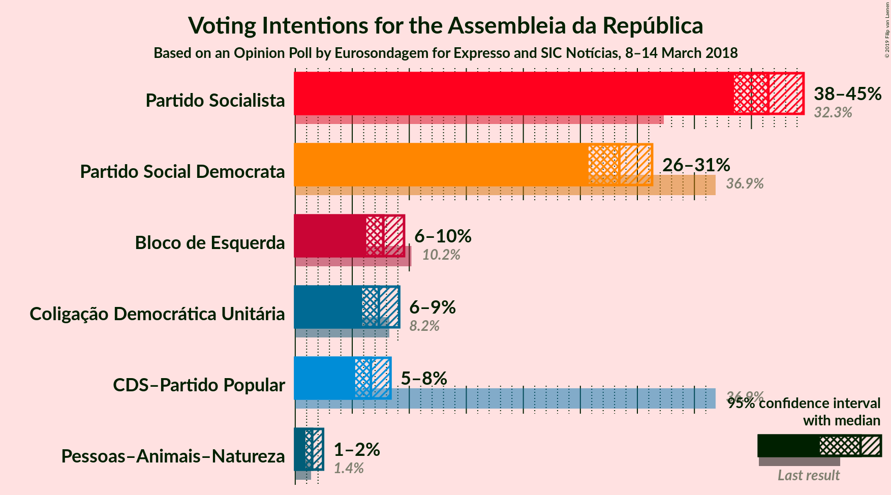

### Confidence Intervals

| Party | Last Result | Poll Result | 80% Confidence Interval | 90% Confidence Interval | 95% Confidence Interval | 99% Confidence Interval |
|:-----:|:-----------:|:-----------:|:-----------------------:|:-----------------------:|:-----------------------:|:-----------------------:|
| Partido Socialista | 32.3% | 41.5% | 39.5–43.5% |39.0–44.1% |38.5–44.6% |37.5–45.5% |
| Partido Social Democrata | 36.9% | 28.4% | 26.6–30.3% |26.1–30.8% |25.7–31.3% |24.9–32.2% |
| Bloco de Esquerda | 10.2% | 7.7% | 6.7–8.9% |6.5–9.3% |6.2–9.5% |5.8–10.1% |
| Coligação Democrática Unitária | 8.2% | 7.3% | 6.4–8.5% |6.1–8.8% |5.9–9.1% |5.4–9.7% |
| CDS–Partido Popular | 36.9% | 6.6% | 5.7–7.8% |5.5–8.1% |5.3–8.4% |4.8–8.9% |
| Pessoas–Animais–Natureza | 1.4% | 1.5% | 1.1–2.1% |1.0–2.3% |0.9–2.4% |0.7–2.8% |

*Note:* The poll result column reflects the actual value used in the calculations. Published results may vary slightly, and in addition be rounded to fewer digits.

## Seats

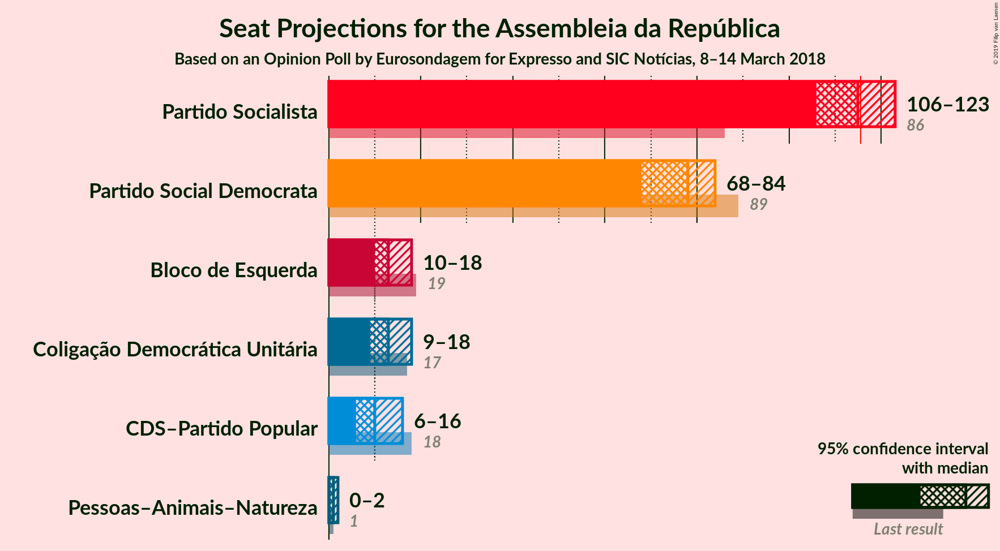

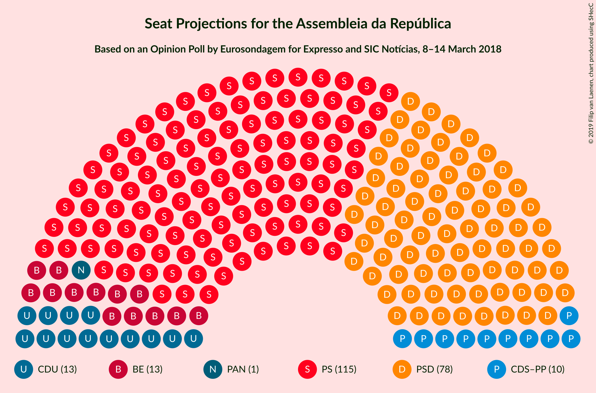

### Confidence Intervals

| Party | Last Result | Median | 80% Confidence Interval | 90% Confidence Interval | 95% Confidence Interval | 99% Confidence Interval |
|:-----:|:-----------:|:------:|:-----------------------:|:-----------------------:|:-----------------------:|:-----------------------:|
| <a href="#partido-socialista">Partido Socialista</a> | 86 | 115 | 109–119 |107–121 |106–123 |103–127 |
| <a href="#partido-social-democrata">Partido Social Democrata</a> | 89 | 78 | 71–81 |70–83 |68–84 |65–88 |
| <a href="#bloco-de-esquerda">Bloco de Esquerda</a> | 19 | 13 | 10–18 |10–18 |10–18 |9–20 |
| <a href="#coligação-democrática-unitária">Coligação Democrática Unitária</a> | 17 | 13 | 10–17 |9–17 |9–18 |7–20 |
| <a href="#cds–partido-popular">CDS–Partido Popular</a> | 18 | 10 | 7–13 |6–14 |6–16 |6–17 |
| <a href="#pessoas–animais–natureza">Pessoas–Animais–Natureza</a> | 1 | 1 | 0–2 |0–2 |0–2 |0–3 |

### Partido Socialista

*For a full overview of the results for this party, see the [Partido Socialista](party-partidosocialista.html) page.*

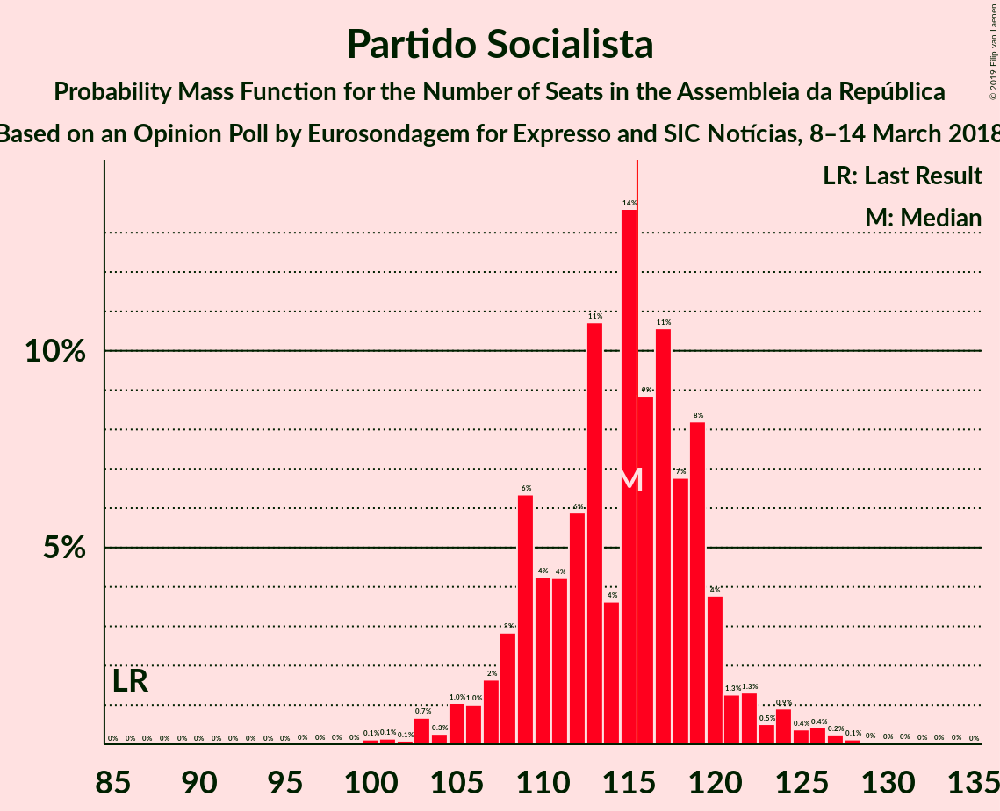

| Number of Seats | Probability | Accumulated | Special Marks |
|:---------------:|:-----------:|:-----------:|:-------------:|
| 86 | 0% | 100% | Last Result |
| 87 | 0% | 100% |  |
| 88 | 0% | 100% |  |
| 89 | 0% | 100% |  |
| 90 | 0% | 100% |  |
| 91 | 0% | 100% |  |
| 92 | 0% | 100% |  |
| 93 | 0% | 100% |  |
| 94 | 0% | 100% |  |
| 95 | 0% | 100% |  |
| 96 | 0% | 100% |  |
| 97 | 0% | 100% |  |
| 98 | 0% | 100% |  |
| 99 | 0% | 100% |  |
| 100 | 0.1% | 100% |  |
| 101 | 0.1% | 99.8% |  |
| 102 | 0.1% | 99.7% |  |
| 103 | 0.7% | 99.6% |  |
| 104 | 0.3% | 98.9% |  |
| 105 | 1.0% | 98.7% |  |
| 106 | 1.0% | 98% |  |
| 107 | 2% | 97% |  |
| 108 | 3% | 95% |  |
| 109 | 6% | 92% |  |
| 110 | 4% | 86% |  |
| 111 | 4% | 82% |  |
| 112 | 6% | 77% |  |
| 113 | 11% | 71% |  |
| 114 | 4% | 61% |  |
| 115 | 14% | 57% | Median |
| 116 | 9% | 43% | Majority |
| 117 | 11% | 35% |  |
| 118 | 7% | 24% |  |
| 119 | 8% | 17% |  |
| 120 | 4% | 9% |  |
| 121 | 1.3% | 5% |  |
| 122 | 1.3% | 4% |  |
| 123 | 0.5% | 3% |  |
| 124 | 0.9% | 2% |  |
| 125 | 0.4% | 1.3% |  |
| 126 | 0.4% | 0.9% |  |
| 127 | 0.2% | 0.5% |  |
| 128 | 0.1% | 0.3% |  |
| 129 | 0% | 0.1% |  |
| 130 | 0% | 0.1% |  |
| 131 | 0% | 0.1% |  |
| 132 | 0% | 0% |  |

### Partido Social Democrata

*For a full overview of the results for this party, see the [Partido Social Democrata](party-partidosocialdemocrata.html) page.*

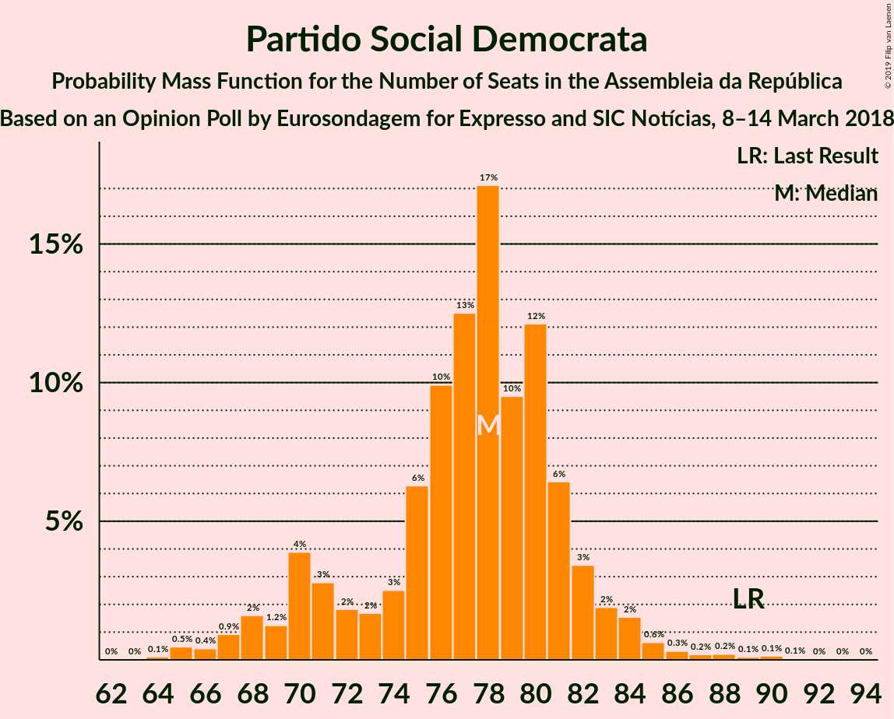

| Number of Seats | Probability | Accumulated | Special Marks |
|:---------------:|:-----------:|:-----------:|:-------------:|
| 64 | 0.1% | 100% |  |
| 65 | 0.5% | 99.8% |  |
| 66 | 0.4% | 99.4% |  |
| 67 | 0.9% | 99.0% |  |
| 68 | 2% | 98% |  |
| 69 | 1.2% | 96% |  |
| 70 | 4% | 95% |  |
| 71 | 3% | 91% |  |
| 72 | 2% | 89% |  |
| 73 | 2% | 87% |  |
| 74 | 3% | 85% |  |
| 75 | 6% | 82% |  |
| 76 | 10% | 76% |  |
| 77 | 13% | 66% |  |
| 78 | 17% | 54% | Median |
| 79 | 10% | 37% |  |
| 80 | 12% | 27% |  |
| 81 | 6% | 15% |  |
| 82 | 3% | 9% |  |
| 83 | 2% | 5% |  |
| 84 | 2% | 3% |  |
| 85 | 0.6% | 2% |  |
| 86 | 0.3% | 1.1% |  |
| 87 | 0.2% | 0.8% |  |
| 88 | 0.2% | 0.6% |  |
| 89 | 0.1% | 0.4% | Last Result |
| 90 | 0.1% | 0.3% |  |
| 91 | 0.1% | 0.1% |  |
| 92 | 0% | 0.1% |  |
| 93 | 0% | 0.1% |  |
| 94 | 0% | 0% |  |

### Bloco de Esquerda

*For a full overview of the results for this party, see the [Bloco de Esquerda](party-blocodeesquerda.html) page.*

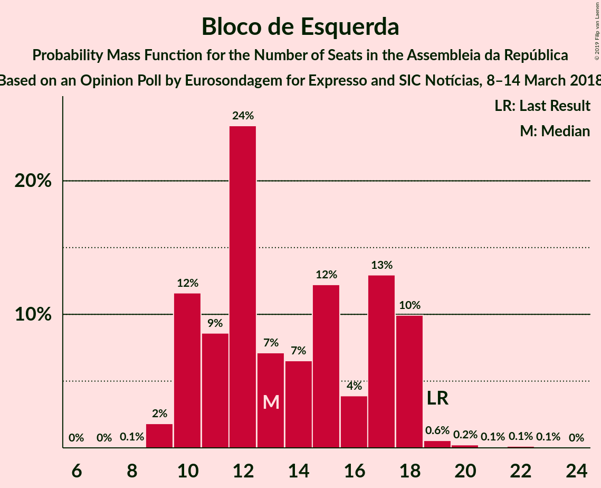

| Number of Seats | Probability | Accumulated | Special Marks |
|:---------------:|:-----------:|:-----------:|:-------------:|
| 8 | 0.1% | 100% |  |
| 9 | 2% | 99.9% |  |
| 10 | 12% | 98% |  |
| 11 | 9% | 86% |  |
| 12 | 24% | 78% |  |
| 13 | 7% | 54% | Median |
| 14 | 7% | 47% |  |
| 15 | 12% | 40% |  |
| 16 | 4% | 28% |  |
| 17 | 13% | 24% |  |
| 18 | 10% | 11% |  |
| 19 | 0.6% | 1.1% | Last Result |
| 20 | 0.2% | 0.5% |  |
| 21 | 0.1% | 0.3% |  |
| 22 | 0.1% | 0.2% |  |
| 23 | 0.1% | 0.1% |  |
| 24 | 0% | 0% |  |

### Coligação Democrática Unitária

*For a full overview of the results for this party, see the [Coligação Democrática Unitária](party-coligaçãodemocráticaunitária.html) page.*

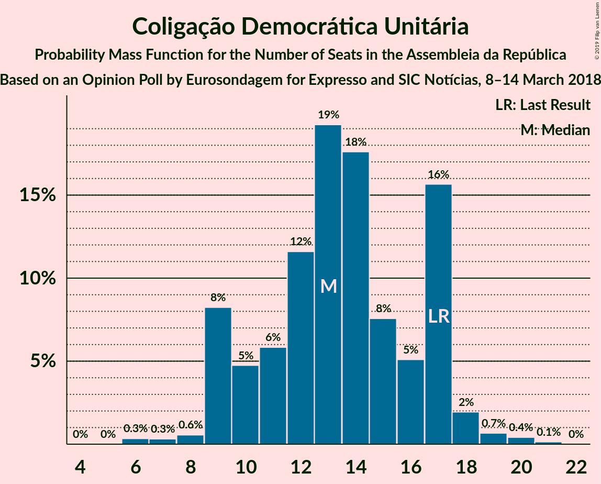

| Number of Seats | Probability | Accumulated | Special Marks |
|:---------------:|:-----------:|:-----------:|:-------------:|
| 6 | 0.3% | 100% |  |
| 7 | 0.3% | 99.7% |  |
| 8 | 0.6% | 99.3% |  |
| 9 | 8% | 98.8% |  |
| 10 | 5% | 91% |  |
| 11 | 6% | 86% |  |
| 12 | 12% | 80% |  |
| 13 | 19% | 68% | Median |
| 14 | 18% | 49% |  |
| 15 | 8% | 31% |  |
| 16 | 5% | 24% |  |
| 17 | 16% | 19% | Last Result |
| 18 | 2% | 3% |  |
| 19 | 0.7% | 1.2% |  |
| 20 | 0.4% | 0.6% |  |
| 21 | 0.1% | 0.2% |  |
| 22 | 0% | 0% |  |

### CDS–Partido Popular

*For a full overview of the results for this party, see the [CDS–Partido Popular](party-cds–partidopopular.html) page.*

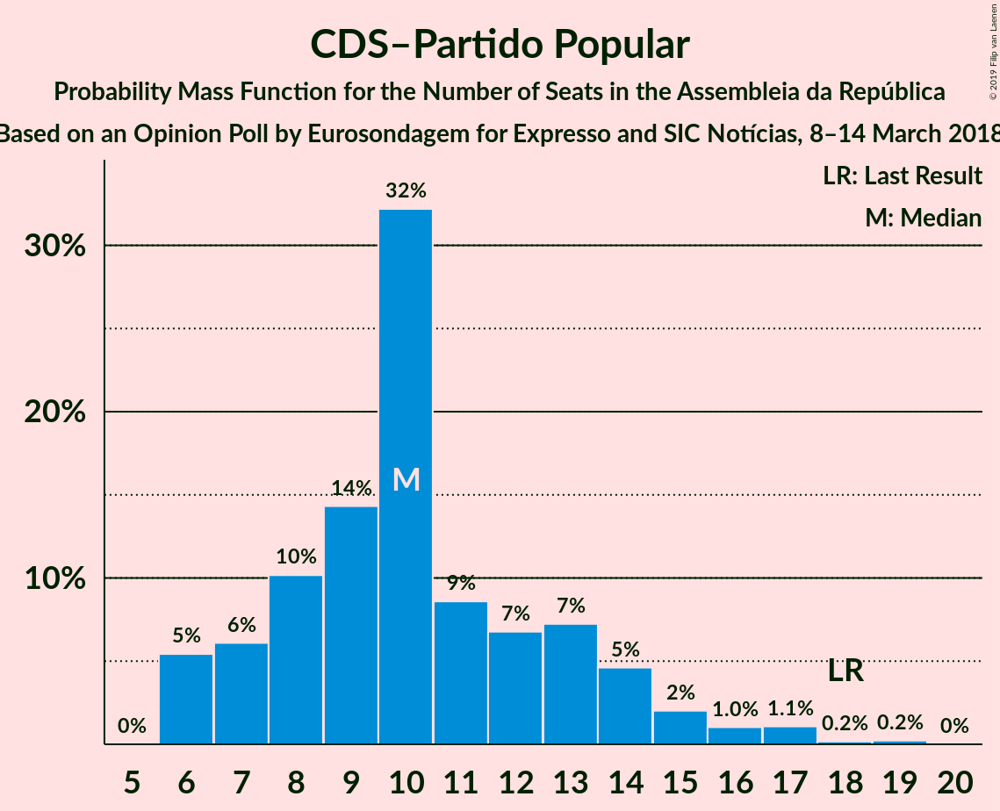

| Number of Seats | Probability | Accumulated | Special Marks |
|:---------------:|:-----------:|:-----------:|:-------------:|
| 6 | 5% | 100% |  |
| 7 | 6% | 95% |  |
| 8 | 10% | 88% |  |
| 9 | 14% | 78% |  |
| 10 | 32% | 64% | Median |
| 11 | 9% | 32% |  |
| 12 | 7% | 23% |  |
| 13 | 7% | 16% |  |
| 14 | 5% | 9% |  |
| 15 | 2% | 5% |  |
| 16 | 1.0% | 3% |  |
| 17 | 1.1% | 1.5% |  |
| 18 | 0.2% | 0.4% | Last Result |
| 19 | 0.2% | 0.3% |  |
| 20 | 0% | 0% |  |

### Pessoas–Animais–Natureza

*For a full overview of the results for this party, see the [Pessoas–Animais–Natureza](party-pessoas–animais–natureza.html) page.*

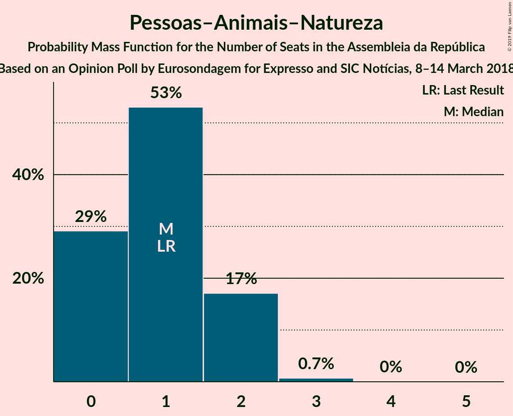

| Number of Seats | Probability | Accumulated | Special Marks |
|:---------------:|:-----------:|:-----------:|:-------------:|
| 0 | 29% | 100% |  |
| 1 | 53% | 71% | Last Result, Median |
| 2 | 17% | 18% |  |
| 3 | 0.7% | 0.8% |  |
| 4 | 0% | 0% |  |

## Coalitions

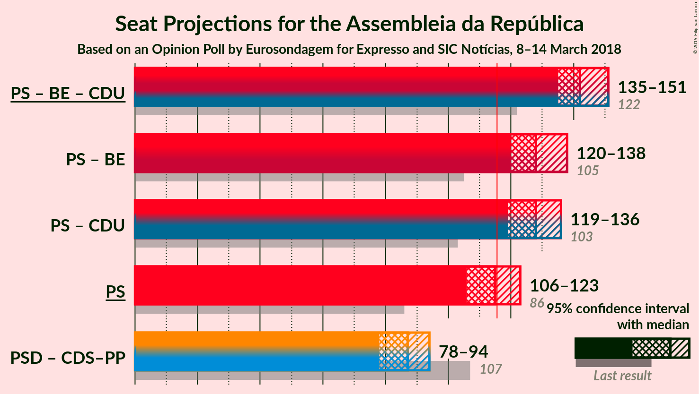

### Confidence Intervals

| Coalition | Last Result | Median | Majority? | 80% Confidence Interval | 90% Confidence Interval | 95% Confidence Interval | 99% Confidence Interval |
|:---------:|:-----------:|:------:|:---------:|:-----------------------:|:-----------------------:|:-----------------------:|:-----------------------:|
| Partido Socialista – Bloco de Esquerda – Coligação Democrática Unitária | 122 | 142 | 100% | 137–148 | 135–149 | 135–151 | 131–154 |
| Partido Socialista – Bloco de Esquerda | 105 | 128 | 99.9% | 123–134 | 122–136 | 120–138 | 118–141 |
| Partido Socialista – Coligação Democrática Unitária | 103 | 128 | 99.5% | 122–133 | 121–135 | 119–136 | 116–140 |
| Partido Socialista | 86 | 115 | 43% | 109–119 | 107–121 | 106–123 | 103–127 |
| Partido Social Democrata – CDS–Partido Popular | 107 | 87 | 0% | 82–92 | 80–93 | 78–94 | 75–98 |

### Partido Socialista – Bloco de Esquerda – Coligação Democrática Unitária

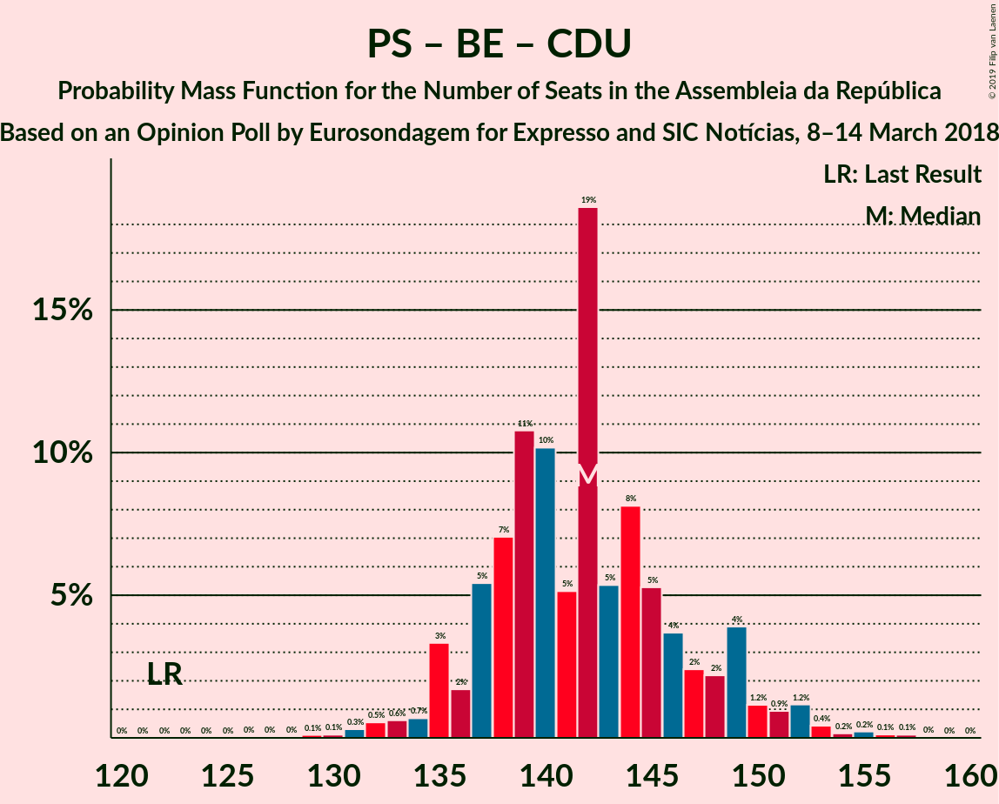

| Number of Seats | Probability | Accumulated | Special Marks |
|:---------------:|:-----------:|:-----------:|:-------------:|
| 122 | 0% | 100% | Last Result |
| 123 | 0% | 100% |  |
| 124 | 0% | 100% |  |
| 125 | 0% | 100% |  |
| 126 | 0% | 100% |  |
| 127 | 0% | 100% |  |
| 128 | 0% | 99.9% |  |
| 129 | 0.1% | 99.9% |  |
| 130 | 0.1% | 99.8% |  |
| 131 | 0.3% | 99.7% |  |
| 132 | 0.5% | 99.4% |  |
| 133 | 0.6% | 98.8% |  |
| 134 | 0.7% | 98% |  |
| 135 | 3% | 98% |  |
| 136 | 2% | 94% |  |
| 137 | 5% | 92% |  |
| 138 | 7% | 87% |  |
| 139 | 11% | 80% |  |
| 140 | 10% | 69% |  |
| 141 | 5% | 59% | Median |
| 142 | 19% | 54% |  |
| 143 | 5% | 35% |  |
| 144 | 8% | 30% |  |
| 145 | 5% | 22% |  |
| 146 | 4% | 17% |  |
| 147 | 2% | 13% |  |
| 148 | 2% | 10% |  |
| 149 | 4% | 8% |  |
| 150 | 1.2% | 4% |  |
| 151 | 0.9% | 3% |  |
| 152 | 1.2% | 2% |  |
| 153 | 0.4% | 1.1% |  |
| 154 | 0.2% | 0.6% |  |
| 155 | 0.2% | 0.5% |  |
| 156 | 0.1% | 0.3% |  |
| 157 | 0.1% | 0.1% |  |
| 158 | 0% | 0% |  |

### Partido Socialista – Bloco de Esquerda

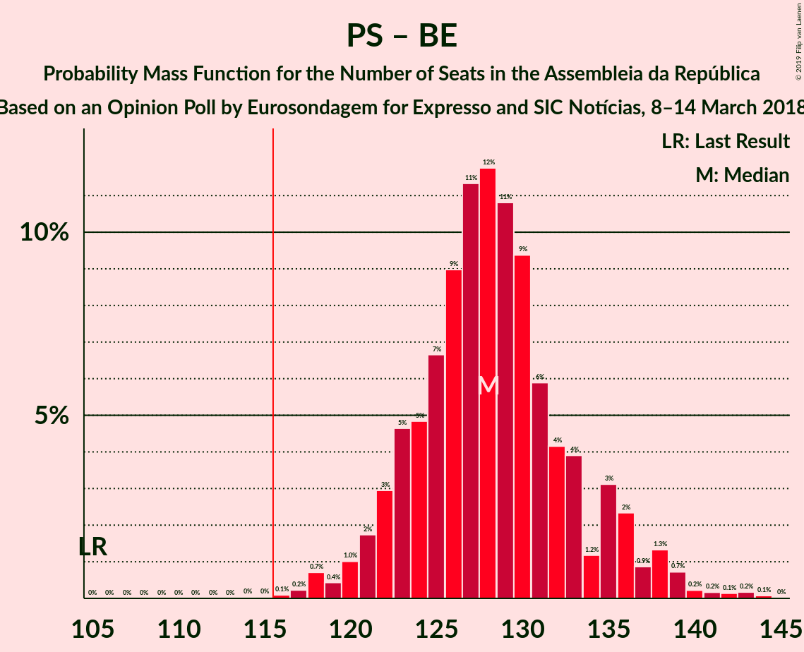

| Number of Seats | Probability | Accumulated | Special Marks |
|:---------------:|:-----------:|:-----------:|:-------------:|
| 105 | 0% | 100% | Last Result |
| 106 | 0% | 100% |  |
| 107 | 0% | 100% |  |
| 108 | 0% | 100% |  |
| 109 | 0% | 100% |  |
| 110 | 0% | 100% |  |
| 111 | 0% | 100% |  |
| 112 | 0% | 100% |  |
| 113 | 0% | 100% |  |
| 114 | 0% | 100% |  |
| 115 | 0% | 99.9% |  |
| 116 | 0.1% | 99.9% | Majority |
| 117 | 0.2% | 99.8% |  |
| 118 | 0.7% | 99.6% |  |
| 119 | 0.4% | 98.9% |  |
| 120 | 1.0% | 98% |  |
| 121 | 2% | 97% |  |
| 122 | 3% | 96% |  |
| 123 | 5% | 93% |  |
| 124 | 5% | 88% |  |
| 125 | 7% | 83% |  |
| 126 | 9% | 77% |  |
| 127 | 11% | 68% |  |
| 128 | 12% | 56% | Median |
| 129 | 11% | 45% |  |
| 130 | 9% | 34% |  |
| 131 | 6% | 24% |  |
| 132 | 4% | 18% |  |
| 133 | 4% | 14% |  |
| 134 | 1.2% | 10% |  |
| 135 | 3% | 9% |  |
| 136 | 2% | 6% |  |
| 137 | 0.9% | 4% |  |
| 138 | 1.3% | 3% |  |
| 139 | 0.7% | 2% |  |
| 140 | 0.2% | 0.8% |  |
| 141 | 0.2% | 0.6% |  |
| 142 | 0.1% | 0.4% |  |
| 143 | 0.2% | 0.3% |  |
| 144 | 0.1% | 0.1% |  |
| 145 | 0% | 0% |  |

### Partido Socialista – Coligação Democrática Unitária

| Number of Seats | Probability | Accumulated | Special Marks |
|:---------------:|:-----------:|:-----------:|:-------------:|
| 103 | 0% | 100% | Last Result |
| 104 | 0% | 100% |  |
| 105 | 0% | 100% |  |
| 106 | 0% | 100% |  |
| 107 | 0% | 100% |  |
| 108 | 0% | 100% |  |
| 109 | 0% | 100% |  |
| 110 | 0% | 100% |  |
| 111 | 0% | 100% |  |
| 112 | 0% | 100% |  |
| 113 | 0.1% | 99.9% |  |
| 114 | 0.1% | 99.9% |  |
| 115 | 0.2% | 99.7% |  |
| 116 | 0.1% | 99.5% | Majority |
| 117 | 0.4% | 99.4% |  |
| 118 | 0.8% | 99.0% |  |
| 119 | 1.0% | 98% |  |
| 120 | 1.5% | 97% |  |
| 121 | 2% | 96% |  |
| 122 | 7% | 93% |  |
| 123 | 3% | 86% |  |
| 124 | 5% | 84% |  |
| 125 | 6% | 79% |  |
| 126 | 6% | 73% |  |
| 127 | 9% | 67% |  |
| 128 | 12% | 58% | Median |
| 129 | 4% | 46% |  |
| 130 | 12% | 42% |  |
| 131 | 7% | 30% |  |
| 132 | 9% | 23% |  |
| 133 | 3% | 13% |  |
| 134 | 3% | 10% |  |
| 135 | 1.4% | 6% |  |
| 136 | 2% | 5% |  |
| 137 | 1.0% | 2% |  |
| 138 | 0.7% | 2% |  |
| 139 | 0.2% | 0.8% |  |
| 140 | 0.1% | 0.5% |  |
| 141 | 0.3% | 0.5% |  |
| 142 | 0.1% | 0.2% |  |
| 143 | 0% | 0.1% |  |
| 144 | 0% | 0% |  |

### Partido Socialista

| Number of Seats | Probability | Accumulated | Special Marks |
|:---------------:|:-----------:|:-----------:|:-------------:|
| 86 | 0% | 100% | Last Result |
| 87 | 0% | 100% |  |
| 88 | 0% | 100% |  |
| 89 | 0% | 100% |  |
| 90 | 0% | 100% |  |
| 91 | 0% | 100% |  |
| 92 | 0% | 100% |  |
| 93 | 0% | 100% |  |
| 94 | 0% | 100% |  |
| 95 | 0% | 100% |  |
| 96 | 0% | 100% |  |
| 97 | 0% | 100% |  |
| 98 | 0% | 100% |  |
| 99 | 0% | 100% |  |
| 100 | 0.1% | 100% |  |
| 101 | 0.1% | 99.8% |  |
| 102 | 0.1% | 99.7% |  |
| 103 | 0.7% | 99.6% |  |
| 104 | 0.3% | 98.9% |  |
| 105 | 1.0% | 98.7% |  |
| 106 | 1.0% | 98% |  |
| 107 | 2% | 97% |  |
| 108 | 3% | 95% |  |
| 109 | 6% | 92% |  |
| 110 | 4% | 86% |  |
| 111 | 4% | 82% |  |
| 112 | 6% | 77% |  |
| 113 | 11% | 71% |  |
| 114 | 4% | 61% |  |
| 115 | 14% | 57% | Median |
| 116 | 9% | 43% | Majority |
| 117 | 11% | 35% |  |
| 118 | 7% | 24% |  |
| 119 | 8% | 17% |  |
| 120 | 4% | 9% |  |
| 121 | 1.3% | 5% |  |
| 122 | 1.3% | 4% |  |
| 123 | 0.5% | 3% |  |
| 124 | 0.9% | 2% |  |
| 125 | 0.4% | 1.3% |  |
| 126 | 0.4% | 0.9% |  |
| 127 | 0.2% | 0.5% |  |
| 128 | 0.1% | 0.3% |  |
| 129 | 0% | 0.1% |  |
| 130 | 0% | 0.1% |  |
| 131 | 0% | 0.1% |  |
| 132 | 0% | 0% |  |

### Partido Social Democrata – CDS–Partido Popular

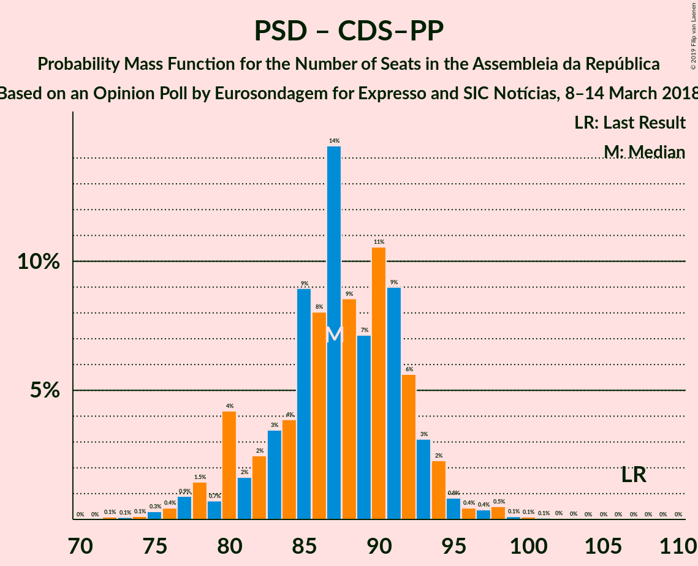

| Number of Seats | Probability | Accumulated | Special Marks |
|:---------------:|:-----------:|:-----------:|:-------------:|
| 72 | 0.1% | 100% |  |
| 73 | 0.1% | 99.9% |  |
| 74 | 0.1% | 99.8% |  |
| 75 | 0.3% | 99.7% |  |
| 76 | 0.4% | 99.4% |  |
| 77 | 0.9% | 98.9% |  |
| 78 | 1.5% | 98% |  |
| 79 | 0.7% | 97% |  |
| 80 | 4% | 96% |  |
| 81 | 2% | 92% |  |
| 82 | 2% | 90% |  |
| 83 | 3% | 88% |  |
| 84 | 4% | 84% |  |
| 85 | 9% | 80% |  |
| 86 | 8% | 71% |  |
| 87 | 14% | 63% |  |
| 88 | 9% | 49% | Median |
| 89 | 7% | 40% |  |
| 90 | 11% | 33% |  |
| 91 | 9% | 23% |  |
| 92 | 6% | 14% |  |
| 93 | 3% | 8% |  |
| 94 | 2% | 5% |  |
| 95 | 0.8% | 2% |  |
| 96 | 0.4% | 2% |  |
| 97 | 0.4% | 1.2% |  |
| 98 | 0.5% | 0.8% |  |
| 99 | 0.1% | 0.3% |  |
| 100 | 0.1% | 0.2% |  |
| 101 | 0.1% | 0.1% |  |
| 102 | 0% | 0.1% |  |
| 103 | 0% | 0% |  |
| 104 | 0% | 0% |  |
| 105 | 0% | 0% |  |
| 106 | 0% | 0% |  |
| 107 | 0% | 0% | Last Result |

## Technical Information

### Opinion Poll

+ **Polling firm:** Eurosondagem
+ **Commissioner(s):** Expresso and SIC Notícias
+ **Fieldwork period:** 8–14 March 2018

### Calculations

+ **Sample size:** 1010
+ **Simulations done:** 131,072
+ **Error estimate:** 0.52%

