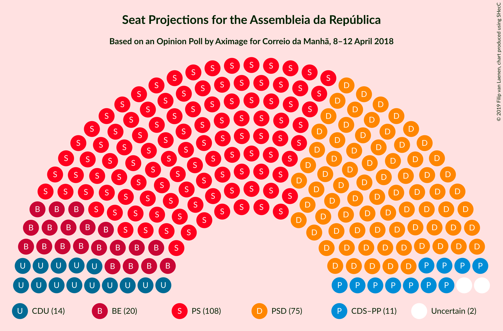
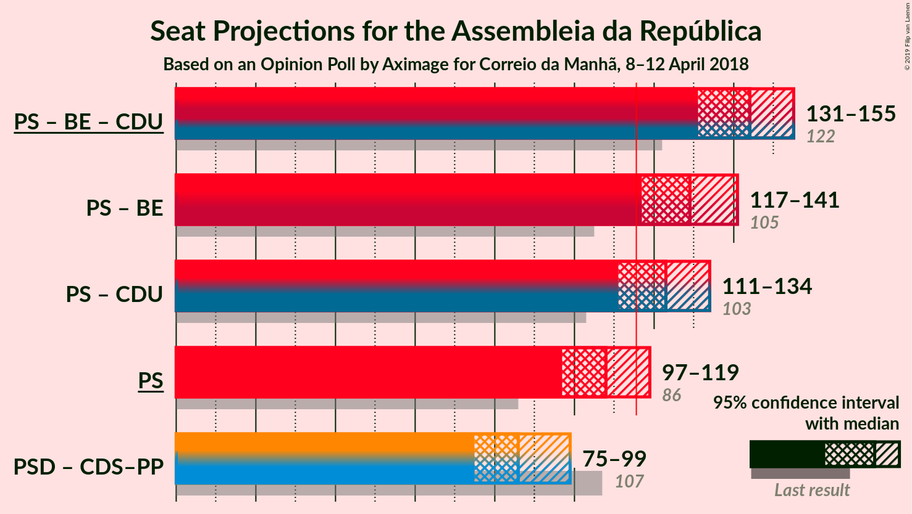
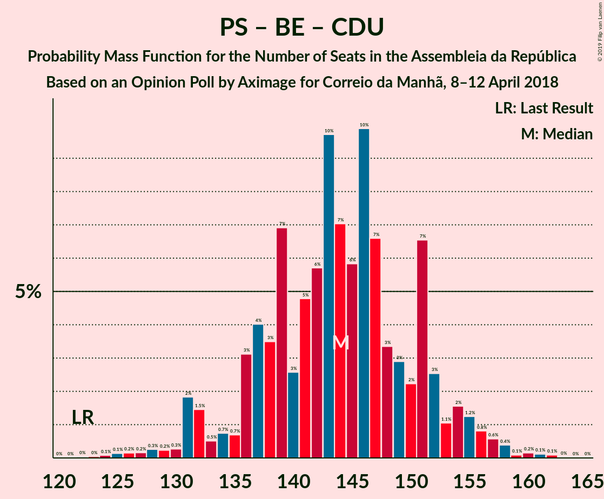
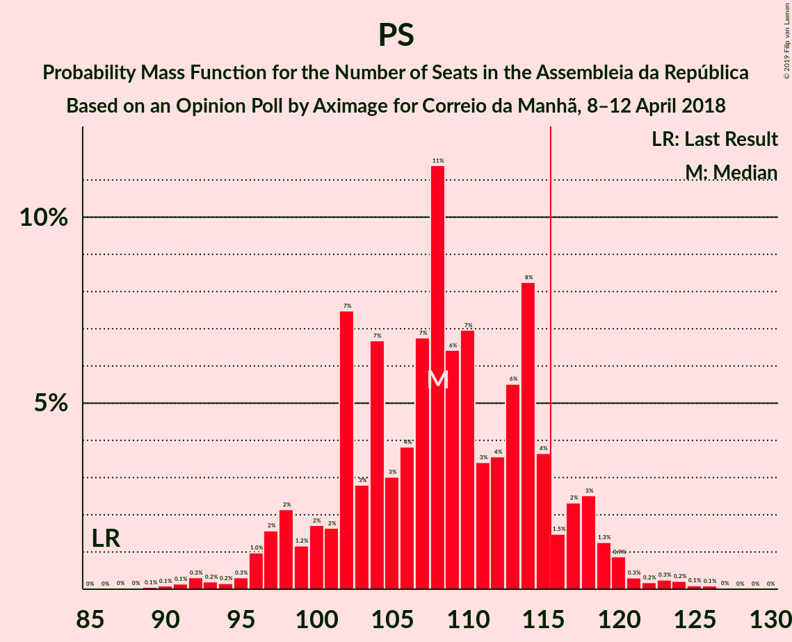

# Opinion Poll by Aximage for Correio da Manhã, 8–12 April 2018

<a href="#voting-intentions">Voting Intentions</a> | <a href="#seats">Seats</a> | <a href="#coalitions">Coalitions</a> | <a href="#technical-information">Technical Information</a>

## Voting Intentions

### Confidence Intervals

| Party | Last Result | Poll Result | 80% Confidence Interval | 90% Confidence Interval | 95% Confidence Interval | 99% Confidence Interval |
|:-----:|:-----------:|:-----------:|:-----------------------:|:-----------------------:|:-----------------------:|:-----------------------:|
| Partido Socialista | 32.3% | 37.9% | 35.5–40.5% |34.8–41.3% |34.1–41.9% |33.0–43.1% |
| Partido Social Democrata | 36.9% | 26.6% | 24.4–29.0% |23.8–29.7% |23.2–30.3% |22.2–31.5% |
| Bloco de Esquerda | 10.2% | 10.0% | 8.6–11.7% |8.2–12.2% |7.8–12.7% |7.2–13.5% |
| Coligação Democrática Unitária | 8.2% | 7.7% | 6.4–9.2% |6.1–9.7% |5.8–10.1% |5.2–10.9% |
| CDS–Partido Popular | 36.9% | 7.0% | 5.8–8.5% |5.5–8.9% |5.2–9.3% |4.7–10.1% |

*Note:* The poll result column reflects the actual value used in the calculations. Published results may vary slightly, and in addition be rounded to fewer digits.

## Seats

### Confidence Intervals

| Party | Last Result | Median | 80% Confidence Interval | 90% Confidence Interval | 95% Confidence Interval | 99% Confidence Interval |
|:-----:|:-----------:|:------:|:-----------------------:|:-----------------------:|:-----------------------:|:-----------------------:|
| <a href="#partido-socialista">Partido Socialista</a> | 86 | 108 | 101–115 |98–118 |97–119 |92–123 |
| <a href="#partido-social-democrata">Partido Social Democrata</a> | 89 | 75 | 67–82 |65–83 |63–87 |60–89 |
| <a href="#bloco-de-esquerda">Bloco de Esquerda</a> | 19 | 20 | 18–24 |17–26 |15–27 |12–28 |
| <a href="#coligação-democrática-unitária">Coligação Democrática Unitária</a> | 17 | 14 | 11–19 |10–20 |10–20 |7–23 |
| <a href="#cds–partido-popular">CDS–Partido Popular</a> | 18 | 11 | 9–18 |8–19 |7–20 |6–21 |

### Partido Socialista

*For a full overview of the results for this party, see the [Partido Socialista](party-partidosocialista.html) page.*

| Number of Seats | Probability | Accumulated | Special Marks |
|:---------------:|:-----------:|:-----------:|:-------------:|
| 86 | 0% | 100% | Last Result |
| 87 | 0% | 100% |  |
| 88 | 0% | 100% |  |
| 89 | 0.1% | 99.9% |  |
| 90 | 0.1% | 99.9% |  |
| 91 | 0.1% | 99.8% |  |
| 92 | 0.3% | 99.6% |  |
| 93 | 0.2% | 99.3% |  |
| 94 | 0.2% | 99.1% |  |
| 95 | 0.3% | 99.0% |  |
| 96 | 1.0% | 98.6% |  |
| 97 | 2% | 98% |  |
| 98 | 2% | 96% |  |
| 99 | 1.2% | 94% |  |
| 100 | 2% | 93% |  |
| 101 | 2% | 91% |  |
| 102 | 7% | 89% |  |
| 103 | 3% | 82% |  |
| 104 | 7% | 79% |  |
| 105 | 3% | 72% |  |
| 106 | 4% | 69% |  |
| 107 | 7% | 66% |  |
| 108 | 11% | 59% | Median |
| 109 | 6% | 47% |  |
| 110 | 7% | 41% |  |
| 111 | 3% | 34% |  |
| 112 | 4% | 31% |  |
| 113 | 6% | 27% |  |
| 114 | 8% | 22% |  |
| 115 | 4% | 13% |  |
| 116 | 1.5% | 10% | Majority |
| 117 | 2% | 8% |  |
| 118 | 3% | 6% |  |
| 119 | 1.3% | 3% |  |
| 120 | 0.9% | 2% |  |
| 121 | 0.3% | 1.2% |  |
| 122 | 0.2% | 0.9% |  |
| 123 | 0.3% | 0.7% |  |
| 124 | 0.2% | 0.5% |  |
| 125 | 0.1% | 0.3% |  |
| 126 | 0.1% | 0.2% |  |
| 127 | 0% | 0.1% |  |
| 128 | 0% | 0.1% |  |
| 129 | 0% | 0% |  |

### Partido Social Democrata

*For a full overview of the results for this party, see the [Partido Social Democrata](party-partidosocialdemocrata.html) page.*

| Number of Seats | Probability | Accumulated | Special Marks |
|:---------------:|:-----------:|:-----------:|:-------------:|
| 56 | 0% | 100% |  |
| 57 | 0.1% | 99.9% |  |
| 58 | 0.1% | 99.8% |  |
| 59 | 0.2% | 99.8% |  |
| 60 | 0.4% | 99.5% |  |
| 61 | 0.5% | 99.1% |  |
| 62 | 0.5% | 98.6% |  |
| 63 | 0.7% | 98% |  |
| 64 | 1.4% | 97% |  |
| 65 | 2% | 96% |  |
| 66 | 3% | 94% |  |
| 67 | 3% | 91% |  |
| 68 | 6% | 88% |  |
| 69 | 4% | 82% |  |
| 70 | 6% | 78% |  |
| 71 | 4% | 72% |  |
| 72 | 4% | 68% |  |
| 73 | 5% | 64% |  |
| 74 | 7% | 58% |  |
| 75 | 13% | 51% | Median |
| 76 | 7% | 39% |  |
| 77 | 7% | 32% |  |
| 78 | 7% | 25% |  |
| 79 | 2% | 18% |  |
| 80 | 4% | 17% |  |
| 81 | 3% | 13% |  |
| 82 | 3% | 11% |  |
| 83 | 3% | 8% |  |
| 84 | 0.4% | 5% |  |
| 85 | 1.2% | 4% |  |
| 86 | 0.6% | 3% |  |
| 87 | 1.1% | 3% |  |
| 88 | 0.8% | 1.4% |  |
| 89 | 0.1% | 0.6% | Last Result |
| 90 | 0.2% | 0.5% |  |
| 91 | 0.1% | 0.2% |  |
| 92 | 0% | 0.2% |  |
| 93 | 0.1% | 0.1% |  |
| 94 | 0% | 0.1% |  |
| 95 | 0% | 0% |  |

### Bloco de Esquerda

*For a full overview of the results for this party, see the [Bloco de Esquerda](party-blocodeesquerda.html) page.*

| Number of Seats | Probability | Accumulated | Special Marks |
|:---------------:|:-----------:|:-----------:|:-------------:|
| 10 | 0.2% | 100% |  |
| 11 | 0% | 99.8% |  |
| 12 | 0.3% | 99.8% |  |
| 13 | 0.8% | 99.5% |  |
| 14 | 1.0% | 98.6% |  |
| 15 | 1.2% | 98% |  |
| 16 | 1.3% | 96% |  |
| 17 | 4% | 95% |  |
| 18 | 33% | 91% |  |
| 19 | 6% | 58% | Last Result |
| 20 | 4% | 53% | Median |
| 21 | 4% | 49% |  |
| 22 | 4% | 45% |  |
| 23 | 16% | 40% |  |
| 24 | 16% | 24% |  |
| 25 | 2% | 8% |  |
| 26 | 2% | 6% |  |
| 27 | 3% | 4% |  |
| 28 | 1.1% | 1.4% |  |
| 29 | 0.2% | 0.4% |  |
| 30 | 0% | 0.2% |  |
| 31 | 0.1% | 0.2% |  |
| 32 | 0% | 0.1% |  |
| 33 | 0% | 0.1% |  |
| 34 | 0% | 0% |  |

### Coligação Democrática Unitária

*For a full overview of the results for this party, see the [Coligação Democrática Unitária](party-coligaçãodemocráticaunitária.html) page.*

| Number of Seats | Probability | Accumulated | Special Marks |
|:---------------:|:-----------:|:-----------:|:-------------:|
| 6 | 0.4% | 100% |  |
| 7 | 0.2% | 99.5% |  |
| 8 | 0.3% | 99.3% |  |
| 9 | 1.0% | 99.0% |  |
| 10 | 4% | 98% |  |
| 11 | 5% | 94% |  |
| 12 | 10% | 88% |  |
| 13 | 16% | 78% |  |
| 14 | 18% | 63% | Median |
| 15 | 5% | 45% |  |
| 16 | 2% | 40% |  |
| 17 | 17% | 38% | Last Result |
| 18 | 9% | 21% |  |
| 19 | 6% | 12% |  |
| 20 | 5% | 6% |  |
| 21 | 0.4% | 1.1% |  |
| 22 | 0.1% | 0.8% |  |
| 23 | 0.3% | 0.6% |  |
| 24 | 0.4% | 0.4% |  |
| 25 | 0% | 0% |  |

### CDS–Partido Popular

*For a full overview of the results for this party, see the [CDS–Partido Popular](party-cds–partidopopular.html) page.*

| Number of Seats | Probability | Accumulated | Special Marks |
|:---------------:|:-----------:|:-----------:|:-------------:|
| 6 | 2% | 100% |  |
| 7 | 3% | 98% |  |
| 8 | 5% | 95% |  |
| 9 | 9% | 91% |  |
| 10 | 25% | 81% |  |
| 11 | 12% | 56% | Median |
| 12 | 7% | 43% |  |
| 13 | 12% | 36% |  |
| 14 | 4% | 25% |  |
| 15 | 3% | 21% |  |
| 16 | 2% | 18% |  |
| 17 | 3% | 15% |  |
| 18 | 7% | 12% | Last Result |
| 19 | 3% | 6% |  |
| 20 | 1.4% | 3% |  |
| 21 | 0.9% | 1.3% |  |
| 22 | 0.2% | 0.4% |  |
| 23 | 0.1% | 0.3% |  |
| 24 | 0.1% | 0.1% |  |
| 25 | 0% | 0.1% |  |
| 26 | 0% | 0% |  |

## Coalitions

### Confidence Intervals

| Coalition | Last Result | Median | Majority? | 80% Confidence Interval | 90% Confidence Interval | 95% Confidence Interval | 99% Confidence Interval |
|:---------:|:-----------:|:------:|:---------:|:-----------------------:|:-----------------------:|:-----------------------:|:-----------------------:|
| Partido Socialista – Bloco de Esquerda – Coligação Democrática Unitária | 122 | 144 | 100% | 137–151 | 133–154 | 131–155 | 127–159 |
| Partido Socialista – Bloco de Esquerda | 105 | 129 | 98% | 121–137 | 119–138 | 117–141 | 113–145 |
| Partido Socialista – Coligação Democrática Unitária | 103 | 123 | 88% | 115–131 | 113–133 | 111–134 | 106–139 |
| Partido Socialista | 86 | 108 | 10% | 101–115 | 98–118 | 97–119 | 92–123 |
| Partido Social Democrata – CDS–Partido Popular | 107 | 86 | 0% | 79–93 | 76–97 | 75–99 | 71–103 |

### Partido Socialista – Bloco de Esquerda – Coligação Democrática Unitária

| Number of Seats | Probability | Accumulated | Special Marks |
|:---------------:|:-----------:|:-----------:|:-------------:|
| 122 | 0% | 100% | Last Result |
| 123 | 0% | 99.9% |  |
| 124 | 0.1% | 99.9% |  |
| 125 | 0.1% | 99.8% |  |
| 126 | 0.2% | 99.7% |  |
| 127 | 0.2% | 99.5% |  |
| 128 | 0.3% | 99.4% |  |
| 129 | 0.2% | 99.1% |  |
| 130 | 0.3% | 98.9% |  |
| 131 | 2% | 98.6% |  |
| 132 | 1.5% | 97% |  |
| 133 | 0.5% | 95% |  |
| 134 | 0.7% | 95% |  |
| 135 | 0.7% | 94% |  |
| 136 | 3% | 93% |  |
| 137 | 4% | 90% |  |
| 138 | 3% | 86% |  |
| 139 | 7% | 83% |  |
| 140 | 3% | 76% |  |
| 141 | 5% | 73% |  |
| 142 | 6% | 68% | Median |
| 143 | 10% | 63% |  |
| 144 | 7% | 53% |  |
| 145 | 6% | 46% |  |
| 146 | 10% | 40% |  |
| 147 | 7% | 30% |  |
| 148 | 3% | 24% |  |
| 149 | 3% | 20% |  |
| 150 | 2% | 17% |  |
| 151 | 7% | 15% |  |
| 152 | 3% | 9% |  |
| 153 | 1.1% | 6% |  |
| 154 | 2% | 5% |  |
| 155 | 1.2% | 4% |  |
| 156 | 0.8% | 2% |  |
| 157 | 0.6% | 1.5% |  |
| 158 | 0.4% | 0.9% |  |
| 159 | 0.1% | 0.5% |  |
| 160 | 0.2% | 0.4% |  |
| 161 | 0.1% | 0.3% |  |
| 162 | 0.1% | 0.1% |  |
| 163 | 0% | 0.1% |  |
| 164 | 0% | 0% |  |

### Partido Socialista – Bloco de Esquerda

| Number of Seats | Probability | Accumulated | Special Marks |
|:---------------:|:-----------:|:-----------:|:-------------:|
| 105 | 0% | 100% | Last Result |
| 106 | 0% | 100% |  |
| 107 | 0% | 100% |  |
| 108 | 0% | 99.9% |  |
| 109 | 0% | 99.9% |  |
| 110 | 0.1% | 99.9% |  |
| 111 | 0.1% | 99.8% |  |
| 112 | 0.1% | 99.7% |  |
| 113 | 0.2% | 99.6% |  |
| 114 | 0.6% | 99.4% |  |
| 115 | 0.8% | 98.8% |  |
| 116 | 0.4% | 98% | Majority |
| 117 | 0.5% | 98% |  |
| 118 | 0.9% | 97% |  |
| 119 | 2% | 96% |  |
| 120 | 4% | 95% |  |
| 121 | 2% | 91% |  |
| 122 | 3% | 88% |  |
| 123 | 2% | 85% |  |
| 124 | 5% | 83% |  |
| 125 | 6% | 79% |  |
| 126 | 7% | 72% |  |
| 127 | 3% | 65% |  |
| 128 | 7% | 62% | Median |
| 129 | 6% | 55% |  |
| 130 | 5% | 49% |  |
| 131 | 7% | 44% |  |
| 132 | 9% | 36% |  |
| 133 | 8% | 28% |  |
| 134 | 2% | 19% |  |
| 135 | 3% | 17% |  |
| 136 | 3% | 14% |  |
| 137 | 5% | 11% |  |
| 138 | 2% | 6% |  |
| 139 | 0.7% | 4% |  |
| 140 | 0.9% | 4% |  |
| 141 | 1.2% | 3% |  |
| 142 | 0.9% | 2% |  |
| 143 | 0.2% | 0.9% |  |
| 144 | 0.2% | 0.7% |  |
| 145 | 0.3% | 0.5% |  |
| 146 | 0.1% | 0.2% |  |
| 147 | 0% | 0.2% |  |
| 148 | 0% | 0.1% |  |
| 149 | 0.1% | 0.1% |  |
| 150 | 0% | 0% |  |

### Partido Socialista – Coligação Democrática Unitária

| Number of Seats | Probability | Accumulated | Special Marks |
|:---------------:|:-----------:|:-----------:|:-------------:|
| 101 | 0% | 100% |  |
| 102 | 0% | 99.9% |  |
| 103 | 0% | 99.9% | Last Result |
| 104 | 0.1% | 99.9% |  |
| 105 | 0.2% | 99.8% |  |
| 106 | 0.2% | 99.6% |  |
| 107 | 0.4% | 99.5% |  |
| 108 | 0.4% | 99.1% |  |
| 109 | 0.4% | 98.7% |  |
| 110 | 0.4% | 98% |  |
| 111 | 0.6% | 98% |  |
| 112 | 1.1% | 97% |  |
| 113 | 2% | 96% |  |
| 114 | 3% | 94% |  |
| 115 | 3% | 91% |  |
| 116 | 1.1% | 88% | Majority |
| 117 | 3% | 87% |  |
| 118 | 2% | 84% |  |
| 119 | 5% | 81% |  |
| 120 | 6% | 76% |  |
| 121 | 7% | 69% |  |
| 122 | 7% | 62% | Median |
| 123 | 8% | 55% |  |
| 124 | 6% | 47% |  |
| 125 | 6% | 41% |  |
| 126 | 7% | 35% |  |
| 127 | 3% | 27% |  |
| 128 | 4% | 24% |  |
| 129 | 7% | 20% |  |
| 130 | 2% | 14% |  |
| 131 | 3% | 12% |  |
| 132 | 4% | 9% |  |
| 133 | 2% | 5% |  |
| 134 | 1.3% | 4% |  |
| 135 | 0.8% | 2% |  |
| 136 | 0.2% | 1.5% |  |
| 137 | 0.4% | 1.3% |  |
| 138 | 0.3% | 0.9% |  |
| 139 | 0.2% | 0.6% |  |
| 140 | 0.1% | 0.3% |  |
| 141 | 0.1% | 0.2% |  |
| 142 | 0% | 0.1% |  |
| 143 | 0% | 0.1% |  |
| 144 | 0% | 0% |  |

### Partido Socialista

| Number of Seats | Probability | Accumulated | Special Marks |
|:---------------:|:-----------:|:-----------:|:-------------:|
| 86 | 0% | 100% | Last Result |
| 87 | 0% | 100% |  |
| 88 | 0% | 100% |  |
| 89 | 0.1% | 99.9% |  |
| 90 | 0.1% | 99.9% |  |
| 91 | 0.1% | 99.8% |  |
| 92 | 0.3% | 99.6% |  |
| 93 | 0.2% | 99.3% |  |
| 94 | 0.2% | 99.1% |  |
| 95 | 0.3% | 99.0% |  |
| 96 | 1.0% | 98.6% |  |
| 97 | 2% | 98% |  |
| 98 | 2% | 96% |  |
| 99 | 1.2% | 94% |  |
| 100 | 2% | 93% |  |
| 101 | 2% | 91% |  |
| 102 | 7% | 89% |  |
| 103 | 3% | 82% |  |
| 104 | 7% | 79% |  |
| 105 | 3% | 72% |  |
| 106 | 4% | 69% |  |
| 107 | 7% | 66% |  |
| 108 | 11% | 59% | Median |
| 109 | 6% | 47% |  |
| 110 | 7% | 41% |  |
| 111 | 3% | 34% |  |
| 112 | 4% | 31% |  |
| 113 | 6% | 27% |  |
| 114 | 8% | 22% |  |
| 115 | 4% | 13% |  |
| 116 | 1.5% | 10% | Majority |
| 117 | 2% | 8% |  |
| 118 | 3% | 6% |  |
| 119 | 1.3% | 3% |  |
| 120 | 0.9% | 2% |  |
| 121 | 0.3% | 1.2% |  |
| 122 | 0.2% | 0.9% |  |
| 123 | 0.3% | 0.7% |  |
| 124 | 0.2% | 0.5% |  |
| 125 | 0.1% | 0.3% |  |
| 126 | 0.1% | 0.2% |  |
| 127 | 0% | 0.1% |  |
| 128 | 0% | 0.1% |  |
| 129 | 0% | 0% |  |

### Partido Social Democrata – CDS–Partido Popular

| Number of Seats | Probability | Accumulated | Special Marks |
|:---------------:|:-----------:|:-----------:|:-------------:|
| 67 | 0% | 100% |  |
| 68 | 0.1% | 99.9% |  |
| 69 | 0.1% | 99.9% |  |
| 70 | 0.1% | 99.7% |  |
| 71 | 0.1% | 99.6% |  |
| 72 | 0.4% | 99.5% |  |
| 73 | 0.6% | 99.1% |  |
| 74 | 0.8% | 98.5% |  |
| 75 | 1.3% | 98% |  |
| 76 | 2% | 96% |  |
| 77 | 1.0% | 95% |  |
| 78 | 3% | 94% |  |
| 79 | 7% | 91% |  |
| 80 | 2% | 85% |  |
| 81 | 3% | 83% |  |
| 82 | 3% | 80% |  |
| 83 | 7% | 76% |  |
| 84 | 10% | 70% |  |
| 85 | 6% | 60% |  |
| 86 | 7% | 54% | Median |
| 87 | 10% | 47% |  |
| 88 | 6% | 37% |  |
| 89 | 5% | 32% |  |
| 90 | 3% | 27% |  |
| 91 | 7% | 24% |  |
| 92 | 3% | 17% |  |
| 93 | 4% | 14% |  |
| 94 | 3% | 10% |  |
| 95 | 0.7% | 7% |  |
| 96 | 0.7% | 6% |  |
| 97 | 0.5% | 5% |  |
| 98 | 1.5% | 5% |  |
| 99 | 2% | 3% |  |
| 100 | 0.3% | 1.4% |  |
| 101 | 0.2% | 1.1% |  |
| 102 | 0.3% | 0.9% |  |
| 103 | 0.2% | 0.6% |  |
| 104 | 0.2% | 0.5% |  |
| 105 | 0.1% | 0.3% |  |
| 106 | 0.1% | 0.2% |  |
| 107 | 0% | 0.1% | Last Result |
| 108 | 0% | 0.1% |  |
| 109 | 0% | 0% |  |

## Technical Information

### Opinion Poll

+ **Polling firm:** Aximage
+ **Commissioner(s):** Correio da Manhã
+ **Fieldwork period:** 8–12 April 2018

### Calculations

+ **Sample size:** 601
+ **Simulations done:** 131,072
+ **Error estimate:** 0.58%

