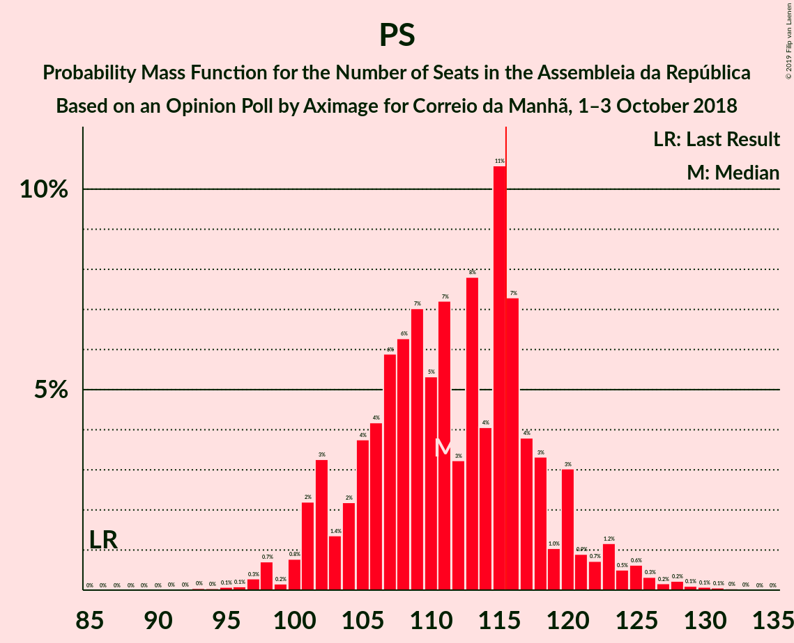

# Opinion Poll by Aximage for Correio da Manhã, 1–3 October 2018

<a href="#voting-intentions">Voting Intentions</a> | <a href="#seats">Seats</a> | <a href="#coalitions">Coalitions</a> | <a href="#technical-information">Technical Information</a>

## Voting Intentions

### Confidence Intervals

| Party | Last Result | Poll Result | 80% Confidence Interval | 90% Confidence Interval | 95% Confidence Interval | 99% Confidence Interval |
|:-----:|:-----------:|:-----------:|:-----------------------:|:-----------------------:|:-----------------------:|:-----------------------:|
| Partido Socialista | 32.3% | 38.9% | 36.4–41.5% |35.7–42.3% |35.1–42.9% |33.9–44.2% |
| Partido Social Democrata | 36.9% | 24.0% | 21.8–26.3% |21.2–27.0% |20.7–27.5% |19.7–28.7% |
| Bloco de Esquerda | 10.2% | 9.2% | 7.8–10.8% |7.4–11.3% |7.1–11.7% |6.5–12.6% |
| CDS–Partido Popular | 36.9% | 9.2% | 7.8–10.8% |7.4–11.3% |7.1–11.7% |6.5–12.6% |
| Coligação Democrática Unitária | 8.2% | 7.3% | 6.1–8.9% |5.8–9.3% |5.5–9.7% |5.0–10.5% |

*Note:* The poll result column reflects the actual value used in the calculations. Published results may vary slightly, and in addition be rounded to fewer digits.

## Seats

### Confidence Intervals

| Party | Last Result | Median | 80% Confidence Interval | 90% Confidence Interval | 95% Confidence Interval | 99% Confidence Interval |
|:-----:|:-----------:|:------:|:-----------------------:|:-----------------------:|:-----------------------:|:-----------------------:|
| <a href="#partido-socialista">Partido Socialista</a> | 86 | 111 | 104–118 |102–120 |101–123 |97–128 |
| <a href="#partido-social-democrata">Partido Social Democrata</a> | 89 | 67 | 59–73 |58–76 |55–77 |54–79 |
| <a href="#bloco-de-esquerda">Bloco de Esquerda</a> | 19 | 18 | 16–23 |14–24 |13–24 |10–27 |
| <a href="#cds–partido-popular">CDS–Partido Popular</a> | 18 | 19 | 14–25 |13–27 |12–29 |10–30 |
| <a href="#coligação-democrática-unitária">Coligação Democrática Unitária</a> | 17 | 14 | 10–17 |9–17 |8–20 |7–21 |

### Partido Socialista

*For a full overview of the results for this party, see the [Partido Socialista](party-partidosocialista.html) page.*

| Number of Seats | Probability | Accumulated | Special Marks |
|:---------------:|:-----------:|:-----------:|:-------------:|
| 86 | 0% | 100% | Last Result |
| 87 | 0% | 100% |  |
| 88 | 0% | 100% |  |
| 89 | 0% | 100% |  |
| 90 | 0% | 100% |  |
| 91 | 0% | 100% |  |
| 92 | 0% | 100% |  |
| 93 | 0% | 100% |  |
| 94 | 0% | 99.9% |  |
| 95 | 0.1% | 99.9% |  |
| 96 | 0.1% | 99.8% |  |
| 97 | 0.3% | 99.7% |  |
| 98 | 0.7% | 99.4% |  |
| 99 | 0.2% | 98.7% |  |
| 100 | 0.8% | 98.6% |  |
| 101 | 2% | 98% |  |
| 102 | 3% | 96% |  |
| 103 | 1.4% | 92% |  |
| 104 | 2% | 91% |  |
| 105 | 4% | 89% |  |
| 106 | 4% | 85% |  |
| 107 | 6% | 81% |  |
| 108 | 6% | 75% |  |
| 109 | 7% | 69% |  |
| 110 | 5% | 62% |  |
| 111 | 7% | 56% | Median |
| 112 | 3% | 49% |  |
| 113 | 8% | 46% |  |
| 114 | 4% | 38% |  |
| 115 | 11% | 34% |  |
| 116 | 7% | 23% | Majority |
| 117 | 4% | 16% |  |
| 118 | 3% | 12% |  |
| 119 | 1.0% | 9% |  |
| 120 | 3% | 8% |  |
| 121 | 0.9% | 5% |  |
| 122 | 0.7% | 4% |  |
| 123 | 1.2% | 3% |  |
| 124 | 0.5% | 2% |  |
| 125 | 0.6% | 2% |  |
| 126 | 0.3% | 1.0% |  |
| 127 | 0.2% | 0.7% |  |
| 128 | 0.2% | 0.5% |  |
| 129 | 0.1% | 0.3% |  |
| 130 | 0.1% | 0.2% |  |
| 131 | 0.1% | 0.1% |  |
| 132 | 0% | 0.1% |  |
| 133 | 0% | 0% |  |

### Partido Social Democrata

*For a full overview of the results for this party, see the [Partido Social Democrata](party-partidosocialdemocrata.html) page.*

| Number of Seats | Probability | Accumulated | Special Marks |
|:---------------:|:-----------:|:-----------:|:-------------:|
| 50 | 0% | 100% |  |
| 51 | 0% | 99.9% |  |
| 52 | 0% | 99.9% |  |
| 53 | 0.3% | 99.9% |  |
| 54 | 1.3% | 99.6% |  |
| 55 | 2% | 98% |  |
| 56 | 1.2% | 97% |  |
| 57 | 0.5% | 96% |  |
| 58 | 1.0% | 95% |  |
| 59 | 4% | 94% |  |
| 60 | 1.0% | 90% |  |
| 61 | 4% | 89% |  |
| 62 | 7% | 85% |  |
| 63 | 17% | 78% |  |
| 64 | 4% | 60% |  |
| 65 | 2% | 56% |  |
| 66 | 2% | 55% |  |
| 67 | 16% | 53% | Median |
| 68 | 5% | 37% |  |
| 69 | 8% | 32% |  |
| 70 | 7% | 24% |  |
| 71 | 6% | 17% |  |
| 72 | 0.7% | 11% |  |
| 73 | 2% | 10% |  |
| 74 | 0.9% | 8% |  |
| 75 | 0.7% | 7% |  |
| 76 | 2% | 6% |  |
| 77 | 2% | 4% |  |
| 78 | 1.0% | 2% |  |
| 79 | 0.7% | 1.1% |  |
| 80 | 0.1% | 0.3% |  |
| 81 | 0% | 0.3% |  |
| 82 | 0% | 0.3% |  |
| 83 | 0% | 0.2% |  |
| 84 | 0% | 0.2% |  |
| 85 | 0.1% | 0.2% |  |
| 86 | 0.1% | 0.1% |  |
| 87 | 0% | 0% |  |
| 88 | 0% | 0% |  |
| 89 | 0% | 0% | Last Result |

### Bloco de Esquerda

*For a full overview of the results for this party, see the [Bloco de Esquerda](party-blocodeesquerda.html) page.*

| Number of Seats | Probability | Accumulated | Special Marks |
|:---------------:|:-----------:|:-----------:|:-------------:|
| 9 | 0.1% | 100% |  |
| 10 | 1.0% | 99.9% |  |
| 11 | 0.4% | 98.9% |  |
| 12 | 0.9% | 98.5% |  |
| 13 | 1.4% | 98% |  |
| 14 | 1.5% | 96% |  |
| 15 | 1.2% | 95% |  |
| 16 | 4% | 93% |  |
| 17 | 4% | 90% |  |
| 18 | 42% | 86% | Median |
| 19 | 10% | 44% | Last Result |
| 20 | 6% | 35% |  |
| 21 | 9% | 28% |  |
| 22 | 5% | 19% |  |
| 23 | 8% | 15% |  |
| 24 | 6% | 7% |  |
| 25 | 0.3% | 1.1% |  |
| 26 | 0.2% | 0.9% |  |
| 27 | 0.6% | 0.7% |  |
| 28 | 0.1% | 0.1% |  |
| 29 | 0% | 0% |  |

### CDS–Partido Popular

*For a full overview of the results for this party, see the [CDS–Partido Popular](party-cds–partidopopular.html) page.*

| Number of Seats | Probability | Accumulated | Special Marks |
|:---------------:|:-----------:|:-----------:|:-------------:|
| 9 | 0.1% | 100% |  |
| 10 | 0.9% | 99.9% |  |
| 11 | 1.2% | 99.0% |  |
| 12 | 2% | 98% |  |
| 13 | 3% | 96% |  |
| 14 | 4% | 93% |  |
| 15 | 2% | 89% |  |
| 16 | 3% | 87% |  |
| 17 | 3% | 84% |  |
| 18 | 21% | 82% | Last Result |
| 19 | 16% | 61% | Median |
| 20 | 8% | 45% |  |
| 21 | 13% | 37% |  |
| 22 | 4% | 24% |  |
| 23 | 7% | 20% |  |
| 24 | 2% | 12% |  |
| 25 | 2% | 10% |  |
| 26 | 1.1% | 8% |  |
| 27 | 2% | 6% |  |
| 28 | 2% | 4% |  |
| 29 | 2% | 3% |  |
| 30 | 0.8% | 0.9% |  |
| 31 | 0% | 0.1% |  |
| 32 | 0% | 0% |  |

### Coligação Democrática Unitária

*For a full overview of the results for this party, see the [Coligação Democrática Unitária](party-coligaçãodemocráticaunitária.html) page.*

| Number of Seats | Probability | Accumulated | Special Marks |
|:---------------:|:-----------:|:-----------:|:-------------:|
| 5 | 0.1% | 100% |  |
| 6 | 0.2% | 99.9% |  |
| 7 | 0.4% | 99.7% |  |
| 8 | 3% | 99.3% |  |
| 9 | 5% | 97% |  |
| 10 | 5% | 92% |  |
| 11 | 18% | 87% |  |
| 12 | 6% | 68% |  |
| 13 | 9% | 62% |  |
| 14 | 9% | 54% | Median |
| 15 | 7% | 45% |  |
| 16 | 9% | 38% |  |
| 17 | 24% | 29% | Last Result |
| 18 | 0.4% | 4% |  |
| 19 | 0.4% | 4% |  |
| 20 | 3% | 4% |  |
| 21 | 0.7% | 1.0% |  |
| 22 | 0.2% | 0.4% |  |
| 23 | 0.1% | 0.2% |  |
| 24 | 0.1% | 0.1% |  |
| 25 | 0% | 0% |  |

## Coalitions

### Confidence Intervals

| Coalition | Last Result | Median | Majority? | 80% Confidence Interval | 90% Confidence Interval | 95% Confidence Interval | 99% Confidence Interval |
|:---------:|:-----------:|:------:|:---------:|:-----------------------:|:-----------------------:|:-----------------------:|:-----------------------:|
| Partido Socialista – Bloco de Esquerda – Coligação Democrática Unitária | 122 | 144 | 100% | 137–151 | 135–154 | 133–155 | 130–159 |
| Partido Socialista – Bloco de Esquerda | 105 | 130 | 99.5% | 123–139 | 120–140 | 119–143 | 115–146 |
| Partido Socialista – Coligação Democrática Unitária | 103 | 126 | 97% | 118–132 | 117–134 | 115–136 | 112–140 |
| Partido Socialista | 86 | 111 | 23% | 104–118 | 102–120 | 101–123 | 97–128 |
| Partido Social Democrata – CDS–Partido Popular | 107 | 86 | 0% | 79–93 | 76–95 | 74–97 | 71–100 |

### Partido Socialista – Bloco de Esquerda – Coligação Democrática Unitária

| Number of Seats | Probability | Accumulated | Special Marks |
|:---------------:|:-----------:|:-----------:|:-------------:|
| 122 | 0% | 100% | Last Result |
| 123 | 0% | 100% |  |
| 124 | 0% | 100% |  |
| 125 | 0% | 100% |  |
| 126 | 0% | 99.9% |  |
| 127 | 0% | 99.9% |  |
| 128 | 0.1% | 99.8% |  |
| 129 | 0.2% | 99.8% |  |
| 130 | 0.3% | 99.6% |  |
| 131 | 0.6% | 99.2% |  |
| 132 | 0.6% | 98.7% |  |
| 133 | 0.9% | 98% |  |
| 134 | 1.2% | 97% |  |
| 135 | 2% | 96% |  |
| 136 | 3% | 94% |  |
| 137 | 3% | 92% |  |
| 138 | 3% | 89% |  |
| 139 | 3% | 86% |  |
| 140 | 7% | 82% |  |
| 141 | 5% | 75% |  |
| 142 | 6% | 71% |  |
| 143 | 5% | 65% | Median |
| 144 | 13% | 60% |  |
| 145 | 7% | 47% |  |
| 146 | 6% | 39% |  |
| 147 | 6% | 34% |  |
| 148 | 5% | 28% |  |
| 149 | 8% | 24% |  |
| 150 | 4% | 16% |  |
| 151 | 3% | 12% |  |
| 152 | 0.9% | 9% |  |
| 153 | 2% | 8% |  |
| 154 | 2% | 5% |  |
| 155 | 1.0% | 3% |  |
| 156 | 0.9% | 2% |  |
| 157 | 0.5% | 1.5% |  |
| 158 | 0.4% | 1.0% |  |
| 159 | 0.1% | 0.6% |  |
| 160 | 0.2% | 0.5% |  |
| 161 | 0.1% | 0.3% |  |
| 162 | 0.1% | 0.2% |  |
| 163 | 0% | 0.1% |  |
| 164 | 0% | 0% |  |

### Partido Socialista – Bloco de Esquerda

| Number of Seats | Probability | Accumulated | Special Marks |
|:---------------:|:-----------:|:-----------:|:-------------:|
| 105 | 0% | 100% | Last Result |
| 106 | 0% | 100% |  |
| 107 | 0% | 100% |  |
| 108 | 0% | 100% |  |
| 109 | 0% | 100% |  |
| 110 | 0% | 100% |  |
| 111 | 0% | 100% |  |
| 112 | 0% | 99.9% |  |
| 113 | 0% | 99.9% |  |
| 114 | 0.1% | 99.9% |  |
| 115 | 0.3% | 99.8% |  |
| 116 | 0.4% | 99.5% | Majority |
| 117 | 0.3% | 99.1% |  |
| 118 | 0.8% | 98.8% |  |
| 119 | 1.4% | 98% |  |
| 120 | 2% | 97% |  |
| 121 | 1.5% | 94% |  |
| 122 | 2% | 93% |  |
| 123 | 5% | 91% |  |
| 124 | 1.3% | 86% |  |
| 125 | 5% | 85% |  |
| 126 | 4% | 80% |  |
| 127 | 7% | 77% |  |
| 128 | 5% | 69% |  |
| 129 | 6% | 64% | Median |
| 130 | 8% | 58% |  |
| 131 | 7% | 50% |  |
| 132 | 6% | 43% |  |
| 133 | 9% | 37% |  |
| 134 | 5% | 28% |  |
| 135 | 4% | 23% |  |
| 136 | 4% | 19% |  |
| 137 | 3% | 15% |  |
| 138 | 1.0% | 12% |  |
| 139 | 3% | 11% |  |
| 140 | 3% | 8% |  |
| 141 | 2% | 5% |  |
| 142 | 0.5% | 3% |  |
| 143 | 1.2% | 3% |  |
| 144 | 0.6% | 2% |  |
| 145 | 0.2% | 1.0% |  |
| 146 | 0.2% | 0.7% |  |
| 147 | 0.2% | 0.5% |  |
| 148 | 0.1% | 0.3% |  |
| 149 | 0.1% | 0.2% |  |
| 150 | 0.1% | 0.1% |  |
| 151 | 0% | 0.1% |  |
| 152 | 0% | 0% |  |

### Partido Socialista – Coligação Democrática Unitária

| Number of Seats | Probability | Accumulated | Special Marks |
|:---------------:|:-----------:|:-----------:|:-------------:|
| 103 | 0% | 100% | Last Result |
| 104 | 0% | 100% |  |
| 105 | 0% | 100% |  |
| 106 | 0% | 100% |  |
| 107 | 0% | 99.9% |  |
| 108 | 0% | 99.9% |  |
| 109 | 0.1% | 99.9% |  |
| 110 | 0.1% | 99.8% |  |
| 111 | 0.2% | 99.7% |  |
| 112 | 0.4% | 99.5% |  |
| 113 | 0.5% | 99.1% |  |
| 114 | 0.7% | 98.6% |  |
| 115 | 1.2% | 98% |  |
| 116 | 0.9% | 97% | Majority |
| 117 | 3% | 96% |  |
| 118 | 3% | 93% |  |
| 119 | 5% | 89% |  |
| 120 | 3% | 85% |  |
| 121 | 5% | 82% |  |
| 122 | 7% | 76% |  |
| 123 | 4% | 70% |  |
| 124 | 5% | 66% |  |
| 125 | 7% | 61% | Median |
| 126 | 16% | 54% |  |
| 127 | 8% | 37% |  |
| 128 | 5% | 29% |  |
| 129 | 4% | 24% |  |
| 130 | 2% | 19% |  |
| 131 | 6% | 18% |  |
| 132 | 4% | 11% |  |
| 133 | 2% | 8% |  |
| 134 | 1.5% | 6% |  |
| 135 | 1.4% | 4% |  |
| 136 | 0.7% | 3% |  |
| 137 | 0.6% | 2% |  |
| 138 | 0.4% | 2% |  |
| 139 | 0.4% | 1.3% |  |
| 140 | 0.5% | 0.9% |  |
| 141 | 0.1% | 0.4% |  |
| 142 | 0.1% | 0.3% |  |
| 143 | 0.1% | 0.2% |  |
| 144 | 0% | 0.1% |  |
| 145 | 0% | 0.1% |  |
| 146 | 0% | 0% |  |

### Partido Socialista

| Number of Seats | Probability | Accumulated | Special Marks |
|:---------------:|:-----------:|:-----------:|:-------------:|
| 86 | 0% | 100% | Last Result |
| 87 | 0% | 100% |  |
| 88 | 0% | 100% |  |
| 89 | 0% | 100% |  |
| 90 | 0% | 100% |  |
| 91 | 0% | 100% |  |
| 92 | 0% | 100% |  |
| 93 | 0% | 100% |  |
| 94 | 0% | 99.9% |  |
| 95 | 0.1% | 99.9% |  |
| 96 | 0.1% | 99.8% |  |
| 97 | 0.3% | 99.7% |  |
| 98 | 0.7% | 99.4% |  |
| 99 | 0.2% | 98.7% |  |
| 100 | 0.8% | 98.6% |  |
| 101 | 2% | 98% |  |
| 102 | 3% | 96% |  |
| 103 | 1.4% | 92% |  |
| 104 | 2% | 91% |  |
| 105 | 4% | 89% |  |
| 106 | 4% | 85% |  |
| 107 | 6% | 81% |  |
| 108 | 6% | 75% |  |
| 109 | 7% | 69% |  |
| 110 | 5% | 62% |  |
| 111 | 7% | 56% | Median |
| 112 | 3% | 49% |  |
| 113 | 8% | 46% |  |
| 114 | 4% | 38% |  |
| 115 | 11% | 34% |  |
| 116 | 7% | 23% | Majority |
| 117 | 4% | 16% |  |
| 118 | 3% | 12% |  |
| 119 | 1.0% | 9% |  |
| 120 | 3% | 8% |  |
| 121 | 0.9% | 5% |  |
| 122 | 0.7% | 4% |  |
| 123 | 1.2% | 3% |  |
| 124 | 0.5% | 2% |  |
| 125 | 0.6% | 2% |  |
| 126 | 0.3% | 1.0% |  |
| 127 | 0.2% | 0.7% |  |
| 128 | 0.2% | 0.5% |  |
| 129 | 0.1% | 0.3% |  |
| 130 | 0.1% | 0.2% |  |
| 131 | 0.1% | 0.1% |  |
| 132 | 0% | 0.1% |  |
| 133 | 0% | 0% |  |

### Partido Social Democrata – CDS–Partido Popular

| Number of Seats | Probability | Accumulated | Special Marks |
|:---------------:|:-----------:|:-----------:|:-------------:|
| 67 | 0% | 100% |  |
| 68 | 0.1% | 99.9% |  |
| 69 | 0.1% | 99.8% |  |
| 70 | 0.2% | 99.7% |  |
| 71 | 0.1% | 99.5% |  |
| 72 | 0.4% | 99.4% |  |
| 73 | 0.5% | 99.0% |  |
| 74 | 1.2% | 98% |  |
| 75 | 0.9% | 97% |  |
| 76 | 2% | 96% |  |
| 77 | 2% | 94% |  |
| 78 | 0.9% | 92% |  |
| 79 | 3% | 91% |  |
| 80 | 4% | 88% |  |
| 81 | 8% | 84% |  |
| 82 | 5% | 76% |  |
| 83 | 6% | 72% |  |
| 84 | 6% | 66% |  |
| 85 | 7% | 61% |  |
| 86 | 13% | 53% | Median |
| 87 | 5% | 40% |  |
| 88 | 6% | 35% |  |
| 89 | 5% | 29% |  |
| 90 | 7% | 25% |  |
| 91 | 3% | 18% |  |
| 92 | 3% | 14% |  |
| 93 | 3% | 11% |  |
| 94 | 3% | 8% |  |
| 95 | 2% | 6% |  |
| 96 | 1.2% | 4% |  |
| 97 | 0.9% | 3% |  |
| 98 | 0.6% | 2% |  |
| 99 | 0.6% | 1.3% |  |
| 100 | 0.3% | 0.8% |  |
| 101 | 0.2% | 0.4% |  |
| 102 | 0.1% | 0.2% |  |
| 103 | 0% | 0.2% |  |
| 104 | 0% | 0.1% |  |
| 105 | 0% | 0.1% |  |
| 106 | 0% | 0% |  |
| 107 | 0% | 0% | Last Result |

## Technical Information

### Opinion Poll

+ **Polling firm:** Aximage
+ **Commissioner(s):** Correio da Manhã
+ **Fieldwork period:** 1–3 October 2018

### Calculations

+ **Sample size:** 601
+ **Simulations done:** 131,072
+ **Error estimate:** 1.68%

