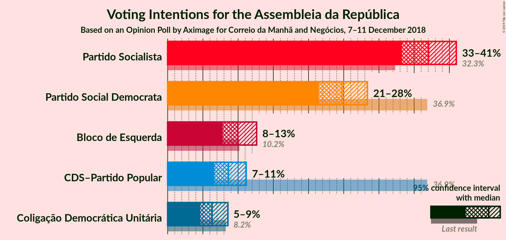
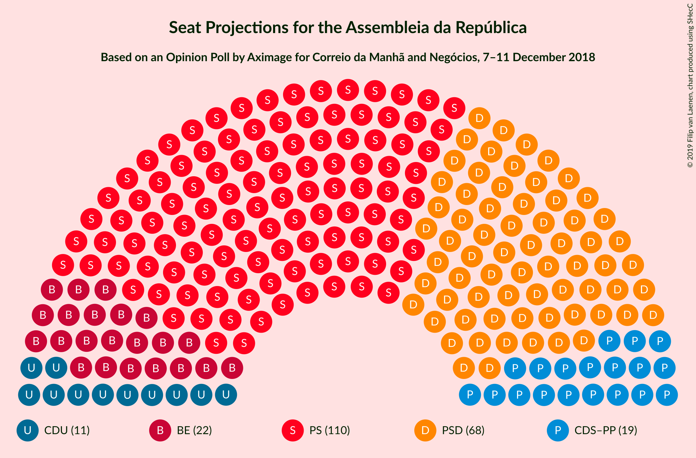
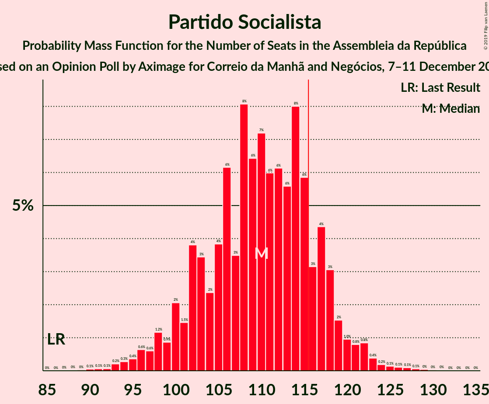
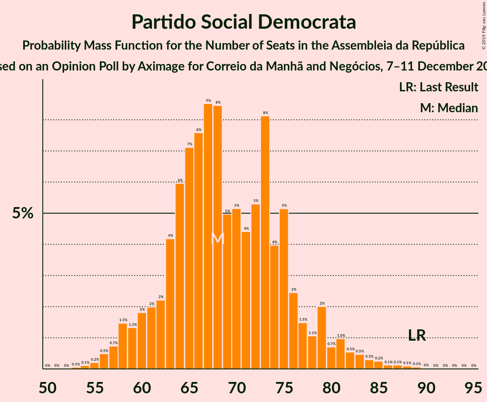
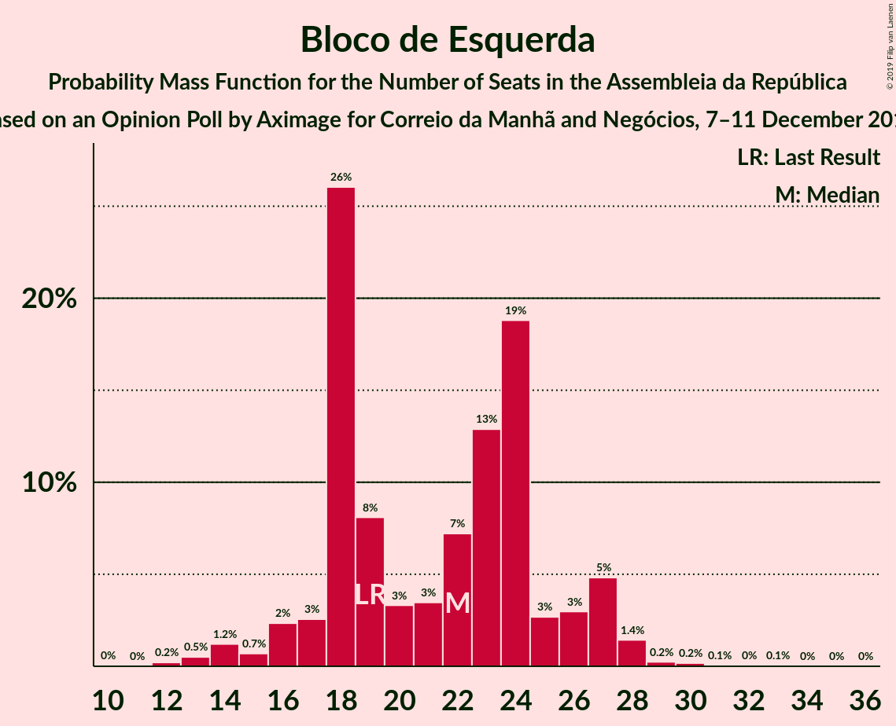
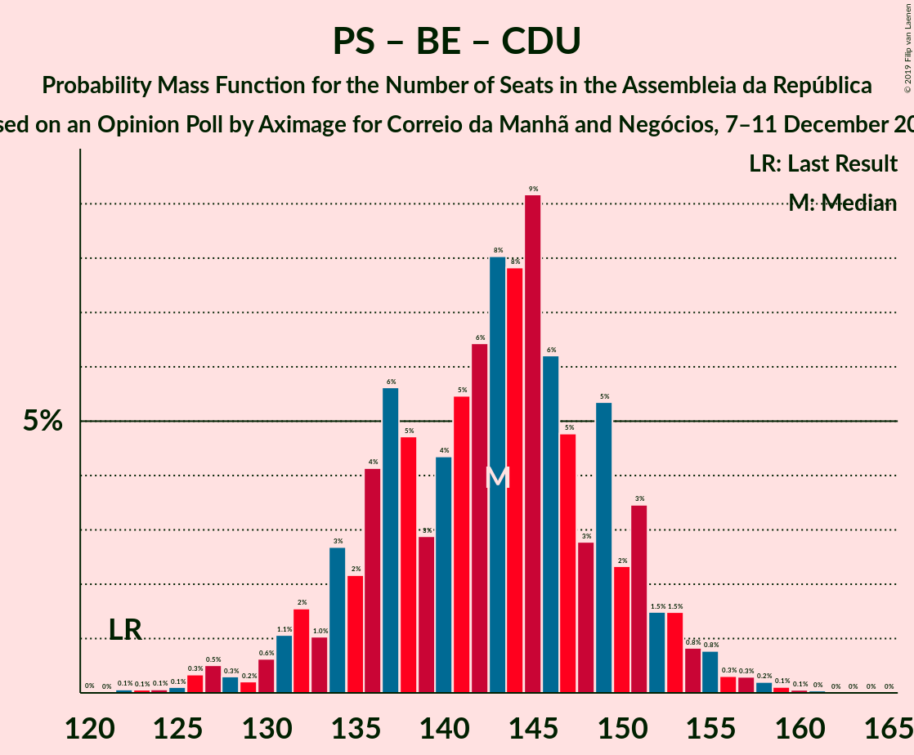
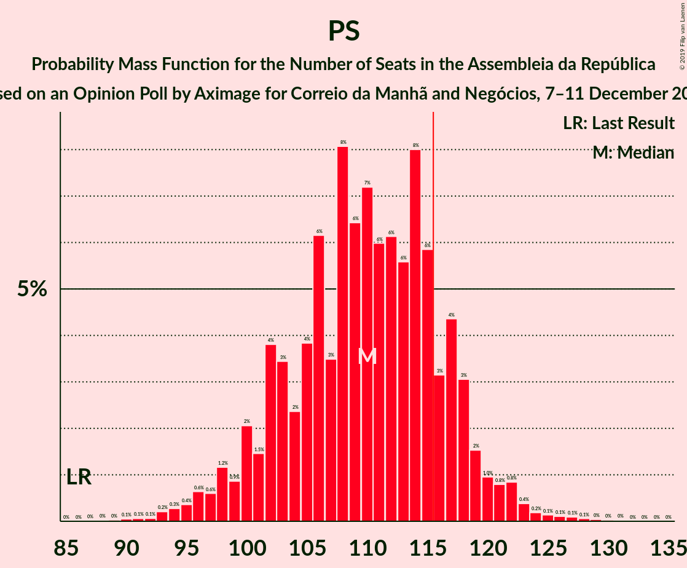
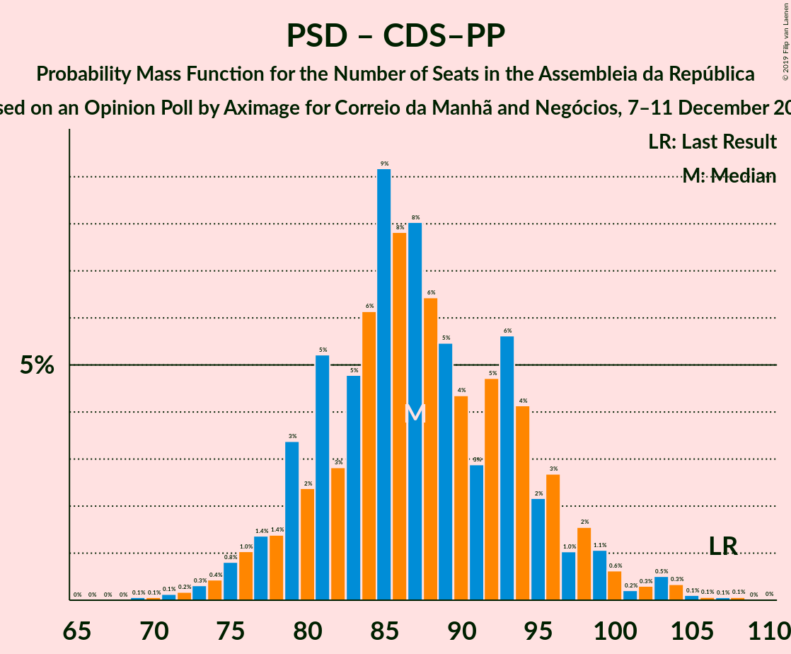

# Opinion Poll by Aximage for Correio da Manhã and Negócios, 7–11 December 2018

<a href="#voting-intentions">Voting Intentions</a> | <a href="#seats">Seats</a> | <a href="#coalitions">Coalitions</a> | <a href="#technical-information">Technical Information</a>

## Voting Intentions

### Confidence Intervals

| Party | Last Result | Poll Result | 80% Confidence Interval | 90% Confidence Interval | 95% Confidence Interval | 99% Confidence Interval |
|:-----:|:-----------:|:-----------:|:-----------------------:|:-----------------------:|:-----------------------:|:-----------------------:|
| Partido Socialista | 32.3% | 37.0% | 34.6–39.6% |33.9–40.3% |33.3–41.0% |32.1–42.2% |
| Partido Social Democrata | 36.9% | 24.8% | 22.6–27.1% |22.0–27.8% |21.5–28.4% |20.5–29.5% |
| Bloco de Esquerda | 10.2% | 10.0% | 8.6–11.7% |8.2–12.2% |7.8–12.6% |7.2–13.5% |
| CDS–Partido Popular | 36.9% | 8.6% | 7.3–10.3% |7.0–10.7% |6.6–11.2% |6.1–12.0% |
| Coligação Democrática Unitária | 8.2% | 6.3% | 5.2–7.8% |4.9–8.2% |4.6–8.6% |4.1–9.3% |

*Note:* The poll result column reflects the actual value used in the calculations. Published results may vary slightly, and in addition be rounded to fewer digits.

## Seats

### Confidence Intervals

| Party | Last Result | Median | 80% Confidence Interval | 90% Confidence Interval | 95% Confidence Interval | 99% Confidence Interval |
|:-----:|:-----------:|:------:|:-----------------------:|:-----------------------:|:-----------------------:|:-----------------------:|
| <a href="#partido-socialista">Partido Socialista</a> | 86 | 110 | 102–117 |100–119 |98–121 |94–125 |
| <a href="#partido-social-democrata">Partido Social Democrata</a> | 89 | 68 | 62–76 |60–79 |58–81 |56–85 |
| <a href="#bloco-de-esquerda">Bloco de Esquerda</a> | 19 | 22 | 18–25 |16–27 |15–27 |13–29 |
| <a href="#cds–partido-popular">CDS–Partido Popular</a> | 18 | 19 | 13–23 |11–25 |10–26 |10–29 |
| <a href="#coligação-democrática-unitária">Coligação Democrática Unitária</a> | 17 | 11 | 8–16 |7–17 |6–17 |5–20 |

### Partido Socialista

*For a full overview of the results for this party, see the [Partido Socialista](party-partidosocialista.html) page.*

| Number of Seats | Probability | Accumulated | Special Marks |
|:---------------:|:-----------:|:-----------:|:-------------:|
| 86 | 0% | 100% | Last Result |
| 87 | 0% | 100% |  |
| 88 | 0% | 100% |  |
| 89 | 0% | 100% |  |
| 90 | 0.1% | 99.9% |  |
| 91 | 0.1% | 99.9% |  |
| 92 | 0.1% | 99.8% |  |
| 93 | 0.2% | 99.7% |  |
| 94 | 0.3% | 99.5% |  |
| 95 | 0.4% | 99.3% |  |
| 96 | 0.6% | 98.9% |  |
| 97 | 0.6% | 98% |  |
| 98 | 1.2% | 98% |  |
| 99 | 0.9% | 96% |  |
| 100 | 2% | 96% |  |
| 101 | 1.5% | 94% |  |
| 102 | 4% | 92% |  |
| 103 | 3% | 88% |  |
| 104 | 2% | 85% |  |
| 105 | 4% | 82% |  |
| 106 | 6% | 79% |  |
| 107 | 3% | 73% |  |
| 108 | 8% | 69% |  |
| 109 | 6% | 61% |  |
| 110 | 7% | 55% | Median |
| 111 | 6% | 47% |  |
| 112 | 6% | 41% |  |
| 113 | 6% | 35% |  |
| 114 | 8% | 30% |  |
| 115 | 6% | 22% |  |
| 116 | 3% | 16% | Majority |
| 117 | 4% | 13% |  |
| 118 | 3% | 8% |  |
| 119 | 2% | 5% |  |
| 120 | 1.0% | 4% |  |
| 121 | 0.8% | 3% |  |
| 122 | 0.8% | 2% |  |
| 123 | 0.4% | 1.1% |  |
| 124 | 0.2% | 0.7% |  |
| 125 | 0.1% | 0.5% |  |
| 126 | 0.1% | 0.4% |  |
| 127 | 0.1% | 0.3% |  |
| 128 | 0.1% | 0.2% |  |
| 129 | 0% | 0.1% |  |
| 130 | 0% | 0.1% |  |
| 131 | 0% | 0% |  |

### Partido Social Democrata

*For a full overview of the results for this party, see the [Partido Social Democrata](party-partidosocialdemocrata.html) page.*

| Number of Seats | Probability | Accumulated | Special Marks |
|:---------------:|:-----------:|:-----------:|:-------------:|
| 53 | 0.1% | 100% |  |
| 54 | 0.1% | 99.9% |  |
| 55 | 0.2% | 99.8% |  |
| 56 | 0.5% | 99.6% |  |
| 57 | 0.7% | 99.1% |  |
| 58 | 1.5% | 98% |  |
| 59 | 1.3% | 97% |  |
| 60 | 2% | 96% |  |
| 61 | 2% | 94% |  |
| 62 | 2% | 92% |  |
| 63 | 4% | 90% |  |
| 64 | 6% | 85% |  |
| 65 | 7% | 79% |  |
| 66 | 8% | 72% |  |
| 67 | 9% | 65% |  |
| 68 | 8% | 56% | Median |
| 69 | 5% | 48% |  |
| 70 | 5% | 43% |  |
| 71 | 4% | 38% |  |
| 72 | 5% | 33% |  |
| 73 | 8% | 28% |  |
| 74 | 4% | 20% |  |
| 75 | 5% | 16% |  |
| 76 | 2% | 11% |  |
| 77 | 1.5% | 8% |  |
| 78 | 1.1% | 7% |  |
| 79 | 2% | 6% |  |
| 80 | 0.7% | 4% |  |
| 81 | 1.0% | 3% |  |
| 82 | 0.5% | 2% |  |
| 83 | 0.5% | 1.5% |  |
| 84 | 0.3% | 1.0% |  |
| 85 | 0.2% | 0.7% |  |
| 86 | 0.1% | 0.5% |  |
| 87 | 0.1% | 0.3% |  |
| 88 | 0.1% | 0.2% |  |
| 89 | 0.1% | 0.1% | Last Result |
| 90 | 0% | 0.1% |  |
| 91 | 0% | 0% |  |

### Bloco de Esquerda

*For a full overview of the results for this party, see the [Bloco de Esquerda](party-blocodeesquerda.html) page.*

| Number of Seats | Probability | Accumulated | Special Marks |
|:---------------:|:-----------:|:-----------:|:-------------:|
| 10 | 0% | 100% |  |
| 11 | 0% | 99.9% |  |
| 12 | 0.2% | 99.9% |  |
| 13 | 0.5% | 99.7% |  |
| 14 | 1.2% | 99.2% |  |
| 15 | 0.7% | 98% |  |
| 16 | 2% | 97% |  |
| 17 | 3% | 95% |  |
| 18 | 26% | 92% |  |
| 19 | 8% | 66% | Last Result |
| 20 | 3% | 58% |  |
| 21 | 3% | 55% |  |
| 22 | 7% | 51% | Median |
| 23 | 13% | 44% |  |
| 24 | 19% | 31% |  |
| 25 | 3% | 13% |  |
| 26 | 3% | 10% |  |
| 27 | 5% | 7% |  |
| 28 | 1.4% | 2% |  |
| 29 | 0.2% | 0.7% |  |
| 30 | 0.2% | 0.4% |  |
| 31 | 0.1% | 0.2% |  |
| 32 | 0% | 0.2% |  |
| 33 | 0.1% | 0.1% |  |
| 34 | 0% | 0.1% |  |
| 35 | 0% | 0.1% |  |
| 36 | 0% | 0% |  |

### CDS–Partido Popular

*For a full overview of the results for this party, see the [CDS–Partido Popular](party-cds–partidopopular.html) page.*

| Number of Seats | Probability | Accumulated | Special Marks |
|:---------------:|:-----------:|:-----------:|:-------------:|
| 7 | 0% | 100% |  |
| 8 | 0.1% | 99.9% |  |
| 9 | 0.3% | 99.9% |  |
| 10 | 2% | 99.5% |  |
| 11 | 3% | 97% |  |
| 12 | 3% | 94% |  |
| 13 | 5% | 91% |  |
| 14 | 6% | 87% |  |
| 15 | 3% | 80% |  |
| 16 | 4% | 78% |  |
| 17 | 7% | 74% |  |
| 18 | 11% | 67% | Last Result |
| 19 | 19% | 56% | Median |
| 20 | 11% | 37% |  |
| 21 | 10% | 26% |  |
| 22 | 3% | 16% |  |
| 23 | 5% | 13% |  |
| 24 | 3% | 8% |  |
| 25 | 2% | 5% |  |
| 26 | 0.5% | 3% |  |
| 27 | 0.3% | 2% |  |
| 28 | 1.1% | 2% |  |
| 29 | 0.7% | 1.1% |  |
| 30 | 0.4% | 0.4% |  |
| 31 | 0% | 0% |  |

### Coligação Democrática Unitária

*For a full overview of the results for this party, see the [Coligação Democrática Unitária](party-coligaçãodemocráticaunitária.html) page.*

| Number of Seats | Probability | Accumulated | Special Marks |
|:---------------:|:-----------:|:-----------:|:-------------:|
| 5 | 1.4% | 100% |  |
| 6 | 4% | 98.5% |  |
| 7 | 5% | 95% |  |
| 8 | 10% | 90% |  |
| 9 | 8% | 80% |  |
| 10 | 7% | 72% |  |
| 11 | 16% | 65% | Median |
| 12 | 11% | 49% |  |
| 13 | 10% | 38% |  |
| 14 | 11% | 28% |  |
| 15 | 6% | 17% |  |
| 16 | 2% | 12% |  |
| 17 | 8% | 9% | Last Result |
| 18 | 0.6% | 2% |  |
| 19 | 0.6% | 1.2% |  |
| 20 | 0.4% | 0.5% |  |
| 21 | 0.1% | 0.1% |  |
| 22 | 0% | 0% |  |

## Coalitions

### Confidence Intervals

| Coalition | Last Result | Median | Majority? | 80% Confidence Interval | 90% Confidence Interval | 95% Confidence Interval | 99% Confidence Interval |
|:---------:|:-----------:|:------:|:---------:|:-----------------------:|:-----------------------:|:-----------------------:|:-----------------------:|
| Partido Socialista – Bloco de Esquerda – Coligação Democrática Unitária | 122 | 143 | 100% | 135–150 | 133–152 | 131–154 | 126–157 |
| Partido Socialista – Bloco de Esquerda | 105 | 132 | 99.6% | 124–138 | 122–142 | 118–143 | 116–146 |
| Partido Socialista – Coligação Democrática Unitária | 103 | 122 | 83% | 114–129 | 111–130 | 108–132 | 104–136 |
| Partido Socialista | 86 | 110 | 16% | 102–117 | 100–119 | 98–121 | 94–125 |
| Partido Social Democrata – CDS–Partido Popular | 107 | 87 | 0% | 80–95 | 78–97 | 76–99 | 73–104 |

### Partido Socialista – Bloco de Esquerda – Coligação Democrática Unitária

| Number of Seats | Probability | Accumulated | Special Marks |
|:---------------:|:-----------:|:-----------:|:-------------:|
| 121 | 0% | 100% |  |
| 122 | 0.1% | 99.9% | Last Result |
| 123 | 0.1% | 99.9% |  |
| 124 | 0.1% | 99.8% |  |
| 125 | 0.1% | 99.8% |  |
| 126 | 0.3% | 99.6% |  |
| 127 | 0.5% | 99.3% |  |
| 128 | 0.3% | 98.8% |  |
| 129 | 0.2% | 98% |  |
| 130 | 0.6% | 98% |  |
| 131 | 1.1% | 98% |  |
| 132 | 2% | 97% |  |
| 133 | 1.0% | 95% |  |
| 134 | 3% | 94% |  |
| 135 | 2% | 91% |  |
| 136 | 4% | 89% |  |
| 137 | 6% | 85% |  |
| 138 | 5% | 79% |  |
| 139 | 3% | 75% |  |
| 140 | 4% | 72% |  |
| 141 | 5% | 67% |  |
| 142 | 6% | 62% |  |
| 143 | 8% | 56% | Median |
| 144 | 8% | 48% |  |
| 145 | 9% | 40% |  |
| 146 | 6% | 31% |  |
| 147 | 5% | 24% |  |
| 148 | 3% | 20% |  |
| 149 | 5% | 17% |  |
| 150 | 2% | 11% |  |
| 151 | 3% | 9% |  |
| 152 | 1.5% | 6% |  |
| 153 | 1.5% | 4% |  |
| 154 | 0.8% | 3% |  |
| 155 | 0.8% | 2% |  |
| 156 | 0.3% | 1.0% |  |
| 157 | 0.3% | 0.7% |  |
| 158 | 0.2% | 0.4% |  |
| 159 | 0.1% | 0.2% |  |
| 160 | 0.1% | 0.1% |  |
| 161 | 0% | 0.1% |  |
| 162 | 0% | 0% |  |

### Partido Socialista – Bloco de Esquerda

| Number of Seats | Probability | Accumulated | Special Marks |
|:---------------:|:-----------:|:-----------:|:-------------:|
| 105 | 0% | 100% | Last Result |
| 106 | 0% | 100% |  |
| 107 | 0% | 100% |  |
| 108 | 0% | 100% |  |
| 109 | 0% | 99.9% |  |
| 110 | 0% | 99.9% |  |
| 111 | 0% | 99.9% |  |
| 112 | 0% | 99.9% |  |
| 113 | 0% | 99.9% |  |
| 114 | 0.1% | 99.9% |  |
| 115 | 0.2% | 99.8% |  |
| 116 | 0.7% | 99.6% | Majority |
| 117 | 1.1% | 98.9% |  |
| 118 | 0.9% | 98% |  |
| 119 | 0.4% | 97% |  |
| 120 | 0.4% | 96% |  |
| 121 | 0.5% | 96% |  |
| 122 | 1.3% | 96% |  |
| 123 | 3% | 94% |  |
| 124 | 4% | 91% |  |
| 125 | 7% | 87% |  |
| 126 | 10% | 80% |  |
| 127 | 4% | 70% |  |
| 128 | 3% | 66% |  |
| 129 | 2% | 63% |  |
| 130 | 2% | 61% |  |
| 131 | 3% | 59% |  |
| 132 | 7% | 56% | Median |
| 133 | 9% | 49% |  |
| 134 | 7% | 40% |  |
| 135 | 13% | 33% |  |
| 136 | 5% | 20% |  |
| 137 | 4% | 15% |  |
| 138 | 2% | 10% |  |
| 139 | 0.8% | 8% |  |
| 140 | 0.8% | 8% |  |
| 141 | 2% | 7% |  |
| 142 | 1.1% | 5% |  |
| 143 | 2% | 4% |  |
| 144 | 1.1% | 2% |  |
| 145 | 0.5% | 1.0% |  |
| 146 | 0.2% | 0.5% |  |
| 147 | 0.1% | 0.3% |  |
| 148 | 0.1% | 0.2% |  |
| 149 | 0.1% | 0.1% |  |
| 150 | 0% | 0.1% |  |
| 151 | 0% | 0% |  |

### Partido Socialista – Coligação Democrática Unitária

| Number of Seats | Probability | Accumulated | Special Marks |
|:---------------:|:-----------:|:-----------:|:-------------:|
| 99 | 0% | 100% |  |
| 100 | 0% | 99.9% |  |
| 101 | 0.1% | 99.9% |  |
| 102 | 0.1% | 99.8% |  |
| 103 | 0.1% | 99.7% | Last Result |
| 104 | 0.1% | 99.6% |  |
| 105 | 0.3% | 99.5% |  |
| 106 | 0.3% | 99.2% |  |
| 107 | 0.3% | 98.9% |  |
| 108 | 1.1% | 98.6% |  |
| 109 | 0.6% | 97% |  |
| 110 | 1.2% | 97% |  |
| 111 | 2% | 96% |  |
| 112 | 2% | 94% |  |
| 113 | 2% | 92% |  |
| 114 | 4% | 90% |  |
| 115 | 4% | 87% |  |
| 116 | 3% | 83% | Majority |
| 117 | 3% | 80% |  |
| 118 | 5% | 77% |  |
| 119 | 7% | 73% |  |
| 120 | 6% | 66% |  |
| 121 | 8% | 60% | Median |
| 122 | 7% | 52% |  |
| 123 | 7% | 45% |  |
| 124 | 5% | 39% |  |
| 125 | 8% | 34% |  |
| 126 | 8% | 26% |  |
| 127 | 6% | 19% |  |
| 128 | 2% | 13% |  |
| 129 | 3% | 11% |  |
| 130 | 2% | 7% |  |
| 131 | 2% | 5% |  |
| 132 | 1.0% | 3% |  |
| 133 | 0.6% | 2% |  |
| 134 | 0.5% | 1.4% |  |
| 135 | 0.3% | 1.0% |  |
| 136 | 0.3% | 0.7% |  |
| 137 | 0.1% | 0.4% |  |
| 138 | 0.1% | 0.2% |  |
| 139 | 0.1% | 0.1% |  |
| 140 | 0% | 0.1% |  |
| 141 | 0% | 0% |  |

### Partido Socialista

| Number of Seats | Probability | Accumulated | Special Marks |
|:---------------:|:-----------:|:-----------:|:-------------:|
| 86 | 0% | 100% | Last Result |
| 87 | 0% | 100% |  |
| 88 | 0% | 100% |  |
| 89 | 0% | 100% |  |
| 90 | 0.1% | 99.9% |  |
| 91 | 0.1% | 99.9% |  |
| 92 | 0.1% | 99.8% |  |
| 93 | 0.2% | 99.7% |  |
| 94 | 0.3% | 99.5% |  |
| 95 | 0.4% | 99.3% |  |
| 96 | 0.6% | 98.9% |  |
| 97 | 0.6% | 98% |  |
| 98 | 1.2% | 98% |  |
| 99 | 0.9% | 96% |  |
| 100 | 2% | 96% |  |
| 101 | 1.5% | 94% |  |
| 102 | 4% | 92% |  |
| 103 | 3% | 88% |  |
| 104 | 2% | 85% |  |
| 105 | 4% | 82% |  |
| 106 | 6% | 79% |  |
| 107 | 3% | 73% |  |
| 108 | 8% | 69% |  |
| 109 | 6% | 61% |  |
| 110 | 7% | 55% | Median |
| 111 | 6% | 47% |  |
| 112 | 6% | 41% |  |
| 113 | 6% | 35% |  |
| 114 | 8% | 30% |  |
| 115 | 6% | 22% |  |
| 116 | 3% | 16% | Majority |
| 117 | 4% | 13% |  |
| 118 | 3% | 8% |  |
| 119 | 2% | 5% |  |
| 120 | 1.0% | 4% |  |
| 121 | 0.8% | 3% |  |
| 122 | 0.8% | 2% |  |
| 123 | 0.4% | 1.1% |  |
| 124 | 0.2% | 0.7% |  |
| 125 | 0.1% | 0.5% |  |
| 126 | 0.1% | 0.4% |  |
| 127 | 0.1% | 0.3% |  |
| 128 | 0.1% | 0.2% |  |
| 129 | 0% | 0.1% |  |
| 130 | 0% | 0.1% |  |
| 131 | 0% | 0% |  |

### Partido Social Democrata – CDS–Partido Popular

| Number of Seats | Probability | Accumulated | Special Marks |
|:---------------:|:-----------:|:-----------:|:-------------:|
| 69 | 0.1% | 100% |  |
| 70 | 0.1% | 99.9% |  |
| 71 | 0.1% | 99.8% |  |
| 72 | 0.2% | 99.7% |  |
| 73 | 0.3% | 99.5% |  |
| 74 | 0.4% | 99.2% |  |
| 75 | 0.8% | 98.8% |  |
| 76 | 1.0% | 98% |  |
| 77 | 1.4% | 97% |  |
| 78 | 1.4% | 96% |  |
| 79 | 3% | 94% |  |
| 80 | 2% | 91% |  |
| 81 | 5% | 88% |  |
| 82 | 3% | 83% |  |
| 83 | 5% | 80% |  |
| 84 | 6% | 76% |  |
| 85 | 9% | 69% |  |
| 86 | 8% | 60% |  |
| 87 | 8% | 52% | Median |
| 88 | 6% | 44% |  |
| 89 | 5% | 38% |  |
| 90 | 4% | 33% |  |
| 91 | 3% | 28% |  |
| 92 | 5% | 25% |  |
| 93 | 6% | 21% |  |
| 94 | 4% | 15% |  |
| 95 | 2% | 11% |  |
| 96 | 3% | 9% |  |
| 97 | 1.0% | 6% |  |
| 98 | 2% | 5% |  |
| 99 | 1.1% | 3% |  |
| 100 | 0.6% | 2% |  |
| 101 | 0.2% | 2% |  |
| 102 | 0.3% | 2% |  |
| 103 | 0.5% | 1.2% |  |
| 104 | 0.3% | 0.7% |  |
| 105 | 0.1% | 0.4% |  |
| 106 | 0.1% | 0.2% |  |
| 107 | 0.1% | 0.2% | Last Result |
| 108 | 0.1% | 0.1% |  |
| 109 | 0% | 0.1% |  |
| 110 | 0% | 0% |  |

## Technical Information

### Opinion Poll

+ **Polling firm:** Aximage
+ **Commissioner(s):** Correio da Manhã and Negócios
+ **Fieldwork period:** 7–11 December 2018

### Calculations

+ **Sample size:** 602
+ **Simulations done:** 131,072
+ **Error estimate:** 0.99%

