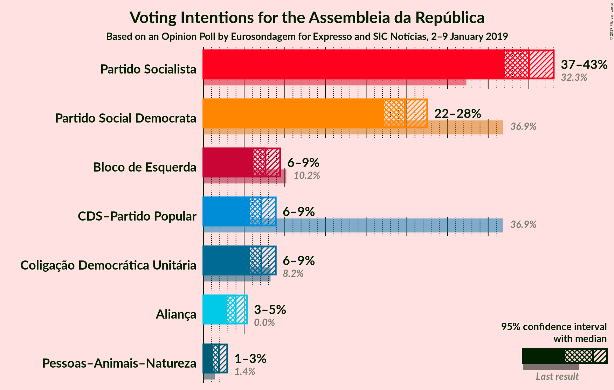
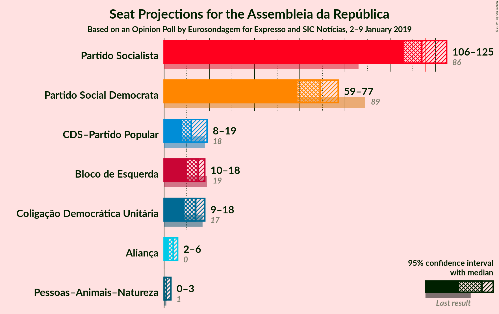
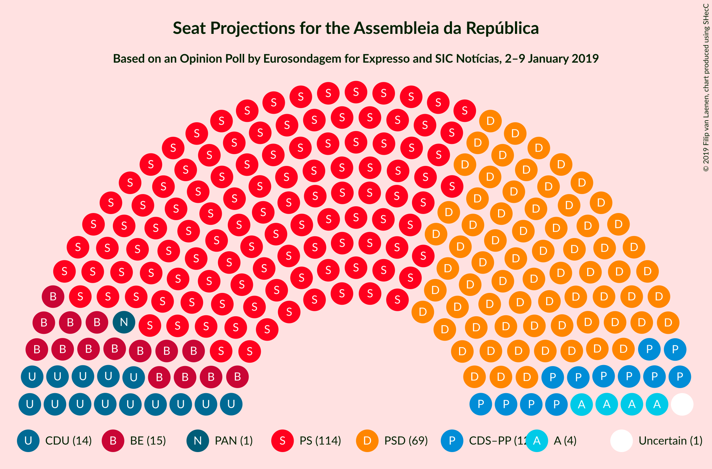
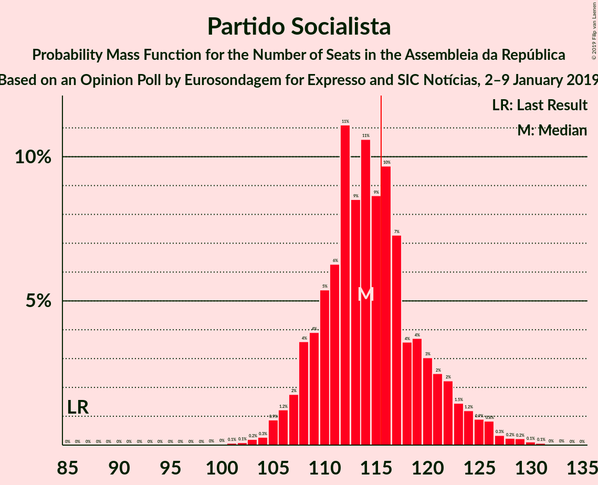
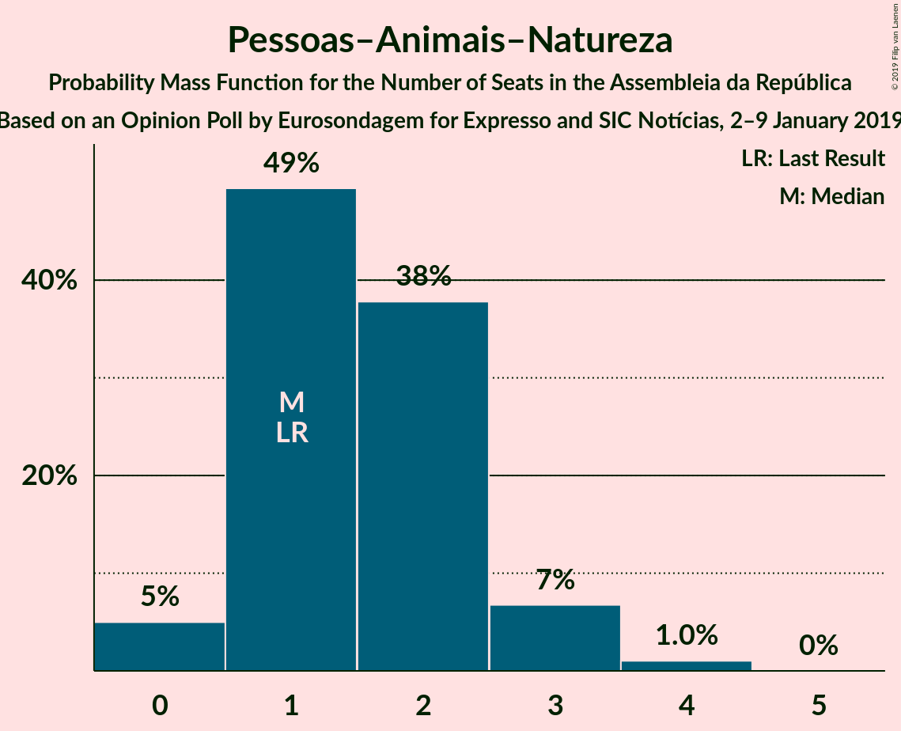
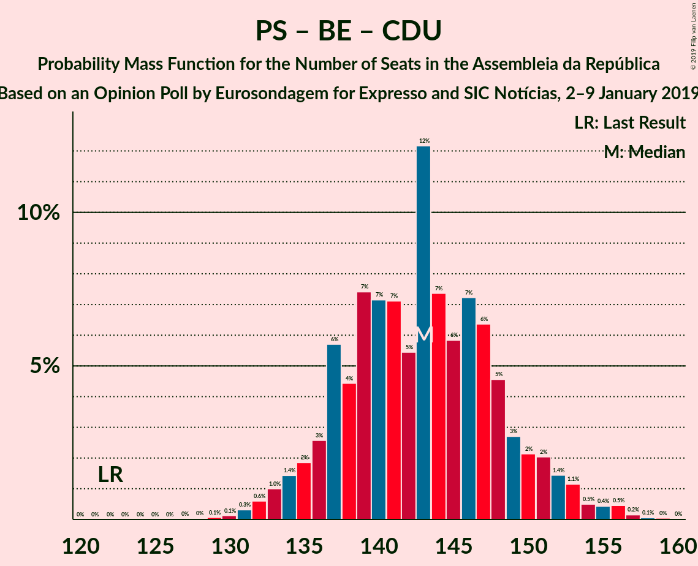

# Opinion Poll by Eurosondagem for Expresso and SIC Notícias, 2–9 January 2019

<a href="#voting-intentions">Voting Intentions</a> | <a href="#seats">Seats</a> | <a href="#coalitions">Coalitions</a> | <a href="#technical-information">Technical Information</a>

## Voting Intentions

### Confidence Intervals

| Party | Last Result | Poll Result | 80% Confidence Interval | 90% Confidence Interval | 95% Confidence Interval | 99% Confidence Interval |
|:-----:|:-----------:|:-----------:|:-----------------------:|:-----------------------:|:-----------------------:|:-----------------------:|
| Partido Socialista | 32.3% | 40.0% | 38.0–42.0% |37.5–42.6% |37.0–43.1% |36.1–44.0% |
| Partido Social Democrata | 36.9% | 24.8% | 23.1–26.6% |22.6–27.1% |22.2–27.5% |21.4–28.4% |
| Bloco de Esquerda | 10.2% | 7.6% | 6.6–8.8% |6.4–9.1% |6.1–9.4% |5.7–10.0% |
| CDS–Partido Popular | 36.9% | 7.1% | 6.2–8.3% |5.9–8.6% |5.7–8.9% |5.3–9.5% |
| Coligação Democrática Unitária | 8.2% | 7.1% | 6.2–8.3% |5.9–8.6% |5.7–8.9% |5.3–9.5% |
| Aliança | 0.0% | 4.0% | 3.3–4.9% |3.1–5.1% |2.9–5.3% |2.6–5.8% |
| Pessoas–Animais–Natureza | 1.4% | 1.9% | 1.4–2.6% |1.3–2.8% |1.2–2.9% |1.0–3.3% |

*Note:* The poll result column reflects the actual value used in the calculations. Published results may vary slightly, and in addition be rounded to fewer digits.

## Seats

### Confidence Intervals

| Party | Last Result | Median | 80% Confidence Interval | 90% Confidence Interval | 95% Confidence Interval | 99% Confidence Interval |
|:-----:|:-----------:|:------:|:-----------------------:|:-----------------------:|:-----------------------:|:-----------------------:|
| <a href="#partido-socialista">Partido Socialista</a> | 86 | 114 | 109–121 |108–123 |106–125 |104–128 |
| <a href="#partido-social-democrata">Partido Social Democrata</a> | 89 | 69 | 63–75 |61–76 |59–77 |57–79 |
| <a href="#bloco-de-esquerda">Bloco de Esquerda</a> | 19 | 15 | 11–18 |10–18 |10–18 |9–20 |
| <a href="#cds–partido-popular">CDS–Partido Popular</a> | 18 | 12 | 9–18 |8–18 |8–19 |7–19 |
| <a href="#coligação-democrática-unitária">Coligação Democrática Unitária</a> | 17 | 14 | 10–17 |9–17 |9–18 |7–20 |
| <a href="#aliança">Aliança</a> | 0 | 4 | 2–6 |2–6 |2–6 |2–7 |
| <a href="#pessoas–animais–natureza">Pessoas–Animais–Natureza</a> | 1 | 1 | 1–2 |1–3 |0–3 |0–4 |

### Partido Socialista

*For a full overview of the results for this party, see the [Partido Socialista](party-partidosocialista.html) page.*

| Number of Seats | Probability | Accumulated | Special Marks |
|:---------------:|:-----------:|:-----------:|:-------------:|
| 86 | 0% | 100% | Last Result |
| 87 | 0% | 100% |  |
| 88 | 0% | 100% |  |
| 89 | 0% | 100% |  |
| 90 | 0% | 100% |  |
| 91 | 0% | 100% |  |
| 92 | 0% | 100% |  |
| 93 | 0% | 100% |  |
| 94 | 0% | 100% |  |
| 95 | 0% | 100% |  |
| 96 | 0% | 100% |  |
| 97 | 0% | 100% |  |
| 98 | 0% | 100% |  |
| 99 | 0% | 100% |  |
| 100 | 0% | 100% |  |
| 101 | 0.1% | 99.9% |  |
| 102 | 0.1% | 99.9% |  |
| 103 | 0.2% | 99.8% |  |
| 104 | 0.3% | 99.6% |  |
| 105 | 0.9% | 99.3% |  |
| 106 | 1.2% | 98% |  |
| 107 | 2% | 97% |  |
| 108 | 4% | 95% |  |
| 109 | 4% | 92% |  |
| 110 | 5% | 88% |  |
| 111 | 6% | 83% |  |
| 112 | 11% | 76% |  |
| 113 | 9% | 65% |  |
| 114 | 11% | 57% | Median |
| 115 | 9% | 46% |  |
| 116 | 10% | 37% | Majority |
| 117 | 7% | 28% |  |
| 118 | 4% | 20% |  |
| 119 | 4% | 17% |  |
| 120 | 3% | 13% |  |
| 121 | 2% | 10% |  |
| 122 | 2% | 8% |  |
| 123 | 1.5% | 5% |  |
| 124 | 1.2% | 4% |  |
| 125 | 0.9% | 3% |  |
| 126 | 0.8% | 2% |  |
| 127 | 0.3% | 1.0% |  |
| 128 | 0.2% | 0.7% |  |
| 129 | 0.2% | 0.5% |  |
| 130 | 0.1% | 0.2% |  |
| 131 | 0.1% | 0.1% |  |
| 132 | 0% | 0.1% |  |
| 133 | 0% | 0% |  |

### Partido Social Democrata

*For a full overview of the results for this party, see the [Partido Social Democrata](party-partidosocialdemocrata.html) page.*

| Number of Seats | Probability | Accumulated | Special Marks |
|:---------------:|:-----------:|:-----------:|:-------------:|
| 54 | 0.1% | 100% |  |
| 55 | 0.1% | 99.9% |  |
| 56 | 0.2% | 99.8% |  |
| 57 | 0.7% | 99.6% |  |
| 58 | 0.7% | 98.9% |  |
| 59 | 1.0% | 98% |  |
| 60 | 1.3% | 97% |  |
| 61 | 2% | 96% |  |
| 62 | 3% | 94% |  |
| 63 | 2% | 91% |  |
| 64 | 4% | 89% |  |
| 65 | 4% | 85% |  |
| 66 | 5% | 80% |  |
| 67 | 12% | 75% |  |
| 68 | 7% | 63% |  |
| 69 | 8% | 56% | Median |
| 70 | 10% | 48% |  |
| 71 | 9% | 38% |  |
| 72 | 6% | 29% |  |
| 73 | 8% | 23% |  |
| 74 | 5% | 15% |  |
| 75 | 4% | 10% |  |
| 76 | 3% | 6% |  |
| 77 | 2% | 3% |  |
| 78 | 0.8% | 2% |  |
| 79 | 0.4% | 0.8% |  |
| 80 | 0.2% | 0.4% |  |
| 81 | 0.1% | 0.2% |  |
| 82 | 0.1% | 0.1% |  |
| 83 | 0% | 0.1% |  |
| 84 | 0% | 0% |  |
| 85 | 0% | 0% |  |
| 86 | 0% | 0% |  |
| 87 | 0% | 0% |  |
| 88 | 0% | 0% |  |
| 89 | 0% | 0% | Last Result |

### Bloco de Esquerda

*For a full overview of the results for this party, see the [Bloco de Esquerda](party-blocodeesquerda.html) page.*

| Number of Seats | Probability | Accumulated | Special Marks |
|:---------------:|:-----------:|:-----------:|:-------------:|
| 8 | 0% | 100% |  |
| 9 | 2% | 99.9% |  |
| 10 | 7% | 98% |  |
| 11 | 6% | 91% |  |
| 12 | 5% | 85% |  |
| 13 | 12% | 80% |  |
| 14 | 12% | 68% |  |
| 15 | 14% | 56% | Median |
| 16 | 10% | 42% |  |
| 17 | 19% | 32% |  |
| 18 | 11% | 13% |  |
| 19 | 0.5% | 1.2% | Last Result |
| 20 | 0.3% | 0.7% |  |
| 21 | 0.1% | 0.3% |  |
| 22 | 0.1% | 0.2% |  |
| 23 | 0.1% | 0.1% |  |
| 24 | 0.1% | 0.1% |  |
| 25 | 0% | 0% |  |

### CDS–Partido Popular

*For a full overview of the results for this party, see the [CDS–Partido Popular](party-cds–partidopopular.html) page.*

| Number of Seats | Probability | Accumulated | Special Marks |
|:---------------:|:-----------:|:-----------:|:-------------:|
| 6 | 0.2% | 100% |  |
| 7 | 0.7% | 99.8% |  |
| 8 | 6% | 99.1% |  |
| 9 | 5% | 93% |  |
| 10 | 24% | 88% |  |
| 11 | 9% | 64% |  |
| 12 | 9% | 55% | Median |
| 13 | 11% | 45% |  |
| 14 | 14% | 34% |  |
| 15 | 5% | 21% |  |
| 16 | 3% | 16% |  |
| 17 | 3% | 13% |  |
| 18 | 6% | 10% | Last Result |
| 19 | 4% | 4% |  |
| 20 | 0.3% | 0.5% |  |
| 21 | 0.1% | 0.1% |  |
| 22 | 0% | 0.1% |  |
| 23 | 0% | 0% |  |

### Coligação Democrática Unitária

*For a full overview of the results for this party, see the [Coligação Democrática Unitária](party-coligaçãodemocráticaunitária.html) page.*

| Number of Seats | Probability | Accumulated | Special Marks |
|:---------------:|:-----------:|:-----------:|:-------------:|
| 6 | 0.4% | 100% |  |
| 7 | 0.4% | 99.6% |  |
| 8 | 0.7% | 99.2% |  |
| 9 | 6% | 98% |  |
| 10 | 4% | 93% |  |
| 11 | 8% | 89% |  |
| 12 | 8% | 81% |  |
| 13 | 7% | 73% |  |
| 14 | 37% | 66% | Median |
| 15 | 7% | 29% |  |
| 16 | 7% | 22% |  |
| 17 | 11% | 15% | Last Result |
| 18 | 3% | 4% |  |
| 19 | 1.1% | 2% |  |
| 20 | 0.4% | 0.6% |  |
| 21 | 0.2% | 0.2% |  |
| 22 | 0% | 0% |  |

### Aliança

*For a full overview of the results for this party, see the [Aliança](party-aliança.html) page.*

| Number of Seats | Probability | Accumulated | Special Marks |
|:---------------:|:-----------:|:-----------:|:-------------:|
| 0 | 0% | 100% | Last Result |
| 1 | 0% | 100% |  |
| 2 | 23% | 100% |  |
| 3 | 10% | 77% |  |
| 4 | 23% | 67% | Median |
| 5 | 11% | 44% |  |
| 6 | 31% | 33% |  |
| 7 | 2% | 2% |  |
| 8 | 0.2% | 0.3% |  |
| 9 | 0.1% | 0.1% |  |
| 10 | 0% | 0% |  |

### Pessoas–Animais–Natureza

*For a full overview of the results for this party, see the [Pessoas–Animais–Natureza](party-pessoas–animais–natureza.html) page.*

| Number of Seats | Probability | Accumulated | Special Marks |
|:---------------:|:-----------:|:-----------:|:-------------:|
| 0 | 5% | 100% |  |
| 1 | 49% | 95% | Last Result, Median |
| 2 | 38% | 46% |  |
| 3 | 7% | 8% |  |
| 4 | 1.0% | 1.1% |  |
| 5 | 0% | 0% |  |

## Coalitions

### Confidence Intervals

| Coalition | Last Result | Median | Majority? | 80% Confidence Interval | 90% Confidence Interval | 95% Confidence Interval | 99% Confidence Interval |
|:---------:|:-----------:|:------:|:---------:|:-----------------------:|:-----------------------:|:-----------------------:|:-----------------------:|
| Partido Socialista – Bloco de Esquerda – Coligação Democrática Unitária | 122 | 143 | 100% | 137–149 | 135–151 | 134–153 | 131–156 |
| Partido Socialista – Bloco de Esquerda | 105 | 129 | 99.9% | 123–135 | 122–138 | 121–139 | 118–143 |
| Partido Socialista – Coligação Democrática Unitária | 103 | 128 | 99.8% | 122–134 | 121–136 | 119–138 | 117–141 |
| Partido Socialista | 86 | 114 | 37% | 109–121 | 108–123 | 106–125 | 104–128 |
| Partido Social Democrata – CDS–Partido Popular | 107 | 82 | 0% | 75–87 | 73–89 | 71–90 | 68–93 |

### Partido Socialista – Bloco de Esquerda – Coligação Democrática Unitária

| Number of Seats | Probability | Accumulated | Special Marks |
|:---------------:|:-----------:|:-----------:|:-------------:|
| 122 | 0% | 100% | Last Result |
| 123 | 0% | 100% |  |
| 124 | 0% | 100% |  |
| 125 | 0% | 100% |  |
| 126 | 0% | 100% |  |
| 127 | 0% | 100% |  |
| 128 | 0% | 100% |  |
| 129 | 0.1% | 99.9% |  |
| 130 | 0.1% | 99.9% |  |
| 131 | 0.3% | 99.7% |  |
| 132 | 0.6% | 99.4% |  |
| 133 | 1.0% | 98.8% |  |
| 134 | 1.4% | 98% |  |
| 135 | 2% | 96% |  |
| 136 | 3% | 95% |  |
| 137 | 6% | 92% |  |
| 138 | 4% | 86% |  |
| 139 | 7% | 82% |  |
| 140 | 7% | 74% |  |
| 141 | 7% | 67% |  |
| 142 | 5% | 60% |  |
| 143 | 12% | 55% | Median |
| 144 | 7% | 43% |  |
| 145 | 6% | 35% |  |
| 146 | 7% | 29% |  |
| 147 | 6% | 22% |  |
| 148 | 5% | 16% |  |
| 149 | 3% | 11% |  |
| 150 | 2% | 8% |  |
| 151 | 2% | 6% |  |
| 152 | 1.4% | 4% |  |
| 153 | 1.1% | 3% |  |
| 154 | 0.5% | 2% |  |
| 155 | 0.4% | 1.2% |  |
| 156 | 0.5% | 0.7% |  |
| 157 | 0.2% | 0.3% |  |
| 158 | 0.1% | 0.1% |  |
| 159 | 0% | 0.1% |  |
| 160 | 0% | 0% |  |

### Partido Socialista – Bloco de Esquerda

| Number of Seats | Probability | Accumulated | Special Marks |
|:---------------:|:-----------:|:-----------:|:-------------:|
| 105 | 0% | 100% | Last Result |
| 106 | 0% | 100% |  |
| 107 | 0% | 100% |  |
| 108 | 0% | 100% |  |
| 109 | 0% | 100% |  |
| 110 | 0% | 100% |  |
| 111 | 0% | 100% |  |
| 112 | 0% | 100% |  |
| 113 | 0% | 100% |  |
| 114 | 0% | 100% |  |
| 115 | 0% | 99.9% |  |
| 116 | 0.1% | 99.9% | Majority |
| 117 | 0.2% | 99.8% |  |
| 118 | 0.3% | 99.6% |  |
| 119 | 0.5% | 99.2% |  |
| 120 | 1.2% | 98.7% |  |
| 121 | 2% | 98% |  |
| 122 | 3% | 96% |  |
| 123 | 4% | 93% |  |
| 124 | 6% | 89% |  |
| 125 | 8% | 83% |  |
| 126 | 7% | 76% |  |
| 127 | 7% | 69% |  |
| 128 | 7% | 62% |  |
| 129 | 10% | 55% | Median |
| 130 | 7% | 44% |  |
| 131 | 8% | 38% |  |
| 132 | 7% | 30% |  |
| 133 | 6% | 23% |  |
| 134 | 5% | 17% |  |
| 135 | 3% | 12% |  |
| 136 | 2% | 9% |  |
| 137 | 2% | 7% |  |
| 138 | 1.4% | 5% |  |
| 139 | 1.2% | 4% |  |
| 140 | 0.7% | 2% |  |
| 141 | 0.8% | 2% |  |
| 142 | 0.5% | 1.0% |  |
| 143 | 0.2% | 0.5% |  |
| 144 | 0.1% | 0.4% |  |
| 145 | 0.1% | 0.2% |  |
| 146 | 0% | 0.1% |  |
| 147 | 0% | 0.1% |  |
| 148 | 0% | 0% |  |

### Partido Socialista – Coligação Democrática Unitária

| Number of Seats | Probability | Accumulated | Special Marks |
|:---------------:|:-----------:|:-----------:|:-------------:|
| 103 | 0% | 100% | Last Result |
| 104 | 0% | 100% |  |
| 105 | 0% | 100% |  |
| 106 | 0% | 100% |  |
| 107 | 0% | 100% |  |
| 108 | 0% | 100% |  |
| 109 | 0% | 100% |  |
| 110 | 0% | 100% |  |
| 111 | 0% | 100% |  |
| 112 | 0% | 100% |  |
| 113 | 0% | 100% |  |
| 114 | 0% | 100% |  |
| 115 | 0.1% | 99.9% |  |
| 116 | 0.2% | 99.8% | Majority |
| 117 | 0.5% | 99.6% |  |
| 118 | 0.6% | 99.0% |  |
| 119 | 1.3% | 98% |  |
| 120 | 2% | 97% |  |
| 121 | 2% | 95% |  |
| 122 | 4% | 93% |  |
| 123 | 5% | 89% |  |
| 124 | 6% | 84% |  |
| 125 | 6% | 79% |  |
| 126 | 10% | 73% |  |
| 127 | 9% | 63% |  |
| 128 | 8% | 55% | Median |
| 129 | 8% | 47% |  |
| 130 | 11% | 39% |  |
| 131 | 8% | 29% |  |
| 132 | 5% | 21% |  |
| 133 | 4% | 16% |  |
| 134 | 3% | 12% |  |
| 135 | 3% | 9% |  |
| 136 | 2% | 7% |  |
| 137 | 1.2% | 4% |  |
| 138 | 1.4% | 3% |  |
| 139 | 0.5% | 2% |  |
| 140 | 0.6% | 1.3% |  |
| 141 | 0.3% | 0.7% |  |
| 142 | 0.2% | 0.4% |  |
| 143 | 0.1% | 0.2% |  |
| 144 | 0.1% | 0.1% |  |
| 145 | 0% | 0% |  |

### Partido Socialista

| Number of Seats | Probability | Accumulated | Special Marks |
|:---------------:|:-----------:|:-----------:|:-------------:|
| 86 | 0% | 100% | Last Result |
| 87 | 0% | 100% |  |
| 88 | 0% | 100% |  |
| 89 | 0% | 100% |  |
| 90 | 0% | 100% |  |
| 91 | 0% | 100% |  |
| 92 | 0% | 100% |  |
| 93 | 0% | 100% |  |
| 94 | 0% | 100% |  |
| 95 | 0% | 100% |  |
| 96 | 0% | 100% |  |
| 97 | 0% | 100% |  |
| 98 | 0% | 100% |  |
| 99 | 0% | 100% |  |
| 100 | 0% | 100% |  |
| 101 | 0.1% | 99.9% |  |
| 102 | 0.1% | 99.9% |  |
| 103 | 0.2% | 99.8% |  |
| 104 | 0.3% | 99.6% |  |
| 105 | 0.9% | 99.3% |  |
| 106 | 1.2% | 98% |  |
| 107 | 2% | 97% |  |
| 108 | 4% | 95% |  |
| 109 | 4% | 92% |  |
| 110 | 5% | 88% |  |
| 111 | 6% | 83% |  |
| 112 | 11% | 76% |  |
| 113 | 9% | 65% |  |
| 114 | 11% | 57% | Median |
| 115 | 9% | 46% |  |
| 116 | 10% | 37% | Majority |
| 117 | 7% | 28% |  |
| 118 | 4% | 20% |  |
| 119 | 4% | 17% |  |
| 120 | 3% | 13% |  |
| 121 | 2% | 10% |  |
| 122 | 2% | 8% |  |
| 123 | 1.5% | 5% |  |
| 124 | 1.2% | 4% |  |
| 125 | 0.9% | 3% |  |
| 126 | 0.8% | 2% |  |
| 127 | 0.3% | 1.0% |  |
| 128 | 0.2% | 0.7% |  |
| 129 | 0.2% | 0.5% |  |
| 130 | 0.1% | 0.2% |  |
| 131 | 0.1% | 0.1% |  |
| 132 | 0% | 0.1% |  |
| 133 | 0% | 0% |  |

### Partido Social Democrata – CDS–Partido Popular

| Number of Seats | Probability | Accumulated | Special Marks |
|:---------------:|:-----------:|:-----------:|:-------------:|
| 66 | 0.1% | 100% |  |
| 67 | 0.1% | 99.9% |  |
| 68 | 0.4% | 99.8% |  |
| 69 | 0.4% | 99.4% |  |
| 70 | 0.5% | 99.0% |  |
| 71 | 1.2% | 98.6% |  |
| 72 | 1.2% | 97% |  |
| 73 | 2% | 96% |  |
| 74 | 2% | 94% |  |
| 75 | 3% | 92% |  |
| 76 | 3% | 89% |  |
| 77 | 7% | 85% |  |
| 78 | 4% | 78% |  |
| 79 | 7% | 74% |  |
| 80 | 8% | 67% |  |
| 81 | 8% | 59% | Median |
| 82 | 8% | 51% |  |
| 83 | 9% | 43% |  |
| 84 | 8% | 34% |  |
| 85 | 6% | 26% |  |
| 86 | 4% | 19% |  |
| 87 | 6% | 16% |  |
| 88 | 4% | 10% |  |
| 89 | 3% | 6% |  |
| 90 | 1.3% | 4% |  |
| 91 | 0.7% | 2% |  |
| 92 | 0.7% | 2% |  |
| 93 | 0.6% | 1.0% |  |
| 94 | 0.2% | 0.3% |  |
| 95 | 0.1% | 0.1% |  |
| 96 | 0% | 0.1% |  |
| 97 | 0% | 0% |  |
| 98 | 0% | 0% |  |
| 99 | 0% | 0% |  |
| 100 | 0% | 0% |  |
| 101 | 0% | 0% |  |
| 102 | 0% | 0% |  |
| 103 | 0% | 0% |  |
| 104 | 0% | 0% |  |
| 105 | 0% | 0% |  |
| 106 | 0% | 0% |  |
| 107 | 0% | 0% | Last Result |

## Technical Information

### Opinion Poll

+ **Polling firm:** Eurosondagem
+ **Commissioner(s):** Expresso and SIC Notícias
+ **Fieldwork period:** 2–9 January 2019

### Calculations

+ **Sample size:** 1010
+ **Simulations done:** 1,048,576
+ **Error estimate:** 0.96%

