# Opinion Poll by GfK Metris for Expresso and SIC Notícias, 9–21 February 2019

<a href="#voting-intentions">Voting Intentions</a> | <a href="#seats">Seats</a> | <a href="#coalitions">Coalitions</a> | <a href="#technical-information">Technical Information</a>

## Voting Intentions

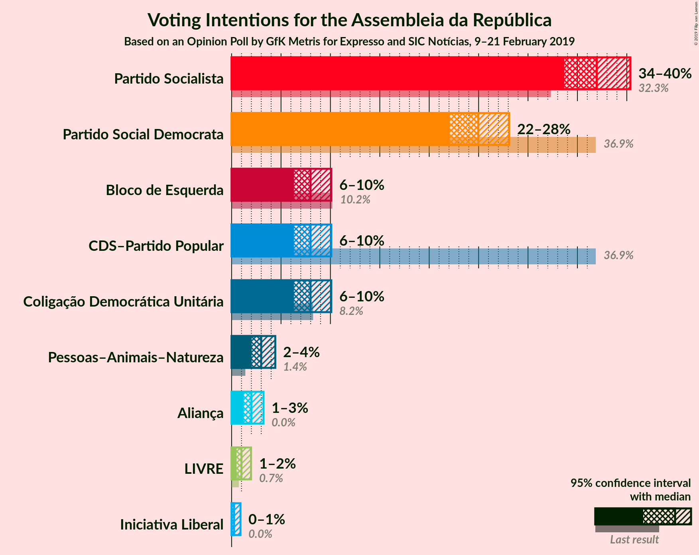

### Confidence Intervals

| Party | Last Result | Poll Result | 80% Confidence Interval | 90% Confidence Interval | 95% Confidence Interval | 99% Confidence Interval |
|:-----:|:-----------:|:-----------:|:-----------------------:|:-----------------------:|:-----------------------:|:-----------------------:|
| Partido Socialista | 32.3% | 37.0% | 34.8–39.2% |34.2–39.8% |33.7–40.4% |32.7–41.4% |
| Partido Social Democrata | 36.9% | 25.0% | 23.1–27.0% |22.5–27.6% |22.1–28.1% |21.2–29.1% |
| Bloco de Esquerda | 10.2% | 8.0% | 6.9–9.4% |6.6–9.7% |6.3–10.1% |5.8–10.8% |
| CDS–Partido Popular | 36.9% | 8.0% | 6.9–9.4% |6.6–9.7% |6.3–10.1% |5.8–10.8% |
| Coligação Democrática Unitária | 8.2% | 8.0% | 6.9–9.4% |6.6–9.7% |6.3–10.1% |5.8–10.8% |
| Pessoas–Animais–Natureza | 1.4% | 3.0% | 2.3–3.9% |2.2–4.2% |2.0–4.4% |1.8–4.9% |
| Aliança | 0.0% | 2.0% | 1.5–2.8% |1.3–3.0% |1.2–3.2% |1.0–3.7% |
| LIVRE | 0.7% | 1.0% | 0.7–1.6% |0.6–1.8% |0.5–2.0% |0.4–2.3% |
| Iniciativa Liberal | 0.0% | 0.2% | 0.1–0.7% |0.1–0.8% |0.1–0.9% |0.0–1.2% |

*Note:* The poll result column reflects the actual value used in the calculations. Published results may vary slightly, and in addition be rounded to fewer digits.

## Seats

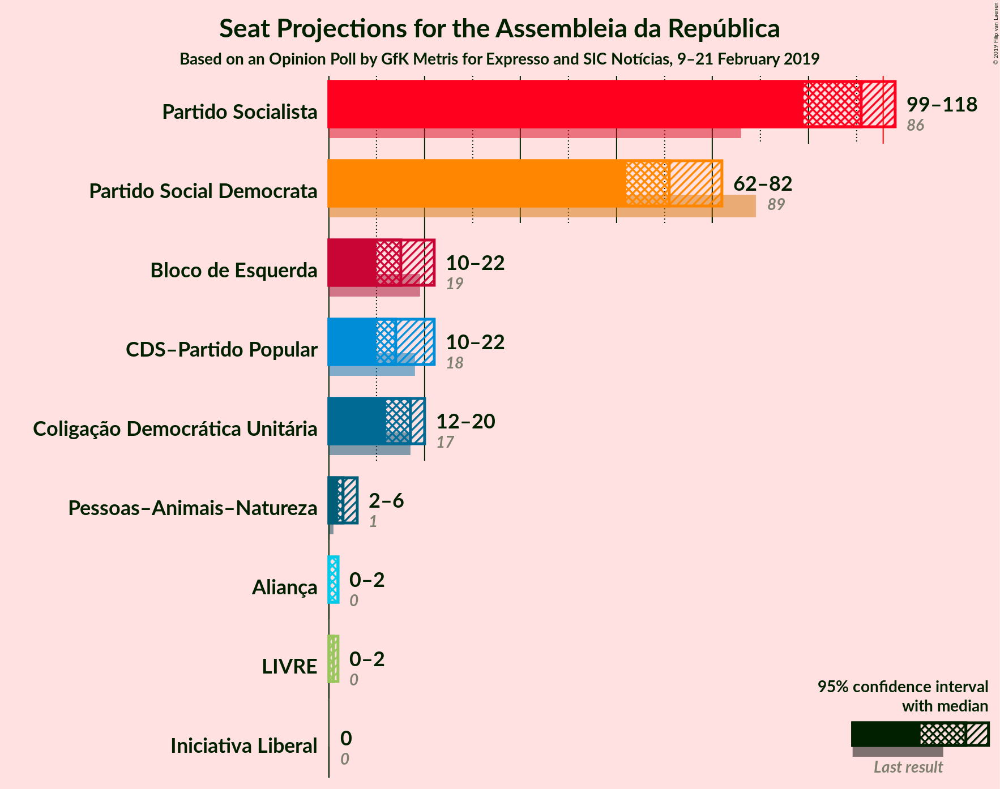

### Confidence Intervals

| Party | Last Result | Median | 80% Confidence Interval | 90% Confidence Interval | 95% Confidence Interval | 99% Confidence Interval |
|:-----:|:-----------:|:------:|:-----------------------:|:-----------------------:|:-----------------------:|:-----------------------:|
| <a href="#partido-socialista">Partido Socialista</a> | 86 | 111 | 100–115 |99–116 |99–118 |95–118 |
| <a href="#partido-social-democrata">Partido Social Democrata</a> | 89 | 71 | 62–76 |62–77 |62–82 |58–82 |
| <a href="#bloco-de-esquerda">Bloco de Esquerda</a> | 19 | 15 | 12–19 |10–22 |10–22 |10–23 |
| <a href="#cds–partido-popular">CDS–Partido Popular</a> | 18 | 14 | 13–19 |11–20 |10–22 |10–25 |
| <a href="#coligação-democrática-unitária">Coligação Democrática Unitária</a> | 17 | 17 | 14–20 |12–20 |12–20 |9–23 |
| <a href="#pessoas–animais–natureza">Pessoas–Animais–Natureza</a> | 1 | 3 | 2–6 |2–6 |2–6 |2–6 |
| <a href="#aliança">Aliança</a> | 0 | 2 | 0–2 |0–2 |0–2 |0–4 |
| <a href="#livre">LIVRE</a> | 0 | 1 | 0–1 |0–1 |0–2 |0–2 |
| <a href="#iniciativa-liberal">Iniciativa Liberal</a> | 0 | 0 | 0 |0 |0 |0 |

### Partido Socialista

*For a full overview of the results for this party, see the [Partido Socialista](party-partidosocialista.html) page.*

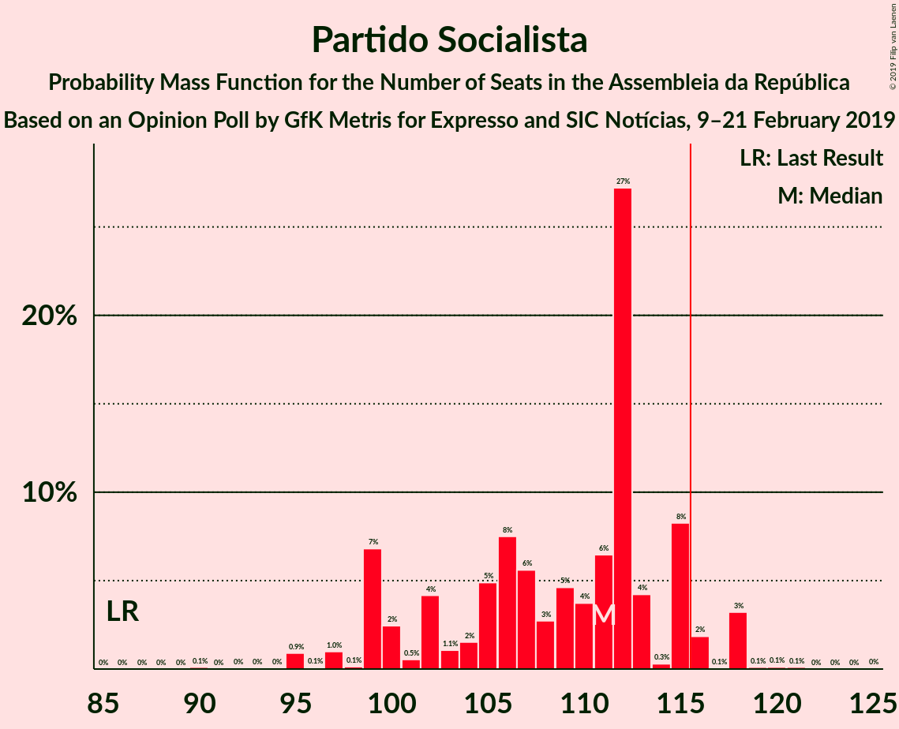

| Number of Seats | Probability | Accumulated | Special Marks |
|:---------------:|:-----------:|:-----------:|:-------------:|
| 86 | 0% | 100% | Last Result |
| 87 | 0% | 100% |  |
| 88 | 0% | 100% |  |
| 89 | 0% | 100% |  |
| 90 | 0.1% | 100% |  |
| 91 | 0% | 99.9% |  |
| 92 | 0% | 99.9% |  |
| 93 | 0% | 99.8% |  |
| 94 | 0% | 99.8% |  |
| 95 | 0.9% | 99.8% |  |
| 96 | 0.1% | 98.9% |  |
| 97 | 1.0% | 98.8% |  |
| 98 | 0.1% | 98% |  |
| 99 | 7% | 98% |  |
| 100 | 2% | 91% |  |
| 101 | 0.5% | 88% |  |
| 102 | 4% | 88% |  |
| 103 | 1.1% | 84% |  |
| 104 | 2% | 83% |  |
| 105 | 5% | 81% |  |
| 106 | 8% | 76% |  |
| 107 | 6% | 69% |  |
| 108 | 3% | 63% |  |
| 109 | 5% | 60% |  |
| 110 | 4% | 56% |  |
| 111 | 6% | 52% | Median |
| 112 | 27% | 46% |  |
| 113 | 4% | 18% |  |
| 114 | 0.3% | 14% |  |
| 115 | 8% | 14% |  |
| 116 | 2% | 6% | Majority |
| 117 | 0.1% | 4% |  |
| 118 | 3% | 4% |  |
| 119 | 0.1% | 0.4% |  |
| 120 | 0.1% | 0.3% |  |
| 121 | 0.1% | 0.2% |  |
| 122 | 0% | 0.1% |  |
| 123 | 0% | 0% |  |

### Partido Social Democrata

*For a full overview of the results for this party, see the [Partido Social Democrata](party-partidosocialdemocrata.html) page.*

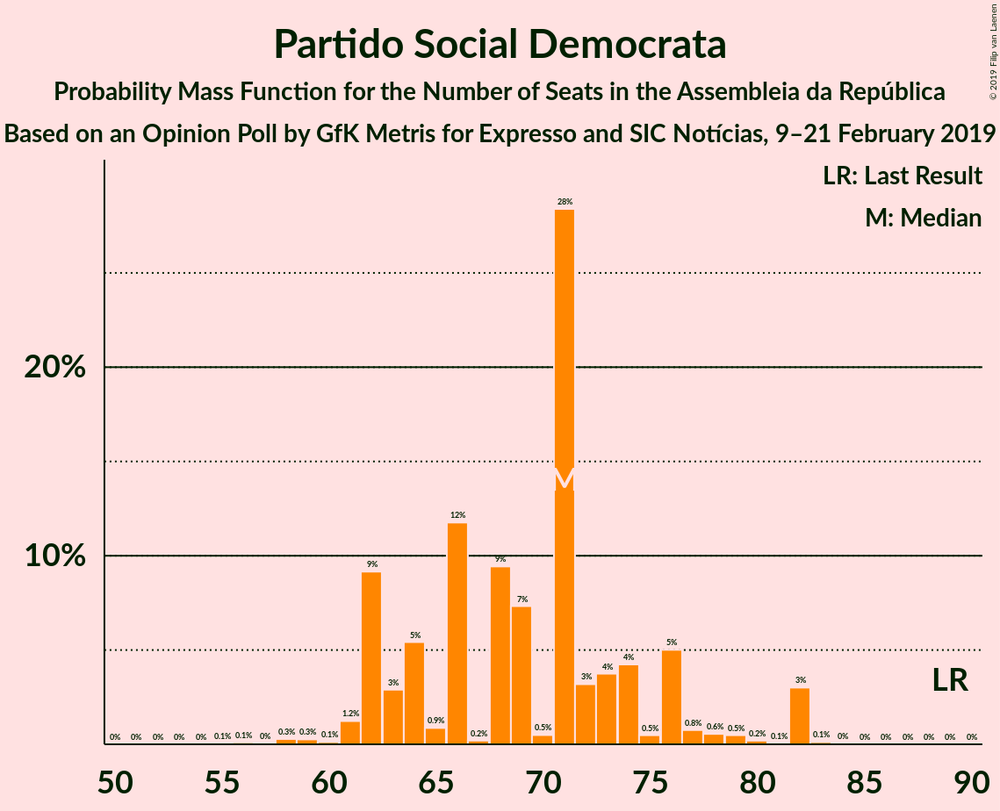

| Number of Seats | Probability | Accumulated | Special Marks |
|:---------------:|:-----------:|:-----------:|:-------------:|
| 55 | 0.1% | 100% |  |
| 56 | 0.1% | 99.9% |  |
| 57 | 0% | 99.8% |  |
| 58 | 0.3% | 99.8% |  |
| 59 | 0.3% | 99.5% |  |
| 60 | 0.1% | 99.2% |  |
| 61 | 1.2% | 99.1% |  |
| 62 | 9% | 98% |  |
| 63 | 3% | 89% |  |
| 64 | 5% | 86% |  |
| 65 | 0.9% | 80% |  |
| 66 | 12% | 80% |  |
| 67 | 0.2% | 68% |  |
| 68 | 9% | 68% |  |
| 69 | 7% | 58% |  |
| 70 | 0.5% | 51% |  |
| 71 | 28% | 50% | Median |
| 72 | 3% | 22% |  |
| 73 | 4% | 19% |  |
| 74 | 4% | 15% |  |
| 75 | 0.5% | 11% |  |
| 76 | 5% | 10% |  |
| 77 | 0.8% | 5% |  |
| 78 | 0.6% | 4% |  |
| 79 | 0.5% | 4% |  |
| 80 | 0.2% | 3% |  |
| 81 | 0.1% | 3% |  |
| 82 | 3% | 3% |  |
| 83 | 0.1% | 0.2% |  |
| 84 | 0% | 0.1% |  |
| 85 | 0% | 0% |  |
| 86 | 0% | 0% |  |
| 87 | 0% | 0% |  |
| 88 | 0% | 0% |  |
| 89 | 0% | 0% | Last Result |

### Bloco de Esquerda

*For a full overview of the results for this party, see the [Bloco de Esquerda](party-blocodeesquerda.html) page.*

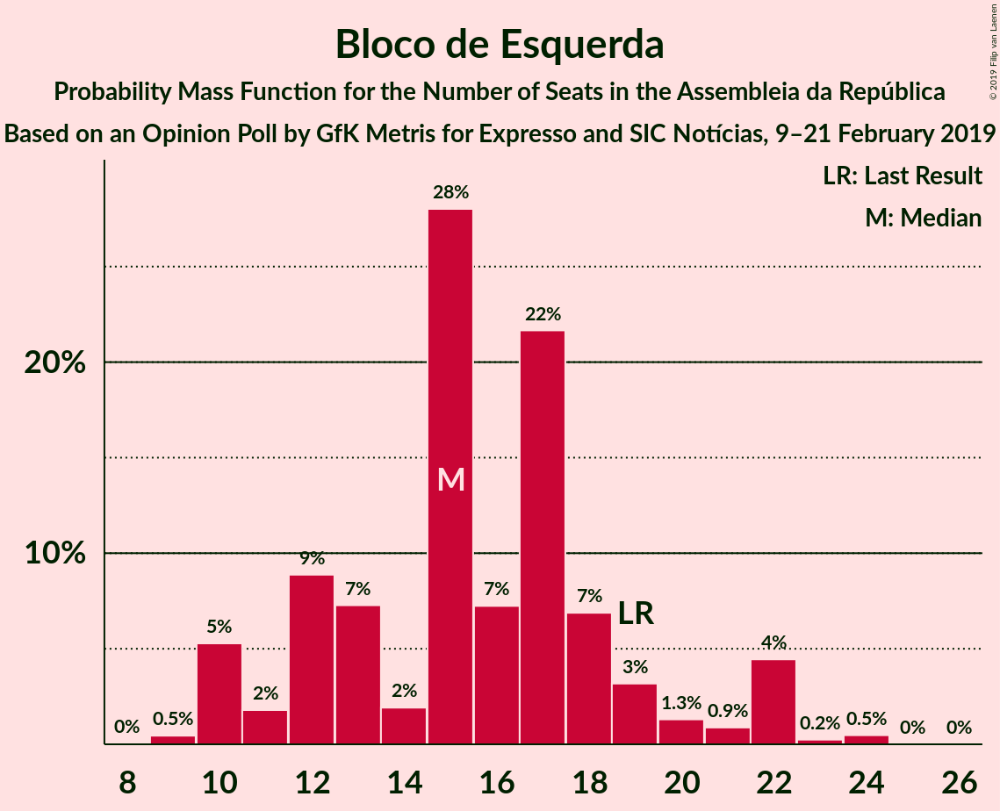

| Number of Seats | Probability | Accumulated | Special Marks |
|:---------------:|:-----------:|:-----------:|:-------------:|
| 9 | 0.5% | 100% |  |
| 10 | 5% | 99.5% |  |
| 11 | 2% | 94% |  |
| 12 | 9% | 92% |  |
| 13 | 7% | 84% |  |
| 14 | 2% | 76% |  |
| 15 | 28% | 74% | Median |
| 16 | 7% | 46% |  |
| 17 | 22% | 39% |  |
| 18 | 7% | 17% |  |
| 19 | 3% | 11% | Last Result |
| 20 | 1.3% | 7% |  |
| 21 | 0.9% | 6% |  |
| 22 | 4% | 5% |  |
| 23 | 0.2% | 0.7% |  |
| 24 | 0.5% | 0.5% |  |
| 25 | 0% | 0% |  |

### CDS–Partido Popular

*For a full overview of the results for this party, see the [CDS–Partido Popular](party-cds–partidopopular.html) page.*

| Number of Seats | Probability | Accumulated | Special Marks |
|:---------------:|:-----------:|:-----------:|:-------------:|
| 7 | 0% | 100% |  |
| 8 | 0.1% | 99.9% |  |
| 9 | 0% | 99.9% |  |
| 10 | 4% | 99.9% |  |
| 11 | 4% | 96% |  |
| 12 | 1.5% | 92% |  |
| 13 | 38% | 91% |  |
| 14 | 7% | 53% | Median |
| 15 | 3% | 46% |  |
| 16 | 12% | 43% |  |
| 17 | 5% | 31% |  |
| 18 | 10% | 26% | Last Result |
| 19 | 9% | 16% |  |
| 20 | 5% | 8% |  |
| 21 | 0.4% | 3% |  |
| 22 | 0.9% | 3% |  |
| 23 | 1.0% | 2% |  |
| 24 | 0.4% | 1.0% |  |
| 25 | 0.5% | 0.6% |  |
| 26 | 0.1% | 0.2% |  |
| 27 | 0% | 0.1% |  |
| 28 | 0% | 0.1% |  |
| 29 | 0.1% | 0.1% |  |
| 30 | 0% | 0% |  |

### Coligação Democrática Unitária

*For a full overview of the results for this party, see the [Coligação Democrática Unitária](party-coligaçãodemocráticaunitária.html) page.*

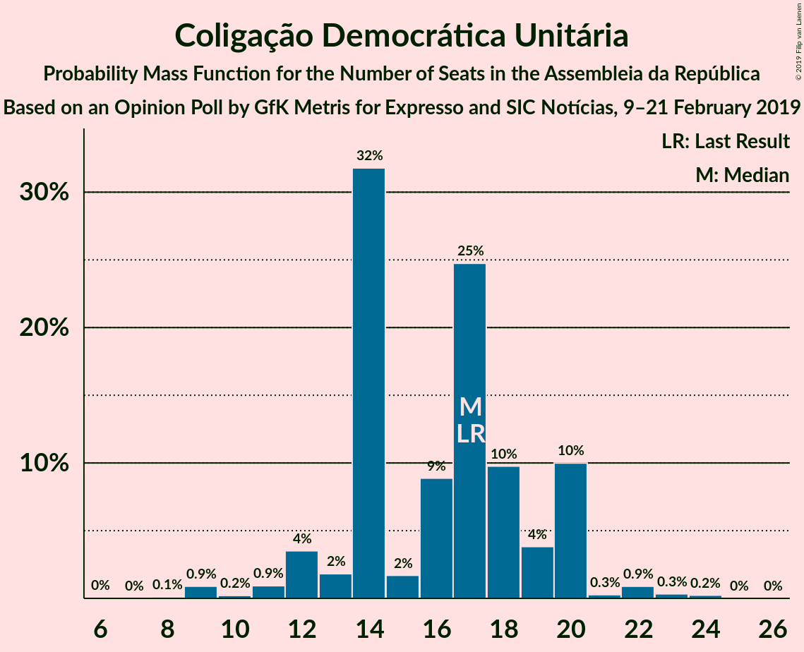

| Number of Seats | Probability | Accumulated | Special Marks |
|:---------------:|:-----------:|:-----------:|:-------------:|
| 7 | 0% | 100% |  |
| 8 | 0.1% | 99.9% |  |
| 9 | 0.9% | 99.8% |  |
| 10 | 0.2% | 98.9% |  |
| 11 | 0.9% | 98.7% |  |
| 12 | 4% | 98% |  |
| 13 | 2% | 94% |  |
| 14 | 32% | 92% |  |
| 15 | 2% | 61% |  |
| 16 | 9% | 59% |  |
| 17 | 25% | 50% | Last Result, Median |
| 18 | 10% | 25% |  |
| 19 | 4% | 16% |  |
| 20 | 10% | 12% |  |
| 21 | 0.3% | 2% |  |
| 22 | 0.9% | 1.5% |  |
| 23 | 0.3% | 0.6% |  |
| 24 | 0.2% | 0.2% |  |
| 25 | 0% | 0% |  |

### Pessoas–Animais–Natureza

*For a full overview of the results for this party, see the [Pessoas–Animais–Natureza](party-pessoas–animais–natureza.html) page.*

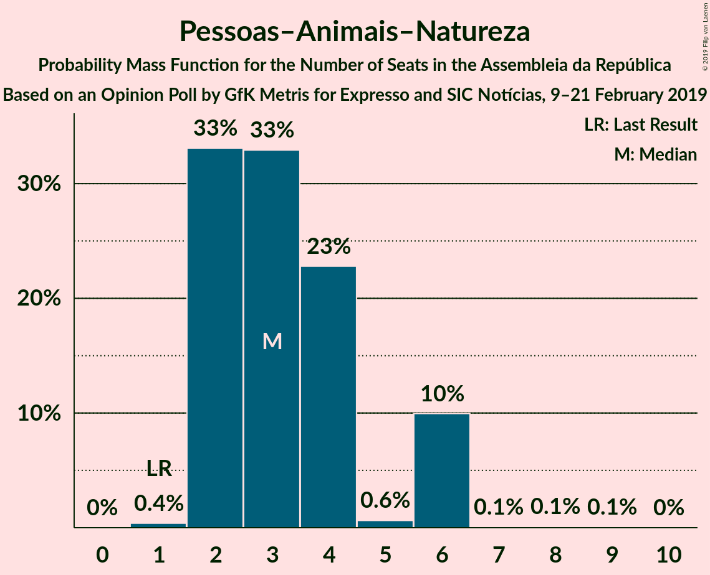

| Number of Seats | Probability | Accumulated | Special Marks |
|:---------------:|:-----------:|:-----------:|:-------------:|
| 1 | 0.4% | 100% | Last Result |
| 2 | 33% | 99.6% |  |
| 3 | 33% | 67% | Median |
| 4 | 23% | 34% |  |
| 5 | 0.6% | 11% |  |
| 6 | 10% | 10% |  |
| 7 | 0.1% | 0.2% |  |
| 8 | 0.1% | 0.1% |  |
| 9 | 0.1% | 0.1% |  |
| 10 | 0% | 0% |  |

### Aliança

*For a full overview of the results for this party, see the [Aliança](party-aliança.html) page.*

| Number of Seats | Probability | Accumulated | Special Marks |
|:---------------:|:-----------:|:-----------:|:-------------:|
| 0 | 36% | 100% | Last Result |
| 1 | 2% | 64% |  |
| 2 | 60% | 62% | Median |
| 3 | 0.5% | 2% |  |
| 4 | 2% | 2% |  |
| 5 | 0% | 0% |  |

### LIVRE

*For a full overview of the results for this party, see the [LIVRE](party-livre.html) page.*

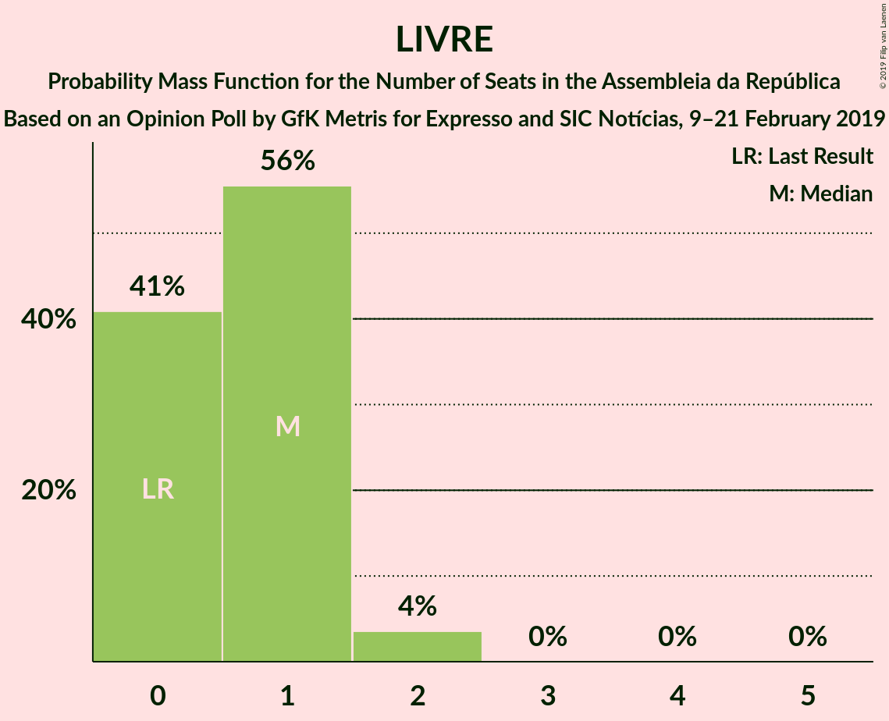

| Number of Seats | Probability | Accumulated | Special Marks |
|:---------------:|:-----------:|:-----------:|:-------------:|
| 0 | 41% | 100% | Last Result |
| 1 | 56% | 59% | Median |
| 2 | 4% | 4% |  |
| 3 | 0% | 0% |  |

### Iniciativa Liberal

*For a full overview of the results for this party, see the [Iniciativa Liberal](party-iniciativaliberal.html) page.*

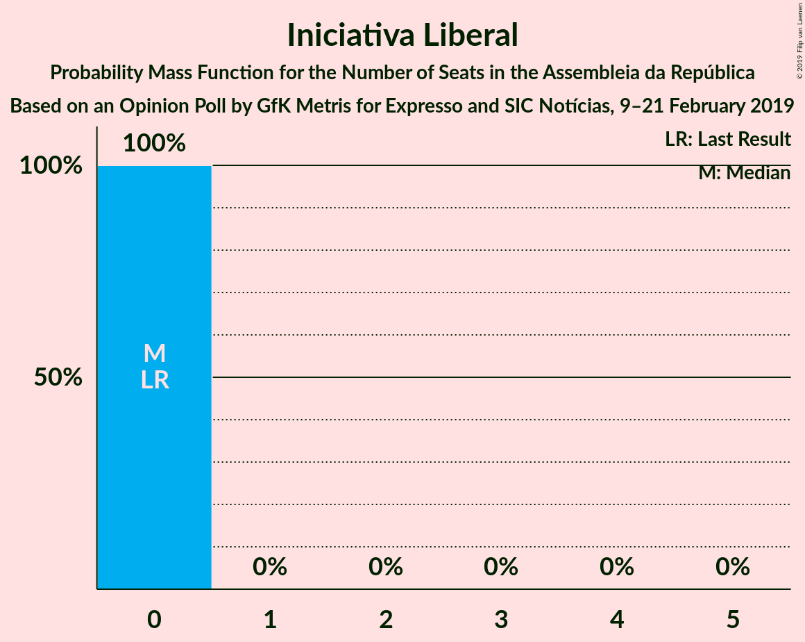

| Number of Seats | Probability | Accumulated | Special Marks |
|:---------------:|:-----------:|:-----------:|:-------------:|
| 0 | 100% | 100% | Last Result, Median |

## Coalitions

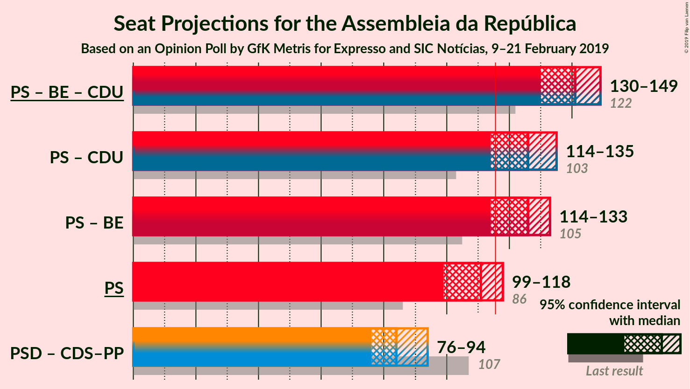

### Confidence Intervals

| Coalition | Last Result | Median | Majority? | 80% Confidence Interval | 90% Confidence Interval | 95% Confidence Interval | 99% Confidence Interval |
|:---------:|:-----------:|:------:|:---------:|:-----------------------:|:-----------------------:|:-----------------------:|:-----------------------:|
| Partido Socialista – Bloco de Esquerda – Coligação Democrática Unitária | 122 | 141 | 100% | 134–146 | 132–149 | 130–149 | 128–152 |
| Partido Socialista – Coligação Democrática Unitária | 103 | 126 | 96% | 116–132 | 116–134 | 114–135 | 110–137 |
| Partido Socialista – Bloco de Esquerda | 105 | 126 | 96% | 118–132 | 117–132 | 114–133 | 112–134 |
| Partido Socialista | 86 | 111 | 6% | 100–115 | 99–116 | 99–118 | 95–118 |
| Partido Social Democrata – CDS–Partido Popular | 107 | 84 | 0% | 78–91 | 78–92 | 76–94 | 75–98 |

### Partido Socialista – Bloco de Esquerda – Coligação Democrática Unitária

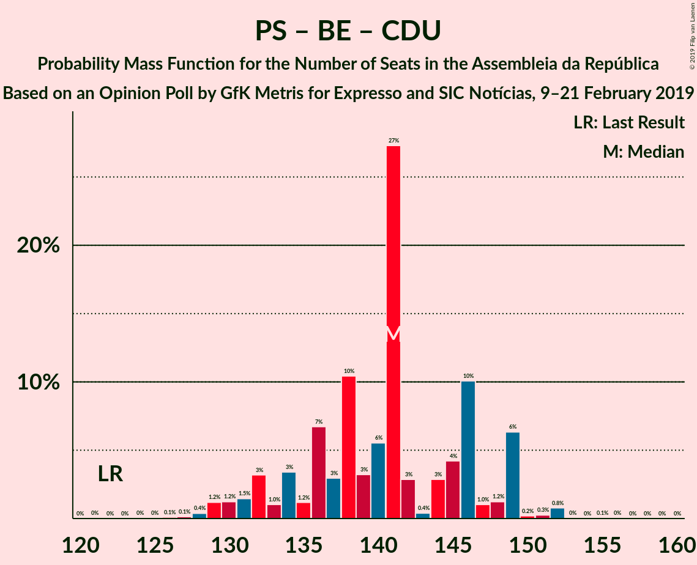

| Number of Seats | Probability | Accumulated | Special Marks |
|:---------------:|:-----------:|:-----------:|:-------------:|
| 121 | 0% | 100% |  |
| 122 | 0% | 99.9% | Last Result |
| 123 | 0% | 99.9% |  |
| 124 | 0% | 99.9% |  |
| 125 | 0% | 99.9% |  |
| 126 | 0.1% | 99.9% |  |
| 127 | 0.1% | 99.8% |  |
| 128 | 0.4% | 99.6% |  |
| 129 | 1.2% | 99.2% |  |
| 130 | 1.2% | 98% |  |
| 131 | 1.5% | 97% |  |
| 132 | 3% | 95% |  |
| 133 | 1.0% | 92% |  |
| 134 | 3% | 91% |  |
| 135 | 1.2% | 88% |  |
| 136 | 7% | 87% |  |
| 137 | 3% | 80% |  |
| 138 | 10% | 77% |  |
| 139 | 3% | 66% |  |
| 140 | 6% | 63% |  |
| 141 | 27% | 58% |  |
| 142 | 3% | 30% |  |
| 143 | 0.4% | 28% | Median |
| 144 | 3% | 27% |  |
| 145 | 4% | 24% |  |
| 146 | 10% | 20% |  |
| 147 | 1.0% | 10% |  |
| 148 | 1.2% | 9% |  |
| 149 | 6% | 8% |  |
| 150 | 0.2% | 1.4% |  |
| 151 | 0.3% | 1.2% |  |
| 152 | 0.8% | 0.9% |  |
| 153 | 0% | 0.1% |  |
| 154 | 0% | 0.1% |  |
| 155 | 0.1% | 0.1% |  |
| 156 | 0% | 0% |  |

### Partido Socialista – Coligação Democrática Unitária

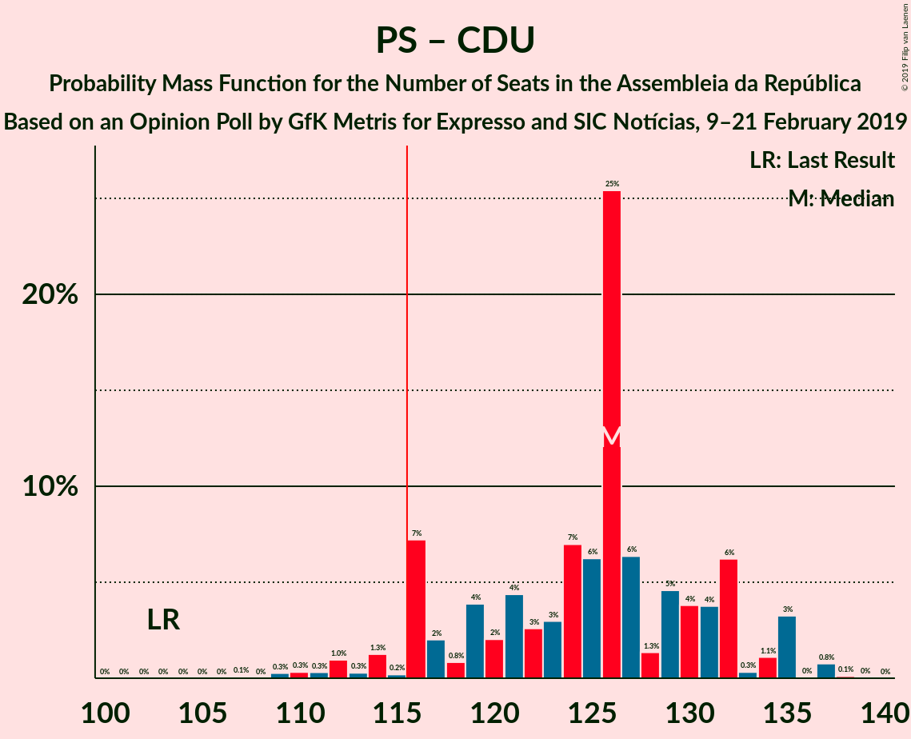

| Number of Seats | Probability | Accumulated | Special Marks |
|:---------------:|:-----------:|:-----------:|:-------------:|
| 103 | 0% | 100% | Last Result |
| 104 | 0% | 100% |  |
| 105 | 0% | 100% |  |
| 106 | 0% | 100% |  |
| 107 | 0.1% | 100% |  |
| 108 | 0% | 99.9% |  |
| 109 | 0.3% | 99.9% |  |
| 110 | 0.3% | 99.6% |  |
| 111 | 0.3% | 99.3% |  |
| 112 | 1.0% | 99.0% |  |
| 113 | 0.3% | 98% |  |
| 114 | 1.3% | 98% |  |
| 115 | 0.2% | 96% |  |
| 116 | 7% | 96% | Majority |
| 117 | 2% | 89% |  |
| 118 | 0.8% | 87% |  |
| 119 | 4% | 86% |  |
| 120 | 2% | 82% |  |
| 121 | 4% | 80% |  |
| 122 | 3% | 76% |  |
| 123 | 3% | 73% |  |
| 124 | 7% | 70% |  |
| 125 | 6% | 63% |  |
| 126 | 25% | 57% |  |
| 127 | 6% | 32% |  |
| 128 | 1.3% | 25% | Median |
| 129 | 5% | 24% |  |
| 130 | 4% | 19% |  |
| 131 | 4% | 16% |  |
| 132 | 6% | 12% |  |
| 133 | 0.3% | 6% |  |
| 134 | 1.1% | 5% |  |
| 135 | 3% | 4% |  |
| 136 | 0% | 0.9% |  |
| 137 | 0.8% | 0.9% |  |
| 138 | 0.1% | 0.2% |  |
| 139 | 0% | 0.1% |  |
| 140 | 0% | 0% |  |

### Partido Socialista – Bloco de Esquerda

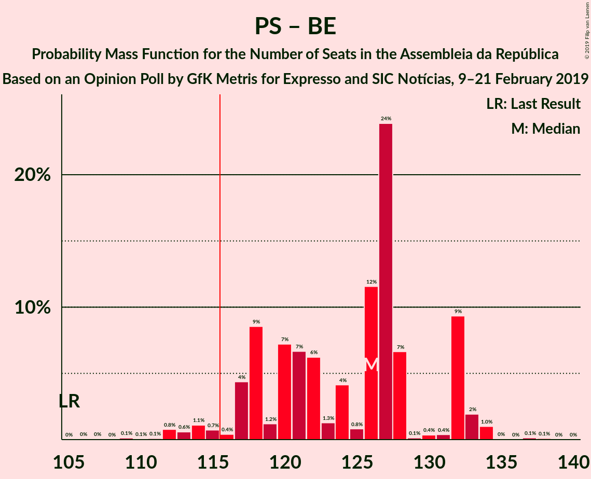

| Number of Seats | Probability | Accumulated | Special Marks |
|:---------------:|:-----------:|:-----------:|:-------------:|
| 105 | 0% | 100% | Last Result |
| 106 | 0% | 100% |  |
| 107 | 0% | 99.9% |  |
| 108 | 0% | 99.9% |  |
| 109 | 0.1% | 99.9% |  |
| 110 | 0.1% | 99.8% |  |
| 111 | 0.1% | 99.7% |  |
| 112 | 0.8% | 99.6% |  |
| 113 | 0.6% | 98.8% |  |
| 114 | 1.1% | 98% |  |
| 115 | 0.7% | 97% |  |
| 116 | 0.4% | 96% | Majority |
| 117 | 4% | 96% |  |
| 118 | 9% | 92% |  |
| 119 | 1.2% | 83% |  |
| 120 | 7% | 82% |  |
| 121 | 7% | 75% |  |
| 122 | 6% | 68% |  |
| 123 | 1.3% | 62% |  |
| 124 | 4% | 61% |  |
| 125 | 0.8% | 56% |  |
| 126 | 12% | 56% | Median |
| 127 | 24% | 44% |  |
| 128 | 7% | 20% |  |
| 129 | 0.1% | 13% |  |
| 130 | 0.4% | 13% |  |
| 131 | 0.4% | 13% |  |
| 132 | 9% | 13% |  |
| 133 | 2% | 3% |  |
| 134 | 1.0% | 1.3% |  |
| 135 | 0% | 0.3% |  |
| 136 | 0% | 0.3% |  |
| 137 | 0.1% | 0.3% |  |
| 138 | 0.1% | 0.1% |  |
| 139 | 0% | 0% |  |

### Partido Socialista

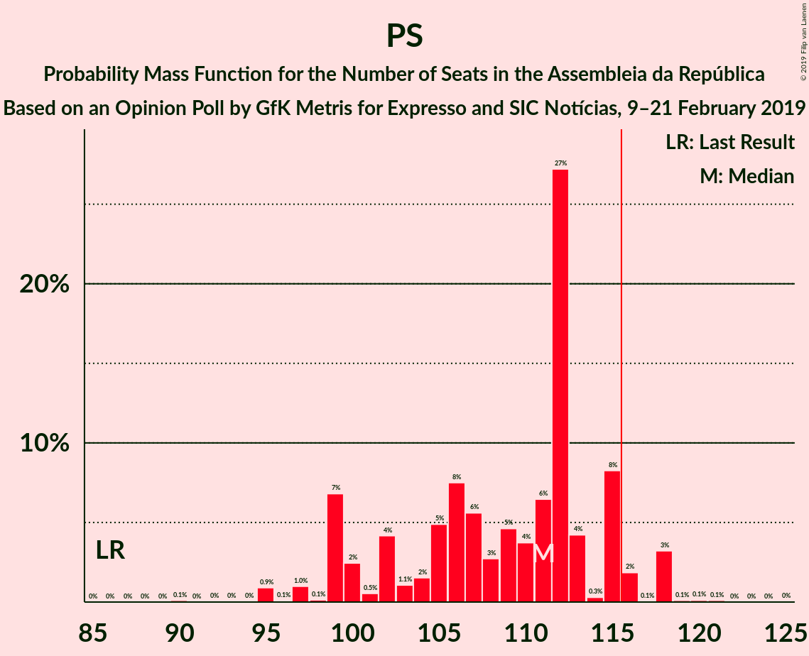

| Number of Seats | Probability | Accumulated | Special Marks |
|:---------------:|:-----------:|:-----------:|:-------------:|
| 86 | 0% | 100% | Last Result |
| 87 | 0% | 100% |  |
| 88 | 0% | 100% |  |
| 89 | 0% | 100% |  |
| 90 | 0.1% | 100% |  |
| 91 | 0% | 99.9% |  |
| 92 | 0% | 99.9% |  |
| 93 | 0% | 99.8% |  |
| 94 | 0% | 99.8% |  |
| 95 | 0.9% | 99.8% |  |
| 96 | 0.1% | 98.9% |  |
| 97 | 1.0% | 98.8% |  |
| 98 | 0.1% | 98% |  |
| 99 | 7% | 98% |  |
| 100 | 2% | 91% |  |
| 101 | 0.5% | 88% |  |
| 102 | 4% | 88% |  |
| 103 | 1.1% | 84% |  |
| 104 | 2% | 83% |  |
| 105 | 5% | 81% |  |
| 106 | 8% | 76% |  |
| 107 | 6% | 69% |  |
| 108 | 3% | 63% |  |
| 109 | 5% | 60% |  |
| 110 | 4% | 56% |  |
| 111 | 6% | 52% | Median |
| 112 | 27% | 46% |  |
| 113 | 4% | 18% |  |
| 114 | 0.3% | 14% |  |
| 115 | 8% | 14% |  |
| 116 | 2% | 6% | Majority |
| 117 | 0.1% | 4% |  |
| 118 | 3% | 4% |  |
| 119 | 0.1% | 0.4% |  |
| 120 | 0.1% | 0.3% |  |
| 121 | 0.1% | 0.2% |  |
| 122 | 0% | 0.1% |  |
| 123 | 0% | 0% |  |

### Partido Social Democrata – CDS–Partido Popular

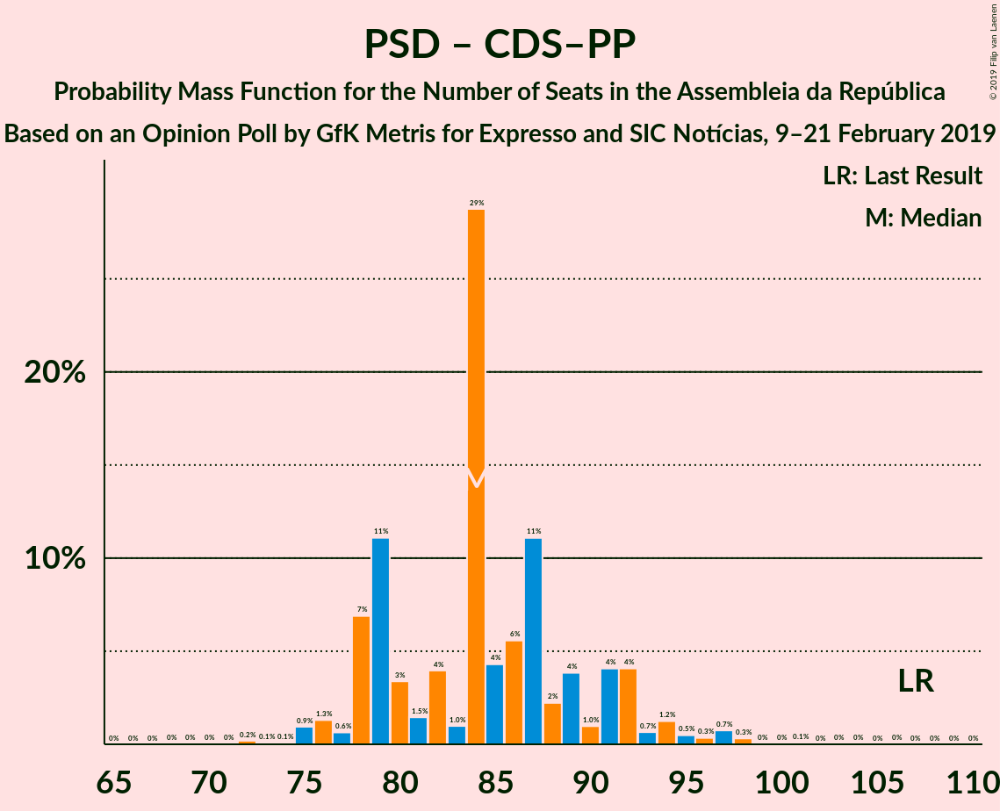

| Number of Seats | Probability | Accumulated | Special Marks |
|:---------------:|:-----------:|:-----------:|:-------------:|
| 69 | 0% | 100% |  |
| 70 | 0% | 99.9% |  |
| 71 | 0% | 99.9% |  |
| 72 | 0.2% | 99.9% |  |
| 73 | 0.1% | 99.7% |  |
| 74 | 0.1% | 99.7% |  |
| 75 | 0.9% | 99.6% |  |
| 76 | 1.3% | 98.6% |  |
| 77 | 0.6% | 97% |  |
| 78 | 7% | 97% |  |
| 79 | 11% | 90% |  |
| 80 | 3% | 79% |  |
| 81 | 1.5% | 75% |  |
| 82 | 4% | 74% |  |
| 83 | 1.0% | 70% |  |
| 84 | 29% | 69% |  |
| 85 | 4% | 40% | Median |
| 86 | 6% | 36% |  |
| 87 | 11% | 30% |  |
| 88 | 2% | 19% |  |
| 89 | 4% | 17% |  |
| 90 | 1.0% | 13% |  |
| 91 | 4% | 12% |  |
| 92 | 4% | 8% |  |
| 93 | 0.7% | 4% |  |
| 94 | 1.2% | 3% |  |
| 95 | 0.5% | 2% |  |
| 96 | 0.3% | 2% |  |
| 97 | 0.7% | 1.3% |  |
| 98 | 0.3% | 0.5% |  |
| 99 | 0% | 0.2% |  |
| 100 | 0% | 0.2% |  |
| 101 | 0.1% | 0.2% |  |
| 102 | 0% | 0.1% |  |
| 103 | 0% | 0.1% |  |
| 104 | 0% | 0% |  |
| 105 | 0% | 0% |  |
| 106 | 0% | 0% |  |
| 107 | 0% | 0% | Last Result |

## Technical Information

### Opinion Poll

+ **Polling firm:** GfK Metris
+ **Commissioner(s):** Expresso and SIC Notícias
+ **Fieldwork period:** 9–21 February 2019

### Calculations

+ **Sample size:** 801
+ **Simulations done:** 131,072
+ **Error estimate:** 2.50%

