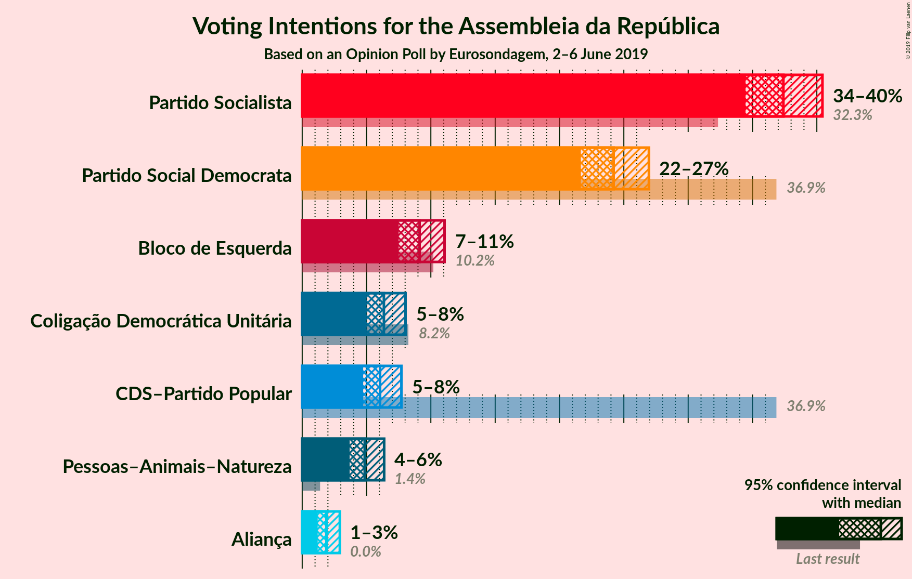
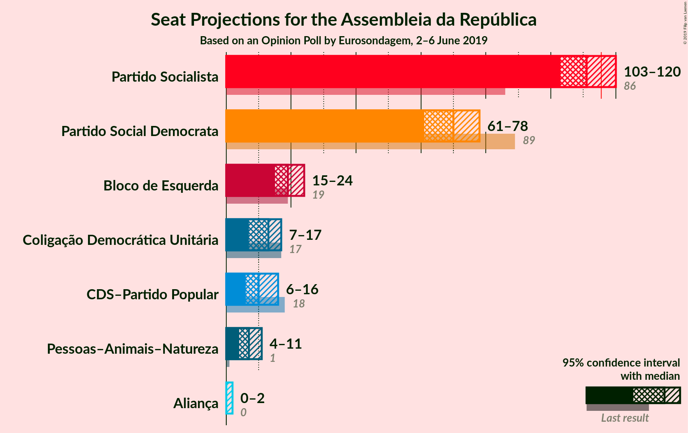
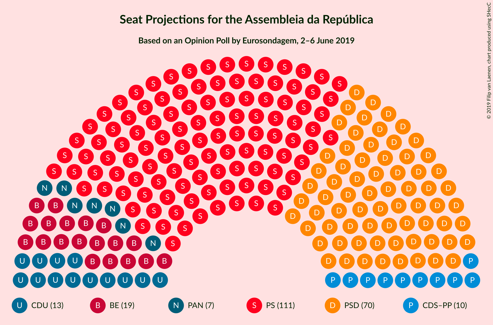
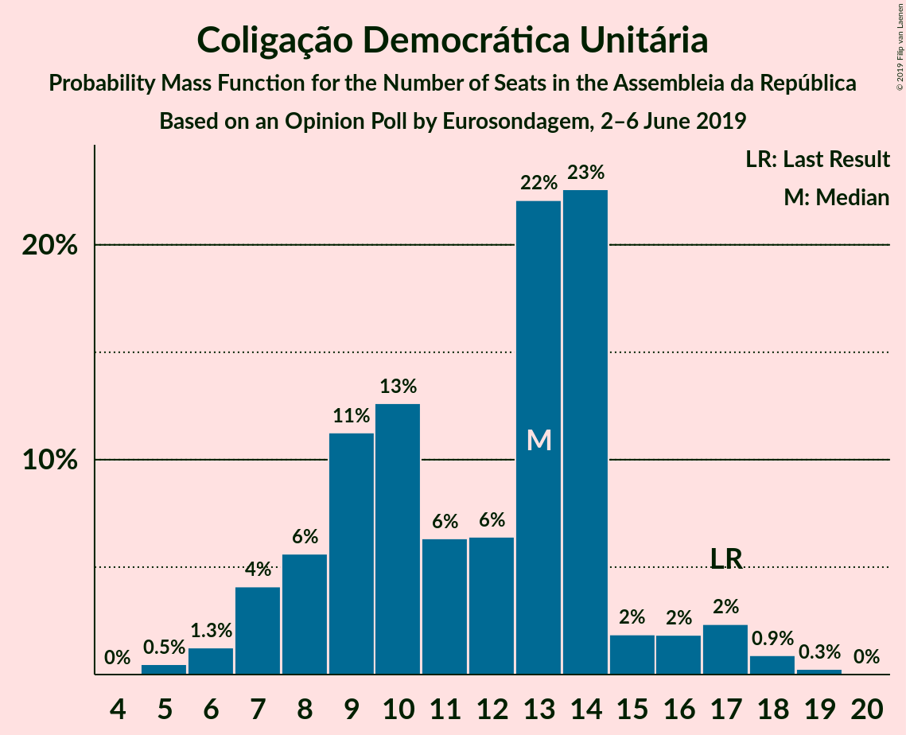
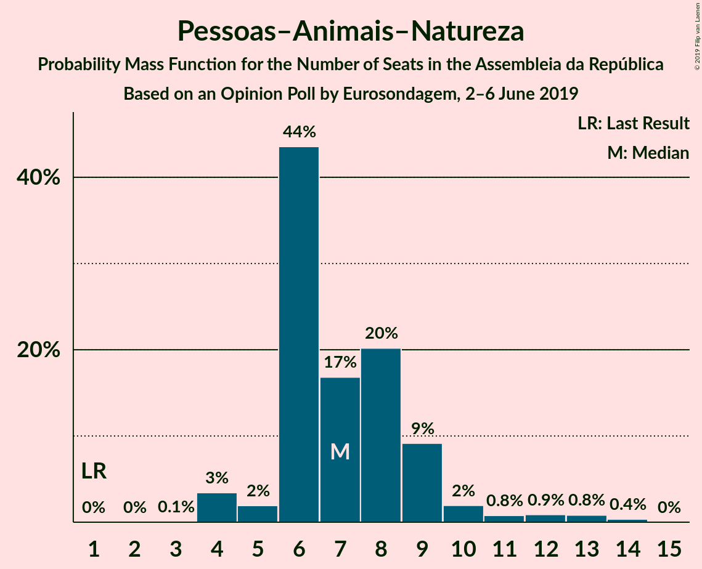
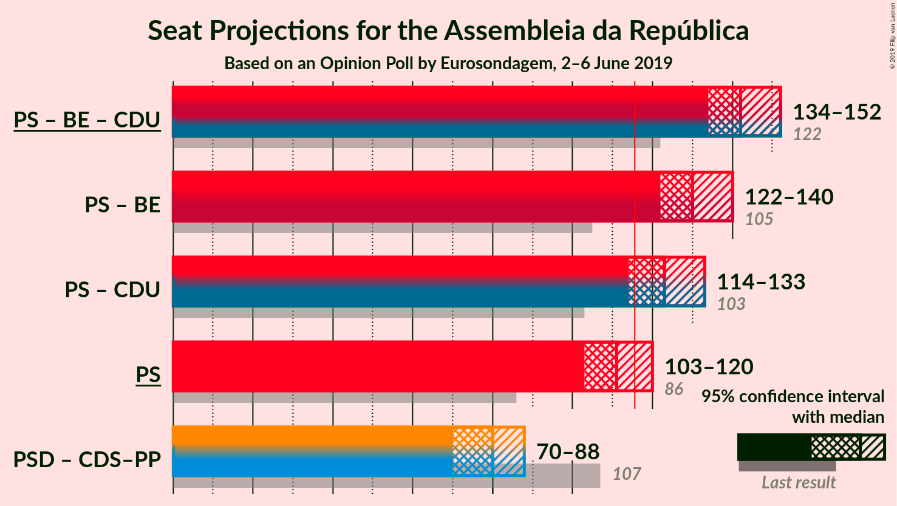
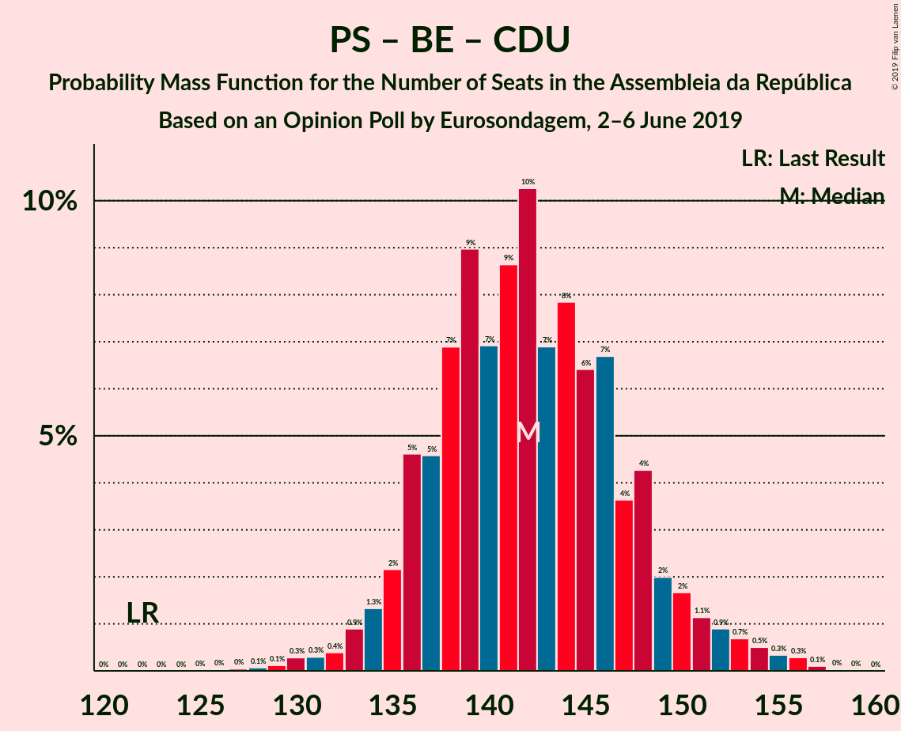
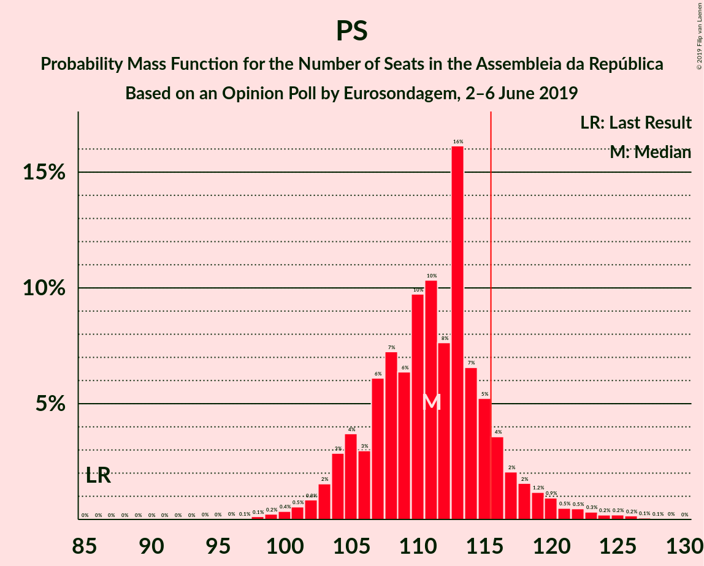
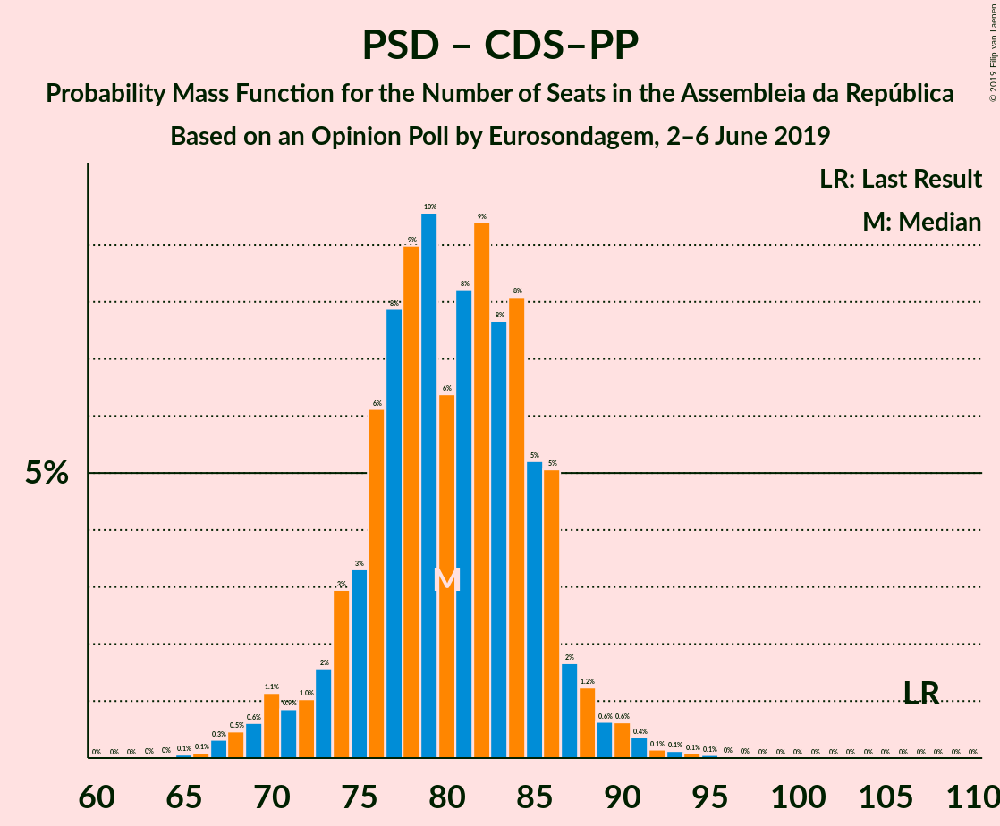

# Opinion Poll by Eurosondagem, 2–6 June 2019

<a href="#voting-intentions">Voting Intentions</a> | <a href="#seats">Seats</a> | <a href="#coalitions">Coalitions</a> | <a href="#technical-information">Technical Information</a>

## Voting Intentions

### Confidence Intervals

| Party | Last Result | Poll Result | 80% Confidence Interval | 90% Confidence Interval | 95% Confidence Interval | 99% Confidence Interval |
|:-----:|:-----------:|:-----------:|:-----------------------:|:-----------------------:|:-----------------------:|:-----------------------:|
| Partido Socialista | 32.3% | 37.4% | 35.5–39.4% |34.9–39.9% |34.5–40.4% |33.5–41.4% |
| Partido Social Democrata | 36.9% | 24.2% | 22.5–26.0% |22.1–26.5% |21.7–26.9% |20.9–27.8% |
| Bloco de Esquerda | 10.2% | 9.1% | 8.0–10.4% |7.8–10.8% |7.5–11.1% |7.0–11.7% |
| Coligação Democrática Unitária | 8.2% | 6.3% | 5.5–7.5% |5.2–7.8% |5.0–8.0% |4.6–8.6% |
| CDS–Partido Popular | 36.9% | 6.1% | 5.2–7.1% |4.9–7.4% |4.7–7.7% |4.3–8.2% |
| Pessoas–Animais–Natureza | 1.4% | 4.9% | 4.1–5.9% |3.9–6.1% |3.7–6.4% |3.4–6.9% |
| Aliança | 0.0% | 1.9% | 1.4–2.6% |1.3–2.8% |1.2–2.9% |1.0–3.3% |

*Note:* The poll result column reflects the actual value used in the calculations. Published results may vary slightly, and in addition be rounded to fewer digits.

## Seats

### Confidence Intervals

| Party | Last Result | Median | 80% Confidence Interval | 90% Confidence Interval | 95% Confidence Interval | 99% Confidence Interval |
|:-----:|:-----------:|:------:|:-----------------------:|:-----------------------:|:-----------------------:|:-----------------------:|
| <a href="#partido-socialista">Partido Socialista</a> | 86 | 111 | 105–116 |104–118 |103–120 |100–125 |
| <a href="#partido-social-democrata">Partido Social Democrata</a> | 89 | 70 | 65–75 |63–77 |61–78 |59–81 |
| <a href="#bloco-de-esquerda">Bloco de Esquerda</a> | 19 | 19 | 17–23 |16–24 |15–24 |13–26 |
| <a href="#coligação-democrática-unitária">Coligação Democrática Unitária</a> | 17 | 13 | 8–14 |7–16 |7–17 |6–18 |
| <a href="#cds–partido-popular">CDS–Partido Popular</a> | 18 | 10 | 8–13 |7–13 |6–16 |6–18 |
| <a href="#pessoas–animais–natureza">Pessoas–Animais–Natureza</a> | 1 | 7 | 6–9 |5–9 |4–11 |4–13 |
| <a href="#aliança">Aliança</a> | 0 | 0 | 0–2 |0–2 |0–2 |0–2 |

### Partido Socialista

*For a full overview of the results for this party, see the [Partido Socialista](party-partidosocialista.html) page.*

| Number of Seats | Probability | Accumulated | Special Marks |
|:---------------:|:-----------:|:-----------:|:-------------:|
| 86 | 0% | 100% | Last Result |
| 87 | 0% | 100% |  |
| 88 | 0% | 100% |  |
| 89 | 0% | 100% |  |
| 90 | 0% | 100% |  |
| 91 | 0% | 100% |  |
| 92 | 0% | 100% |  |
| 93 | 0% | 100% |  |
| 94 | 0% | 100% |  |
| 95 | 0% | 100% |  |
| 96 | 0% | 100% |  |
| 97 | 0.1% | 99.9% |  |
| 98 | 0.1% | 99.9% |  |
| 99 | 0.2% | 99.8% |  |
| 100 | 0.4% | 99.5% |  |
| 101 | 0.5% | 99.2% |  |
| 102 | 0.8% | 98.6% |  |
| 103 | 2% | 98% |  |
| 104 | 3% | 96% |  |
| 105 | 4% | 93% |  |
| 106 | 3% | 90% |  |
| 107 | 6% | 87% |  |
| 108 | 7% | 81% |  |
| 109 | 6% | 73% |  |
| 110 | 10% | 67% |  |
| 111 | 10% | 57% | Median |
| 112 | 8% | 47% |  |
| 113 | 16% | 39% |  |
| 114 | 7% | 23% |  |
| 115 | 5% | 17% |  |
| 116 | 4% | 11% | Majority |
| 117 | 2% | 8% |  |
| 118 | 2% | 6% |  |
| 119 | 1.2% | 4% |  |
| 120 | 0.9% | 3% |  |
| 121 | 0.5% | 2% |  |
| 122 | 0.5% | 2% |  |
| 123 | 0.3% | 1.1% |  |
| 124 | 0.2% | 0.7% |  |
| 125 | 0.2% | 0.5% |  |
| 126 | 0.2% | 0.3% |  |
| 127 | 0.1% | 0.2% |  |
| 128 | 0.1% | 0.1% |  |
| 129 | 0% | 0.1% |  |
| 130 | 0% | 0% |  |

### Partido Social Democrata

*For a full overview of the results for this party, see the [Partido Social Democrata](party-partidosocialdemocrata.html) page.*

| Number of Seats | Probability | Accumulated | Special Marks |
|:---------------:|:-----------:|:-----------:|:-------------:|
| 56 | 0.1% | 100% |  |
| 57 | 0.1% | 99.9% |  |
| 58 | 0.2% | 99.7% |  |
| 59 | 0.6% | 99.6% |  |
| 60 | 1.0% | 98.9% |  |
| 61 | 0.8% | 98% |  |
| 62 | 2% | 97% |  |
| 63 | 2% | 95% |  |
| 64 | 2% | 93% |  |
| 65 | 4% | 92% |  |
| 66 | 5% | 88% |  |
| 67 | 7% | 83% |  |
| 68 | 8% | 76% |  |
| 69 | 13% | 68% |  |
| 70 | 6% | 55% | Median |
| 71 | 8% | 49% |  |
| 72 | 7% | 41% |  |
| 73 | 8% | 33% |  |
| 74 | 10% | 25% |  |
| 75 | 5% | 15% |  |
| 76 | 3% | 10% |  |
| 77 | 2% | 6% |  |
| 78 | 2% | 4% |  |
| 79 | 0.7% | 2% |  |
| 80 | 0.9% | 1.4% |  |
| 81 | 0.2% | 0.5% |  |
| 82 | 0.1% | 0.3% |  |
| 83 | 0.1% | 0.2% |  |
| 84 | 0.1% | 0.1% |  |
| 85 | 0% | 0.1% |  |
| 86 | 0% | 0% |  |
| 87 | 0% | 0% |  |
| 88 | 0% | 0% |  |
| 89 | 0% | 0% | Last Result |

### Bloco de Esquerda

*For a full overview of the results for this party, see the [Bloco de Esquerda](party-blocodeesquerda.html) page.*

| Number of Seats | Probability | Accumulated | Special Marks |
|:---------------:|:-----------:|:-----------:|:-------------:|
| 10 | 0.1% | 100% |  |
| 11 | 0.1% | 99.9% |  |
| 12 | 0.1% | 99.8% |  |
| 13 | 0.2% | 99.7% |  |
| 14 | 0.7% | 99.5% |  |
| 15 | 2% | 98.8% |  |
| 16 | 3% | 97% |  |
| 17 | 17% | 94% |  |
| 18 | 22% | 77% |  |
| 19 | 13% | 55% | Last Result, Median |
| 20 | 19% | 43% |  |
| 21 | 8% | 24% |  |
| 22 | 5% | 16% |  |
| 23 | 5% | 11% |  |
| 24 | 5% | 6% |  |
| 25 | 0.8% | 1.4% |  |
| 26 | 0.4% | 0.6% |  |
| 27 | 0.1% | 0.2% |  |
| 28 | 0.1% | 0.1% |  |
| 29 | 0% | 0% |  |

### Coligação Democrática Unitária

*For a full overview of the results for this party, see the [Coligação Democrática Unitária](party-coligaçãodemocráticaunitária.html) page.*

| Number of Seats | Probability | Accumulated | Special Marks |
|:---------------:|:-----------:|:-----------:|:-------------:|
| 5 | 0.5% | 100% |  |
| 6 | 1.3% | 99.5% |  |
| 7 | 4% | 98% |  |
| 8 | 6% | 94% |  |
| 9 | 11% | 89% |  |
| 10 | 13% | 77% |  |
| 11 | 6% | 65% |  |
| 12 | 6% | 58% |  |
| 13 | 22% | 52% | Median |
| 14 | 23% | 30% |  |
| 15 | 2% | 7% |  |
| 16 | 2% | 5% |  |
| 17 | 2% | 4% | Last Result |
| 18 | 0.9% | 1.2% |  |
| 19 | 0.3% | 0.3% |  |
| 20 | 0% | 0% |  |

### CDS–Partido Popular

*For a full overview of the results for this party, see the [CDS–Partido Popular](party-cds–partidopopular.html) page.*

| Number of Seats | Probability | Accumulated | Special Marks |
|:---------------:|:-----------:|:-----------:|:-------------:|
| 5 | 0.1% | 100% |  |
| 6 | 3% | 99.9% |  |
| 7 | 4% | 97% |  |
| 8 | 28% | 92% |  |
| 9 | 12% | 64% |  |
| 10 | 15% | 52% | Median |
| 11 | 18% | 37% |  |
| 12 | 9% | 19% |  |
| 13 | 6% | 10% |  |
| 14 | 0.8% | 5% |  |
| 15 | 1.2% | 4% |  |
| 16 | 1.1% | 3% |  |
| 17 | 0.7% | 1.5% |  |
| 18 | 0.5% | 0.8% | Last Result |
| 19 | 0.2% | 0.3% |  |
| 20 | 0.1% | 0.1% |  |
| 21 | 0% | 0% |  |

### Pessoas–Animais–Natureza

*For a full overview of the results for this party, see the [Pessoas–Animais–Natureza](party-pessoas–animais–natureza.html) page.*

| Number of Seats | Probability | Accumulated | Special Marks |
|:---------------:|:-----------:|:-----------:|:-------------:|
| 1 | 0% | 100% | Last Result |
| 2 | 0% | 100% |  |
| 3 | 0.1% | 100% |  |
| 4 | 3% | 99.9% |  |
| 5 | 2% | 96% |  |
| 6 | 44% | 95% |  |
| 7 | 17% | 51% | Median |
| 8 | 20% | 34% |  |
| 9 | 9% | 14% |  |
| 10 | 2% | 5% |  |
| 11 | 0.8% | 3% |  |
| 12 | 0.9% | 2% |  |
| 13 | 0.8% | 1.2% |  |
| 14 | 0.4% | 0.4% |  |
| 15 | 0% | 0% |  |

### Aliança

*For a full overview of the results for this party, see the [Aliança](party-aliança.html) page.*

| Number of Seats | Probability | Accumulated | Special Marks |
|:---------------:|:-----------:|:-----------:|:-------------:|
| 0 | 60% | 100% | Last Result, Median |
| 1 | 6% | 40% |  |
| 2 | 35% | 35% |  |
| 3 | 0.3% | 0.4% |  |
| 4 | 0.2% | 0.2% |  |
| 5 | 0% | 0% |  |

## Coalitions

### Confidence Intervals

| Coalition | Last Result | Median | Majority? | 80% Confidence Interval | 90% Confidence Interval | 95% Confidence Interval | 99% Confidence Interval |
|:---------:|:-----------:|:------:|:---------:|:-----------------------:|:-----------------------:|:-----------------------:|:-----------------------:|
| Partido Socialista – Bloco de Esquerda – Coligação Democrática Unitária | 122 | 142 | 100% | 136–148 | 135–150 | 134–152 | 130–155 |
| Partido Socialista – Bloco de Esquerda | 105 | 130 | 99.9% | 124–136 | 123–138 | 122–140 | 118–143 |
| Partido Socialista – Coligação Democrática Unitária | 103 | 123 | 96% | 118–128 | 116–130 | 114–133 | 111–136 |
| Partido Socialista | 86 | 111 | 11% | 105–116 | 104–118 | 103–120 | 100–125 |
| Partido Social Democrata – CDS–Partido Popular | 107 | 80 | 0% | 75–86 | 73–86 | 70–88 | 67–91 |

### Partido Socialista – Bloco de Esquerda – Coligação Democrática Unitária

| Number of Seats | Probability | Accumulated | Special Marks |
|:---------------:|:-----------:|:-----------:|:-------------:|
| 122 | 0% | 100% | Last Result |
| 123 | 0% | 100% |  |
| 124 | 0% | 100% |  |
| 125 | 0% | 100% |  |
| 126 | 0% | 100% |  |
| 127 | 0% | 99.9% |  |
| 128 | 0.1% | 99.9% |  |
| 129 | 0.1% | 99.8% |  |
| 130 | 0.3% | 99.7% |  |
| 131 | 0.3% | 99.4% |  |
| 132 | 0.4% | 99.1% |  |
| 133 | 0.9% | 98.7% |  |
| 134 | 1.3% | 98% |  |
| 135 | 2% | 97% |  |
| 136 | 5% | 94% |  |
| 137 | 5% | 90% |  |
| 138 | 7% | 85% |  |
| 139 | 9% | 78% |  |
| 140 | 7% | 69% |  |
| 141 | 9% | 62% |  |
| 142 | 10% | 54% |  |
| 143 | 7% | 43% | Median |
| 144 | 8% | 37% |  |
| 145 | 6% | 29% |  |
| 146 | 7% | 22% |  |
| 147 | 4% | 16% |  |
| 148 | 4% | 12% |  |
| 149 | 2% | 8% |  |
| 150 | 2% | 6% |  |
| 151 | 1.1% | 4% |  |
| 152 | 0.9% | 3% |  |
| 153 | 0.7% | 2% |  |
| 154 | 0.5% | 1.3% |  |
| 155 | 0.3% | 0.8% |  |
| 156 | 0.3% | 0.4% |  |
| 157 | 0.1% | 0.2% |  |
| 158 | 0% | 0.1% |  |
| 159 | 0% | 0% |  |

### Partido Socialista – Bloco de Esquerda

| Number of Seats | Probability | Accumulated | Special Marks |
|:---------------:|:-----------:|:-----------:|:-------------:|
| 105 | 0% | 100% | Last Result |
| 106 | 0% | 100% |  |
| 107 | 0% | 100% |  |
| 108 | 0% | 100% |  |
| 109 | 0% | 100% |  |
| 110 | 0% | 100% |  |
| 111 | 0% | 100% |  |
| 112 | 0% | 100% |  |
| 113 | 0% | 100% |  |
| 114 | 0% | 100% |  |
| 115 | 0% | 100% |  |
| 116 | 0.1% | 99.9% | Majority |
| 117 | 0.1% | 99.9% |  |
| 118 | 0.2% | 99.7% |  |
| 119 | 0.3% | 99.5% |  |
| 120 | 0.5% | 99.2% |  |
| 121 | 1.1% | 98.7% |  |
| 122 | 2% | 98% |  |
| 123 | 2% | 96% |  |
| 124 | 4% | 94% |  |
| 125 | 4% | 90% |  |
| 126 | 6% | 85% |  |
| 127 | 8% | 80% |  |
| 128 | 8% | 72% |  |
| 129 | 7% | 64% |  |
| 130 | 7% | 57% | Median |
| 131 | 12% | 50% |  |
| 132 | 8% | 37% |  |
| 133 | 7% | 29% |  |
| 134 | 6% | 23% |  |
| 135 | 5% | 17% |  |
| 136 | 4% | 12% |  |
| 137 | 2% | 8% |  |
| 138 | 2% | 6% |  |
| 139 | 2% | 5% |  |
| 140 | 1.0% | 3% |  |
| 141 | 0.5% | 2% |  |
| 142 | 0.4% | 1.3% |  |
| 143 | 0.5% | 0.9% |  |
| 144 | 0.2% | 0.4% |  |
| 145 | 0.1% | 0.3% |  |
| 146 | 0.1% | 0.2% |  |
| 147 | 0.1% | 0.1% |  |
| 148 | 0% | 0.1% |  |
| 149 | 0% | 0% |  |

### Partido Socialista – Coligação Democrática Unitária

| Number of Seats | Probability | Accumulated | Special Marks |
|:---------------:|:-----------:|:-----------:|:-------------:|
| 103 | 0% | 100% | Last Result |
| 104 | 0% | 100% |  |
| 105 | 0% | 100% |  |
| 106 | 0% | 100% |  |
| 107 | 0% | 100% |  |
| 108 | 0.1% | 99.9% |  |
| 109 | 0.1% | 99.9% |  |
| 110 | 0.2% | 99.8% |  |
| 111 | 0.4% | 99.6% |  |
| 112 | 0.4% | 99.2% |  |
| 113 | 0.6% | 98.8% |  |
| 114 | 1.0% | 98% |  |
| 115 | 1.0% | 97% |  |
| 116 | 2% | 96% | Majority |
| 117 | 4% | 94% |  |
| 118 | 4% | 91% |  |
| 119 | 7% | 87% |  |
| 120 | 8% | 80% |  |
| 121 | 10% | 72% |  |
| 122 | 10% | 62% |  |
| 123 | 11% | 52% |  |
| 124 | 11% | 41% | Median |
| 125 | 5% | 30% |  |
| 126 | 8% | 25% |  |
| 127 | 6% | 17% |  |
| 128 | 3% | 12% |  |
| 129 | 2% | 9% |  |
| 130 | 2% | 6% |  |
| 131 | 1.4% | 5% |  |
| 132 | 0.7% | 3% |  |
| 133 | 0.7% | 3% |  |
| 134 | 0.5% | 2% |  |
| 135 | 0.5% | 1.3% |  |
| 136 | 0.3% | 0.8% |  |
| 137 | 0.2% | 0.5% |  |
| 138 | 0.1% | 0.3% |  |
| 139 | 0.1% | 0.2% |  |
| 140 | 0% | 0% |  |

### Partido Socialista

| Number of Seats | Probability | Accumulated | Special Marks |
|:---------------:|:-----------:|:-----------:|:-------------:|
| 86 | 0% | 100% | Last Result |
| 87 | 0% | 100% |  |
| 88 | 0% | 100% |  |
| 89 | 0% | 100% |  |
| 90 | 0% | 100% |  |
| 91 | 0% | 100% |  |
| 92 | 0% | 100% |  |
| 93 | 0% | 100% |  |
| 94 | 0% | 100% |  |
| 95 | 0% | 100% |  |
| 96 | 0% | 100% |  |
| 97 | 0.1% | 99.9% |  |
| 98 | 0.1% | 99.9% |  |
| 99 | 0.2% | 99.8% |  |
| 100 | 0.4% | 99.5% |  |
| 101 | 0.5% | 99.2% |  |
| 102 | 0.8% | 98.6% |  |
| 103 | 2% | 98% |  |
| 104 | 3% | 96% |  |
| 105 | 4% | 93% |  |
| 106 | 3% | 90% |  |
| 107 | 6% | 87% |  |
| 108 | 7% | 81% |  |
| 109 | 6% | 73% |  |
| 110 | 10% | 67% |  |
| 111 | 10% | 57% | Median |
| 112 | 8% | 47% |  |
| 113 | 16% | 39% |  |
| 114 | 7% | 23% |  |
| 115 | 5% | 17% |  |
| 116 | 4% | 11% | Majority |
| 117 | 2% | 8% |  |
| 118 | 2% | 6% |  |
| 119 | 1.2% | 4% |  |
| 120 | 0.9% | 3% |  |
| 121 | 0.5% | 2% |  |
| 122 | 0.5% | 2% |  |
| 123 | 0.3% | 1.1% |  |
| 124 | 0.2% | 0.7% |  |
| 125 | 0.2% | 0.5% |  |
| 126 | 0.2% | 0.3% |  |
| 127 | 0.1% | 0.2% |  |
| 128 | 0.1% | 0.1% |  |
| 129 | 0% | 0.1% |  |
| 130 | 0% | 0% |  |

### Partido Social Democrata – CDS–Partido Popular

| Number of Seats | Probability | Accumulated | Special Marks |
|:---------------:|:-----------:|:-----------:|:-------------:|
| 65 | 0.1% | 100% |  |
| 66 | 0.1% | 99.9% |  |
| 67 | 0.3% | 99.8% |  |
| 68 | 0.5% | 99.5% |  |
| 69 | 0.6% | 99.0% |  |
| 70 | 1.1% | 98% |  |
| 71 | 0.9% | 97% |  |
| 72 | 1.0% | 96% |  |
| 73 | 2% | 95% |  |
| 74 | 3% | 94% |  |
| 75 | 3% | 91% |  |
| 76 | 6% | 88% |  |
| 77 | 8% | 81% |  |
| 78 | 9% | 74% |  |
| 79 | 10% | 65% |  |
| 80 | 6% | 55% | Median |
| 81 | 8% | 49% |  |
| 82 | 9% | 40% |  |
| 83 | 8% | 31% |  |
| 84 | 8% | 23% |  |
| 85 | 5% | 15% |  |
| 86 | 5% | 10% |  |
| 87 | 2% | 5% |  |
| 88 | 1.2% | 3% |  |
| 89 | 0.6% | 2% |  |
| 90 | 0.6% | 1.5% |  |
| 91 | 0.4% | 0.8% |  |
| 92 | 0.1% | 0.5% |  |
| 93 | 0.1% | 0.3% |  |
| 94 | 0.1% | 0.2% |  |
| 95 | 0.1% | 0.1% |  |
| 96 | 0% | 0.1% |  |
| 97 | 0% | 0% |  |
| 98 | 0% | 0% |  |
| 99 | 0% | 0% |  |
| 100 | 0% | 0% |  |
| 101 | 0% | 0% |  |
| 102 | 0% | 0% |  |
| 103 | 0% | 0% |  |
| 104 | 0% | 0% |  |
| 105 | 0% | 0% |  |
| 106 | 0% | 0% |  |
| 107 | 0% | 0% | Last Result |

## Technical Information

### Opinion Poll

+ **Polling firm:** Eurosondagem
+ **Commissioner(s):** —
+ **Fieldwork period:** 2–6 June 2019

### Calculations

+ **Sample size:** 1008
+ **Simulations done:** 1,048,576
+ **Error estimate:** 0.96%

