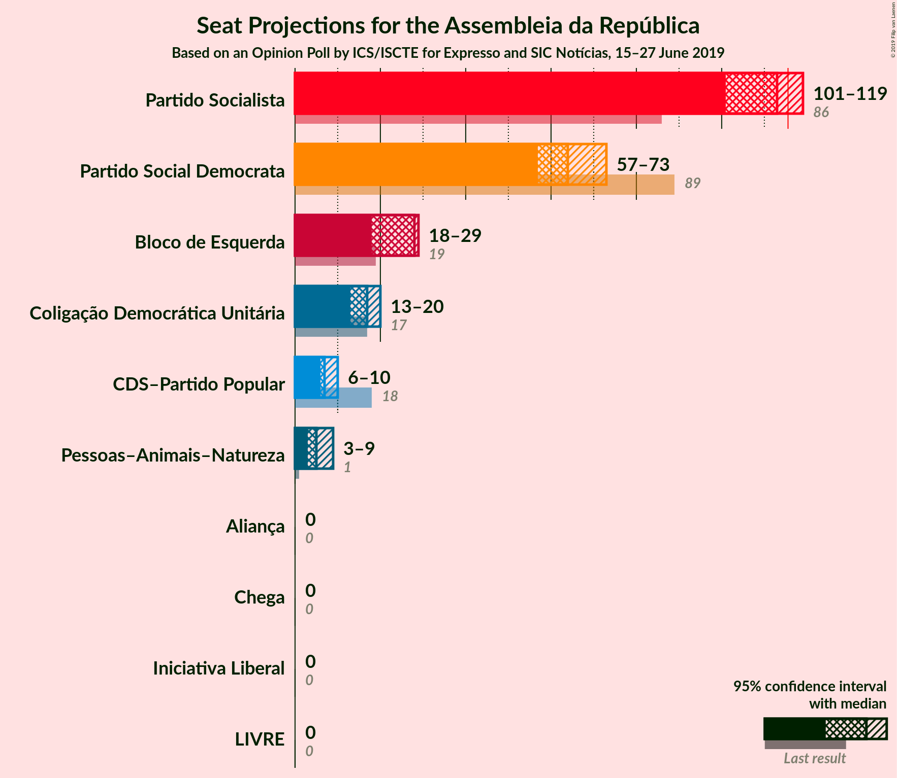
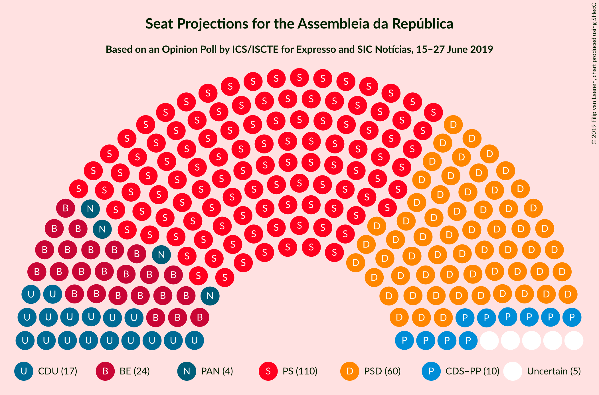
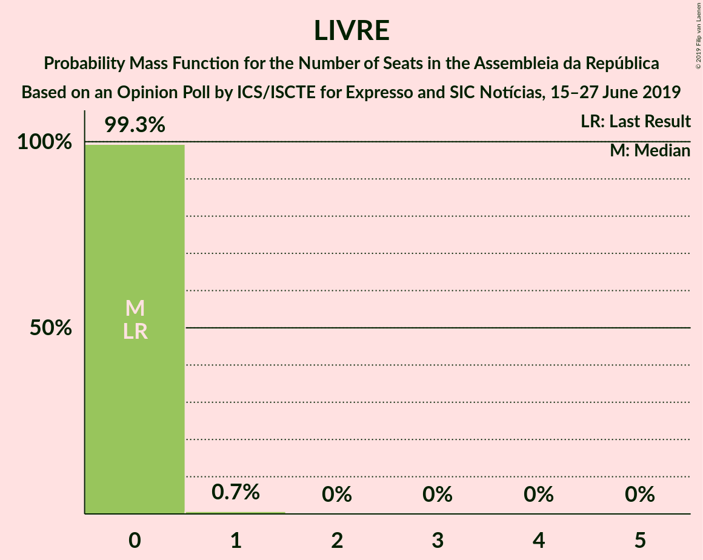
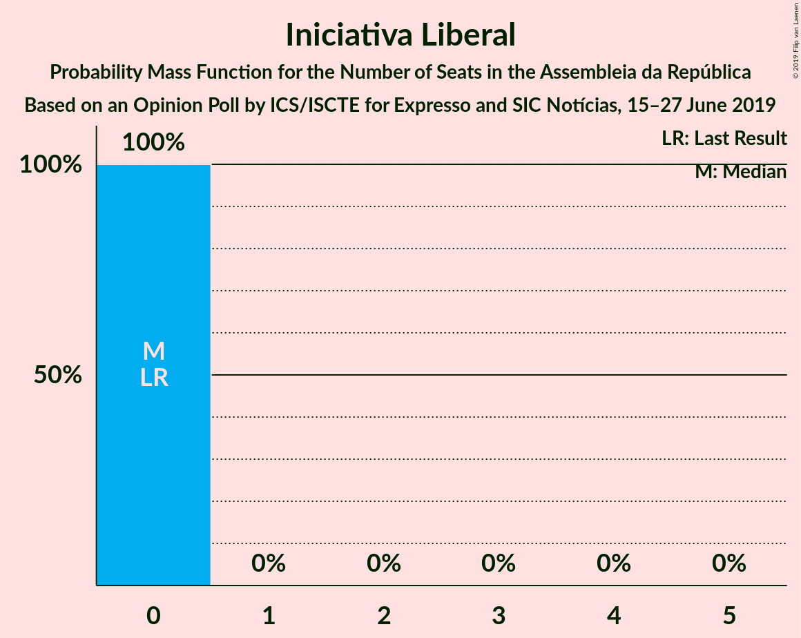
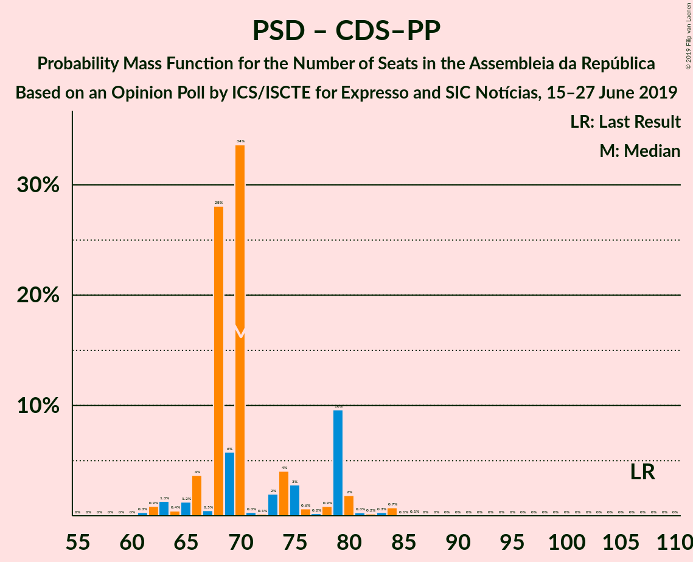

# Opinion Poll by ICS/ISCTE for Expresso and SIC Notícias, 15–27 June 2019

<a href="#voting-intentions">Voting Intentions</a> | <a href="#seats">Seats</a> | <a href="#coalitions">Coalitions</a> | <a href="#technical-information">Technical Information</a>

## Voting Intentions

### Confidence Intervals

| Party | Last Result | Poll Result | 80% Confidence Interval | 90% Confidence Interval | 95% Confidence Interval | 99% Confidence Interval |
|:-----:|:-----------:|:-----------:|:-----------------------:|:-----------------------:|:-----------------------:|:-----------------------:|
| Partido Socialista | 32.3% | 37.7% | 35.5–39.9% |34.9–40.6% |34.4–41.1% |33.4–42.2% |
| Partido Social Democrata | 36.9% | 22.8% | 21.0–24.8% |20.5–25.4% |20.1–25.9% |19.2–26.9% |
| Bloco de Esquerda | 10.2% | 10.9% | 9.6–12.4% |9.2–12.8% |8.9–13.2% |8.3–14.0% |
| Coligação Democrática Unitária | 8.2% | 8.0% | 6.9–9.4% |6.6–9.7% |6.3–10.1% |5.8–10.8% |
| CDS–Partido Popular | 36.9% | 5.0% | 4.1–6.1% |3.9–6.4% |3.7–6.7% |3.3–7.3% |
| Pessoas–Animais–Natureza | 1.4% | 4.0% | 3.2–5.0% |3.0–5.3% |2.8–5.6% |2.5–6.1% |
| Chega | 0.0% | 1.0% | 0.7–1.6% |0.6–1.8% |0.5–2.0% |0.4–2.3% |
| LIVRE | 0.7% | 0.2% | 0.1–0.7% |0.1–0.8% |0.1–0.9% |0.0–1.2% |
| Iniciativa Liberal | 0.0% | 0.2% | 0.1–0.7% |0.1–0.8% |0.1–0.9% |0.0–1.2% |
| Aliança | 0.0% | 0.2% | 0.1–0.7% |0.1–0.8% |0.1–0.9% |0.0–1.2% |

*Note:* The poll result column reflects the actual value used in the calculations. Published results may vary slightly, and in addition be rounded to fewer digits.

## Seats

### Confidence Intervals

| Party | Last Result | Median | 80% Confidence Interval | 90% Confidence Interval | 95% Confidence Interval | 99% Confidence Interval |
|:-----:|:-----------:|:------:|:-----------------------:|:-----------------------:|:-----------------------:|:-----------------------:|
| <a href="#partido-socialista">Partido Socialista</a> | 86 | 113 | 104–118 |101–119 |101–119 |95–127 |
| <a href="#partido-social-democrata">Partido Social Democrata</a> | 89 | 64 | 60–72 |59–72 |57–73 |54–77 |
| <a href="#bloco-de-esquerda">Bloco de Esquerda</a> | 19 | 28 | 20–28 |19–29 |18–29 |17–32 |
| <a href="#coligação-democrática-unitária">Coligação Democrática Unitária</a> | 17 | 17 | 13–19 |13–19 |13–20 |11–22 |
| <a href="#cds–partido-popular">CDS–Partido Popular</a> | 18 | 7 | 6–9 |6–10 |6–10 |5–15 |
| <a href="#pessoas–animais–natureza">Pessoas–Animais–Natureza</a> | 1 | 5 | 3–6 |3–7 |3–9 |2–9 |
| <a href="#chega">Chega</a> | 0 | 0 | 0 |0 |0 |0–2 |
| <a href="#livre">LIVRE</a> | 0 | 0 | 0 |0 |0 |0–1 |
| <a href="#iniciativa-liberal">Iniciativa Liberal</a> | 0 | 0 | 0 |0 |0 |0 |
| <a href="#aliança">Aliança</a> | 0 | 0 | 0 |0 |0 |0 |

### Partido Socialista

*For a full overview of the results for this party, see the [Partido Socialista](party-partidosocialista.html) page.*

| Number of Seats | Probability | Accumulated | Special Marks |
|:---------------:|:-----------:|:-----------:|:-------------:|
| 86 | 0% | 100% | Last Result |
| 87 | 0% | 100% |  |
| 88 | 0% | 100% |  |
| 89 | 0% | 100% |  |
| 90 | 0% | 100% |  |
| 91 | 0% | 100% |  |
| 92 | 0% | 100% |  |
| 93 | 0% | 100% |  |
| 94 | 0% | 100% |  |
| 95 | 0.5% | 100% |  |
| 96 | 0% | 99.5% |  |
| 97 | 0% | 99.5% |  |
| 98 | 0.1% | 99.5% |  |
| 99 | 0% | 99.4% |  |
| 100 | 0.1% | 99.4% |  |
| 101 | 6% | 99.2% |  |
| 102 | 0.5% | 94% |  |
| 103 | 0.3% | 93% |  |
| 104 | 4% | 93% |  |
| 105 | 0.4% | 89% |  |
| 106 | 3% | 89% |  |
| 107 | 0.3% | 86% |  |
| 108 | 1.0% | 85% |  |
| 109 | 1.1% | 84% |  |
| 110 | 30% | 83% |  |
| 111 | 1.3% | 54% |  |
| 112 | 1.0% | 52% |  |
| 113 | 3% | 51% | Median |
| 114 | 2% | 48% |  |
| 115 | 3% | 46% |  |
| 116 | 26% | 42% | Majority |
| 117 | 6% | 17% |  |
| 118 | 1.0% | 11% |  |
| 119 | 7% | 10% |  |
| 120 | 0.4% | 2% |  |
| 121 | 0.2% | 2% |  |
| 122 | 0% | 2% |  |
| 123 | 0.1% | 2% |  |
| 124 | 0.1% | 2% |  |
| 125 | 0.5% | 2% |  |
| 126 | 0% | 1.0% |  |
| 127 | 0.8% | 1.0% |  |
| 128 | 0.2% | 0.2% |  |
| 129 | 0% | 0% |  |

### Partido Social Democrata

*For a full overview of the results for this party, see the [Partido Social Democrata](party-partidosocialdemocrata.html) page.*

| Number of Seats | Probability | Accumulated | Special Marks |
|:---------------:|:-----------:|:-----------:|:-------------:|
| 52 | 0% | 100% |  |
| 53 | 0% | 99.9% |  |
| 54 | 0.4% | 99.9% |  |
| 55 | 0.6% | 99.5% |  |
| 56 | 1.1% | 98.9% |  |
| 57 | 0.5% | 98% |  |
| 58 | 1.1% | 97% |  |
| 59 | 4% | 96% |  |
| 60 | 8% | 92% |  |
| 61 | 32% | 84% |  |
| 62 | 0.8% | 52% |  |
| 63 | 0.2% | 51% |  |
| 64 | 28% | 51% | Median |
| 65 | 0.2% | 23% |  |
| 66 | 1.4% | 23% |  |
| 67 | 2% | 21% |  |
| 68 | 5% | 19% |  |
| 69 | 0.1% | 14% |  |
| 70 | 0.3% | 14% |  |
| 71 | 0.9% | 14% |  |
| 72 | 10% | 13% |  |
| 73 | 0.8% | 3% |  |
| 74 | 1.3% | 2% |  |
| 75 | 0.1% | 0.9% |  |
| 76 | 0% | 0.8% |  |
| 77 | 0.6% | 0.8% |  |
| 78 | 0% | 0.1% |  |
| 79 | 0.1% | 0.1% |  |
| 80 | 0% | 0% |  |
| 81 | 0% | 0% |  |
| 82 | 0% | 0% |  |
| 83 | 0% | 0% |  |
| 84 | 0% | 0% |  |
| 85 | 0% | 0% |  |
| 86 | 0% | 0% |  |
| 87 | 0% | 0% |  |
| 88 | 0% | 0% |  |
| 89 | 0% | 0% | Last Result |

### Bloco de Esquerda

*For a full overview of the results for this party, see the [Bloco de Esquerda](party-blocodeesquerda.html) page.*

| Number of Seats | Probability | Accumulated | Special Marks |
|:---------------:|:-----------:|:-----------:|:-------------:|
| 15 | 0% | 100% |  |
| 16 | 0.2% | 99.9% |  |
| 17 | 0.6% | 99.8% |  |
| 18 | 4% | 99.2% |  |
| 19 | 4% | 95% | Last Result |
| 20 | 5% | 91% |  |
| 21 | 3% | 86% |  |
| 22 | 2% | 82% |  |
| 23 | 6% | 81% |  |
| 24 | 2% | 75% |  |
| 25 | 4% | 72% |  |
| 26 | 0.5% | 68% |  |
| 27 | 7% | 68% |  |
| 28 | 55% | 61% | Median |
| 29 | 5% | 6% |  |
| 30 | 0.1% | 0.9% |  |
| 31 | 0.2% | 0.8% |  |
| 32 | 0.2% | 0.6% |  |
| 33 | 0.1% | 0.4% |  |
| 34 | 0.2% | 0.3% |  |
| 35 | 0.1% | 0.1% |  |
| 36 | 0% | 0% |  |

### Coligação Democrática Unitária

*For a full overview of the results for this party, see the [Coligação Democrática Unitária](party-coligaçãodemocráticaunitária.html) page.*

| Number of Seats | Probability | Accumulated | Special Marks |
|:---------------:|:-----------:|:-----------:|:-------------:|
| 7 | 0.1% | 100% |  |
| 8 | 0% | 99.9% |  |
| 9 | 0.1% | 99.8% |  |
| 10 | 0.1% | 99.8% |  |
| 11 | 0.3% | 99.6% |  |
| 12 | 0% | 99.3% |  |
| 13 | 32% | 99.3% |  |
| 14 | 6% | 67% |  |
| 15 | 2% | 61% |  |
| 16 | 6% | 59% |  |
| 17 | 16% | 53% | Last Result, Median |
| 18 | 3% | 37% |  |
| 19 | 30% | 34% |  |
| 20 | 3% | 4% |  |
| 21 | 0.2% | 1.2% |  |
| 22 | 0.7% | 1.0% |  |
| 23 | 0% | 0.3% |  |
| 24 | 0.3% | 0.3% |  |
| 25 | 0% | 0% |  |

### CDS–Partido Popular

*For a full overview of the results for this party, see the [CDS–Partido Popular](party-cds–partidopopular.html) page.*

| Number of Seats | Probability | Accumulated | Special Marks |
|:---------------:|:-----------:|:-----------:|:-------------:|
| 2 | 0.1% | 100% |  |
| 3 | 0% | 99.9% |  |
| 4 | 0.3% | 99.9% |  |
| 5 | 0.3% | 99.6% |  |
| 6 | 34% | 99.3% |  |
| 7 | 52% | 65% | Median |
| 8 | 2% | 13% |  |
| 9 | 5% | 12% |  |
| 10 | 5% | 7% |  |
| 11 | 0.4% | 2% |  |
| 12 | 0.3% | 2% |  |
| 13 | 0.6% | 1.2% |  |
| 14 | 0% | 0.7% |  |
| 15 | 0.5% | 0.6% |  |
| 16 | 0.1% | 0.2% |  |
| 17 | 0% | 0% |  |
| 18 | 0% | 0% | Last Result |

### Pessoas–Animais–Natureza

*For a full overview of the results for this party, see the [Pessoas–Animais–Natureza](party-pessoas–animais–natureza.html) page.*

| Number of Seats | Probability | Accumulated | Special Marks |
|:---------------:|:-----------:|:-----------:|:-------------:|
| 1 | 0% | 100% | Last Result |
| 2 | 0.9% | 100% |  |
| 3 | 31% | 99.1% |  |
| 4 | 1.2% | 68% |  |
| 5 | 29% | 67% | Median |
| 6 | 29% | 38% |  |
| 7 | 3% | 8% |  |
| 8 | 0.5% | 5% |  |
| 9 | 4% | 4% |  |
| 10 | 0.1% | 0.2% |  |
| 11 | 0% | 0.1% |  |
| 12 | 0% | 0.1% |  |
| 13 | 0% | 0.1% |  |
| 14 | 0.1% | 0.1% |  |
| 15 | 0% | 0% |  |

### Chega

*For a full overview of the results for this party, see the [Chega](party-chega.html) page.*

| Number of Seats | Probability | Accumulated | Special Marks |
|:---------------:|:-----------:|:-----------:|:-------------:|
| 0 | 98.8% | 100% | Last Result, Median |
| 1 | 0% | 1.2% |  |
| 2 | 1.2% | 1.2% |  |
| 3 | 0% | 0% |  |

### LIVRE

*For a full overview of the results for this party, see the [LIVRE](party-livre.html) page.*

| Number of Seats | Probability | Accumulated | Special Marks |
|:---------------:|:-----------:|:-----------:|:-------------:|
| 0 | 99.3% | 100% | Last Result, Median |
| 1 | 0.7% | 0.7% |  |
| 2 | 0% | 0% |  |

### Iniciativa Liberal

*For a full overview of the results for this party, see the [Iniciativa Liberal](party-iniciativaliberal.html) page.*

| Number of Seats | Probability | Accumulated | Special Marks |
|:---------------:|:-----------:|:-----------:|:-------------:|
| 0 | 100% | 100% | Last Result, Median |

### Aliança

*For a full overview of the results for this party, see the [Aliança](party-aliança.html) page.*

| Number of Seats | Probability | Accumulated | Special Marks |
|:---------------:|:-----------:|:-----------:|:-------------:|
| 0 | 100% | 100% | Last Result, Median |

## Coalitions

### Confidence Intervals

| Coalition | Last Result | Median | Majority? | 80% Confidence Interval | 90% Confidence Interval | 95% Confidence Interval | 99% Confidence Interval |
|:---------:|:-----------:|:------:|:---------:|:-----------------------:|:-----------------------:|:-----------------------:|:-----------------------:|
| Partido Socialista – Bloco de Esquerda – Coligação Democrática Unitária | 122 | 157 | 100% | 145–157 | 145–158 | 144–161 | 140–163 |
| Partido Socialista – Bloco de Esquerda | 105 | 138 | 100% | 129–144 | 128–144 | 128–144 | 122–149 |
| Partido Socialista – Coligação Democrática Unitária | 103 | 129 | 99.3% | 120–134 | 118–136 | 118–137 | 113–144 |
| Partido Socialista | 86 | 113 | 42% | 104–118 | 101–119 | 101–119 | 95–127 |
| Partido Social Democrata – CDS–Partido Popular | 107 | 70 | 0% | 68–79 | 66–79 | 63–80 | 62–84 |

### Partido Socialista – Bloco de Esquerda – Coligação Democrática Unitária

| Number of Seats | Probability | Accumulated | Special Marks |
|:---------------:|:-----------:|:-----------:|:-------------:|
| 122 | 0% | 100% | Last Result |
| 123 | 0% | 100% |  |
| 124 | 0% | 100% |  |
| 125 | 0% | 100% |  |
| 126 | 0% | 100% |  |
| 127 | 0% | 100% |  |
| 128 | 0% | 100% |  |
| 129 | 0% | 100% |  |
| 130 | 0% | 100% |  |
| 131 | 0% | 100% |  |
| 132 | 0% | 100% |  |
| 133 | 0% | 100% |  |
| 134 | 0% | 100% |  |
| 135 | 0% | 100% |  |
| 136 | 0% | 100% |  |
| 137 | 0% | 100% |  |
| 138 | 0% | 99.9% |  |
| 139 | 0% | 99.9% |  |
| 140 | 1.0% | 99.9% |  |
| 141 | 0.1% | 98.9% |  |
| 142 | 0.2% | 98.8% |  |
| 143 | 0.1% | 98.5% |  |
| 144 | 1.1% | 98% |  |
| 145 | 10% | 97% |  |
| 146 | 0.6% | 87% |  |
| 147 | 0.2% | 87% |  |
| 148 | 1.1% | 87% |  |
| 149 | 5% | 85% |  |
| 150 | 2% | 80% |  |
| 151 | 1.4% | 78% |  |
| 152 | 0.3% | 77% |  |
| 153 | 1.1% | 76% |  |
| 154 | 6% | 75% |  |
| 155 | 8% | 70% |  |
| 156 | 0.2% | 62% |  |
| 157 | 56% | 62% |  |
| 158 | 2% | 6% | Median |
| 159 | 0.2% | 4% |  |
| 160 | 0.4% | 3% |  |
| 161 | 0.8% | 3% |  |
| 162 | 1.3% | 2% |  |
| 163 | 0.4% | 0.8% |  |
| 164 | 0.4% | 0.5% |  |
| 165 | 0% | 0% |  |

### Partido Socialista – Bloco de Esquerda

| Number of Seats | Probability | Accumulated | Special Marks |
|:---------------:|:-----------:|:-----------:|:-------------:|
| 105 | 0% | 100% | Last Result |
| 106 | 0% | 100% |  |
| 107 | 0% | 100% |  |
| 108 | 0% | 100% |  |
| 109 | 0% | 100% |  |
| 110 | 0% | 100% |  |
| 111 | 0% | 100% |  |
| 112 | 0% | 100% |  |
| 113 | 0% | 100% |  |
| 114 | 0% | 100% |  |
| 115 | 0% | 100% |  |
| 116 | 0% | 100% | Majority |
| 117 | 0% | 100% |  |
| 118 | 0% | 100% |  |
| 119 | 0% | 100% |  |
| 120 | 0% | 100% |  |
| 121 | 0% | 100% |  |
| 122 | 0.5% | 99.9% |  |
| 123 | 0.3% | 99.4% |  |
| 124 | 0.1% | 99.1% |  |
| 125 | 0.3% | 99.0% |  |
| 126 | 0.3% | 98.7% |  |
| 127 | 0.1% | 98% |  |
| 128 | 6% | 98% |  |
| 129 | 5% | 93% |  |
| 130 | 0.7% | 88% |  |
| 131 | 4% | 87% |  |
| 132 | 0.2% | 82% |  |
| 133 | 0.2% | 82% |  |
| 134 | 2% | 82% |  |
| 135 | 2% | 80% |  |
| 136 | 0.9% | 77% |  |
| 137 | 6% | 76% |  |
| 138 | 33% | 70% |  |
| 139 | 1.4% | 37% |  |
| 140 | 0.3% | 36% |  |
| 141 | 0.1% | 35% | Median |
| 142 | 5% | 35% |  |
| 143 | 0.5% | 31% |  |
| 144 | 28% | 30% |  |
| 145 | 0.1% | 2% |  |
| 146 | 0.4% | 2% |  |
| 147 | 0.4% | 2% |  |
| 148 | 0.7% | 1.3% |  |
| 149 | 0.4% | 0.6% |  |
| 150 | 0% | 0.2% |  |
| 151 | 0.1% | 0.1% |  |
| 152 | 0% | 0% |  |

### Partido Socialista – Coligação Democrática Unitária

| Number of Seats | Probability | Accumulated | Special Marks |
|:---------------:|:-----------:|:-----------:|:-------------:|
| 103 | 0% | 100% | Last Result |
| 104 | 0% | 100% |  |
| 105 | 0% | 100% |  |
| 106 | 0% | 100% |  |
| 107 | 0% | 100% |  |
| 108 | 0% | 100% |  |
| 109 | 0% | 100% |  |
| 110 | 0% | 100% |  |
| 111 | 0.1% | 100% |  |
| 112 | 0% | 99.9% |  |
| 113 | 0.5% | 99.9% |  |
| 114 | 0% | 99.4% |  |
| 115 | 0.1% | 99.4% |  |
| 116 | 0% | 99.3% | Majority |
| 117 | 0.1% | 99.3% |  |
| 118 | 6% | 99.2% |  |
| 119 | 0.2% | 93% |  |
| 120 | 7% | 93% |  |
| 121 | 0.8% | 87% |  |
| 122 | 0.5% | 86% |  |
| 123 | 0.5% | 85% |  |
| 124 | 0.2% | 85% |  |
| 125 | 0.5% | 85% |  |
| 126 | 4% | 84% |  |
| 127 | 1.0% | 81% |  |
| 128 | 3% | 80% |  |
| 129 | 53% | 77% |  |
| 130 | 0.4% | 23% | Median |
| 131 | 5% | 23% |  |
| 132 | 4% | 18% |  |
| 133 | 1.2% | 14% |  |
| 134 | 5% | 13% |  |
| 135 | 0% | 8% |  |
| 136 | 4% | 8% |  |
| 137 | 2% | 4% |  |
| 138 | 0.1% | 2% |  |
| 139 | 0% | 2% |  |
| 140 | 0% | 2% |  |
| 141 | 1.1% | 2% |  |
| 142 | 0% | 0.6% |  |
| 143 | 0% | 0.5% |  |
| 144 | 0.1% | 0.5% |  |
| 145 | 0.4% | 0.4% |  |
| 146 | 0% | 0% |  |

### Partido Socialista

| Number of Seats | Probability | Accumulated | Special Marks |
|:---------------:|:-----------:|:-----------:|:-------------:|
| 86 | 0% | 100% | Last Result |
| 87 | 0% | 100% |  |
| 88 | 0% | 100% |  |
| 89 | 0% | 100% |  |
| 90 | 0% | 100% |  |
| 91 | 0% | 100% |  |
| 92 | 0% | 100% |  |
| 93 | 0% | 100% |  |
| 94 | 0% | 100% |  |
| 95 | 0.5% | 100% |  |
| 96 | 0% | 99.5% |  |
| 97 | 0% | 99.5% |  |
| 98 | 0.1% | 99.5% |  |
| 99 | 0% | 99.4% |  |
| 100 | 0.1% | 99.4% |  |
| 101 | 6% | 99.2% |  |
| 102 | 0.5% | 94% |  |
| 103 | 0.3% | 93% |  |
| 104 | 4% | 93% |  |
| 105 | 0.4% | 89% |  |
| 106 | 3% | 89% |  |
| 107 | 0.3% | 86% |  |
| 108 | 1.0% | 85% |  |
| 109 | 1.1% | 84% |  |
| 110 | 30% | 83% |  |
| 111 | 1.3% | 54% |  |
| 112 | 1.0% | 52% |  |
| 113 | 3% | 51% | Median |
| 114 | 2% | 48% |  |
| 115 | 3% | 46% |  |
| 116 | 26% | 42% | Majority |
| 117 | 6% | 17% |  |
| 118 | 1.0% | 11% |  |
| 119 | 7% | 10% |  |
| 120 | 0.4% | 2% |  |
| 121 | 0.2% | 2% |  |
| 122 | 0% | 2% |  |
| 123 | 0.1% | 2% |  |
| 124 | 0.1% | 2% |  |
| 125 | 0.5% | 2% |  |
| 126 | 0% | 1.0% |  |
| 127 | 0.8% | 1.0% |  |
| 128 | 0.2% | 0.2% |  |
| 129 | 0% | 0% |  |

### Partido Social Democrata – CDS–Partido Popular

| Number of Seats | Probability | Accumulated | Special Marks |
|:---------------:|:-----------:|:-----------:|:-------------:|
| 59 | 0% | 100% |  |
| 60 | 0% | 99.9% |  |
| 61 | 0.3% | 99.9% |  |
| 62 | 0.9% | 99.6% |  |
| 63 | 1.3% | 98.7% |  |
| 64 | 0.4% | 97% |  |
| 65 | 1.2% | 97% |  |
| 66 | 4% | 96% |  |
| 67 | 0.5% | 92% |  |
| 68 | 28% | 92% |  |
| 69 | 6% | 64% |  |
| 70 | 34% | 58% |  |
| 71 | 0.3% | 24% | Median |
| 72 | 0.1% | 24% |  |
| 73 | 2% | 24% |  |
| 74 | 4% | 22% |  |
| 75 | 3% | 18% |  |
| 76 | 0.6% | 15% |  |
| 77 | 0.2% | 14% |  |
| 78 | 0.9% | 14% |  |
| 79 | 10% | 13% |  |
| 80 | 2% | 4% |  |
| 81 | 0.3% | 2% |  |
| 82 | 0.2% | 1.4% |  |
| 83 | 0.3% | 1.2% |  |
| 84 | 0.7% | 0.9% |  |
| 85 | 0.1% | 0.2% |  |
| 86 | 0.1% | 0.1% |  |
| 87 | 0% | 0% |  |
| 88 | 0% | 0% |  |
| 89 | 0% | 0% |  |
| 90 | 0% | 0% |  |
| 91 | 0% | 0% |  |
| 92 | 0% | 0% |  |
| 93 | 0% | 0% |  |
| 94 | 0% | 0% |  |
| 95 | 0% | 0% |  |
| 96 | 0% | 0% |  |
| 97 | 0% | 0% |  |
| 98 | 0% | 0% |  |
| 99 | 0% | 0% |  |
| 100 | 0% | 0% |  |
| 101 | 0% | 0% |  |
| 102 | 0% | 0% |  |
| 103 | 0% | 0% |  |
| 104 | 0% | 0% |  |
| 105 | 0% | 0% |  |
| 106 | 0% | 0% |  |
| 107 | 0% | 0% | Last Result |

## Technical Information

### Opinion Poll

+ **Polling firm:** ICS/ISCTE
+ **Commissioner(s):** Expresso and SIC Notícias
+ **Fieldwork period:** 15–27 June 2019

### Calculations

+ **Sample size:** 801
+ **Simulations done:** 131,072
+ **Error estimate:** 2.55%

