# Opinion Poll by GfK Metris for Expresso and SIC Notícias, 24 August–5 September 2019

<a href="#voting-intentions">Voting Intentions</a> | <a href="#seats">Seats</a> | <a href="#coalitions">Coalitions</a> | <a href="#technical-information">Technical Information</a>

## Voting Intentions

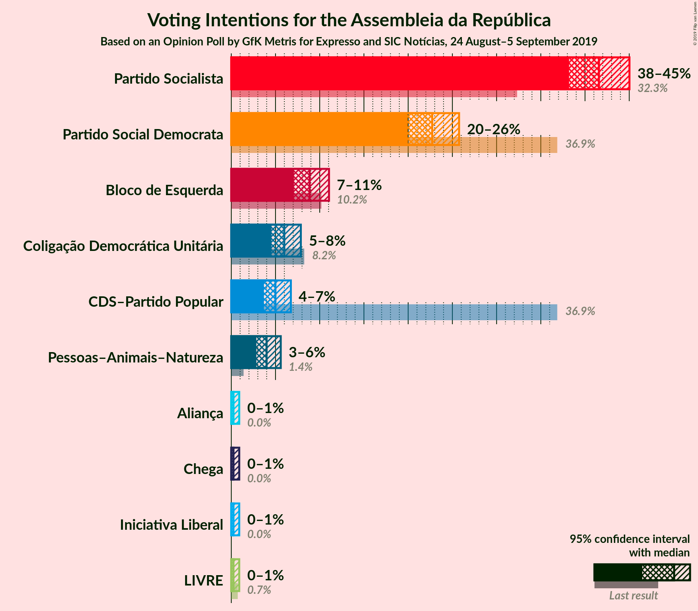

### Confidence Intervals

| Party | Last Result | Poll Result | 80% Confidence Interval | 90% Confidence Interval | 95% Confidence Interval | 99% Confidence Interval |
|:-----:|:-----------:|:-----------:|:-----------------------:|:-----------------------:|:-----------------------:|:-----------------------:|
| Partido Socialista | 32.3% | 41.6% | 39.4–43.8% |38.7–44.5% |38.2–45.0% |37.2–46.1% |
| Partido Social Democrata | 36.9% | 22.7% | 20.9–24.7% |20.4–25.3% |20.0–25.8% |19.1–26.7% |
| Bloco de Esquerda | 10.2% | 8.9% | 7.7–10.3% |7.4–10.7% |7.1–11.1% |6.6–11.8% |
| Coligação Democrática Unitária | 8.2% | 6.0% | 5.0–7.2% |4.8–7.6% |4.5–7.9% |4.1–8.5% |
| CDS–Partido Popular | 36.9% | 5.0% | 4.1–6.1% |3.9–6.4% |3.7–6.7% |3.3–7.3% |
| Pessoas–Animais–Natureza | 1.4% | 4.0% | 3.2–5.0% |3.0–5.3% |2.8–5.6% |2.5–6.1% |
| LIVRE | 0.7% | 0.2% | 0.1–0.7% |0.1–0.8% |0.1–0.9% |0.0–1.2% |
| Iniciativa Liberal | 0.0% | 0.2% | 0.1–0.7% |0.1–0.8% |0.1–0.9% |0.0–1.2% |
| Aliança | 0.0% | 0.2% | 0.1–0.7% |0.1–0.8% |0.1–0.9% |0.0–1.2% |
| Chega | 0.0% | 0.2% | 0.1–0.7% |0.1–0.8% |0.1–0.9% |0.0–1.2% |

*Note:* The poll result column reflects the actual value used in the calculations. Published results may vary slightly, and in addition be rounded to fewer digits.

## Seats

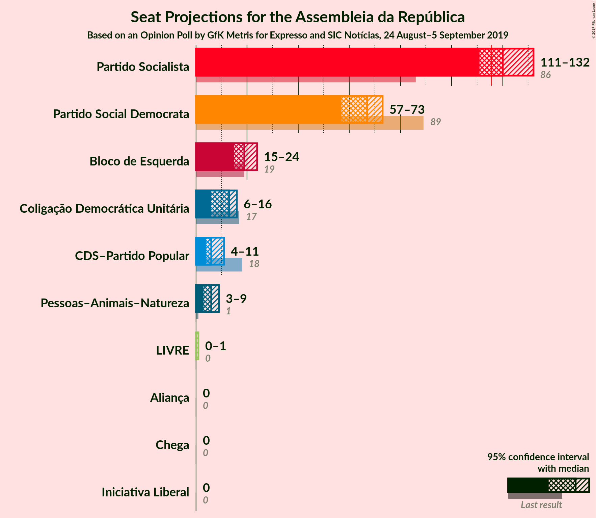

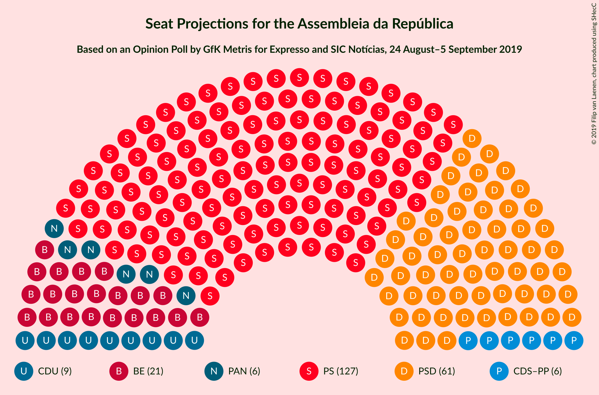

### Confidence Intervals

| Party | Last Result | Median | 80% Confidence Interval | 90% Confidence Interval | 95% Confidence Interval | 99% Confidence Interval |
|:-----:|:-----------:|:------:|:-----------------------:|:-----------------------:|:-----------------------:|:-----------------------:|
| <a href="#partido-socialista">Partido Socialista</a> | 86 | 120 | 115–129 |114–131 |111–132 |108–136 |
| <a href="#partido-social-democrata">Partido Social Democrata</a> | 89 | 67 | 60–70 |59–71 |57–73 |53–76 |
| <a href="#bloco-de-esquerda">Bloco de Esquerda</a> | 19 | 19 | 17–24 |16–24 |15–24 |12–28 |
| <a href="#coligação-democrática-unitária">Coligação Democrática Unitária</a> | 17 | 13 | 9–15 |7–16 |6–16 |5–18 |
| <a href="#cds–partido-popular">CDS–Partido Popular</a> | 18 | 6 | 4–8 |4–10 |4–11 |2–15 |
| <a href="#pessoas–animais–natureza">Pessoas–Animais–Natureza</a> | 1 | 6 | 4–6 |3–8 |3–9 |3–9 |
| <a href="#livre">LIVRE</a> | 0 | 0 | 0 |0 |0–1 |0–1 |
| <a href="#iniciativa-liberal">Iniciativa Liberal</a> | 0 | 0 | 0 |0 |0 |0 |
| <a href="#aliança">Aliança</a> | 0 | 0 | 0 |0 |0 |0 |
| <a href="#chega">Chega</a> | 0 | 0 | 0 |0 |0 |0 |

### Partido Socialista

*For a full overview of the results for this party, see the [Partido Socialista](party-partidosocialista.html) page.*

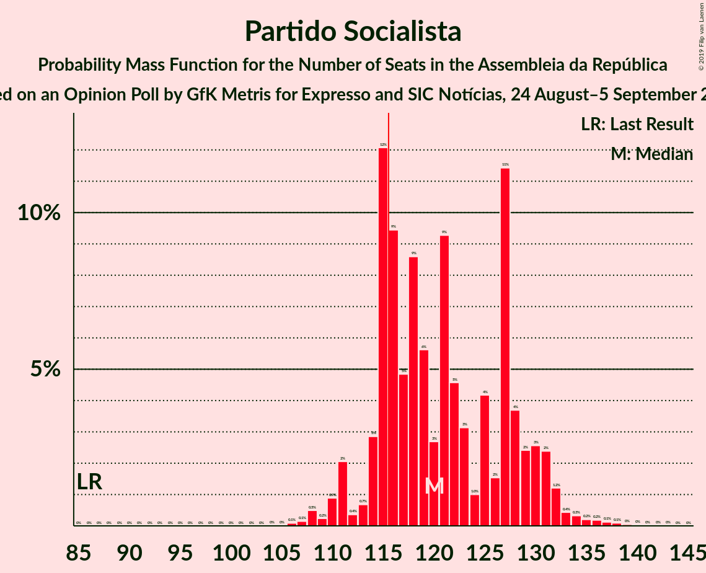

| Number of Seats | Probability | Accumulated | Special Marks |
|:---------------:|:-----------:|:-----------:|:-------------:|
| 86 | 0% | 100% | Last Result |
| 87 | 0% | 100% |  |
| 88 | 0% | 100% |  |
| 89 | 0% | 100% |  |
| 90 | 0% | 100% |  |
| 91 | 0% | 100% |  |
| 92 | 0% | 100% |  |
| 93 | 0% | 100% |  |
| 94 | 0% | 100% |  |
| 95 | 0% | 100% |  |
| 96 | 0% | 100% |  |
| 97 | 0% | 100% |  |
| 98 | 0% | 100% |  |
| 99 | 0% | 100% |  |
| 100 | 0% | 100% |  |
| 101 | 0% | 100% |  |
| 102 | 0% | 100% |  |
| 103 | 0% | 100% |  |
| 104 | 0% | 100% |  |
| 105 | 0% | 100% |  |
| 106 | 0.1% | 100% |  |
| 107 | 0.1% | 99.9% |  |
| 108 | 0.5% | 99.7% |  |
| 109 | 0.2% | 99.2% |  |
| 110 | 0.9% | 99.0% |  |
| 111 | 2% | 98% |  |
| 112 | 0.4% | 96% |  |
| 113 | 0.7% | 96% |  |
| 114 | 3% | 95% |  |
| 115 | 12% | 92% |  |
| 116 | 9% | 80% | Majority |
| 117 | 5% | 71% |  |
| 118 | 9% | 66% |  |
| 119 | 6% | 57% |  |
| 120 | 3% | 52% | Median |
| 121 | 9% | 49% |  |
| 122 | 5% | 40% |  |
| 123 | 3% | 35% |  |
| 124 | 1.0% | 32% |  |
| 125 | 4% | 31% |  |
| 126 | 2% | 27% |  |
| 127 | 11% | 25% |  |
| 128 | 4% | 14% |  |
| 129 | 2% | 10% |  |
| 130 | 3% | 8% |  |
| 131 | 2% | 5% |  |
| 132 | 1.2% | 3% |  |
| 133 | 0.4% | 1.5% |  |
| 134 | 0.3% | 1.0% |  |
| 135 | 0.2% | 0.7% |  |
| 136 | 0.2% | 0.5% |  |
| 137 | 0.1% | 0.3% |  |
| 138 | 0.1% | 0.2% |  |
| 139 | 0% | 0.1% |  |
| 140 | 0% | 0.1% |  |
| 141 | 0% | 0% |  |

### Partido Social Democrata

*For a full overview of the results for this party, see the [Partido Social Democrata](party-partidosocialdemocrata.html) page.*

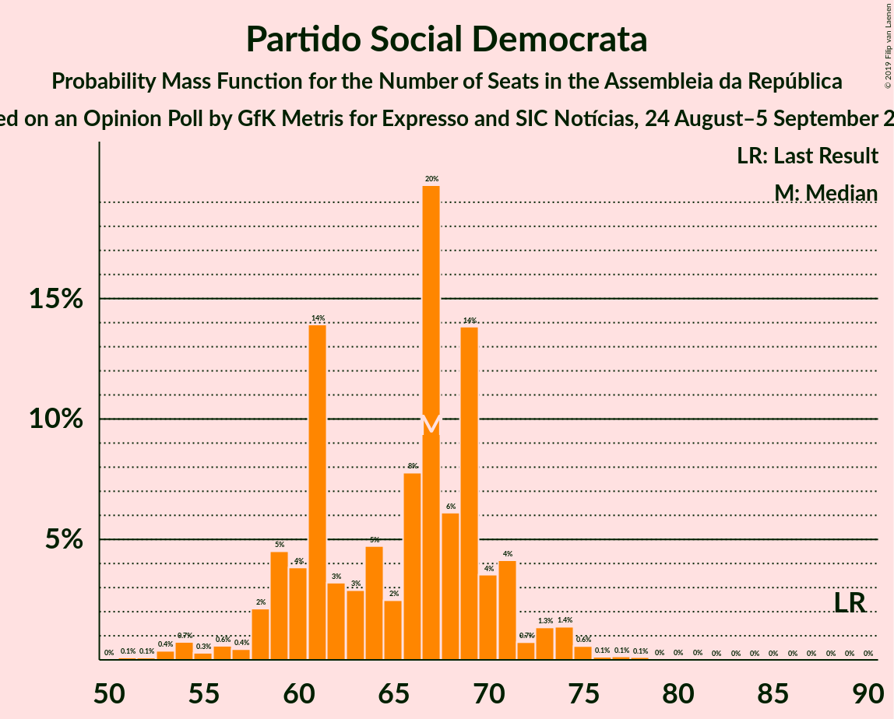

| Number of Seats | Probability | Accumulated | Special Marks |
|:---------------:|:-----------:|:-----------:|:-------------:|
| 51 | 0.1% | 100% |  |
| 52 | 0.1% | 99.9% |  |
| 53 | 0.4% | 99.8% |  |
| 54 | 0.7% | 99.4% |  |
| 55 | 0.3% | 98.6% |  |
| 56 | 0.6% | 98% |  |
| 57 | 0.4% | 98% |  |
| 58 | 2% | 97% |  |
| 59 | 5% | 95% |  |
| 60 | 4% | 91% |  |
| 61 | 14% | 87% |  |
| 62 | 3% | 73% |  |
| 63 | 3% | 70% |  |
| 64 | 5% | 67% |  |
| 65 | 2% | 62% |  |
| 66 | 8% | 60% |  |
| 67 | 20% | 52% | Median |
| 68 | 6% | 32% |  |
| 69 | 14% | 26% |  |
| 70 | 4% | 12% |  |
| 71 | 4% | 9% |  |
| 72 | 0.7% | 5% |  |
| 73 | 1.3% | 4% |  |
| 74 | 1.4% | 2% |  |
| 75 | 0.6% | 1.1% |  |
| 76 | 0.1% | 0.5% |  |
| 77 | 0.1% | 0.4% |  |
| 78 | 0.1% | 0.2% |  |
| 79 | 0% | 0.1% |  |
| 80 | 0% | 0.1% |  |
| 81 | 0% | 0.1% |  |
| 82 | 0% | 0% |  |
| 83 | 0% | 0% |  |
| 84 | 0% | 0% |  |
| 85 | 0% | 0% |  |
| 86 | 0% | 0% |  |
| 87 | 0% | 0% |  |
| 88 | 0% | 0% |  |
| 89 | 0% | 0% | Last Result |

### Bloco de Esquerda

*For a full overview of the results for this party, see the [Bloco de Esquerda](party-blocodeesquerda.html) page.*

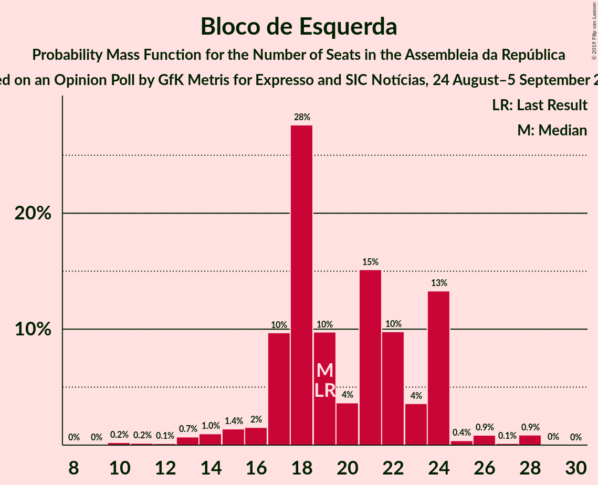

| Number of Seats | Probability | Accumulated | Special Marks |
|:---------------:|:-----------:|:-----------:|:-------------:|
| 10 | 0.2% | 100% |  |
| 11 | 0.2% | 99.8% |  |
| 12 | 0.1% | 99.6% |  |
| 13 | 0.7% | 99.5% |  |
| 14 | 1.0% | 98.7% |  |
| 15 | 1.4% | 98% |  |
| 16 | 2% | 96% |  |
| 17 | 10% | 95% |  |
| 18 | 28% | 85% |  |
| 19 | 10% | 58% | Last Result, Median |
| 20 | 4% | 48% |  |
| 21 | 15% | 44% |  |
| 22 | 10% | 29% |  |
| 23 | 4% | 19% |  |
| 24 | 13% | 16% |  |
| 25 | 0.4% | 2% |  |
| 26 | 0.9% | 2% |  |
| 27 | 0.1% | 1.1% |  |
| 28 | 0.9% | 0.9% |  |
| 29 | 0% | 0.1% |  |
| 30 | 0% | 0% |  |

### Coligação Democrática Unitária

*For a full overview of the results for this party, see the [Coligação Democrática Unitária](party-coligaçãodemocráticaunitária.html) page.*

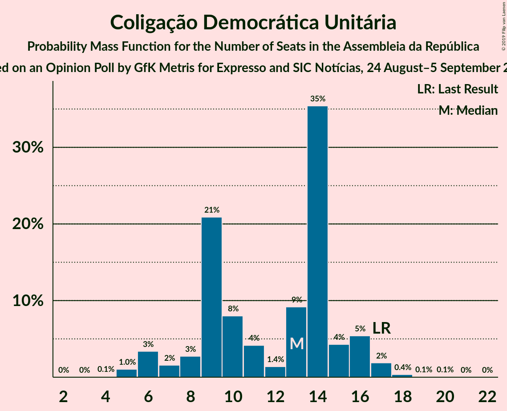

| Number of Seats | Probability | Accumulated | Special Marks |
|:---------------:|:-----------:|:-----------:|:-------------:|
| 4 | 0.1% | 100% |  |
| 5 | 1.0% | 99.9% |  |
| 6 | 3% | 98.9% |  |
| 7 | 2% | 95% |  |
| 8 | 3% | 94% |  |
| 9 | 21% | 91% |  |
| 10 | 8% | 70% |  |
| 11 | 4% | 62% |  |
| 12 | 1.4% | 58% |  |
| 13 | 9% | 57% | Median |
| 14 | 35% | 48% |  |
| 15 | 4% | 12% |  |
| 16 | 5% | 8% |  |
| 17 | 2% | 2% | Last Result |
| 18 | 0.4% | 0.5% |  |
| 19 | 0.1% | 0.2% |  |
| 20 | 0.1% | 0.1% |  |
| 21 | 0% | 0% |  |

### CDS–Partido Popular

*For a full overview of the results for this party, see the [CDS–Partido Popular](party-cds–partidopopular.html) page.*

| Number of Seats | Probability | Accumulated | Special Marks |
|:---------------:|:-----------:|:-----------:|:-------------:|
| 2 | 2% | 100% |  |
| 3 | 0.6% | 98% |  |
| 4 | 16% | 98% |  |
| 5 | 1.3% | 81% |  |
| 6 | 38% | 80% | Median |
| 7 | 31% | 42% |  |
| 8 | 1.4% | 10% |  |
| 9 | 3% | 9% |  |
| 10 | 3% | 6% |  |
| 11 | 1.2% | 3% |  |
| 12 | 1.2% | 2% |  |
| 13 | 0.3% | 0.9% |  |
| 14 | 0.1% | 0.7% |  |
| 15 | 0.1% | 0.6% |  |
| 16 | 0.3% | 0.4% |  |
| 17 | 0% | 0.2% |  |
| 18 | 0.1% | 0.1% | Last Result |
| 19 | 0.1% | 0.1% |  |
| 20 | 0% | 0% |  |

### Pessoas–Animais–Natureza

*For a full overview of the results for this party, see the [Pessoas–Animais–Natureza](party-pessoas–animais–natureza.html) page.*

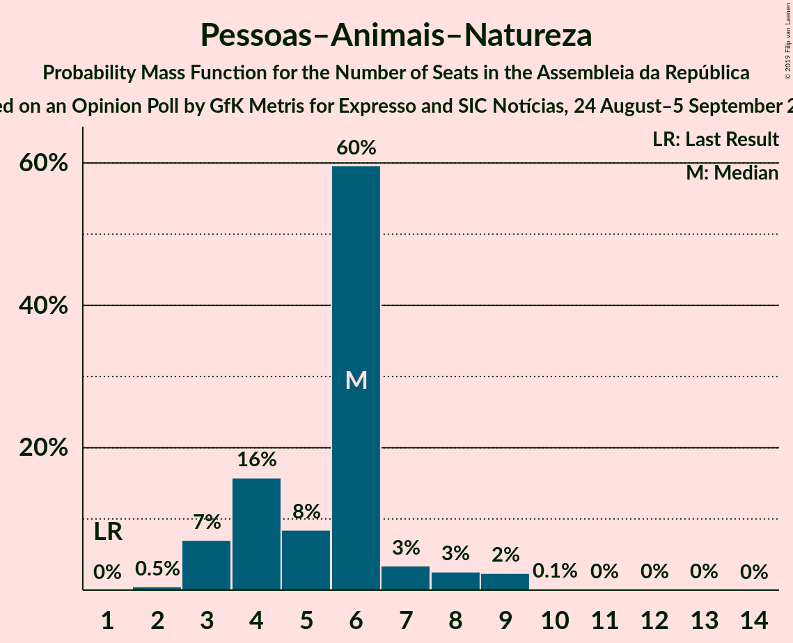

| Number of Seats | Probability | Accumulated | Special Marks |
|:---------------:|:-----------:|:-----------:|:-------------:|
| 1 | 0% | 100% | Last Result |
| 2 | 0.5% | 100% |  |
| 3 | 7% | 99.5% |  |
| 4 | 16% | 92% |  |
| 5 | 8% | 77% |  |
| 6 | 60% | 68% | Median |
| 7 | 3% | 9% |  |
| 8 | 3% | 5% |  |
| 9 | 2% | 3% |  |
| 10 | 0.1% | 0.3% |  |
| 11 | 0% | 0.1% |  |
| 12 | 0% | 0.1% |  |
| 13 | 0% | 0.1% |  |
| 14 | 0% | 0% |  |

### LIVRE

*For a full overview of the results for this party, see the [LIVRE](party-livre.html) page.*

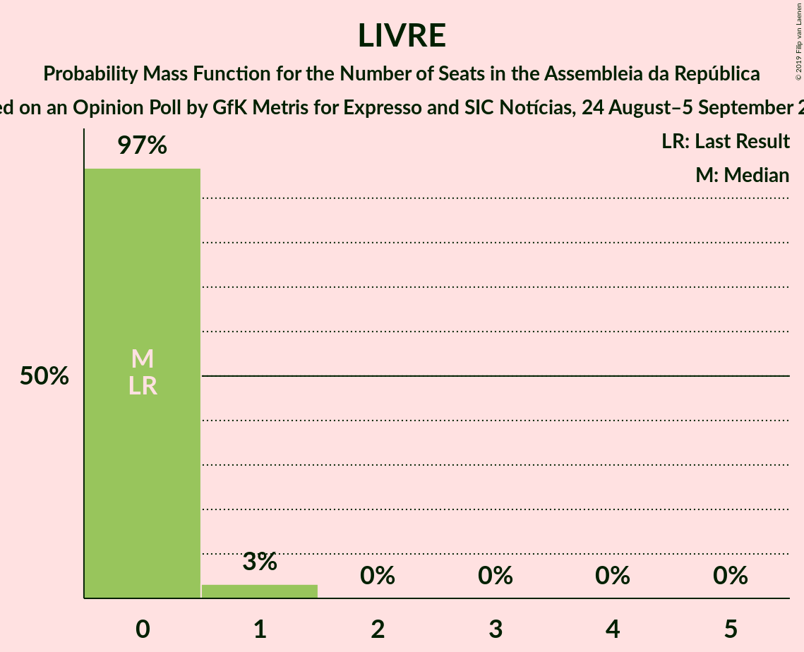

| Number of Seats | Probability | Accumulated | Special Marks |
|:---------------:|:-----------:|:-----------:|:-------------:|
| 0 | 97% | 100% | Last Result, Median |
| 1 | 3% | 3% |  |
| 2 | 0% | 0% |  |

### Iniciativa Liberal

*For a full overview of the results for this party, see the [Iniciativa Liberal](party-iniciativaliberal.html) page.*

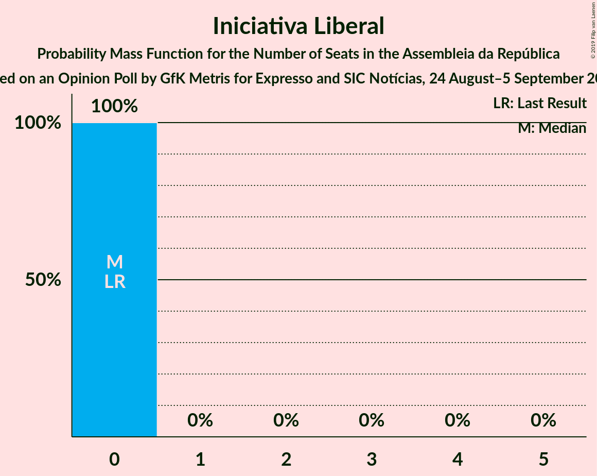

| Number of Seats | Probability | Accumulated | Special Marks |
|:---------------:|:-----------:|:-----------:|:-------------:|
| 0 | 100% | 100% | Last Result, Median |

### Aliança

*For a full overview of the results for this party, see the [Aliança](party-aliança.html) page.*

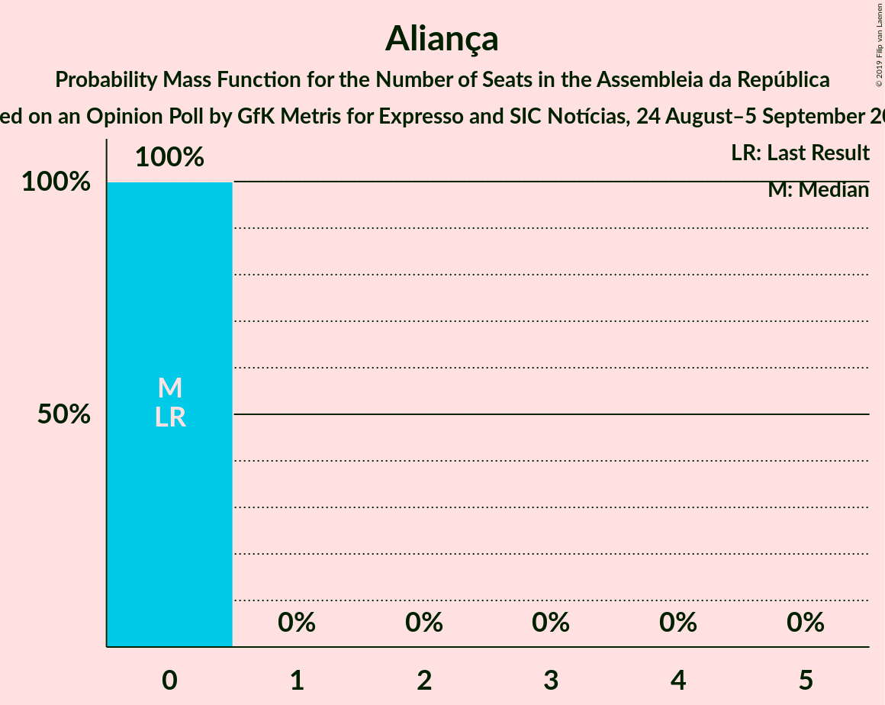

| Number of Seats | Probability | Accumulated | Special Marks |
|:---------------:|:-----------:|:-----------:|:-------------:|
| 0 | 100% | 100% | Last Result, Median |

### Chega

*For a full overview of the results for this party, see the [Chega](party-chega.html) page.*

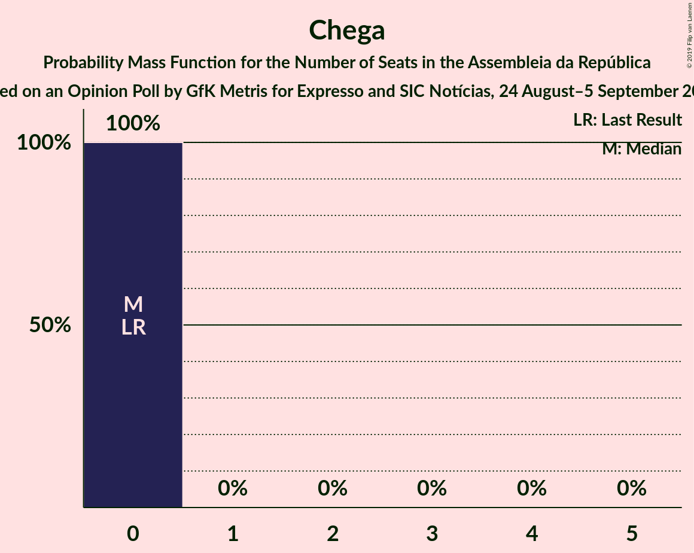

| Number of Seats | Probability | Accumulated | Special Marks |
|:---------------:|:-----------:|:-----------:|:-------------:|
| 0 | 100% | 100% | Last Result, Median |

## Coalitions

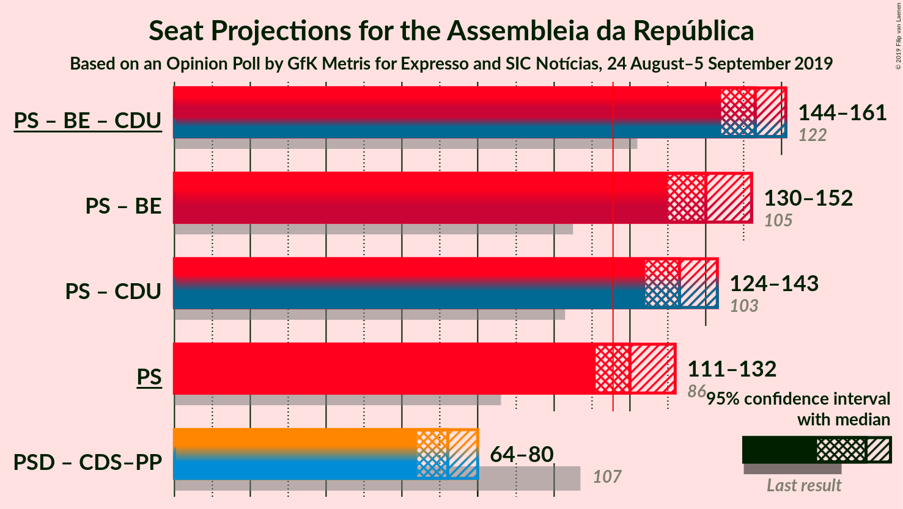

### Confidence Intervals

| Coalition | Last Result | Median | Majority? | 80% Confidence Interval | 90% Confidence Interval | 95% Confidence Interval | 99% Confidence Interval |
|:---------:|:-----------:|:------:|:---------:|:-----------------------:|:-----------------------:|:-----------------------:|:-----------------------:|
| Partido Socialista – Bloco de Esquerda – Coligação Democrática Unitária | 122 | 153 | 100% | 147–159 | 144–161 | 144–161 | 141–164 |
| Partido Socialista – Bloco de Esquerda | 105 | 140 | 100% | 134–148 | 132–150 | 130–152 | 128–155 |
| Partido Socialista – Coligação Democrática Unitária | 103 | 133 | 100% | 125–140 | 125–141 | 124–143 | 120–145 |
| Partido Socialista | 86 | 120 | 80% | 115–129 | 114–131 | 111–132 | 108–136 |
| Partido Social Democrata – CDS–Partido Popular | 107 | 72 | 0% | 66–77 | 65–78 | 64–80 | 61–83 |

### Partido Socialista – Bloco de Esquerda – Coligação Democrática Unitária

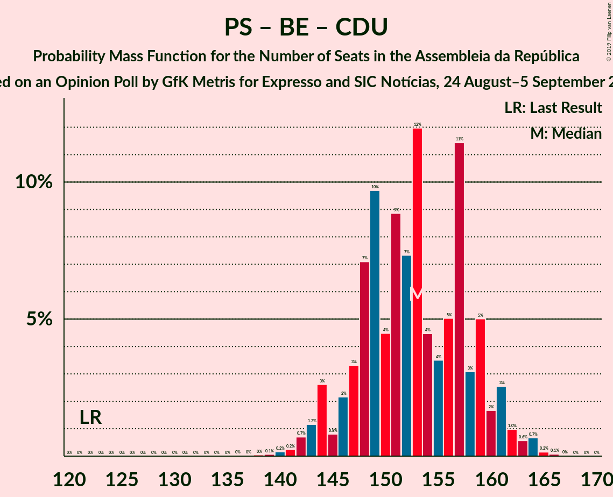

| Number of Seats | Probability | Accumulated | Special Marks |
|:---------------:|:-----------:|:-----------:|:-------------:|
| 122 | 0% | 100% | Last Result |
| 123 | 0% | 100% |  |
| 124 | 0% | 100% |  |
| 125 | 0% | 100% |  |
| 126 | 0% | 100% |  |
| 127 | 0% | 100% |  |
| 128 | 0% | 100% |  |
| 129 | 0% | 100% |  |
| 130 | 0% | 100% |  |
| 131 | 0% | 100% |  |
| 132 | 0% | 100% |  |
| 133 | 0% | 100% |  |
| 134 | 0% | 100% |  |
| 135 | 0% | 100% |  |
| 136 | 0% | 100% |  |
| 137 | 0% | 100% |  |
| 138 | 0% | 100% |  |
| 139 | 0.1% | 99.9% |  |
| 140 | 0.2% | 99.8% |  |
| 141 | 0.2% | 99.7% |  |
| 142 | 0.7% | 99.4% |  |
| 143 | 1.2% | 98.7% |  |
| 144 | 3% | 98% |  |
| 145 | 0.8% | 95% |  |
| 146 | 2% | 94% |  |
| 147 | 3% | 92% |  |
| 148 | 7% | 89% |  |
| 149 | 10% | 82% |  |
| 150 | 4% | 72% |  |
| 151 | 9% | 67% |  |
| 152 | 7% | 59% | Median |
| 153 | 12% | 51% |  |
| 154 | 4% | 39% |  |
| 155 | 4% | 35% |  |
| 156 | 5% | 31% |  |
| 157 | 11% | 26% |  |
| 158 | 3% | 15% |  |
| 159 | 5% | 12% |  |
| 160 | 2% | 7% |  |
| 161 | 3% | 5% |  |
| 162 | 1.0% | 2% |  |
| 163 | 0.6% | 1.5% |  |
| 164 | 0.7% | 0.9% |  |
| 165 | 0.2% | 0.3% |  |
| 166 | 0.1% | 0.1% |  |
| 167 | 0% | 0% |  |

### Partido Socialista – Bloco de Esquerda

| Number of Seats | Probability | Accumulated | Special Marks |
|:---------------:|:-----------:|:-----------:|:-------------:|
| 105 | 0% | 100% | Last Result |
| 106 | 0% | 100% |  |
| 107 | 0% | 100% |  |
| 108 | 0% | 100% |  |
| 109 | 0% | 100% |  |
| 110 | 0% | 100% |  |
| 111 | 0% | 100% |  |
| 112 | 0% | 100% |  |
| 113 | 0% | 100% |  |
| 114 | 0% | 100% |  |
| 115 | 0% | 100% |  |
| 116 | 0% | 100% | Majority |
| 117 | 0% | 100% |  |
| 118 | 0% | 100% |  |
| 119 | 0% | 100% |  |
| 120 | 0% | 100% |  |
| 121 | 0% | 100% |  |
| 122 | 0% | 100% |  |
| 123 | 0% | 100% |  |
| 124 | 0% | 100% |  |
| 125 | 0% | 100% |  |
| 126 | 0.1% | 99.9% |  |
| 127 | 0.3% | 99.9% |  |
| 128 | 0.1% | 99.6% |  |
| 129 | 2% | 99.5% |  |
| 130 | 0.4% | 98% |  |
| 131 | 0.5% | 97% |  |
| 132 | 3% | 97% |  |
| 133 | 2% | 94% |  |
| 134 | 7% | 92% |  |
| 135 | 6% | 85% |  |
| 136 | 4% | 79% |  |
| 137 | 7% | 75% |  |
| 138 | 3% | 69% |  |
| 139 | 15% | 65% | Median |
| 140 | 8% | 51% |  |
| 141 | 2% | 43% |  |
| 142 | 5% | 41% |  |
| 143 | 4% | 36% |  |
| 144 | 4% | 32% |  |
| 145 | 2% | 28% |  |
| 146 | 4% | 26% |  |
| 147 | 4% | 22% |  |
| 148 | 11% | 18% |  |
| 149 | 1.1% | 8% |  |
| 150 | 3% | 7% |  |
| 151 | 0.7% | 4% |  |
| 152 | 1.5% | 3% |  |
| 153 | 0.4% | 2% |  |
| 154 | 1.0% | 2% |  |
| 155 | 0.3% | 0.6% |  |
| 156 | 0.2% | 0.3% |  |
| 157 | 0% | 0.1% |  |
| 158 | 0% | 0.1% |  |
| 159 | 0% | 0% |  |

### Partido Socialista – Coligação Democrática Unitária

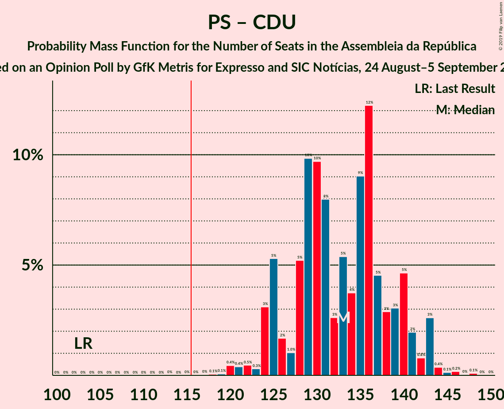

| Number of Seats | Probability | Accumulated | Special Marks |
|:---------------:|:-----------:|:-----------:|:-------------:|
| 103 | 0% | 100% | Last Result |
| 104 | 0% | 100% |  |
| 105 | 0% | 100% |  |
| 106 | 0% | 100% |  |
| 107 | 0% | 100% |  |
| 108 | 0% | 100% |  |
| 109 | 0% | 100% |  |
| 110 | 0% | 100% |  |
| 111 | 0% | 100% |  |
| 112 | 0% | 100% |  |
| 113 | 0% | 100% |  |
| 114 | 0% | 100% |  |
| 115 | 0% | 100% |  |
| 116 | 0% | 100% | Majority |
| 117 | 0% | 100% |  |
| 118 | 0.1% | 99.9% |  |
| 119 | 0.1% | 99.9% |  |
| 120 | 0.4% | 99.8% |  |
| 121 | 0.4% | 99.4% |  |
| 122 | 0.5% | 99.0% |  |
| 123 | 0.3% | 98.5% |  |
| 124 | 3% | 98% |  |
| 125 | 5% | 95% |  |
| 126 | 2% | 90% |  |
| 127 | 1.0% | 88% |  |
| 128 | 5% | 87% |  |
| 129 | 10% | 82% |  |
| 130 | 10% | 72% |  |
| 131 | 8% | 62% |  |
| 132 | 3% | 54% |  |
| 133 | 5% | 52% | Median |
| 134 | 4% | 46% |  |
| 135 | 9% | 43% |  |
| 136 | 12% | 34% |  |
| 137 | 5% | 21% |  |
| 138 | 3% | 17% |  |
| 139 | 3% | 14% |  |
| 140 | 5% | 11% |  |
| 141 | 2% | 6% |  |
| 142 | 0.8% | 4% |  |
| 143 | 3% | 3% |  |
| 144 | 0.4% | 0.9% |  |
| 145 | 0.1% | 0.5% |  |
| 146 | 0.2% | 0.4% |  |
| 147 | 0% | 0.2% |  |
| 148 | 0.1% | 0.2% |  |
| 149 | 0% | 0.1% |  |
| 150 | 0% | 0% |  |

### Partido Socialista

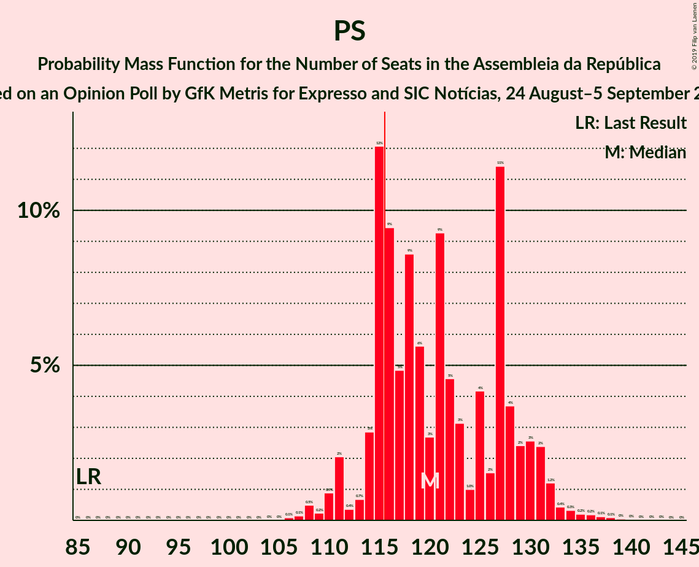

| Number of Seats | Probability | Accumulated | Special Marks |
|:---------------:|:-----------:|:-----------:|:-------------:|
| 86 | 0% | 100% | Last Result |
| 87 | 0% | 100% |  |
| 88 | 0% | 100% |  |
| 89 | 0% | 100% |  |
| 90 | 0% | 100% |  |
| 91 | 0% | 100% |  |
| 92 | 0% | 100% |  |
| 93 | 0% | 100% |  |
| 94 | 0% | 100% |  |
| 95 | 0% | 100% |  |
| 96 | 0% | 100% |  |
| 97 | 0% | 100% |  |
| 98 | 0% | 100% |  |
| 99 | 0% | 100% |  |
| 100 | 0% | 100% |  |
| 101 | 0% | 100% |  |
| 102 | 0% | 100% |  |
| 103 | 0% | 100% |  |
| 104 | 0% | 100% |  |
| 105 | 0% | 100% |  |
| 106 | 0.1% | 100% |  |
| 107 | 0.1% | 99.9% |  |
| 108 | 0.5% | 99.7% |  |
| 109 | 0.2% | 99.2% |  |
| 110 | 0.9% | 99.0% |  |
| 111 | 2% | 98% |  |
| 112 | 0.4% | 96% |  |
| 113 | 0.7% | 96% |  |
| 114 | 3% | 95% |  |
| 115 | 12% | 92% |  |
| 116 | 9% | 80% | Majority |
| 117 | 5% | 71% |  |
| 118 | 9% | 66% |  |
| 119 | 6% | 57% |  |
| 120 | 3% | 52% | Median |
| 121 | 9% | 49% |  |
| 122 | 5% | 40% |  |
| 123 | 3% | 35% |  |
| 124 | 1.0% | 32% |  |
| 125 | 4% | 31% |  |
| 126 | 2% | 27% |  |
| 127 | 11% | 25% |  |
| 128 | 4% | 14% |  |
| 129 | 2% | 10% |  |
| 130 | 3% | 8% |  |
| 131 | 2% | 5% |  |
| 132 | 1.2% | 3% |  |
| 133 | 0.4% | 1.5% |  |
| 134 | 0.3% | 1.0% |  |
| 135 | 0.2% | 0.7% |  |
| 136 | 0.2% | 0.5% |  |
| 137 | 0.1% | 0.3% |  |
| 138 | 0.1% | 0.2% |  |
| 139 | 0% | 0.1% |  |
| 140 | 0% | 0.1% |  |
| 141 | 0% | 0% |  |

### Partido Social Democrata – CDS–Partido Popular

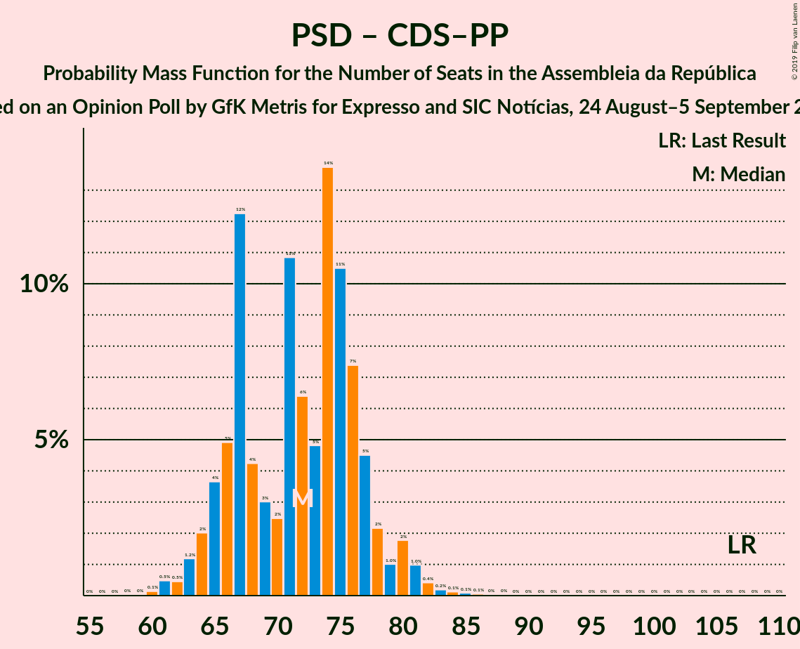

| Number of Seats | Probability | Accumulated | Special Marks |
|:---------------:|:-----------:|:-----------:|:-------------:|
| 59 | 0% | 100% |  |
| 60 | 0.1% | 99.9% |  |
| 61 | 0.5% | 99.8% |  |
| 62 | 0.5% | 99.3% |  |
| 63 | 1.2% | 98.8% |  |
| 64 | 2% | 98% |  |
| 65 | 4% | 96% |  |
| 66 | 5% | 92% |  |
| 67 | 12% | 87% |  |
| 68 | 4% | 75% |  |
| 69 | 3% | 71% |  |
| 70 | 2% | 68% |  |
| 71 | 11% | 65% |  |
| 72 | 6% | 54% |  |
| 73 | 5% | 48% | Median |
| 74 | 14% | 43% |  |
| 75 | 11% | 29% |  |
| 76 | 7% | 19% |  |
| 77 | 5% | 11% |  |
| 78 | 2% | 7% |  |
| 79 | 1.0% | 5% |  |
| 80 | 2% | 4% |  |
| 81 | 1.0% | 2% |  |
| 82 | 0.4% | 1.0% |  |
| 83 | 0.2% | 0.5% |  |
| 84 | 0.1% | 0.3% |  |
| 85 | 0.1% | 0.2% |  |
| 86 | 0.1% | 0.1% |  |
| 87 | 0% | 0.1% |  |
| 88 | 0% | 0% |  |
| 89 | 0% | 0% |  |
| 90 | 0% | 0% |  |
| 91 | 0% | 0% |  |
| 92 | 0% | 0% |  |
| 93 | 0% | 0% |  |
| 94 | 0% | 0% |  |
| 95 | 0% | 0% |  |
| 96 | 0% | 0% |  |
| 97 | 0% | 0% |  |
| 98 | 0% | 0% |  |
| 99 | 0% | 0% |  |
| 100 | 0% | 0% |  |
| 101 | 0% | 0% |  |
| 102 | 0% | 0% |  |
| 103 | 0% | 0% |  |
| 104 | 0% | 0% |  |
| 105 | 0% | 0% |  |
| 106 | 0% | 0% |  |
| 107 | 0% | 0% | Last Result |

## Technical Information

### Opinion Poll

+ **Polling firm:** GfK Metris
+ **Commissioner(s):** Expresso and SIC Notícias
+ **Fieldwork period:** 24 August–5 September 2019

### Calculations

+ **Sample size:** 801
+ **Simulations done:** 1,048,576
+ **Error estimate:** 1.27%

