# Opinion Poll by Pitagórica for Jornal de Notícias, 18–21 September 2019

<a href="#voting-intentions">Voting Intentions</a> | <a href="#seats">Seats</a> | <a href="#coalitions">Coalitions</a> | <a href="#technical-information">Technical Information</a>

## Voting Intentions

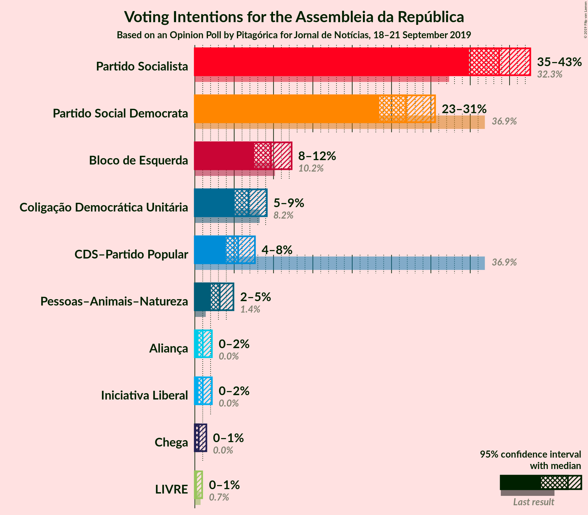

### Confidence Intervals

| Party | Last Result | Poll Result | 80% Confidence Interval | 90% Confidence Interval | 95% Confidence Interval | 99% Confidence Interval |
|:-----:|:-----------:|:-----------:|:-----------------------:|:-----------------------:|:-----------------------:|:-----------------------:|
| Partido Socialista | 32.3% | 38.7% | 36.2–41.3% |35.5–42.0% |34.8–42.6% |33.7–43.9% |
| Partido Social Democrata | 36.9% | 26.8% | 24.6–29.2% |24.0–29.9% |23.4–30.5% |22.4–31.7% |
| Bloco de Esquerda | 10.2% | 9.7% | 8.3–11.4% |7.9–11.9% |7.5–12.3% |6.9–13.2% |
| Coligação Democrática Unitária | 8.2% | 6.8% | 5.7–8.3% |5.3–8.8% |5.1–9.1% |4.6–9.9% |
| CDS–Partido Popular | 36.9% | 5.5% | 4.5–6.9% |4.2–7.3% |3.9–7.6% |3.5–8.4% |
| Pessoas–Animais–Natureza | 1.4% | 3.2% | 2.4–4.3% |2.2–4.6% |2.0–4.9% |1.7–5.5% |
| Iniciativa Liberal | 0.0% | 1.0% | 0.6–1.8% |0.5–2.0% |0.5–2.2% |0.3–2.6% |
| Aliança | 0.0% | 1.0% | 0.6–1.8% |0.5–2.0% |0.5–2.2% |0.3–2.6% |
| Chega | 0.0% | 0.5% | 0.3–1.1% |0.2–1.3% |0.2–1.5% |0.1–1.8% |
| LIVRE | 0.7% | 0.2% | 0.1–0.7% |0.0–0.8% |0.0–0.9% |0.0–1.2% |

*Note:* The poll result column reflects the actual value used in the calculations. Published results may vary slightly, and in addition be rounded to fewer digits.

## Seats

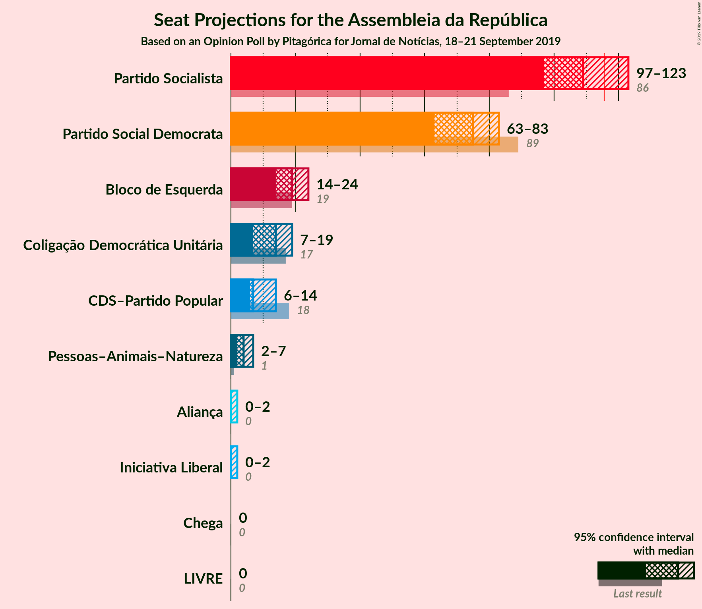

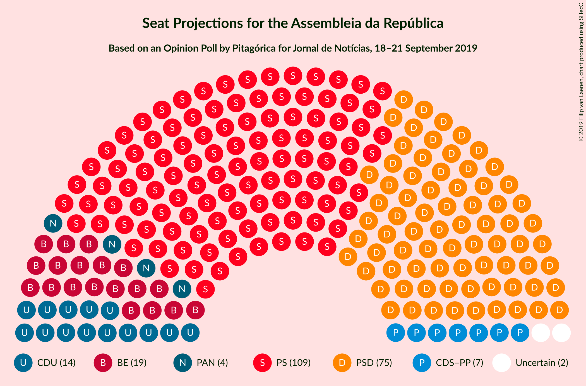

### Confidence Intervals

| Party | Last Result | Median | 80% Confidence Interval | 90% Confidence Interval | 95% Confidence Interval | 99% Confidence Interval |
|:-----:|:-----------:|:------:|:-----------------------:|:-----------------------:|:-----------------------:|:-----------------------:|
| <a href="#partido-socialista">Partido Socialista</a> | 86 | 109 | 102–116 |100–119 |97–123 |95–126 |
| <a href="#partido-social-democrata">Partido Social Democrata</a> | 89 | 75 | 67–81 |65–83 |63–83 |61–89 |
| <a href="#bloco-de-esquerda">Bloco de Esquerda</a> | 19 | 19 | 17–24 |16–24 |14–24 |13–28 |
| <a href="#coligação-democrática-unitária">Coligação Democrática Unitária</a> | 17 | 14 | 8–17 |8–18 |7–19 |5–20 |
| <a href="#cds–partido-popular">CDS–Partido Popular</a> | 18 | 7 | 6–11 |6–12 |6–14 |4–17 |
| <a href="#pessoas–animais–natureza">Pessoas–Animais–Natureza</a> | 1 | 4 | 3–6 |2–6 |2–7 |1–8 |
| <a href="#iniciativa-liberal">Iniciativa Liberal</a> | 0 | 0 | 0 |0–1 |0–2 |0–2 |
| <a href="#aliança">Aliança</a> | 0 | 0 | 0 |0–1 |0–2 |0–2 |
| <a href="#chega">Chega</a> | 0 | 0 | 0 |0 |0 |0 |
| <a href="#livre">LIVRE</a> | 0 | 0 | 0 |0 |0 |0–1 |

### Partido Socialista

*For a full overview of the results for this party, see the [Partido Socialista](party-partidosocialista.html) page.*

| Number of Seats | Probability | Accumulated | Special Marks |
|:---------------:|:-----------:|:-----------:|:-------------:|
| 86 | 0% | 100% | Last Result |
| 87 | 0% | 100% |  |
| 88 | 0% | 100% |  |
| 89 | 0% | 100% |  |
| 90 | 0% | 100% |  |
| 91 | 0% | 99.9% |  |
| 92 | 0% | 99.9% |  |
| 93 | 0.1% | 99.9% |  |
| 94 | 0.1% | 99.8% |  |
| 95 | 0.2% | 99.7% |  |
| 96 | 0.2% | 99.5% |  |
| 97 | 3% | 99.3% |  |
| 98 | 0.1% | 96% |  |
| 99 | 0.4% | 96% |  |
| 100 | 3% | 96% |  |
| 101 | 1.2% | 93% |  |
| 102 | 11% | 92% |  |
| 103 | 2% | 81% |  |
| 104 | 1.4% | 79% |  |
| 105 | 5% | 78% |  |
| 106 | 2% | 73% |  |
| 107 | 16% | 71% |  |
| 108 | 3% | 54% |  |
| 109 | 3% | 52% | Median |
| 110 | 8% | 48% |  |
| 111 | 7% | 41% |  |
| 112 | 8% | 33% |  |
| 113 | 7% | 26% |  |
| 114 | 2% | 18% |  |
| 115 | 4% | 16% |  |
| 116 | 3% | 12% | Majority |
| 117 | 2% | 9% |  |
| 118 | 2% | 8% |  |
| 119 | 2% | 5% |  |
| 120 | 0.2% | 4% |  |
| 121 | 0.2% | 3% |  |
| 122 | 0.1% | 3% |  |
| 123 | 0.6% | 3% |  |
| 124 | 0.1% | 2% |  |
| 125 | 0.1% | 2% |  |
| 126 | 2% | 2% |  |
| 127 | 0% | 0.3% |  |
| 128 | 0.1% | 0.3% |  |
| 129 | 0% | 0.1% |  |
| 130 | 0% | 0.1% |  |
| 131 | 0.1% | 0.1% |  |
| 132 | 0% | 0% |  |

### Partido Social Democrata

*For a full overview of the results for this party, see the [Partido Social Democrata](party-partidosocialdemocrata.html) page.*

| Number of Seats | Probability | Accumulated | Special Marks |
|:---------------:|:-----------:|:-----------:|:-------------:|
| 58 | 0.1% | 100% |  |
| 59 | 0.2% | 99.9% |  |
| 60 | 0.2% | 99.7% |  |
| 61 | 0.3% | 99.5% |  |
| 62 | 0.3% | 99.3% |  |
| 63 | 2% | 98.9% |  |
| 64 | 0.3% | 97% |  |
| 65 | 4% | 96% |  |
| 66 | 0.5% | 93% |  |
| 67 | 3% | 92% |  |
| 68 | 2% | 90% |  |
| 69 | 3% | 88% |  |
| 70 | 1.2% | 85% |  |
| 71 | 0.8% | 83% |  |
| 72 | 5% | 83% |  |
| 73 | 19% | 78% |  |
| 74 | 4% | 59% |  |
| 75 | 6% | 56% | Median |
| 76 | 10% | 50% |  |
| 77 | 4% | 40% |  |
| 78 | 12% | 36% |  |
| 79 | 7% | 23% |  |
| 80 | 6% | 17% |  |
| 81 | 4% | 11% |  |
| 82 | 1.3% | 7% |  |
| 83 | 3% | 5% |  |
| 84 | 0.4% | 2% |  |
| 85 | 0.4% | 2% |  |
| 86 | 0.3% | 1.3% |  |
| 87 | 0.3% | 1.0% |  |
| 88 | 0.2% | 0.7% |  |
| 89 | 0.2% | 0.5% | Last Result |
| 90 | 0% | 0.4% |  |
| 91 | 0% | 0.3% |  |
| 92 | 0% | 0.3% |  |
| 93 | 0.2% | 0.3% |  |
| 94 | 0% | 0.1% |  |
| 95 | 0% | 0.1% |  |
| 96 | 0% | 0% |  |

### Bloco de Esquerda

*For a full overview of the results for this party, see the [Bloco de Esquerda](party-blocodeesquerda.html) page.*

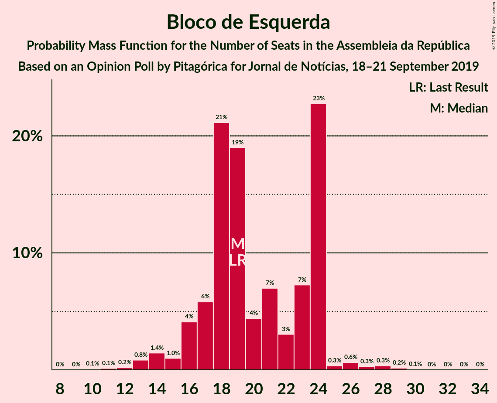

| Number of Seats | Probability | Accumulated | Special Marks |
|:---------------:|:-----------:|:-----------:|:-------------:|
| 10 | 0.1% | 100% |  |
| 11 | 0.1% | 99.9% |  |
| 12 | 0.2% | 99.8% |  |
| 13 | 0.8% | 99.6% |  |
| 14 | 1.4% | 98.8% |  |
| 15 | 1.0% | 97% |  |
| 16 | 4% | 96% |  |
| 17 | 6% | 92% |  |
| 18 | 21% | 86% |  |
| 19 | 19% | 65% | Last Result, Median |
| 20 | 4% | 46% |  |
| 21 | 7% | 42% |  |
| 22 | 3% | 35% |  |
| 23 | 7% | 32% |  |
| 24 | 23% | 25% |  |
| 25 | 0.3% | 2% |  |
| 26 | 0.6% | 2% |  |
| 27 | 0.3% | 0.9% |  |
| 28 | 0.3% | 0.6% |  |
| 29 | 0.2% | 0.3% |  |
| 30 | 0.1% | 0.1% |  |
| 31 | 0% | 0.1% |  |
| 32 | 0% | 0.1% |  |
| 33 | 0% | 0% |  |

### Coligação Democrática Unitária

*For a full overview of the results for this party, see the [Coligação Democrática Unitária](party-coligaçãodemocráticaunitária.html) page.*

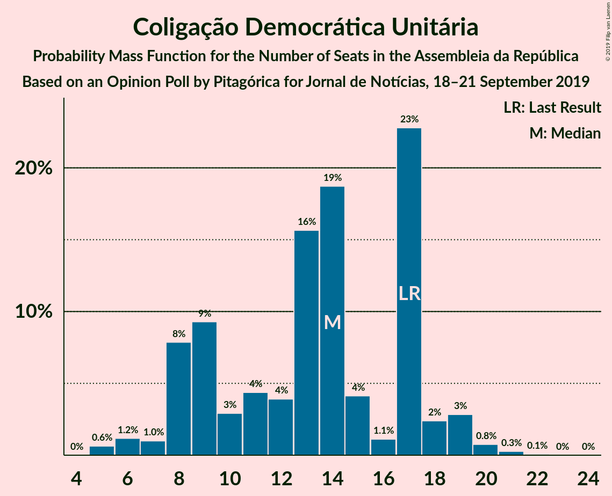

| Number of Seats | Probability | Accumulated | Special Marks |
|:---------------:|:-----------:|:-----------:|:-------------:|
| 5 | 0.6% | 100% |  |
| 6 | 1.2% | 99.3% |  |
| 7 | 1.0% | 98% |  |
| 8 | 8% | 97% |  |
| 9 | 9% | 89% |  |
| 10 | 3% | 80% |  |
| 11 | 4% | 77% |  |
| 12 | 4% | 73% |  |
| 13 | 16% | 69% |  |
| 14 | 19% | 53% | Median |
| 15 | 4% | 34% |  |
| 16 | 1.1% | 30% |  |
| 17 | 23% | 29% | Last Result |
| 18 | 2% | 6% |  |
| 19 | 3% | 4% |  |
| 20 | 0.8% | 1.2% |  |
| 21 | 0.3% | 0.4% |  |
| 22 | 0.1% | 0.1% |  |
| 23 | 0% | 0% |  |

### CDS–Partido Popular

*For a full overview of the results for this party, see the [CDS–Partido Popular](party-cds–partidopopular.html) page.*

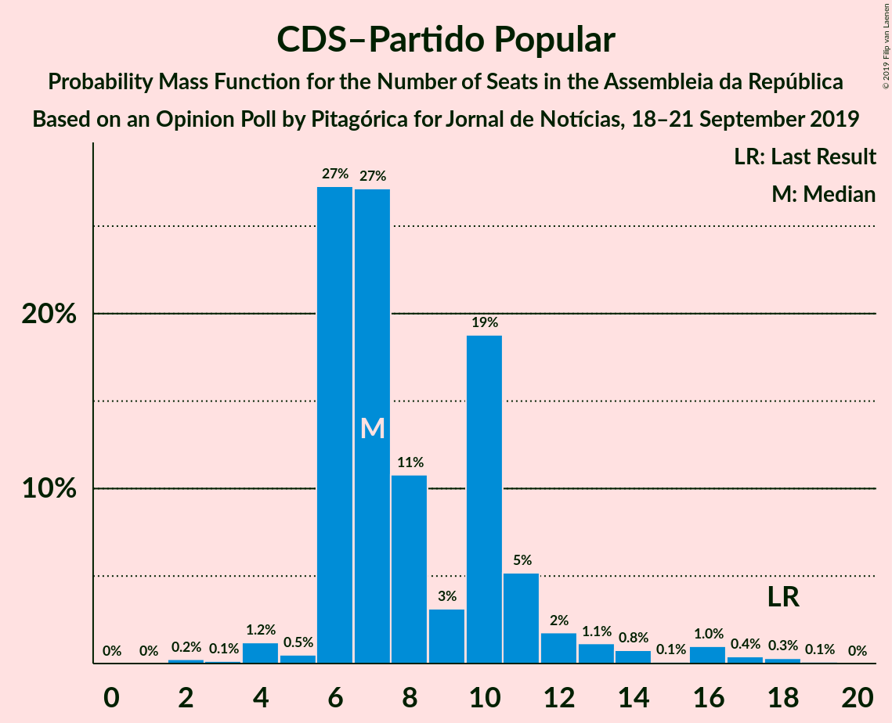

| Number of Seats | Probability | Accumulated | Special Marks |
|:---------------:|:-----------:|:-----------:|:-------------:|
| 2 | 0.2% | 100% |  |
| 3 | 0.1% | 99.8% |  |
| 4 | 1.2% | 99.6% |  |
| 5 | 0.5% | 98% |  |
| 6 | 27% | 98% |  |
| 7 | 27% | 71% | Median |
| 8 | 11% | 43% |  |
| 9 | 3% | 33% |  |
| 10 | 19% | 30% |  |
| 11 | 5% | 11% |  |
| 12 | 2% | 6% |  |
| 13 | 1.1% | 4% |  |
| 14 | 0.8% | 3% |  |
| 15 | 0.1% | 2% |  |
| 16 | 1.0% | 2% |  |
| 17 | 0.4% | 0.8% |  |
| 18 | 0.3% | 0.4% | Last Result |
| 19 | 0.1% | 0.1% |  |
| 20 | 0% | 0% |  |

### Pessoas–Animais–Natureza

*For a full overview of the results for this party, see the [Pessoas–Animais–Natureza](party-pessoas–animais–natureza.html) page.*

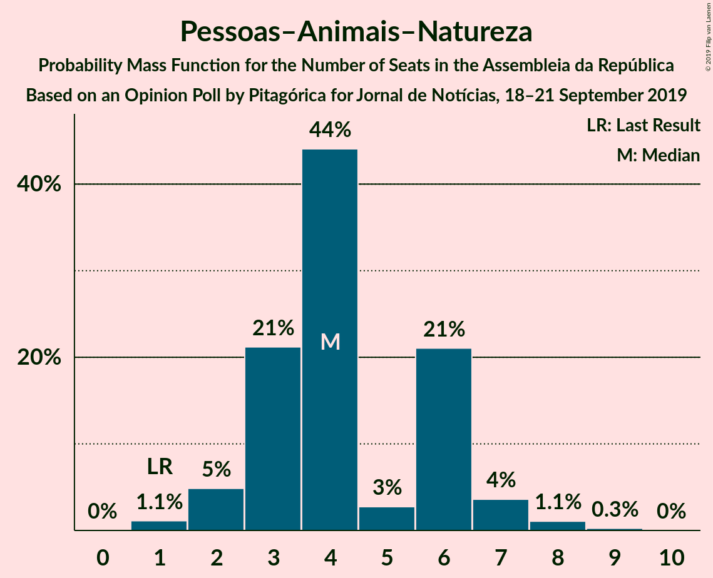

| Number of Seats | Probability | Accumulated | Special Marks |
|:---------------:|:-----------:|:-----------:|:-------------:|
| 1 | 1.1% | 100% | Last Result |
| 2 | 5% | 98.9% |  |
| 3 | 21% | 94% |  |
| 4 | 44% | 73% | Median |
| 5 | 3% | 29% |  |
| 6 | 21% | 26% |  |
| 7 | 4% | 5% |  |
| 8 | 1.1% | 1.4% |  |
| 9 | 0.3% | 0.3% |  |
| 10 | 0% | 0% |  |

### Iniciativa Liberal

*For a full overview of the results for this party, see the [Iniciativa Liberal](party-iniciativaliberal.html) page.*

| Number of Seats | Probability | Accumulated | Special Marks |
|:---------------:|:-----------:|:-----------:|:-------------:|
| 0 | 94% | 100% | Last Result, Median |
| 1 | 2% | 6% |  |
| 2 | 4% | 4% |  |
| 3 | 0% | 0% |  |

### Aliança

*For a full overview of the results for this party, see the [Aliança](party-aliança.html) page.*

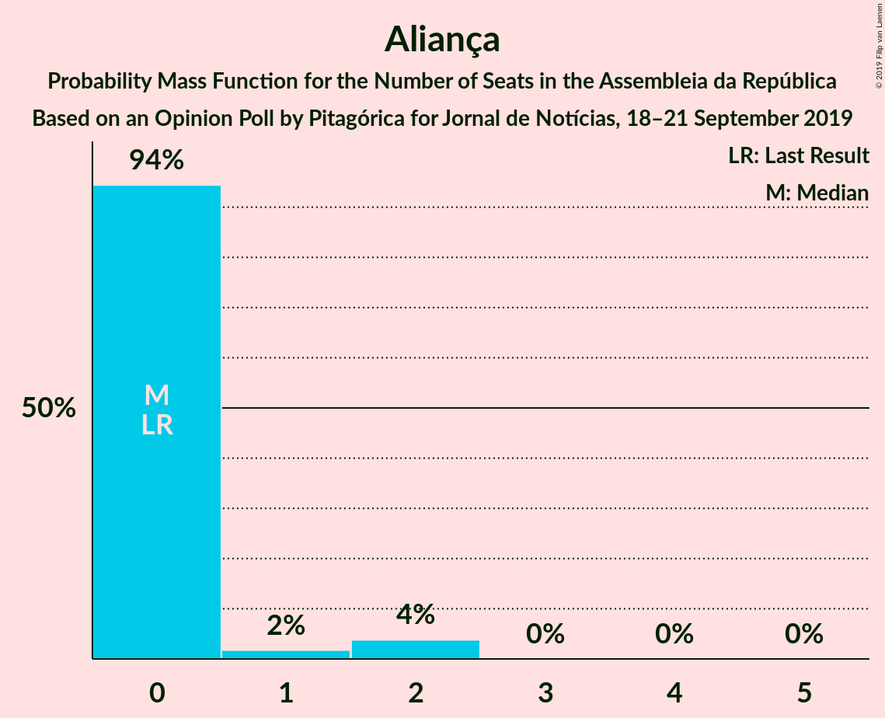

| Number of Seats | Probability | Accumulated | Special Marks |
|:---------------:|:-----------:|:-----------:|:-------------:|
| 0 | 94% | 100% | Last Result, Median |
| 1 | 2% | 6% |  |
| 2 | 4% | 4% |  |
| 3 | 0% | 0% |  |

### Chega

*For a full overview of the results for this party, see the [Chega](party-chega.html) page.*

| Number of Seats | Probability | Accumulated | Special Marks |
|:---------------:|:-----------:|:-----------:|:-------------:|
| 0 | 99.9% | 100% | Last Result, Median |
| 1 | 0.1% | 0.1% |  |
| 2 | 0.1% | 0.1% |  |
| 3 | 0% | 0% |  |

### LIVRE

*For a full overview of the results for this party, see the [LIVRE](party-livre.html) page.*

| Number of Seats | Probability | Accumulated | Special Marks |
|:---------------:|:-----------:|:-----------:|:-------------:|
| 0 | 98% | 100% | Last Result, Median |
| 1 | 2% | 2% |  |
| 2 | 0% | 0% |  |

## Coalitions

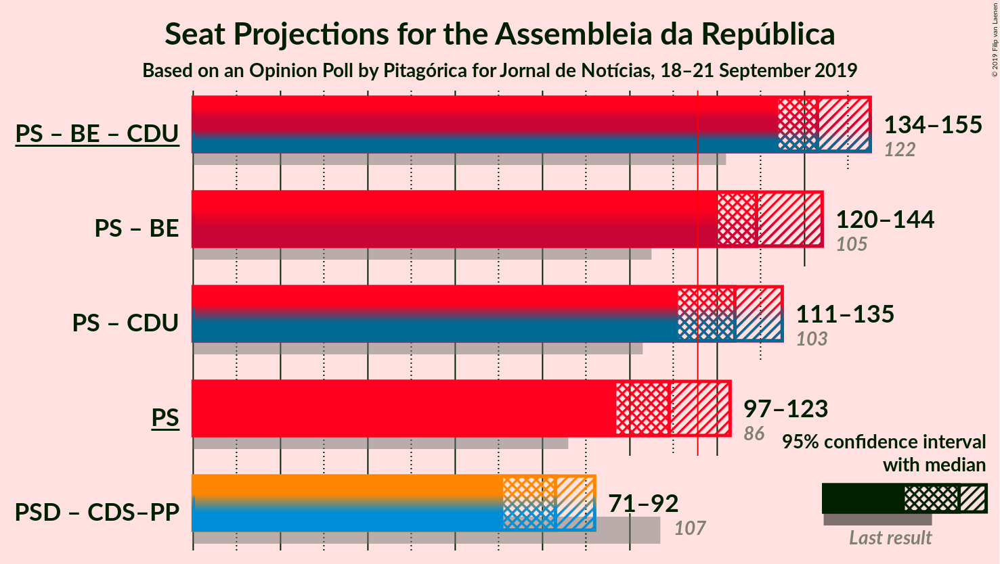

### Confidence Intervals

| Coalition | Last Result | Median | Majority? | 80% Confidence Interval | 90% Confidence Interval | 95% Confidence Interval | 99% Confidence Interval |
|:---------:|:-----------:|:------:|:---------:|:-----------------------:|:-----------------------:|:-----------------------:|:-----------------------:|
| Partido Socialista – Bloco de Esquerda – Coligação Democrática Unitária | 122 | 143 | 100% | 137–149 | 135–152 | 134–155 | 127–157 |
| Partido Socialista – Bloco de Esquerda | 105 | 129 | 99.4% | 123–136 | 121–141 | 120–144 | 115–146 |
| Partido Socialista – Coligação Democrática Unitária | 103 | 124 | 80% | 115–130 | 114–132 | 111–135 | 109–139 |
| Partido Socialista | 86 | 109 | 12% | 102–116 | 100–119 | 97–123 | 95–126 |
| Partido Social Democrata – CDS–Partido Popular | 107 | 83 | 0% | 76–89 | 74–91 | 71–92 | 70–98 |

### Partido Socialista – Bloco de Esquerda – Coligação Democrática Unitária

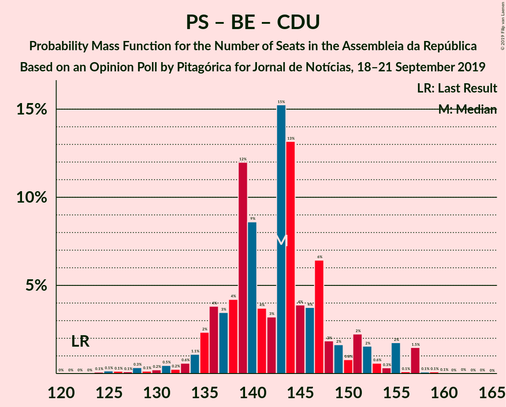

| Number of Seats | Probability | Accumulated | Special Marks |
|:---------------:|:-----------:|:-----------:|:-------------:|
| 122 | 0% | 100% | Last Result |
| 123 | 0% | 100% |  |
| 124 | 0.1% | 99.9% |  |
| 125 | 0.1% | 99.9% |  |
| 126 | 0.1% | 99.7% |  |
| 127 | 0.1% | 99.6% |  |
| 128 | 0.3% | 99.5% |  |
| 129 | 0.1% | 99.2% |  |
| 130 | 0.2% | 99.0% |  |
| 131 | 0.5% | 98.8% |  |
| 132 | 0.2% | 98% |  |
| 133 | 0.6% | 98% |  |
| 134 | 1.1% | 98% |  |
| 135 | 2% | 96% |  |
| 136 | 4% | 94% |  |
| 137 | 3% | 90% |  |
| 138 | 4% | 87% |  |
| 139 | 12% | 83% |  |
| 140 | 9% | 71% |  |
| 141 | 4% | 62% |  |
| 142 | 3% | 58% | Median |
| 143 | 15% | 55% |  |
| 144 | 13% | 40% |  |
| 145 | 4% | 27% |  |
| 146 | 4% | 23% |  |
| 147 | 6% | 19% |  |
| 148 | 2% | 13% |  |
| 149 | 2% | 11% |  |
| 150 | 0.8% | 9% |  |
| 151 | 2% | 8% |  |
| 152 | 2% | 6% |  |
| 153 | 0.6% | 5% |  |
| 154 | 0.3% | 4% |  |
| 155 | 2% | 4% |  |
| 156 | 0.1% | 2% |  |
| 157 | 1.5% | 2% |  |
| 158 | 0.1% | 0.3% |  |
| 159 | 0.1% | 0.2% |  |
| 160 | 0.1% | 0.1% |  |
| 161 | 0% | 0.1% |  |
| 162 | 0% | 0.1% |  |
| 163 | 0% | 0% |  |

### Partido Socialista – Bloco de Esquerda

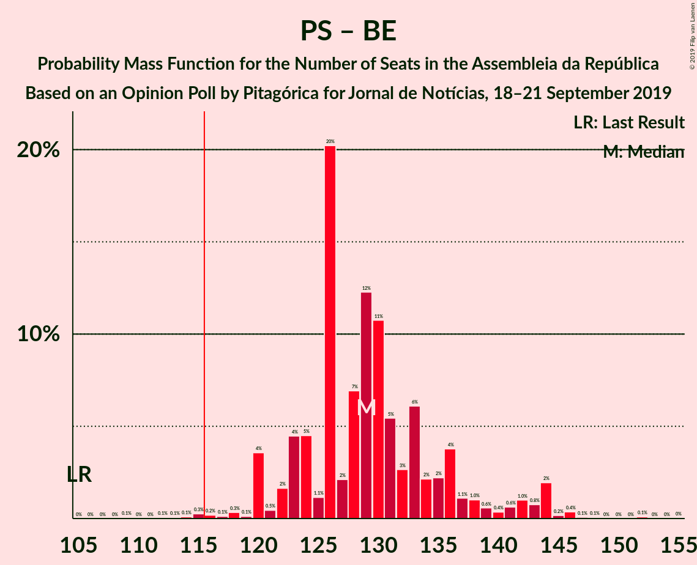

| Number of Seats | Probability | Accumulated | Special Marks |
|:---------------:|:-----------:|:-----------:|:-------------:|
| 105 | 0% | 100% | Last Result |
| 106 | 0% | 100% |  |
| 107 | 0% | 100% |  |
| 108 | 0% | 100% |  |
| 109 | 0.1% | 100% |  |
| 110 | 0% | 99.9% |  |
| 111 | 0% | 99.9% |  |
| 112 | 0.1% | 99.9% |  |
| 113 | 0.1% | 99.8% |  |
| 114 | 0.1% | 99.8% |  |
| 115 | 0.3% | 99.7% |  |
| 116 | 0.2% | 99.4% | Majority |
| 117 | 0.1% | 99.2% |  |
| 118 | 0.3% | 99.1% |  |
| 119 | 0.1% | 98.8% |  |
| 120 | 4% | 98.7% |  |
| 121 | 0.5% | 95% |  |
| 122 | 2% | 95% |  |
| 123 | 4% | 93% |  |
| 124 | 5% | 89% |  |
| 125 | 1.1% | 84% |  |
| 126 | 20% | 83% |  |
| 127 | 2% | 63% |  |
| 128 | 7% | 61% | Median |
| 129 | 12% | 54% |  |
| 130 | 11% | 41% |  |
| 131 | 5% | 31% |  |
| 132 | 3% | 25% |  |
| 133 | 6% | 22% |  |
| 134 | 2% | 16% |  |
| 135 | 2% | 14% |  |
| 136 | 4% | 12% |  |
| 137 | 1.1% | 8% |  |
| 138 | 1.0% | 7% |  |
| 139 | 0.6% | 6% |  |
| 140 | 0.4% | 6% |  |
| 141 | 0.6% | 5% |  |
| 142 | 1.0% | 5% |  |
| 143 | 0.8% | 4% |  |
| 144 | 2% | 3% |  |
| 145 | 0.2% | 0.8% |  |
| 146 | 0.4% | 0.6% |  |
| 147 | 0.1% | 0.3% |  |
| 148 | 0.1% | 0.2% |  |
| 149 | 0% | 0.1% |  |
| 150 | 0% | 0.1% |  |
| 151 | 0% | 0.1% |  |
| 152 | 0.1% | 0.1% |  |
| 153 | 0% | 0% |  |

### Partido Socialista – Coligação Democrática Unitária

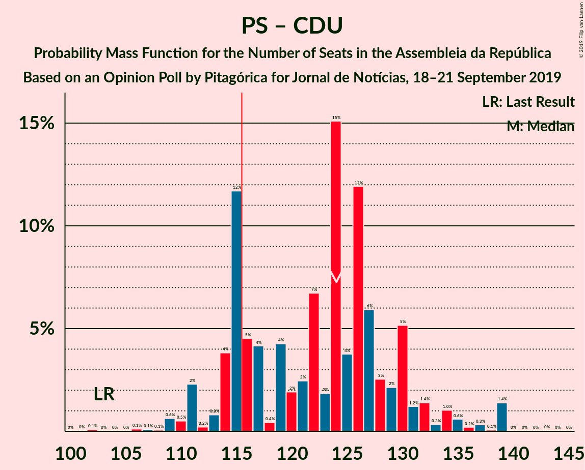

| Number of Seats | Probability | Accumulated | Special Marks |
|:---------------:|:-----------:|:-----------:|:-------------:|
| 101 | 0% | 100% |  |
| 102 | 0.1% | 99.9% |  |
| 103 | 0% | 99.8% | Last Result |
| 104 | 0% | 99.8% |  |
| 105 | 0% | 99.8% |  |
| 106 | 0.1% | 99.8% |  |
| 107 | 0.1% | 99.7% |  |
| 108 | 0.1% | 99.6% |  |
| 109 | 0.6% | 99.5% |  |
| 110 | 0.5% | 98.9% |  |
| 111 | 2% | 98% |  |
| 112 | 0.2% | 96% |  |
| 113 | 0.8% | 96% |  |
| 114 | 4% | 95% |  |
| 115 | 12% | 91% |  |
| 116 | 5% | 80% | Majority |
| 117 | 4% | 75% |  |
| 118 | 0.4% | 71% |  |
| 119 | 4% | 70% |  |
| 120 | 2% | 66% |  |
| 121 | 2% | 64% |  |
| 122 | 7% | 62% |  |
| 123 | 2% | 55% | Median |
| 124 | 15% | 53% |  |
| 125 | 4% | 38% |  |
| 126 | 12% | 34% |  |
| 127 | 6% | 22% |  |
| 128 | 3% | 17% |  |
| 129 | 2% | 14% |  |
| 130 | 5% | 12% |  |
| 131 | 1.2% | 7% |  |
| 132 | 1.4% | 5% |  |
| 133 | 0.3% | 4% |  |
| 134 | 1.0% | 4% |  |
| 135 | 0.6% | 3% |  |
| 136 | 0.2% | 2% |  |
| 137 | 0.3% | 2% |  |
| 138 | 0.1% | 2% |  |
| 139 | 1.4% | 2% |  |
| 140 | 0% | 0.1% |  |
| 141 | 0% | 0.1% |  |
| 142 | 0% | 0.1% |  |
| 143 | 0% | 0.1% |  |
| 144 | 0% | 0% |  |

### Partido Socialista

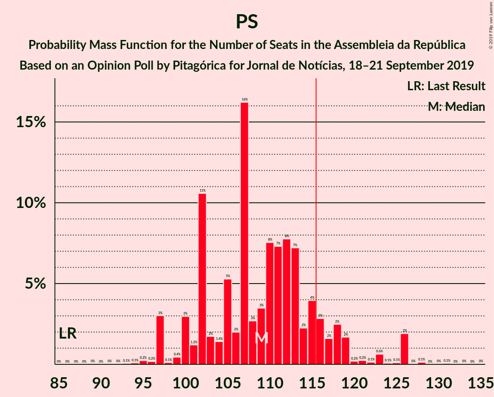

| Number of Seats | Probability | Accumulated | Special Marks |
|:---------------:|:-----------:|:-----------:|:-------------:|
| 86 | 0% | 100% | Last Result |
| 87 | 0% | 100% |  |
| 88 | 0% | 100% |  |
| 89 | 0% | 100% |  |
| 90 | 0% | 100% |  |
| 91 | 0% | 99.9% |  |
| 92 | 0% | 99.9% |  |
| 93 | 0.1% | 99.9% |  |
| 94 | 0.1% | 99.8% |  |
| 95 | 0.2% | 99.7% |  |
| 96 | 0.2% | 99.5% |  |
| 97 | 3% | 99.3% |  |
| 98 | 0.1% | 96% |  |
| 99 | 0.4% | 96% |  |
| 100 | 3% | 96% |  |
| 101 | 1.2% | 93% |  |
| 102 | 11% | 92% |  |
| 103 | 2% | 81% |  |
| 104 | 1.4% | 79% |  |
| 105 | 5% | 78% |  |
| 106 | 2% | 73% |  |
| 107 | 16% | 71% |  |
| 108 | 3% | 54% |  |
| 109 | 3% | 52% | Median |
| 110 | 8% | 48% |  |
| 111 | 7% | 41% |  |
| 112 | 8% | 33% |  |
| 113 | 7% | 26% |  |
| 114 | 2% | 18% |  |
| 115 | 4% | 16% |  |
| 116 | 3% | 12% | Majority |
| 117 | 2% | 9% |  |
| 118 | 2% | 8% |  |
| 119 | 2% | 5% |  |
| 120 | 0.2% | 4% |  |
| 121 | 0.2% | 3% |  |
| 122 | 0.1% | 3% |  |
| 123 | 0.6% | 3% |  |
| 124 | 0.1% | 2% |  |
| 125 | 0.1% | 2% |  |
| 126 | 2% | 2% |  |
| 127 | 0% | 0.3% |  |
| 128 | 0.1% | 0.3% |  |
| 129 | 0% | 0.1% |  |
| 130 | 0% | 0.1% |  |
| 131 | 0.1% | 0.1% |  |
| 132 | 0% | 0% |  |

### Partido Social Democrata – CDS–Partido Popular

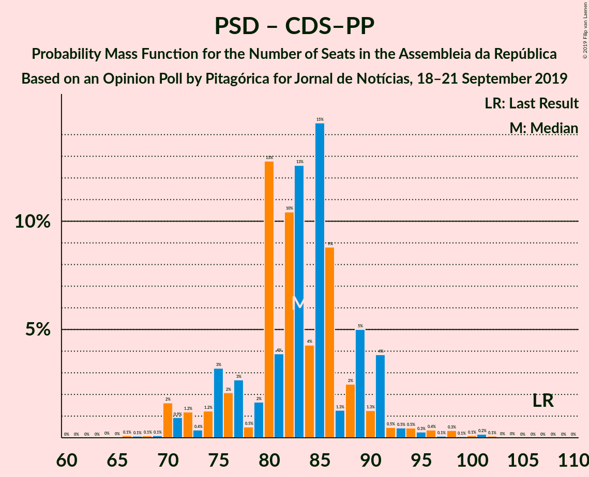

| Number of Seats | Probability | Accumulated | Special Marks |
|:---------------:|:-----------:|:-----------:|:-------------:|
| 64 | 0% | 100% |  |
| 65 | 0% | 99.9% |  |
| 66 | 0.1% | 99.9% |  |
| 67 | 0.1% | 99.8% |  |
| 68 | 0.1% | 99.7% |  |
| 69 | 0.1% | 99.6% |  |
| 70 | 2% | 99.5% |  |
| 71 | 0.9% | 98% |  |
| 72 | 1.2% | 97% |  |
| 73 | 0.4% | 96% |  |
| 74 | 1.2% | 95% |  |
| 75 | 3% | 94% |  |
| 76 | 2% | 91% |  |
| 77 | 3% | 89% |  |
| 78 | 0.5% | 86% |  |
| 79 | 2% | 86% |  |
| 80 | 13% | 84% |  |
| 81 | 4% | 71% |  |
| 82 | 10% | 67% | Median |
| 83 | 13% | 57% |  |
| 84 | 4% | 44% |  |
| 85 | 15% | 40% |  |
| 86 | 9% | 26% |  |
| 87 | 1.3% | 17% |  |
| 88 | 2% | 15% |  |
| 89 | 5% | 13% |  |
| 90 | 1.3% | 8% |  |
| 91 | 4% | 7% |  |
| 92 | 0.5% | 3% |  |
| 93 | 0.5% | 2% |  |
| 94 | 0.5% | 2% |  |
| 95 | 0.3% | 2% |  |
| 96 | 0.4% | 1.2% |  |
| 97 | 0.1% | 0.9% |  |
| 98 | 0.3% | 0.8% |  |
| 99 | 0.1% | 0.5% |  |
| 100 | 0.1% | 0.4% |  |
| 101 | 0.2% | 0.3% |  |
| 102 | 0.1% | 0.1% |  |
| 103 | 0% | 0.1% |  |
| 104 | 0% | 0% |  |
| 105 | 0% | 0% |  |
| 106 | 0% | 0% |  |
| 107 | 0% | 0% | Last Result |

## Technical Information

### Opinion Poll

+ **Polling firm:** Pitagórica
+ **Commissioner(s):** Jornal de Notícias
+ **Fieldwork period:** 18–21 September 2019

### Calculations

+ **Sample size:** 600
+ **Simulations done:** 1,048,576
+ **Error estimate:** 2.51%

