# Opinion Poll by Aximage for Jornal Económico, 26 September–2 October 2019

<a href="#voting-intentions">Voting Intentions</a> | <a href="#seats">Seats</a> | <a href="#coalitions">Coalitions</a> | <a href="#technical-information">Technical Information</a>

## Voting Intentions

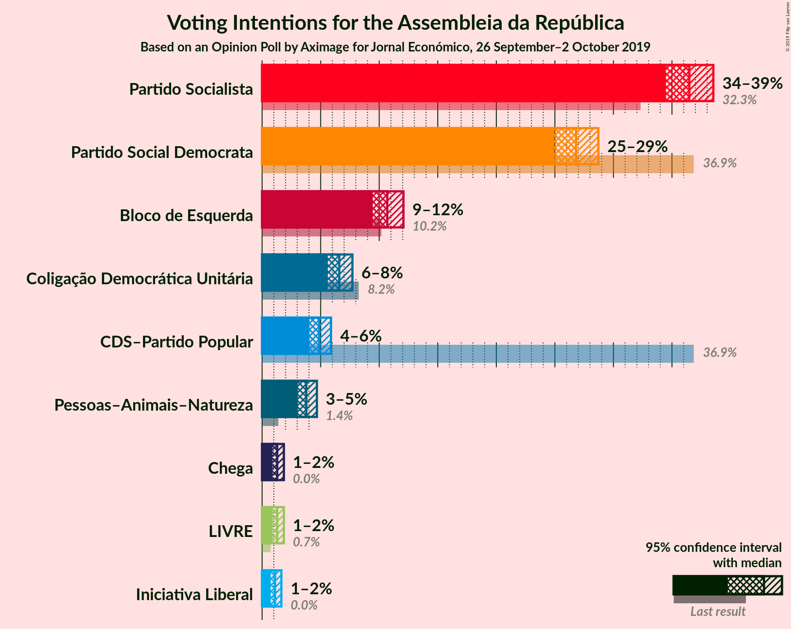

### Confidence Intervals

| Party | Last Result | Poll Result | 80% Confidence Interval | 90% Confidence Interval | 95% Confidence Interval | 99% Confidence Interval |
|:-----:|:-----------:|:-----------:|:-----------------------:|:-----------------------:|:-----------------------:|:-----------------------:|
| Partido Socialista | 32.3% | 36.5% | 35.2–37.8% |34.8–38.2% |34.5–38.5% |33.9–39.2% |
| Partido Social Democrata | 36.9% | 26.8% | 25.6–28.1% |25.3–28.4% |25.0–28.7% |24.4–29.3% |
| Bloco de Esquerda | 10.2% | 10.7% | 9.9–11.6% |9.6–11.8% |9.4–12.1% |9.1–12.5% |
| Coligação Democrática Unitária | 8.2% | 6.6% | 5.9–7.3% |5.8–7.5% |5.6–7.7% |5.3–8.1% |
| CDS–Partido Popular | 36.9% | 4.9% | 4.3–5.5% |4.2–5.7% |4.1–5.9% |3.8–6.2% |
| Pessoas–Animais–Natureza | 1.4% | 3.8% | 3.3–4.4% |3.2–4.5% |3.0–4.7% |2.8–5.0% |
| LIVRE | 0.7% | 1.3% | 1.0–1.7% |0.9–1.8% |0.9–1.9% |0.8–2.1% |
| Chega | 0.0% | 1.3% | 1.0–1.7% |0.9–1.8% |0.9–1.9% |0.8–2.1% |
| Iniciativa Liberal | 0.0% | 1.1% | 0.9–1.5% |0.8–1.6% |0.7–1.6% |0.6–1.8% |

*Note:* The poll result column reflects the actual value used in the calculations. Published results may vary slightly, and in addition be rounded to fewer digits.

## Seats

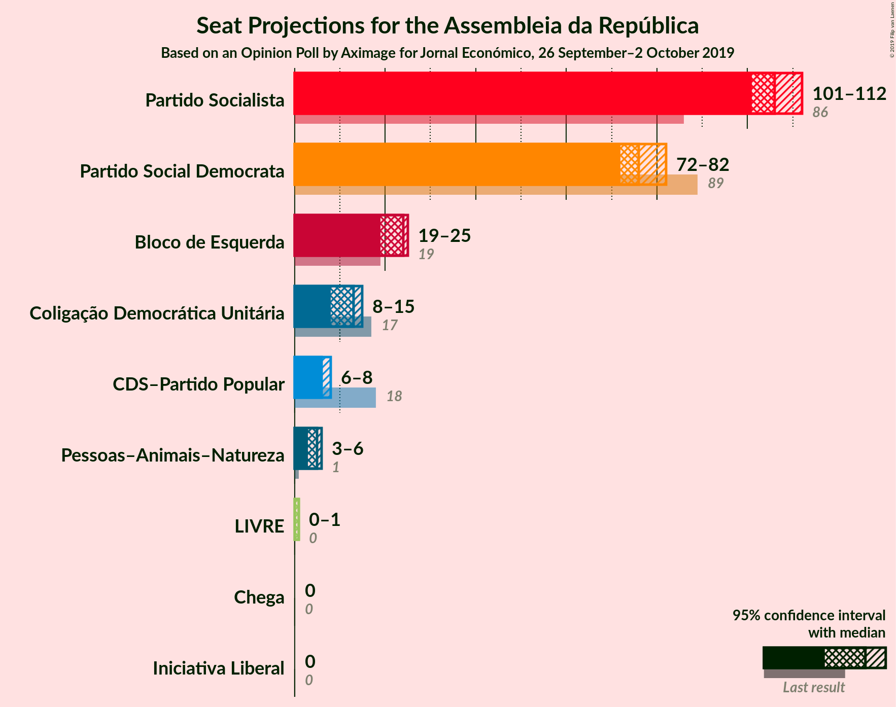

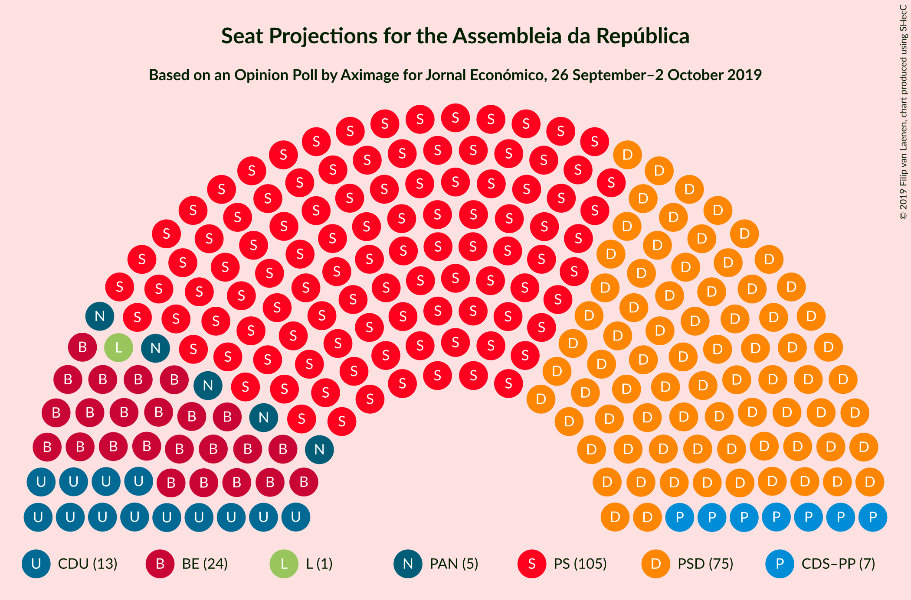

### Confidence Intervals

| Party | Last Result | Median | 80% Confidence Interval | 90% Confidence Interval | 95% Confidence Interval | 99% Confidence Interval |
|:-----:|:-----------:|:------:|:-----------------------:|:-----------------------:|:-----------------------:|:-----------------------:|
| <a href="#partido-socialista">Partido Socialista</a> | 86 | 106 | 102–110 |102–111 |101–112 |99–114 |
| <a href="#partido-social-democrata">Partido Social Democrata</a> | 89 | 76 | 73–80 |72–81 |72–82 |68–83 |
| <a href="#bloco-de-esquerda">Bloco de Esquerda</a> | 19 | 24 | 21–25 |19–25 |19–25 |18–27 |
| <a href="#coligação-democrática-unitária">Coligação Democrática Unitária</a> | 17 | 13 | 9–14 |9–14 |8–15 |8–17 |
| <a href="#cds–partido-popular">CDS–Partido Popular</a> | 18 | 6 | 6–7 |6–7 |6–8 |4–10 |
| <a href="#pessoas–animais–natureza">Pessoas–Animais–Natureza</a> | 1 | 5 | 4–6 |4–6 |3–6 |3–6 |
| <a href="#livre">LIVRE</a> | 0 | 1 | 1 |0–1 |0–1 |0–1 |
| <a href="#chega">Chega</a> | 0 | 0 | 0 |0 |0 |0–1 |
| <a href="#iniciativa-liberal">Iniciativa Liberal</a> | 0 | 0 | 0 |0 |0 |0 |

### Partido Socialista

*For a full overview of the results for this party, see the [Partido Socialista](party-partidosocialista.html) page.*

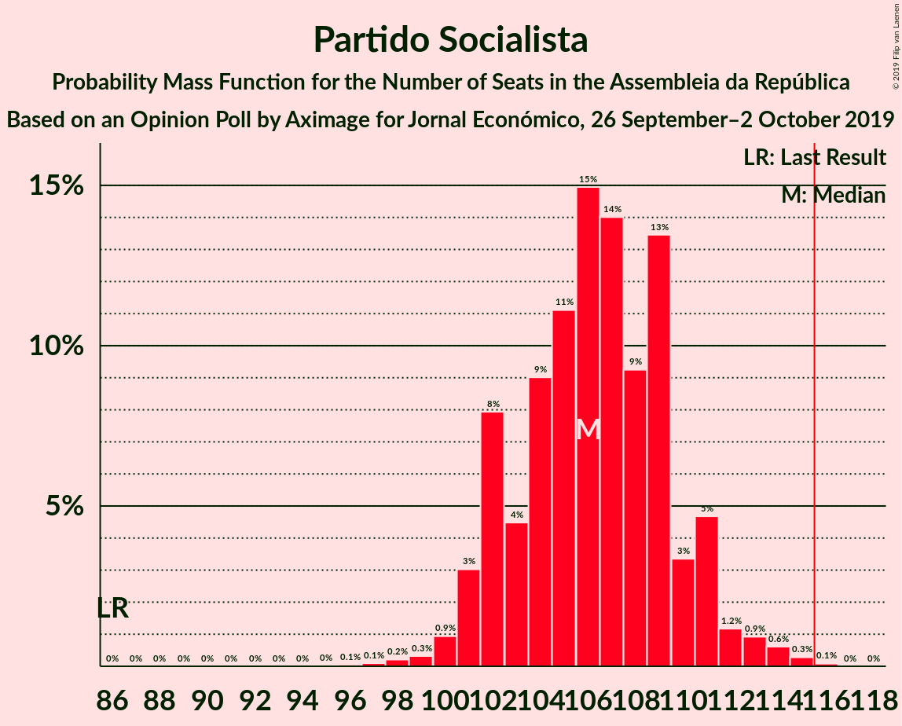

| Number of Seats | Probability | Accumulated | Special Marks |
|:---------------:|:-----------:|:-----------:|:-------------:|
| 86 | 0% | 100% | Last Result |
| 87 | 0% | 100% |  |
| 88 | 0% | 100% |  |
| 89 | 0% | 100% |  |
| 90 | 0% | 100% |  |
| 91 | 0% | 100% |  |
| 92 | 0% | 100% |  |
| 93 | 0% | 100% |  |
| 94 | 0% | 100% |  |
| 95 | 0% | 100% |  |
| 96 | 0.1% | 100% |  |
| 97 | 0.1% | 99.9% |  |
| 98 | 0.2% | 99.8% |  |
| 99 | 0.3% | 99.6% |  |
| 100 | 0.9% | 99.3% |  |
| 101 | 3% | 98% |  |
| 102 | 8% | 95% |  |
| 103 | 4% | 87% |  |
| 104 | 9% | 83% |  |
| 105 | 11% | 74% |  |
| 106 | 15% | 63% | Median |
| 107 | 14% | 48% |  |
| 108 | 9% | 34% |  |
| 109 | 13% | 25% |  |
| 110 | 3% | 11% |  |
| 111 | 5% | 8% |  |
| 112 | 1.2% | 3% |  |
| 113 | 0.9% | 2% |  |
| 114 | 0.6% | 1.0% |  |
| 115 | 0.3% | 0.4% |  |
| 116 | 0.1% | 0.1% | Majority |
| 117 | 0% | 0% |  |

### Partido Social Democrata

*For a full overview of the results for this party, see the [Partido Social Democrata](party-partidosocialdemocrata.html) page.*

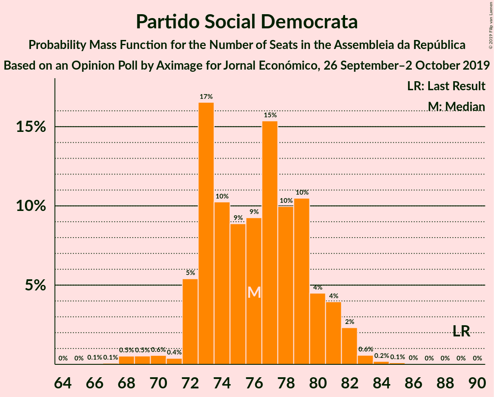

| Number of Seats | Probability | Accumulated | Special Marks |
|:---------------:|:-----------:|:-----------:|:-------------:|
| 66 | 0.1% | 100% |  |
| 67 | 0.1% | 99.9% |  |
| 68 | 0.5% | 99.8% |  |
| 69 | 0.5% | 99.3% |  |
| 70 | 0.6% | 98.8% |  |
| 71 | 0.4% | 98% |  |
| 72 | 5% | 98% |  |
| 73 | 17% | 92% |  |
| 74 | 10% | 76% |  |
| 75 | 9% | 66% |  |
| 76 | 9% | 57% | Median |
| 77 | 15% | 48% |  |
| 78 | 10% | 32% |  |
| 79 | 10% | 22% |  |
| 80 | 4% | 12% |  |
| 81 | 4% | 7% |  |
| 82 | 2% | 3% |  |
| 83 | 0.6% | 0.9% |  |
| 84 | 0.2% | 0.4% |  |
| 85 | 0.1% | 0.2% |  |
| 86 | 0% | 0.1% |  |
| 87 | 0% | 0% |  |
| 88 | 0% | 0% |  |
| 89 | 0% | 0% | Last Result |

### Bloco de Esquerda

*For a full overview of the results for this party, see the [Bloco de Esquerda](party-blocodeesquerda.html) page.*

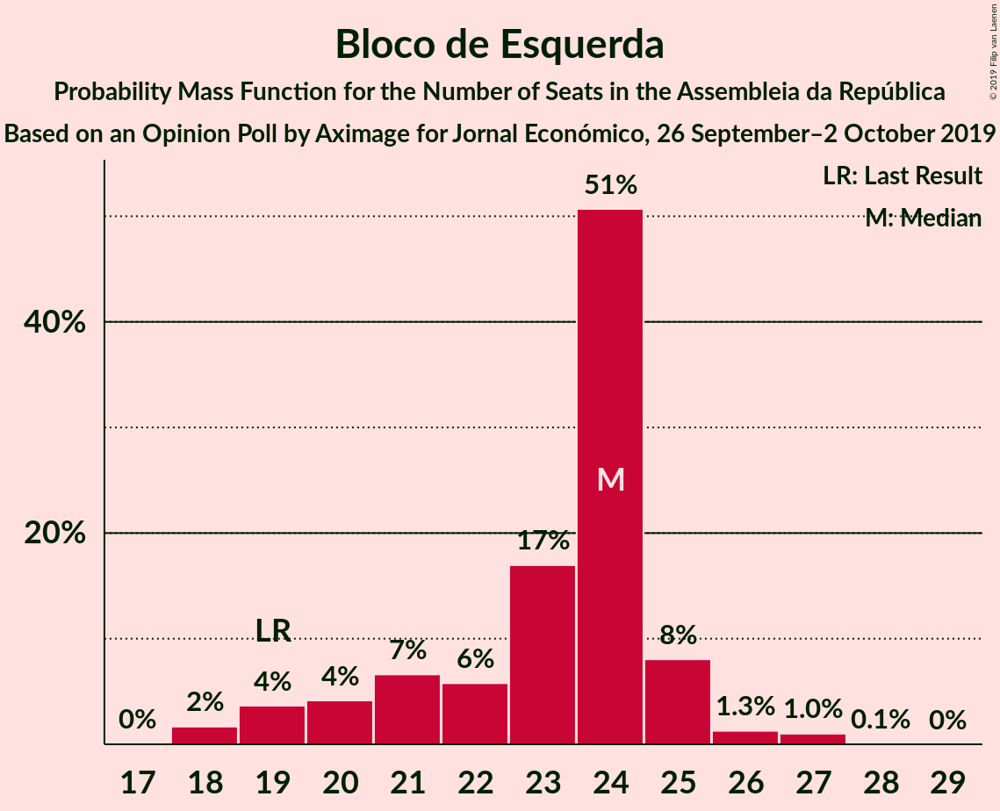

| Number of Seats | Probability | Accumulated | Special Marks |
|:---------------:|:-----------:|:-----------:|:-------------:|
| 18 | 2% | 100% |  |
| 19 | 4% | 98% | Last Result |
| 20 | 4% | 95% |  |
| 21 | 7% | 90% |  |
| 22 | 6% | 84% |  |
| 23 | 17% | 78% |  |
| 24 | 51% | 61% | Median |
| 25 | 8% | 10% |  |
| 26 | 1.3% | 2% |  |
| 27 | 1.0% | 1.1% |  |
| 28 | 0.1% | 0.1% |  |
| 29 | 0% | 0% |  |

### Coligação Democrática Unitária

*For a full overview of the results for this party, see the [Coligação Democrática Unitária](party-coligaçãodemocráticaunitária.html) page.*

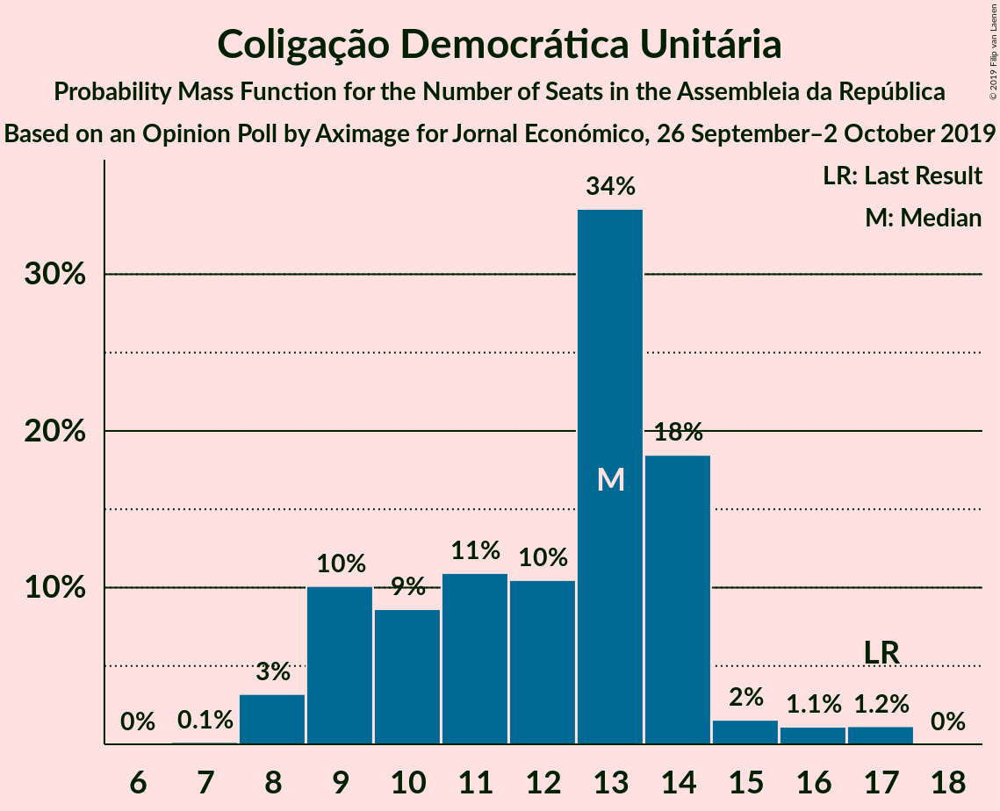

| Number of Seats | Probability | Accumulated | Special Marks |
|:---------------:|:-----------:|:-----------:|:-------------:|
| 7 | 0.1% | 100% |  |
| 8 | 3% | 99.8% |  |
| 9 | 10% | 97% |  |
| 10 | 9% | 87% |  |
| 11 | 11% | 78% |  |
| 12 | 10% | 67% |  |
| 13 | 34% | 56% | Median |
| 14 | 18% | 22% |  |
| 15 | 2% | 4% |  |
| 16 | 1.1% | 2% |  |
| 17 | 1.2% | 1.2% | Last Result |
| 18 | 0% | 0% |  |

### CDS–Partido Popular

*For a full overview of the results for this party, see the [CDS–Partido Popular](party-cds–partidopopular.html) page.*

| Number of Seats | Probability | Accumulated | Special Marks |
|:---------------:|:-----------:|:-----------:|:-------------:|
| 3 | 0.1% | 100% |  |
| 4 | 0.8% | 99.9% |  |
| 5 | 0.4% | 99.2% |  |
| 6 | 65% | 98.8% | Median |
| 7 | 30% | 34% |  |
| 8 | 2% | 4% |  |
| 9 | 1.1% | 2% |  |
| 10 | 0.9% | 1.0% |  |
| 11 | 0.1% | 0.1% |  |
| 12 | 0% | 0% |  |
| 13 | 0% | 0% |  |
| 14 | 0% | 0% |  |
| 15 | 0% | 0% |  |
| 16 | 0% | 0% |  |
| 17 | 0% | 0% |  |
| 18 | 0% | 0% | Last Result |

### Pessoas–Animais–Natureza

*For a full overview of the results for this party, see the [Pessoas–Animais–Natureza](party-pessoas–animais–natureza.html) page.*

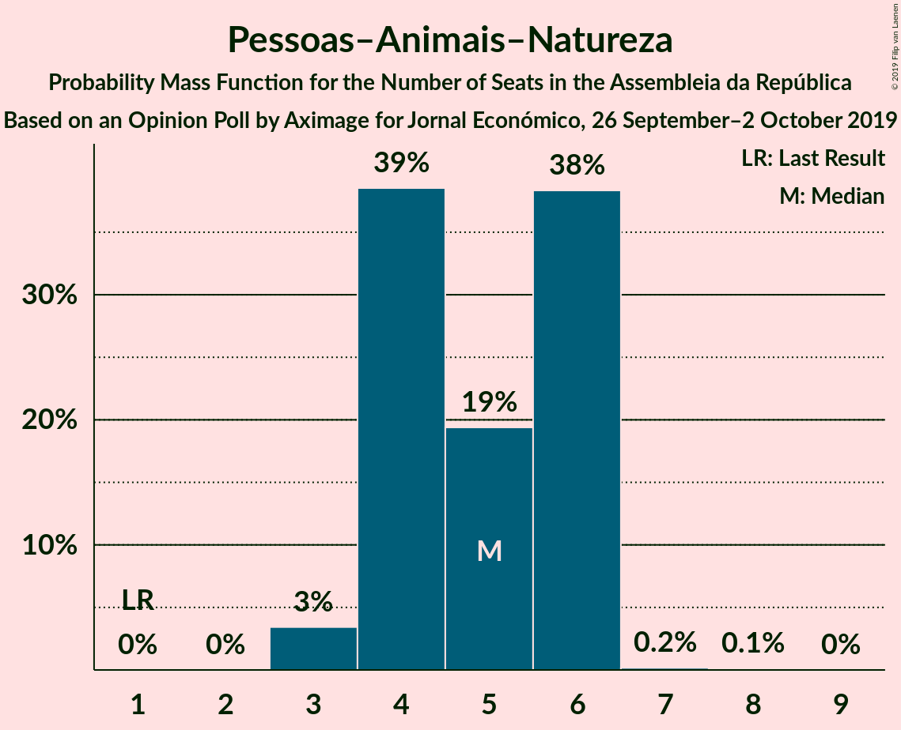

| Number of Seats | Probability | Accumulated | Special Marks |
|:---------------:|:-----------:|:-----------:|:-------------:|
| 1 | 0% | 100% | Last Result |
| 2 | 0% | 100% |  |
| 3 | 3% | 100% |  |
| 4 | 39% | 97% |  |
| 5 | 19% | 58% | Median |
| 6 | 38% | 39% |  |
| 7 | 0.2% | 0.3% |  |
| 8 | 0.1% | 0.1% |  |
| 9 | 0% | 0% |  |

### LIVRE

*For a full overview of the results for this party, see the [LIVRE](party-livre.html) page.*

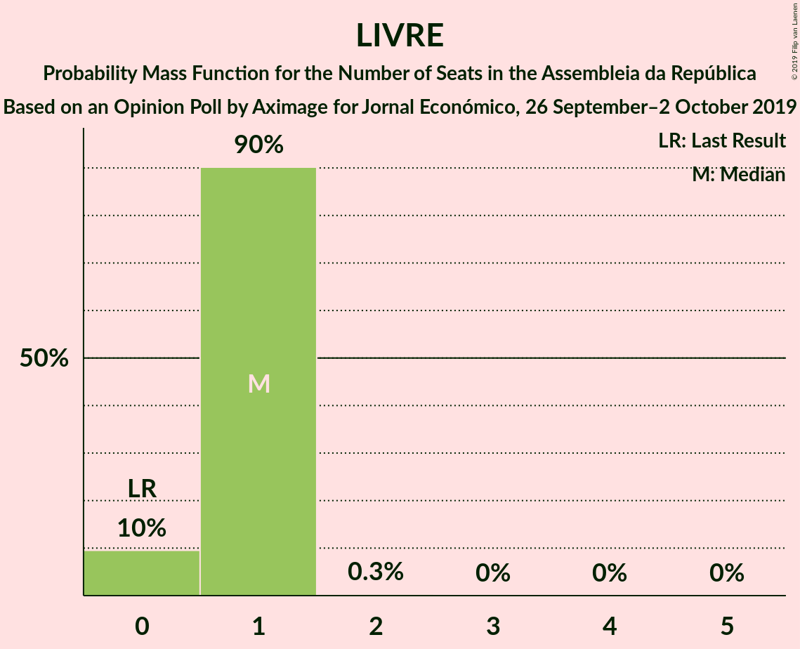

| Number of Seats | Probability | Accumulated | Special Marks |
|:---------------:|:-----------:|:-----------:|:-------------:|
| 0 | 10% | 100% | Last Result |
| 1 | 90% | 90% | Median |
| 2 | 0.3% | 0.3% |  |
| 3 | 0% | 0% |  |

### Chega

*For a full overview of the results for this party, see the [Chega](party-chega.html) page.*

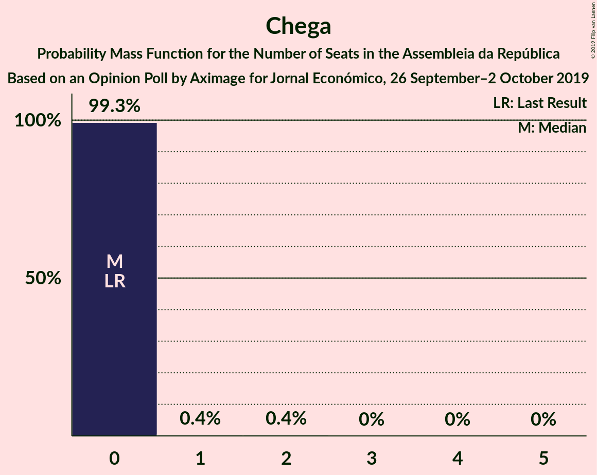

| Number of Seats | Probability | Accumulated | Special Marks |
|:---------------:|:-----------:|:-----------:|:-------------:|
| 0 | 99.3% | 100% | Last Result, Median |
| 1 | 0.4% | 0.7% |  |
| 2 | 0.4% | 0.4% |  |
| 3 | 0% | 0% |  |

### Iniciativa Liberal

*For a full overview of the results for this party, see the [Iniciativa Liberal](party-iniciativaliberal.html) page.*

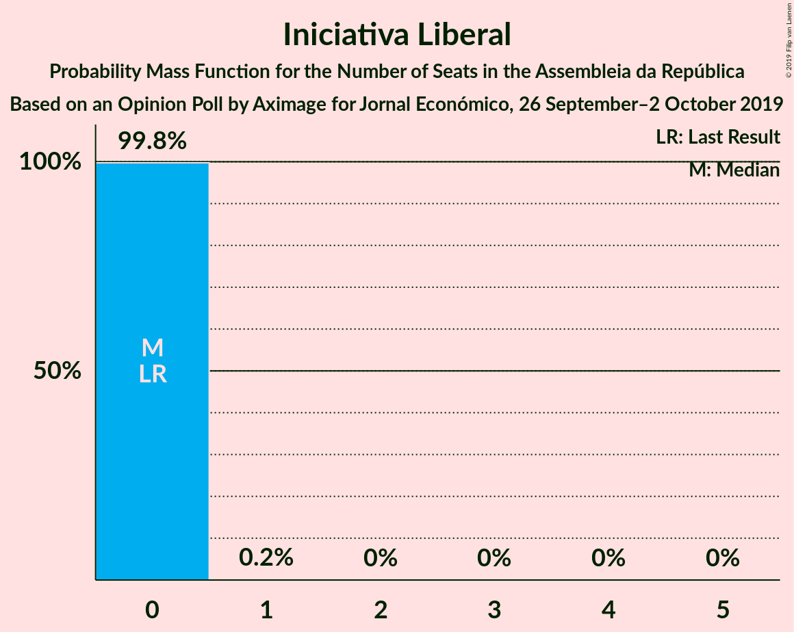

| Number of Seats | Probability | Accumulated | Special Marks |
|:---------------:|:-----------:|:-----------:|:-------------:|
| 0 | 99.8% | 100% | Last Result, Median |
| 1 | 0.2% | 0.2% |  |
| 2 | 0% | 0% |  |

## Coalitions

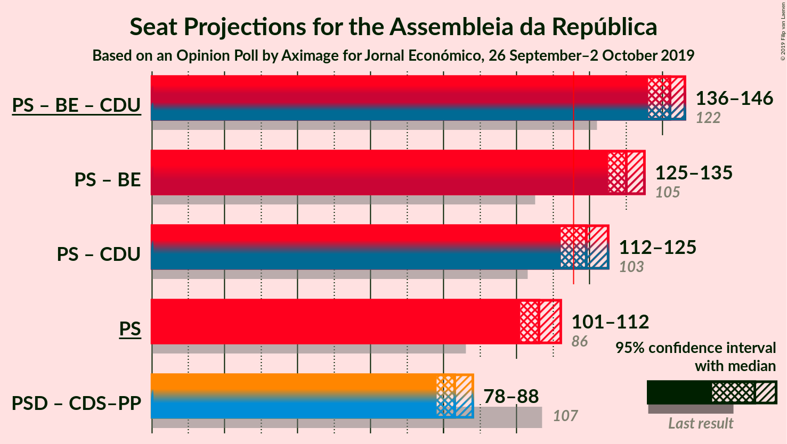

### Confidence Intervals

| Coalition | Last Result | Median | Majority? | 80% Confidence Interval | 90% Confidence Interval | 95% Confidence Interval | 99% Confidence Interval |
|:---------:|:-----------:|:------:|:---------:|:-----------------------:|:-----------------------:|:-----------------------:|:-----------------------:|
| Partido Socialista – Bloco de Esquerda – Coligação Democrática Unitária | 122 | 142 | 100% | 138–145 | 136–146 | 136–146 | 134–149 |
| Partido Socialista – Bloco de Esquerda | 105 | 130 | 100% | 125–133 | 125–134 | 125–135 | 122–137 |
| Partido Socialista – Coligação Democrática Unitária | 103 | 119 | 84% | 115–122 | 113–123 | 112–125 | 110–127 |
| Partido Socialista | 86 | 106 | 0.1% | 102–110 | 102–111 | 101–112 | 99–114 |
| Partido Social Democrata – CDS–Partido Popular | 107 | 83 | 0% | 79–86 | 79–87 | 78–88 | 75–90 |

### Partido Socialista – Bloco de Esquerda – Coligação Democrática Unitária

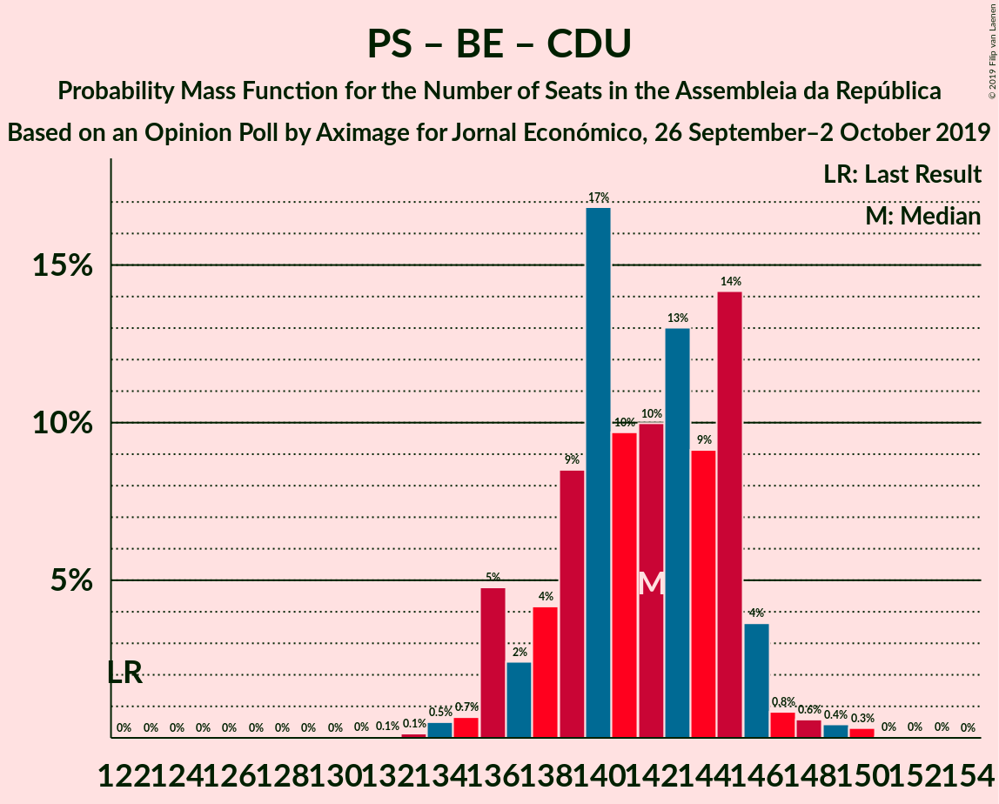

| Number of Seats | Probability | Accumulated | Special Marks |
|:---------------:|:-----------:|:-----------:|:-------------:|
| 122 | 0% | 100% | Last Result |
| 123 | 0% | 100% |  |
| 124 | 0% | 100% |  |
| 125 | 0% | 100% |  |
| 126 | 0% | 100% |  |
| 127 | 0% | 100% |  |
| 128 | 0% | 100% |  |
| 129 | 0% | 100% |  |
| 130 | 0% | 100% |  |
| 131 | 0% | 100% |  |
| 132 | 0.1% | 99.9% |  |
| 133 | 0.1% | 99.9% |  |
| 134 | 0.5% | 99.8% |  |
| 135 | 0.7% | 99.3% |  |
| 136 | 5% | 98.6% |  |
| 137 | 2% | 94% |  |
| 138 | 4% | 91% |  |
| 139 | 9% | 87% |  |
| 140 | 17% | 79% |  |
| 141 | 10% | 62% |  |
| 142 | 10% | 52% |  |
| 143 | 13% | 42% | Median |
| 144 | 9% | 29% |  |
| 145 | 14% | 20% |  |
| 146 | 4% | 6% |  |
| 147 | 0.8% | 2% |  |
| 148 | 0.6% | 1.4% |  |
| 149 | 0.4% | 0.8% |  |
| 150 | 0.3% | 0.4% |  |
| 151 | 0% | 0.1% |  |
| 152 | 0% | 0.1% |  |
| 153 | 0% | 0% |  |

### Partido Socialista – Bloco de Esquerda

| Number of Seats | Probability | Accumulated | Special Marks |
|:---------------:|:-----------:|:-----------:|:-------------:|
| 105 | 0% | 100% | Last Result |
| 106 | 0% | 100% |  |
| 107 | 0% | 100% |  |
| 108 | 0% | 100% |  |
| 109 | 0% | 100% |  |
| 110 | 0% | 100% |  |
| 111 | 0% | 100% |  |
| 112 | 0% | 100% |  |
| 113 | 0% | 100% |  |
| 114 | 0% | 100% |  |
| 115 | 0% | 100% |  |
| 116 | 0% | 100% | Majority |
| 117 | 0% | 100% |  |
| 118 | 0% | 100% |  |
| 119 | 0.1% | 100% |  |
| 120 | 0.1% | 99.9% |  |
| 121 | 0.1% | 99.8% |  |
| 122 | 0.4% | 99.6% |  |
| 123 | 0.4% | 99.3% |  |
| 124 | 1.2% | 98.9% |  |
| 125 | 9% | 98% |  |
| 126 | 4% | 89% |  |
| 127 | 11% | 85% |  |
| 128 | 10% | 74% |  |
| 129 | 14% | 64% |  |
| 130 | 14% | 50% | Median |
| 131 | 8% | 37% |  |
| 132 | 11% | 29% |  |
| 133 | 12% | 17% |  |
| 134 | 2% | 6% |  |
| 135 | 2% | 3% |  |
| 136 | 0.8% | 2% |  |
| 137 | 0.4% | 0.8% |  |
| 138 | 0.2% | 0.3% |  |
| 139 | 0.1% | 0.2% |  |
| 140 | 0% | 0.1% |  |
| 141 | 0% | 0% |  |

### Partido Socialista – Coligação Democrática Unitária

| Number of Seats | Probability | Accumulated | Special Marks |
|:---------------:|:-----------:|:-----------:|:-------------:|
| 103 | 0% | 100% | Last Result |
| 104 | 0% | 100% |  |
| 105 | 0% | 100% |  |
| 106 | 0% | 100% |  |
| 107 | 0% | 100% |  |
| 108 | 0% | 100% |  |
| 109 | 0.1% | 99.9% |  |
| 110 | 0.6% | 99.9% |  |
| 111 | 0.4% | 99.3% |  |
| 112 | 2% | 98.9% |  |
| 113 | 4% | 96% |  |
| 114 | 2% | 93% |  |
| 115 | 7% | 91% |  |
| 116 | 11% | 84% | Majority |
| 117 | 11% | 73% |  |
| 118 | 11% | 63% |  |
| 119 | 11% | 51% | Median |
| 120 | 14% | 41% |  |
| 121 | 16% | 26% |  |
| 122 | 3% | 10% |  |
| 123 | 2% | 7% |  |
| 124 | 1.3% | 5% |  |
| 125 | 2% | 3% |  |
| 126 | 0.3% | 1.2% |  |
| 127 | 0.4% | 0.9% |  |
| 128 | 0.3% | 0.4% |  |
| 129 | 0.1% | 0.1% |  |
| 130 | 0% | 0% |  |

### Partido Socialista

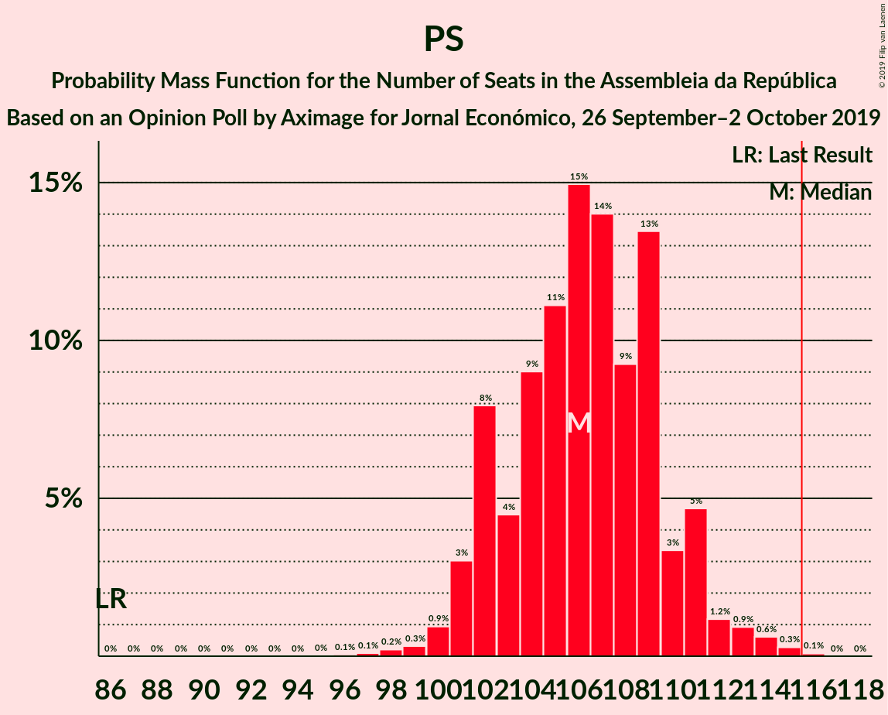

| Number of Seats | Probability | Accumulated | Special Marks |
|:---------------:|:-----------:|:-----------:|:-------------:|
| 86 | 0% | 100% | Last Result |
| 87 | 0% | 100% |  |
| 88 | 0% | 100% |  |
| 89 | 0% | 100% |  |
| 90 | 0% | 100% |  |
| 91 | 0% | 100% |  |
| 92 | 0% | 100% |  |
| 93 | 0% | 100% |  |
| 94 | 0% | 100% |  |
| 95 | 0% | 100% |  |
| 96 | 0.1% | 100% |  |
| 97 | 0.1% | 99.9% |  |
| 98 | 0.2% | 99.8% |  |
| 99 | 0.3% | 99.6% |  |
| 100 | 0.9% | 99.3% |  |
| 101 | 3% | 98% |  |
| 102 | 8% | 95% |  |
| 103 | 4% | 87% |  |
| 104 | 9% | 83% |  |
| 105 | 11% | 74% |  |
| 106 | 15% | 63% | Median |
| 107 | 14% | 48% |  |
| 108 | 9% | 34% |  |
| 109 | 13% | 25% |  |
| 110 | 3% | 11% |  |
| 111 | 5% | 8% |  |
| 112 | 1.2% | 3% |  |
| 113 | 0.9% | 2% |  |
| 114 | 0.6% | 1.0% |  |
| 115 | 0.3% | 0.4% |  |
| 116 | 0.1% | 0.1% | Majority |
| 117 | 0% | 0% |  |

### Partido Social Democrata – CDS–Partido Popular

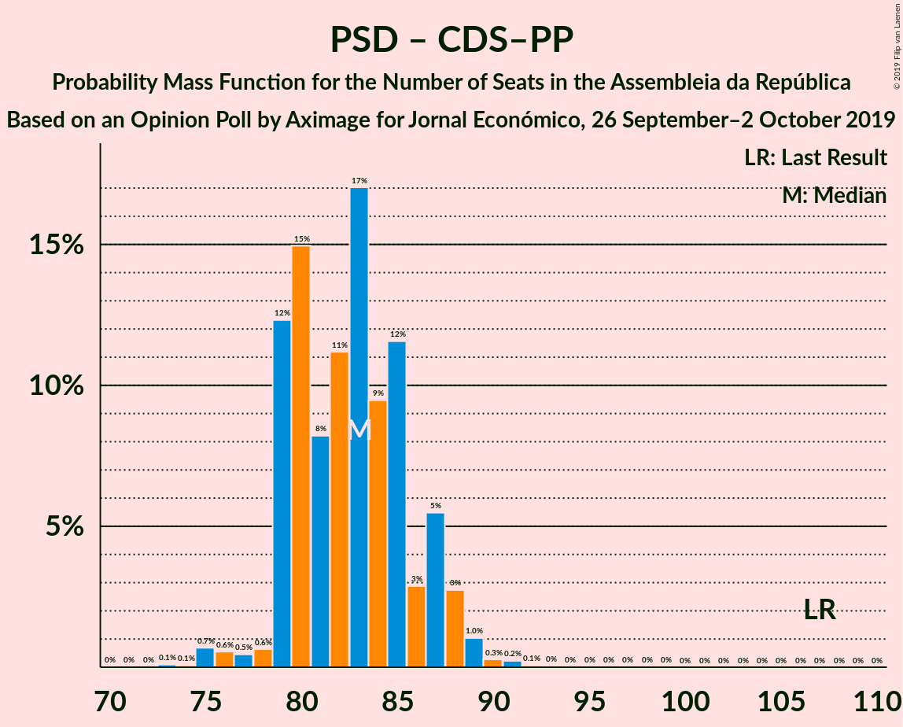

| Number of Seats | Probability | Accumulated | Special Marks |
|:---------------:|:-----------:|:-----------:|:-------------:|
| 73 | 0.1% | 100% |  |
| 74 | 0.1% | 99.9% |  |
| 75 | 0.7% | 99.8% |  |
| 76 | 0.6% | 99.1% |  |
| 77 | 0.5% | 98.6% |  |
| 78 | 0.6% | 98% |  |
| 79 | 12% | 97% |  |
| 80 | 15% | 85% |  |
| 81 | 8% | 70% |  |
| 82 | 11% | 62% | Median |
| 83 | 17% | 51% |  |
| 84 | 9% | 34% |  |
| 85 | 12% | 24% |  |
| 86 | 3% | 13% |  |
| 87 | 5% | 10% |  |
| 88 | 3% | 4% |  |
| 89 | 1.0% | 2% |  |
| 90 | 0.3% | 0.6% |  |
| 91 | 0.2% | 0.3% |  |
| 92 | 0.1% | 0.1% |  |
| 93 | 0% | 0.1% |  |
| 94 | 0% | 0% |  |
| 95 | 0% | 0% |  |
| 96 | 0% | 0% |  |
| 97 | 0% | 0% |  |
| 98 | 0% | 0% |  |
| 99 | 0% | 0% |  |
| 100 | 0% | 0% |  |
| 101 | 0% | 0% |  |
| 102 | 0% | 0% |  |
| 103 | 0% | 0% |  |
| 104 | 0% | 0% |  |
| 105 | 0% | 0% |  |
| 106 | 0% | 0% |  |
| 107 | 0% | 0% | Last Result |

## Technical Information

### Opinion Poll

+ **Polling firm:** Aximage
+ **Commissioner(s):** Jornal Económico
+ **Fieldwork period:** 26 September–2 October 2019

### Calculations

+ **Sample size:** 2171
+ **Simulations done:** 1,048,576
+ **Error estimate:** 0.47%

