# Opinion Poll by Pitagórica for Jornal de Notícias, 29 September–2 October 2019

<a href="#voting-intentions">Voting Intentions</a> | <a href="#seats">Seats</a> | <a href="#coalitions">Coalitions</a> | <a href="#technical-information">Technical Information</a>

## Voting Intentions

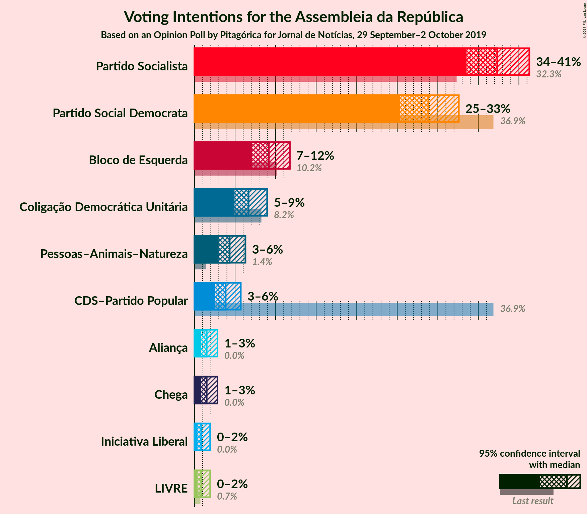

### Confidence Intervals

| Party | Last Result | Poll Result | 80% Confidence Interval | 90% Confidence Interval | 95% Confidence Interval | 99% Confidence Interval |
|:-----:|:-----------:|:-----------:|:-----------------------:|:-----------------------:|:-----------------------:|:-----------------------:|
| Partido Socialista | 32.3% | 37.3% | 34.9–39.9% |34.2–40.6% |33.5–41.3% |32.4–42.5% |
| Partido Social Democrata | 36.9% | 28.8% | 26.6–31.3% |25.9–32.0% |25.3–32.6% |24.3–33.8% |
| Bloco de Esquerda | 10.2% | 9.2% | 7.8–10.9% |7.4–11.3% |7.1–11.8% |6.5–12.6% |
| Coligação Democrática Unitária | 8.2% | 6.7% | 5.5–8.2% |5.2–8.6% |4.9–9.0% |4.4–9.7% |
| Pessoas–Animais–Natureza | 1.4% | 4.3% | 3.4–5.6% |3.2–6.0% |3.0–6.3% |2.6–6.9% |
| CDS–Partido Popular | 36.9% | 3.8% | 3.0–5.0% |2.8–5.4% |2.6–5.7% |2.2–6.3% |
| Aliança | 0.0% | 1.5% | 1.0–2.4% |0.9–2.6% |0.8–2.8% |0.6–3.3% |
| Chega | 0.0% | 1.5% | 1.0–2.4% |0.9–2.6% |0.8–2.8% |0.6–3.3% |
| LIVRE | 0.7% | 0.8% | 0.5–1.5% |0.4–1.8% |0.4–1.9% |0.2–2.3% |
| Iniciativa Liberal | 0.0% | 0.8% | 0.5–1.5% |0.4–1.8% |0.4–1.9% |0.2–2.3% |

*Note:* The poll result column reflects the actual value used in the calculations. Published results may vary slightly, and in addition be rounded to fewer digits.

## Seats

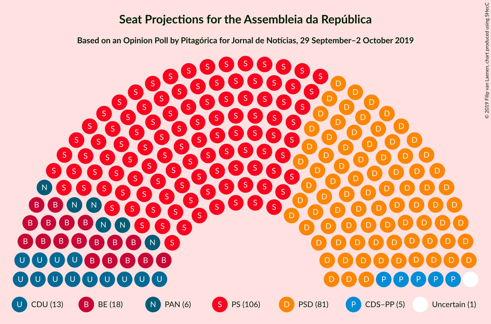

### Confidence Intervals

| Party | Last Result | Median | 80% Confidence Interval | 90% Confidence Interval | 95% Confidence Interval | 99% Confidence Interval |
|:-----:|:-----------:|:------:|:-----------------------:|:-----------------------:|:-----------------------:|:-----------------------:|
| <a href="#partido-socialista">Partido Socialista</a> | 86 | 106 | 100–113 |93–115 |93–117 |90–120 |
| <a href="#partido-social-democrata">Partido Social Democrata</a> | 89 | 81 | 75–88 |73–92 |71–93 |68–98 |
| <a href="#bloco-de-esquerda">Bloco de Esquerda</a> | 19 | 18 | 16–23 |14–24 |12–24 |10–27 |
| <a href="#coligação-democrática-unitária">Coligação Democrática Unitária</a> | 17 | 13 | 8–17 |7–17 |6–18 |5–20 |
| <a href="#pessoas–animais–natureza">Pessoas–Animais–Natureza</a> | 1 | 6 | 4–8 |4–9 |3–9 |2–12 |
| <a href="#cds–partido-popular">CDS–Partido Popular</a> | 18 | 5 | 2–6 |2–7 |2–7 |2–10 |
| <a href="#aliança">Aliança</a> | 0 | 0 | 0–2 |0–2 |0–2 |0–2 |
| <a href="#chega">Chega</a> | 0 | 0 | 0–2 |0–2 |0–2 |0–2 |
| <a href="#livre">LIVRE</a> | 0 | 0 | 0–1 |0–1 |0–1 |0–2 |
| <a href="#iniciativa-liberal">Iniciativa Liberal</a> | 0 | 0 | 0 |0 |0 |0–2 |

### Partido Socialista

*For a full overview of the results for this party, see the [Partido Socialista](party-partidosocialista.html) page.*

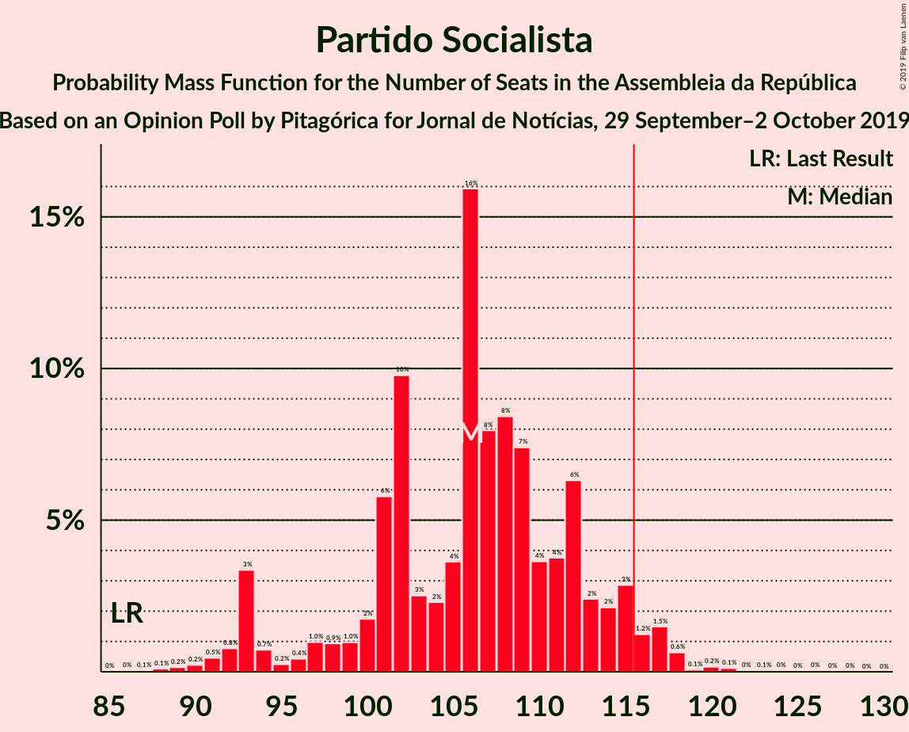

| Number of Seats | Probability | Accumulated | Special Marks |
|:---------------:|:-----------:|:-----------:|:-------------:|
| 86 | 0% | 100% | Last Result |
| 87 | 0.1% | 99.9% |  |
| 88 | 0.1% | 99.9% |  |
| 89 | 0.2% | 99.8% |  |
| 90 | 0.2% | 99.6% |  |
| 91 | 0.5% | 99.4% |  |
| 92 | 0.8% | 98.9% |  |
| 93 | 3% | 98% |  |
| 94 | 0.7% | 95% |  |
| 95 | 0.2% | 94% |  |
| 96 | 0.4% | 94% |  |
| 97 | 1.0% | 93% |  |
| 98 | 0.9% | 92% |  |
| 99 | 1.0% | 91% |  |
| 100 | 2% | 91% |  |
| 101 | 6% | 89% |  |
| 102 | 10% | 83% |  |
| 103 | 3% | 73% |  |
| 104 | 2% | 71% |  |
| 105 | 4% | 68% |  |
| 106 | 16% | 65% | Median |
| 107 | 8% | 49% |  |
| 108 | 8% | 41% |  |
| 109 | 7% | 32% |  |
| 110 | 4% | 25% |  |
| 111 | 4% | 21% |  |
| 112 | 6% | 18% |  |
| 113 | 2% | 11% |  |
| 114 | 2% | 9% |  |
| 115 | 3% | 7% |  |
| 116 | 1.2% | 4% | Majority |
| 117 | 1.5% | 3% |  |
| 118 | 0.6% | 1.2% |  |
| 119 | 0.1% | 0.6% |  |
| 120 | 0.2% | 0.5% |  |
| 121 | 0.1% | 0.3% |  |
| 122 | 0% | 0.2% |  |
| 123 | 0.1% | 0.2% |  |
| 124 | 0% | 0.1% |  |
| 125 | 0% | 0.1% |  |
| 126 | 0% | 0.1% |  |
| 127 | 0% | 0% |  |

### Partido Social Democrata

*For a full overview of the results for this party, see the [Partido Social Democrata](party-partidosocialdemocrata.html) page.*

| Number of Seats | Probability | Accumulated | Special Marks |
|:---------------:|:-----------:|:-----------:|:-------------:|
| 63 | 0% | 100% |  |
| 64 | 0% | 99.9% |  |
| 65 | 0% | 99.9% |  |
| 66 | 0.1% | 99.9% |  |
| 67 | 0.2% | 99.7% |  |
| 68 | 0.2% | 99.5% |  |
| 69 | 0.3% | 99.3% |  |
| 70 | 0.8% | 99.0% |  |
| 71 | 2% | 98% |  |
| 72 | 0.8% | 96% |  |
| 73 | 1.3% | 96% |  |
| 74 | 2% | 94% |  |
| 75 | 2% | 92% |  |
| 76 | 6% | 90% |  |
| 77 | 8% | 84% |  |
| 78 | 7% | 76% |  |
| 79 | 11% | 69% |  |
| 80 | 7% | 58% |  |
| 81 | 11% | 51% | Median |
| 82 | 12% | 39% |  |
| 83 | 3% | 27% |  |
| 84 | 3% | 24% |  |
| 85 | 2% | 22% |  |
| 86 | 1.1% | 19% |  |
| 87 | 5% | 18% |  |
| 88 | 6% | 13% |  |
| 89 | 0.3% | 7% | Last Result |
| 90 | 0.8% | 7% |  |
| 91 | 0.3% | 6% |  |
| 92 | 3% | 6% |  |
| 93 | 1.0% | 3% |  |
| 94 | 0.5% | 2% |  |
| 95 | 0.3% | 1.5% |  |
| 96 | 0.2% | 1.1% |  |
| 97 | 0.4% | 1.0% |  |
| 98 | 0.1% | 0.6% |  |
| 99 | 0.2% | 0.5% |  |
| 100 | 0.1% | 0.3% |  |
| 101 | 0.1% | 0.2% |  |
| 102 | 0% | 0.2% |  |
| 103 | 0% | 0.1% |  |
| 104 | 0% | 0.1% |  |
| 105 | 0% | 0.1% |  |
| 106 | 0.1% | 0.1% |  |
| 107 | 0% | 0% |  |

### Bloco de Esquerda

*For a full overview of the results for this party, see the [Bloco de Esquerda](party-blocodeesquerda.html) page.*

| Number of Seats | Probability | Accumulated | Special Marks |
|:---------------:|:-----------:|:-----------:|:-------------:|
| 9 | 0% | 100% |  |
| 10 | 0.7% | 99.9% |  |
| 11 | 0.4% | 99.2% |  |
| 12 | 1.4% | 98.8% |  |
| 13 | 0.8% | 97% |  |
| 14 | 3% | 97% |  |
| 15 | 2% | 93% |  |
| 16 | 3% | 92% |  |
| 17 | 25% | 89% |  |
| 18 | 23% | 64% | Median |
| 19 | 6% | 41% | Last Result |
| 20 | 13% | 35% |  |
| 21 | 8% | 23% |  |
| 22 | 3% | 15% |  |
| 23 | 4% | 12% |  |
| 24 | 7% | 8% |  |
| 25 | 0.2% | 1.0% |  |
| 26 | 0.3% | 0.8% |  |
| 27 | 0.3% | 0.5% |  |
| 28 | 0.1% | 0.2% |  |
| 29 | 0% | 0.1% |  |
| 30 | 0% | 0.1% |  |
| 31 | 0% | 0% |  |

### Coligação Democrática Unitária

*For a full overview of the results for this party, see the [Coligação Democrática Unitária](party-coligaçãodemocráticaunitária.html) page.*

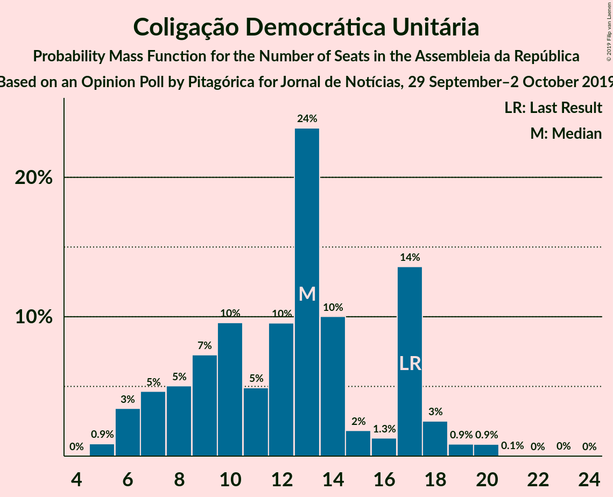

| Number of Seats | Probability | Accumulated | Special Marks |
|:---------------:|:-----------:|:-----------:|:-------------:|
| 5 | 0.9% | 100% |  |
| 6 | 3% | 99.1% |  |
| 7 | 5% | 96% |  |
| 8 | 5% | 91% |  |
| 9 | 7% | 86% |  |
| 10 | 10% | 79% |  |
| 11 | 5% | 69% |  |
| 12 | 10% | 64% |  |
| 13 | 24% | 55% | Median |
| 14 | 10% | 31% |  |
| 15 | 2% | 21% |  |
| 16 | 1.3% | 19% |  |
| 17 | 14% | 18% | Last Result |
| 18 | 3% | 4% |  |
| 19 | 0.9% | 2% |  |
| 20 | 0.9% | 1.0% |  |
| 21 | 0.1% | 0.1% |  |
| 22 | 0% | 0.1% |  |
| 23 | 0% | 0% |  |

### Pessoas–Animais–Natureza

*For a full overview of the results for this party, see the [Pessoas–Animais–Natureza](party-pessoas–animais–natureza.html) page.*

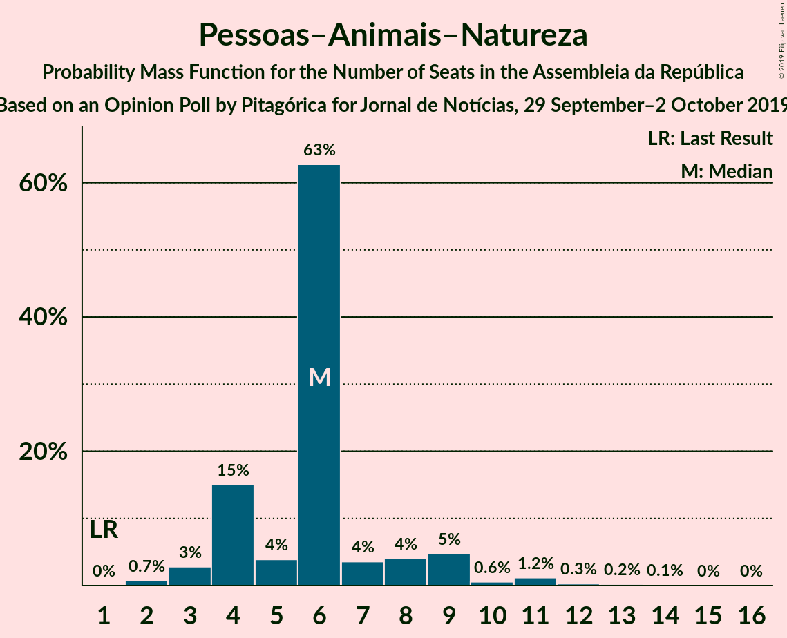

| Number of Seats | Probability | Accumulated | Special Marks |
|:---------------:|:-----------:|:-----------:|:-------------:|
| 1 | 0% | 100% | Last Result |
| 2 | 0.7% | 100% |  |
| 3 | 3% | 99.3% |  |
| 4 | 15% | 96% |  |
| 5 | 4% | 81% |  |
| 6 | 63% | 78% | Median |
| 7 | 4% | 15% |  |
| 8 | 4% | 11% |  |
| 9 | 5% | 7% |  |
| 10 | 0.6% | 2% |  |
| 11 | 1.2% | 2% |  |
| 12 | 0.3% | 0.7% |  |
| 13 | 0.2% | 0.4% |  |
| 14 | 0.1% | 0.2% |  |
| 15 | 0% | 0.1% |  |
| 16 | 0% | 0% |  |

### CDS–Partido Popular

*For a full overview of the results for this party, see the [CDS–Partido Popular](party-cds–partidopopular.html) page.*

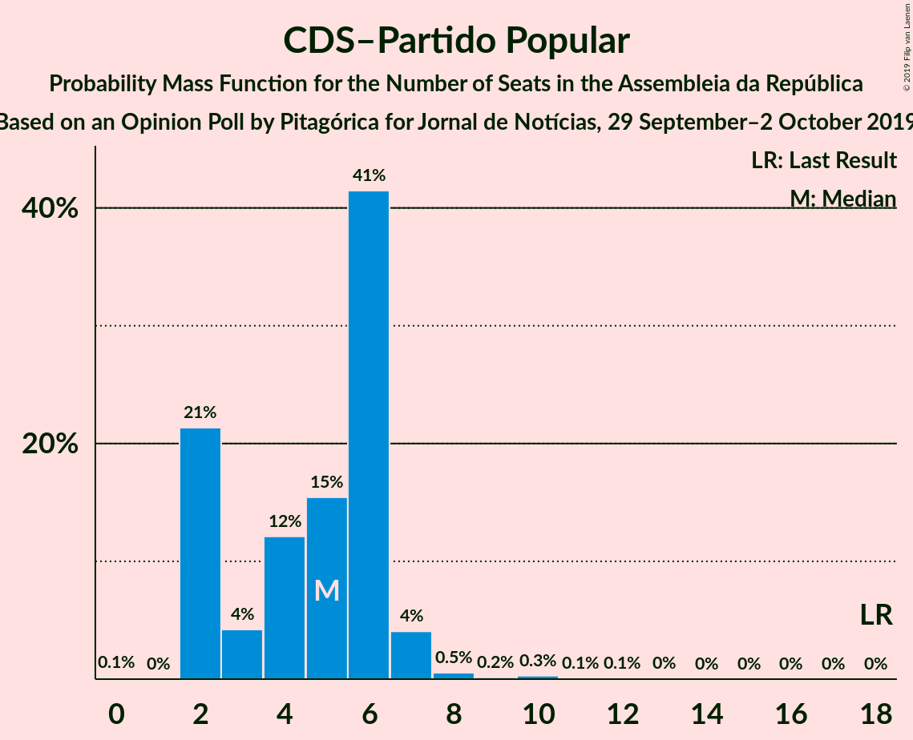

| Number of Seats | Probability | Accumulated | Special Marks |
|:---------------:|:-----------:|:-----------:|:-------------:|
| 0 | 0.1% | 100% |  |
| 1 | 0% | 99.9% |  |
| 2 | 21% | 99.9% |  |
| 3 | 4% | 79% |  |
| 4 | 12% | 74% |  |
| 5 | 15% | 62% | Median |
| 6 | 41% | 47% |  |
| 7 | 4% | 5% |  |
| 8 | 0.5% | 1.2% |  |
| 9 | 0.2% | 0.7% |  |
| 10 | 0.3% | 0.5% |  |
| 11 | 0.1% | 0.2% |  |
| 12 | 0.1% | 0.1% |  |
| 13 | 0% | 0.1% |  |
| 14 | 0% | 0% |  |
| 15 | 0% | 0% |  |
| 16 | 0% | 0% |  |
| 17 | 0% | 0% |  |
| 18 | 0% | 0% | Last Result |

### Aliança

*For a full overview of the results for this party, see the [Aliança](party-aliança.html) page.*

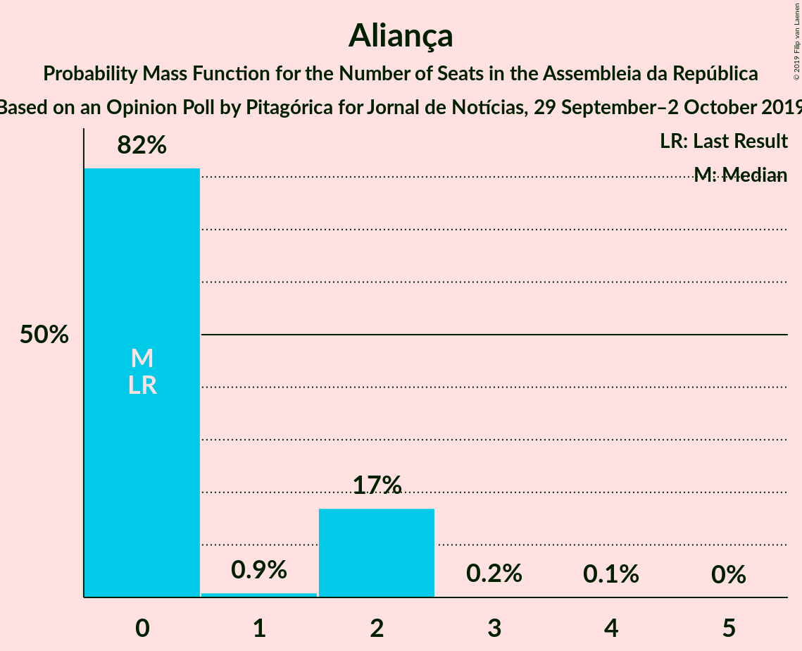

| Number of Seats | Probability | Accumulated | Special Marks |
|:---------------:|:-----------:|:-----------:|:-------------:|
| 0 | 82% | 100% | Last Result, Median |
| 1 | 0.9% | 18% |  |
| 2 | 17% | 17% |  |
| 3 | 0.2% | 0.3% |  |
| 4 | 0.1% | 0.1% |  |
| 5 | 0% | 0% |  |

### Chega

*For a full overview of the results for this party, see the [Chega](party-chega.html) page.*

| Number of Seats | Probability | Accumulated | Special Marks |
|:---------------:|:-----------:|:-----------:|:-------------:|
| 0 | 84% | 100% | Last Result, Median |
| 1 | 2% | 16% |  |
| 2 | 13% | 14% |  |
| 3 | 0.2% | 0.3% |  |
| 4 | 0.1% | 0.1% |  |
| 5 | 0% | 0% |  |

### LIVRE

*For a full overview of the results for this party, see the [LIVRE](party-livre.html) page.*

| Number of Seats | Probability | Accumulated | Special Marks |
|:---------------:|:-----------:|:-----------:|:-------------:|
| 0 | 52% | 100% | Last Result, Median |
| 1 | 47% | 48% |  |
| 2 | 1.2% | 1.2% |  |
| 3 | 0% | 0% |  |

### Iniciativa Liberal

*For a full overview of the results for this party, see the [Iniciativa Liberal](party-iniciativaliberal.html) page.*

| Number of Seats | Probability | Accumulated | Special Marks |
|:---------------:|:-----------:|:-----------:|:-------------:|
| 0 | 98% | 100% | Last Result, Median |
| 1 | 1.2% | 2% |  |
| 2 | 0.9% | 0.9% |  |
| 3 | 0% | 0% |  |

## Coalitions

### Confidence Intervals

| Coalition | Last Result | Median | Majority? | 80% Confidence Interval | 90% Confidence Interval | 95% Confidence Interval | 99% Confidence Interval |
|:---------:|:-----------:|:------:|:---------:|:-----------------------:|:-----------------------:|:-----------------------:|:-----------------------:|
| Partido Socialista – Bloco de Esquerda – Coligação Democrática Unitária | 122 | 137 | 99.8% | 129–142 | 125–146 | 122–149 | 120–151 |
| Partido Socialista – Bloco de Esquerda | 105 | 126 | 93% | 118–132 | 113–133 | 112–136 | 108–138 |
| Partido Socialista – Coligação Democrática Unitária | 103 | 119 | 78% | 111–124 | 105–128 | 103–129 | 101–132 |
| Partido Socialista | 86 | 106 | 4% | 100–113 | 93–115 | 93–117 | 90–120 |
| Partido Social Democrata – CDS–Partido Popular | 107 | 85 | 0% | 80–93 | 77–96 | 74–97 | 72–103 |

### Partido Socialista – Bloco de Esquerda – Coligação Democrática Unitária

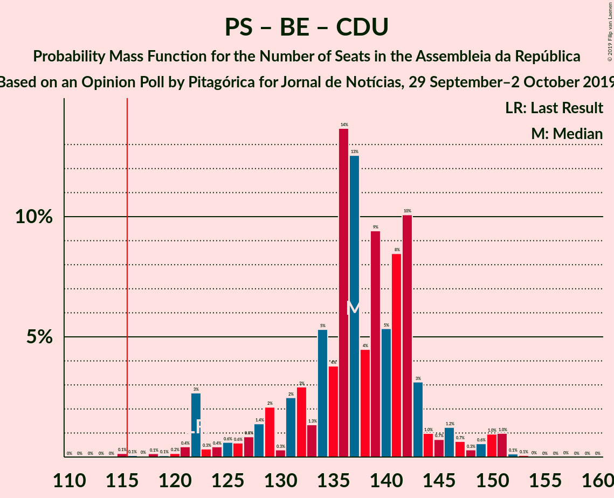

| Number of Seats | Probability | Accumulated | Special Marks |
|:---------------:|:-----------:|:-----------:|:-------------:|
| 115 | 0.1% | 100% |  |
| 116 | 0.1% | 99.8% | Majority |
| 117 | 0% | 99.8% |  |
| 118 | 0.1% | 99.7% |  |
| 119 | 0.1% | 99.6% |  |
| 120 | 0.2% | 99.5% |  |
| 121 | 0.4% | 99.4% |  |
| 122 | 3% | 98.9% | Last Result |
| 123 | 0.3% | 96% |  |
| 124 | 0.4% | 96% |  |
| 125 | 0.6% | 96% |  |
| 126 | 0.6% | 95% |  |
| 127 | 0.8% | 94% |  |
| 128 | 1.4% | 93% |  |
| 129 | 2% | 92% |  |
| 130 | 0.3% | 90% |  |
| 131 | 2% | 90% |  |
| 132 | 3% | 87% |  |
| 133 | 1.3% | 84% |  |
| 134 | 5% | 83% |  |
| 135 | 4% | 78% |  |
| 136 | 14% | 74% |  |
| 137 | 13% | 60% | Median |
| 138 | 4% | 48% |  |
| 139 | 9% | 43% |  |
| 140 | 5% | 34% |  |
| 141 | 8% | 28% |  |
| 142 | 10% | 20% |  |
| 143 | 3% | 10% |  |
| 144 | 1.0% | 7% |  |
| 145 | 0.7% | 6% |  |
| 146 | 1.2% | 5% |  |
| 147 | 0.7% | 4% |  |
| 148 | 0.3% | 3% |  |
| 149 | 0.6% | 3% |  |
| 150 | 1.0% | 2% |  |
| 151 | 1.0% | 1.3% |  |
| 152 | 0.1% | 0.3% |  |
| 153 | 0.1% | 0.2% |  |
| 154 | 0% | 0.1% |  |
| 155 | 0% | 0.1% |  |
| 156 | 0% | 0.1% |  |
| 157 | 0% | 0.1% |  |
| 158 | 0% | 0% |  |

### Partido Socialista – Bloco de Esquerda

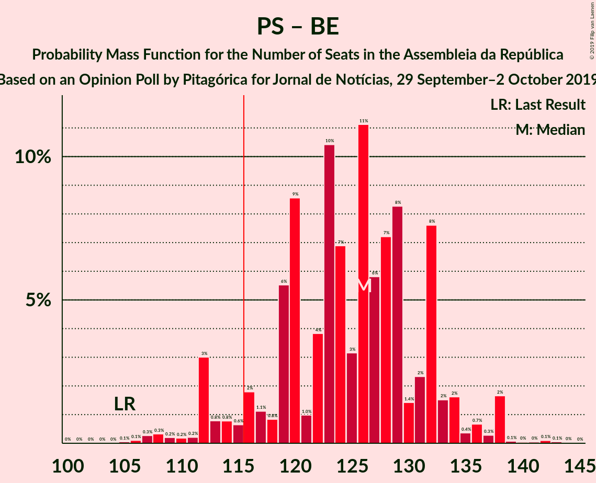

| Number of Seats | Probability | Accumulated | Special Marks |
|:---------------:|:-----------:|:-----------:|:-------------:|
| 105 | 0.1% | 100% | Last Result |
| 106 | 0.1% | 99.9% |  |
| 107 | 0.3% | 99.8% |  |
| 108 | 0.3% | 99.5% |  |
| 109 | 0.2% | 99.2% |  |
| 110 | 0.2% | 99.0% |  |
| 111 | 0.2% | 98.8% |  |
| 112 | 3% | 98.6% |  |
| 113 | 0.8% | 96% |  |
| 114 | 0.8% | 95% |  |
| 115 | 0.6% | 94% |  |
| 116 | 2% | 93% | Majority |
| 117 | 1.1% | 92% |  |
| 118 | 0.8% | 90% |  |
| 119 | 6% | 90% |  |
| 120 | 9% | 84% |  |
| 121 | 1.0% | 76% |  |
| 122 | 4% | 75% |  |
| 123 | 10% | 71% |  |
| 124 | 7% | 60% | Median |
| 125 | 3% | 53% |  |
| 126 | 11% | 50% |  |
| 127 | 6% | 39% |  |
| 128 | 7% | 33% |  |
| 129 | 8% | 26% |  |
| 130 | 1.4% | 18% |  |
| 131 | 2% | 16% |  |
| 132 | 8% | 14% |  |
| 133 | 2% | 6% |  |
| 134 | 2% | 5% |  |
| 135 | 0.4% | 3% |  |
| 136 | 0.7% | 3% |  |
| 137 | 0.3% | 2% |  |
| 138 | 2% | 2% |  |
| 139 | 0.1% | 0.4% |  |
| 140 | 0% | 0.3% |  |
| 141 | 0% | 0.3% |  |
| 142 | 0.1% | 0.2% |  |
| 143 | 0.1% | 0.1% |  |
| 144 | 0% | 0.1% |  |
| 145 | 0% | 0% |  |

### Partido Socialista – Coligação Democrática Unitária

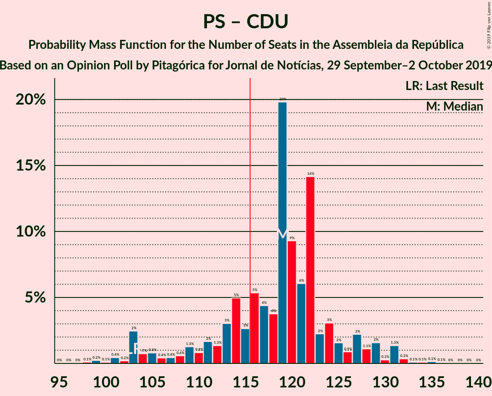

| Number of Seats | Probability | Accumulated | Special Marks |
|:---------------:|:-----------:|:-----------:|:-------------:|
| 98 | 0.1% | 100% |  |
| 99 | 0.2% | 99.9% |  |
| 100 | 0.1% | 99.6% |  |
| 101 | 0.4% | 99.5% |  |
| 102 | 0.2% | 99.1% |  |
| 103 | 2% | 98.9% | Last Result |
| 104 | 0.7% | 96% |  |
| 105 | 0.8% | 96% |  |
| 106 | 0.4% | 95% |  |
| 107 | 0.4% | 95% |  |
| 108 | 0.6% | 94% |  |
| 109 | 1.3% | 93% |  |
| 110 | 0.8% | 92% |  |
| 111 | 2% | 91% |  |
| 112 | 1.3% | 90% |  |
| 113 | 3% | 88% |  |
| 114 | 5% | 85% |  |
| 115 | 3% | 80% |  |
| 116 | 5% | 78% | Majority |
| 117 | 4% | 72% |  |
| 118 | 4% | 68% |  |
| 119 | 20% | 64% | Median |
| 120 | 9% | 44% |  |
| 121 | 6% | 35% |  |
| 122 | 14% | 29% |  |
| 123 | 2% | 15% |  |
| 124 | 3% | 13% |  |
| 125 | 2% | 10% |  |
| 126 | 0.9% | 8% |  |
| 127 | 2% | 7% |  |
| 128 | 1.1% | 5% |  |
| 129 | 2% | 4% |  |
| 130 | 0.3% | 2% |  |
| 131 | 1.3% | 2% |  |
| 132 | 0.3% | 0.8% |  |
| 133 | 0.1% | 0.4% |  |
| 134 | 0.1% | 0.3% |  |
| 135 | 0.1% | 0.2% |  |
| 136 | 0.1% | 0.1% |  |
| 137 | 0% | 0.1% |  |
| 138 | 0% | 0% |  |

### Partido Socialista

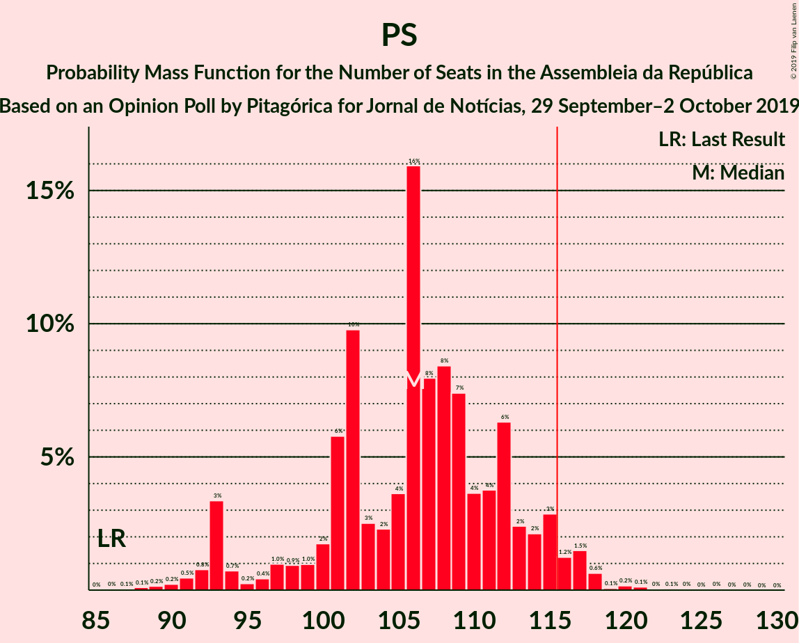

| Number of Seats | Probability | Accumulated | Special Marks |
|:---------------:|:-----------:|:-----------:|:-------------:|
| 86 | 0% | 100% | Last Result |
| 87 | 0.1% | 99.9% |  |
| 88 | 0.1% | 99.9% |  |
| 89 | 0.2% | 99.8% |  |
| 90 | 0.2% | 99.6% |  |
| 91 | 0.5% | 99.4% |  |
| 92 | 0.8% | 98.9% |  |
| 93 | 3% | 98% |  |
| 94 | 0.7% | 95% |  |
| 95 | 0.2% | 94% |  |
| 96 | 0.4% | 94% |  |
| 97 | 1.0% | 93% |  |
| 98 | 0.9% | 92% |  |
| 99 | 1.0% | 91% |  |
| 100 | 2% | 91% |  |
| 101 | 6% | 89% |  |
| 102 | 10% | 83% |  |
| 103 | 3% | 73% |  |
| 104 | 2% | 71% |  |
| 105 | 4% | 68% |  |
| 106 | 16% | 65% | Median |
| 107 | 8% | 49% |  |
| 108 | 8% | 41% |  |
| 109 | 7% | 32% |  |
| 110 | 4% | 25% |  |
| 111 | 4% | 21% |  |
| 112 | 6% | 18% |  |
| 113 | 2% | 11% |  |
| 114 | 2% | 9% |  |
| 115 | 3% | 7% |  |
| 116 | 1.2% | 4% | Majority |
| 117 | 1.5% | 3% |  |
| 118 | 0.6% | 1.2% |  |
| 119 | 0.1% | 0.6% |  |
| 120 | 0.2% | 0.5% |  |
| 121 | 0.1% | 0.3% |  |
| 122 | 0% | 0.2% |  |
| 123 | 0.1% | 0.2% |  |
| 124 | 0% | 0.1% |  |
| 125 | 0% | 0.1% |  |
| 126 | 0% | 0.1% |  |
| 127 | 0% | 0% |  |

### Partido Social Democrata – CDS–Partido Popular

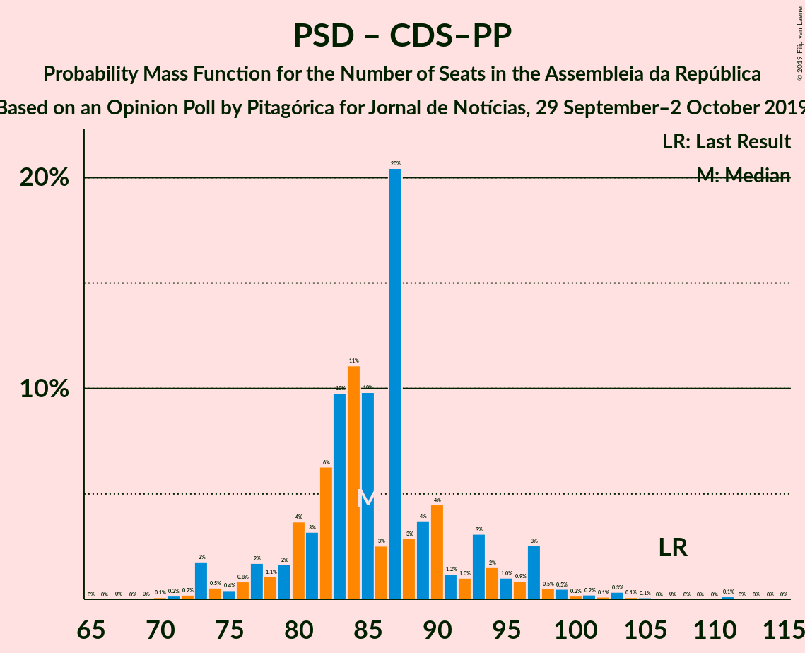

| Number of Seats | Probability | Accumulated | Special Marks |
|:---------------:|:-----------:|:-----------:|:-------------:|
| 67 | 0% | 100% |  |
| 68 | 0% | 99.9% |  |
| 69 | 0% | 99.9% |  |
| 70 | 0.1% | 99.9% |  |
| 71 | 0.2% | 99.8% |  |
| 72 | 0.2% | 99.6% |  |
| 73 | 2% | 99.4% |  |
| 74 | 0.5% | 98% |  |
| 75 | 0.4% | 97% |  |
| 76 | 0.8% | 97% |  |
| 77 | 2% | 96% |  |
| 78 | 1.1% | 94% |  |
| 79 | 2% | 93% |  |
| 80 | 4% | 91% |  |
| 81 | 3% | 88% |  |
| 82 | 6% | 85% |  |
| 83 | 10% | 78% |  |
| 84 | 11% | 68% |  |
| 85 | 10% | 57% |  |
| 86 | 3% | 48% | Median |
| 87 | 20% | 45% |  |
| 88 | 3% | 25% |  |
| 89 | 4% | 22% |  |
| 90 | 4% | 18% |  |
| 91 | 1.2% | 13% |  |
| 92 | 1.0% | 12% |  |
| 93 | 3% | 11% |  |
| 94 | 2% | 8% |  |
| 95 | 1.0% | 7% |  |
| 96 | 0.9% | 6% |  |
| 97 | 3% | 5% |  |
| 98 | 0.5% | 2% |  |
| 99 | 0.5% | 2% |  |
| 100 | 0.2% | 1.2% |  |
| 101 | 0.2% | 1.1% |  |
| 102 | 0.1% | 0.8% |  |
| 103 | 0.3% | 0.7% |  |
| 104 | 0.1% | 0.4% |  |
| 105 | 0.1% | 0.3% |  |
| 106 | 0% | 0.2% |  |
| 107 | 0% | 0.2% | Last Result |
| 108 | 0% | 0.2% |  |
| 109 | 0% | 0.1% |  |
| 110 | 0% | 0.1% |  |
| 111 | 0.1% | 0.1% |  |
| 112 | 0% | 0% |  |

## Technical Information

### Opinion Poll

+ **Polling firm:** Pitagórica
+ **Commissioner(s):** Jornal de Notícias
+ **Fieldwork period:** 29 September–2 October 2019

### Calculations

+ **Sample size:** 600
+ **Simulations done:** 1,048,576
+ **Error estimate:** 1.07%

