# Opinion Poll by ICS/ISCTE, 22 January–5 February 2020

<a href="#voting-intentions">Voting Intentions</a> | <a href="#seats">Seats</a> | <a href="#coalitions">Coalitions</a> | <a href="#technical-information">Technical Information</a>

## Voting Intentions

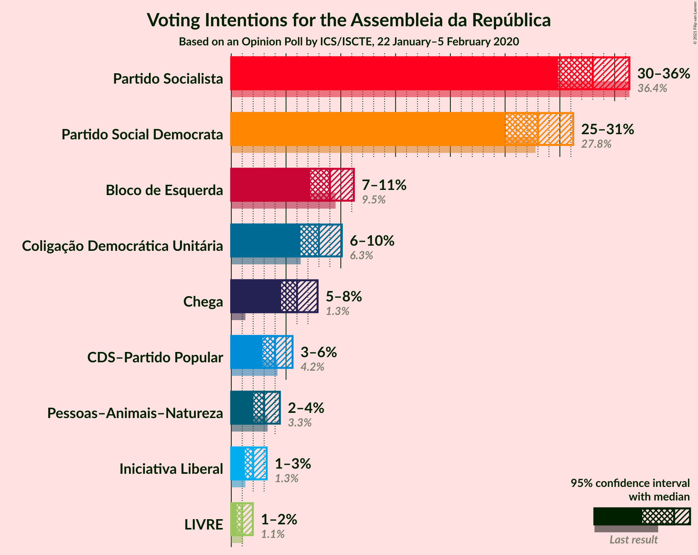

### Confidence Intervals

| Party | Last Result | Poll Result | 80% Confidence Interval | 90% Confidence Interval | 95% Confidence Interval | 99% Confidence Interval |
|:-----:|:-----------:|:-----------:|:-----------------------:|:-----------------------:|:-----------------------:|:-----------------------:|
| Partido Socialista | 36.4% | 33.0% | 30.9–35.2% |30.3–35.8% |29.8–36.3% |28.8–37.4% |
| Partido Social Democrata | 27.8% | 28.0% | 26.0–30.1% |25.5–30.7% |25.0–31.2% |24.1–32.3% |
| Bloco de Esquerda | 9.5% | 9.0% | 7.8–10.4% |7.5–10.8% |7.2–11.2% |6.7–11.9% |
| Coligação Democrática Unitária | 6.3% | 8.0% | 6.9–9.4% |6.6–9.8% |6.3–10.1% |5.8–10.8% |
| Chega | 1.3% | 6.0% | 5.0–7.2% |4.8–7.6% |4.6–7.9% |4.1–8.5% |
| CDS–Partido Popular | 4.2% | 4.0% | 3.2–5.0% |3.0–5.3% |2.9–5.6% |2.5–6.1% |
| Pessoas–Animais–Natureza | 3.3% | 3.0% | 2.3–3.9% |2.2–4.2% |2.0–4.4% |1.8–4.9% |
| Iniciativa Liberal | 1.3% | 2.0% | 1.5–2.8% |1.4–3.0% |1.2–3.2% |1.0–3.7% |
| LIVRE | 1.1% | 1.0% | 0.7–1.6% |0.6–1.8% |0.5–2.0% |0.4–2.3% |

*Note:* The poll result column reflects the actual value used in the calculations. Published results may vary slightly, and in addition be rounded to fewer digits.

## Seats

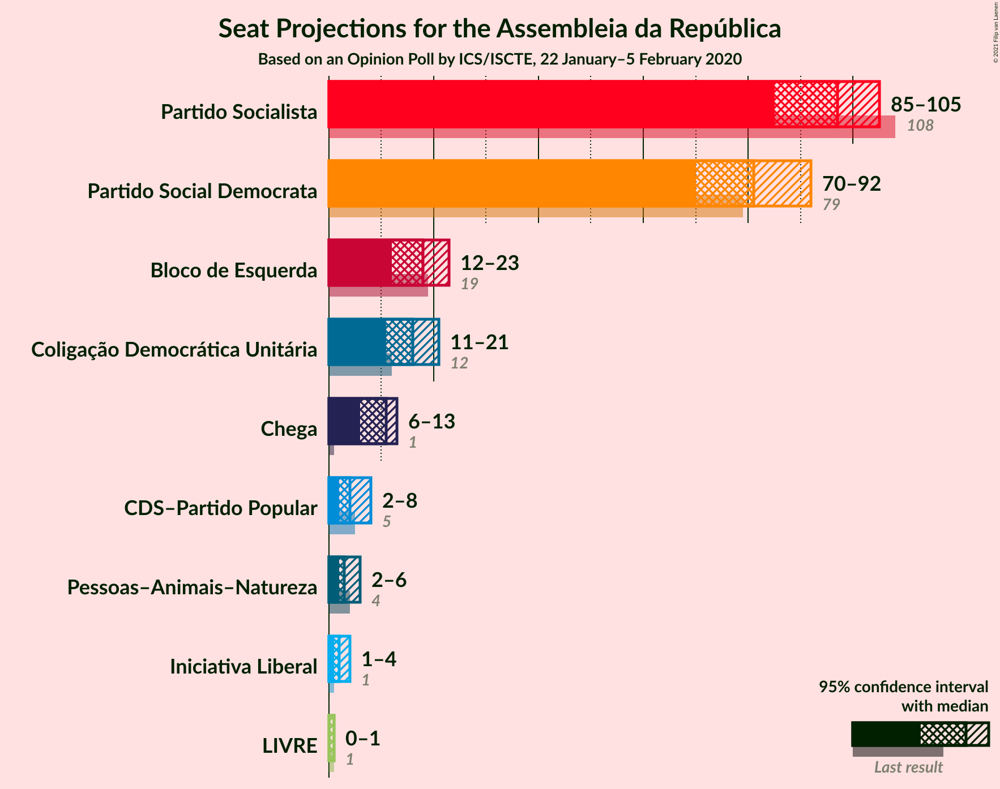

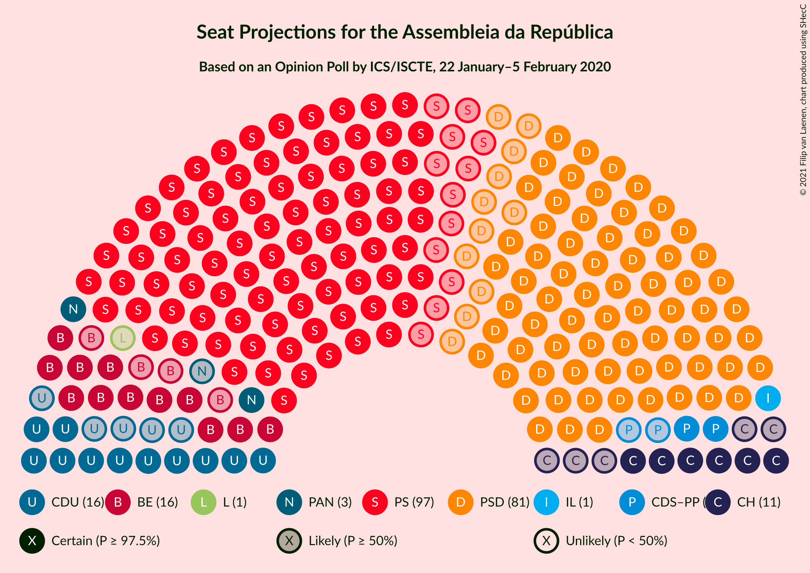

### Confidence Intervals

| Party | Last Result | Median | 80% Confidence Interval | 90% Confidence Interval | 95% Confidence Interval | 99% Confidence Interval |
|:-----:|:-----------:|:------:|:-----------------------:|:-----------------------:|:-----------------------:|:-----------------------:|
| <a href="#partido-socialista">Partido Socialista</a> | 108 | 97 | 85–103 |85–104 |85–105 |80–109 |
| <a href="#partido-social-democrata">Partido Social Democrata</a> | 79 | 81 | 71–90 |71–90 |70–92 |68–95 |
| <a href="#bloco-de-esquerda">Bloco de Esquerda</a> | 19 | 18 | 16–21 |14–21 |12–23 |12–24 |
| <a href="#coligação-democrática-unitária">Coligação Democrática Unitária</a> | 12 | 16 | 14–20 |12–21 |11–21 |10–23 |
| <a href="#chega">Chega</a> | 1 | 11 | 7–11 |7–12 |6–13 |4–14 |
| <a href="#cds–partido-popular">CDS–Partido Popular</a> | 5 | 4 | 3–5 |2–6 |2–8 |1–9 |
| <a href="#pessoas–animais–natureza">Pessoas–Animais–Natureza</a> | 4 | 3 | 2–4 |2–4 |2–6 |1–6 |
| <a href="#iniciativa-liberal">Iniciativa Liberal</a> | 1 | 2 | 1–3 |1–3 |1–4 |1–4 |
| <a href="#livre">LIVRE</a> | 1 | 1 | 0–1 |0–1 |0–1 |0–2 |

### Partido Socialista

*For a full overview of the results for this party, see the [Partido Socialista](party-partidosocialista.html) page.*

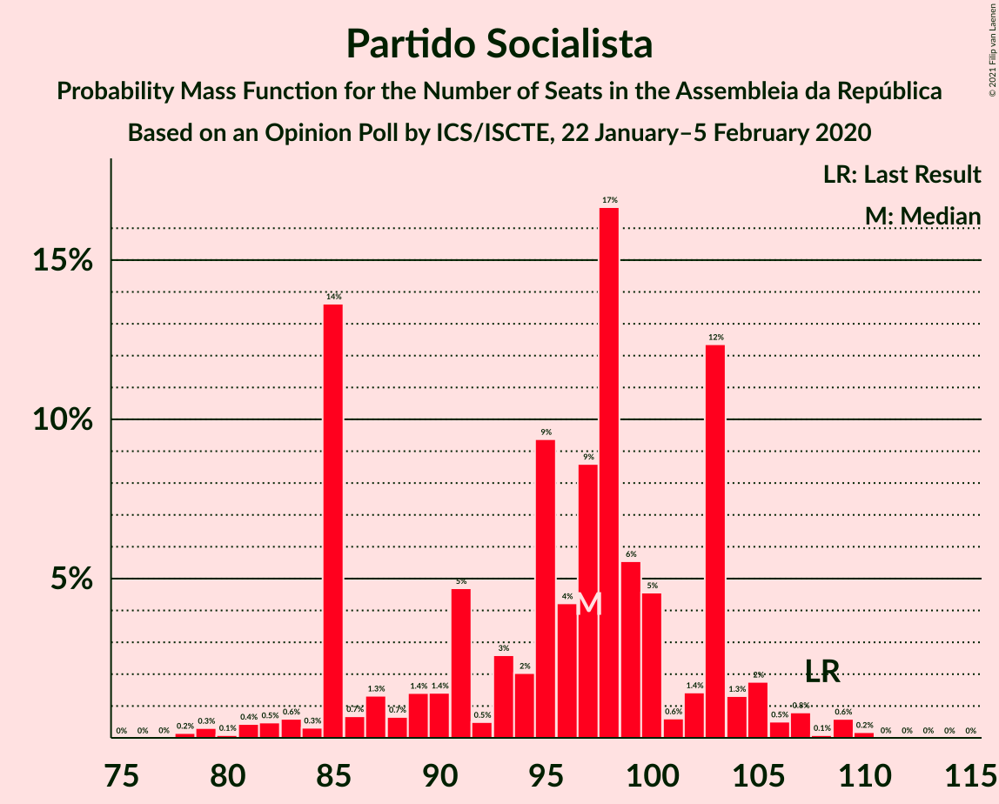

| Number of Seats | Probability | Accumulated | Special Marks |
|:---------------:|:-----------:|:-----------:|:-------------:|
| 78 | 0.2% | 100% |  |
| 79 | 0.3% | 99.8% |  |
| 80 | 0.1% | 99.5% |  |
| 81 | 0.4% | 99.4% |  |
| 82 | 0.5% | 99.0% |  |
| 83 | 0.6% | 98.5% |  |
| 84 | 0.3% | 98% |  |
| 85 | 14% | 98% |  |
| 86 | 0.7% | 84% |  |
| 87 | 1.3% | 83% |  |
| 88 | 0.7% | 82% |  |
| 89 | 1.4% | 81% |  |
| 90 | 1.4% | 80% |  |
| 91 | 5% | 78% |  |
| 92 | 0.5% | 74% |  |
| 93 | 3% | 73% |  |
| 94 | 2% | 71% |  |
| 95 | 9% | 69% |  |
| 96 | 4% | 59% |  |
| 97 | 9% | 55% | Median |
| 98 | 17% | 46% |  |
| 99 | 6% | 30% |  |
| 100 | 5% | 24% |  |
| 101 | 0.6% | 20% |  |
| 102 | 1.4% | 19% |  |
| 103 | 12% | 18% |  |
| 104 | 1.3% | 5% |  |
| 105 | 2% | 4% |  |
| 106 | 0.5% | 2% |  |
| 107 | 0.8% | 2% |  |
| 108 | 0.1% | 0.9% | Last Result |
| 109 | 0.6% | 0.8% |  |
| 110 | 0.2% | 0.2% |  |
| 111 | 0% | 0% |  |

### Partido Social Democrata

*For a full overview of the results for this party, see the [Partido Social Democrata](party-partidosocialdemocrata.html) page.*

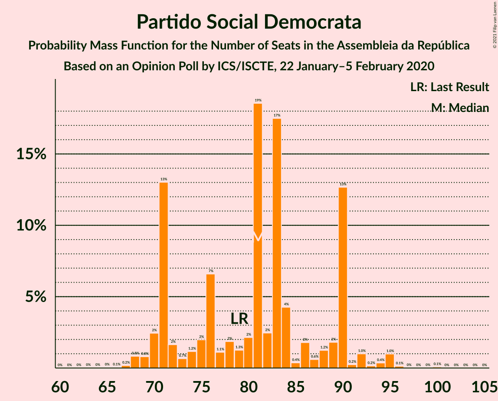

| Number of Seats | Probability | Accumulated | Special Marks |
|:---------------:|:-----------:|:-----------:|:-------------:|
| 64 | 0% | 100% |  |
| 65 | 0% | 99.9% |  |
| 66 | 0.1% | 99.9% |  |
| 67 | 0.2% | 99.8% |  |
| 68 | 0.8% | 99.7% |  |
| 69 | 0.8% | 98.8% |  |
| 70 | 2% | 98% |  |
| 71 | 13% | 96% |  |
| 72 | 2% | 83% |  |
| 73 | 0.7% | 81% |  |
| 74 | 1.2% | 80% |  |
| 75 | 2% | 79% |  |
| 76 | 7% | 77% |  |
| 77 | 1.1% | 71% |  |
| 78 | 2% | 69% |  |
| 79 | 1.3% | 68% | Last Result |
| 80 | 2% | 66% |  |
| 81 | 19% | 64% | Median |
| 82 | 2% | 46% |  |
| 83 | 17% | 43% |  |
| 84 | 4% | 26% |  |
| 85 | 0.4% | 21% |  |
| 86 | 2% | 21% |  |
| 87 | 0.6% | 19% |  |
| 88 | 1.2% | 19% |  |
| 89 | 2% | 17% |  |
| 90 | 13% | 16% |  |
| 91 | 0.2% | 3% |  |
| 92 | 1.0% | 3% |  |
| 93 | 0.2% | 2% |  |
| 94 | 0.4% | 2% |  |
| 95 | 1.0% | 1.2% |  |
| 96 | 0.1% | 0.2% |  |
| 97 | 0% | 0.1% |  |
| 98 | 0% | 0.1% |  |
| 99 | 0% | 0.1% |  |
| 100 | 0.1% | 0.1% |  |
| 101 | 0% | 0% |  |

### Bloco de Esquerda

*For a full overview of the results for this party, see the [Bloco de Esquerda](party-blocodeesquerda.html) page.*

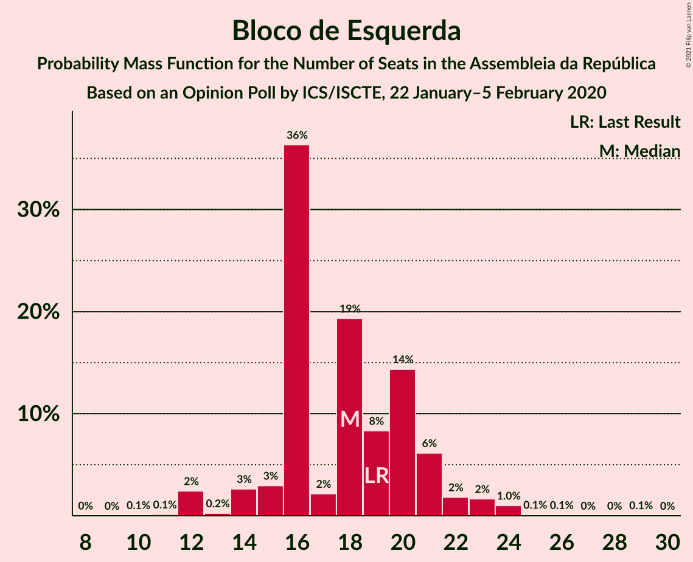

| Number of Seats | Probability | Accumulated | Special Marks |
|:---------------:|:-----------:|:-----------:|:-------------:|
| 10 | 0.1% | 100% |  |
| 11 | 0.1% | 99.9% |  |
| 12 | 2% | 99.7% |  |
| 13 | 0.2% | 97% |  |
| 14 | 3% | 97% |  |
| 15 | 3% | 94% |  |
| 16 | 36% | 91% |  |
| 17 | 2% | 55% |  |
| 18 | 19% | 53% | Median |
| 19 | 8% | 34% | Last Result |
| 20 | 14% | 25% |  |
| 21 | 6% | 11% |  |
| 22 | 2% | 5% |  |
| 23 | 2% | 3% |  |
| 24 | 1.0% | 1.3% |  |
| 25 | 0.1% | 0.3% |  |
| 26 | 0.1% | 0.2% |  |
| 27 | 0% | 0.1% |  |
| 28 | 0% | 0.1% |  |
| 29 | 0.1% | 0.1% |  |
| 30 | 0% | 0% |  |

### Coligação Democrática Unitária

*For a full overview of the results for this party, see the [Coligação Democrática Unitária](party-coligaçãodemocráticaunitária.html) page.*

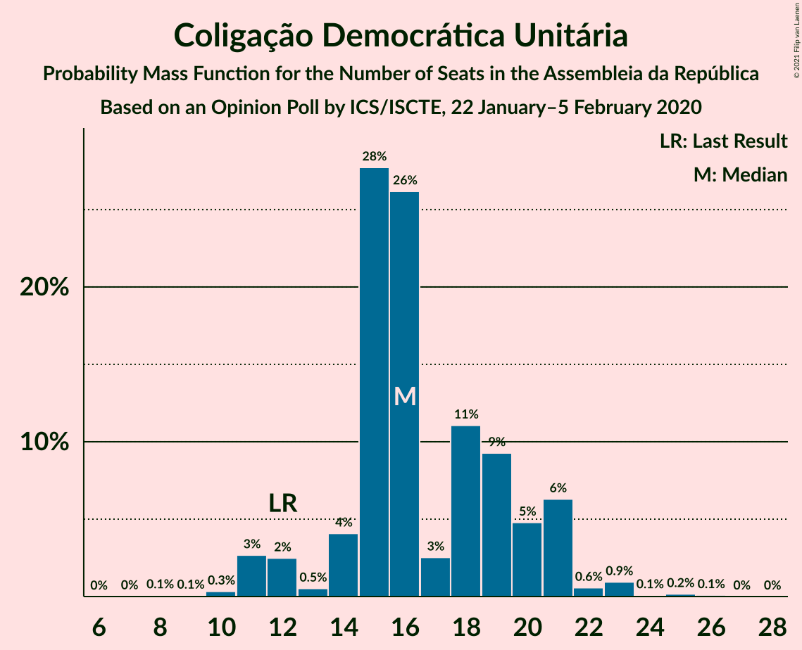

| Number of Seats | Probability | Accumulated | Special Marks |
|:---------------:|:-----------:|:-----------:|:-------------:|
| 8 | 0.1% | 100% |  |
| 9 | 0.1% | 99.9% |  |
| 10 | 0.3% | 99.8% |  |
| 11 | 3% | 99.5% |  |
| 12 | 2% | 97% | Last Result |
| 13 | 0.5% | 94% |  |
| 14 | 4% | 94% |  |
| 15 | 28% | 90% |  |
| 16 | 26% | 62% | Median |
| 17 | 3% | 36% |  |
| 18 | 11% | 33% |  |
| 19 | 9% | 22% |  |
| 20 | 5% | 13% |  |
| 21 | 6% | 8% |  |
| 22 | 0.6% | 2% |  |
| 23 | 0.9% | 1.3% |  |
| 24 | 0.1% | 0.4% |  |
| 25 | 0.2% | 0.3% |  |
| 26 | 0.1% | 0.1% |  |
| 27 | 0% | 0% |  |

### Chega

*For a full overview of the results for this party, see the [Chega](party-chega.html) page.*

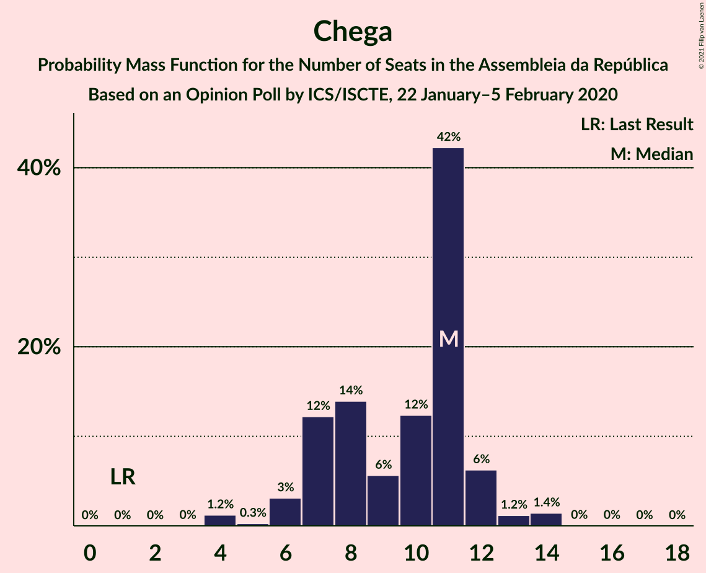

| Number of Seats | Probability | Accumulated | Special Marks |
|:---------------:|:-----------:|:-----------:|:-------------:|
| 1 | 0% | 100% | Last Result |
| 2 | 0% | 100% |  |
| 3 | 0% | 100% |  |
| 4 | 1.2% | 100% |  |
| 5 | 0.3% | 98.8% |  |
| 6 | 3% | 98% |  |
| 7 | 12% | 95% |  |
| 8 | 14% | 83% |  |
| 9 | 6% | 69% |  |
| 10 | 12% | 64% |  |
| 11 | 42% | 51% | Median |
| 12 | 6% | 9% |  |
| 13 | 1.2% | 3% |  |
| 14 | 1.4% | 2% |  |
| 15 | 0% | 0.1% |  |
| 16 | 0% | 0.1% |  |
| 17 | 0% | 0.1% |  |
| 18 | 0% | 0% |  |

### CDS–Partido Popular

*For a full overview of the results for this party, see the [CDS–Partido Popular](party-cds–partidopopular.html) page.*

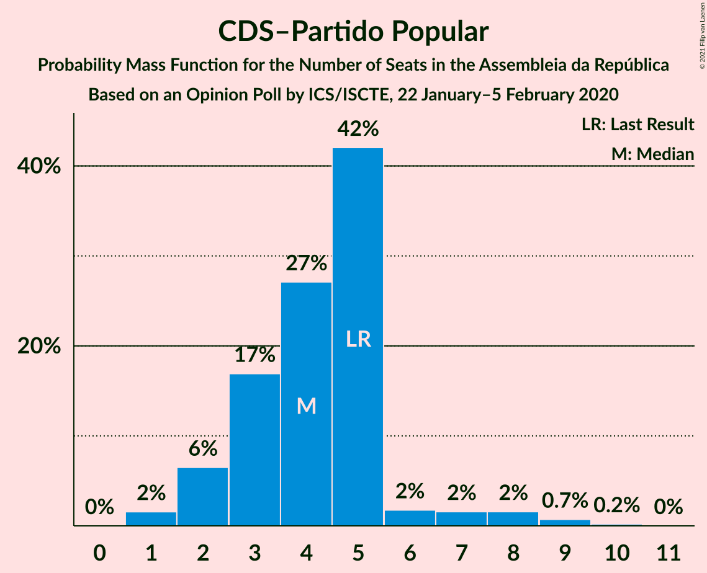

| Number of Seats | Probability | Accumulated | Special Marks |
|:---------------:|:-----------:|:-----------:|:-------------:|
| 1 | 2% | 100% |  |
| 2 | 6% | 98% |  |
| 3 | 17% | 92% |  |
| 4 | 27% | 75% | Median |
| 5 | 42% | 48% | Last Result |
| 6 | 2% | 6% |  |
| 7 | 2% | 4% |  |
| 8 | 2% | 3% |  |
| 9 | 0.7% | 1.0% |  |
| 10 | 0.2% | 0.2% |  |
| 11 | 0% | 0% |  |

### Pessoas–Animais–Natureza

*For a full overview of the results for this party, see the [Pessoas–Animais–Natureza](party-pessoas–animais–natureza.html) page.*

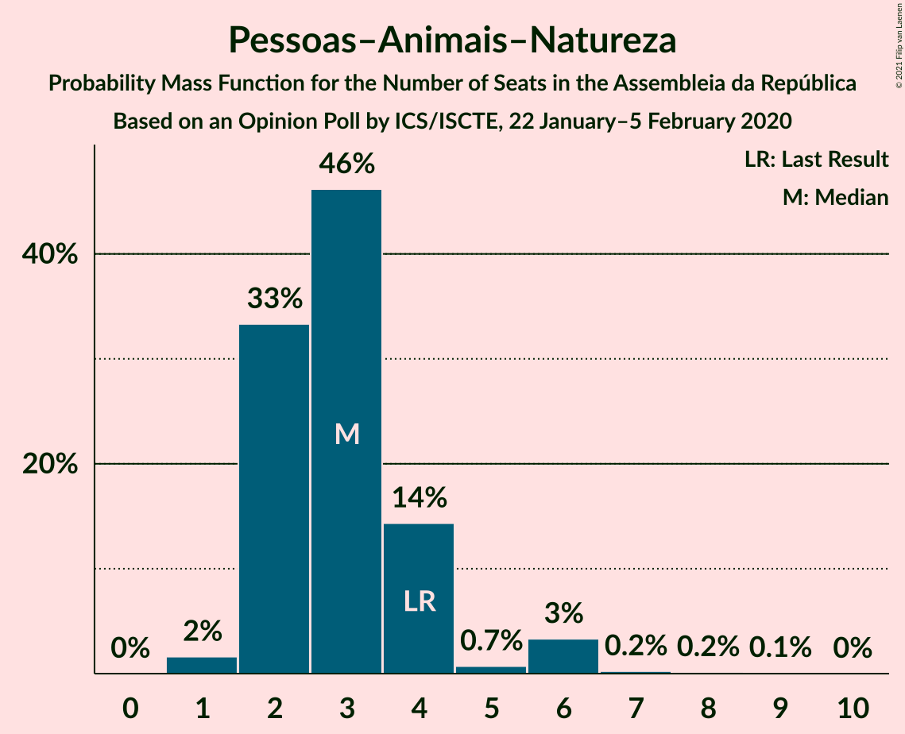

| Number of Seats | Probability | Accumulated | Special Marks |
|:---------------:|:-----------:|:-----------:|:-------------:|
| 1 | 2% | 100% |  |
| 2 | 33% | 98% |  |
| 3 | 46% | 65% | Median |
| 4 | 14% | 19% | Last Result |
| 5 | 0.7% | 5% |  |
| 6 | 3% | 4% |  |
| 7 | 0.2% | 0.5% |  |
| 8 | 0.2% | 0.2% |  |
| 9 | 0.1% | 0.1% |  |
| 10 | 0% | 0% |  |

### Iniciativa Liberal

*For a full overview of the results for this party, see the [Iniciativa Liberal](party-iniciativaliberal.html) page.*

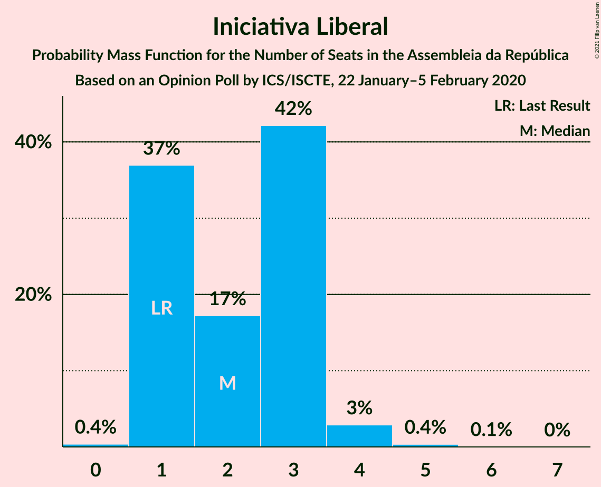

| Number of Seats | Probability | Accumulated | Special Marks |
|:---------------:|:-----------:|:-----------:|:-------------:|
| 0 | 0.4% | 100% |  |
| 1 | 37% | 99.6% | Last Result |
| 2 | 17% | 63% | Median |
| 3 | 42% | 45% |  |
| 4 | 3% | 3% |  |
| 5 | 0.4% | 0.4% |  |
| 6 | 0.1% | 0.1% |  |
| 7 | 0% | 0% |  |

### LIVRE

*For a full overview of the results for this party, see the [LIVRE](party-livre.html) page.*

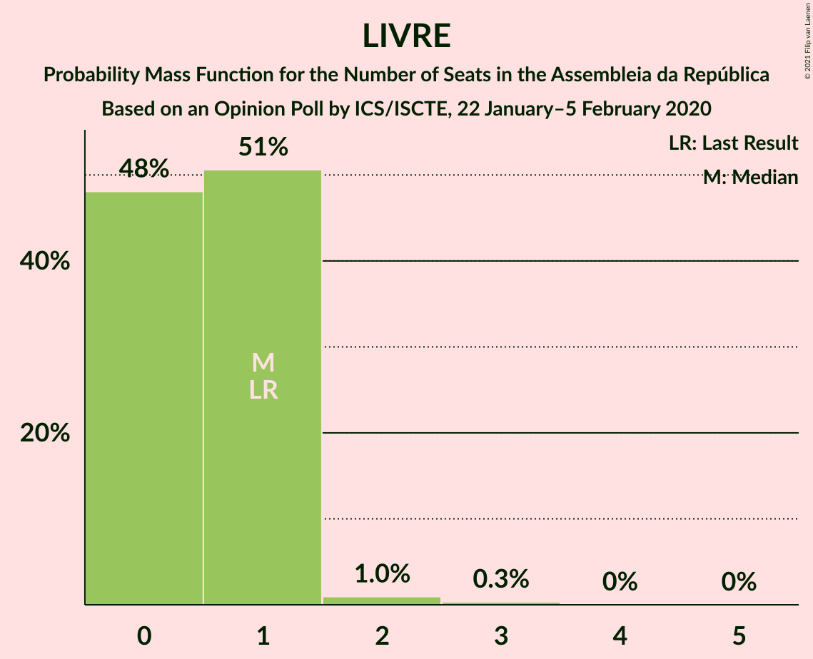

| Number of Seats | Probability | Accumulated | Special Marks |
|:---------------:|:-----------:|:-----------:|:-------------:|
| 0 | 48% | 100% |  |
| 1 | 51% | 52% | Last Result, Median |
| 2 | 1.0% | 1.3% |  |
| 3 | 0.3% | 0.4% |  |
| 4 | 0% | 0% |  |

## Coalitions

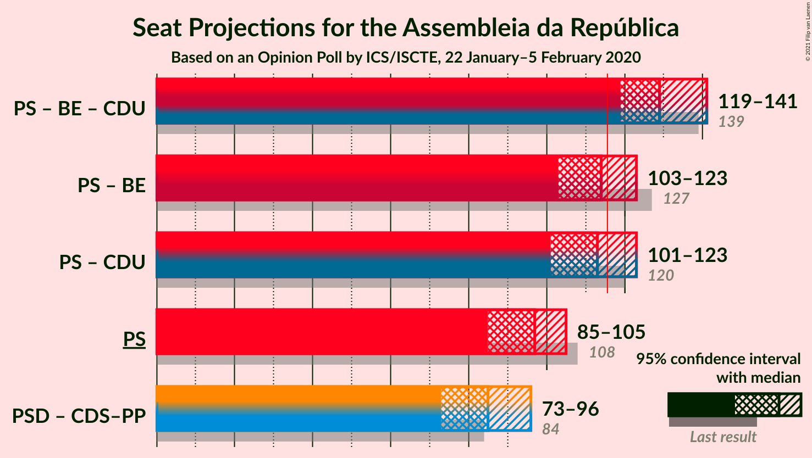

### Confidence Intervals

| Coalition | Last Result | Median | Majority? | 80% Confidence Interval | 90% Confidence Interval | 95% Confidence Interval | 99% Confidence Interval |
|:---------:|:-----------:|:------:|:---------:|:-----------------------:|:-----------------------:|:-----------------------:|:-----------------------:|
| Partido Socialista – Bloco de Esquerda – Coligação Democrática Unitária | 139 | 129 | 99.3% | 119–139 | 119–141 | 119–141 | 115–143 |
| Partido Socialista – Bloco de Esquerda | 127 | 114 | 33% | 103–123 | 103–123 | 103–123 | 98–127 |
| Partido Socialista – Coligação Democrática Unitária | 120 | 113 | 30% | 101–119 | 101–121 | 101–123 | 97–125 |
| Partido Socialista | 108 | 97 | 0% | 85–103 | 85–104 | 85–105 | 80–109 |
| Partido Social Democrata – CDS–Partido Popular | 84 | 85 | 0% | 76–95 | 75–95 | 73–96 | 70–99 |

### Partido Socialista – Bloco de Esquerda – Coligação Democrática Unitária

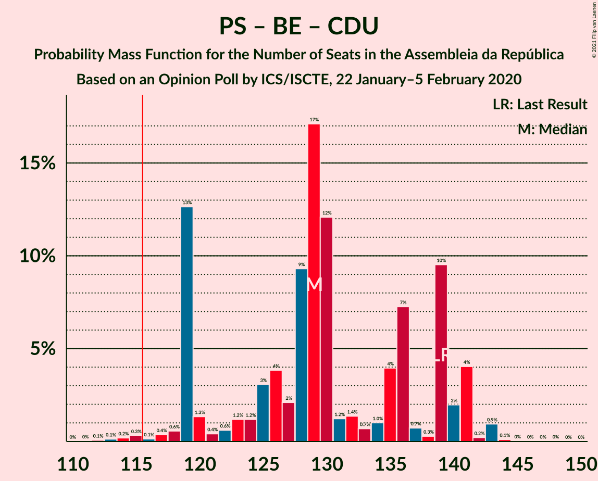

| Number of Seats | Probability | Accumulated | Special Marks |
|:---------------:|:-----------:|:-----------:|:-------------:|
| 112 | 0.1% | 100% |  |
| 113 | 0.1% | 99.9% |  |
| 114 | 0.2% | 99.8% |  |
| 115 | 0.3% | 99.6% |  |
| 116 | 0.1% | 99.3% | Majority |
| 117 | 0.4% | 99.1% |  |
| 118 | 0.6% | 98.8% |  |
| 119 | 13% | 98% |  |
| 120 | 1.3% | 86% |  |
| 121 | 0.4% | 84% |  |
| 122 | 0.6% | 84% |  |
| 123 | 1.2% | 83% |  |
| 124 | 1.2% | 82% |  |
| 125 | 3% | 81% |  |
| 126 | 4% | 78% |  |
| 127 | 2% | 74% |  |
| 128 | 9% | 72% |  |
| 129 | 17% | 63% |  |
| 130 | 12% | 45% |  |
| 131 | 1.2% | 33% | Median |
| 132 | 1.4% | 32% |  |
| 133 | 0.7% | 31% |  |
| 134 | 1.0% | 30% |  |
| 135 | 4% | 29% |  |
| 136 | 7% | 25% |  |
| 137 | 0.7% | 18% |  |
| 138 | 0.3% | 17% |  |
| 139 | 10% | 17% | Last Result |
| 140 | 2% | 7% |  |
| 141 | 4% | 5% |  |
| 142 | 0.2% | 1.3% |  |
| 143 | 0.9% | 1.1% |  |
| 144 | 0.1% | 0.2% |  |
| 145 | 0% | 0.1% |  |
| 146 | 0% | 0.1% |  |
| 147 | 0% | 0% |  |

### Partido Socialista – Bloco de Esquerda

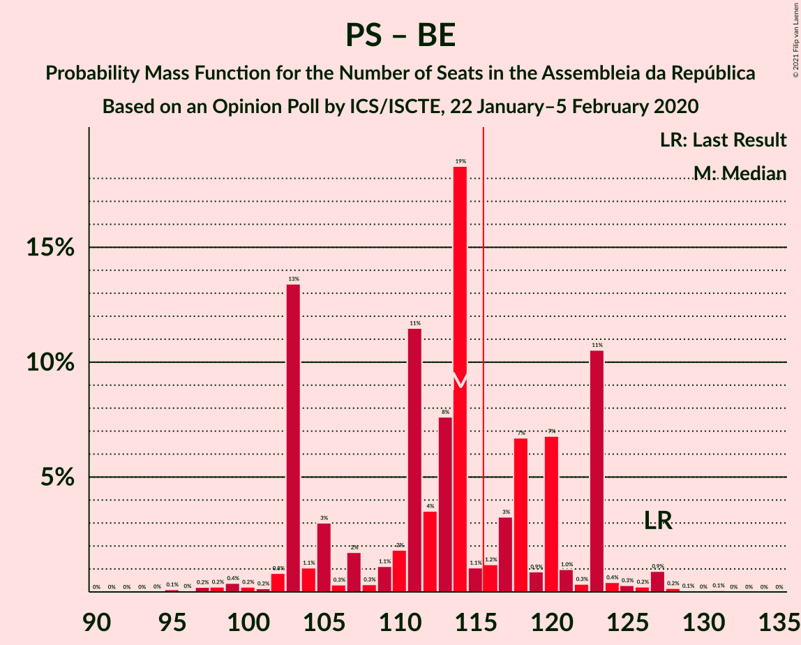

| Number of Seats | Probability | Accumulated | Special Marks |
|:---------------:|:-----------:|:-----------:|:-------------:|
| 95 | 0.1% | 100% |  |
| 96 | 0% | 99.9% |  |
| 97 | 0.2% | 99.8% |  |
| 98 | 0.2% | 99.6% |  |
| 99 | 0.4% | 99.4% |  |
| 100 | 0.2% | 99.0% |  |
| 101 | 0.2% | 98.8% |  |
| 102 | 0.8% | 98.6% |  |
| 103 | 13% | 98% |  |
| 104 | 1.1% | 84% |  |
| 105 | 3% | 83% |  |
| 106 | 0.3% | 80% |  |
| 107 | 2% | 80% |  |
| 108 | 0.3% | 78% |  |
| 109 | 1.1% | 78% |  |
| 110 | 2% | 77% |  |
| 111 | 11% | 75% |  |
| 112 | 4% | 64% |  |
| 113 | 8% | 60% |  |
| 114 | 19% | 52% |  |
| 115 | 1.1% | 34% | Median |
| 116 | 1.2% | 33% | Majority |
| 117 | 3% | 32% |  |
| 118 | 7% | 28% |  |
| 119 | 0.9% | 22% |  |
| 120 | 7% | 21% |  |
| 121 | 1.0% | 14% |  |
| 122 | 0.3% | 13% |  |
| 123 | 11% | 13% |  |
| 124 | 0.4% | 2% |  |
| 125 | 0.3% | 2% |  |
| 126 | 0.2% | 1.4% |  |
| 127 | 0.9% | 1.2% | Last Result |
| 128 | 0.2% | 0.3% |  |
| 129 | 0.1% | 0.1% |  |
| 130 | 0% | 0.1% |  |
| 131 | 0.1% | 0.1% |  |
| 132 | 0% | 0% |  |

### Partido Socialista – Coligação Democrática Unitária

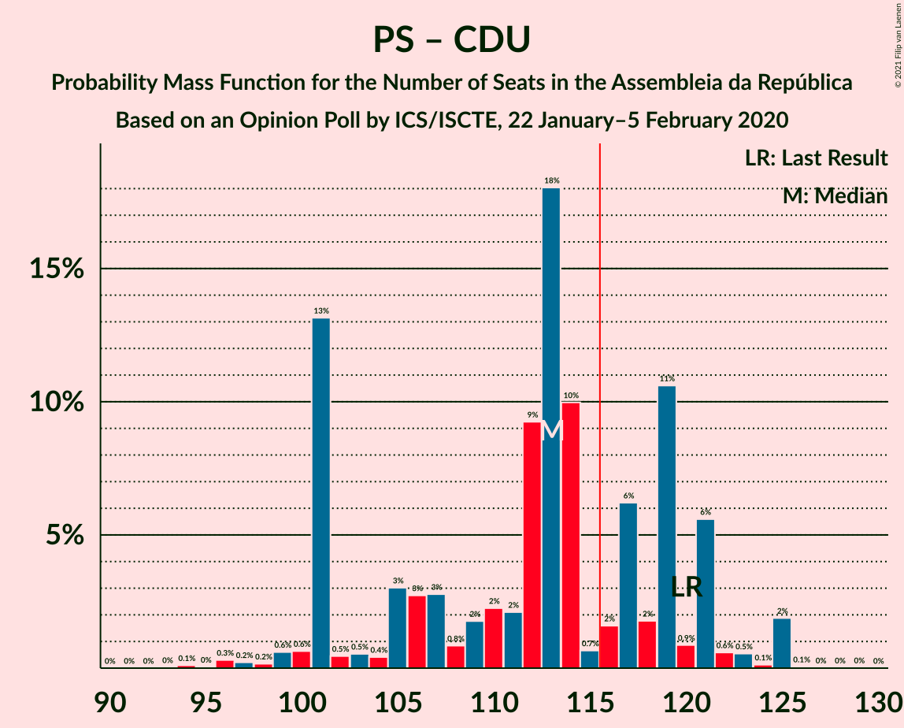

| Number of Seats | Probability | Accumulated | Special Marks |
|:---------------:|:-----------:|:-----------:|:-------------:|
| 94 | 0.1% | 100% |  |
| 95 | 0% | 99.9% |  |
| 96 | 0.3% | 99.8% |  |
| 97 | 0.2% | 99.5% |  |
| 98 | 0.2% | 99.3% |  |
| 99 | 0.6% | 99.1% |  |
| 100 | 0.6% | 98.5% |  |
| 101 | 13% | 98% |  |
| 102 | 0.5% | 85% |  |
| 103 | 0.5% | 84% |  |
| 104 | 0.4% | 84% |  |
| 105 | 3% | 83% |  |
| 106 | 3% | 80% |  |
| 107 | 3% | 78% |  |
| 108 | 0.8% | 75% |  |
| 109 | 2% | 74% |  |
| 110 | 2% | 72% |  |
| 111 | 2% | 70% |  |
| 112 | 9% | 68% |  |
| 113 | 18% | 59% | Median |
| 114 | 10% | 41% |  |
| 115 | 0.7% | 31% |  |
| 116 | 2% | 30% | Majority |
| 117 | 6% | 28% |  |
| 118 | 2% | 22% |  |
| 119 | 11% | 20% |  |
| 120 | 0.9% | 10% | Last Result |
| 121 | 6% | 9% |  |
| 122 | 0.6% | 3% |  |
| 123 | 0.5% | 3% |  |
| 124 | 0.1% | 2% |  |
| 125 | 2% | 2% |  |
| 126 | 0.1% | 0.1% |  |
| 127 | 0% | 0.1% |  |
| 128 | 0% | 0% |  |

### Partido Socialista

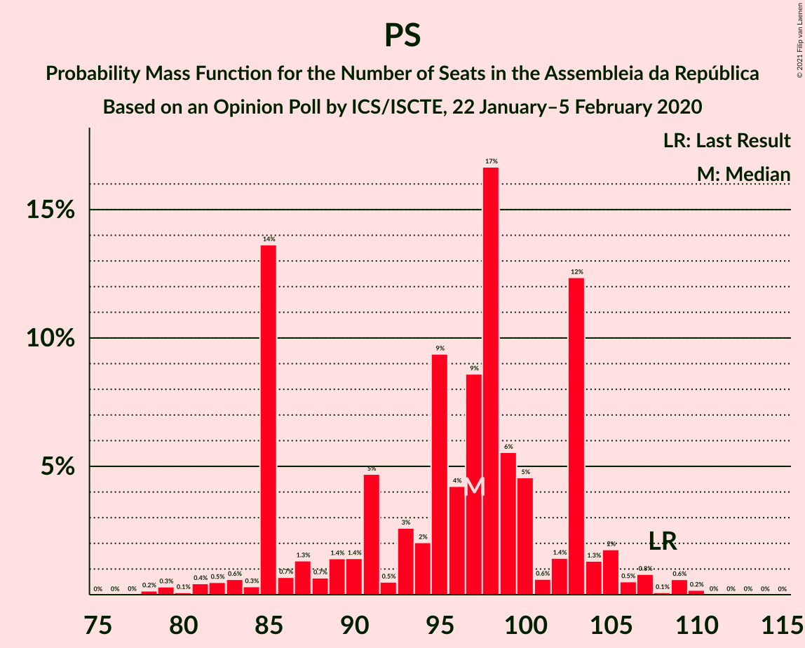

| Number of Seats | Probability | Accumulated | Special Marks |
|:---------------:|:-----------:|:-----------:|:-------------:|
| 78 | 0.2% | 100% |  |
| 79 | 0.3% | 99.8% |  |
| 80 | 0.1% | 99.5% |  |
| 81 | 0.4% | 99.4% |  |
| 82 | 0.5% | 99.0% |  |
| 83 | 0.6% | 98.5% |  |
| 84 | 0.3% | 98% |  |
| 85 | 14% | 98% |  |
| 86 | 0.7% | 84% |  |
| 87 | 1.3% | 83% |  |
| 88 | 0.7% | 82% |  |
| 89 | 1.4% | 81% |  |
| 90 | 1.4% | 80% |  |
| 91 | 5% | 78% |  |
| 92 | 0.5% | 74% |  |
| 93 | 3% | 73% |  |
| 94 | 2% | 71% |  |
| 95 | 9% | 69% |  |
| 96 | 4% | 59% |  |
| 97 | 9% | 55% | Median |
| 98 | 17% | 46% |  |
| 99 | 6% | 30% |  |
| 100 | 5% | 24% |  |
| 101 | 0.6% | 20% |  |
| 102 | 1.4% | 19% |  |
| 103 | 12% | 18% |  |
| 104 | 1.3% | 5% |  |
| 105 | 2% | 4% |  |
| 106 | 0.5% | 2% |  |
| 107 | 0.8% | 2% |  |
| 108 | 0.1% | 0.9% | Last Result |
| 109 | 0.6% | 0.8% |  |
| 110 | 0.2% | 0.2% |  |
| 111 | 0% | 0% |  |

### Partido Social Democrata – CDS–Partido Popular

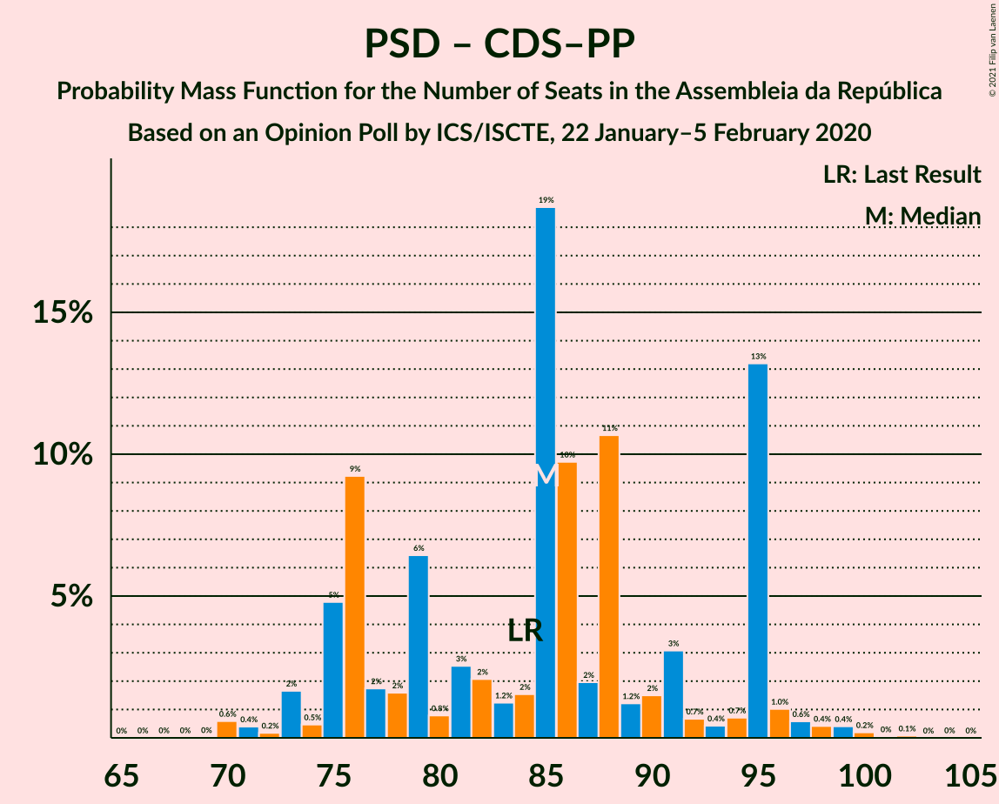

| Number of Seats | Probability | Accumulated | Special Marks |
|:---------------:|:-----------:|:-----------:|:-------------:|
| 69 | 0% | 100% |  |
| 70 | 0.6% | 99.9% |  |
| 71 | 0.4% | 99.4% |  |
| 72 | 0.2% | 99.0% |  |
| 73 | 2% | 98.8% |  |
| 74 | 0.5% | 97% |  |
| 75 | 5% | 97% |  |
| 76 | 9% | 92% |  |
| 77 | 2% | 83% |  |
| 78 | 2% | 81% |  |
| 79 | 6% | 79% |  |
| 80 | 0.8% | 73% |  |
| 81 | 3% | 72% |  |
| 82 | 2% | 70% |  |
| 83 | 1.2% | 67% |  |
| 84 | 2% | 66% | Last Result |
| 85 | 19% | 65% | Median |
| 86 | 10% | 46% |  |
| 87 | 2% | 36% |  |
| 88 | 11% | 34% |  |
| 89 | 1.2% | 24% |  |
| 90 | 2% | 22% |  |
| 91 | 3% | 21% |  |
| 92 | 0.7% | 18% |  |
| 93 | 0.4% | 17% |  |
| 94 | 0.7% | 17% |  |
| 95 | 13% | 16% |  |
| 96 | 1.0% | 3% |  |
| 97 | 0.6% | 2% |  |
| 98 | 0.4% | 1.2% |  |
| 99 | 0.4% | 0.7% |  |
| 100 | 0.2% | 0.3% |  |
| 101 | 0% | 0.1% |  |
| 102 | 0.1% | 0.1% |  |
| 103 | 0% | 0% |  |

## Technical Information

### Opinion Poll

+ **Polling firm:** ICS/ISCTE
+ **Commissioner(s):** —
+ **Fieldwork period:** 22 January–5 February 2020

### Calculations

+ **Sample size:** 800
+ **Simulations done:** 131,072
+ **Error estimate:** 1.57%

