# Opinion Poll by Eurosondagem, 2–6 February 2020

<a href="#voting-intentions">Voting Intentions</a> | <a href="#seats">Seats</a> | <a href="#coalitions">Coalitions</a> | <a href="#technical-information">Technical Information</a>

## Voting Intentions

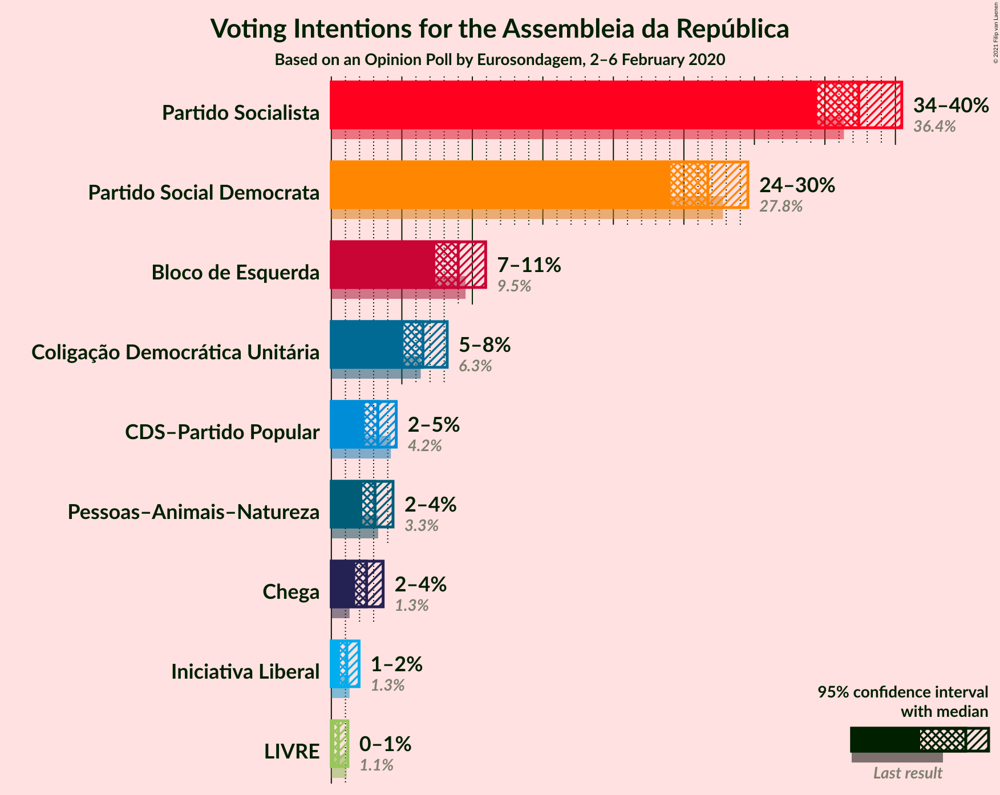

### Confidence Intervals

| Party | Last Result | Poll Result | 80% Confidence Interval | 90% Confidence Interval | 95% Confidence Interval | 99% Confidence Interval |
|:-----:|:-----------:|:-----------:|:-----------------------:|:-----------------------:|:-----------------------:|:-----------------------:|
| Partido Socialista | 36.4% | 37.4% | 35.5–39.4% |34.9–40.0% |34.4–40.5% |33.5–41.4% |
| Partido Social Democrata | 27.8% | 26.7% | 25.0–28.6% |24.5–29.1% |24.1–29.5% |23.2–30.4% |
| Bloco de Esquerda | 9.5% | 9.0% | 7.9–10.3% |7.6–10.6% |7.4–10.9% |6.9–11.6% |
| Coligação Democrática Unitária | 6.3% | 6.5% | 5.6–7.6% |5.3–7.9% |5.1–8.2% |4.7–8.8% |
| CDS–Partido Popular | 4.2% | 3.3% | 2.7–4.1% |2.5–4.4% |2.4–4.6% |2.1–5.0% |
| Pessoas–Animais–Natureza | 3.3% | 3.1% | 2.5–3.9% |2.3–4.2% |2.2–4.4% |1.9–4.8% |
| Chega | 1.3% | 2.5% | 2.0–3.3% |1.8–3.5% |1.7–3.7% |1.5–4.1% |
| Iniciativa Liberal | 1.3% | 1.1% | 0.8–1.7% |0.7–1.8% |0.6–2.0% |0.5–2.3% |
| LIVRE | 1.1% | 0.5% | 0.3–0.9% |0.3–1.1% |0.2–1.2% |0.2–1.4% |

*Note:* The poll result column reflects the actual value used in the calculations. Published results may vary slightly, and in addition be rounded to fewer digits.

## Seats

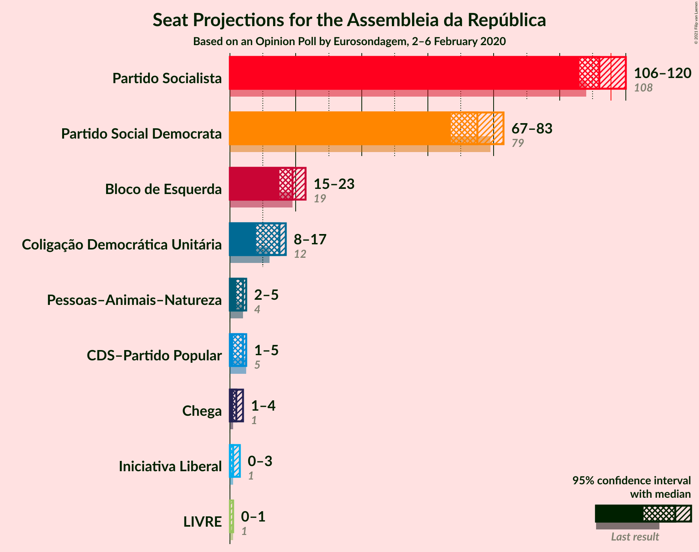

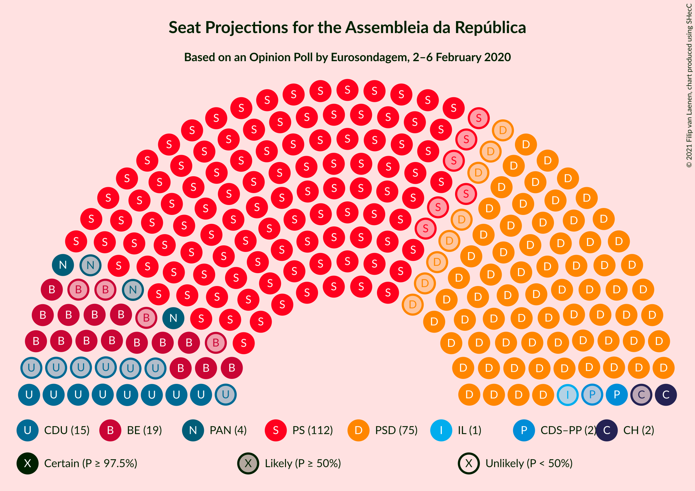

### Confidence Intervals

| Party | Last Result | Median | 80% Confidence Interval | 90% Confidence Interval | 95% Confidence Interval | 99% Confidence Interval |
|:-----:|:-----------:|:------:|:-----------------------:|:-----------------------:|:-----------------------:|:-----------------------:|
| <a href="#partido-socialista">Partido Socialista</a> | 108 | 112 | 107–119 |107–120 |106–120 |102–124 |
| <a href="#partido-social-democrata">Partido Social Democrata</a> | 79 | 75 | 71–80 |69–82 |67–83 |66–86 |
| <a href="#bloco-de-esquerda">Bloco de Esquerda</a> | 19 | 19 | 16–20 |16–23 |15–23 |14–24 |
| <a href="#coligação-democrática-unitária">Coligação Democrática Unitária</a> | 12 | 15 | 10–16 |10–16 |8–17 |7–18 |
| <a href="#cds–partido-popular">CDS–Partido Popular</a> | 5 | 4 | 2–4 |1–5 |1–5 |1–5 |
| <a href="#pessoas–animais–natureza">Pessoas–Animais–Natureza</a> | 4 | 4 | 3–4 |2–5 |2–5 |2–6 |
| <a href="#chega">Chega</a> | 1 | 2 | 1–3 |1–4 |1–4 |1–4 |
| <a href="#iniciativa-liberal">Iniciativa Liberal</a> | 1 | 1 | 1 |0–1 |0–3 |0–3 |
| <a href="#livre">LIVRE</a> | 1 | 0 | 0–1 |0–1 |0–1 |0–1 |

### Partido Socialista

*For a full overview of the results for this party, see the [Partido Socialista](party-partidosocialista.html) page.*

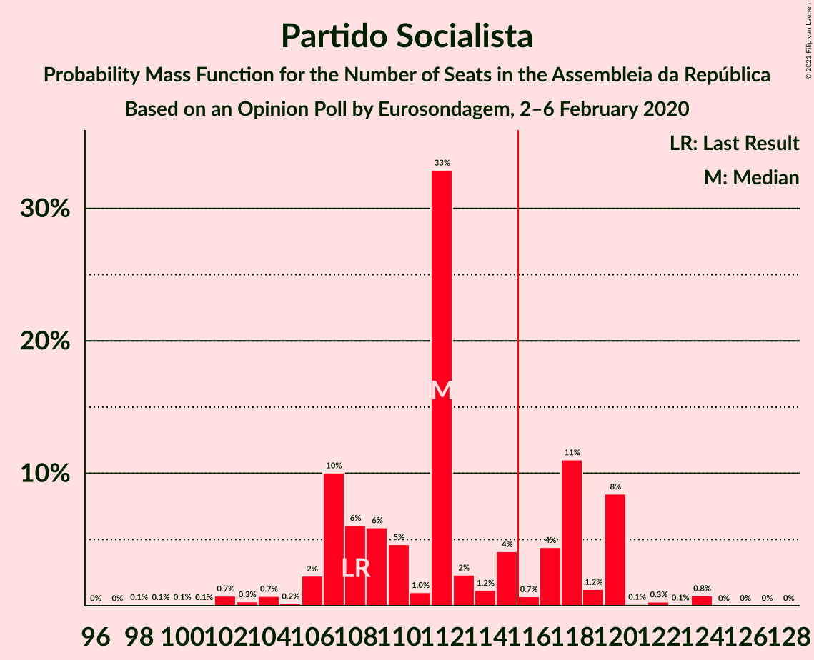

| Number of Seats | Probability | Accumulated | Special Marks |
|:---------------:|:-----------:|:-----------:|:-------------:|
| 96 | 0% | 100% |  |
| 97 | 0% | 99.9% |  |
| 98 | 0.1% | 99.9% |  |
| 99 | 0.1% | 99.8% |  |
| 100 | 0.1% | 99.7% |  |
| 101 | 0.1% | 99.6% |  |
| 102 | 0.7% | 99.5% |  |
| 103 | 0.3% | 98.8% |  |
| 104 | 0.7% | 98% |  |
| 105 | 0.2% | 98% |  |
| 106 | 2% | 98% |  |
| 107 | 10% | 95% |  |
| 108 | 6% | 85% | Last Result |
| 109 | 6% | 79% |  |
| 110 | 5% | 73% |  |
| 111 | 1.0% | 69% |  |
| 112 | 33% | 68% | Median |
| 113 | 2% | 35% |  |
| 114 | 1.2% | 32% |  |
| 115 | 4% | 31% |  |
| 116 | 0.7% | 27% | Majority |
| 117 | 4% | 26% |  |
| 118 | 11% | 22% |  |
| 119 | 1.2% | 11% |  |
| 120 | 8% | 10% |  |
| 121 | 0.1% | 1.3% |  |
| 122 | 0.3% | 1.2% |  |
| 123 | 0.1% | 0.9% |  |
| 124 | 0.8% | 0.9% |  |
| 125 | 0% | 0.1% |  |
| 126 | 0% | 0.1% |  |
| 127 | 0% | 0.1% |  |
| 128 | 0% | 0% |  |

### Partido Social Democrata

*For a full overview of the results for this party, see the [Partido Social Democrata](party-partidosocialdemocrata.html) page.*

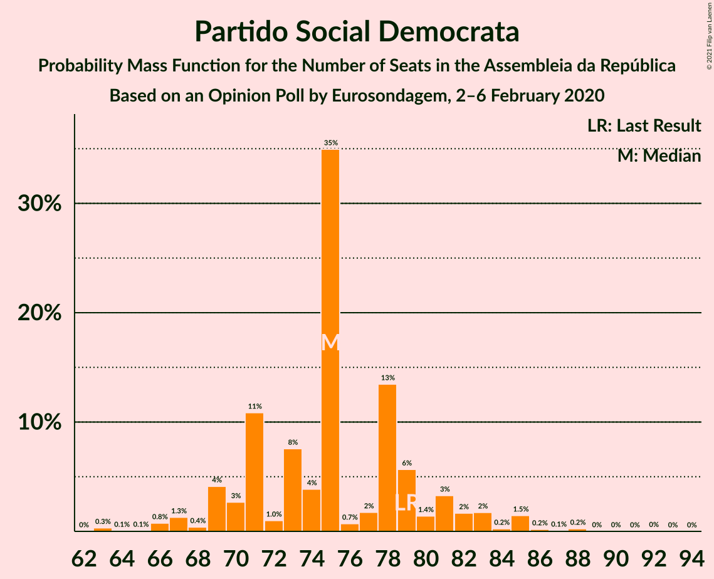

| Number of Seats | Probability | Accumulated | Special Marks |
|:---------------:|:-----------:|:-----------:|:-------------:|
| 63 | 0.3% | 100% |  |
| 64 | 0.1% | 99.6% |  |
| 65 | 0.1% | 99.6% |  |
| 66 | 0.8% | 99.5% |  |
| 67 | 1.3% | 98.8% |  |
| 68 | 0.4% | 97% |  |
| 69 | 4% | 97% |  |
| 70 | 3% | 93% |  |
| 71 | 11% | 90% |  |
| 72 | 1.0% | 79% |  |
| 73 | 8% | 78% |  |
| 74 | 4% | 71% |  |
| 75 | 35% | 67% | Median |
| 76 | 0.7% | 32% |  |
| 77 | 2% | 31% |  |
| 78 | 13% | 30% |  |
| 79 | 6% | 16% | Last Result |
| 80 | 1.4% | 10% |  |
| 81 | 3% | 9% |  |
| 82 | 2% | 6% |  |
| 83 | 2% | 4% |  |
| 84 | 0.2% | 2% |  |
| 85 | 1.5% | 2% |  |
| 86 | 0.2% | 0.6% |  |
| 87 | 0.1% | 0.4% |  |
| 88 | 0.2% | 0.4% |  |
| 89 | 0% | 0.1% |  |
| 90 | 0% | 0.1% |  |
| 91 | 0% | 0.1% |  |
| 92 | 0% | 0.1% |  |
| 93 | 0% | 0% |  |

### Bloco de Esquerda

*For a full overview of the results for this party, see the [Bloco de Esquerda](party-blocodeesquerda.html) page.*

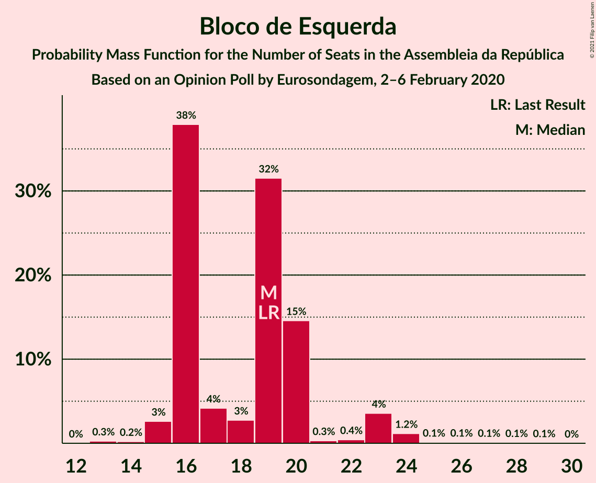

| Number of Seats | Probability | Accumulated | Special Marks |
|:---------------:|:-----------:|:-----------:|:-------------:|
| 12 | 0% | 100% |  |
| 13 | 0.3% | 99.9% |  |
| 14 | 0.2% | 99.7% |  |
| 15 | 3% | 99.5% |  |
| 16 | 38% | 97% |  |
| 17 | 4% | 59% |  |
| 18 | 3% | 55% |  |
| 19 | 32% | 52% | Last Result, Median |
| 20 | 15% | 21% |  |
| 21 | 0.3% | 6% |  |
| 22 | 0.4% | 6% |  |
| 23 | 4% | 5% |  |
| 24 | 1.2% | 2% |  |
| 25 | 0.1% | 0.5% |  |
| 26 | 0.1% | 0.3% |  |
| 27 | 0.1% | 0.2% |  |
| 28 | 0.1% | 0.1% |  |
| 29 | 0.1% | 0.1% |  |
| 30 | 0% | 0% |  |

### Coligação Democrática Unitária

*For a full overview of the results for this party, see the [Coligação Democrática Unitária](party-coligaçãodemocráticaunitária.html) page.*

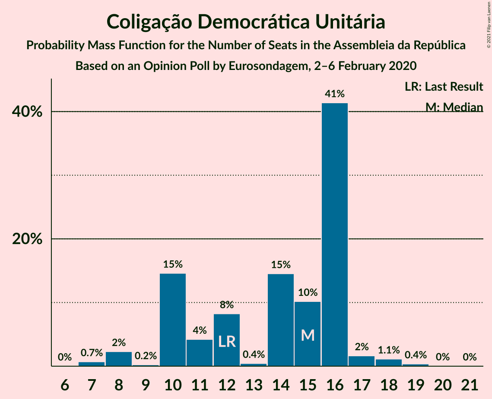

| Number of Seats | Probability | Accumulated | Special Marks |
|:---------------:|:-----------:|:-----------:|:-------------:|
| 7 | 0.7% | 100% |  |
| 8 | 2% | 99.3% |  |
| 9 | 0.2% | 97% |  |
| 10 | 15% | 97% |  |
| 11 | 4% | 82% |  |
| 12 | 8% | 78% | Last Result |
| 13 | 0.4% | 70% |  |
| 14 | 15% | 69% |  |
| 15 | 10% | 55% | Median |
| 16 | 41% | 45% |  |
| 17 | 2% | 3% |  |
| 18 | 1.1% | 2% |  |
| 19 | 0.4% | 0.4% |  |
| 20 | 0% | 0.1% |  |
| 21 | 0% | 0% |  |

### CDS–Partido Popular

*For a full overview of the results for this party, see the [CDS–Partido Popular](party-cds–partidopopular.html) page.*

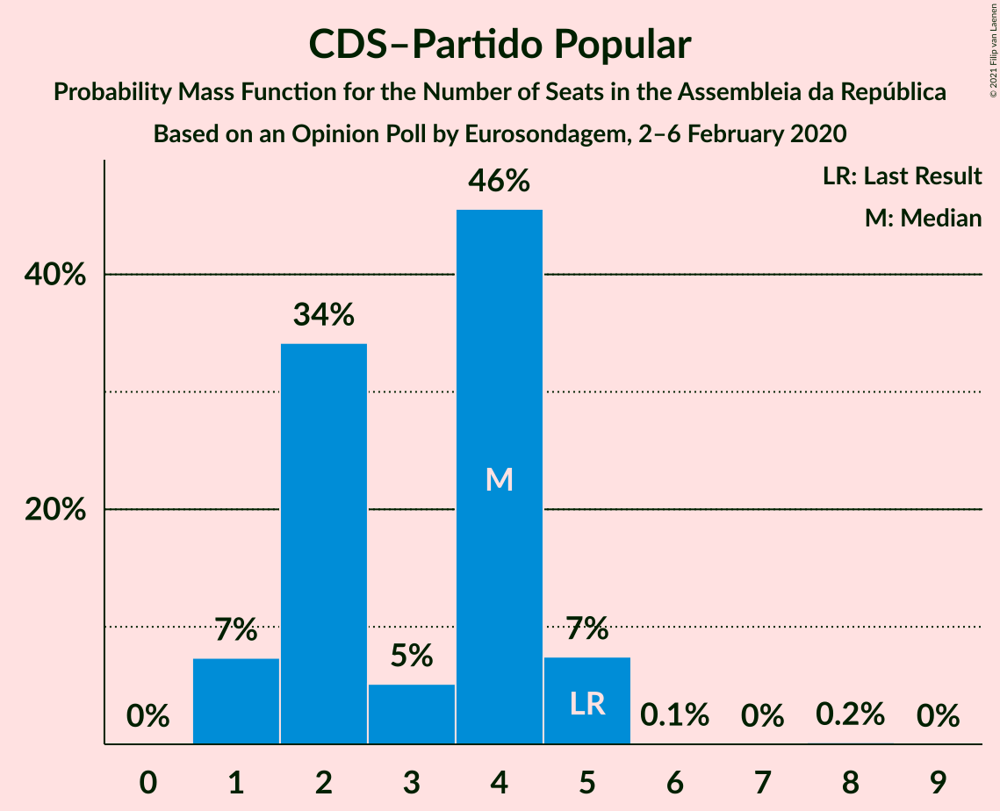

| Number of Seats | Probability | Accumulated | Special Marks |
|:---------------:|:-----------:|:-----------:|:-------------:|
| 1 | 7% | 100% |  |
| 2 | 34% | 93% |  |
| 3 | 5% | 58% |  |
| 4 | 46% | 53% | Median |
| 5 | 7% | 8% | Last Result |
| 6 | 0.1% | 0.3% |  |
| 7 | 0% | 0.2% |  |
| 8 | 0.2% | 0.2% |  |
| 9 | 0% | 0% |  |

### Pessoas–Animais–Natureza

*For a full overview of the results for this party, see the [Pessoas–Animais–Natureza](party-pessoas–animais–natureza.html) page.*

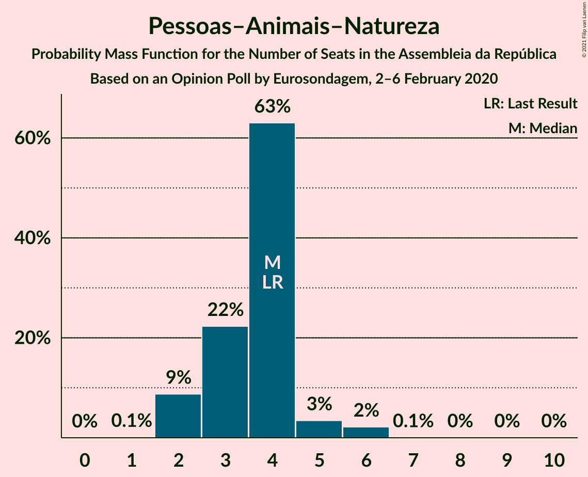

| Number of Seats | Probability | Accumulated | Special Marks |
|:---------------:|:-----------:|:-----------:|:-------------:|
| 1 | 0.1% | 100% |  |
| 2 | 9% | 99.9% |  |
| 3 | 22% | 91% |  |
| 4 | 63% | 69% | Last Result, Median |
| 5 | 3% | 6% |  |
| 6 | 2% | 2% |  |
| 7 | 0.1% | 0.2% |  |
| 8 | 0% | 0.1% |  |
| 9 | 0% | 0.1% |  |
| 10 | 0% | 0% |  |

### Chega

*For a full overview of the results for this party, see the [Chega](party-chega.html) page.*

| Number of Seats | Probability | Accumulated | Special Marks |
|:---------------:|:-----------:|:-----------:|:-------------:|
| 1 | 15% | 100% | Last Result |
| 2 | 48% | 85% | Median |
| 3 | 28% | 37% |  |
| 4 | 9% | 9% |  |
| 5 | 0% | 0% |  |

### Iniciativa Liberal

*For a full overview of the results for this party, see the [Iniciativa Liberal](party-iniciativaliberal.html) page.*

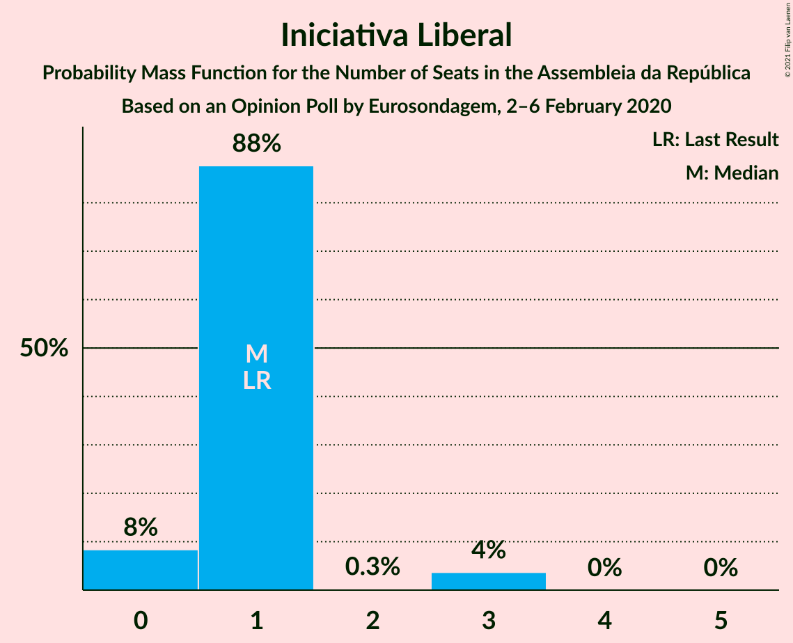

| Number of Seats | Probability | Accumulated | Special Marks |
|:---------------:|:-----------:|:-----------:|:-------------:|
| 0 | 8% | 100% |  |
| 1 | 88% | 92% | Last Result, Median |
| 2 | 0.3% | 4% |  |
| 3 | 4% | 4% |  |
| 4 | 0% | 0% |  |

### LIVRE

*For a full overview of the results for this party, see the [LIVRE](party-livre.html) page.*

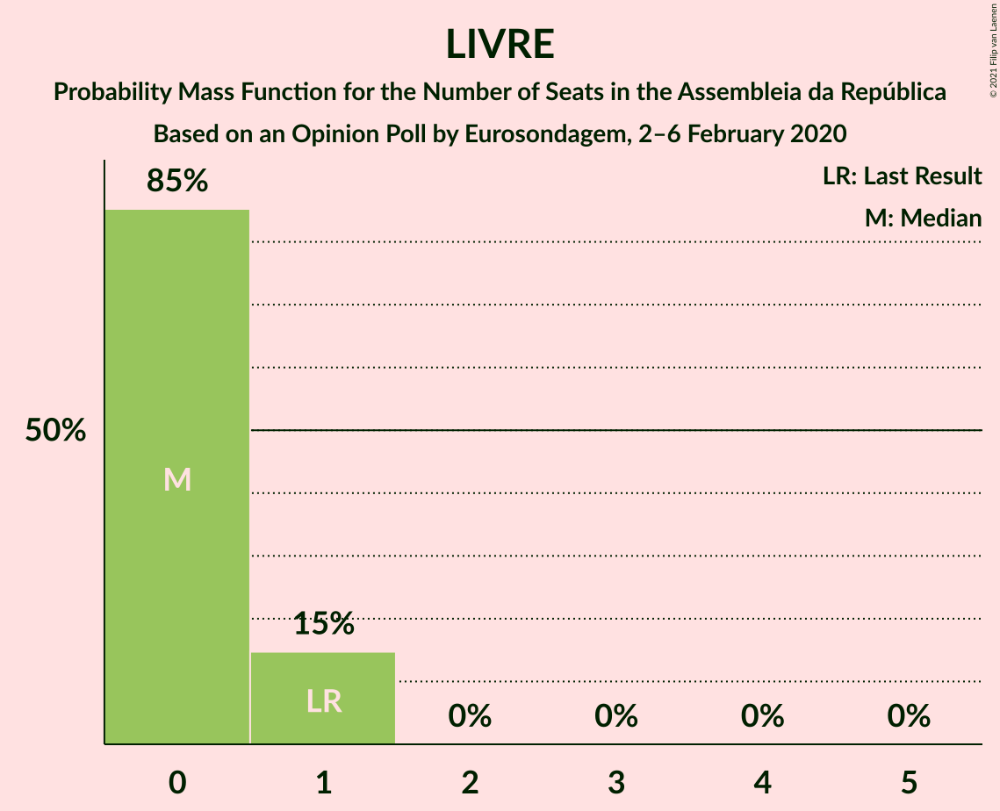

| Number of Seats | Probability | Accumulated | Special Marks |
|:---------------:|:-----------:|:-----------:|:-------------:|
| 0 | 85% | 100% | Median |
| 1 | 15% | 15% | Last Result |
| 2 | 0% | 0% |  |

## Coalitions

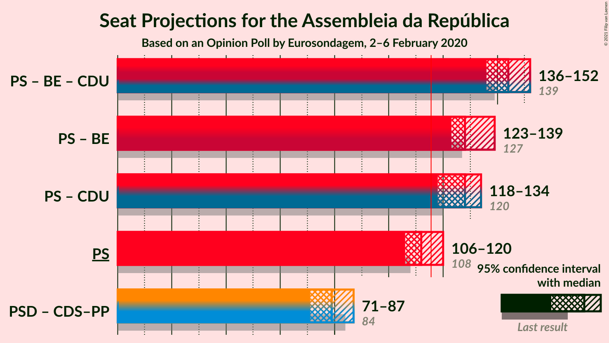

### Confidence Intervals

| Coalition | Last Result | Median | Majority? | 80% Confidence Interval | 90% Confidence Interval | 95% Confidence Interval | 99% Confidence Interval |
|:---------:|:-----------:|:------:|:---------:|:-----------------------:|:-----------------------:|:-----------------------:|:-----------------------:|
| Partido Socialista – Bloco de Esquerda – Coligação Democrática Unitária | 139 | 144 | 100% | 141–150 | 138–151 | 136–152 | 133–156 |
| Partido Socialista – Bloco de Esquerda | 127 | 128 | 99.9% | 127–138 | 125–139 | 123–139 | 121–141 |
| Partido Socialista – Coligação Democrática Unitária | 120 | 128 | 99.1% | 121–132 | 118–134 | 118–134 | 114–140 |
| Partido Socialista | 108 | 112 | 27% | 107–119 | 107–120 | 106–120 | 102–124 |
| Partido Social Democrata – CDS–Partido Popular | 84 | 79 | 0% | 73–83 | 71–85 | 71–87 | 68–90 |

### Partido Socialista – Bloco de Esquerda – Coligação Democrática Unitária

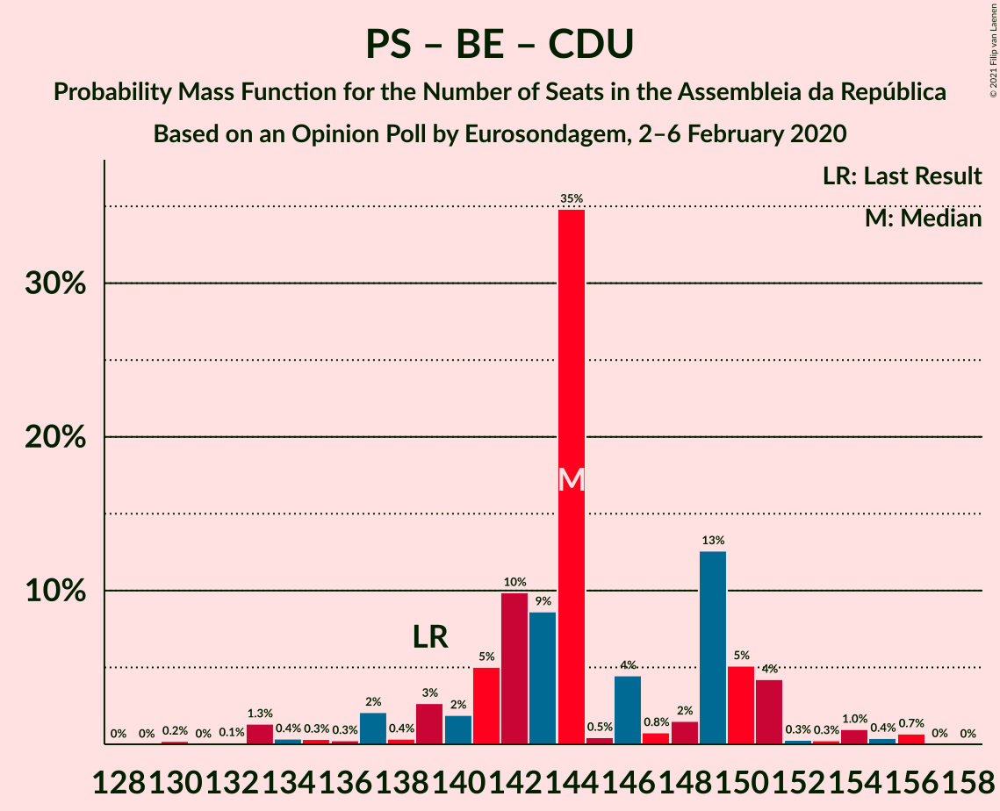

| Number of Seats | Probability | Accumulated | Special Marks |
|:---------------:|:-----------:|:-----------:|:-------------:|
| 128 | 0% | 100% |  |
| 129 | 0% | 99.9% |  |
| 130 | 0.2% | 99.9% |  |
| 131 | 0% | 99.7% |  |
| 132 | 0.1% | 99.7% |  |
| 133 | 1.3% | 99.6% |  |
| 134 | 0.4% | 98% |  |
| 135 | 0.3% | 98% |  |
| 136 | 0.3% | 98% |  |
| 137 | 2% | 97% |  |
| 138 | 0.4% | 95% |  |
| 139 | 3% | 95% | Last Result |
| 140 | 2% | 92% |  |
| 141 | 5% | 90% |  |
| 142 | 10% | 85% |  |
| 143 | 9% | 75% |  |
| 144 | 35% | 67% |  |
| 145 | 0.5% | 32% |  |
| 146 | 4% | 31% | Median |
| 147 | 0.8% | 27% |  |
| 148 | 2% | 26% |  |
| 149 | 13% | 25% |  |
| 150 | 5% | 12% |  |
| 151 | 4% | 7% |  |
| 152 | 0.3% | 3% |  |
| 153 | 0.3% | 2% |  |
| 154 | 1.0% | 2% |  |
| 155 | 0.4% | 1.2% |  |
| 156 | 0.7% | 0.8% |  |
| 157 | 0% | 0.1% |  |
| 158 | 0% | 0% |  |

### Partido Socialista – Bloco de Esquerda

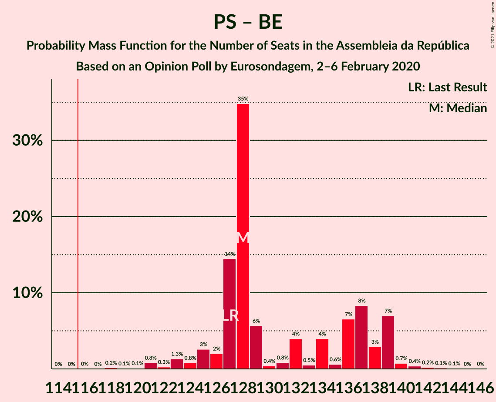

| Number of Seats | Probability | Accumulated | Special Marks |
|:---------------:|:-----------:|:-----------:|:-------------:|
| 115 | 0% | 100% |  |
| 116 | 0% | 99.9% | Majority |
| 117 | 0% | 99.9% |  |
| 118 | 0.2% | 99.9% |  |
| 119 | 0.1% | 99.7% |  |
| 120 | 0.1% | 99.7% |  |
| 121 | 0.8% | 99.5% |  |
| 122 | 0.3% | 98.7% |  |
| 123 | 1.3% | 98% |  |
| 124 | 0.8% | 97% |  |
| 125 | 3% | 96% |  |
| 126 | 2% | 94% |  |
| 127 | 14% | 92% | Last Result |
| 128 | 35% | 77% |  |
| 129 | 6% | 42% |  |
| 130 | 0.4% | 37% |  |
| 131 | 0.8% | 36% | Median |
| 132 | 4% | 35% |  |
| 133 | 0.5% | 32% |  |
| 134 | 4% | 31% |  |
| 135 | 0.6% | 27% |  |
| 136 | 7% | 26% |  |
| 137 | 8% | 20% |  |
| 138 | 3% | 12% |  |
| 139 | 7% | 9% |  |
| 140 | 0.7% | 2% |  |
| 141 | 0.4% | 0.9% |  |
| 142 | 0.2% | 0.5% |  |
| 143 | 0.1% | 0.3% |  |
| 144 | 0.1% | 0.1% |  |
| 145 | 0% | 0.1% |  |
| 146 | 0% | 0% |  |

### Partido Socialista – Coligação Democrática Unitária

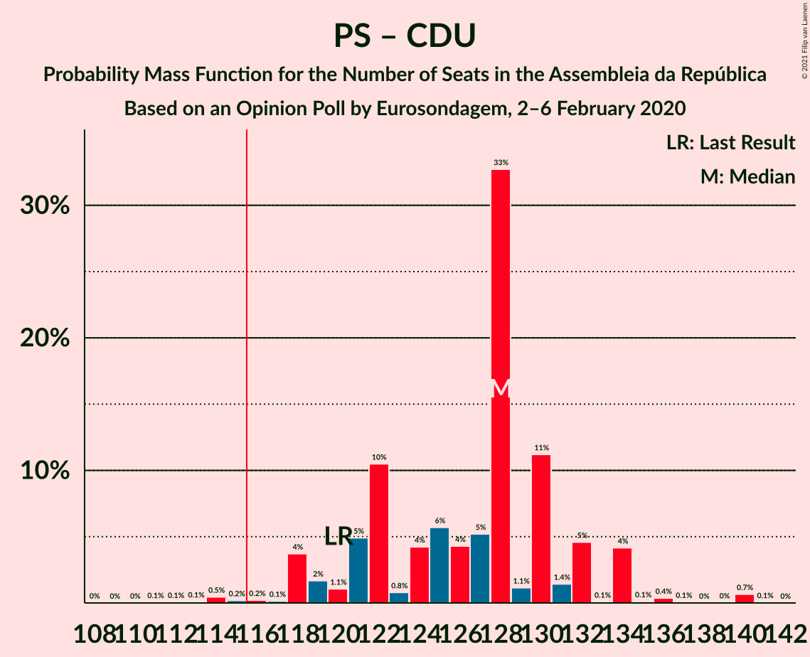

| Number of Seats | Probability | Accumulated | Special Marks |
|:---------------:|:-----------:|:-----------:|:-------------:|
| 109 | 0% | 100% |  |
| 110 | 0% | 99.9% |  |
| 111 | 0.1% | 99.9% |  |
| 112 | 0.1% | 99.9% |  |
| 113 | 0.1% | 99.8% |  |
| 114 | 0.5% | 99.7% |  |
| 115 | 0.2% | 99.3% |  |
| 116 | 0.2% | 99.1% | Majority |
| 117 | 0.1% | 98.9% |  |
| 118 | 4% | 98.7% |  |
| 119 | 2% | 95% |  |
| 120 | 1.1% | 93% | Last Result |
| 121 | 5% | 92% |  |
| 122 | 10% | 87% |  |
| 123 | 0.8% | 77% |  |
| 124 | 4% | 76% |  |
| 125 | 6% | 72% |  |
| 126 | 4% | 66% |  |
| 127 | 5% | 62% | Median |
| 128 | 33% | 57% |  |
| 129 | 1.1% | 24% |  |
| 130 | 11% | 23% |  |
| 131 | 1.4% | 12% |  |
| 132 | 5% | 10% |  |
| 133 | 0.1% | 6% |  |
| 134 | 4% | 5% |  |
| 135 | 0.1% | 1.3% |  |
| 136 | 0.4% | 1.2% |  |
| 137 | 0.1% | 0.8% |  |
| 138 | 0% | 0.7% |  |
| 139 | 0% | 0.7% |  |
| 140 | 0.7% | 0.7% |  |
| 141 | 0.1% | 0.1% |  |
| 142 | 0% | 0% |  |

### Partido Socialista

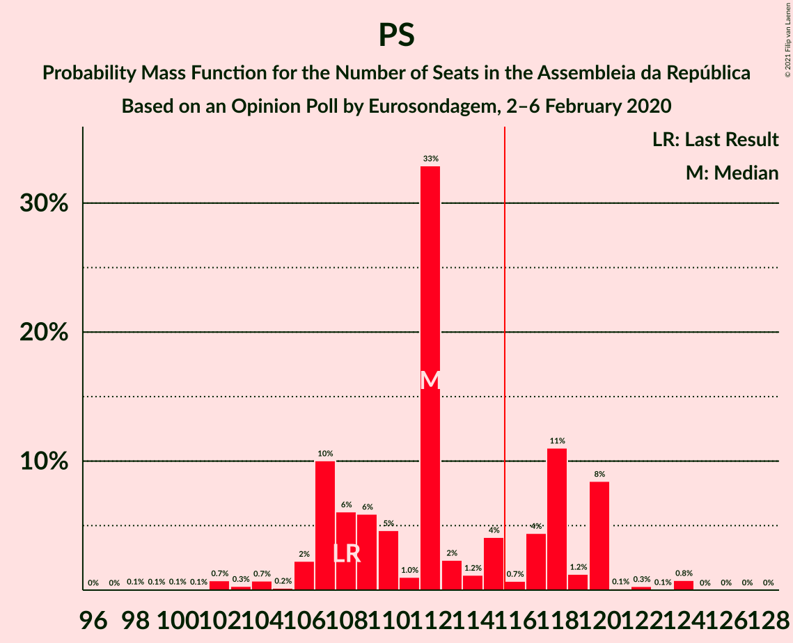

| Number of Seats | Probability | Accumulated | Special Marks |
|:---------------:|:-----------:|:-----------:|:-------------:|
| 96 | 0% | 100% |  |
| 97 | 0% | 99.9% |  |
| 98 | 0.1% | 99.9% |  |
| 99 | 0.1% | 99.8% |  |
| 100 | 0.1% | 99.7% |  |
| 101 | 0.1% | 99.6% |  |
| 102 | 0.7% | 99.5% |  |
| 103 | 0.3% | 98.8% |  |
| 104 | 0.7% | 98% |  |
| 105 | 0.2% | 98% |  |
| 106 | 2% | 98% |  |
| 107 | 10% | 95% |  |
| 108 | 6% | 85% | Last Result |
| 109 | 6% | 79% |  |
| 110 | 5% | 73% |  |
| 111 | 1.0% | 69% |  |
| 112 | 33% | 68% | Median |
| 113 | 2% | 35% |  |
| 114 | 1.2% | 32% |  |
| 115 | 4% | 31% |  |
| 116 | 0.7% | 27% | Majority |
| 117 | 4% | 26% |  |
| 118 | 11% | 22% |  |
| 119 | 1.2% | 11% |  |
| 120 | 8% | 10% |  |
| 121 | 0.1% | 1.3% |  |
| 122 | 0.3% | 1.2% |  |
| 123 | 0.1% | 0.9% |  |
| 124 | 0.8% | 0.9% |  |
| 125 | 0% | 0.1% |  |
| 126 | 0% | 0.1% |  |
| 127 | 0% | 0.1% |  |
| 128 | 0% | 0% |  |

### Partido Social Democrata – CDS–Partido Popular

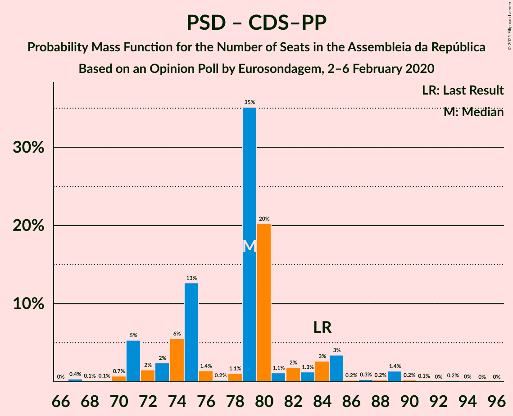

| Number of Seats | Probability | Accumulated | Special Marks |
|:---------------:|:-----------:|:-----------:|:-------------:|
| 66 | 0% | 100% |  |
| 67 | 0.4% | 99.9% |  |
| 68 | 0.1% | 99.6% |  |
| 69 | 0.1% | 99.4% |  |
| 70 | 0.7% | 99.3% |  |
| 71 | 5% | 98.6% |  |
| 72 | 2% | 93% |  |
| 73 | 2% | 92% |  |
| 74 | 6% | 89% |  |
| 75 | 13% | 84% |  |
| 76 | 1.4% | 71% |  |
| 77 | 0.2% | 70% |  |
| 78 | 1.1% | 70% |  |
| 79 | 35% | 68% | Median |
| 80 | 20% | 33% |  |
| 81 | 1.1% | 13% |  |
| 82 | 2% | 12% |  |
| 83 | 1.3% | 10% |  |
| 84 | 3% | 9% | Last Result |
| 85 | 3% | 6% |  |
| 86 | 0.2% | 3% |  |
| 87 | 0.3% | 3% |  |
| 88 | 0.2% | 2% |  |
| 89 | 1.4% | 2% |  |
| 90 | 0.2% | 0.7% |  |
| 91 | 0.1% | 0.4% |  |
| 92 | 0% | 0.3% |  |
| 93 | 0.2% | 0.3% |  |
| 94 | 0% | 0.1% |  |
| 95 | 0% | 0% |  |

## Technical Information

### Opinion Poll

+ **Polling firm:** Eurosondagem
+ **Commissioner(s):** —
+ **Fieldwork period:** 2–6 February 2020

### Calculations

+ **Sample size:** 1000
+ **Simulations done:** 131,072
+ **Error estimate:** 2.77%

