# Opinion Poll by Intercampus for Correio da Manhã and Negócios, 11–17 February 2020

<a href="#voting-intentions">Voting Intentions</a> | <a href="#seats">Seats</a> | <a href="#coalitions">Coalitions</a> | <a href="#technical-information">Technical Information</a>

## Voting Intentions

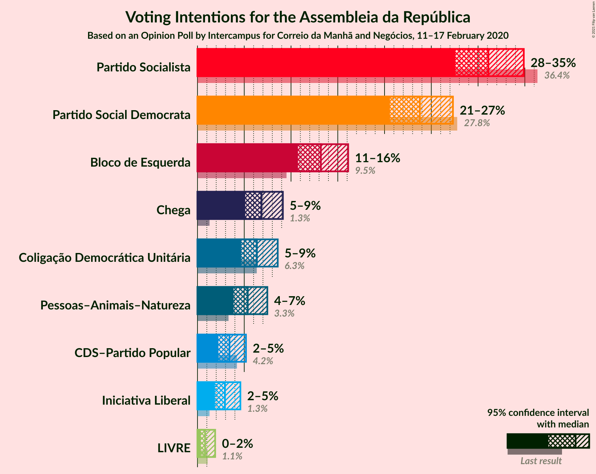

### Confidence Intervals

| Party | Last Result | Poll Result | 80% Confidence Interval | 90% Confidence Interval | 95% Confidence Interval | 99% Confidence Interval |
|:-----:|:-----------:|:-----------:|:-----------------------:|:-----------------------:|:-----------------------:|:-----------------------:|
| Partido Socialista | 36.4% | 31.1% | 28.8–33.6% |28.1–34.3% |27.6–34.9% |26.5–36.1% |
| Partido Social Democrata | 27.8% | 23.8% | 21.7–26.1% |21.1–26.7% |20.6–27.3% |19.6–28.4% |
| Bloco de Esquerda | 9.5% | 13.2% | 11.6–15.1% |11.1–15.6% |10.7–16.1% |10.0–17.1% |
| Chega | 1.3% | 6.8% | 5.7–8.3% |5.4–8.7% |5.1–9.1% |4.6–9.9% |
| Coligação Democrática Unitária | 6.3% | 6.4% | 5.2–7.8% |4.9–8.2% |4.7–8.6% |4.2–9.3% |
| Pessoas–Animais–Natureza | 3.3% | 5.4% | 4.4–6.7% |4.1–7.1% |3.9–7.5% |3.4–8.2% |
| CDS–Partido Popular | 4.2% | 3.4% | 2.6–4.6% |2.4–4.9% |2.2–5.2% |1.9–5.8% |
| Iniciativa Liberal | 1.3% | 2.9% | 2.2–4.0% |2.0–4.3% |1.9–4.6% |1.6–5.2% |
| LIVRE | 1.1% | 0.8% | 0.5–1.5% |0.4–1.7% |0.4–1.9% |0.2–2.3% |

*Note:* The poll result column reflects the actual value used in the calculations. Published results may vary slightly, and in addition be rounded to fewer digits.

## Seats

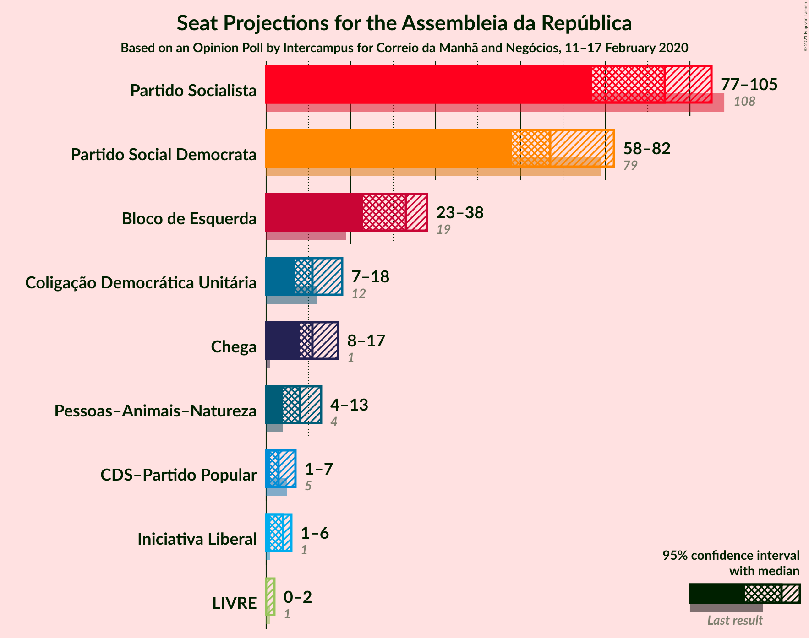

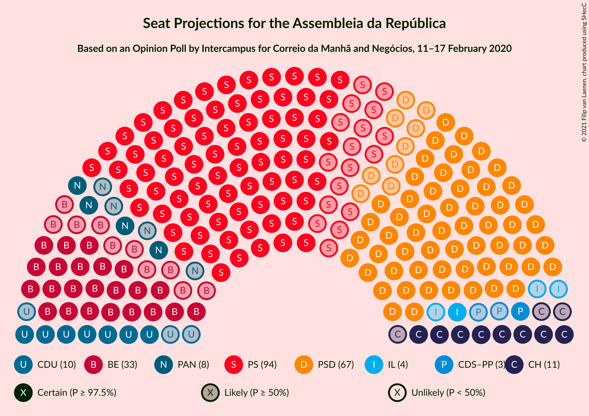

### Confidence Intervals

| Party | Last Result | Median | 80% Confidence Interval | 90% Confidence Interval | 95% Confidence Interval | 99% Confidence Interval |
|:-----:|:-----------:|:------:|:-----------------------:|:-----------------------:|:-----------------------:|:-----------------------:|
| <a href="#partido-socialista">Partido Socialista</a> | 108 | 94 | 78–98 |78–104 |77–105 |74–107 |
| <a href="#partido-social-democrata">Partido Social Democrata</a> | 79 | 67 | 59–82 |58–82 |58–82 |52–84 |
| <a href="#bloco-de-esquerda">Bloco de Esquerda</a> | 19 | 33 | 23–35 |23–37 |23–38 |21–43 |
| <a href="#chega">Chega</a> | 1 | 11 | 9–14 |8–14 |8–17 |4–22 |
| <a href="#coligação-democrática-unitária">Coligação Democrática Unitária</a> | 12 | 11 | 8–15 |7–16 |7–18 |6–20 |
| <a href="#pessoas–animais–natureza">Pessoas–Animais–Natureza</a> | 4 | 8 | 5–11 |4–12 |4–13 |3–15 |
| <a href="#cds–partido-popular">CDS–Partido Popular</a> | 5 | 3 | 1–5 |1–7 |1–7 |1–9 |
| <a href="#iniciativa-liberal">Iniciativa Liberal</a> | 1 | 4 | 3–5 |2–6 |1–6 |1–6 |
| <a href="#livre">LIVRE</a> | 1 | 0 | 0–1 |0–1 |0–2 |0–2 |

### Partido Socialista

*For a full overview of the results for this party, see the [Partido Socialista](party-partidosocialista.html) page.*

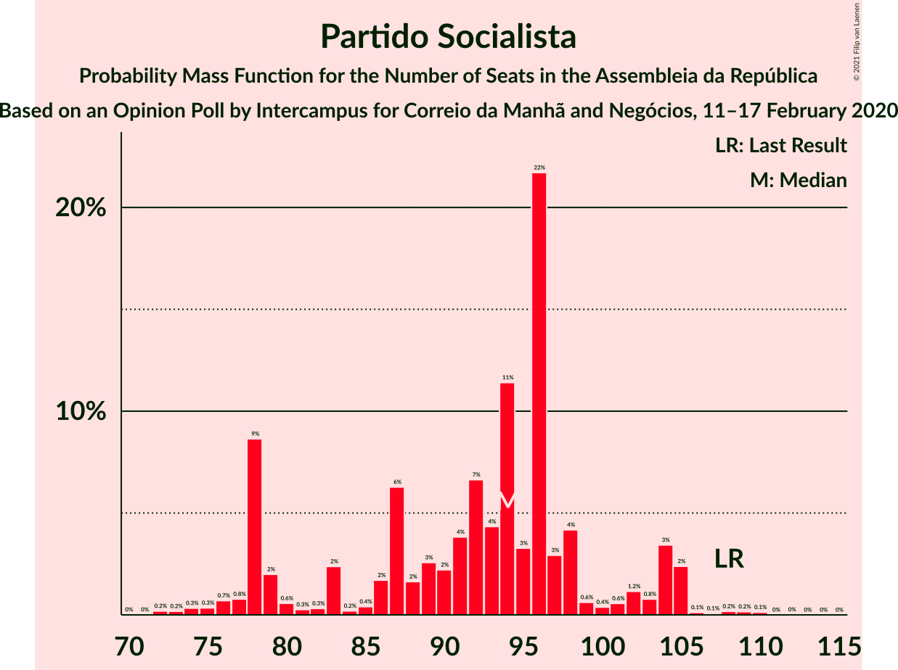

| Number of Seats | Probability | Accumulated | Special Marks |
|:---------------:|:-----------:|:-----------:|:-------------:|
| 72 | 0.2% | 100% |  |
| 73 | 0.2% | 99.8% |  |
| 74 | 0.3% | 99.6% |  |
| 75 | 0.3% | 99.3% |  |
| 76 | 0.7% | 98.9% |  |
| 77 | 0.8% | 98% |  |
| 78 | 9% | 97% |  |
| 79 | 2% | 89% |  |
| 80 | 0.6% | 87% |  |
| 81 | 0.3% | 86% |  |
| 82 | 0.3% | 86% |  |
| 83 | 2% | 86% |  |
| 84 | 0.2% | 83% |  |
| 85 | 0.4% | 83% |  |
| 86 | 2% | 83% |  |
| 87 | 6% | 81% |  |
| 88 | 2% | 75% |  |
| 89 | 3% | 73% |  |
| 90 | 2% | 71% |  |
| 91 | 4% | 68% |  |
| 92 | 7% | 64% |  |
| 93 | 4% | 58% |  |
| 94 | 11% | 53% | Median |
| 95 | 3% | 42% |  |
| 96 | 22% | 39% |  |
| 97 | 3% | 17% |  |
| 98 | 4% | 14% |  |
| 99 | 0.6% | 10% |  |
| 100 | 0.4% | 9% |  |
| 101 | 0.6% | 9% |  |
| 102 | 1.2% | 8% |  |
| 103 | 0.8% | 7% |  |
| 104 | 3% | 7% |  |
| 105 | 2% | 3% |  |
| 106 | 0.1% | 0.7% |  |
| 107 | 0.1% | 0.6% |  |
| 108 | 0.2% | 0.5% | Last Result |
| 109 | 0.2% | 0.3% |  |
| 110 | 0.1% | 0.2% |  |
| 111 | 0% | 0% |  |

### Partido Social Democrata

*For a full overview of the results for this party, see the [Partido Social Democrata](party-partidosocialdemocrata.html) page.*

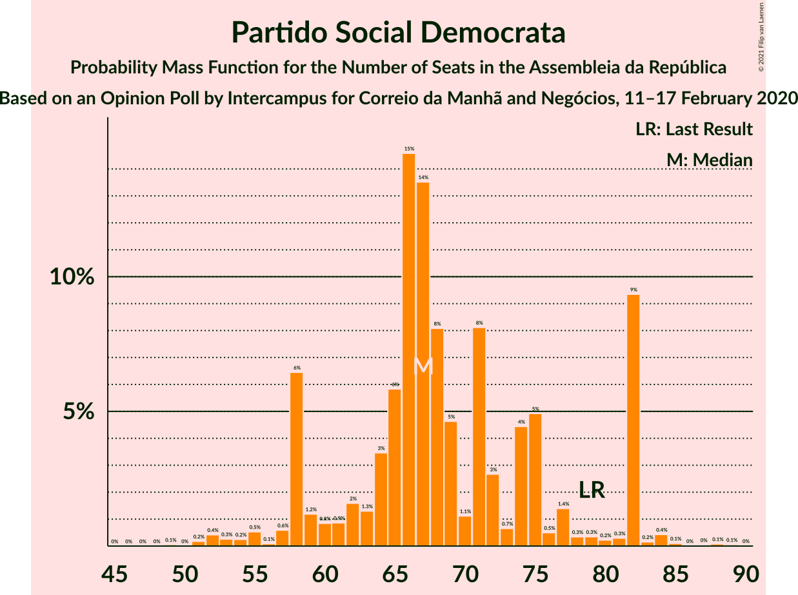

| Number of Seats | Probability | Accumulated | Special Marks |
|:---------------:|:-----------:|:-----------:|:-------------:|
| 49 | 0.1% | 100% |  |
| 50 | 0% | 99.9% |  |
| 51 | 0.2% | 99.9% |  |
| 52 | 0.4% | 99.8% |  |
| 53 | 0.3% | 99.3% |  |
| 54 | 0.2% | 99.1% |  |
| 55 | 0.5% | 98.8% |  |
| 56 | 0.1% | 98% |  |
| 57 | 0.6% | 98% |  |
| 58 | 6% | 98% |  |
| 59 | 1.2% | 91% |  |
| 60 | 0.8% | 90% |  |
| 61 | 0.9% | 89% |  |
| 62 | 2% | 88% |  |
| 63 | 1.3% | 87% |  |
| 64 | 3% | 85% |  |
| 65 | 6% | 82% |  |
| 66 | 15% | 76% |  |
| 67 | 14% | 62% | Median |
| 68 | 8% | 48% |  |
| 69 | 5% | 40% |  |
| 70 | 1.1% | 35% |  |
| 71 | 8% | 34% |  |
| 72 | 3% | 26% |  |
| 73 | 0.7% | 23% |  |
| 74 | 4% | 23% |  |
| 75 | 5% | 18% |  |
| 76 | 0.5% | 13% |  |
| 77 | 1.4% | 13% |  |
| 78 | 0.3% | 11% |  |
| 79 | 0.3% | 11% | Last Result |
| 80 | 0.2% | 11% |  |
| 81 | 0.3% | 11% |  |
| 82 | 9% | 10% |  |
| 83 | 0.2% | 0.9% |  |
| 84 | 0.4% | 0.7% |  |
| 85 | 0.1% | 0.3% |  |
| 86 | 0% | 0.2% |  |
| 87 | 0% | 0.2% |  |
| 88 | 0.1% | 0.2% |  |
| 89 | 0.1% | 0.1% |  |
| 90 | 0% | 0% |  |

### Bloco de Esquerda

*For a full overview of the results for this party, see the [Bloco de Esquerda](party-blocodeesquerda.html) page.*

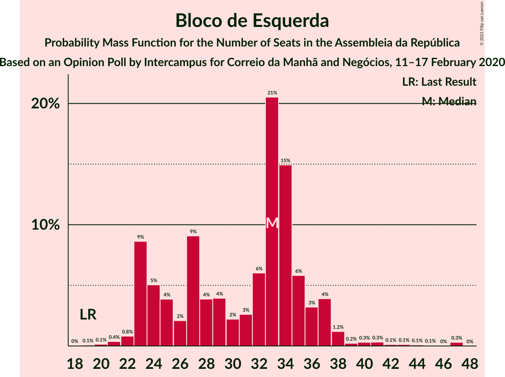

| Number of Seats | Probability | Accumulated | Special Marks |
|:---------------:|:-----------:|:-----------:|:-------------:|
| 19 | 0.1% | 100% | Last Result |
| 20 | 0.1% | 99.9% |  |
| 21 | 0.4% | 99.7% |  |
| 22 | 0.8% | 99.4% |  |
| 23 | 9% | 98.5% |  |
| 24 | 5% | 90% |  |
| 25 | 4% | 85% |  |
| 26 | 2% | 81% |  |
| 27 | 9% | 79% |  |
| 28 | 4% | 70% |  |
| 29 | 4% | 66% |  |
| 30 | 2% | 62% |  |
| 31 | 3% | 60% |  |
| 32 | 6% | 57% |  |
| 33 | 21% | 51% | Median |
| 34 | 15% | 31% |  |
| 35 | 6% | 16% |  |
| 36 | 3% | 10% |  |
| 37 | 4% | 7% |  |
| 38 | 1.2% | 3% |  |
| 39 | 0.2% | 2% |  |
| 40 | 0.3% | 1.4% |  |
| 41 | 0.3% | 1.1% |  |
| 42 | 0.1% | 0.7% |  |
| 43 | 0.1% | 0.6% |  |
| 44 | 0.1% | 0.5% |  |
| 45 | 0.1% | 0.4% |  |
| 46 | 0% | 0.3% |  |
| 47 | 0.3% | 0.3% |  |
| 48 | 0% | 0% |  |

### Chega

*For a full overview of the results for this party, see the [Chega](party-chega.html) page.*

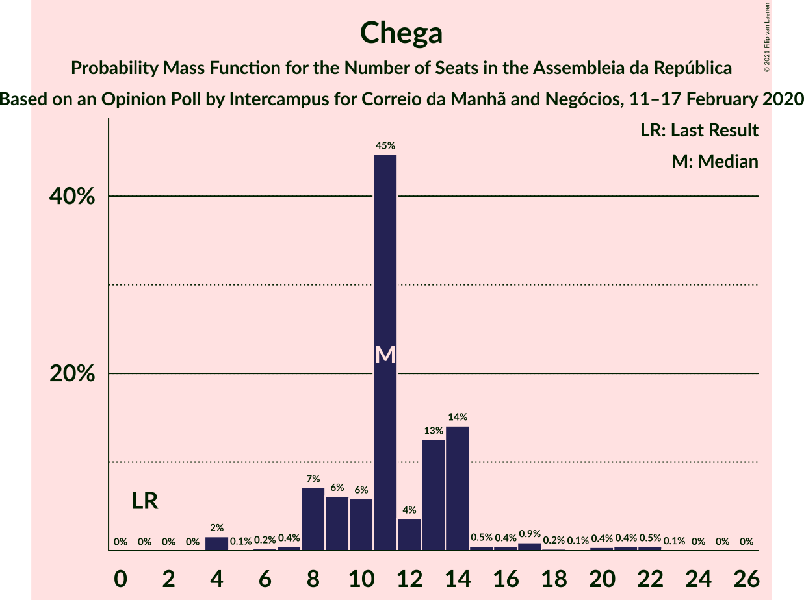

| Number of Seats | Probability | Accumulated | Special Marks |
|:---------------:|:-----------:|:-----------:|:-------------:|
| 1 | 0% | 100% | Last Result |
| 2 | 0% | 100% |  |
| 3 | 0% | 100% |  |
| 4 | 2% | 100% |  |
| 5 | 0.1% | 98% |  |
| 6 | 0.2% | 98% |  |
| 7 | 0.4% | 98% |  |
| 8 | 7% | 98% |  |
| 9 | 6% | 91% |  |
| 10 | 6% | 84% |  |
| 11 | 45% | 79% | Median |
| 12 | 4% | 34% |  |
| 13 | 13% | 30% |  |
| 14 | 14% | 18% |  |
| 15 | 0.5% | 4% |  |
| 16 | 0.4% | 3% |  |
| 17 | 0.9% | 3% |  |
| 18 | 0.2% | 2% |  |
| 19 | 0.1% | 2% |  |
| 20 | 0.4% | 1.5% |  |
| 21 | 0.4% | 1.1% |  |
| 22 | 0.5% | 0.6% |  |
| 23 | 0.1% | 0.2% |  |
| 24 | 0% | 0.1% |  |
| 25 | 0% | 0.1% |  |
| 26 | 0% | 0% |  |

### Coligação Democrática Unitária

*For a full overview of the results for this party, see the [Coligação Democrática Unitária](party-coligaçãodemocráticaunitária.html) page.*

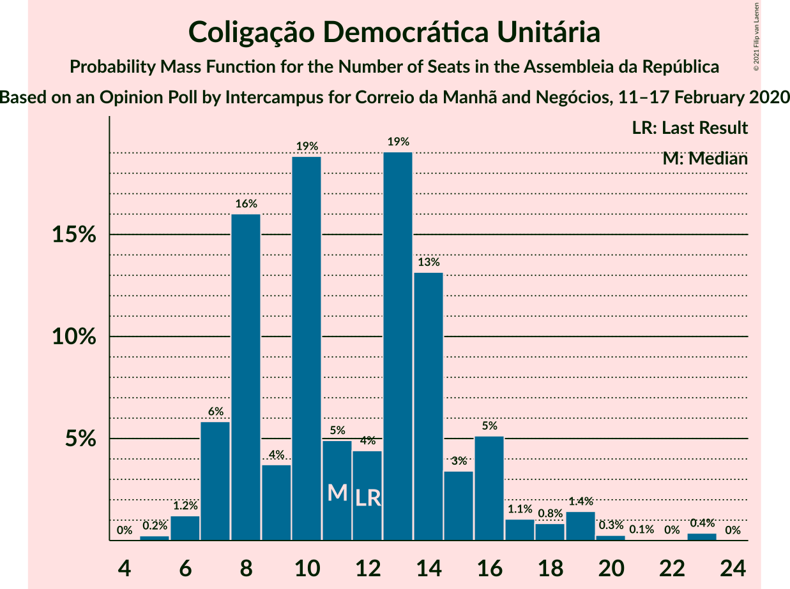

| Number of Seats | Probability | Accumulated | Special Marks |
|:---------------:|:-----------:|:-----------:|:-------------:|
| 5 | 0.2% | 100% |  |
| 6 | 1.2% | 99.7% |  |
| 7 | 6% | 98.5% |  |
| 8 | 16% | 93% |  |
| 9 | 4% | 77% |  |
| 10 | 19% | 73% |  |
| 11 | 5% | 54% | Median |
| 12 | 4% | 49% | Last Result |
| 13 | 19% | 45% |  |
| 14 | 13% | 26% |  |
| 15 | 3% | 13% |  |
| 16 | 5% | 9% |  |
| 17 | 1.1% | 4% |  |
| 18 | 0.8% | 3% |  |
| 19 | 1.4% | 2% |  |
| 20 | 0.3% | 0.7% |  |
| 21 | 0.1% | 0.5% |  |
| 22 | 0% | 0.4% |  |
| 23 | 0.4% | 0.4% |  |
| 24 | 0% | 0% |  |

### Pessoas–Animais–Natureza

*For a full overview of the results for this party, see the [Pessoas–Animais–Natureza](party-pessoas–animais–natureza.html) page.*

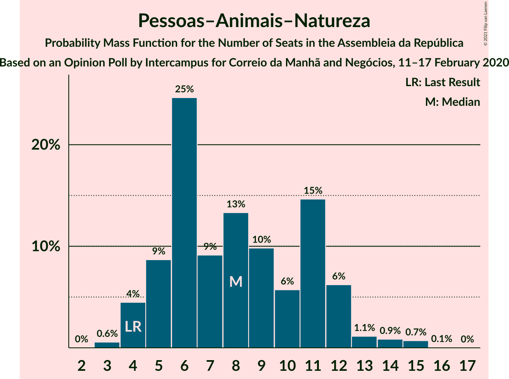

| Number of Seats | Probability | Accumulated | Special Marks |
|:---------------:|:-----------:|:-----------:|:-------------:|
| 3 | 0.6% | 100% |  |
| 4 | 4% | 99.4% | Last Result |
| 5 | 9% | 95% |  |
| 6 | 25% | 86% |  |
| 7 | 9% | 62% |  |
| 8 | 13% | 52% | Median |
| 9 | 10% | 39% |  |
| 10 | 6% | 29% |  |
| 11 | 15% | 24% |  |
| 12 | 6% | 9% |  |
| 13 | 1.1% | 3% |  |
| 14 | 0.9% | 2% |  |
| 15 | 0.7% | 0.8% |  |
| 16 | 0.1% | 0.1% |  |
| 17 | 0% | 0% |  |

### CDS–Partido Popular

*For a full overview of the results for this party, see the [CDS–Partido Popular](party-cds–partidopopular.html) page.*

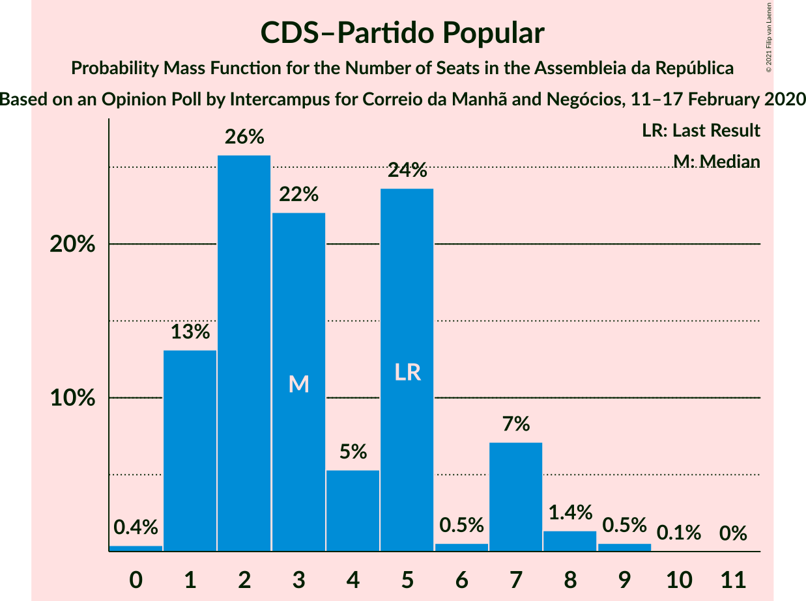

| Number of Seats | Probability | Accumulated | Special Marks |
|:---------------:|:-----------:|:-----------:|:-------------:|
| 0 | 0.4% | 100% |  |
| 1 | 13% | 99.6% |  |
| 2 | 26% | 86% |  |
| 3 | 22% | 61% | Median |
| 4 | 5% | 39% |  |
| 5 | 24% | 33% | Last Result |
| 6 | 0.5% | 10% |  |
| 7 | 7% | 9% |  |
| 8 | 1.4% | 2% |  |
| 9 | 0.5% | 0.6% |  |
| 10 | 0.1% | 0.1% |  |
| 11 | 0% | 0% |  |

### Iniciativa Liberal

*For a full overview of the results for this party, see the [Iniciativa Liberal](party-iniciativaliberal.html) page.*

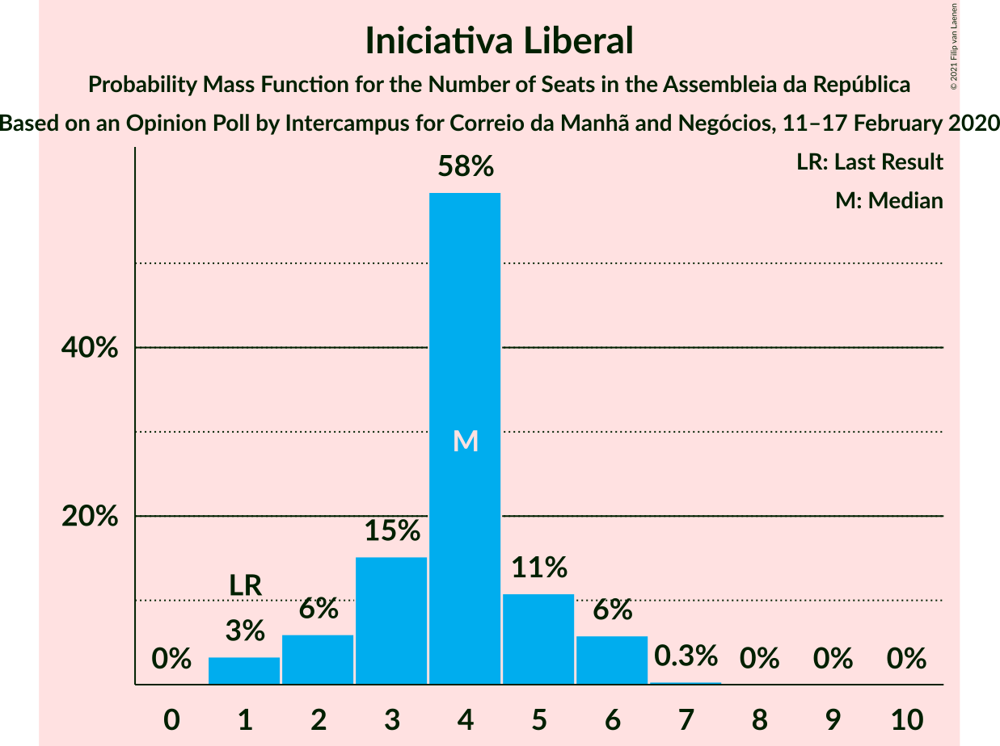

| Number of Seats | Probability | Accumulated | Special Marks |
|:---------------:|:-----------:|:-----------:|:-------------:|
| 1 | 3% | 100% | Last Result |
| 2 | 6% | 97% |  |
| 3 | 15% | 91% |  |
| 4 | 58% | 76% | Median |
| 5 | 11% | 17% |  |
| 6 | 6% | 6% |  |
| 7 | 0.3% | 0.4% |  |
| 8 | 0% | 0.1% |  |
| 9 | 0% | 0.1% |  |
| 10 | 0% | 0% |  |

### LIVRE

*For a full overview of the results for this party, see the [LIVRE](party-livre.html) page.*

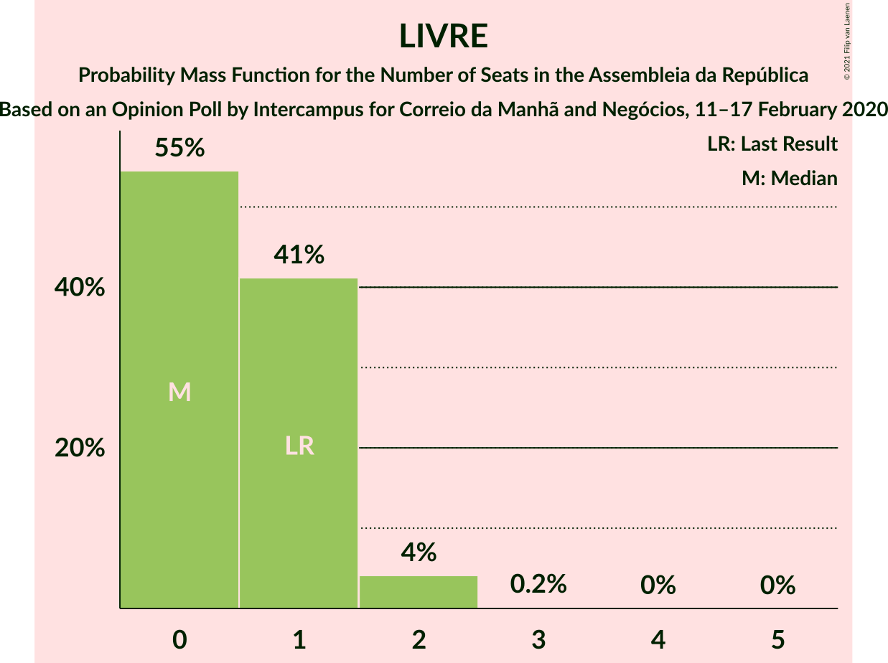

| Number of Seats | Probability | Accumulated | Special Marks |
|:---------------:|:-----------:|:-----------:|:-------------:|
| 0 | 55% | 100% | Median |
| 1 | 41% | 45% | Last Result |
| 2 | 4% | 4% |  |
| 3 | 0.2% | 0.2% |  |
| 4 | 0% | 0% |  |

## Coalitions

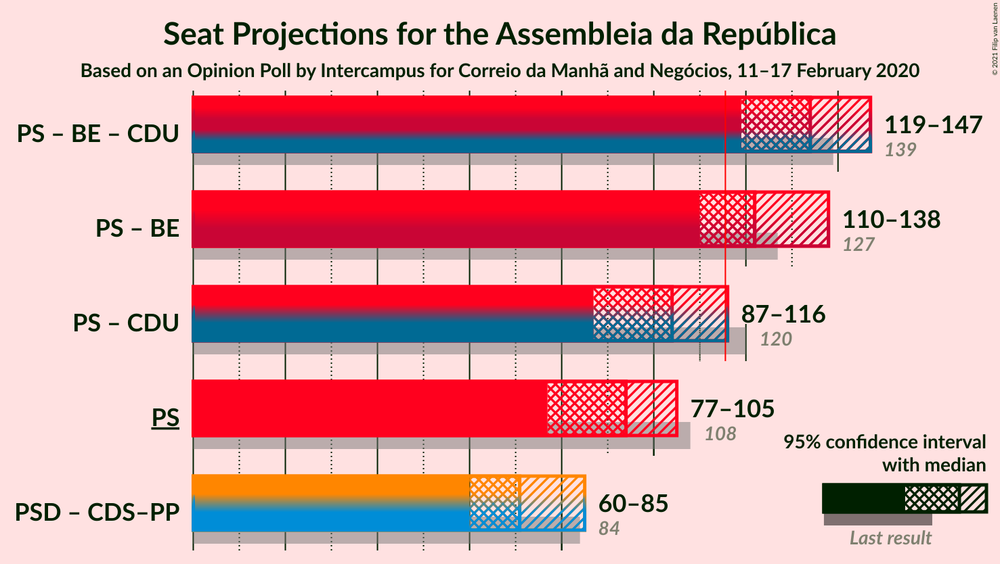

### Confidence Intervals

| Coalition | Last Result | Median | Majority? | 80% Confidence Interval | 90% Confidence Interval | 95% Confidence Interval | 99% Confidence Interval |
|:---------:|:-----------:|:------:|:---------:|:-----------------------:|:-----------------------:|:-----------------------:|:-----------------------:|
| Partido Socialista – Bloco de Esquerda – Coligação Democrática Unitária | 139 | 134 | 99.8% | 122–142 | 122–144 | 119–147 | 118–152 |
| Partido Socialista – Bloco de Esquerda | 127 | 122 | 85% | 112–130 | 111–133 | 110–138 | 104–139 |
| Partido Socialista – Coligação Democrática Unitária | 120 | 104 | 5% | 89–112 | 88–115 | 87–116 | 86–120 |
| Partido Socialista | 108 | 94 | 0% | 78–98 | 78–104 | 77–105 | 74–107 |
| Partido Social Democrata – CDS–Partido Popular | 84 | 71 | 0% | 63–85 | 60–85 | 60–85 | 56–89 |

### Partido Socialista – Bloco de Esquerda – Coligação Democrática Unitária

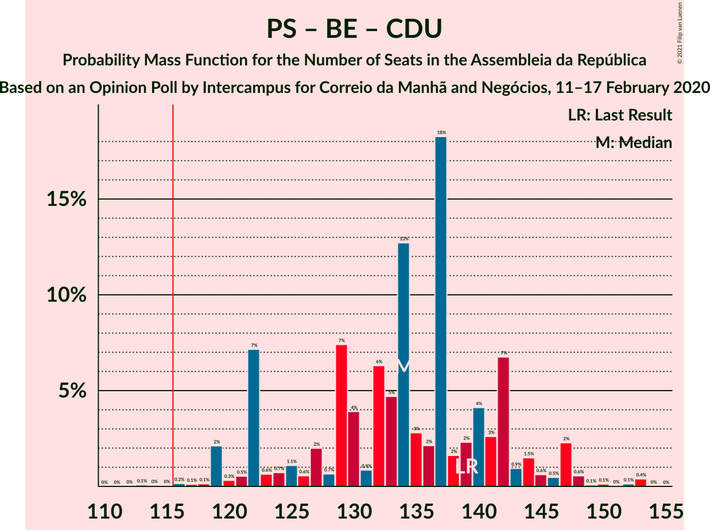

| Number of Seats | Probability | Accumulated | Special Marks |
|:---------------:|:-----------:|:-----------:|:-------------:|
| 113 | 0.1% | 100% |  |
| 114 | 0% | 99.9% |  |
| 115 | 0% | 99.8% |  |
| 116 | 0.2% | 99.8% | Majority |
| 117 | 0.1% | 99.6% |  |
| 118 | 0.1% | 99.5% |  |
| 119 | 2% | 99.4% |  |
| 120 | 0.3% | 97% |  |
| 121 | 0.5% | 97% |  |
| 122 | 7% | 96% |  |
| 123 | 0.6% | 89% |  |
| 124 | 0.7% | 89% |  |
| 125 | 1.1% | 88% |  |
| 126 | 0.6% | 87% |  |
| 127 | 2% | 86% |  |
| 128 | 0.7% | 84% |  |
| 129 | 7% | 84% |  |
| 130 | 4% | 76% |  |
| 131 | 0.9% | 72% |  |
| 132 | 6% | 71% |  |
| 133 | 5% | 65% |  |
| 134 | 13% | 60% |  |
| 135 | 3% | 48% |  |
| 136 | 2% | 45% |  |
| 137 | 18% | 43% |  |
| 138 | 2% | 25% | Median |
| 139 | 2% | 23% | Last Result |
| 140 | 4% | 21% |  |
| 141 | 3% | 17% |  |
| 142 | 7% | 14% |  |
| 143 | 0.9% | 7% |  |
| 144 | 1.5% | 6% |  |
| 145 | 0.6% | 5% |  |
| 146 | 0.5% | 4% |  |
| 147 | 2% | 4% |  |
| 148 | 0.6% | 1.3% |  |
| 149 | 0.1% | 0.8% |  |
| 150 | 0.1% | 0.7% |  |
| 151 | 0% | 0.6% |  |
| 152 | 0.1% | 0.6% |  |
| 153 | 0.4% | 0.4% |  |
| 154 | 0% | 0% |  |

### Partido Socialista – Bloco de Esquerda

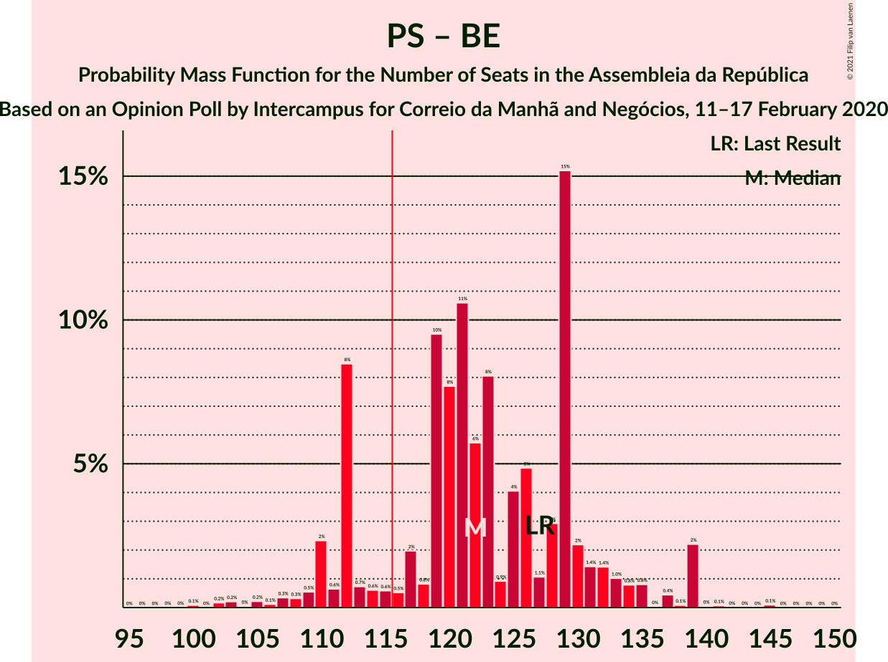

| Number of Seats | Probability | Accumulated | Special Marks |
|:---------------:|:-----------:|:-----------:|:-------------:|
| 100 | 0.1% | 100% |  |
| 101 | 0% | 99.9% |  |
| 102 | 0.2% | 99.9% |  |
| 103 | 0.2% | 99.7% |  |
| 104 | 0% | 99.5% |  |
| 105 | 0.2% | 99.5% |  |
| 106 | 0.1% | 99.3% |  |
| 107 | 0.3% | 99.1% |  |
| 108 | 0.3% | 98.8% |  |
| 109 | 0.5% | 98% |  |
| 110 | 2% | 98% |  |
| 111 | 0.6% | 96% |  |
| 112 | 8% | 95% |  |
| 113 | 0.7% | 86% |  |
| 114 | 0.6% | 86% |  |
| 115 | 0.6% | 85% |  |
| 116 | 0.5% | 85% | Majority |
| 117 | 2% | 84% |  |
| 118 | 0.8% | 82% |  |
| 119 | 10% | 81% |  |
| 120 | 8% | 72% |  |
| 121 | 11% | 64% |  |
| 122 | 6% | 53% |  |
| 123 | 8% | 48% |  |
| 124 | 0.9% | 40% |  |
| 125 | 4% | 39% |  |
| 126 | 5% | 35% |  |
| 127 | 1.1% | 30% | Last Result, Median |
| 128 | 3% | 29% |  |
| 129 | 15% | 26% |  |
| 130 | 2% | 11% |  |
| 131 | 1.4% | 8% |  |
| 132 | 1.4% | 7% |  |
| 133 | 1.0% | 6% |  |
| 134 | 0.8% | 5% |  |
| 135 | 0.8% | 4% |  |
| 136 | 0% | 3% |  |
| 137 | 0.4% | 3% |  |
| 138 | 0.1% | 3% |  |
| 139 | 2% | 2% |  |
| 140 | 0% | 0.2% |  |
| 141 | 0.1% | 0.2% |  |
| 142 | 0% | 0.1% |  |
| 143 | 0% | 0.1% |  |
| 144 | 0% | 0.1% |  |
| 145 | 0.1% | 0.1% |  |
| 146 | 0% | 0% |  |

### Partido Socialista – Coligação Democrática Unitária

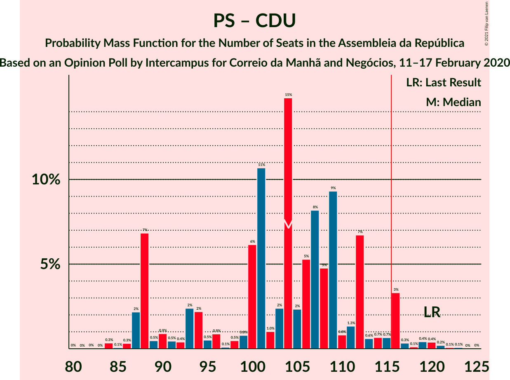

| Number of Seats | Probability | Accumulated | Special Marks |
|:---------------:|:-----------:|:-----------:|:-------------:|
| 82 | 0% | 100% |  |
| 83 | 0% | 99.9% |  |
| 84 | 0.3% | 99.9% |  |
| 85 | 0.1% | 99.6% |  |
| 86 | 0.3% | 99.5% |  |
| 87 | 2% | 99.2% |  |
| 88 | 7% | 97% |  |
| 89 | 0.5% | 90% |  |
| 90 | 0.9% | 90% |  |
| 91 | 0.5% | 89% |  |
| 92 | 0.4% | 88% |  |
| 93 | 2% | 88% |  |
| 94 | 2% | 86% |  |
| 95 | 0.5% | 83% |  |
| 96 | 0.9% | 83% |  |
| 97 | 0.1% | 82% |  |
| 98 | 0.5% | 82% |  |
| 99 | 0.8% | 81% |  |
| 100 | 6% | 81% |  |
| 101 | 11% | 75% |  |
| 102 | 1.0% | 64% |  |
| 103 | 2% | 63% |  |
| 104 | 15% | 60% |  |
| 105 | 2% | 46% | Median |
| 106 | 5% | 43% |  |
| 107 | 8% | 38% |  |
| 108 | 5% | 30% |  |
| 109 | 9% | 25% |  |
| 110 | 0.8% | 16% |  |
| 111 | 1.3% | 15% |  |
| 112 | 7% | 14% |  |
| 113 | 0.6% | 7% |  |
| 114 | 0.7% | 6% |  |
| 115 | 0.7% | 6% |  |
| 116 | 3% | 5% | Majority |
| 117 | 0.3% | 2% |  |
| 118 | 0.1% | 1.3% |  |
| 119 | 0.4% | 1.2% |  |
| 120 | 0.4% | 0.8% | Last Result |
| 121 | 0.2% | 0.4% |  |
| 122 | 0.1% | 0.2% |  |
| 123 | 0.1% | 0.1% |  |
| 124 | 0% | 0% |  |

### Partido Socialista

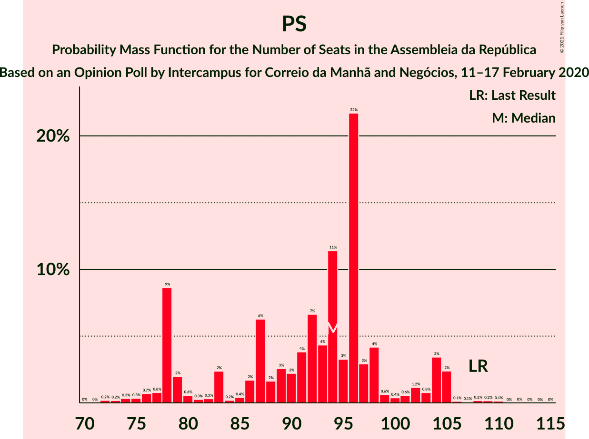

| Number of Seats | Probability | Accumulated | Special Marks |
|:---------------:|:-----------:|:-----------:|:-------------:|
| 72 | 0.2% | 100% |  |
| 73 | 0.2% | 99.8% |  |
| 74 | 0.3% | 99.6% |  |
| 75 | 0.3% | 99.3% |  |
| 76 | 0.7% | 98.9% |  |
| 77 | 0.8% | 98% |  |
| 78 | 9% | 97% |  |
| 79 | 2% | 89% |  |
| 80 | 0.6% | 87% |  |
| 81 | 0.3% | 86% |  |
| 82 | 0.3% | 86% |  |
| 83 | 2% | 86% |  |
| 84 | 0.2% | 83% |  |
| 85 | 0.4% | 83% |  |
| 86 | 2% | 83% |  |
| 87 | 6% | 81% |  |
| 88 | 2% | 75% |  |
| 89 | 3% | 73% |  |
| 90 | 2% | 71% |  |
| 91 | 4% | 68% |  |
| 92 | 7% | 64% |  |
| 93 | 4% | 58% |  |
| 94 | 11% | 53% | Median |
| 95 | 3% | 42% |  |
| 96 | 22% | 39% |  |
| 97 | 3% | 17% |  |
| 98 | 4% | 14% |  |
| 99 | 0.6% | 10% |  |
| 100 | 0.4% | 9% |  |
| 101 | 0.6% | 9% |  |
| 102 | 1.2% | 8% |  |
| 103 | 0.8% | 7% |  |
| 104 | 3% | 7% |  |
| 105 | 2% | 3% |  |
| 106 | 0.1% | 0.7% |  |
| 107 | 0.1% | 0.6% |  |
| 108 | 0.2% | 0.5% | Last Result |
| 109 | 0.2% | 0.3% |  |
| 110 | 0.1% | 0.2% |  |
| 111 | 0% | 0% |  |

### Partido Social Democrata – CDS–Partido Popular

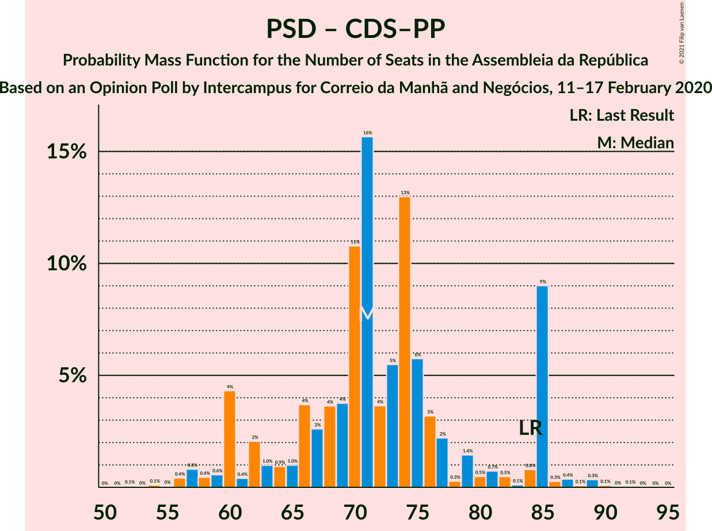

| Number of Seats | Probability | Accumulated | Special Marks |
|:---------------:|:-----------:|:-----------:|:-------------:|
| 52 | 0.1% | 100% |  |
| 53 | 0% | 99.9% |  |
| 54 | 0.1% | 99.9% |  |
| 55 | 0% | 99.8% |  |
| 56 | 0.4% | 99.8% |  |
| 57 | 0.8% | 99.4% |  |
| 58 | 0.4% | 98.6% |  |
| 59 | 0.6% | 98% |  |
| 60 | 4% | 98% |  |
| 61 | 0.4% | 93% |  |
| 62 | 2% | 93% |  |
| 63 | 1.0% | 91% |  |
| 64 | 0.9% | 90% |  |
| 65 | 1.0% | 89% |  |
| 66 | 4% | 88% |  |
| 67 | 3% | 84% |  |
| 68 | 4% | 82% |  |
| 69 | 4% | 78% |  |
| 70 | 11% | 74% | Median |
| 71 | 16% | 63% |  |
| 72 | 4% | 48% |  |
| 73 | 5% | 44% |  |
| 74 | 13% | 39% |  |
| 75 | 6% | 26% |  |
| 76 | 3% | 20% |  |
| 77 | 2% | 17% |  |
| 78 | 0.3% | 15% |  |
| 79 | 1.4% | 14% |  |
| 80 | 0.5% | 13% |  |
| 81 | 0.7% | 12% |  |
| 82 | 0.5% | 12% |  |
| 83 | 0.1% | 11% |  |
| 84 | 0.8% | 11% | Last Result |
| 85 | 9% | 10% |  |
| 86 | 0.3% | 1.2% |  |
| 87 | 0.4% | 0.9% |  |
| 88 | 0.1% | 0.6% |  |
| 89 | 0.3% | 0.5% |  |
| 90 | 0.1% | 0.2% |  |
| 91 | 0% | 0.1% |  |
| 92 | 0.1% | 0.1% |  |
| 93 | 0% | 0% |  |

## Technical Information

### Opinion Poll

+ **Polling firm:** Intercampus
+ **Commissioner(s):** Correio da Manhã and Negócios
+ **Fieldwork period:** 11–17 February 2020

### Calculations

+ **Sample size:** 614
+ **Simulations done:** 131,072
+ **Error estimate:** 1.68%

