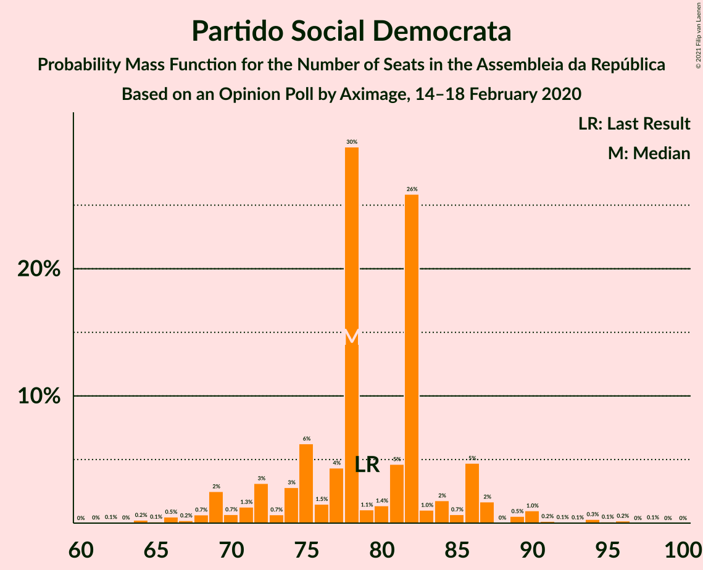

# Opinion Poll by Aximage, 14–18 February 2020

<a href="#voting-intentions">Voting Intentions</a> | <a href="#seats">Seats</a> | <a href="#coalitions">Coalitions</a> | <a href="#technical-information">Technical Information</a>

## Voting Intentions

### Confidence Intervals

| Party | Last Result | Poll Result | 80% Confidence Interval | 90% Confidence Interval | 95% Confidence Interval | 99% Confidence Interval |
|:-----:|:-----------:|:-----------:|:-----------------------:|:-----------------------:|:-----------------------:|:-----------------------:|
| Partido Socialista | 36.4% | 35.0% | 33.0–37.2% |32.4–37.8% |31.9–38.3% |30.9–39.4% |
| Partido Social Democrata | 27.8% | 26.1% | 24.2–28.1% |23.7–28.7% |23.2–29.2% |22.4–30.2% |
| Bloco de Esquerda | 9.5% | 7.7% | 6.7–9.1% |6.4–9.4% |6.1–9.8% |5.6–10.4% |
| Coligação Democrática Unitária | 6.3% | 5.4% | 4.5–6.5% |4.2–6.8% |4.0–7.1% |3.6–7.7% |
| Chega | 1.3% | 4.3% | 3.5–5.3% |3.3–5.6% |3.1–5.9% |2.8–6.4% |
| Pessoas–Animais–Natureza | 3.3% | 4.1% | 3.3–5.1% |3.1–5.4% |2.9–5.6% |2.6–6.1% |
| Iniciativa Liberal | 1.3% | 2.5% | 1.9–3.4% |1.8–3.6% |1.6–3.8% |1.4–4.3% |
| CDS–Partido Popular | 4.2% | 2.1% | 1.6–2.9% |1.5–3.2% |1.4–3.4% |1.1–3.8% |
| LIVRE | 1.1% | 0.7% | 0.5–1.3% |0.4–1.4% |0.3–1.6% |0.2–1.9% |

*Note:* The poll result column reflects the actual value used in the calculations. Published results may vary slightly, and in addition be rounded to fewer digits.

## Seats

### Confidence Intervals

| Party | Last Result | Median | 80% Confidence Interval | 90% Confidence Interval | 95% Confidence Interval | 99% Confidence Interval |
|:-----:|:-----------:|:------:|:-----------------------:|:-----------------------:|:-----------------------:|:-----------------------:|
| <a href="#partido-socialista">Partido Socialista</a> | 108 | 106 | 101–115 |100–117 |98–118 |95–120 |
| <a href="#partido-social-democrata">Partido Social Democrata</a> | 79 | 78 | 73–84 |70–86 |69–88 |65–94 |
| <a href="#bloco-de-esquerda">Bloco de Esquerda</a> | 19 | 17 | 14–19 |12–19 |11–20 |10–21 |
| <a href="#coligação-democrática-unitária">Coligação Democrática Unitária</a> | 12 | 10 | 7–14 |7–14 |6–16 |5–17 |
| <a href="#chega">Chega</a> | 1 | 6 | 4–8 |3–8 |3–9 |2–11 |
| <a href="#pessoas–animais–natureza">Pessoas–Animais–Natureza</a> | 4 | 5 | 4–9 |4–9 |4–10 |2–11 |
| <a href="#iniciativa-liberal">Iniciativa Liberal</a> | 1 | 3 | 3–4 |3–5 |2–5 |1–6 |
| <a href="#cds–partido-popular">CDS–Partido Popular</a> | 5 | 1 | 1–3 |0–4 |0–4 |0–5 |
| <a href="#livre">LIVRE</a> | 1 | 0 | 0–1 |0–1 |0–1 |0–2 |

### Partido Socialista

*For a full overview of the results for this party, see the [Partido Socialista](party-partidosocialista.html) page.*

| Number of Seats | Probability | Accumulated | Special Marks |
|:---------------:|:-----------:|:-----------:|:-------------:|
| 90 | 0.2% | 100% |  |
| 91 | 0% | 99.8% |  |
| 92 | 0% | 99.8% |  |
| 93 | 0.1% | 99.8% |  |
| 94 | 0.1% | 99.7% |  |
| 95 | 0.4% | 99.6% |  |
| 96 | 0.5% | 99.2% |  |
| 97 | 0.5% | 98.6% |  |
| 98 | 1.1% | 98% |  |
| 99 | 0.2% | 97% |  |
| 100 | 5% | 97% |  |
| 101 | 3% | 92% |  |
| 102 | 5% | 89% |  |
| 103 | 3% | 84% |  |
| 104 | 18% | 80% |  |
| 105 | 12% | 63% |  |
| 106 | 5% | 51% | Median |
| 107 | 24% | 46% |  |
| 108 | 0.8% | 22% | Last Result |
| 109 | 0.7% | 22% |  |
| 110 | 2% | 21% |  |
| 111 | 1.3% | 19% |  |
| 112 | 2% | 18% |  |
| 113 | 2% | 15% |  |
| 114 | 0.4% | 14% |  |
| 115 | 4% | 13% |  |
| 116 | 3% | 10% | Majority |
| 117 | 4% | 6% |  |
| 118 | 0.7% | 3% |  |
| 119 | 0.1% | 2% |  |
| 120 | 1.2% | 2% |  |
| 121 | 0.1% | 0.5% |  |
| 122 | 0.1% | 0.3% |  |
| 123 | 0.1% | 0.3% |  |
| 124 | 0.1% | 0.1% |  |
| 125 | 0% | 0.1% |  |
| 126 | 0% | 0% |  |

### Partido Social Democrata

*For a full overview of the results for this party, see the [Partido Social Democrata](party-partidosocialdemocrata.html) page.*

| Number of Seats | Probability | Accumulated | Special Marks |
|:---------------:|:-----------:|:-----------:|:-------------:|
| 61 | 0% | 100% |  |
| 62 | 0.1% | 99.9% |  |
| 63 | 0% | 99.8% |  |
| 64 | 0.2% | 99.8% |  |
| 65 | 0.1% | 99.6% |  |
| 66 | 0.5% | 99.5% |  |
| 67 | 0.2% | 99.0% |  |
| 68 | 0.7% | 98.7% |  |
| 69 | 2% | 98% |  |
| 70 | 0.7% | 96% |  |
| 71 | 1.3% | 95% |  |
| 72 | 3% | 94% |  |
| 73 | 0.7% | 91% |  |
| 74 | 3% | 90% |  |
| 75 | 6% | 87% |  |
| 76 | 1.5% | 81% |  |
| 77 | 4% | 79% |  |
| 78 | 30% | 75% | Median |
| 79 | 1.1% | 45% | Last Result |
| 80 | 1.4% | 44% |  |
| 81 | 5% | 43% |  |
| 82 | 26% | 38% |  |
| 83 | 1.0% | 12% |  |
| 84 | 2% | 11% |  |
| 85 | 0.7% | 10% |  |
| 86 | 5% | 9% |  |
| 87 | 2% | 4% |  |
| 88 | 0% | 3% |  |
| 89 | 0.5% | 2% |  |
| 90 | 1.0% | 2% |  |
| 91 | 0.2% | 1.0% |  |
| 92 | 0.1% | 0.8% |  |
| 93 | 0.1% | 0.7% |  |
| 94 | 0.3% | 0.7% |  |
| 95 | 0.1% | 0.4% |  |
| 96 | 0.2% | 0.2% |  |
| 97 | 0% | 0.1% |  |
| 98 | 0.1% | 0.1% |  |
| 99 | 0% | 0% |  |

### Bloco de Esquerda

*For a full overview of the results for this party, see the [Bloco de Esquerda](party-blocodeesquerda.html) page.*

| Number of Seats | Probability | Accumulated | Special Marks |
|:---------------:|:-----------:|:-----------:|:-------------:|
| 7 | 0.1% | 100% |  |
| 8 | 0.1% | 99.9% |  |
| 9 | 0.1% | 99.8% |  |
| 10 | 0.3% | 99.7% |  |
| 11 | 3% | 99.4% |  |
| 12 | 3% | 96% |  |
| 13 | 0.2% | 94% |  |
| 14 | 24% | 94% |  |
| 15 | 9% | 69% |  |
| 16 | 7% | 61% |  |
| 17 | 9% | 54% | Median |
| 18 | 5% | 45% |  |
| 19 | 35% | 40% | Last Result |
| 20 | 4% | 5% |  |
| 21 | 1.0% | 1.4% |  |
| 22 | 0.1% | 0.4% |  |
| 23 | 0.2% | 0.3% |  |
| 24 | 0% | 0.1% |  |
| 25 | 0% | 0% |  |

### Coligação Democrática Unitária

*For a full overview of the results for this party, see the [Coligação Democrática Unitária](party-coligaçãodemocráticaunitária.html) page.*

| Number of Seats | Probability | Accumulated | Special Marks |
|:---------------:|:-----------:|:-----------:|:-------------:|
| 5 | 1.2% | 100% |  |
| 6 | 3% | 98.8% |  |
| 7 | 9% | 95% |  |
| 8 | 6% | 86% |  |
| 9 | 27% | 80% |  |
| 10 | 4% | 52% | Median |
| 11 | 1.4% | 49% |  |
| 12 | 7% | 47% | Last Result |
| 13 | 3% | 40% |  |
| 14 | 32% | 37% |  |
| 15 | 0.7% | 5% |  |
| 16 | 3% | 4% |  |
| 17 | 0.5% | 0.6% |  |
| 18 | 0.1% | 0.2% |  |
| 19 | 0% | 0% |  |

### Chega

*For a full overview of the results for this party, see the [Chega](party-chega.html) page.*

| Number of Seats | Probability | Accumulated | Special Marks |
|:---------------:|:-----------:|:-----------:|:-------------:|
| 1 | 0% | 100% | Last Result |
| 2 | 0.8% | 100% |  |
| 3 | 5% | 99.1% |  |
| 4 | 38% | 94% |  |
| 5 | 4% | 56% |  |
| 6 | 28% | 52% | Median |
| 7 | 3% | 24% |  |
| 8 | 17% | 21% |  |
| 9 | 2% | 4% |  |
| 10 | 0.3% | 2% |  |
| 11 | 2% | 2% |  |
| 12 | 0% | 0.1% |  |
| 13 | 0% | 0% |  |

### Pessoas–Animais–Natureza

*For a full overview of the results for this party, see the [Pessoas–Animais–Natureza](party-pessoas–animais–natureza.html) page.*

| Number of Seats | Probability | Accumulated | Special Marks |
|:---------------:|:-----------:|:-----------:|:-------------:|
| 2 | 2% | 100% |  |
| 3 | 0.9% | 98% |  |
| 4 | 30% | 98% | Last Result |
| 5 | 20% | 67% | Median |
| 6 | 11% | 47% |  |
| 7 | 0.7% | 36% |  |
| 8 | 2% | 35% |  |
| 9 | 30% | 33% |  |
| 10 | 2% | 3% |  |
| 11 | 0.8% | 1.3% |  |
| 12 | 0.4% | 0.4% |  |
| 13 | 0% | 0.1% |  |
| 14 | 0% | 0% |  |

### Iniciativa Liberal

*For a full overview of the results for this party, see the [Iniciativa Liberal](party-iniciativaliberal.html) page.*

| Number of Seats | Probability | Accumulated | Special Marks |
|:---------------:|:-----------:|:-----------:|:-------------:|
| 1 | 1.3% | 100% | Last Result |
| 2 | 2% | 98.7% |  |
| 3 | 77% | 97% | Median |
| 4 | 11% | 19% |  |
| 5 | 6% | 8% |  |
| 6 | 2% | 2% |  |
| 7 | 0% | 0% |  |

### CDS–Partido Popular

*For a full overview of the results for this party, see the [CDS–Partido Popular](party-cds–partidopopular.html) page.*

| Number of Seats | Probability | Accumulated | Special Marks |
|:---------------:|:-----------:|:-----------:|:-------------:|
| 0 | 5% | 100% |  |
| 1 | 71% | 95% | Median |
| 2 | 13% | 24% |  |
| 3 | 5% | 11% |  |
| 4 | 6% | 7% |  |
| 5 | 0.9% | 0.9% | Last Result |
| 6 | 0% | 0% |  |

### LIVRE

*For a full overview of the results for this party, see the [LIVRE](party-livre.html) page.*

| Number of Seats | Probability | Accumulated | Special Marks |
|:---------------:|:-----------:|:-----------:|:-------------:|
| 0 | 58% | 100% | Median |
| 1 | 41% | 42% | Last Result |
| 2 | 1.0% | 1.0% |  |
| 3 | 0% | 0% |  |

## Coalitions

### Confidence Intervals

| Coalition | Last Result | Median | Majority? | 80% Confidence Interval | 90% Confidence Interval | 95% Confidence Interval | 99% Confidence Interval |
|:---------:|:-----------:|:------:|:---------:|:-----------------------:|:-----------------------:|:-----------------------:|:-----------------------:|
| Partido Socialista – Bloco de Esquerda – Coligação Democrática Unitária | 139 | 135 | 99.9% | 129–140 | 125–143 | 123–145 | 117–150 |
| Partido Socialista – Bloco de Esquerda | 127 | 123 | 97% | 118–132 | 117–135 | 113–136 | 110–140 |
| Partido Socialista – Coligação Democrática Unitária | 120 | 118 | 80% | 112–125 | 108–128 | 107–128 | 102–133 |
| Partido Socialista | 108 | 106 | 10% | 101–115 | 100–117 | 98–118 | 95–120 |
| Partido Social Democrata – CDS–Partido Popular | 84 | 80 | 0% | 75–86 | 72–90 | 70–90 | 67–95 |

### Partido Socialista – Bloco de Esquerda – Coligação Democrática Unitária

| Number of Seats | Probability | Accumulated | Special Marks |
|:---------------:|:-----------:|:-----------:|:-------------:|
| 115 | 0.1% | 100% |  |
| 116 | 0.1% | 99.9% | Majority |
| 117 | 0.4% | 99.8% |  |
| 118 | 0% | 99.4% |  |
| 119 | 0.3% | 99.3% |  |
| 120 | 0.2% | 99.1% |  |
| 121 | 0.3% | 98.9% |  |
| 122 | 0.1% | 98.6% |  |
| 123 | 1.3% | 98% |  |
| 124 | 1.3% | 97% |  |
| 125 | 4% | 96% |  |
| 126 | 1.0% | 92% |  |
| 127 | 0.3% | 91% |  |
| 128 | 0.2% | 91% |  |
| 129 | 3% | 91% |  |
| 130 | 29% | 87% |  |
| 131 | 0.8% | 58% |  |
| 132 | 0.4% | 57% |  |
| 133 | 1.2% | 57% | Median |
| 134 | 1.1% | 56% |  |
| 135 | 7% | 55% |  |
| 136 | 3% | 48% |  |
| 137 | 16% | 45% |  |
| 138 | 12% | 30% |  |
| 139 | 6% | 18% | Last Result |
| 140 | 2% | 11% |  |
| 141 | 0.7% | 9% |  |
| 142 | 0.7% | 8% |  |
| 143 | 3% | 7% |  |
| 144 | 0.8% | 4% |  |
| 145 | 2% | 3% |  |
| 146 | 0.2% | 2% |  |
| 147 | 0% | 1.4% |  |
| 148 | 0.2% | 1.4% |  |
| 149 | 0.6% | 1.1% |  |
| 150 | 0.1% | 0.6% |  |
| 151 | 0.1% | 0.5% |  |
| 152 | 0% | 0.3% |  |
| 153 | 0.2% | 0.3% |  |
| 154 | 0% | 0% |  |

### Partido Socialista – Bloco de Esquerda

| Number of Seats | Probability | Accumulated | Special Marks |
|:---------------:|:-----------:|:-----------:|:-------------:|
| 107 | 0.1% | 100% |  |
| 108 | 0.2% | 99.9% |  |
| 109 | 0.2% | 99.7% |  |
| 110 | 0.3% | 99.5% |  |
| 111 | 0.4% | 99.3% |  |
| 112 | 0.4% | 98.8% |  |
| 113 | 0.9% | 98% |  |
| 114 | 0.2% | 97% |  |
| 115 | 0.5% | 97% |  |
| 116 | 0.3% | 97% | Majority |
| 117 | 5% | 96% |  |
| 118 | 4% | 91% |  |
| 119 | 3% | 87% |  |
| 120 | 1.3% | 84% |  |
| 121 | 31% | 83% |  |
| 122 | 0.8% | 52% |  |
| 123 | 17% | 51% | Median |
| 124 | 12% | 34% |  |
| 125 | 0.3% | 22% |  |
| 126 | 1.4% | 21% |  |
| 127 | 6% | 20% | Last Result |
| 128 | 0.7% | 14% |  |
| 129 | 2% | 14% |  |
| 130 | 0.6% | 12% |  |
| 131 | 0.9% | 11% |  |
| 132 | 3% | 10% |  |
| 133 | 1.1% | 7% |  |
| 134 | 0.8% | 6% |  |
| 135 | 0.8% | 5% |  |
| 136 | 3% | 4% |  |
| 137 | 0.1% | 2% |  |
| 138 | 0.2% | 2% |  |
| 139 | 0.8% | 1.3% |  |
| 140 | 0.2% | 0.5% |  |
| 141 | 0.2% | 0.3% |  |
| 142 | 0% | 0.1% |  |
| 143 | 0% | 0% |  |

### Partido Socialista – Coligação Democrática Unitária

| Number of Seats | Probability | Accumulated | Special Marks |
|:---------------:|:-----------:|:-----------:|:-------------:|
| 100 | 0% | 100% |  |
| 101 | 0.2% | 99.9% |  |
| 102 | 0.4% | 99.7% |  |
| 103 | 0.2% | 99.3% |  |
| 104 | 0.3% | 99.1% |  |
| 105 | 0.1% | 98.8% |  |
| 106 | 0.3% | 98.7% |  |
| 107 | 1.0% | 98% |  |
| 108 | 5% | 97% |  |
| 109 | 0.7% | 92% |  |
| 110 | 0.7% | 92% |  |
| 111 | 1.1% | 91% |  |
| 112 | 0.8% | 90% |  |
| 113 | 3% | 89% |  |
| 114 | 2% | 86% |  |
| 115 | 4% | 84% |  |
| 116 | 28% | 80% | Median, Majority |
| 117 | 2% | 52% |  |
| 118 | 16% | 51% |  |
| 119 | 15% | 34% |  |
| 120 | 1.3% | 19% | Last Result |
| 121 | 2% | 18% |  |
| 122 | 0.5% | 15% |  |
| 123 | 1.3% | 15% |  |
| 124 | 3% | 13% |  |
| 125 | 1.0% | 11% |  |
| 126 | 2% | 10% |  |
| 127 | 1.3% | 8% |  |
| 128 | 5% | 7% |  |
| 129 | 0.4% | 2% |  |
| 130 | 0.6% | 1.3% |  |
| 131 | 0.1% | 0.7% |  |
| 132 | 0% | 0.6% |  |
| 133 | 0.3% | 0.6% |  |
| 134 | 0.1% | 0.3% |  |
| 135 | 0.1% | 0.2% |  |
| 136 | 0% | 0.1% |  |
| 137 | 0% | 0.1% |  |
| 138 | 0% | 0.1% |  |
| 139 | 0% | 0% |  |

### Partido Socialista

| Number of Seats | Probability | Accumulated | Special Marks |
|:---------------:|:-----------:|:-----------:|:-------------:|
| 90 | 0.2% | 100% |  |
| 91 | 0% | 99.8% |  |
| 92 | 0% | 99.8% |  |
| 93 | 0.1% | 99.8% |  |
| 94 | 0.1% | 99.7% |  |
| 95 | 0.4% | 99.6% |  |
| 96 | 0.5% | 99.2% |  |
| 97 | 0.5% | 98.6% |  |
| 98 | 1.1% | 98% |  |
| 99 | 0.2% | 97% |  |
| 100 | 5% | 97% |  |
| 101 | 3% | 92% |  |
| 102 | 5% | 89% |  |
| 103 | 3% | 84% |  |
| 104 | 18% | 80% |  |
| 105 | 12% | 63% |  |
| 106 | 5% | 51% | Median |
| 107 | 24% | 46% |  |
| 108 | 0.8% | 22% | Last Result |
| 109 | 0.7% | 22% |  |
| 110 | 2% | 21% |  |
| 111 | 1.3% | 19% |  |
| 112 | 2% | 18% |  |
| 113 | 2% | 15% |  |
| 114 | 0.4% | 14% |  |
| 115 | 4% | 13% |  |
| 116 | 3% | 10% | Majority |
| 117 | 4% | 6% |  |
| 118 | 0.7% | 3% |  |
| 119 | 0.1% | 2% |  |
| 120 | 1.2% | 2% |  |
| 121 | 0.1% | 0.5% |  |
| 122 | 0.1% | 0.3% |  |
| 123 | 0.1% | 0.3% |  |
| 124 | 0.1% | 0.1% |  |
| 125 | 0% | 0.1% |  |
| 126 | 0% | 0% |  |

### Partido Social Democrata – CDS–Partido Popular

| Number of Seats | Probability | Accumulated | Special Marks |
|:---------------:|:-----------:|:-----------:|:-------------:|
| 63 | 0.1% | 100% |  |
| 64 | 0% | 99.9% |  |
| 65 | 0.3% | 99.9% |  |
| 66 | 0.1% | 99.6% |  |
| 67 | 0.5% | 99.5% |  |
| 68 | 0.2% | 99.0% |  |
| 69 | 0.4% | 98.8% |  |
| 70 | 1.3% | 98% |  |
| 71 | 2% | 97% |  |
| 72 | 0.5% | 95% |  |
| 73 | 1.2% | 95% |  |
| 74 | 3% | 93% |  |
| 75 | 3% | 90% |  |
| 76 | 6% | 87% |  |
| 77 | 0.9% | 81% |  |
| 78 | 4% | 80% |  |
| 79 | 25% | 76% | Median |
| 80 | 3% | 51% |  |
| 81 | 3% | 48% |  |
| 82 | 1.3% | 45% |  |
| 83 | 31% | 44% |  |
| 84 | 1.0% | 13% | Last Result |
| 85 | 1.4% | 12% |  |
| 86 | 1.1% | 10% |  |
| 87 | 2% | 9% |  |
| 88 | 2% | 8% |  |
| 89 | 0.6% | 6% |  |
| 90 | 4% | 6% |  |
| 91 | 0.9% | 2% |  |
| 92 | 0.2% | 0.9% |  |
| 93 | 0% | 0.8% |  |
| 94 | 0.1% | 0.7% |  |
| 95 | 0.3% | 0.7% |  |
| 96 | 0.3% | 0.4% |  |
| 97 | 0% | 0.1% |  |
| 98 | 0% | 0.1% |  |
| 99 | 0.1% | 0.1% |  |
| 100 | 0% | 0% |  |

## Technical Information

### Opinion Poll

+ **Polling firm:** Aximage
+ **Commissioner(s):** —
+ **Fieldwork period:** 14–18 February 2020

### Calculations

+ **Sample size:** 839
+ **Simulations done:** 131,072
+ **Error estimate:** 2.06%

