# Opinion Poll by Eurosondagem, 1–5 March 2020

<a href="#voting-intentions">Voting Intentions</a> | <a href="#seats">Seats</a> | <a href="#coalitions">Coalitions</a> | <a href="#technical-information">Technical Information</a>

## Voting Intentions

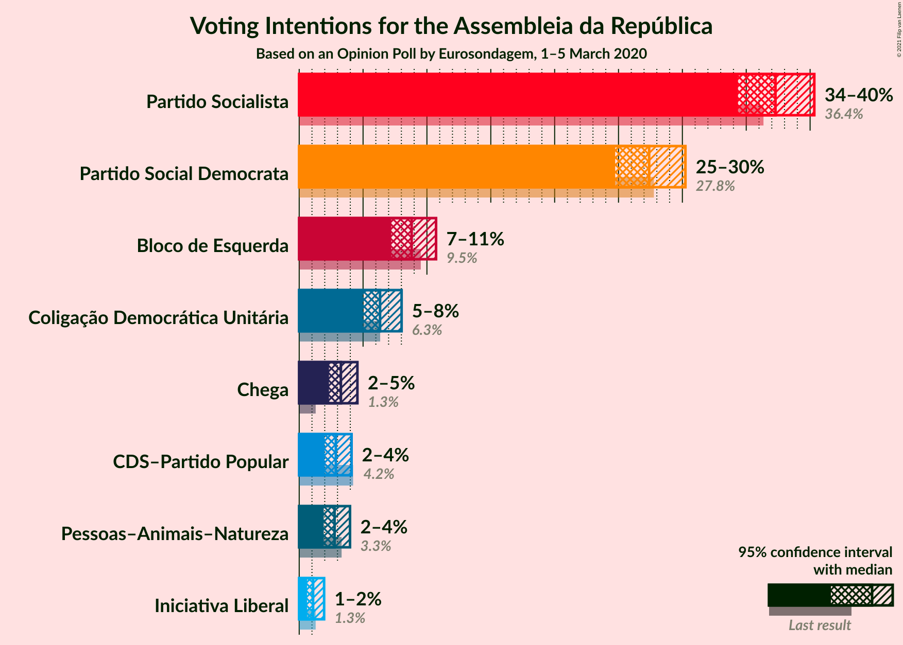

### Confidence Intervals

| Party | Last Result | Poll Result | 80% Confidence Interval | 90% Confidence Interval | 95% Confidence Interval | 99% Confidence Interval |
|:-----:|:-----------:|:-----------:|:-----------------------:|:-----------------------:|:-----------------------:|:-----------------------:|
| Partido Socialista | 36.4% | 37.3% | 35.4–39.3% |34.8–39.8% |34.4–40.3% |33.4–41.3% |
| Partido Social Democrata | 27.8% | 27.4% | 25.7–29.3% |25.2–29.8% |24.7–30.2% |23.9–31.1% |
| Bloco de Esquerda | 9.5% | 8.8% | 7.8–10.1% |7.5–10.4% |7.2–10.7% |6.7–11.3% |
| Coligação Democrática Unitária | 6.3% | 6.3% | 5.4–7.4% |5.2–7.7% |5.0–8.0% |4.6–8.6% |
| Chega | 1.3% | 3.3% | 2.7–4.1% |2.5–4.3% |2.3–4.6% |2.1–5.0% |
| CDS–Partido Popular | 4.2% | 2.9% | 2.3–3.7% |2.1–3.9% |2.0–4.1% |1.8–4.5% |
| Pessoas–Animais–Natureza | 3.3% | 2.8% | 2.2–3.6% |2.0–3.8% |1.9–4.0% |1.7–4.4% |
| Iniciativa Liberal | 1.3% | 1.1% | 0.8–1.6% |0.7–1.8% |0.6–2.0% |0.5–2.2% |

*Note:* The poll result column reflects the actual value used in the calculations. Published results may vary slightly, and in addition be rounded to fewer digits.

## Seats

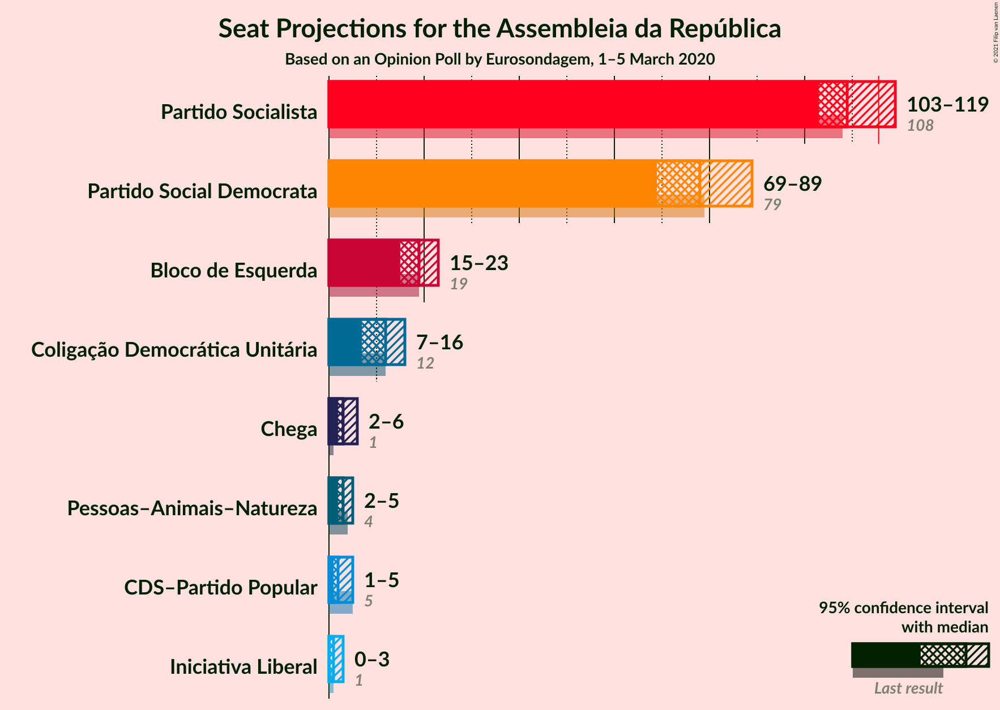

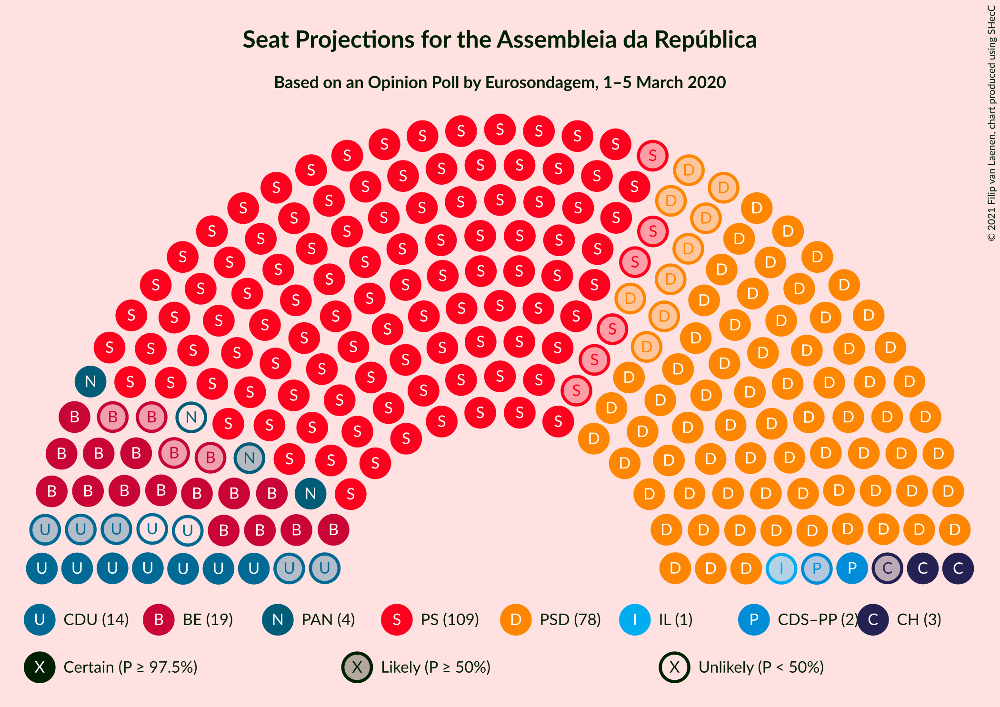

### Confidence Intervals

| Party | Last Result | Median | 80% Confidence Interval | 90% Confidence Interval | 95% Confidence Interval | 99% Confidence Interval |
|:-----:|:-----------:|:------:|:-----------------------:|:-----------------------:|:-----------------------:|:-----------------------:|
| <a href="#partido-socialista">Partido Socialista</a> | 108 | 109 | 104–116 |103–119 |103–119 |98–124 |
| <a href="#partido-social-democrata">Partido Social Democrata</a> | 79 | 78 | 76–83 |70–84 |69–89 |68–90 |
| <a href="#bloco-de-esquerda">Bloco de Esquerda</a> | 19 | 19 | 16–21 |15–23 |15–23 |12–24 |
| <a href="#coligação-democrática-unitária">Coligação Democrática Unitária</a> | 12 | 12 | 9–15 |8–16 |7–16 |7–17 |
| <a href="#chega">Chega</a> | 1 | 3 | 2–4 |2–4 |2–6 |1–8 |
| <a href="#cds–partido-popular">CDS–Partido Popular</a> | 5 | 2 | 1–4 |1–4 |1–5 |1–5 |
| <a href="#pessoas–animais–natureza">Pessoas–Animais–Natureza</a> | 4 | 3 | 2–4 |2–4 |2–5 |1–6 |
| <a href="#iniciativa-liberal">Iniciativa Liberal</a> | 1 | 1 | 0–1 |0–1 |0–3 |0–3 |

### Partido Socialista

*For a full overview of the results for this party, see the [Partido Socialista](party-partidosocialista.html) page.*

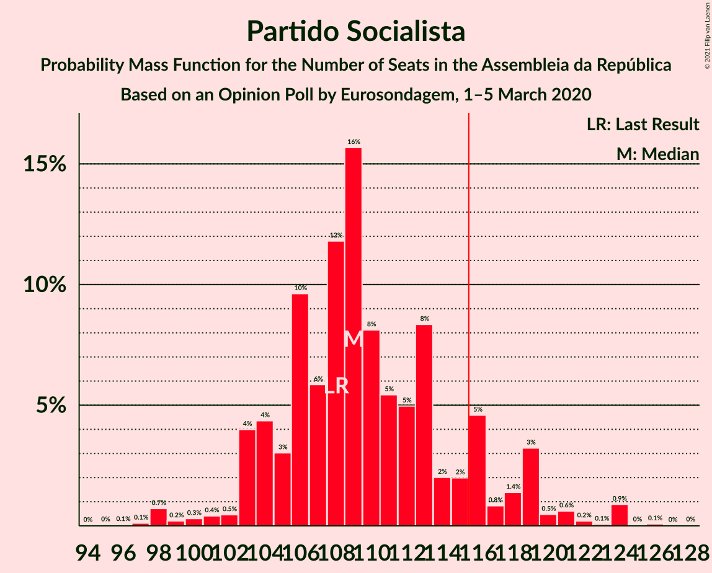

| Number of Seats | Probability | Accumulated | Special Marks |
|:---------------:|:-----------:|:-----------:|:-------------:|
| 95 | 0% | 100% |  |
| 96 | 0.1% | 99.9% |  |
| 97 | 0.1% | 99.9% |  |
| 98 | 0.7% | 99.8% |  |
| 99 | 0.2% | 99.0% |  |
| 100 | 0.3% | 98.8% |  |
| 101 | 0.4% | 98.5% |  |
| 102 | 0.5% | 98% |  |
| 103 | 4% | 98% |  |
| 104 | 4% | 94% |  |
| 105 | 3% | 89% |  |
| 106 | 10% | 86% |  |
| 107 | 6% | 77% |  |
| 108 | 12% | 71% | Last Result |
| 109 | 16% | 59% | Median |
| 110 | 8% | 43% |  |
| 111 | 5% | 35% |  |
| 112 | 5% | 30% |  |
| 113 | 8% | 25% |  |
| 114 | 2% | 16% |  |
| 115 | 2% | 14% |  |
| 116 | 5% | 12% | Majority |
| 117 | 0.8% | 8% |  |
| 118 | 1.4% | 7% |  |
| 119 | 3% | 6% |  |
| 120 | 0.5% | 2% |  |
| 121 | 0.6% | 2% |  |
| 122 | 0.2% | 1.3% |  |
| 123 | 0.1% | 1.1% |  |
| 124 | 0.9% | 1.1% |  |
| 125 | 0% | 0.2% |  |
| 126 | 0.1% | 0.1% |  |
| 127 | 0% | 0.1% |  |
| 128 | 0% | 0% |  |

### Partido Social Democrata

*For a full overview of the results for this party, see the [Partido Social Democrata](party-partidosocialdemocrata.html) page.*

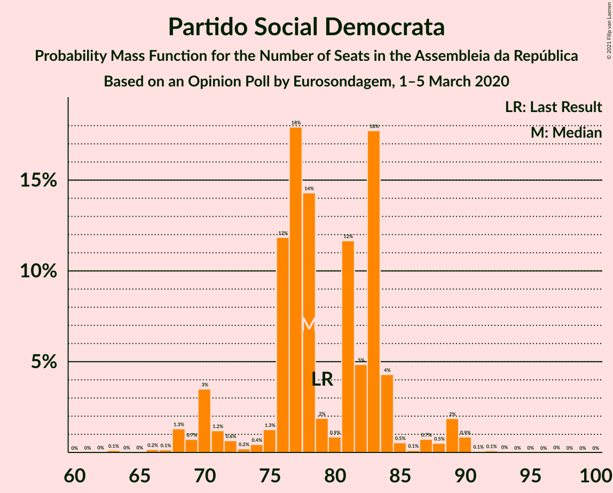

| Number of Seats | Probability | Accumulated | Special Marks |
|:---------------:|:-----------:|:-----------:|:-------------:|
| 63 | 0.1% | 100% |  |
| 64 | 0% | 99.9% |  |
| 65 | 0% | 99.8% |  |
| 66 | 0.2% | 99.8% |  |
| 67 | 0.1% | 99.6% |  |
| 68 | 1.3% | 99.5% |  |
| 69 | 0.7% | 98% |  |
| 70 | 3% | 97% |  |
| 71 | 1.2% | 94% |  |
| 72 | 0.6% | 93% |  |
| 73 | 0.2% | 92% |  |
| 74 | 0.4% | 92% |  |
| 75 | 1.3% | 91% |  |
| 76 | 12% | 90% |  |
| 77 | 18% | 78% |  |
| 78 | 14% | 60% | Median |
| 79 | 2% | 46% | Last Result |
| 80 | 0.9% | 44% |  |
| 81 | 12% | 43% |  |
| 82 | 5% | 32% |  |
| 83 | 18% | 27% |  |
| 84 | 4% | 9% |  |
| 85 | 0.5% | 5% |  |
| 86 | 0.1% | 4% |  |
| 87 | 0.7% | 4% |  |
| 88 | 0.5% | 4% |  |
| 89 | 2% | 3% |  |
| 90 | 0.9% | 1.1% |  |
| 91 | 0.1% | 0.3% |  |
| 92 | 0.1% | 0.2% |  |
| 93 | 0% | 0.1% |  |
| 94 | 0% | 0.1% |  |
| 95 | 0% | 0.1% |  |
| 96 | 0% | 0% |  |

### Bloco de Esquerda

*For a full overview of the results for this party, see the [Bloco de Esquerda](party-blocodeesquerda.html) page.*

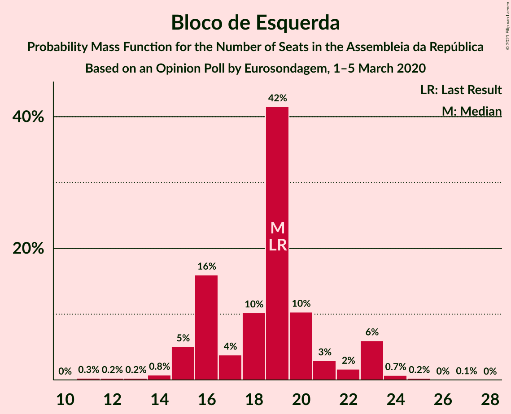

| Number of Seats | Probability | Accumulated | Special Marks |
|:---------------:|:-----------:|:-----------:|:-------------:|
| 11 | 0.3% | 100% |  |
| 12 | 0.2% | 99.7% |  |
| 13 | 0.2% | 99.5% |  |
| 14 | 0.8% | 99.2% |  |
| 15 | 5% | 98% |  |
| 16 | 16% | 93% |  |
| 17 | 4% | 77% |  |
| 18 | 10% | 74% |  |
| 19 | 42% | 63% | Last Result, Median |
| 20 | 10% | 22% |  |
| 21 | 3% | 12% |  |
| 22 | 2% | 9% |  |
| 23 | 6% | 7% |  |
| 24 | 0.7% | 1.0% |  |
| 25 | 0.2% | 0.3% |  |
| 26 | 0% | 0.1% |  |
| 27 | 0.1% | 0.1% |  |
| 28 | 0% | 0% |  |

### Coligação Democrática Unitária

*For a full overview of the results for this party, see the [Coligação Democrática Unitária](party-coligaçãodemocráticaunitária.html) page.*

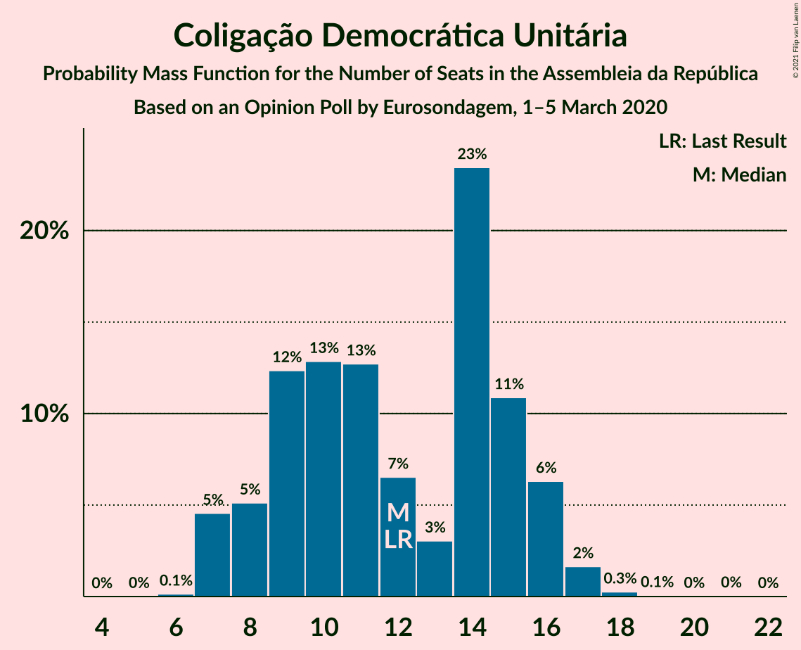

| Number of Seats | Probability | Accumulated | Special Marks |
|:---------------:|:-----------:|:-----------:|:-------------:|
| 6 | 0.1% | 100% |  |
| 7 | 5% | 99.8% |  |
| 8 | 5% | 95% |  |
| 9 | 12% | 90% |  |
| 10 | 13% | 78% |  |
| 11 | 13% | 65% |  |
| 12 | 7% | 52% | Last Result, Median |
| 13 | 3% | 46% |  |
| 14 | 23% | 43% |  |
| 15 | 11% | 19% |  |
| 16 | 6% | 8% |  |
| 17 | 2% | 2% |  |
| 18 | 0.3% | 0.4% |  |
| 19 | 0.1% | 0.1% |  |
| 20 | 0% | 0.1% |  |
| 21 | 0% | 0.1% |  |
| 22 | 0% | 0% |  |

### Chega

*For a full overview of the results for this party, see the [Chega](party-chega.html) page.*

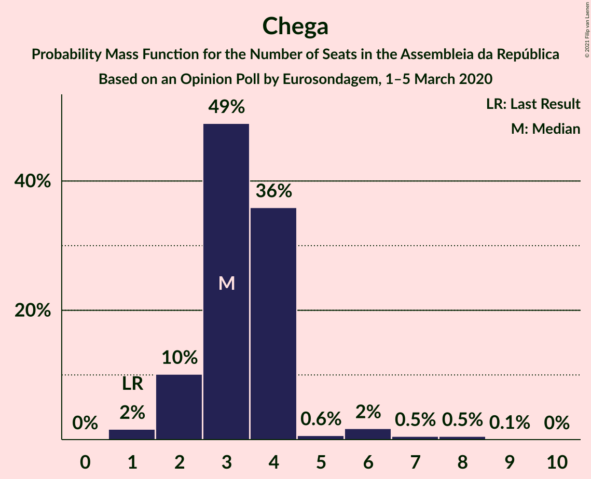

| Number of Seats | Probability | Accumulated | Special Marks |
|:---------------:|:-----------:|:-----------:|:-------------:|
| 1 | 2% | 100% | Last Result |
| 2 | 10% | 98% |  |
| 3 | 49% | 88% | Median |
| 4 | 36% | 39% |  |
| 5 | 0.6% | 3% |  |
| 6 | 2% | 3% |  |
| 7 | 0.5% | 1.1% |  |
| 8 | 0.5% | 0.6% |  |
| 9 | 0.1% | 0.1% |  |
| 10 | 0% | 0% |  |

### CDS–Partido Popular

*For a full overview of the results for this party, see the [CDS–Partido Popular](party-cds–partidopopular.html) page.*

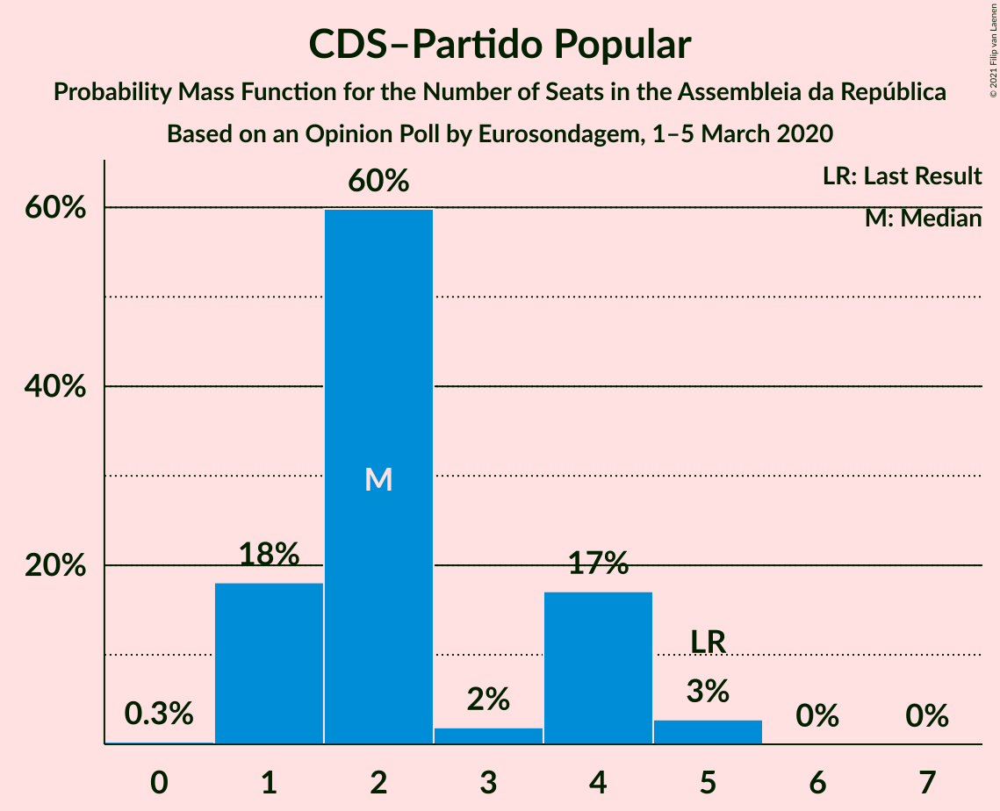

| Number of Seats | Probability | Accumulated | Special Marks |
|:---------------:|:-----------:|:-----------:|:-------------:|
| 0 | 0.3% | 100% |  |
| 1 | 18% | 99.7% |  |
| 2 | 60% | 82% | Median |
| 3 | 2% | 22% |  |
| 4 | 17% | 20% |  |
| 5 | 3% | 3% | Last Result |
| 6 | 0% | 0.1% |  |
| 7 | 0% | 0% |  |

### Pessoas–Animais–Natureza

*For a full overview of the results for this party, see the [Pessoas–Animais–Natureza](party-pessoas–animais–natureza.html) page.*

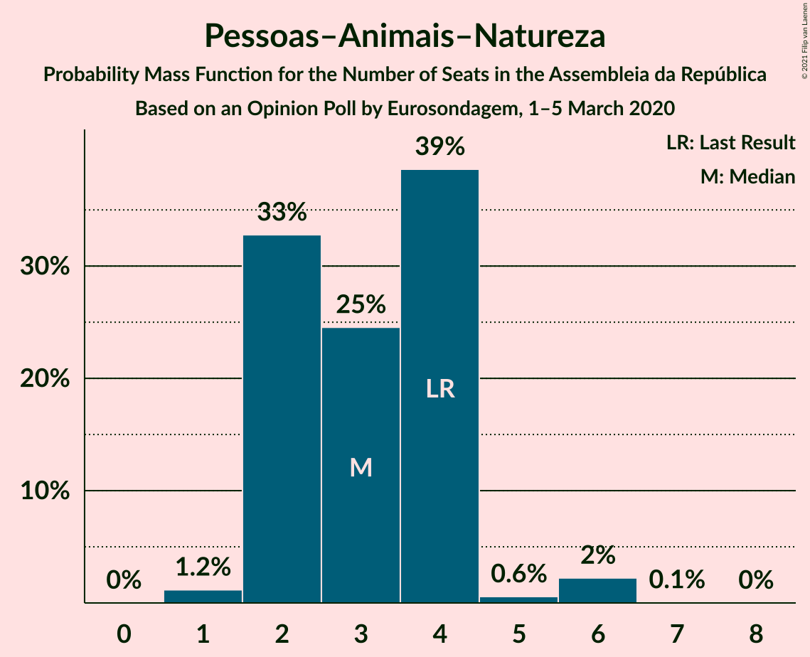

| Number of Seats | Probability | Accumulated | Special Marks |
|:---------------:|:-----------:|:-----------:|:-------------:|
| 1 | 1.2% | 100% |  |
| 2 | 33% | 98.8% |  |
| 3 | 25% | 66% | Median |
| 4 | 39% | 41% | Last Result |
| 5 | 0.6% | 3% |  |
| 6 | 2% | 2% |  |
| 7 | 0.1% | 0.1% |  |
| 8 | 0% | 0% |  |

### Iniciativa Liberal

*For a full overview of the results for this party, see the [Iniciativa Liberal](party-iniciativaliberal.html) page.*

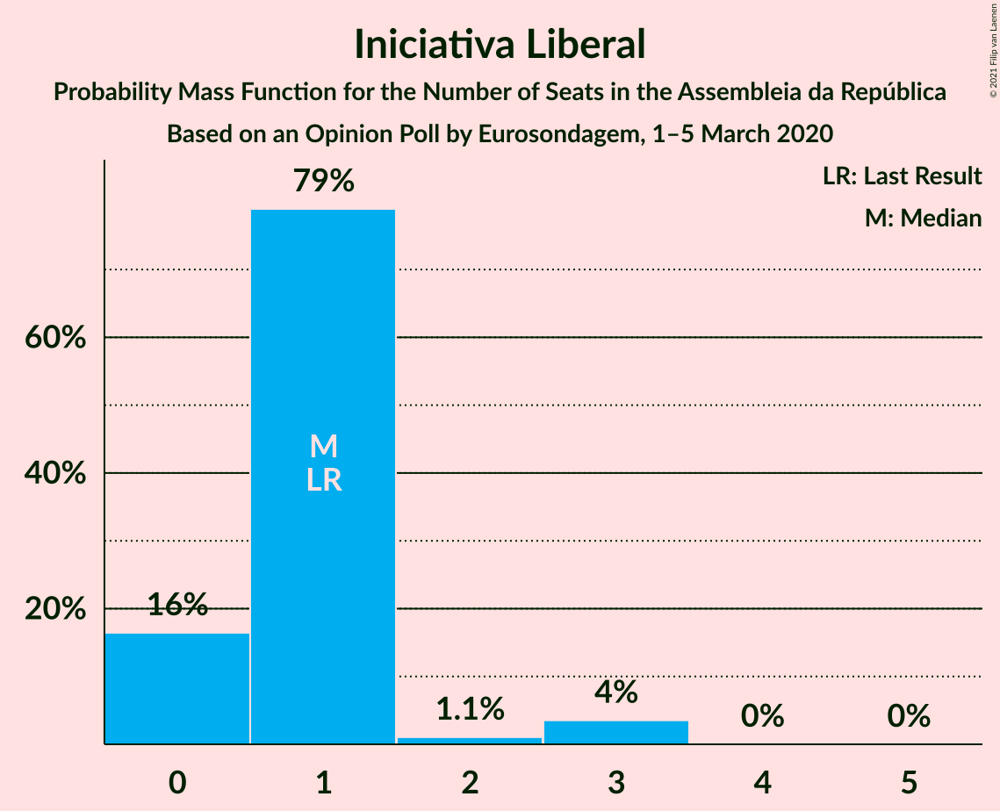

| Number of Seats | Probability | Accumulated | Special Marks |
|:---------------:|:-----------:|:-----------:|:-------------:|
| 0 | 16% | 100% |  |
| 1 | 79% | 84% | Last Result, Median |
| 2 | 1.1% | 5% |  |
| 3 | 4% | 4% |  |
| 4 | 0% | 0% |  |

## Coalitions

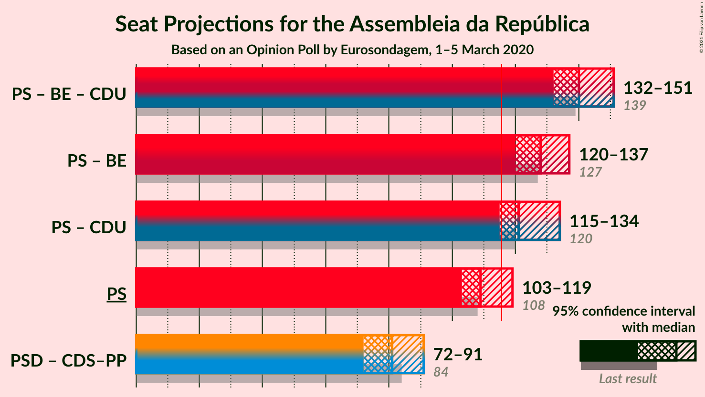

### Confidence Intervals

| Coalition | Last Result | Median | Majority? | 80% Confidence Interval | 90% Confidence Interval | 95% Confidence Interval | 99% Confidence Interval |
|:---------:|:-----------:|:------:|:---------:|:-----------------------:|:-----------------------:|:-----------------------:|:-----------------------:|
| Partido Socialista – Bloco de Esquerda – Coligação Democrática Unitária | 139 | 140 | 100% | 136–146 | 133–150 | 132–151 | 130–153 |
| Partido Socialista – Bloco de Esquerda | 127 | 128 | 99.6% | 122–134 | 121–136 | 120–137 | 116–142 |
| Partido Socialista – Coligação Democrática Unitária | 120 | 121 | 95% | 118–130 | 116–132 | 115–134 | 112–135 |
| Partido Socialista | 108 | 109 | 12% | 104–116 | 103–119 | 103–119 | 98–124 |
| Partido Social Democrata – CDS–Partido Popular | 84 | 81 | 0% | 77–87 | 72–88 | 72–91 | 70–92 |

### Partido Socialista – Bloco de Esquerda – Coligação Democrática Unitária

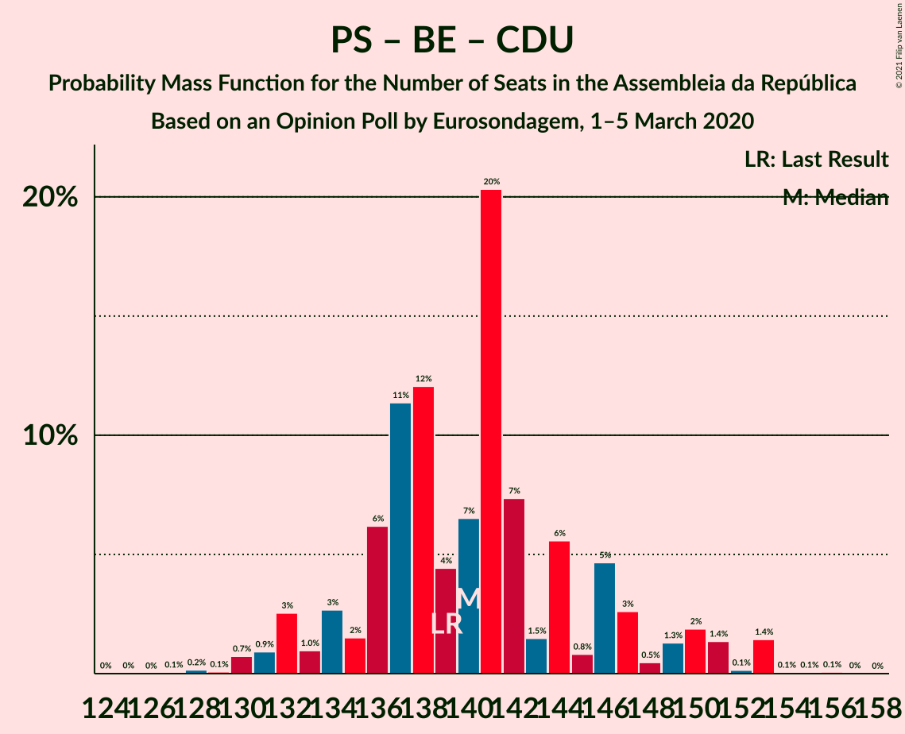

| Number of Seats | Probability | Accumulated | Special Marks |
|:---------------:|:-----------:|:-----------:|:-------------:|
| 125 | 0% | 100% |  |
| 126 | 0% | 99.9% |  |
| 127 | 0.1% | 99.9% |  |
| 128 | 0.2% | 99.9% |  |
| 129 | 0.1% | 99.7% |  |
| 130 | 0.7% | 99.6% |  |
| 131 | 0.9% | 98.9% |  |
| 132 | 3% | 98% |  |
| 133 | 1.0% | 95% |  |
| 134 | 3% | 94% |  |
| 135 | 2% | 92% |  |
| 136 | 6% | 90% |  |
| 137 | 11% | 84% |  |
| 138 | 12% | 73% |  |
| 139 | 4% | 61% | Last Result |
| 140 | 7% | 56% | Median |
| 141 | 20% | 50% |  |
| 142 | 7% | 29% |  |
| 143 | 1.5% | 22% |  |
| 144 | 6% | 21% |  |
| 145 | 0.8% | 15% |  |
| 146 | 5% | 14% |  |
| 147 | 3% | 9% |  |
| 148 | 0.5% | 7% |  |
| 149 | 1.3% | 6% |  |
| 150 | 2% | 5% |  |
| 151 | 1.4% | 3% |  |
| 152 | 0.1% | 2% |  |
| 153 | 1.4% | 2% |  |
| 154 | 0.1% | 0.3% |  |
| 155 | 0.1% | 0.2% |  |
| 156 | 0.1% | 0.1% |  |
| 157 | 0% | 0.1% |  |
| 158 | 0% | 0% |  |

### Partido Socialista – Bloco de Esquerda

| Number of Seats | Probability | Accumulated | Special Marks |
|:---------------:|:-----------:|:-----------:|:-------------:|
| 112 | 0.1% | 100% |  |
| 113 | 0.1% | 99.9% |  |
| 114 | 0.1% | 99.8% |  |
| 115 | 0.1% | 99.7% |  |
| 116 | 0.2% | 99.6% | Majority |
| 117 | 0.8% | 99.5% |  |
| 118 | 0.4% | 98.6% |  |
| 119 | 0.3% | 98% |  |
| 120 | 0.8% | 98% |  |
| 121 | 6% | 97% |  |
| 122 | 2% | 91% |  |
| 123 | 4% | 89% |  |
| 124 | 2% | 85% |  |
| 125 | 10% | 83% |  |
| 126 | 4% | 74% |  |
| 127 | 16% | 70% | Last Result |
| 128 | 13% | 54% | Median |
| 129 | 4% | 40% |  |
| 130 | 1.5% | 36% |  |
| 131 | 5% | 34% |  |
| 132 | 14% | 30% |  |
| 133 | 5% | 16% |  |
| 134 | 4% | 11% |  |
| 135 | 2% | 8% |  |
| 136 | 3% | 6% |  |
| 137 | 0.5% | 3% |  |
| 138 | 0.5% | 2% |  |
| 139 | 0.4% | 2% |  |
| 140 | 0.3% | 1.4% |  |
| 141 | 0% | 1.1% |  |
| 142 | 1.0% | 1.1% |  |
| 143 | 0.1% | 0.1% |  |
| 144 | 0% | 0.1% |  |
| 145 | 0% | 0% |  |

### Partido Socialista – Coligação Democrática Unitária

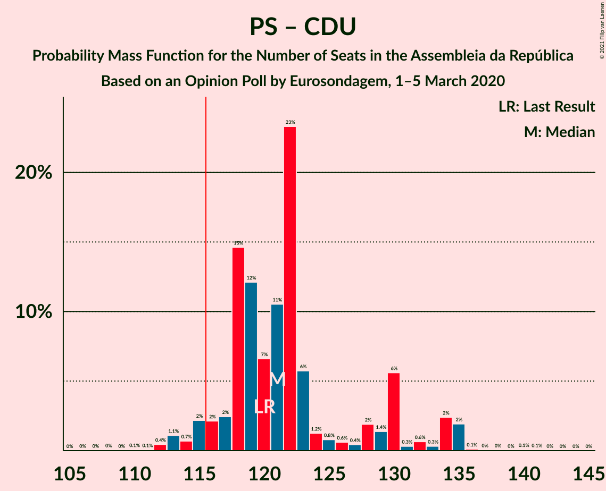

| Number of Seats | Probability | Accumulated | Special Marks |
|:---------------:|:-----------:|:-----------:|:-------------:|
| 108 | 0% | 100% |  |
| 109 | 0% | 99.9% |  |
| 110 | 0.1% | 99.9% |  |
| 111 | 0.1% | 99.8% |  |
| 112 | 0.4% | 99.8% |  |
| 113 | 1.1% | 99.3% |  |
| 114 | 0.7% | 98% |  |
| 115 | 2% | 98% |  |
| 116 | 2% | 95% | Majority |
| 117 | 2% | 93% |  |
| 118 | 15% | 91% |  |
| 119 | 12% | 76% |  |
| 120 | 7% | 64% | Last Result |
| 121 | 11% | 57% | Median |
| 122 | 23% | 47% |  |
| 123 | 6% | 24% |  |
| 124 | 1.2% | 18% |  |
| 125 | 0.8% | 17% |  |
| 126 | 0.6% | 16% |  |
| 127 | 0.4% | 15% |  |
| 128 | 2% | 15% |  |
| 129 | 1.4% | 13% |  |
| 130 | 6% | 12% |  |
| 131 | 0.3% | 6% |  |
| 132 | 0.6% | 6% |  |
| 133 | 0.3% | 5% |  |
| 134 | 2% | 5% |  |
| 135 | 2% | 2% |  |
| 136 | 0.1% | 0.3% |  |
| 137 | 0% | 0.2% |  |
| 138 | 0% | 0.2% |  |
| 139 | 0% | 0.1% |  |
| 140 | 0.1% | 0.1% |  |
| 141 | 0.1% | 0.1% |  |
| 142 | 0% | 0% |  |

### Partido Socialista

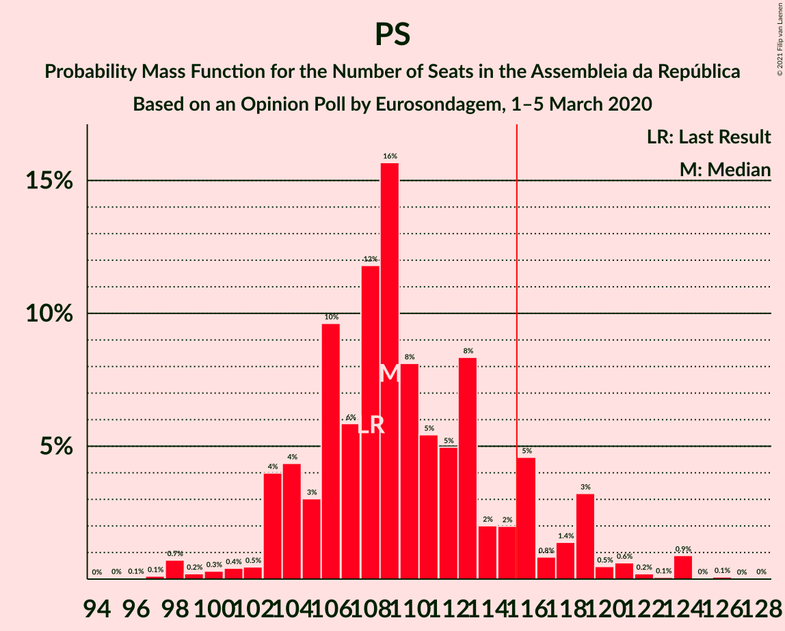

| Number of Seats | Probability | Accumulated | Special Marks |
|:---------------:|:-----------:|:-----------:|:-------------:|
| 95 | 0% | 100% |  |
| 96 | 0.1% | 99.9% |  |
| 97 | 0.1% | 99.9% |  |
| 98 | 0.7% | 99.8% |  |
| 99 | 0.2% | 99.0% |  |
| 100 | 0.3% | 98.8% |  |
| 101 | 0.4% | 98.5% |  |
| 102 | 0.5% | 98% |  |
| 103 | 4% | 98% |  |
| 104 | 4% | 94% |  |
| 105 | 3% | 89% |  |
| 106 | 10% | 86% |  |
| 107 | 6% | 77% |  |
| 108 | 12% | 71% | Last Result |
| 109 | 16% | 59% | Median |
| 110 | 8% | 43% |  |
| 111 | 5% | 35% |  |
| 112 | 5% | 30% |  |
| 113 | 8% | 25% |  |
| 114 | 2% | 16% |  |
| 115 | 2% | 14% |  |
| 116 | 5% | 12% | Majority |
| 117 | 0.8% | 8% |  |
| 118 | 1.4% | 7% |  |
| 119 | 3% | 6% |  |
| 120 | 0.5% | 2% |  |
| 121 | 0.6% | 2% |  |
| 122 | 0.2% | 1.3% |  |
| 123 | 0.1% | 1.1% |  |
| 124 | 0.9% | 1.1% |  |
| 125 | 0% | 0.2% |  |
| 126 | 0.1% | 0.1% |  |
| 127 | 0% | 0.1% |  |
| 128 | 0% | 0% |  |

### Partido Social Democrata – CDS–Partido Popular

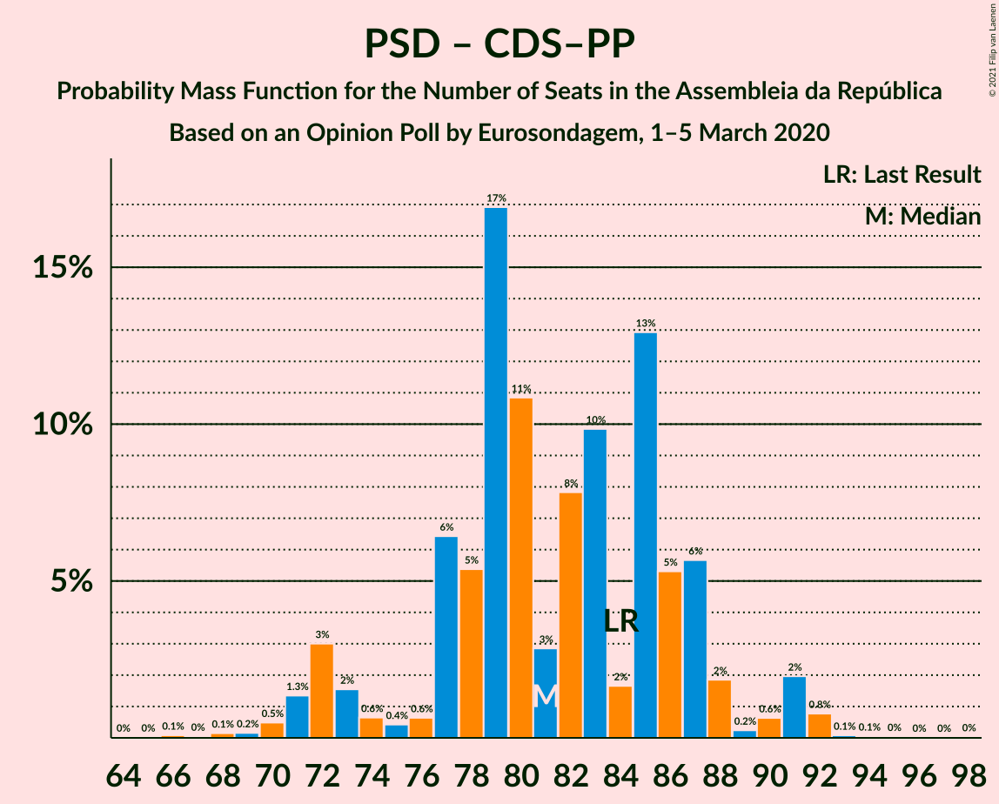

| Number of Seats | Probability | Accumulated | Special Marks |
|:---------------:|:-----------:|:-----------:|:-------------:|
| 65 | 0% | 100% |  |
| 66 | 0.1% | 99.9% |  |
| 67 | 0% | 99.9% |  |
| 68 | 0.1% | 99.8% |  |
| 69 | 0.2% | 99.7% |  |
| 70 | 0.5% | 99.5% |  |
| 71 | 1.3% | 99.0% |  |
| 72 | 3% | 98% |  |
| 73 | 2% | 95% |  |
| 74 | 0.6% | 93% |  |
| 75 | 0.4% | 92% |  |
| 76 | 0.6% | 92% |  |
| 77 | 6% | 91% |  |
| 78 | 5% | 85% |  |
| 79 | 17% | 80% |  |
| 80 | 11% | 63% | Median |
| 81 | 3% | 52% |  |
| 82 | 8% | 49% |  |
| 83 | 10% | 41% |  |
| 84 | 2% | 31% | Last Result |
| 85 | 13% | 30% |  |
| 86 | 5% | 17% |  |
| 87 | 6% | 11% |  |
| 88 | 2% | 6% |  |
| 89 | 0.2% | 4% |  |
| 90 | 0.6% | 4% |  |
| 91 | 2% | 3% |  |
| 92 | 0.8% | 1.0% |  |
| 93 | 0.1% | 0.3% |  |
| 94 | 0.1% | 0.2% |  |
| 95 | 0% | 0.1% |  |
| 96 | 0% | 0.1% |  |
| 97 | 0% | 0.1% |  |
| 98 | 0% | 0% |  |

## Technical Information

### Opinion Poll

+ **Polling firm:** Eurosondagem
+ **Commissioner(s):** —
+ **Fieldwork period:** 1–5 March 2020

### Calculations

+ **Sample size:** 1011
+ **Simulations done:** 131,072
+ **Error estimate:** 2.51%

