# Opinion Poll by Intercampus for Correio da Manhã and Negócios, 13–19 March 2020

<a href="#voting-intentions">Voting Intentions</a> | <a href="#seats">Seats</a> | <a href="#coalitions">Coalitions</a> | <a href="#technical-information">Technical Information</a>

## Voting Intentions

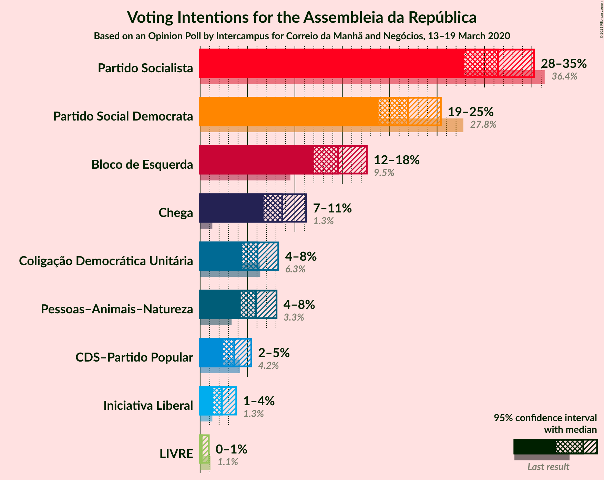

### Confidence Intervals

| Party | Last Result | Poll Result | 80% Confidence Interval | 90% Confidence Interval | 95% Confidence Interval | 99% Confidence Interval |
|:-----:|:-----------:|:-----------:|:-----------------------:|:-----------------------:|:-----------------------:|:-----------------------:|
| Partido Socialista | 36.4% | 31.4% | 29.1–33.9% |28.4–34.6% |27.9–35.2% |26.8–36.4% |
| Partido Social Democrata | 27.8% | 21.9% | 19.9–24.2% |19.3–24.8% |18.8–25.4% |17.9–26.5% |
| Bloco de Esquerda | 9.5% | 14.6% | 12.9–16.5% |12.4–17.1% |12.0–17.6% |11.2–18.6% |
| Chega | 1.3% | 8.7% | 7.4–10.3% |7.0–10.8% |6.7–11.2% |6.1–12.0% |
| Coligação Democrática Unitária | 6.3% | 6.1% | 5.0–7.5% |4.7–7.9% |4.4–8.2% |4.0–9.0% |
| Pessoas–Animais–Natureza | 3.3% | 5.9% | 4.8–7.3% |4.5–7.7% |4.3–8.1% |3.8–8.8% |
| CDS–Partido Popular | 4.2% | 3.6% | 2.8–4.8% |2.6–5.1% |2.4–5.4% |2.1–6.0% |
| Iniciativa Liberal | 1.3% | 2.3% | 1.7–3.3% |1.5–3.6% |1.4–3.8% |1.1–4.3% |
| LIVRE | 1.1% | 0.2% | 0.1–0.6% |0.0–0.8% |0.0–0.9% |0.0–1.2% |

*Note:* The poll result column reflects the actual value used in the calculations. Published results may vary slightly, and in addition be rounded to fewer digits.

## Seats

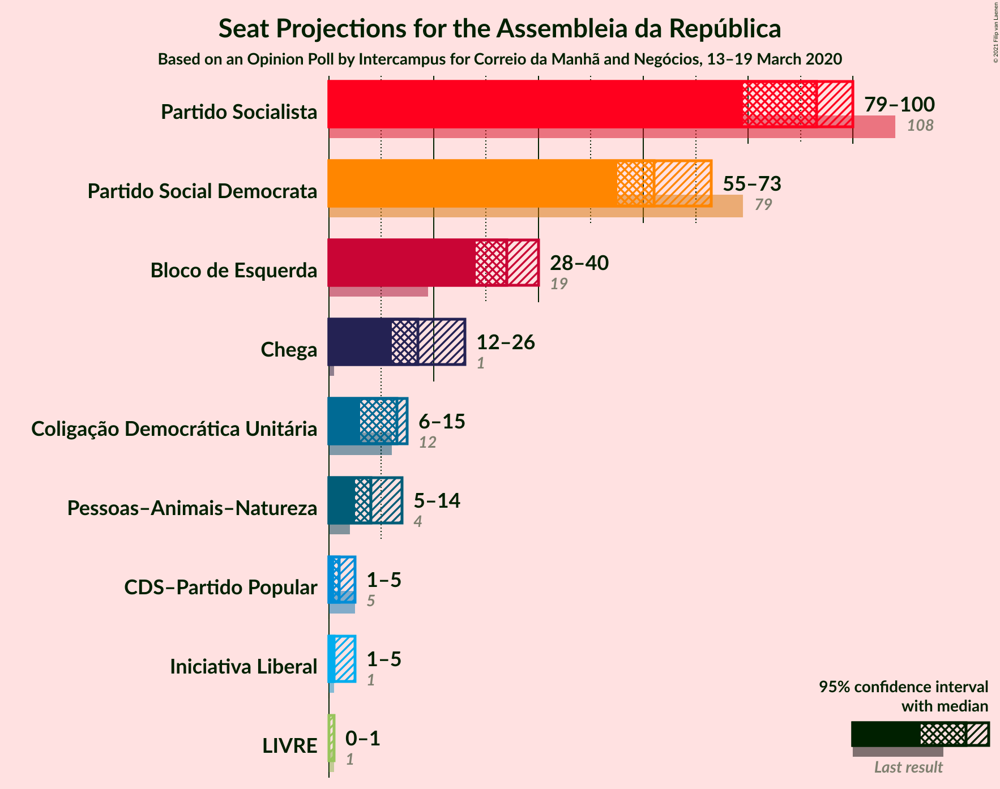

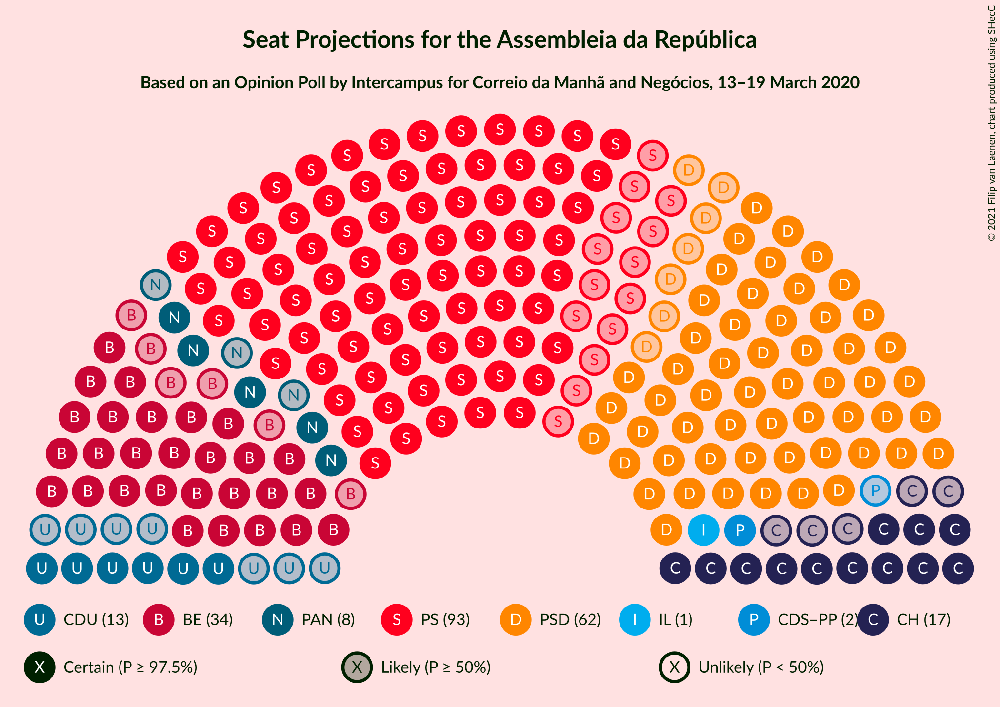

### Confidence Intervals

| Party | Last Result | Median | 80% Confidence Interval | 90% Confidence Interval | 95% Confidence Interval | 99% Confidence Interval |
|:-----:|:-----------:|:------:|:-----------------------:|:-----------------------:|:-----------------------:|:-----------------------:|
| <a href="#partido-socialista">Partido Socialista</a> | 108 | 93 | 80–93 |80–97 |79–100 |75–106 |
| <a href="#partido-social-democrata">Partido Social Democrata</a> | 79 | 62 | 58–69 |56–73 |55–73 |51–76 |
| <a href="#bloco-de-esquerda">Bloco de Esquerda</a> | 19 | 34 | 29–36 |28–40 |28–40 |24–44 |
| <a href="#chega">Chega</a> | 1 | 17 | 14–23 |14–24 |12–26 |11–27 |
| <a href="#coligação-democrática-unitária">Coligação Democrática Unitária</a> | 12 | 13 | 7–15 |6–15 |6–15 |6–18 |
| <a href="#pessoas–animais–natureza">Pessoas–Animais–Natureza</a> | 4 | 8 | 6–11 |6–13 |5–14 |4–15 |
| <a href="#cds–partido-popular">CDS–Partido Popular</a> | 5 | 2 | 2–4 |2–5 |1–5 |1–7 |
| <a href="#iniciativa-liberal">Iniciativa Liberal</a> | 1 | 1 | 1–3 |1–4 |1–5 |1–5 |
| <a href="#livre">LIVRE</a> | 1 | 0 | 0 |0 |0–1 |0–1 |

### Partido Socialista

*For a full overview of the results for this party, see the [Partido Socialista](party-partidosocialista.html) page.*

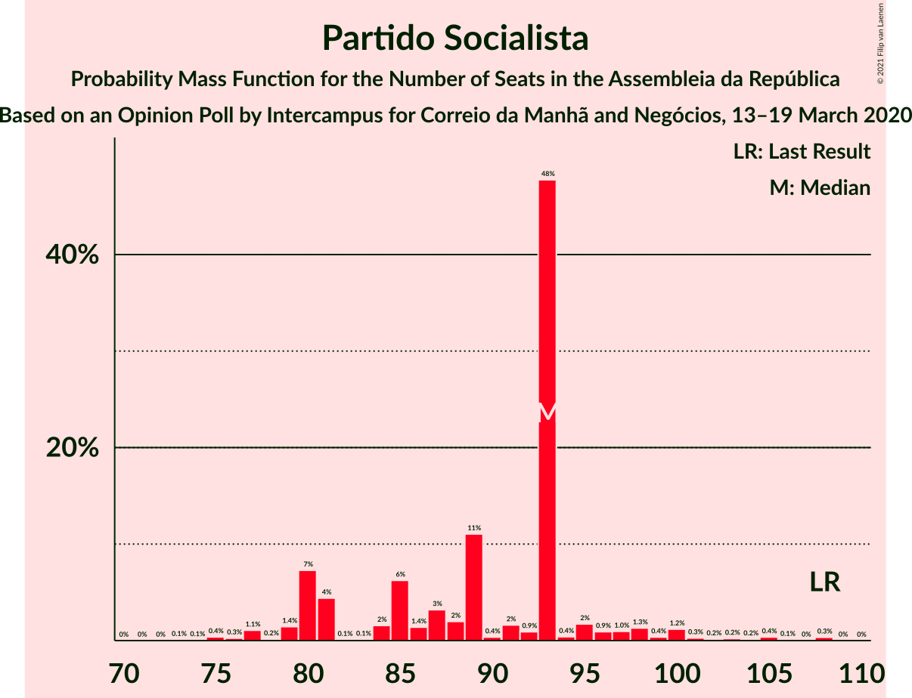

| Number of Seats | Probability | Accumulated | Special Marks |
|:---------------:|:-----------:|:-----------:|:-------------:|
| 72 | 0% | 100% |  |
| 73 | 0.1% | 99.9% |  |
| 74 | 0.1% | 99.9% |  |
| 75 | 0.4% | 99.8% |  |
| 76 | 0.3% | 99.4% |  |
| 77 | 1.1% | 99.2% |  |
| 78 | 0.2% | 98% |  |
| 79 | 1.4% | 98% |  |
| 80 | 7% | 96% |  |
| 81 | 4% | 89% |  |
| 82 | 0.1% | 85% |  |
| 83 | 0.1% | 85% |  |
| 84 | 2% | 85% |  |
| 85 | 6% | 83% |  |
| 86 | 1.4% | 77% |  |
| 87 | 3% | 75% |  |
| 88 | 2% | 72% |  |
| 89 | 11% | 70% |  |
| 90 | 0.4% | 59% |  |
| 91 | 2% | 59% |  |
| 92 | 0.9% | 57% |  |
| 93 | 48% | 56% | Median |
| 94 | 0.4% | 9% |  |
| 95 | 2% | 8% |  |
| 96 | 0.9% | 6% |  |
| 97 | 1.0% | 5% |  |
| 98 | 1.3% | 5% |  |
| 99 | 0.4% | 3% |  |
| 100 | 1.2% | 3% |  |
| 101 | 0.3% | 2% |  |
| 102 | 0.2% | 1.4% |  |
| 103 | 0.2% | 1.2% |  |
| 104 | 0.2% | 1.0% |  |
| 105 | 0.4% | 0.9% |  |
| 106 | 0.1% | 0.5% |  |
| 107 | 0% | 0.4% |  |
| 108 | 0.3% | 0.4% | Last Result |
| 109 | 0% | 0.1% |  |
| 110 | 0% | 0% |  |

### Partido Social Democrata

*For a full overview of the results for this party, see the [Partido Social Democrata](party-partidosocialdemocrata.html) page.*

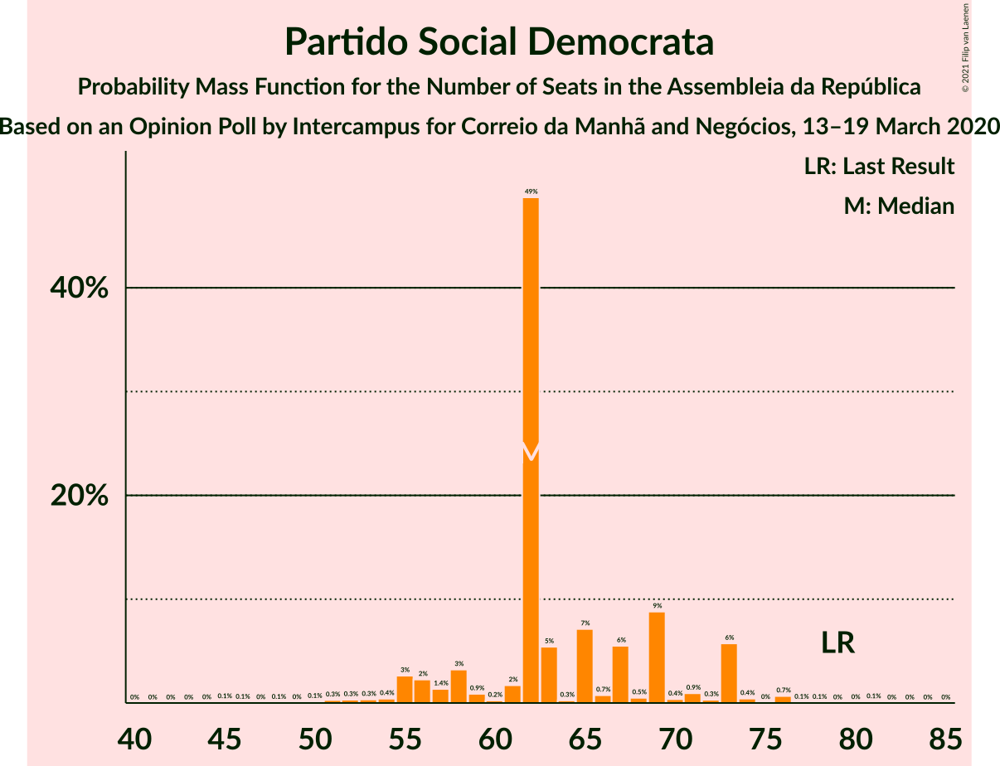

| Number of Seats | Probability | Accumulated | Special Marks |
|:---------------:|:-----------:|:-----------:|:-------------:|
| 45 | 0.1% | 100% |  |
| 46 | 0.1% | 99.9% |  |
| 47 | 0% | 99.8% |  |
| 48 | 0.1% | 99.8% |  |
| 49 | 0% | 99.7% |  |
| 50 | 0.1% | 99.7% |  |
| 51 | 0.3% | 99.5% |  |
| 52 | 0.3% | 99.3% |  |
| 53 | 0.3% | 98.9% |  |
| 54 | 0.4% | 98.6% |  |
| 55 | 3% | 98% |  |
| 56 | 2% | 96% |  |
| 57 | 1.4% | 93% |  |
| 58 | 3% | 92% |  |
| 59 | 0.9% | 89% |  |
| 60 | 0.2% | 88% |  |
| 61 | 2% | 88% |  |
| 62 | 49% | 86% | Median |
| 63 | 5% | 37% |  |
| 64 | 0.3% | 32% |  |
| 65 | 7% | 31% |  |
| 66 | 0.7% | 24% |  |
| 67 | 6% | 24% |  |
| 68 | 0.5% | 18% |  |
| 69 | 9% | 18% |  |
| 70 | 0.4% | 9% |  |
| 71 | 0.9% | 8% |  |
| 72 | 0.3% | 7% |  |
| 73 | 6% | 7% |  |
| 74 | 0.4% | 1.4% |  |
| 75 | 0% | 1.0% |  |
| 76 | 0.7% | 0.9% |  |
| 77 | 0.1% | 0.3% |  |
| 78 | 0.1% | 0.2% |  |
| 79 | 0% | 0.2% | Last Result |
| 80 | 0% | 0.1% |  |
| 81 | 0.1% | 0.1% |  |
| 82 | 0% | 0% |  |

### Bloco de Esquerda

*For a full overview of the results for this party, see the [Bloco de Esquerda](party-blocodeesquerda.html) page.*

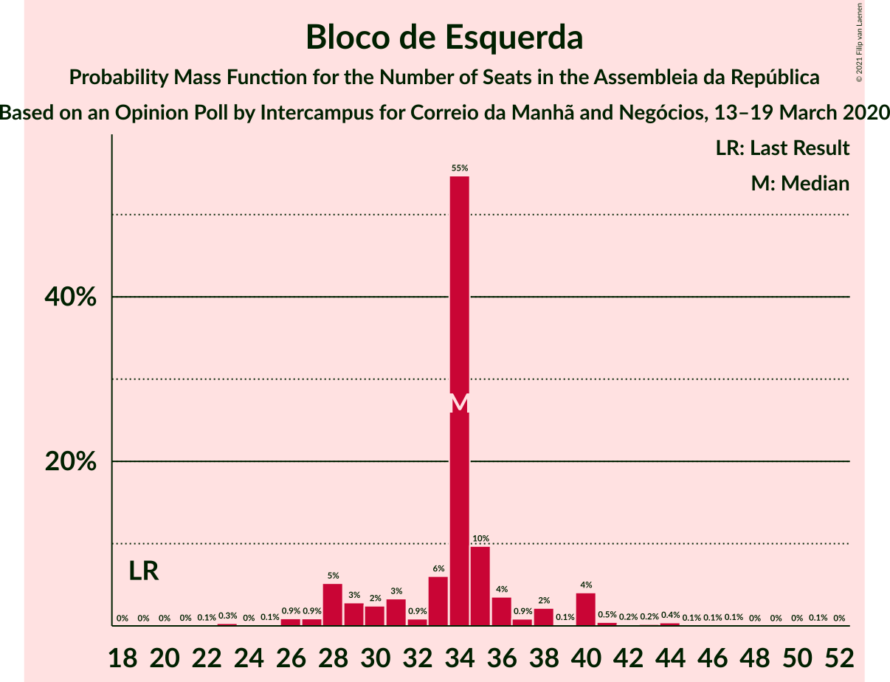

| Number of Seats | Probability | Accumulated | Special Marks |
|:---------------:|:-----------:|:-----------:|:-------------:|
| 19 | 0% | 100% | Last Result |
| 20 | 0% | 100% |  |
| 21 | 0% | 100% |  |
| 22 | 0.1% | 99.9% |  |
| 23 | 0.3% | 99.9% |  |
| 24 | 0% | 99.5% |  |
| 25 | 0.1% | 99.5% |  |
| 26 | 0.9% | 99.3% |  |
| 27 | 0.9% | 98% |  |
| 28 | 5% | 98% |  |
| 29 | 3% | 92% |  |
| 30 | 2% | 90% |  |
| 31 | 3% | 87% |  |
| 32 | 0.9% | 84% |  |
| 33 | 6% | 83% |  |
| 34 | 55% | 77% | Median |
| 35 | 10% | 22% |  |
| 36 | 4% | 12% |  |
| 37 | 0.9% | 9% |  |
| 38 | 2% | 8% |  |
| 39 | 0.1% | 6% |  |
| 40 | 4% | 6% |  |
| 41 | 0.5% | 2% |  |
| 42 | 0.2% | 1.2% |  |
| 43 | 0.2% | 1.0% |  |
| 44 | 0.4% | 0.8% |  |
| 45 | 0.1% | 0.4% |  |
| 46 | 0.1% | 0.4% |  |
| 47 | 0.1% | 0.3% |  |
| 48 | 0% | 0.1% |  |
| 49 | 0% | 0.1% |  |
| 50 | 0% | 0.1% |  |
| 51 | 0.1% | 0.1% |  |
| 52 | 0% | 0% |  |

### Chega

*For a full overview of the results for this party, see the [Chega](party-chega.html) page.*

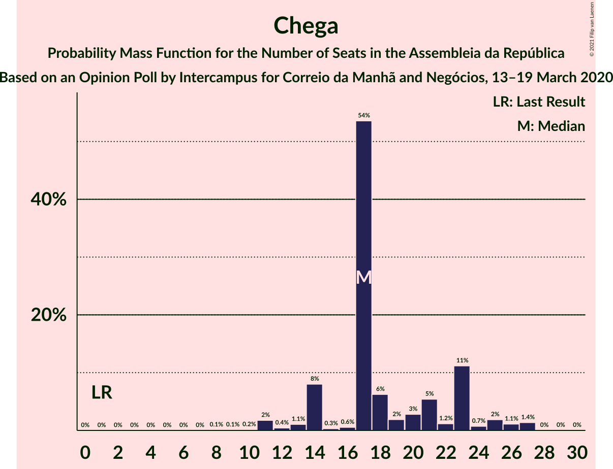

| Number of Seats | Probability | Accumulated | Special Marks |
|:---------------:|:-----------:|:-----------:|:-------------:|
| 1 | 0% | 100% | Last Result |
| 2 | 0% | 100% |  |
| 3 | 0% | 100% |  |
| 4 | 0% | 100% |  |
| 5 | 0% | 100% |  |
| 6 | 0% | 100% |  |
| 7 | 0% | 100% |  |
| 8 | 0.1% | 100% |  |
| 9 | 0.1% | 99.9% |  |
| 10 | 0.2% | 99.8% |  |
| 11 | 2% | 99.6% |  |
| 12 | 0.4% | 98% |  |
| 13 | 1.1% | 97% |  |
| 14 | 8% | 96% |  |
| 15 | 0.3% | 88% |  |
| 16 | 0.6% | 88% |  |
| 17 | 54% | 87% | Median |
| 18 | 6% | 34% |  |
| 19 | 2% | 28% |  |
| 20 | 3% | 26% |  |
| 21 | 5% | 23% |  |
| 22 | 1.2% | 18% |  |
| 23 | 11% | 16% |  |
| 24 | 0.7% | 5% |  |
| 25 | 2% | 4% |  |
| 26 | 1.1% | 3% |  |
| 27 | 1.4% | 1.5% |  |
| 28 | 0% | 0.1% |  |
| 29 | 0% | 0.1% |  |
| 30 | 0% | 0% |  |

### Coligação Democrática Unitária

*For a full overview of the results for this party, see the [Coligação Democrática Unitária](party-coligaçãodemocráticaunitária.html) page.*

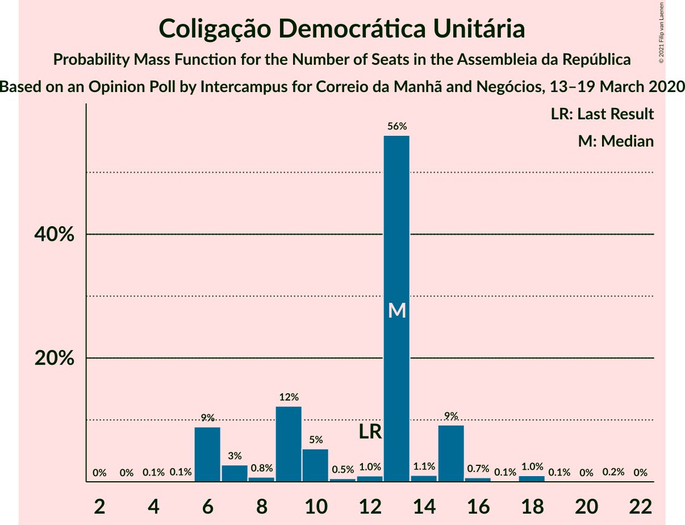

| Number of Seats | Probability | Accumulated | Special Marks |
|:---------------:|:-----------:|:-----------:|:-------------:|
| 4 | 0.1% | 100% |  |
| 5 | 0.1% | 99.9% |  |
| 6 | 9% | 99.8% |  |
| 7 | 3% | 91% |  |
| 8 | 0.8% | 88% |  |
| 9 | 12% | 87% |  |
| 10 | 5% | 75% |  |
| 11 | 0.5% | 70% |  |
| 12 | 1.0% | 69% | Last Result |
| 13 | 56% | 68% | Median |
| 14 | 1.1% | 12% |  |
| 15 | 9% | 11% |  |
| 16 | 0.7% | 2% |  |
| 17 | 0.1% | 1.4% |  |
| 18 | 1.0% | 1.3% |  |
| 19 | 0.1% | 0.3% |  |
| 20 | 0% | 0.2% |  |
| 21 | 0.2% | 0.2% |  |
| 22 | 0% | 0% |  |

### Pessoas–Animais–Natureza

*For a full overview of the results for this party, see the [Pessoas–Animais–Natureza](party-pessoas–animais–natureza.html) page.*

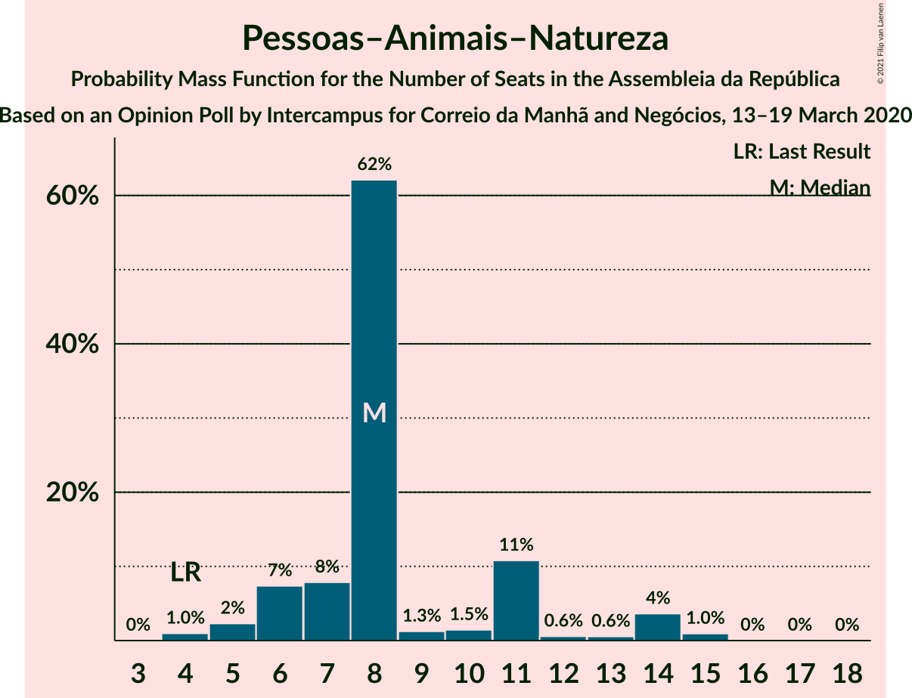

| Number of Seats | Probability | Accumulated | Special Marks |
|:---------------:|:-----------:|:-----------:|:-------------:|
| 4 | 1.0% | 100% | Last Result |
| 5 | 2% | 99.0% |  |
| 6 | 7% | 97% |  |
| 7 | 8% | 89% |  |
| 8 | 62% | 81% | Median |
| 9 | 1.3% | 19% |  |
| 10 | 1.5% | 18% |  |
| 11 | 11% | 17% |  |
| 12 | 0.6% | 6% |  |
| 13 | 0.6% | 5% |  |
| 14 | 4% | 5% |  |
| 15 | 1.0% | 1.0% |  |
| 16 | 0% | 0.1% |  |
| 17 | 0% | 0.1% |  |
| 18 | 0% | 0% |  |

### CDS–Partido Popular

*For a full overview of the results for this party, see the [CDS–Partido Popular](party-cds–partidopopular.html) page.*

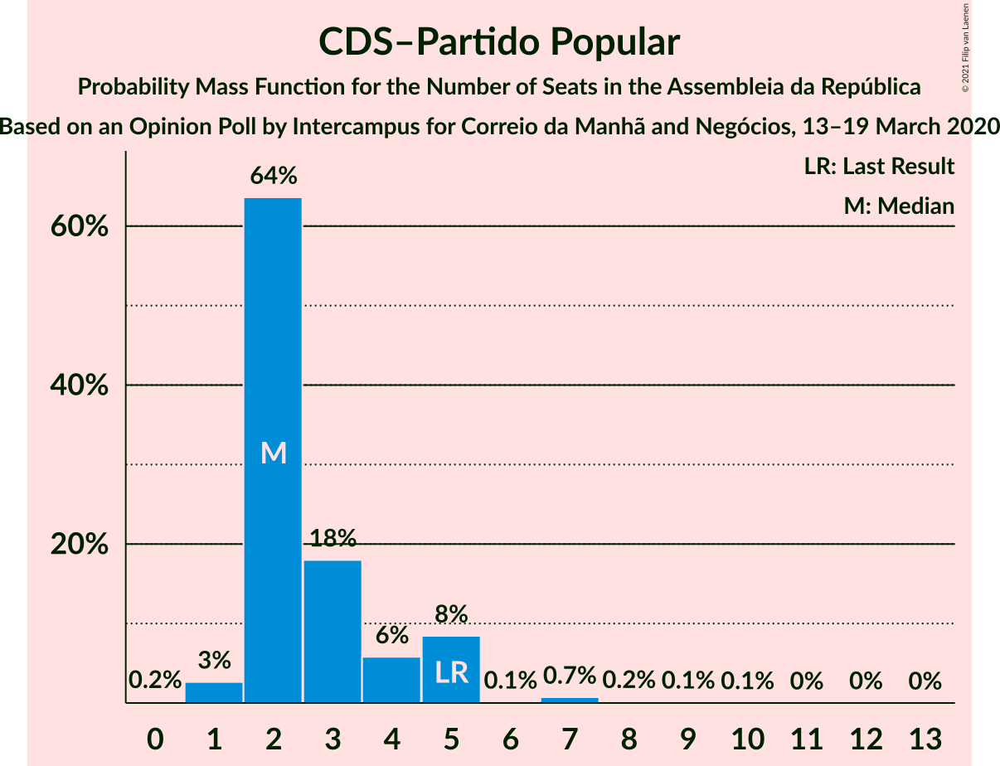

| Number of Seats | Probability | Accumulated | Special Marks |
|:---------------:|:-----------:|:-----------:|:-------------:|
| 0 | 0.2% | 100% |  |
| 1 | 3% | 99.8% |  |
| 2 | 64% | 97% | Median |
| 3 | 18% | 34% |  |
| 4 | 6% | 16% |  |
| 5 | 8% | 10% | Last Result |
| 6 | 0.1% | 1.3% |  |
| 7 | 0.7% | 1.2% |  |
| 8 | 0.2% | 0.4% |  |
| 9 | 0.1% | 0.3% |  |
| 10 | 0.1% | 0.1% |  |
| 11 | 0% | 0.1% |  |
| 12 | 0% | 0.1% |  |
| 13 | 0% | 0% |  |

### Iniciativa Liberal

*For a full overview of the results for this party, see the [Iniciativa Liberal](party-iniciativaliberal.html) page.*

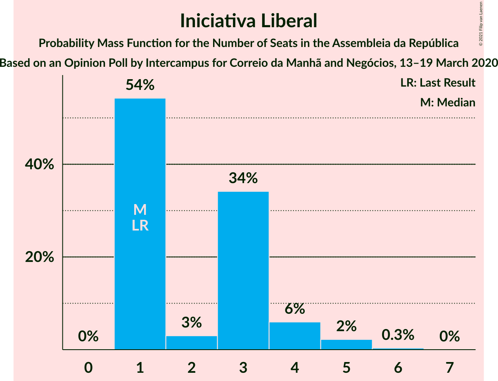

| Number of Seats | Probability | Accumulated | Special Marks |
|:---------------:|:-----------:|:-----------:|:-------------:|
| 1 | 54% | 100% | Last Result, Median |
| 2 | 3% | 46% |  |
| 3 | 34% | 43% |  |
| 4 | 6% | 9% |  |
| 5 | 2% | 3% |  |
| 6 | 0.3% | 0.4% |  |
| 7 | 0% | 0% |  |

### LIVRE

*For a full overview of the results for this party, see the [LIVRE](party-livre.html) page.*

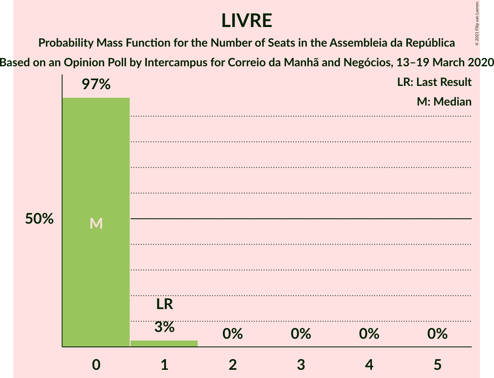

| Number of Seats | Probability | Accumulated | Special Marks |
|:---------------:|:-----------:|:-----------:|:-------------:|
| 0 | 97% | 100% | Median |
| 1 | 3% | 3% | Last Result |
| 2 | 0% | 0% |  |

## Coalitions

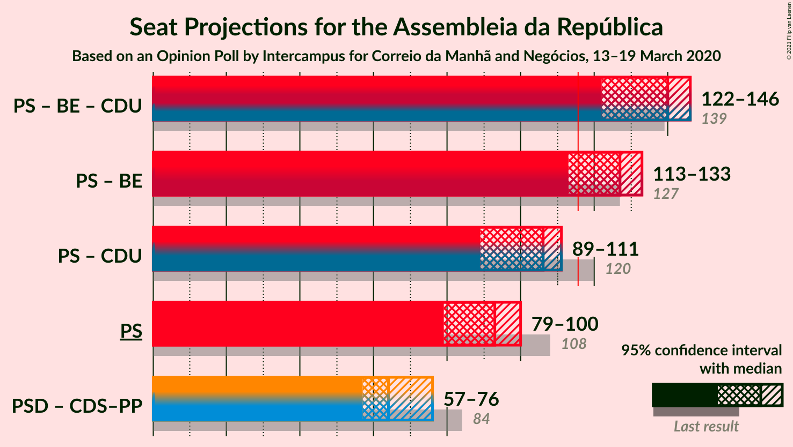

### Confidence Intervals

| Coalition | Last Result | Median | Majority? | 80% Confidence Interval | 90% Confidence Interval | 95% Confidence Interval | 99% Confidence Interval |
|:---------:|:-----------:|:------:|:---------:|:-----------------------:|:-----------------------:|:-----------------------:|:-----------------------:|
| Partido Socialista – Bloco de Esquerda – Coligação Democrática Unitária | 139 | 140 | 99.9% | 126–140 | 122–141 | 122–146 | 119–149 |
| Partido Socialista – Bloco de Esquerda | 127 | 127 | 90% | 115–127 | 113–131 | 113–133 | 107–139 |
| Partido Socialista – Coligação Democrática Unitária | 120 | 106 | 0.4% | 90–106 | 89–109 | 89–111 | 86–115 |
| Partido Socialista | 108 | 93 | 0% | 80–93 | 80–97 | 79–100 | 75–106 |
| Partido Social Democrata – CDS–Partido Popular | 84 | 64 | 0% | 61–72 | 59–76 | 57–76 | 54–78 |

### Partido Socialista – Bloco de Esquerda – Coligação Democrática Unitária

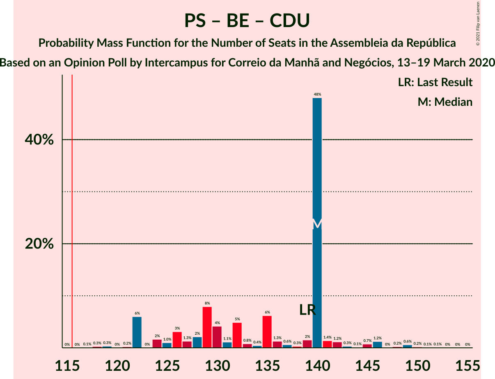

| Number of Seats | Probability | Accumulated | Special Marks |
|:---------------:|:-----------:|:-----------:|:-------------:|
| 115 | 0% | 100% |  |
| 116 | 0% | 99.9% | Majority |
| 117 | 0.1% | 99.9% |  |
| 118 | 0.3% | 99.9% |  |
| 119 | 0.3% | 99.6% |  |
| 120 | 0% | 99.2% |  |
| 121 | 0.2% | 99.2% |  |
| 122 | 6% | 99.0% |  |
| 123 | 0% | 93% |  |
| 124 | 2% | 93% |  |
| 125 | 1.0% | 91% |  |
| 126 | 3% | 90% |  |
| 127 | 1.3% | 87% |  |
| 128 | 2% | 86% |  |
| 129 | 8% | 84% |  |
| 130 | 4% | 76% |  |
| 131 | 1.1% | 72% |  |
| 132 | 5% | 70% |  |
| 133 | 0.8% | 66% |  |
| 134 | 0.4% | 65% |  |
| 135 | 6% | 64% |  |
| 136 | 1.3% | 58% |  |
| 137 | 0.6% | 57% |  |
| 138 | 0.3% | 56% |  |
| 139 | 2% | 56% | Last Result |
| 140 | 48% | 54% | Median |
| 141 | 1.4% | 6% |  |
| 142 | 1.2% | 5% |  |
| 143 | 0.3% | 4% |  |
| 144 | 0.1% | 3% |  |
| 145 | 0.7% | 3% |  |
| 146 | 1.2% | 3% |  |
| 147 | 0% | 1.3% |  |
| 148 | 0.2% | 1.3% |  |
| 149 | 0.6% | 1.0% |  |
| 150 | 0.2% | 0.4% |  |
| 151 | 0.1% | 0.2% |  |
| 152 | 0.1% | 0.2% |  |
| 153 | 0% | 0.1% |  |
| 154 | 0% | 0.1% |  |
| 155 | 0% | 0% |  |

### Partido Socialista – Bloco de Esquerda

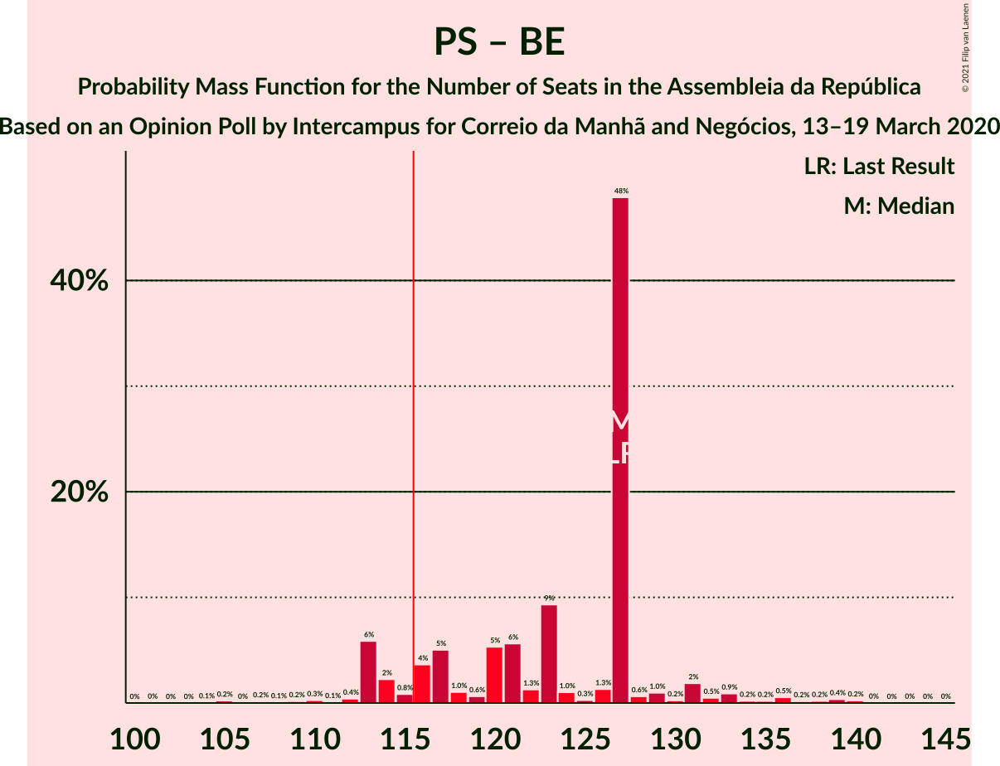

| Number of Seats | Probability | Accumulated | Special Marks |
|:---------------:|:-----------:|:-----------:|:-------------:|
| 104 | 0.1% | 100% |  |
| 105 | 0.2% | 99.9% |  |
| 106 | 0% | 99.7% |  |
| 107 | 0.2% | 99.6% |  |
| 108 | 0.1% | 99.5% |  |
| 109 | 0.2% | 99.4% |  |
| 110 | 0.3% | 99.2% |  |
| 111 | 0.1% | 99.0% |  |
| 112 | 0.4% | 98.9% |  |
| 113 | 6% | 98% |  |
| 114 | 2% | 93% |  |
| 115 | 0.8% | 90% |  |
| 116 | 4% | 90% | Majority |
| 117 | 5% | 86% |  |
| 118 | 1.0% | 81% |  |
| 119 | 0.6% | 80% |  |
| 120 | 5% | 79% |  |
| 121 | 6% | 74% |  |
| 122 | 1.3% | 68% |  |
| 123 | 9% | 67% |  |
| 124 | 1.0% | 58% |  |
| 125 | 0.3% | 57% |  |
| 126 | 1.3% | 56% |  |
| 127 | 48% | 55% | Last Result, Median |
| 128 | 0.6% | 7% |  |
| 129 | 1.0% | 6% |  |
| 130 | 0.2% | 6% |  |
| 131 | 2% | 5% |  |
| 132 | 0.5% | 3% |  |
| 133 | 0.9% | 3% |  |
| 134 | 0.2% | 2% |  |
| 135 | 0.2% | 2% |  |
| 136 | 0.5% | 2% |  |
| 137 | 0.2% | 1.1% |  |
| 138 | 0.2% | 0.9% |  |
| 139 | 0.4% | 0.7% |  |
| 140 | 0.2% | 0.4% |  |
| 141 | 0% | 0.1% |  |
| 142 | 0% | 0.1% |  |
| 143 | 0% | 0.1% |  |
| 144 | 0% | 0.1% |  |
| 145 | 0% | 0% |  |

### Partido Socialista – Coligação Democrática Unitária

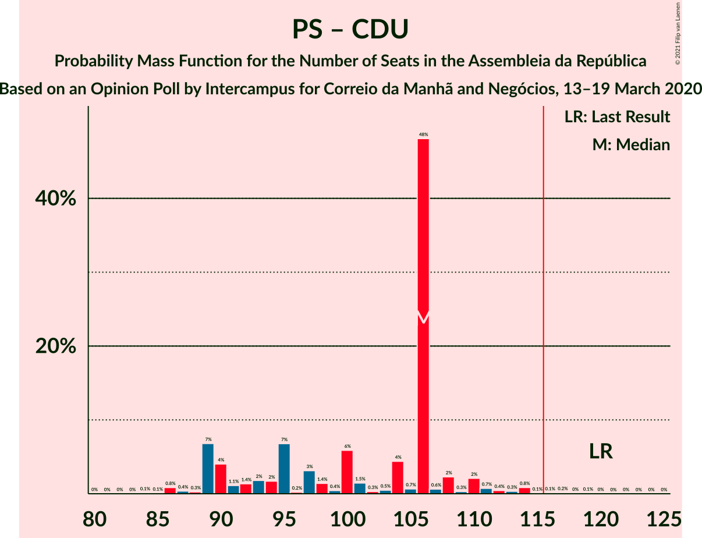

| Number of Seats | Probability | Accumulated | Special Marks |
|:---------------:|:-----------:|:-----------:|:-------------:|
| 82 | 0% | 100% |  |
| 83 | 0% | 99.9% |  |
| 84 | 0.1% | 99.9% |  |
| 85 | 0.1% | 99.8% |  |
| 86 | 0.8% | 99.7% |  |
| 87 | 0.4% | 98.9% |  |
| 88 | 0.3% | 98.5% |  |
| 89 | 7% | 98% |  |
| 90 | 4% | 91% |  |
| 91 | 1.1% | 87% |  |
| 92 | 1.4% | 86% |  |
| 93 | 2% | 85% |  |
| 94 | 2% | 83% |  |
| 95 | 7% | 81% |  |
| 96 | 0.2% | 75% |  |
| 97 | 3% | 74% |  |
| 98 | 1.4% | 71% |  |
| 99 | 0.4% | 70% |  |
| 100 | 6% | 69% |  |
| 101 | 1.5% | 64% |  |
| 102 | 0.3% | 62% |  |
| 103 | 0.5% | 62% |  |
| 104 | 4% | 61% |  |
| 105 | 0.7% | 57% |  |
| 106 | 48% | 56% | Median |
| 107 | 0.6% | 8% |  |
| 108 | 2% | 8% |  |
| 109 | 0.3% | 5% |  |
| 110 | 2% | 5% |  |
| 111 | 0.7% | 3% |  |
| 112 | 0.4% | 2% |  |
| 113 | 0.3% | 2% |  |
| 114 | 0.8% | 1.4% |  |
| 115 | 0.1% | 0.5% |  |
| 116 | 0.1% | 0.4% | Majority |
| 117 | 0.2% | 0.3% |  |
| 118 | 0% | 0.2% |  |
| 119 | 0.1% | 0.1% |  |
| 120 | 0% | 0.1% | Last Result |
| 121 | 0% | 0% |  |

### Partido Socialista

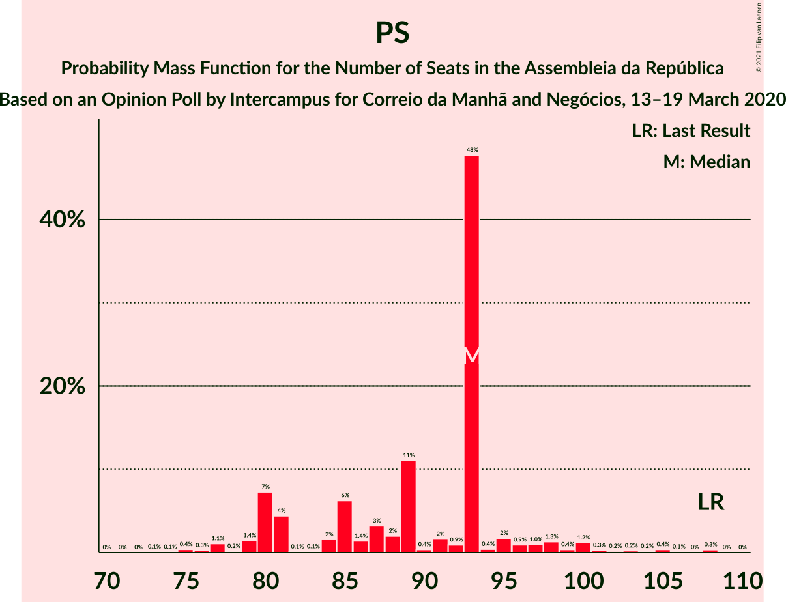

| Number of Seats | Probability | Accumulated | Special Marks |
|:---------------:|:-----------:|:-----------:|:-------------:|
| 72 | 0% | 100% |  |
| 73 | 0.1% | 99.9% |  |
| 74 | 0.1% | 99.9% |  |
| 75 | 0.4% | 99.8% |  |
| 76 | 0.3% | 99.4% |  |
| 77 | 1.1% | 99.2% |  |
| 78 | 0.2% | 98% |  |
| 79 | 1.4% | 98% |  |
| 80 | 7% | 96% |  |
| 81 | 4% | 89% |  |
| 82 | 0.1% | 85% |  |
| 83 | 0.1% | 85% |  |
| 84 | 2% | 85% |  |
| 85 | 6% | 83% |  |
| 86 | 1.4% | 77% |  |
| 87 | 3% | 75% |  |
| 88 | 2% | 72% |  |
| 89 | 11% | 70% |  |
| 90 | 0.4% | 59% |  |
| 91 | 2% | 59% |  |
| 92 | 0.9% | 57% |  |
| 93 | 48% | 56% | Median |
| 94 | 0.4% | 9% |  |
| 95 | 2% | 8% |  |
| 96 | 0.9% | 6% |  |
| 97 | 1.0% | 5% |  |
| 98 | 1.3% | 5% |  |
| 99 | 0.4% | 3% |  |
| 100 | 1.2% | 3% |  |
| 101 | 0.3% | 2% |  |
| 102 | 0.2% | 1.4% |  |
| 103 | 0.2% | 1.2% |  |
| 104 | 0.2% | 1.0% |  |
| 105 | 0.4% | 0.9% |  |
| 106 | 0.1% | 0.5% |  |
| 107 | 0% | 0.4% |  |
| 108 | 0.3% | 0.4% | Last Result |
| 109 | 0% | 0.1% |  |
| 110 | 0% | 0% |  |

### Partido Social Democrata – CDS–Partido Popular

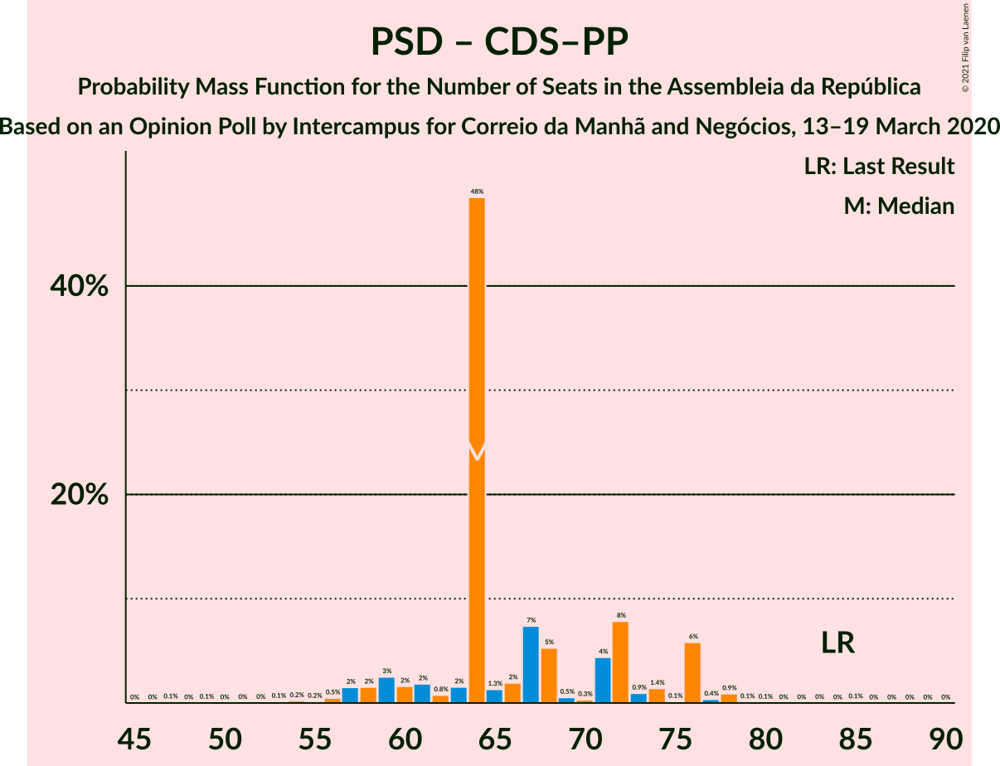

| Number of Seats | Probability | Accumulated | Special Marks |
|:---------------:|:-----------:|:-----------:|:-------------:|
| 47 | 0.1% | 100% |  |
| 48 | 0% | 99.9% |  |
| 49 | 0.1% | 99.9% |  |
| 50 | 0% | 99.8% |  |
| 51 | 0% | 99.8% |  |
| 52 | 0% | 99.8% |  |
| 53 | 0.1% | 99.7% |  |
| 54 | 0.2% | 99.6% |  |
| 55 | 0.2% | 99.3% |  |
| 56 | 0.5% | 99.2% |  |
| 57 | 2% | 98.7% |  |
| 58 | 2% | 97% |  |
| 59 | 3% | 96% |  |
| 60 | 2% | 93% |  |
| 61 | 2% | 92% |  |
| 62 | 0.8% | 90% |  |
| 63 | 2% | 89% |  |
| 64 | 48% | 87% | Median |
| 65 | 1.3% | 39% |  |
| 66 | 2% | 38% |  |
| 67 | 7% | 36% |  |
| 68 | 5% | 28% |  |
| 69 | 0.5% | 23% |  |
| 70 | 0.3% | 22% |  |
| 71 | 4% | 22% |  |
| 72 | 8% | 18% |  |
| 73 | 0.9% | 10% |  |
| 74 | 1.4% | 9% |  |
| 75 | 0.1% | 8% |  |
| 76 | 6% | 7% |  |
| 77 | 0.4% | 2% |  |
| 78 | 0.9% | 1.3% |  |
| 79 | 0.1% | 0.4% |  |
| 80 | 0.1% | 0.2% |  |
| 81 | 0% | 0.2% |  |
| 82 | 0% | 0.2% |  |
| 83 | 0% | 0.2% |  |
| 84 | 0% | 0.1% | Last Result |
| 85 | 0.1% | 0.1% |  |
| 86 | 0% | 0% |  |

## Technical Information

### Opinion Poll

+ **Polling firm:** Intercampus
+ **Commissioner(s):** Correio da Manhã and Negócios
+ **Fieldwork period:** 13–19 March 2020

### Calculations

+ **Sample size:** 611
+ **Simulations done:** 131,072
+ **Error estimate:** 2.79%

