# Opinion Poll by Pitagórica for Jornal de Notícias, 13–21 March 2020

<a href="#voting-intentions">Voting Intentions</a> | <a href="#seats">Seats</a> | <a href="#coalitions">Coalitions</a> | <a href="#technical-information">Technical Information</a>

## Voting Intentions

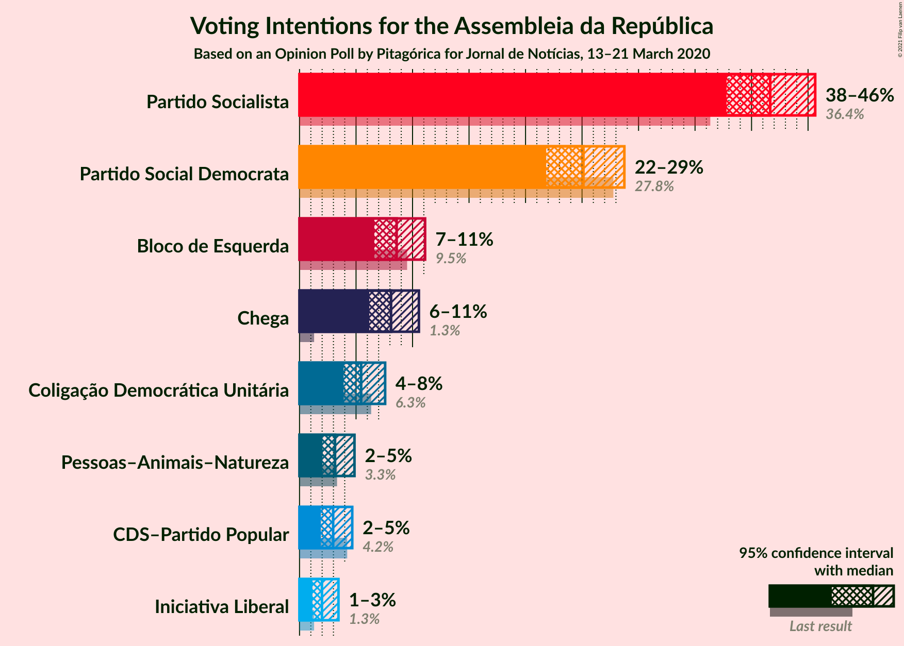

### Confidence Intervals

| Party | Last Result | Poll Result | 80% Confidence Interval | 90% Confidence Interval | 95% Confidence Interval | 99% Confidence Interval |
|:-----:|:-----------:|:-----------:|:-----------------------:|:-----------------------:|:-----------------------:|:-----------------------:|
| Partido Socialista | 36.4% | 41.7% | 39.1–44.3% |38.4–45.0% |37.8–45.6% |36.6–46.9% |
| Partido Social Democrata | 27.8% | 25.1% | 23.0–27.5% |22.3–28.2% |21.8–28.7% |20.8–29.9% |
| Bloco de Esquerda | 9.5% | 8.6% | 7.3–10.2% |6.9–10.7% |6.6–11.1% |6.0–11.9% |
| Chega | 1.3% | 8.1% | 6.8–9.7% |6.5–10.2% |6.2–10.6% |5.6–11.4% |
| Coligação Democrática Unitária | 6.3% | 5.5% | 4.4–6.8% |4.1–7.2% |3.9–7.6% |3.5–8.3% |
| Pessoas–Animais–Natureza | 3.3% | 3.1% | 2.4–4.3% |2.2–4.6% |2.0–4.9% |1.7–5.5% |
| CDS–Partido Popular | 4.2% | 3.0% | 2.3–4.1% |2.1–4.4% |1.9–4.7% |1.6–5.2% |
| Iniciativa Liberal | 1.3% | 2.0% | 1.4–2.9% |1.3–3.2% |1.1–3.4% |0.9–3.9% |

*Note:* The poll result column reflects the actual value used in the calculations. Published results may vary slightly, and in addition be rounded to fewer digits.

## Seats

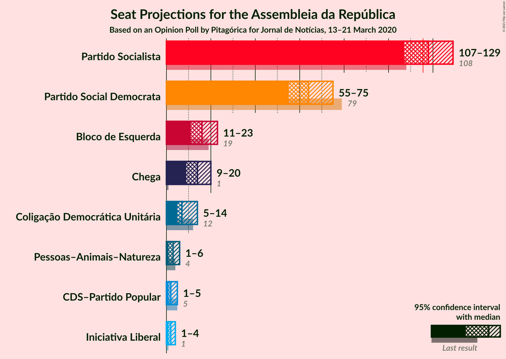

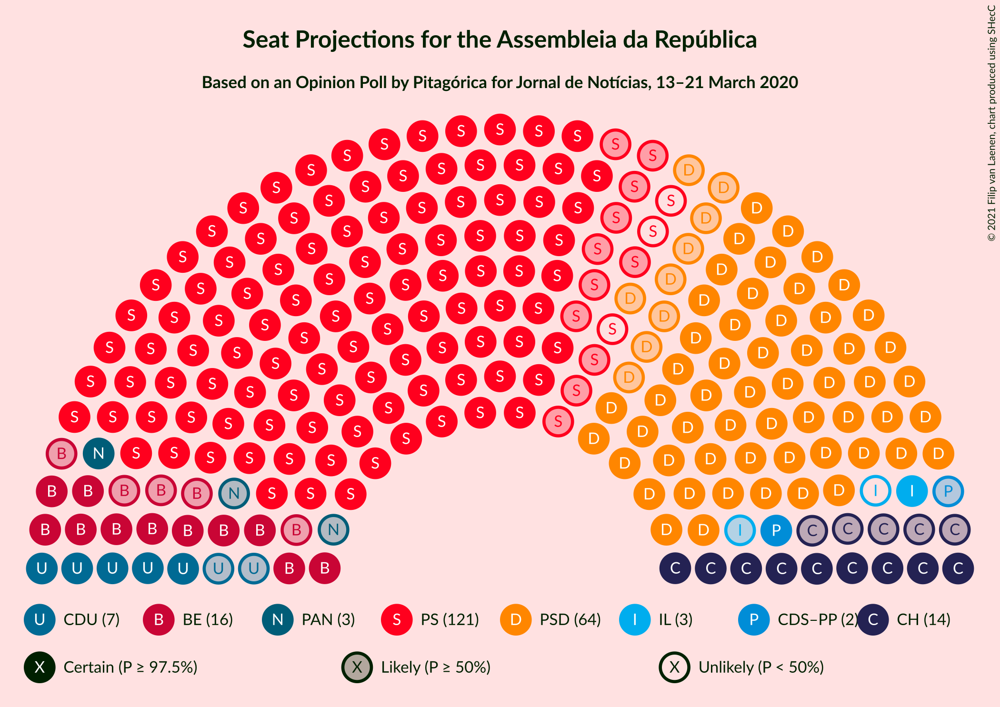

### Confidence Intervals

| Party | Last Result | Median | 80% Confidence Interval | 90% Confidence Interval | 95% Confidence Interval | 99% Confidence Interval |
|:-----:|:-----------:|:------:|:-----------------------:|:-----------------------:|:-----------------------:|:-----------------------:|
| <a href="#partido-socialista">Partido Socialista</a> | 108 | 118 | 111–125 |108–127 |107–129 |104–132 |
| <a href="#partido-social-democrata">Partido Social Democrata</a> | 79 | 64 | 59–72 |57–74 |55–75 |54–78 |
| <a href="#bloco-de-esquerda">Bloco de Esquerda</a> | 19 | 16 | 11–21 |11–21 |11–23 |8–23 |
| <a href="#chega">Chega</a> | 1 | 14 | 11–18 |11–18 |9–20 |8–23 |
| <a href="#coligação-democrática-unitária">Coligação Democrática Unitária</a> | 12 | 7 | 6–12 |5–13 |5–14 |4–16 |
| <a href="#pessoas–animais–natureza">Pessoas–Animais–Natureza</a> | 4 | 3 | 2–5 |2–5 |1–6 |1–8 |
| <a href="#cds–partido-popular">CDS–Partido Popular</a> | 5 | 2 | 2–4 |1–5 |1–5 |0–5 |
| <a href="#iniciativa-liberal">Iniciativa Liberal</a> | 1 | 2 | 1–3 |1–4 |1–4 |0–5 |

### Partido Socialista

*For a full overview of the results for this party, see the [Partido Socialista](party-partidosocialista.html) page.*

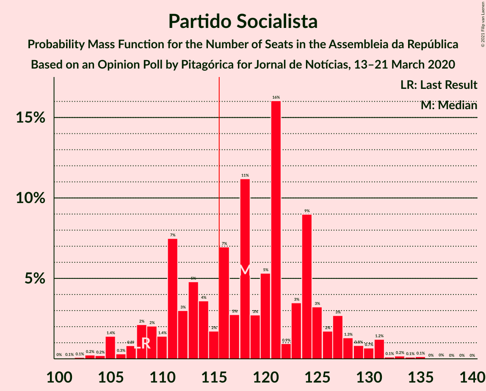

| Number of Seats | Probability | Accumulated | Special Marks |
|:---------------:|:-----------:|:-----------:|:-------------:|
| 100 | 0% | 100% |  |
| 101 | 0.1% | 99.9% |  |
| 102 | 0.1% | 99.9% |  |
| 103 | 0.2% | 99.8% |  |
| 104 | 0.2% | 99.5% |  |
| 105 | 1.4% | 99.3% |  |
| 106 | 0.3% | 98% |  |
| 107 | 0.8% | 98% |  |
| 108 | 2% | 97% | Last Result |
| 109 | 2% | 95% |  |
| 110 | 1.4% | 93% |  |
| 111 | 7% | 91% |  |
| 112 | 3% | 84% |  |
| 113 | 5% | 81% |  |
| 114 | 4% | 76% |  |
| 115 | 2% | 72% |  |
| 116 | 7% | 71% | Majority |
| 117 | 3% | 64% |  |
| 118 | 11% | 61% | Median |
| 119 | 3% | 50% |  |
| 120 | 5% | 47% |  |
| 121 | 16% | 42% |  |
| 122 | 0.9% | 26% |  |
| 123 | 3% | 25% |  |
| 124 | 9% | 21% |  |
| 125 | 3% | 12% |  |
| 126 | 2% | 9% |  |
| 127 | 3% | 7% |  |
| 128 | 1.3% | 5% |  |
| 129 | 0.8% | 3% |  |
| 130 | 0.7% | 2% |  |
| 131 | 1.2% | 2% |  |
| 132 | 0.1% | 0.6% |  |
| 133 | 0.2% | 0.5% |  |
| 134 | 0.1% | 0.3% |  |
| 135 | 0.1% | 0.2% |  |
| 136 | 0% | 0% |  |

### Partido Social Democrata

*For a full overview of the results for this party, see the [Partido Social Democrata](party-partidosocialdemocrata.html) page.*

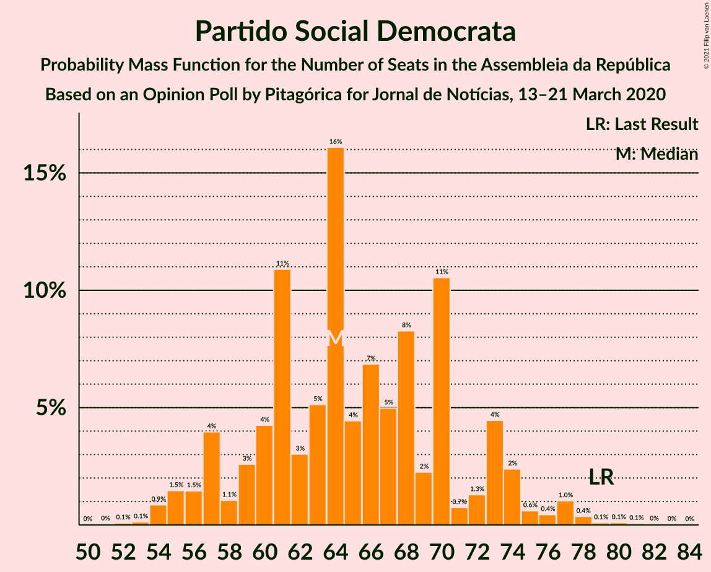

| Number of Seats | Probability | Accumulated | Special Marks |
|:---------------:|:-----------:|:-----------:|:-------------:|
| 51 | 0% | 100% |  |
| 52 | 0.1% | 99.9% |  |
| 53 | 0.1% | 99.9% |  |
| 54 | 0.9% | 99.7% |  |
| 55 | 1.5% | 98.9% |  |
| 56 | 1.5% | 97% |  |
| 57 | 4% | 96% |  |
| 58 | 1.1% | 92% |  |
| 59 | 3% | 91% |  |
| 60 | 4% | 88% |  |
| 61 | 11% | 84% |  |
| 62 | 3% | 73% |  |
| 63 | 5% | 70% |  |
| 64 | 16% | 65% | Median |
| 65 | 4% | 49% |  |
| 66 | 7% | 45% |  |
| 67 | 5% | 38% |  |
| 68 | 8% | 33% |  |
| 69 | 2% | 24% |  |
| 70 | 11% | 22% |  |
| 71 | 0.7% | 12% |  |
| 72 | 1.3% | 11% |  |
| 73 | 4% | 10% |  |
| 74 | 2% | 5% |  |
| 75 | 0.6% | 3% |  |
| 76 | 0.4% | 2% |  |
| 77 | 1.0% | 2% |  |
| 78 | 0.4% | 0.7% |  |
| 79 | 0.1% | 0.3% | Last Result |
| 80 | 0.1% | 0.2% |  |
| 81 | 0.1% | 0.1% |  |
| 82 | 0% | 0.1% |  |
| 83 | 0% | 0% |  |

### Bloco de Esquerda

*For a full overview of the results for this party, see the [Bloco de Esquerda](party-blocodeesquerda.html) page.*

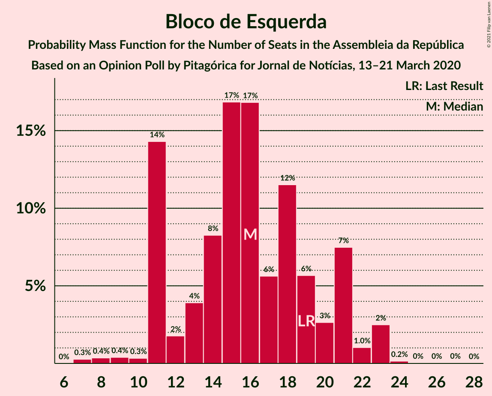

| Number of Seats | Probability | Accumulated | Special Marks |
|:---------------:|:-----------:|:-----------:|:-------------:|
| 7 | 0.3% | 100% |  |
| 8 | 0.4% | 99.7% |  |
| 9 | 0.4% | 99.4% |  |
| 10 | 0.3% | 99.0% |  |
| 11 | 14% | 98.6% |  |
| 12 | 2% | 84% |  |
| 13 | 4% | 83% |  |
| 14 | 8% | 79% |  |
| 15 | 17% | 70% |  |
| 16 | 17% | 54% | Median |
| 17 | 6% | 37% |  |
| 18 | 12% | 31% |  |
| 19 | 6% | 20% | Last Result |
| 20 | 3% | 14% |  |
| 21 | 7% | 11% |  |
| 22 | 1.0% | 4% |  |
| 23 | 2% | 3% |  |
| 24 | 0.2% | 0.3% |  |
| 25 | 0% | 0.1% |  |
| 26 | 0% | 0.1% |  |
| 27 | 0% | 0.1% |  |
| 28 | 0% | 0% |  |

### Chega

*For a full overview of the results for this party, see the [Chega](party-chega.html) page.*

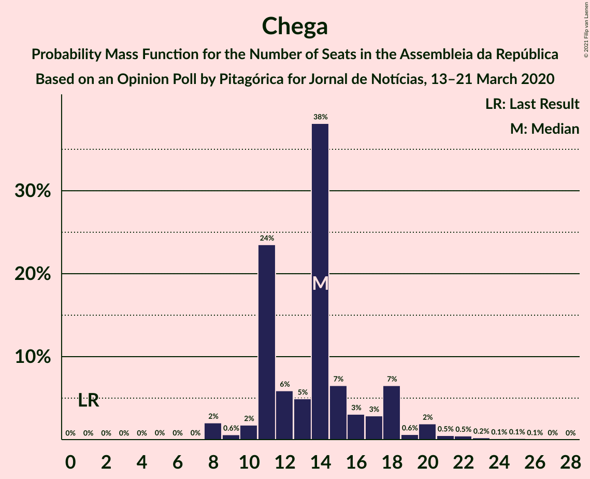

| Number of Seats | Probability | Accumulated | Special Marks |
|:---------------:|:-----------:|:-----------:|:-------------:|
| 1 | 0% | 100% | Last Result |
| 2 | 0% | 100% |  |
| 3 | 0% | 100% |  |
| 4 | 0% | 100% |  |
| 5 | 0% | 100% |  |
| 6 | 0% | 100% |  |
| 7 | 0% | 100% |  |
| 8 | 2% | 99.9% |  |
| 9 | 0.6% | 98% |  |
| 10 | 2% | 97% |  |
| 11 | 24% | 96% |  |
| 12 | 6% | 72% |  |
| 13 | 5% | 66% |  |
| 14 | 38% | 61% | Median |
| 15 | 7% | 23% |  |
| 16 | 3% | 17% |  |
| 17 | 3% | 13% |  |
| 18 | 7% | 11% |  |
| 19 | 0.6% | 4% |  |
| 20 | 2% | 3% |  |
| 21 | 0.5% | 2% |  |
| 22 | 0.5% | 1.1% |  |
| 23 | 0.2% | 0.6% |  |
| 24 | 0.1% | 0.4% |  |
| 25 | 0.1% | 0.3% |  |
| 26 | 0.1% | 0.1% |  |
| 27 | 0% | 0.1% |  |
| 28 | 0% | 0% |  |

### Coligação Democrática Unitária

*For a full overview of the results for this party, see the [Coligação Democrática Unitária](party-coligaçãodemocráticaunitária.html) page.*

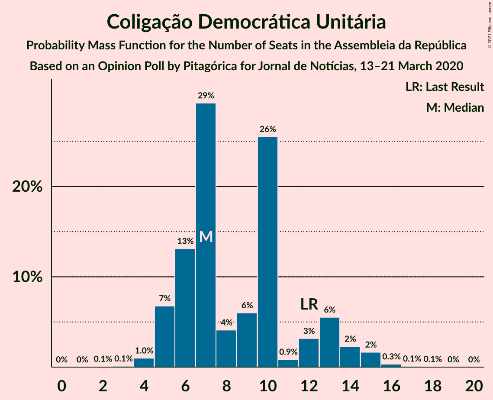

| Number of Seats | Probability | Accumulated | Special Marks |
|:---------------:|:-----------:|:-----------:|:-------------:|
| 2 | 0.1% | 100% |  |
| 3 | 0.1% | 99.9% |  |
| 4 | 1.0% | 99.8% |  |
| 5 | 7% | 98.8% |  |
| 6 | 13% | 92% |  |
| 7 | 29% | 79% | Median |
| 8 | 4% | 50% |  |
| 9 | 6% | 46% |  |
| 10 | 26% | 40% |  |
| 11 | 0.9% | 14% |  |
| 12 | 3% | 13% | Last Result |
| 13 | 6% | 10% |  |
| 14 | 2% | 4% |  |
| 15 | 2% | 2% |  |
| 16 | 0.3% | 0.5% |  |
| 17 | 0.1% | 0.2% |  |
| 18 | 0.1% | 0.1% |  |
| 19 | 0% | 0% |  |

### Pessoas–Animais–Natureza

*For a full overview of the results for this party, see the [Pessoas–Animais–Natureza](party-pessoas–animais–natureza.html) page.*

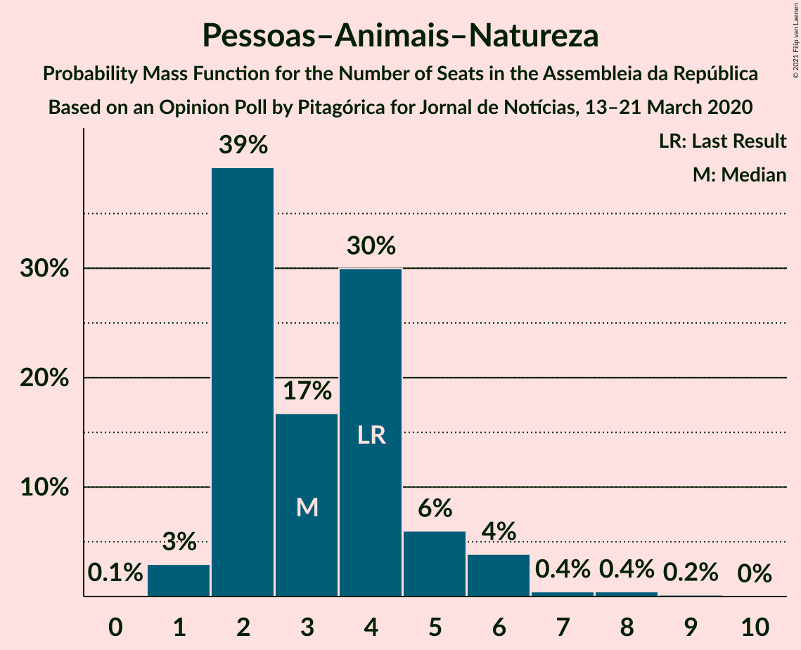

| Number of Seats | Probability | Accumulated | Special Marks |
|:---------------:|:-----------:|:-----------:|:-------------:|
| 0 | 0.1% | 100% |  |
| 1 | 3% | 99.9% |  |
| 2 | 39% | 97% |  |
| 3 | 17% | 58% | Median |
| 4 | 30% | 41% | Last Result |
| 5 | 6% | 11% |  |
| 6 | 4% | 5% |  |
| 7 | 0.4% | 1.1% |  |
| 8 | 0.4% | 0.6% |  |
| 9 | 0.2% | 0.2% |  |
| 10 | 0% | 0% |  |

### CDS–Partido Popular

*For a full overview of the results for this party, see the [CDS–Partido Popular](party-cds–partidopopular.html) page.*

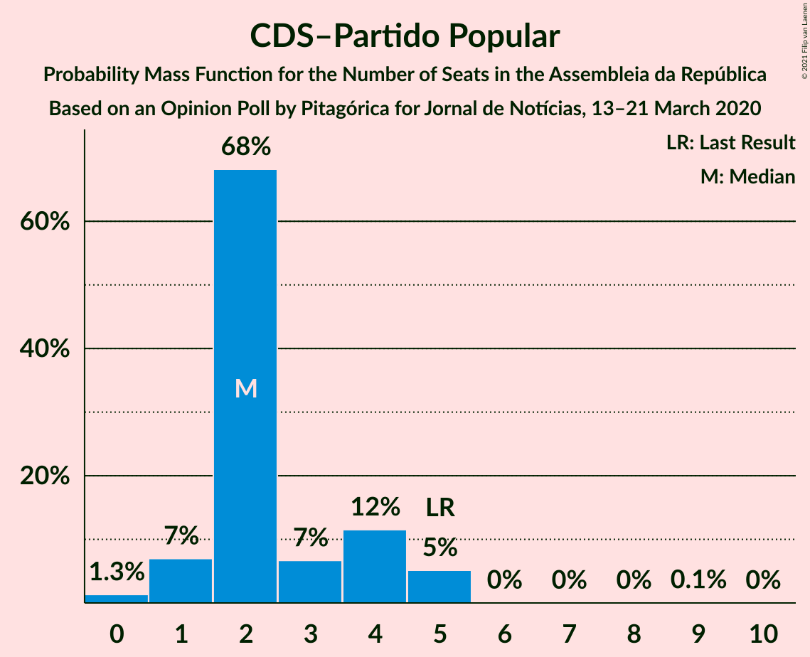

| Number of Seats | Probability | Accumulated | Special Marks |
|:---------------:|:-----------:|:-----------:|:-------------:|
| 0 | 1.3% | 100% |  |
| 1 | 7% | 98.7% |  |
| 2 | 68% | 92% | Median |
| 3 | 7% | 24% |  |
| 4 | 12% | 17% |  |
| 5 | 5% | 5% | Last Result |
| 6 | 0% | 0.2% |  |
| 7 | 0% | 0.1% |  |
| 8 | 0% | 0.1% |  |
| 9 | 0.1% | 0.1% |  |
| 10 | 0% | 0% |  |

### Iniciativa Liberal

*For a full overview of the results for this party, see the [Iniciativa Liberal](party-iniciativaliberal.html) page.*

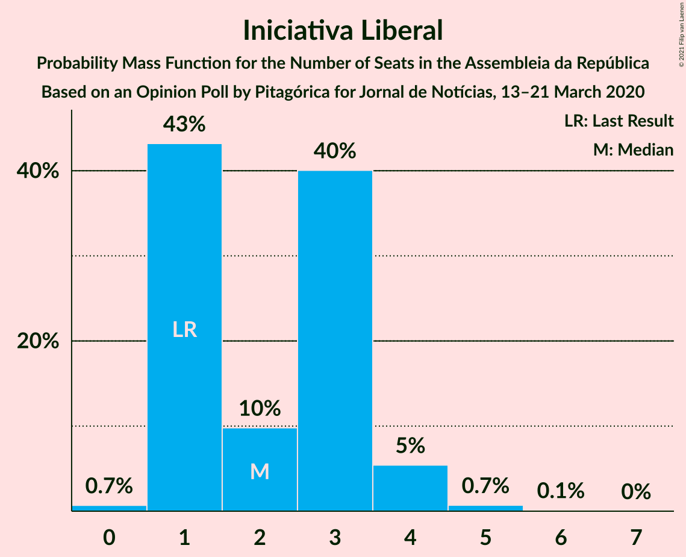

| Number of Seats | Probability | Accumulated | Special Marks |
|:---------------:|:-----------:|:-----------:|:-------------:|
| 0 | 0.7% | 100% |  |
| 1 | 43% | 99.3% | Last Result |
| 2 | 10% | 56% | Median |
| 3 | 40% | 46% |  |
| 4 | 5% | 6% |  |
| 5 | 0.7% | 0.8% |  |
| 6 | 0.1% | 0.1% |  |
| 7 | 0% | 0% |  |

## Coalitions

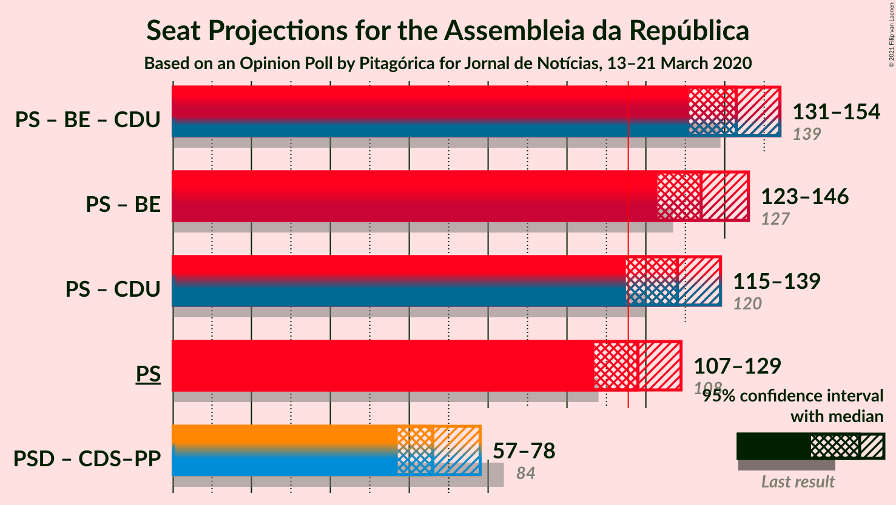

### Confidence Intervals

| Coalition | Last Result | Median | Majority? | 80% Confidence Interval | 90% Confidence Interval | 95% Confidence Interval | 99% Confidence Interval |
|:---------:|:-----------:|:------:|:---------:|:-----------------------:|:-----------------------:|:-----------------------:|:-----------------------:|
| Partido Socialista – Bloco de Esquerda – Coligação Democrática Unitária | 139 | 143 | 100% | 136–149 | 133–152 | 131–154 | 128–156 |
| Partido Socialista – Bloco de Esquerda | 127 | 134 | 100% | 127–142 | 126–144 | 123–146 | 120–148 |
| Partido Socialista – Coligação Democrática Unitária | 120 | 128 | 96% | 118–132 | 117–136 | 115–139 | 112–141 |
| Partido Socialista | 108 | 118 | 71% | 111–125 | 108–127 | 107–129 | 104–132 |
| Partido Social Democrata – CDS–Partido Popular | 84 | 66 | 0% | 61–75 | 59–77 | 57–78 | 56–81 |

### Partido Socialista – Bloco de Esquerda – Coligação Democrática Unitária

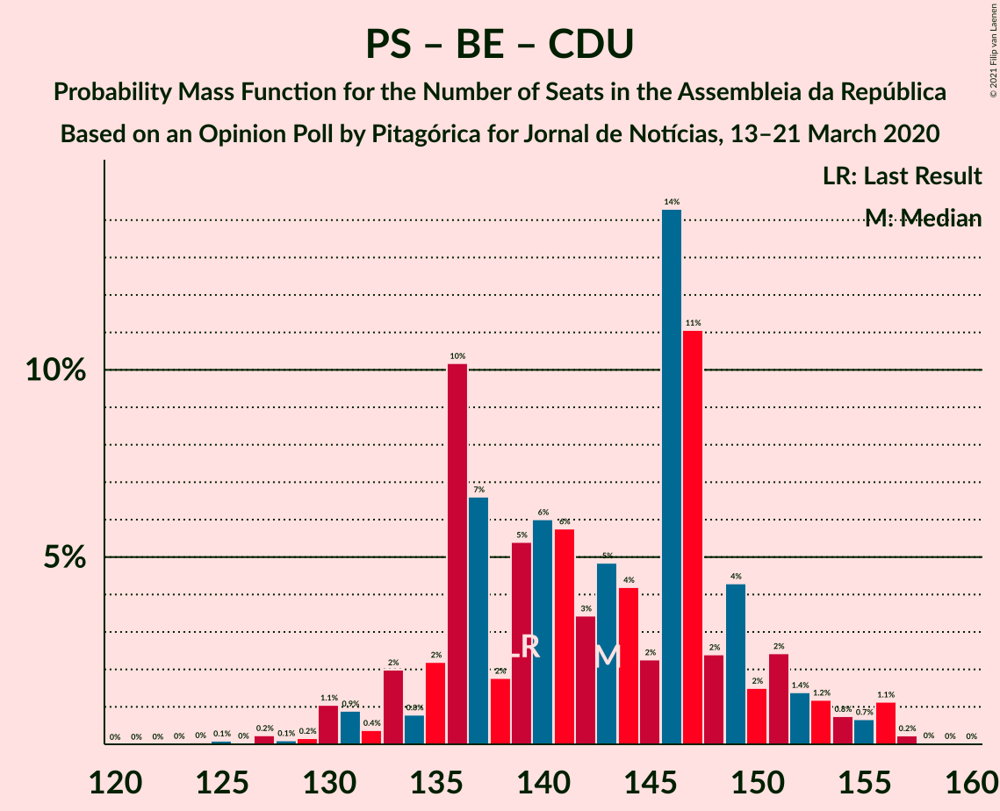

| Number of Seats | Probability | Accumulated | Special Marks |
|:---------------:|:-----------:|:-----------:|:-------------:|
| 123 | 0% | 100% |  |
| 124 | 0% | 99.9% |  |
| 125 | 0.1% | 99.9% |  |
| 126 | 0% | 99.8% |  |
| 127 | 0.2% | 99.8% |  |
| 128 | 0.1% | 99.5% |  |
| 129 | 0.2% | 99.4% |  |
| 130 | 1.1% | 99.3% |  |
| 131 | 0.9% | 98% |  |
| 132 | 0.4% | 97% |  |
| 133 | 2% | 97% |  |
| 134 | 0.8% | 95% |  |
| 135 | 2% | 94% |  |
| 136 | 10% | 92% |  |
| 137 | 7% | 82% |  |
| 138 | 2% | 75% |  |
| 139 | 5% | 73% | Last Result |
| 140 | 6% | 68% |  |
| 141 | 6% | 62% | Median |
| 142 | 3% | 56% |  |
| 143 | 5% | 53% |  |
| 144 | 4% | 48% |  |
| 145 | 2% | 44% |  |
| 146 | 14% | 41% |  |
| 147 | 11% | 27% |  |
| 148 | 2% | 16% |  |
| 149 | 4% | 14% |  |
| 150 | 2% | 9% |  |
| 151 | 2% | 8% |  |
| 152 | 1.4% | 5% |  |
| 153 | 1.2% | 4% |  |
| 154 | 0.8% | 3% |  |
| 155 | 0.7% | 2% |  |
| 156 | 1.1% | 1.5% |  |
| 157 | 0.2% | 0.3% |  |
| 158 | 0% | 0.1% |  |
| 159 | 0% | 0.1% |  |
| 160 | 0% | 0% |  |

### Partido Socialista – Bloco de Esquerda

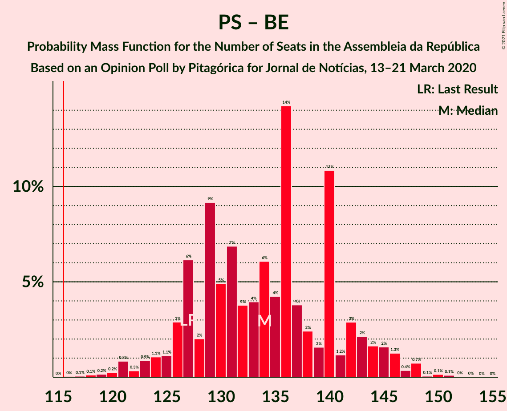

| Number of Seats | Probability | Accumulated | Special Marks |
|:---------------:|:-----------:|:-----------:|:-------------:|
| 116 | 0% | 100% | Majority |
| 117 | 0.1% | 99.9% |  |
| 118 | 0.1% | 99.8% |  |
| 119 | 0.2% | 99.7% |  |
| 120 | 0.2% | 99.6% |  |
| 121 | 0.8% | 99.3% |  |
| 122 | 0.3% | 98% |  |
| 123 | 0.9% | 98% |  |
| 124 | 1.1% | 97% |  |
| 125 | 1.1% | 96% |  |
| 126 | 3% | 95% |  |
| 127 | 6% | 92% | Last Result |
| 128 | 2% | 86% |  |
| 129 | 9% | 84% |  |
| 130 | 5% | 75% |  |
| 131 | 7% | 70% |  |
| 132 | 4% | 63% |  |
| 133 | 4% | 59% |  |
| 134 | 6% | 55% | Median |
| 135 | 4% | 49% |  |
| 136 | 14% | 45% |  |
| 137 | 4% | 31% |  |
| 138 | 2% | 27% |  |
| 139 | 2% | 25% |  |
| 140 | 11% | 23% |  |
| 141 | 1.2% | 12% |  |
| 142 | 3% | 11% |  |
| 143 | 2% | 8% |  |
| 144 | 2% | 6% |  |
| 145 | 2% | 4% |  |
| 146 | 1.3% | 3% |  |
| 147 | 0.4% | 1.5% |  |
| 148 | 0.7% | 1.1% |  |
| 149 | 0.1% | 0.4% |  |
| 150 | 0.1% | 0.3% |  |
| 151 | 0.1% | 0.2% |  |
| 152 | 0% | 0.1% |  |
| 153 | 0% | 0% |  |

### Partido Socialista – Coligação Democrática Unitária

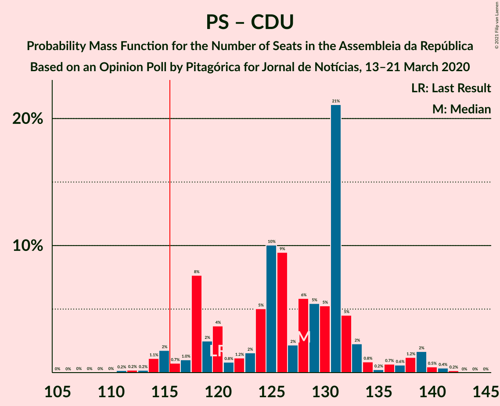

| Number of Seats | Probability | Accumulated | Special Marks |
|:---------------:|:-----------:|:-----------:|:-------------:|
| 107 | 0% | 100% |  |
| 108 | 0% | 99.9% |  |
| 109 | 0% | 99.9% |  |
| 110 | 0% | 99.9% |  |
| 111 | 0.2% | 99.8% |  |
| 112 | 0.2% | 99.7% |  |
| 113 | 0.2% | 99.5% |  |
| 114 | 1.1% | 99.3% |  |
| 115 | 2% | 98% |  |
| 116 | 0.7% | 96% | Majority |
| 117 | 1.0% | 96% |  |
| 118 | 8% | 95% |  |
| 119 | 2% | 87% |  |
| 120 | 4% | 85% | Last Result |
| 121 | 0.8% | 81% |  |
| 122 | 1.2% | 80% |  |
| 123 | 2% | 79% |  |
| 124 | 5% | 77% |  |
| 125 | 10% | 72% | Median |
| 126 | 9% | 62% |  |
| 127 | 2% | 53% |  |
| 128 | 6% | 51% |  |
| 129 | 5% | 45% |  |
| 130 | 5% | 39% |  |
| 131 | 21% | 34% |  |
| 132 | 5% | 13% |  |
| 133 | 2% | 8% |  |
| 134 | 0.8% | 6% |  |
| 135 | 0.2% | 5% |  |
| 136 | 0.7% | 5% |  |
| 137 | 0.6% | 4% |  |
| 138 | 1.2% | 4% |  |
| 139 | 2% | 3% |  |
| 140 | 0.5% | 1.0% |  |
| 141 | 0.4% | 0.5% |  |
| 142 | 0.2% | 0.2% |  |
| 143 | 0% | 0% |  |

### Partido Socialista

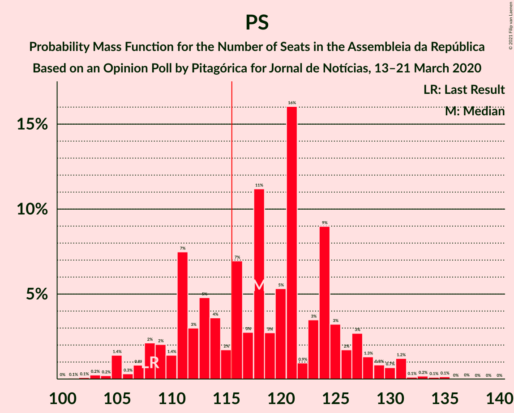

| Number of Seats | Probability | Accumulated | Special Marks |
|:---------------:|:-----------:|:-----------:|:-------------:|
| 100 | 0% | 100% |  |
| 101 | 0.1% | 99.9% |  |
| 102 | 0.1% | 99.9% |  |
| 103 | 0.2% | 99.8% |  |
| 104 | 0.2% | 99.5% |  |
| 105 | 1.4% | 99.3% |  |
| 106 | 0.3% | 98% |  |
| 107 | 0.8% | 98% |  |
| 108 | 2% | 97% | Last Result |
| 109 | 2% | 95% |  |
| 110 | 1.4% | 93% |  |
| 111 | 7% | 91% |  |
| 112 | 3% | 84% |  |
| 113 | 5% | 81% |  |
| 114 | 4% | 76% |  |
| 115 | 2% | 72% |  |
| 116 | 7% | 71% | Majority |
| 117 | 3% | 64% |  |
| 118 | 11% | 61% | Median |
| 119 | 3% | 50% |  |
| 120 | 5% | 47% |  |
| 121 | 16% | 42% |  |
| 122 | 0.9% | 26% |  |
| 123 | 3% | 25% |  |
| 124 | 9% | 21% |  |
| 125 | 3% | 12% |  |
| 126 | 2% | 9% |  |
| 127 | 3% | 7% |  |
| 128 | 1.3% | 5% |  |
| 129 | 0.8% | 3% |  |
| 130 | 0.7% | 2% |  |
| 131 | 1.2% | 2% |  |
| 132 | 0.1% | 0.6% |  |
| 133 | 0.2% | 0.5% |  |
| 134 | 0.1% | 0.3% |  |
| 135 | 0.1% | 0.2% |  |
| 136 | 0% | 0% |  |

### Partido Social Democrata – CDS–Partido Popular

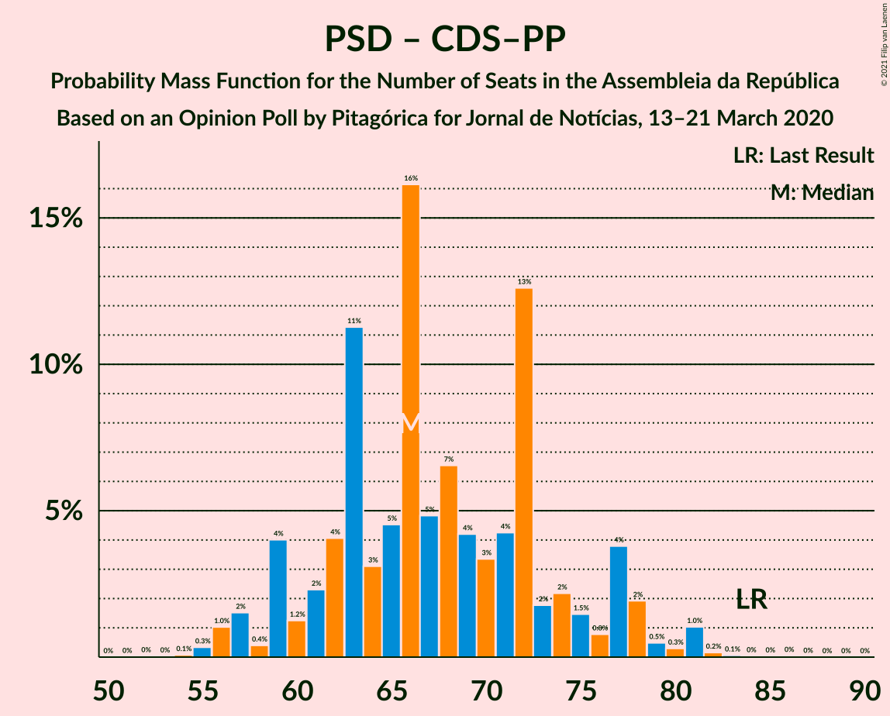

| Number of Seats | Probability | Accumulated | Special Marks |
|:---------------:|:-----------:|:-----------:|:-------------:|
| 52 | 0% | 100% |  |
| 53 | 0% | 99.9% |  |
| 54 | 0.1% | 99.9% |  |
| 55 | 0.3% | 99.8% |  |
| 56 | 1.0% | 99.5% |  |
| 57 | 2% | 98% |  |
| 58 | 0.4% | 97% |  |
| 59 | 4% | 97% |  |
| 60 | 1.2% | 93% |  |
| 61 | 2% | 91% |  |
| 62 | 4% | 89% |  |
| 63 | 11% | 85% |  |
| 64 | 3% | 74% |  |
| 65 | 5% | 71% |  |
| 66 | 16% | 66% | Median |
| 67 | 5% | 50% |  |
| 68 | 7% | 45% |  |
| 69 | 4% | 39% |  |
| 70 | 3% | 34% |  |
| 71 | 4% | 31% |  |
| 72 | 13% | 27% |  |
| 73 | 2% | 14% |  |
| 74 | 2% | 12% |  |
| 75 | 1.5% | 10% |  |
| 76 | 0.8% | 9% |  |
| 77 | 4% | 8% |  |
| 78 | 2% | 4% |  |
| 79 | 0.5% | 2% |  |
| 80 | 0.3% | 2% |  |
| 81 | 1.0% | 1.4% |  |
| 82 | 0.2% | 0.4% |  |
| 83 | 0.1% | 0.2% |  |
| 84 | 0% | 0.1% | Last Result |
| 85 | 0% | 0.1% |  |
| 86 | 0% | 0.1% |  |
| 87 | 0% | 0% |  |

## Technical Information

### Opinion Poll

+ **Polling firm:** Pitagórica
+ **Commissioner(s):** Jornal de Notícias
+ **Fieldwork period:** 13–21 March 2020

### Calculations

+ **Sample size:** 605
+ **Simulations done:** 131,072
+ **Error estimate:** 3.80%

