# Opinion Poll by Eurosondagem, 29 March–2 April 2020

<a href="#voting-intentions">Voting Intentions</a> | <a href="#seats">Seats</a> | <a href="#coalitions">Coalitions</a> | <a href="#technical-information">Technical Information</a>

## Voting Intentions

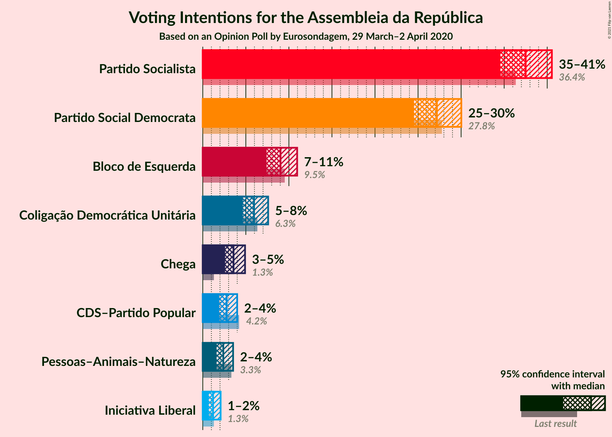

### Confidence Intervals

| Party | Last Result | Poll Result | 80% Confidence Interval | 90% Confidence Interval | 95% Confidence Interval | 99% Confidence Interval |
|:-----:|:-----------:|:-----------:|:-----------------------:|:-----------------------:|:-----------------------:|:-----------------------:|
| Partido Socialista | 36.4% | 37.5% | 35.6–39.5% |35.0–40.1% |34.6–40.5% |33.6–41.5% |
| Partido Social Democrata | 27.8% | 27.2% | 25.4–29.0% |25.0–29.6% |24.5–30.0% |23.7–30.9% |
| Bloco de Esquerda | 9.5% | 9.0% | 8.0–10.3% |7.7–10.7% |7.4–11.0% |6.9–11.6% |
| Coligação Democrática Unitária | 6.3% | 6.0% | 5.1–7.0% |4.8–7.3% |4.6–7.6% |4.3–8.1% |
| Chega | 1.3% | 3.6% | 2.9–4.5% |2.7–4.7% |2.6–4.9% |2.3–5.4% |
| CDS–Partido Popular | 4.2% | 2.8% | 2.2–3.6% |2.1–3.8% |1.9–4.0% |1.7–4.4% |
| Pessoas–Animais–Natureza | 3.3% | 2.4% | 1.9–3.1% |1.7–3.3% |1.6–3.5% |1.4–3.9% |
| Iniciativa Liberal | 1.3% | 1.2% | 0.9–1.8% |0.8–1.9% |0.7–2.1% |0.5–2.4% |

*Note:* The poll result column reflects the actual value used in the calculations. Published results may vary slightly, and in addition be rounded to fewer digits.

## Seats

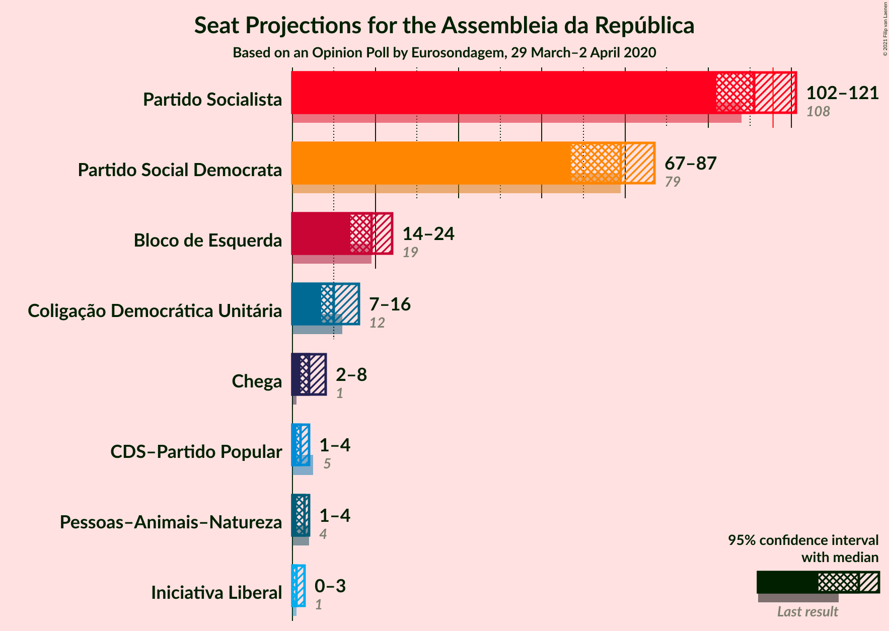

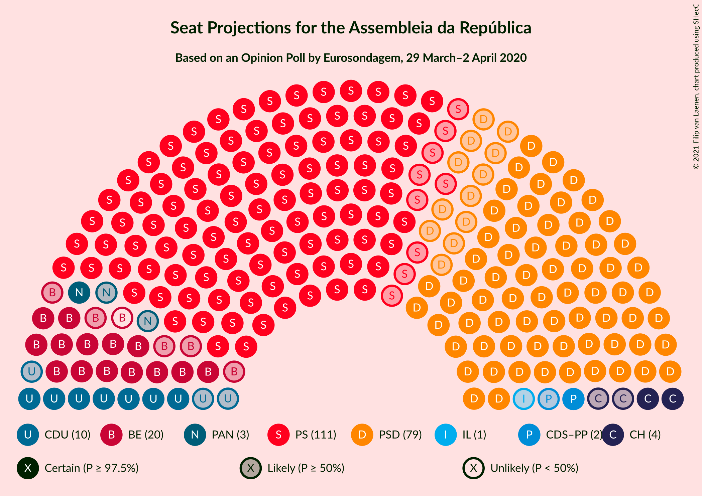

### Confidence Intervals

| Party | Last Result | Median | 80% Confidence Interval | 90% Confidence Interval | 95% Confidence Interval | 99% Confidence Interval |
|:-----:|:-----------:|:------:|:-----------------------:|:-----------------------:|:-----------------------:|:-----------------------:|
| <a href="#partido-socialista">Partido Socialista</a> | 108 | 111 | 106–118 |104–119 |102–121 |98–125 |
| <a href="#partido-social-democrata">Partido Social Democrata</a> | 79 | 79 | 72–83 |68–85 |67–87 |66–89 |
| <a href="#bloco-de-esquerda">Bloco de Esquerda</a> | 19 | 19 | 16–23 |15–23 |14–24 |14–26 |
| <a href="#coligação-democrática-unitária">Coligação Democrática Unitária</a> | 12 | 10 | 7–15 |7–16 |7–16 |6–17 |
| <a href="#chega">Chega</a> | 1 | 4 | 3–6 |2–7 |2–8 |2–8 |
| <a href="#cds–partido-popular">CDS–Partido Popular</a> | 5 | 2 | 1–4 |1–4 |1–4 |1–5 |
| <a href="#pessoas–animais–natureza">Pessoas–Animais–Natureza</a> | 4 | 3 | 1–4 |1–4 |1–4 |0–4 |
| <a href="#iniciativa-liberal">Iniciativa Liberal</a> | 1 | 1 | 0–1 |0–3 |0–3 |0–3 |

### Partido Socialista

*For a full overview of the results for this party, see the [Partido Socialista](party-partidosocialista.html) page.*

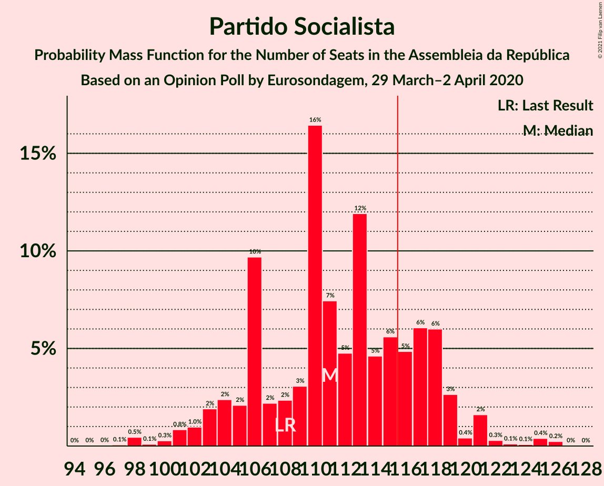

| Number of Seats | Probability | Accumulated | Special Marks |
|:---------------:|:-----------:|:-----------:|:-------------:|
| 94 | 0% | 100% |  |
| 95 | 0% | 99.9% |  |
| 96 | 0% | 99.9% |  |
| 97 | 0.1% | 99.9% |  |
| 98 | 0.5% | 99.8% |  |
| 99 | 0.1% | 99.4% |  |
| 100 | 0.3% | 99.3% |  |
| 101 | 0.8% | 99.0% |  |
| 102 | 1.0% | 98% |  |
| 103 | 2% | 97% |  |
| 104 | 2% | 95% |  |
| 105 | 2% | 93% |  |
| 106 | 10% | 91% |  |
| 107 | 2% | 81% |  |
| 108 | 2% | 79% | Last Result |
| 109 | 3% | 77% |  |
| 110 | 16% | 74% |  |
| 111 | 7% | 57% | Median |
| 112 | 5% | 50% |  |
| 113 | 12% | 45% |  |
| 114 | 5% | 33% |  |
| 115 | 6% | 28% |  |
| 116 | 5% | 23% | Majority |
| 117 | 6% | 18% |  |
| 118 | 6% | 12% |  |
| 119 | 3% | 6% |  |
| 120 | 0.4% | 3% |  |
| 121 | 2% | 3% |  |
| 122 | 0.3% | 1.2% |  |
| 123 | 0.1% | 0.9% |  |
| 124 | 0.1% | 0.8% |  |
| 125 | 0.4% | 0.7% |  |
| 126 | 0.2% | 0.3% |  |
| 127 | 0% | 0% |  |

### Partido Social Democrata

*For a full overview of the results for this party, see the [Partido Social Democrata](party-partidosocialdemocrata.html) page.*

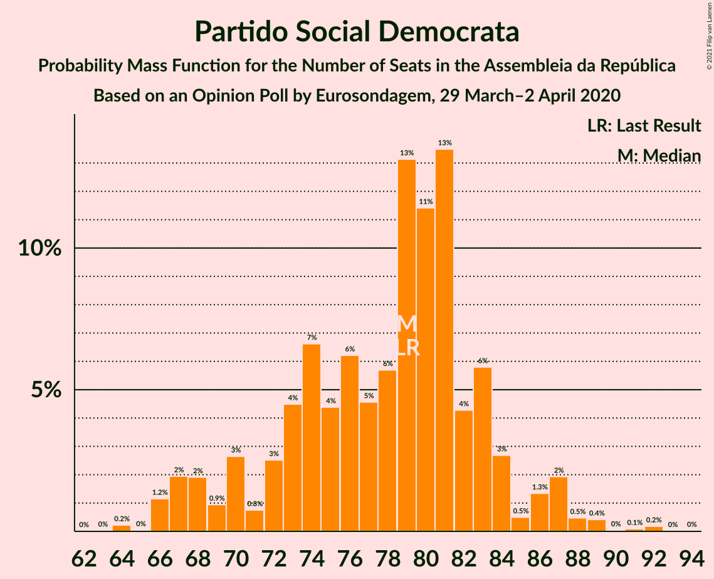

| Number of Seats | Probability | Accumulated | Special Marks |
|:---------------:|:-----------:|:-----------:|:-------------:|
| 63 | 0% | 100% |  |
| 64 | 0.2% | 99.9% |  |
| 65 | 0% | 99.7% |  |
| 66 | 1.2% | 99.7% |  |
| 67 | 2% | 98.5% |  |
| 68 | 2% | 97% |  |
| 69 | 0.9% | 95% |  |
| 70 | 3% | 94% |  |
| 71 | 0.8% | 91% |  |
| 72 | 3% | 90% |  |
| 73 | 4% | 88% |  |
| 74 | 7% | 83% |  |
| 75 | 4% | 77% |  |
| 76 | 6% | 72% |  |
| 77 | 5% | 66% |  |
| 78 | 6% | 62% |  |
| 79 | 13% | 56% | Last Result, Median |
| 80 | 11% | 43% |  |
| 81 | 13% | 31% |  |
| 82 | 4% | 18% |  |
| 83 | 6% | 14% |  |
| 84 | 3% | 8% |  |
| 85 | 0.5% | 5% |  |
| 86 | 1.3% | 5% |  |
| 87 | 2% | 3% |  |
| 88 | 0.5% | 1.3% |  |
| 89 | 0.4% | 0.8% |  |
| 90 | 0% | 0.4% |  |
| 91 | 0.1% | 0.3% |  |
| 92 | 0.2% | 0.2% |  |
| 93 | 0% | 0.1% |  |
| 94 | 0% | 0% |  |

### Bloco de Esquerda

*For a full overview of the results for this party, see the [Bloco de Esquerda](party-blocodeesquerda.html) page.*

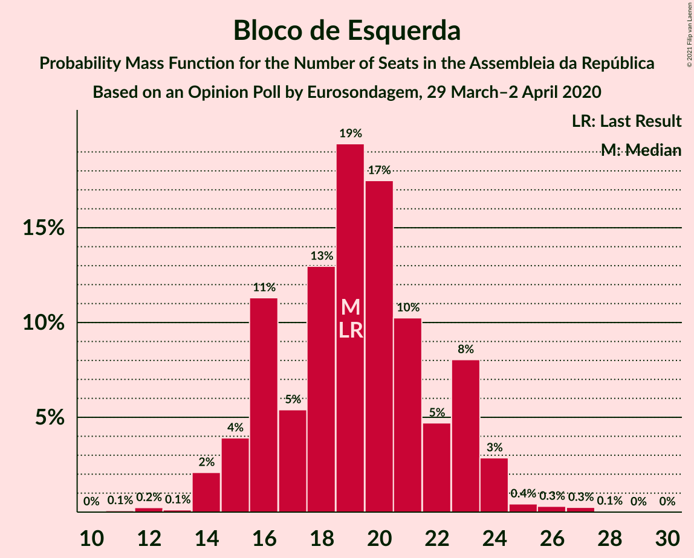

| Number of Seats | Probability | Accumulated | Special Marks |
|:---------------:|:-----------:|:-----------:|:-------------:|
| 11 | 0.1% | 100% |  |
| 12 | 0.2% | 99.9% |  |
| 13 | 0.1% | 99.7% |  |
| 14 | 2% | 99.5% |  |
| 15 | 4% | 97% |  |
| 16 | 11% | 94% |  |
| 17 | 5% | 82% |  |
| 18 | 13% | 77% |  |
| 19 | 19% | 64% | Last Result, Median |
| 20 | 17% | 44% |  |
| 21 | 10% | 27% |  |
| 22 | 5% | 17% |  |
| 23 | 8% | 12% |  |
| 24 | 3% | 4% |  |
| 25 | 0.4% | 1.1% |  |
| 26 | 0.3% | 0.6% |  |
| 27 | 0.3% | 0.3% |  |
| 28 | 0.1% | 0.1% |  |
| 29 | 0% | 0% |  |

### Coligação Democrática Unitária

*For a full overview of the results for this party, see the [Coligação Democrática Unitária](party-coligaçãodemocráticaunitária.html) page.*

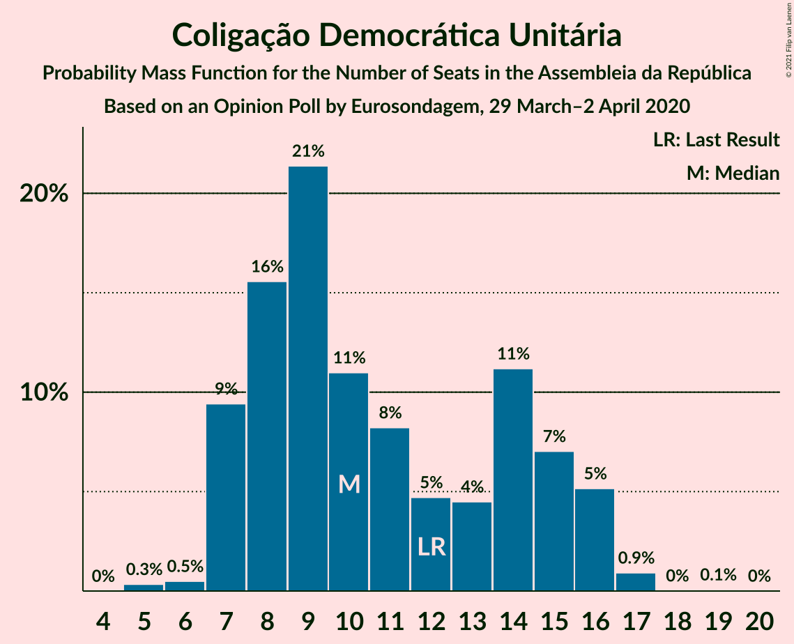

| Number of Seats | Probability | Accumulated | Special Marks |
|:---------------:|:-----------:|:-----------:|:-------------:|
| 5 | 0.3% | 100% |  |
| 6 | 0.5% | 99.7% |  |
| 7 | 9% | 99.2% |  |
| 8 | 16% | 90% |  |
| 9 | 21% | 74% |  |
| 10 | 11% | 53% | Median |
| 11 | 8% | 42% |  |
| 12 | 5% | 34% | Last Result |
| 13 | 4% | 29% |  |
| 14 | 11% | 24% |  |
| 15 | 7% | 13% |  |
| 16 | 5% | 6% |  |
| 17 | 0.9% | 1.0% |  |
| 18 | 0% | 0.1% |  |
| 19 | 0.1% | 0.1% |  |
| 20 | 0% | 0% |  |

### Chega

*For a full overview of the results for this party, see the [Chega](party-chega.html) page.*

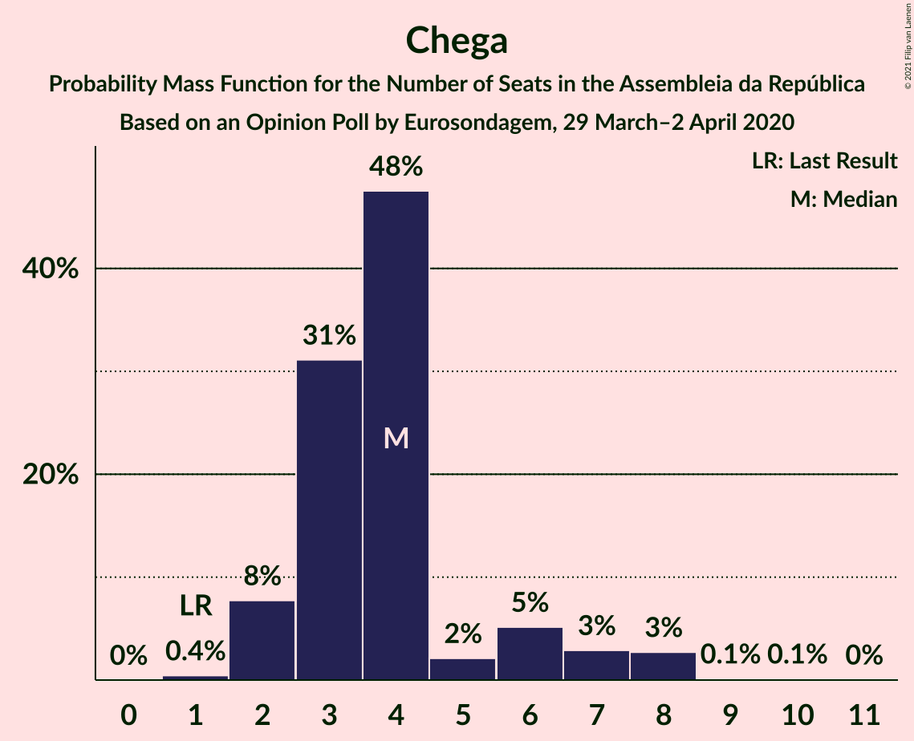

| Number of Seats | Probability | Accumulated | Special Marks |
|:---------------:|:-----------:|:-----------:|:-------------:|
| 1 | 0.4% | 100% | Last Result |
| 2 | 8% | 99.6% |  |
| 3 | 31% | 92% |  |
| 4 | 48% | 61% | Median |
| 5 | 2% | 13% |  |
| 6 | 5% | 11% |  |
| 7 | 3% | 6% |  |
| 8 | 3% | 3% |  |
| 9 | 0.1% | 0.3% |  |
| 10 | 0.1% | 0.2% |  |
| 11 | 0% | 0% |  |

### CDS–Partido Popular

*For a full overview of the results for this party, see the [CDS–Partido Popular](party-cds–partidopopular.html) page.*

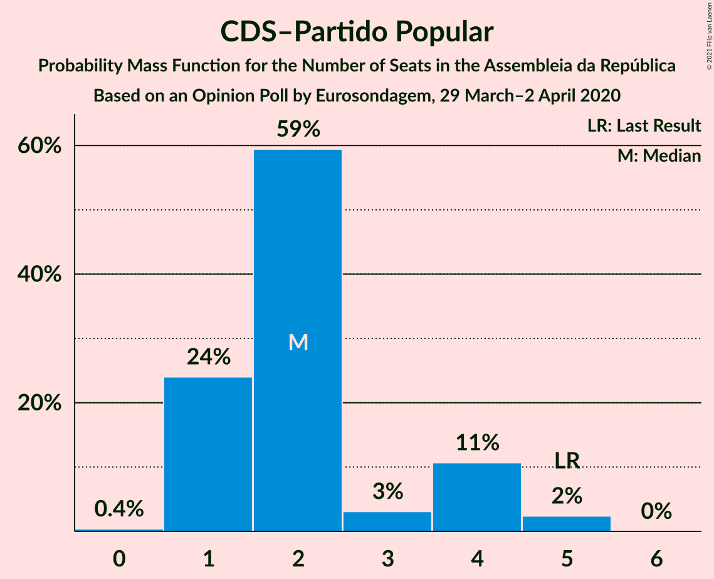

| Number of Seats | Probability | Accumulated | Special Marks |
|:---------------:|:-----------:|:-----------:|:-------------:|
| 0 | 0.4% | 100% |  |
| 1 | 24% | 99.6% |  |
| 2 | 59% | 76% | Median |
| 3 | 3% | 16% |  |
| 4 | 11% | 13% |  |
| 5 | 2% | 2% | Last Result |
| 6 | 0% | 0% |  |

### Pessoas–Animais–Natureza

*For a full overview of the results for this party, see the [Pessoas–Animais–Natureza](party-pessoas–animais–natureza.html) page.*

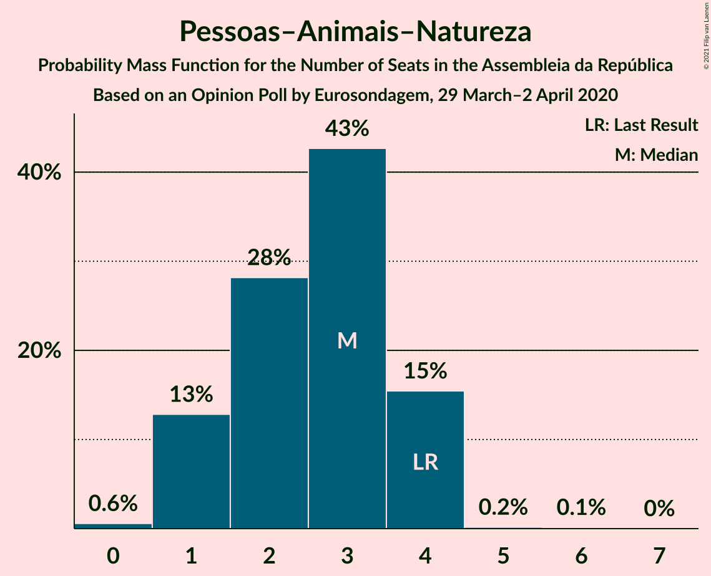

| Number of Seats | Probability | Accumulated | Special Marks |
|:---------------:|:-----------:|:-----------:|:-------------:|
| 0 | 0.6% | 100% |  |
| 1 | 13% | 99.4% |  |
| 2 | 28% | 87% |  |
| 3 | 43% | 58% | Median |
| 4 | 15% | 16% | Last Result |
| 5 | 0.2% | 0.3% |  |
| 6 | 0.1% | 0.1% |  |
| 7 | 0% | 0% |  |

### Iniciativa Liberal

*For a full overview of the results for this party, see the [Iniciativa Liberal](party-iniciativaliberal.html) page.*

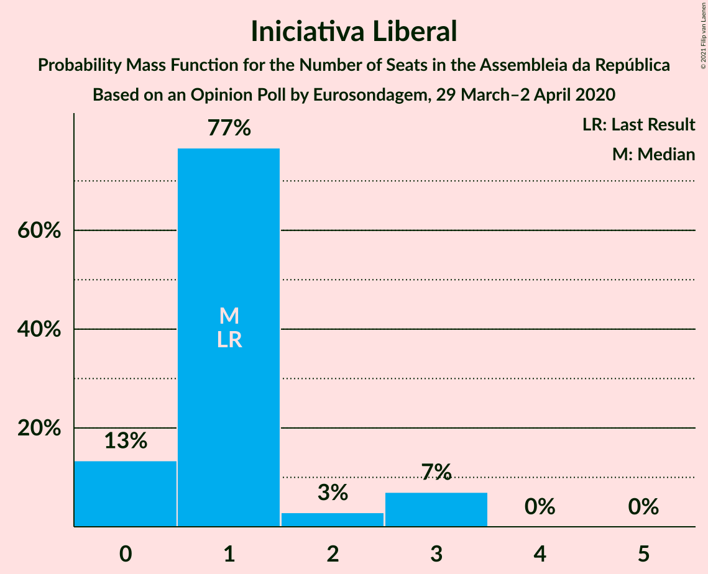

| Number of Seats | Probability | Accumulated | Special Marks |
|:---------------:|:-----------:|:-----------:|:-------------:|
| 0 | 13% | 100% |  |
| 1 | 77% | 87% | Last Result, Median |
| 2 | 3% | 10% |  |
| 3 | 7% | 7% |  |
| 4 | 0% | 0% |  |

## Coalitions

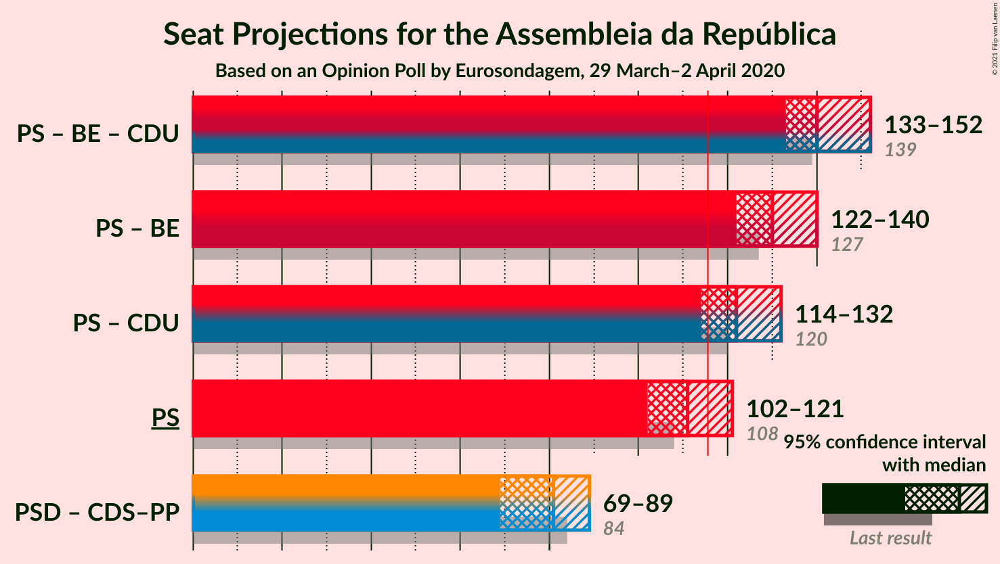

### Confidence Intervals

| Coalition | Last Result | Median | Majority? | 80% Confidence Interval | 90% Confidence Interval | 95% Confidence Interval | 99% Confidence Interval |
|:---------:|:-----------:|:------:|:---------:|:-----------------------:|:-----------------------:|:-----------------------:|:-----------------------:|
| Partido Socialista – Bloco de Esquerda – Coligação Democrática Unitária | 139 | 140 | 100% | 137–147 | 134–151 | 133–152 | 130–154 |
| Partido Socialista – Bloco de Esquerda | 127 | 130 | 99.9% | 125–138 | 123–140 | 122–140 | 117–144 |
| Partido Socialista – Coligação Democrática Unitária | 120 | 122 | 94% | 116–130 | 115–131 | 114–132 | 110–135 |
| Partido Socialista | 108 | 111 | 23% | 106–118 | 104–119 | 102–121 | 98–125 |
| Partido Social Democrata – CDS–Partido Popular | 84 | 81 | 0% | 74–85 | 70–87 | 69–89 | 68–91 |

### Partido Socialista – Bloco de Esquerda – Coligação Democrática Unitária

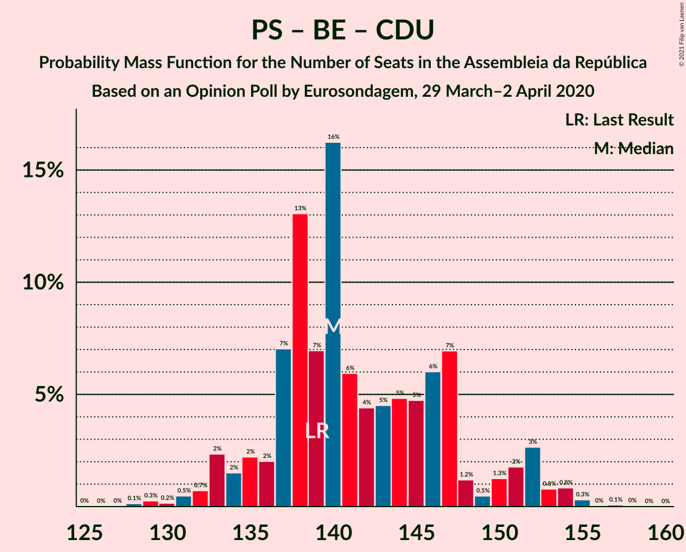

| Number of Seats | Probability | Accumulated | Special Marks |
|:---------------:|:-----------:|:-----------:|:-------------:|
| 125 | 0% | 100% |  |
| 126 | 0% | 99.9% |  |
| 127 | 0% | 99.9% |  |
| 128 | 0.1% | 99.9% |  |
| 129 | 0.3% | 99.8% |  |
| 130 | 0.2% | 99.5% |  |
| 131 | 0.5% | 99.4% |  |
| 132 | 0.7% | 98.9% |  |
| 133 | 2% | 98% |  |
| 134 | 2% | 96% |  |
| 135 | 2% | 94% |  |
| 136 | 2% | 92% |  |
| 137 | 7% | 90% |  |
| 138 | 13% | 83% |  |
| 139 | 7% | 70% | Last Result |
| 140 | 16% | 63% | Median |
| 141 | 6% | 47% |  |
| 142 | 4% | 41% |  |
| 143 | 5% | 36% |  |
| 144 | 5% | 32% |  |
| 145 | 5% | 27% |  |
| 146 | 6% | 22% |  |
| 147 | 7% | 16% |  |
| 148 | 1.2% | 9% |  |
| 149 | 0.5% | 8% |  |
| 150 | 1.3% | 8% |  |
| 151 | 2% | 7% |  |
| 152 | 3% | 5% |  |
| 153 | 0.8% | 2% |  |
| 154 | 0.8% | 1.3% |  |
| 155 | 0.3% | 0.5% |  |
| 156 | 0% | 0.2% |  |
| 157 | 0.1% | 0.1% |  |
| 158 | 0% | 0.1% |  |
| 159 | 0% | 0% |  |

### Partido Socialista – Bloco de Esquerda

| Number of Seats | Probability | Accumulated | Special Marks |
|:---------------:|:-----------:|:-----------:|:-------------:|
| 114 | 0% | 100% |  |
| 115 | 0% | 99.9% |  |
| 116 | 0% | 99.9% | Majority |
| 117 | 0.5% | 99.8% |  |
| 118 | 0.1% | 99.3% |  |
| 119 | 0.1% | 99.3% |  |
| 120 | 0.2% | 99.1% |  |
| 121 | 0.7% | 98.9% |  |
| 122 | 3% | 98% |  |
| 123 | 2% | 95% |  |
| 124 | 1.2% | 93% |  |
| 125 | 3% | 92% |  |
| 126 | 7% | 89% |  |
| 127 | 10% | 82% | Last Result |
| 128 | 4% | 73% |  |
| 129 | 2% | 69% |  |
| 130 | 18% | 66% | Median |
| 131 | 14% | 48% |  |
| 132 | 3% | 34% |  |
| 133 | 2% | 31% |  |
| 134 | 7% | 29% |  |
| 135 | 4% | 22% |  |
| 136 | 2% | 18% |  |
| 137 | 5% | 16% |  |
| 138 | 2% | 11% |  |
| 139 | 2% | 9% |  |
| 140 | 5% | 7% |  |
| 141 | 0.3% | 2% |  |
| 142 | 0.3% | 1.2% |  |
| 143 | 0.2% | 0.9% |  |
| 144 | 0.7% | 0.7% |  |
| 145 | 0% | 0.1% |  |
| 146 | 0% | 0% |  |

### Partido Socialista – Coligação Democrática Unitária

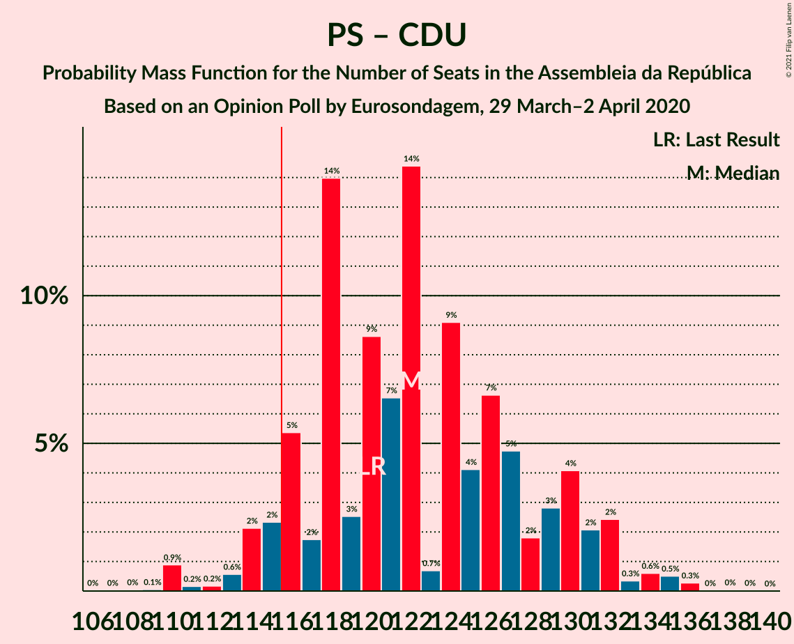

| Number of Seats | Probability | Accumulated | Special Marks |
|:---------------:|:-----------:|:-----------:|:-------------:|
| 107 | 0% | 100% |  |
| 108 | 0% | 99.9% |  |
| 109 | 0.1% | 99.9% |  |
| 110 | 0.9% | 99.8% |  |
| 111 | 0.2% | 98.9% |  |
| 112 | 0.2% | 98.8% |  |
| 113 | 0.6% | 98.6% |  |
| 114 | 2% | 98% |  |
| 115 | 2% | 96% |  |
| 116 | 5% | 94% | Majority |
| 117 | 2% | 88% |  |
| 118 | 14% | 86% |  |
| 119 | 3% | 72% |  |
| 120 | 9% | 70% | Last Result |
| 121 | 7% | 61% | Median |
| 122 | 14% | 55% |  |
| 123 | 0.7% | 40% |  |
| 124 | 9% | 40% |  |
| 125 | 4% | 31% |  |
| 126 | 7% | 26% |  |
| 127 | 5% | 20% |  |
| 128 | 2% | 15% |  |
| 129 | 3% | 13% |  |
| 130 | 4% | 10% |  |
| 131 | 2% | 6% |  |
| 132 | 2% | 4% |  |
| 133 | 0.3% | 2% |  |
| 134 | 0.6% | 1.5% |  |
| 135 | 0.5% | 0.9% |  |
| 136 | 0.3% | 0.4% |  |
| 137 | 0% | 0.1% |  |
| 138 | 0% | 0.1% |  |
| 139 | 0% | 0% |  |

### Partido Socialista

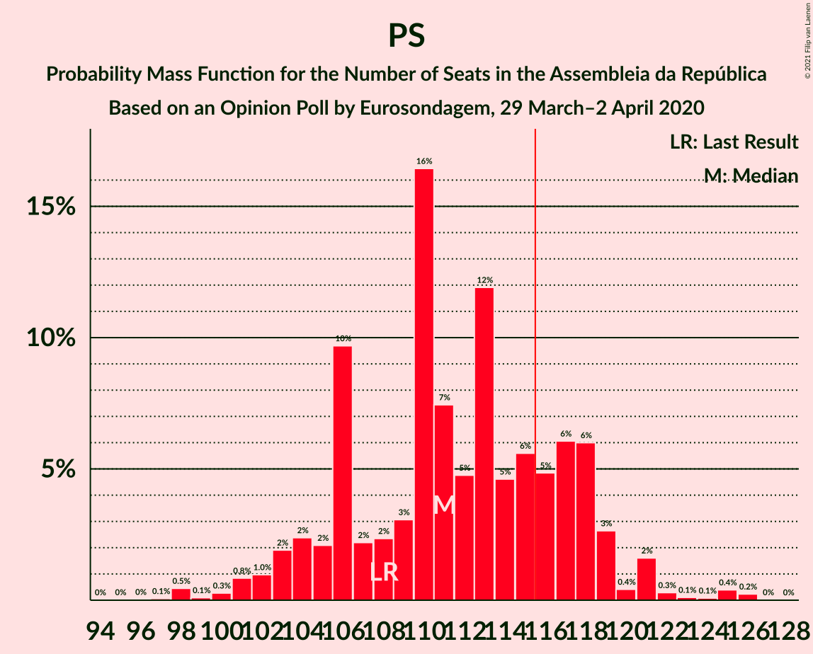

| Number of Seats | Probability | Accumulated | Special Marks |
|:---------------:|:-----------:|:-----------:|:-------------:|
| 94 | 0% | 100% |  |
| 95 | 0% | 99.9% |  |
| 96 | 0% | 99.9% |  |
| 97 | 0.1% | 99.9% |  |
| 98 | 0.5% | 99.8% |  |
| 99 | 0.1% | 99.4% |  |
| 100 | 0.3% | 99.3% |  |
| 101 | 0.8% | 99.0% |  |
| 102 | 1.0% | 98% |  |
| 103 | 2% | 97% |  |
| 104 | 2% | 95% |  |
| 105 | 2% | 93% |  |
| 106 | 10% | 91% |  |
| 107 | 2% | 81% |  |
| 108 | 2% | 79% | Last Result |
| 109 | 3% | 77% |  |
| 110 | 16% | 74% |  |
| 111 | 7% | 57% | Median |
| 112 | 5% | 50% |  |
| 113 | 12% | 45% |  |
| 114 | 5% | 33% |  |
| 115 | 6% | 28% |  |
| 116 | 5% | 23% | Majority |
| 117 | 6% | 18% |  |
| 118 | 6% | 12% |  |
| 119 | 3% | 6% |  |
| 120 | 0.4% | 3% |  |
| 121 | 2% | 3% |  |
| 122 | 0.3% | 1.2% |  |
| 123 | 0.1% | 0.9% |  |
| 124 | 0.1% | 0.8% |  |
| 125 | 0.4% | 0.7% |  |
| 126 | 0.2% | 0.3% |  |
| 127 | 0% | 0% |  |

### Partido Social Democrata – CDS–Partido Popular

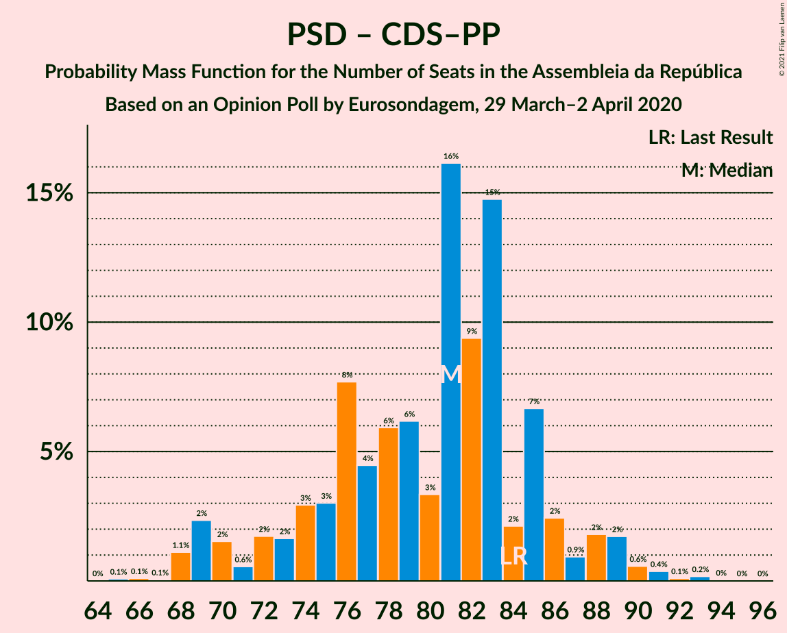

| Number of Seats | Probability | Accumulated | Special Marks |
|:---------------:|:-----------:|:-----------:|:-------------:|
| 65 | 0.1% | 100% |  |
| 66 | 0.1% | 99.9% |  |
| 67 | 0.1% | 99.8% |  |
| 68 | 1.1% | 99.7% |  |
| 69 | 2% | 98.6% |  |
| 70 | 2% | 96% |  |
| 71 | 0.6% | 95% |  |
| 72 | 2% | 94% |  |
| 73 | 2% | 92% |  |
| 74 | 3% | 91% |  |
| 75 | 3% | 88% |  |
| 76 | 8% | 85% |  |
| 77 | 4% | 77% |  |
| 78 | 6% | 73% |  |
| 79 | 6% | 67% |  |
| 80 | 3% | 61% |  |
| 81 | 16% | 57% | Median |
| 82 | 9% | 41% |  |
| 83 | 15% | 32% |  |
| 84 | 2% | 17% | Last Result |
| 85 | 7% | 15% |  |
| 86 | 2% | 8% |  |
| 87 | 0.9% | 6% |  |
| 88 | 2% | 5% |  |
| 89 | 2% | 3% |  |
| 90 | 0.6% | 1.3% |  |
| 91 | 0.4% | 0.7% |  |
| 92 | 0.1% | 0.4% |  |
| 93 | 0.2% | 0.3% |  |
| 94 | 0% | 0.1% |  |
| 95 | 0% | 0.1% |  |
| 96 | 0% | 0% |  |

## Technical Information

### Opinion Poll

+ **Polling firm:** Eurosondagem
+ **Commissioner(s):** —
+ **Fieldwork period:** 29 March–2 April 2020

### Calculations

+ **Sample size:** 1008
+ **Simulations done:** 131,072
+ **Error estimate:** 1.02%

