# Opinion Poll by Intercampus for Correio da Manhã and Negócios, 9–14 April 2020

<a href="#voting-intentions">Voting Intentions</a> | <a href="#seats">Seats</a> | <a href="#coalitions">Coalitions</a> | <a href="#technical-information">Technical Information</a>

## Voting Intentions

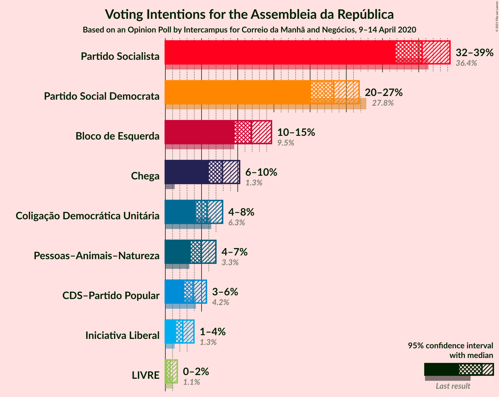

### Confidence Intervals

| Party | Last Result | Poll Result | 80% Confidence Interval | 90% Confidence Interval | 95% Confidence Interval | 99% Confidence Interval |
|:-----:|:-----------:|:-----------:|:-----------------------:|:-----------------------:|:-----------------------:|:-----------------------:|
| Partido Socialista | 36.4% | 35.5% | 33.1–38.0% |32.4–38.7% |31.8–39.3% |30.7–40.5% |
| Partido Social Democrata | 27.8% | 23.3% | 21.2–25.6% |20.6–26.2% |20.1–26.8% |19.2–27.9% |
| Bloco de Esquerda | 9.5% | 11.9% | 10.3–13.7% |9.9–14.2% |9.6–14.7% |8.9–15.6% |
| Chega | 1.3% | 7.9% | 6.6–9.4% |6.3–9.9% |6.0–10.3% |5.5–11.1% |
| Coligação Democrática Unitária | 6.3% | 5.8% | 4.7–7.2% |4.5–7.6% |4.2–7.9% |3.7–8.6% |
| Pessoas–Animais–Natureza | 3.3% | 5.0% | 4.0–6.3% |3.7–6.7% |3.5–7.0% |3.1–7.7% |
| CDS–Partido Popular | 4.2% | 3.9% | 3.0–5.0% |2.8–5.4% |2.6–5.7% |2.3–6.3% |
| Iniciativa Liberal | 1.3% | 2.4% | 1.8–3.4% |1.6–3.7% |1.5–3.9% |1.2–4.5% |
| LIVRE | 1.1% | 0.6% | 0.4–1.3% |0.3–1.5% |0.3–1.6% |0.2–2.0% |

*Note:* The poll result column reflects the actual value used in the calculations. Published results may vary slightly, and in addition be rounded to fewer digits.

## Seats

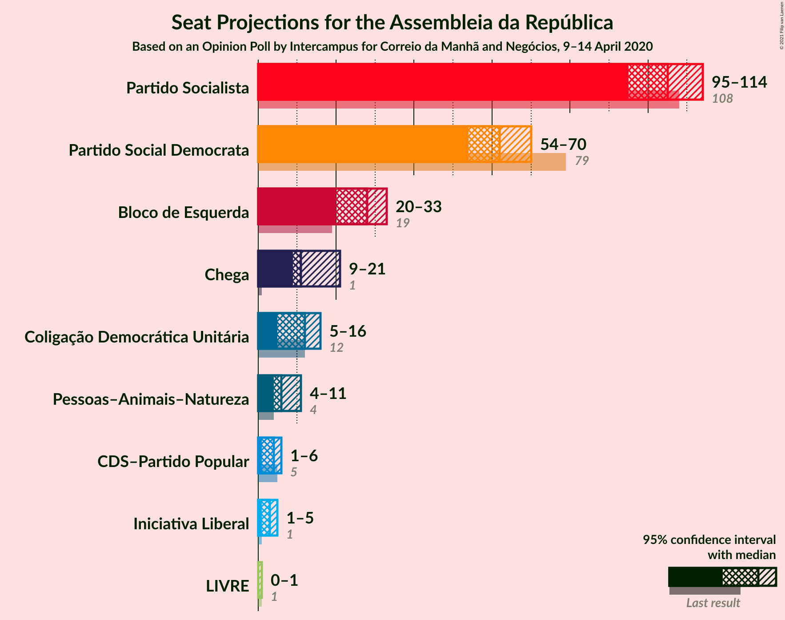

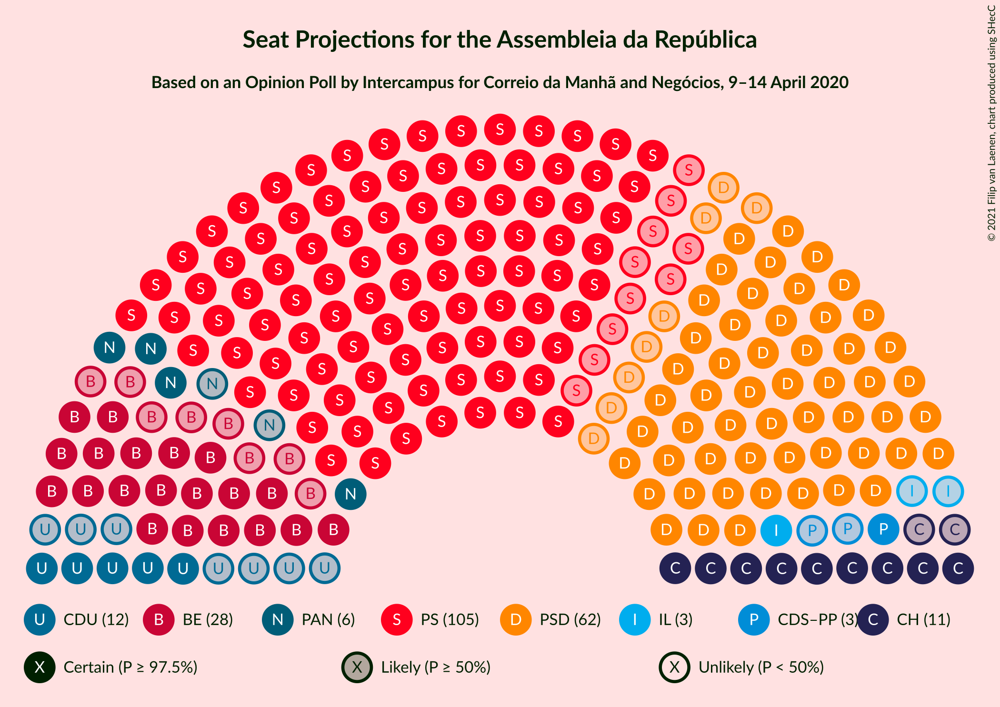

### Confidence Intervals

| Party | Last Result | Median | 80% Confidence Interval | 90% Confidence Interval | 95% Confidence Interval | 99% Confidence Interval |
|:-----:|:-----------:|:------:|:-----------------------:|:-----------------------:|:-----------------------:|:-----------------------:|
| <a href="#partido-socialista">Partido Socialista</a> | 108 | 105 | 99–109 |97–112 |95–114 |89–117 |
| <a href="#partido-social-democrata">Partido Social Democrata</a> | 79 | 62 | 57–67 |56–70 |54–70 |53–75 |
| <a href="#bloco-de-esquerda">Bloco de Esquerda</a> | 19 | 28 | 22–32 |21–32 |20–33 |18–37 |
| <a href="#chega">Chega</a> | 1 | 11 | 11–15 |10–18 |9–21 |8–25 |
| <a href="#coligação-democrática-unitária">Coligação Democrática Unitária</a> | 12 | 12 | 7–14 |6–14 |5–16 |4–17 |
| <a href="#pessoas–animais–natureza">Pessoas–Animais–Natureza</a> | 4 | 6 | 4–9 |4–11 |4–11 |3–11 |
| <a href="#cds–partido-popular">CDS–Partido Popular</a> | 5 | 4 | 2–5 |2–5 |1–6 |1–8 |
| <a href="#iniciativa-liberal">Iniciativa Liberal</a> | 1 | 3 | 1–5 |1–5 |1–5 |1–6 |
| <a href="#livre">LIVRE</a> | 1 | 0 | 0–1 |0–1 |0–1 |0–1 |

### Partido Socialista

*For a full overview of the results for this party, see the [Partido Socialista](party-partidosocialista.html) page.*

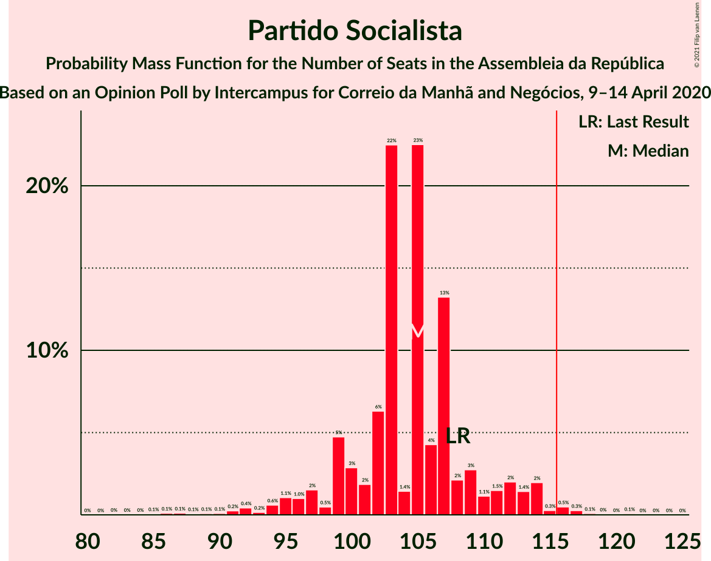

| Number of Seats | Probability | Accumulated | Special Marks |
|:---------------:|:-----------:|:-----------:|:-------------:|
| 83 | 0% | 100% |  |
| 84 | 0% | 99.9% |  |
| 85 | 0.1% | 99.9% |  |
| 86 | 0.1% | 99.8% |  |
| 87 | 0.1% | 99.7% |  |
| 88 | 0.1% | 99.6% |  |
| 89 | 0.1% | 99.6% |  |
| 90 | 0.1% | 99.5% |  |
| 91 | 0.2% | 99.4% |  |
| 92 | 0.4% | 99.1% |  |
| 93 | 0.2% | 98.7% |  |
| 94 | 0.6% | 98.5% |  |
| 95 | 1.1% | 98% |  |
| 96 | 1.0% | 97% |  |
| 97 | 2% | 96% |  |
| 98 | 0.5% | 94% |  |
| 99 | 5% | 94% |  |
| 100 | 3% | 89% |  |
| 101 | 2% | 86% |  |
| 102 | 6% | 84% |  |
| 103 | 22% | 78% |  |
| 104 | 1.4% | 56% |  |
| 105 | 23% | 54% | Median |
| 106 | 4% | 32% |  |
| 107 | 13% | 27% |  |
| 108 | 2% | 14% | Last Result |
| 109 | 3% | 12% |  |
| 110 | 1.1% | 9% |  |
| 111 | 1.5% | 8% |  |
| 112 | 2% | 7% |  |
| 113 | 1.4% | 5% |  |
| 114 | 2% | 3% |  |
| 115 | 0.3% | 1.3% |  |
| 116 | 0.5% | 1.0% | Majority |
| 117 | 0.3% | 0.5% |  |
| 118 | 0.1% | 0.2% |  |
| 119 | 0% | 0.2% |  |
| 120 | 0% | 0.1% |  |
| 121 | 0.1% | 0.1% |  |
| 122 | 0% | 0% |  |

### Partido Social Democrata

*For a full overview of the results for this party, see the [Partido Social Democrata](party-partidosocialdemocrata.html) page.*

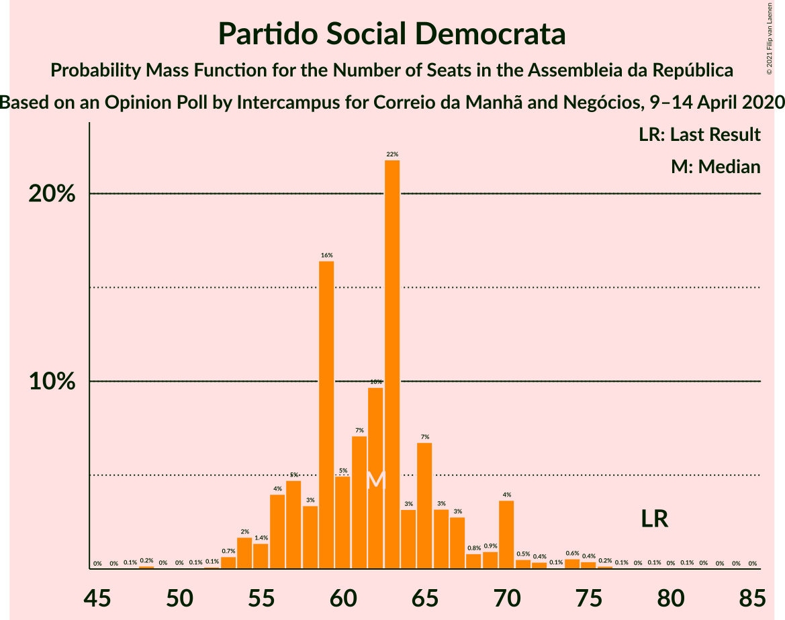

| Number of Seats | Probability | Accumulated | Special Marks |
|:---------------:|:-----------:|:-----------:|:-------------:|
| 47 | 0.1% | 100% |  |
| 48 | 0.2% | 99.9% |  |
| 49 | 0% | 99.8% |  |
| 50 | 0% | 99.7% |  |
| 51 | 0.1% | 99.7% |  |
| 52 | 0.1% | 99.6% |  |
| 53 | 0.7% | 99.5% |  |
| 54 | 2% | 98.8% |  |
| 55 | 1.4% | 97% |  |
| 56 | 4% | 96% |  |
| 57 | 5% | 92% |  |
| 58 | 3% | 87% |  |
| 59 | 16% | 84% |  |
| 60 | 5% | 67% |  |
| 61 | 7% | 62% |  |
| 62 | 10% | 55% | Median |
| 63 | 22% | 45% |  |
| 64 | 3% | 24% |  |
| 65 | 7% | 21% |  |
| 66 | 3% | 14% |  |
| 67 | 3% | 11% |  |
| 68 | 0.8% | 8% |  |
| 69 | 0.9% | 7% |  |
| 70 | 4% | 6% |  |
| 71 | 0.5% | 2% |  |
| 72 | 0.4% | 2% |  |
| 73 | 0.1% | 1.5% |  |
| 74 | 0.6% | 1.4% |  |
| 75 | 0.4% | 0.8% |  |
| 76 | 0.2% | 0.4% |  |
| 77 | 0.1% | 0.3% |  |
| 78 | 0% | 0.2% |  |
| 79 | 0.1% | 0.2% | Last Result |
| 80 | 0% | 0.1% |  |
| 81 | 0.1% | 0.1% |  |
| 82 | 0% | 0.1% |  |
| 83 | 0% | 0% |  |

### Bloco de Esquerda

*For a full overview of the results for this party, see the [Bloco de Esquerda](party-blocodeesquerda.html) page.*

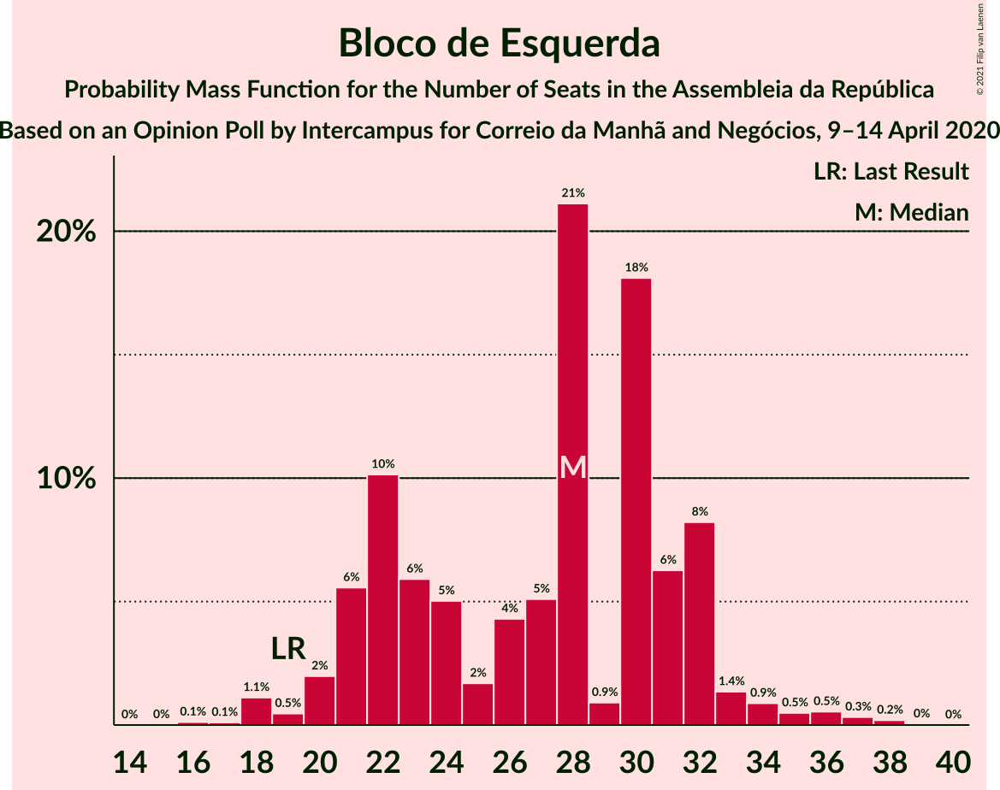

| Number of Seats | Probability | Accumulated | Special Marks |
|:---------------:|:-----------:|:-----------:|:-------------:|
| 16 | 0.1% | 100% |  |
| 17 | 0.1% | 99.9% |  |
| 18 | 1.1% | 99.8% |  |
| 19 | 0.5% | 98.6% | Last Result |
| 20 | 2% | 98% |  |
| 21 | 6% | 96% |  |
| 22 | 10% | 91% |  |
| 23 | 6% | 80% |  |
| 24 | 5% | 75% |  |
| 25 | 2% | 70% |  |
| 26 | 4% | 68% |  |
| 27 | 5% | 64% |  |
| 28 | 21% | 58% | Median |
| 29 | 0.9% | 37% |  |
| 30 | 18% | 36% |  |
| 31 | 6% | 18% |  |
| 32 | 8% | 12% |  |
| 33 | 1.4% | 4% |  |
| 34 | 0.9% | 2% |  |
| 35 | 0.5% | 2% |  |
| 36 | 0.5% | 1.1% |  |
| 37 | 0.3% | 0.6% |  |
| 38 | 0.2% | 0.2% |  |
| 39 | 0% | 0% |  |

### Chega

*For a full overview of the results for this party, see the [Chega](party-chega.html) page.*

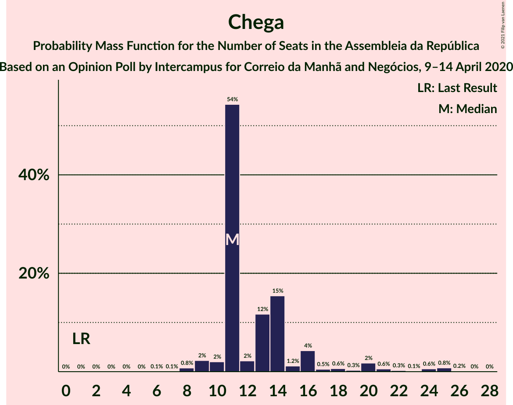

| Number of Seats | Probability | Accumulated | Special Marks |
|:---------------:|:-----------:|:-----------:|:-------------:|
| 1 | 0% | 100% | Last Result |
| 2 | 0% | 100% |  |
| 3 | 0% | 100% |  |
| 4 | 0% | 100% |  |
| 5 | 0% | 100% |  |
| 6 | 0.1% | 100% |  |
| 7 | 0.1% | 99.9% |  |
| 8 | 0.8% | 99.9% |  |
| 9 | 2% | 99.1% |  |
| 10 | 2% | 97% |  |
| 11 | 54% | 95% | Median |
| 12 | 2% | 40% |  |
| 13 | 12% | 38% |  |
| 14 | 15% | 27% |  |
| 15 | 1.2% | 11% |  |
| 16 | 4% | 10% |  |
| 17 | 0.5% | 6% |  |
| 18 | 0.6% | 5% |  |
| 19 | 0.3% | 5% |  |
| 20 | 2% | 4% |  |
| 21 | 0.6% | 3% |  |
| 22 | 0.3% | 2% |  |
| 23 | 0.1% | 2% |  |
| 24 | 0.6% | 2% |  |
| 25 | 0.8% | 1.0% |  |
| 26 | 0.2% | 0.2% |  |
| 27 | 0% | 0% |  |

### Coligação Democrática Unitária

*For a full overview of the results for this party, see the [Coligação Democrática Unitária](party-coligaçãodemocráticaunitária.html) page.*

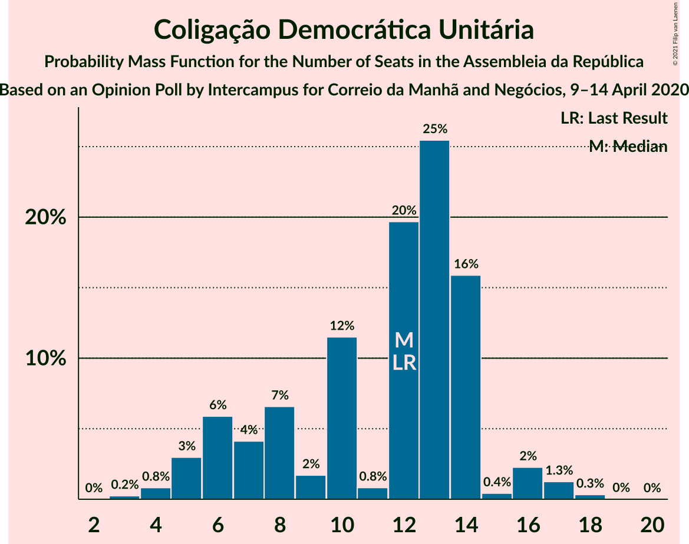

| Number of Seats | Probability | Accumulated | Special Marks |
|:---------------:|:-----------:|:-----------:|:-------------:|
| 3 | 0.2% | 100% |  |
| 4 | 0.8% | 99.8% |  |
| 5 | 3% | 98.9% |  |
| 6 | 6% | 96% |  |
| 7 | 4% | 90% |  |
| 8 | 7% | 86% |  |
| 9 | 2% | 79% |  |
| 10 | 12% | 78% |  |
| 11 | 0.8% | 66% |  |
| 12 | 20% | 65% | Last Result, Median |
| 13 | 25% | 46% |  |
| 14 | 16% | 20% |  |
| 15 | 0.4% | 4% |  |
| 16 | 2% | 4% |  |
| 17 | 1.3% | 2% |  |
| 18 | 0.3% | 0.4% |  |
| 19 | 0% | 0% |  |

### Pessoas–Animais–Natureza

*For a full overview of the results for this party, see the [Pessoas–Animais–Natureza](party-pessoas–animais–natureza.html) page.*

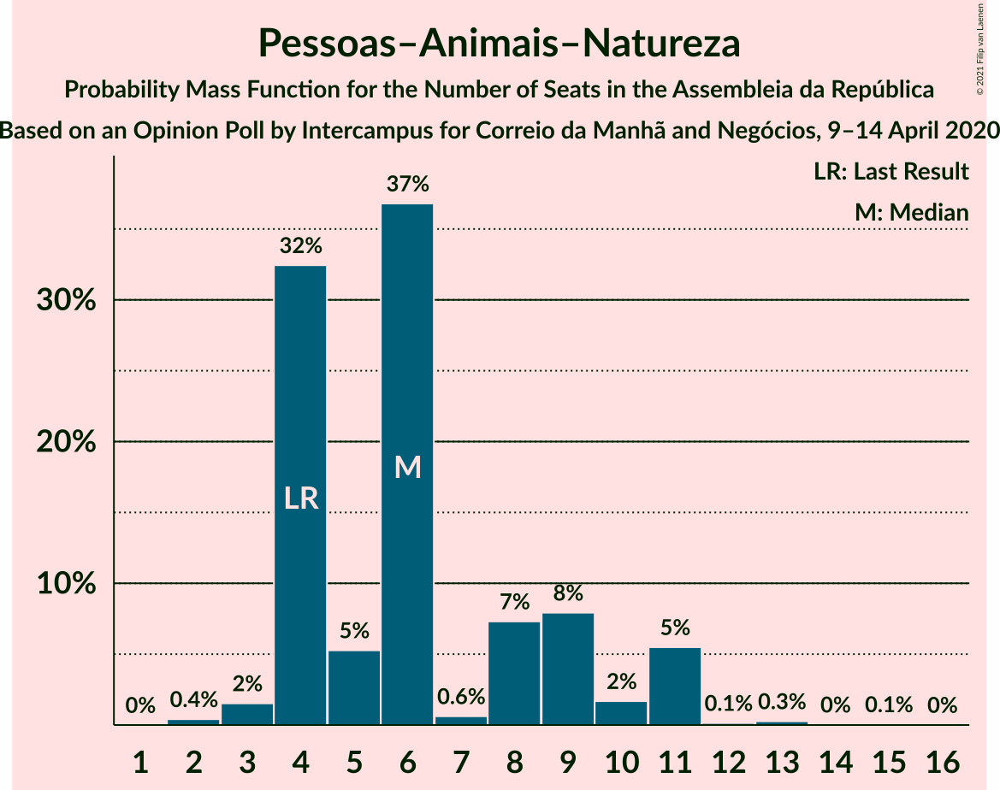

| Number of Seats | Probability | Accumulated | Special Marks |
|:---------------:|:-----------:|:-----------:|:-------------:|
| 2 | 0.4% | 100% |  |
| 3 | 2% | 99.6% |  |
| 4 | 32% | 98% | Last Result |
| 5 | 5% | 66% |  |
| 6 | 37% | 60% | Median |
| 7 | 0.6% | 24% |  |
| 8 | 7% | 23% |  |
| 9 | 8% | 16% |  |
| 10 | 2% | 8% |  |
| 11 | 5% | 6% |  |
| 12 | 0.1% | 0.5% |  |
| 13 | 0.3% | 0.4% |  |
| 14 | 0% | 0.1% |  |
| 15 | 0.1% | 0.1% |  |
| 16 | 0% | 0% |  |

### CDS–Partido Popular

*For a full overview of the results for this party, see the [CDS–Partido Popular](party-cds–partidopopular.html) page.*

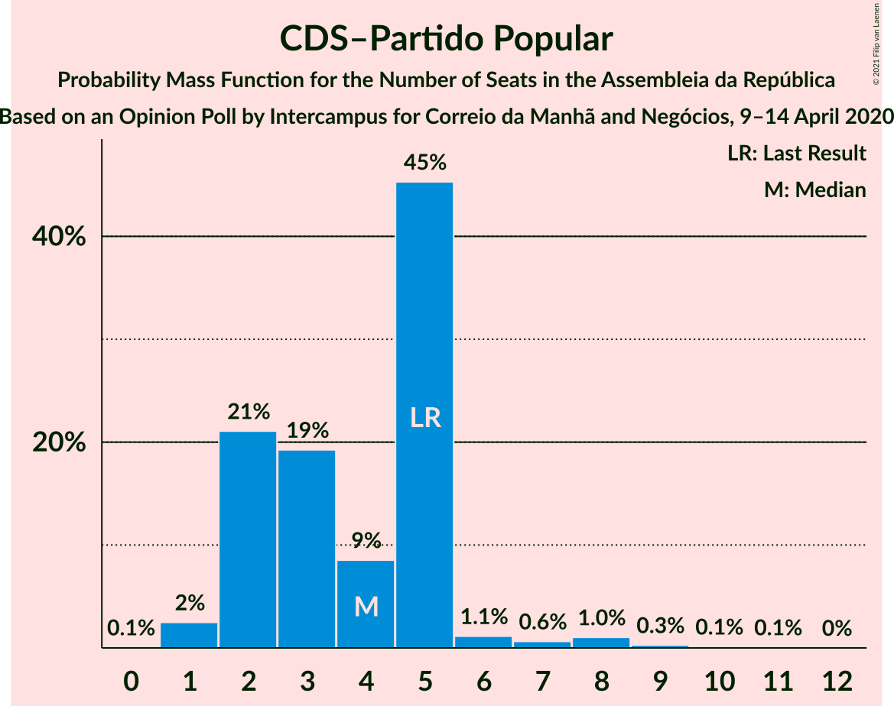

| Number of Seats | Probability | Accumulated | Special Marks |
|:---------------:|:-----------:|:-----------:|:-------------:|
| 0 | 0.1% | 100% |  |
| 1 | 2% | 99.9% |  |
| 2 | 21% | 97% |  |
| 3 | 19% | 76% |  |
| 4 | 9% | 57% | Median |
| 5 | 45% | 49% | Last Result |
| 6 | 1.1% | 3% |  |
| 7 | 0.6% | 2% |  |
| 8 | 1.0% | 2% |  |
| 9 | 0.3% | 0.5% |  |
| 10 | 0.1% | 0.2% |  |
| 11 | 0.1% | 0.1% |  |
| 12 | 0% | 0% |  |

### Iniciativa Liberal

*For a full overview of the results for this party, see the [Iniciativa Liberal](party-iniciativaliberal.html) page.*

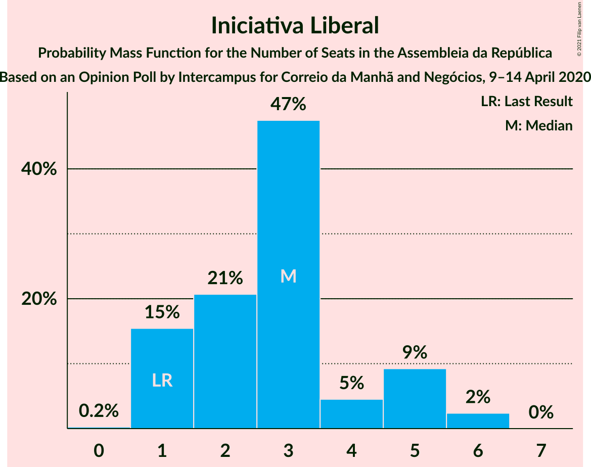

| Number of Seats | Probability | Accumulated | Special Marks |
|:---------------:|:-----------:|:-----------:|:-------------:|
| 0 | 0.2% | 100% |  |
| 1 | 15% | 99.8% | Last Result |
| 2 | 21% | 84% |  |
| 3 | 47% | 64% | Median |
| 4 | 5% | 16% |  |
| 5 | 9% | 12% |  |
| 6 | 2% | 2% |  |
| 7 | 0% | 0% |  |

### LIVRE

*For a full overview of the results for this party, see the [LIVRE](party-livre.html) page.*

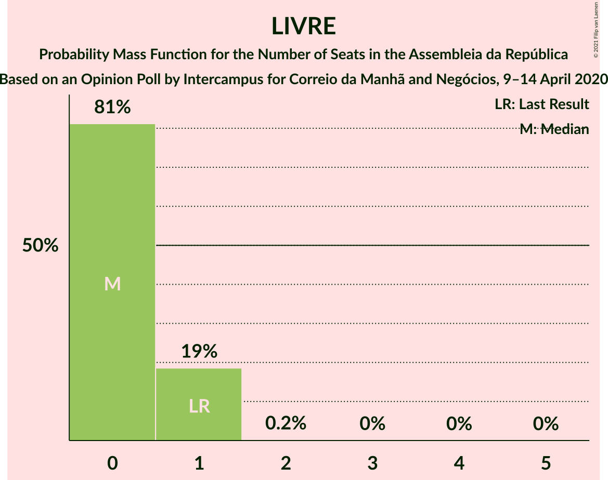

| Number of Seats | Probability | Accumulated | Special Marks |
|:---------------:|:-----------:|:-----------:|:-------------:|
| 0 | 81% | 100% | Median |
| 1 | 19% | 19% | Last Result |
| 2 | 0.2% | 0.2% |  |
| 3 | 0% | 0% |  |

## Coalitions

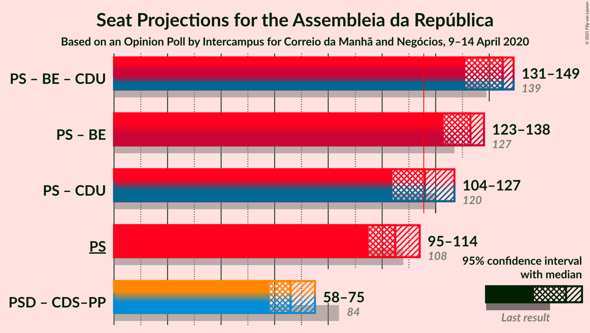

### Confidence Intervals

| Coalition | Last Result | Median | Majority? | 80% Confidence Interval | 90% Confidence Interval | 95% Confidence Interval | 99% Confidence Interval |
|:---------:|:-----------:|:------:|:---------:|:-----------------------:|:-----------------------:|:-----------------------:|:-----------------------:|
| Partido Socialista – Bloco de Esquerda – Coligação Democrática Unitária | 139 | 145 | 100% | 135–147 | 133–148 | 131–149 | 125–150 |
| Partido Socialista – Bloco de Esquerda | 127 | 133 | 99.3% | 126–136 | 125–137 | 123–138 | 113–139 |
| Partido Socialista – Coligação Democrática Unitária | 120 | 116 | 64% | 109–121 | 106–123 | 104–127 | 99–128 |
| Partido Socialista | 108 | 105 | 1.0% | 99–109 | 97–112 | 95–114 | 89–117 |
| Partido Social Democrata – CDS–Partido Popular | 84 | 66 | 0% | 60–69 | 59–73 | 58–75 | 57–80 |

### Partido Socialista – Bloco de Esquerda – Coligação Democrática Unitária

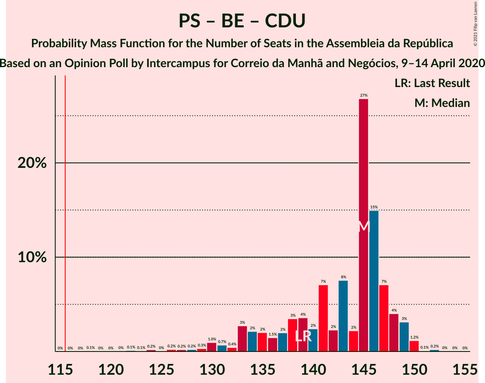

| Number of Seats | Probability | Accumulated | Special Marks |
|:---------------:|:-----------:|:-----------:|:-------------:|
| 118 | 0.1% | 100% |  |
| 119 | 0% | 99.9% |  |
| 120 | 0% | 99.9% |  |
| 121 | 0% | 99.9% |  |
| 122 | 0.1% | 99.9% |  |
| 123 | 0.1% | 99.8% |  |
| 124 | 0.2% | 99.7% |  |
| 125 | 0% | 99.5% |  |
| 126 | 0.2% | 99.5% |  |
| 127 | 0.2% | 99.2% |  |
| 128 | 0.2% | 99.0% |  |
| 129 | 0.3% | 98.8% |  |
| 130 | 1.0% | 98.5% |  |
| 131 | 0.7% | 98% |  |
| 132 | 0.4% | 97% |  |
| 133 | 3% | 96% |  |
| 134 | 2% | 94% |  |
| 135 | 2% | 92% |  |
| 136 | 1.5% | 90% |  |
| 137 | 2% | 88% |  |
| 138 | 3% | 86% |  |
| 139 | 4% | 83% | Last Result |
| 140 | 2% | 79% |  |
| 141 | 7% | 77% |  |
| 142 | 2% | 70% |  |
| 143 | 8% | 67% |  |
| 144 | 2% | 60% |  |
| 145 | 27% | 58% | Median |
| 146 | 15% | 31% |  |
| 147 | 7% | 16% |  |
| 148 | 4% | 9% |  |
| 149 | 3% | 5% |  |
| 150 | 1.2% | 2% |  |
| 151 | 0.1% | 0.4% |  |
| 152 | 0.2% | 0.3% |  |
| 153 | 0% | 0.1% |  |
| 154 | 0% | 0.1% |  |
| 155 | 0% | 0% |  |

### Partido Socialista – Bloco de Esquerda

| Number of Seats | Probability | Accumulated | Special Marks |
|:---------------:|:-----------:|:-----------:|:-------------:|
| 106 | 0.1% | 100% |  |
| 107 | 0% | 99.9% |  |
| 108 | 0% | 99.9% |  |
| 109 | 0% | 99.9% |  |
| 110 | 0.1% | 99.9% |  |
| 111 | 0% | 99.8% |  |
| 112 | 0.2% | 99.8% |  |
| 113 | 0.2% | 99.6% |  |
| 114 | 0.1% | 99.4% |  |
| 115 | 0.1% | 99.3% |  |
| 116 | 0.2% | 99.3% | Majority |
| 117 | 0.1% | 99.1% |  |
| 118 | 0.2% | 99.0% |  |
| 119 | 0.1% | 98.8% |  |
| 120 | 0.1% | 98.7% |  |
| 121 | 0.5% | 98.5% |  |
| 122 | 0.3% | 98% |  |
| 123 | 0.7% | 98% |  |
| 124 | 0.9% | 97% |  |
| 125 | 4% | 96% |  |
| 126 | 2% | 92% |  |
| 127 | 8% | 89% | Last Result |
| 128 | 2% | 82% |  |
| 129 | 11% | 80% |  |
| 130 | 4% | 69% |  |
| 131 | 1.0% | 65% |  |
| 132 | 3% | 64% |  |
| 133 | 33% | 61% | Median |
| 134 | 8% | 28% |  |
| 135 | 8% | 20% |  |
| 136 | 4% | 12% |  |
| 137 | 5% | 8% |  |
| 138 | 1.0% | 3% |  |
| 139 | 1.2% | 2% |  |
| 140 | 0.2% | 0.5% |  |
| 141 | 0.1% | 0.2% |  |
| 142 | 0.1% | 0.2% |  |
| 143 | 0.1% | 0.1% |  |
| 144 | 0% | 0% |  |

### Partido Socialista – Coligação Democrática Unitária

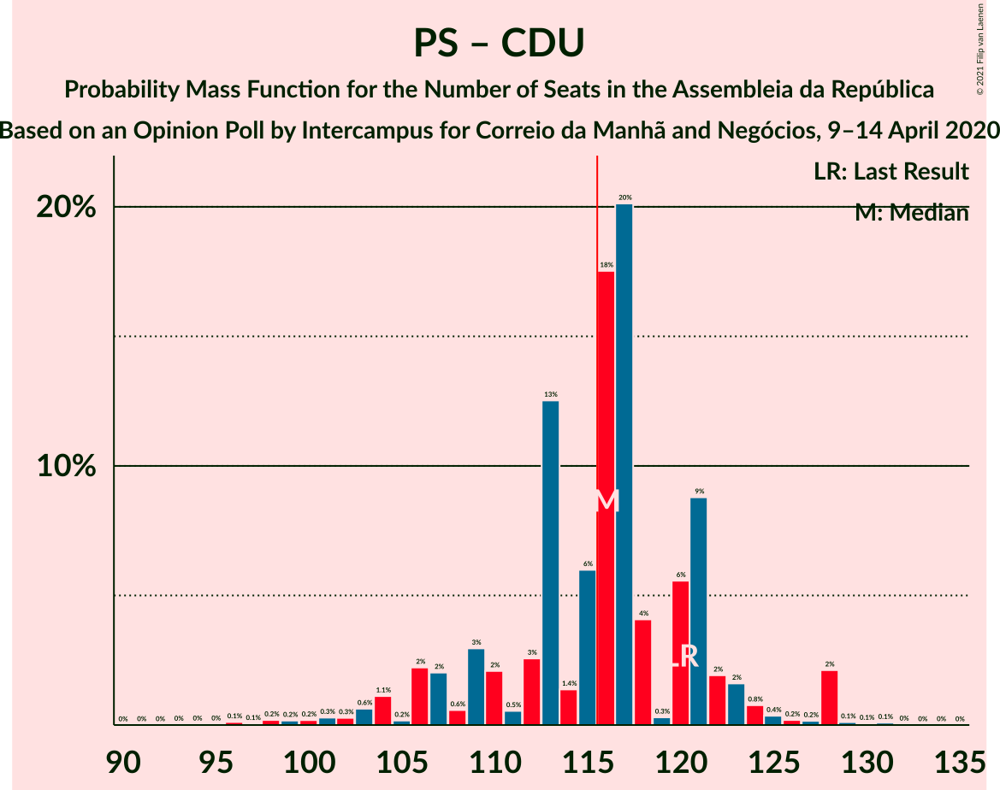

| Number of Seats | Probability | Accumulated | Special Marks |
|:---------------:|:-----------:|:-----------:|:-------------:|
| 94 | 0% | 100% |  |
| 95 | 0% | 99.9% |  |
| 96 | 0.1% | 99.9% |  |
| 97 | 0.1% | 99.8% |  |
| 98 | 0.2% | 99.7% |  |
| 99 | 0.2% | 99.5% |  |
| 100 | 0.2% | 99.4% |  |
| 101 | 0.3% | 99.2% |  |
| 102 | 0.3% | 98.9% |  |
| 103 | 0.6% | 98.6% |  |
| 104 | 1.1% | 98% |  |
| 105 | 0.2% | 97% |  |
| 106 | 2% | 97% |  |
| 107 | 2% | 94% |  |
| 108 | 0.6% | 92% |  |
| 109 | 3% | 92% |  |
| 110 | 2% | 89% |  |
| 111 | 0.5% | 87% |  |
| 112 | 3% | 86% |  |
| 113 | 13% | 84% |  |
| 114 | 1.4% | 71% |  |
| 115 | 6% | 70% |  |
| 116 | 18% | 64% | Majority |
| 117 | 20% | 46% | Median |
| 118 | 4% | 26% |  |
| 119 | 0.3% | 22% |  |
| 120 | 6% | 22% | Last Result |
| 121 | 9% | 16% |  |
| 122 | 2% | 7% |  |
| 123 | 2% | 6% |  |
| 124 | 0.8% | 4% |  |
| 125 | 0.4% | 3% |  |
| 126 | 0.2% | 3% |  |
| 127 | 0.2% | 3% |  |
| 128 | 2% | 2% |  |
| 129 | 0.1% | 0.3% |  |
| 130 | 0.1% | 0.2% |  |
| 131 | 0.1% | 0.1% |  |
| 132 | 0% | 0% |  |

### Partido Socialista

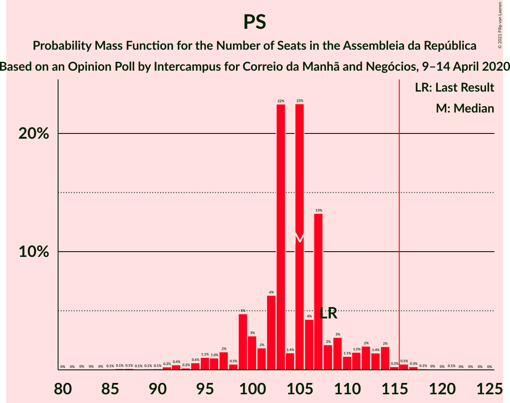

| Number of Seats | Probability | Accumulated | Special Marks |
|:---------------:|:-----------:|:-----------:|:-------------:|
| 83 | 0% | 100% |  |
| 84 | 0% | 99.9% |  |
| 85 | 0.1% | 99.9% |  |
| 86 | 0.1% | 99.8% |  |
| 87 | 0.1% | 99.7% |  |
| 88 | 0.1% | 99.6% |  |
| 89 | 0.1% | 99.6% |  |
| 90 | 0.1% | 99.5% |  |
| 91 | 0.2% | 99.4% |  |
| 92 | 0.4% | 99.1% |  |
| 93 | 0.2% | 98.7% |  |
| 94 | 0.6% | 98.5% |  |
| 95 | 1.1% | 98% |  |
| 96 | 1.0% | 97% |  |
| 97 | 2% | 96% |  |
| 98 | 0.5% | 94% |  |
| 99 | 5% | 94% |  |
| 100 | 3% | 89% |  |
| 101 | 2% | 86% |  |
| 102 | 6% | 84% |  |
| 103 | 22% | 78% |  |
| 104 | 1.4% | 56% |  |
| 105 | 23% | 54% | Median |
| 106 | 4% | 32% |  |
| 107 | 13% | 27% |  |
| 108 | 2% | 14% | Last Result |
| 109 | 3% | 12% |  |
| 110 | 1.1% | 9% |  |
| 111 | 1.5% | 8% |  |
| 112 | 2% | 7% |  |
| 113 | 1.4% | 5% |  |
| 114 | 2% | 3% |  |
| 115 | 0.3% | 1.3% |  |
| 116 | 0.5% | 1.0% | Majority |
| 117 | 0.3% | 0.5% |  |
| 118 | 0.1% | 0.2% |  |
| 119 | 0% | 0.2% |  |
| 120 | 0% | 0.1% |  |
| 121 | 0.1% | 0.1% |  |
| 122 | 0% | 0% |  |

### Partido Social Democrata – CDS–Partido Popular

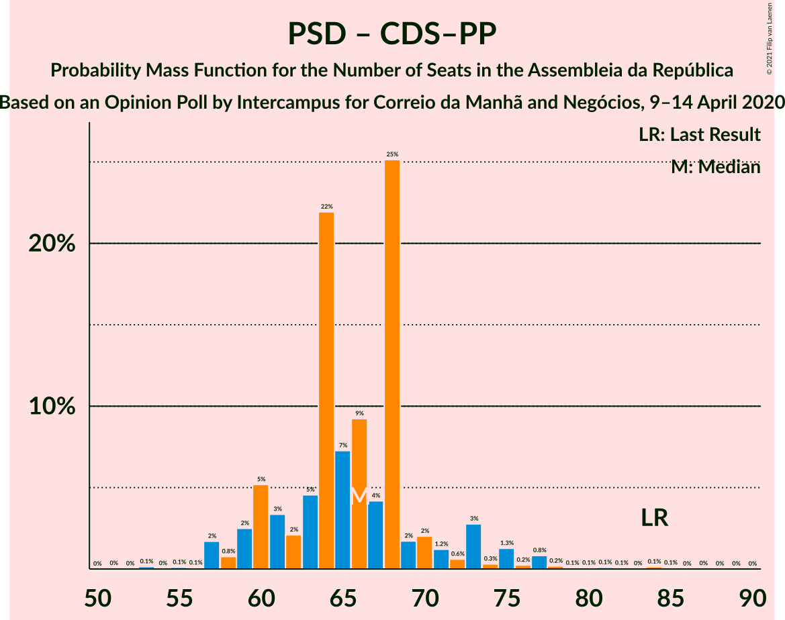

| Number of Seats | Probability | Accumulated | Special Marks |
|:---------------:|:-----------:|:-----------:|:-------------:|
| 52 | 0% | 100% |  |
| 53 | 0.1% | 99.9% |  |
| 54 | 0% | 99.8% |  |
| 55 | 0.1% | 99.8% |  |
| 56 | 0.1% | 99.7% |  |
| 57 | 2% | 99.6% |  |
| 58 | 0.8% | 98% |  |
| 59 | 2% | 97% |  |
| 60 | 5% | 95% |  |
| 61 | 3% | 89% |  |
| 62 | 2% | 86% |  |
| 63 | 5% | 84% |  |
| 64 | 22% | 79% |  |
| 65 | 7% | 58% |  |
| 66 | 9% | 50% | Median |
| 67 | 4% | 41% |  |
| 68 | 25% | 37% |  |
| 69 | 2% | 12% |  |
| 70 | 2% | 10% |  |
| 71 | 1.2% | 8% |  |
| 72 | 0.6% | 7% |  |
| 73 | 3% | 6% |  |
| 74 | 0.3% | 3% |  |
| 75 | 1.3% | 3% |  |
| 76 | 0.2% | 2% |  |
| 77 | 0.8% | 2% |  |
| 78 | 0.2% | 0.7% |  |
| 79 | 0.1% | 0.6% |  |
| 80 | 0.1% | 0.5% |  |
| 81 | 0.1% | 0.4% |  |
| 82 | 0.1% | 0.3% |  |
| 83 | 0% | 0.3% |  |
| 84 | 0.1% | 0.3% | Last Result |
| 85 | 0.1% | 0.1% |  |
| 86 | 0% | 0.1% |  |
| 87 | 0% | 0.1% |  |
| 88 | 0% | 0% |  |

## Technical Information

### Opinion Poll

+ **Polling firm:** Intercampus
+ **Commissioner(s):** Correio da Manhã and Negócios
+ **Fieldwork period:** 9–14 April 2020

### Calculations

+ **Sample size:** 623
+ **Simulations done:** 131,072
+ **Error estimate:** 1.69%

