# Opinion Poll by Pitagórica for Jornal de Notícias, 15–26 April 2020

<a href="#voting-intentions">Voting Intentions</a> | <a href="#seats">Seats</a> | <a href="#coalitions">Coalitions</a> | <a href="#technical-information">Technical Information</a>

## Voting Intentions

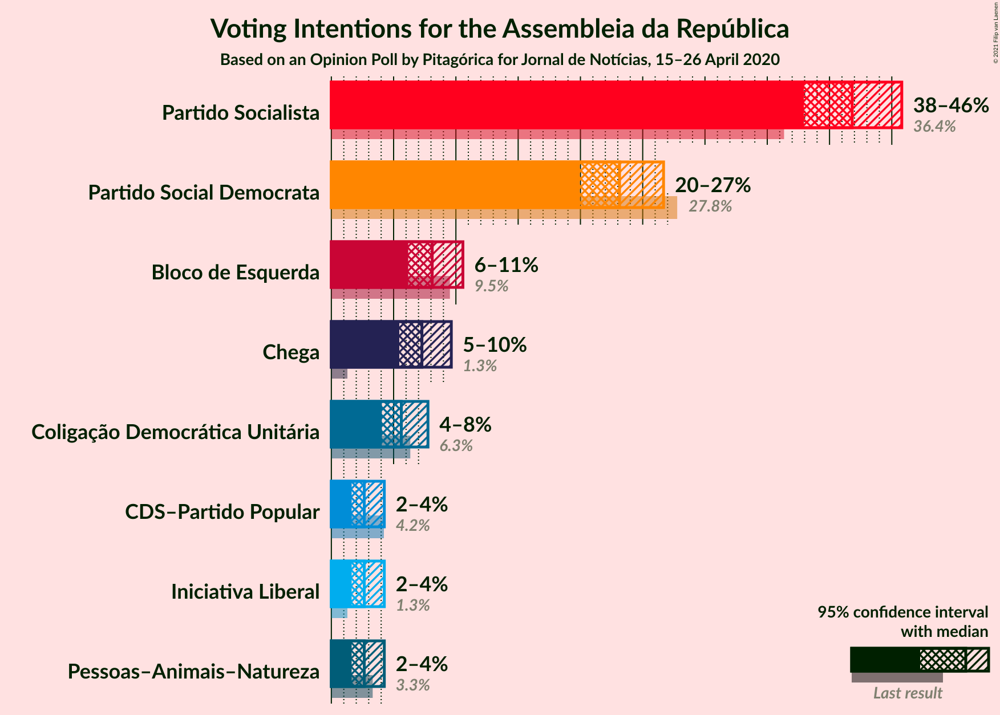

### Confidence Intervals

| Party | Last Result | Poll Result | 80% Confidence Interval | 90% Confidence Interval | 95% Confidence Interval | 99% Confidence Interval |
|:-----:|:-----------:|:-----------:|:-----------------------:|:-----------------------:|:-----------------------:|:-----------------------:|
| Partido Socialista | 36.4% | 41.8% | 39.3–44.4% |38.6–45.2% |37.9–45.8% |36.7–47.1% |
| Partido Social Democrata | 27.8% | 23.1% | 21.0–25.5% |20.5–26.1% |20.0–26.7% |19.0–27.8% |
| Bloco de Esquerda | 9.5% | 8.1% | 6.8–9.7% |6.5–10.2% |6.2–10.6% |5.6–11.4% |
| Chega | 1.3% | 7.3% | 6.1–8.8% |5.7–9.3% |5.5–9.6% |4.9–10.4% |
| Coligação Democrática Unitária | 6.3% | 5.6% | 4.6–7.0% |4.3–7.4% |4.1–7.8% |3.6–8.5% |
| CDS–Partido Popular | 4.2% | 2.6% | 2.0–3.7% |1.8–4.0% |1.6–4.3% |1.4–4.8% |
| Pessoas–Animais–Natureza | 3.3% | 2.6% | 2.0–3.7% |1.8–4.0% |1.6–4.3% |1.4–4.8% |
| Iniciativa Liberal | 1.3% | 2.6% | 2.0–3.7% |1.8–4.0% |1.6–4.3% |1.4–4.8% |

*Note:* The poll result column reflects the actual value used in the calculations. Published results may vary slightly, and in addition be rounded to fewer digits.

## Seats

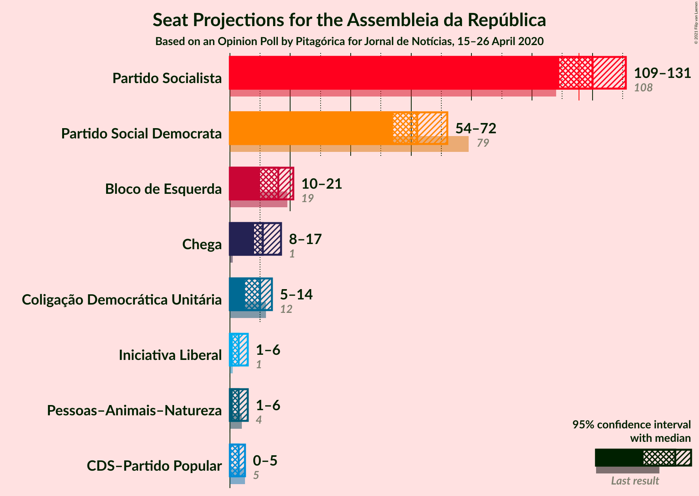

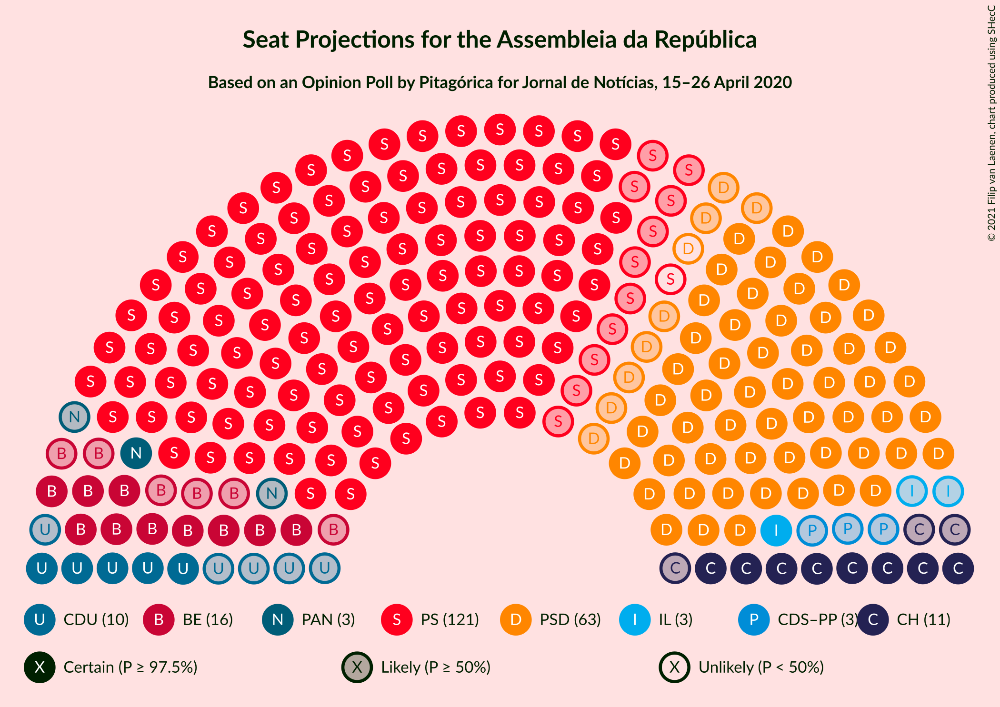

### Confidence Intervals

| Party | Last Result | Median | 80% Confidence Interval | 90% Confidence Interval | 95% Confidence Interval | 99% Confidence Interval |
|:-----:|:-----------:|:------:|:-----------------------:|:-----------------------:|:-----------------------:|:-----------------------:|
| <a href="#partido-socialista">Partido Socialista</a> | 108 | 120 | 114–128 |112–130 |109–131 |106–134 |
| <a href="#partido-social-democrata">Partido Social Democrata</a> | 79 | 62 | 55–68 |54–70 |54–72 |50–76 |
| <a href="#bloco-de-esquerda">Bloco de Esquerda</a> | 19 | 16 | 12–19 |10–21 |10–21 |7–23 |
| <a href="#chega">Chega</a> | 1 | 11 | 9–14 |9–16 |8–17 |7–20 |
| <a href="#coligação-democrática-unitária">Coligação Democrática Unitária</a> | 12 | 10 | 6–13 |5–13 |5–14 |4–17 |
| <a href="#cds–partido-popular">CDS–Partido Popular</a> | 5 | 3 | 2–4 |1–5 |0–5 |0–5 |
| <a href="#pessoas–animais–natureza">Pessoas–Animais–Natureza</a> | 4 | 3 | 2–5 |1–6 |1–6 |0–8 |
| <a href="#iniciativa-liberal">Iniciativa Liberal</a> | 1 | 3 | 1–4 |1–5 |1–6 |1–6 |

### Partido Socialista

*For a full overview of the results for this party, see the [Partido Socialista](party-partidosocialista.html) page.*

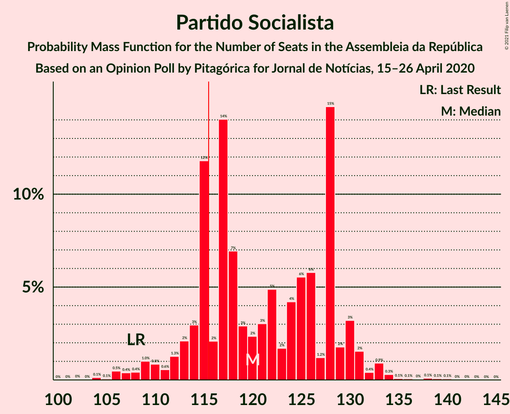

| Number of Seats | Probability | Accumulated | Special Marks |
|:---------------:|:-----------:|:-----------:|:-------------:|
| 103 | 0% | 100% |  |
| 104 | 0.1% | 99.9% |  |
| 105 | 0.1% | 99.8% |  |
| 106 | 0.5% | 99.8% |  |
| 107 | 0.4% | 99.3% |  |
| 108 | 0.4% | 98.9% | Last Result |
| 109 | 1.0% | 98% |  |
| 110 | 0.8% | 97% |  |
| 111 | 0.6% | 97% |  |
| 112 | 1.3% | 96% |  |
| 113 | 2% | 95% |  |
| 114 | 3% | 93% |  |
| 115 | 12% | 90% |  |
| 116 | 2% | 78% | Majority |
| 117 | 14% | 76% |  |
| 118 | 7% | 62% |  |
| 119 | 3% | 55% |  |
| 120 | 2% | 52% | Median |
| 121 | 3% | 50% |  |
| 122 | 5% | 47% |  |
| 123 | 2% | 42% |  |
| 124 | 4% | 40% |  |
| 125 | 6% | 36% |  |
| 126 | 6% | 30% |  |
| 127 | 1.2% | 24% |  |
| 128 | 15% | 23% |  |
| 129 | 2% | 9% |  |
| 130 | 3% | 7% |  |
| 131 | 2% | 4% |  |
| 132 | 0.4% | 2% |  |
| 133 | 0.9% | 2% |  |
| 134 | 0.3% | 0.7% |  |
| 135 | 0.1% | 0.4% |  |
| 136 | 0.1% | 0.4% |  |
| 137 | 0% | 0.3% |  |
| 138 | 0.1% | 0.2% |  |
| 139 | 0.1% | 0.2% |  |
| 140 | 0.1% | 0.1% |  |
| 141 | 0% | 0% |  |

### Partido Social Democrata

*For a full overview of the results for this party, see the [Partido Social Democrata](party-partidosocialdemocrata.html) page.*

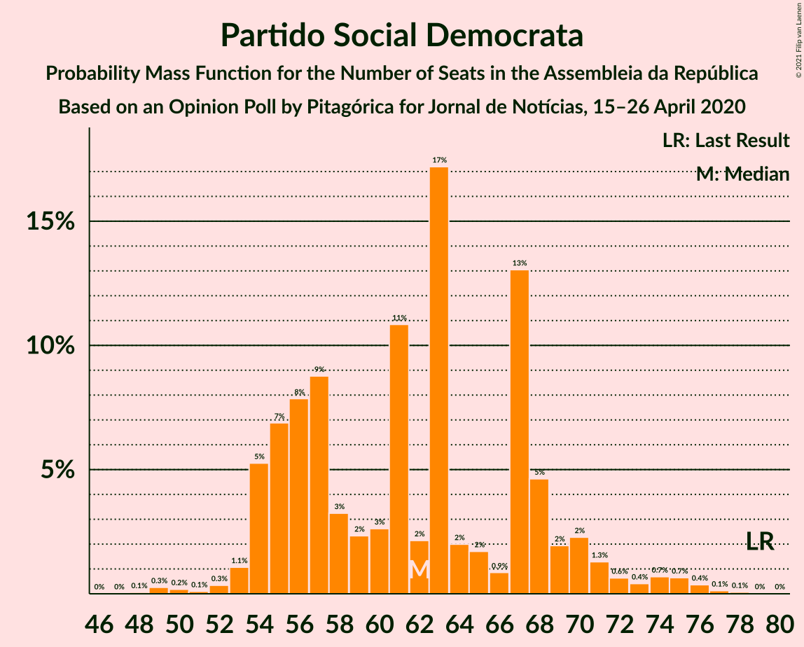

| Number of Seats | Probability | Accumulated | Special Marks |
|:---------------:|:-----------:|:-----------:|:-------------:|
| 48 | 0.1% | 100% |  |
| 49 | 0.3% | 99.9% |  |
| 50 | 0.2% | 99.6% |  |
| 51 | 0.1% | 99.5% |  |
| 52 | 0.3% | 99.4% |  |
| 53 | 1.1% | 99.0% |  |
| 54 | 5% | 98% |  |
| 55 | 7% | 93% |  |
| 56 | 8% | 86% |  |
| 57 | 9% | 78% |  |
| 58 | 3% | 69% |  |
| 59 | 2% | 66% |  |
| 60 | 3% | 64% |  |
| 61 | 11% | 61% |  |
| 62 | 2% | 50% | Median |
| 63 | 17% | 48% |  |
| 64 | 2% | 31% |  |
| 65 | 2% | 29% |  |
| 66 | 0.9% | 27% |  |
| 67 | 13% | 26% |  |
| 68 | 5% | 13% |  |
| 69 | 2% | 9% |  |
| 70 | 2% | 7% |  |
| 71 | 1.3% | 4% |  |
| 72 | 0.6% | 3% |  |
| 73 | 0.4% | 2% |  |
| 74 | 0.7% | 2% |  |
| 75 | 0.7% | 1.3% |  |
| 76 | 0.4% | 0.6% |  |
| 77 | 0.1% | 0.3% |  |
| 78 | 0.1% | 0.1% |  |
| 79 | 0% | 0.1% | Last Result |
| 80 | 0% | 0% |  |

### Bloco de Esquerda

*For a full overview of the results for this party, see the [Bloco de Esquerda](party-blocodeesquerda.html) page.*

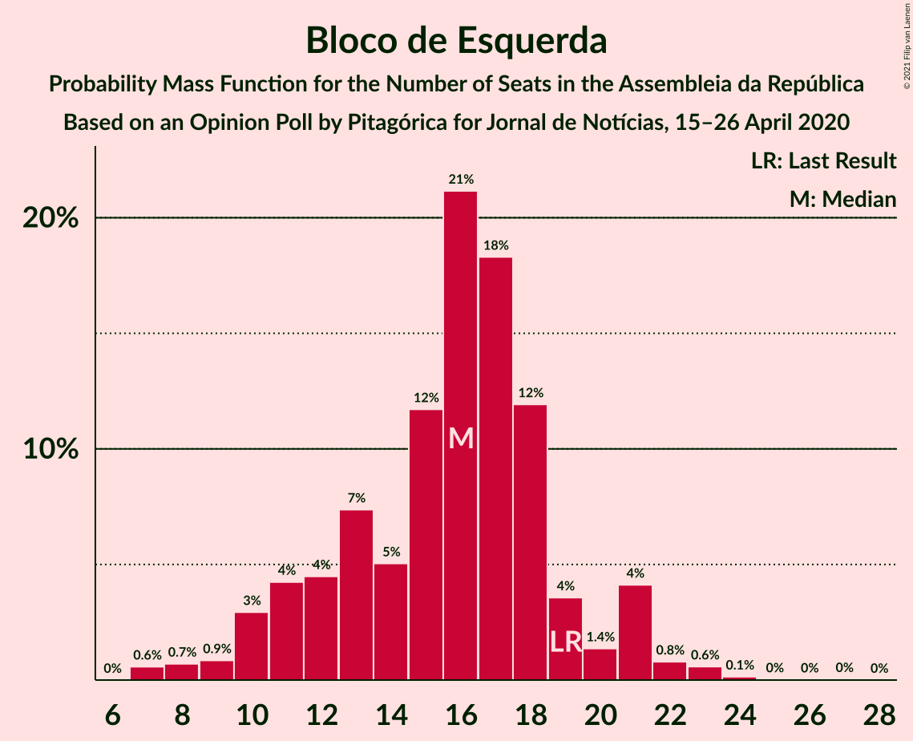

| Number of Seats | Probability | Accumulated | Special Marks |
|:---------------:|:-----------:|:-----------:|:-------------:|
| 7 | 0.6% | 100% |  |
| 8 | 0.7% | 99.4% |  |
| 9 | 0.9% | 98.7% |  |
| 10 | 3% | 98% |  |
| 11 | 4% | 95% |  |
| 12 | 4% | 91% |  |
| 13 | 7% | 86% |  |
| 14 | 5% | 79% |  |
| 15 | 12% | 74% |  |
| 16 | 21% | 62% | Median |
| 17 | 18% | 41% |  |
| 18 | 12% | 23% |  |
| 19 | 4% | 11% | Last Result |
| 20 | 1.4% | 7% |  |
| 21 | 4% | 6% |  |
| 22 | 0.8% | 2% |  |
| 23 | 0.6% | 0.8% |  |
| 24 | 0.1% | 0.3% |  |
| 25 | 0% | 0.1% |  |
| 26 | 0% | 0.1% |  |
| 27 | 0% | 0.1% |  |
| 28 | 0% | 0% |  |

### Chega

*For a full overview of the results for this party, see the [Chega](party-chega.html) page.*

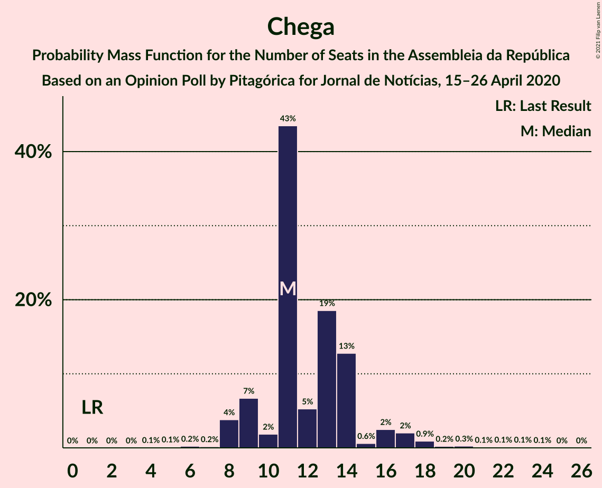

| Number of Seats | Probability | Accumulated | Special Marks |
|:---------------:|:-----------:|:-----------:|:-------------:|
| 1 | 0% | 100% | Last Result |
| 2 | 0% | 100% |  |
| 3 | 0% | 100% |  |
| 4 | 0.1% | 100% |  |
| 5 | 0.1% | 99.9% |  |
| 6 | 0.2% | 99.8% |  |
| 7 | 0.2% | 99.6% |  |
| 8 | 4% | 99.4% |  |
| 9 | 7% | 96% |  |
| 10 | 2% | 89% |  |
| 11 | 43% | 87% | Median |
| 12 | 5% | 44% |  |
| 13 | 19% | 38% |  |
| 14 | 13% | 20% |  |
| 15 | 0.6% | 7% |  |
| 16 | 2% | 6% |  |
| 17 | 2% | 4% |  |
| 18 | 0.9% | 2% |  |
| 19 | 0.2% | 0.9% |  |
| 20 | 0.3% | 0.6% |  |
| 21 | 0.1% | 0.4% |  |
| 22 | 0.1% | 0.3% |  |
| 23 | 0.1% | 0.2% |  |
| 24 | 0.1% | 0.1% |  |
| 25 | 0% | 0% |  |

### Coligação Democrática Unitária

*For a full overview of the results for this party, see the [Coligação Democrática Unitária](party-coligaçãodemocráticaunitária.html) page.*

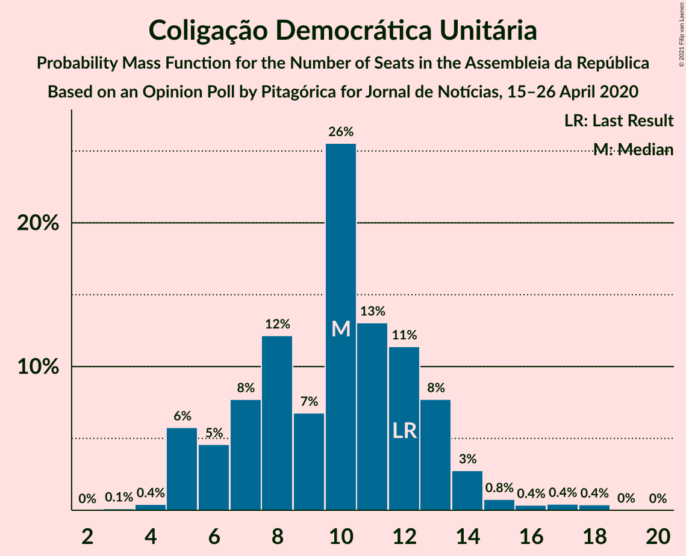

| Number of Seats | Probability | Accumulated | Special Marks |
|:---------------:|:-----------:|:-----------:|:-------------:|
| 3 | 0.1% | 100% |  |
| 4 | 0.4% | 99.9% |  |
| 5 | 6% | 99.5% |  |
| 6 | 5% | 94% |  |
| 7 | 8% | 89% |  |
| 8 | 12% | 81% |  |
| 9 | 7% | 69% |  |
| 10 | 26% | 62% | Median |
| 11 | 13% | 37% |  |
| 12 | 11% | 24% | Last Result |
| 13 | 8% | 12% |  |
| 14 | 3% | 5% |  |
| 15 | 0.8% | 2% |  |
| 16 | 0.4% | 1.2% |  |
| 17 | 0.4% | 0.9% |  |
| 18 | 0.4% | 0.4% |  |
| 19 | 0% | 0.1% |  |
| 20 | 0% | 0% |  |

### CDS–Partido Popular

*For a full overview of the results for this party, see the [CDS–Partido Popular](party-cds–partidopopular.html) page.*

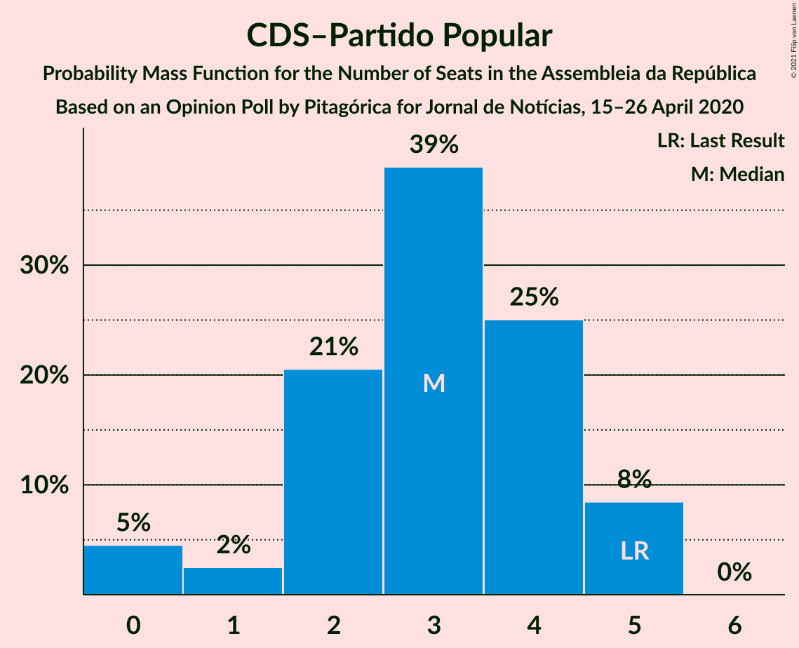

| Number of Seats | Probability | Accumulated | Special Marks |
|:---------------:|:-----------:|:-----------:|:-------------:|
| 0 | 5% | 100% |  |
| 1 | 2% | 95% |  |
| 2 | 21% | 93% |  |
| 3 | 39% | 72% | Median |
| 4 | 25% | 34% |  |
| 5 | 8% | 8% | Last Result |
| 6 | 0% | 0% |  |

### Pessoas–Animais–Natureza

*For a full overview of the results for this party, see the [Pessoas–Animais–Natureza](party-pessoas–animais–natureza.html) page.*

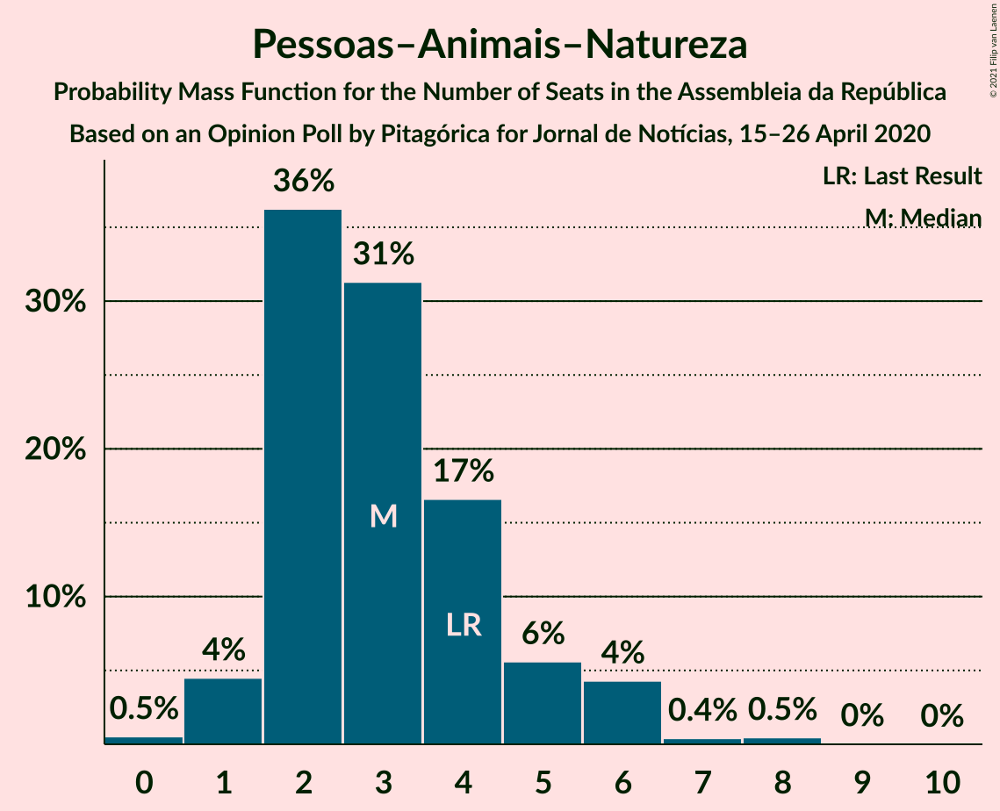

| Number of Seats | Probability | Accumulated | Special Marks |
|:---------------:|:-----------:|:-----------:|:-------------:|
| 0 | 0.5% | 100% |  |
| 1 | 4% | 99.5% |  |
| 2 | 36% | 95% |  |
| 3 | 31% | 59% | Median |
| 4 | 17% | 27% | Last Result |
| 5 | 6% | 11% |  |
| 6 | 4% | 5% |  |
| 7 | 0.4% | 0.9% |  |
| 8 | 0.5% | 0.5% |  |
| 9 | 0% | 0.1% |  |
| 10 | 0% | 0% |  |

### Iniciativa Liberal

*For a full overview of the results for this party, see the [Iniciativa Liberal](party-iniciativaliberal.html) page.*

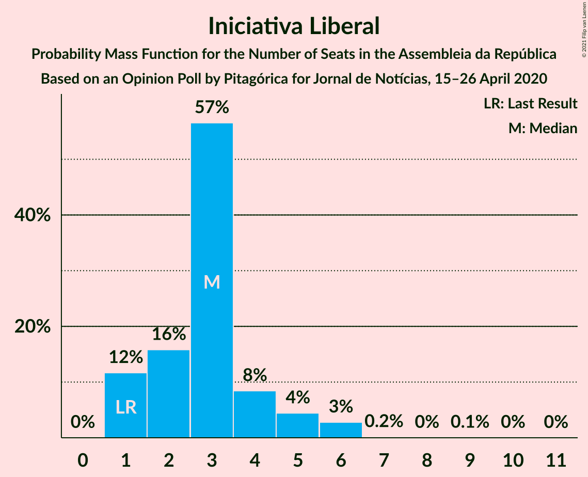

| Number of Seats | Probability | Accumulated | Special Marks |
|:---------------:|:-----------:|:-----------:|:-------------:|
| 1 | 12% | 100% | Last Result |
| 2 | 16% | 88% |  |
| 3 | 57% | 72% | Median |
| 4 | 8% | 16% |  |
| 5 | 4% | 8% |  |
| 6 | 3% | 3% |  |
| 7 | 0.2% | 0.3% |  |
| 8 | 0% | 0.1% |  |
| 9 | 0.1% | 0.1% |  |
| 10 | 0% | 0.1% |  |
| 11 | 0% | 0% |  |

## Coalitions

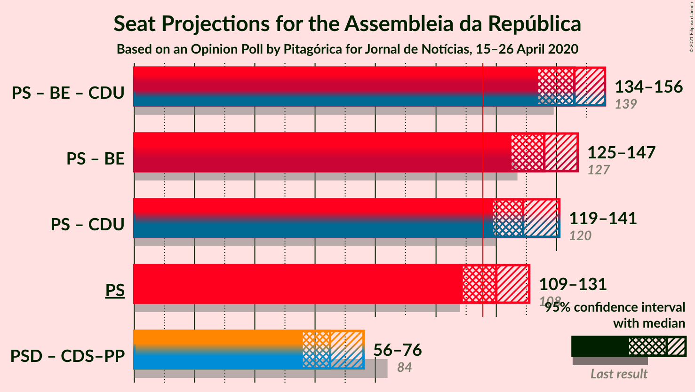

### Confidence Intervals

| Coalition | Last Result | Median | Majority? | 80% Confidence Interval | 90% Confidence Interval | 95% Confidence Interval | 99% Confidence Interval |
|:---------:|:-----------:|:------:|:---------:|:-----------------------:|:-----------------------:|:-----------------------:|:-----------------------:|
| Partido Socialista – Bloco de Esquerda – Coligação Democrática Unitária | 139 | 146 | 100% | 140–155 | 137–156 | 134–156 | 132–158 |
| Partido Socialista – Bloco de Esquerda | 127 | 136 | 100% | 129–144 | 127–146 | 125–147 | 122–150 |
| Partido Socialista – Coligação Democrática Unitária | 120 | 129 | 99.5% | 125–140 | 121–140 | 119–141 | 116–144 |
| Partido Socialista | 108 | 120 | 78% | 114–128 | 112–130 | 109–131 | 106–134 |
| Partido Social Democrata – CDS–Partido Popular | 84 | 65 | 0% | 58–71 | 57–73 | 56–76 | 54–79 |

### Partido Socialista – Bloco de Esquerda – Coligação Democrática Unitária

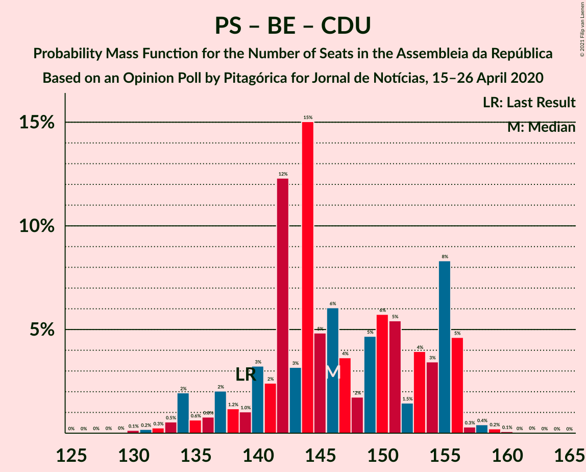

| Number of Seats | Probability | Accumulated | Special Marks |
|:---------------:|:-----------:|:-----------:|:-------------:|
| 127 | 0% | 100% |  |
| 128 | 0% | 99.9% |  |
| 129 | 0% | 99.9% |  |
| 130 | 0.1% | 99.9% |  |
| 131 | 0.2% | 99.7% |  |
| 132 | 0.3% | 99.5% |  |
| 133 | 0.5% | 99.3% |  |
| 134 | 2% | 98.7% |  |
| 135 | 0.6% | 97% |  |
| 136 | 0.8% | 96% |  |
| 137 | 2% | 95% |  |
| 138 | 1.2% | 93% |  |
| 139 | 1.0% | 92% | Last Result |
| 140 | 3% | 91% |  |
| 141 | 2% | 88% |  |
| 142 | 12% | 85% |  |
| 143 | 3% | 73% |  |
| 144 | 15% | 70% |  |
| 145 | 5% | 55% |  |
| 146 | 6% | 50% | Median |
| 147 | 4% | 44% |  |
| 148 | 2% | 40% |  |
| 149 | 5% | 39% |  |
| 150 | 6% | 34% |  |
| 151 | 5% | 28% |  |
| 152 | 1.5% | 23% |  |
| 153 | 4% | 21% |  |
| 154 | 3% | 17% |  |
| 155 | 8% | 14% |  |
| 156 | 5% | 6% |  |
| 157 | 0.3% | 1.1% |  |
| 158 | 0.4% | 0.8% |  |
| 159 | 0.2% | 0.4% |  |
| 160 | 0.1% | 0.2% |  |
| 161 | 0% | 0.1% |  |
| 162 | 0% | 0.1% |  |
| 163 | 0% | 0% |  |

### Partido Socialista – Bloco de Esquerda

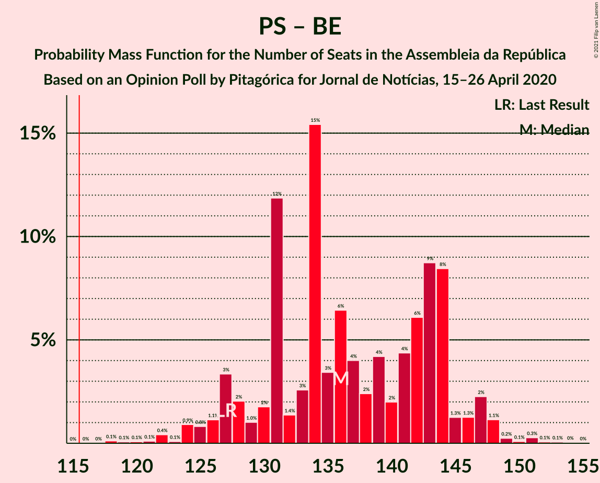

| Number of Seats | Probability | Accumulated | Special Marks |
|:---------------:|:-----------:|:-----------:|:-------------:|
| 118 | 0.1% | 100% |  |
| 119 | 0.1% | 99.9% |  |
| 120 | 0.1% | 99.8% |  |
| 121 | 0.1% | 99.7% |  |
| 122 | 0.4% | 99.6% |  |
| 123 | 0.1% | 99.2% |  |
| 124 | 0.9% | 99.1% |  |
| 125 | 0.8% | 98% |  |
| 126 | 1.1% | 97% |  |
| 127 | 3% | 96% | Last Result |
| 128 | 2% | 93% |  |
| 129 | 1.0% | 91% |  |
| 130 | 2% | 90% |  |
| 131 | 12% | 88% |  |
| 132 | 1.4% | 76% |  |
| 133 | 3% | 75% |  |
| 134 | 15% | 72% |  |
| 135 | 3% | 57% |  |
| 136 | 6% | 53% | Median |
| 137 | 4% | 47% |  |
| 138 | 2% | 43% |  |
| 139 | 4% | 41% |  |
| 140 | 2% | 36% |  |
| 141 | 4% | 34% |  |
| 142 | 6% | 30% |  |
| 143 | 9% | 24% |  |
| 144 | 8% | 15% |  |
| 145 | 1.3% | 7% |  |
| 146 | 1.3% | 5% |  |
| 147 | 2% | 4% |  |
| 148 | 1.1% | 2% |  |
| 149 | 0.2% | 0.8% |  |
| 150 | 0.1% | 0.6% |  |
| 151 | 0.3% | 0.5% |  |
| 152 | 0.1% | 0.2% |  |
| 153 | 0.1% | 0.1% |  |
| 154 | 0% | 0.1% |  |
| 155 | 0% | 0% |  |

### Partido Socialista – Coligação Democrática Unitária

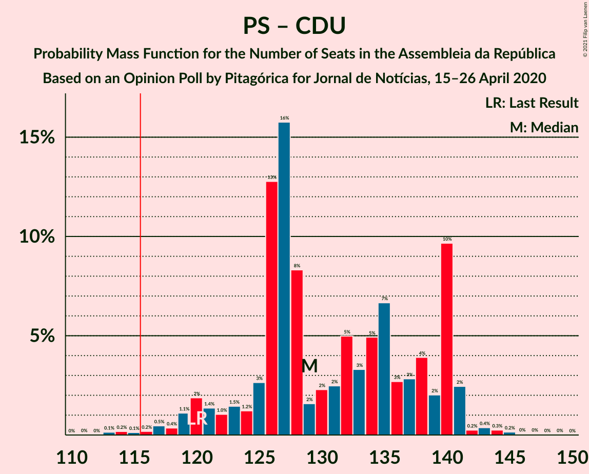

| Number of Seats | Probability | Accumulated | Special Marks |
|:---------------:|:-----------:|:-----------:|:-------------:|
| 113 | 0.1% | 100% |  |
| 114 | 0.2% | 99.8% |  |
| 115 | 0.1% | 99.6% |  |
| 116 | 0.2% | 99.5% | Majority |
| 117 | 0.5% | 99.3% |  |
| 118 | 0.4% | 98.9% |  |
| 119 | 1.1% | 98.5% |  |
| 120 | 2% | 97% | Last Result |
| 121 | 1.4% | 96% |  |
| 122 | 1.0% | 94% |  |
| 123 | 1.5% | 93% |  |
| 124 | 1.2% | 92% |  |
| 125 | 3% | 90% |  |
| 126 | 13% | 88% |  |
| 127 | 16% | 75% |  |
| 128 | 8% | 59% |  |
| 129 | 2% | 51% |  |
| 130 | 2% | 49% | Median |
| 131 | 2% | 47% |  |
| 132 | 5% | 45% |  |
| 133 | 3% | 40% |  |
| 134 | 5% | 36% |  |
| 135 | 7% | 31% |  |
| 136 | 3% | 25% |  |
| 137 | 3% | 22% |  |
| 138 | 4% | 19% |  |
| 139 | 2% | 15% |  |
| 140 | 10% | 13% |  |
| 141 | 2% | 4% |  |
| 142 | 0.2% | 1.2% |  |
| 143 | 0.4% | 0.9% |  |
| 144 | 0.3% | 0.5% |  |
| 145 | 0.2% | 0.3% |  |
| 146 | 0% | 0.1% |  |
| 147 | 0% | 0.1% |  |
| 148 | 0% | 0% |  |

### Partido Socialista

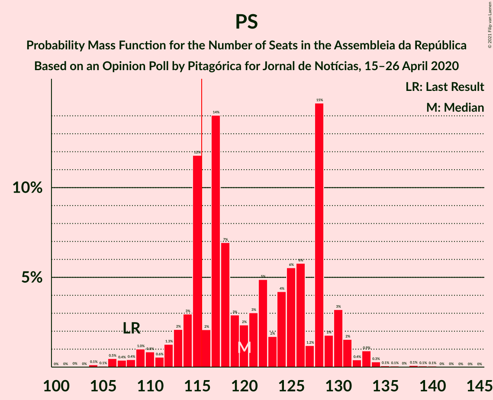

| Number of Seats | Probability | Accumulated | Special Marks |
|:---------------:|:-----------:|:-----------:|:-------------:|
| 103 | 0% | 100% |  |
| 104 | 0.1% | 99.9% |  |
| 105 | 0.1% | 99.8% |  |
| 106 | 0.5% | 99.8% |  |
| 107 | 0.4% | 99.3% |  |
| 108 | 0.4% | 98.9% | Last Result |
| 109 | 1.0% | 98% |  |
| 110 | 0.8% | 97% |  |
| 111 | 0.6% | 97% |  |
| 112 | 1.3% | 96% |  |
| 113 | 2% | 95% |  |
| 114 | 3% | 93% |  |
| 115 | 12% | 90% |  |
| 116 | 2% | 78% | Majority |
| 117 | 14% | 76% |  |
| 118 | 7% | 62% |  |
| 119 | 3% | 55% |  |
| 120 | 2% | 52% | Median |
| 121 | 3% | 50% |  |
| 122 | 5% | 47% |  |
| 123 | 2% | 42% |  |
| 124 | 4% | 40% |  |
| 125 | 6% | 36% |  |
| 126 | 6% | 30% |  |
| 127 | 1.2% | 24% |  |
| 128 | 15% | 23% |  |
| 129 | 2% | 9% |  |
| 130 | 3% | 7% |  |
| 131 | 2% | 4% |  |
| 132 | 0.4% | 2% |  |
| 133 | 0.9% | 2% |  |
| 134 | 0.3% | 0.7% |  |
| 135 | 0.1% | 0.4% |  |
| 136 | 0.1% | 0.4% |  |
| 137 | 0% | 0.3% |  |
| 138 | 0.1% | 0.2% |  |
| 139 | 0.1% | 0.2% |  |
| 140 | 0.1% | 0.1% |  |
| 141 | 0% | 0% |  |

### Partido Social Democrata – CDS–Partido Popular

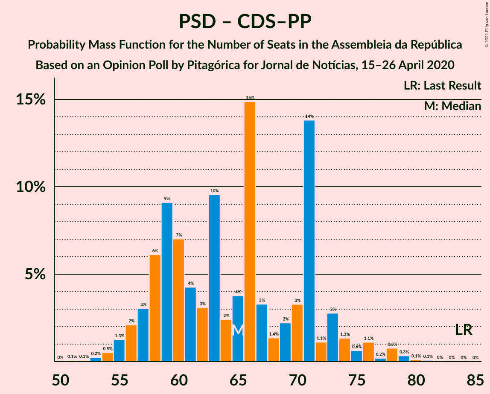

| Number of Seats | Probability | Accumulated | Special Marks |
|:---------------:|:-----------:|:-----------:|:-------------:|
| 50 | 0% | 100% |  |
| 51 | 0.1% | 99.9% |  |
| 52 | 0.1% | 99.9% |  |
| 53 | 0.2% | 99.8% |  |
| 54 | 0.5% | 99.6% |  |
| 55 | 1.3% | 99.1% |  |
| 56 | 2% | 98% |  |
| 57 | 3% | 96% |  |
| 58 | 6% | 93% |  |
| 59 | 9% | 87% |  |
| 60 | 7% | 77% |  |
| 61 | 4% | 70% |  |
| 62 | 3% | 66% |  |
| 63 | 10% | 63% |  |
| 64 | 2% | 54% |  |
| 65 | 4% | 51% | Median |
| 66 | 15% | 47% |  |
| 67 | 3% | 32% |  |
| 68 | 1.4% | 29% |  |
| 69 | 2% | 28% |  |
| 70 | 3% | 26% |  |
| 71 | 14% | 22% |  |
| 72 | 1.1% | 9% |  |
| 73 | 3% | 7% |  |
| 74 | 1.3% | 5% |  |
| 75 | 0.6% | 3% |  |
| 76 | 1.1% | 3% |  |
| 77 | 0.2% | 2% |  |
| 78 | 0.8% | 1.3% |  |
| 79 | 0.3% | 0.6% |  |
| 80 | 0.1% | 0.2% |  |
| 81 | 0.1% | 0.1% |  |
| 82 | 0% | 0.1% |  |
| 83 | 0% | 0% |  |
| 84 | 0% | 0% | Last Result |

## Technical Information

### Opinion Poll

+ **Polling firm:** Pitagórica
+ **Commissioner(s):** Jornal de Notícias
+ **Fieldwork period:** 15–26 April 2020

### Calculations

+ **Sample size:** 605
+ **Simulations done:** 131,072
+ **Error estimate:** 0.73%

