# Opinion Poll by Eurosondagem, 4–7 May 2020

<a href="#voting-intentions">Voting Intentions</a> | <a href="#seats">Seats</a> | <a href="#coalitions">Coalitions</a> | <a href="#technical-information">Technical Information</a>

## Voting Intentions

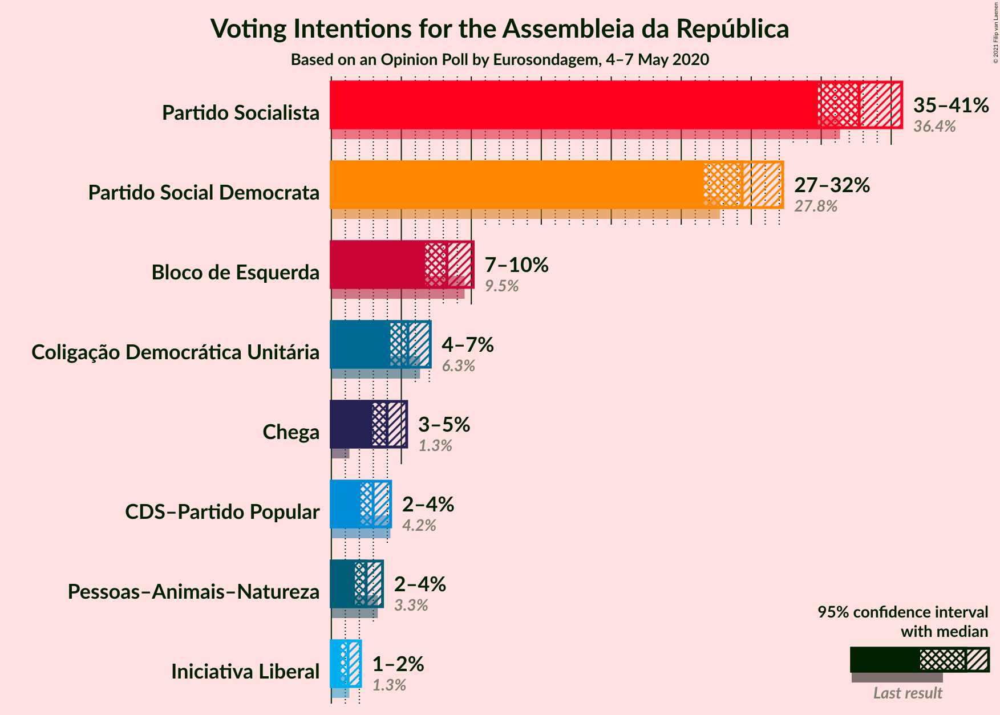

### Confidence Intervals

| Party | Last Result | Poll Result | 80% Confidence Interval | 90% Confidence Interval | 95% Confidence Interval | 99% Confidence Interval |
|:-----:|:-----------:|:-----------:|:-----------------------:|:-----------------------:|:-----------------------:|:-----------------------:|
| Partido Socialista | 36.4% | 37.7% | 35.8–39.7% |35.2–40.3% |34.8–40.8% |33.9–41.7% |
| Partido Social Democrata | 27.8% | 29.4% | 27.6–31.2% |27.1–31.8% |26.6–32.3% |25.8–33.2% |
| Bloco de Esquerda | 9.5% | 8.3% | 7.2–9.5% |7.0–9.8% |6.7–10.1% |6.2–10.7% |
| Coligação Democrática Unitária | 6.3% | 5.5% | 4.6–6.5% |4.4–6.8% |4.2–7.1% |3.9–7.6% |
| Chega | 1.3% | 4.0% | 3.3–4.9% |3.1–5.2% |2.9–5.4% |2.6–5.9% |
| CDS–Partido Popular | 4.2% | 3.0% | 2.4–3.8% |2.2–4.0% |2.1–4.2% |1.8–4.7% |
| Pessoas–Animais–Natureza | 3.3% | 2.5% | 2.0–3.2% |1.8–3.5% |1.7–3.7% |1.5–4.1% |
| Iniciativa Liberal | 1.3% | 1.2% | 0.9–1.8% |0.8–1.9% |0.7–2.1% |0.5–2.4% |

*Note:* The poll result column reflects the actual value used in the calculations. Published results may vary slightly, and in addition be rounded to fewer digits.

## Seats

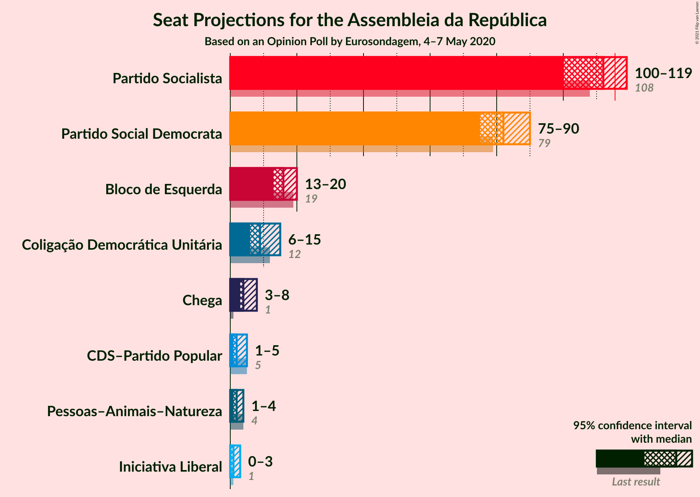

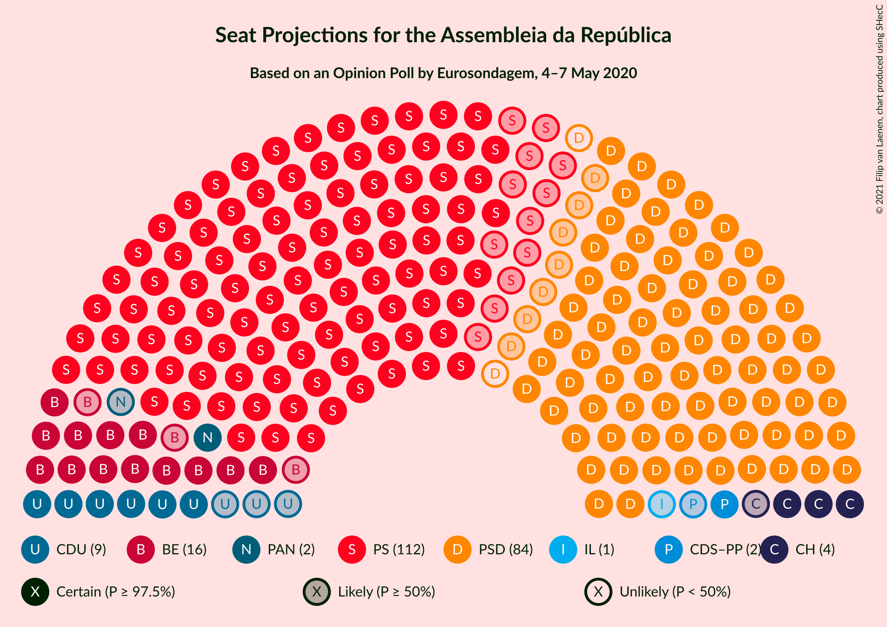

### Confidence Intervals

| Party | Last Result | Median | 80% Confidence Interval | 90% Confidence Interval | 95% Confidence Interval | 99% Confidence Interval |
|:-----:|:-----------:|:------:|:-----------------------:|:-----------------------:|:-----------------------:|:-----------------------:|
| <a href="#partido-socialista">Partido Socialista</a> | 108 | 112 | 105–115 |102–117 |100–119 |97–121 |
| <a href="#partido-social-democrata">Partido Social Democrata</a> | 79 | 82 | 78–88 |77–89 |75–90 |72–97 |
| <a href="#bloco-de-esquerda">Bloco de Esquerda</a> | 19 | 16 | 15–19 |15–19 |13–20 |11–21 |
| <a href="#coligação-democrática-unitária">Coligação Democrática Unitária</a> | 12 | 9 | 7–12 |7–13 |6–15 |5–16 |
| <a href="#chega">Chega</a> | 1 | 4 | 3–6 |3–8 |3–8 |2–9 |
| <a href="#cds–partido-popular">CDS–Partido Popular</a> | 5 | 2 | 1–4 |1–5 |1–5 |1–5 |
| <a href="#pessoas–animais–natureza">Pessoas–Animais–Natureza</a> | 4 | 2 | 1–4 |1–4 |1–4 |1–4 |
| <a href="#iniciativa-liberal">Iniciativa Liberal</a> | 1 | 1 | 0–2 |0–3 |0–3 |0–3 |

### Partido Socialista

*For a full overview of the results for this party, see the [Partido Socialista](party-partidosocialista.html) page.*

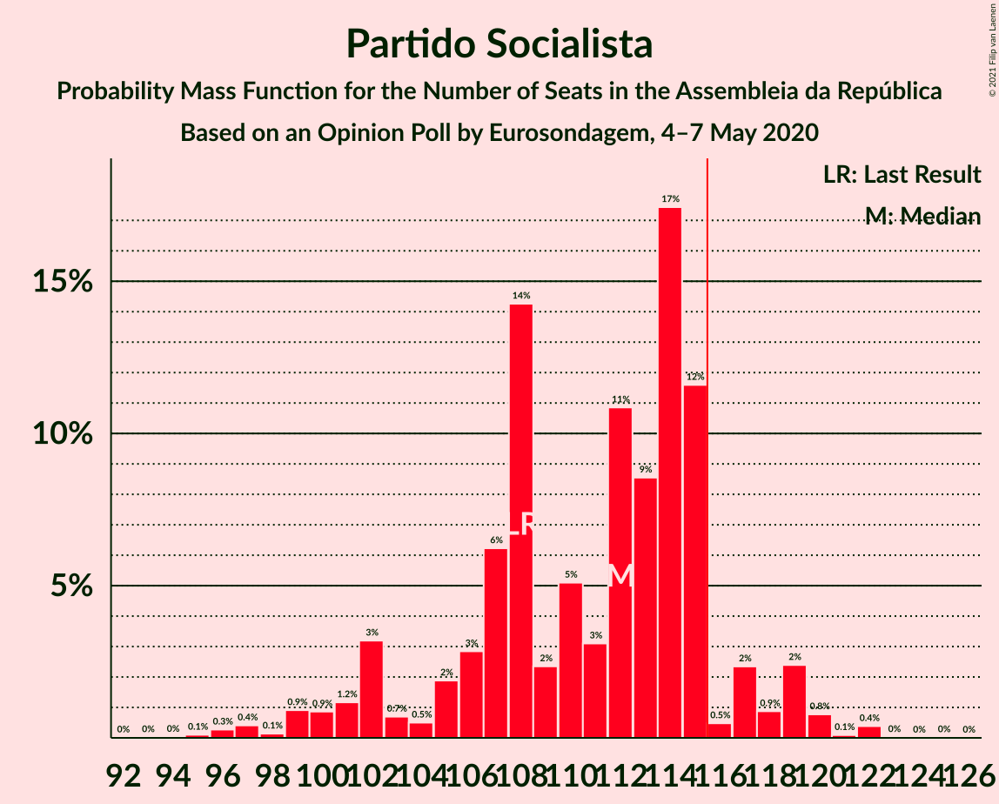

| Number of Seats | Probability | Accumulated | Special Marks |
|:---------------:|:-----------:|:-----------:|:-------------:|
| 93 | 0% | 100% |  |
| 94 | 0% | 99.9% |  |
| 95 | 0.1% | 99.9% |  |
| 96 | 0.3% | 99.8% |  |
| 97 | 0.4% | 99.5% |  |
| 98 | 0.1% | 99.1% |  |
| 99 | 0.9% | 99.0% |  |
| 100 | 0.9% | 98% |  |
| 101 | 1.2% | 97% |  |
| 102 | 3% | 96% |  |
| 103 | 0.7% | 93% |  |
| 104 | 0.5% | 92% |  |
| 105 | 2% | 92% |  |
| 106 | 3% | 90% |  |
| 107 | 6% | 87% |  |
| 108 | 14% | 81% | Last Result |
| 109 | 2% | 66% |  |
| 110 | 5% | 64% |  |
| 111 | 3% | 59% |  |
| 112 | 11% | 56% | Median |
| 113 | 9% | 45% |  |
| 114 | 17% | 36% |  |
| 115 | 12% | 19% |  |
| 116 | 0.5% | 7% | Majority |
| 117 | 2% | 7% |  |
| 118 | 0.9% | 5% |  |
| 119 | 2% | 4% |  |
| 120 | 0.8% | 1.3% |  |
| 121 | 0.1% | 0.6% |  |
| 122 | 0.4% | 0.5% |  |
| 123 | 0% | 0.1% |  |
| 124 | 0% | 0.1% |  |
| 125 | 0% | 0% |  |

### Partido Social Democrata

*For a full overview of the results for this party, see the [Partido Social Democrata](party-partidosocialdemocrata.html) page.*

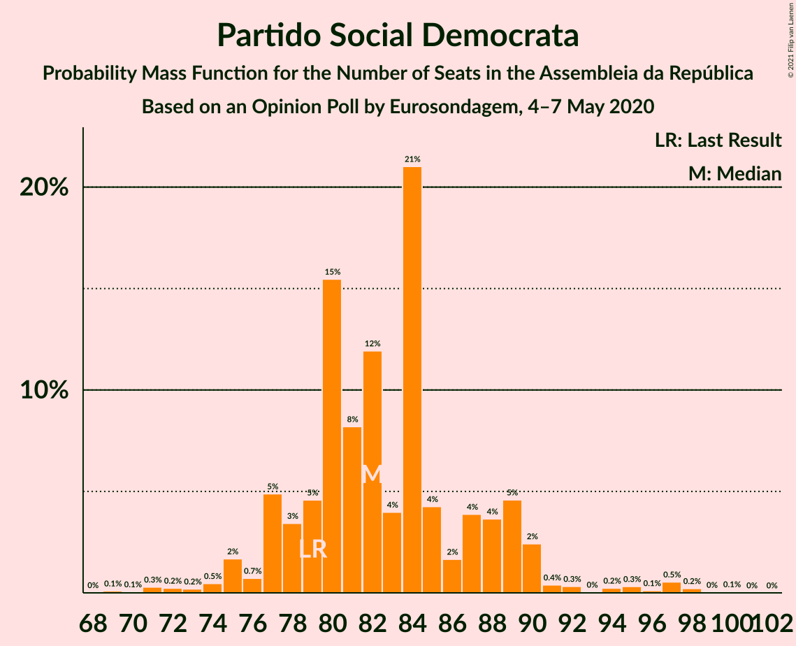

| Number of Seats | Probability | Accumulated | Special Marks |
|:---------------:|:-----------:|:-----------:|:-------------:|
| 69 | 0.1% | 100% |  |
| 70 | 0.1% | 99.9% |  |
| 71 | 0.3% | 99.8% |  |
| 72 | 0.2% | 99.5% |  |
| 73 | 0.2% | 99.3% |  |
| 74 | 0.5% | 99.1% |  |
| 75 | 2% | 98.6% |  |
| 76 | 0.7% | 97% |  |
| 77 | 5% | 96% |  |
| 78 | 3% | 91% |  |
| 79 | 5% | 88% | Last Result |
| 80 | 15% | 83% |  |
| 81 | 8% | 68% |  |
| 82 | 12% | 60% | Median |
| 83 | 4% | 48% |  |
| 84 | 21% | 44% |  |
| 85 | 4% | 23% |  |
| 86 | 2% | 18% |  |
| 87 | 4% | 17% |  |
| 88 | 4% | 13% |  |
| 89 | 5% | 9% |  |
| 90 | 2% | 5% |  |
| 91 | 0.4% | 2% |  |
| 92 | 0.3% | 2% |  |
| 93 | 0% | 2% |  |
| 94 | 0.2% | 2% |  |
| 95 | 0.3% | 1.3% |  |
| 96 | 0.1% | 1.0% |  |
| 97 | 0.5% | 0.9% |  |
| 98 | 0.2% | 0.3% |  |
| 99 | 0% | 0.1% |  |
| 100 | 0.1% | 0.1% |  |
| 101 | 0% | 0% |  |

### Bloco de Esquerda

*For a full overview of the results for this party, see the [Bloco de Esquerda](party-blocodeesquerda.html) page.*

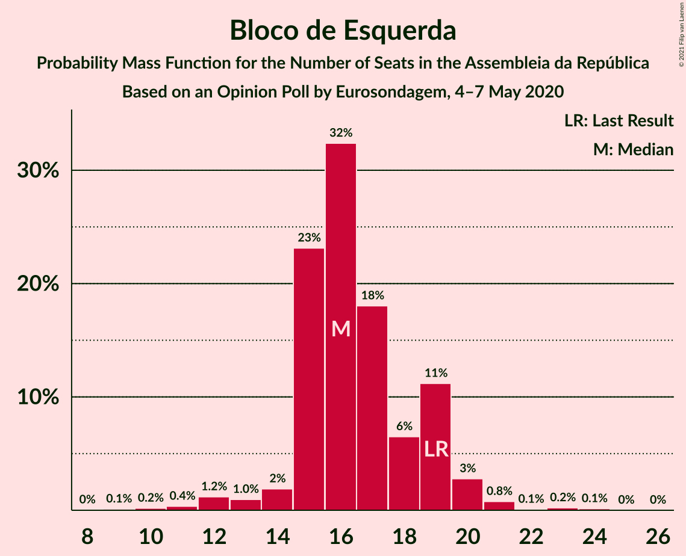

| Number of Seats | Probability | Accumulated | Special Marks |
|:---------------:|:-----------:|:-----------:|:-------------:|
| 9 | 0.1% | 100% |  |
| 10 | 0.2% | 99.8% |  |
| 11 | 0.4% | 99.7% |  |
| 12 | 1.2% | 99.3% |  |
| 13 | 1.0% | 98% |  |
| 14 | 2% | 97% |  |
| 15 | 23% | 95% |  |
| 16 | 32% | 72% | Median |
| 17 | 18% | 40% |  |
| 18 | 6% | 22% |  |
| 19 | 11% | 15% | Last Result |
| 20 | 3% | 4% |  |
| 21 | 0.8% | 1.2% |  |
| 22 | 0.1% | 0.5% |  |
| 23 | 0.2% | 0.4% |  |
| 24 | 0.1% | 0.2% |  |
| 25 | 0% | 0% |  |

### Coligação Democrática Unitária

*For a full overview of the results for this party, see the [Coligação Democrática Unitária](party-coligaçãodemocráticaunitária.html) page.*

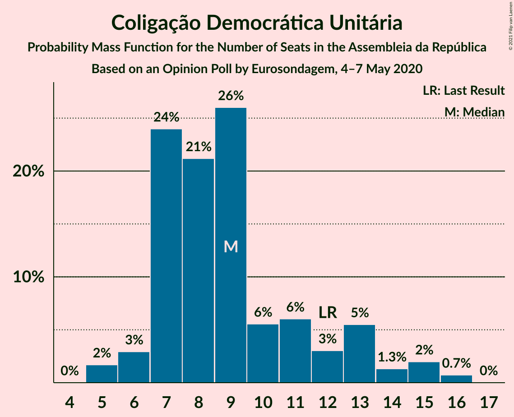

| Number of Seats | Probability | Accumulated | Special Marks |
|:---------------:|:-----------:|:-----------:|:-------------:|
| 5 | 2% | 100% |  |
| 6 | 3% | 98% |  |
| 7 | 24% | 95% |  |
| 8 | 21% | 71% |  |
| 9 | 26% | 50% | Median |
| 10 | 6% | 24% |  |
| 11 | 6% | 19% |  |
| 12 | 3% | 13% | Last Result |
| 13 | 5% | 10% |  |
| 14 | 1.3% | 4% |  |
| 15 | 2% | 3% |  |
| 16 | 0.7% | 0.8% |  |
| 17 | 0% | 0% |  |

### Chega

*For a full overview of the results for this party, see the [Chega](party-chega.html) page.*

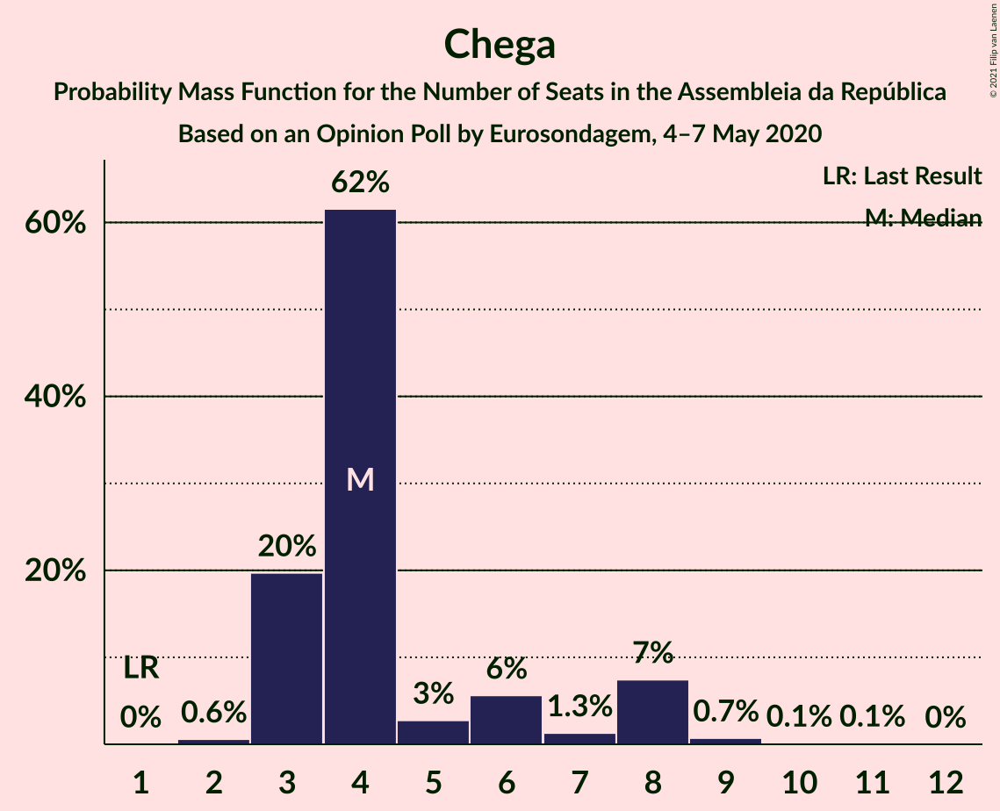

| Number of Seats | Probability | Accumulated | Special Marks |
|:---------------:|:-----------:|:-----------:|:-------------:|
| 1 | 0% | 100% | Last Result |
| 2 | 0.6% | 100% |  |
| 3 | 20% | 99.4% |  |
| 4 | 62% | 80% | Median |
| 5 | 3% | 18% |  |
| 6 | 6% | 15% |  |
| 7 | 1.3% | 10% |  |
| 8 | 7% | 8% |  |
| 9 | 0.7% | 1.0% |  |
| 10 | 0.1% | 0.3% |  |
| 11 | 0.1% | 0.1% |  |
| 12 | 0% | 0% |  |

### CDS–Partido Popular

*For a full overview of the results for this party, see the [CDS–Partido Popular](party-cds–partidopopular.html) page.*

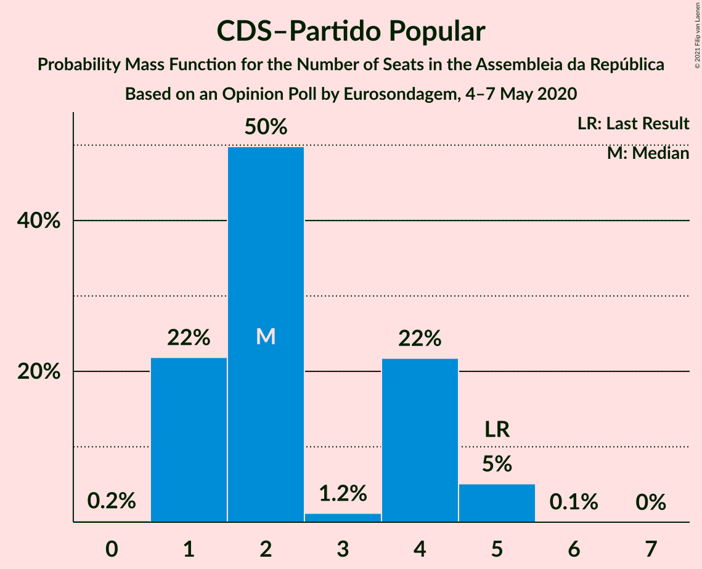

| Number of Seats | Probability | Accumulated | Special Marks |
|:---------------:|:-----------:|:-----------:|:-------------:|
| 0 | 0.2% | 100% |  |
| 1 | 22% | 99.8% |  |
| 2 | 50% | 78% | Median |
| 3 | 1.2% | 28% |  |
| 4 | 22% | 27% |  |
| 5 | 5% | 5% | Last Result |
| 6 | 0.1% | 0.1% |  |
| 7 | 0% | 0% |  |

### Pessoas–Animais–Natureza

*For a full overview of the results for this party, see the [Pessoas–Animais–Natureza](party-pessoas–animais–natureza.html) page.*

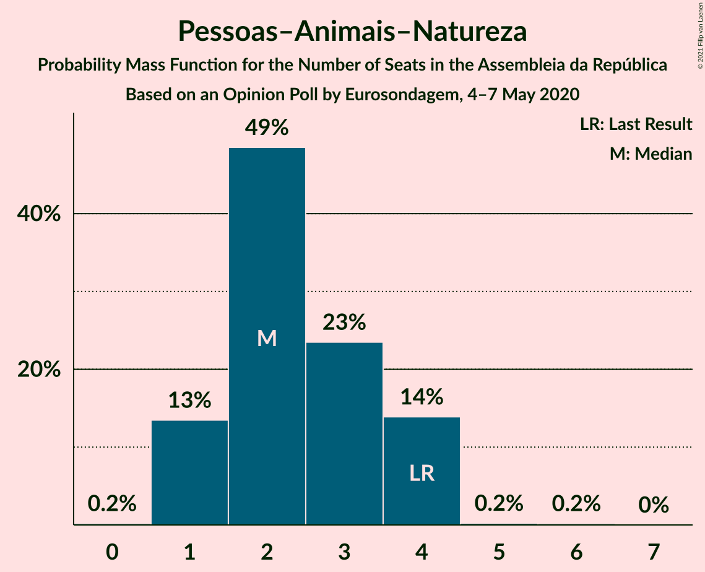

| Number of Seats | Probability | Accumulated | Special Marks |
|:---------------:|:-----------:|:-----------:|:-------------:|
| 0 | 0.2% | 100% |  |
| 1 | 13% | 99.8% |  |
| 2 | 49% | 86% | Median |
| 3 | 23% | 38% |  |
| 4 | 14% | 14% | Last Result |
| 5 | 0.2% | 0.4% |  |
| 6 | 0.2% | 0.2% |  |
| 7 | 0% | 0% |  |

### Iniciativa Liberal

*For a full overview of the results for this party, see the [Iniciativa Liberal](party-iniciativaliberal.html) page.*

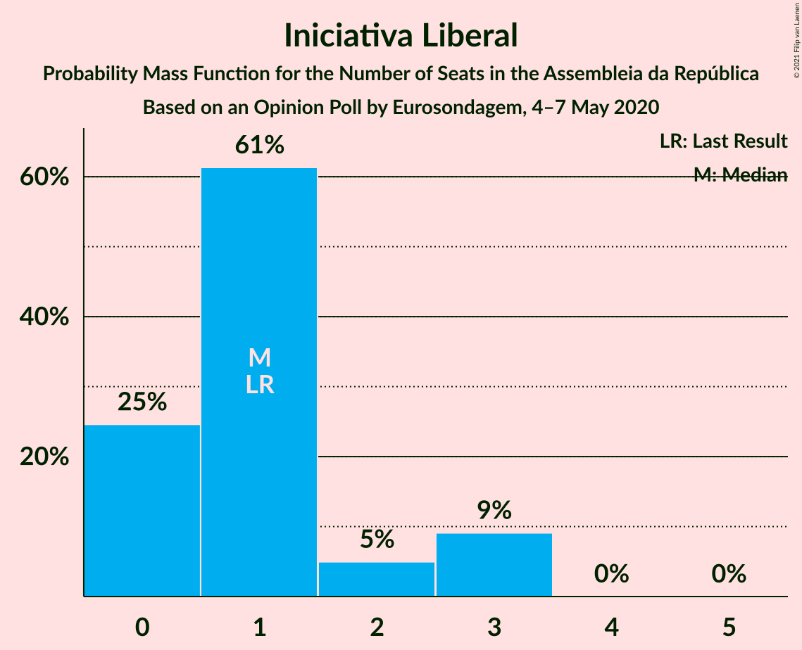

| Number of Seats | Probability | Accumulated | Special Marks |
|:---------------:|:-----------:|:-----------:|:-------------:|
| 0 | 25% | 100% |  |
| 1 | 61% | 75% | Last Result, Median |
| 2 | 5% | 14% |  |
| 3 | 9% | 9% |  |
| 4 | 0% | 0% |  |

## Coalitions

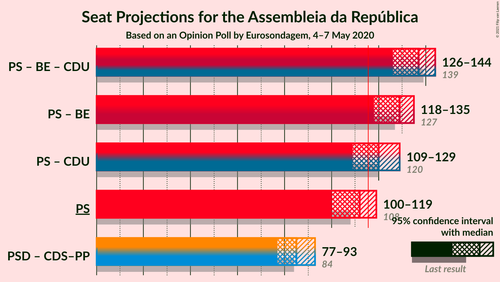

### Confidence Intervals

| Coalition | Last Result | Median | Majority? | 80% Confidence Interval | 90% Confidence Interval | 95% Confidence Interval | 99% Confidence Interval |
|:---------:|:-----------:|:------:|:---------:|:-----------------------:|:-----------------------:|:-----------------------:|:-----------------------:|
| Partido Socialista – Bloco de Esquerda – Coligação Democrática Unitária | 139 | 137 | 100% | 131–142 | 129–143 | 126–144 | 123–146 |
| Partido Socialista – Bloco de Esquerda | 127 | 129 | 98.9% | 122–132 | 118–133 | 118–135 | 112–138 |
| Partido Socialista – Coligação Democrática Unitária | 120 | 120 | 86% | 115–125 | 112–126 | 109–129 | 106–130 |
| Partido Socialista | 108 | 112 | 7% | 105–115 | 102–117 | 100–119 | 97–121 |
| Partido Social Democrata – CDS–Partido Popular | 84 | 85 | 0% | 81–90 | 79–91 | 77–93 | 74–99 |

### Partido Socialista – Bloco de Esquerda – Coligação Democrática Unitária

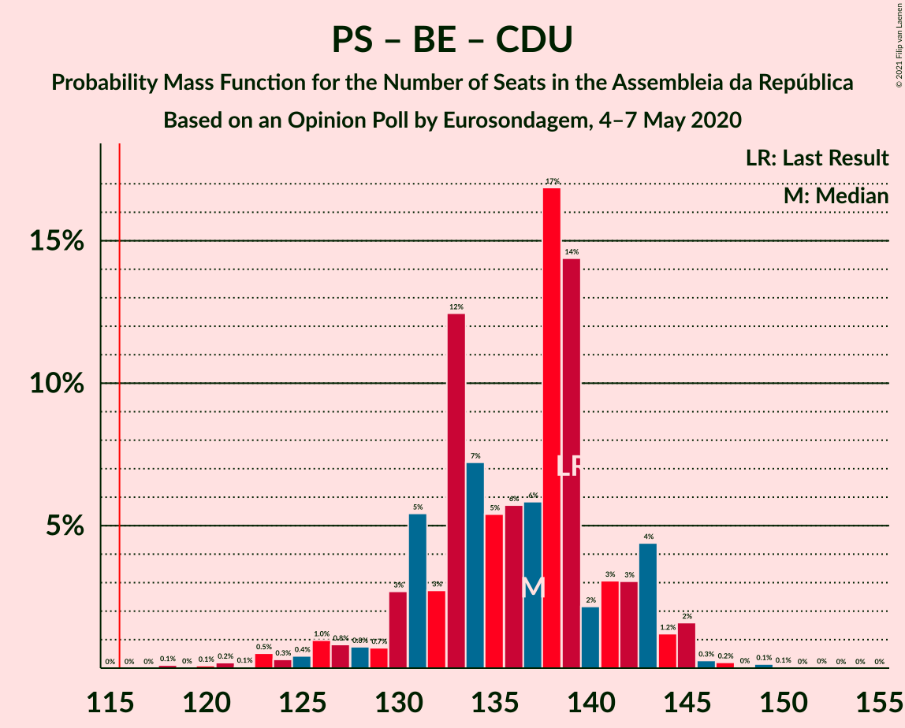

| Number of Seats | Probability | Accumulated | Special Marks |
|:---------------:|:-----------:|:-----------:|:-------------:|
| 118 | 0.1% | 100% |  |
| 119 | 0% | 99.9% |  |
| 120 | 0.1% | 99.9% |  |
| 121 | 0.2% | 99.8% |  |
| 122 | 0.1% | 99.6% |  |
| 123 | 0.5% | 99.5% |  |
| 124 | 0.3% | 99.0% |  |
| 125 | 0.4% | 98.7% |  |
| 126 | 1.0% | 98% |  |
| 127 | 0.8% | 97% |  |
| 128 | 0.8% | 96% |  |
| 129 | 0.7% | 96% |  |
| 130 | 3% | 95% |  |
| 131 | 5% | 92% |  |
| 132 | 3% | 87% |  |
| 133 | 12% | 84% |  |
| 134 | 7% | 72% |  |
| 135 | 5% | 64% |  |
| 136 | 6% | 59% |  |
| 137 | 6% | 53% | Median |
| 138 | 17% | 47% |  |
| 139 | 14% | 31% | Last Result |
| 140 | 2% | 16% |  |
| 141 | 3% | 14% |  |
| 142 | 3% | 11% |  |
| 143 | 4% | 8% |  |
| 144 | 1.2% | 4% |  |
| 145 | 2% | 2% |  |
| 146 | 0.3% | 0.7% |  |
| 147 | 0.2% | 0.5% |  |
| 148 | 0% | 0.3% |  |
| 149 | 0.1% | 0.2% |  |
| 150 | 0.1% | 0.1% |  |
| 151 | 0% | 0% |  |

### Partido Socialista – Bloco de Esquerda

| Number of Seats | Probability | Accumulated | Special Marks |
|:---------------:|:-----------:|:-----------:|:-------------:|
| 109 | 0% | 100% |  |
| 110 | 0% | 99.9% |  |
| 111 | 0.3% | 99.9% |  |
| 112 | 0.1% | 99.6% |  |
| 113 | 0.3% | 99.5% |  |
| 114 | 0.1% | 99.1% |  |
| 115 | 0.1% | 99.1% |  |
| 116 | 0.5% | 98.9% | Majority |
| 117 | 0.4% | 98% |  |
| 118 | 4% | 98% |  |
| 119 | 1.3% | 94% |  |
| 120 | 2% | 93% |  |
| 121 | 1.3% | 91% |  |
| 122 | 4% | 90% |  |
| 123 | 6% | 87% |  |
| 124 | 11% | 80% |  |
| 125 | 1.2% | 69% |  |
| 126 | 4% | 68% |  |
| 127 | 11% | 64% | Last Result |
| 128 | 2% | 53% | Median |
| 129 | 17% | 51% |  |
| 130 | 8% | 35% |  |
| 131 | 3% | 27% |  |
| 132 | 16% | 24% |  |
| 133 | 5% | 8% |  |
| 134 | 0.3% | 4% |  |
| 135 | 2% | 4% |  |
| 136 | 0.8% | 1.5% |  |
| 137 | 0.1% | 0.7% |  |
| 138 | 0.4% | 0.6% |  |
| 139 | 0.1% | 0.2% |  |
| 140 | 0.1% | 0.1% |  |
| 141 | 0% | 0.1% |  |
| 142 | 0% | 0% |  |

### Partido Socialista – Coligação Democrática Unitária

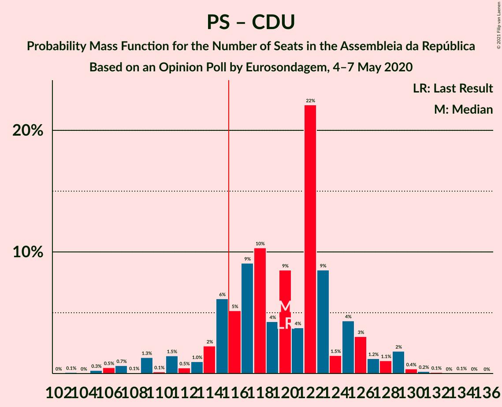

| Number of Seats | Probability | Accumulated | Special Marks |
|:---------------:|:-----------:|:-----------:|:-------------:|
| 102 | 0% | 100% |  |
| 103 | 0.1% | 99.9% |  |
| 104 | 0% | 99.8% |  |
| 105 | 0.3% | 99.8% |  |
| 106 | 0.5% | 99.6% |  |
| 107 | 0.7% | 99.1% |  |
| 108 | 0.1% | 98% |  |
| 109 | 1.3% | 98% |  |
| 110 | 0.1% | 97% |  |
| 111 | 1.5% | 97% |  |
| 112 | 0.5% | 95% |  |
| 113 | 1.0% | 95% |  |
| 114 | 2% | 94% |  |
| 115 | 6% | 92% |  |
| 116 | 5% | 86% | Majority |
| 117 | 9% | 80% |  |
| 118 | 10% | 71% |  |
| 119 | 4% | 61% |  |
| 120 | 9% | 57% | Last Result |
| 121 | 4% | 48% | Median |
| 122 | 22% | 44% |  |
| 123 | 9% | 22% |  |
| 124 | 1.5% | 14% |  |
| 125 | 4% | 12% |  |
| 126 | 3% | 8% |  |
| 127 | 1.2% | 5% |  |
| 128 | 1.1% | 4% |  |
| 129 | 2% | 3% |  |
| 130 | 0.4% | 0.8% |  |
| 131 | 0.2% | 0.4% |  |
| 132 | 0.1% | 0.2% |  |
| 133 | 0% | 0.1% |  |
| 134 | 0.1% | 0.1% |  |
| 135 | 0% | 0% |  |

### Partido Socialista

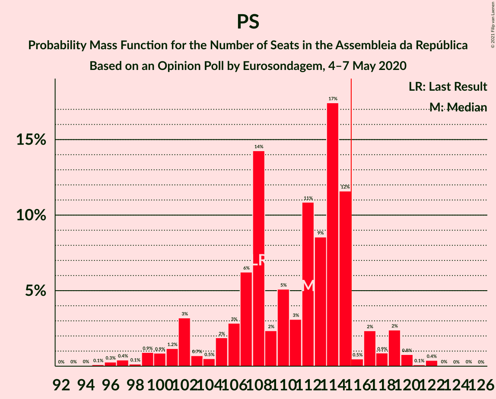

| Number of Seats | Probability | Accumulated | Special Marks |
|:---------------:|:-----------:|:-----------:|:-------------:|
| 93 | 0% | 100% |  |
| 94 | 0% | 99.9% |  |
| 95 | 0.1% | 99.9% |  |
| 96 | 0.3% | 99.8% |  |
| 97 | 0.4% | 99.5% |  |
| 98 | 0.1% | 99.1% |  |
| 99 | 0.9% | 99.0% |  |
| 100 | 0.9% | 98% |  |
| 101 | 1.2% | 97% |  |
| 102 | 3% | 96% |  |
| 103 | 0.7% | 93% |  |
| 104 | 0.5% | 92% |  |
| 105 | 2% | 92% |  |
| 106 | 3% | 90% |  |
| 107 | 6% | 87% |  |
| 108 | 14% | 81% | Last Result |
| 109 | 2% | 66% |  |
| 110 | 5% | 64% |  |
| 111 | 3% | 59% |  |
| 112 | 11% | 56% | Median |
| 113 | 9% | 45% |  |
| 114 | 17% | 36% |  |
| 115 | 12% | 19% |  |
| 116 | 0.5% | 7% | Majority |
| 117 | 2% | 7% |  |
| 118 | 0.9% | 5% |  |
| 119 | 2% | 4% |  |
| 120 | 0.8% | 1.3% |  |
| 121 | 0.1% | 0.6% |  |
| 122 | 0.4% | 0.5% |  |
| 123 | 0% | 0.1% |  |
| 124 | 0% | 0.1% |  |
| 125 | 0% | 0% |  |

### Partido Social Democrata – CDS–Partido Popular

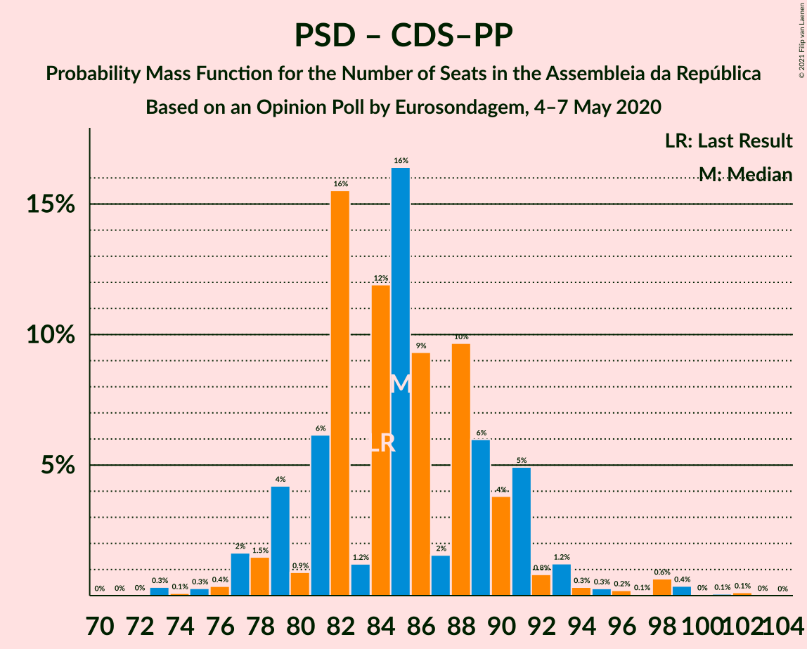

| Number of Seats | Probability | Accumulated | Special Marks |
|:---------------:|:-----------:|:-----------:|:-------------:|
| 71 | 0% | 100% |  |
| 72 | 0% | 99.9% |  |
| 73 | 0.3% | 99.9% |  |
| 74 | 0.1% | 99.6% |  |
| 75 | 0.3% | 99.5% |  |
| 76 | 0.4% | 99.2% |  |
| 77 | 2% | 98.8% |  |
| 78 | 1.5% | 97% |  |
| 79 | 4% | 96% |  |
| 80 | 0.9% | 92% |  |
| 81 | 6% | 91% |  |
| 82 | 16% | 84% |  |
| 83 | 1.2% | 69% |  |
| 84 | 12% | 68% | Last Result, Median |
| 85 | 16% | 56% |  |
| 86 | 9% | 39% |  |
| 87 | 2% | 30% |  |
| 88 | 10% | 29% |  |
| 89 | 6% | 19% |  |
| 90 | 4% | 13% |  |
| 91 | 5% | 9% |  |
| 92 | 0.8% | 4% |  |
| 93 | 1.2% | 3% |  |
| 94 | 0.3% | 2% |  |
| 95 | 0.3% | 2% |  |
| 96 | 0.2% | 2% |  |
| 97 | 0.1% | 1.3% |  |
| 98 | 0.6% | 1.3% |  |
| 99 | 0.4% | 0.6% |  |
| 100 | 0% | 0.3% |  |
| 101 | 0.1% | 0.2% |  |
| 102 | 0.1% | 0.2% |  |
| 103 | 0% | 0% |  |

## Technical Information

### Opinion Poll

+ **Polling firm:** Eurosondagem
+ **Commissioner(s):** —
+ **Fieldwork period:** 4–7 May 2020

### Calculations

+ **Sample size:** 1005
+ **Simulations done:** 131,072
+ **Error estimate:** 0.76%

