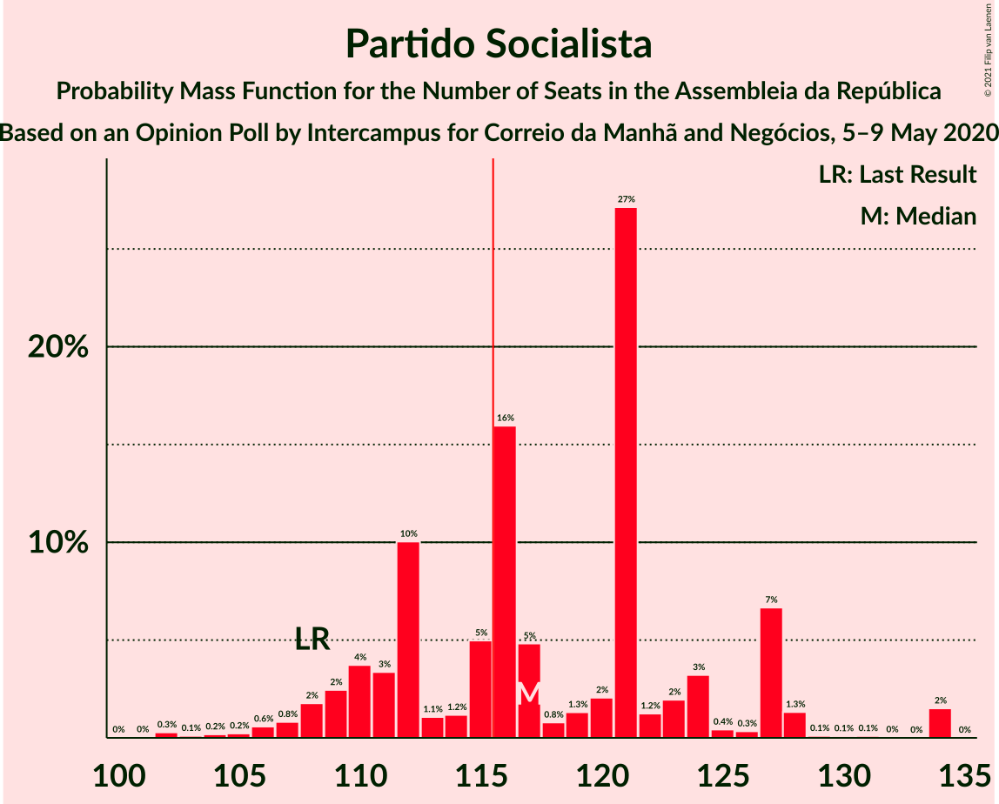

# Opinion Poll by Intercampus for Correio da Manhã and Negócios, 5–9 May 2020

<a href="#voting-intentions">Voting Intentions</a> | <a href="#seats">Seats</a> | <a href="#coalitions">Coalitions</a> | <a href="#technical-information">Technical Information</a>

## Voting Intentions

### Confidence Intervals

| Party | Last Result | Poll Result | 80% Confidence Interval | 90% Confidence Interval | 95% Confidence Interval | 99% Confidence Interval |
|:-----:|:-----------:|:-----------:|:-----------------------:|:-----------------------:|:-----------------------:|:-----------------------:|
| Partido Socialista | 36.4% | 40.3% | 37.8–42.9% |37.1–43.6% |36.5–44.2% |35.3–45.5% |
| Partido Social Democrata | 27.8% | 23.2% | 21.2–25.5% |20.6–26.2% |20.1–26.7% |19.1–27.8% |
| Bloco de Esquerda | 9.5% | 9.0% | 7.7–10.7% |7.3–11.1% |7.0–11.6% |6.4–12.4% |
| Chega | 1.3% | 6.8% | 5.6–8.2% |5.3–8.7% |5.0–9.0% |4.6–9.8% |
| Coligação Democrática Unitária | 6.3% | 6.0% | 4.9–7.4% |4.6–7.8% |4.4–8.1% |3.9–8.9% |
| CDS–Partido Popular | 4.2% | 3.5% | 2.8–4.7% |2.5–5.0% |2.3–5.3% |2.0–5.9% |
| Pessoas–Animais–Natureza | 3.3% | 3.5% | 2.8–4.7% |2.5–5.0% |2.3–5.3% |2.0–5.9% |
| Iniciativa Liberal | 1.3% | 3.2% | 2.5–4.3% |2.3–4.6% |2.1–4.9% |1.8–5.5% |
| LIVRE | 1.1% | 0.6% | 0.4–1.3% |0.3–1.5% |0.3–1.6% |0.2–2.0% |

*Note:* The poll result column reflects the actual value used in the calculations. Published results may vary slightly, and in addition be rounded to fewer digits.

## Seats

### Confidence Intervals

| Party | Last Result | Median | 80% Confidence Interval | 90% Confidence Interval | 95% Confidence Interval | 99% Confidence Interval |
|:-----:|:-----------:|:------:|:-----------------------:|:-----------------------:|:-----------------------:|:-----------------------:|
| <a href="#partido-socialista">Partido Socialista</a> | 108 | 117 | 110–126 |109–127 |108–128 |104–134 |
| <a href="#partido-social-democrata">Partido Social Democrata</a> | 79 | 61 | 56–69 |54–69 |54–71 |52–76 |
| <a href="#bloco-de-esquerda">Bloco de Esquerda</a> | 19 | 18 | 15–24 |13–24 |13–24 |11–25 |
| <a href="#chega">Chega</a> | 1 | 11 | 9–13 |8–14 |7–16 |5–17 |
| <a href="#coligação-democrática-unitária">Coligação Democrática Unitária</a> | 12 | 9 | 6–14 |5–14 |5–15 |5–18 |
| <a href="#cds–partido-popular">CDS–Partido Popular</a> | 5 | 3 | 1–5 |1–5 |1–5 |1–8 |
| <a href="#pessoas–animais–natureza">Pessoas–Animais–Natureza</a> | 4 | 4 | 2–6 |2–6 |2–8 |2–9 |
| <a href="#iniciativa-liberal">Iniciativa Liberal</a> | 1 | 4 | 3–6 |3–6 |2–6 |1–8 |
| <a href="#livre">LIVRE</a> | 1 | 0 | 0–1 |0–1 |0–1 |0–1 |

### Partido Socialista

*For a full overview of the results for this party, see the [Partido Socialista](party-partidosocialista.html) page.*

| Number of Seats | Probability | Accumulated | Special Marks |
|:---------------:|:-----------:|:-----------:|:-------------:|
| 100 | 0% | 100% |  |
| 101 | 0% | 99.9% |  |
| 102 | 0.3% | 99.9% |  |
| 103 | 0.1% | 99.6% |  |
| 104 | 0.2% | 99.5% |  |
| 105 | 0.2% | 99.3% |  |
| 106 | 0.6% | 99.1% |  |
| 107 | 0.8% | 98.5% |  |
| 108 | 2% | 98% | Last Result |
| 109 | 2% | 96% |  |
| 110 | 4% | 93% |  |
| 111 | 3% | 90% |  |
| 112 | 10% | 86% |  |
| 113 | 1.1% | 76% |  |
| 114 | 1.2% | 75% |  |
| 115 | 5% | 74% |  |
| 116 | 16% | 69% | Majority |
| 117 | 5% | 53% | Median |
| 118 | 0.8% | 48% |  |
| 119 | 1.3% | 48% |  |
| 120 | 2% | 46% |  |
| 121 | 27% | 44% |  |
| 122 | 1.2% | 17% |  |
| 123 | 2% | 16% |  |
| 124 | 3% | 14% |  |
| 125 | 0.4% | 11% |  |
| 126 | 0.3% | 10% |  |
| 127 | 7% | 10% |  |
| 128 | 1.3% | 3% |  |
| 129 | 0.1% | 2% |  |
| 130 | 0.1% | 2% |  |
| 131 | 0.1% | 2% |  |
| 132 | 0% | 2% |  |
| 133 | 0% | 2% |  |
| 134 | 2% | 2% |  |
| 135 | 0% | 0% |  |

### Partido Social Democrata

*For a full overview of the results for this party, see the [Partido Social Democrata](party-partidosocialdemocrata.html) page.*

| Number of Seats | Probability | Accumulated | Special Marks |
|:---------------:|:-----------:|:-----------:|:-------------:|
| 48 | 0.1% | 100% |  |
| 49 | 0.1% | 99.9% |  |
| 50 | 0.1% | 99.8% |  |
| 51 | 0.2% | 99.8% |  |
| 52 | 0.3% | 99.6% |  |
| 53 | 0.4% | 99.3% |  |
| 54 | 4% | 99.0% |  |
| 55 | 4% | 95% |  |
| 56 | 1.5% | 91% |  |
| 57 | 2% | 89% |  |
| 58 | 0.5% | 87% |  |
| 59 | 23% | 86% |  |
| 60 | 13% | 64% |  |
| 61 | 16% | 51% | Median |
| 62 | 0.3% | 35% |  |
| 63 | 3% | 34% |  |
| 64 | 3% | 31% |  |
| 65 | 5% | 28% |  |
| 66 | 7% | 23% |  |
| 67 | 2% | 16% |  |
| 68 | 0.2% | 14% |  |
| 69 | 10% | 14% |  |
| 70 | 0.6% | 4% |  |
| 71 | 1.0% | 3% |  |
| 72 | 1.3% | 2% |  |
| 73 | 0.2% | 1.1% |  |
| 74 | 0.1% | 0.9% |  |
| 75 | 0.2% | 0.8% |  |
| 76 | 0.3% | 0.6% |  |
| 77 | 0.1% | 0.3% |  |
| 78 | 0.1% | 0.3% |  |
| 79 | 0.1% | 0.2% | Last Result |
| 80 | 0% | 0% |  |

### Bloco de Esquerda

*For a full overview of the results for this party, see the [Bloco de Esquerda](party-blocodeesquerda.html) page.*

| Number of Seats | Probability | Accumulated | Special Marks |
|:---------------:|:-----------:|:-----------:|:-------------:|
| 8 | 0% | 100% |  |
| 9 | 0.2% | 99.9% |  |
| 10 | 0.1% | 99.8% |  |
| 11 | 0.7% | 99.7% |  |
| 12 | 0.2% | 99.0% |  |
| 13 | 5% | 98.8% |  |
| 14 | 4% | 94% |  |
| 15 | 7% | 90% |  |
| 16 | 8% | 84% |  |
| 17 | 22% | 75% |  |
| 18 | 17% | 53% | Median |
| 19 | 4% | 36% | Last Result |
| 20 | 9% | 33% |  |
| 21 | 5% | 23% |  |
| 22 | 1.1% | 19% |  |
| 23 | 1.4% | 18% |  |
| 24 | 16% | 16% |  |
| 25 | 0.1% | 0.6% |  |
| 26 | 0.2% | 0.5% |  |
| 27 | 0.1% | 0.3% |  |
| 28 | 0.1% | 0.2% |  |
| 29 | 0.1% | 0.1% |  |
| 30 | 0% | 0.1% |  |
| 31 | 0% | 0% |  |

### Chega

*For a full overview of the results for this party, see the [Chega](party-chega.html) page.*

| Number of Seats | Probability | Accumulated | Special Marks |
|:---------------:|:-----------:|:-----------:|:-------------:|
| 1 | 0% | 100% | Last Result |
| 2 | 0% | 100% |  |
| 3 | 0% | 100% |  |
| 4 | 0.4% | 100% |  |
| 5 | 0.2% | 99.6% |  |
| 6 | 0.6% | 99.4% |  |
| 7 | 2% | 98.9% |  |
| 8 | 3% | 97% |  |
| 9 | 19% | 93% |  |
| 10 | 10% | 74% |  |
| 11 | 49% | 64% | Median |
| 12 | 2% | 14% |  |
| 13 | 3% | 13% |  |
| 14 | 6% | 9% |  |
| 15 | 0.4% | 3% |  |
| 16 | 2% | 3% |  |
| 17 | 0.1% | 0.6% |  |
| 18 | 0.3% | 0.5% |  |
| 19 | 0.1% | 0.2% |  |
| 20 | 0.1% | 0.2% |  |
| 21 | 0.1% | 0.1% |  |
| 22 | 0% | 0% |  |

### Coligação Democrática Unitária

*For a full overview of the results for this party, see the [Coligação Democrática Unitária](party-coligaçãodemocráticaunitária.html) page.*

| Number of Seats | Probability | Accumulated | Special Marks |
|:---------------:|:-----------:|:-----------:|:-------------:|
| 5 | 7% | 100% |  |
| 6 | 5% | 93% |  |
| 7 | 2% | 88% |  |
| 8 | 21% | 85% |  |
| 9 | 17% | 64% | Median |
| 10 | 23% | 47% |  |
| 11 | 3% | 25% |  |
| 12 | 7% | 22% | Last Result |
| 13 | 5% | 15% |  |
| 14 | 5% | 10% |  |
| 15 | 4% | 5% |  |
| 16 | 0.5% | 1.4% |  |
| 17 | 0.1% | 0.9% |  |
| 18 | 0.7% | 0.8% |  |
| 19 | 0.1% | 0.2% |  |
| 20 | 0% | 0% |  |

### CDS–Partido Popular

*For a full overview of the results for this party, see the [CDS–Partido Popular](party-cds–partidopopular.html) page.*

| Number of Seats | Probability | Accumulated | Special Marks |
|:---------------:|:-----------:|:-----------:|:-------------:|
| 0 | 0.1% | 100% |  |
| 1 | 11% | 99.9% |  |
| 2 | 19% | 89% |  |
| 3 | 26% | 70% | Median |
| 4 | 8% | 44% |  |
| 5 | 35% | 36% | Last Result |
| 6 | 0.3% | 1.5% |  |
| 7 | 0.1% | 1.2% |  |
| 8 | 0.7% | 1.1% |  |
| 9 | 0.2% | 0.3% |  |
| 10 | 0% | 0.1% |  |
| 11 | 0.1% | 0.1% |  |
| 12 | 0% | 0% |  |

### Pessoas–Animais–Natureza

*For a full overview of the results for this party, see the [Pessoas–Animais–Natureza](party-pessoas–animais–natureza.html) page.*

| Number of Seats | Probability | Accumulated | Special Marks |
|:---------------:|:-----------:|:-----------:|:-------------:|
| 1 | 0.2% | 100% |  |
| 2 | 10% | 99.8% |  |
| 3 | 33% | 89% |  |
| 4 | 17% | 56% | Last Result, Median |
| 5 | 23% | 39% |  |
| 6 | 13% | 16% |  |
| 7 | 0.3% | 3% |  |
| 8 | 2% | 3% |  |
| 9 | 0.8% | 1.0% |  |
| 10 | 0.1% | 0.2% |  |
| 11 | 0.1% | 0.1% |  |
| 12 | 0% | 0% |  |

### Iniciativa Liberal

*For a full overview of the results for this party, see the [Iniciativa Liberal](party-iniciativaliberal.html) page.*

| Number of Seats | Probability | Accumulated | Special Marks |
|:---------------:|:-----------:|:-----------:|:-------------:|
| 1 | 0.7% | 100% | Last Result |
| 2 | 2% | 99.3% |  |
| 3 | 17% | 97% |  |
| 4 | 57% | 80% | Median |
| 5 | 11% | 22% |  |
| 6 | 11% | 11% |  |
| 7 | 0.1% | 0.8% |  |
| 8 | 0.5% | 0.7% |  |
| 9 | 0% | 0.2% |  |
| 10 | 0.1% | 0.1% |  |
| 11 | 0% | 0.1% |  |
| 12 | 0% | 0% |  |

### LIVRE

*For a full overview of the results for this party, see the [LIVRE](party-livre.html) page.*

| Number of Seats | Probability | Accumulated | Special Marks |
|:---------------:|:-----------:|:-----------:|:-------------:|
| 0 | 84% | 100% | Median |
| 1 | 16% | 16% | Last Result |
| 2 | 0.1% | 0.2% |  |
| 3 | 0% | 0% |  |

## Coalitions

### Confidence Intervals

| Coalition | Last Result | Median | Majority? | 80% Confidence Interval | 90% Confidence Interval | 95% Confidence Interval | 99% Confidence Interval |
|:---------:|:-----------:|:------:|:---------:|:-----------------------:|:-----------------------:|:-----------------------:|:-----------------------:|
| Partido Socialista – Bloco de Esquerda – Coligação Democrática Unitária | 139 | 146 | 100% | 139–150 | 137–151 | 136–154 | 131–156 |
| Partido Socialista – Bloco de Esquerda | 127 | 138 | 100% | 129–143 | 125–143 | 123–145 | 121–147 |
| Partido Socialista – Coligação Democrática Unitária | 120 | 128 | 98.9% | 121–132 | 120–135 | 117–137 | 113–141 |
| Partido Socialista | 108 | 117 | 69% | 110–126 | 109–127 | 108–128 | 104–134 |
| Partido Social Democrata – CDS–Partido Popular | 84 | 64 | 0% | 60–70 | 58–73 | 57–74 | 55–79 |

### Partido Socialista – Bloco de Esquerda – Coligação Democrática Unitária

| Number of Seats | Probability | Accumulated | Special Marks |
|:---------------:|:-----------:|:-----------:|:-------------:|
| 126 | 0% | 100% |  |
| 127 | 0% | 99.9% |  |
| 128 | 0.1% | 99.9% |  |
| 129 | 0% | 99.8% |  |
| 130 | 0% | 99.8% |  |
| 131 | 0.4% | 99.8% |  |
| 132 | 0.3% | 99.4% |  |
| 133 | 0.4% | 99.1% |  |
| 134 | 0.5% | 98.7% |  |
| 135 | 0.6% | 98% |  |
| 136 | 2% | 98% |  |
| 137 | 3% | 96% |  |
| 138 | 1.1% | 92% |  |
| 139 | 9% | 91% | Last Result |
| 140 | 0.6% | 82% |  |
| 141 | 1.4% | 81% |  |
| 142 | 5% | 80% |  |
| 143 | 1.2% | 75% |  |
| 144 | 3% | 73% | Median |
| 145 | 3% | 70% |  |
| 146 | 21% | 67% |  |
| 147 | 1.4% | 46% |  |
| 148 | 9% | 45% |  |
| 149 | 3% | 36% |  |
| 150 | 25% | 33% |  |
| 151 | 3% | 7% |  |
| 152 | 0.7% | 5% |  |
| 153 | 0.7% | 4% |  |
| 154 | 2% | 3% |  |
| 155 | 0.3% | 0.9% |  |
| 156 | 0.2% | 0.6% |  |
| 157 | 0.1% | 0.4% |  |
| 158 | 0.1% | 0.3% |  |
| 159 | 0.1% | 0.2% |  |
| 160 | 0.1% | 0.1% |  |
| 161 | 0% | 0% |  |

### Partido Socialista – Bloco de Esquerda

| Number of Seats | Probability | Accumulated | Special Marks |
|:---------------:|:-----------:|:-----------:|:-------------:|
| 117 | 0% | 100% |  |
| 118 | 0% | 99.9% |  |
| 119 | 0.1% | 99.9% |  |
| 120 | 0.2% | 99.8% |  |
| 121 | 0.1% | 99.6% |  |
| 122 | 0.2% | 99.5% |  |
| 123 | 3% | 99.3% |  |
| 124 | 1.3% | 96% |  |
| 125 | 0.6% | 95% |  |
| 126 | 0.4% | 94% |  |
| 127 | 2% | 94% | Last Result |
| 128 | 0.5% | 92% |  |
| 129 | 3% | 92% |  |
| 130 | 13% | 89% |  |
| 131 | 1.3% | 76% |  |
| 132 | 5% | 75% |  |
| 133 | 1.3% | 69% |  |
| 134 | 2% | 68% |  |
| 135 | 2% | 66% | Median |
| 136 | 2% | 64% |  |
| 137 | 1.3% | 62% |  |
| 138 | 22% | 61% |  |
| 139 | 2% | 38% |  |
| 140 | 16% | 36% |  |
| 141 | 7% | 21% |  |
| 142 | 2% | 13% |  |
| 143 | 9% | 12% |  |
| 144 | 0.3% | 3% |  |
| 145 | 0.2% | 3% |  |
| 146 | 0.1% | 2% |  |
| 147 | 2% | 2% |  |
| 148 | 0% | 0.3% |  |
| 149 | 0% | 0.2% |  |
| 150 | 0.1% | 0.2% |  |
| 151 | 0% | 0.1% |  |
| 152 | 0% | 0.1% |  |
| 153 | 0% | 0% |  |

### Partido Socialista – Coligação Democrática Unitária

| Number of Seats | Probability | Accumulated | Special Marks |
|:---------------:|:-----------:|:-----------:|:-------------:|
| 108 | 0% | 100% |  |
| 109 | 0% | 99.9% |  |
| 110 | 0% | 99.9% |  |
| 111 | 0.1% | 99.9% |  |
| 112 | 0.1% | 99.8% |  |
| 113 | 0.4% | 99.8% |  |
| 114 | 0.4% | 99.4% |  |
| 115 | 0.2% | 99.0% |  |
| 116 | 0.3% | 98.9% | Majority |
| 117 | 2% | 98.6% |  |
| 118 | 1.2% | 97% |  |
| 119 | 0.7% | 96% |  |
| 120 | 0.8% | 95% | Last Result |
| 121 | 10% | 94% |  |
| 122 | 2% | 84% |  |
| 123 | 0.9% | 83% |  |
| 124 | 7% | 82% |  |
| 125 | 0.4% | 74% |  |
| 126 | 16% | 74% | Median |
| 127 | 5% | 57% |  |
| 128 | 2% | 52% |  |
| 129 | 20% | 50% |  |
| 130 | 8% | 30% |  |
| 131 | 3% | 22% |  |
| 132 | 9% | 19% |  |
| 133 | 4% | 10% |  |
| 134 | 0.6% | 6% |  |
| 135 | 1.1% | 5% |  |
| 136 | 1.5% | 4% |  |
| 137 | 0.6% | 3% |  |
| 138 | 0.3% | 2% |  |
| 139 | 0.1% | 2% |  |
| 140 | 0.2% | 2% |  |
| 141 | 2% | 2% |  |
| 142 | 0% | 0.1% |  |
| 143 | 0% | 0% |  |

### Partido Socialista

| Number of Seats | Probability | Accumulated | Special Marks |
|:---------------:|:-----------:|:-----------:|:-------------:|
| 100 | 0% | 100% |  |
| 101 | 0% | 99.9% |  |
| 102 | 0.3% | 99.9% |  |
| 103 | 0.1% | 99.6% |  |
| 104 | 0.2% | 99.5% |  |
| 105 | 0.2% | 99.3% |  |
| 106 | 0.6% | 99.1% |  |
| 107 | 0.8% | 98.5% |  |
| 108 | 2% | 98% | Last Result |
| 109 | 2% | 96% |  |
| 110 | 4% | 93% |  |
| 111 | 3% | 90% |  |
| 112 | 10% | 86% |  |
| 113 | 1.1% | 76% |  |
| 114 | 1.2% | 75% |  |
| 115 | 5% | 74% |  |
| 116 | 16% | 69% | Majority |
| 117 | 5% | 53% | Median |
| 118 | 0.8% | 48% |  |
| 119 | 1.3% | 48% |  |
| 120 | 2% | 46% |  |
| 121 | 27% | 44% |  |
| 122 | 1.2% | 17% |  |
| 123 | 2% | 16% |  |
| 124 | 3% | 14% |  |
| 125 | 0.4% | 11% |  |
| 126 | 0.3% | 10% |  |
| 127 | 7% | 10% |  |
| 128 | 1.3% | 3% |  |
| 129 | 0.1% | 2% |  |
| 130 | 0.1% | 2% |  |
| 131 | 0.1% | 2% |  |
| 132 | 0% | 2% |  |
| 133 | 0% | 2% |  |
| 134 | 2% | 2% |  |
| 135 | 0% | 0% |  |

### Partido Social Democrata – CDS–Partido Popular

| Number of Seats | Probability | Accumulated | Special Marks |
|:---------------:|:-----------:|:-----------:|:-------------:|
| 51 | 0% | 100% |  |
| 52 | 0.1% | 99.9% |  |
| 53 | 0.1% | 99.9% |  |
| 54 | 0.2% | 99.8% |  |
| 55 | 0.3% | 99.6% |  |
| 56 | 0.7% | 99.3% |  |
| 57 | 4% | 98.6% |  |
| 58 | 2% | 95% |  |
| 59 | 3% | 93% |  |
| 60 | 3% | 91% |  |
| 61 | 2% | 87% |  |
| 62 | 7% | 85% |  |
| 63 | 0.8% | 78% |  |
| 64 | 36% | 78% | Median |
| 65 | 9% | 42% |  |
| 66 | 0.9% | 33% |  |
| 67 | 3% | 32% |  |
| 68 | 4% | 29% |  |
| 69 | 6% | 24% |  |
| 70 | 12% | 19% |  |
| 71 | 0.7% | 7% |  |
| 72 | 0.4% | 6% |  |
| 73 | 0.8% | 6% |  |
| 74 | 3% | 5% |  |
| 75 | 0.8% | 2% |  |
| 76 | 0.5% | 1.4% |  |
| 77 | 0.2% | 0.9% |  |
| 78 | 0.1% | 0.7% |  |
| 79 | 0.1% | 0.6% |  |
| 80 | 0.3% | 0.5% |  |
| 81 | 0.1% | 0.1% |  |
| 82 | 0% | 0.1% |  |
| 83 | 0% | 0% |  |
| 84 | 0% | 0% | Last Result |

## Technical Information

### Opinion Poll

+ **Polling firm:** Intercampus
+ **Commissioner(s):** Correio da Manhã and Negócios
+ **Fieldwork period:** 5–9 May 2020

### Calculations

+ **Sample size:** 620
+ **Simulations done:** 131,072
+ **Error estimate:** 3.08%

