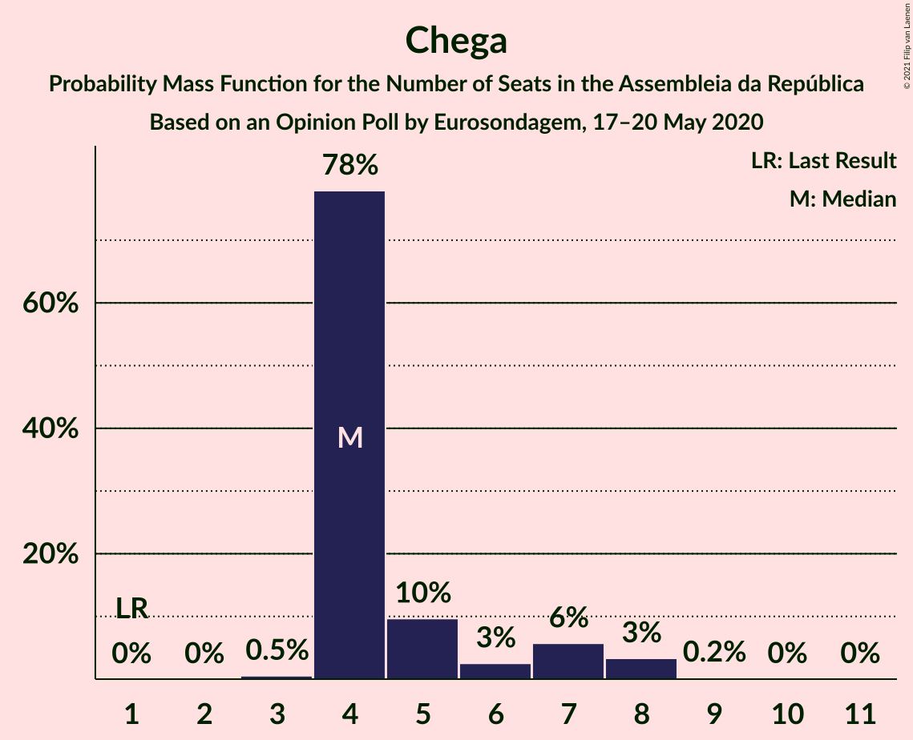

# Opinion Poll by Eurosondagem, 17–20 May 2020

<a href="#voting-intentions">Voting Intentions</a> | <a href="#seats">Seats</a> | <a href="#coalitions">Coalitions</a> | <a href="#technical-information">Technical Information</a>

## Voting Intentions

### Confidence Intervals

| Party | Last Result | Poll Result | 80% Confidence Interval | 90% Confidence Interval | 95% Confidence Interval | 99% Confidence Interval |
|:-----:|:-----------:|:-----------:|:-----------------------:|:-----------------------:|:-----------------------:|:-----------------------:|
| Partido Socialista | 36.4% | 37.9% | 36.5–39.2% |36.2–39.6% |35.8–40.0% |35.2–40.6% |
| Partido Social Democrata | 27.8% | 30.0% | 28.7–31.3% |28.4–31.7% |28.1–32.0% |27.5–32.6% |
| Bloco de Esquerda | 9.5% | 8.1% | 7.4–8.9% |7.2–9.2% |7.0–9.4% |6.7–9.8% |
| Coligação Democrática Unitária | 6.3% | 5.2% | 4.6–5.9% |4.5–6.1% |4.3–6.2% |4.1–6.6% |
| Chega | 1.3% | 4.3% | 3.8–4.9% |3.6–5.1% |3.5–5.2% |3.3–5.6% |
| CDS–Partido Popular | 4.2% | 3.2% | 2.8–3.8% |2.6–3.9% |2.5–4.1% |2.3–4.3% |
| Pessoas–Animais–Natureza | 3.3% | 2.2% | 1.8–2.7% |1.8–2.8% |1.7–2.9% |1.5–3.2% |
| Iniciativa Liberal | 1.3% | 1.2% | 0.9–1.5% |0.9–1.6% |0.8–1.7% |0.7–1.9% |

*Note:* The poll result column reflects the actual value used in the calculations. Published results may vary slightly, and in addition be rounded to fewer digits.

## Seats

### Confidence Intervals

| Party | Last Result | Median | 80% Confidence Interval | 90% Confidence Interval | 95% Confidence Interval | 99% Confidence Interval |
|:-----:|:-----------:|:------:|:-----------------------:|:-----------------------:|:-----------------------:|:-----------------------:|
| <a href="#partido-socialista">Partido Socialista</a> | 108 | 110 | 108–114 |107–115 |106–116 |103–119 |
| <a href="#partido-social-democrata">Partido Social Democrata</a> | 79 | 85 | 82–88 |80–88 |80–89 |78–92 |
| <a href="#bloco-de-esquerda">Bloco de Esquerda</a> | 19 | 16 | 15–16 |15–17 |15–18 |14–19 |
| <a href="#coligação-democrática-unitária">Coligação Democrática Unitária</a> | 12 | 8 | 7–9 |7–10 |6–10 |6–12 |
| <a href="#chega">Chega</a> | 1 | 4 | 4–6 |4–7 |4–8 |3–8 |
| <a href="#cds–partido-popular">CDS–Partido Popular</a> | 5 | 3 | 2–4 |1–4 |1–4 |1–5 |
| <a href="#pessoas–animais–natureza">Pessoas–Animais–Natureza</a> | 4 | 2 | 1–2 |1–2 |1–3 |1–3 |
| <a href="#iniciativa-liberal">Iniciativa Liberal</a> | 1 | 1 | 1 |0–1 |0–1 |0–2 |

### Partido Socialista

*For a full overview of the results for this party, see the [Partido Socialista](party-partidosocialista.html) page.*

| Number of Seats | Probability | Accumulated | Special Marks |
|:---------------:|:-----------:|:-----------:|:-------------:|
| 97 | 0% | 100% |  |
| 98 | 0% | 99.9% |  |
| 99 | 0% | 99.9% |  |
| 100 | 0% | 99.9% |  |
| 101 | 0.1% | 99.8% |  |
| 102 | 0.2% | 99.8% |  |
| 103 | 0.2% | 99.6% |  |
| 104 | 0.6% | 99.3% |  |
| 105 | 0.7% | 98.8% |  |
| 106 | 2% | 98% |  |
| 107 | 2% | 96% |  |
| 108 | 13% | 94% | Last Result |
| 109 | 7% | 81% |  |
| 110 | 38% | 74% | Median |
| 111 | 6% | 36% |  |
| 112 | 15% | 30% |  |
| 113 | 4% | 15% |  |
| 114 | 5% | 10% |  |
| 115 | 3% | 6% |  |
| 116 | 0.3% | 3% | Majority |
| 117 | 2% | 2% |  |
| 118 | 0.4% | 0.9% |  |
| 119 | 0.5% | 0.5% |  |
| 120 | 0% | 0.1% |  |
| 121 | 0% | 0% |  |

### Partido Social Democrata

*For a full overview of the results for this party, see the [Partido Social Democrata](party-partidosocialdemocrata.html) page.*

| Number of Seats | Probability | Accumulated | Special Marks |
|:---------------:|:-----------:|:-----------:|:-------------:|
| 76 | 0.2% | 100% |  |
| 77 | 0.3% | 99.8% |  |
| 78 | 0.7% | 99.6% |  |
| 79 | 1.3% | 98.8% | Last Result |
| 80 | 3% | 98% |  |
| 81 | 4% | 94% |  |
| 82 | 13% | 90% |  |
| 83 | 14% | 77% |  |
| 84 | 3% | 63% |  |
| 85 | 37% | 60% | Median |
| 86 | 5% | 23% |  |
| 87 | 1.1% | 18% |  |
| 88 | 14% | 17% |  |
| 89 | 1.3% | 3% |  |
| 90 | 0.8% | 2% |  |
| 91 | 0.2% | 1.1% |  |
| 92 | 0.7% | 0.9% |  |
| 93 | 0.1% | 0.2% |  |
| 94 | 0% | 0.2% |  |
| 95 | 0% | 0.1% |  |
| 96 | 0.1% | 0.1% |  |
| 97 | 0% | 0% |  |

### Bloco de Esquerda

*For a full overview of the results for this party, see the [Bloco de Esquerda](party-blocodeesquerda.html) page.*

| Number of Seats | Probability | Accumulated | Special Marks |
|:---------------:|:-----------:|:-----------:|:-------------:|
| 11 | 0.1% | 100% |  |
| 12 | 0.1% | 99.9% |  |
| 13 | 0.3% | 99.8% |  |
| 14 | 2% | 99.5% |  |
| 15 | 19% | 98% |  |
| 16 | 71% | 79% | Median |
| 17 | 5% | 8% |  |
| 18 | 1.1% | 3% |  |
| 19 | 2% | 2% | Last Result |
| 20 | 0.2% | 0.3% |  |
| 21 | 0.1% | 0.1% |  |
| 22 | 0% | 0% |  |

### Coligação Democrática Unitária

*For a full overview of the results for this party, see the [Coligação Democrática Unitária](party-coligaçãodemocráticaunitária.html) page.*

| Number of Seats | Probability | Accumulated | Special Marks |
|:---------------:|:-----------:|:-----------:|:-------------:|
| 5 | 0.3% | 100% |  |
| 6 | 3% | 99.7% |  |
| 7 | 15% | 97% |  |
| 8 | 58% | 82% | Median |
| 9 | 16% | 23% |  |
| 10 | 6% | 8% |  |
| 11 | 0.4% | 1.3% |  |
| 12 | 0.6% | 0.9% | Last Result |
| 13 | 0.2% | 0.3% |  |
| 14 | 0.1% | 0.1% |  |
| 15 | 0% | 0% |  |

### Chega

*For a full overview of the results for this party, see the [Chega](party-chega.html) page.*

| Number of Seats | Probability | Accumulated | Special Marks |
|:---------------:|:-----------:|:-----------:|:-------------:|
| 1 | 0% | 100% | Last Result |
| 2 | 0% | 100% |  |
| 3 | 0.5% | 100% |  |
| 4 | 78% | 99.5% | Median |
| 5 | 10% | 22% |  |
| 6 | 3% | 12% |  |
| 7 | 6% | 9% |  |
| 8 | 3% | 4% |  |
| 9 | 0.2% | 0.3% |  |
| 10 | 0% | 0.1% |  |
| 11 | 0% | 0% |  |

### CDS–Partido Popular

*For a full overview of the results for this party, see the [CDS–Partido Popular](party-cds–partidopopular.html) page.*

| Number of Seats | Probability | Accumulated | Special Marks |
|:---------------:|:-----------:|:-----------:|:-------------:|
| 1 | 6% | 100% |  |
| 2 | 31% | 94% |  |
| 3 | 38% | 62% | Median |
| 4 | 24% | 24% |  |
| 5 | 0.6% | 0.6% | Last Result |
| 6 | 0% | 0% |  |

### Pessoas–Animais–Natureza

*For a full overview of the results for this party, see the [Pessoas–Animais–Natureza](party-pessoas–animais–natureza.html) page.*

| Number of Seats | Probability | Accumulated | Special Marks |
|:---------------:|:-----------:|:-----------:|:-------------:|
| 0 | 0.1% | 100% |  |
| 1 | 18% | 99.9% |  |
| 2 | 79% | 82% | Median |
| 3 | 3% | 3% |  |
| 4 | 0.3% | 0.3% | Last Result |
| 5 | 0% | 0% |  |

### Iniciativa Liberal

*For a full overview of the results for this party, see the [Iniciativa Liberal](party-iniciativaliberal.html) page.*

| Number of Seats | Probability | Accumulated | Special Marks |
|:---------------:|:-----------:|:-----------:|:-------------:|
| 0 | 6% | 100% |  |
| 1 | 93% | 94% | Last Result, Median |
| 2 | 0.6% | 0.9% |  |
| 3 | 0.4% | 0.4% |  |
| 4 | 0% | 0% |  |

## Coalitions

### Confidence Intervals

| Coalition | Last Result | Median | Majority? | 80% Confidence Interval | 90% Confidence Interval | 95% Confidence Interval | 99% Confidence Interval |
|:---------:|:-----------:|:------:|:---------:|:-----------------------:|:-----------------------:|:-----------------------:|:-----------------------:|
| Partido Socialista – Bloco de Esquerda – Coligação Democrática Unitária | 139 | 134 | 100% | 132–137 | 131–138 | 130–140 | 128–141 |
| Partido Socialista – Bloco de Esquerda | 127 | 126 | 99.9% | 124–130 | 123–130 | 122–132 | 119–134 |
| Partido Socialista – Coligação Democrática Unitária | 120 | 118 | 94% | 116–121 | 115–122 | 114–124 | 111–126 |
| Partido Socialista | 108 | 110 | 3% | 108–114 | 107–115 | 106–116 | 103–119 |
| Partido Social Democrata – CDS–Partido Popular | 84 | 88 | 0% | 85–90 | 83–90 | 82–91 | 80–94 |

### Partido Socialista – Bloco de Esquerda – Coligação Democrática Unitária

| Number of Seats | Probability | Accumulated | Special Marks |
|:---------------:|:-----------:|:-----------:|:-------------:|
| 120 | 0.1% | 100% |  |
| 121 | 0% | 99.9% |  |
| 122 | 0% | 99.9% |  |
| 123 | 0% | 99.9% |  |
| 124 | 0% | 99.9% |  |
| 125 | 0% | 99.8% |  |
| 126 | 0.2% | 99.8% |  |
| 127 | 0.1% | 99.6% |  |
| 128 | 0.6% | 99.5% |  |
| 129 | 1.4% | 99.0% |  |
| 130 | 1.2% | 98% |  |
| 131 | 2% | 96% |  |
| 132 | 15% | 95% |  |
| 133 | 2% | 80% |  |
| 134 | 42% | 78% | Median |
| 135 | 8% | 36% |  |
| 136 | 4% | 28% |  |
| 137 | 16% | 23% |  |
| 138 | 3% | 7% |  |
| 139 | 1.1% | 4% | Last Result |
| 140 | 2% | 3% |  |
| 141 | 0.5% | 1.0% |  |
| 142 | 0.3% | 0.5% |  |
| 143 | 0.1% | 0.2% |  |
| 144 | 0% | 0.1% |  |
| 145 | 0% | 0% |  |

### Partido Socialista – Bloco de Esquerda

| Number of Seats | Probability | Accumulated | Special Marks |
|:---------------:|:-----------:|:-----------:|:-------------:|
| 112 | 0.1% | 100% |  |
| 113 | 0% | 99.9% |  |
| 114 | 0% | 99.9% |  |
| 115 | 0% | 99.9% |  |
| 116 | 0% | 99.9% | Majority |
| 117 | 0.1% | 99.8% |  |
| 118 | 0.1% | 99.7% |  |
| 119 | 0.2% | 99.6% |  |
| 120 | 0.5% | 99.4% |  |
| 121 | 0.8% | 98.9% |  |
| 122 | 2% | 98% |  |
| 123 | 1.4% | 96% |  |
| 124 | 17% | 95% |  |
| 125 | 6% | 78% |  |
| 126 | 39% | 72% | Median |
| 127 | 4% | 32% | Last Result |
| 128 | 14% | 29% |  |
| 129 | 3% | 14% |  |
| 130 | 7% | 12% |  |
| 131 | 1.5% | 5% |  |
| 132 | 1.1% | 3% |  |
| 133 | 2% | 2% |  |
| 134 | 0.4% | 0.7% |  |
| 135 | 0.3% | 0.3% |  |
| 136 | 0% | 0% |  |

### Partido Socialista – Coligação Democrática Unitária

| Number of Seats | Probability | Accumulated | Special Marks |
|:---------------:|:-----------:|:-----------:|:-------------:|
| 105 | 0.1% | 100% |  |
| 106 | 0% | 99.9% |  |
| 107 | 0% | 99.9% |  |
| 108 | 0% | 99.9% |  |
| 109 | 0.1% | 99.9% |  |
| 110 | 0.1% | 99.7% |  |
| 111 | 0.3% | 99.7% |  |
| 112 | 0.9% | 99.4% |  |
| 113 | 0.3% | 98% |  |
| 114 | 2% | 98% |  |
| 115 | 2% | 96% |  |
| 116 | 14% | 94% | Majority |
| 117 | 3% | 81% |  |
| 118 | 38% | 78% | Median |
| 119 | 8% | 41% |  |
| 120 | 10% | 33% | Last Result |
| 121 | 17% | 23% |  |
| 122 | 1.3% | 6% |  |
| 123 | 2% | 5% |  |
| 124 | 2% | 3% |  |
| 125 | 0.4% | 1.2% |  |
| 126 | 0.5% | 0.8% |  |
| 127 | 0.2% | 0.3% |  |
| 128 | 0% | 0.1% |  |
| 129 | 0% | 0% |  |

### Partido Socialista

| Number of Seats | Probability | Accumulated | Special Marks |
|:---------------:|:-----------:|:-----------:|:-------------:|
| 97 | 0% | 100% |  |
| 98 | 0% | 99.9% |  |
| 99 | 0% | 99.9% |  |
| 100 | 0% | 99.9% |  |
| 101 | 0.1% | 99.8% |  |
| 102 | 0.2% | 99.8% |  |
| 103 | 0.2% | 99.6% |  |
| 104 | 0.6% | 99.3% |  |
| 105 | 0.7% | 98.8% |  |
| 106 | 2% | 98% |  |
| 107 | 2% | 96% |  |
| 108 | 13% | 94% | Last Result |
| 109 | 7% | 81% |  |
| 110 | 38% | 74% | Median |
| 111 | 6% | 36% |  |
| 112 | 15% | 30% |  |
| 113 | 4% | 15% |  |
| 114 | 5% | 10% |  |
| 115 | 3% | 6% |  |
| 116 | 0.3% | 3% | Majority |
| 117 | 2% | 2% |  |
| 118 | 0.4% | 0.9% |  |
| 119 | 0.5% | 0.5% |  |
| 120 | 0% | 0.1% |  |
| 121 | 0% | 0% |  |

### Partido Social Democrata – CDS–Partido Popular

| Number of Seats | Probability | Accumulated | Special Marks |
|:---------------:|:-----------:|:-----------:|:-------------:|
| 78 | 0.1% | 100% |  |
| 79 | 0.1% | 99.8% |  |
| 80 | 0.7% | 99.7% |  |
| 81 | 0.6% | 99.0% |  |
| 82 | 3% | 98% |  |
| 83 | 2% | 96% |  |
| 84 | 2% | 94% | Last Result |
| 85 | 10% | 91% |  |
| 86 | 16% | 82% |  |
| 87 | 8% | 66% |  |
| 88 | 39% | 58% | Median |
| 89 | 3% | 19% |  |
| 90 | 13% | 17% |  |
| 91 | 2% | 3% |  |
| 92 | 0.7% | 2% |  |
| 93 | 0.1% | 1.1% |  |
| 94 | 0.7% | 1.0% |  |
| 95 | 0.1% | 0.3% |  |
| 96 | 0% | 0.2% |  |
| 97 | 0% | 0.1% |  |
| 98 | 0.1% | 0.1% |  |
| 99 | 0% | 0.1% |  |
| 100 | 0% | 0% |  |

## Technical Information

### Opinion Poll

+ **Polling firm:** Eurosondagem
+ **Commissioner(s):** —
+ **Fieldwork period:** 17–20 May 2020

### Calculations

+ **Sample size:** 2120
+ **Simulations done:** 131,072
+ **Error estimate:** 0.82%

