# Opinion Poll by Pitagórica for Jornal de Notícias, 16–24 May 2020

<a href="#voting-intentions">Voting Intentions</a> | <a href="#seats">Seats</a> | <a href="#coalitions">Coalitions</a> | <a href="#technical-information">Technical Information</a>

## Voting Intentions

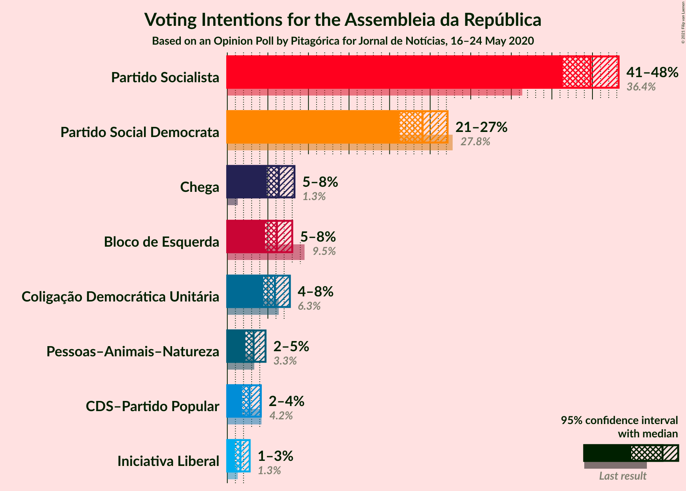

### Confidence Intervals

| Party | Last Result | Poll Result | 80% Confidence Interval | 90% Confidence Interval | 95% Confidence Interval | 99% Confidence Interval |
|:-----:|:-----------:|:-----------:|:-----------------------:|:-----------------------:|:-----------------------:|:-----------------------:|
| Partido Socialista | 36.4% | 44.8% | 42.5–47.0% |41.9–47.7% |41.4–48.2% |40.3–49.3% |
| Partido Social Democrata | 27.8% | 24.1% | 22.2–26.1% |21.7–26.7% |21.2–27.1% |20.4–28.1% |
| Chega | 1.3% | 6.4% | 5.4–7.6% |5.1–8.0% |4.9–8.3% |4.4–8.9% |
| Bloco de Esquerda | 9.5% | 6.1% | 5.2–7.3% |4.9–7.7% |4.6–8.0% |4.2–8.6% |
| Coligação Democrática Unitária | 6.3% | 5.9% | 4.9–7.1% |4.6–7.4% |4.4–7.7% |4.0–8.3% |
| Pessoas–Animais–Natureza | 3.3% | 3.2% | 2.6–4.2% |2.4–4.5% |2.2–4.7% |1.9–5.2% |
| CDS–Partido Popular | 4.2% | 2.7% | 2.1–3.6% |2.0–3.9% |1.8–4.1% |1.6–4.6% |
| Iniciativa Liberal | 1.3% | 1.6% | 1.2–2.4% |1.1–2.6% |0.9–2.8% |0.8–3.2% |

*Note:* The poll result column reflects the actual value used in the calculations. Published results may vary slightly, and in addition be rounded to fewer digits.

## Seats

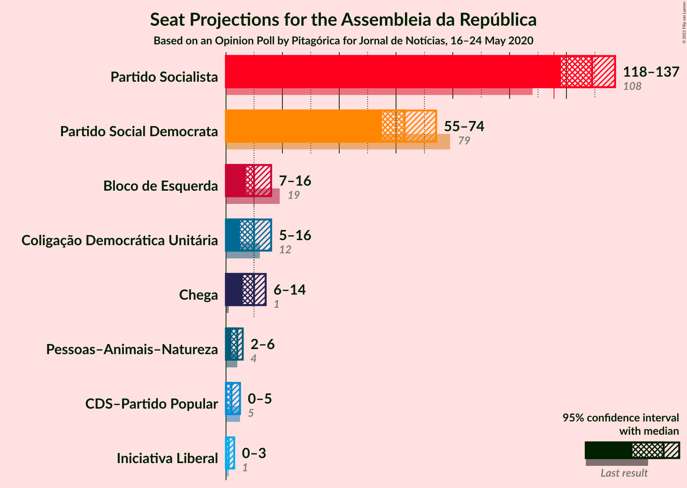

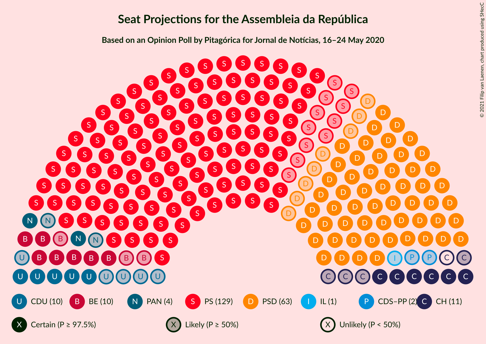

### Confidence Intervals

| Party | Last Result | Median | 80% Confidence Interval | 90% Confidence Interval | 95% Confidence Interval | 99% Confidence Interval |
|:-----:|:-----------:|:------:|:-----------------------:|:-----------------------:|:-----------------------:|:-----------------------:|
| <a href="#partido-socialista">Partido Socialista</a> | 108 | 129 | 122–136 |119–137 |118–137 |116–141 |
| <a href="#partido-social-democrata">Partido Social Democrata</a> | 79 | 63 | 57–70 |56–73 |55–74 |54–76 |
| <a href="#chega">Chega</a> | 1 | 10 | 8–12 |8–14 |6–14 |5–14 |
| <a href="#bloco-de-esquerda">Bloco de Esquerda</a> | 19 | 10 | 7–15 |7–15 |7–16 |5–18 |
| <a href="#coligação-democrática-unitária">Coligação Democrática Unitária</a> | 12 | 10 | 7–13 |5–14 |5–16 |5–17 |
| <a href="#pessoas–animais–natureza">Pessoas–Animais–Natureza</a> | 4 | 4 | 2–5 |2–6 |2–6 |1–7 |
| <a href="#cds–partido-popular">CDS–Partido Popular</a> | 5 | 2 | 1–4 |1–5 |0–5 |0–5 |
| <a href="#iniciativa-liberal">Iniciativa Liberal</a> | 1 | 1 | 1–3 |1–3 |0–3 |0–4 |

### Partido Socialista

*For a full overview of the results for this party, see the [Partido Socialista](party-partidosocialista.html) page.*

| Number of Seats | Probability | Accumulated | Special Marks |
|:---------------:|:-----------:|:-----------:|:-------------:|
| 108 | 0% | 100% | Last Result |
| 109 | 0% | 100% |  |
| 110 | 0% | 100% |  |
| 111 | 0% | 100% |  |
| 112 | 0% | 100% |  |
| 113 | 0% | 99.9% |  |
| 114 | 0.1% | 99.9% |  |
| 115 | 0.1% | 99.8% |  |
| 116 | 0.9% | 99.7% | Majority |
| 117 | 0.3% | 98.8% |  |
| 118 | 2% | 98% |  |
| 119 | 3% | 97% |  |
| 120 | 0.8% | 94% |  |
| 121 | 3% | 93% |  |
| 122 | 6% | 90% |  |
| 123 | 2% | 84% |  |
| 124 | 2% | 82% |  |
| 125 | 3% | 80% |  |
| 126 | 6% | 77% |  |
| 127 | 9% | 70% |  |
| 128 | 4% | 61% |  |
| 129 | 7% | 57% | Median |
| 130 | 3% | 49% |  |
| 131 | 12% | 46% |  |
| 132 | 10% | 34% |  |
| 133 | 6% | 24% |  |
| 134 | 5% | 19% |  |
| 135 | 2% | 14% |  |
| 136 | 4% | 12% |  |
| 137 | 5% | 7% |  |
| 138 | 0.4% | 2% |  |
| 139 | 0.3% | 2% |  |
| 140 | 0.7% | 1.5% |  |
| 141 | 0.3% | 0.8% |  |
| 142 | 0.2% | 0.5% |  |
| 143 | 0.2% | 0.3% |  |
| 144 | 0% | 0.1% |  |
| 145 | 0.1% | 0.1% |  |
| 146 | 0% | 0% |  |

### Partido Social Democrata

*For a full overview of the results for this party, see the [Partido Social Democrata](party-partidosocialdemocrata.html) page.*

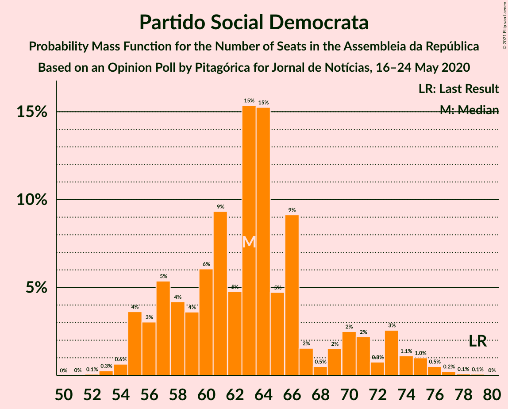

| Number of Seats | Probability | Accumulated | Special Marks |
|:---------------:|:-----------:|:-----------:|:-------------:|
| 52 | 0.1% | 100% |  |
| 53 | 0.3% | 99.9% |  |
| 54 | 0.6% | 99.6% |  |
| 55 | 4% | 99.0% |  |
| 56 | 3% | 95% |  |
| 57 | 5% | 92% |  |
| 58 | 4% | 87% |  |
| 59 | 4% | 83% |  |
| 60 | 6% | 79% |  |
| 61 | 9% | 73% |  |
| 62 | 5% | 64% |  |
| 63 | 15% | 59% | Median |
| 64 | 15% | 44% |  |
| 65 | 5% | 28% |  |
| 66 | 9% | 24% |  |
| 67 | 2% | 15% |  |
| 68 | 0.5% | 13% |  |
| 69 | 2% | 13% |  |
| 70 | 2% | 11% |  |
| 71 | 2% | 9% |  |
| 72 | 0.8% | 6% |  |
| 73 | 3% | 6% |  |
| 74 | 1.1% | 3% |  |
| 75 | 1.0% | 2% |  |
| 76 | 0.5% | 0.9% |  |
| 77 | 0.2% | 0.4% |  |
| 78 | 0.1% | 0.2% |  |
| 79 | 0.1% | 0.1% | Last Result |
| 80 | 0% | 0% |  |

### Chega

*For a full overview of the results for this party, see the [Chega](party-chega.html) page.*

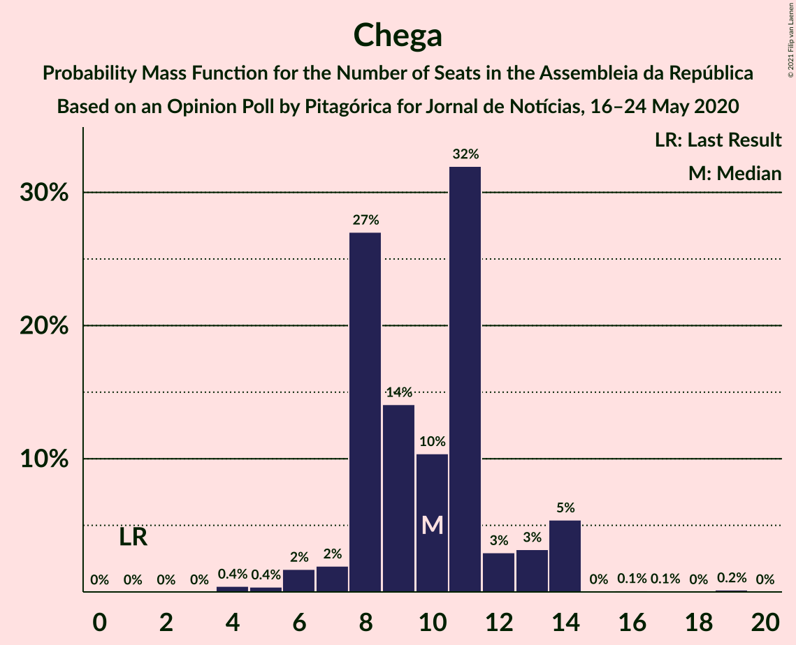

| Number of Seats | Probability | Accumulated | Special Marks |
|:---------------:|:-----------:|:-----------:|:-------------:|
| 1 | 0% | 100% | Last Result |
| 2 | 0% | 100% |  |
| 3 | 0% | 100% |  |
| 4 | 0.4% | 100% |  |
| 5 | 0.4% | 99.6% |  |
| 6 | 2% | 99.2% |  |
| 7 | 2% | 97% |  |
| 8 | 27% | 96% |  |
| 9 | 14% | 68% |  |
| 10 | 10% | 54% | Median |
| 11 | 32% | 44% |  |
| 12 | 3% | 12% |  |
| 13 | 3% | 9% |  |
| 14 | 5% | 6% |  |
| 15 | 0% | 0.5% |  |
| 16 | 0.1% | 0.4% |  |
| 17 | 0.1% | 0.3% |  |
| 18 | 0% | 0.2% |  |
| 19 | 0.2% | 0.2% |  |
| 20 | 0% | 0% |  |

### Bloco de Esquerda

*For a full overview of the results for this party, see the [Bloco de Esquerda](party-blocodeesquerda.html) page.*

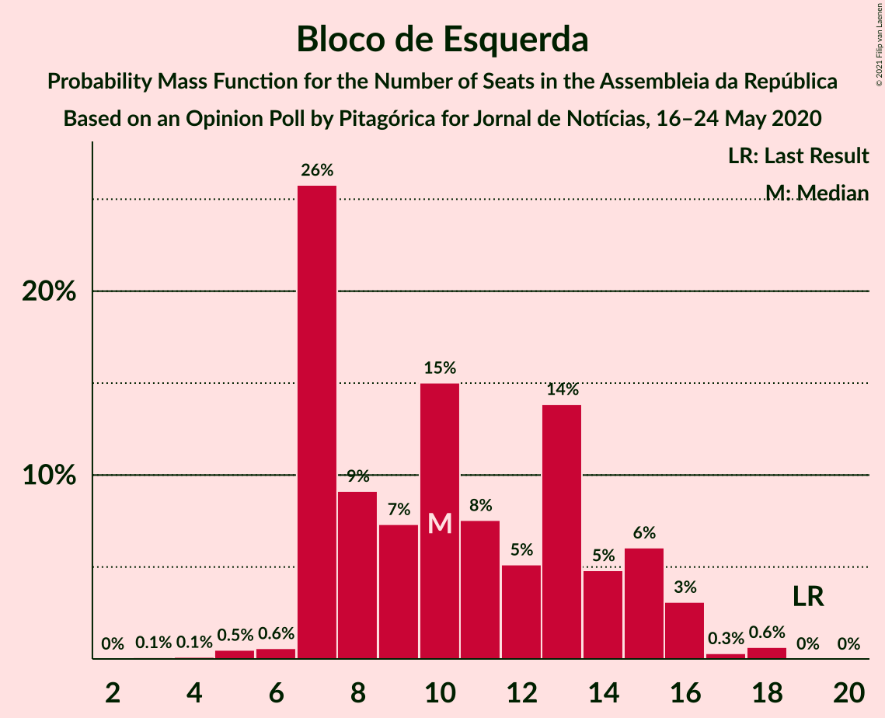

| Number of Seats | Probability | Accumulated | Special Marks |
|:---------------:|:-----------:|:-----------:|:-------------:|
| 3 | 0.1% | 100% |  |
| 4 | 0.1% | 99.9% |  |
| 5 | 0.5% | 99.8% |  |
| 6 | 0.6% | 99.3% |  |
| 7 | 26% | 98.7% |  |
| 8 | 9% | 73% |  |
| 9 | 7% | 64% |  |
| 10 | 15% | 56% | Median |
| 11 | 8% | 41% |  |
| 12 | 5% | 34% |  |
| 13 | 14% | 29% |  |
| 14 | 5% | 15% |  |
| 15 | 6% | 10% |  |
| 16 | 3% | 4% |  |
| 17 | 0.3% | 1.0% |  |
| 18 | 0.6% | 0.7% |  |
| 19 | 0% | 0% | Last Result |

### Coligação Democrática Unitária

*For a full overview of the results for this party, see the [Coligação Democrática Unitária](party-coligaçãodemocráticaunitária.html) page.*

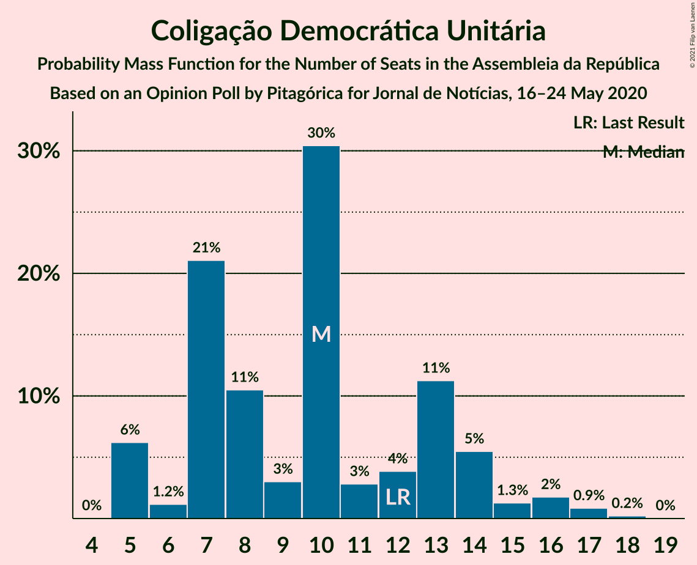

| Number of Seats | Probability | Accumulated | Special Marks |
|:---------------:|:-----------:|:-----------:|:-------------:|
| 5 | 6% | 100% |  |
| 6 | 1.2% | 94% |  |
| 7 | 21% | 93% |  |
| 8 | 11% | 72% |  |
| 9 | 3% | 61% |  |
| 10 | 30% | 58% | Median |
| 11 | 3% | 28% |  |
| 12 | 4% | 25% | Last Result |
| 13 | 11% | 21% |  |
| 14 | 5% | 10% |  |
| 15 | 1.3% | 4% |  |
| 16 | 2% | 3% |  |
| 17 | 0.9% | 1.1% |  |
| 18 | 0.2% | 0.3% |  |
| 19 | 0% | 0% |  |

### Pessoas–Animais–Natureza

*For a full overview of the results for this party, see the [Pessoas–Animais–Natureza](party-pessoas–animais–natureza.html) page.*

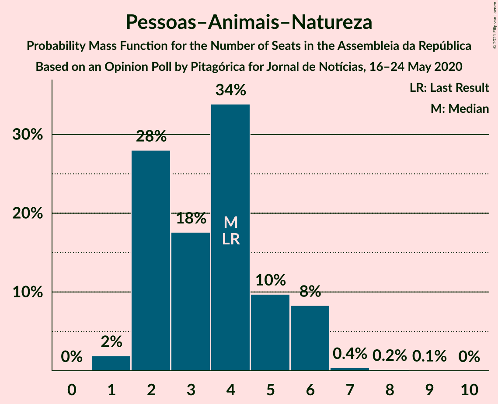

| Number of Seats | Probability | Accumulated | Special Marks |
|:---------------:|:-----------:|:-----------:|:-------------:|
| 1 | 2% | 100% |  |
| 2 | 28% | 98% |  |
| 3 | 18% | 70% |  |
| 4 | 34% | 53% | Last Result, Median |
| 5 | 10% | 19% |  |
| 6 | 8% | 9% |  |
| 7 | 0.4% | 0.6% |  |
| 8 | 0.2% | 0.3% |  |
| 9 | 0.1% | 0.1% |  |
| 10 | 0% | 0% |  |

### CDS–Partido Popular

*For a full overview of the results for this party, see the [CDS–Partido Popular](party-cds–partidopopular.html) page.*

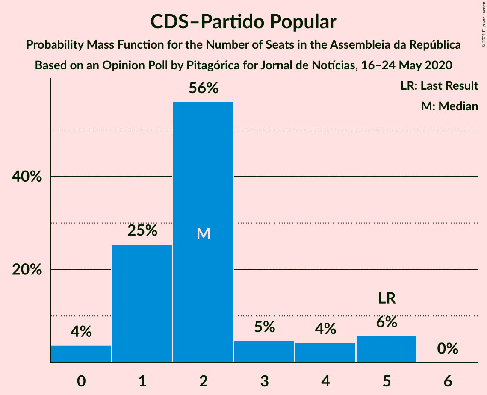

| Number of Seats | Probability | Accumulated | Special Marks |
|:---------------:|:-----------:|:-----------:|:-------------:|
| 0 | 4% | 100% |  |
| 1 | 25% | 96% |  |
| 2 | 56% | 71% | Median |
| 3 | 5% | 15% |  |
| 4 | 4% | 10% |  |
| 5 | 6% | 6% | Last Result |
| 6 | 0% | 0% |  |

### Iniciativa Liberal

*For a full overview of the results for this party, see the [Iniciativa Liberal](party-iniciativaliberal.html) page.*

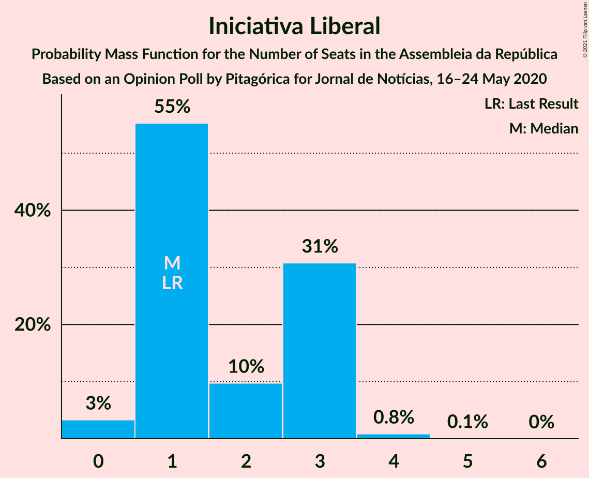

| Number of Seats | Probability | Accumulated | Special Marks |
|:---------------:|:-----------:|:-----------:|:-------------:|
| 0 | 3% | 100% |  |
| 1 | 55% | 97% | Last Result, Median |
| 2 | 10% | 41% |  |
| 3 | 31% | 32% |  |
| 4 | 0.8% | 0.9% |  |
| 5 | 0.1% | 0.1% |  |
| 6 | 0% | 0% |  |

## Coalitions

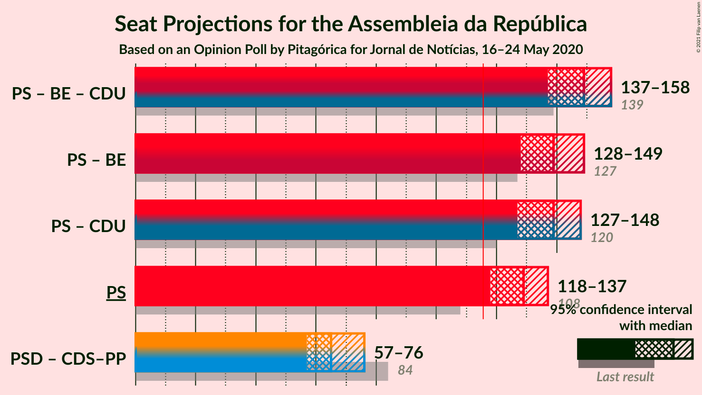

### Confidence Intervals

| Coalition | Last Result | Median | Majority? | 80% Confidence Interval | 90% Confidence Interval | 95% Confidence Interval | 99% Confidence Interval |
|:---------:|:-----------:|:------:|:---------:|:-----------------------:|:-----------------------:|:-----------------------:|:-----------------------:|
| Partido Socialista – Bloco de Esquerda – Coligação Democrática Unitária | 139 | 149 | 100% | 142–155 | 140–156 | 137–158 | 135–161 |
| Partido Socialista – Bloco de Esquerda | 127 | 139 | 100% | 132–145 | 129–146 | 128–149 | 126–151 |
| Partido Socialista – Coligação Democrática Unitária | 120 | 139 | 100% | 131–146 | 129–147 | 127–148 | 125–151 |
| Partido Socialista | 108 | 129 | 99.7% | 122–136 | 119–137 | 118–137 | 116–141 |
| Partido Social Democrata – CDS–Partido Popular | 84 | 65 | 0% | 59–72 | 58–75 | 57–76 | 56–78 |

### Partido Socialista – Bloco de Esquerda – Coligação Democrática Unitária

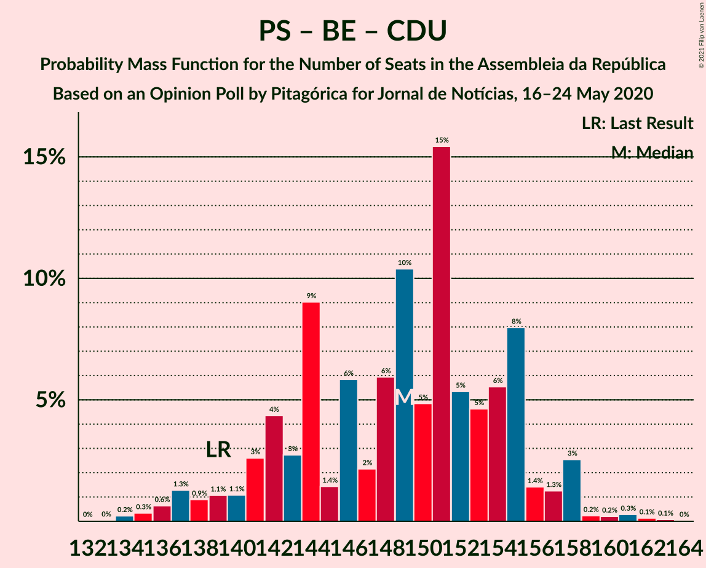

| Number of Seats | Probability | Accumulated | Special Marks |
|:---------------:|:-----------:|:-----------:|:-------------:|
| 132 | 0% | 100% |  |
| 133 | 0% | 99.9% |  |
| 134 | 0.2% | 99.9% |  |
| 135 | 0.3% | 99.7% |  |
| 136 | 0.6% | 99.3% |  |
| 137 | 1.3% | 98.7% |  |
| 138 | 0.9% | 97% |  |
| 139 | 1.1% | 97% | Last Result |
| 140 | 1.1% | 95% |  |
| 141 | 3% | 94% |  |
| 142 | 4% | 92% |  |
| 143 | 3% | 87% |  |
| 144 | 9% | 85% |  |
| 145 | 1.4% | 76% |  |
| 146 | 6% | 74% |  |
| 147 | 2% | 68% |  |
| 148 | 6% | 66% |  |
| 149 | 10% | 60% | Median |
| 150 | 5% | 50% |  |
| 151 | 15% | 45% |  |
| 152 | 5% | 30% |  |
| 153 | 5% | 24% |  |
| 154 | 6% | 20% |  |
| 155 | 8% | 14% |  |
| 156 | 1.4% | 6% |  |
| 157 | 1.3% | 5% |  |
| 158 | 3% | 3% |  |
| 159 | 0.2% | 0.9% |  |
| 160 | 0.2% | 0.7% |  |
| 161 | 0.3% | 0.5% |  |
| 162 | 0.1% | 0.2% |  |
| 163 | 0.1% | 0.1% |  |
| 164 | 0% | 0% |  |

### Partido Socialista – Bloco de Esquerda

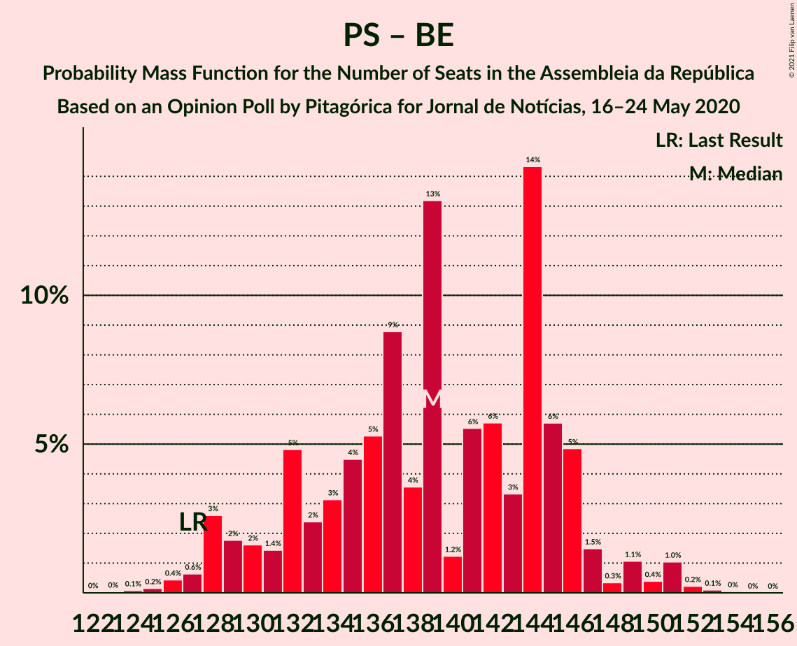

| Number of Seats | Probability | Accumulated | Special Marks |
|:---------------:|:-----------:|:-----------:|:-------------:|
| 123 | 0% | 100% |  |
| 124 | 0.1% | 99.9% |  |
| 125 | 0.2% | 99.8% |  |
| 126 | 0.4% | 99.7% |  |
| 127 | 0.6% | 99.2% | Last Result |
| 128 | 3% | 98.6% |  |
| 129 | 2% | 96% |  |
| 130 | 2% | 94% |  |
| 131 | 1.4% | 93% |  |
| 132 | 5% | 91% |  |
| 133 | 2% | 86% |  |
| 134 | 3% | 84% |  |
| 135 | 4% | 81% |  |
| 136 | 5% | 76% |  |
| 137 | 9% | 71% |  |
| 138 | 4% | 62% |  |
| 139 | 13% | 59% | Median |
| 140 | 1.2% | 45% |  |
| 141 | 6% | 44% |  |
| 142 | 6% | 39% |  |
| 143 | 3% | 33% |  |
| 144 | 14% | 30% |  |
| 145 | 6% | 15% |  |
| 146 | 5% | 10% |  |
| 147 | 1.5% | 5% |  |
| 148 | 0.3% | 3% |  |
| 149 | 1.1% | 3% |  |
| 150 | 0.4% | 2% |  |
| 151 | 1.0% | 1.5% |  |
| 152 | 0.2% | 0.4% |  |
| 153 | 0.1% | 0.2% |  |
| 154 | 0% | 0.1% |  |
| 155 | 0% | 0% |  |

### Partido Socialista – Coligação Democrática Unitária

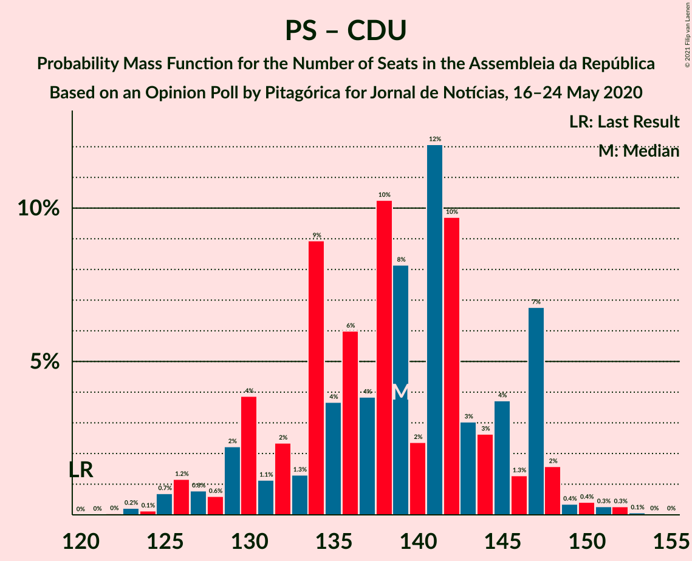

| Number of Seats | Probability | Accumulated | Special Marks |
|:---------------:|:-----------:|:-----------:|:-------------:|
| 120 | 0% | 100% | Last Result |
| 121 | 0% | 100% |  |
| 122 | 0% | 100% |  |
| 123 | 0.2% | 99.9% |  |
| 124 | 0.1% | 99.7% |  |
| 125 | 0.7% | 99.6% |  |
| 126 | 1.2% | 98.9% |  |
| 127 | 0.8% | 98% |  |
| 128 | 0.6% | 97% |  |
| 129 | 2% | 96% |  |
| 130 | 4% | 94% |  |
| 131 | 1.1% | 90% |  |
| 132 | 2% | 89% |  |
| 133 | 1.3% | 87% |  |
| 134 | 9% | 85% |  |
| 135 | 4% | 77% |  |
| 136 | 6% | 73% |  |
| 137 | 4% | 67% |  |
| 138 | 10% | 63% |  |
| 139 | 8% | 53% | Median |
| 140 | 2% | 45% |  |
| 141 | 12% | 42% |  |
| 142 | 10% | 30% |  |
| 143 | 3% | 20% |  |
| 144 | 3% | 17% |  |
| 145 | 4% | 15% |  |
| 146 | 1.3% | 11% |  |
| 147 | 7% | 10% |  |
| 148 | 2% | 3% |  |
| 149 | 0.4% | 1.5% |  |
| 150 | 0.4% | 1.1% |  |
| 151 | 0.3% | 0.7% |  |
| 152 | 0.3% | 0.4% |  |
| 153 | 0.1% | 0.1% |  |
| 154 | 0% | 0.1% |  |
| 155 | 0% | 0% |  |

### Partido Socialista

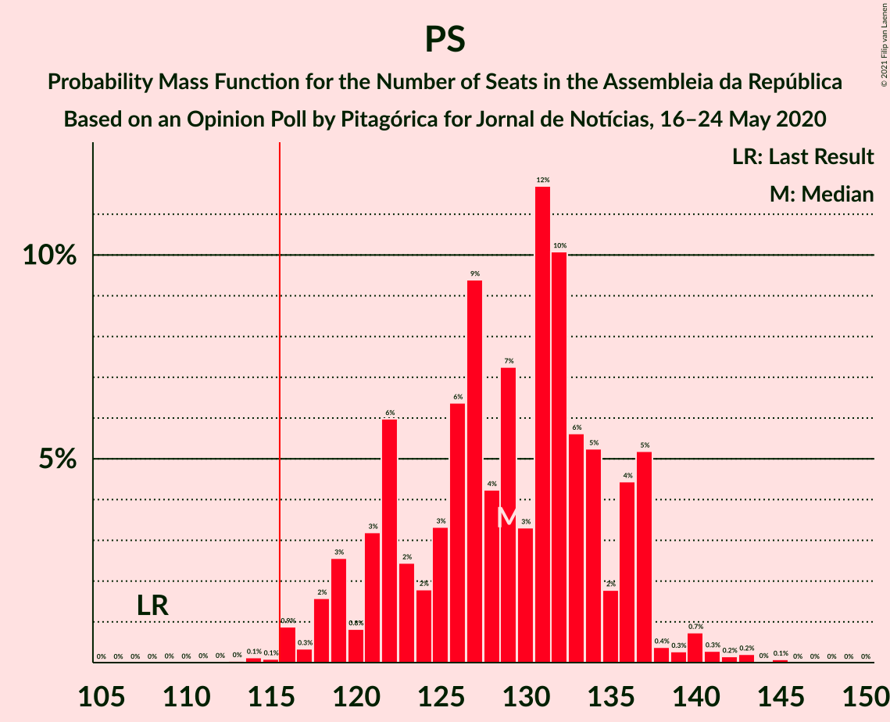

| Number of Seats | Probability | Accumulated | Special Marks |
|:---------------:|:-----------:|:-----------:|:-------------:|
| 108 | 0% | 100% | Last Result |
| 109 | 0% | 100% |  |
| 110 | 0% | 100% |  |
| 111 | 0% | 100% |  |
| 112 | 0% | 100% |  |
| 113 | 0% | 99.9% |  |
| 114 | 0.1% | 99.9% |  |
| 115 | 0.1% | 99.8% |  |
| 116 | 0.9% | 99.7% | Majority |
| 117 | 0.3% | 98.8% |  |
| 118 | 2% | 98% |  |
| 119 | 3% | 97% |  |
| 120 | 0.8% | 94% |  |
| 121 | 3% | 93% |  |
| 122 | 6% | 90% |  |
| 123 | 2% | 84% |  |
| 124 | 2% | 82% |  |
| 125 | 3% | 80% |  |
| 126 | 6% | 77% |  |
| 127 | 9% | 70% |  |
| 128 | 4% | 61% |  |
| 129 | 7% | 57% | Median |
| 130 | 3% | 49% |  |
| 131 | 12% | 46% |  |
| 132 | 10% | 34% |  |
| 133 | 6% | 24% |  |
| 134 | 5% | 19% |  |
| 135 | 2% | 14% |  |
| 136 | 4% | 12% |  |
| 137 | 5% | 7% |  |
| 138 | 0.4% | 2% |  |
| 139 | 0.3% | 2% |  |
| 140 | 0.7% | 1.5% |  |
| 141 | 0.3% | 0.8% |  |
| 142 | 0.2% | 0.5% |  |
| 143 | 0.2% | 0.3% |  |
| 144 | 0% | 0.1% |  |
| 145 | 0.1% | 0.1% |  |
| 146 | 0% | 0% |  |

### Partido Social Democrata – CDS–Partido Popular

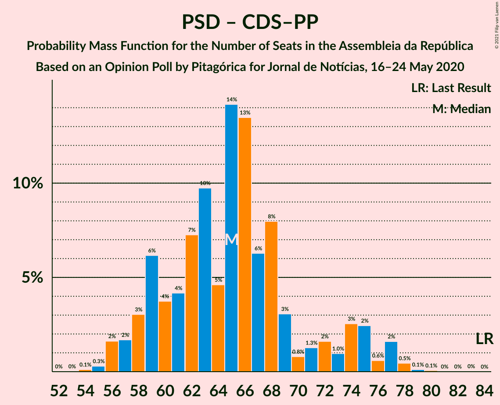

| Number of Seats | Probability | Accumulated | Special Marks |
|:---------------:|:-----------:|:-----------:|:-------------:|
| 54 | 0.1% | 100% |  |
| 55 | 0.3% | 99.8% |  |
| 56 | 2% | 99.5% |  |
| 57 | 2% | 98% |  |
| 58 | 3% | 96% |  |
| 59 | 6% | 93% |  |
| 60 | 4% | 87% |  |
| 61 | 4% | 83% |  |
| 62 | 7% | 79% |  |
| 63 | 10% | 72% |  |
| 64 | 5% | 62% |  |
| 65 | 14% | 58% | Median |
| 66 | 13% | 43% |  |
| 67 | 6% | 30% |  |
| 68 | 8% | 24% |  |
| 69 | 3% | 16% |  |
| 70 | 0.8% | 13% |  |
| 71 | 1.3% | 12% |  |
| 72 | 2% | 10% |  |
| 73 | 1.0% | 9% |  |
| 74 | 3% | 8% |  |
| 75 | 2% | 5% |  |
| 76 | 0.6% | 3% |  |
| 77 | 2% | 2% |  |
| 78 | 0.5% | 0.7% |  |
| 79 | 0.1% | 0.2% |  |
| 80 | 0.1% | 0.1% |  |
| 81 | 0% | 0.1% |  |
| 82 | 0% | 0% |  |
| 83 | 0% | 0% |  |
| 84 | 0% | 0% | Last Result |

## Technical Information

### Opinion Poll

+ **Polling firm:** Pitagórica
+ **Commissioner(s):** Jornal de Notícias
+ **Fieldwork period:** 16–24 May 2020

### Calculations

+ **Sample size:** 802
+ **Simulations done:** 131,072
+ **Error estimate:** 2.35%

