# Opinion Poll by Eurosondagem, 1–4 June 2020

<a href="#voting-intentions">Voting Intentions</a> | <a href="#seats">Seats</a> | <a href="#coalitions">Coalitions</a> | <a href="#technical-information">Technical Information</a>

## Voting Intentions

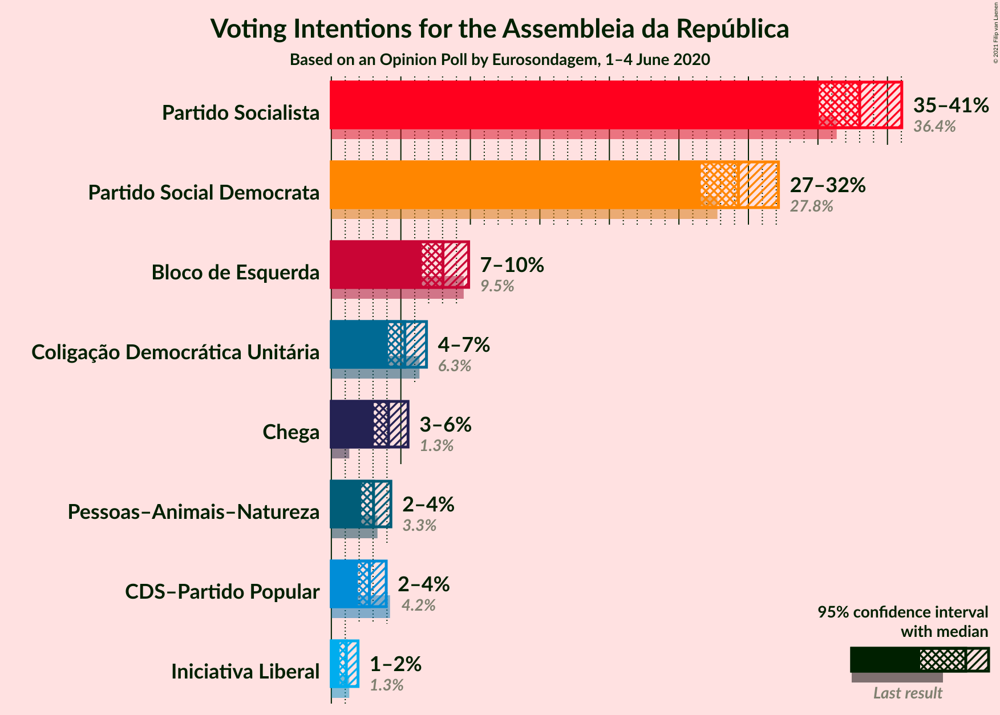

### Confidence Intervals

| Party | Last Result | Poll Result | 80% Confidence Interval | 90% Confidence Interval | 95% Confidence Interval | 99% Confidence Interval |
|:-----:|:-----------:|:-----------:|:-----------------------:|:-----------------------:|:-----------------------:|:-----------------------:|
| Partido Socialista | 36.4% | 38.0% | 36.1–40.0% |35.5–40.5% |35.1–41.0% |34.2–42.0% |
| Partido Social Democrata | 27.8% | 29.3% | 27.5–31.2% |27.0–31.7% |26.6–32.2% |25.7–33.1% |
| Bloco de Esquerda | 9.5% | 8.0% | 7.0–9.2% |6.8–9.6% |6.5–9.9% |6.1–10.5% |
| Coligação Democrática Unitária | 6.3% | 5.3% | 4.5–6.3% |4.3–6.6% |4.1–6.8% |3.7–7.4% |
| Chega | 1.3% | 4.1% | 3.4–5.0% |3.2–5.3% |3.0–5.5% |2.7–6.0% |
| Pessoas–Animais–Natureza | 3.3% | 3.0% | 2.4–3.9% |2.3–4.1% |2.1–4.3% |1.9–4.7% |
| CDS–Partido Popular | 4.2% | 2.7% | 2.2–3.5% |2.0–3.7% |1.9–3.9% |1.7–4.3% |
| Iniciativa Liberal | 1.3% | 1.1% | 0.8–1.6% |0.7–1.8% |0.6–1.9% |0.5–2.2% |

*Note:* The poll result column reflects the actual value used in the calculations. Published results may vary slightly, and in addition be rounded to fewer digits.

## Seats

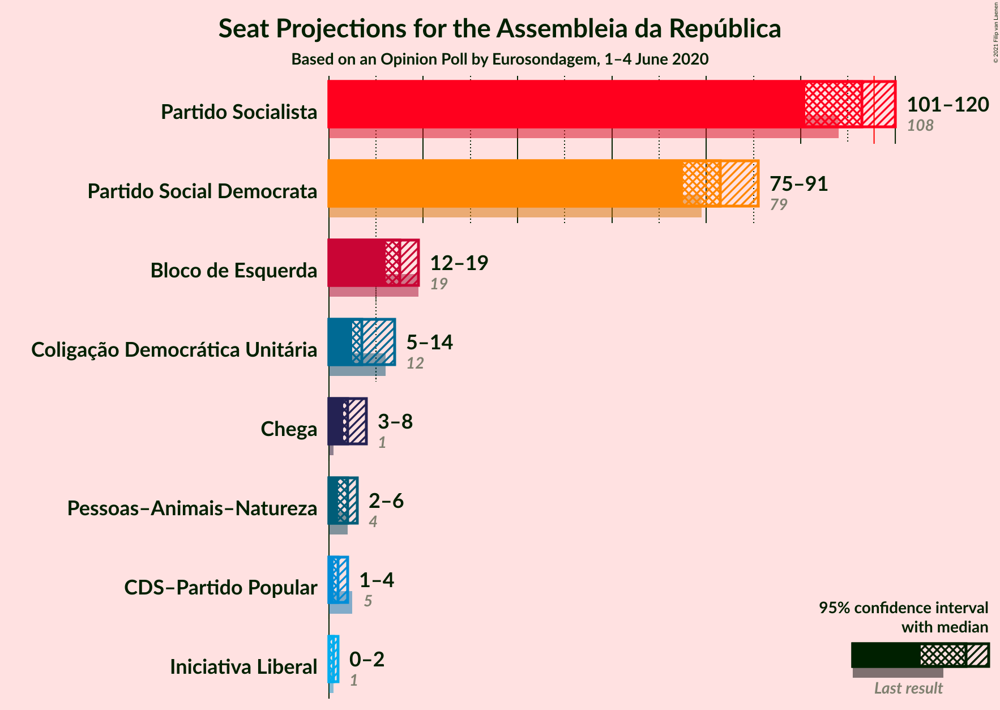

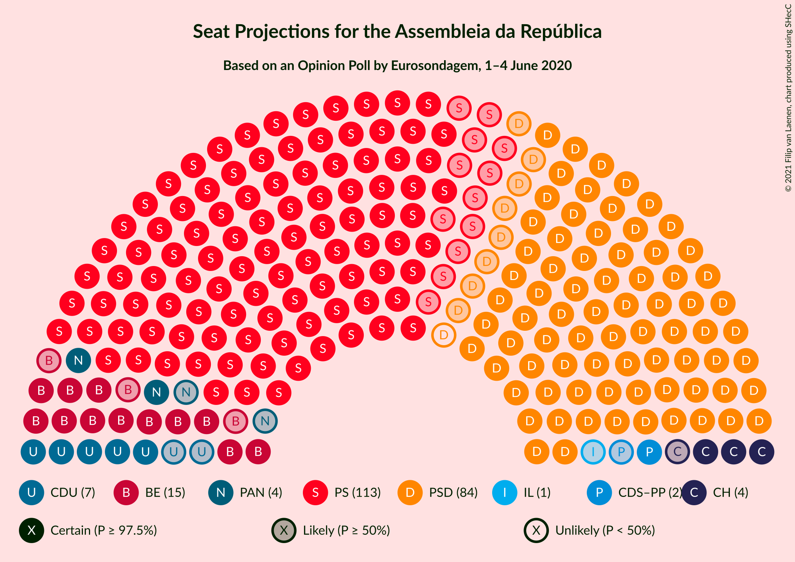

### Confidence Intervals

| Party | Last Result | Median | 80% Confidence Interval | 90% Confidence Interval | 95% Confidence Interval | 99% Confidence Interval |
|:-----:|:-----------:|:------:|:-----------------------:|:-----------------------:|:-----------------------:|:-----------------------:|
| <a href="#partido-socialista">Partido Socialista</a> | 108 | 113 | 107–118 |103–119 |101–120 |98–122 |
| <a href="#partido-social-democrata">Partido Social Democrata</a> | 79 | 83 | 79–87 |76–88 |75–91 |72–95 |
| <a href="#bloco-de-esquerda">Bloco de Esquerda</a> | 19 | 15 | 14–18 |13–19 |12–19 |11–21 |
| <a href="#coligação-democrática-unitária">Coligação Democrática Unitária</a> | 12 | 7 | 7–10 |6–11 |5–14 |5–15 |
| <a href="#chega">Chega</a> | 1 | 4 | 3–8 |3–8 |3–8 |2–10 |
| <a href="#pessoas–animais–natureza">Pessoas–Animais–Natureza</a> | 4 | 4 | 2–4 |2–4 |2–6 |1–6 |
| <a href="#cds–partido-popular">CDS–Partido Popular</a> | 5 | 2 | 1–3 |1–4 |1–4 |0–5 |
| <a href="#iniciativa-liberal">Iniciativa Liberal</a> | 1 | 1 | 0–1 |0–1 |0–2 |0–3 |

### Partido Socialista

*For a full overview of the results for this party, see the [Partido Socialista](party-partidosocialista.html) page.*

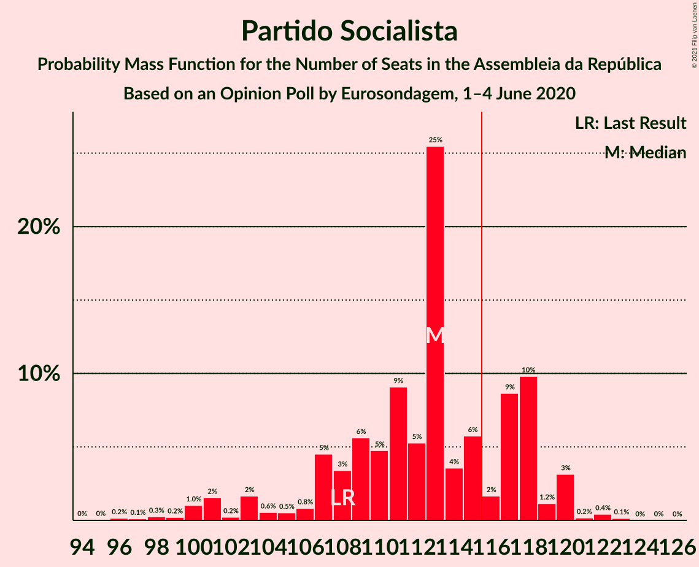

| Number of Seats | Probability | Accumulated | Special Marks |
|:---------------:|:-----------:|:-----------:|:-------------:|
| 94 | 0% | 100% |  |
| 95 | 0% | 99.9% |  |
| 96 | 0.2% | 99.9% |  |
| 97 | 0.1% | 99.7% |  |
| 98 | 0.3% | 99.6% |  |
| 99 | 0.2% | 99.4% |  |
| 100 | 1.0% | 99.1% |  |
| 101 | 2% | 98% |  |
| 102 | 0.2% | 97% |  |
| 103 | 2% | 96% |  |
| 104 | 0.6% | 95% |  |
| 105 | 0.5% | 94% |  |
| 106 | 0.8% | 94% |  |
| 107 | 5% | 93% |  |
| 108 | 3% | 88% | Last Result |
| 109 | 6% | 85% |  |
| 110 | 5% | 79% |  |
| 111 | 9% | 74% |  |
| 112 | 5% | 65% |  |
| 113 | 25% | 60% | Median |
| 114 | 4% | 35% |  |
| 115 | 6% | 31% |  |
| 116 | 2% | 25% | Majority |
| 117 | 9% | 24% |  |
| 118 | 10% | 15% |  |
| 119 | 1.2% | 5% |  |
| 120 | 3% | 4% |  |
| 121 | 0.2% | 0.8% |  |
| 122 | 0.4% | 0.6% |  |
| 123 | 0.1% | 0.2% |  |
| 124 | 0% | 0.1% |  |
| 125 | 0% | 0% |  |

### Partido Social Democrata

*For a full overview of the results for this party, see the [Partido Social Democrata](party-partidosocialdemocrata.html) page.*

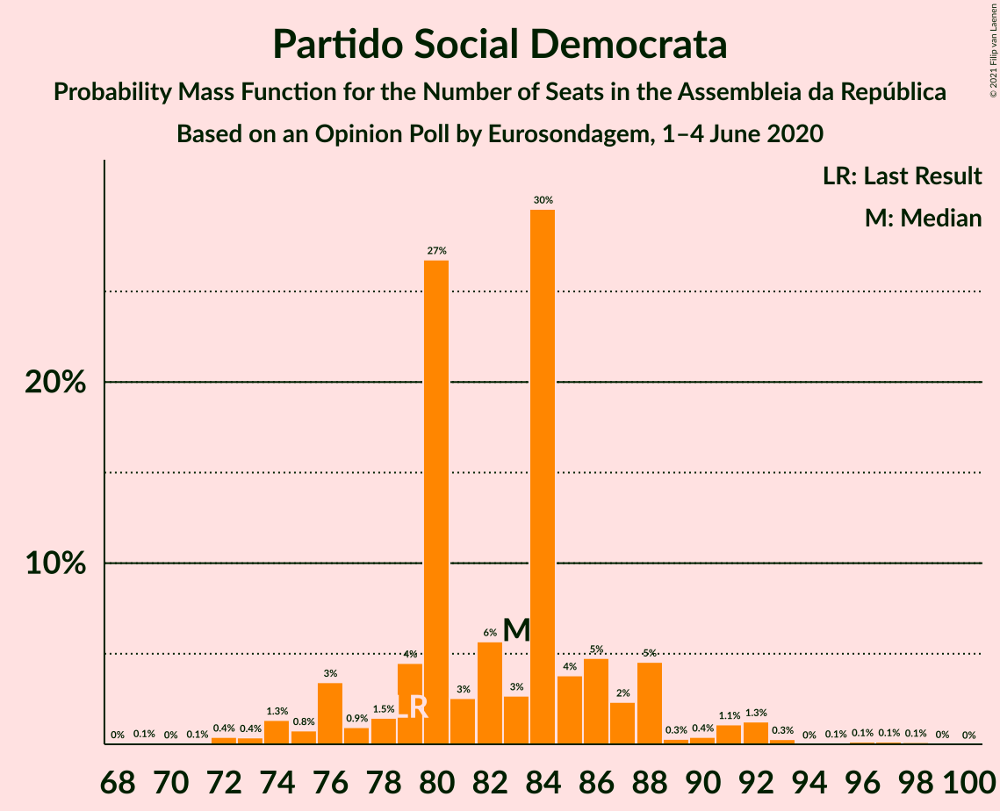

| Number of Seats | Probability | Accumulated | Special Marks |
|:---------------:|:-----------:|:-----------:|:-------------:|
| 68 | 0% | 100% |  |
| 69 | 0.1% | 99.9% |  |
| 70 | 0% | 99.8% |  |
| 71 | 0.1% | 99.8% |  |
| 72 | 0.4% | 99.8% |  |
| 73 | 0.4% | 99.4% |  |
| 74 | 1.3% | 99.0% |  |
| 75 | 0.8% | 98% |  |
| 76 | 3% | 97% |  |
| 77 | 0.9% | 93% |  |
| 78 | 1.5% | 93% |  |
| 79 | 4% | 91% | Last Result |
| 80 | 27% | 87% |  |
| 81 | 3% | 60% |  |
| 82 | 6% | 57% |  |
| 83 | 3% | 52% | Median |
| 84 | 30% | 49% |  |
| 85 | 4% | 19% |  |
| 86 | 5% | 16% |  |
| 87 | 2% | 11% |  |
| 88 | 5% | 8% |  |
| 89 | 0.3% | 4% |  |
| 90 | 0.4% | 4% |  |
| 91 | 1.1% | 3% |  |
| 92 | 1.3% | 2% |  |
| 93 | 0.3% | 0.8% |  |
| 94 | 0% | 0.6% |  |
| 95 | 0.1% | 0.6% |  |
| 96 | 0.1% | 0.5% |  |
| 97 | 0.1% | 0.3% |  |
| 98 | 0.1% | 0.2% |  |
| 99 | 0% | 0.1% |  |
| 100 | 0% | 0% |  |

### Bloco de Esquerda

*For a full overview of the results for this party, see the [Bloco de Esquerda](party-blocodeesquerda.html) page.*

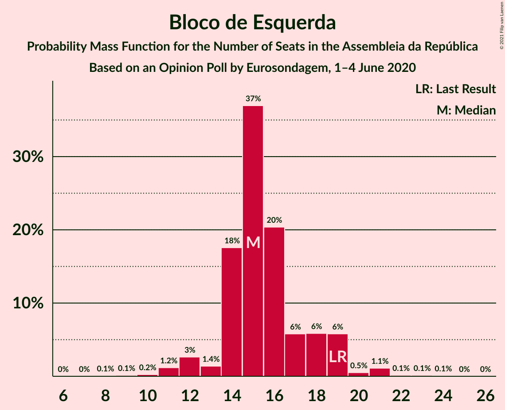

| Number of Seats | Probability | Accumulated | Special Marks |
|:---------------:|:-----------:|:-----------:|:-------------:|
| 8 | 0.1% | 100% |  |
| 9 | 0.1% | 99.9% |  |
| 10 | 0.2% | 99.8% |  |
| 11 | 1.2% | 99.5% |  |
| 12 | 3% | 98% |  |
| 13 | 1.4% | 96% |  |
| 14 | 18% | 94% |  |
| 15 | 37% | 77% | Median |
| 16 | 20% | 40% |  |
| 17 | 6% | 19% |  |
| 18 | 6% | 14% |  |
| 19 | 6% | 8% | Last Result |
| 20 | 0.5% | 2% |  |
| 21 | 1.1% | 1.5% |  |
| 22 | 0.1% | 0.4% |  |
| 23 | 0.1% | 0.2% |  |
| 24 | 0.1% | 0.1% |  |
| 25 | 0% | 0% |  |

### Coligação Democrática Unitária

*For a full overview of the results for this party, see the [Coligação Democrática Unitária](party-coligaçãodemocráticaunitária.html) page.*

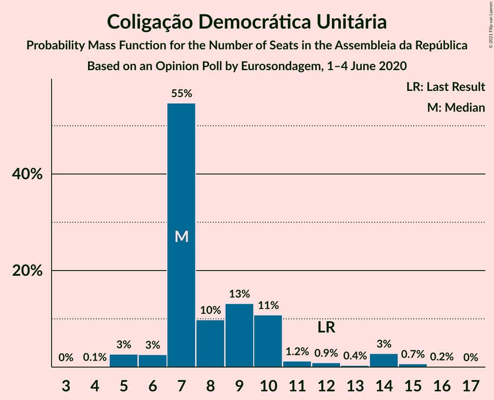

| Number of Seats | Probability | Accumulated | Special Marks |
|:---------------:|:-----------:|:-----------:|:-------------:|
| 4 | 0.1% | 100% |  |
| 5 | 3% | 99.9% |  |
| 6 | 3% | 97% |  |
| 7 | 55% | 95% | Median |
| 8 | 10% | 40% |  |
| 9 | 13% | 30% |  |
| 10 | 11% | 17% |  |
| 11 | 1.2% | 6% |  |
| 12 | 0.9% | 5% | Last Result |
| 13 | 0.4% | 4% |  |
| 14 | 3% | 4% |  |
| 15 | 0.7% | 0.9% |  |
| 16 | 0.2% | 0.2% |  |
| 17 | 0% | 0% |  |

### Chega

*For a full overview of the results for this party, see the [Chega](party-chega.html) page.*

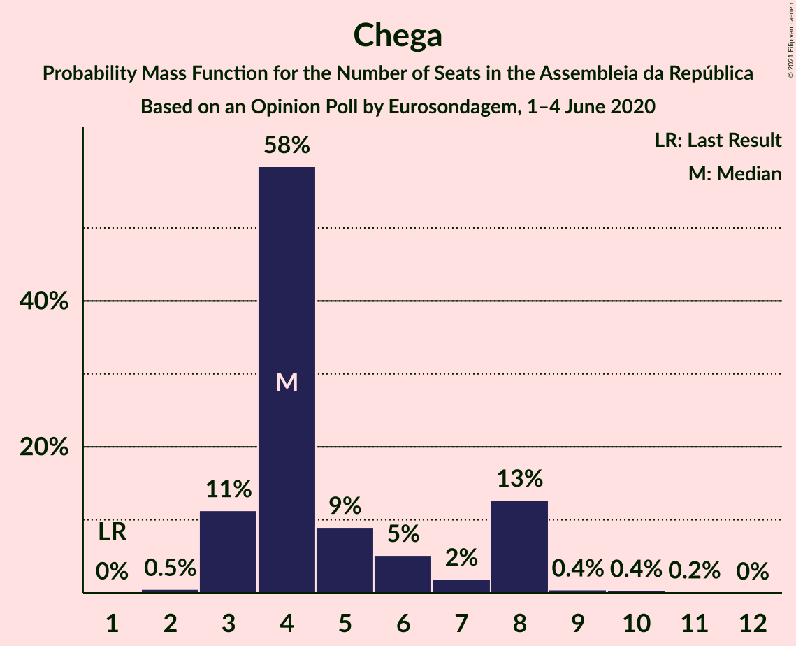

| Number of Seats | Probability | Accumulated | Special Marks |
|:---------------:|:-----------:|:-----------:|:-------------:|
| 1 | 0% | 100% | Last Result |
| 2 | 0.5% | 100% |  |
| 3 | 11% | 99.5% |  |
| 4 | 58% | 88% | Median |
| 5 | 9% | 30% |  |
| 6 | 5% | 21% |  |
| 7 | 2% | 16% |  |
| 8 | 13% | 14% |  |
| 9 | 0.4% | 1.0% |  |
| 10 | 0.4% | 0.5% |  |
| 11 | 0.2% | 0.2% |  |
| 12 | 0% | 0% |  |

### Pessoas–Animais–Natureza

*For a full overview of the results for this party, see the [Pessoas–Animais–Natureza](party-pessoas–animais–natureza.html) page.*

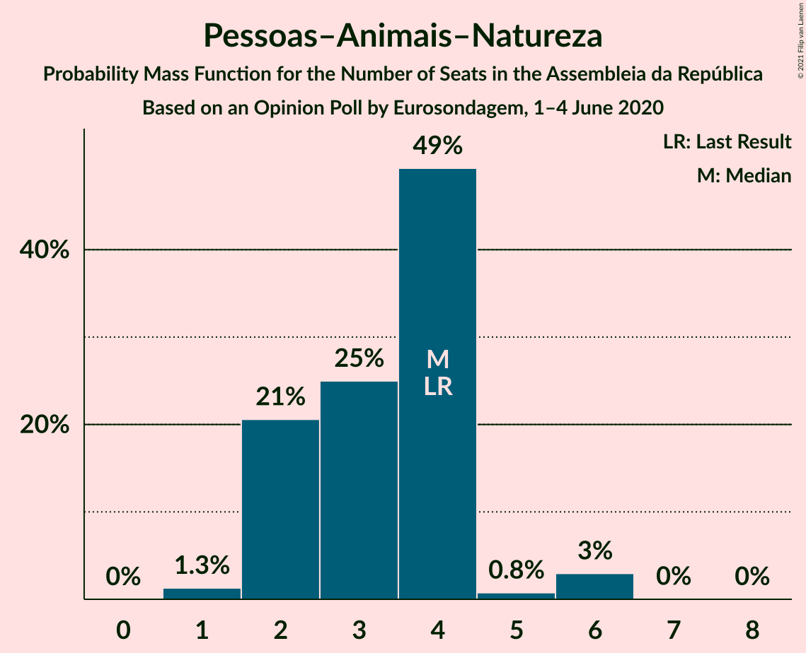

| Number of Seats | Probability | Accumulated | Special Marks |
|:---------------:|:-----------:|:-----------:|:-------------:|
| 1 | 1.3% | 100% |  |
| 2 | 21% | 98.7% |  |
| 3 | 25% | 78% |  |
| 4 | 49% | 53% | Last Result, Median |
| 5 | 0.8% | 4% |  |
| 6 | 3% | 3% |  |
| 7 | 0% | 0.1% |  |
| 8 | 0% | 0% |  |

### CDS–Partido Popular

*For a full overview of the results for this party, see the [CDS–Partido Popular](party-cds–partidopopular.html) page.*

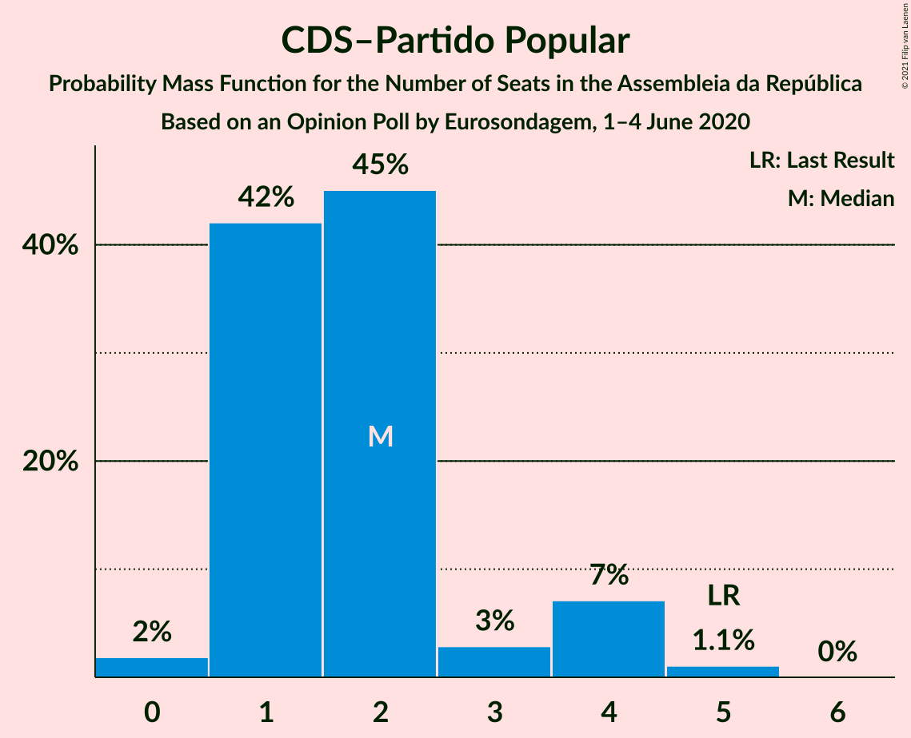

| Number of Seats | Probability | Accumulated | Special Marks |
|:---------------:|:-----------:|:-----------:|:-------------:|
| 0 | 2% | 100% |  |
| 1 | 42% | 98% |  |
| 2 | 45% | 56% | Median |
| 3 | 3% | 11% |  |
| 4 | 7% | 8% |  |
| 5 | 1.1% | 1.1% | Last Result |
| 6 | 0% | 0% |  |

### Iniciativa Liberal

*For a full overview of the results for this party, see the [Iniciativa Liberal](party-iniciativaliberal.html) page.*

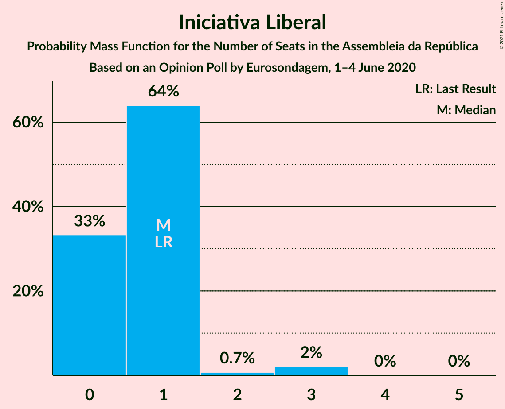

| Number of Seats | Probability | Accumulated | Special Marks |
|:---------------:|:-----------:|:-----------:|:-------------:|
| 0 | 33% | 100% |  |
| 1 | 64% | 67% | Last Result, Median |
| 2 | 0.7% | 3% |  |
| 3 | 2% | 2% |  |
| 4 | 0% | 0% |  |

## Coalitions

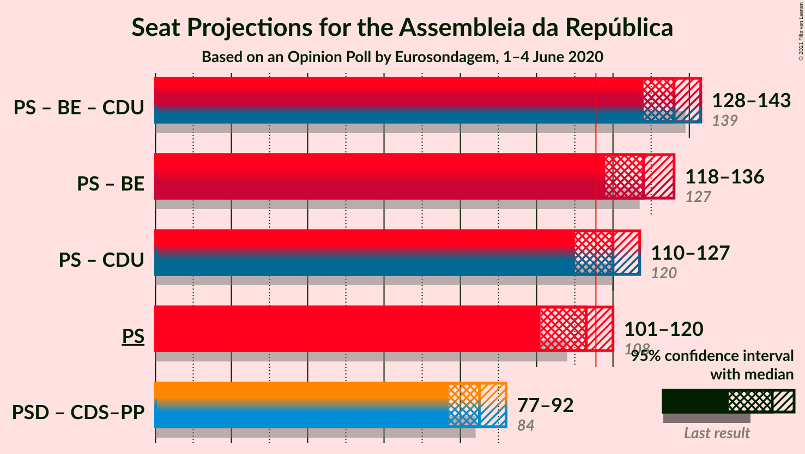

### Confidence Intervals

| Coalition | Last Result | Median | Majority? | 80% Confidence Interval | 90% Confidence Interval | 95% Confidence Interval | 99% Confidence Interval |
|:---------:|:-----------:|:------:|:---------:|:-----------------------:|:-----------------------:|:-----------------------:|:-----------------------:|
| Partido Socialista – Bloco de Esquerda – Coligação Democrática Unitária | 139 | 136 | 100% | 131–141 | 130–143 | 128–143 | 122–147 |
| Partido Socialista – Bloco de Esquerda | 127 | 128 | 99.0% | 123–134 | 121–134 | 118–136 | 113–137 |
| Partido Socialista – Coligação Democrática Unitária | 120 | 120 | 91% | 116–125 | 113–127 | 110–127 | 106–132 |
| Partido Socialista | 108 | 113 | 25% | 107–118 | 103–119 | 101–120 | 98–122 |
| Partido Social Democrata – CDS–Partido Popular | 84 | 85 | 0% | 80–89 | 77–90 | 77–92 | 75–97 |

### Partido Socialista – Bloco de Esquerda – Coligação Democrática Unitária

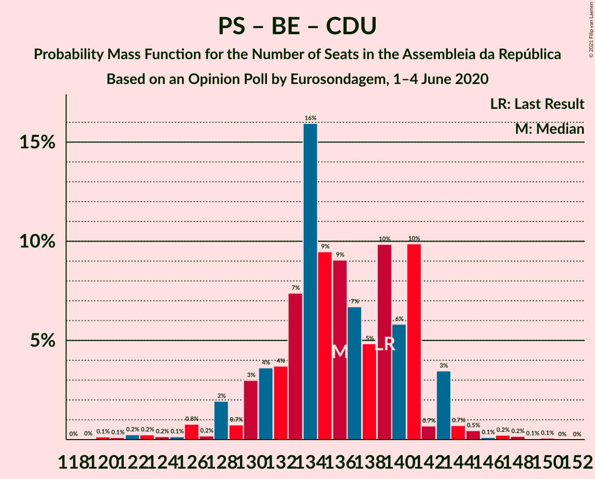

| Number of Seats | Probability | Accumulated | Special Marks |
|:---------------:|:-----------:|:-----------:|:-------------:|
| 119 | 0% | 100% |  |
| 120 | 0.1% | 99.9% |  |
| 121 | 0.1% | 99.8% |  |
| 122 | 0.2% | 99.7% |  |
| 123 | 0.2% | 99.4% |  |
| 124 | 0.2% | 99.2% |  |
| 125 | 0.1% | 99.0% |  |
| 126 | 0.8% | 98.9% |  |
| 127 | 0.2% | 98% |  |
| 128 | 2% | 98% |  |
| 129 | 0.7% | 96% |  |
| 130 | 3% | 95% |  |
| 131 | 4% | 92% |  |
| 132 | 4% | 89% |  |
| 133 | 7% | 85% |  |
| 134 | 16% | 78% |  |
| 135 | 9% | 62% | Median |
| 136 | 9% | 52% |  |
| 137 | 7% | 43% |  |
| 138 | 5% | 36% |  |
| 139 | 10% | 32% | Last Result |
| 140 | 6% | 22% |  |
| 141 | 10% | 16% |  |
| 142 | 0.7% | 6% |  |
| 143 | 3% | 5% |  |
| 144 | 0.7% | 2% |  |
| 145 | 0.5% | 1.1% |  |
| 146 | 0.1% | 0.7% |  |
| 147 | 0.2% | 0.5% |  |
| 148 | 0.2% | 0.3% |  |
| 149 | 0.1% | 0.2% |  |
| 150 | 0.1% | 0.1% |  |
| 151 | 0% | 0% |  |

### Partido Socialista – Bloco de Esquerda

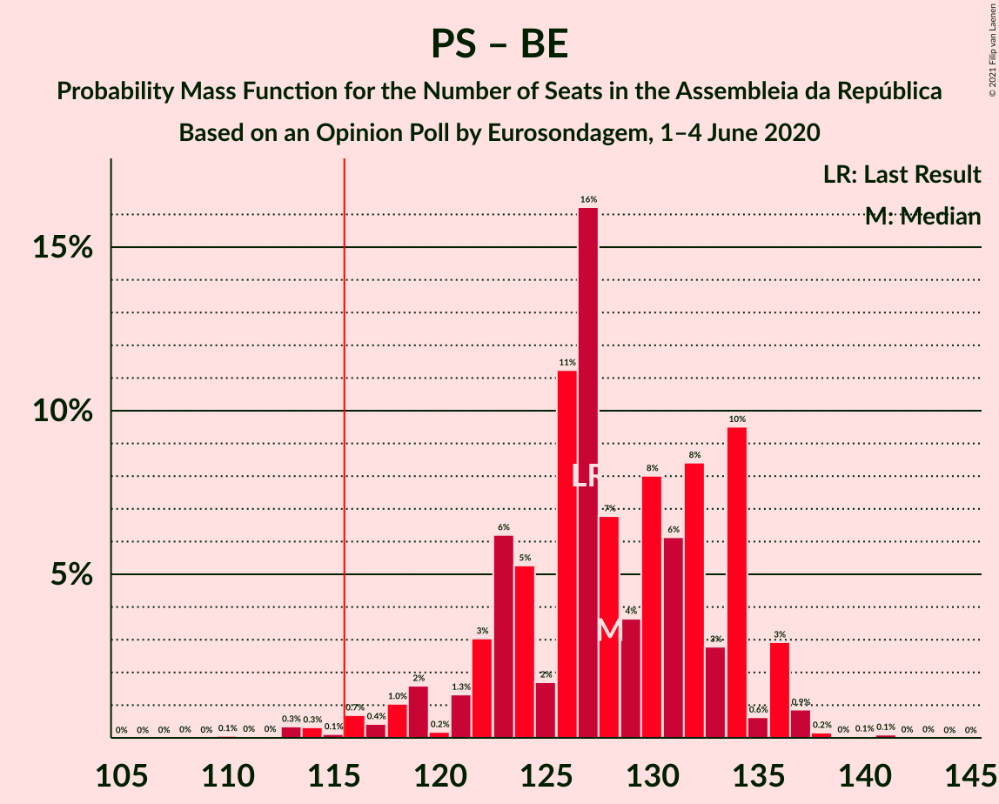

| Number of Seats | Probability | Accumulated | Special Marks |
|:---------------:|:-----------:|:-----------:|:-------------:|
| 110 | 0.1% | 100% |  |
| 111 | 0% | 99.9% |  |
| 112 | 0% | 99.9% |  |
| 113 | 0.3% | 99.8% |  |
| 114 | 0.3% | 99.5% |  |
| 115 | 0.1% | 99.1% |  |
| 116 | 0.7% | 99.0% | Majority |
| 117 | 0.4% | 98% |  |
| 118 | 1.0% | 98% |  |
| 119 | 2% | 97% |  |
| 120 | 0.2% | 95% |  |
| 121 | 1.3% | 95% |  |
| 122 | 3% | 94% |  |
| 123 | 6% | 91% |  |
| 124 | 5% | 85% |  |
| 125 | 2% | 79% |  |
| 126 | 11% | 78% |  |
| 127 | 16% | 66% | Last Result |
| 128 | 7% | 50% | Median |
| 129 | 4% | 43% |  |
| 130 | 8% | 40% |  |
| 131 | 6% | 32% |  |
| 132 | 8% | 26% |  |
| 133 | 3% | 17% |  |
| 134 | 10% | 14% |  |
| 135 | 0.6% | 5% |  |
| 136 | 3% | 4% |  |
| 137 | 0.9% | 1.2% |  |
| 138 | 0.2% | 0.4% |  |
| 139 | 0% | 0.2% |  |
| 140 | 0.1% | 0.2% |  |
| 141 | 0.1% | 0.2% |  |
| 142 | 0% | 0.1% |  |
| 143 | 0% | 0% |  |

### Partido Socialista – Coligação Democrática Unitária

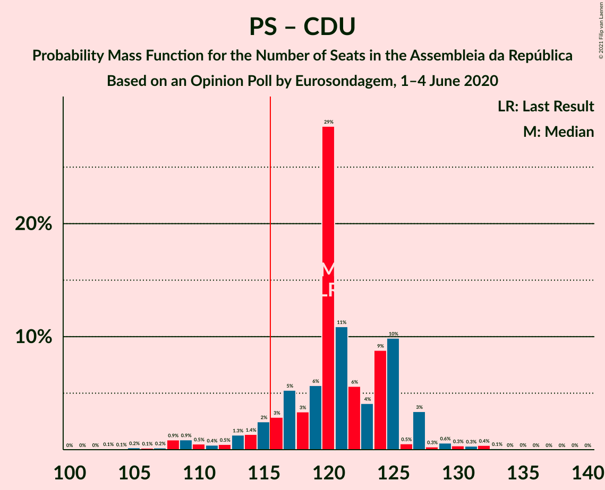

| Number of Seats | Probability | Accumulated | Special Marks |
|:---------------:|:-----------:|:-----------:|:-------------:|
| 103 | 0.1% | 100% |  |
| 104 | 0.1% | 99.9% |  |
| 105 | 0.2% | 99.8% |  |
| 106 | 0.1% | 99.6% |  |
| 107 | 0.2% | 99.5% |  |
| 108 | 0.9% | 99.3% |  |
| 109 | 0.9% | 98% |  |
| 110 | 0.5% | 98% |  |
| 111 | 0.4% | 97% |  |
| 112 | 0.5% | 97% |  |
| 113 | 1.3% | 96% |  |
| 114 | 1.4% | 95% |  |
| 115 | 2% | 94% |  |
| 116 | 3% | 91% | Majority |
| 117 | 5% | 88% |  |
| 118 | 3% | 83% |  |
| 119 | 6% | 80% |  |
| 120 | 29% | 74% | Last Result, Median |
| 121 | 11% | 45% |  |
| 122 | 6% | 34% |  |
| 123 | 4% | 29% |  |
| 124 | 9% | 25% |  |
| 125 | 10% | 16% |  |
| 126 | 0.5% | 6% |  |
| 127 | 3% | 5% |  |
| 128 | 0.3% | 2% |  |
| 129 | 0.6% | 2% |  |
| 130 | 0.3% | 1.2% |  |
| 131 | 0.3% | 0.9% |  |
| 132 | 0.4% | 0.6% |  |
| 133 | 0.1% | 0.2% |  |
| 134 | 0% | 0.1% |  |
| 135 | 0% | 0.1% |  |
| 136 | 0% | 0% |  |

### Partido Socialista

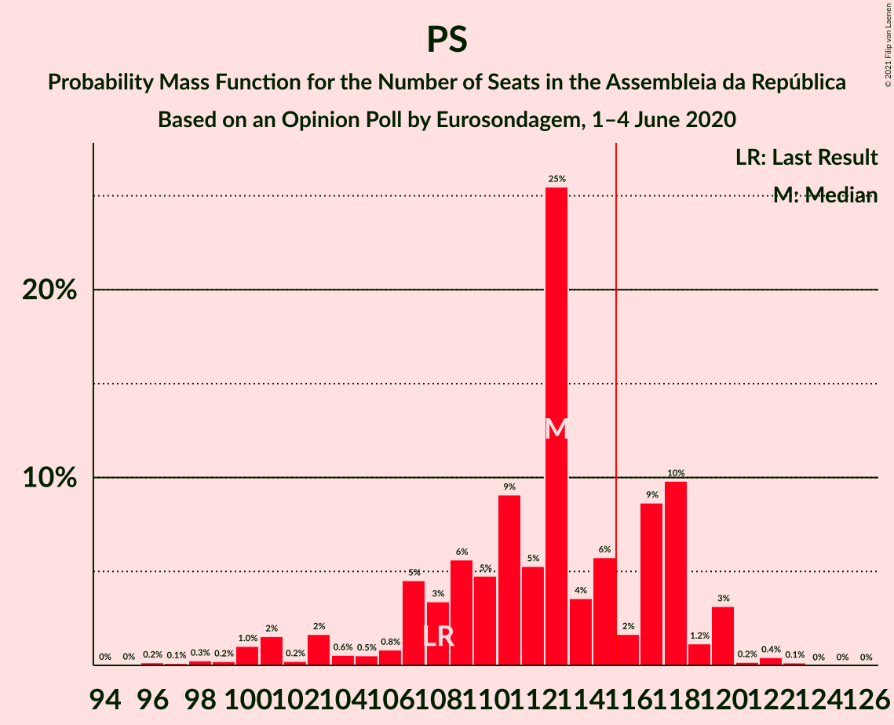

| Number of Seats | Probability | Accumulated | Special Marks |
|:---------------:|:-----------:|:-----------:|:-------------:|
| 94 | 0% | 100% |  |
| 95 | 0% | 99.9% |  |
| 96 | 0.2% | 99.9% |  |
| 97 | 0.1% | 99.7% |  |
| 98 | 0.3% | 99.6% |  |
| 99 | 0.2% | 99.4% |  |
| 100 | 1.0% | 99.1% |  |
| 101 | 2% | 98% |  |
| 102 | 0.2% | 97% |  |
| 103 | 2% | 96% |  |
| 104 | 0.6% | 95% |  |
| 105 | 0.5% | 94% |  |
| 106 | 0.8% | 94% |  |
| 107 | 5% | 93% |  |
| 108 | 3% | 88% | Last Result |
| 109 | 6% | 85% |  |
| 110 | 5% | 79% |  |
| 111 | 9% | 74% |  |
| 112 | 5% | 65% |  |
| 113 | 25% | 60% | Median |
| 114 | 4% | 35% |  |
| 115 | 6% | 31% |  |
| 116 | 2% | 25% | Majority |
| 117 | 9% | 24% |  |
| 118 | 10% | 15% |  |
| 119 | 1.2% | 5% |  |
| 120 | 3% | 4% |  |
| 121 | 0.2% | 0.8% |  |
| 122 | 0.4% | 0.6% |  |
| 123 | 0.1% | 0.2% |  |
| 124 | 0% | 0.1% |  |
| 125 | 0% | 0% |  |

### Partido Social Democrata – CDS–Partido Popular

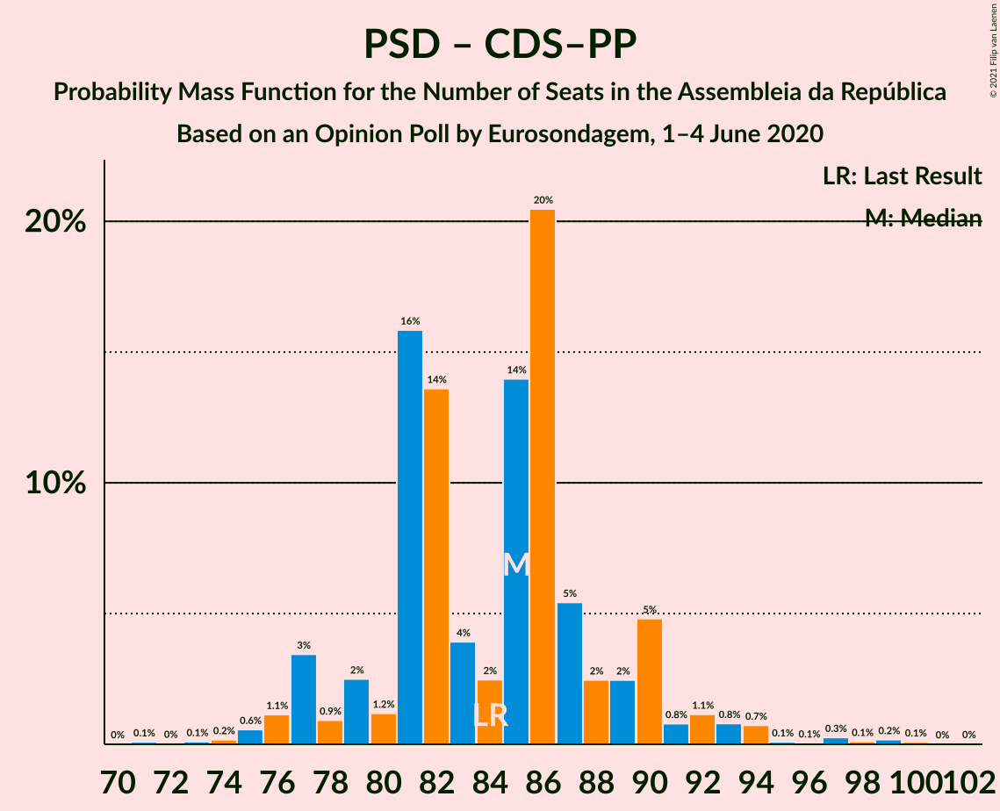

| Number of Seats | Probability | Accumulated | Special Marks |
|:---------------:|:-----------:|:-----------:|:-------------:|
| 70 | 0% | 100% |  |
| 71 | 0.1% | 99.9% |  |
| 72 | 0% | 99.8% |  |
| 73 | 0.1% | 99.8% |  |
| 74 | 0.2% | 99.7% |  |
| 75 | 0.6% | 99.5% |  |
| 76 | 1.1% | 99.0% |  |
| 77 | 3% | 98% |  |
| 78 | 0.9% | 94% |  |
| 79 | 2% | 93% |  |
| 80 | 1.2% | 91% |  |
| 81 | 16% | 90% |  |
| 82 | 14% | 74% |  |
| 83 | 4% | 60% |  |
| 84 | 2% | 56% | Last Result |
| 85 | 14% | 54% | Median |
| 86 | 20% | 40% |  |
| 87 | 5% | 19% |  |
| 88 | 2% | 14% |  |
| 89 | 2% | 12% |  |
| 90 | 5% | 9% |  |
| 91 | 0.8% | 4% |  |
| 92 | 1.1% | 4% |  |
| 93 | 0.8% | 2% |  |
| 94 | 0.7% | 2% |  |
| 95 | 0.1% | 0.8% |  |
| 96 | 0.1% | 0.7% |  |
| 97 | 0.3% | 0.7% |  |
| 98 | 0.1% | 0.4% |  |
| 99 | 0.2% | 0.3% |  |
| 100 | 0.1% | 0.1% |  |
| 101 | 0% | 0.1% |  |
| 102 | 0% | 0% |  |

## Technical Information

### Opinion Poll

+ **Polling firm:** Eurosondagem
+ **Commissioner(s):** —
+ **Fieldwork period:** 1–4 June 2020

### Calculations

+ **Sample size:** 1021
+ **Simulations done:** 131,072
+ **Error estimate:** 1.39%

