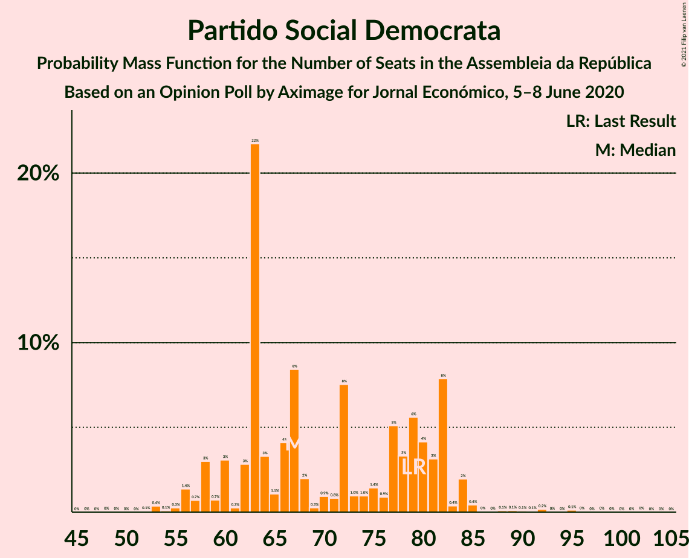

# Opinion Poll by Aximage for Jornal Económico, 5–8 June 2020

<a href="#voting-intentions">Voting Intentions</a> | <a href="#seats">Seats</a> | <a href="#coalitions">Coalitions</a> | <a href="#technical-information">Technical Information</a>

## Voting Intentions

### Confidence Intervals

| Party | Last Result | Poll Result | 80% Confidence Interval | 90% Confidence Interval | 95% Confidence Interval | 99% Confidence Interval |
|:-----:|:-----------:|:-----------:|:-----------------------:|:-----------------------:|:-----------------------:|:-----------------------:|
| Partido Socialista | 36.4% | 39.9% | 36.7–43.3% |35.8–44.3% |35.0–45.1% |33.5–46.7% |
| Partido Social Democrata | 27.8% | 25.7% | 22.9–28.8% |22.1–29.7% |21.4–30.5% |20.2–32.0% |
| Bloco de Esquerda | 9.5% | 8.1% | 6.5–10.2% |6.1–10.9% |5.7–11.4% |5.0–12.5% |
| Chega | 1.3% | 5.3% | 4.1–7.1% |3.7–7.7% |3.4–8.2% |2.9–9.1% |
| Coligação Democrática Unitária | 6.3% | 5.0% | 3.8–6.8% |3.5–7.3% |3.2–7.8% |2.7–8.8% |
| Pessoas–Animais–Natureza | 3.3% | 4.2% | 3.1–5.9% |2.8–6.4% |2.6–6.8% |2.1–7.7% |
| Iniciativa Liberal | 1.3% | 1.4% | 0.9–2.6% |0.7–2.9% |0.6–3.2% |0.4–3.9% |
| CDS–Partido Popular | 4.2% | 1.1% | 0.7–2.2% |0.5–2.5% |0.4–2.8% |0.3–3.5% |
| LIVRE | 1.1% | 0.3% | 0.1–1.1% |0.1–1.3% |0.1–1.6% |0.0–2.1% |

*Note:* The poll result column reflects the actual value used in the calculations. Published results may vary slightly, and in addition be rounded to fewer digits.

## Seats

### Confidence Intervals

| Party | Last Result | Median | 80% Confidence Interval | 90% Confidence Interval | 95% Confidence Interval | 99% Confidence Interval |
|:-----:|:-----------:|:------:|:-----------------------:|:-----------------------:|:-----------------------:|:-----------------------:|
| <a href="#partido-socialista">Partido Socialista</a> | 108 | 118 | 105–131 |104–131 |102–133 |96–137 |
| <a href="#partido-social-democrata">Partido Social Democrata</a> | 79 | 67 | 62–82 |58–82 |57–84 |54–91 |
| <a href="#bloco-de-esquerda">Bloco de Esquerda</a> | 19 | 16 | 10–21 |9–22 |9–24 |7–31 |
| <a href="#chega">Chega</a> | 1 | 8 | 4–11 |3–14 |3–16 |2–17 |
| <a href="#coligação-democrática-unitária">Coligação Democrática Unitária</a> | 12 | 8 | 5–15 |5–16 |4–18 |2–20 |
| <a href="#pessoas–animais–natureza">Pessoas–Animais–Natureza</a> | 4 | 5 | 2–10 |2–11 |2–12 |2–13 |
| <a href="#iniciativa-liberal">Iniciativa Liberal</a> | 1 | 1 | 0–3 |0–4 |0–4 |0–5 |
| <a href="#cds–partido-popular">CDS–Partido Popular</a> | 5 | 0 | 0–1 |0–2 |0–2 |0–4 |
| <a href="#livre">LIVRE</a> | 1 | 0 | 0–1 |0–1 |0–1 |0–2 |

### Partido Socialista

*For a full overview of the results for this party, see the [Partido Socialista](party-partidosocialista.html) page.*

| Number of Seats | Probability | Accumulated | Special Marks |
|:---------------:|:-----------:|:-----------:|:-------------:|
| 89 | 0.1% | 100% |  |
| 90 | 0% | 99.9% |  |
| 91 | 0% | 99.9% |  |
| 92 | 0.2% | 99.9% |  |
| 93 | 0% | 99.7% |  |
| 94 | 0% | 99.7% |  |
| 95 | 0.1% | 99.7% |  |
| 96 | 0.1% | 99.5% |  |
| 97 | 0% | 99.4% |  |
| 98 | 0.1% | 99.4% |  |
| 99 | 0% | 99.3% |  |
| 100 | 0.1% | 99.3% |  |
| 101 | 0.2% | 99.2% |  |
| 102 | 3% | 99.0% |  |
| 103 | 0.4% | 96% |  |
| 104 | 3% | 95% |  |
| 105 | 7% | 92% |  |
| 106 | 5% | 85% |  |
| 107 | 0.9% | 81% |  |
| 108 | 1.3% | 80% | Last Result |
| 109 | 1.2% | 79% |  |
| 110 | 3% | 78% |  |
| 111 | 5% | 75% |  |
| 112 | 4% | 70% |  |
| 113 | 0.6% | 66% |  |
| 114 | 2% | 65% |  |
| 115 | 1.3% | 63% |  |
| 116 | 1.2% | 62% | Majority |
| 117 | 7% | 61% |  |
| 118 | 6% | 54% | Median |
| 119 | 8% | 48% |  |
| 120 | 0.9% | 40% |  |
| 121 | 1.0% | 39% |  |
| 122 | 5% | 38% |  |
| 123 | 0.5% | 33% |  |
| 124 | 0.5% | 32% |  |
| 125 | 4% | 32% |  |
| 126 | 5% | 27% |  |
| 127 | 0.5% | 22% |  |
| 128 | 1.1% | 22% |  |
| 129 | 3% | 21% |  |
| 130 | 2% | 18% |  |
| 131 | 13% | 16% |  |
| 132 | 0.3% | 3% |  |
| 133 | 0.3% | 3% |  |
| 134 | 0.2% | 2% |  |
| 135 | 0.8% | 2% |  |
| 136 | 0.1% | 1.4% |  |
| 137 | 0.8% | 1.3% |  |
| 138 | 0% | 0.4% |  |
| 139 | 0% | 0.4% |  |
| 140 | 0.2% | 0.4% |  |
| 141 | 0.1% | 0.3% |  |
| 142 | 0% | 0.1% |  |
| 143 | 0% | 0.1% |  |
| 144 | 0.1% | 0.1% |  |
| 145 | 0% | 0% |  |

### Partido Social Democrata

*For a full overview of the results for this party, see the [Partido Social Democrata](party-partidosocialdemocrata.html) page.*

| Number of Seats | Probability | Accumulated | Special Marks |
|:---------------:|:-----------:|:-----------:|:-------------:|
| 49 | 0% | 100% |  |
| 50 | 0% | 99.9% |  |
| 51 | 0% | 99.9% |  |
| 52 | 0.1% | 99.9% |  |
| 53 | 0.4% | 99.9% |  |
| 54 | 0.1% | 99.5% |  |
| 55 | 0.3% | 99.4% |  |
| 56 | 1.4% | 99.2% |  |
| 57 | 0.7% | 98% |  |
| 58 | 3% | 97% |  |
| 59 | 0.7% | 94% |  |
| 60 | 3% | 93% |  |
| 61 | 0.3% | 90% |  |
| 62 | 3% | 90% |  |
| 63 | 22% | 87% |  |
| 64 | 3% | 66% |  |
| 65 | 1.1% | 62% |  |
| 66 | 4% | 61% |  |
| 67 | 8% | 57% | Median |
| 68 | 2% | 49% |  |
| 69 | 0.3% | 47% |  |
| 70 | 0.9% | 46% |  |
| 71 | 0.8% | 45% |  |
| 72 | 8% | 45% |  |
| 73 | 1.0% | 37% |  |
| 74 | 1.0% | 36% |  |
| 75 | 1.4% | 35% |  |
| 76 | 0.9% | 34% |  |
| 77 | 5% | 33% |  |
| 78 | 3% | 28% |  |
| 79 | 6% | 24% | Last Result |
| 80 | 4% | 19% |  |
| 81 | 3% | 15% |  |
| 82 | 8% | 12% |  |
| 83 | 0.4% | 4% |  |
| 84 | 2% | 3% |  |
| 85 | 0.4% | 1.3% |  |
| 86 | 0% | 0.9% |  |
| 87 | 0% | 0.9% |  |
| 88 | 0.1% | 0.8% |  |
| 89 | 0.1% | 0.7% |  |
| 90 | 0.1% | 0.6% |  |
| 91 | 0.1% | 0.6% |  |
| 92 | 0.2% | 0.5% |  |
| 93 | 0% | 0.3% |  |
| 94 | 0% | 0.3% |  |
| 95 | 0.1% | 0.3% |  |
| 96 | 0% | 0.2% |  |
| 97 | 0% | 0.1% |  |
| 98 | 0% | 0.1% |  |
| 99 | 0% | 0.1% |  |
| 100 | 0% | 0.1% |  |
| 101 | 0% | 0.1% |  |
| 102 | 0% | 0% |  |

### Bloco de Esquerda

*For a full overview of the results for this party, see the [Bloco de Esquerda](party-blocodeesquerda.html) page.*

| Number of Seats | Probability | Accumulated | Special Marks |
|:---------------:|:-----------:|:-----------:|:-------------:|
| 5 | 0.1% | 100% |  |
| 6 | 0% | 99.9% |  |
| 7 | 0.7% | 99.9% |  |
| 8 | 1.5% | 99.1% |  |
| 9 | 7% | 98% |  |
| 10 | 0.5% | 90% |  |
| 11 | 1.2% | 90% |  |
| 12 | 2% | 89% |  |
| 13 | 4% | 87% |  |
| 14 | 5% | 83% |  |
| 15 | 12% | 77% |  |
| 16 | 26% | 66% | Median |
| 17 | 3% | 40% |  |
| 18 | 11% | 37% |  |
| 19 | 4% | 26% | Last Result |
| 20 | 6% | 22% |  |
| 21 | 12% | 17% |  |
| 22 | 0.7% | 5% |  |
| 23 | 1.1% | 5% |  |
| 24 | 1.2% | 3% |  |
| 25 | 0.4% | 2% |  |
| 26 | 1.0% | 2% |  |
| 27 | 0% | 0.8% |  |
| 28 | 0% | 0.8% |  |
| 29 | 0% | 0.7% |  |
| 30 | 0% | 0.7% |  |
| 31 | 0.4% | 0.7% |  |
| 32 | 0.1% | 0.2% |  |
| 33 | 0.1% | 0.2% |  |
| 34 | 0% | 0% |  |

### Chega

*For a full overview of the results for this party, see the [Chega](party-chega.html) page.*

| Number of Seats | Probability | Accumulated | Special Marks |
|:---------------:|:-----------:|:-----------:|:-------------:|
| 1 | 0.1% | 100% | Last Result |
| 2 | 1.2% | 99.9% |  |
| 3 | 5% | 98.8% |  |
| 4 | 11% | 94% |  |
| 5 | 0.7% | 83% |  |
| 6 | 1.3% | 82% |  |
| 7 | 12% | 81% |  |
| 8 | 33% | 69% | Median |
| 9 | 11% | 36% |  |
| 10 | 3% | 25% |  |
| 11 | 14% | 22% |  |
| 12 | 2% | 8% |  |
| 13 | 0.4% | 7% |  |
| 14 | 2% | 6% |  |
| 15 | 0.3% | 4% |  |
| 16 | 4% | 4% |  |
| 17 | 0.2% | 0.5% |  |
| 18 | 0% | 0.3% |  |
| 19 | 0% | 0.3% |  |
| 20 | 0% | 0.3% |  |
| 21 | 0.2% | 0.2% |  |
| 22 | 0.1% | 0.1% |  |
| 23 | 0% | 0% |  |

### Coligação Democrática Unitária

*For a full overview of the results for this party, see the [Coligação Democrática Unitária](party-coligaçãodemocráticaunitária.html) page.*

| Number of Seats | Probability | Accumulated | Special Marks |
|:---------------:|:-----------:|:-----------:|:-------------:|
| 2 | 0.8% | 100% |  |
| 3 | 0.7% | 99.2% |  |
| 4 | 4% | 98.6% |  |
| 5 | 10% | 95% |  |
| 6 | 12% | 85% |  |
| 7 | 17% | 74% |  |
| 8 | 17% | 56% | Median |
| 9 | 5% | 40% |  |
| 10 | 7% | 35% |  |
| 11 | 3% | 28% |  |
| 12 | 1.0% | 24% | Last Result |
| 13 | 9% | 23% |  |
| 14 | 1.5% | 14% |  |
| 15 | 7% | 13% |  |
| 16 | 3% | 6% |  |
| 17 | 0.2% | 3% |  |
| 18 | 2% | 3% |  |
| 19 | 0.1% | 1.2% |  |
| 20 | 0.9% | 1.1% |  |
| 21 | 0% | 0.2% |  |
| 22 | 0.1% | 0.1% |  |
| 23 | 0% | 0% |  |

### Pessoas–Animais–Natureza

*For a full overview of the results for this party, see the [Pessoas–Animais–Natureza](party-pessoas–animais–natureza.html) page.*

| Number of Seats | Probability | Accumulated | Special Marks |
|:---------------:|:-----------:|:-----------:|:-------------:|
| 1 | 0.3% | 100% |  |
| 2 | 15% | 99.7% |  |
| 3 | 4% | 84% |  |
| 4 | 29% | 80% | Last Result |
| 5 | 8% | 51% | Median |
| 6 | 11% | 43% |  |
| 7 | 0.4% | 32% |  |
| 8 | 5% | 32% |  |
| 9 | 6% | 27% |  |
| 10 | 11% | 21% |  |
| 11 | 6% | 10% |  |
| 12 | 3% | 4% |  |
| 13 | 1.4% | 2% |  |
| 14 | 0.1% | 0.3% |  |
| 15 | 0.1% | 0.2% |  |
| 16 | 0% | 0% |  |

### Iniciativa Liberal

*For a full overview of the results for this party, see the [Iniciativa Liberal](party-iniciativaliberal.html) page.*

| Number of Seats | Probability | Accumulated | Special Marks |
|:---------------:|:-----------:|:-----------:|:-------------:|
| 0 | 11% | 100% |  |
| 1 | 46% | 89% | Last Result, Median |
| 2 | 4% | 43% |  |
| 3 | 30% | 39% |  |
| 4 | 7% | 9% |  |
| 5 | 2% | 2% |  |
| 6 | 0.4% | 0.4% |  |
| 7 | 0% | 0% |  |

### CDS–Partido Popular

*For a full overview of the results for this party, see the [CDS–Partido Popular](party-cds–partidopopular.html) page.*

| Number of Seats | Probability | Accumulated | Special Marks |
|:---------------:|:-----------:|:-----------:|:-------------:|
| 0 | 64% | 100% | Median |
| 1 | 30% | 36% |  |
| 2 | 4% | 5% |  |
| 3 | 0.2% | 0.8% |  |
| 4 | 0.2% | 0.6% |  |
| 5 | 0.4% | 0.4% | Last Result |
| 6 | 0% | 0% |  |

### LIVRE

*For a full overview of the results for this party, see the [LIVRE](party-livre.html) page.*

| Number of Seats | Probability | Accumulated | Special Marks |
|:---------------:|:-----------:|:-----------:|:-------------:|
| 0 | 85% | 100% | Median |
| 1 | 14% | 15% | Last Result |
| 2 | 0.8% | 1.1% |  |
| 3 | 0.2% | 0.3% |  |
| 4 | 0.1% | 0.1% |  |
| 5 | 0% | 0% |  |

## Coalitions

### Confidence Intervals

| Coalition | Last Result | Median | Majority? | 80% Confidence Interval | 90% Confidence Interval | 95% Confidence Interval | 99% Confidence Interval |
|:---------:|:-----------:|:------:|:---------:|:-----------------------:|:-----------------------:|:-----------------------:|:-----------------------:|
| Partido Socialista – Bloco de Esquerda – Coligação Democrática Unitária | 139 | 143 | 99.9% | 127–155 | 127–157 | 127–158 | 122–160 |
| Partido Socialista – Bloco de Esquerda | 127 | 133 | 99.2% | 121–147 | 120–147 | 119–148 | 112–153 |
| Partido Socialista – Coligação Democrática Unitária | 120 | 129 | 82% | 111–139 | 110–140 | 109–144 | 104–148 |
| Partido Socialista | 108 | 118 | 62% | 105–131 | 104–131 | 102–133 | 96–137 |
| Partido Social Democrata – CDS–Partido Popular | 84 | 67 | 0% | 62–82 | 59–82 | 58–84 | 54–92 |

### Partido Socialista – Bloco de Esquerda – Coligação Democrática Unitária

| Number of Seats | Probability | Accumulated | Special Marks |
|:---------------:|:-----------:|:-----------:|:-------------:|
| 112 | 0% | 100% |  |
| 113 | 0% | 99.9% |  |
| 114 | 0% | 99.9% |  |
| 115 | 0% | 99.9% |  |
| 116 | 0% | 99.9% | Majority |
| 117 | 0% | 99.9% |  |
| 118 | 0% | 99.9% |  |
| 119 | 0.1% | 99.8% |  |
| 120 | 0% | 99.7% |  |
| 121 | 0% | 99.7% |  |
| 122 | 0.2% | 99.6% |  |
| 123 | 0.2% | 99.4% |  |
| 124 | 0.2% | 99.2% |  |
| 125 | 0.1% | 99.0% |  |
| 126 | 0.1% | 98.9% |  |
| 127 | 12% | 98.9% |  |
| 128 | 2% | 86% |  |
| 129 | 1.3% | 85% |  |
| 130 | 0.6% | 84% |  |
| 131 | 1.2% | 83% |  |
| 132 | 4% | 82% |  |
| 133 | 1.0% | 78% |  |
| 134 | 0.6% | 77% |  |
| 135 | 0.6% | 76% |  |
| 136 | 1.2% | 75% |  |
| 137 | 4% | 74% |  |
| 138 | 6% | 70% |  |
| 139 | 3% | 64% | Last Result |
| 140 | 3% | 61% |  |
| 141 | 0.6% | 59% |  |
| 142 | 2% | 58% | Median |
| 143 | 7% | 56% |  |
| 144 | 0.4% | 48% |  |
| 145 | 2% | 48% |  |
| 146 | 1.0% | 46% |  |
| 147 | 1.1% | 45% |  |
| 148 | 2% | 44% |  |
| 149 | 4% | 42% |  |
| 150 | 0.8% | 39% |  |
| 151 | 7% | 38% |  |
| 152 | 3% | 30% |  |
| 153 | 4% | 27% |  |
| 154 | 0.4% | 23% |  |
| 155 | 13% | 22% |  |
| 156 | 4% | 9% |  |
| 157 | 0.4% | 5% |  |
| 158 | 3% | 5% |  |
| 159 | 0.3% | 2% |  |
| 160 | 2% | 2% |  |
| 161 | 0.1% | 0.3% |  |
| 162 | 0.1% | 0.3% |  |
| 163 | 0% | 0.1% |  |
| 164 | 0% | 0.1% |  |
| 165 | 0% | 0.1% |  |
| 166 | 0% | 0.1% |  |
| 167 | 0.1% | 0.1% |  |
| 168 | 0% | 0% |  |

### Partido Socialista – Bloco de Esquerda

| Number of Seats | Probability | Accumulated | Special Marks |
|:---------------:|:-----------:|:-----------:|:-------------:|
| 105 | 0% | 100% |  |
| 106 | 0% | 99.9% |  |
| 107 | 0% | 99.9% |  |
| 108 | 0% | 99.9% |  |
| 109 | 0.1% | 99.9% |  |
| 110 | 0.2% | 99.8% |  |
| 111 | 0.1% | 99.6% |  |
| 112 | 0.1% | 99.5% |  |
| 113 | 0% | 99.5% |  |
| 114 | 0.1% | 99.4% |  |
| 115 | 0.2% | 99.4% |  |
| 116 | 0.4% | 99.2% | Majority |
| 117 | 0.3% | 98.7% |  |
| 118 | 0.1% | 98% |  |
| 119 | 1.3% | 98% |  |
| 120 | 6% | 97% |  |
| 121 | 7% | 91% |  |
| 122 | 2% | 84% |  |
| 123 | 2% | 82% |  |
| 124 | 0.7% | 80% |  |
| 125 | 2% | 79% |  |
| 126 | 3% | 77% |  |
| 127 | 1.4% | 74% | Last Result |
| 128 | 7% | 73% |  |
| 129 | 2% | 66% |  |
| 130 | 3% | 64% |  |
| 131 | 4% | 61% |  |
| 132 | 2% | 57% |  |
| 133 | 6% | 55% |  |
| 134 | 2% | 50% | Median |
| 135 | 2% | 48% |  |
| 136 | 0.7% | 46% |  |
| 137 | 1.4% | 45% |  |
| 138 | 6% | 44% |  |
| 139 | 0.5% | 37% |  |
| 140 | 3% | 37% |  |
| 141 | 2% | 34% |  |
| 142 | 3% | 32% |  |
| 143 | 2% | 29% |  |
| 144 | 0.7% | 27% |  |
| 145 | 4% | 26% |  |
| 146 | 2% | 22% |  |
| 147 | 17% | 20% |  |
| 148 | 1.1% | 3% |  |
| 149 | 0.5% | 2% |  |
| 150 | 0.8% | 2% |  |
| 151 | 0.2% | 1.1% |  |
| 152 | 0.2% | 0.8% |  |
| 153 | 0.2% | 0.7% |  |
| 154 | 0% | 0.4% |  |
| 155 | 0.1% | 0.4% |  |
| 156 | 0.1% | 0.3% |  |
| 157 | 0.1% | 0.2% |  |
| 158 | 0% | 0.1% |  |
| 159 | 0% | 0% |  |

### Partido Socialista – Coligação Democrática Unitária

| Number of Seats | Probability | Accumulated | Special Marks |
|:---------------:|:-----------:|:-----------:|:-------------:|
| 99 | 0% | 100% |  |
| 100 | 0.2% | 99.9% |  |
| 101 | 0% | 99.7% |  |
| 102 | 0% | 99.7% |  |
| 103 | 0% | 99.7% |  |
| 104 | 0.2% | 99.7% |  |
| 105 | 0.1% | 99.5% |  |
| 106 | 0.1% | 99.4% |  |
| 107 | 0.1% | 99.3% |  |
| 108 | 0.1% | 99.2% |  |
| 109 | 3% | 99.1% |  |
| 110 | 3% | 96% |  |
| 111 | 6% | 94% |  |
| 112 | 0.9% | 88% |  |
| 113 | 4% | 87% |  |
| 114 | 0.5% | 83% |  |
| 115 | 0.6% | 82% |  |
| 116 | 1.1% | 82% | Majority |
| 117 | 3% | 80% |  |
| 118 | 0.7% | 78% |  |
| 119 | 2% | 77% |  |
| 120 | 0.7% | 75% | Last Result |
| 121 | 2% | 74% |  |
| 122 | 5% | 72% |  |
| 123 | 6% | 67% |  |
| 124 | 5% | 61% |  |
| 125 | 1.1% | 56% |  |
| 126 | 0.9% | 55% | Median |
| 127 | 2% | 54% |  |
| 128 | 0.9% | 52% |  |
| 129 | 4% | 51% |  |
| 130 | 6% | 47% |  |
| 131 | 2% | 41% |  |
| 132 | 1.3% | 39% |  |
| 133 | 1.3% | 38% |  |
| 134 | 9% | 36% |  |
| 135 | 3% | 27% |  |
| 136 | 1.2% | 24% |  |
| 137 | 4% | 23% |  |
| 138 | 0.1% | 19% |  |
| 139 | 13% | 19% |  |
| 140 | 2% | 6% |  |
| 141 | 1.0% | 4% |  |
| 142 | 0.1% | 3% |  |
| 143 | 0.1% | 3% |  |
| 144 | 0.6% | 3% |  |
| 145 | 0.2% | 2% |  |
| 146 | 0.2% | 2% |  |
| 147 | 1.1% | 2% |  |
| 148 | 0.6% | 0.8% |  |
| 149 | 0.1% | 0.2% |  |
| 150 | 0% | 0.1% |  |
| 151 | 0% | 0.1% |  |
| 152 | 0% | 0.1% |  |
| 153 | 0% | 0% |  |

### Partido Socialista

| Number of Seats | Probability | Accumulated | Special Marks |
|:---------------:|:-----------:|:-----------:|:-------------:|
| 89 | 0.1% | 100% |  |
| 90 | 0% | 99.9% |  |
| 91 | 0% | 99.9% |  |
| 92 | 0.2% | 99.9% |  |
| 93 | 0% | 99.7% |  |
| 94 | 0% | 99.7% |  |
| 95 | 0.1% | 99.7% |  |
| 96 | 0.1% | 99.5% |  |
| 97 | 0% | 99.4% |  |
| 98 | 0.1% | 99.4% |  |
| 99 | 0% | 99.3% |  |
| 100 | 0.1% | 99.3% |  |
| 101 | 0.2% | 99.2% |  |
| 102 | 3% | 99.0% |  |
| 103 | 0.4% | 96% |  |
| 104 | 3% | 95% |  |
| 105 | 7% | 92% |  |
| 106 | 5% | 85% |  |
| 107 | 0.9% | 81% |  |
| 108 | 1.3% | 80% | Last Result |
| 109 | 1.2% | 79% |  |
| 110 | 3% | 78% |  |
| 111 | 5% | 75% |  |
| 112 | 4% | 70% |  |
| 113 | 0.6% | 66% |  |
| 114 | 2% | 65% |  |
| 115 | 1.3% | 63% |  |
| 116 | 1.2% | 62% | Majority |
| 117 | 7% | 61% |  |
| 118 | 6% | 54% | Median |
| 119 | 8% | 48% |  |
| 120 | 0.9% | 40% |  |
| 121 | 1.0% | 39% |  |
| 122 | 5% | 38% |  |
| 123 | 0.5% | 33% |  |
| 124 | 0.5% | 32% |  |
| 125 | 4% | 32% |  |
| 126 | 5% | 27% |  |
| 127 | 0.5% | 22% |  |
| 128 | 1.1% | 22% |  |
| 129 | 3% | 21% |  |
| 130 | 2% | 18% |  |
| 131 | 13% | 16% |  |
| 132 | 0.3% | 3% |  |
| 133 | 0.3% | 3% |  |
| 134 | 0.2% | 2% |  |
| 135 | 0.8% | 2% |  |
| 136 | 0.1% | 1.4% |  |
| 137 | 0.8% | 1.3% |  |
| 138 | 0% | 0.4% |  |
| 139 | 0% | 0.4% |  |
| 140 | 0.2% | 0.4% |  |
| 141 | 0.1% | 0.3% |  |
| 142 | 0% | 0.1% |  |
| 143 | 0% | 0.1% |  |
| 144 | 0.1% | 0.1% |  |
| 145 | 0% | 0% |  |

### Partido Social Democrata – CDS–Partido Popular

| Number of Seats | Probability | Accumulated | Special Marks |
|:---------------:|:-----------:|:-----------:|:-------------:|
| 49 | 0% | 100% |  |
| 50 | 0% | 99.9% |  |
| 51 | 0% | 99.9% |  |
| 52 | 0.1% | 99.9% |  |
| 53 | 0.3% | 99.9% |  |
| 54 | 0.1% | 99.6% |  |
| 55 | 0.1% | 99.5% |  |
| 56 | 1.0% | 99.4% |  |
| 57 | 0.6% | 98% |  |
| 58 | 1.4% | 98% |  |
| 59 | 2% | 96% |  |
| 60 | 3% | 94% |  |
| 61 | 0.5% | 91% |  |
| 62 | 3% | 90% |  |
| 63 | 6% | 88% |  |
| 64 | 18% | 81% |  |
| 65 | 1.3% | 63% |  |
| 66 | 3% | 62% |  |
| 67 | 9% | 58% | Median |
| 68 | 0.6% | 49% |  |
| 69 | 0.4% | 48% |  |
| 70 | 2% | 48% |  |
| 71 | 0.5% | 46% |  |
| 72 | 1.0% | 45% |  |
| 73 | 8% | 44% |  |
| 74 | 0.9% | 37% |  |
| 75 | 1.1% | 36% |  |
| 76 | 1.5% | 35% |  |
| 77 | 5% | 33% |  |
| 78 | 3% | 28% |  |
| 79 | 5% | 25% |  |
| 80 | 5% | 20% |  |
| 81 | 4% | 15% |  |
| 82 | 8% | 12% |  |
| 83 | 0.4% | 4% |  |
| 84 | 2% | 3% | Last Result |
| 85 | 0.4% | 1.3% |  |
| 86 | 0.1% | 0.9% |  |
| 87 | 0% | 0.9% |  |
| 88 | 0% | 0.8% |  |
| 89 | 0.1% | 0.8% |  |
| 90 | 0.1% | 0.7% |  |
| 91 | 0.1% | 0.6% |  |
| 92 | 0.1% | 0.5% |  |
| 93 | 0.1% | 0.4% |  |
| 94 | 0% | 0.3% |  |
| 95 | 0% | 0.3% |  |
| 96 | 0.2% | 0.3% |  |
| 97 | 0% | 0.1% |  |
| 98 | 0% | 0.1% |  |
| 99 | 0% | 0.1% |  |
| 100 | 0% | 0.1% |  |
| 101 | 0% | 0.1% |  |
| 102 | 0% | 0% |  |

## Technical Information

### Opinion Poll

+ **Polling firm:** Aximage
+ **Commissioner(s):** Jornal Económico
+ **Fieldwork period:** 5–8 June 2020

### Calculations

+ **Sample size:** 358
+ **Simulations done:** 131,072
+ **Error estimate:** 4.28%

