# Opinion Poll by Intercampus for Correio da Manhã and Negócios, 9–13 June 2020

<a href="#voting-intentions">Voting Intentions</a> | <a href="#seats">Seats</a> | <a href="#coalitions">Coalitions</a> | <a href="#technical-information">Technical Information</a>

## Voting Intentions

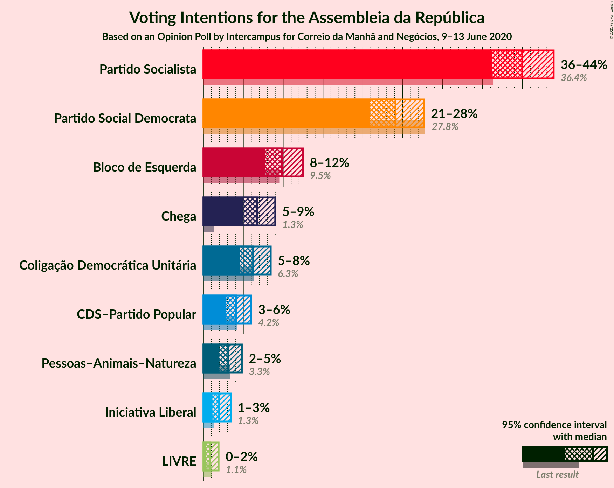

### Confidence Intervals

| Party | Last Result | Poll Result | 80% Confidence Interval | 90% Confidence Interval | 95% Confidence Interval | 99% Confidence Interval |
|:-----:|:-----------:|:-----------:|:-----------------------:|:-----------------------:|:-----------------------:|:-----------------------:|
| Partido Socialista | 36.4% | 40.0% | 37.5–42.6% |36.8–43.3% |36.2–43.9% |35.0–45.2% |
| Partido Social Democrata | 27.8% | 24.1% | 22.0–26.4% |21.4–27.1% |20.9–27.7% |19.9–28.8% |
| Bloco de Esquerda | 9.5% | 9.8% | 8.4–11.6% |8.0–12.0% |7.7–12.5% |7.1–13.3% |
| Chega | 1.3% | 6.7% | 5.6–8.2% |5.3–8.6% |5.0–9.0% |4.5–9.8% |
| Coligação Democrática Unitária | 6.3% | 6.2% | 5.1–7.7% |4.8–8.1% |4.6–8.4% |4.1–9.2% |
| CDS–Partido Popular | 4.2% | 4.1% | 3.2–5.3% |3.0–5.7% |2.8–6.0% |2.4–6.6% |
| Pessoas–Animais–Natureza | 3.3% | 3.1% | 2.4–4.2% |2.2–4.5% |2.0–4.8% |1.7–5.4% |
| Iniciativa Liberal | 1.3% | 2.0% | 1.4–2.9% |1.2–3.2% |1.1–3.4% |0.9–3.9% |
| LIVRE | 1.1% | 0.8% | 0.5–1.5% |0.4–1.7% |0.4–1.9% |0.2–2.3% |

*Note:* The poll result column reflects the actual value used in the calculations. Published results may vary slightly, and in addition be rounded to fewer digits.

## Seats

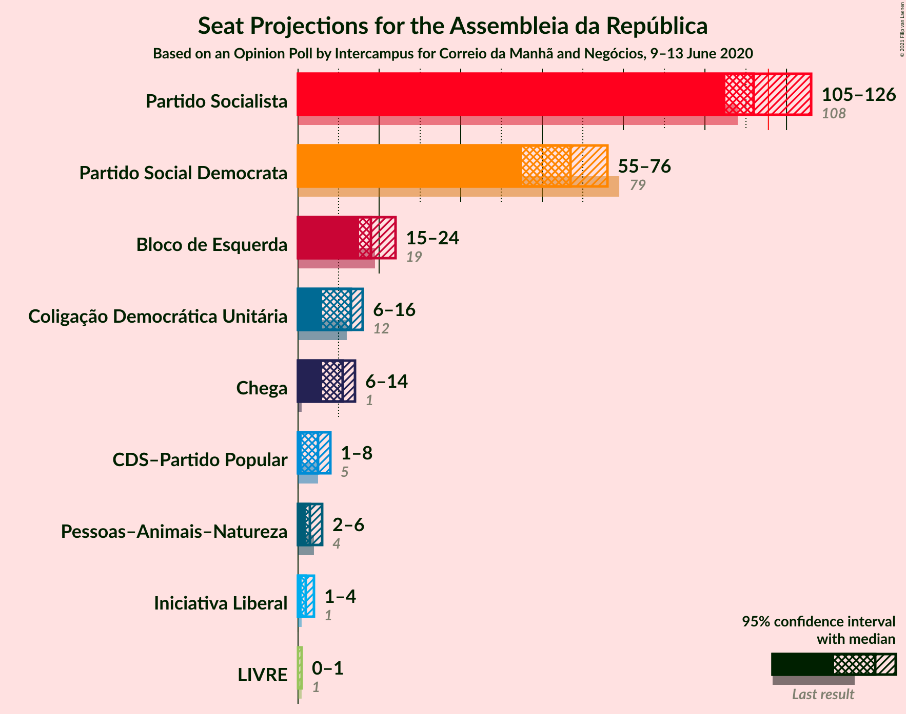

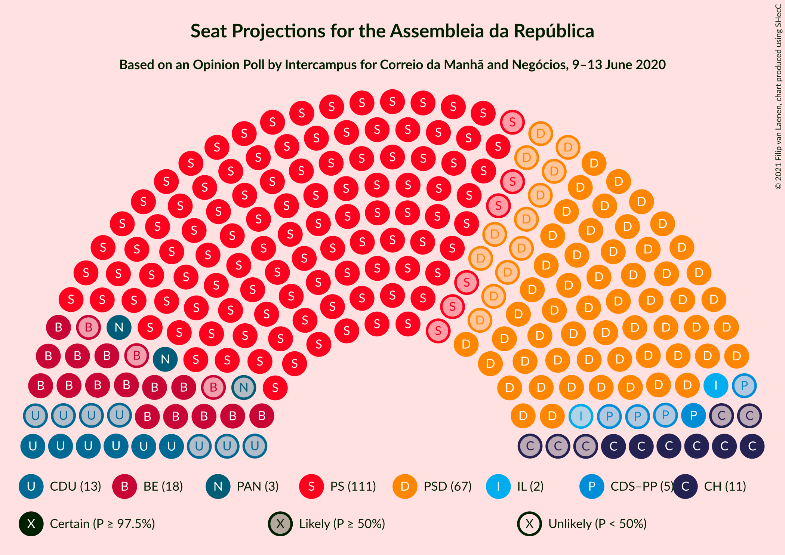

### Confidence Intervals

| Party | Last Result | Median | 80% Confidence Interval | 90% Confidence Interval | 95% Confidence Interval | 99% Confidence Interval |
|:-----:|:-----------:|:------:|:-----------------------:|:-----------------------:|:-----------------------:|:-----------------------:|
| <a href="#partido-socialista">Partido Socialista</a> | 108 | 112 | 108–121 |108–124 |105–126 |102–127 |
| <a href="#partido-social-democrata">Partido Social Democrata</a> | 79 | 67 | 58–70 |55–72 |55–76 |53–79 |
| <a href="#bloco-de-esquerda">Bloco de Esquerda</a> | 19 | 18 | 17–22 |16–24 |15–24 |13–28 |
| <a href="#chega">Chega</a> | 1 | 11 | 8–14 |8–14 |6–14 |5–17 |
| <a href="#coligação-democrática-unitária">Coligação Democrática Unitária</a> | 12 | 13 | 8–14 |7–15 |6–16 |5–18 |
| <a href="#cds–partido-popular">CDS–Partido Popular</a> | 5 | 5 | 2–5 |2–5 |1–8 |1–10 |
| <a href="#pessoas–animais–natureza">Pessoas–Animais–Natureza</a> | 4 | 3 | 2–4 |2–4 |2–6 |1–6 |
| <a href="#iniciativa-liberal">Iniciativa Liberal</a> | 1 | 2 | 1–4 |1–4 |1–4 |0–5 |
| <a href="#livre">LIVRE</a> | 1 | 0 | 0–1 |0–1 |0–1 |0–2 |

### Partido Socialista

*For a full overview of the results for this party, see the [Partido Socialista](party-partidosocialista.html) page.*

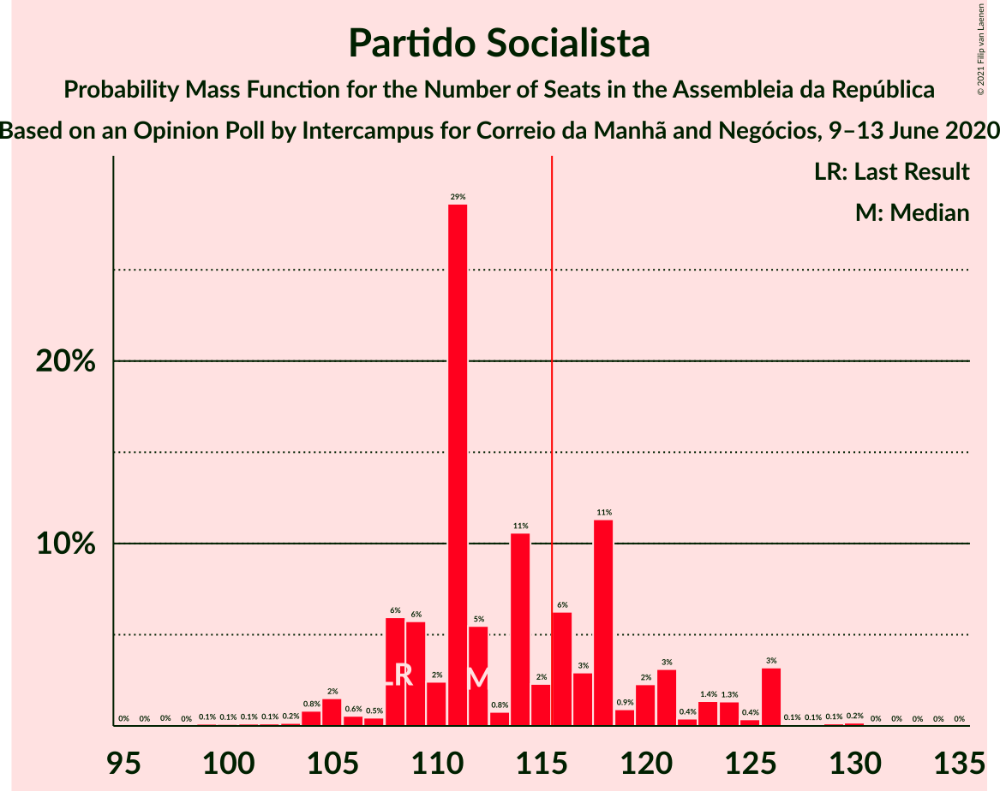

| Number of Seats | Probability | Accumulated | Special Marks |
|:---------------:|:-----------:|:-----------:|:-------------:|
| 96 | 0% | 100% |  |
| 97 | 0% | 99.9% |  |
| 98 | 0% | 99.9% |  |
| 99 | 0.1% | 99.9% |  |
| 100 | 0.1% | 99.8% |  |
| 101 | 0.1% | 99.7% |  |
| 102 | 0.1% | 99.5% |  |
| 103 | 0.2% | 99.4% |  |
| 104 | 0.8% | 99.2% |  |
| 105 | 2% | 98% |  |
| 106 | 0.6% | 97% |  |
| 107 | 0.5% | 96% |  |
| 108 | 6% | 96% | Last Result |
| 109 | 6% | 90% |  |
| 110 | 2% | 84% |  |
| 111 | 29% | 82% |  |
| 112 | 5% | 53% | Median |
| 113 | 0.8% | 48% |  |
| 114 | 11% | 47% |  |
| 115 | 2% | 36% |  |
| 116 | 6% | 34% | Majority |
| 117 | 3% | 28% |  |
| 118 | 11% | 25% |  |
| 119 | 0.9% | 14% |  |
| 120 | 2% | 13% |  |
| 121 | 3% | 10% |  |
| 122 | 0.4% | 7% |  |
| 123 | 1.4% | 7% |  |
| 124 | 1.3% | 5% |  |
| 125 | 0.4% | 4% |  |
| 126 | 3% | 4% |  |
| 127 | 0.1% | 0.5% |  |
| 128 | 0.1% | 0.5% |  |
| 129 | 0.1% | 0.4% |  |
| 130 | 0.2% | 0.2% |  |
| 131 | 0% | 0.1% |  |
| 132 | 0% | 0% |  |

### Partido Social Democrata

*For a full overview of the results for this party, see the [Partido Social Democrata](party-partidosocialdemocrata.html) page.*

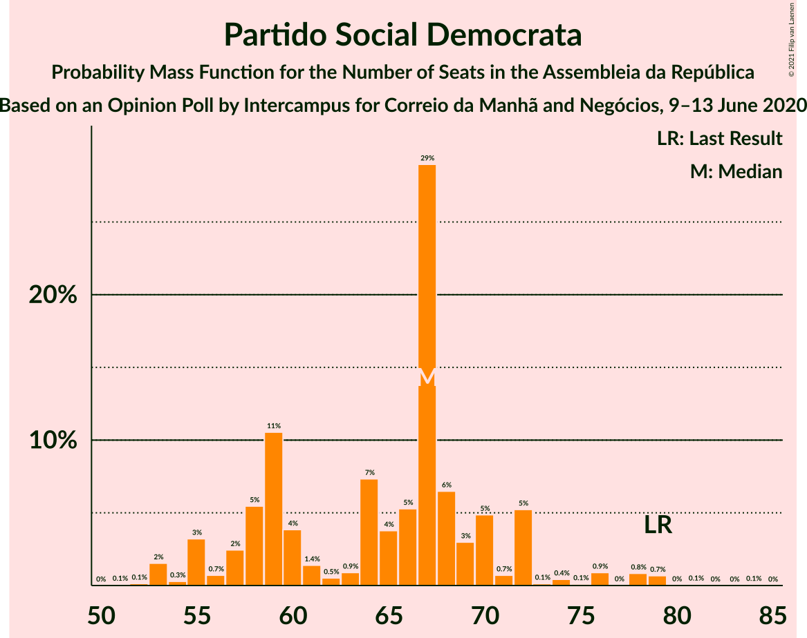

| Number of Seats | Probability | Accumulated | Special Marks |
|:---------------:|:-----------:|:-----------:|:-------------:|
| 51 | 0.1% | 100% |  |
| 52 | 0.1% | 99.9% |  |
| 53 | 2% | 99.8% |  |
| 54 | 0.3% | 98% |  |
| 55 | 3% | 98% |  |
| 56 | 0.7% | 95% |  |
| 57 | 2% | 94% |  |
| 58 | 5% | 92% |  |
| 59 | 11% | 86% |  |
| 60 | 4% | 76% |  |
| 61 | 1.4% | 72% |  |
| 62 | 0.5% | 70% |  |
| 63 | 0.9% | 70% |  |
| 64 | 7% | 69% |  |
| 65 | 4% | 62% |  |
| 66 | 5% | 58% |  |
| 67 | 29% | 53% | Median |
| 68 | 6% | 24% |  |
| 69 | 3% | 17% |  |
| 70 | 5% | 14% |  |
| 71 | 0.7% | 9% |  |
| 72 | 5% | 8% |  |
| 73 | 0.1% | 3% |  |
| 74 | 0.4% | 3% |  |
| 75 | 0.1% | 3% |  |
| 76 | 0.9% | 3% |  |
| 77 | 0% | 2% |  |
| 78 | 0.8% | 2% |  |
| 79 | 0.7% | 0.8% | Last Result |
| 80 | 0% | 0.2% |  |
| 81 | 0.1% | 0.1% |  |
| 82 | 0% | 0.1% |  |
| 83 | 0% | 0.1% |  |
| 84 | 0.1% | 0.1% |  |
| 85 | 0% | 0% |  |

### Bloco de Esquerda

*For a full overview of the results for this party, see the [Bloco de Esquerda](party-blocodeesquerda.html) page.*

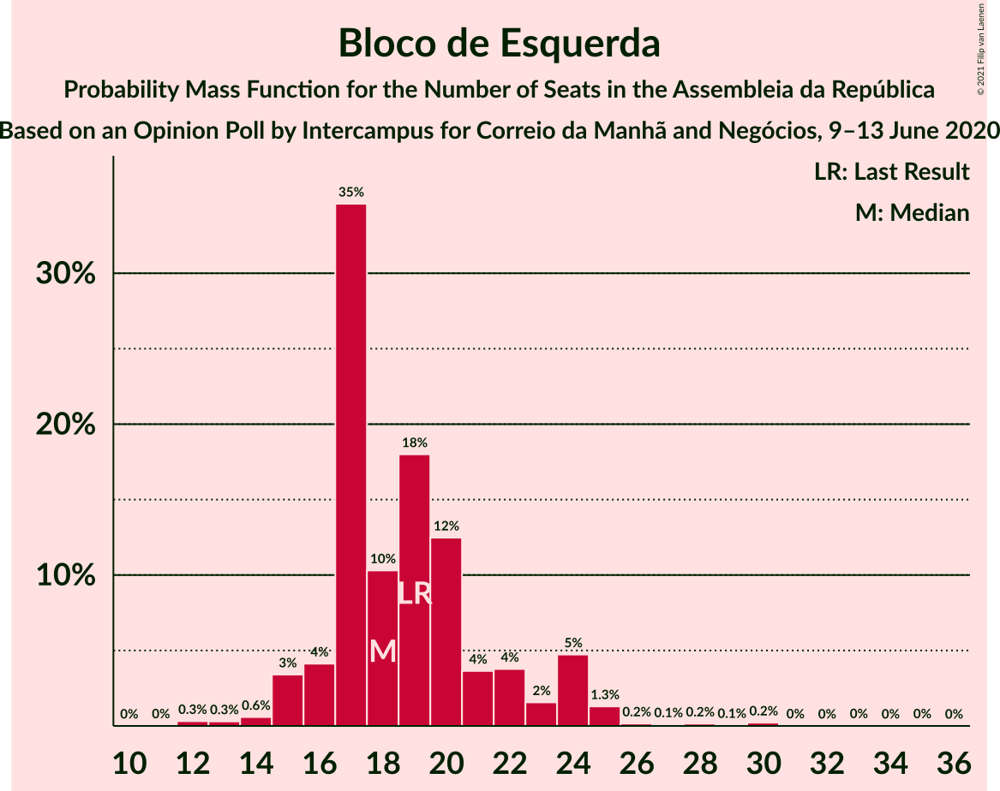

| Number of Seats | Probability | Accumulated | Special Marks |
|:---------------:|:-----------:|:-----------:|:-------------:|
| 12 | 0.3% | 100% |  |
| 13 | 0.3% | 99.6% |  |
| 14 | 0.6% | 99.3% |  |
| 15 | 3% | 98.7% |  |
| 16 | 4% | 95% |  |
| 17 | 35% | 91% |  |
| 18 | 10% | 57% | Median |
| 19 | 18% | 46% | Last Result |
| 20 | 12% | 28% |  |
| 21 | 4% | 16% |  |
| 22 | 4% | 12% |  |
| 23 | 2% | 8% |  |
| 24 | 5% | 7% |  |
| 25 | 1.3% | 2% |  |
| 26 | 0.2% | 0.8% |  |
| 27 | 0.1% | 0.7% |  |
| 28 | 0.2% | 0.6% |  |
| 29 | 0.1% | 0.4% |  |
| 30 | 0.2% | 0.3% |  |
| 31 | 0% | 0.1% |  |
| 32 | 0% | 0.1% |  |
| 33 | 0% | 0.1% |  |
| 34 | 0% | 0.1% |  |
| 35 | 0% | 0% |  |

### Chega

*For a full overview of the results for this party, see the [Chega](party-chega.html) page.*

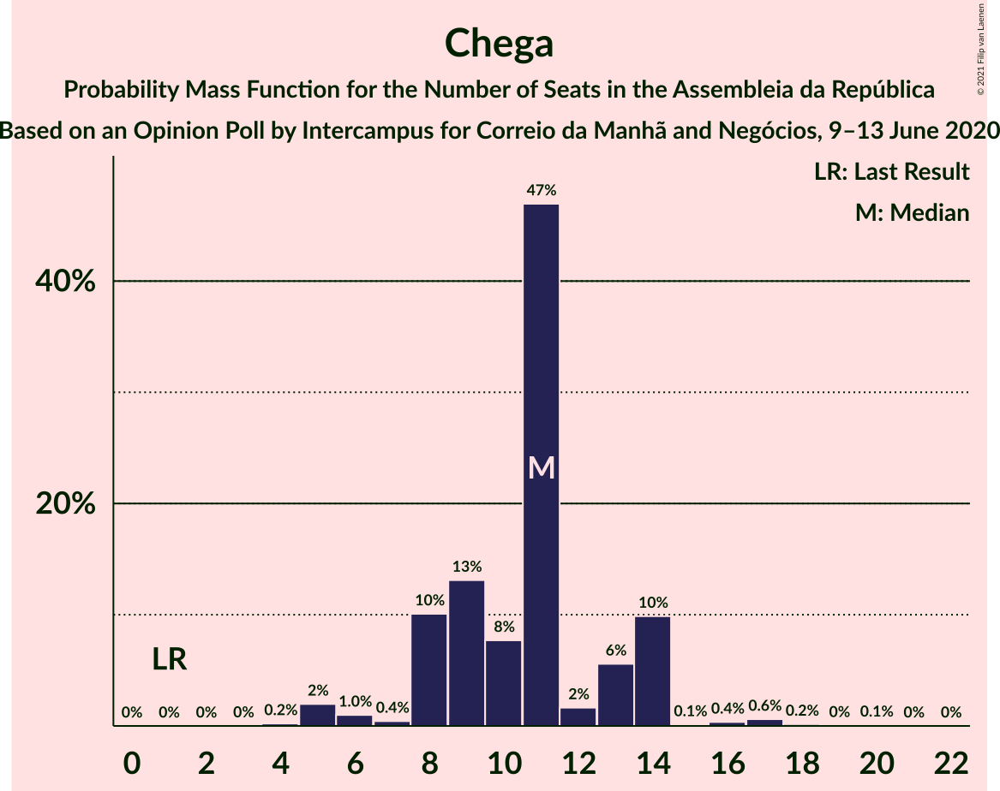

| Number of Seats | Probability | Accumulated | Special Marks |
|:---------------:|:-----------:|:-----------:|:-------------:|
| 1 | 0% | 100% | Last Result |
| 2 | 0% | 100% |  |
| 3 | 0% | 100% |  |
| 4 | 0.2% | 100% |  |
| 5 | 2% | 99.8% |  |
| 6 | 1.0% | 98% |  |
| 7 | 0.4% | 97% |  |
| 8 | 10% | 96% |  |
| 9 | 13% | 86% |  |
| 10 | 8% | 73% |  |
| 11 | 47% | 65% | Median |
| 12 | 2% | 19% |  |
| 13 | 6% | 17% |  |
| 14 | 10% | 11% |  |
| 15 | 0.1% | 1.4% |  |
| 16 | 0.4% | 1.3% |  |
| 17 | 0.6% | 0.9% |  |
| 18 | 0.2% | 0.3% |  |
| 19 | 0% | 0.2% |  |
| 20 | 0.1% | 0.1% |  |
| 21 | 0% | 0% |  |

### Coligação Democrática Unitária

*For a full overview of the results for this party, see the [Coligação Democrática Unitária](party-coligaçãodemocráticaunitária.html) page.*

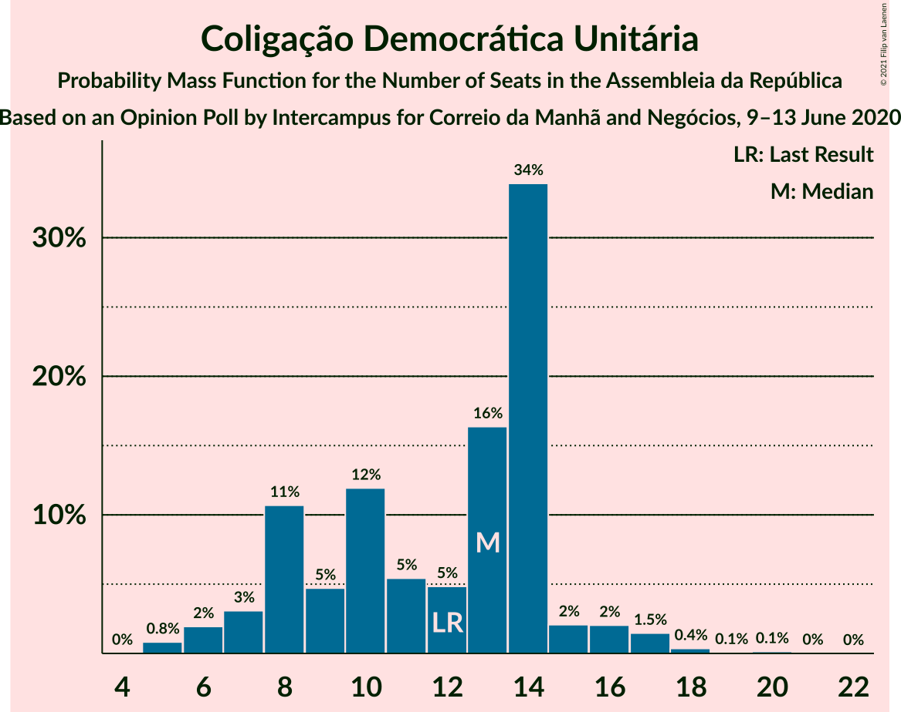

| Number of Seats | Probability | Accumulated | Special Marks |
|:---------------:|:-----------:|:-----------:|:-------------:|
| 5 | 0.8% | 100% |  |
| 6 | 2% | 99.1% |  |
| 7 | 3% | 97% |  |
| 8 | 11% | 94% |  |
| 9 | 5% | 83% |  |
| 10 | 12% | 79% |  |
| 11 | 5% | 67% |  |
| 12 | 5% | 61% | Last Result |
| 13 | 16% | 56% | Median |
| 14 | 34% | 40% |  |
| 15 | 2% | 6% |  |
| 16 | 2% | 4% |  |
| 17 | 1.5% | 2% |  |
| 18 | 0.4% | 0.6% |  |
| 19 | 0.1% | 0.3% |  |
| 20 | 0.1% | 0.2% |  |
| 21 | 0% | 0% |  |

### CDS–Partido Popular

*For a full overview of the results for this party, see the [CDS–Partido Popular](party-cds–partidopopular.html) page.*

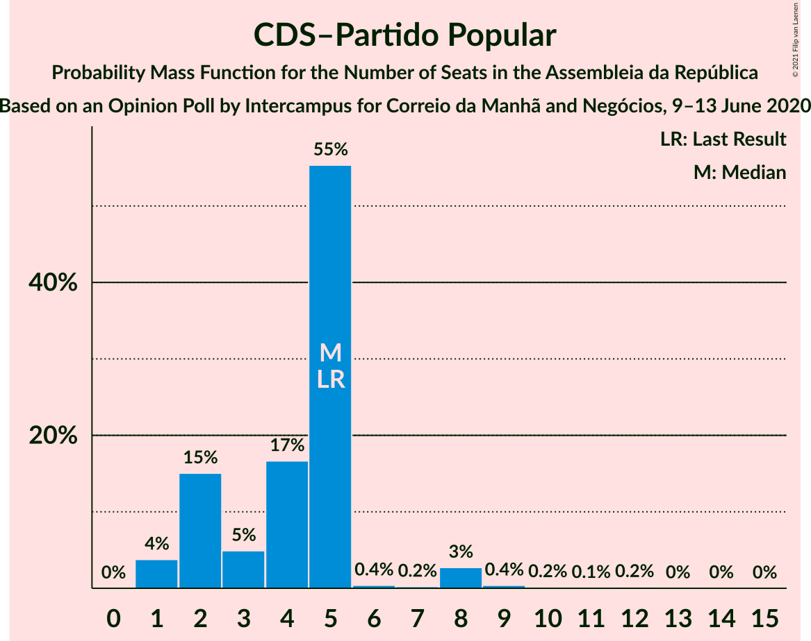

| Number of Seats | Probability | Accumulated | Special Marks |
|:---------------:|:-----------:|:-----------:|:-------------:|
| 1 | 4% | 100% |  |
| 2 | 15% | 96% |  |
| 3 | 5% | 81% |  |
| 4 | 17% | 76% |  |
| 5 | 55% | 60% | Last Result, Median |
| 6 | 0.4% | 4% |  |
| 7 | 0.2% | 4% |  |
| 8 | 3% | 4% |  |
| 9 | 0.4% | 0.9% |  |
| 10 | 0.2% | 0.5% |  |
| 11 | 0.1% | 0.3% |  |
| 12 | 0.2% | 0.3% |  |
| 13 | 0% | 0.1% |  |
| 14 | 0% | 0.1% |  |
| 15 | 0% | 0% |  |

### Pessoas–Animais–Natureza

*For a full overview of the results for this party, see the [Pessoas–Animais–Natureza](party-pessoas–animais–natureza.html) page.*

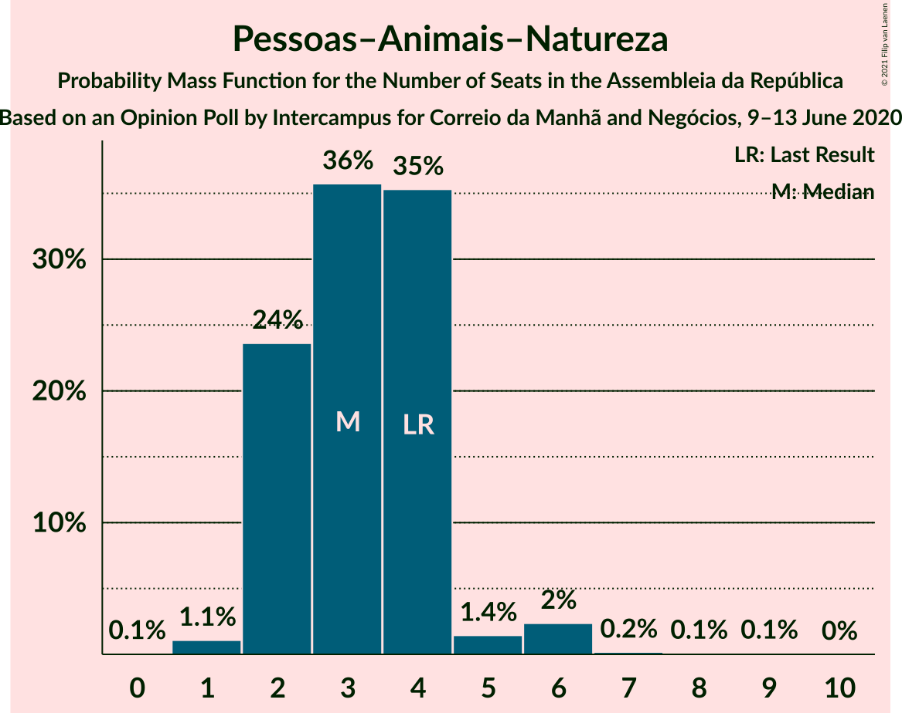

| Number of Seats | Probability | Accumulated | Special Marks |
|:---------------:|:-----------:|:-----------:|:-------------:|
| 0 | 0.1% | 100% |  |
| 1 | 1.1% | 99.9% |  |
| 2 | 24% | 98.9% |  |
| 3 | 36% | 75% | Median |
| 4 | 35% | 40% | Last Result |
| 5 | 1.4% | 4% |  |
| 6 | 2% | 3% |  |
| 7 | 0.2% | 0.4% |  |
| 8 | 0.1% | 0.2% |  |
| 9 | 0.1% | 0.1% |  |
| 10 | 0% | 0% |  |

### Iniciativa Liberal

*For a full overview of the results for this party, see the [Iniciativa Liberal](party-iniciativaliberal.html) page.*

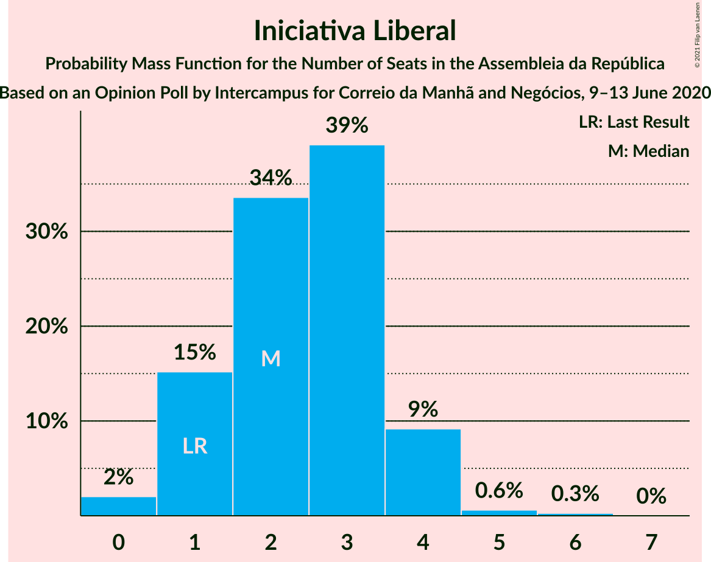

| Number of Seats | Probability | Accumulated | Special Marks |
|:---------------:|:-----------:|:-----------:|:-------------:|
| 0 | 2% | 100% |  |
| 1 | 15% | 98% | Last Result |
| 2 | 34% | 83% | Median |
| 3 | 39% | 49% |  |
| 4 | 9% | 10% |  |
| 5 | 0.6% | 0.9% |  |
| 6 | 0.3% | 0.3% |  |
| 7 | 0% | 0% |  |

### LIVRE

*For a full overview of the results for this party, see the [LIVRE](party-livre.html) page.*

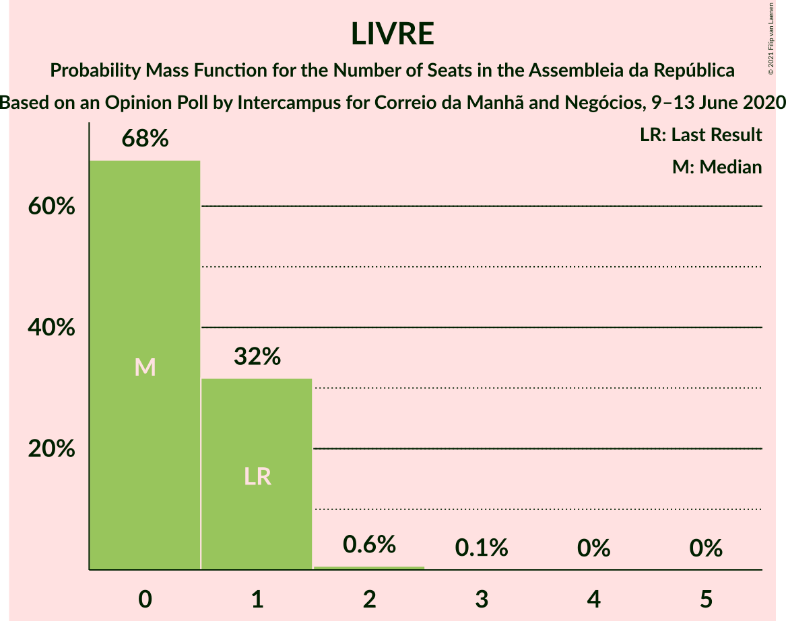

| Number of Seats | Probability | Accumulated | Special Marks |
|:---------------:|:-----------:|:-----------:|:-------------:|
| 0 | 68% | 100% | Median |
| 1 | 32% | 32% | Last Result |
| 2 | 0.6% | 0.7% |  |
| 3 | 0.1% | 0.1% |  |
| 4 | 0% | 0% |  |

## Coalitions

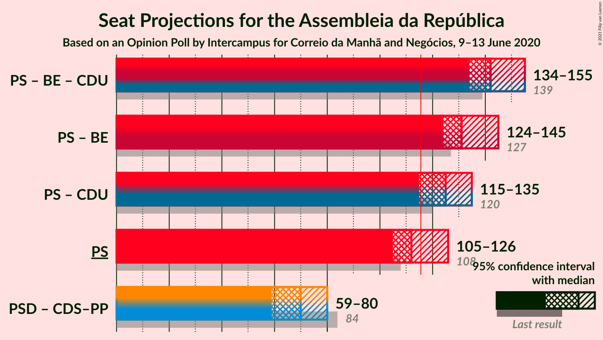

### Confidence Intervals

| Coalition | Last Result | Median | Majority? | 80% Confidence Interval | 90% Confidence Interval | 95% Confidence Interval | 99% Confidence Interval |
|:---------:|:-----------:|:------:|:---------:|:-----------------------:|:-----------------------:|:-----------------------:|:-----------------------:|
| Partido Socialista – Bloco de Esquerda – Coligação Democrática Unitária | 139 | 142 | 100% | 138–151 | 136–153 | 134–155 | 130–158 |
| Partido Socialista – Bloco de Esquerda | 127 | 131 | 100% | 126–141 | 126–144 | 124–145 | 122–146 |
| Partido Socialista – Coligação Democrática Unitária | 120 | 125 | 97% | 120–131 | 118–134 | 115–135 | 112–137 |
| Partido Socialista | 108 | 112 | 34% | 108–121 | 108–124 | 105–126 | 102–127 |
| Partido Social Democrata – CDS–Partido Popular | 84 | 70 | 0% | 63–74 | 60–75 | 59–80 | 55–84 |

### Partido Socialista – Bloco de Esquerda – Coligação Democrática Unitária

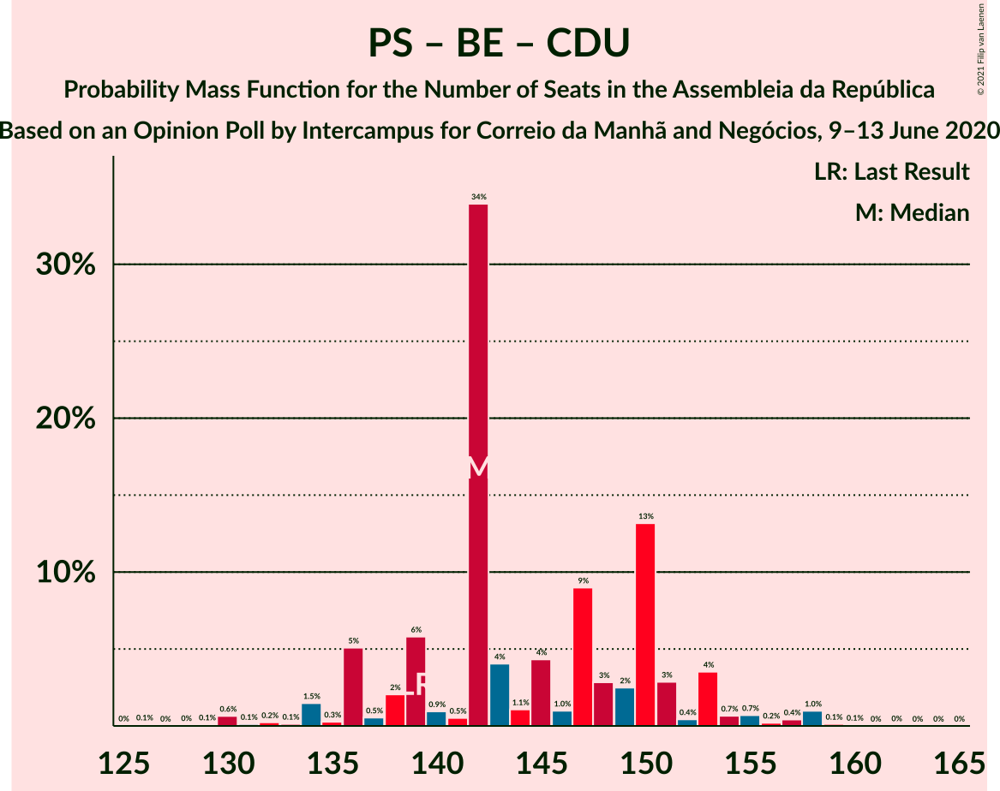

| Number of Seats | Probability | Accumulated | Special Marks |
|:---------------:|:-----------:|:-----------:|:-------------:|
| 126 | 0.1% | 100% |  |
| 127 | 0% | 99.9% |  |
| 128 | 0% | 99.9% |  |
| 129 | 0.1% | 99.8% |  |
| 130 | 0.6% | 99.7% |  |
| 131 | 0.1% | 99.1% |  |
| 132 | 0.2% | 99.0% |  |
| 133 | 0.1% | 98.7% |  |
| 134 | 1.5% | 98.6% |  |
| 135 | 0.3% | 97% |  |
| 136 | 5% | 97% |  |
| 137 | 0.5% | 92% |  |
| 138 | 2% | 91% |  |
| 139 | 6% | 89% | Last Result |
| 140 | 0.9% | 83% |  |
| 141 | 0.5% | 82% |  |
| 142 | 34% | 82% |  |
| 143 | 4% | 48% | Median |
| 144 | 1.1% | 44% |  |
| 145 | 4% | 43% |  |
| 146 | 1.0% | 39% |  |
| 147 | 9% | 38% |  |
| 148 | 3% | 29% |  |
| 149 | 2% | 26% |  |
| 150 | 13% | 23% |  |
| 151 | 3% | 10% |  |
| 152 | 0.4% | 7% |  |
| 153 | 4% | 7% |  |
| 154 | 0.7% | 3% |  |
| 155 | 0.7% | 3% |  |
| 156 | 0.2% | 2% |  |
| 157 | 0.4% | 2% |  |
| 158 | 1.0% | 1.2% |  |
| 159 | 0.1% | 0.2% |  |
| 160 | 0.1% | 0.1% |  |
| 161 | 0% | 0.1% |  |
| 162 | 0% | 0% |  |

### Partido Socialista – Bloco de Esquerda

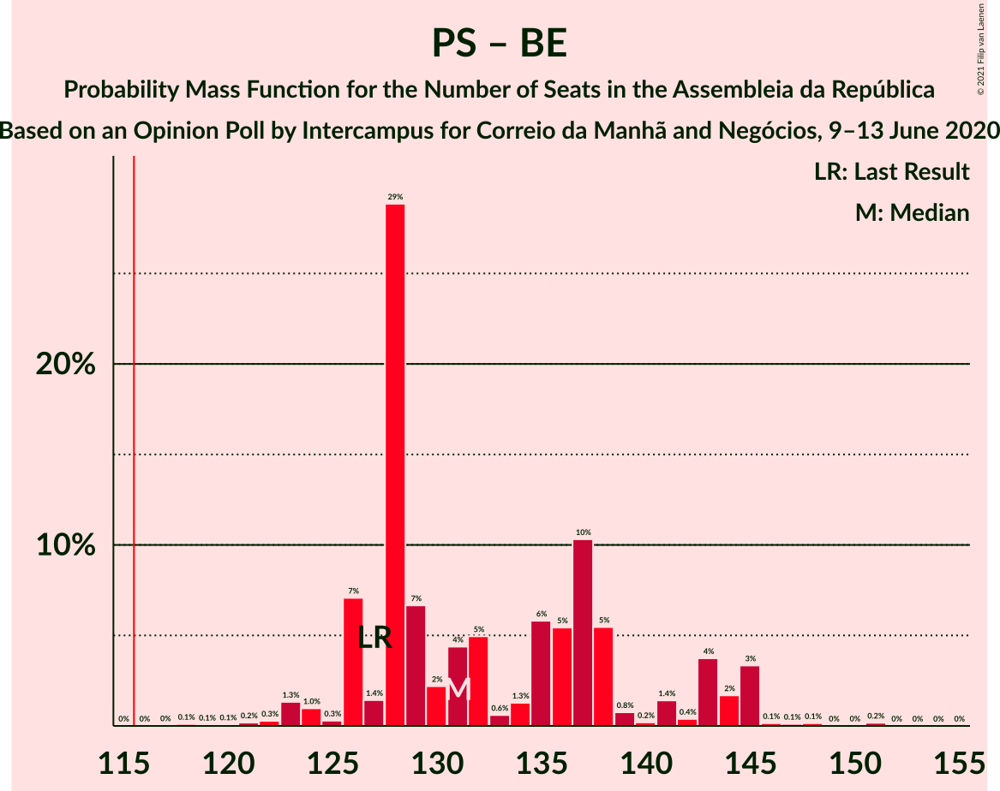

| Number of Seats | Probability | Accumulated | Special Marks |
|:---------------:|:-----------:|:-----------:|:-------------:|
| 117 | 0% | 100% |  |
| 118 | 0.1% | 99.9% |  |
| 119 | 0.1% | 99.8% |  |
| 120 | 0.1% | 99.8% |  |
| 121 | 0.2% | 99.7% |  |
| 122 | 0.3% | 99.5% |  |
| 123 | 1.3% | 99.2% |  |
| 124 | 1.0% | 98% |  |
| 125 | 0.3% | 97% |  |
| 126 | 7% | 97% |  |
| 127 | 1.4% | 90% | Last Result |
| 128 | 29% | 88% |  |
| 129 | 7% | 59% |  |
| 130 | 2% | 53% | Median |
| 131 | 4% | 50% |  |
| 132 | 5% | 46% |  |
| 133 | 0.6% | 41% |  |
| 134 | 1.3% | 40% |  |
| 135 | 6% | 39% |  |
| 136 | 5% | 33% |  |
| 137 | 10% | 28% |  |
| 138 | 5% | 18% |  |
| 139 | 0.8% | 12% |  |
| 140 | 0.2% | 11% |  |
| 141 | 1.4% | 11% |  |
| 142 | 0.4% | 10% |  |
| 143 | 4% | 9% |  |
| 144 | 2% | 6% |  |
| 145 | 3% | 4% |  |
| 146 | 0.1% | 0.6% |  |
| 147 | 0.1% | 0.5% |  |
| 148 | 0.1% | 0.4% |  |
| 149 | 0% | 0.2% |  |
| 150 | 0% | 0.2% |  |
| 151 | 0.2% | 0.2% |  |
| 152 | 0% | 0% |  |

### Partido Socialista – Coligação Democrática Unitária

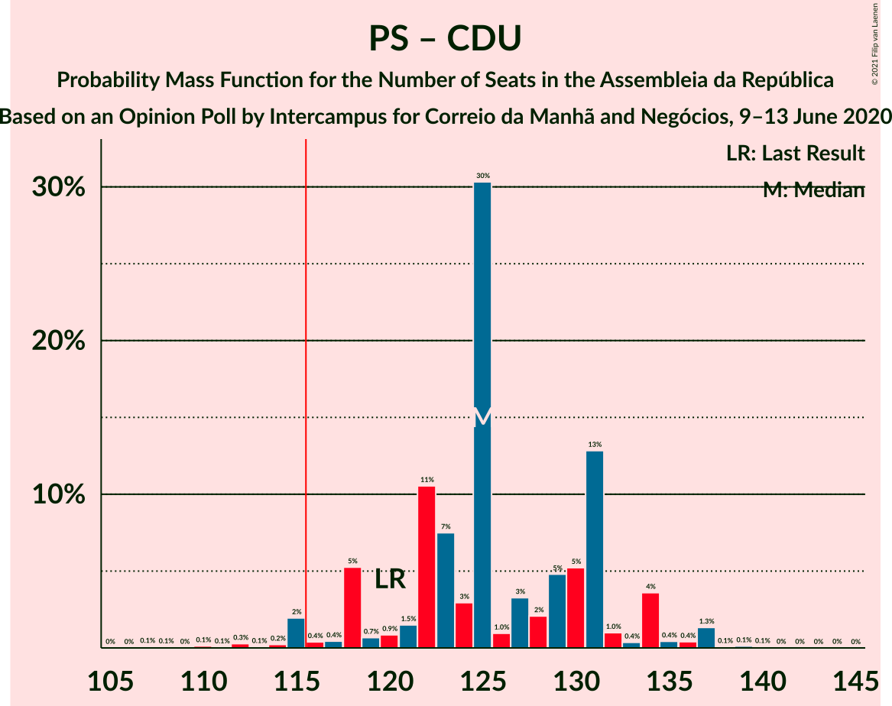

| Number of Seats | Probability | Accumulated | Special Marks |
|:---------------:|:-----------:|:-----------:|:-------------:|
| 106 | 0% | 100% |  |
| 107 | 0.1% | 99.9% |  |
| 108 | 0.1% | 99.9% |  |
| 109 | 0% | 99.8% |  |
| 110 | 0.1% | 99.8% |  |
| 111 | 0.1% | 99.7% |  |
| 112 | 0.3% | 99.6% |  |
| 113 | 0.1% | 99.3% |  |
| 114 | 0.2% | 99.3% |  |
| 115 | 2% | 99.0% |  |
| 116 | 0.4% | 97% | Majority |
| 117 | 0.4% | 97% |  |
| 118 | 5% | 96% |  |
| 119 | 0.7% | 91% |  |
| 120 | 0.9% | 90% | Last Result |
| 121 | 1.5% | 89% |  |
| 122 | 11% | 88% |  |
| 123 | 7% | 77% |  |
| 124 | 3% | 70% |  |
| 125 | 30% | 67% | Median |
| 126 | 1.0% | 37% |  |
| 127 | 3% | 36% |  |
| 128 | 2% | 32% |  |
| 129 | 5% | 30% |  |
| 130 | 5% | 26% |  |
| 131 | 13% | 20% |  |
| 132 | 1.0% | 7% |  |
| 133 | 0.4% | 6% |  |
| 134 | 4% | 6% |  |
| 135 | 0.4% | 3% |  |
| 136 | 0.4% | 2% |  |
| 137 | 1.3% | 2% |  |
| 138 | 0.1% | 0.4% |  |
| 139 | 0.1% | 0.3% |  |
| 140 | 0.1% | 0.2% |  |
| 141 | 0% | 0.1% |  |
| 142 | 0% | 0.1% |  |
| 143 | 0% | 0.1% |  |
| 144 | 0% | 0% |  |

### Partido Socialista

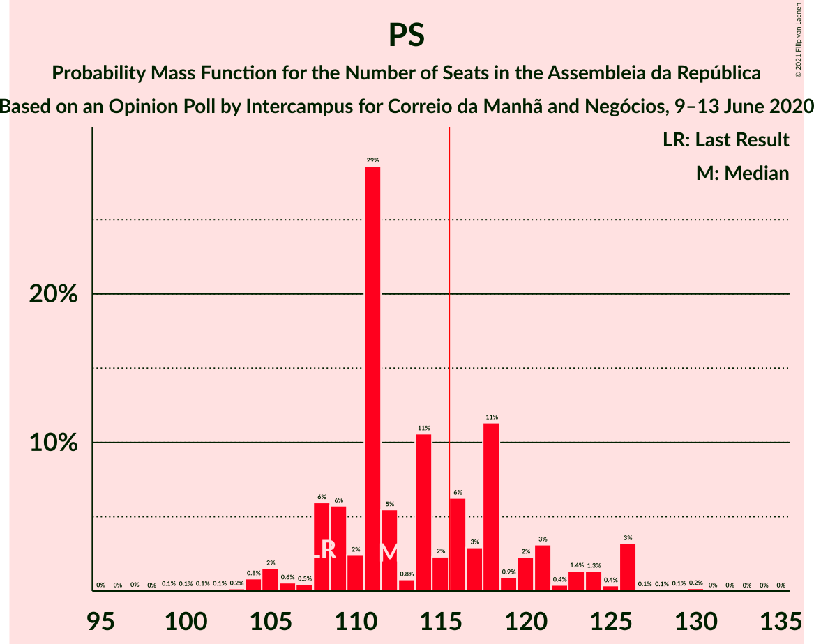

| Number of Seats | Probability | Accumulated | Special Marks |
|:---------------:|:-----------:|:-----------:|:-------------:|
| 96 | 0% | 100% |  |
| 97 | 0% | 99.9% |  |
| 98 | 0% | 99.9% |  |
| 99 | 0.1% | 99.9% |  |
| 100 | 0.1% | 99.8% |  |
| 101 | 0.1% | 99.7% |  |
| 102 | 0.1% | 99.5% |  |
| 103 | 0.2% | 99.4% |  |
| 104 | 0.8% | 99.2% |  |
| 105 | 2% | 98% |  |
| 106 | 0.6% | 97% |  |
| 107 | 0.5% | 96% |  |
| 108 | 6% | 96% | Last Result |
| 109 | 6% | 90% |  |
| 110 | 2% | 84% |  |
| 111 | 29% | 82% |  |
| 112 | 5% | 53% | Median |
| 113 | 0.8% | 48% |  |
| 114 | 11% | 47% |  |
| 115 | 2% | 36% |  |
| 116 | 6% | 34% | Majority |
| 117 | 3% | 28% |  |
| 118 | 11% | 25% |  |
| 119 | 0.9% | 14% |  |
| 120 | 2% | 13% |  |
| 121 | 3% | 10% |  |
| 122 | 0.4% | 7% |  |
| 123 | 1.4% | 7% |  |
| 124 | 1.3% | 5% |  |
| 125 | 0.4% | 4% |  |
| 126 | 3% | 4% |  |
| 127 | 0.1% | 0.5% |  |
| 128 | 0.1% | 0.5% |  |
| 129 | 0.1% | 0.4% |  |
| 130 | 0.2% | 0.2% |  |
| 131 | 0% | 0.1% |  |
| 132 | 0% | 0% |  |

### Partido Social Democrata – CDS–Partido Popular

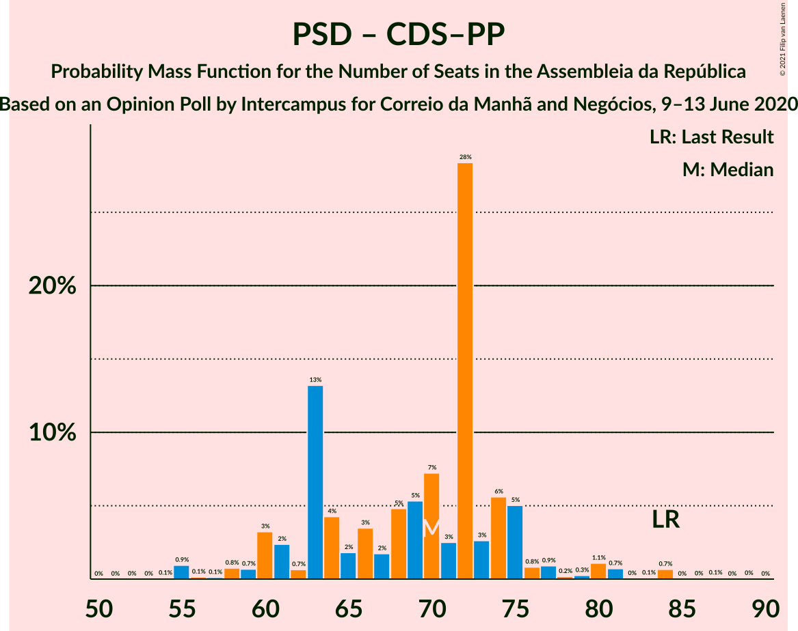

| Number of Seats | Probability | Accumulated | Special Marks |
|:---------------:|:-----------:|:-----------:|:-------------:|
| 54 | 0.1% | 100% |  |
| 55 | 0.9% | 99.9% |  |
| 56 | 0.1% | 99.0% |  |
| 57 | 0.1% | 98.8% |  |
| 58 | 0.8% | 98.7% |  |
| 59 | 0.7% | 98% |  |
| 60 | 3% | 97% |  |
| 61 | 2% | 94% |  |
| 62 | 0.7% | 92% |  |
| 63 | 13% | 91% |  |
| 64 | 4% | 78% |  |
| 65 | 2% | 74% |  |
| 66 | 3% | 72% |  |
| 67 | 2% | 68% |  |
| 68 | 5% | 66% |  |
| 69 | 5% | 62% |  |
| 70 | 7% | 56% |  |
| 71 | 3% | 49% |  |
| 72 | 28% | 47% | Median |
| 73 | 3% | 18% |  |
| 74 | 6% | 16% |  |
| 75 | 5% | 10% |  |
| 76 | 0.8% | 5% |  |
| 77 | 0.9% | 4% |  |
| 78 | 0.2% | 3% |  |
| 79 | 0.3% | 3% |  |
| 80 | 1.1% | 3% |  |
| 81 | 0.7% | 2% |  |
| 82 | 0% | 1.0% |  |
| 83 | 0.1% | 0.9% |  |
| 84 | 0.7% | 0.8% | Last Result |
| 85 | 0% | 0.2% |  |
| 86 | 0% | 0.2% |  |
| 87 | 0.1% | 0.1% |  |
| 88 | 0% | 0.1% |  |
| 89 | 0% | 0.1% |  |
| 90 | 0% | 0% |  |

## Technical Information

### Opinion Poll

+ **Polling firm:** Intercampus
+ **Commissioner(s):** Correio da Manhã and Negócios
+ **Fieldwork period:** 9–13 June 2020

### Calculations

+ **Sample size:** 610
+ **Simulations done:** 131,072
+ **Error estimate:** 2.19%

