# Opinion Poll by Eurosondagem, 29 June–2 July 2020

<a href="#voting-intentions">Voting Intentions</a> | <a href="#seats">Seats</a> | <a href="#coalitions">Coalitions</a> | <a href="#technical-information">Technical Information</a>

## Voting Intentions

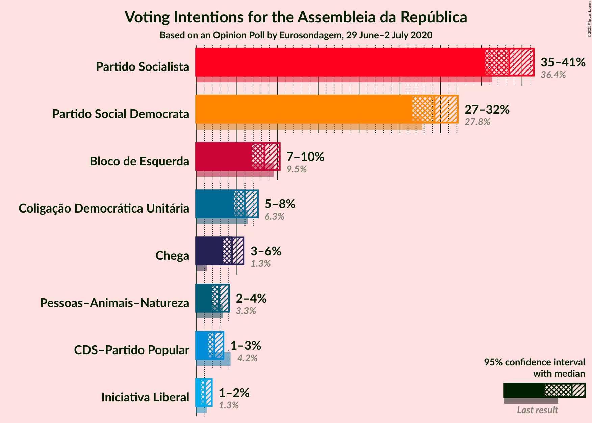

### Confidence Intervals

| Party | Last Result | Poll Result | 80% Confidence Interval | 90% Confidence Interval | 95% Confidence Interval | 99% Confidence Interval |
|:-----:|:-----------:|:-----------:|:-----------------------:|:-----------------------:|:-----------------------:|:-----------------------:|
| Partido Socialista | 36.4% | 38.4% | 36.5–40.4% |36.0–41.0% |35.5–41.5% |34.6–42.4% |
| Partido Social Democrata | 27.8% | 29.3% | 27.5–31.1% |27.0–31.7% |26.6–32.1% |25.7–33.0% |
| Bloco de Esquerda | 9.5% | 8.4% | 7.4–9.6% |7.1–10.0% |6.8–10.3% |6.4–10.9% |
| Coligação Democrática Unitária | 6.3% | 6.0% | 5.1–7.0% |4.9–7.3% |4.7–7.6% |4.3–8.1% |
| Chega | 1.3% | 4.4% | 3.7–5.3% |3.5–5.6% |3.3–5.8% |3.0–6.3% |
| Pessoas–Animais–Natureza | 3.3% | 2.8% | 2.3–3.6% |2.1–3.8% |2.0–4.0% |1.7–4.5% |
| CDS–Partido Popular | 4.2% | 2.2% | 1.8–3.0% |1.6–3.2% |1.5–3.4% |1.3–3.7% |
| Iniciativa Liberal | 1.3% | 1.1% | 0.8–1.6% |0.7–1.8% |0.6–1.9% |0.5–2.2% |

*Note:* The poll result column reflects the actual value used in the calculations. Published results may vary slightly, and in addition be rounded to fewer digits.

## Seats

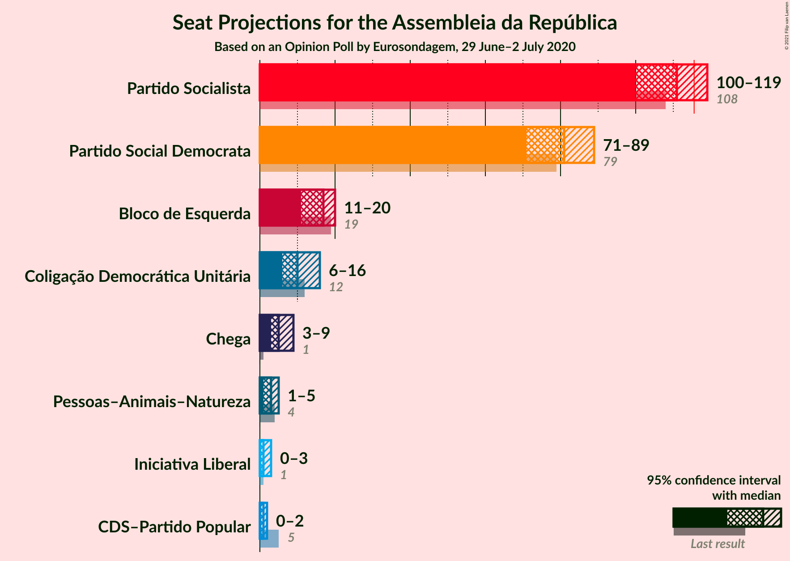

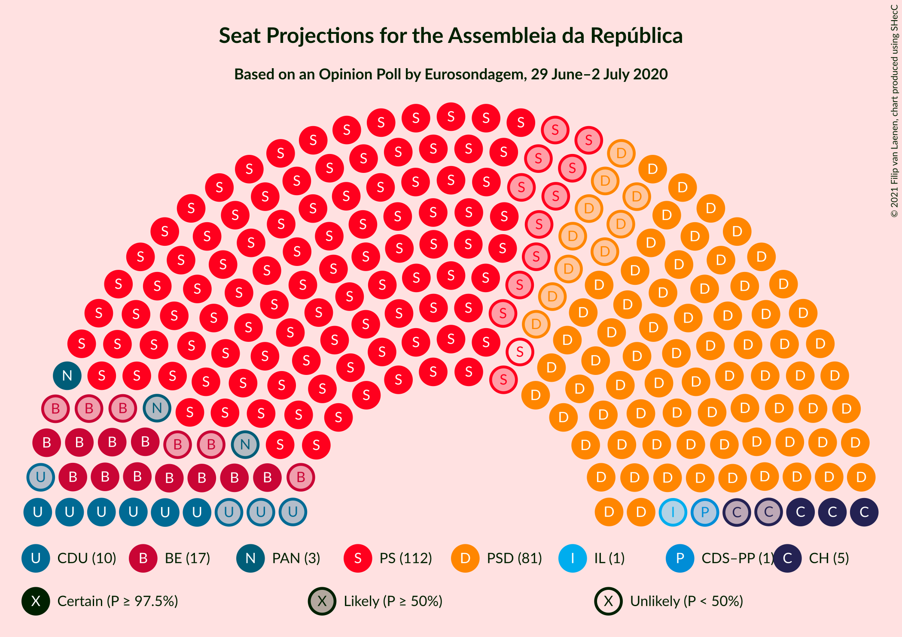

### Confidence Intervals

| Party | Last Result | Median | 80% Confidence Interval | 90% Confidence Interval | 95% Confidence Interval | 99% Confidence Interval |
|:-----:|:-----------:|:------:|:-----------------------:|:-----------------------:|:-----------------------:|:-----------------------:|
| <a href="#partido-socialista">Partido Socialista</a> | 108 | 111 | 105–117 |102–118 |100–119 |96–121 |
| <a href="#partido-social-democrata">Partido Social Democrata</a> | 79 | 81 | 74–86 |71–88 |71–89 |69–95 |
| <a href="#bloco-de-esquerda">Bloco de Esquerda</a> | 19 | 17 | 14–19 |12–20 |11–20 |10–22 |
| <a href="#coligação-democrática-unitária">Coligação Democrática Unitária</a> | 12 | 10 | 7–14 |7–16 |6–16 |6–16 |
| <a href="#chega">Chega</a> | 1 | 5 | 4–8 |3–9 |3–9 |2–11 |
| <a href="#pessoas–animais–natureza">Pessoas–Animais–Natureza</a> | 4 | 3 | 2–4 |1–4 |1–5 |1–6 |
| <a href="#cds–partido-popular">CDS–Partido Popular</a> | 5 | 1 | 0–2 |0–2 |0–2 |0–4 |
| <a href="#iniciativa-liberal">Iniciativa Liberal</a> | 1 | 1 | 0–1 |0–2 |0–3 |0–3 |

### Partido Socialista

*For a full overview of the results for this party, see the [Partido Socialista](party-partidosocialista.html) page.*

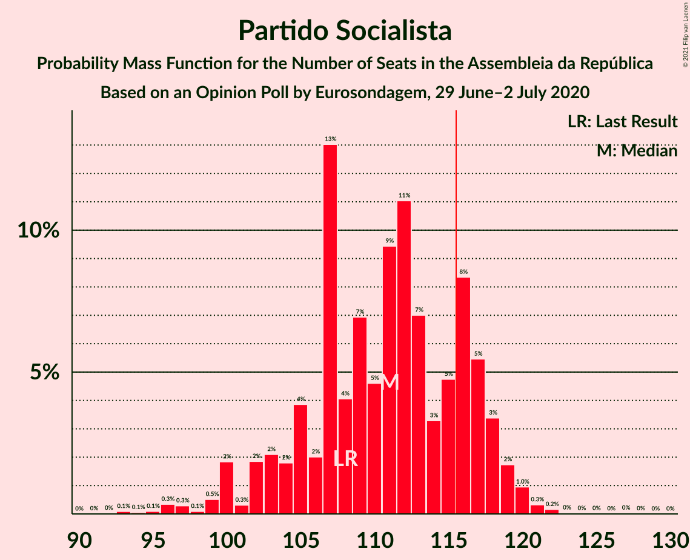

| Number of Seats | Probability | Accumulated | Special Marks |
|:---------------:|:-----------:|:-----------:|:-------------:|
| 93 | 0.1% | 100% |  |
| 94 | 0.1% | 99.9% |  |
| 95 | 0.1% | 99.8% |  |
| 96 | 0.3% | 99.7% |  |
| 97 | 0.3% | 99.4% |  |
| 98 | 0.1% | 99.1% |  |
| 99 | 0.5% | 99.0% |  |
| 100 | 2% | 98% |  |
| 101 | 0.3% | 97% |  |
| 102 | 2% | 96% |  |
| 103 | 2% | 94% |  |
| 104 | 2% | 92% |  |
| 105 | 4% | 91% |  |
| 106 | 2% | 87% |  |
| 107 | 13% | 85% |  |
| 108 | 4% | 72% | Last Result |
| 109 | 7% | 68% |  |
| 110 | 5% | 61% |  |
| 111 | 9% | 56% | Median |
| 112 | 11% | 47% |  |
| 113 | 7% | 36% |  |
| 114 | 3% | 29% |  |
| 115 | 5% | 25% |  |
| 116 | 8% | 21% | Majority |
| 117 | 5% | 12% |  |
| 118 | 3% | 7% |  |
| 119 | 2% | 3% |  |
| 120 | 1.0% | 2% |  |
| 121 | 0.3% | 0.6% |  |
| 122 | 0.2% | 0.3% |  |
| 123 | 0% | 0.1% |  |
| 124 | 0% | 0.1% |  |
| 125 | 0% | 0.1% |  |
| 126 | 0% | 0.1% |  |
| 127 | 0% | 0.1% |  |
| 128 | 0% | 0% |  |

### Partido Social Democrata

*For a full overview of the results for this party, see the [Partido Social Democrata](party-partidosocialdemocrata.html) page.*

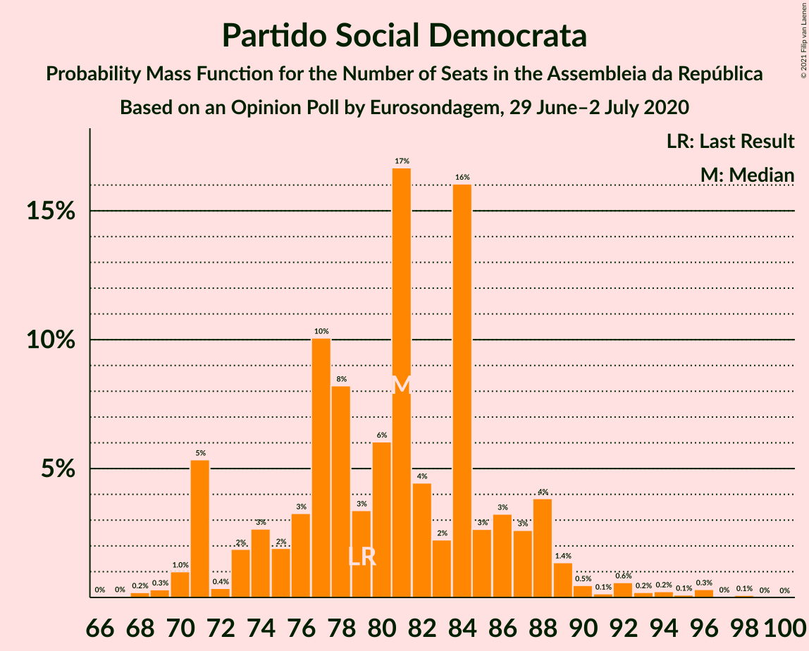

| Number of Seats | Probability | Accumulated | Special Marks |
|:---------------:|:-----------:|:-----------:|:-------------:|
| 66 | 0% | 100% |  |
| 67 | 0% | 99.9% |  |
| 68 | 0.2% | 99.9% |  |
| 69 | 0.3% | 99.7% |  |
| 70 | 1.0% | 99.4% |  |
| 71 | 5% | 98% |  |
| 72 | 0.4% | 93% |  |
| 73 | 2% | 93% |  |
| 74 | 3% | 91% |  |
| 75 | 2% | 88% |  |
| 76 | 3% | 86% |  |
| 77 | 10% | 83% |  |
| 78 | 8% | 73% |  |
| 79 | 3% | 65% | Last Result |
| 80 | 6% | 61% |  |
| 81 | 17% | 55% | Median |
| 82 | 4% | 39% |  |
| 83 | 2% | 34% |  |
| 84 | 16% | 32% |  |
| 85 | 3% | 16% |  |
| 86 | 3% | 13% |  |
| 87 | 3% | 10% |  |
| 88 | 4% | 7% |  |
| 89 | 1.4% | 4% |  |
| 90 | 0.5% | 2% |  |
| 91 | 0.1% | 2% |  |
| 92 | 0.6% | 2% |  |
| 93 | 0.2% | 1.0% |  |
| 94 | 0.2% | 0.8% |  |
| 95 | 0.1% | 0.6% |  |
| 96 | 0.3% | 0.5% |  |
| 97 | 0% | 0.2% |  |
| 98 | 0.1% | 0.1% |  |
| 99 | 0% | 0% |  |

### Bloco de Esquerda

*For a full overview of the results for this party, see the [Bloco de Esquerda](party-blocodeesquerda.html) page.*

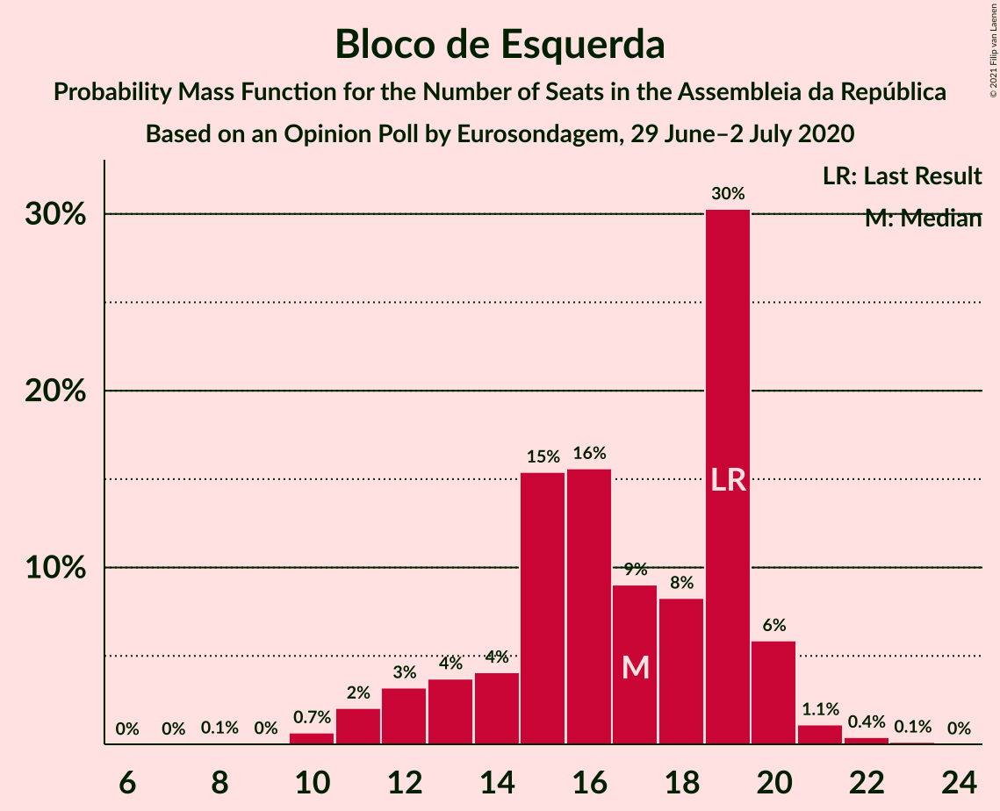

| Number of Seats | Probability | Accumulated | Special Marks |
|:---------------:|:-----------:|:-----------:|:-------------:|
| 8 | 0.1% | 100% |  |
| 9 | 0% | 99.9% |  |
| 10 | 0.7% | 99.9% |  |
| 11 | 2% | 99.2% |  |
| 12 | 3% | 97% |  |
| 13 | 4% | 94% |  |
| 14 | 4% | 90% |  |
| 15 | 15% | 86% |  |
| 16 | 16% | 71% |  |
| 17 | 9% | 55% | Median |
| 18 | 8% | 46% |  |
| 19 | 30% | 38% | Last Result |
| 20 | 6% | 8% |  |
| 21 | 1.1% | 2% |  |
| 22 | 0.4% | 0.6% |  |
| 23 | 0.1% | 0.2% |  |
| 24 | 0% | 0% |  |

### Coligação Democrática Unitária

*For a full overview of the results for this party, see the [Coligação Democrática Unitária](party-coligaçãodemocráticaunitária.html) page.*

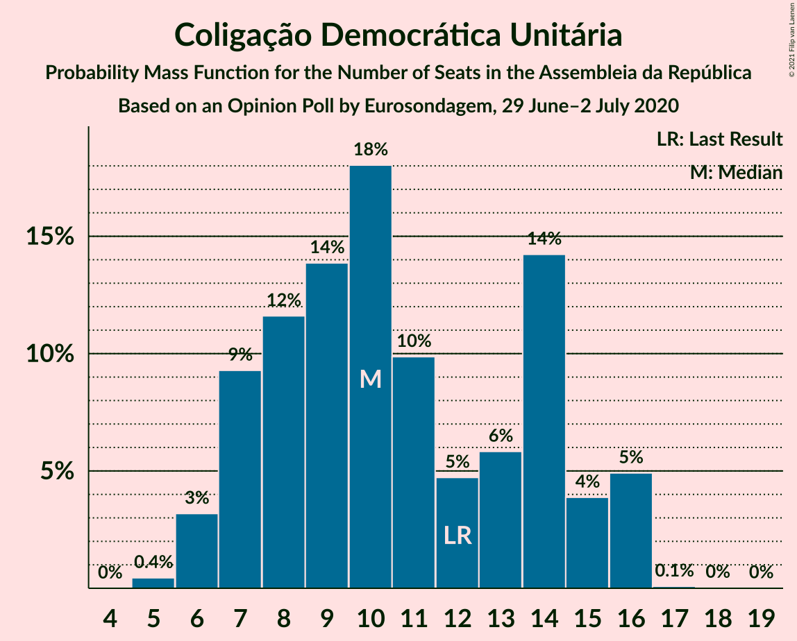

| Number of Seats | Probability | Accumulated | Special Marks |
|:---------------:|:-----------:|:-----------:|:-------------:|
| 5 | 0.4% | 100% |  |
| 6 | 3% | 99.6% |  |
| 7 | 9% | 96% |  |
| 8 | 12% | 87% |  |
| 9 | 14% | 75% |  |
| 10 | 18% | 62% | Median |
| 11 | 10% | 44% |  |
| 12 | 5% | 34% | Last Result |
| 13 | 6% | 29% |  |
| 14 | 14% | 23% |  |
| 15 | 4% | 9% |  |
| 16 | 5% | 5% |  |
| 17 | 0.1% | 0.1% |  |
| 18 | 0% | 0.1% |  |
| 19 | 0% | 0% |  |

### Chega

*For a full overview of the results for this party, see the [Chega](party-chega.html) page.*

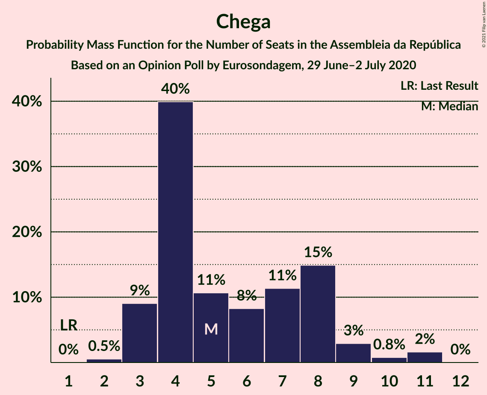

| Number of Seats | Probability | Accumulated | Special Marks |
|:---------------:|:-----------:|:-----------:|:-------------:|
| 1 | 0% | 100% | Last Result |
| 2 | 0.5% | 100% |  |
| 3 | 9% | 99.5% |  |
| 4 | 40% | 90% |  |
| 5 | 11% | 50% | Median |
| 6 | 8% | 40% |  |
| 7 | 11% | 32% |  |
| 8 | 15% | 20% |  |
| 9 | 3% | 5% |  |
| 10 | 0.8% | 2% |  |
| 11 | 2% | 2% |  |
| 12 | 0% | 0% |  |

### Pessoas–Animais–Natureza

*For a full overview of the results for this party, see the [Pessoas–Animais–Natureza](party-pessoas–animais–natureza.html) page.*

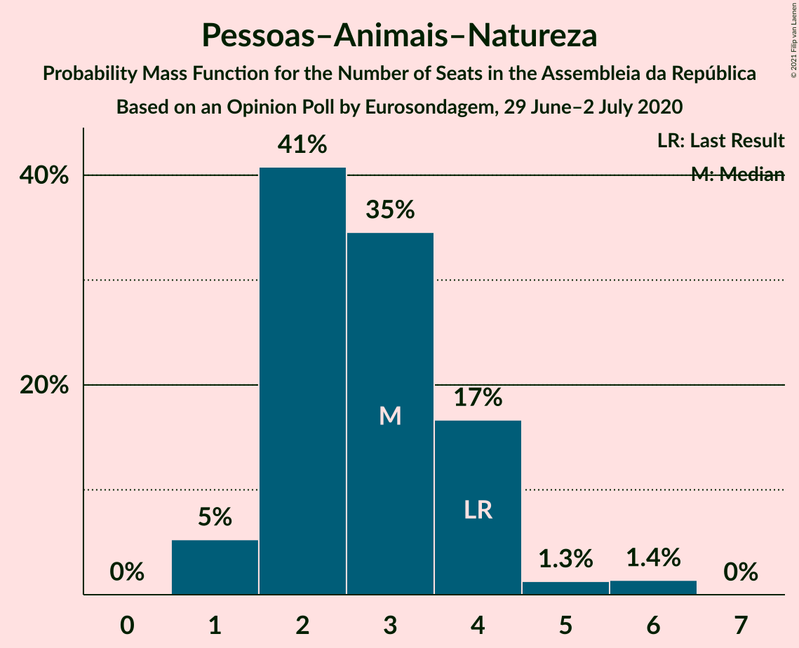

| Number of Seats | Probability | Accumulated | Special Marks |
|:---------------:|:-----------:|:-----------:|:-------------:|
| 1 | 5% | 100% |  |
| 2 | 41% | 95% |  |
| 3 | 35% | 54% | Median |
| 4 | 17% | 19% | Last Result |
| 5 | 1.3% | 3% |  |
| 6 | 1.4% | 1.4% |  |
| 7 | 0% | 0% |  |

### CDS–Partido Popular

*For a full overview of the results for this party, see the [CDS–Partido Popular](party-cds–partidopopular.html) page.*

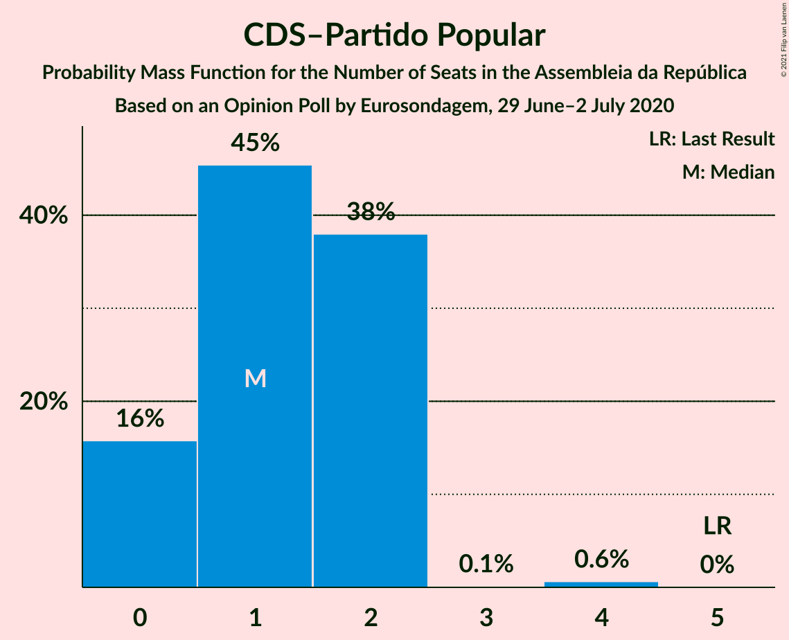

| Number of Seats | Probability | Accumulated | Special Marks |
|:---------------:|:-----------:|:-----------:|:-------------:|
| 0 | 16% | 100% |  |
| 1 | 45% | 84% | Median |
| 2 | 38% | 39% |  |
| 3 | 0.1% | 0.8% |  |
| 4 | 0.6% | 0.7% |  |
| 5 | 0% | 0% | Last Result |

### Iniciativa Liberal

*For a full overview of the results for this party, see the [Iniciativa Liberal](party-iniciativaliberal.html) page.*

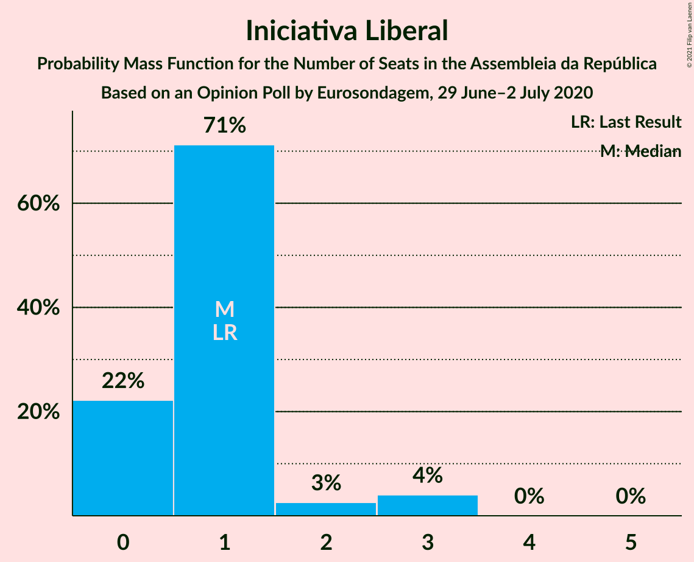

| Number of Seats | Probability | Accumulated | Special Marks |
|:---------------:|:-----------:|:-----------:|:-------------:|
| 0 | 22% | 100% |  |
| 1 | 71% | 78% | Last Result, Median |
| 2 | 3% | 7% |  |
| 3 | 4% | 4% |  |
| 4 | 0% | 0% |  |

## Coalitions

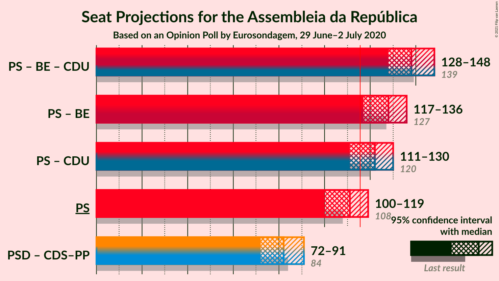

### Confidence Intervals

| Coalition | Last Result | Median | Majority? | 80% Confidence Interval | 90% Confidence Interval | 95% Confidence Interval | 99% Confidence Interval |
|:---------:|:-----------:|:------:|:---------:|:-----------------------:|:-----------------------:|:-----------------------:|:-----------------------:|
| Partido Socialista – Bloco de Esquerda – Coligação Democrática Unitária | 139 | 138 | 100% | 132–144 | 130–148 | 128–148 | 123–150 |
| Partido Socialista – Bloco de Esquerda | 127 | 128 | 98.7% | 122–134 | 119–134 | 117–136 | 113–138 |
| Partido Socialista – Coligação Democrática Unitária | 120 | 122 | 89% | 115–128 | 112–130 | 111–130 | 107–134 |
| Partido Socialista | 108 | 111 | 21% | 105–117 | 102–118 | 100–119 | 96–121 |
| Partido Social Democrata – CDS–Partido Popular | 84 | 82 | 0% | 75–88 | 72–89 | 72–91 | 70–96 |

### Partido Socialista – Bloco de Esquerda – Coligação Democrática Unitária

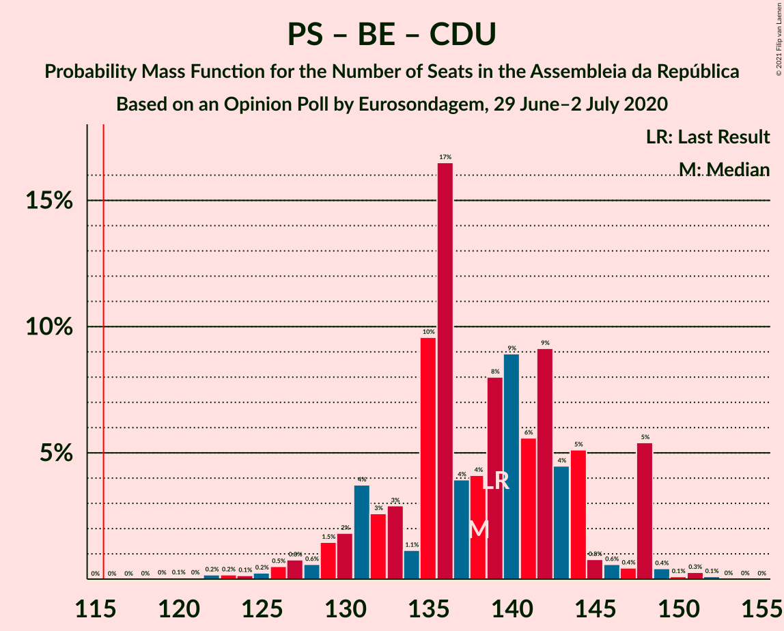

| Number of Seats | Probability | Accumulated | Special Marks |
|:---------------:|:-----------:|:-----------:|:-------------:|
| 119 | 0% | 100% |  |
| 120 | 0.1% | 99.9% |  |
| 121 | 0% | 99.9% |  |
| 122 | 0.2% | 99.8% |  |
| 123 | 0.2% | 99.7% |  |
| 124 | 0.1% | 99.5% |  |
| 125 | 0.2% | 99.4% |  |
| 126 | 0.5% | 99.1% |  |
| 127 | 0.8% | 98.6% |  |
| 128 | 0.6% | 98% |  |
| 129 | 1.5% | 97% |  |
| 130 | 2% | 96% |  |
| 131 | 4% | 94% |  |
| 132 | 3% | 90% |  |
| 133 | 3% | 88% |  |
| 134 | 1.1% | 85% |  |
| 135 | 10% | 84% |  |
| 136 | 17% | 74% |  |
| 137 | 4% | 58% |  |
| 138 | 4% | 54% | Median |
| 139 | 8% | 49% | Last Result |
| 140 | 9% | 41% |  |
| 141 | 6% | 33% |  |
| 142 | 9% | 27% |  |
| 143 | 4% | 18% |  |
| 144 | 5% | 13% |  |
| 145 | 0.8% | 8% |  |
| 146 | 0.6% | 7% |  |
| 147 | 0.4% | 7% |  |
| 148 | 5% | 6% |  |
| 149 | 0.4% | 1.0% |  |
| 150 | 0.1% | 0.6% |  |
| 151 | 0.3% | 0.5% |  |
| 152 | 0.1% | 0.2% |  |
| 153 | 0% | 0.1% |  |
| 154 | 0% | 0.1% |  |
| 155 | 0% | 0% |  |

### Partido Socialista – Bloco de Esquerda

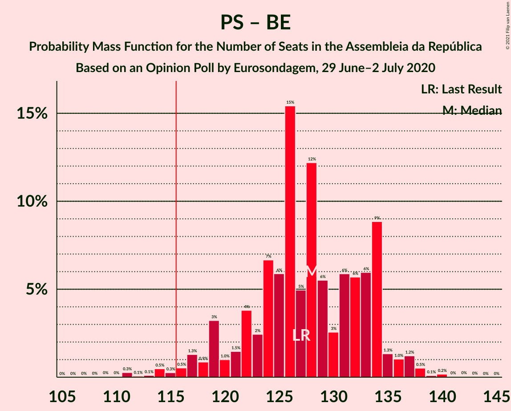

| Number of Seats | Probability | Accumulated | Special Marks |
|:---------------:|:-----------:|:-----------:|:-------------:|
| 109 | 0% | 100% |  |
| 110 | 0% | 99.9% |  |
| 111 | 0.3% | 99.9% |  |
| 112 | 0.1% | 99.6% |  |
| 113 | 0.1% | 99.5% |  |
| 114 | 0.5% | 99.4% |  |
| 115 | 0.3% | 99.0% |  |
| 116 | 0.5% | 98.7% | Majority |
| 117 | 1.3% | 98% |  |
| 118 | 0.9% | 97% |  |
| 119 | 3% | 96% |  |
| 120 | 1.0% | 93% |  |
| 121 | 1.5% | 92% |  |
| 122 | 4% | 90% |  |
| 123 | 2% | 87% |  |
| 124 | 7% | 84% |  |
| 125 | 6% | 77% |  |
| 126 | 15% | 72% |  |
| 127 | 5% | 56% | Last Result |
| 128 | 12% | 51% | Median |
| 129 | 6% | 39% |  |
| 130 | 3% | 33% |  |
| 131 | 6% | 31% |  |
| 132 | 6% | 25% |  |
| 133 | 6% | 19% |  |
| 134 | 9% | 13% |  |
| 135 | 1.3% | 4% |  |
| 136 | 1.0% | 3% |  |
| 137 | 1.2% | 2% |  |
| 138 | 0.5% | 0.9% |  |
| 139 | 0.1% | 0.4% |  |
| 140 | 0.2% | 0.3% |  |
| 141 | 0% | 0.1% |  |
| 142 | 0% | 0.1% |  |
| 143 | 0% | 0% |  |

### Partido Socialista – Coligação Democrática Unitária

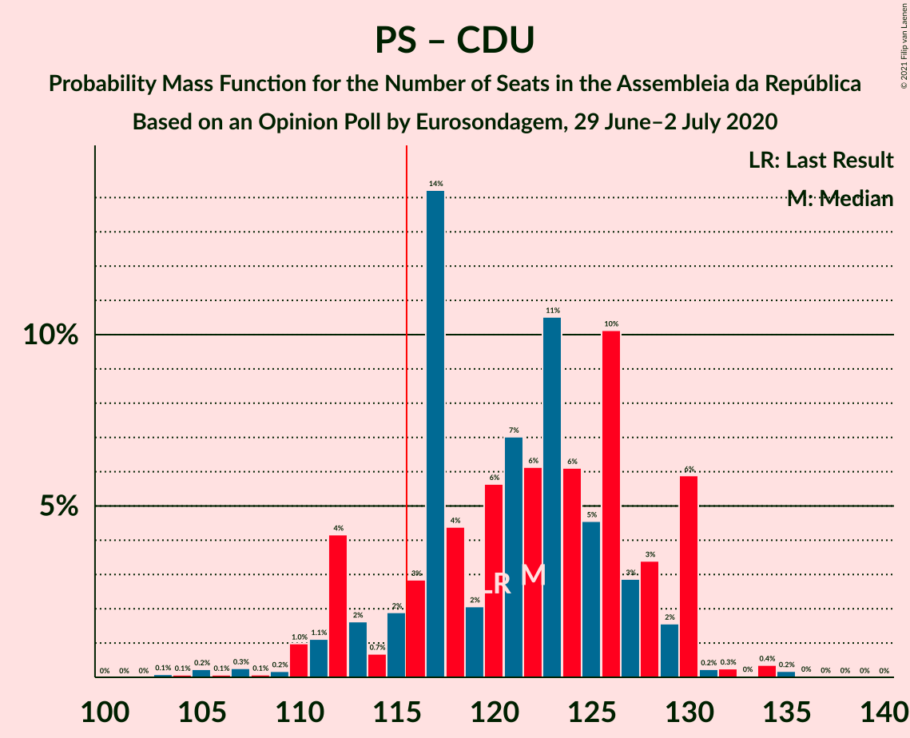

| Number of Seats | Probability | Accumulated | Special Marks |
|:---------------:|:-----------:|:-----------:|:-------------:|
| 103 | 0.1% | 100% |  |
| 104 | 0.1% | 99.9% |  |
| 105 | 0.2% | 99.8% |  |
| 106 | 0.1% | 99.6% |  |
| 107 | 0.3% | 99.5% |  |
| 108 | 0.1% | 99.3% |  |
| 109 | 0.2% | 99.2% |  |
| 110 | 1.0% | 99.0% |  |
| 111 | 1.1% | 98% |  |
| 112 | 4% | 97% |  |
| 113 | 2% | 93% |  |
| 114 | 0.7% | 91% |  |
| 115 | 2% | 90% |  |
| 116 | 3% | 89% | Majority |
| 117 | 14% | 86% |  |
| 118 | 4% | 71% |  |
| 119 | 2% | 67% |  |
| 120 | 6% | 65% | Last Result |
| 121 | 7% | 59% | Median |
| 122 | 6% | 52% |  |
| 123 | 11% | 46% |  |
| 124 | 6% | 36% |  |
| 125 | 5% | 30% |  |
| 126 | 10% | 25% |  |
| 127 | 3% | 15% |  |
| 128 | 3% | 12% |  |
| 129 | 2% | 9% |  |
| 130 | 6% | 7% |  |
| 131 | 0.2% | 1.2% |  |
| 132 | 0.3% | 0.9% |  |
| 133 | 0% | 0.7% |  |
| 134 | 0.4% | 0.6% |  |
| 135 | 0.2% | 0.3% |  |
| 136 | 0% | 0.1% |  |
| 137 | 0% | 0.1% |  |
| 138 | 0% | 0.1% |  |
| 139 | 0% | 0% |  |

### Partido Socialista

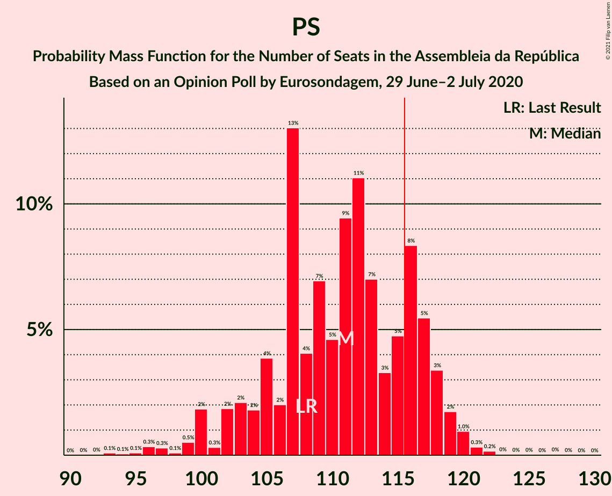

| Number of Seats | Probability | Accumulated | Special Marks |
|:---------------:|:-----------:|:-----------:|:-------------:|
| 93 | 0.1% | 100% |  |
| 94 | 0.1% | 99.9% |  |
| 95 | 0.1% | 99.8% |  |
| 96 | 0.3% | 99.7% |  |
| 97 | 0.3% | 99.4% |  |
| 98 | 0.1% | 99.1% |  |
| 99 | 0.5% | 99.0% |  |
| 100 | 2% | 98% |  |
| 101 | 0.3% | 97% |  |
| 102 | 2% | 96% |  |
| 103 | 2% | 94% |  |
| 104 | 2% | 92% |  |
| 105 | 4% | 91% |  |
| 106 | 2% | 87% |  |
| 107 | 13% | 85% |  |
| 108 | 4% | 72% | Last Result |
| 109 | 7% | 68% |  |
| 110 | 5% | 61% |  |
| 111 | 9% | 56% | Median |
| 112 | 11% | 47% |  |
| 113 | 7% | 36% |  |
| 114 | 3% | 29% |  |
| 115 | 5% | 25% |  |
| 116 | 8% | 21% | Majority |
| 117 | 5% | 12% |  |
| 118 | 3% | 7% |  |
| 119 | 2% | 3% |  |
| 120 | 1.0% | 2% |  |
| 121 | 0.3% | 0.6% |  |
| 122 | 0.2% | 0.3% |  |
| 123 | 0% | 0.1% |  |
| 124 | 0% | 0.1% |  |
| 125 | 0% | 0.1% |  |
| 126 | 0% | 0.1% |  |
| 127 | 0% | 0.1% |  |
| 128 | 0% | 0% |  |

### Partido Social Democrata – CDS–Partido Popular

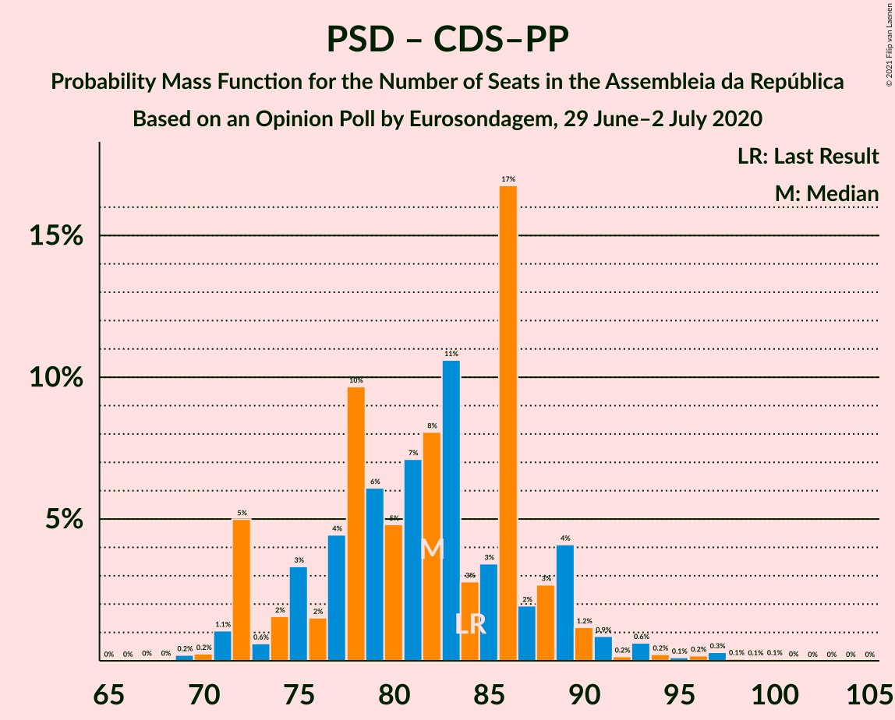

| Number of Seats | Probability | Accumulated | Special Marks |
|:---------------:|:-----------:|:-----------:|:-------------:|
| 67 | 0% | 100% |  |
| 68 | 0% | 99.9% |  |
| 69 | 0.2% | 99.9% |  |
| 70 | 0.2% | 99.7% |  |
| 71 | 1.1% | 99.4% |  |
| 72 | 5% | 98% |  |
| 73 | 0.6% | 93% |  |
| 74 | 2% | 93% |  |
| 75 | 3% | 91% |  |
| 76 | 2% | 88% |  |
| 77 | 4% | 86% |  |
| 78 | 10% | 82% |  |
| 79 | 6% | 72% |  |
| 80 | 5% | 66% |  |
| 81 | 7% | 61% |  |
| 82 | 8% | 54% | Median |
| 83 | 11% | 46% |  |
| 84 | 3% | 36% | Last Result |
| 85 | 3% | 33% |  |
| 86 | 17% | 29% |  |
| 87 | 2% | 13% |  |
| 88 | 3% | 11% |  |
| 89 | 4% | 8% |  |
| 90 | 1.2% | 4% |  |
| 91 | 0.9% | 3% |  |
| 92 | 0.2% | 2% |  |
| 93 | 0.6% | 2% |  |
| 94 | 0.2% | 1.0% |  |
| 95 | 0.1% | 0.8% |  |
| 96 | 0.2% | 0.7% |  |
| 97 | 0.3% | 0.5% |  |
| 98 | 0.1% | 0.2% |  |
| 99 | 0.1% | 0.1% |  |
| 100 | 0.1% | 0.1% |  |
| 101 | 0% | 0% |  |

## Technical Information

### Opinion Poll

+ **Polling firm:** Eurosondagem
+ **Commissioner(s):** —
+ **Fieldwork period:** 29 June–2 July 2020

### Calculations

+ **Sample size:** 1025
+ **Simulations done:** 131,072
+ **Error estimate:** 2.35%

