# Opinion Poll by Aximage for Jornal Económico, 5–8 July 2020

<a href="#voting-intentions">Voting Intentions</a> | <a href="#seats">Seats</a> | <a href="#coalitions">Coalitions</a> | <a href="#technical-information">Technical Information</a>

## Voting Intentions

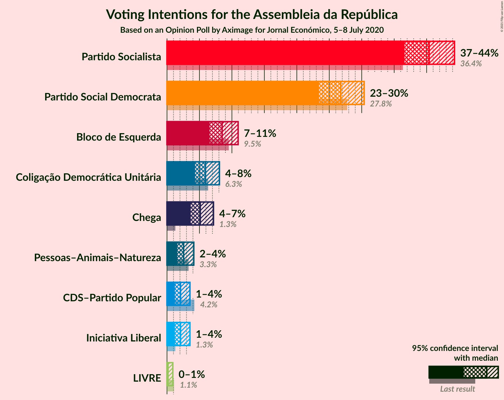

### Confidence Intervals

| Party | Last Result | Poll Result | 80% Confidence Interval | 90% Confidence Interval | 95% Confidence Interval | 99% Confidence Interval |
|:-----:|:-----------:|:-----------:|:-----------------------:|:-----------------------:|:-----------------------:|:-----------------------:|
| Partido Socialista | 36.4% | 40.4% | 37.9–42.9% |37.2–43.7% |36.6–44.3% |35.4–45.5% |
| Partido Social Democrata | 27.8% | 26.8% | 24.6–29.1% |24.0–29.8% |23.4–30.4% |22.4–31.5% |
| Bloco de Esquerda | 9.5% | 8.5% | 7.2–10.1% |6.9–10.5% |6.6–11.0% |6.0–11.8% |
| Coligação Democrática Unitária | 6.3% | 5.9% | 4.9–7.3% |4.6–7.7% |4.3–8.1% |3.9–8.8% |
| Chega | 1.3% | 5.1% | 4.2–6.4% |3.9–6.8% |3.7–7.2% |3.2–7.8% |
| Pessoas–Animais–Natureza | 3.3% | 2.6% | 1.9–3.6% |1.7–3.9% |1.6–4.1% |1.3–4.7% |
| CDS–Partido Popular | 4.2% | 2.1% | 1.5–3.0% |1.4–3.3% |1.2–3.5% |1.0–4.0% |
| Iniciativa Liberal | 1.3% | 2.1% | 1.5–3.0% |1.4–3.3% |1.2–3.5% |1.0–4.0% |
| LIVRE | 1.1% | 0.2% | 0.1–0.6% |0.0–0.8% |0.0–0.9% |0.0–1.2% |

*Note:* The poll result column reflects the actual value used in the calculations. Published results may vary slightly, and in addition be rounded to fewer digits.

## Seats

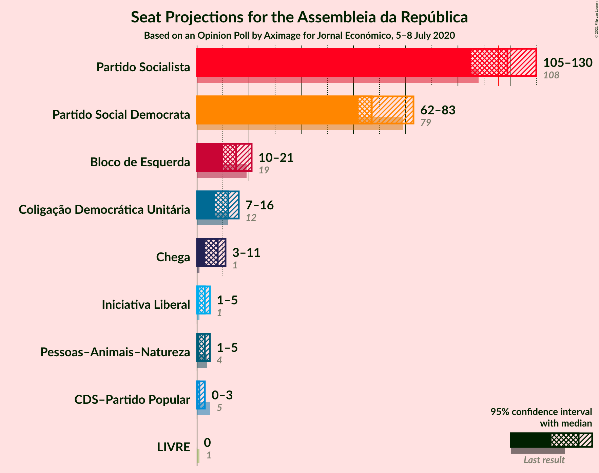

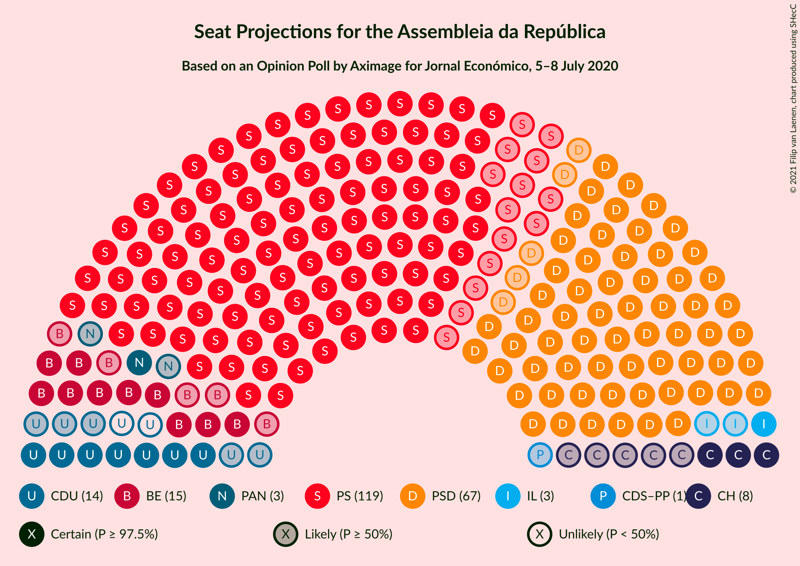

### Confidence Intervals

| Party | Last Result | Median | 80% Confidence Interval | 90% Confidence Interval | 95% Confidence Interval | 99% Confidence Interval |
|:-----:|:-----------:|:------:|:-----------------------:|:-----------------------:|:-----------------------:|:-----------------------:|
| <a href="#partido-socialista">Partido Socialista</a> | 108 | 119 | 112–127 |109–129 |105–130 |102–136 |
| <a href="#partido-social-democrata">Partido Social Democrata</a> | 79 | 67 | 64–73 |63–80 |62–83 |58–87 |
| <a href="#bloco-de-esquerda">Bloco de Esquerda</a> | 19 | 15 | 13–19 |11–20 |10–21 |9–24 |
| <a href="#coligação-democrática-unitária">Coligação Democrática Unitária</a> | 12 | 12 | 7–16 |7–16 |7–16 |5–17 |
| <a href="#chega">Chega</a> | 1 | 8 | 5–11 |4–11 |3–11 |3–13 |
| <a href="#pessoas–animais–natureza">Pessoas–Animais–Natureza</a> | 4 | 3 | 2–4 |1–4 |1–5 |0–6 |
| <a href="#cds–partido-popular">CDS–Partido Popular</a> | 5 | 1 | 0–2 |0–2 |0–3 |0–5 |
| <a href="#iniciativa-liberal">Iniciativa Liberal</a> | 1 | 3 | 1–4 |1–5 |1–5 |1–6 |
| <a href="#livre">LIVRE</a> | 1 | 0 | 0 |0 |0 |0–1 |

### Partido Socialista

*For a full overview of the results for this party, see the [Partido Socialista](party-partidosocialista.html) page.*

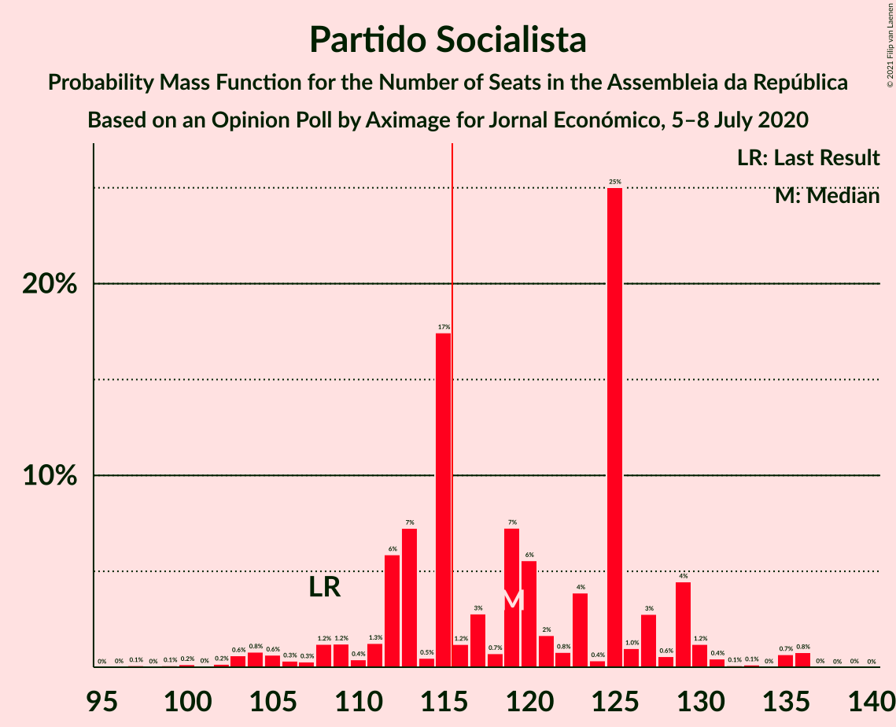

| Number of Seats | Probability | Accumulated | Special Marks |
|:---------------:|:-----------:|:-----------:|:-------------:|
| 95 | 0% | 100% |  |
| 96 | 0% | 99.9% |  |
| 97 | 0.1% | 99.9% |  |
| 98 | 0% | 99.8% |  |
| 99 | 0.1% | 99.8% |  |
| 100 | 0.2% | 99.7% |  |
| 101 | 0% | 99.6% |  |
| 102 | 0.2% | 99.5% |  |
| 103 | 0.6% | 99.3% |  |
| 104 | 0.8% | 98.7% |  |
| 105 | 0.6% | 98% |  |
| 106 | 0.3% | 97% |  |
| 107 | 0.3% | 97% |  |
| 108 | 1.2% | 97% | Last Result |
| 109 | 1.2% | 95% |  |
| 110 | 0.4% | 94% |  |
| 111 | 1.3% | 94% |  |
| 112 | 6% | 93% |  |
| 113 | 7% | 87% |  |
| 114 | 0.5% | 79% |  |
| 115 | 17% | 79% |  |
| 116 | 1.2% | 61% | Majority |
| 117 | 3% | 60% |  |
| 118 | 0.7% | 57% |  |
| 119 | 7% | 57% | Median |
| 120 | 6% | 50% |  |
| 121 | 2% | 44% |  |
| 122 | 0.8% | 42% |  |
| 123 | 4% | 41% |  |
| 124 | 0.4% | 38% |  |
| 125 | 25% | 37% |  |
| 126 | 1.0% | 12% |  |
| 127 | 3% | 11% |  |
| 128 | 0.6% | 8% |  |
| 129 | 4% | 8% |  |
| 130 | 1.2% | 3% |  |
| 131 | 0.4% | 2% |  |
| 132 | 0.1% | 2% |  |
| 133 | 0.1% | 2% |  |
| 134 | 0% | 2% |  |
| 135 | 0.7% | 2% |  |
| 136 | 0.8% | 0.8% |  |
| 137 | 0% | 0.1% |  |
| 138 | 0% | 0% |  |

### Partido Social Democrata

*For a full overview of the results for this party, see the [Partido Social Democrata](party-partidosocialdemocrata.html) page.*

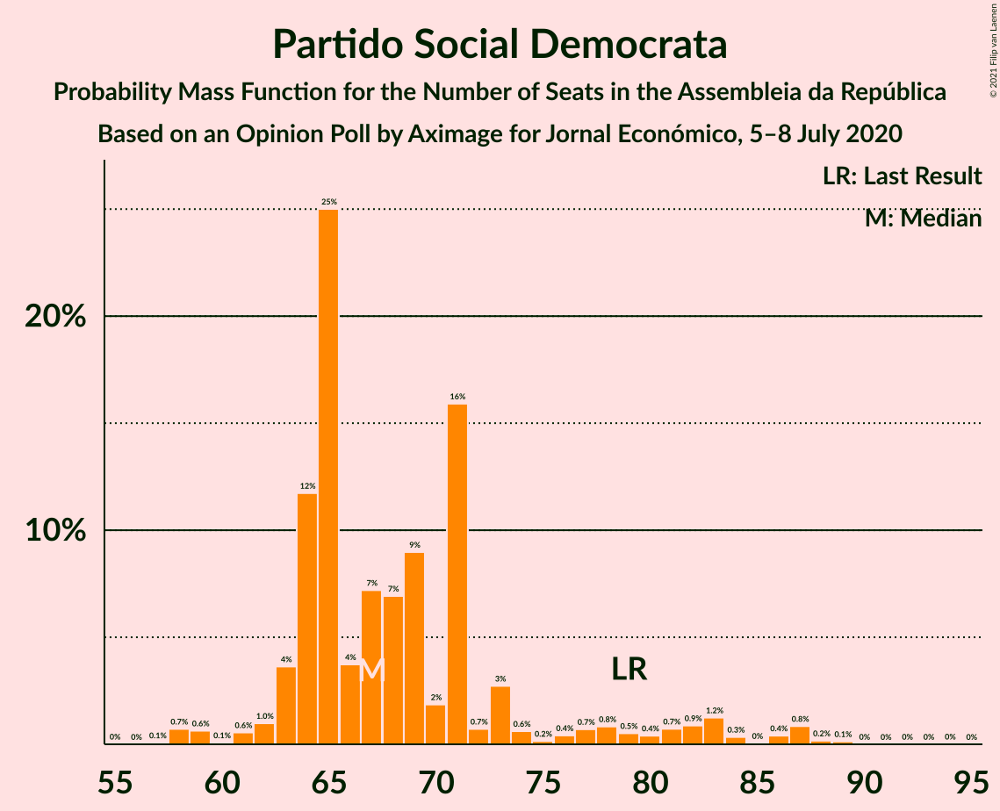

| Number of Seats | Probability | Accumulated | Special Marks |
|:---------------:|:-----------:|:-----------:|:-------------:|
| 57 | 0.1% | 100% |  |
| 58 | 0.7% | 99.9% |  |
| 59 | 0.6% | 99.2% |  |
| 60 | 0.1% | 98.5% |  |
| 61 | 0.6% | 98% |  |
| 62 | 1.0% | 98% |  |
| 63 | 4% | 97% |  |
| 64 | 12% | 93% |  |
| 65 | 25% | 82% |  |
| 66 | 4% | 57% |  |
| 67 | 7% | 53% | Median |
| 68 | 7% | 46% |  |
| 69 | 9% | 39% |  |
| 70 | 2% | 30% |  |
| 71 | 16% | 28% |  |
| 72 | 0.7% | 12% |  |
| 73 | 3% | 11% |  |
| 74 | 0.6% | 8% |  |
| 75 | 0.2% | 8% |  |
| 76 | 0.4% | 8% |  |
| 77 | 0.7% | 7% |  |
| 78 | 0.8% | 7% |  |
| 79 | 0.5% | 6% | Last Result |
| 80 | 0.4% | 5% |  |
| 81 | 0.7% | 5% |  |
| 82 | 0.9% | 4% |  |
| 83 | 1.2% | 3% |  |
| 84 | 0.3% | 2% |  |
| 85 | 0% | 2% |  |
| 86 | 0.4% | 2% |  |
| 87 | 0.8% | 1.2% |  |
| 88 | 0.2% | 0.4% |  |
| 89 | 0.1% | 0.2% |  |
| 90 | 0% | 0.1% |  |
| 91 | 0% | 0.1% |  |
| 92 | 0% | 0% |  |

### Bloco de Esquerda

*For a full overview of the results for this party, see the [Bloco de Esquerda](party-blocodeesquerda.html) page.*

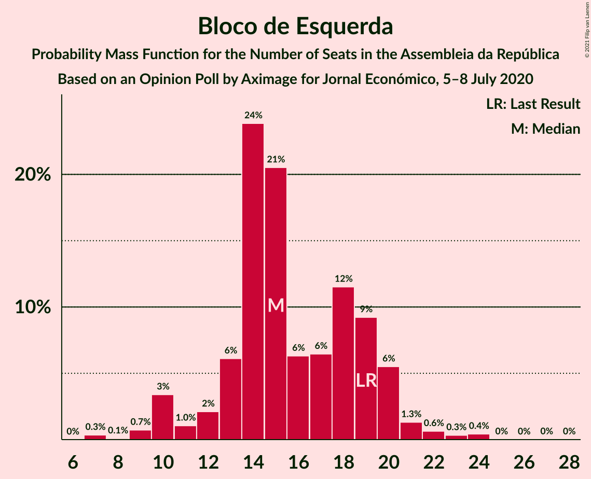

| Number of Seats | Probability | Accumulated | Special Marks |
|:---------------:|:-----------:|:-----------:|:-------------:|
| 7 | 0.3% | 100% |  |
| 8 | 0.1% | 99.7% |  |
| 9 | 0.7% | 99.6% |  |
| 10 | 3% | 98.8% |  |
| 11 | 1.0% | 95% |  |
| 12 | 2% | 94% |  |
| 13 | 6% | 92% |  |
| 14 | 24% | 86% |  |
| 15 | 21% | 62% | Median |
| 16 | 6% | 42% |  |
| 17 | 6% | 35% |  |
| 18 | 12% | 29% |  |
| 19 | 9% | 18% | Last Result |
| 20 | 6% | 8% |  |
| 21 | 1.3% | 3% |  |
| 22 | 0.6% | 1.5% |  |
| 23 | 0.3% | 0.8% |  |
| 24 | 0.4% | 0.5% |  |
| 25 | 0% | 0.1% |  |
| 26 | 0% | 0.1% |  |
| 27 | 0% | 0.1% |  |
| 28 | 0% | 0% |  |

### Coligação Democrática Unitária

*For a full overview of the results for this party, see the [Coligação Democrática Unitária](party-coligaçãodemocráticaunitária.html) page.*

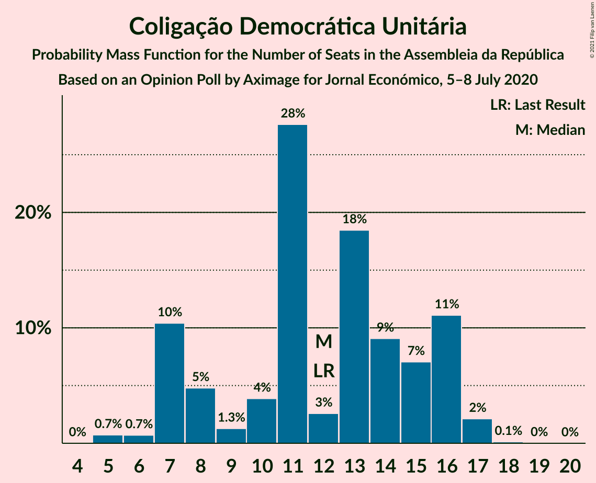

| Number of Seats | Probability | Accumulated | Special Marks |
|:---------------:|:-----------:|:-----------:|:-------------:|
| 5 | 0.7% | 100% |  |
| 6 | 0.7% | 99.2% |  |
| 7 | 10% | 98.5% |  |
| 8 | 5% | 88% |  |
| 9 | 1.3% | 83% |  |
| 10 | 4% | 82% |  |
| 11 | 28% | 78% |  |
| 12 | 3% | 51% | Last Result, Median |
| 13 | 18% | 48% |  |
| 14 | 9% | 30% |  |
| 15 | 7% | 20% |  |
| 16 | 11% | 13% |  |
| 17 | 2% | 2% |  |
| 18 | 0.1% | 0.2% |  |
| 19 | 0% | 0.1% |  |
| 20 | 0% | 0% |  |

### Chega

*For a full overview of the results for this party, see the [Chega](party-chega.html) page.*

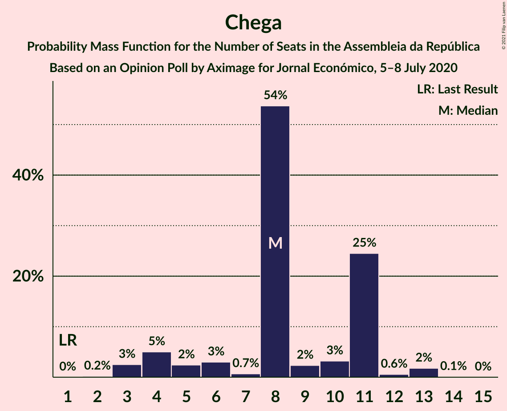

| Number of Seats | Probability | Accumulated | Special Marks |
|:---------------:|:-----------:|:-----------:|:-------------:|
| 1 | 0% | 100% | Last Result |
| 2 | 0.2% | 100% |  |
| 3 | 3% | 99.8% |  |
| 4 | 5% | 97% |  |
| 5 | 2% | 92% |  |
| 6 | 3% | 90% |  |
| 7 | 0.7% | 87% |  |
| 8 | 54% | 86% | Median |
| 9 | 2% | 33% |  |
| 10 | 3% | 30% |  |
| 11 | 25% | 27% |  |
| 12 | 0.6% | 2% |  |
| 13 | 2% | 2% |  |
| 14 | 0.1% | 0.1% |  |
| 15 | 0% | 0% |  |

### Pessoas–Animais–Natureza

*For a full overview of the results for this party, see the [Pessoas–Animais–Natureza](party-pessoas–animais–natureza.html) page.*

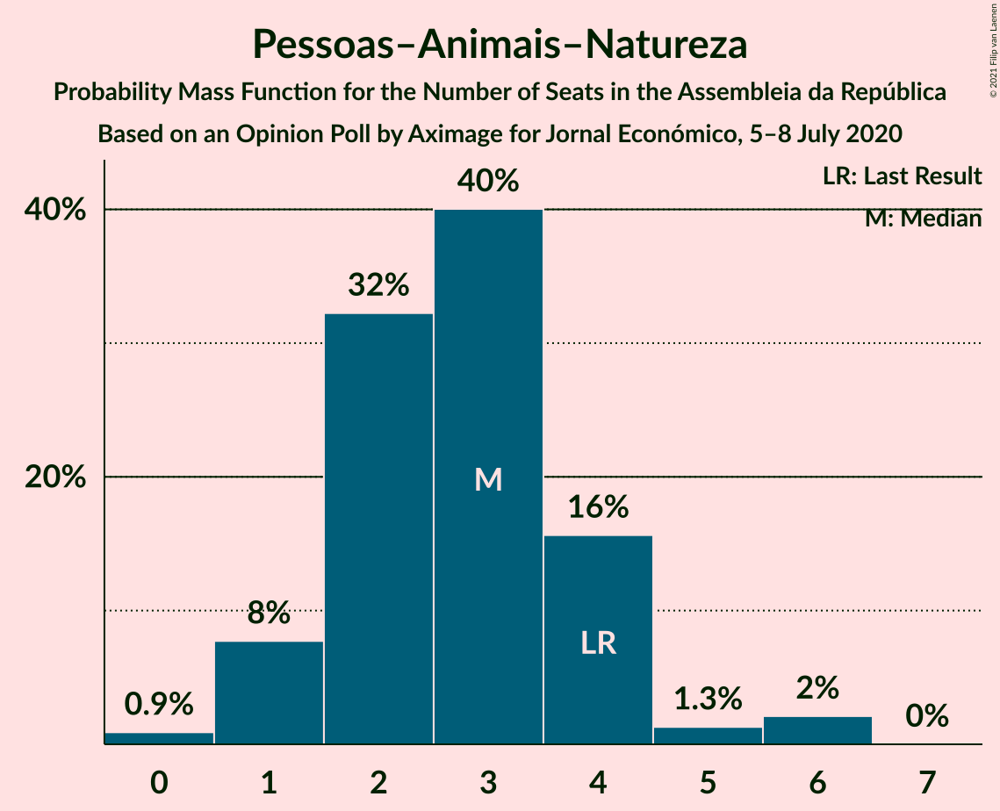

| Number of Seats | Probability | Accumulated | Special Marks |
|:---------------:|:-----------:|:-----------:|:-------------:|
| 0 | 0.9% | 100% |  |
| 1 | 8% | 99.1% |  |
| 2 | 32% | 91% |  |
| 3 | 40% | 59% | Median |
| 4 | 16% | 19% | Last Result |
| 5 | 1.3% | 3% |  |
| 6 | 2% | 2% |  |
| 7 | 0% | 0% |  |

### CDS–Partido Popular

*For a full overview of the results for this party, see the [CDS–Partido Popular](party-cds–partidopopular.html) page.*

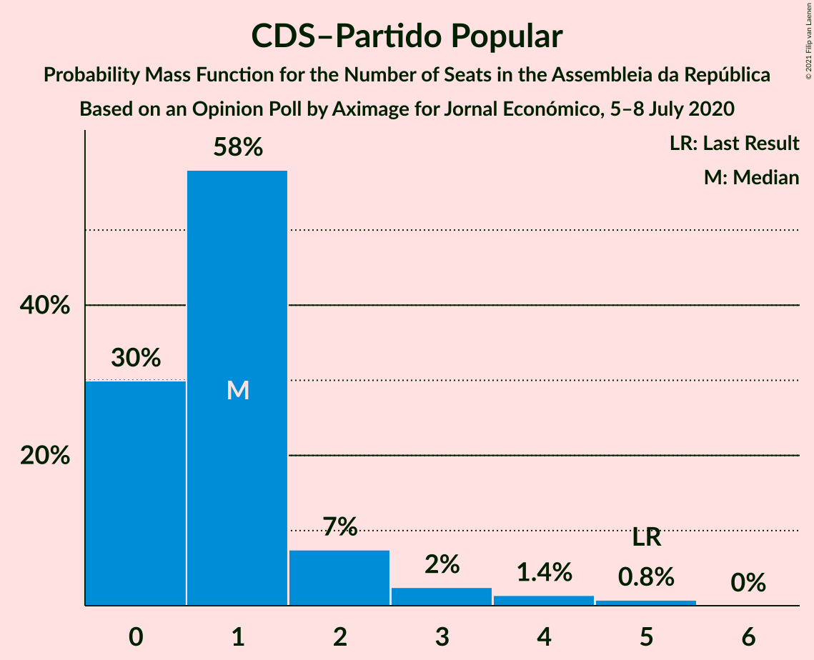

| Number of Seats | Probability | Accumulated | Special Marks |
|:---------------:|:-----------:|:-----------:|:-------------:|
| 0 | 30% | 100% |  |
| 1 | 58% | 70% | Median |
| 2 | 7% | 12% |  |
| 3 | 2% | 5% |  |
| 4 | 1.4% | 2% |  |
| 5 | 0.8% | 0.8% | Last Result |
| 6 | 0% | 0% |  |

### Iniciativa Liberal

*For a full overview of the results for this party, see the [Iniciativa Liberal](party-iniciativaliberal.html) page.*

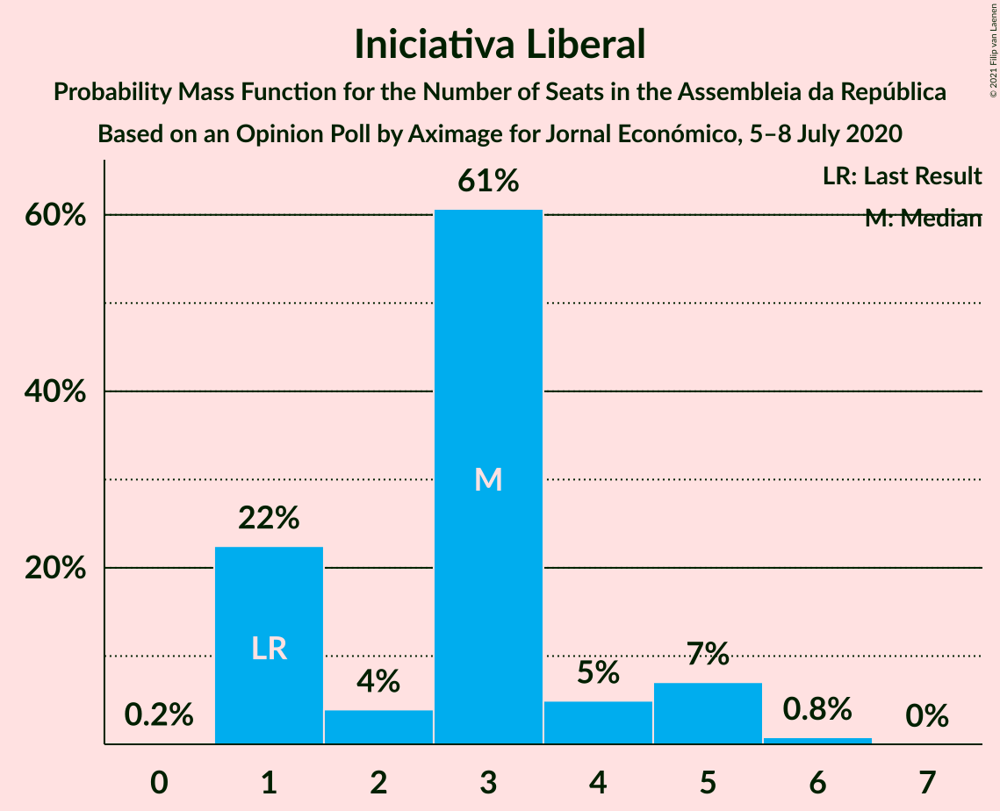

| Number of Seats | Probability | Accumulated | Special Marks |
|:---------------:|:-----------:|:-----------:|:-------------:|
| 0 | 0.2% | 100% |  |
| 1 | 22% | 99.8% | Last Result |
| 2 | 4% | 77% |  |
| 3 | 61% | 73% | Median |
| 4 | 5% | 13% |  |
| 5 | 7% | 8% |  |
| 6 | 0.8% | 0.8% |  |
| 7 | 0% | 0% |  |

### LIVRE

*For a full overview of the results for this party, see the [LIVRE](party-livre.html) page.*

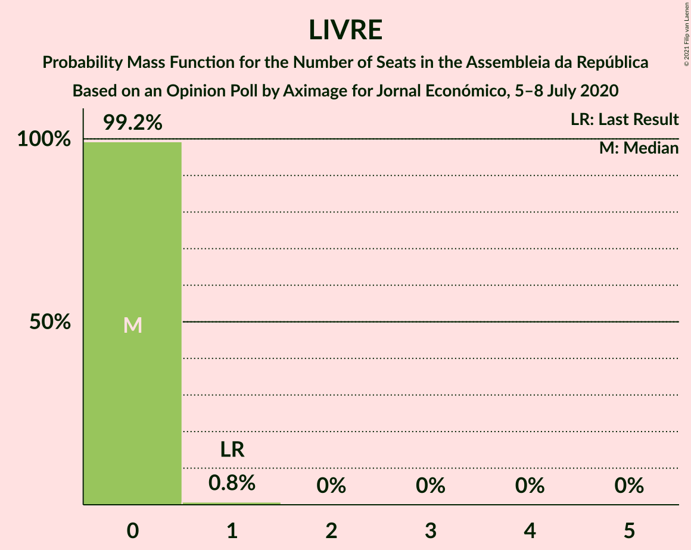

| Number of Seats | Probability | Accumulated | Special Marks |
|:---------------:|:-----------:|:-----------:|:-------------:|
| 0 | 99.2% | 100% | Median |
| 1 | 0.8% | 0.8% | Last Result |
| 2 | 0% | 0% |  |

## Coalitions

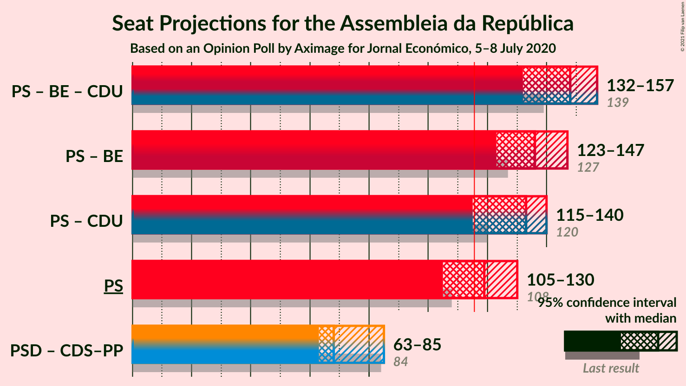

### Confidence Intervals

| Coalition | Last Result | Median | Majority? | 80% Confidence Interval | 90% Confidence Interval | 95% Confidence Interval | 99% Confidence Interval |
|:---------:|:-----------:|:------:|:---------:|:-----------------------:|:-----------------------:|:-----------------------:|:-----------------------:|
| Partido Socialista – Bloco de Esquerda – Coligação Democrática Unitária | 139 | 148 | 100% | 141–153 | 136–155 | 132–157 | 129–161 |
| Partido Socialista – Bloco de Esquerda | 127 | 136 | 99.8% | 128–142 | 126–145 | 123–147 | 118–154 |
| Partido Socialista – Coligação Democrática Unitária | 120 | 133 | 97% | 125–136 | 118–139 | 115–140 | 114–143 |
| Partido Socialista | 108 | 119 | 61% | 112–127 | 109–129 | 105–130 | 102–136 |
| Partido Social Democrata – CDS–Partido Popular | 84 | 68 | 0% | 64–74 | 64–82 | 63–85 | 59–89 |

### Partido Socialista – Bloco de Esquerda – Coligação Democrática Unitária

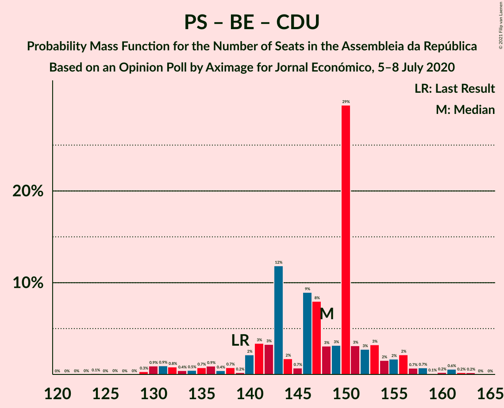

| Number of Seats | Probability | Accumulated | Special Marks |
|:---------------:|:-----------:|:-----------:|:-------------:|
| 124 | 0.1% | 100% |  |
| 125 | 0% | 99.8% |  |
| 126 | 0% | 99.8% |  |
| 127 | 0% | 99.8% |  |
| 128 | 0% | 99.8% |  |
| 129 | 0.3% | 99.8% |  |
| 130 | 0.9% | 99.5% |  |
| 131 | 0.9% | 98.5% |  |
| 132 | 0.8% | 98% |  |
| 133 | 0.4% | 97% |  |
| 134 | 0.5% | 96% |  |
| 135 | 0.7% | 96% |  |
| 136 | 0.9% | 95% |  |
| 137 | 0.4% | 94% |  |
| 138 | 0.7% | 94% |  |
| 139 | 0.2% | 93% | Last Result |
| 140 | 2% | 93% |  |
| 141 | 3% | 91% |  |
| 142 | 3% | 87% |  |
| 143 | 12% | 84% |  |
| 144 | 2% | 72% |  |
| 145 | 0.7% | 70% |  |
| 146 | 9% | 70% | Median |
| 147 | 8% | 61% |  |
| 148 | 3% | 53% |  |
| 149 | 3% | 50% |  |
| 150 | 29% | 47% |  |
| 151 | 3% | 17% |  |
| 152 | 3% | 14% |  |
| 153 | 3% | 11% |  |
| 154 | 2% | 8% |  |
| 155 | 2% | 7% |  |
| 156 | 2% | 5% |  |
| 157 | 0.7% | 3% |  |
| 158 | 0.7% | 2% |  |
| 159 | 0.1% | 1.3% |  |
| 160 | 0.2% | 1.2% |  |
| 161 | 0.6% | 1.0% |  |
| 162 | 0.2% | 0.4% |  |
| 163 | 0.2% | 0.2% |  |
| 164 | 0% | 0% |  |

### Partido Socialista – Bloco de Esquerda

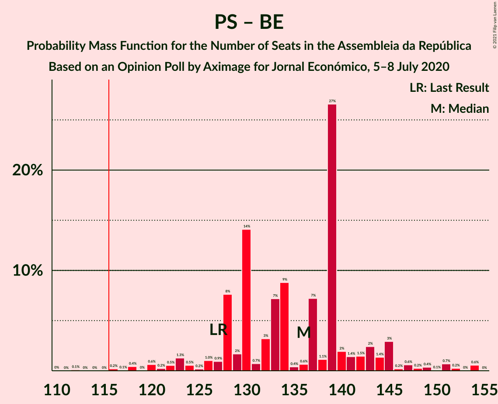

| Number of Seats | Probability | Accumulated | Special Marks |
|:---------------:|:-----------:|:-----------:|:-------------:|
| 110 | 0% | 100% |  |
| 111 | 0% | 99.9% |  |
| 112 | 0.1% | 99.9% |  |
| 113 | 0% | 99.8% |  |
| 114 | 0% | 99.8% |  |
| 115 | 0% | 99.8% |  |
| 116 | 0.2% | 99.8% | Majority |
| 117 | 0.1% | 99.6% |  |
| 118 | 0.4% | 99.6% |  |
| 119 | 0% | 99.1% |  |
| 120 | 0.6% | 99.1% |  |
| 121 | 0.2% | 98% |  |
| 122 | 0.5% | 98% |  |
| 123 | 1.3% | 98% |  |
| 124 | 0.5% | 96% |  |
| 125 | 0.2% | 96% |  |
| 126 | 1.0% | 96% |  |
| 127 | 0.9% | 95% | Last Result |
| 128 | 8% | 94% |  |
| 129 | 2% | 86% |  |
| 130 | 14% | 84% |  |
| 131 | 0.7% | 70% |  |
| 132 | 3% | 70% |  |
| 133 | 7% | 66% |  |
| 134 | 9% | 59% | Median |
| 135 | 0.4% | 50% |  |
| 136 | 0.6% | 50% |  |
| 137 | 7% | 49% |  |
| 138 | 1.1% | 42% |  |
| 139 | 27% | 41% |  |
| 140 | 2% | 14% |  |
| 141 | 1.4% | 13% |  |
| 142 | 1.5% | 11% |  |
| 143 | 2% | 10% |  |
| 144 | 1.4% | 7% |  |
| 145 | 3% | 6% |  |
| 146 | 0.2% | 3% |  |
| 147 | 0.6% | 3% |  |
| 148 | 0.2% | 2% |  |
| 149 | 0.4% | 2% |  |
| 150 | 0.1% | 2% |  |
| 151 | 0.7% | 2% |  |
| 152 | 0.2% | 0.9% |  |
| 153 | 0% | 0.6% |  |
| 154 | 0.6% | 0.6% |  |
| 155 | 0% | 0% |  |

### Partido Socialista – Coligação Democrática Unitária

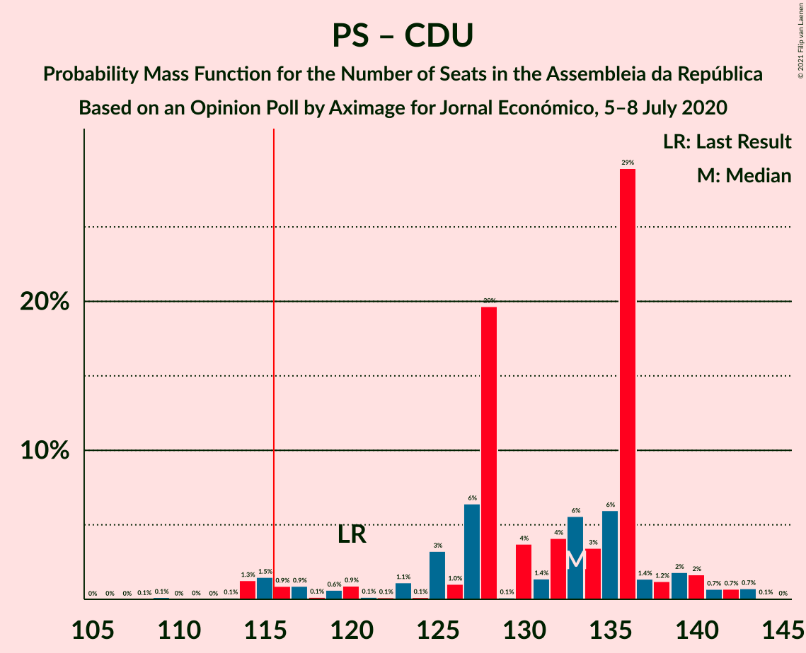

| Number of Seats | Probability | Accumulated | Special Marks |
|:---------------:|:-----------:|:-----------:|:-------------:|
| 108 | 0.1% | 100% |  |
| 109 | 0.1% | 99.9% |  |
| 110 | 0% | 99.8% |  |
| 111 | 0% | 99.8% |  |
| 112 | 0% | 99.7% |  |
| 113 | 0.1% | 99.7% |  |
| 114 | 1.3% | 99.6% |  |
| 115 | 1.5% | 98% |  |
| 116 | 0.9% | 97% | Majority |
| 117 | 0.9% | 96% |  |
| 118 | 0.1% | 95% |  |
| 119 | 0.6% | 95% |  |
| 120 | 0.9% | 94% | Last Result |
| 121 | 0.1% | 93% |  |
| 122 | 0.1% | 93% |  |
| 123 | 1.1% | 93% |  |
| 124 | 0.1% | 92% |  |
| 125 | 3% | 92% |  |
| 126 | 1.0% | 89% |  |
| 127 | 6% | 88% |  |
| 128 | 20% | 81% |  |
| 129 | 0.1% | 62% |  |
| 130 | 4% | 61% |  |
| 131 | 1.4% | 58% | Median |
| 132 | 4% | 56% |  |
| 133 | 6% | 52% |  |
| 134 | 3% | 47% |  |
| 135 | 6% | 43% |  |
| 136 | 29% | 37% |  |
| 137 | 1.4% | 8% |  |
| 138 | 1.2% | 7% |  |
| 139 | 2% | 6% |  |
| 140 | 2% | 4% |  |
| 141 | 0.7% | 2% |  |
| 142 | 0.7% | 2% |  |
| 143 | 0.7% | 0.9% |  |
| 144 | 0.1% | 0.1% |  |
| 145 | 0% | 0% |  |

### Partido Socialista

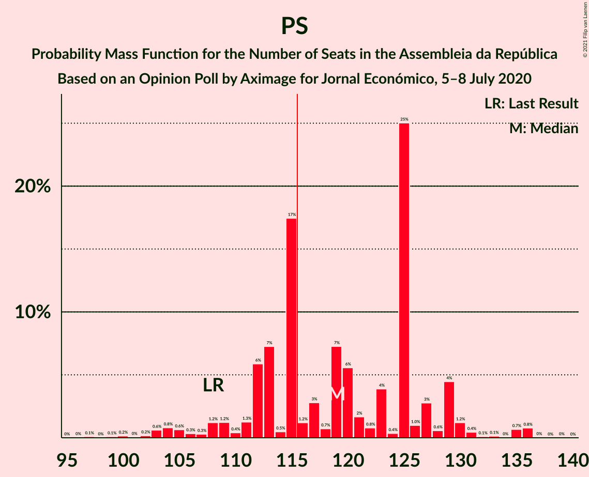

| Number of Seats | Probability | Accumulated | Special Marks |
|:---------------:|:-----------:|:-----------:|:-------------:|
| 95 | 0% | 100% |  |
| 96 | 0% | 99.9% |  |
| 97 | 0.1% | 99.9% |  |
| 98 | 0% | 99.8% |  |
| 99 | 0.1% | 99.8% |  |
| 100 | 0.2% | 99.7% |  |
| 101 | 0% | 99.6% |  |
| 102 | 0.2% | 99.5% |  |
| 103 | 0.6% | 99.3% |  |
| 104 | 0.8% | 98.7% |  |
| 105 | 0.6% | 98% |  |
| 106 | 0.3% | 97% |  |
| 107 | 0.3% | 97% |  |
| 108 | 1.2% | 97% | Last Result |
| 109 | 1.2% | 95% |  |
| 110 | 0.4% | 94% |  |
| 111 | 1.3% | 94% |  |
| 112 | 6% | 93% |  |
| 113 | 7% | 87% |  |
| 114 | 0.5% | 79% |  |
| 115 | 17% | 79% |  |
| 116 | 1.2% | 61% | Majority |
| 117 | 3% | 60% |  |
| 118 | 0.7% | 57% |  |
| 119 | 7% | 57% | Median |
| 120 | 6% | 50% |  |
| 121 | 2% | 44% |  |
| 122 | 0.8% | 42% |  |
| 123 | 4% | 41% |  |
| 124 | 0.4% | 38% |  |
| 125 | 25% | 37% |  |
| 126 | 1.0% | 12% |  |
| 127 | 3% | 11% |  |
| 128 | 0.6% | 8% |  |
| 129 | 4% | 8% |  |
| 130 | 1.2% | 3% |  |
| 131 | 0.4% | 2% |  |
| 132 | 0.1% | 2% |  |
| 133 | 0.1% | 2% |  |
| 134 | 0% | 2% |  |
| 135 | 0.7% | 2% |  |
| 136 | 0.8% | 0.8% |  |
| 137 | 0% | 0.1% |  |
| 138 | 0% | 0% |  |

### Partido Social Democrata – CDS–Partido Popular

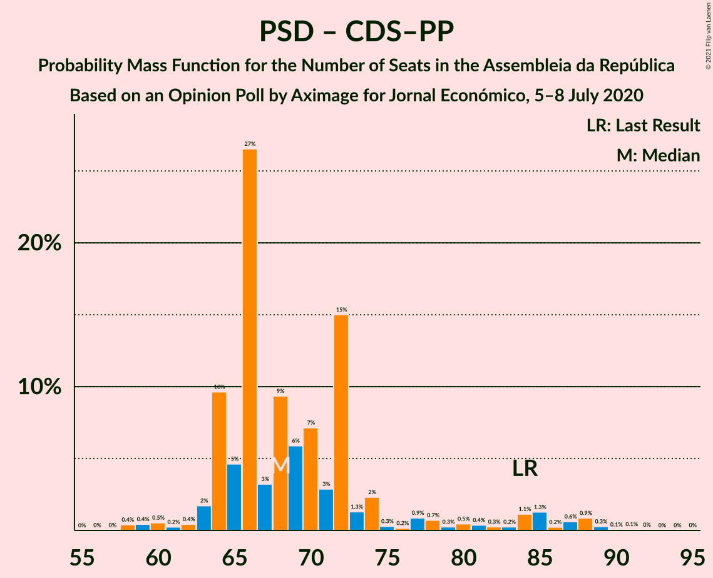

| Number of Seats | Probability | Accumulated | Special Marks |
|:---------------:|:-----------:|:-----------:|:-------------:|
| 58 | 0.4% | 100% |  |
| 59 | 0.4% | 99.6% |  |
| 60 | 0.5% | 99.1% |  |
| 61 | 0.2% | 98.6% |  |
| 62 | 0.4% | 98% |  |
| 63 | 2% | 98% |  |
| 64 | 10% | 96% |  |
| 65 | 5% | 87% |  |
| 66 | 27% | 82% |  |
| 67 | 3% | 55% |  |
| 68 | 9% | 52% | Median |
| 69 | 6% | 43% |  |
| 70 | 7% | 37% |  |
| 71 | 3% | 30% |  |
| 72 | 15% | 27% |  |
| 73 | 1.3% | 12% |  |
| 74 | 2% | 11% |  |
| 75 | 0.3% | 8% |  |
| 76 | 0.2% | 8% |  |
| 77 | 0.9% | 8% |  |
| 78 | 0.7% | 7% |  |
| 79 | 0.3% | 6% |  |
| 80 | 0.5% | 6% |  |
| 81 | 0.4% | 6% |  |
| 82 | 0.3% | 5% |  |
| 83 | 0.2% | 5% |  |
| 84 | 1.1% | 5% | Last Result |
| 85 | 1.3% | 4% |  |
| 86 | 0.2% | 2% |  |
| 87 | 0.6% | 2% |  |
| 88 | 0.9% | 1.4% |  |
| 89 | 0.3% | 0.5% |  |
| 90 | 0.1% | 0.2% |  |
| 91 | 0.1% | 0.2% |  |
| 92 | 0% | 0.1% |  |
| 93 | 0% | 0% |  |

## Technical Information

### Opinion Poll

+ **Polling firm:** Aximage
+ **Commissioner(s):** Jornal Económico
+ **Fieldwork period:** 5–8 July 2020

### Calculations

+ **Sample size:** 624
+ **Simulations done:** 131,072
+ **Error estimate:** 2.87%

