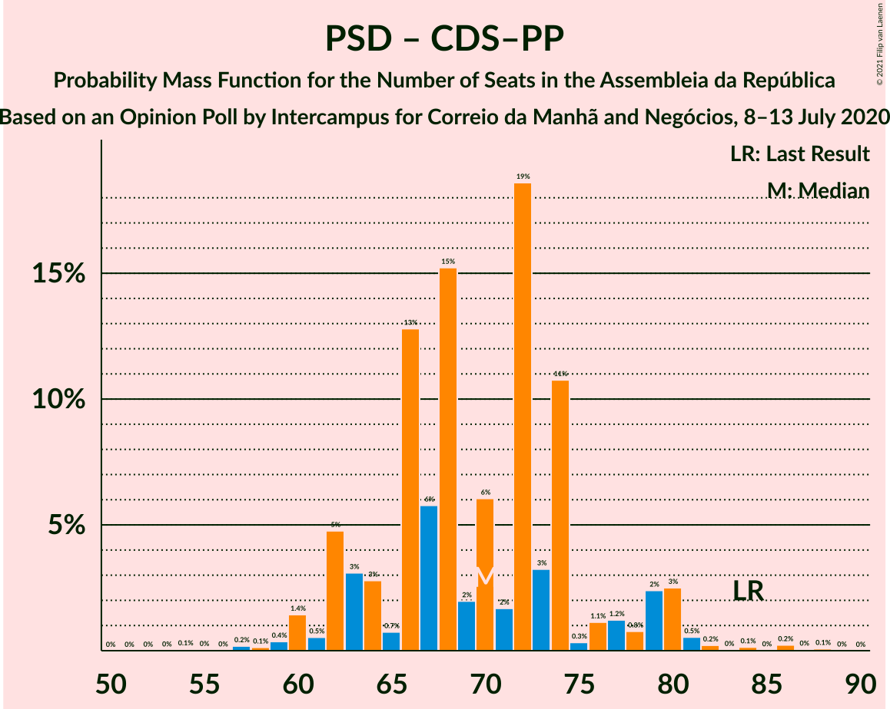

# Opinion Poll by Intercampus for Correio da Manhã and Negócios, 8–13 July 2020

<a href="#voting-intentions">Voting Intentions</a> | <a href="#seats">Seats</a> | <a href="#coalitions">Coalitions</a> | <a href="#technical-information">Technical Information</a>

## Voting Intentions

### Confidence Intervals

| Party | Last Result | Poll Result | 80% Confidence Interval | 90% Confidence Interval | 95% Confidence Interval | 99% Confidence Interval |
|:-----:|:-----------:|:-----------:|:-----------------------:|:-----------------------:|:-----------------------:|:-----------------------:|
| Partido Socialista | 36.4% | 39.0% | 36.6–41.6% |35.9–42.3% |35.3–42.9% |34.1–44.2% |
| Partido Social Democrata | 27.8% | 23.9% | 21.8–26.2% |21.2–26.8% |20.7–27.4% |19.7–28.5% |
| Bloco de Esquerda | 9.5% | 10.5% | 9.1–12.2% |8.6–12.7% |8.3–13.2% |7.7–14.0% |
| Coligação Democrática Unitária | 6.3% | 6.1% | 5.0–7.5% |4.8–8.0% |4.5–8.3% |4.0–9.0% |
| Chega | 1.3% | 6.1% | 5.0–7.5% |4.8–8.0% |4.5–8.3% |4.0–9.0% |
| CDS–Partido Popular | 4.2% | 4.8% | 3.9–6.1% |3.6–6.5% |3.4–6.8% |3.0–7.5% |
| Pessoas–Animais–Natureza | 3.3% | 3.1% | 2.3–4.2% |2.1–4.5% |2.0–4.7% |1.7–5.3% |
| Iniciativa Liberal | 1.3% | 2.7% | 2.1–3.8% |1.9–4.1% |1.7–4.4% |1.4–4.9% |
| LIVRE | 1.1% | 0.3% | 0.2–0.9% |0.1–1.0% |0.1–1.2% |0.0–1.5% |

*Note:* The poll result column reflects the actual value used in the calculations. Published results may vary slightly, and in addition be rounded to fewer digits.

## Seats

### Confidence Intervals

| Party | Last Result | Median | 80% Confidence Interval | 90% Confidence Interval | 95% Confidence Interval | 99% Confidence Interval |
|:-----:|:-----------:|:------:|:-----------------------:|:-----------------------:|:-----------------------:|:-----------------------:|
| <a href="#partido-socialista">Partido Socialista</a> | 108 | 111 | 105–122 |102–122 |100–122 |98–129 |
| <a href="#partido-social-democrata">Partido Social Democrata</a> | 79 | 64 | 58–70 |55–72 |54–74 |53–77 |
| <a href="#bloco-de-esquerda">Bloco de Esquerda</a> | 19 | 21 | 16–24 |16–26 |16–28 |15–32 |
| <a href="#coligação-democrática-unitária">Coligação Democrática Unitária</a> | 12 | 11 | 6–15 |6–16 |6–17 |6–19 |
| <a href="#chega">Chega</a> | 1 | 11 | 7–11 |6–13 |5–14 |4–15 |
| <a href="#cds–partido-popular">CDS–Partido Popular</a> | 5 | 5 | 4–8 |3–9 |2–10 |2–15 |
| <a href="#pessoas–animais–natureza">Pessoas–Animais–Natureza</a> | 4 | 3 | 2–4 |2–6 |1–6 |1–7 |
| <a href="#iniciativa-liberal">Iniciativa Liberal</a> | 1 | 3 | 3–6 |2–6 |1–6 |1–6 |
| <a href="#livre">LIVRE</a> | 1 | 0 | 0 |0–1 |0–1 |0–1 |

### Partido Socialista

*For a full overview of the results for this party, see the [Partido Socialista](party-partidosocialista.html) page.*

| Number of Seats | Probability | Accumulated | Special Marks |
|:---------------:|:-----------:|:-----------:|:-------------:|
| 93 | 0% | 100% |  |
| 94 | 0% | 99.9% |  |
| 95 | 0.1% | 99.9% |  |
| 96 | 0.1% | 99.8% |  |
| 97 | 0.1% | 99.7% |  |
| 98 | 0.7% | 99.7% |  |
| 99 | 0.1% | 99.0% |  |
| 100 | 2% | 98.9% |  |
| 101 | 0.4% | 97% |  |
| 102 | 3% | 97% |  |
| 103 | 0.4% | 93% |  |
| 104 | 0.5% | 93% |  |
| 105 | 5% | 93% |  |
| 106 | 1.4% | 87% |  |
| 107 | 5% | 86% |  |
| 108 | 2% | 80% | Last Result |
| 109 | 10% | 78% |  |
| 110 | 10% | 68% |  |
| 111 | 13% | 58% | Median |
| 112 | 2% | 45% |  |
| 113 | 12% | 43% |  |
| 114 | 3% | 31% |  |
| 115 | 2% | 28% |  |
| 116 | 3% | 26% | Majority |
| 117 | 2% | 24% |  |
| 118 | 3% | 22% |  |
| 119 | 1.4% | 19% |  |
| 120 | 4% | 17% |  |
| 121 | 0.4% | 14% |  |
| 122 | 12% | 13% |  |
| 123 | 0% | 1.4% |  |
| 124 | 0.4% | 1.3% |  |
| 125 | 0.1% | 0.9% |  |
| 126 | 0.1% | 0.8% |  |
| 127 | 0.1% | 0.7% |  |
| 128 | 0% | 0.6% |  |
| 129 | 0.5% | 0.6% |  |
| 130 | 0% | 0% |  |

### Partido Social Democrata

*For a full overview of the results for this party, see the [Partido Social Democrata](party-partidosocialdemocrata.html) page.*

| Number of Seats | Probability | Accumulated | Special Marks |
|:---------------:|:-----------:|:-----------:|:-------------:|
| 49 | 0.1% | 100% |  |
| 50 | 0.2% | 99.9% |  |
| 51 | 0.1% | 99.7% |  |
| 52 | 0% | 99.6% |  |
| 53 | 0.2% | 99.6% |  |
| 54 | 4% | 99.3% |  |
| 55 | 2% | 96% |  |
| 56 | 0.6% | 94% |  |
| 57 | 2% | 93% |  |
| 58 | 5% | 91% |  |
| 59 | 2% | 86% |  |
| 60 | 1.0% | 84% |  |
| 61 | 13% | 83% |  |
| 62 | 3% | 70% |  |
| 63 | 15% | 68% |  |
| 64 | 4% | 52% | Median |
| 65 | 4% | 49% |  |
| 66 | 9% | 45% |  |
| 67 | 16% | 36% |  |
| 68 | 4% | 20% |  |
| 69 | 1.0% | 17% |  |
| 70 | 7% | 16% |  |
| 71 | 2% | 9% |  |
| 72 | 3% | 6% |  |
| 73 | 0.2% | 3% |  |
| 74 | 0.8% | 3% |  |
| 75 | 0.1% | 2% |  |
| 76 | 1.2% | 2% |  |
| 77 | 0.1% | 0.6% |  |
| 78 | 0.1% | 0.5% |  |
| 79 | 0.1% | 0.4% | Last Result |
| 80 | 0% | 0.3% |  |
| 81 | 0.2% | 0.2% |  |
| 82 | 0% | 0% |  |

### Bloco de Esquerda

*For a full overview of the results for this party, see the [Bloco de Esquerda](party-blocodeesquerda.html) page.*

| Number of Seats | Probability | Accumulated | Special Marks |
|:---------------:|:-----------:|:-----------:|:-------------:|
| 12 | 0% | 100% |  |
| 13 | 0.2% | 99.9% |  |
| 14 | 0.2% | 99.8% |  |
| 15 | 2% | 99.6% |  |
| 16 | 14% | 98% |  |
| 17 | 2% | 83% |  |
| 18 | 16% | 81% |  |
| 19 | 6% | 65% | Last Result |
| 20 | 2% | 59% |  |
| 21 | 10% | 57% | Median |
| 22 | 7% | 46% |  |
| 23 | 24% | 39% |  |
| 24 | 6% | 16% |  |
| 25 | 5% | 10% |  |
| 26 | 2% | 5% |  |
| 27 | 0.2% | 3% |  |
| 28 | 0.4% | 3% |  |
| 29 | 1.5% | 2% |  |
| 30 | 0.4% | 1.0% |  |
| 31 | 0.1% | 0.6% |  |
| 32 | 0.2% | 0.5% |  |
| 33 | 0.2% | 0.3% |  |
| 34 | 0.1% | 0.2% |  |
| 35 | 0.1% | 0.1% |  |
| 36 | 0% | 0.1% |  |
| 37 | 0% | 0% |  |

### Coligação Democrática Unitária

*For a full overview of the results for this party, see the [Coligação Democrática Unitária](party-coligaçãodemocráticaunitária.html) page.*

| Number of Seats | Probability | Accumulated | Special Marks |
|:---------------:|:-----------:|:-----------:|:-------------:|
| 5 | 0.4% | 100% |  |
| 6 | 12% | 99.6% |  |
| 7 | 3% | 88% |  |
| 8 | 4% | 85% |  |
| 9 | 4% | 81% |  |
| 10 | 24% | 77% |  |
| 11 | 14% | 54% | Median |
| 12 | 10% | 40% | Last Result |
| 13 | 10% | 30% |  |
| 14 | 8% | 20% |  |
| 15 | 7% | 12% |  |
| 16 | 2% | 6% |  |
| 17 | 2% | 4% |  |
| 18 | 2% | 2% |  |
| 19 | 0.1% | 0.5% |  |
| 20 | 0.2% | 0.4% |  |
| 21 | 0.2% | 0.3% |  |
| 22 | 0% | 0% |  |

### Chega

*For a full overview of the results for this party, see the [Chega](party-chega.html) page.*

| Number of Seats | Probability | Accumulated | Special Marks |
|:---------------:|:-----------:|:-----------:|:-------------:|
| 1 | 0% | 100% | Last Result |
| 2 | 0% | 100% |  |
| 3 | 0.3% | 100% |  |
| 4 | 2% | 99.7% |  |
| 5 | 1.2% | 98% |  |
| 6 | 4% | 97% |  |
| 7 | 3% | 93% |  |
| 8 | 30% | 90% |  |
| 9 | 3% | 60% |  |
| 10 | 6% | 57% |  |
| 11 | 43% | 51% | Median |
| 12 | 0.8% | 8% |  |
| 13 | 3% | 7% |  |
| 14 | 3% | 4% |  |
| 15 | 0.1% | 0.5% |  |
| 16 | 0.1% | 0.5% |  |
| 17 | 0.3% | 0.4% |  |
| 18 | 0% | 0.1% |  |
| 19 | 0% | 0% |  |

### CDS–Partido Popular

*For a full overview of the results for this party, see the [CDS–Partido Popular](party-cds–partidopopular.html) page.*

| Number of Seats | Probability | Accumulated | Special Marks |
|:---------------:|:-----------:|:-----------:|:-------------:|
| 1 | 0.1% | 100% |  |
| 2 | 3% | 99.9% |  |
| 3 | 2% | 97% |  |
| 4 | 18% | 94% |  |
| 5 | 53% | 76% | Last Result, Median |
| 6 | 4% | 23% |  |
| 7 | 3% | 19% |  |
| 8 | 9% | 17% |  |
| 9 | 4% | 8% |  |
| 10 | 0.9% | 3% |  |
| 11 | 0.2% | 2% |  |
| 12 | 0.8% | 2% |  |
| 13 | 0.5% | 1.4% |  |
| 14 | 0.4% | 0.9% |  |
| 15 | 0.4% | 0.6% |  |
| 16 | 0% | 0.2% |  |
| 17 | 0% | 0.1% |  |
| 18 | 0.1% | 0.1% |  |
| 19 | 0% | 0% |  |

### Pessoas–Animais–Natureza

*For a full overview of the results for this party, see the [Pessoas–Animais–Natureza](party-pessoas–animais–natureza.html) page.*

| Number of Seats | Probability | Accumulated | Special Marks |
|:---------------:|:-----------:|:-----------:|:-------------:|
| 0 | 0.1% | 100% |  |
| 1 | 3% | 99.9% |  |
| 2 | 30% | 97% |  |
| 3 | 32% | 68% | Median |
| 4 | 27% | 35% | Last Result |
| 5 | 3% | 9% |  |
| 6 | 5% | 6% |  |
| 7 | 0.3% | 0.8% |  |
| 8 | 0.3% | 0.5% |  |
| 9 | 0.1% | 0.2% |  |
| 10 | 0.1% | 0.1% |  |
| 11 | 0% | 0% |  |

### Iniciativa Liberal

*For a full overview of the results for this party, see the [Iniciativa Liberal](party-iniciativaliberal.html) page.*

| Number of Seats | Probability | Accumulated | Special Marks |
|:---------------:|:-----------:|:-----------:|:-------------:|
| 1 | 3% | 100% | Last Result |
| 2 | 3% | 97% |  |
| 3 | 58% | 94% | Median |
| 4 | 17% | 36% |  |
| 5 | 5% | 18% |  |
| 6 | 13% | 13% |  |
| 7 | 0% | 0.1% |  |
| 8 | 0% | 0% |  |

### LIVRE

*For a full overview of the results for this party, see the [LIVRE](party-livre.html) page.*

| Number of Seats | Probability | Accumulated | Special Marks |
|:---------------:|:-----------:|:-----------:|:-------------:|
| 0 | 94% | 100% | Median |
| 1 | 6% | 6% | Last Result |
| 2 | 0% | 0% |  |

## Coalitions

### Confidence Intervals

| Coalition | Last Result | Median | Majority? | 80% Confidence Interval | 90% Confidence Interval | 95% Confidence Interval | 99% Confidence Interval |
|:---------:|:-----------:|:------:|:---------:|:-----------------------:|:-----------------------:|:-----------------------:|:-----------------------:|
| Partido Socialista – Bloco de Esquerda – Coligação Democrática Unitária | 139 | 144 | 100% | 138–151 | 137–153 | 135–155 | 129–156 |
| Partido Socialista – Bloco de Esquerda | 127 | 133 | 99.9% | 126–140 | 125–142 | 122–143 | 119–147 |
| Partido Socialista – Coligação Democrática Unitária | 120 | 122 | 93% | 116–133 | 114–133 | 112–133 | 105–137 |
| Partido Socialista | 108 | 111 | 26% | 105–122 | 102–122 | 100–122 | 98–129 |
| Partido Social Democrata – CDS–Partido Popular | 84 | 70 | 0% | 63–74 | 62–79 | 61–80 | 59–84 |

### Partido Socialista – Bloco de Esquerda – Coligação Democrática Unitária

| Number of Seats | Probability | Accumulated | Special Marks |
|:---------------:|:-----------:|:-----------:|:-------------:|
| 125 | 0.1% | 100% |  |
| 126 | 0.1% | 99.9% |  |
| 127 | 0% | 99.8% |  |
| 128 | 0% | 99.7% |  |
| 129 | 0.2% | 99.7% |  |
| 130 | 0.1% | 99.5% |  |
| 131 | 0.6% | 99.4% |  |
| 132 | 0.3% | 98.8% |  |
| 133 | 0.2% | 98.5% |  |
| 134 | 0.2% | 98% |  |
| 135 | 2% | 98% |  |
| 136 | 0.6% | 96% |  |
| 137 | 0.5% | 95% |  |
| 138 | 6% | 95% |  |
| 139 | 16% | 88% | Last Result |
| 140 | 4% | 73% |  |
| 141 | 6% | 68% |  |
| 142 | 7% | 62% |  |
| 143 | 2% | 56% | Median |
| 144 | 6% | 54% |  |
| 145 | 16% | 48% |  |
| 146 | 5% | 32% |  |
| 147 | 0.4% | 27% |  |
| 148 | 0.3% | 26% |  |
| 149 | 14% | 26% |  |
| 150 | 0.6% | 12% |  |
| 151 | 3% | 12% |  |
| 152 | 3% | 9% |  |
| 153 | 1.2% | 6% |  |
| 154 | 0.7% | 5% |  |
| 155 | 3% | 4% |  |
| 156 | 0.3% | 0.8% |  |
| 157 | 0% | 0.5% |  |
| 158 | 0.1% | 0.4% |  |
| 159 | 0.1% | 0.3% |  |
| 160 | 0.2% | 0.3% |  |
| 161 | 0% | 0% |  |

### Partido Socialista – Bloco de Esquerda

| Number of Seats | Probability | Accumulated | Special Marks |
|:---------------:|:-----------:|:-----------:|:-------------:|
| 115 | 0% | 100% |  |
| 116 | 0% | 99.9% | Majority |
| 117 | 0% | 99.9% |  |
| 118 | 0.1% | 99.9% |  |
| 119 | 0.3% | 99.8% |  |
| 120 | 0.1% | 99.5% |  |
| 121 | 2% | 99.4% |  |
| 122 | 0.6% | 98% |  |
| 123 | 0.3% | 97% |  |
| 124 | 0.7% | 97% |  |
| 125 | 4% | 96% |  |
| 126 | 3% | 92% |  |
| 127 | 5% | 89% | Last Result |
| 128 | 3% | 84% |  |
| 129 | 15% | 82% |  |
| 130 | 3% | 67% |  |
| 131 | 3% | 63% |  |
| 132 | 10% | 61% | Median |
| 133 | 5% | 51% |  |
| 134 | 8% | 45% |  |
| 135 | 4% | 38% |  |
| 136 | 7% | 34% |  |
| 137 | 3% | 27% |  |
| 138 | 11% | 24% |  |
| 139 | 3% | 13% |  |
| 140 | 4% | 10% |  |
| 141 | 0.6% | 6% |  |
| 142 | 0.5% | 5% |  |
| 143 | 3% | 5% |  |
| 144 | 0.2% | 2% |  |
| 145 | 0.4% | 1.4% |  |
| 146 | 0% | 1.1% |  |
| 147 | 0.7% | 1.0% |  |
| 148 | 0.2% | 0.3% |  |
| 149 | 0% | 0.1% |  |
| 150 | 0% | 0.1% |  |
| 151 | 0% | 0% |  |

### Partido Socialista – Coligação Democrática Unitária

| Number of Seats | Probability | Accumulated | Special Marks |
|:---------------:|:-----------:|:-----------:|:-------------:|
| 102 | 0.1% | 100% |  |
| 103 | 0% | 99.9% |  |
| 104 | 0% | 99.9% |  |
| 105 | 0.4% | 99.9% |  |
| 106 | 0.1% | 99.4% |  |
| 107 | 0.1% | 99.4% |  |
| 108 | 0% | 99.3% |  |
| 109 | 0.4% | 99.2% |  |
| 110 | 0.4% | 98.9% |  |
| 111 | 0.3% | 98% |  |
| 112 | 1.4% | 98% |  |
| 113 | 0.1% | 97% |  |
| 114 | 2% | 97% |  |
| 115 | 2% | 95% |  |
| 116 | 4% | 93% | Majority |
| 117 | 5% | 89% |  |
| 118 | 0.9% | 84% |  |
| 119 | 8% | 83% |  |
| 120 | 4% | 75% | Last Result |
| 121 | 14% | 72% |  |
| 122 | 15% | 58% | Median |
| 123 | 6% | 43% |  |
| 124 | 8% | 38% |  |
| 125 | 3% | 30% |  |
| 126 | 0.2% | 27% |  |
| 127 | 0.3% | 27% |  |
| 128 | 6% | 27% |  |
| 129 | 3% | 21% |  |
| 130 | 0.8% | 17% |  |
| 131 | 1.2% | 17% |  |
| 132 | 3% | 15% |  |
| 133 | 10% | 12% |  |
| 134 | 0.4% | 1.5% |  |
| 135 | 0% | 1.1% |  |
| 136 | 0.5% | 1.0% |  |
| 137 | 0.1% | 0.5% |  |
| 138 | 0.2% | 0.5% |  |
| 139 | 0% | 0.3% |  |
| 140 | 0% | 0.3% |  |
| 141 | 0% | 0.2% |  |
| 142 | 0.2% | 0.2% |  |
| 143 | 0% | 0% |  |

### Partido Socialista

| Number of Seats | Probability | Accumulated | Special Marks |
|:---------------:|:-----------:|:-----------:|:-------------:|
| 93 | 0% | 100% |  |
| 94 | 0% | 99.9% |  |
| 95 | 0.1% | 99.9% |  |
| 96 | 0.1% | 99.8% |  |
| 97 | 0.1% | 99.7% |  |
| 98 | 0.7% | 99.7% |  |
| 99 | 0.1% | 99.0% |  |
| 100 | 2% | 98.9% |  |
| 101 | 0.4% | 97% |  |
| 102 | 3% | 97% |  |
| 103 | 0.4% | 93% |  |
| 104 | 0.5% | 93% |  |
| 105 | 5% | 93% |  |
| 106 | 1.4% | 87% |  |
| 107 | 5% | 86% |  |
| 108 | 2% | 80% | Last Result |
| 109 | 10% | 78% |  |
| 110 | 10% | 68% |  |
| 111 | 13% | 58% | Median |
| 112 | 2% | 45% |  |
| 113 | 12% | 43% |  |
| 114 | 3% | 31% |  |
| 115 | 2% | 28% |  |
| 116 | 3% | 26% | Majority |
| 117 | 2% | 24% |  |
| 118 | 3% | 22% |  |
| 119 | 1.4% | 19% |  |
| 120 | 4% | 17% |  |
| 121 | 0.4% | 14% |  |
| 122 | 12% | 13% |  |
| 123 | 0% | 1.4% |  |
| 124 | 0.4% | 1.3% |  |
| 125 | 0.1% | 0.9% |  |
| 126 | 0.1% | 0.8% |  |
| 127 | 0.1% | 0.7% |  |
| 128 | 0% | 0.6% |  |
| 129 | 0.5% | 0.6% |  |
| 130 | 0% | 0% |  |

### Partido Social Democrata – CDS–Partido Popular

| Number of Seats | Probability | Accumulated | Special Marks |
|:---------------:|:-----------:|:-----------:|:-------------:|
| 54 | 0.1% | 100% |  |
| 55 | 0% | 99.9% |  |
| 56 | 0% | 99.9% |  |
| 57 | 0.2% | 99.9% |  |
| 58 | 0.1% | 99.7% |  |
| 59 | 0.4% | 99.5% |  |
| 60 | 1.4% | 99.2% |  |
| 61 | 0.5% | 98% |  |
| 62 | 5% | 97% |  |
| 63 | 3% | 92% |  |
| 64 | 3% | 89% |  |
| 65 | 0.7% | 87% |  |
| 66 | 13% | 86% |  |
| 67 | 6% | 73% |  |
| 68 | 15% | 67% |  |
| 69 | 2% | 52% | Median |
| 70 | 6% | 50% |  |
| 71 | 2% | 44% |  |
| 72 | 19% | 42% |  |
| 73 | 3% | 24% |  |
| 74 | 11% | 20% |  |
| 75 | 0.3% | 10% |  |
| 76 | 1.1% | 9% |  |
| 77 | 1.2% | 8% |  |
| 78 | 0.8% | 7% |  |
| 79 | 2% | 6% |  |
| 80 | 3% | 4% |  |
| 81 | 0.5% | 1.3% |  |
| 82 | 0.2% | 0.8% |  |
| 83 | 0% | 0.6% |  |
| 84 | 0.1% | 0.6% | Last Result |
| 85 | 0% | 0.4% |  |
| 86 | 0.2% | 0.4% |  |
| 87 | 0% | 0.2% |  |
| 88 | 0.1% | 0.1% |  |
| 89 | 0% | 0% |  |

## Technical Information

### Opinion Poll

+ **Polling firm:** Intercampus
+ **Commissioner(s):** Correio da Manhã and Negócios
+ **Fieldwork period:** 8–13 July 2020

### Calculations

+ **Sample size:** 620
+ **Simulations done:** 131,072
+ **Error estimate:** 3.76%

