# Opinion Poll by CESOP–UCP for Público and RTP, 13–18 July 2020

<a href="#voting-intentions">Voting Intentions</a> | <a href="#seats">Seats</a> | <a href="#coalitions">Coalitions</a> | <a href="#technical-information">Technical Information</a>

## Voting Intentions

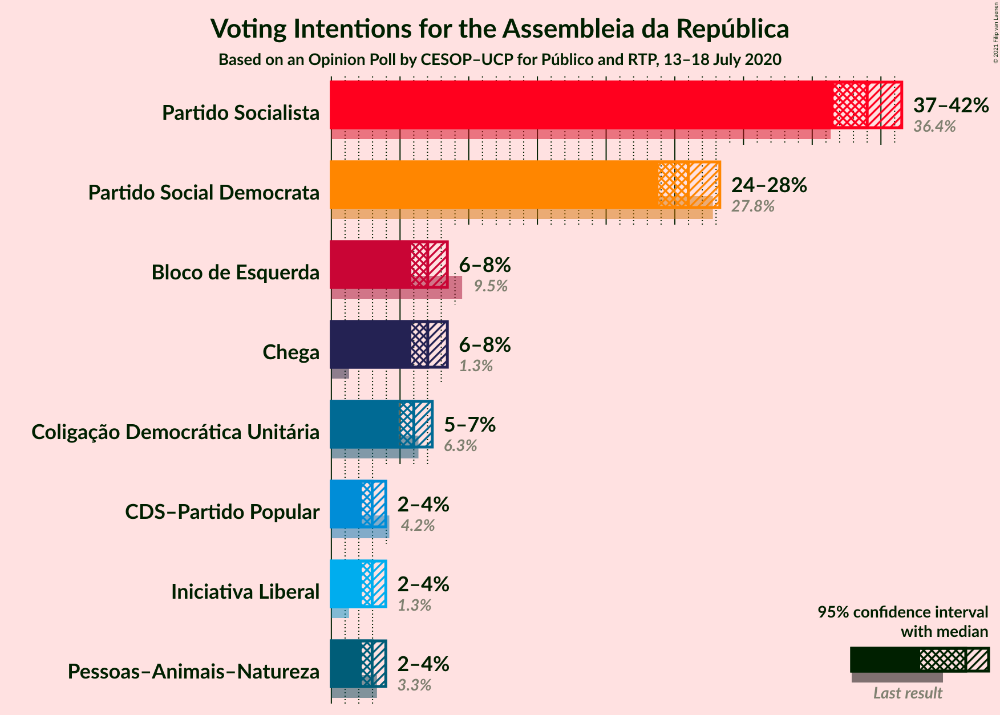

### Confidence Intervals

| Party | Last Result | Poll Result | 80% Confidence Interval | 90% Confidence Interval | 95% Confidence Interval | 99% Confidence Interval |
|:-----:|:-----------:|:-----------:|:-----------------------:|:-----------------------:|:-----------------------:|:-----------------------:|
| Partido Socialista | 36.4% | 39.0% | 37.4–40.6% |36.9–41.1% |36.5–41.5% |35.8–42.3% |
| Partido Social Democrata | 27.8% | 26.0% | 24.6–27.5% |24.1–27.9% |23.8–28.3% |23.1–29.0% |
| Bloco de Esquerda | 9.5% | 7.0% | 6.2–7.9% |6.0–8.2% |5.8–8.4% |5.5–8.9% |
| Chega | 1.3% | 7.0% | 6.2–7.9% |6.0–8.2% |5.8–8.4% |5.5–8.9% |
| Coligação Democrática Unitária | 6.3% | 6.0% | 5.3–6.9% |5.1–7.1% |4.9–7.3% |4.6–7.8% |
| CDS–Partido Popular | 4.2% | 3.0% | 2.5–3.6% |2.3–3.8% |2.2–4.0% |2.0–4.3% |
| Pessoas–Animais–Natureza | 3.3% | 3.0% | 2.5–3.6% |2.3–3.8% |2.2–4.0% |2.0–4.3% |
| Iniciativa Liberal | 1.3% | 3.0% | 2.5–3.6% |2.3–3.8% |2.2–4.0% |2.0–4.3% |

*Note:* The poll result column reflects the actual value used in the calculations. Published results may vary slightly, and in addition be rounded to fewer digits.

## Seats

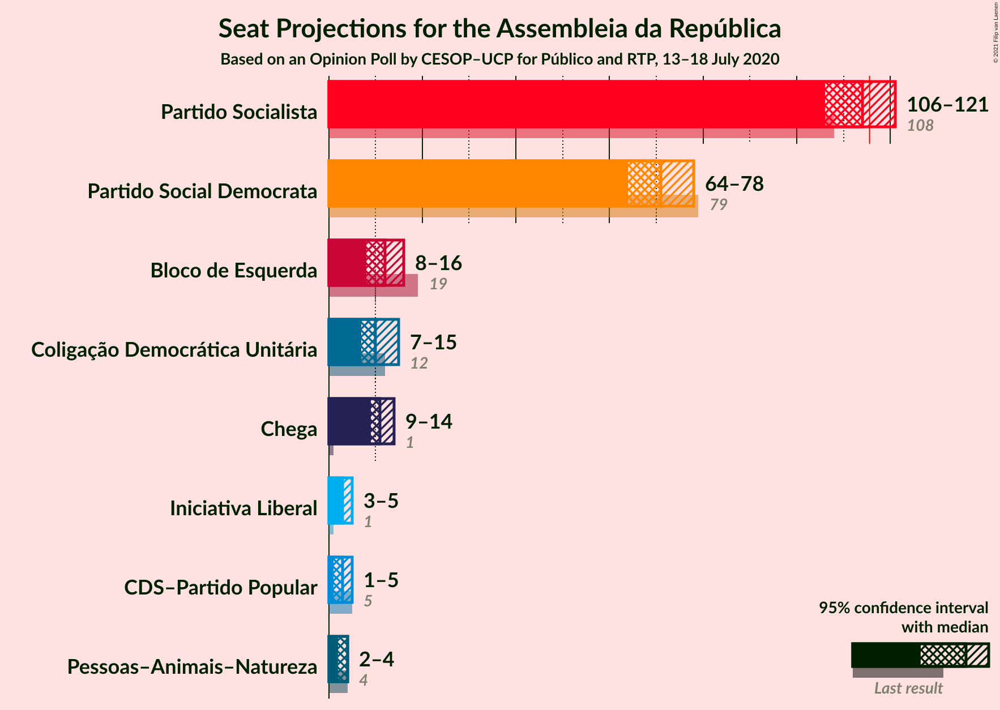

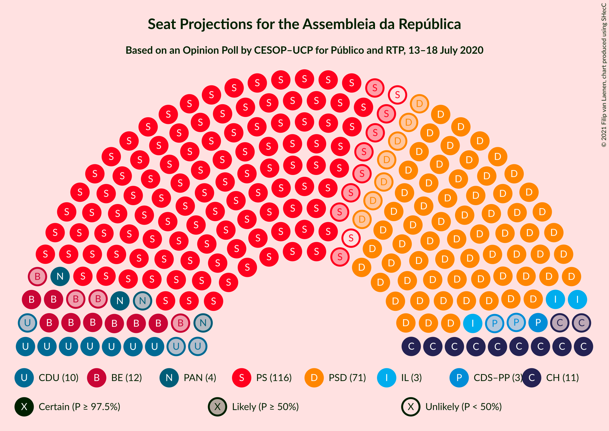

### Confidence Intervals

| Party | Last Result | Median | 80% Confidence Interval | 90% Confidence Interval | 95% Confidence Interval | 99% Confidence Interval |
|:-----:|:-----------:|:------:|:-----------------------:|:-----------------------:|:-----------------------:|:-----------------------:|
| <a href="#partido-socialista">Partido Socialista</a> | 108 | 114 | 109–118 |107–119 |106–121 |104–124 |
| <a href="#partido-social-democrata">Partido Social Democrata</a> | 79 | 71 | 68–76 |66–77 |64–78 |62–81 |
| <a href="#bloco-de-esquerda">Bloco de Esquerda</a> | 19 | 12 | 11–15 |11–16 |8–16 |7–18 |
| <a href="#chega">Chega</a> | 1 | 11 | 10–14 |9–14 |9–14 |8–15 |
| <a href="#coligação-democrática-unitária">Coligação Democrática Unitária</a> | 12 | 10 | 7–13 |7–14 |7–15 |6–15 |
| <a href="#cds–partido-popular">CDS–Partido Popular</a> | 5 | 3 | 1–3 |1–3 |1–5 |1–5 |
| <a href="#pessoas–animais–natureza">Pessoas–Animais–Natureza</a> | 4 | 4 | 3–4 |2–4 |2–4 |2–4 |
| <a href="#iniciativa-liberal">Iniciativa Liberal</a> | 1 | 3 | 3–4 |3–4 |3–5 |2–6 |

### Partido Socialista

*For a full overview of the results for this party, see the [Partido Socialista](party-partidosocialista.html) page.*

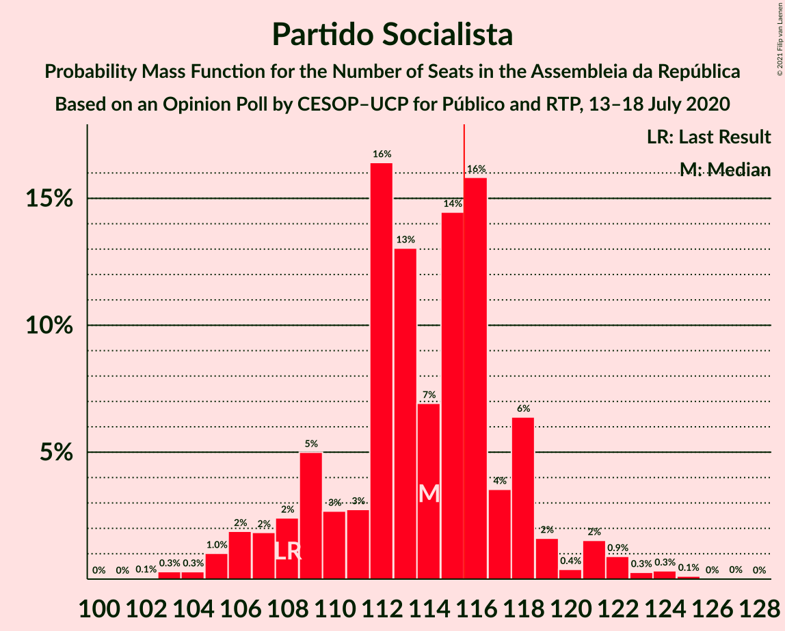

| Number of Seats | Probability | Accumulated | Special Marks |
|:---------------:|:-----------:|:-----------:|:-------------:|
| 102 | 0.1% | 100% |  |
| 103 | 0.3% | 99.9% |  |
| 104 | 0.3% | 99.6% |  |
| 105 | 1.0% | 99.3% |  |
| 106 | 2% | 98% |  |
| 107 | 2% | 96% |  |
| 108 | 2% | 95% | Last Result |
| 109 | 5% | 92% |  |
| 110 | 3% | 87% |  |
| 111 | 3% | 85% |  |
| 112 | 16% | 82% |  |
| 113 | 13% | 65% |  |
| 114 | 7% | 52% | Median |
| 115 | 14% | 45% |  |
| 116 | 16% | 31% | Majority |
| 117 | 4% | 15% |  |
| 118 | 6% | 12% |  |
| 119 | 2% | 5% |  |
| 120 | 0.4% | 4% |  |
| 121 | 2% | 3% |  |
| 122 | 0.9% | 2% |  |
| 123 | 0.3% | 0.8% |  |
| 124 | 0.3% | 0.5% |  |
| 125 | 0.1% | 0.2% |  |
| 126 | 0% | 0.1% |  |
| 127 | 0% | 0% |  |

### Partido Social Democrata

*For a full overview of the results for this party, see the [Partido Social Democrata](party-partidosocialdemocrata.html) page.*

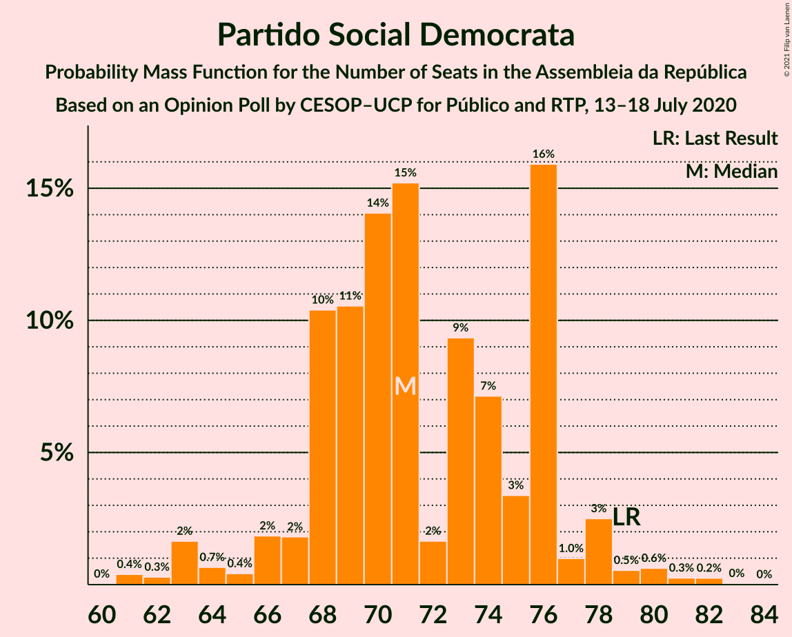

| Number of Seats | Probability | Accumulated | Special Marks |
|:---------------:|:-----------:|:-----------:|:-------------:|
| 60 | 0% | 100% |  |
| 61 | 0.4% | 99.9% |  |
| 62 | 0.3% | 99.6% |  |
| 63 | 2% | 99.3% |  |
| 64 | 0.7% | 98% |  |
| 65 | 0.4% | 97% |  |
| 66 | 2% | 97% |  |
| 67 | 2% | 95% |  |
| 68 | 10% | 93% |  |
| 69 | 11% | 82% |  |
| 70 | 14% | 72% |  |
| 71 | 15% | 58% | Median |
| 72 | 2% | 43% |  |
| 73 | 9% | 41% |  |
| 74 | 7% | 32% |  |
| 75 | 3% | 25% |  |
| 76 | 16% | 21% |  |
| 77 | 1.0% | 5% |  |
| 78 | 3% | 4% |  |
| 79 | 0.5% | 2% | Last Result |
| 80 | 0.6% | 1.2% |  |
| 81 | 0.3% | 0.6% |  |
| 82 | 0.2% | 0.3% |  |
| 83 | 0% | 0.1% |  |
| 84 | 0% | 0% |  |

### Bloco de Esquerda

*For a full overview of the results for this party, see the [Bloco de Esquerda](party-blocodeesquerda.html) page.*

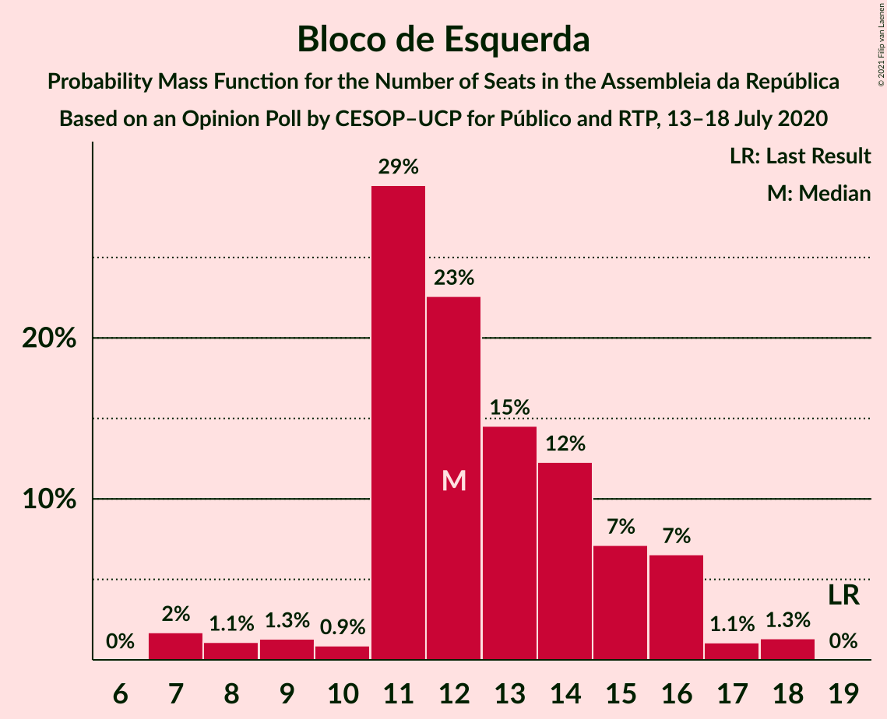

| Number of Seats | Probability | Accumulated | Special Marks |
|:---------------:|:-----------:|:-----------:|:-------------:|
| 7 | 2% | 100% |  |
| 8 | 1.1% | 98% |  |
| 9 | 1.3% | 97% |  |
| 10 | 0.9% | 96% |  |
| 11 | 29% | 95% |  |
| 12 | 23% | 66% | Median |
| 13 | 15% | 43% |  |
| 14 | 12% | 28% |  |
| 15 | 7% | 16% |  |
| 16 | 7% | 9% |  |
| 17 | 1.1% | 2% |  |
| 18 | 1.3% | 1.4% |  |
| 19 | 0% | 0% | Last Result |

### Chega

*For a full overview of the results for this party, see the [Chega](party-chega.html) page.*

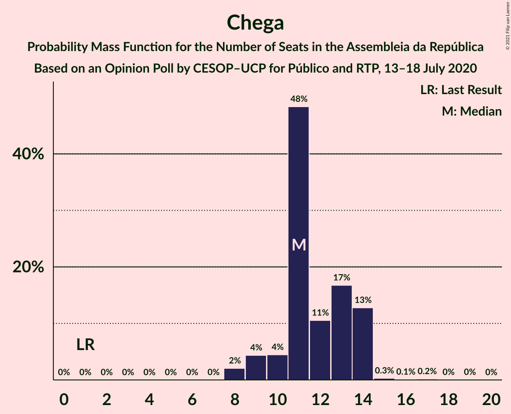

| Number of Seats | Probability | Accumulated | Special Marks |
|:---------------:|:-----------:|:-----------:|:-------------:|
| 1 | 0% | 100% | Last Result |
| 2 | 0% | 100% |  |
| 3 | 0% | 100% |  |
| 4 | 0% | 100% |  |
| 5 | 0% | 100% |  |
| 6 | 0% | 100% |  |
| 7 | 0% | 100% |  |
| 8 | 2% | 100% |  |
| 9 | 4% | 98% |  |
| 10 | 4% | 94% |  |
| 11 | 48% | 89% | Median |
| 12 | 11% | 41% |  |
| 13 | 17% | 30% |  |
| 14 | 13% | 13% |  |
| 15 | 0.3% | 0.7% |  |
| 16 | 0.1% | 0.4% |  |
| 17 | 0.2% | 0.3% |  |
| 18 | 0% | 0.1% |  |
| 19 | 0% | 0% |  |

### Coligação Democrática Unitária

*For a full overview of the results for this party, see the [Coligação Democrática Unitária](party-coligaçãodemocráticaunitária.html) page.*

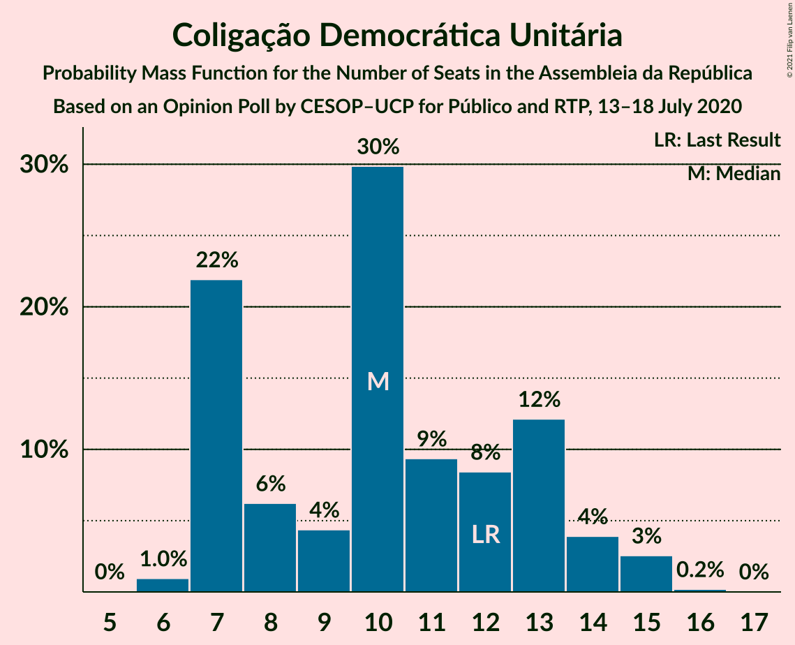

| Number of Seats | Probability | Accumulated | Special Marks |
|:---------------:|:-----------:|:-----------:|:-------------:|
| 6 | 1.0% | 100% |  |
| 7 | 22% | 99.0% |  |
| 8 | 6% | 77% |  |
| 9 | 4% | 71% |  |
| 10 | 30% | 66% | Median |
| 11 | 9% | 37% |  |
| 12 | 8% | 27% | Last Result |
| 13 | 12% | 19% |  |
| 14 | 4% | 7% |  |
| 15 | 3% | 3% |  |
| 16 | 0.2% | 0.2% |  |
| 17 | 0% | 0% |  |

### CDS–Partido Popular

*For a full overview of the results for this party, see the [CDS–Partido Popular](party-cds–partidopopular.html) page.*

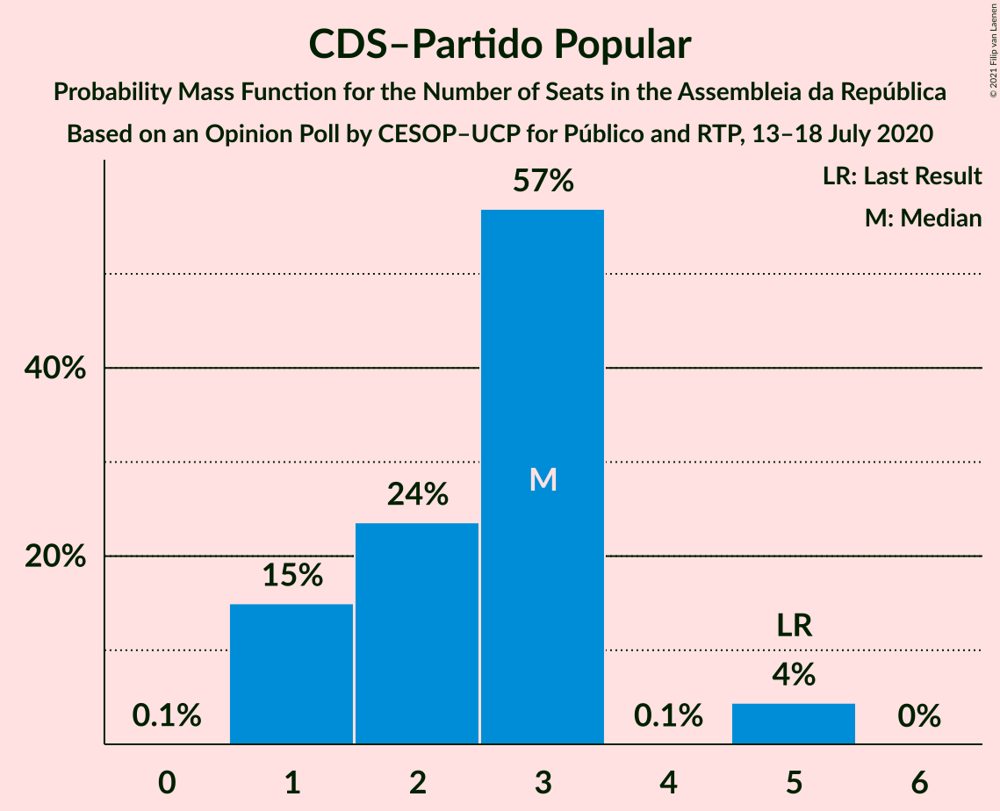

| Number of Seats | Probability | Accumulated | Special Marks |
|:---------------:|:-----------:|:-----------:|:-------------:|
| 0 | 0.1% | 100% |  |
| 1 | 15% | 99.9% |  |
| 2 | 24% | 85% |  |
| 3 | 57% | 61% | Median |
| 4 | 0.1% | 4% |  |
| 5 | 4% | 4% | Last Result |
| 6 | 0% | 0% |  |

### Pessoas–Animais–Natureza

*For a full overview of the results for this party, see the [Pessoas–Animais–Natureza](party-pessoas–animais–natureza.html) page.*

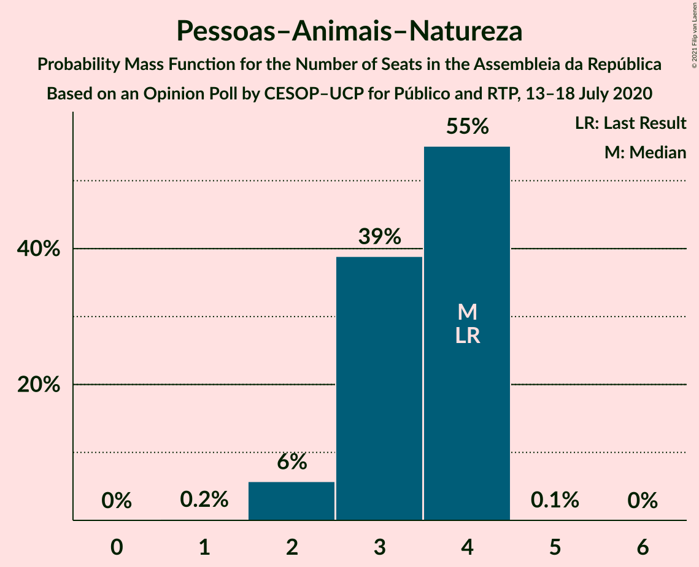

| Number of Seats | Probability | Accumulated | Special Marks |
|:---------------:|:-----------:|:-----------:|:-------------:|
| 1 | 0.2% | 100% |  |
| 2 | 6% | 99.8% |  |
| 3 | 39% | 94% |  |
| 4 | 55% | 55% | Last Result, Median |
| 5 | 0.1% | 0.1% |  |
| 6 | 0% | 0% |  |

### Iniciativa Liberal

*For a full overview of the results for this party, see the [Iniciativa Liberal](party-iniciativaliberal.html) page.*

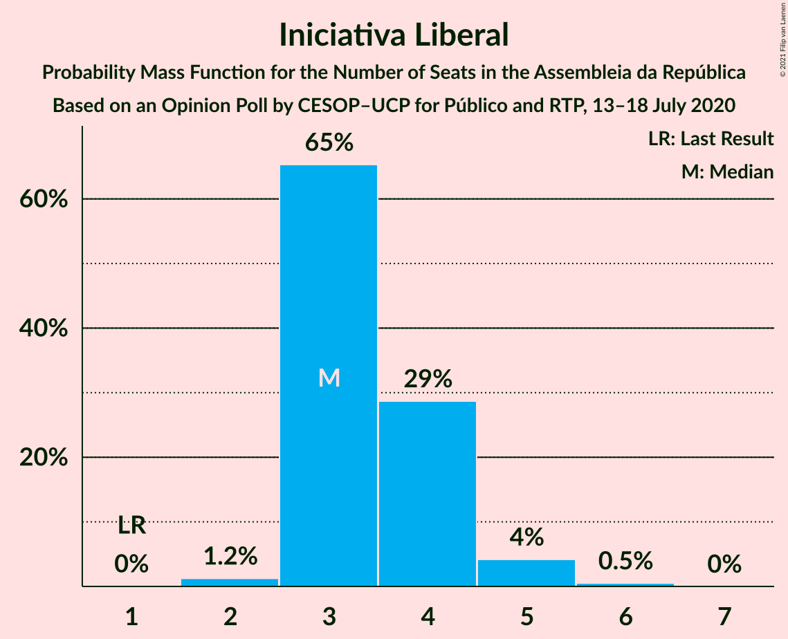

| Number of Seats | Probability | Accumulated | Special Marks |
|:---------------:|:-----------:|:-----------:|:-------------:|
| 1 | 0% | 100% | Last Result |
| 2 | 1.2% | 100% |  |
| 3 | 65% | 98.7% | Median |
| 4 | 29% | 33% |  |
| 5 | 4% | 5% |  |
| 6 | 0.5% | 0.5% |  |
| 7 | 0% | 0% |  |

## Coalitions

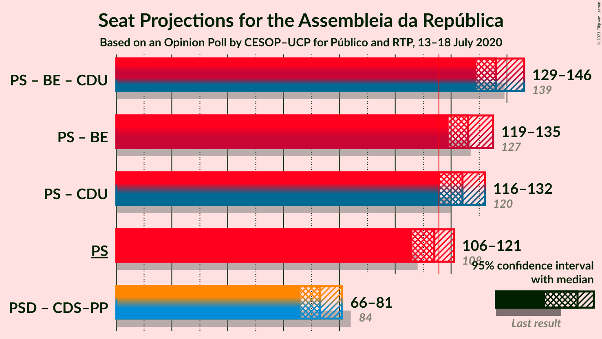

### Confidence Intervals

| Coalition | Last Result | Median | Majority? | 80% Confidence Interval | 90% Confidence Interval | 95% Confidence Interval | 99% Confidence Interval |
|:---------:|:-----------:|:------:|:---------:|:-----------------------:|:-----------------------:|:-----------------------:|:-----------------------:|
| Partido Socialista – Bloco de Esquerda – Coligação Democrática Unitária | 139 | 136 | 100% | 131–141 | 131–141 | 129–146 | 127–148 |
| Partido Socialista – Bloco de Esquerda | 127 | 126 | 99.7% | 121–130 | 120–132 | 119–135 | 116–138 |
| Partido Socialista – Coligação Democrática Unitária | 120 | 124 | 99.1% | 119–129 | 118–130 | 116–132 | 114–135 |
| Partido Socialista | 108 | 114 | 31% | 109–118 | 107–119 | 106–121 | 104–124 |
| Partido Social Democrata – CDS–Partido Popular | 84 | 73 | 0% | 70–79 | 69–79 | 66–81 | 64–83 |

### Partido Socialista – Bloco de Esquerda – Coligação Democrática Unitária

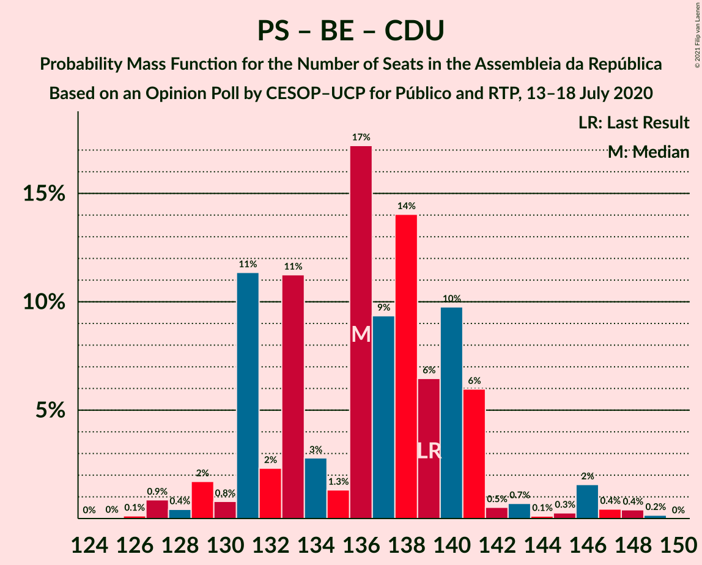

| Number of Seats | Probability | Accumulated | Special Marks |
|:---------------:|:-----------:|:-----------:|:-------------:|
| 125 | 0% | 100% |  |
| 126 | 0.1% | 99.9% |  |
| 127 | 0.9% | 99.8% |  |
| 128 | 0.4% | 98.9% |  |
| 129 | 2% | 98.5% |  |
| 130 | 0.8% | 97% |  |
| 131 | 11% | 96% |  |
| 132 | 2% | 85% |  |
| 133 | 11% | 82% |  |
| 134 | 3% | 71% |  |
| 135 | 1.3% | 68% |  |
| 136 | 17% | 67% | Median |
| 137 | 9% | 50% |  |
| 138 | 14% | 40% |  |
| 139 | 6% | 26% | Last Result |
| 140 | 10% | 20% |  |
| 141 | 6% | 10% |  |
| 142 | 0.5% | 4% |  |
| 143 | 0.7% | 4% |  |
| 144 | 0.1% | 3% |  |
| 145 | 0.3% | 3% |  |
| 146 | 2% | 3% |  |
| 147 | 0.4% | 1.0% |  |
| 148 | 0.4% | 0.6% |  |
| 149 | 0.2% | 0.2% |  |
| 150 | 0% | 0% |  |

### Partido Socialista – Bloco de Esquerda

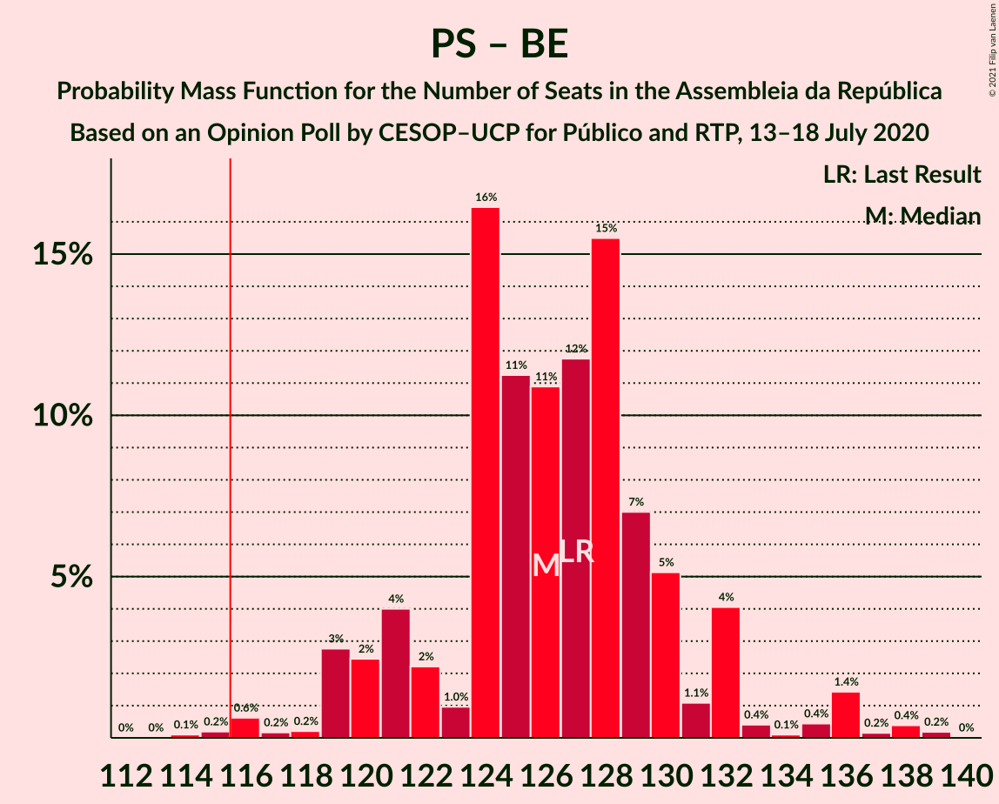

| Number of Seats | Probability | Accumulated | Special Marks |
|:---------------:|:-----------:|:-----------:|:-------------:|
| 114 | 0.1% | 100% |  |
| 115 | 0.2% | 99.9% |  |
| 116 | 0.6% | 99.7% | Majority |
| 117 | 0.2% | 99.1% |  |
| 118 | 0.2% | 98.9% |  |
| 119 | 3% | 98.7% |  |
| 120 | 2% | 96% |  |
| 121 | 4% | 93% |  |
| 122 | 2% | 89% |  |
| 123 | 1.0% | 87% |  |
| 124 | 16% | 86% |  |
| 125 | 11% | 70% |  |
| 126 | 11% | 59% | Median |
| 127 | 12% | 48% | Last Result |
| 128 | 15% | 36% |  |
| 129 | 7% | 20% |  |
| 130 | 5% | 13% |  |
| 131 | 1.1% | 8% |  |
| 132 | 4% | 7% |  |
| 133 | 0.4% | 3% |  |
| 134 | 0.1% | 3% |  |
| 135 | 0.4% | 3% |  |
| 136 | 1.4% | 2% |  |
| 137 | 0.2% | 0.8% |  |
| 138 | 0.4% | 0.6% |  |
| 139 | 0.2% | 0.2% |  |
| 140 | 0% | 0% |  |

### Partido Socialista – Coligação Democrática Unitária

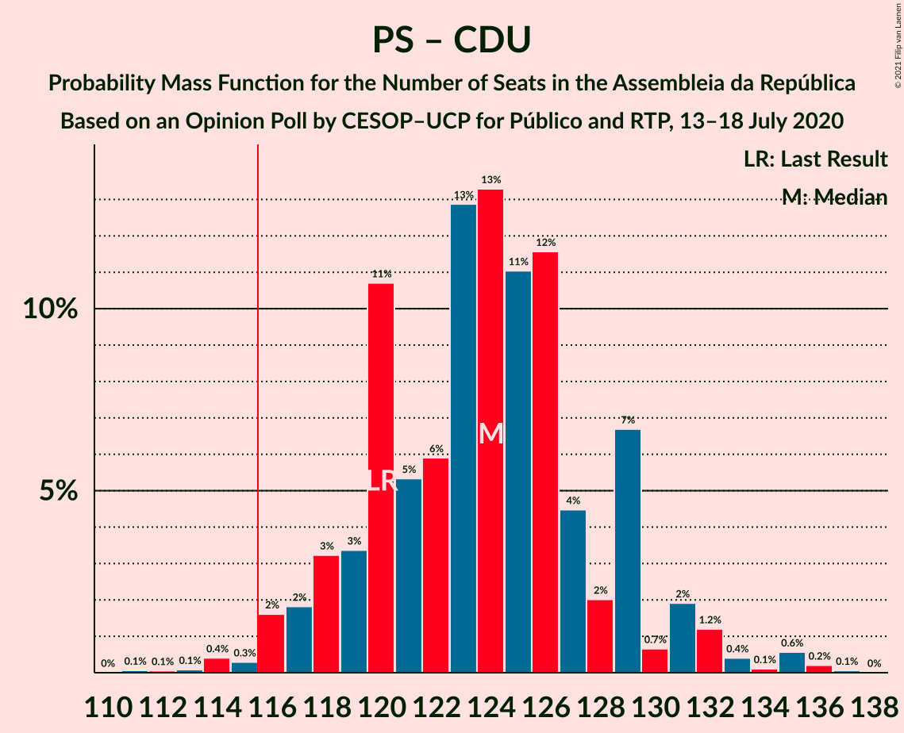

| Number of Seats | Probability | Accumulated | Special Marks |
|:---------------:|:-----------:|:-----------:|:-------------:|
| 111 | 0.1% | 100% |  |
| 112 | 0.1% | 99.9% |  |
| 113 | 0.1% | 99.9% |  |
| 114 | 0.4% | 99.8% |  |
| 115 | 0.3% | 99.4% |  |
| 116 | 2% | 99.1% | Majority |
| 117 | 2% | 97% |  |
| 118 | 3% | 96% |  |
| 119 | 3% | 92% |  |
| 120 | 11% | 89% | Last Result |
| 121 | 5% | 78% |  |
| 122 | 6% | 73% |  |
| 123 | 13% | 67% |  |
| 124 | 13% | 54% | Median |
| 125 | 11% | 41% |  |
| 126 | 12% | 30% |  |
| 127 | 4% | 18% |  |
| 128 | 2% | 14% |  |
| 129 | 7% | 12% |  |
| 130 | 0.7% | 5% |  |
| 131 | 2% | 4% |  |
| 132 | 1.2% | 3% |  |
| 133 | 0.4% | 1.4% |  |
| 134 | 0.1% | 1.0% |  |
| 135 | 0.6% | 0.8% |  |
| 136 | 0.2% | 0.3% |  |
| 137 | 0.1% | 0.1% |  |
| 138 | 0% | 0% |  |

### Partido Socialista

| Number of Seats | Probability | Accumulated | Special Marks |
|:---------------:|:-----------:|:-----------:|:-------------:|
| 102 | 0.1% | 100% |  |
| 103 | 0.3% | 99.9% |  |
| 104 | 0.3% | 99.6% |  |
| 105 | 1.0% | 99.3% |  |
| 106 | 2% | 98% |  |
| 107 | 2% | 96% |  |
| 108 | 2% | 95% | Last Result |
| 109 | 5% | 92% |  |
| 110 | 3% | 87% |  |
| 111 | 3% | 85% |  |
| 112 | 16% | 82% |  |
| 113 | 13% | 65% |  |
| 114 | 7% | 52% | Median |
| 115 | 14% | 45% |  |
| 116 | 16% | 31% | Majority |
| 117 | 4% | 15% |  |
| 118 | 6% | 12% |  |
| 119 | 2% | 5% |  |
| 120 | 0.4% | 4% |  |
| 121 | 2% | 3% |  |
| 122 | 0.9% | 2% |  |
| 123 | 0.3% | 0.8% |  |
| 124 | 0.3% | 0.5% |  |
| 125 | 0.1% | 0.2% |  |
| 126 | 0% | 0.1% |  |
| 127 | 0% | 0% |  |

### Partido Social Democrata – CDS–Partido Popular

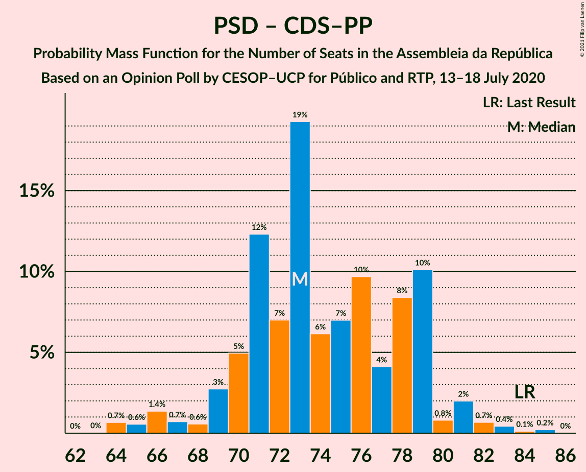

| Number of Seats | Probability | Accumulated | Special Marks |
|:---------------:|:-----------:|:-----------:|:-------------:|
| 63 | 0% | 100% |  |
| 64 | 0.7% | 99.9% |  |
| 65 | 0.6% | 99.2% |  |
| 66 | 1.4% | 98.7% |  |
| 67 | 0.7% | 97% |  |
| 68 | 0.6% | 97% |  |
| 69 | 3% | 96% |  |
| 70 | 5% | 93% |  |
| 71 | 12% | 88% |  |
| 72 | 7% | 76% |  |
| 73 | 19% | 69% |  |
| 74 | 6% | 50% | Median |
| 75 | 7% | 44% |  |
| 76 | 10% | 37% |  |
| 77 | 4% | 27% |  |
| 78 | 8% | 23% |  |
| 79 | 10% | 14% |  |
| 80 | 0.8% | 4% |  |
| 81 | 2% | 3% |  |
| 82 | 0.7% | 1.5% |  |
| 83 | 0.4% | 0.8% |  |
| 84 | 0.1% | 0.4% | Last Result |
| 85 | 0.2% | 0.3% |  |
| 86 | 0% | 0% |  |

## Technical Information

### Opinion Poll

+ **Polling firm:** CESOP–UCP
+ **Commissioner(s):** Público and RTP
+ **Fieldwork period:** 13–18 July 2020

### Calculations

+ **Sample size:** 1482
+ **Simulations done:** 131,072
+ **Error estimate:** 1.01%

