# Opinion Poll by Intercampus for Correio da Manhã and Negócios, 6–11 August 2020

<a href="#voting-intentions">Voting Intentions</a> | <a href="#seats">Seats</a> | <a href="#coalitions">Coalitions</a> | <a href="#technical-information">Technical Information</a>

## Voting Intentions

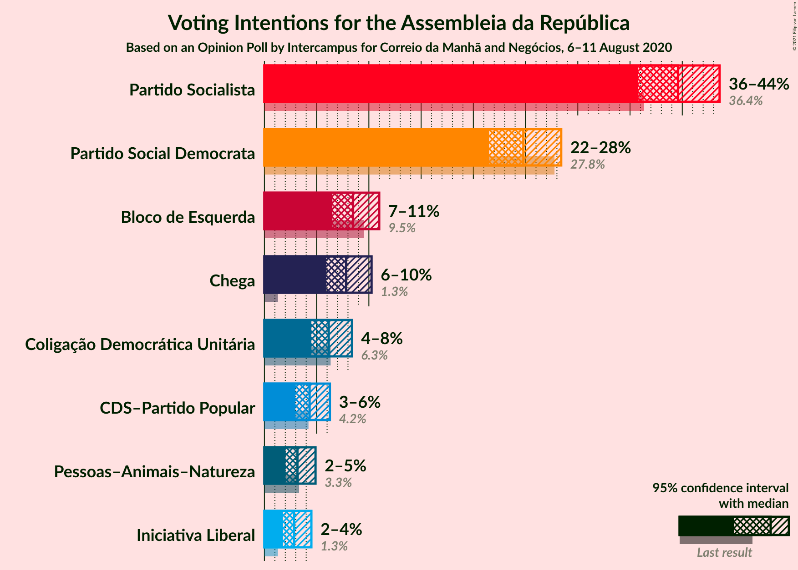

### Confidence Intervals

| Party | Last Result | Poll Result | 80% Confidence Interval | 90% Confidence Interval | 95% Confidence Interval | 99% Confidence Interval |
|:-----:|:-----------:|:-----------:|:-----------------------:|:-----------------------:|:-----------------------:|:-----------------------:|
| Partido Socialista | 36.4% | 39.6% | 37.1–42.2% |36.4–42.9% |35.8–43.6% |34.6–44.8% |
| Partido Social Democrata | 27.8% | 24.8% | 22.6–27.2% |22.0–27.8% |21.5–28.4% |20.5–29.6% |
| Bloco de Esquerda | 9.5% | 8.5% | 7.2–10.1% |6.8–10.6% |6.5–11.0% |5.9–11.8% |
| Chega | 1.3% | 7.8% | 6.6–9.4% |6.2–9.9% |5.9–10.3% |5.4–11.1% |
| Coligação Democrática Unitária | 6.3% | 6.2% | 5.1–7.6% |4.8–8.0% |4.5–8.4% |4.0–9.1% |
| CDS–Partido Popular | 4.2% | 4.3% | 3.4–5.6% |3.2–5.9% |3.0–6.3% |2.6–6.9% |
| Pessoas–Animais–Natureza | 3.3% | 3.2% | 2.4–4.3% |2.2–4.6% |2.0–4.9% |1.7–5.5% |
| Iniciativa Liberal | 1.3% | 2.8% | 2.1–3.9% |1.9–4.2% |1.8–4.5% |1.5–5.1% |

*Note:* The poll result column reflects the actual value used in the calculations. Published results may vary slightly, and in addition be rounded to fewer digits.

## Seats

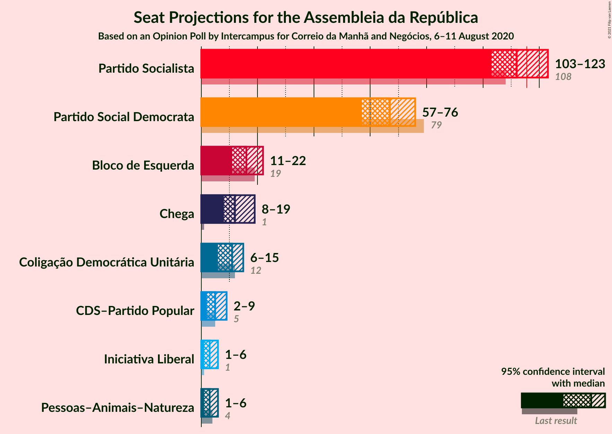

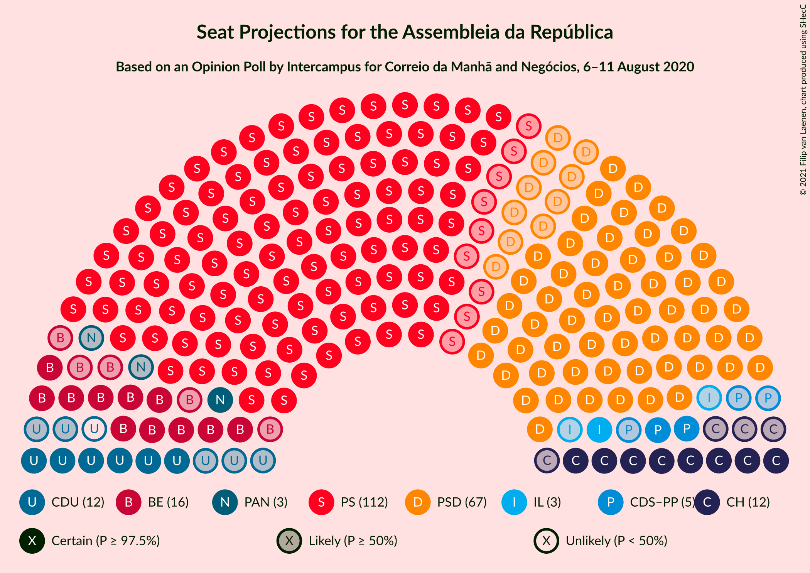

### Confidence Intervals

| Party | Last Result | Median | 80% Confidence Interval | 90% Confidence Interval | 95% Confidence Interval | 99% Confidence Interval |
|:-----:|:-----------:|:------:|:-----------------------:|:-----------------------:|:-----------------------:|:-----------------------:|
| <a href="#partido-socialista">Partido Socialista</a> | 108 | 112 | 106–120 |104–122 |103–123 |100–126 |
| <a href="#partido-social-democrata">Partido Social Democrata</a> | 79 | 67 | 59–73 |57–75 |57–76 |54–79 |
| <a href="#bloco-de-esquerda">Bloco de Esquerda</a> | 19 | 16 | 13–21 |12–21 |11–22 |9–23 |
| <a href="#chega">Chega</a> | 1 | 12 | 11–15 |10–18 |8–19 |8–22 |
| <a href="#coligação-democrática-unitária">Coligação Democrática Unitária</a> | 12 | 11 | 6–14 |6–15 |6–15 |5–18 |
| <a href="#cds–partido-popular">CDS–Partido Popular</a> | 5 | 5 | 2–5 |2–6 |2–9 |1–11 |
| <a href="#pessoas–animais–natureza">Pessoas–Animais–Natureza</a> | 4 | 3 | 2–5 |2–6 |1–6 |1–8 |
| <a href="#iniciativa-liberal">Iniciativa Liberal</a> | 1 | 3 | 2–5 |2–5 |1–6 |1–6 |

### Partido Socialista

*For a full overview of the results for this party, see the [Partido Socialista](party-partidosocialista.html) page.*

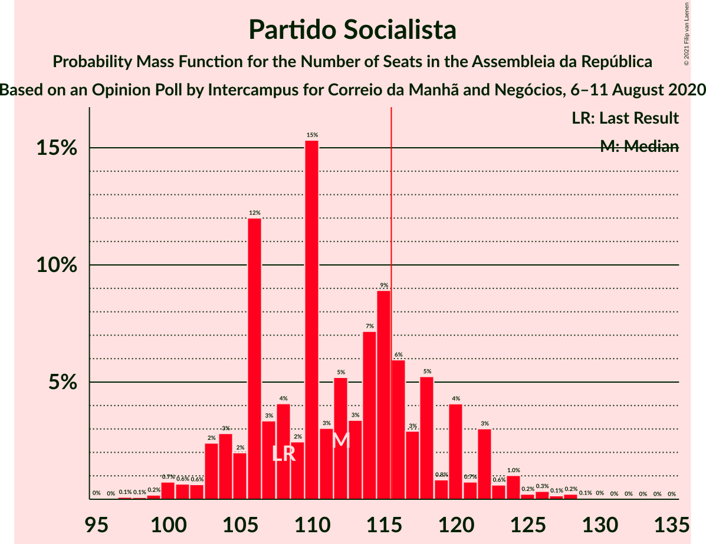

| Number of Seats | Probability | Accumulated | Special Marks |
|:---------------:|:-----------:|:-----------:|:-------------:|
| 95 | 0% | 100% |  |
| 96 | 0% | 99.9% |  |
| 97 | 0.1% | 99.9% |  |
| 98 | 0.1% | 99.8% |  |
| 99 | 0.2% | 99.7% |  |
| 100 | 0.7% | 99.5% |  |
| 101 | 0.6% | 98.8% |  |
| 102 | 0.6% | 98% |  |
| 103 | 2% | 98% |  |
| 104 | 3% | 95% |  |
| 105 | 2% | 92% |  |
| 106 | 12% | 90% |  |
| 107 | 3% | 78% |  |
| 108 | 4% | 75% | Last Result |
| 109 | 2% | 71% |  |
| 110 | 15% | 68% |  |
| 111 | 3% | 53% |  |
| 112 | 5% | 50% | Median |
| 113 | 3% | 45% |  |
| 114 | 7% | 42% |  |
| 115 | 9% | 34% |  |
| 116 | 6% | 25% | Majority |
| 117 | 3% | 19% |  |
| 118 | 5% | 17% |  |
| 119 | 0.8% | 11% |  |
| 120 | 4% | 11% |  |
| 121 | 0.7% | 6% |  |
| 122 | 3% | 6% |  |
| 123 | 0.6% | 3% |  |
| 124 | 1.0% | 2% |  |
| 125 | 0.2% | 1.1% |  |
| 126 | 0.3% | 0.8% |  |
| 127 | 0.1% | 0.5% |  |
| 128 | 0.2% | 0.3% |  |
| 129 | 0.1% | 0.1% |  |
| 130 | 0% | 0.1% |  |
| 131 | 0% | 0% |  |

### Partido Social Democrata

*For a full overview of the results for this party, see the [Partido Social Democrata](party-partidosocialdemocrata.html) page.*

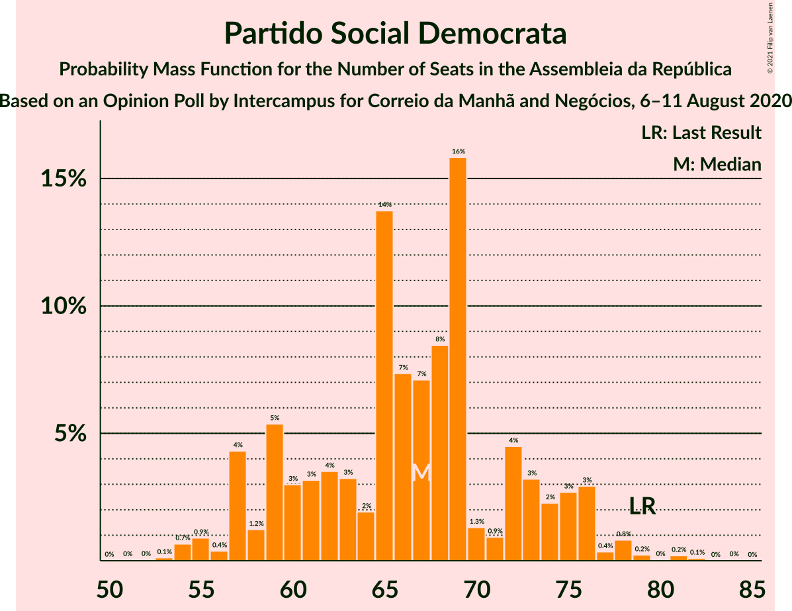

| Number of Seats | Probability | Accumulated | Special Marks |
|:---------------:|:-----------:|:-----------:|:-------------:|
| 51 | 0% | 100% |  |
| 52 | 0% | 99.9% |  |
| 53 | 0.1% | 99.9% |  |
| 54 | 0.7% | 99.8% |  |
| 55 | 0.9% | 99.1% |  |
| 56 | 0.4% | 98% |  |
| 57 | 4% | 98% |  |
| 58 | 1.2% | 94% |  |
| 59 | 5% | 92% |  |
| 60 | 3% | 87% |  |
| 61 | 3% | 84% |  |
| 62 | 4% | 81% |  |
| 63 | 3% | 77% |  |
| 64 | 2% | 74% |  |
| 65 | 14% | 72% |  |
| 66 | 7% | 58% |  |
| 67 | 7% | 51% | Median |
| 68 | 8% | 44% |  |
| 69 | 16% | 35% |  |
| 70 | 1.3% | 20% |  |
| 71 | 0.9% | 18% |  |
| 72 | 4% | 17% |  |
| 73 | 3% | 13% |  |
| 74 | 2% | 10% |  |
| 75 | 3% | 7% |  |
| 76 | 3% | 5% |  |
| 77 | 0.4% | 2% |  |
| 78 | 0.8% | 1.5% |  |
| 79 | 0.2% | 0.6% | Last Result |
| 80 | 0% | 0.4% |  |
| 81 | 0.2% | 0.4% |  |
| 82 | 0.1% | 0.2% |  |
| 83 | 0% | 0.1% |  |
| 84 | 0% | 0.1% |  |
| 85 | 0% | 0% |  |

### Bloco de Esquerda

*For a full overview of the results for this party, see the [Bloco de Esquerda](party-blocodeesquerda.html) page.*

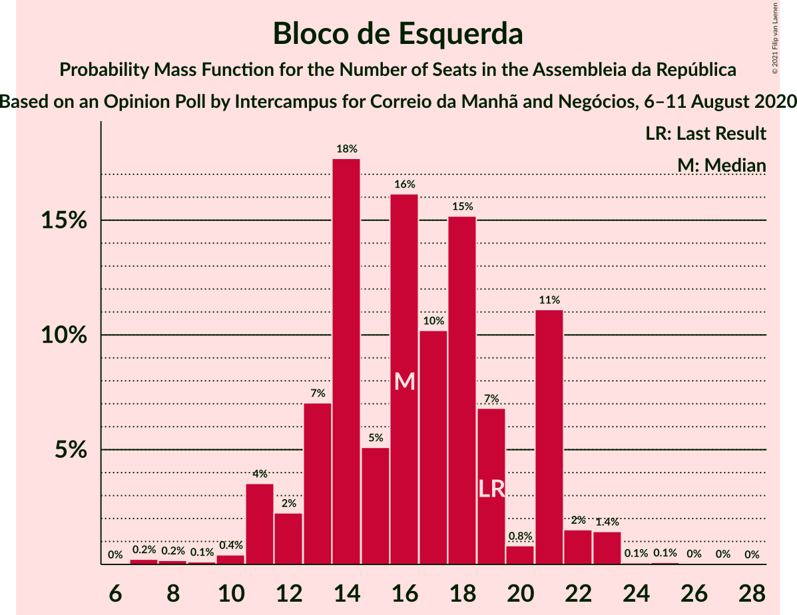

| Number of Seats | Probability | Accumulated | Special Marks |
|:---------------:|:-----------:|:-----------:|:-------------:|
| 7 | 0.2% | 100% |  |
| 8 | 0.2% | 99.8% |  |
| 9 | 0.1% | 99.6% |  |
| 10 | 0.4% | 99.5% |  |
| 11 | 4% | 99.1% |  |
| 12 | 2% | 96% |  |
| 13 | 7% | 93% |  |
| 14 | 18% | 86% |  |
| 15 | 5% | 69% |  |
| 16 | 16% | 63% | Median |
| 17 | 10% | 47% |  |
| 18 | 15% | 37% |  |
| 19 | 7% | 22% | Last Result |
| 20 | 0.8% | 15% |  |
| 21 | 11% | 14% |  |
| 22 | 2% | 3% |  |
| 23 | 1.4% | 2% |  |
| 24 | 0.1% | 0.3% |  |
| 25 | 0.1% | 0.2% |  |
| 26 | 0% | 0.1% |  |
| 27 | 0% | 0.1% |  |
| 28 | 0% | 0% |  |

### Chega

*For a full overview of the results for this party, see the [Chega](party-chega.html) page.*

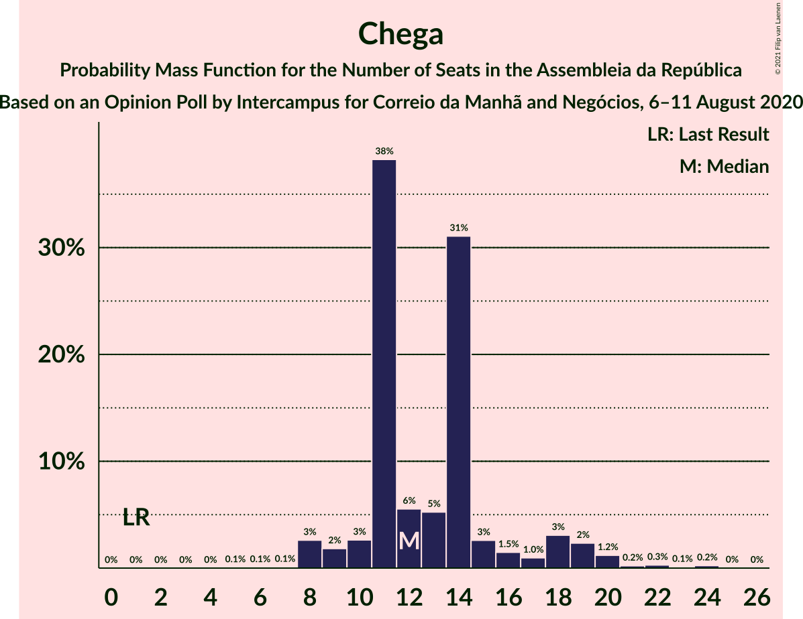

| Number of Seats | Probability | Accumulated | Special Marks |
|:---------------:|:-----------:|:-----------:|:-------------:|
| 1 | 0% | 100% | Last Result |
| 2 | 0% | 100% |  |
| 3 | 0% | 100% |  |
| 4 | 0% | 100% |  |
| 5 | 0.1% | 100% |  |
| 6 | 0.1% | 99.9% |  |
| 7 | 0.1% | 99.9% |  |
| 8 | 3% | 99.8% |  |
| 9 | 2% | 97% |  |
| 10 | 3% | 95% |  |
| 11 | 38% | 93% |  |
| 12 | 6% | 54% | Median |
| 13 | 5% | 49% |  |
| 14 | 31% | 44% |  |
| 15 | 3% | 13% |  |
| 16 | 1.5% | 10% |  |
| 17 | 1.0% | 8% |  |
| 18 | 3% | 8% |  |
| 19 | 2% | 4% |  |
| 20 | 1.2% | 2% |  |
| 21 | 0.2% | 0.9% |  |
| 22 | 0.3% | 0.7% |  |
| 23 | 0.1% | 0.4% |  |
| 24 | 0.2% | 0.3% |  |
| 25 | 0% | 0% |  |

### Coligação Democrática Unitária

*For a full overview of the results for this party, see the [Coligação Democrática Unitária](party-coligaçãodemocráticaunitária.html) page.*

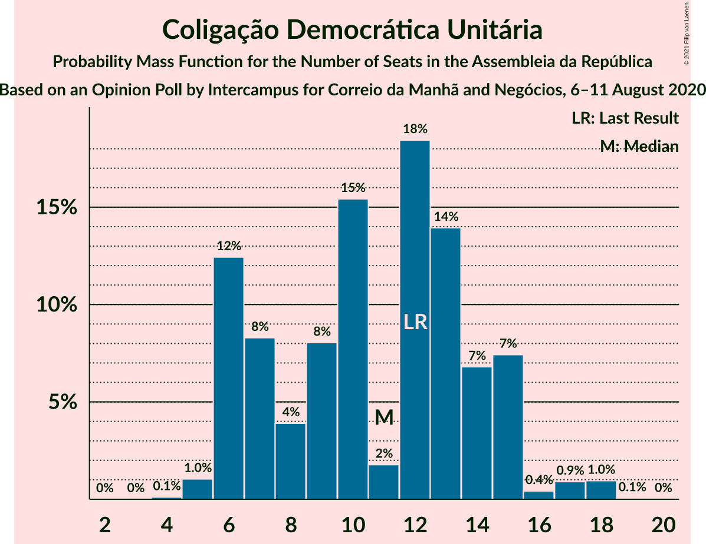

| Number of Seats | Probability | Accumulated | Special Marks |
|:---------------:|:-----------:|:-----------:|:-------------:|
| 4 | 0.1% | 100% |  |
| 5 | 1.0% | 99.9% |  |
| 6 | 12% | 98.8% |  |
| 7 | 8% | 86% |  |
| 8 | 4% | 78% |  |
| 9 | 8% | 74% |  |
| 10 | 15% | 66% |  |
| 11 | 2% | 51% | Median |
| 12 | 18% | 49% | Last Result |
| 13 | 14% | 31% |  |
| 14 | 7% | 17% |  |
| 15 | 7% | 10% |  |
| 16 | 0.4% | 2% |  |
| 17 | 0.9% | 2% |  |
| 18 | 1.0% | 1.1% |  |
| 19 | 0.1% | 0.1% |  |
| 20 | 0% | 0% |  |

### CDS–Partido Popular

*For a full overview of the results for this party, see the [CDS–Partido Popular](party-cds–partidopopular.html) page.*

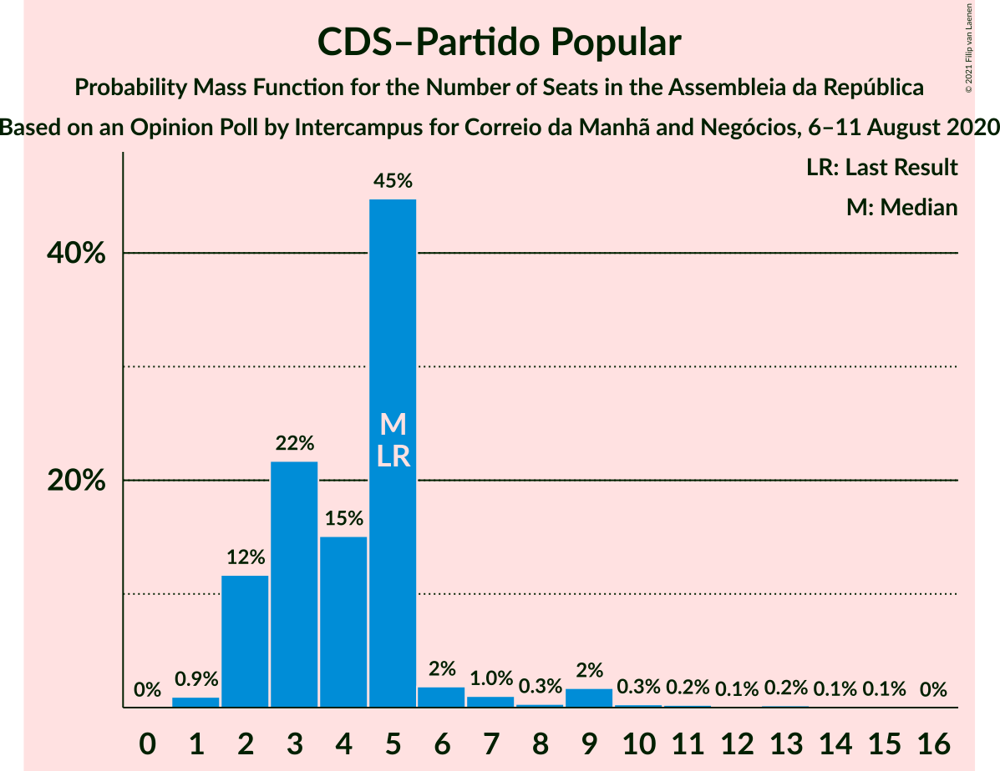

| Number of Seats | Probability | Accumulated | Special Marks |
|:---------------:|:-----------:|:-----------:|:-------------:|
| 1 | 0.9% | 100% |  |
| 2 | 12% | 99.1% |  |
| 3 | 22% | 87% |  |
| 4 | 15% | 66% |  |
| 5 | 45% | 51% | Last Result, Median |
| 6 | 2% | 6% |  |
| 7 | 1.0% | 4% |  |
| 8 | 0.3% | 3% |  |
| 9 | 2% | 3% |  |
| 10 | 0.3% | 0.9% |  |
| 11 | 0.2% | 0.6% |  |
| 12 | 0.1% | 0.4% |  |
| 13 | 0.2% | 0.4% |  |
| 14 | 0.1% | 0.2% |  |
| 15 | 0.1% | 0.1% |  |
| 16 | 0% | 0% |  |

### Pessoas–Animais–Natureza

*For a full overview of the results for this party, see the [Pessoas–Animais–Natureza](party-pessoas–animais–natureza.html) page.*

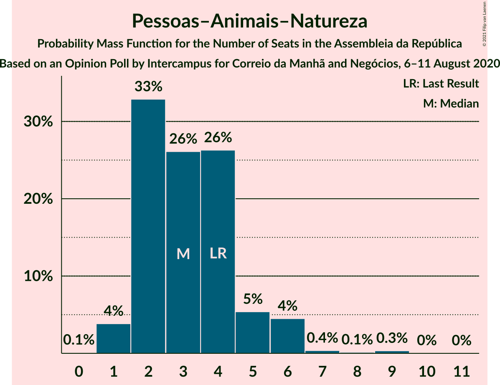

| Number of Seats | Probability | Accumulated | Special Marks |
|:---------------:|:-----------:|:-----------:|:-------------:|
| 0 | 0.1% | 100% |  |
| 1 | 4% | 99.9% |  |
| 2 | 33% | 96% |  |
| 3 | 26% | 63% | Median |
| 4 | 26% | 37% | Last Result |
| 5 | 5% | 11% |  |
| 6 | 4% | 5% |  |
| 7 | 0.4% | 0.9% |  |
| 8 | 0.1% | 0.5% |  |
| 9 | 0.3% | 0.4% |  |
| 10 | 0% | 0.1% |  |
| 11 | 0% | 0% |  |

### Iniciativa Liberal

*For a full overview of the results for this party, see the [Iniciativa Liberal](party-iniciativaliberal.html) page.*

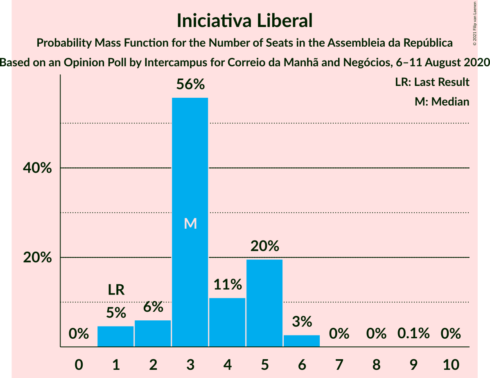

| Number of Seats | Probability | Accumulated | Special Marks |
|:---------------:|:-----------:|:-----------:|:-------------:|
| 1 | 5% | 100% | Last Result |
| 2 | 6% | 95% |  |
| 3 | 56% | 89% | Median |
| 4 | 11% | 34% |  |
| 5 | 20% | 23% |  |
| 6 | 3% | 3% |  |
| 7 | 0% | 0.2% |  |
| 8 | 0% | 0.2% |  |
| 9 | 0.1% | 0.1% |  |
| 10 | 0% | 0% |  |

## Coalitions

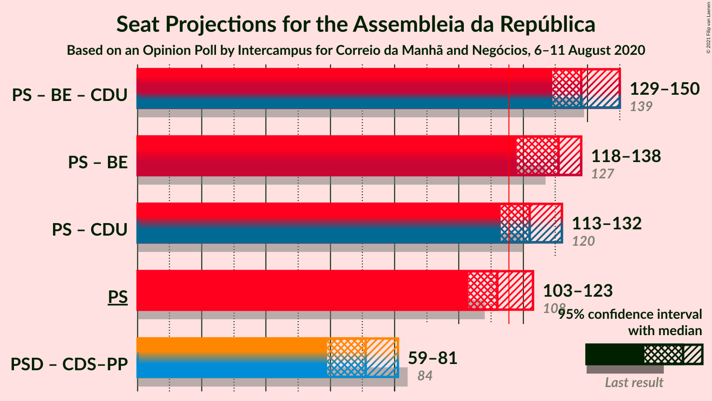

### Confidence Intervals

| Coalition | Last Result | Median | Majority? | 80% Confidence Interval | 90% Confidence Interval | 95% Confidence Interval | 99% Confidence Interval |
|:---------:|:-----------:|:------:|:---------:|:-----------------------:|:-----------------------:|:-----------------------:|:-----------------------:|
| Partido Socialista – Bloco de Esquerda – Coligação Democrática Unitária | 139 | 138 | 100% | 132–146 | 131–149 | 129–150 | 124–152 |
| Partido Socialista – Bloco de Esquerda | 127 | 131 | 99.4% | 120–136 | 119–138 | 118–138 | 115–143 |
| Partido Socialista – Coligação Democrática Unitária | 120 | 122 | 95% | 117–131 | 116–132 | 113–132 | 109–137 |
| Partido Socialista | 108 | 112 | 25% | 106–120 | 104–122 | 103–123 | 100–126 |
| Partido Social Democrata – CDS–Partido Popular | 84 | 71 | 0% | 63–78 | 60–80 | 59–81 | 58–85 |

### Partido Socialista – Bloco de Esquerda – Coligação Democrática Unitária

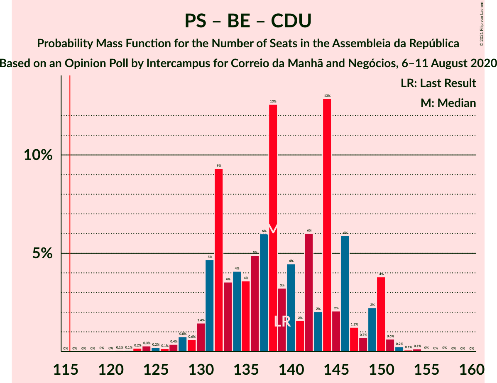

| Number of Seats | Probability | Accumulated | Special Marks |
|:---------------:|:-----------:|:-----------:|:-------------:|
| 119 | 0% | 100% |  |
| 120 | 0% | 99.9% |  |
| 121 | 0.1% | 99.9% |  |
| 122 | 0.1% | 99.9% |  |
| 123 | 0.2% | 99.8% |  |
| 124 | 0.3% | 99.6% |  |
| 125 | 0.2% | 99.4% |  |
| 126 | 0.1% | 99.2% |  |
| 127 | 0.4% | 99.0% |  |
| 128 | 0.8% | 98.7% |  |
| 129 | 0.6% | 98% |  |
| 130 | 1.4% | 97% |  |
| 131 | 5% | 96% |  |
| 132 | 9% | 91% |  |
| 133 | 4% | 82% |  |
| 134 | 4% | 78% |  |
| 135 | 4% | 74% |  |
| 136 | 5% | 71% |  |
| 137 | 6% | 66% |  |
| 138 | 13% | 60% |  |
| 139 | 3% | 47% | Last Result, Median |
| 140 | 4% | 44% |  |
| 141 | 2% | 40% |  |
| 142 | 6% | 38% |  |
| 143 | 2% | 32% |  |
| 144 | 13% | 30% |  |
| 145 | 2% | 17% |  |
| 146 | 6% | 15% |  |
| 147 | 1.2% | 9% |  |
| 148 | 0.7% | 8% |  |
| 149 | 2% | 7% |  |
| 150 | 4% | 5% |  |
| 151 | 0.6% | 1.2% |  |
| 152 | 0.2% | 0.6% |  |
| 153 | 0.1% | 0.3% |  |
| 154 | 0.1% | 0.2% |  |
| 155 | 0% | 0.1% |  |
| 156 | 0% | 0.1% |  |
| 157 | 0% | 0.1% |  |
| 158 | 0% | 0% |  |

### Partido Socialista – Bloco de Esquerda

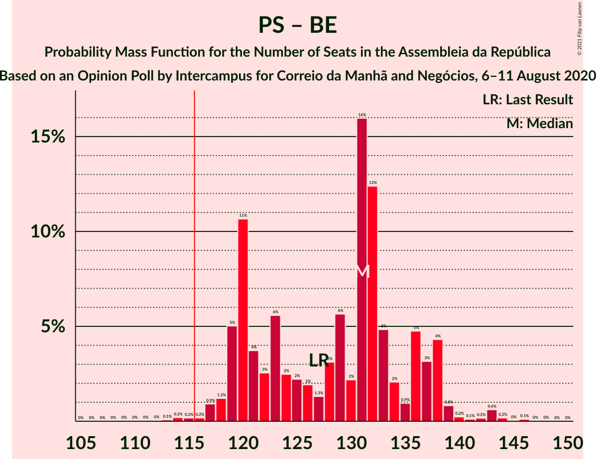

| Number of Seats | Probability | Accumulated | Special Marks |
|:---------------:|:-----------:|:-----------:|:-------------:|
| 109 | 0% | 100% |  |
| 110 | 0% | 99.9% |  |
| 111 | 0% | 99.9% |  |
| 112 | 0% | 99.9% |  |
| 113 | 0.1% | 99.9% |  |
| 114 | 0.2% | 99.8% |  |
| 115 | 0.2% | 99.6% |  |
| 116 | 0.2% | 99.4% | Majority |
| 117 | 0.9% | 99.2% |  |
| 118 | 1.2% | 98% |  |
| 119 | 5% | 97% |  |
| 120 | 11% | 92% |  |
| 121 | 4% | 81% |  |
| 122 | 3% | 78% |  |
| 123 | 6% | 75% |  |
| 124 | 2% | 70% |  |
| 125 | 2% | 67% |  |
| 126 | 2% | 65% |  |
| 127 | 1.3% | 63% | Last Result |
| 128 | 3% | 62% | Median |
| 129 | 6% | 59% |  |
| 130 | 2% | 53% |  |
| 131 | 16% | 51% |  |
| 132 | 12% | 35% |  |
| 133 | 5% | 22% |  |
| 134 | 2% | 18% |  |
| 135 | 0.9% | 15% |  |
| 136 | 5% | 15% |  |
| 137 | 3% | 10% |  |
| 138 | 4% | 7% |  |
| 139 | 0.8% | 2% |  |
| 140 | 0.2% | 1.5% |  |
| 141 | 0.1% | 1.3% |  |
| 142 | 0.2% | 1.1% |  |
| 143 | 0.6% | 1.0% |  |
| 144 | 0.2% | 0.4% |  |
| 145 | 0% | 0.2% |  |
| 146 | 0.1% | 0.2% |  |
| 147 | 0% | 0% |  |

### Partido Socialista – Coligação Democrática Unitária

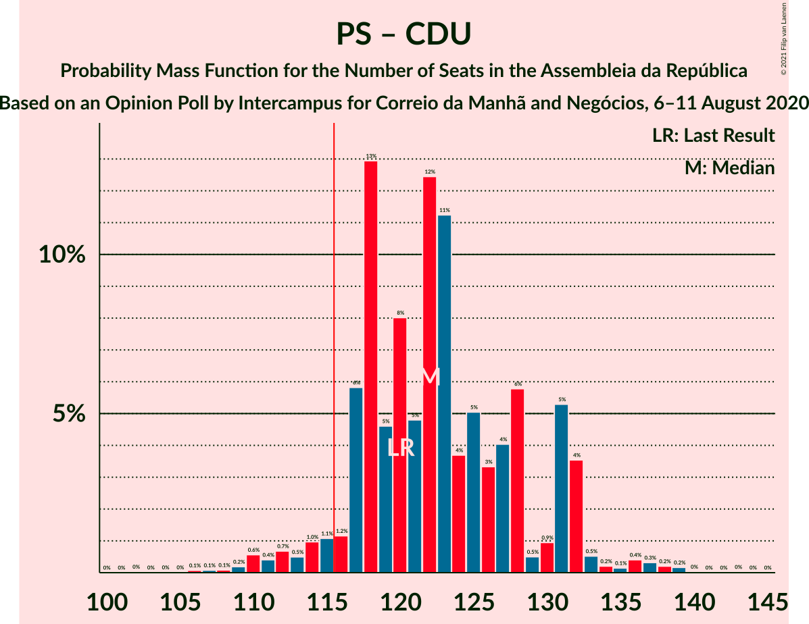

| Number of Seats | Probability | Accumulated | Special Marks |
|:---------------:|:-----------:|:-----------:|:-------------:|
| 102 | 0% | 100% |  |
| 103 | 0% | 99.9% |  |
| 104 | 0% | 99.9% |  |
| 105 | 0% | 99.9% |  |
| 106 | 0.1% | 99.9% |  |
| 107 | 0.1% | 99.8% |  |
| 108 | 0.1% | 99.8% |  |
| 109 | 0.2% | 99.7% |  |
| 110 | 0.6% | 99.5% |  |
| 111 | 0.4% | 98.9% |  |
| 112 | 0.7% | 98.5% |  |
| 113 | 0.5% | 98% |  |
| 114 | 1.0% | 97% |  |
| 115 | 1.1% | 96% |  |
| 116 | 1.2% | 95% | Majority |
| 117 | 6% | 94% |  |
| 118 | 13% | 88% |  |
| 119 | 5% | 75% |  |
| 120 | 8% | 71% | Last Result |
| 121 | 5% | 63% |  |
| 122 | 12% | 58% |  |
| 123 | 11% | 45% | Median |
| 124 | 4% | 34% |  |
| 125 | 5% | 31% |  |
| 126 | 3% | 25% |  |
| 127 | 4% | 22% |  |
| 128 | 6% | 18% |  |
| 129 | 0.5% | 12% |  |
| 130 | 0.9% | 12% |  |
| 131 | 5% | 11% |  |
| 132 | 4% | 6% |  |
| 133 | 0.5% | 2% |  |
| 134 | 0.2% | 2% |  |
| 135 | 0.1% | 1.3% |  |
| 136 | 0.4% | 1.2% |  |
| 137 | 0.3% | 0.8% |  |
| 138 | 0.2% | 0.5% |  |
| 139 | 0.2% | 0.3% |  |
| 140 | 0% | 0.1% |  |
| 141 | 0% | 0.1% |  |
| 142 | 0% | 0% |  |

### Partido Socialista

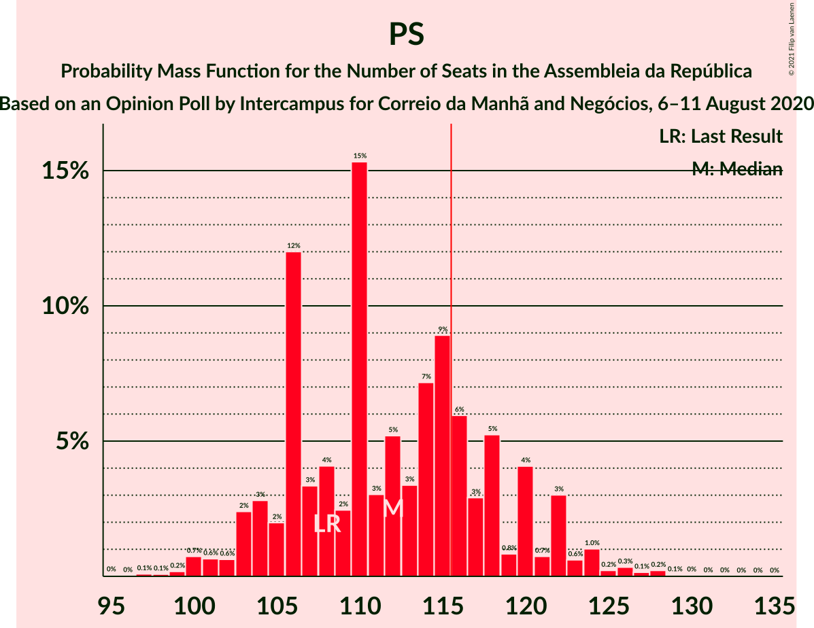

| Number of Seats | Probability | Accumulated | Special Marks |
|:---------------:|:-----------:|:-----------:|:-------------:|
| 95 | 0% | 100% |  |
| 96 | 0% | 99.9% |  |
| 97 | 0.1% | 99.9% |  |
| 98 | 0.1% | 99.8% |  |
| 99 | 0.2% | 99.7% |  |
| 100 | 0.7% | 99.5% |  |
| 101 | 0.6% | 98.8% |  |
| 102 | 0.6% | 98% |  |
| 103 | 2% | 98% |  |
| 104 | 3% | 95% |  |
| 105 | 2% | 92% |  |
| 106 | 12% | 90% |  |
| 107 | 3% | 78% |  |
| 108 | 4% | 75% | Last Result |
| 109 | 2% | 71% |  |
| 110 | 15% | 68% |  |
| 111 | 3% | 53% |  |
| 112 | 5% | 50% | Median |
| 113 | 3% | 45% |  |
| 114 | 7% | 42% |  |
| 115 | 9% | 34% |  |
| 116 | 6% | 25% | Majority |
| 117 | 3% | 19% |  |
| 118 | 5% | 17% |  |
| 119 | 0.8% | 11% |  |
| 120 | 4% | 11% |  |
| 121 | 0.7% | 6% |  |
| 122 | 3% | 6% |  |
| 123 | 0.6% | 3% |  |
| 124 | 1.0% | 2% |  |
| 125 | 0.2% | 1.1% |  |
| 126 | 0.3% | 0.8% |  |
| 127 | 0.1% | 0.5% |  |
| 128 | 0.2% | 0.3% |  |
| 129 | 0.1% | 0.1% |  |
| 130 | 0% | 0.1% |  |
| 131 | 0% | 0% |  |

### Partido Social Democrata – CDS–Partido Popular

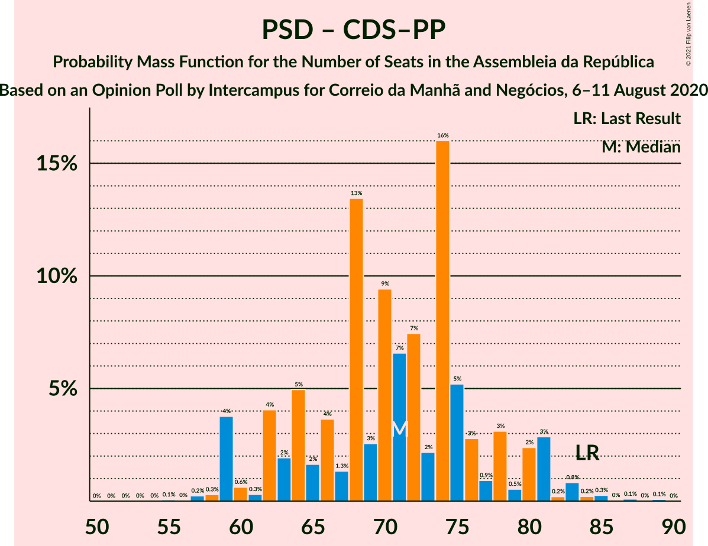

| Number of Seats | Probability | Accumulated | Special Marks |
|:---------------:|:-----------:|:-----------:|:-------------:|
| 55 | 0.1% | 100% |  |
| 56 | 0% | 99.9% |  |
| 57 | 0.2% | 99.9% |  |
| 58 | 0.3% | 99.6% |  |
| 59 | 4% | 99.4% |  |
| 60 | 0.6% | 96% |  |
| 61 | 0.3% | 95% |  |
| 62 | 4% | 95% |  |
| 63 | 2% | 91% |  |
| 64 | 5% | 89% |  |
| 65 | 2% | 84% |  |
| 66 | 4% | 82% |  |
| 67 | 1.3% | 78% |  |
| 68 | 13% | 77% |  |
| 69 | 3% | 64% |  |
| 70 | 9% | 61% |  |
| 71 | 7% | 52% |  |
| 72 | 7% | 45% | Median |
| 73 | 2% | 38% |  |
| 74 | 16% | 36% |  |
| 75 | 5% | 20% |  |
| 76 | 3% | 14% |  |
| 77 | 0.9% | 12% |  |
| 78 | 3% | 11% |  |
| 79 | 0.5% | 8% |  |
| 80 | 2% | 7% |  |
| 81 | 3% | 5% |  |
| 82 | 0.2% | 2% |  |
| 83 | 0.8% | 2% |  |
| 84 | 0.2% | 0.7% | Last Result |
| 85 | 0.3% | 0.5% |  |
| 86 | 0% | 0.3% |  |
| 87 | 0.1% | 0.2% |  |
| 88 | 0% | 0.1% |  |
| 89 | 0.1% | 0.1% |  |
| 90 | 0% | 0% |  |

## Technical Information

### Opinion Poll

+ **Polling firm:** Intercampus
+ **Commissioner(s):** Correio da Manhã and Negócios
+ **Fieldwork period:** 6–11 August 2020

### Calculations

+ **Sample size:** 601
+ **Simulations done:** 131,072
+ **Error estimate:** 2.30%

