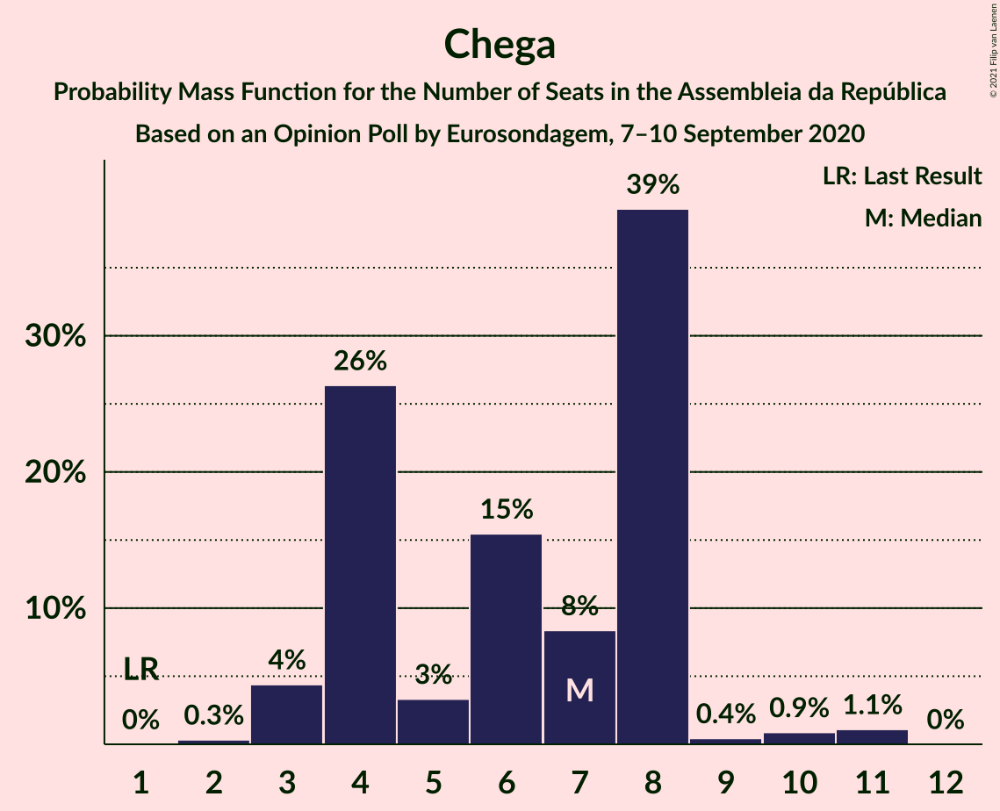

# Opinion Poll by Eurosondagem, 7–10 September 2020

<a href="#voting-intentions">Voting Intentions</a> | <a href="#seats">Seats</a> | <a href="#coalitions">Coalitions</a> | <a href="#technical-information">Technical Information</a>

## Voting Intentions

### Confidence Intervals

| Party | Last Result | Poll Result | 80% Confidence Interval | 90% Confidence Interval | 95% Confidence Interval | 99% Confidence Interval |
|:-----:|:-----------:|:-----------:|:-----------------------:|:-----------------------:|:-----------------------:|:-----------------------:|
| Partido Socialista | 36.4% | 38.5% | 36.5–40.4% |36.0–41.0% |35.5–41.5% |34.6–42.4% |
| Partido Social Democrata | 27.8% | 28.2% | 26.4–30.0% |25.9–30.6% |25.5–31.0% |24.7–31.9% |
| Bloco de Esquerda | 9.5% | 8.3% | 7.3–9.5% |7.0–9.9% |6.8–10.2% |6.3–10.8% |
| Coligação Democrática Unitária | 6.3% | 5.8% | 4.9–6.8% |4.7–7.1% |4.5–7.4% |4.1–7.9% |
| Chega | 1.3% | 4.5% | 3.8–5.5% |3.6–5.7% |3.4–6.0% |3.1–6.4% |
| Pessoas–Animais–Natureza | 3.3% | 3.3% | 2.7–4.2% |2.5–4.4% |2.4–4.6% |2.1–5.1% |
| CDS–Partido Popular | 4.2% | 2.5% | 2.0–3.3% |1.9–3.5% |1.7–3.7% |1.5–4.1% |
| Iniciativa Liberal | 1.3% | 1.0% | 0.7–1.5% |0.6–1.7% |0.5–1.8% |0.4–2.1% |

*Note:* The poll result column reflects the actual value used in the calculations. Published results may vary slightly, and in addition be rounded to fewer digits.

## Seats

### Confidence Intervals

| Party | Last Result | Median | 80% Confidence Interval | 90% Confidence Interval | 95% Confidence Interval | 99% Confidence Interval |
|:-----:|:-----------:|:------:|:-----------------------:|:-----------------------:|:-----------------------:|:-----------------------:|
| <a href="#partido-socialista">Partido Socialista</a> | 108 | 113 | 106–119 |104–119 |103–121 |100–122 |
| <a href="#partido-social-democrata">Partido Social Democrata</a> | 79 | 77 | 74–85 |73–86 |70–88 |69–90 |
| <a href="#bloco-de-esquerda">Bloco de Esquerda</a> | 19 | 17 | 15–19 |14–19 |13–20 |11–22 |
| <a href="#coligação-democrática-unitária">Coligação Democrática Unitária</a> | 12 | 10 | 7–14 |7–14 |6–15 |5–16 |
| <a href="#chega">Chega</a> | 1 | 7 | 4–8 |4–8 |3–8 |3–11 |
| <a href="#pessoas–animais–natureza">Pessoas–Animais–Natureza</a> | 4 | 3 | 2–5 |2–6 |2–6 |2–6 |
| <a href="#cds–partido-popular">CDS–Partido Popular</a> | 5 | 1 | 1–2 |1–2 |1–3 |0–4 |
| <a href="#iniciativa-liberal">Iniciativa Liberal</a> | 1 | 1 | 0–1 |0–1 |0–2 |0–3 |

### Partido Socialista

*For a full overview of the results for this party, see the [Partido Socialista](party-partidosocialista.html) page.*

| Number of Seats | Probability | Accumulated | Special Marks |
|:---------------:|:-----------:|:-----------:|:-------------:|
| 96 | 0.1% | 100% |  |
| 97 | 0% | 99.9% |  |
| 98 | 0.1% | 99.9% |  |
| 99 | 0.3% | 99.8% |  |
| 100 | 0.1% | 99.5% |  |
| 101 | 0.9% | 99.4% |  |
| 102 | 0.3% | 98% |  |
| 103 | 2% | 98% |  |
| 104 | 3% | 97% |  |
| 105 | 3% | 93% |  |
| 106 | 3% | 91% |  |
| 107 | 3% | 87% |  |
| 108 | 5% | 85% | Last Result |
| 109 | 3% | 79% |  |
| 110 | 8% | 76% |  |
| 111 | 8% | 68% |  |
| 112 | 6% | 60% |  |
| 113 | 15% | 54% | Median |
| 114 | 17% | 39% |  |
| 115 | 2% | 22% |  |
| 116 | 1.2% | 19% | Majority |
| 117 | 2% | 18% |  |
| 118 | 5% | 16% |  |
| 119 | 7% | 11% |  |
| 120 | 2% | 4% |  |
| 121 | 0.6% | 3% |  |
| 122 | 2% | 2% |  |
| 123 | 0% | 0.2% |  |
| 124 | 0% | 0.2% |  |
| 125 | 0.1% | 0.1% |  |
| 126 | 0% | 0.1% |  |
| 127 | 0% | 0% |  |

### Partido Social Democrata

*For a full overview of the results for this party, see the [Partido Social Democrata](party-partidosocialdemocrata.html) page.*

| Number of Seats | Probability | Accumulated | Special Marks |
|:---------------:|:-----------:|:-----------:|:-------------:|
| 63 | 0.1% | 100% |  |
| 64 | 0% | 99.9% |  |
| 65 | 0% | 99.9% |  |
| 66 | 0.1% | 99.9% |  |
| 67 | 0.1% | 99.7% |  |
| 68 | 0.1% | 99.6% |  |
| 69 | 0.3% | 99.5% |  |
| 70 | 2% | 99.2% |  |
| 71 | 0.9% | 97% |  |
| 72 | 0.6% | 96% |  |
| 73 | 2% | 95% |  |
| 74 | 8% | 93% |  |
| 75 | 10% | 85% |  |
| 76 | 10% | 75% |  |
| 77 | 26% | 65% | Median |
| 78 | 7% | 39% |  |
| 79 | 2% | 32% | Last Result |
| 80 | 5% | 30% |  |
| 81 | 4% | 25% |  |
| 82 | 4% | 21% |  |
| 83 | 4% | 17% |  |
| 84 | 1.4% | 13% |  |
| 85 | 3% | 12% |  |
| 86 | 4% | 9% |  |
| 87 | 1.0% | 5% |  |
| 88 | 3% | 4% |  |
| 89 | 0.2% | 0.9% |  |
| 90 | 0.4% | 0.6% |  |
| 91 | 0.1% | 0.3% |  |
| 92 | 0.1% | 0.2% |  |
| 93 | 0% | 0.1% |  |
| 94 | 0% | 0% |  |

### Bloco de Esquerda

*For a full overview of the results for this party, see the [Bloco de Esquerda](party-blocodeesquerda.html) page.*

| Number of Seats | Probability | Accumulated | Special Marks |
|:---------------:|:-----------:|:-----------:|:-------------:|
| 9 | 0.1% | 100% |  |
| 10 | 0.3% | 99.9% |  |
| 11 | 0.3% | 99.6% |  |
| 12 | 0.2% | 99.3% |  |
| 13 | 2% | 99.1% |  |
| 14 | 4% | 97% |  |
| 15 | 22% | 94% |  |
| 16 | 14% | 71% |  |
| 17 | 14% | 57% | Median |
| 18 | 32% | 43% |  |
| 19 | 6% | 10% | Last Result |
| 20 | 3% | 4% |  |
| 21 | 0.4% | 1.1% |  |
| 22 | 0.3% | 0.7% |  |
| 23 | 0.3% | 0.3% |  |
| 24 | 0% | 0% |  |

### Coligação Democrática Unitária

*For a full overview of the results for this party, see the [Coligação Democrática Unitária](party-coligaçãodemocráticaunitária.html) page.*

| Number of Seats | Probability | Accumulated | Special Marks |
|:---------------:|:-----------:|:-----------:|:-------------:|
| 5 | 0.6% | 100% |  |
| 6 | 4% | 99.4% |  |
| 7 | 16% | 96% |  |
| 8 | 10% | 79% |  |
| 9 | 19% | 69% |  |
| 10 | 5% | 51% | Median |
| 11 | 26% | 45% |  |
| 12 | 3% | 19% | Last Result |
| 13 | 3% | 16% |  |
| 14 | 10% | 13% |  |
| 15 | 1.0% | 3% |  |
| 16 | 2% | 2% |  |
| 17 | 0% | 0% |  |

### Chega

*For a full overview of the results for this party, see the [Chega](party-chega.html) page.*

| Number of Seats | Probability | Accumulated | Special Marks |
|:---------------:|:-----------:|:-----------:|:-------------:|
| 1 | 0% | 100% | Last Result |
| 2 | 0.3% | 100% |  |
| 3 | 4% | 99.7% |  |
| 4 | 26% | 95% |  |
| 5 | 3% | 69% |  |
| 6 | 15% | 66% |  |
| 7 | 8% | 50% | Median |
| 8 | 39% | 42% |  |
| 9 | 0.4% | 2% |  |
| 10 | 0.9% | 2% |  |
| 11 | 1.1% | 1.1% |  |
| 12 | 0% | 0% |  |

### Pessoas–Animais–Natureza

*For a full overview of the results for this party, see the [Pessoas–Animais–Natureza](party-pessoas–animais–natureza.html) page.*

| Number of Seats | Probability | Accumulated | Special Marks |
|:---------------:|:-----------:|:-----------:|:-------------:|
| 1 | 0.2% | 100% |  |
| 2 | 12% | 99.8% |  |
| 3 | 39% | 88% | Median |
| 4 | 32% | 48% | Last Result |
| 5 | 7% | 16% |  |
| 6 | 9% | 9% |  |
| 7 | 0% | 0.3% |  |
| 8 | 0.2% | 0.3% |  |
| 9 | 0% | 0.1% |  |
| 10 | 0% | 0% |  |

### CDS–Partido Popular

*For a full overview of the results for this party, see the [CDS–Partido Popular](party-cds–partidopopular.html) page.*

| Number of Seats | Probability | Accumulated | Special Marks |
|:---------------:|:-----------:|:-----------:|:-------------:|
| 0 | 2% | 100% |  |
| 1 | 52% | 98% | Median |
| 2 | 44% | 47% |  |
| 3 | 0.4% | 3% |  |
| 4 | 2% | 2% |  |
| 5 | 0.4% | 0.4% | Last Result |
| 6 | 0% | 0% |  |

### Iniciativa Liberal

*For a full overview of the results for this party, see the [Iniciativa Liberal](party-iniciativaliberal.html) page.*

| Number of Seats | Probability | Accumulated | Special Marks |
|:---------------:|:-----------:|:-----------:|:-------------:|
| 0 | 45% | 100% |  |
| 1 | 52% | 55% | Last Result, Median |
| 2 | 1.1% | 3% |  |
| 3 | 2% | 2% |  |
| 4 | 0% | 0% |  |

## Coalitions

### Confidence Intervals

| Coalition | Last Result | Median | Majority? | 80% Confidence Interval | 90% Confidence Interval | 95% Confidence Interval | 99% Confidence Interval |
|:---------:|:-----------:|:------:|:---------:|:-----------------------:|:-----------------------:|:-----------------------:|:-----------------------:|
| Partido Socialista – Bloco de Esquerda – Coligação Democrática Unitária | 139 | 140 | 100% | 133–143 | 131–146 | 131–150 | 126–151 |
| Partido Socialista – Bloco de Esquerda | 127 | 130 | 99.6% | 123–134 | 120–136 | 120–137 | 116–140 |
| Partido Socialista – Coligação Democrática Unitária | 120 | 122 | 93% | 116–127 | 115–129 | 114–132 | 110–134 |
| Partido Socialista | 108 | 113 | 19% | 106–119 | 104–119 | 103–121 | 100–122 |
| Partido Social Democrata – CDS–Partido Popular | 84 | 78 | 0% | 76–86 | 74–88 | 72–89 | 70–91 |

### Partido Socialista – Bloco de Esquerda – Coligação Democrática Unitária

| Number of Seats | Probability | Accumulated | Special Marks |
|:---------------:|:-----------:|:-----------:|:-------------:|
| 123 | 0.1% | 100% |  |
| 124 | 0.1% | 99.9% |  |
| 125 | 0.1% | 99.8% |  |
| 126 | 0.3% | 99.7% |  |
| 127 | 0.3% | 99.4% |  |
| 128 | 0.4% | 99.1% |  |
| 129 | 0.3% | 98.7% |  |
| 130 | 0.5% | 98% |  |
| 131 | 5% | 98% |  |
| 132 | 2% | 93% |  |
| 133 | 5% | 91% |  |
| 134 | 3% | 85% |  |
| 135 | 4% | 83% |  |
| 136 | 5% | 79% |  |
| 137 | 11% | 74% |  |
| 138 | 7% | 63% |  |
| 139 | 3% | 57% | Last Result |
| 140 | 19% | 54% | Median |
| 141 | 3% | 35% |  |
| 142 | 16% | 32% |  |
| 143 | 9% | 17% |  |
| 144 | 1.2% | 7% |  |
| 145 | 1.2% | 6% |  |
| 146 | 0.4% | 5% |  |
| 147 | 2% | 5% |  |
| 148 | 0.3% | 3% |  |
| 149 | 0.2% | 3% |  |
| 150 | 2% | 3% |  |
| 151 | 0.5% | 0.7% |  |
| 152 | 0.1% | 0.2% |  |
| 153 | 0.1% | 0.1% |  |
| 154 | 0% | 0% |  |

### Partido Socialista – Bloco de Esquerda

| Number of Seats | Probability | Accumulated | Special Marks |
|:---------------:|:-----------:|:-----------:|:-------------:|
| 113 | 0.2% | 100% |  |
| 114 | 0.1% | 99.8% |  |
| 115 | 0.1% | 99.7% |  |
| 116 | 0.2% | 99.6% | Majority |
| 117 | 0.1% | 99.4% |  |
| 118 | 1.1% | 99.2% |  |
| 119 | 0.4% | 98% |  |
| 120 | 3% | 98% |  |
| 121 | 0.7% | 95% |  |
| 122 | 1.1% | 94% |  |
| 123 | 6% | 93% |  |
| 124 | 4% | 87% |  |
| 125 | 3% | 83% |  |
| 126 | 12% | 80% |  |
| 127 | 6% | 68% | Last Result |
| 128 | 6% | 62% |  |
| 129 | 3% | 56% |  |
| 130 | 4% | 53% | Median |
| 131 | 21% | 49% |  |
| 132 | 11% | 28% |  |
| 133 | 1.1% | 17% |  |
| 134 | 7% | 16% |  |
| 135 | 1.5% | 8% |  |
| 136 | 3% | 7% |  |
| 137 | 1.0% | 3% |  |
| 138 | 1.1% | 2% |  |
| 139 | 0.2% | 1.2% |  |
| 140 | 0.8% | 1.0% |  |
| 141 | 0% | 0.1% |  |
| 142 | 0% | 0.1% |  |
| 143 | 0.1% | 0.1% |  |
| 144 | 0% | 0% |  |

### Partido Socialista – Coligação Democrática Unitária

| Number of Seats | Probability | Accumulated | Special Marks |
|:---------------:|:-----------:|:-----------:|:-------------:|
| 106 | 0% | 100% |  |
| 107 | 0% | 99.9% |  |
| 108 | 0.1% | 99.9% |  |
| 109 | 0.2% | 99.8% |  |
| 110 | 0.2% | 99.6% |  |
| 111 | 0.4% | 99.4% |  |
| 112 | 0.4% | 99.0% |  |
| 113 | 0.9% | 98.6% |  |
| 114 | 1.1% | 98% |  |
| 115 | 3% | 97% |  |
| 116 | 4% | 93% | Majority |
| 117 | 6% | 89% |  |
| 118 | 6% | 83% |  |
| 119 | 4% | 77% |  |
| 120 | 7% | 73% | Last Result |
| 121 | 1.1% | 67% |  |
| 122 | 18% | 65% |  |
| 123 | 8% | 47% | Median |
| 124 | 7% | 39% |  |
| 125 | 17% | 32% |  |
| 126 | 2% | 16% |  |
| 127 | 6% | 13% |  |
| 128 | 0.8% | 7% |  |
| 129 | 2% | 7% |  |
| 130 | 0.8% | 4% |  |
| 131 | 0.8% | 3% |  |
| 132 | 2% | 3% |  |
| 133 | 0.1% | 0.6% |  |
| 134 | 0.4% | 0.5% |  |
| 135 | 0.1% | 0.2% |  |
| 136 | 0% | 0.1% |  |
| 137 | 0% | 0.1% |  |
| 138 | 0% | 0.1% |  |
| 139 | 0% | 0% |  |

### Partido Socialista

| Number of Seats | Probability | Accumulated | Special Marks |
|:---------------:|:-----------:|:-----------:|:-------------:|
| 96 | 0.1% | 100% |  |
| 97 | 0% | 99.9% |  |
| 98 | 0.1% | 99.9% |  |
| 99 | 0.3% | 99.8% |  |
| 100 | 0.1% | 99.5% |  |
| 101 | 0.9% | 99.4% |  |
| 102 | 0.3% | 98% |  |
| 103 | 2% | 98% |  |
| 104 | 3% | 97% |  |
| 105 | 3% | 93% |  |
| 106 | 3% | 91% |  |
| 107 | 3% | 87% |  |
| 108 | 5% | 85% | Last Result |
| 109 | 3% | 79% |  |
| 110 | 8% | 76% |  |
| 111 | 8% | 68% |  |
| 112 | 6% | 60% |  |
| 113 | 15% | 54% | Median |
| 114 | 17% | 39% |  |
| 115 | 2% | 22% |  |
| 116 | 1.2% | 19% | Majority |
| 117 | 2% | 18% |  |
| 118 | 5% | 16% |  |
| 119 | 7% | 11% |  |
| 120 | 2% | 4% |  |
| 121 | 0.6% | 3% |  |
| 122 | 2% | 2% |  |
| 123 | 0% | 0.2% |  |
| 124 | 0% | 0.2% |  |
| 125 | 0.1% | 0.1% |  |
| 126 | 0% | 0.1% |  |
| 127 | 0% | 0% |  |

### Partido Social Democrata – CDS–Partido Popular

| Number of Seats | Probability | Accumulated | Special Marks |
|:---------------:|:-----------:|:-----------:|:-------------:|
| 64 | 0.1% | 100% |  |
| 65 | 0% | 99.9% |  |
| 66 | 0% | 99.9% |  |
| 67 | 0.1% | 99.9% |  |
| 68 | 0.1% | 99.8% |  |
| 69 | 0.1% | 99.7% |  |
| 70 | 0.1% | 99.5% |  |
| 71 | 0.6% | 99.4% |  |
| 72 | 2% | 98.8% |  |
| 73 | 1.0% | 97% |  |
| 74 | 1.0% | 96% |  |
| 75 | 1.2% | 95% |  |
| 76 | 11% | 93% |  |
| 77 | 17% | 83% |  |
| 78 | 17% | 66% | Median |
| 79 | 11% | 49% |  |
| 80 | 6% | 38% |  |
| 81 | 4% | 31% |  |
| 82 | 3% | 27% |  |
| 83 | 2% | 23% |  |
| 84 | 7% | 21% | Last Result |
| 85 | 2% | 14% |  |
| 86 | 3% | 12% |  |
| 87 | 3% | 9% |  |
| 88 | 2% | 6% |  |
| 89 | 3% | 4% |  |
| 90 | 0.2% | 1.0% |  |
| 91 | 0.5% | 0.8% |  |
| 92 | 0.1% | 0.3% |  |
| 93 | 0.1% | 0.3% |  |
| 94 | 0% | 0.1% |  |
| 95 | 0% | 0.1% |  |
| 96 | 0% | 0.1% |  |
| 97 | 0% | 0% |  |

## Technical Information

### Opinion Poll

+ **Polling firm:** Eurosondagem
+ **Commissioner(s):** —
+ **Fieldwork period:** 7–10 September 2020

### Calculations

+ **Sample size:** 1022
+ **Simulations done:** 131,072
+ **Error estimate:** 0.78%

