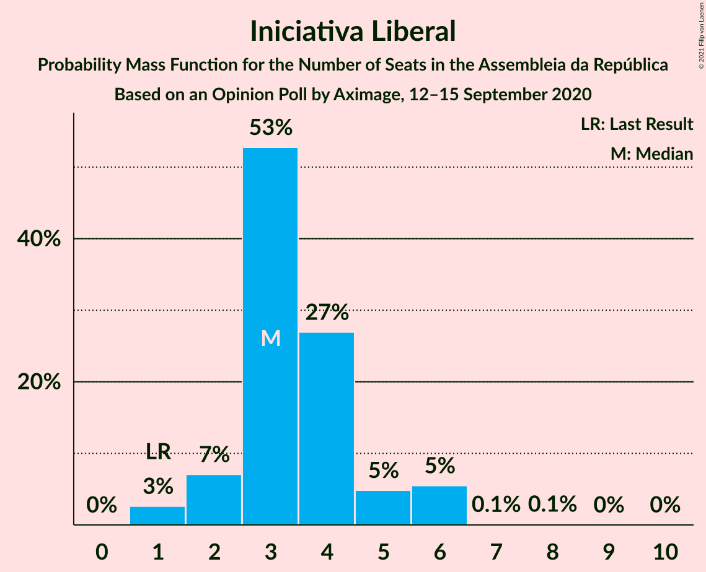

# Opinion Poll by Aximage, 12–15 September 2020

<a href="#voting-intentions">Voting Intentions</a> | <a href="#seats">Seats</a> | <a href="#coalitions">Coalitions</a> | <a href="#technical-information">Technical Information</a>

## Voting Intentions

### Confidence Intervals

| Party | Last Result | Poll Result | 80% Confidence Interval | 90% Confidence Interval | 95% Confidence Interval | 99% Confidence Interval |
|:-----:|:-----------:|:-----------:|:-----------------------:|:-----------------------:|:-----------------------:|:-----------------------:|
| Partido Socialista | 36.4% | 37.6% | 35.2–40.2% |34.5–41.0% |33.9–41.6% |32.7–42.8% |
| Partido Social Democrata | 27.8% | 23.9% | 21.7–26.2% |21.2–26.9% |20.6–27.5% |19.7–28.6% |
| Bloco de Esquerda | 9.5% | 8.3% | 7.0–9.9% |6.6–10.4% |6.3–10.8% |5.8–11.6% |
| Chega | 1.3% | 6.8% | 5.6–8.3% |5.3–8.7% |5.0–9.1% |4.5–9.9% |
| Coligação Democrática Unitária | 6.3% | 5.6% | 4.6–7.0% |4.3–7.4% |4.1–7.8% |3.6–8.5% |
| Pessoas–Animais–Natureza | 3.3% | 4.8% | 3.9–6.1% |3.6–6.5% |3.4–6.8% |3.0–7.5% |
| Iniciativa Liberal | 1.3% | 2.7% | 2.0–3.7% |1.8–4.0% |1.6–4.3% |1.4–4.8% |
| CDS–Partido Popular | 4.2% | 1.2% | 0.8–2.0% |0.7–2.2% |0.6–2.4% |0.4–2.8% |
| LIVRE | 1.1% | 1.2% | 0.8–2.0% |0.7–2.2% |0.6–2.4% |0.4–2.8% |

*Note:* The poll result column reflects the actual value used in the calculations. Published results may vary slightly, and in addition be rounded to fewer digits.

## Seats

### Confidence Intervals

| Party | Last Result | Median | 80% Confidence Interval | 90% Confidence Interval | 95% Confidence Interval | 99% Confidence Interval |
|:-----:|:-----------:|:------:|:-----------------------:|:-----------------------:|:-----------------------:|:-----------------------:|
| <a href="#partido-socialista">Partido Socialista</a> | 108 | 114 | 106–120 |104–124 |102–129 |99–129 |
| <a href="#partido-social-democrata">Partido Social Democrata</a> | 79 | 66 | 61–73 |56–76 |55–76 |54–81 |
| <a href="#bloco-de-esquerda">Bloco de Esquerda</a> | 19 | 17 | 12–21 |11–23 |11–23 |10–25 |
| <a href="#chega">Chega</a> | 1 | 11 | 8–14 |8–14 |8–15 |6–20 |
| <a href="#coligação-democrática-unitária">Coligação Democrática Unitária</a> | 12 | 9 | 6–14 |6–14 |5–16 |5–18 |
| <a href="#pessoas–animais–natureza">Pessoas–Animais–Natureza</a> | 4 | 8 | 4–11 |4–11 |4–12 |3–13 |
| <a href="#iniciativa-liberal">Iniciativa Liberal</a> | 1 | 3 | 3–5 |2–6 |1–6 |1–6 |
| <a href="#cds–partido-popular">CDS–Partido Popular</a> | 5 | 0 | 0–1 |0–1 |0–1 |0–2 |
| <a href="#livre">LIVRE</a> | 1 | 1 | 0–2 |0–2 |0–3 |0–3 |

### Partido Socialista

*For a full overview of the results for this party, see the [Partido Socialista](party-partidosocialista.html) page.*

| Number of Seats | Probability | Accumulated | Special Marks |
|:---------------:|:-----------:|:-----------:|:-------------:|
| 93 | 0% | 100% |  |
| 94 | 0% | 99.9% |  |
| 95 | 0.1% | 99.9% |  |
| 96 | 0% | 99.8% |  |
| 97 | 0% | 99.8% |  |
| 98 | 0.1% | 99.7% |  |
| 99 | 0.4% | 99.6% |  |
| 100 | 0.1% | 99.3% |  |
| 101 | 0.9% | 99.2% |  |
| 102 | 1.5% | 98% |  |
| 103 | 1.2% | 97% |  |
| 104 | 3% | 96% |  |
| 105 | 1.4% | 93% |  |
| 106 | 2% | 91% |  |
| 107 | 4% | 90% |  |
| 108 | 4% | 86% | Last Result |
| 109 | 3% | 81% |  |
| 110 | 10% | 78% |  |
| 111 | 4% | 68% |  |
| 112 | 12% | 63% |  |
| 113 | 2% | 52% |  |
| 114 | 6% | 50% | Median |
| 115 | 3% | 44% |  |
| 116 | 10% | 41% | Majority |
| 117 | 2% | 31% |  |
| 118 | 4% | 29% |  |
| 119 | 0.6% | 25% |  |
| 120 | 17% | 25% |  |
| 121 | 0.2% | 8% |  |
| 122 | 2% | 8% |  |
| 123 | 0.6% | 6% |  |
| 124 | 0.6% | 6% |  |
| 125 | 0.2% | 5% |  |
| 126 | 2% | 5% |  |
| 127 | 0.3% | 3% |  |
| 128 | 0.1% | 3% |  |
| 129 | 3% | 3% |  |
| 130 | 0% | 0.1% |  |
| 131 | 0% | 0.1% |  |
| 132 | 0% | 0.1% |  |
| 133 | 0% | 0% |  |

### Partido Social Democrata

*For a full overview of the results for this party, see the [Partido Social Democrata](party-partidosocialdemocrata.html) page.*

| Number of Seats | Probability | Accumulated | Special Marks |
|:---------------:|:-----------:|:-----------:|:-------------:|
| 52 | 0.1% | 100% |  |
| 53 | 0.2% | 99.9% |  |
| 54 | 0.4% | 99.7% |  |
| 55 | 3% | 99.3% |  |
| 56 | 2% | 96% |  |
| 57 | 2% | 95% |  |
| 58 | 0.1% | 93% |  |
| 59 | 0.1% | 93% |  |
| 60 | 0.1% | 92% |  |
| 61 | 8% | 92% |  |
| 62 | 0.7% | 85% |  |
| 63 | 9% | 84% |  |
| 64 | 9% | 74% |  |
| 65 | 12% | 66% |  |
| 66 | 14% | 54% | Median |
| 67 | 5% | 40% |  |
| 68 | 6% | 35% |  |
| 69 | 7% | 29% |  |
| 70 | 4% | 21% |  |
| 71 | 1.1% | 18% |  |
| 72 | 6% | 17% |  |
| 73 | 1.3% | 11% |  |
| 74 | 3% | 10% |  |
| 75 | 0.4% | 6% |  |
| 76 | 4% | 6% |  |
| 77 | 0.3% | 2% |  |
| 78 | 0.4% | 2% |  |
| 79 | 0.1% | 2% | Last Result |
| 80 | 0.6% | 1.4% |  |
| 81 | 0.5% | 0.9% |  |
| 82 | 0.3% | 0.4% |  |
| 83 | 0% | 0.1% |  |
| 84 | 0% | 0% |  |

### Bloco de Esquerda

*For a full overview of the results for this party, see the [Bloco de Esquerda](party-blocodeesquerda.html) page.*

| Number of Seats | Probability | Accumulated | Special Marks |
|:---------------:|:-----------:|:-----------:|:-------------:|
| 7 | 0.4% | 100% |  |
| 8 | 0% | 99.6% |  |
| 9 | 0% | 99.6% |  |
| 10 | 2% | 99.6% |  |
| 11 | 8% | 98% |  |
| 12 | 2% | 90% |  |
| 13 | 1.0% | 88% |  |
| 14 | 7% | 87% |  |
| 15 | 8% | 80% |  |
| 16 | 17% | 72% |  |
| 17 | 6% | 55% | Median |
| 18 | 22% | 49% |  |
| 19 | 5% | 27% | Last Result |
| 20 | 10% | 22% |  |
| 21 | 4% | 13% |  |
| 22 | 2% | 9% |  |
| 23 | 6% | 7% |  |
| 24 | 0.1% | 0.7% |  |
| 25 | 0.1% | 0.6% |  |
| 26 | 0.1% | 0.5% |  |
| 27 | 0.1% | 0.4% |  |
| 28 | 0% | 0.3% |  |
| 29 | 0.3% | 0.3% |  |
| 30 | 0% | 0% |  |

### Chega

*For a full overview of the results for this party, see the [Chega](party-chega.html) page.*

| Number of Seats | Probability | Accumulated | Special Marks |
|:---------------:|:-----------:|:-----------:|:-------------:|
| 1 | 0% | 100% | Last Result |
| 2 | 0% | 100% |  |
| 3 | 0% | 100% |  |
| 4 | 0.1% | 100% |  |
| 5 | 0.1% | 99.9% |  |
| 6 | 0.9% | 99.8% |  |
| 7 | 0.1% | 99.0% |  |
| 8 | 12% | 98.9% |  |
| 9 | 2% | 87% |  |
| 10 | 22% | 84% |  |
| 11 | 40% | 62% | Median |
| 12 | 4% | 22% |  |
| 13 | 5% | 18% |  |
| 14 | 10% | 13% |  |
| 15 | 0.3% | 3% |  |
| 16 | 0.2% | 2% |  |
| 17 | 0.4% | 2% |  |
| 18 | 1.2% | 2% |  |
| 19 | 0.1% | 0.8% |  |
| 20 | 0.3% | 0.7% |  |
| 21 | 0.2% | 0.4% |  |
| 22 | 0% | 0.1% |  |
| 23 | 0% | 0.1% |  |
| 24 | 0.1% | 0.1% |  |
| 25 | 0% | 0% |  |

### Coligação Democrática Unitária

*For a full overview of the results for this party, see the [Coligação Democrática Unitária](party-coligaçãodemocráticaunitária.html) page.*

| Number of Seats | Probability | Accumulated | Special Marks |
|:---------------:|:-----------:|:-----------:|:-------------:|
| 4 | 0.1% | 100% |  |
| 5 | 4% | 99.8% |  |
| 6 | 6% | 96% |  |
| 7 | 20% | 89% |  |
| 8 | 9% | 69% |  |
| 9 | 11% | 60% | Median |
| 10 | 11% | 49% |  |
| 11 | 5% | 38% |  |
| 12 | 2% | 33% | Last Result |
| 13 | 20% | 31% |  |
| 14 | 7% | 11% |  |
| 15 | 0.6% | 4% |  |
| 16 | 2% | 3% |  |
| 17 | 0.4% | 1.2% |  |
| 18 | 0.7% | 0.8% |  |
| 19 | 0.1% | 0.1% |  |
| 20 | 0% | 0% |  |

### Pessoas–Animais–Natureza

*For a full overview of the results for this party, see the [Pessoas–Animais–Natureza](party-pessoas–animais–natureza.html) page.*

| Number of Seats | Probability | Accumulated | Special Marks |
|:---------------:|:-----------:|:-----------:|:-------------:|
| 2 | 0.4% | 100% |  |
| 3 | 1.2% | 99.6% |  |
| 4 | 9% | 98% | Last Result |
| 5 | 5% | 90% |  |
| 6 | 15% | 84% |  |
| 7 | 9% | 69% |  |
| 8 | 32% | 61% | Median |
| 9 | 6% | 29% |  |
| 10 | 7% | 23% |  |
| 11 | 12% | 16% |  |
| 12 | 3% | 4% |  |
| 13 | 0.5% | 1.0% |  |
| 14 | 0.2% | 0.5% |  |
| 15 | 0.2% | 0.3% |  |
| 16 | 0% | 0% |  |

### Iniciativa Liberal

*For a full overview of the results for this party, see the [Iniciativa Liberal](party-iniciativaliberal.html) page.*

| Number of Seats | Probability | Accumulated | Special Marks |
|:---------------:|:-----------:|:-----------:|:-------------:|
| 1 | 3% | 100% | Last Result |
| 2 | 7% | 97% |  |
| 3 | 53% | 90% | Median |
| 4 | 27% | 38% |  |
| 5 | 5% | 11% |  |
| 6 | 5% | 6% |  |
| 7 | 0.1% | 0.3% |  |
| 8 | 0.1% | 0.2% |  |
| 9 | 0% | 0.1% |  |
| 10 | 0% | 0% |  |

### CDS–Partido Popular

*For a full overview of the results for this party, see the [CDS–Partido Popular](party-cds–partidopopular.html) page.*

| Number of Seats | Probability | Accumulated | Special Marks |
|:---------------:|:-----------:|:-----------:|:-------------:|
| 0 | 80% | 100% | Median |
| 1 | 19% | 20% |  |
| 2 | 2% | 2% |  |
| 3 | 0.1% | 0.1% |  |
| 4 | 0% | 0% |  |
| 5 | 0% | 0% | Last Result |

### LIVRE

*For a full overview of the results for this party, see the [LIVRE](party-livre.html) page.*

| Number of Seats | Probability | Accumulated | Special Marks |
|:---------------:|:-----------:|:-----------:|:-------------:|
| 0 | 38% | 100% |  |
| 1 | 51% | 62% | Last Result, Median |
| 2 | 7% | 11% |  |
| 3 | 4% | 4% |  |
| 4 | 0.1% | 0.1% |  |
| 5 | 0% | 0% |  |

## Coalitions

### Confidence Intervals

| Coalition | Last Result | Median | Majority? | 80% Confidence Interval | 90% Confidence Interval | 95% Confidence Interval | 99% Confidence Interval |
|:---------:|:-----------:|:------:|:---------:|:-----------------------:|:-----------------------:|:-----------------------:|:-----------------------:|
| Partido Socialista – Bloco de Esquerda – Coligação Democrática Unitária | 139 | 140 | 100% | 133–147 | 132–150 | 128–151 | 122–152 |
| Partido Socialista – Bloco de Esquerda | 127 | 131 | 99.1% | 122–137 | 122–141 | 118–146 | 114–146 |
| Partido Socialista – Coligação Democrática Unitária | 120 | 124 | 92% | 117–133 | 114–133 | 112–134 | 106–136 |
| Partido Socialista | 108 | 114 | 41% | 106–120 | 104–124 | 102–129 | 99–129 |
| Partido Social Democrata – CDS–Partido Popular | 84 | 66 | 0% | 61–74 | 56–76 | 55–76 | 54–81 |

### Partido Socialista – Bloco de Esquerda – Coligação Democrática Unitária

| Number of Seats | Probability | Accumulated | Special Marks |
|:---------------:|:-----------:|:-----------:|:-------------:|
| 119 | 0.1% | 100% |  |
| 120 | 0% | 99.9% |  |
| 121 | 0.3% | 99.8% |  |
| 122 | 0% | 99.5% |  |
| 123 | 0% | 99.5% |  |
| 124 | 0.2% | 99.4% |  |
| 125 | 0.9% | 99.2% |  |
| 126 | 0.2% | 98% |  |
| 127 | 0.2% | 98% |  |
| 128 | 0.4% | 98% |  |
| 129 | 0.6% | 97% |  |
| 130 | 0.3% | 97% |  |
| 131 | 0.4% | 97% |  |
| 132 | 5% | 96% |  |
| 133 | 1.5% | 91% |  |
| 134 | 0.5% | 90% |  |
| 135 | 4% | 89% |  |
| 136 | 4% | 85% |  |
| 137 | 4% | 81% |  |
| 138 | 6% | 77% |  |
| 139 | 12% | 71% | Last Result |
| 140 | 10% | 59% | Median |
| 141 | 1.5% | 49% |  |
| 142 | 0.1% | 48% |  |
| 143 | 19% | 47% |  |
| 144 | 11% | 28% |  |
| 145 | 3% | 18% |  |
| 146 | 3% | 15% |  |
| 147 | 6% | 13% |  |
| 148 | 0.8% | 7% |  |
| 149 | 0.4% | 6% |  |
| 150 | 2% | 6% |  |
| 151 | 3% | 4% |  |
| 152 | 0.4% | 0.8% |  |
| 153 | 0.1% | 0.4% |  |
| 154 | 0.2% | 0.3% |  |
| 155 | 0% | 0.1% |  |
| 156 | 0% | 0.1% |  |
| 157 | 0% | 0.1% |  |
| 158 | 0% | 0% |  |

### Partido Socialista – Bloco de Esquerda

| Number of Seats | Probability | Accumulated | Special Marks |
|:---------------:|:-----------:|:-----------:|:-------------:|
| 111 | 0.1% | 100% |  |
| 112 | 0.1% | 99.8% |  |
| 113 | 0.1% | 99.7% |  |
| 114 | 0.4% | 99.7% |  |
| 115 | 0.3% | 99.3% |  |
| 116 | 0.1% | 99.1% | Majority |
| 117 | 0.2% | 99.0% |  |
| 118 | 2% | 98.7% |  |
| 119 | 1.0% | 97% |  |
| 120 | 0.6% | 96% |  |
| 121 | 0.4% | 95% |  |
| 122 | 5% | 95% |  |
| 123 | 2% | 90% |  |
| 124 | 2% | 87% |  |
| 125 | 6% | 85% |  |
| 126 | 2% | 79% |  |
| 127 | 1.5% | 77% | Last Result |
| 128 | 0.8% | 75% |  |
| 129 | 3% | 75% |  |
| 130 | 19% | 72% |  |
| 131 | 13% | 53% | Median |
| 132 | 7% | 39% |  |
| 133 | 5% | 32% |  |
| 134 | 2% | 27% |  |
| 135 | 0.6% | 26% |  |
| 136 | 12% | 25% |  |
| 137 | 6% | 13% |  |
| 138 | 0.7% | 7% |  |
| 139 | 1.0% | 7% |  |
| 140 | 0.2% | 6% |  |
| 141 | 0.6% | 5% |  |
| 142 | 0.1% | 5% |  |
| 143 | 0.2% | 5% |  |
| 144 | 2% | 4% |  |
| 145 | 0% | 3% |  |
| 146 | 3% | 3% |  |
| 147 | 0% | 0% |  |

### Partido Socialista – Coligação Democrática Unitária

| Number of Seats | Probability | Accumulated | Special Marks |
|:---------------:|:-----------:|:-----------:|:-------------:|
| 103 | 0.1% | 100% |  |
| 104 | 0% | 99.8% |  |
| 105 | 0% | 99.8% |  |
| 106 | 0.4% | 99.8% |  |
| 107 | 0.1% | 99.4% |  |
| 108 | 0.4% | 99.3% |  |
| 109 | 0.7% | 99.0% |  |
| 110 | 0.1% | 98% |  |
| 111 | 0.7% | 98% |  |
| 112 | 0.1% | 98% |  |
| 113 | 0.5% | 97% |  |
| 114 | 4% | 97% |  |
| 115 | 1.4% | 93% |  |
| 116 | 0.6% | 92% | Majority |
| 117 | 2% | 91% |  |
| 118 | 5% | 89% |  |
| 119 | 9% | 84% |  |
| 120 | 5% | 75% | Last Result |
| 121 | 4% | 70% |  |
| 122 | 2% | 66% |  |
| 123 | 9% | 64% | Median |
| 124 | 11% | 55% |  |
| 125 | 15% | 44% |  |
| 126 | 2% | 29% |  |
| 127 | 8% | 27% |  |
| 128 | 2% | 19% |  |
| 129 | 1.1% | 17% |  |
| 130 | 1.0% | 16% |  |
| 131 | 0.6% | 15% |  |
| 132 | 1.5% | 14% |  |
| 133 | 9% | 13% |  |
| 134 | 3% | 4% |  |
| 135 | 0.3% | 1.1% |  |
| 136 | 0.3% | 0.8% |  |
| 137 | 0% | 0.5% |  |
| 138 | 0% | 0.5% |  |
| 139 | 0% | 0.4% |  |
| 140 | 0.3% | 0.4% |  |
| 141 | 0% | 0.1% |  |
| 142 | 0% | 0% |  |

### Partido Socialista

| Number of Seats | Probability | Accumulated | Special Marks |
|:---------------:|:-----------:|:-----------:|:-------------:|
| 93 | 0% | 100% |  |
| 94 | 0% | 99.9% |  |
| 95 | 0.1% | 99.9% |  |
| 96 | 0% | 99.8% |  |
| 97 | 0% | 99.8% |  |
| 98 | 0.1% | 99.7% |  |
| 99 | 0.4% | 99.6% |  |
| 100 | 0.1% | 99.3% |  |
| 101 | 0.9% | 99.2% |  |
| 102 | 1.5% | 98% |  |
| 103 | 1.2% | 97% |  |
| 104 | 3% | 96% |  |
| 105 | 1.4% | 93% |  |
| 106 | 2% | 91% |  |
| 107 | 4% | 90% |  |
| 108 | 4% | 86% | Last Result |
| 109 | 3% | 81% |  |
| 110 | 10% | 78% |  |
| 111 | 4% | 68% |  |
| 112 | 12% | 63% |  |
| 113 | 2% | 52% |  |
| 114 | 6% | 50% | Median |
| 115 | 3% | 44% |  |
| 116 | 10% | 41% | Majority |
| 117 | 2% | 31% |  |
| 118 | 4% | 29% |  |
| 119 | 0.6% | 25% |  |
| 120 | 17% | 25% |  |
| 121 | 0.2% | 8% |  |
| 122 | 2% | 8% |  |
| 123 | 0.6% | 6% |  |
| 124 | 0.6% | 6% |  |
| 125 | 0.2% | 5% |  |
| 126 | 2% | 5% |  |
| 127 | 0.3% | 3% |  |
| 128 | 0.1% | 3% |  |
| 129 | 3% | 3% |  |
| 130 | 0% | 0.1% |  |
| 131 | 0% | 0.1% |  |
| 132 | 0% | 0.1% |  |
| 133 | 0% | 0% |  |

### Partido Social Democrata – CDS–Partido Popular

| Number of Seats | Probability | Accumulated | Special Marks |
|:---------------:|:-----------:|:-----------:|:-------------:|
| 52 | 0% | 100% |  |
| 53 | 0.2% | 99.9% |  |
| 54 | 0.3% | 99.7% |  |
| 55 | 3% | 99.4% |  |
| 56 | 2% | 96% |  |
| 57 | 2% | 95% |  |
| 58 | 0.2% | 93% |  |
| 59 | 0.1% | 93% |  |
| 60 | 0.1% | 92% |  |
| 61 | 8% | 92% |  |
| 62 | 0.7% | 85% |  |
| 63 | 9% | 84% |  |
| 64 | 2% | 75% |  |
| 65 | 18% | 74% |  |
| 66 | 13% | 55% | Median |
| 67 | 8% | 42% |  |
| 68 | 5% | 35% |  |
| 69 | 7% | 30% |  |
| 70 | 4% | 23% |  |
| 71 | 2% | 18% |  |
| 72 | 5% | 17% |  |
| 73 | 1.2% | 12% |  |
| 74 | 1.1% | 10% |  |
| 75 | 3% | 9% |  |
| 76 | 4% | 6% |  |
| 77 | 0.2% | 2% |  |
| 78 | 0.5% | 2% |  |
| 79 | 0.1% | 2% |  |
| 80 | 0.6% | 2% |  |
| 81 | 0.4% | 0.9% |  |
| 82 | 0.4% | 0.5% |  |
| 83 | 0% | 0.1% |  |
| 84 | 0% | 0.1% | Last Result |
| 85 | 0% | 0% |  |

## Technical Information

### Opinion Poll

+ **Polling firm:** Aximage
+ **Commissioner(s):** —
+ **Fieldwork period:** 12–15 September 2020

### Calculations

+ **Sample size:** 603
+ **Simulations done:** 131,072
+ **Error estimate:** 2.09%

