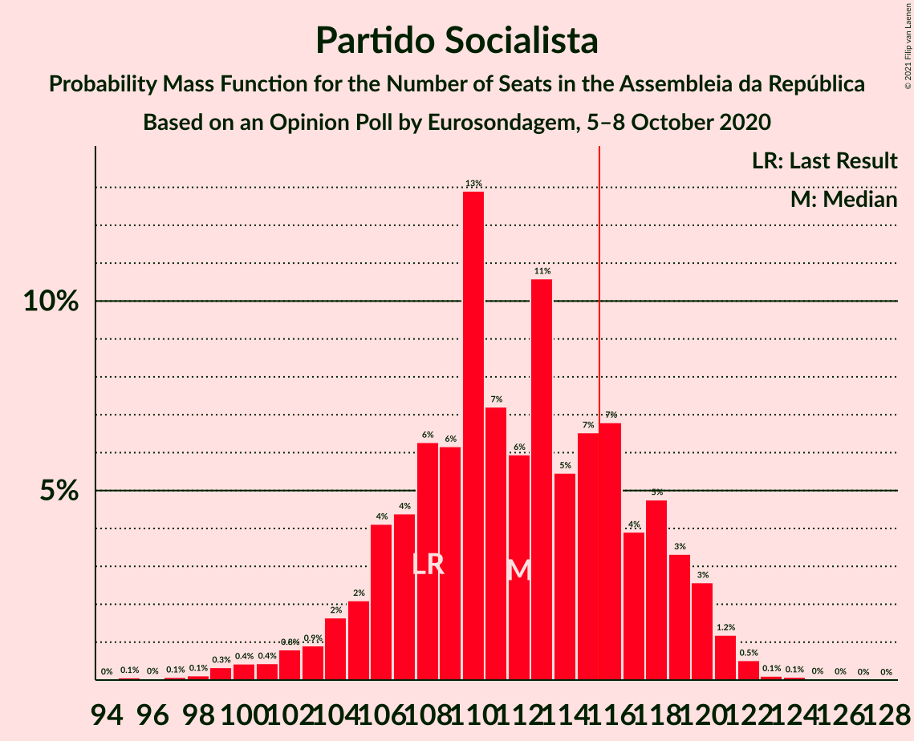
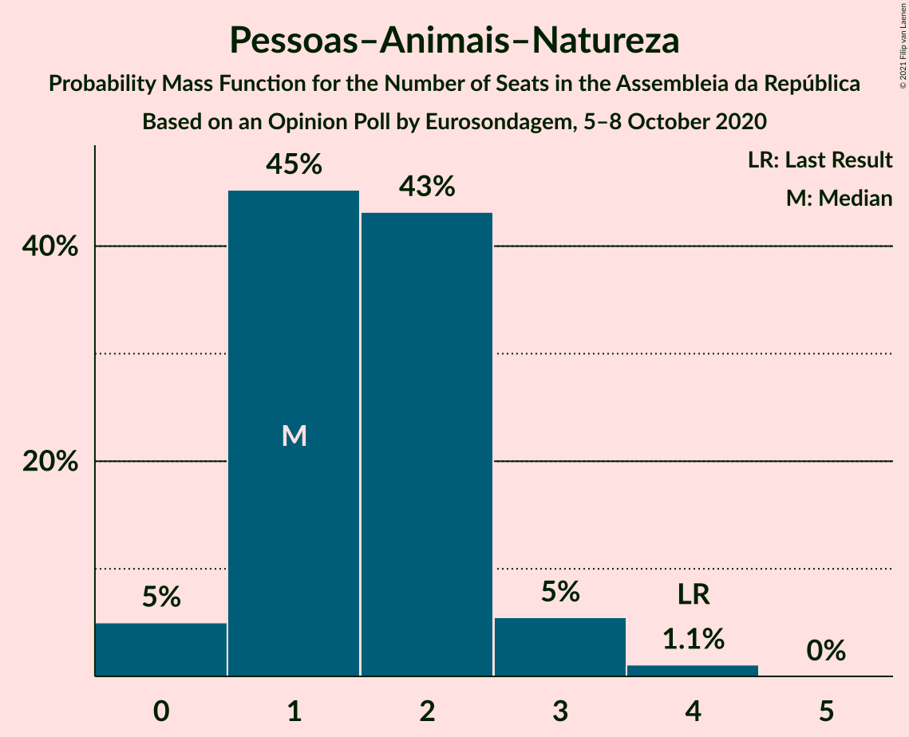
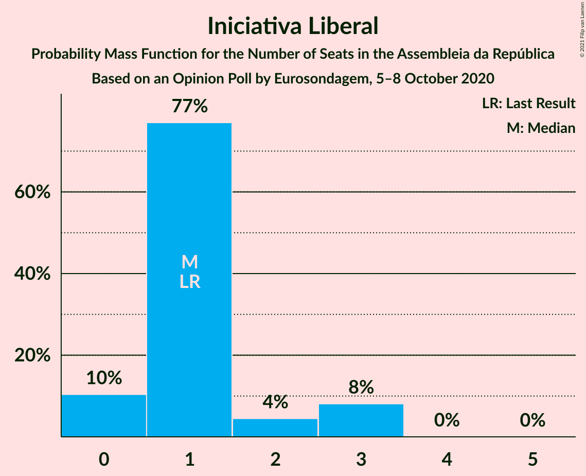
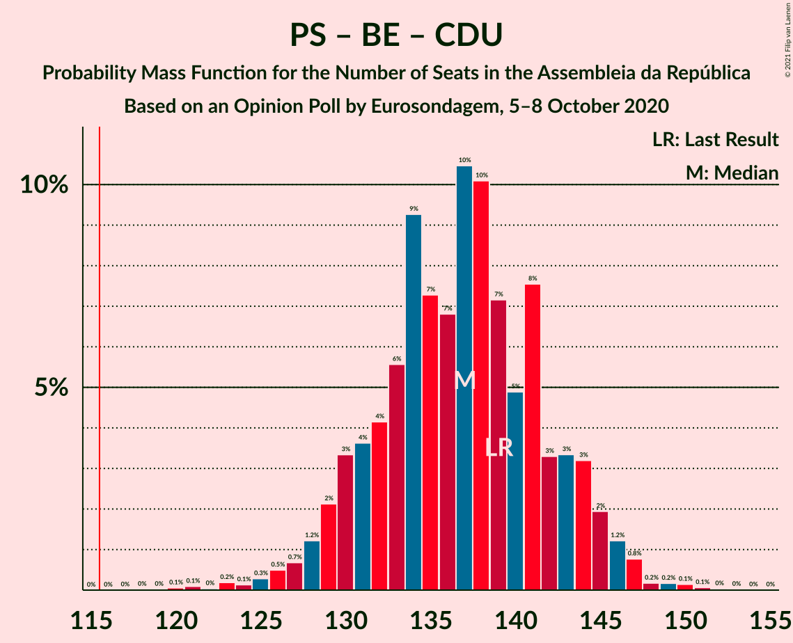
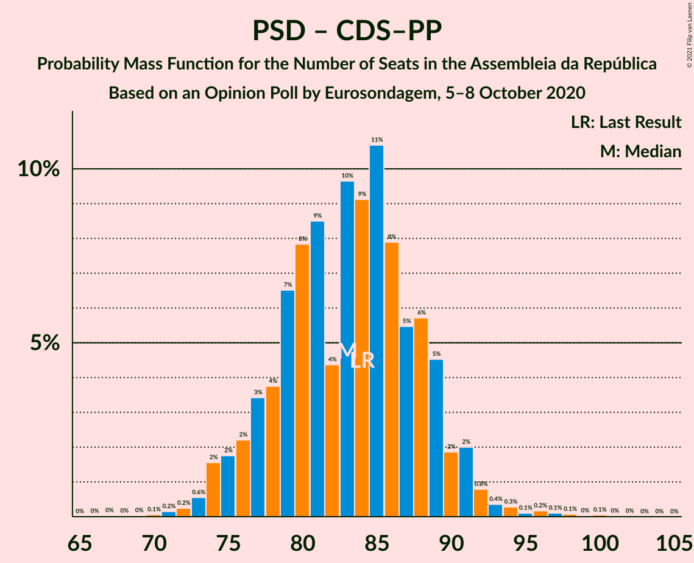

# Opinion Poll by Eurosondagem, 5–8 October 2020

<a href="#voting-intentions">Voting Intentions</a> | <a href="#seats">Seats</a> | <a href="#coalitions">Coalitions</a> | <a href="#technical-information">Technical Information</a>

## Voting Intentions

### Confidence Intervals

| Party | Last Result | Poll Result | 80% Confidence Interval | 90% Confidence Interval | 95% Confidence Interval | 99% Confidence Interval |
|:-----:|:-----------:|:-----------:|:-----------------------:|:-----------------------:|:-----------------------:|:-----------------------:|
| Partido Socialista | 36.4% | 38.8% | 36.9–40.8% |36.3–41.4% |35.8–41.9% |34.9–42.8% |
| Partido Social Democrata | 27.8% | 29.0% | 27.2–30.9% |26.7–31.4% |26.3–31.9% |25.5–32.8% |
| Bloco de Esquerda | 9.5% | 8.1% | 7.1–9.3% |6.8–9.7% |6.6–10.0% |6.1–10.6% |
| Coligação Democrática Unitária | 6.3% | 5.5% | 4.7–6.6% |4.5–6.9% |4.3–7.1% |3.9–7.7% |
| Chega | 1.3% | 4.8% | 4.0–5.7% |3.8–6.0% |3.6–6.2% |3.3–6.8% |
| CDS–Partido Popular | 4.2% | 3.3% | 2.7–4.1% |2.5–4.3% |2.3–4.6% |2.1–5.0% |
| Pessoas–Animais–Natureza | 3.3% | 2.0% | 1.5–2.7% |1.4–2.9% |1.3–3.0% |1.1–3.4% |
| Iniciativa Liberal | 1.3% | 1.3% | 0.9–1.9% |0.8–2.0% |0.7–2.2% |0.6–2.5% |

*Note:* The poll result column reflects the actual value used in the calculations. Published results may vary slightly, and in addition be rounded to fewer digits.

## Seats

### Confidence Intervals

| Party | Last Result | Median | 80% Confidence Interval | 90% Confidence Interval | 95% Confidence Interval | 99% Confidence Interval |
|:-----:|:-----------:|:------:|:-----------------------:|:-----------------------:|:-----------------------:|:-----------------------:|
| <a href="#partido-socialista">Partido Socialista</a> | 108 | 112 | 106–119 |104–119 |103–120 |99–122 |
| <a href="#partido-social-democrata">Partido Social Democrata</a> | 79 | 80 | 74–87 |72–88 |72–88 |70–92 |
| <a href="#bloco-de-esquerda">Bloco de Esquerda</a> | 19 | 16 | 13–19 |12–19 |12–20 |9–21 |
| <a href="#coligação-democrática-unitária">Coligação Democrática Unitária</a> | 12 | 9 | 7–12 |6–14 |6–15 |5–16 |
| <a href="#chega">Chega</a> | 1 | 7 | 4–9 |4–10 |3–11 |3–11 |
| <a href="#cds–partido-popular">CDS–Partido Popular</a> | 5 | 2 | 1–4 |1–4 |1–5 |1–5 |
| <a href="#pessoas–animais–natureza">Pessoas–Animais–Natureza</a> | 4 | 1 | 1–2 |0–3 |0–3 |0–4 |
| <a href="#iniciativa-liberal">Iniciativa Liberal</a> | 1 | 1 | 1–2 |1–3 |0–3 |0–3 |

### Partido Socialista

*For a full overview of the results for this party, see the [Partido Socialista](party-partidosocialista.html) page.*

| Number of Seats | Probability | Accumulated | Special Marks |
|:---------------:|:-----------:|:-----------:|:-------------:|
| 95 | 0.1% | 100% |  |
| 96 | 0% | 99.9% |  |
| 97 | 0% | 99.9% |  |
| 98 | 0.1% | 99.8% |  |
| 99 | 0.8% | 99.8% |  |
| 100 | 0.2% | 99.0% |  |
| 101 | 0.4% | 98.8% |  |
| 102 | 0.6% | 98% |  |
| 103 | 1.1% | 98% |  |
| 104 | 2% | 97% |  |
| 105 | 1.4% | 95% |  |
| 106 | 9% | 94% |  |
| 107 | 4% | 84% |  |
| 108 | 9% | 81% | Last Result |
| 109 | 7% | 71% |  |
| 110 | 9% | 65% |  |
| 111 | 5% | 56% |  |
| 112 | 8% | 51% | Median |
| 113 | 2% | 43% |  |
| 114 | 4% | 41% |  |
| 115 | 8% | 36% |  |
| 116 | 3% | 28% | Majority |
| 117 | 2% | 25% |  |
| 118 | 12% | 23% |  |
| 119 | 7% | 11% |  |
| 120 | 2% | 4% |  |
| 121 | 1.4% | 2% |  |
| 122 | 0.4% | 0.5% |  |
| 123 | 0% | 0.2% |  |
| 124 | 0% | 0.1% |  |
| 125 | 0.1% | 0.1% |  |
| 126 | 0% | 0.1% |  |
| 127 | 0% | 0% |  |

### Partido Social Democrata

*For a full overview of the results for this party, see the [Partido Social Democrata](party-partidosocialdemocrata.html) page.*

| Number of Seats | Probability | Accumulated | Special Marks |
|:---------------:|:-----------:|:-----------:|:-------------:|
| 66 | 0.1% | 100% |  |
| 67 | 0% | 99.9% |  |
| 68 | 0.1% | 99.8% |  |
| 69 | 0.1% | 99.7% |  |
| 70 | 0.2% | 99.6% |  |
| 71 | 0.4% | 99.4% |  |
| 72 | 6% | 99.0% |  |
| 73 | 3% | 93% |  |
| 74 | 3% | 90% |  |
| 75 | 3% | 87% |  |
| 76 | 4% | 84% |  |
| 77 | 6% | 80% |  |
| 78 | 8% | 74% |  |
| 79 | 7% | 66% | Last Result |
| 80 | 9% | 59% | Median |
| 81 | 6% | 50% |  |
| 82 | 11% | 44% |  |
| 83 | 7% | 33% |  |
| 84 | 8% | 26% |  |
| 85 | 2% | 19% |  |
| 86 | 3% | 16% |  |
| 87 | 8% | 14% |  |
| 88 | 3% | 5% |  |
| 89 | 0.9% | 2% |  |
| 90 | 0.9% | 2% |  |
| 91 | 0.1% | 0.7% |  |
| 92 | 0% | 0.5% |  |
| 93 | 0.1% | 0.5% |  |
| 94 | 0.2% | 0.4% |  |
| 95 | 0.1% | 0.2% |  |
| 96 | 0% | 0.2% |  |
| 97 | 0% | 0.1% |  |
| 98 | 0.1% | 0.1% |  |
| 99 | 0% | 0% |  |

### Bloco de Esquerda

*For a full overview of the results for this party, see the [Bloco de Esquerda](party-blocodeesquerda.html) page.*

| Number of Seats | Probability | Accumulated | Special Marks |
|:---------------:|:-----------:|:-----------:|:-------------:|
| 8 | 0.1% | 100% |  |
| 9 | 0.6% | 99.9% |  |
| 10 | 0.4% | 99.3% |  |
| 11 | 1.0% | 98.9% |  |
| 12 | 3% | 98% |  |
| 13 | 6% | 94% |  |
| 14 | 7% | 89% |  |
| 15 | 24% | 82% |  |
| 16 | 31% | 57% | Median |
| 17 | 7% | 26% |  |
| 18 | 2% | 19% |  |
| 19 | 13% | 17% | Last Result |
| 20 | 3% | 4% |  |
| 21 | 0.5% | 0.8% |  |
| 22 | 0.2% | 0.3% |  |
| 23 | 0.1% | 0.1% |  |
| 24 | 0% | 0% |  |

### Coligação Democrática Unitária

*For a full overview of the results for this party, see the [Coligação Democrática Unitária](party-coligaçãodemocráticaunitária.html) page.*

| Number of Seats | Probability | Accumulated | Special Marks |
|:---------------:|:-----------:|:-----------:|:-------------:|
| 5 | 2% | 100% |  |
| 6 | 7% | 98% |  |
| 7 | 18% | 90% |  |
| 8 | 19% | 72% |  |
| 9 | 20% | 54% | Median |
| 10 | 13% | 34% |  |
| 11 | 5% | 20% |  |
| 12 | 9% | 15% | Last Result |
| 13 | 2% | 7% |  |
| 14 | 1.4% | 5% |  |
| 15 | 3% | 4% |  |
| 16 | 0.9% | 0.9% |  |
| 17 | 0.1% | 0.1% |  |
| 18 | 0% | 0% |  |

### Chega

*For a full overview of the results for this party, see the [Chega](party-chega.html) page.*

| Number of Seats | Probability | Accumulated | Special Marks |
|:---------------:|:-----------:|:-----------:|:-------------:|
| 1 | 0% | 100% | Last Result |
| 2 | 0% | 100% |  |
| 3 | 3% | 100% |  |
| 4 | 31% | 97% |  |
| 5 | 5% | 67% |  |
| 6 | 6% | 62% |  |
| 7 | 8% | 56% | Median |
| 8 | 38% | 48% |  |
| 9 | 4% | 11% |  |
| 10 | 3% | 7% |  |
| 11 | 4% | 4% |  |
| 12 | 0% | 0% |  |

### CDS–Partido Popular

*For a full overview of the results for this party, see the [CDS–Partido Popular](party-cds–partidopopular.html) page.*

| Number of Seats | Probability | Accumulated | Special Marks |
|:---------------:|:-----------:|:-----------:|:-------------:|
| 0 | 0.1% | 100% |  |
| 1 | 11% | 99.9% |  |
| 2 | 55% | 89% | Median |
| 3 | 5% | 34% |  |
| 4 | 24% | 29% |  |
| 5 | 4% | 5% | Last Result |
| 6 | 0% | 0.2% |  |
| 7 | 0% | 0.2% |  |
| 8 | 0.1% | 0.2% |  |
| 9 | 0% | 0% |  |

### Pessoas–Animais–Natureza

*For a full overview of the results for this party, see the [Pessoas–Animais–Natureza](party-pessoas–animais–natureza.html) page.*

| Number of Seats | Probability | Accumulated | Special Marks |
|:---------------:|:-----------:|:-----------:|:-------------:|
| 0 | 7% | 100% |  |
| 1 | 53% | 93% | Median |
| 2 | 32% | 41% |  |
| 3 | 8% | 9% |  |
| 4 | 1.0% | 1.0% | Last Result |
| 5 | 0% | 0% |  |

### Iniciativa Liberal

*For a full overview of the results for this party, see the [Iniciativa Liberal](party-iniciativaliberal.html) page.*

| Number of Seats | Probability | Accumulated | Special Marks |
|:---------------:|:-----------:|:-----------:|:-------------:|
| 0 | 5% | 100% |  |
| 1 | 80% | 95% | Last Result, Median |
| 2 | 9% | 15% |  |
| 3 | 6% | 6% |  |
| 4 | 0% | 0% |  |

## Coalitions

### Confidence Intervals

| Coalition | Last Result | Median | Majority? | 80% Confidence Interval | 90% Confidence Interval | 95% Confidence Interval | 99% Confidence Interval |
|:---------:|:-----------:|:------:|:---------:|:-----------------------:|:-----------------------:|:-----------------------:|:-----------------------:|
| Partido Socialista – Bloco de Esquerda – Coligação Democrática Unitária | 139 | 138 | 100% | 130–144 | 130–145 | 128–146 | 125–147 |
| Partido Socialista – Bloco de Esquerda | 127 | 128 | 99.6% | 121–135 | 120–136 | 119–137 | 117–137 |
| Partido Socialista – Coligação Democrática Unitária | 120 | 121 | 87% | 115–128 | 115–129 | 111–129 | 108–132 |
| Partido Socialista | 108 | 112 | 28% | 106–119 | 104–119 | 103–120 | 99–122 |
| Partido Social Democrata – CDS–Partido Popular | 84 | 83 | 0% | 76–89 | 74–90 | 74–91 | 73–95 |

### Partido Socialista – Bloco de Esquerda – Coligação Democrática Unitária

| Number of Seats | Probability | Accumulated | Special Marks |
|:---------------:|:-----------:|:-----------:|:-------------:|
| 119 | 0.1% | 100% |  |
| 120 | 0% | 99.9% |  |
| 121 | 0.1% | 99.9% |  |
| 122 | 0.1% | 99.8% |  |
| 123 | 0.1% | 99.8% |  |
| 124 | 0.1% | 99.7% |  |
| 125 | 0.2% | 99.6% |  |
| 126 | 0.2% | 99.3% |  |
| 127 | 1.4% | 99.2% |  |
| 128 | 2% | 98% |  |
| 129 | 0.9% | 96% |  |
| 130 | 7% | 95% |  |
| 131 | 9% | 88% |  |
| 132 | 4% | 80% |  |
| 133 | 3% | 76% |  |
| 134 | 3% | 73% |  |
| 135 | 9% | 69% |  |
| 136 | 5% | 61% |  |
| 137 | 4% | 56% | Median |
| 138 | 19% | 52% |  |
| 139 | 6% | 33% | Last Result |
| 140 | 5% | 28% |  |
| 141 | 2% | 23% |  |
| 142 | 8% | 21% |  |
| 143 | 2% | 13% |  |
| 144 | 3% | 12% |  |
| 145 | 7% | 9% |  |
| 146 | 0.1% | 3% |  |
| 147 | 2% | 2% |  |
| 148 | 0.2% | 0.4% |  |
| 149 | 0.1% | 0.3% |  |
| 150 | 0.1% | 0.2% |  |
| 151 | 0% | 0.1% |  |
| 152 | 0% | 0.1% |  |
| 153 | 0% | 0% |  |

### Partido Socialista – Bloco de Esquerda

| Number of Seats | Probability | Accumulated | Special Marks |
|:---------------:|:-----------:|:-----------:|:-------------:|
| 110 | 0% | 100% |  |
| 111 | 0% | 99.9% |  |
| 112 | 0.1% | 99.9% |  |
| 113 | 0% | 99.8% |  |
| 114 | 0.1% | 99.8% |  |
| 115 | 0.1% | 99.7% |  |
| 116 | 0.1% | 99.6% | Majority |
| 117 | 0.2% | 99.5% |  |
| 118 | 0.4% | 99.3% |  |
| 119 | 3% | 98.9% |  |
| 120 | 2% | 96% |  |
| 121 | 9% | 95% |  |
| 122 | 2% | 86% |  |
| 123 | 14% | 83% |  |
| 124 | 2% | 70% |  |
| 125 | 2% | 68% |  |
| 126 | 11% | 65% |  |
| 127 | 3% | 54% | Last Result |
| 128 | 3% | 51% | Median |
| 129 | 3% | 48% |  |
| 130 | 5% | 45% |  |
| 131 | 11% | 39% |  |
| 132 | 7% | 29% |  |
| 133 | 6% | 22% |  |
| 134 | 4% | 16% |  |
| 135 | 7% | 12% |  |
| 136 | 2% | 6% |  |
| 137 | 3% | 3% |  |
| 138 | 0.1% | 0.3% |  |
| 139 | 0.1% | 0.2% |  |
| 140 | 0% | 0.1% |  |
| 141 | 0.1% | 0.1% |  |
| 142 | 0% | 0% |  |

### Partido Socialista – Coligação Democrática Unitária

| Number of Seats | Probability | Accumulated | Special Marks |
|:---------------:|:-----------:|:-----------:|:-------------:|
| 103 | 0% | 100% |  |
| 104 | 0% | 99.9% |  |
| 105 | 0.1% | 99.9% |  |
| 106 | 0.1% | 99.9% |  |
| 107 | 0.2% | 99.8% |  |
| 108 | 0.8% | 99.6% |  |
| 109 | 0.2% | 98.8% |  |
| 110 | 0.2% | 98.6% |  |
| 111 | 1.1% | 98% |  |
| 112 | 1.1% | 97% |  |
| 113 | 0.4% | 96% |  |
| 114 | 0.4% | 96% |  |
| 115 | 8% | 95% |  |
| 116 | 10% | 87% | Majority |
| 117 | 5% | 78% |  |
| 118 | 2% | 73% |  |
| 119 | 13% | 71% |  |
| 120 | 4% | 57% | Last Result |
| 121 | 7% | 53% | Median |
| 122 | 10% | 46% |  |
| 123 | 3% | 36% |  |
| 124 | 9% | 33% |  |
| 125 | 3% | 24% |  |
| 126 | 3% | 21% |  |
| 127 | 7% | 18% |  |
| 128 | 3% | 11% |  |
| 129 | 6% | 8% |  |
| 130 | 2% | 2% |  |
| 131 | 0.2% | 0.7% |  |
| 132 | 0.2% | 0.5% |  |
| 133 | 0.1% | 0.3% |  |
| 134 | 0.1% | 0.2% |  |
| 135 | 0% | 0.1% |  |
| 136 | 0% | 0% |  |

### Partido Socialista

| Number of Seats | Probability | Accumulated | Special Marks |
|:---------------:|:-----------:|:-----------:|:-------------:|
| 95 | 0.1% | 100% |  |
| 96 | 0% | 99.9% |  |
| 97 | 0% | 99.9% |  |
| 98 | 0.1% | 99.8% |  |
| 99 | 0.8% | 99.8% |  |
| 100 | 0.2% | 99.0% |  |
| 101 | 0.4% | 98.8% |  |
| 102 | 0.6% | 98% |  |
| 103 | 1.1% | 98% |  |
| 104 | 2% | 97% |  |
| 105 | 1.4% | 95% |  |
| 106 | 9% | 94% |  |
| 107 | 4% | 84% |  |
| 108 | 9% | 81% | Last Result |
| 109 | 7% | 71% |  |
| 110 | 9% | 65% |  |
| 111 | 5% | 56% |  |
| 112 | 8% | 51% | Median |
| 113 | 2% | 43% |  |
| 114 | 4% | 41% |  |
| 115 | 8% | 36% |  |
| 116 | 3% | 28% | Majority |
| 117 | 2% | 25% |  |
| 118 | 12% | 23% |  |
| 119 | 7% | 11% |  |
| 120 | 2% | 4% |  |
| 121 | 1.4% | 2% |  |
| 122 | 0.4% | 0.5% |  |
| 123 | 0% | 0.2% |  |
| 124 | 0% | 0.1% |  |
| 125 | 0.1% | 0.1% |  |
| 126 | 0% | 0.1% |  |
| 127 | 0% | 0% |  |

### Partido Social Democrata – CDS–Partido Popular

| Number of Seats | Probability | Accumulated | Special Marks |
|:---------------:|:-----------:|:-----------:|:-------------:|
| 68 | 0.1% | 100% |  |
| 69 | 0% | 99.9% |  |
| 70 | 0.1% | 99.9% |  |
| 71 | 0% | 99.8% |  |
| 72 | 0.2% | 99.7% |  |
| 73 | 0.3% | 99.6% |  |
| 74 | 6% | 99.3% |  |
| 75 | 1.5% | 93% |  |
| 76 | 4% | 91% |  |
| 77 | 2% | 88% |  |
| 78 | 4% | 86% |  |
| 79 | 5% | 82% |  |
| 80 | 6% | 78% |  |
| 81 | 15% | 71% |  |
| 82 | 5% | 57% | Median |
| 83 | 3% | 52% |  |
| 84 | 7% | 49% | Last Result |
| 85 | 8% | 42% |  |
| 86 | 8% | 34% |  |
| 87 | 3% | 26% |  |
| 88 | 7% | 23% |  |
| 89 | 10% | 16% |  |
| 90 | 3% | 6% |  |
| 91 | 2% | 3% |  |
| 92 | 0.3% | 2% |  |
| 93 | 0.4% | 1.3% |  |
| 94 | 0.3% | 0.9% |  |
| 95 | 0.1% | 0.5% |  |
| 96 | 0.1% | 0.4% |  |
| 97 | 0% | 0.3% |  |
| 98 | 0.1% | 0.2% |  |
| 99 | 0.1% | 0.2% |  |
| 100 | 0% | 0.1% |  |
| 101 | 0% | 0.1% |  |
| 102 | 0% | 0% |  |

## Technical Information

### Opinion Poll

+ **Polling firm:** Eurosondagem
+ **Commissioner(s):** —
+ **Fieldwork period:** 5–8 October 2020

### Calculations

+ **Sample size:** 1010
+ **Simulations done:** 131,072
+ **Error estimate:** 2.80%

