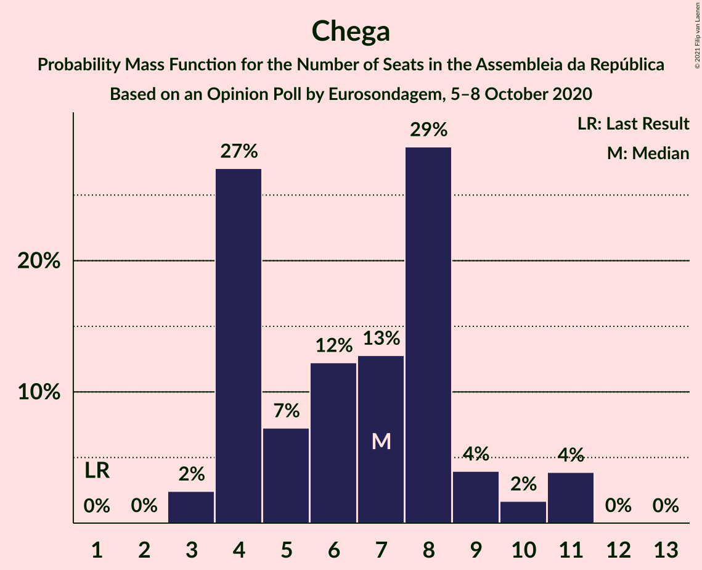

# Opinion Poll by Eurosondagem, 5–8 October 2020

<a href="#voting-intentions">Voting Intentions</a> | <a href="#seats">Seats</a> | <a href="#coalitions">Coalitions</a> | <a href="#technical-information">Technical Information</a>

## Voting Intentions

### Confidence Intervals

| Party | Last Result | Poll Result | 80% Confidence Interval | 90% Confidence Interval | 95% Confidence Interval | 99% Confidence Interval |
|:-----:|:-----------:|:-----------:|:-----------------------:|:-----------------------:|:-----------------------:|:-----------------------:|
| Partido Socialista | 36.4% | 38.8% | 36.9–40.8% |36.3–41.4% |35.8–41.9% |34.9–42.8% |
| Partido Social Democrata | 27.8% | 29.0% | 27.2–30.9% |26.7–31.4% |26.3–31.9% |25.5–32.8% |
| Bloco de Esquerda | 9.5% | 8.1% | 7.1–9.3% |6.8–9.7% |6.6–10.0% |6.1–10.6% |
| Coligação Democrática Unitária | 6.3% | 5.5% | 4.7–6.6% |4.5–6.9% |4.3–7.1% |3.9–7.7% |
| Chega | 1.3% | 4.8% | 4.0–5.7% |3.8–6.0% |3.6–6.2% |3.3–6.8% |
| CDS–Partido Popular | 4.2% | 3.3% | 2.7–4.1% |2.5–4.3% |2.3–4.6% |2.1–5.0% |
| Pessoas–Animais–Natureza | 3.3% | 2.0% | 1.5–2.7% |1.4–2.9% |1.3–3.0% |1.1–3.4% |
| Iniciativa Liberal | 1.3% | 1.3% | 0.9–1.9% |0.8–2.0% |0.7–2.2% |0.6–2.5% |

*Note:* The poll result column reflects the actual value used in the calculations. Published results may vary slightly, and in addition be rounded to fewer digits.

## Seats

### Confidence Intervals

| Party | Last Result | Median | 80% Confidence Interval | 90% Confidence Interval | 95% Confidence Interval | 99% Confidence Interval |
|:-----:|:-----------:|:------:|:-----------------------:|:-----------------------:|:-----------------------:|:-----------------------:|
| <a href="#partido-socialista">Partido Socialista</a> | 108 | 112 | 106–118 |105–119 |103–120 |99–122 |
| <a href="#partido-social-democrata">Partido Social Democrata</a> | 79 | 80 | 74–86 |73–87 |72–89 |70–92 |
| <a href="#bloco-de-esquerda">Bloco de Esquerda</a> | 19 | 16 | 13–19 |12–19 |11–20 |10–21 |
| <a href="#coligação-democrática-unitária">Coligação Democrática Unitária</a> | 12 | 9 | 7–12 |6–13 |6–15 |5–16 |
| <a href="#chega">Chega</a> | 1 | 6 | 4–8 |4–10 |3–11 |3–11 |
| <a href="#cds–partido-popular">CDS–Partido Popular</a> | 5 | 2 | 1–4 |1–5 |1–5 |1–5 |
| <a href="#pessoas–animais–natureza">Pessoas–Animais–Natureza</a> | 4 | 1 | 1–2 |0–3 |0–3 |0–4 |
| <a href="#iniciativa-liberal">Iniciativa Liberal</a> | 1 | 1 | 0–2 |0–3 |0–3 |0–3 |

### Partido Socialista

*For a full overview of the results for this party, see the [Partido Socialista](party-partidosocialista.html) page.*

| Number of Seats | Probability | Accumulated | Special Marks |
|:---------------:|:-----------:|:-----------:|:-------------:|
| 95 | 0.1% | 100% |  |
| 96 | 0% | 99.9% |  |
| 97 | 0.1% | 99.8% |  |
| 98 | 0.1% | 99.8% |  |
| 99 | 0.5% | 99.7% |  |
| 100 | 0.3% | 99.2% |  |
| 101 | 0.5% | 99.0% |  |
| 102 | 1.0% | 98.5% |  |
| 103 | 0.7% | 98% |  |
| 104 | 1.2% | 97% |  |
| 105 | 2% | 96% |  |
| 106 | 5% | 94% |  |
| 107 | 5% | 89% |  |
| 108 | 6% | 84% | Last Result |
| 109 | 6% | 78% |  |
| 110 | 12% | 72% |  |
| 111 | 7% | 61% |  |
| 112 | 7% | 54% | Median |
| 113 | 9% | 47% |  |
| 114 | 7% | 38% |  |
| 115 | 9% | 31% |  |
| 116 | 4% | 21% | Majority |
| 117 | 3% | 17% |  |
| 118 | 7% | 14% |  |
| 119 | 3% | 7% |  |
| 120 | 2% | 4% |  |
| 121 | 1.0% | 2% |  |
| 122 | 0.6% | 0.9% |  |
| 123 | 0.1% | 0.3% |  |
| 124 | 0% | 0.2% |  |
| 125 | 0% | 0.1% |  |
| 126 | 0% | 0.1% |  |
| 127 | 0% | 0.1% |  |
| 128 | 0% | 0% |  |

### Partido Social Democrata

*For a full overview of the results for this party, see the [Partido Social Democrata](party-partidosocialdemocrata.html) page.*

| Number of Seats | Probability | Accumulated | Special Marks |
|:---------------:|:-----------:|:-----------:|:-------------:|
| 66 | 0% | 100% |  |
| 67 | 0.1% | 99.9% |  |
| 68 | 0.1% | 99.9% |  |
| 69 | 0.3% | 99.8% |  |
| 70 | 0.3% | 99.5% |  |
| 71 | 0.8% | 99.3% |  |
| 72 | 2% | 98% |  |
| 73 | 4% | 97% |  |
| 74 | 3% | 93% |  |
| 75 | 6% | 89% |  |
| 76 | 5% | 84% |  |
| 77 | 6% | 79% |  |
| 78 | 10% | 74% |  |
| 79 | 6% | 64% | Last Result |
| 80 | 11% | 58% | Median |
| 81 | 6% | 47% |  |
| 82 | 6% | 41% |  |
| 83 | 13% | 35% |  |
| 84 | 6% | 22% |  |
| 85 | 4% | 16% |  |
| 86 | 4% | 12% |  |
| 87 | 4% | 8% |  |
| 88 | 1.4% | 4% |  |
| 89 | 1.3% | 3% |  |
| 90 | 0.8% | 2% |  |
| 91 | 0.1% | 0.7% |  |
| 92 | 0.1% | 0.6% |  |
| 93 | 0.1% | 0.5% |  |
| 94 | 0.1% | 0.4% |  |
| 95 | 0.1% | 0.3% |  |
| 96 | 0.1% | 0.2% |  |
| 97 | 0% | 0.1% |  |
| 98 | 0% | 0% |  |

### Bloco de Esquerda

*For a full overview of the results for this party, see the [Bloco de Esquerda](party-blocodeesquerda.html) page.*

| Number of Seats | Probability | Accumulated | Special Marks |
|:---------------:|:-----------:|:-----------:|:-------------:|
| 8 | 0.1% | 100% |  |
| 9 | 0.3% | 99.9% |  |
| 10 | 0.5% | 99.6% |  |
| 11 | 2% | 99.1% |  |
| 12 | 3% | 97% |  |
| 13 | 5% | 95% |  |
| 14 | 6% | 90% |  |
| 15 | 23% | 83% |  |
| 16 | 34% | 60% | Median |
| 17 | 6% | 26% |  |
| 18 | 5% | 20% |  |
| 19 | 12% | 15% | Last Result |
| 20 | 2% | 3% |  |
| 21 | 1.1% | 1.4% |  |
| 22 | 0.1% | 0.3% |  |
| 23 | 0.1% | 0.2% |  |
| 24 | 0% | 0% |  |

### Coligação Democrática Unitária

*For a full overview of the results for this party, see the [Coligação Democrática Unitária](party-coligaçãodemocráticaunitária.html) page.*

| Number of Seats | Probability | Accumulated | Special Marks |
|:---------------:|:-----------:|:-----------:|:-------------:|
| 5 | 1.5% | 100% |  |
| 6 | 6% | 98% |  |
| 7 | 16% | 92% |  |
| 8 | 25% | 76% |  |
| 9 | 14% | 51% | Median |
| 10 | 12% | 37% |  |
| 11 | 8% | 25% |  |
| 12 | 8% | 17% | Last Result |
| 13 | 4% | 8% |  |
| 14 | 2% | 4% |  |
| 15 | 2% | 3% |  |
| 16 | 0.7% | 0.8% |  |
| 17 | 0.1% | 0.1% |  |
| 18 | 0% | 0% |  |

### Chega

*For a full overview of the results for this party, see the [Chega](party-chega.html) page.*

| Number of Seats | Probability | Accumulated | Special Marks |
|:---------------:|:-----------:|:-----------:|:-------------:|
| 1 | 0% | 100% | Last Result |
| 2 | 0% | 100% |  |
| 3 | 3% | 100% |  |
| 4 | 25% | 97% |  |
| 5 | 9% | 72% |  |
| 6 | 14% | 64% | Median |
| 7 | 11% | 49% |  |
| 8 | 29% | 39% |  |
| 9 | 4% | 10% |  |
| 10 | 2% | 6% |  |
| 11 | 4% | 4% |  |
| 12 | 0% | 0.1% |  |
| 13 | 0% | 0% |  |

### CDS–Partido Popular

*For a full overview of the results for this party, see the [CDS–Partido Popular](party-cds–partidopopular.html) page.*

| Number of Seats | Probability | Accumulated | Special Marks |
|:---------------:|:-----------:|:-----------:|:-------------:|
| 1 | 13% | 100% |  |
| 2 | 49% | 87% | Median |
| 3 | 4% | 38% |  |
| 4 | 25% | 34% |  |
| 5 | 9% | 9% | Last Result |
| 6 | 0% | 0.2% |  |
| 7 | 0% | 0.1% |  |
| 8 | 0.1% | 0.1% |  |
| 9 | 0% | 0% |  |

### Pessoas–Animais–Natureza

*For a full overview of the results for this party, see the [Pessoas–Animais–Natureza](party-pessoas–animais–natureza.html) page.*

| Number of Seats | Probability | Accumulated | Special Marks |
|:---------------:|:-----------:|:-----------:|:-------------:|
| 0 | 6% | 100% |  |
| 1 | 45% | 94% | Median |
| 2 | 42% | 49% |  |
| 3 | 7% | 8% |  |
| 4 | 1.3% | 1.4% | Last Result |
| 5 | 0% | 0% |  |

### Iniciativa Liberal

*For a full overview of the results for this party, see the [Iniciativa Liberal](party-iniciativaliberal.html) page.*

| Number of Seats | Probability | Accumulated | Special Marks |
|:---------------:|:-----------:|:-----------:|:-------------:|
| 0 | 12% | 100% |  |
| 1 | 74% | 88% | Last Result, Median |
| 2 | 6% | 14% |  |
| 3 | 8% | 8% |  |
| 4 | 0% | 0% |  |

## Coalitions

### Confidence Intervals

| Coalition | Last Result | Median | Majority? | 80% Confidence Interval | 90% Confidence Interval | 95% Confidence Interval | 99% Confidence Interval |
|:---------:|:-----------:|:------:|:---------:|:-----------------------:|:-----------------------:|:-----------------------:|:-----------------------:|
| Partido Socialista – Bloco de Esquerda – Coligação Democrática Unitária | 139 | 137 | 100% | 131–143 | 129–145 | 128–145 | 125–148 |
| Partido Socialista – Bloco de Esquerda | 127 | 128 | 99.3% | 122–134 | 121–135 | 119–137 | 115–139 |
| Partido Socialista – Coligação Democrática Unitária | 120 | 121 | 88% | 115–127 | 114–129 | 112–130 | 108–132 |
| Partido Socialista | 108 | 112 | 21% | 106–118 | 105–119 | 103–120 | 99–122 |
| Partido Social Democrata – CDS–Partido Popular | 84 | 83 | 0% | 77–89 | 76–90 | 74–91 | 72–95 |

### Partido Socialista – Bloco de Esquerda – Coligação Democrática Unitária

| Number of Seats | Probability | Accumulated | Special Marks |
|:---------------:|:-----------:|:-----------:|:-------------:|
| 119 | 0% | 100% |  |
| 120 | 0.1% | 99.9% |  |
| 121 | 0.1% | 99.9% |  |
| 122 | 0% | 99.8% |  |
| 123 | 0.1% | 99.8% |  |
| 124 | 0.2% | 99.7% |  |
| 125 | 0.4% | 99.5% |  |
| 126 | 0.4% | 99.1% |  |
| 127 | 0.8% | 98.7% |  |
| 128 | 1.0% | 98% |  |
| 129 | 2% | 97% |  |
| 130 | 3% | 95% |  |
| 131 | 6% | 92% |  |
| 132 | 3% | 86% |  |
| 133 | 4% | 83% |  |
| 134 | 11% | 79% |  |
| 135 | 6% | 69% |  |
| 136 | 7% | 63% |  |
| 137 | 10% | 56% | Median |
| 138 | 10% | 46% |  |
| 139 | 5% | 36% | Last Result |
| 140 | 4% | 31% |  |
| 141 | 10% | 27% |  |
| 142 | 4% | 16% |  |
| 143 | 4% | 13% |  |
| 144 | 4% | 9% |  |
| 145 | 3% | 5% |  |
| 146 | 0.4% | 2% |  |
| 147 | 1.3% | 2% |  |
| 148 | 0.1% | 0.5% |  |
| 149 | 0.2% | 0.4% |  |
| 150 | 0.1% | 0.2% |  |
| 151 | 0% | 0.1% |  |
| 152 | 0% | 0.1% |  |
| 153 | 0% | 0.1% |  |
| 154 | 0% | 0% |  |

### Partido Socialista – Bloco de Esquerda

| Number of Seats | Probability | Accumulated | Special Marks |
|:---------------:|:-----------:|:-----------:|:-------------:|
| 110 | 0% | 100% |  |
| 111 | 0.1% | 99.9% |  |
| 112 | 0.1% | 99.9% |  |
| 113 | 0.1% | 99.8% |  |
| 114 | 0.1% | 99.7% |  |
| 115 | 0.3% | 99.6% |  |
| 116 | 0.4% | 99.3% | Majority |
| 117 | 0.6% | 98.9% |  |
| 118 | 0.5% | 98% |  |
| 119 | 1.0% | 98% |  |
| 120 | 2% | 97% |  |
| 121 | 5% | 95% |  |
| 122 | 3% | 90% |  |
| 123 | 7% | 87% |  |
| 124 | 3% | 81% |  |
| 125 | 4% | 77% |  |
| 126 | 12% | 73% |  |
| 127 | 6% | 62% | Last Result |
| 128 | 6% | 55% | Median |
| 129 | 13% | 49% |  |
| 130 | 6% | 36% |  |
| 131 | 9% | 31% |  |
| 132 | 6% | 21% |  |
| 133 | 5% | 15% |  |
| 134 | 4% | 10% |  |
| 135 | 3% | 7% |  |
| 136 | 1.5% | 4% |  |
| 137 | 1.2% | 3% |  |
| 138 | 0.7% | 1.3% |  |
| 139 | 0.3% | 0.5% |  |
| 140 | 0.1% | 0.2% |  |
| 141 | 0% | 0.1% |  |
| 142 | 0% | 0.1% |  |
| 143 | 0% | 0.1% |  |
| 144 | 0% | 0% |  |

### Partido Socialista – Coligação Democrática Unitária

| Number of Seats | Probability | Accumulated | Special Marks |
|:---------------:|:-----------:|:-----------:|:-------------:|
| 103 | 0.1% | 100% |  |
| 104 | 0% | 99.9% |  |
| 105 | 0.1% | 99.9% |  |
| 106 | 0.1% | 99.8% |  |
| 107 | 0.1% | 99.8% |  |
| 108 | 0.3% | 99.7% |  |
| 109 | 0.3% | 99.4% |  |
| 110 | 0.5% | 99.1% |  |
| 111 | 0.8% | 98.5% |  |
| 112 | 0.9% | 98% |  |
| 113 | 2% | 97% |  |
| 114 | 2% | 95% |  |
| 115 | 5% | 93% |  |
| 116 | 5% | 88% | Majority |
| 117 | 4% | 83% |  |
| 118 | 10% | 80% |  |
| 119 | 9% | 70% |  |
| 120 | 8% | 61% | Last Result |
| 121 | 7% | 53% | Median |
| 122 | 9% | 46% |  |
| 123 | 3% | 37% |  |
| 124 | 5% | 34% |  |
| 125 | 11% | 29% |  |
| 126 | 5% | 17% |  |
| 127 | 4% | 13% |  |
| 128 | 3% | 9% |  |
| 129 | 4% | 6% |  |
| 130 | 1.2% | 3% |  |
| 131 | 0.9% | 2% |  |
| 132 | 0.4% | 0.8% |  |
| 133 | 0.1% | 0.4% |  |
| 134 | 0.2% | 0.3% |  |
| 135 | 0% | 0.1% |  |
| 136 | 0% | 0.1% |  |
| 137 | 0% | 0% |  |

### Partido Socialista

| Number of Seats | Probability | Accumulated | Special Marks |
|:---------------:|:-----------:|:-----------:|:-------------:|
| 95 | 0.1% | 100% |  |
| 96 | 0% | 99.9% |  |
| 97 | 0.1% | 99.8% |  |
| 98 | 0.1% | 99.8% |  |
| 99 | 0.5% | 99.7% |  |
| 100 | 0.3% | 99.2% |  |
| 101 | 0.5% | 99.0% |  |
| 102 | 1.0% | 98.5% |  |
| 103 | 0.7% | 98% |  |
| 104 | 1.2% | 97% |  |
| 105 | 2% | 96% |  |
| 106 | 5% | 94% |  |
| 107 | 5% | 89% |  |
| 108 | 6% | 84% | Last Result |
| 109 | 6% | 78% |  |
| 110 | 12% | 72% |  |
| 111 | 7% | 61% |  |
| 112 | 7% | 54% | Median |
| 113 | 9% | 47% |  |
| 114 | 7% | 38% |  |
| 115 | 9% | 31% |  |
| 116 | 4% | 21% | Majority |
| 117 | 3% | 17% |  |
| 118 | 7% | 14% |  |
| 119 | 3% | 7% |  |
| 120 | 2% | 4% |  |
| 121 | 1.0% | 2% |  |
| 122 | 0.6% | 0.9% |  |
| 123 | 0.1% | 0.3% |  |
| 124 | 0% | 0.2% |  |
| 125 | 0% | 0.1% |  |
| 126 | 0% | 0.1% |  |
| 127 | 0% | 0.1% |  |
| 128 | 0% | 0% |  |

### Partido Social Democrata – CDS–Partido Popular

| Number of Seats | Probability | Accumulated | Special Marks |
|:---------------:|:-----------:|:-----------:|:-------------:|
| 68 | 0% | 100% |  |
| 69 | 0% | 99.9% |  |
| 70 | 0.1% | 99.9% |  |
| 71 | 0.2% | 99.8% |  |
| 72 | 0.2% | 99.6% |  |
| 73 | 0.5% | 99.5% |  |
| 74 | 2% | 98.9% |  |
| 75 | 1.3% | 97% |  |
| 76 | 3% | 96% |  |
| 77 | 4% | 93% |  |
| 78 | 5% | 89% |  |
| 79 | 7% | 84% |  |
| 80 | 10% | 76% |  |
| 81 | 7% | 67% |  |
| 82 | 6% | 60% | Median |
| 83 | 5% | 54% |  |
| 84 | 7% | 49% | Last Result |
| 85 | 15% | 42% |  |
| 86 | 6% | 27% |  |
| 87 | 5% | 21% |  |
| 88 | 5% | 16% |  |
| 89 | 4% | 11% |  |
| 90 | 3% | 7% |  |
| 91 | 2% | 4% |  |
| 92 | 0.8% | 2% |  |
| 93 | 0.3% | 1.0% |  |
| 94 | 0.2% | 0.7% |  |
| 95 | 0.1% | 0.6% |  |
| 96 | 0.1% | 0.4% |  |
| 97 | 0.1% | 0.3% |  |
| 98 | 0.1% | 0.2% |  |
| 99 | 0% | 0.1% |  |
| 100 | 0.1% | 0.1% |  |
| 101 | 0% | 0% |  |

## Technical Information

### Opinion Poll

+ **Polling firm:** Eurosondagem
+ **Commissioner(s):** —
+ **Fieldwork period:** 5–8 October 2020

### Calculations

+ **Sample size:** 1010
+ **Simulations done:** 524,288
+ **Error estimate:** 1.31%

